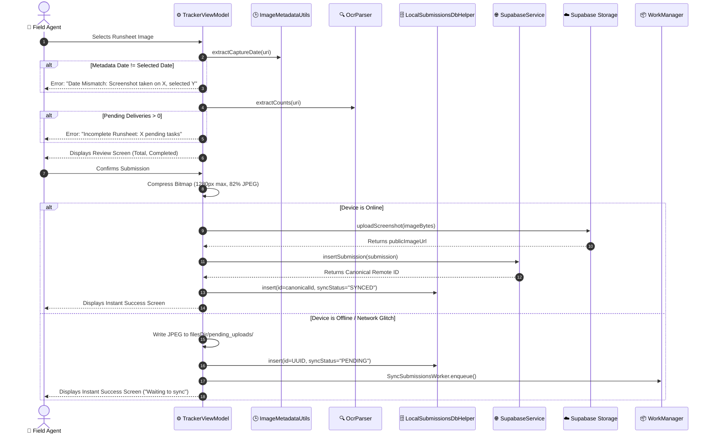
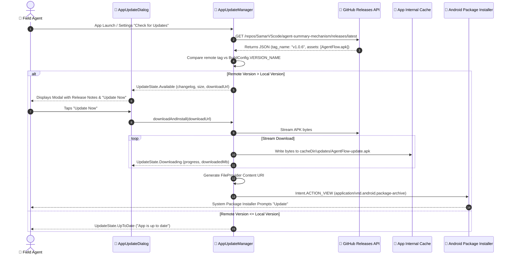

# AgentFlow-Android
> **Native Android Runsheet Tracker & Field Payout Application** — Component Specification & Architecture Reference

---

## 1. Overview
`AgentFlow-Android` is a high-reliability native Android application (`com.agentflow.tracker`, v1.0.6, versionCode 7) built for warehouse delivery agents and logistics field personnel. It automates daily work proof verification, cycle earnings calculation, and leave management directly on mobile devices. The app eliminates manual delivery tallying and fraudulent or misdated claims through an on-device computer vision pipeline using Google ML Kit OCR, binary EXIF/MediaStore capture date verification, and client-side SHA-256 deduplication. Built on an offline-first architecture with local SQLite storage (`LocalSubmissionsDbHelper`) and AndroidX WorkManager background synchronization, field agents can record runsheets in zero-connectivity environments with immediate UI confirmation, while enjoying seamless in-place updates via an integrated GitHub Releases auto-updater backed by a permanent cryptographic release keystore.

---

## 2. Tech Stack

| Layer | Technology | Version | Purpose & Architectural Notes |
|---|---|---|---|
| **Language** | Kotlin | `2.1.0` (JVM Toolchain 17) | Modern type-safe Kotlin with coroutines and Flow bindings *(stated)*. |
| **Build Tool / AGP** | Android Gradle Plugin (AGP) / Gradle | AGP `8.8.0` / Gradle 8.10.2 | Configured with centralized version catalog `gradle/libs.versions.toml`. |
| **Target SDKs** | Android SDK | compileSdk: `35`, minSdk: `26`, targetSdk: `35` | Supports Android 8.0 (Oreo) up to Android 15. |
| **UI Framework** | Jetpack Compose / Material 3 | Compose BOM `2025.02.00` | Modern declarative UI, edge-to-edge rendering, Material 3 theming. |
| **Navigation** | Navigation Compose | `2.8.7` | Single `NavHost` with animated transitions and tab backstack preservation. |
| **Local Database** | SQLite (`SQLiteOpenHelper`) | Schema Version `1` (`agentflow_local.db`) | Single source of truth for submissions cache, reactive `StateFlow` change signals. |
| **Key-Value Storage** | AndroidX DataStore Preferences | `1.1.2` (`agentflow_prefs`) | Asynchronous storage for agent credentials, payout rates, and theme settings. |
| **Background Sync** | AndroidX WorkManager | `2.10.0` (`work-runtime-ktx`) | Guaranteed network-constrained background synchronization (`NetworkType.CONNECTED`). |
| **On-Device OCR** | Google Play Services ML Kit Text Recognition | `19.0.1` (`play-services-mlkit-text-recognition`) | Sub-second on-device runsheet parsing via Play Services dynamic module. |
| **Networking** | OkHttp3 / OkHttp Logging Interceptor | `4.12.0` | Direct REST invocation of Supabase PostgREST and Storage APIs with timeouts. |
| **Image Loading** | Coil Compose | `2.7.0` | Async image loading with 25% memory cache and 50MB disk cache. |
| **Metadata & Media** | AndroidX ExifInterface | `1.3.7` | Strict binary header extraction for capture date verification. |
| **Serialization** | Kotlinx Serialization JSON | `1.8.0` | Strict JSON encoding/decoding without heavy reflection. |
| **Minification / Obfuscation** | R8 / ProGuard | Integrated AGP R8 | Enabled on release builds (`isMinifyEnabled = true`, `isShrinkResources = true`). |

---

## 3. Architecture

### Client Architecture & Reactive Data Subsystem
`AgentFlow-Android` is structured around an offline-first Single Source of Truth (SSOT) architecture. The UI never relies on network calls to render data; instead, it observes local SQLite tables and DataStore preferences via Kotlin Coroutines `StateFlow`.

```mermaid
graph TD
    subgraph "UI Layer (Jetpack Compose)"
        NavGraph["🧭 AgentFlowNavGraph<br/>(Single NavHost)"]
        TrackerUI["📸 TrackerScreen<br/>(Camera / Picker / OCR)"]
        DashUI["📊 DashboardScreen<br/>(History / Cycle Cards)"]
        LeaveUI["📅 LeaveScreen<br/>(Calendar / Overlap Modal)"]
        ProfileUI["👤 ProfileScreen<br/>(Earnings / Settings Sheet)"]
        UpdateDialog["🔄 AppUpdateDialog<br/>(In-App APK Download)"]
    end

    subgraph "Domain Layer (Use Cases & Utilities)"
        OCR["🔍 OcrParser & MlKitOcrExtractor<br/>(Spatial Bounding-Box Grid)"]
        Meta["🕒 ImageMetadataUtils<br/>(EXIF / MediaStore DATE_TAKEN)"]
        Hash["🔒 HashUtils<br/>(SHA-256 Digest)"]
        DateCalc["📐 DateUtils<br/>(Cycle 1 / Cycle 2 Slicing)"]
        Updater["🚀 AppUpdateManager<br/>(GitHub Releases API)"]
        Notif["🔔 NotificationHelper<br/>(System Status Bar Alerts)"]
    end

    subgraph "Data Layer (Local SSOT & Remote Sync)"
        LocalDB[("🗄️ SQLite Database<br/>LocalSubmissionsDbHelper<br/>(submissions_cache)")]
        DataStore[("⚙️ DataStore Preferences<br/>UserPreferences<br/>(agentflow_prefs)")]
        Worker["⚙️ SyncSubmissionsWorker<br/>(AndroidX WorkManager)"]
        SupaClient["🌐 SupabaseService<br/>(OkHttp3 REST / Storage)"]
    end

    subgraph "Remote Cloud (Supabase)"
        CloudDB[("🛢️ Supabase PostgreSQL<br/>(submissions, leave_requests, agents)")]
        CloudStore["📦 Supabase Storage<br/>(Bucket: 'screenshots')"]
    end

    TrackerUI --> OCR
    TrackerUI --> Meta
    TrackerUI --> Hash
    TrackerUI -->|"Insert Local Submission"| LocalDB
    TrackerUI -->|"Online-First REST POST"| SupaClient
    DashUI -->|"Observes StateFlow"| LocalDB
    ProfileUI -->|"Observes StateFlow & DateCalc"| LocalDB
    LeaveUI -->|"Fetch & Submit Leaves"| SupaClient
    LeaveUI --> Notif
    LocalDB -->|"dbUpdateTrigger StateFlow"| DashUI
    LocalDB -->|"dbUpdateTrigger StateFlow"| ProfileUI
    Worker -->|"Read PENDING rows"| LocalDB
    Worker -->|"Stream JPEG"| CloudStore
    Worker -->|"POST /submissions"| SupaClient
    Worker -->|"Mark SYNCED"| LocalDB
    SupaClient --> CloudDB
    SupaClient --> CloudStore
```



---

## 4. Folder & File Structure

An annotated directory map of `agentflow-android/app/src/main/`:

```
agentflow-android/app/src/main/
├── AndroidManifest.xml              # Declares permissions, FileProvider, ML Kit meta-data, MainActivity
├── ic_launcher-playstore.png        # 512x512 official app store asset
├── java/com/agentflow/tracker/
│   ├── AgentFlowApplication.kt      # Application class; initializes DataStore, OkHttp, custom Coil ImageLoader
│   ├── MainActivity.kt              # Single ComponentActivity; enables edge-to-edge, notification permissions
│   │
│   ├── data/
│   │   ├── api/
│   │   │   ├── SupabaseConfig.kt    # Base URL, public anon key, and storage bucket constants
│   │   │   └── SupabaseService.kt   # Raw OkHttp3 client for Supabase REST endpoints & file upload
│   │   ├── local/
│   │   │   ├── LocalSubmission.kt   # Local database data entity class
│   │   │   ├── LocalSubmissionsDbHelper.kt # SQLite database helper (submissions_cache table, triggers)
│   │   │   └── UserPreferences.kt   # AndroidX DataStore wrapper for user session and settings
│   │   └── model/
│   │       └── Models.kt            # Serializable data models: Agent, Submission, LeaveRequest, CycleStats
│   │
│   ├── domain/
│   │   ├── date/
│   │   │   └── DateUtils.kt         # Normalization for months, cycle partitioning (c1: 1-15, c2: 16-End)
│   │   ├── ocr/
│   │   │   ├── MlKitOcrExtractor.kt # Coordinates Google ML Kit TextRecognizer on image URIs
│   │   │   └── OcrParser.kt         # Spatial bounding-box OCR parser with mathematical reconciliation
│   │   ├── sync/
│   │   │   └── SyncSubmissionsWorker.kt # AndroidX CoroutineWorker for background queue flushing
│   │   ├── update/
│   │   │   └── AppUpdateManager.kt  # In-app update manager querying GitHub Releases API
│   │   └── utils/
│   │       ├── HashUtils.kt         # Computes SHA-256 hashes of image URIs for deduplication
│   │       ├── ImageMetadataUtils.kt# Extracts capture dates from MediaStore DATE_TAKEN and binary EXIF
│   │       ├── NetworkUtils.kt      # Network connectivity verification using ConnectivityManager
│   │       └── NotificationHelper.kt# High-priority Android notification channels & approval alerts
│   │
│   └── ui/
│       ├── components/
│       │   ├── AgentFlowBottomBar.kt     # Bottom navigation with active tab badges
│       │   ├── AgentFlowTopBar.kt        # App header with connection indicators
│       │   ├── AppUpdateDialog.kt        # Modal with release notes & download progress bar
│       │   ├── ConfirmSubmissionSheet.kt # Confirmation modal for extracted counts
│       │   ├── GradientButton.kt         # Styled Action Button with linear blue gradient
│       │   ├── ImageViewerDialog.kt      # Full-screen pan/zoom dialog for uploaded screenshots
│       │   ├── MetricBox.kt              # Standardized metric card container
│       │   └── TeamOverlapDialog.kt      # Warning modal for concurrent leave bookings
│       ├── navigation/
│       │   ├── NavGraph.kt               # Central NavHost routing (Login, Tracker, Dashboard, Leave, Profile)
│       │   └── Screen.kt                 # Sealed class defining routes and icon assets
│       ├── screens/
│       │   ├── dashboard/                # DashboardScreen.kt, DashboardViewModel.kt, DetailHistoryView.kt
│       │   ├── leave/                    # LeaveScreen.kt, LeaveViewModel.kt, LeaveCalendarView.kt, LeaveDurationSheet.kt
│       │   ├── login/                    # LoginScreen.kt, LoginViewModel.kt
│       │   ├── profile/                  # ProfileScreen.kt, ProfileViewModel.kt, SettingsBottomSheet.kt
│       │   └── tracker/                  # TrackerScreen.kt, TrackerViewModel.kt, SubmissionResultView.kt
│       └── theme/
│           ├── Color.kt                  # Flat blue palette (#2563EB), Slate backgrounds (#0D1321)
│           ├── Theme.kt                  # Material 3 dark/light dynamic theme configuration
│           └── Type.kt                   # Typography definitions based on Inter font family
└── res/
    ├── drawable/                         # Vectors (ic_launcher_background, ic_launcher_foreground)
    ├── mipmap-anydpi-v26/                # Adaptive icons (ic_launcher.xml, ic_launcher_round.xml)
    ├── values/                           # strings.xml, colors.xml, themes.xml
    └── xml/                              # file_paths.xml (FileProvider), backup_rules.xml
```

---

## 5. Core Modules & Responsibilities

### `data/local/LocalSubmissionsDbHelper.kt`
- **Purpose:** Manages the SQLite database `agentflow_local.db` storing locally submitted runsheets.
- **Key Functions:**
  - `insert(submission: LocalSubmission): Long`: Inserts or replaces a record in `submissions_cache` and notifies observers via `notifyChanged()`.
  - `markSynced(id: String, remoteImageUrl: String)`: Updates `sync_status = "SYNCED"` and stores the remote Supabase image URL.
  - `getPendingSubmissions(): List<LocalSubmission>`: Retrieves all records with `sync_status = "PENDING"` sorted chronologically for background sync.
  - `getAllSubmissions(casperId: String): List<LocalSubmission>`: Fetches submissions for the current agent, deduplicated in memory by `file_hash` and `date + total + completed`.
  - `hasFileHash(fileHash: String): Boolean`: Quick indexed query to check if an identical image hash already exists locally.
  - `hasSubmission(casperId, date, total, completed): Boolean`: Verifies whether an identical work tally has already been submitted for the specified date.
  - `syncFromRemote(remoteList: List<Submission>, casperId: String)`: Reconciles local database with remote Supabase rows inside an atomic transaction, replacing temporary pending IDs with canonical remote IDs and cleaning up duplicates (lines 199–266).
- **Notable Logic:** Uses a reactive `MutableStateFlow<Long>` (`dbUpdateTrigger`) that emits the current timestamp whenever writes occur, enabling real-time UI updates without background polling threads.

### `domain/ocr/OcrParser.kt`
- **Purpose:** Extracts numeric delivery metrics from Google ML Kit's structured `VisionText` hierarchy.
- **Key Functions:**
  - `parseFromVisionText(visionText: Text): OcrExtractedCounts`: Uses 2D spatial bounding box coordinates (`elem.boundingBox`) to pair numbers located directly above standard runsheet grid labels (`Total`, `Pending`, `Failed`, `Completed`).
  - `parseCountsFromOcr(rawText: String): OcrExtractedCounts`: Resilient fallback regex parser that scans line-by-line or extracts tokens preceding/succeeding keywords.
- **Notable Logic:**
  - Ignores financial and tote noise lines (`cash`, `pos`, `digital`, `webpay`, `mswipe`, `payment`, `₹`, `totes`).
  - Mathematical Invariant Reconciliation (lines 105–123): Enforces `Total = Completed + Failed + Pending`. If any three values are detected, it deterministically computes the missing fourth value.

### `domain/sync/SyncSubmissionsWorker.kt`
- **Purpose:** AndroidX `CoroutineWorker` that executes background synchronization of pending submissions when internet connectivity is restored.
- **Key Functions:**
  - `companion object.enqueue(context: Context)`: Enqueues a unique one-time work request (`UNIQUE_WORK_NAME = "agentflow_sync_submissions_work"`) with `Constraints.Builder().setRequiredNetworkType(NetworkType.CONNECTED).build()`.
  - `doWork(): Result`: Queries `LocalSubmissionsDbHelper` for pending records. For each record:
    1. Reads the downsampled local JPEG from internal storage (`localImagePath`).
    2. Uploads binary data to Supabase Storage bucket `screenshots`.
    3. Posts record to Supabase PostgREST table `submissions`.
    4. Updates local SQLite record to `SYNCED` with the canonical remote UUID.
    5. Safely deletes the temporary local image file.
- **Notable Logic:** Employs `ExistingWorkPolicy.APPEND_OR_REPLACE` to prevent redundant parallel uploads. Returns `Result.retry()` on network exceptions to trigger exponential backoff.

### `domain/update/AppUpdateManager.kt`
- **Purpose:** Orchestrates in-app self-updating by polling the GitHub Releases API and executing in-place APK installations.
- **Key Functions:**
  - `checkForUpdates(manualCheck: Boolean)`: Queries `https://api.github.com/repos/SamarVScode/agent-summary-mechanism/releases/latest`. Parses release notes, download URL, and size. Compares remote `tag_name` against `BuildConfig.VERSION_NAME` via `isNewerVersion()`.
  - `downloadAndInstall(downloadUrl: String)`: Streams the release APK directly into `context.cacheDir/updates/AgentFlow-update.apk`, calculating download progress and broadcasting state to `_updateState: StateFlow<UpdateState>`.
  - `triggerInstall(fileUri: Uri)`: Generates content URI via `FileProvider.getUriForFile` and fires an `Intent.ACTION_VIEW` intent with `application/vnd.android.package-archive` and `FLAG_GRANT_READ_URI_PERMISSION`.
- **Notable Logic:** Contains an automated fallback mechanism (lines 80–93): if `/releases/latest` returns HTTP 404 (common when releases are tagged without being flagged as latest), it queries `/releases` and takes the first asset.

### `domain/utils/ImageMetadataUtils.kt`
- **Purpose:** Anti-tampering utility that extracts true capture dates from image files.
- **Key Functions:**
  - `extractCaptureDate(context: Context, uri: Uri): String?`: First queries `MediaStore.Images.Media.DATE_TAKEN` (and `DATE_MODIFIED` as fallback). If unavailable, opens an input stream and inspects binary `ExifInterface` headers (`TAG_DATETIME_ORIGINAL`, `TAG_DATETIME_DIGITIZED`, `TAG_DATETIME`).
- **Notable Logic:** Evaluates 12 different OEM date format patterns (`yyyy:MM:dd`, `yyyy-MM-dd'T'HH:mm:ss`, `dd-MMM-yyyy`). Completely ignores file names to prevent spoofing from forwarded or renamed images.

### `domain/utils/NotificationHelper.kt`
- **Purpose:** Manages high-priority system notifications for leave request approvals.
- **Key Functions:**
  - `createNotificationChannel(context: Context)`: Registers channel `leave_updates_channel` ("Leave Updates") with `NotificationManager.IMPORTANCE_HIGH` and haptic vibration enabled.
  - `showLeaveApprovedNotification(context: Context, startDate: String, endDate: String)`: Checks `android.permission.POST_NOTIFICATIONS` permission (Android 13+). Posts a rich notification (`Leave Approved! 🎉`) with an intent directing to `MainActivity`.

### `ui/screens/tracker/TrackerViewModel.kt`
- **Purpose:** Orchestrates the runsheet submission lifecycle, OCR execution, anti-tampering validation, and online-first/offline submission switching.
- **Key Functions:**
  - `onImageSelected(uri: Uri)`:
    1. Validates metadata date against `selectedDate`. Blocks on mismatch.
    2. Computes SHA-256 hash. Checks local SQLite and remote Supabase for duplicates.
    3. Invokes ML Kit OCR. Blocks submission if `pendingCount > 0` ("Incomplete Runsheet").
    4. Transitions state to `TrackerPhase.Review(total, completed)`.
  - `submitCounts(total: Int, completed: Int)`:
    1. Downsamples and compresses bitmap to 82% JPEG quality (max dimension 1280px).
    2. *Online Path:* Directly uploads to Supabase Storage, inserts into PostgREST table, receives canonical ID, inserts into local SQLite as `SYNCED`, and displays `TrackerPhase.Success`.
    3. *Offline Fallback:* Saves compressed image to internal storage (`filesDir/pending_uploads/`), writes to SQLite with `sync_status = "PENDING"`, enqueues `SyncSubmissionsWorker`, and displays `TrackerPhase.Success`.

---

## 6. Data Flow / Key Workflows

### 1. Zero-Duplicate Online-First Runsheet Submission
This workflow details how the app executes online-first submissions while preserving offline capabilities:



### 2. In-App Zero-Reinstall Auto-Update Pipeline
This workflow details how the application checks for updates, streams new APKs, and invokes the Android package installer:



---

## 7. Configuration & Environment

### Configuration Parameters

| Config Item | File Location | Key / Constant Name | Value / Format | Purpose |
|---|---|---|---|---|
| **Compile SDK** | `app/build.gradle.kts` | `compileSdk` | `35` | Target Android SDK version for compilation *(stated)*. |
| **Min SDK** | `app/build.gradle.kts` | `minSdk` | `26` | Minimum supported Android OS (Android 8.0 Oreo). |
| **Version Code** | `app/build.gradle.kts` | `versionCode` | `7` | Internal monotonic integer for update compatibility. |
| **Version Name** | `app/build.gradle.kts` | `versionName` | `"1.0.6"` | Semantic version string displayed to users. |
| **Supabase Base URL** | `data/api/SupabaseConfig.kt` | `BASE_URL` | `"https://matoieqhletkjcjfvars.supabase.co"` | Base endpoint for REST and storage calls. |
| **Supabase Anon Key** | `data/api/SupabaseConfig.kt` | `ANON_KEY` | `"[REDACTED_SECRET]"` | Publishable anonymous client token. |
| **Storage Bucket** | `data/api/SupabaseConfig.kt` | `STORAGE_BUCKET` | `"screenshots"` | Public storage bucket for runsheet image uploads. |
| **Release Keystore** | `app/build.gradle.kts` | `storeFile` | `file("agentflow-release.jks")` | Committed signing keystore file. |
| **Key Alias** | `app/build.gradle.kts` | `keyAlias` | `"agentflow"` | Cryptographic alias inside keystore. |
| **Store/Key Password**| `app/build.gradle.kts` | `storePassword` / `keyPassword` | `"[REDACTED_SECRET]"` | Keystore encryption passwords. |
| **DataStore Name** | `data/local/UserPreferences.kt`| `name` | `"agentflow_prefs"` | Key-value preferences filename. |
| **SQLite DB Name** | `data/local/LocalSubmissionsDbHelper.kt`| `DATABASE_NAME` | `"agentflow_local.db"` | Local database filename. |

---

## 8. External Integrations & APIs

| Service | Purpose | Authentication | Code Invocation | Notes & Quirks |
|---|---|---|---|---|
| **Supabase PostgREST** | Queries agents, submissions, and leave requests | HTTP header `apikey` & `Authorization` Bearer | `SupabaseService.kt` via OkHttp3 | Custom OkHttp client with 30s read/write timeouts; uses `Prefer: return=representation` for insert reflection. |
| **Supabase Storage** | Binary upload of runsheet images | HTTP POST with anon bearer token | `SupabaseService.kt` (`uploadScreenshot`) | Images uploaded as `image/jpeg` with filename format `<agent>_<date>_<timestamp>.jpg`. |
| **Google ML Kit OCR** | On-device runsheet text recognition | On-device Google Play Services | `MlKitOcrExtractor.kt` (`TextRecognition.getClient(...)`) | Zero cloud calls; requires `com.google.mlkit.vision.DEPENDENCIES = "ocr"` in manifest. |
| **GitHub Releases API** | Checking and downloading application APK updates | Public HTTPS GET | `AppUpdateManager.kt` (`api.github.com`) | Unauthenticated calls limited to 60 requests/hour; includes fallback to `/releases` array if `/latest` is 404. |

---

## 9. Testing

### Unit Test Suites
- **`DateUtilsTest.kt` (`app/src/test/java/com/agentflow/tracker/DateUtilsTest.kt`):**
  - Validates month string normalization: `"Sep"`, `"Sept"`, `"09"`, and `"January"`.
  - Tests cycle date matching: `c1` (days 1–15), `c2` (days 16–31), and `all`.
  - Tests aggregate earnings calculations across submission lists:
    ```kotlin
    val stats = DateUtils.calculateCycleStats(subs, "Sep 2026", 13.0)
    assertEquals(80, stats.c1Completed)
    assertEquals(1040.0, stats.c1Earnings, 0.01)
    ```
- **`OcrParserTest.kt` (`app/src/test/java/com/agentflow/tracker/OcrParserTest.kt`):**
  - Tests standard two-column runsheet grid parsing (`Total: 72`, `Pending: 0`, `Failed: 9`, `Completed: 63`).
  - Tests regex fallback mechanisms for non-standard text formats.

### Local Test Execution Commands

```powershell
cd "C:\Users\User\Desktop\payout app\agentflow-android"

# Run all local unit tests
.\gradlew testDebugUnitTest --info

# Assemble release APK without tests
.\gradlew assembleRelease --no-daemon
```

---

## 10. CI/CD & Deployment

### GitHub Actions Build Pipeline (`.github/workflows/build-apk.yml`)
1. **Trigger:** Push to `main` branch or tag matching `v*`.
2. **Environment:** Ubuntu Linux runner (`ubuntu-latest`).
3. **Execution Steps:**
   - Checks out code via `actions/checkout@v4`.
   - Sets up JDK 17 via `actions/setup-java@v4` with Gradle caching.
   - Accepts Android SDK licenses automatically:
     ```bash
     yes | sdkmanager --licenses || yes | "$ANDROID_HOME"/cmdline-tools/latest/bin/sdkmanager --licenses || true
     ```
   - Cleans CRLF line endings: `sed -i 's/\r$//' ./gradlew && chmod +x ./gradlew`.
   - Compiles release APK: `./gradlew assembleRelease --stacktrace --no-daemon`.
   - Attaches APK to GitHub Release via `softprops/action-gh-release@v2` when a version tag is pushed.

---

## 11. Setup & Local Development

### Clean Machine Setup Steps
1. **Prerequisites:** Install Android Studio Ladybug (2024.2+) or JDK 17 and Android SDK Platform 35.
2. **Clone & Open:** Open `C:\Users\User\Desktop\payout app\agentflow-android` in Android Studio.
3. **Build Release APK:**
   ```powershell
   cd "C:\Users\User\Desktop\payout app\agentflow-android"
   .\gradlew assembleRelease
   ```
4. **Deploy to Connected Device:**
   ```powershell
   & "$env:LOCALAPPDATA\Android\platform-tools\adb.exe" devices -l
   & "$env:LOCALAPPDATA\Android\platform-tools\adb.exe" install -r "app\build\outputs\apk\release\app-release.apk"
   & "$env:LOCALAPPDATA\Android\platform-tools\adb.exe" shell am start -n com.agentflow.tracker/.MainActivity
   ```

---

## 12. Security Notes

> [!WARNING]
> **Committed Production Keystore & Plaintext Credentials:**
> The production signing keystore `agentflow-release.jks` and credentials (`storePassword = "[REDACTED_SECRET]"`, `keyPassword = "[REDACTED_SECRET]"`) are committed directly to the git repository in `agentflow-android/app/build.gradle.kts`. This was explicitly done to ensure permanent signing across all future builds for seamless in-place updates *(stated in PROJECT_REFERENCE.md)*, but presents severe risk if repository access is compromised.

> [!WARNING]
> **Plaintext Agent Password Verification:**
> `LoginViewModel.kt` (lines 47–53) authenticates agents by querying `supabaseService.getAgentByCasperId(id)` and evaluating `if (agent.password == pass)`. Passwords in the Supabase `agents` table are stored in plaintext and accessible via the public anonymous key without server-side hashing *(stated)*.

### Permissions Declared (`AndroidManifest.xml`)
- `android.permission.INTERNET`: Required for REST API and Supabase communication.
- `android.permission.ACCESS_NETWORK_STATE`: Evaluated before attempting network calls.
- `android.permission.REQUEST_INSTALL_PACKAGES`: Mandatory for invoking the package installer intent for self-updates.
- `android.permission.POST_NOTIFICATIONS`: Android 13+ runtime permission for leave approval alerts.

---

## 13. Known Issues, Limitations & Tech Debt

> [!WARNING]
> **Active Polling Loop for Pending Leaves:**
> In `LeaveViewModel.kt` (lines 93–102), an active coroutine loop executes `delay(10_000L)` (every 10 seconds) whenever there are pending leave requests to detect admin approvals. This creates continuous network traffic and battery consumption. A WebSocket-based Supabase Realtime subscription or Firebase Cloud Messaging (FCM) should replace this loop *(inferred)*.

- **Image Downsampling Loss:** Images are downsampled to a maximum dimension of 1280px and compressed at 82% JPEG quality. While this prevents memory spikes and speeds up uploads, low-contrast physical paper runsheets may occasionally suffer OCR degradation *(inferred)*.
- **Strict EXIF Validation with Forwarded Images:** Screenshots forwarded through messaging applications (WhatsApp, Telegram) have EXIF metadata completely stripped. The app falls back to `DATE_MODIFIED`, but if both differ from `selectedDate`, submission is blocked.

---

## 14. Design Decisions & Rationale

- **Online-First Submission with Local SQLite Mirroring:** Implemented in commit `3678c84`. When online, data is submitted directly to Supabase and immediately recorded as `SYNCED` locally with the remote canonical UUID. This eliminated duplicate card entries on the dashboard and doubled earnings calculations on the profile *(stated in RELEASE_CHANGELOG.md)*.
- **On-Device ML Kit OCR Over Cloud Vision:** Cloud OCR introduces per-request latency, recurring billing costs, and fails in low-connectivity warehouse environments. Google ML Kit executes fully on-device via Play Services with zero latency and zero marginal cost *(stated)*.
- **Single Persistent Keystore for Release & Debug:** Configured in `build.gradle.kts` so that debug installations and release updates share identical cryptographic signatures, eliminating `INSTALL_FAILED_UPDATE_INCOMPATIBLE` installation rejections *(stated in PROJECT_REFERENCE.md)*.

---

## 15. Roadmap / TODOs

- [ ] **FCM Push Notification Engine:** Replace the 10-second polling loop in `LeaveViewModel.kt` with Firebase Cloud Messaging.
- [ ] **Bcrypt Credential Verification:** Migrate plaintext agent password comparison to hashed tokens.
- [ ] **Edge Function Pre-Signed URLs:** Move Supabase Storage uploads to server-signed temporary upload URLs.
- [ ] **Biometric Unlock:** Add Android BiometricPrompt authentication for saved agent credentials.

---

## 16. Changelog

*No prior note supplied — changelog starts here.*

- **3678c84 (2026-09-16):** `feat: online-first single entry submission, real-time leave approval notifications, bump v1.0.6`
  - Added direct online-first submission in `TrackerViewModel.kt`.
  - Added real-time 10-second leave approval polling and system notifications (`NotificationHelper.kt`).
  - Added SQLite deduplication cleanup in `LocalSubmissionsDbHelper.kt`.
- **2e4445d (2026-09-15):** `feat: cross-device EXIF date normalization, offline profile earnings, instant tab switching, bump v1.0.5`
  - Added multi-format EXIF date parsing in `ImageMetadataUtils.kt`.
  - Added offline profile earnings calculation in `ProfileViewModel.kt`.
- **d803813 (2026-09-15):** `feat: offline-first SQLite caching, WorkManager background sync, strict EXIF/MediaStore date validation, bump v1.0.4`
  - Created `LocalSubmissionsDbHelper.kt` and `SyncSubmissionsWorker.kt`.
- **967d158 (2026-09-14):** `feat: spatial OCR grid parser, pending task enforcement, strict multi-tier deduplication, bump v1.0.3`
  - Implemented 2D bounding-box spatial parsing in `OcrParser.kt`.
  - Enforced pending delivery blocking before runsheet upload.
- **1c90b19 (2026-09-14):** `feat: adaptive icon, flat blue theme, fix logout & navigation, add loaders, bump v1.0.2`

---

## 17. Glossary

- **AgentFlow:** The official brand and package application name (`com.agentflow.tracker`).
- **FileProvider:** Android component (`androidx.core.content.FileProvider`) used to securely share the downloaded APK file with the system package installer.
- **ML Kit:** Google's on-device machine learning SDK for Android.
- **SSOT (Single Source of Truth):** Software architecture pattern where local SQLite storage is the sole authority for rendering UI state.
- **WorkManager:** Android Jetpack library for deferrable, guaranteed background work.

---

## 18. Related Notes

- [[agent-summary-mechanism]] — Monorepo Master Note & Cross-System Blueprint.
- [[AgentFlow-Web-Tracker]] — Web client implementation of the work tracker.
- [[AgentFlow-Leave-Admin]] — Administrative dashboard for reviewing leave requests.
- [[AgentFlow-GAS-Backend]] — Google Apps Script financial calculation backend.
- [[Google Apps Script]] — Corporate ledger automation engine.
- [[Supabase]] — PostgreSQL and storage cloud platform.

---

## 19. Update Instructions (meta)

To update this document after Android code modifications:
1. Re-check `app/build.gradle.kts` for changes in `versionCode`, `versionName`, and dependencies.
2. If new database columns are added, update `LocalSubmissionsDbHelper.kt` documentation and schema version in Section 2, 4, and 5.
3. Ensure all secrets remain redacted (`[REDACTED_SECRET]`) in Section 7 and Section 12.
4. Append new git commits to Section 16 (Changelog).
