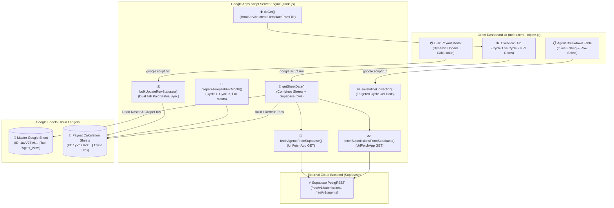
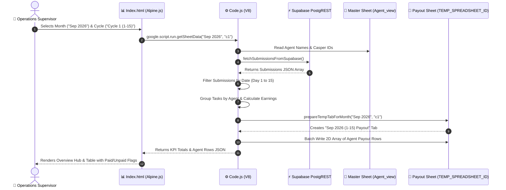
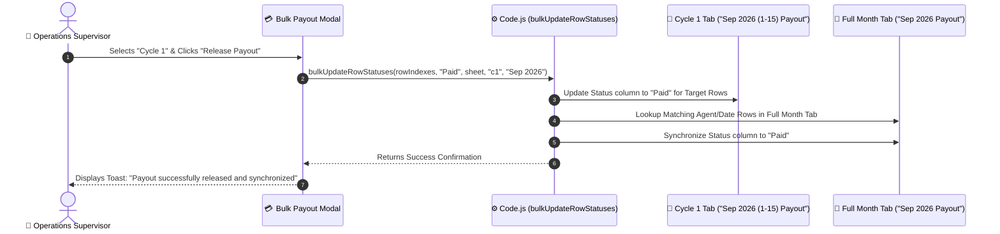

# AgentFlow-GAS-Backend
> **Google Apps Script Payout Calculation Engine & Financial Ledger** — Component Specification & Architecture Reference

---

## 1. Overview
`AgentFlow-GAS-Backend` is an enterprise financial reconciliation engine and interactive payout dashboard located at `gas-app` (Script ID: `123Tjjgr4ICG_WlhxpbpWlmxqEOYKKKHYQu0bbSVr3w7Ggbd2UH4GI07c`). Running on the modern Google Apps Script V8 runtime and managed via Google Clasp, it serves as the financial settlement bridge between delivery proof data recorded by field agents in [[Supabase]] and the corporate [[Google Sheets]] ledgers used by payroll finance.

### The Operational Problem
Logistics payroll and finance teams encounter substantial friction when reconciling disparate delivery run records against corporate payroll ledgers. Manually compiling field agent attendance, cross-referencing Casper IDs across roster spreadsheets, isolating bi-monthly payout windows, and verifying delivery proofs against payout claims is error-prone, slow, and prone to duplicate payouts or missing payouts during cycle-end cutoffs.

### The Architectural Solution
The script ingests daily task tallies from Supabase via `UrlFetchApp`, cross-references agent rosters and Casper IDs from the master `Agent_view` sheet, and generates isolated bi-monthly payout tabs (`Cycle 1`: 1st–15th, `Cycle 2`: 16th–End, `Full Month`). It powers an embedded single-page application built with Alpine.js and Tailwind CSS for interactive inline auditing, real-time variance detection, and bulk payout status releases directly within Google Sheets.

## 2. Tech Stack

| Layer | Technology | Version | Purpose & Architectural Notes |
|---|---|---|---|
| **Server Runtime** | Google Apps Script (V8) | Chrome V8 Engine | Server-side JavaScript execution environment running in Google Workspace Cloud *(stated in appsscript.json)*. |
| **CLI & Deployment** | Google Clasp | `2.4.x` | Command-line tool for local version control, pushing code, and deploying GAS projects. |
| **Manifest & Settings** | `appsscript.json` | Manifest V1 | Timezone: `Asia/Kolkata`, runtime: `V8`, executeAs: `USER_DEPLOYING`, access: `MYSELF`. |
| **Spreadsheet Engine** | Google Sheets / SpreadsheetApp | Enterprise Cloud | Ingests data from master sheet (`SPREADSHEET_ID`) and generates payout tabs in `TEMP_SPREADSHEET_ID`. |
| **Frontend UI Framework**| Alpine.js | `3.x` (CDN) | Reactive lightweight client-side state engine driving the embedded dashboard in `Index.html`. |
| **CSS & Iconography** | Tailwind CSS CDN / FontAwesome | Tailwind Play CDN / FA 6.4.0 | Responsive dark-mode glassmorphic interface with custom scrollbars and print styling. |
| **Charting Engine** | Chart.js | `3.x` (CDN) | Interactive delivery and payout performance charts rendered inside the dashboard view. |
| **External Integration**| Supabase PostgREST | Cloud REST | Fetches agents and submissions via `UrlFetchApp` with HTTP bearer token authentication. |

---

## 3. Architecture

### Financial Ingestion & Ledger Pipeline Architecture
`AgentFlow-GAS-Backend` bridges cloud database records with spreadsheet ledgers through an asynchronous ingestion and transformation pipeline:



---

## 4. Folder & File Structure

An annotated directory map of `gas-app/`:

```
gas-app/
├── .clasp.json                      # Clasp project metadata: scriptId and rootDir
├── .claspignore                     # Files excluded from pushing to Google Drive
├── appsscript.json                  # Manifest: V8 runtime, timezone, and web app execution parameters
├── Code.js                          # Core server script (71 KB, 1,888 lines): REST fetch, sheet math, cycles
├── Index.html                       # Embedded web UI (160 KB, 3,212 lines): Alpine.js, Tailwind CDN, Chart.js
└── PAYOUT_CYCLES_PLAN.md            # Technical specification for bi-monthly payout partitioning
```

---

## 5. Core Modules & Responsibilities

### `Code.js` (Server Script)
- **Purpose:** Server-side engine handling Google Sheets I/O, Supabase REST queries, and financial tally math.
- **Key Global Constants (lines 4–12):**
  - `SPREADSHEET_ID`: Master spreadsheet (`"1avV2Tx9SGaaUeFu2alONmXeXkGYqE4I5r1ZncPYmY7M"`).
  - `SHEET_TAB_NAME`: Roster sheet tab (`"Agent_view"`).
  - `TEMP_SPREADSHEET_ID`: Dedicated payout calculation workbook (`"1yVhXMczYVNIaR1rbuMCALyfhr9H8sFat8jPGL3YdZv0"`).
  - `RATE_PER_TASK`: Default rate per completed delivery (`13.00`).
  - `SUPABASE_URL`: `https://matoieqhletkjcjfvars.supabase.co`.
  - `SUPABASE_KEY`: `[REDACTED_SECRET]`.
- **Key Functions:**
  - `doGet()`: Entry point serving `Index.html` via `HtmlService.createTemplateFromFile("Index").evaluate()`.
  - `normalizeAgentName(agentName)`: Strips all whitespace characters (e.g. `"SunilKumar Yadav"` ➔ `"SunilKumarYadav"`). Includes unit test `testNormalizeAgentName()`.
  - `fetchAgentsFromSupabase()`: Executes `UrlFetchApp.fetch` to retrieve `{ name, rate_amount }` list from `/rest/v1/agents`.
  - `addAgentToSupabase(agentName, rateAmount)`: Reads `AgentName` and `CasperFHRID` from master `Agent_view` sheet and registers agent in Supabase.
  - `fetchSubmissionsFromSupabase()`: Ingests all delivery submission rows from `/rest/v1/submissions` ordered chronologically.
  - `getSheetData(selectedMonth, cycle)`: Combines master spreadsheet records with Supabase submission tallies, calculates completed tasks, earnings (`tasks * rate`), and returns aggregated dataset to frontend.
  - `getPayoutTabName(monthKey, cycle)`: Computes tab name based on active cycle:
    - `'c1'` ➔ `"{Month} {Year} (1-15) Payout"`
    - `'c2'` ➔ `"{Month} {Year} (16-End) Payout"`
    - `'full'` ➔ `"{Month} {Year} Payout"`
  - `prepareTempTabForMonth(selectedMonth, cycle)`: Creates or cleans the temporary cycle payout tab in `TEMP_SPREADSHEET_ID` with standard headers (`Agent Name`, `Casper ID`, `Completed Tasks`, `Rate`, `Earnings`, `Status`).
  - `bulkUpdateRowStatuses(rowIndexes, status, sheet, cycle, monthKey)`: Marks selected rows as `"Paid"` or `"Unpaid"`. Synchronizes status across the cycle tab and the full-month tab to prevent ledger discrepancies (lines 1082–1240).
  - `saveInlineCorrection(selectedMonth, originalRowIndex, fieldName, value, cycle)`: Saves inline cell adjustments made from the frontend dashboard directly to the corresponding sheet row.

### `Index.html` (Client Application)
- **Purpose:** Single-page dashboard interface loaded by `doGet()`.
- **Key Features:**
  - **3-Way Cycle Selector (lines 20–26 of PAYOUT_CYCLES_PLAN.md):** Switches active view between Cycle 1 (1st–15th), Cycle 2 (16th–End), and Entire Month (Full).
  - **Overview Hub Metrics:** Side-by-side metric cards comparing Cycle 1 vs Cycle 2: Tasks, Gross Earnings, Paid Amount, and Remaining Unpaid Balance.
  - **Agent Ledger Table:** Virtualized table with inline editing capabilities (`saveInlineCorrection`), search filters, and row selection checkboxes.
  - **Bulk Payout Release Modal:** Confirmation dialog that recalculates unpaid balance on the fly when the payout cycle is switched, with automatic button disabling when unpaid amount reaches zero (`updateModalUnpaidTargets()`).

---

## 6. Data Flow / Key Workflows

### 1. Bi-Monthly Cycle Ingestion & Payout Tab Generation


### 2. Bulk Payout Execution & Dual-Tab Status Synchronization


---

## 7. Configuration & Environment

### Script Configuration Properties (`Code.js` lines 4–12)

| Property Name | File Location | Value | Description |
|---|---|---|---|
| `SPREADSHEET_ID` | `Code.js` | `"1avV2Tx9SGaaUeFu2alONmXeXkGYqE4I5r1ZncPYmY7M"` | Master Google Sheet holding agent roster and Casper IDs *(stated)*. |
| `SHEET_TAB_NAME` | `Code.js` | `"Agent_view"` | Roster worksheet tab name. |
| `TEMP_SPREADSHEET_ID` | `Code.js` | `"1yVhXMczYVNIaR1rbuMCALyfhr9H8sFat8jPGL3YdZv0"` | Payout calculation workbook where monthly cycle tabs are created. |
| `RATE_PER_TASK` | `Code.js` | `13.00` | Fallback payout rate per completed delivery (INR). |
| `SUPABASE_URL` | `Code.js` | `"https://matoieqhletkjcjfvars.supabase.co"` | Supabase PostgREST endpoint. |
| `SUPABASE_KEY` | `Code.js` | `"[REDACTED_SECRET]"` | Supabase API authentication key. |

### Manifest Settings (`appsscript.json`)

| Field | Setting | Explanation |
|---|---|---|
| `timeZone` | `"Asia/Kolkata"` | Standard operational timezone for Indian logistics hubs *(stated)*. |
| `runtimeVersion` | `"V8"` | Modern Chrome V8 engine supporting ES6+ syntax. |
| `exceptionLogging` | `"STACKDRIVER"` | Logs runtime errors directly to Google Cloud Logging. |
| `webapp.executeAs` | `"USER_DEPLOYING"` | Executes as the script owner's Google account to preserve sheet permissions. |
| `webapp.access` | `"MYSELF"` | Restricts web app access exclusively to the deploying user account. |

---

## 8. External Integrations & APIs

| Service | Purpose | Auth Method | Code Location | Known Quotas & Constraints |
|---|---|---|---|---|
| **Google Sheets (SpreadsheetApp)** | Reading rosters, writing payout tabs, formatting | Workspace OAuth | Throughout `Code.js` | Batch reading (`getValues`) and writing (`setValues`) must be used to avoid execution timeout. |
| **Supabase PostgREST API** | Fetching agents and delivery proof records | HTTP Bearer token | `fetchAgentsFromSupabase`, `fetchSubmissionsFromSupabase` | Bound by `UrlFetchApp` quotas (20,000 to 100,000 calls/day depending on Google Workspace tier). |
| **Google Apps Script HtmlService** | Rendering web dashboard | Session Cookie | `doGet()` | Evaluates script tags; output is sandboxed using IFRAME mode. |

---

## 9. Testing

### Built-in Verification Test Functions
`Code.js` includes self-contained test functions that validate core business logic without modifying production sheets:
- **`testNormalizeAgentName()` (lines 28–44):** Asserts whitespace stripping across variations (`"SunilKumar Yadav"`, `"Jitendra Kumar Saroj"`, `"  Rahul  Kumar  "`).
- **`testDoGet()` (lines 218–240):** Asserts that `doGet()` returns a valid `HtmlOutput` object with expected page title.
- **`testCalculations()` (lines 863–890):** Asserts task count to earnings multiplication.
- **`testUpdateRowStatus()` & `testBulkUpdateRowStatuses()`:** Asserts status change transitions.

### Local Test Invocation via Clasp

```bash
cd gas-app

# Check status of local files against Apps Script project
npx @google/clasp status

# Push latest code to Google Workspace
npx @google/clasp push

# Open the script in browser to run testNormalizeAgentName()
npx @google/clasp open
```

---

## 10. CI/CD & Deployment

- **Deployment Mechanism:** Local development uses `@google/clasp`. Code changes are committed to Git and synchronized to Google Drive via `clasp push`.
- **Web App Versioning:** Production deployments are created via Google Apps Script web UI or `clasp deploy --description "v1.0.6 Payout Cycles"`.
- **Rollback Process:** Google Apps Script maintains automatic version history; previous script deployments can be selected in the Apps Script project settings.

---

## 11. Setup & Local Development

```bash
cd "C:\Users\User\Desktop\payout app\gas-app"

# 1. Ensure Clasp is installed
npm install -g @google/clasp

# 2. Login to Google account owning the script
clasp login

# 3. Pull latest remote changes (if any)
clasp pull

# 4. Push local changes
clasp push

# 5. Open in Apps Script Web Editor
clasp open
```

---

## 12. Security Notes

> [!WARNING]
> **Hardcoded Production Spreadsheet IDs & Supabase Key:**
> In `Code.js` (lines 4–11), production Google Sheet IDs (`1avV2Tx9SGaaUeFu2alONmXeXkGYqE4I5r1ZncPYmY7M`, `1yVhXMczYVNIaR1rbuMCALyfhr9H8sFat8jPGL3YdZv0`) and the Supabase API key (`[REDACTED_SECRET]`) are committed as plaintext script variables. While access is limited by Google Drive permissions and `webapp.access = "MYSELF"`, moving these values into Google Apps Script `PropertiesService.getScriptProperties()` is strongly recommended for security hardening.

- **Web App Access Surface:** `appsscript.json` sets `webapp.access: "MYSELF"`, ensuring that the web application cannot be accessed publicly by unauthorized third parties.

---

## 13. Known Issues, Limitations & Tech Debt

- **Google Apps Script 6-Minute Hard Execution Limit:** Every Apps Script execution has a strict 6-minute timeout. If a month contains thousands of submission rows, individual cell calls will timeout. In `prepareTempTabForMonth` and `bulkUpdateRowStatuses`, 2D arrays (`sheet.getRange(...).setValues(...)`) are used to ensure execution completes within ~5–10 seconds *(stated)*.
- **`UrlFetchApp` Daily Quotas:** Google Workspace accounts are capped at 100,000 fetch calls/day (consumer accounts at 20,000/day). Ingesting submissions in bulk rather than per-agent prevents quota exhaustion.
- **Untracked Directory in Root Git:** In the root monorepo, `gas-app/` was listed as an untracked directory in git status *(inferred)*. It must be tracked and committed to ensure continuous version control.

---

## 14. Design Decisions & Rationale

- **Bi-Monthly Cycle Partitioning (`c1` vs `c2`):** Implemented in `PAYOUT_CYCLES_PLAN.md` to match corporate payroll schedules. Splitting into `c1` (1st–15th) and `c2` (16th–End) allows financial supervisors to disburse mid-month advance payouts without locking or corrupting the full-month financial reconciliation *(stated)*.
- **Dual-Tab Status Synchronization:** When a supervisor marks rows as `"Paid"` in a cycle tab (e.g. `Sep 2026 (1-15) Payout`), `bulkUpdateRowStatuses` automatically locates the corresponding records in the full-month tab (`Sep 2026 Payout`) and marks them as paid. This prevents double-payment mistakes during end-of-month reconciliation *(stated)*.
- **Alpine.js Embedded Architecture:** Building the dashboard as an embedded SPA in `Index.html` using Alpine.js and Tailwind CDN eliminates the need for separate hosting infrastructure while providing high-speed reactivity inside the Google Apps Script container.

---

## 15. Roadmap / TODOs

- [ ] **Migrate Secrets to ScriptProperties:** Move `SPREADSHEET_ID`, `TEMP_SPREADSHEET_ID`, and `SUPABASE_KEY` from global constants to `PropertiesService.getScriptProperties()`.
- [ ] **Automated Time-Driven Trigger:** Create an installable time-driven trigger to auto-ingest daily Supabase submissions every midnight.
- [ ] **PDF Payout Slip Generation:** Add automatic generation of PDF payout slips stored in Google Drive and emailed to delivery agents.

---

## 16. Changelog

*No prior note supplied — changelog starts here.*

- **2026-09-16:** Implementation of Bi-Monthly Payout Cycles (`PAYOUT_CYCLES_PLAN.md` completed):
  - Added 3-way cycle dropdown (`c1`, `c2`, `full`).
  - Added `getPayoutTabName` and `prepareTempTabForMonth` cycle filtering.
  - Implemented dual-tab paid status synchronization in `bulkUpdateRowStatuses`.
  - Added modal dynamic unpaid calculations and zero-unpaid safety badge.

---

## 17. Glossary

- **Clasp:** Command Line Apps Script Projects tool maintained by Google.
- **HtmlService:** Google Apps Script service used to build and serve web pages.
- **UrlFetchApp:** Google Apps Script networking service equivalent to `fetch()` in browser environments.
- **Cycle 1 (`c1`):** Payout period from the 1st to the 15th of the month.
- **Cycle 2 (`c2`):** Payout period from the 16th to the end of the month.

---

## 18. Related Notes
- [[agent-summary-mechanism]] — Monorepo Master Note & Cross-System Blueprint.
- [[Rules/GAS-Architecture-Index|GAS Architecture Index & Agent Router]] — Authoritative decision matrix and TypeScript Native compilation standard.
- [[Rules/GAS-Webapp-Architecture-Rulebook|GAS Webapp Architecture Rulebook]] — 21-section engineering standard for Native Clasp TypeScript and zero-downtime triggers.
- [[Dashboard|Engineering Second Brain & Project Master Map]] — Central knowledge base index and operational project directory.

---


## 19. Update Instructions (meta)

To update this document after changes:
1. Re-check `Code.js` if new spreadsheet columns, formulas, or Supabase endpoints are introduced.
2. Update `Index.html` feature descriptions if the Alpine.js UI is modified.
3. Ensure secret keys and spreadsheet IDs remain properly redacted (`[REDACTED_SECRET]`) in Section 7 and Section 12.
