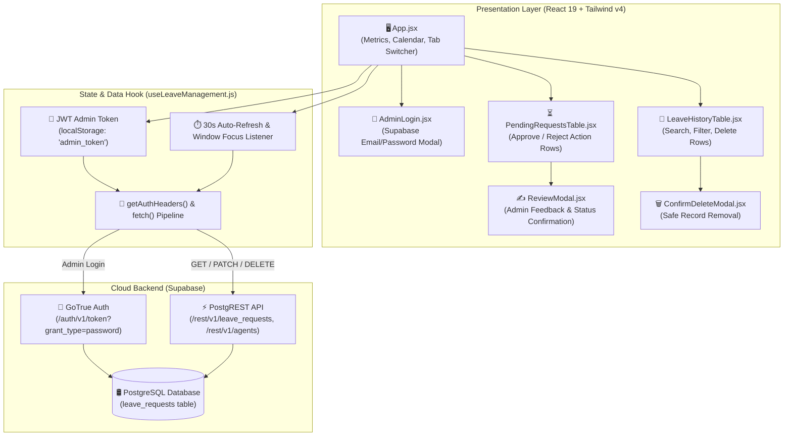
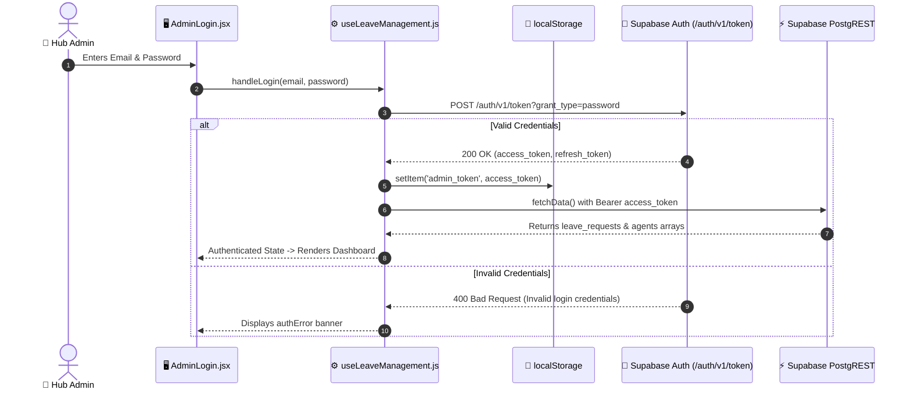
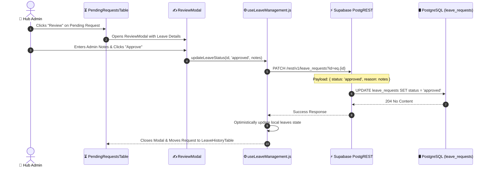

# AgentFlow-Leave-Admin
> **Operational Leave Management & Team Concurrency Dashboard** — Component Specification & Architecture Reference

---

## 1. Overview
`AgentFlow-Leave-Admin` is an administrative web dashboard located at `leave-management/admin` (manifest: `admin`). It provides warehouse supervisors and operations managers with real-time visibility and governance over agent leave schedules, attendance records, and team concurrency conflicts.

### The Operational Problem
Warehouse hubs and delivery centers frequently face uncoordinated absenteeism and last-minute leave requests from field associates. Without centralized visibility into team-wide scheduling density, supervisors risk approving overlapping leaves that compromise daily delivery capacity and SLA compliance. Furthermore, disjointed leave tracking causes discrepancies between recorded attendance and bi-monthly payroll disbursement calculations.

### The Architectural Solution
Built with React 19, Vite 8, and Tailwind CSS v4, the dashboard connects directly to [[Supabase]] using GoTrue password-based JWT authentication and PostgREST endpoints. Supervisors review pending leave submissions, approve or reject requests with audit commentary, assign official leaves directly to field agents, inspect month-by-month calendar density, and resolve delivery shift coverage risks before releasing bi-monthly payout approvals.

## 2. Tech Stack

| Layer | Technology | Version | Purpose & Architectural Notes |
|---|---|---|---|
| **Runtime & Bundler** | Node.js / Vite | Vite `8.1.1` | High-performance modern build pipeline and ESM development server *(stated)*. |
| **Frontend Framework** | React | `19.2.7` (`react`, `react-dom`) | Declarative component hierarchy and concurrent UI updates. |
| **Styling Framework** | Tailwind CSS v4 | `4.3.2` (`@tailwindcss/vite`) | Next-generation Tailwind CSS with native Vite plugin and OKLCH color palettes. |
| **Date Manipulation** | date-fns | `4.4.0` | Modular, immutable date utility library for month grids and interval calculations. |
| **Icons & Visuals** | Lucide React | `1.23.0` | Clean, modern feather-style iconography. |
| **Linter** | Oxlint | `1.71.0` | High-speed Rust-based JavaScript linter configured via `.oxlintrc.json`. |
| **Authentication & DB**| Supabase GoTrue Auth & PostgREST | Cloud Managed | Admin authentication via JWT tokens and REST queries to `leave_requests` and `agents`. |

---

## 3. Architecture

### Dashboard Architecture & Data Pipeline
The dashboard operates around the `useLeaveManagement` custom hook which manages the authentication session, handles auto-refresh intervals, and issues authorized REST calls to Supabase:



---

## 4. Folder & File Structure

An annotated tree of `leave-management/admin/`:

```
leave-management/admin/
├── .gitignore                       # Node and Vite build ignore rules
├── .oxlintrc.json                   # Oxlint linting configuration
├── README.md                        # Project setup documentation
├── index.html                       # HTML entry point with meta viewport
├── package.json                     # Manifest: name: "admin", React 19, Tailwind v4, date-fns, oxlint
├── vite.config.js                   # Vite configuration with @tailwindcss/vite and @vitejs/plugin-react
└── src/
    ├── App.jsx                      # Main dashboard layout: KPI cards, month calendar, tabs, 30s refresh
    ├── config.js                    # Supabase URL and anon key configuration
    ├── formatDateRange.js           # Formats single date ("14 Sep 2026") or ranges ("14 Sep - 18 Sep 2026")
    ├── formatDateRange.test.js      # Unit tests for date range string generation
    ├── index.css                    # Tailwind CSS imports and application styling (33 KB)
    ├── main.jsx                     # Application bootstrap mounting into DOM
    │
    ├── components/
    │   ├── AdminLogin.jsx           # Form for admin email and password submission
    │   ├── ConfirmDeleteModal.jsx   # Deletion confirmation dialog with agent name and date confirmation
    │   ├── LeaveHistoryTable.jsx    # Searchable, filterable table for historical approved/rejected leaves
    │   ├── PendingRequestsTable.jsx # Table for pending leaves with direct "Review" action triggers
    │   └── ReviewModal.jsx          # Modal for approving/rejecting leave with optional admin notes
    │
    └── hooks/
        └── useLeaveManagement.js    # Core state hook: token lifecycle, REST queries, auto-refresh
```

---

## 5. Core Modules & Responsibilities

### `src/App.jsx`
- **Purpose:** Primary application shell containing metric summary cards, active views, month calendar density visualizer, and manual leave assignment.
- **Key Features:**
  - **KPI Metrics Cards:** Renders cards for *Total Requests*, *Approved Leaves*, *Pending Requests*, and *Active on Leave Today* (calculated via `isWithinInterval`).
  - **Month Calendar Grid:** Generates an interactive day grid using `date-fns` (`eachDayOfInterval`, `startOfWeek`, `endOfWeek`), highlighting days with approved team leaves to prevent hub understaffing.
  - **Auto-Refresh (lines 33–50):** Automatically refetches data every 30 seconds (`setInterval(fetchData, 30000)`) and upon browser tab focus (`window.addEventListener('focus', fetchData)`).
  - **Assign Leave Form:** Enables administrators to directly book approved leave for an agent without requiring agent self-submission.

### `src/hooks/useLeaveManagement.js`
- **Purpose:** Centralized business logic and data access hook for Supabase communication.
- **Key Functions:**
  - `handleLogin(e)`: Calls `${SUPABASE_URL}/auth/v1/token?grant_type=password` with admin credentials. Saves `access_token` to `localStorage.admin_token` and state (lines 76–99).
  - `getAuthHeaders()`: Constructs HTTP headers containing `apikey` and `Authorization: Bearer <token || anon_key>`.
  - `fetchData()`: Fetches all leave requests sorted chronologically (`/rest/v1/leave_requests?select=*&order=start_date.desc`) and agent names (`/rest/v1/agents?select=name&order=name.asc`). Handles HTTP 401 session expiration by clearing storage and resetting state.
  - `updateLeaveStatus(id, status, notes)`: Issues `PATCH /rest/v1/leave_requests?id=eq.${id}` with `{ status, reason }`.
  - `assignLeave({ agentName, startDate, endDate, reason })`: Issues `POST /rest/v1/leave_requests` with status `"approved"`.
  - `deleteLeave(id)`: Issues `DELETE /rest/v1/leave_requests?id=eq.${id}`.

### `src/components/PendingRequestsTable.jsx`
- **Purpose:** Displays actionable list of unapproved leave requests.
- **Key Features:**
  - Renders agent name, start/end dates, total duration in days, submission timestamp, and reason.
  - Highlights overlapping team absences to warn supervisors before approval.
  - Triggers `ReviewModal` for fast approval/rejection.

### `src/components/ReviewModal.jsx`
- **Purpose:** Modal dialog for administrative decision-making on a leave request.
- **Key Features:**
  - Displays agent details, requested date range, and submitted reason.
  - Provides an input field for optional administrative feedback.
  - Dispatches `updateLeaveStatus(id, "approved")` or `updateLeaveStatus(id, "rejected")`.

---

## 6. Data Flow / Key Workflows

### 1. Admin Authentication & Session Recovery


### 2. Leave Review & Status Update Workflow


---

## 7. Configuration & Environment

### Environment Variables & Settings (`src/config.js`)

| Variable Name | Required | Default / Example Value | Description |
|---|---|---|---|
| `VITE_SUPABASE_URL` | Yes | `https://matoieqhletkjcjfvars.supabase.co` | Supabase project API gateway endpoint *(stated)*. |
| `VITE_SUPABASE_ANON_KEY` | Yes | `[REDACTED_SECRET]` | Supabase publishable anonymous client API key. |

---

## 8. External Integrations & APIs

| Service | Purpose | Authentication | Code Location | Notes & Quotas |
|---|---|---|---|---|
| **Supabase GoTrue Auth** | Administrative session creation | Password grant | `useLeaveManagement.js` (line 81) | Returns standard JWT access token stored in browser storage. |
| **Supabase PostgREST API** | Leave querying, patching, and agent lists | Bearer JWT token | `useLeaveManagement.js` (`fetchData`, `updateLeaveStatus`) | Queries `leave_requests` and `agents` tables. |

---

## 9. Testing

### Test Coverage
- **`src/formatDateRange.test.js`:** Unit tests for single-day formatting (`"15-Sep-2026"`) and multi-day interval strings (`"15-Sep-2026 to 18-Sep-2026"`).

### Verified Verification Commands

```bash
cd leave-management/admin

# Run Oxlint
npm run lint

# Build production bundle
npm run build

# Preview production build
npm run preview
```

---

## 10. CI/CD & Deployment

- **Build Pipeline:** Executing `npm run build` runs `vite build`, leveraging `@tailwindcss/vite` and `@vitejs/plugin-react` to compile static HTML/CSS/JS into `dist/`.
- **Hosting Target:** Can be served from any static file host, Vercel, Netlify, or an internal enterprise Nginx server.

---

## 11. Setup & Local Development

```bash
cd "C:\Users\User\Desktop\payout app\leave-management\admin"

# 1. Install dependencies
npm install

# 2. Start local dev server
npm run dev
# Dashboard launches at http://localhost:5173
```

---

## 12. Security Notes

> [!WARNING]
> **Hardcoded Supabase Credentials in Frontend:**
> In `src/config.js` (lines 2–3), default fallbacks are committed:
> `SUPABASE_URL = "https://matoieqhletkjcjfvars.supabase.co"`
> `SUPABASE_ANON_KEY = "[REDACTED_SECRET]"`
> Row-Level Security (RLS) policies in `supabase_leave_requests.sql` must ensure anonymous users cannot access or tamper with unapproved leave records without valid authentication *(stated in audit notes)*.

- **Token Storage:** The JWT access token is stored in `localStorage.admin_token`. For heightened security against XSS, an `HttpOnly` cookie-based authentication architecture is recommended for production enterprise deployments.

---

## 13. Known Issues, Limitations & Tech Debt

- **30-Second Polling Overhead:** In `App.jsx` (lines 37–40), `setInterval(fetchData, 30000)` executes continuous network polling to refresh pending requests. Implementing Supabase Realtime WebSocket subscriptions would eliminate polling overhead and provide instantaneous UI updates.
- **Open RLS Policy Check:** In `supabase_leave_requests.sql`, policies for `SELECT` and `ALL` use `USING (true)`. A dedicated admin claim in the JWT token should be enforced to restrict managerial actions.

---

## 14. Design Decisions & Rationale

- **Tailwind CSS v4 with OKLCH Color Space:** Adopted Tailwind CSS v4 via `@tailwindcss/vite` for faster compilation and superior perceptual color consistency using the OKLCH color space *(stated in STATE.md design rules)*.
- **Oxlint Over ESLint:** Adopted `oxlint` 1.71.0 for near-instant linting in developer loops and CI checks.

---

## 15. Roadmap / TODOs

- [ ] **Supabase Realtime Subscriptions:** Replace 30-second interval polling with `supabase.channel('leave_requests')` WebSocket listeners.
- [ ] **Email / WhatsApp Notification Webhook:** Trigger automatic notification alerts to delivery agents when their leave is approved.
- [ ] **CSV / Excel Export:** Add one-click export of monthly leave history for payroll auditing.

---

## 16. Changelog

*No prior note supplied — changelog starts here.*

- **Initial Release:** Created React 19 + Tailwind CSS v4 Admin Dashboard with GoTrue auth and Supabase PostgREST integration.
- **3678c84 (2026-09-16):** Enhanced status response compatibility with Android real-time leave approval notifications.

---

## 17. Glossary

- **Leave Request:** Formal record containing agent name, start date, end date, status (`pending`, `approved`, `rejected`), and operational justification.
- **Team Overlap:** Condition where two or more delivery agents from the same distribution hub are scheduled on leave during the same calendar date.
- **Oxlint:** High-performance Rust-based JavaScript/JSX linter.

---

## 18. Related Notes

- [[agent-summary-mechanism]] — Monorepo Master Note & Cross-System Blueprint.
- [[AgentFlow-Android]] — Native Android client receiving leave approval alerts.
- [[AgentFlow-Web-Tracker]] — Field agent web tracker portal.
- [[AgentFlow-GAS-Backend]] — Google Apps Script payout calculation engine.

---

## 19. Update Instructions (meta)

To update this document after changes:
1. Check `package.json` for dependency version upgrades (`vite`, `tailwindcss`, `oxlint`).
2. If new administrative workflows or modals are added, document them in Section 4, Section 5, and Section 6.
3. Ensure secrets remain redacted (`[REDACTED_SECRET]`) in Section 7 and Section 12.
