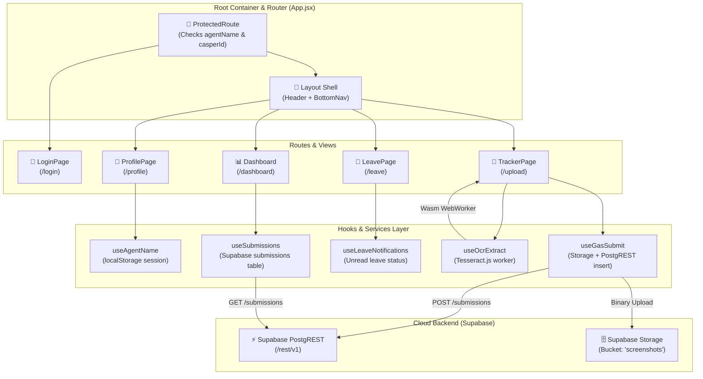
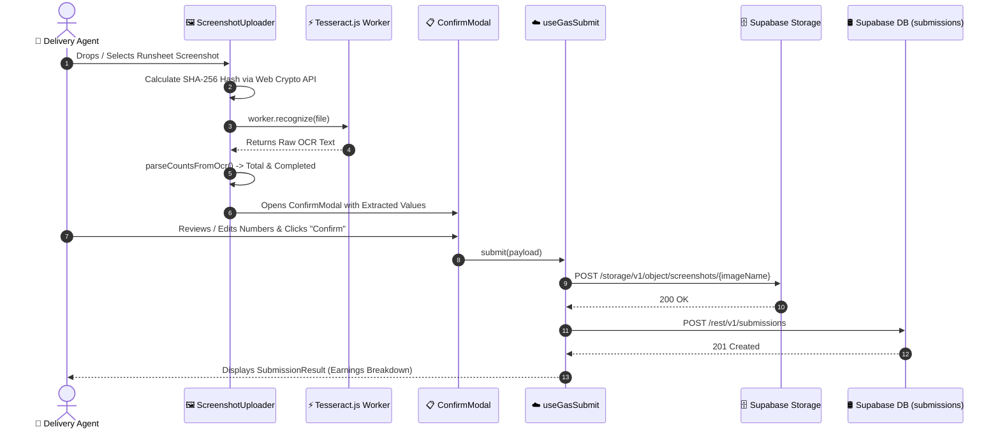

# AgentFlow-Web-Tracker
> **Web Work Tracker & Payout Portal** — Component Specification & Architecture Reference

---

## 1. Overview
`AgentFlow-Web-Tracker` is a responsive, browser-based Single Page Application (SPA) located at `agent-summary-mechanism/work-tracker` (manifest: `work-tracker`). It serves as an accessible web fallback and desktop interface for field delivery agents to authenticate via Casper ID, upload daily runsheet proofs, inspect bi-monthly cycle earnings, and submit leave requests.

### The Operational Problem
Delivery agents who experience mobile device failures, lack compatible Android hardware, or need a desktop workstation interface require a dependable portal to submit daily runsheet proofs and check cycle earnings. Without client-side document processing and immediate verification feedback, agents risk submitting illegible images, duplicate proofs, or mathematically invalid task tallies that trigger payment disputes.

### The Architectural Solution
Built on React 19, Vite 8, and the `@supabase/supabase-js` SDK, the portal executes client-side optical character recognition in the browser using WebAssembly-powered `Tesseract.js`. Extracted delivery tallies are validated against mathematical invariants, deduplicated via SHA-256 image hashes, uploaded to Supabase Storage, and recorded in PostgreSQL for operational tracking and financial settlement.

## 2. Tech Stack

| Layer | Technology | Version | Purpose & Architectural Notes |
|---|---|---|---|
| **Runtime / Build Tool** | Node.js / Vite | Vite `8.0.12` | High-speed ESM-based development and production bundling *(stated)*. |
| **Frontend Framework** | React | `19.2.6` (`react`, `react-dom`) | Declarative UI, functional components, hooks, concurrent rendering. |
| **Routing** | React Router DOM | `7.18.1` | Client-side SPA routing (`/login`, `/upload`, `/dashboard`, `/profile`, `/leave`). |
| **Client-Side OCR** | Tesseract.js | `7.0.0` | Browser-based WebAssembly OCR engine for parsing runsheet screenshots. |
| **Backend Client** | `@supabase/supabase-js` | `2.107.0` | Official client library for Supabase PostgREST queries, auth, and storage. |
| **Linting & Code Quality** | ESLint | `10.3.0` | JavaScript linting with `@eslint/js`, `eslint-plugin-react-hooks`. |
| **Deployment Target** | Vercel SPA / Static CDN | N/A | Deployed with `vercel.json` SPA wildcard rewrite configuration. |

---

## 3. Architecture

### Component Hierarchy & Application State Architecture
The portal is structured around a centralized layout with lifted state at the root `App.jsx` level to preserve submissions and leave notification status during route transitions:



---

## 4. Folder & File Structure

An annotated map of `agent-summary-mechanism/work-tracker/`:

```
agent-summary-mechanism/work-tracker/
├── eslint.config.js                 # ESLint flat configuration (ESM, react-hooks)
├── index.html                       # Application HTML shell with viewport and root container
├── package.json                     # Package manifest: work-tracker, React 19, Vite 8, Tesseract.js
├── vercel.json                      # Vercel deployment routing rewrite rule
├── vite.config.js                   # Vite configuration with React plugin
├── WORK_TRACKER_CYCLES_PLAN.md      # Bi-monthly payout cycle planning document
├── gas/                             # Google Apps Script helper endpoints
├── tests/                           # Component and integration test specs
└── src/
    ├── App.jsx                      # Central router, protected routes, theme toggle, lifted submissions
    ├── config.js                    # Supabase URL and anon key configuration
    ├── index.css                    # Complete application styles (32 KB, CSS variables, dark/light)
    ├── main.jsx                     # React DOM createRoot entry point
    │
    ├── components/
    │   ├── BottomNav.jsx            # Mobile bottom navigation bar with leave unread badge
    │   ├── ConfirmModal.jsx         # Verification modal for confirming OCR extracted numbers
    │   ├── Dashboard.jsx            # Runsheet history list, cycle breakdown cards, image preview
    │   ├── DateSelector.jsx         # Date picker input with formatted labels
    │   ├── Header.jsx               # Top header with user greeting and theme toggle
    │   ├── Layout.jsx               # Shell component wrapping Header, children, and BottomNav
    │   ├── LeaveDurationModal.jsx   # Modal for selecting leave start/end dates and inputting reason
    │   ├── LeavePage.jsx            # Monthly calendar view of approved and pending leaves
    │   ├── LoginPage.jsx            # Authentication form with Casper ID and password inputs
    │   ├── OcrLoader.jsx            # Animated loading spinner during Tesseract OCR extraction
    │   ├── ProfilePage.jsx          # Agent details, earnings breakdown, payout rate, logout
    │   ├── ScreenshotUploader.jsx   # Drag-and-drop or file input for runsheet images
    │   ├── SubmissionResult.jsx     # Success card with earnings breakdown and reset trigger
    │   ├── TeamOverlapModal.jsx     # Concurrency warning dialog when team members are on leave
    │   └── TrackerPage.jsx          # Core coordinator: image selection, OCR trigger, submission
    │
    ├── hooks/
    │   ├── useAgentName.js          # Persists agent name, casper ID, and rate in localStorage
    │   ├── useGasSubmit.js          # Uploads image to Supabase Storage and records submission row
    │   ├── useImageUpload.js        # Handles file input, FileReader base64, and SHA-256 hashing
    │   ├── useLeaveNotifications.js # Checks for unread approved leave requests in Supabase
    │   ├── useOcrExtract.js         # Manages Tesseract.js worker lifecycle and text recognition
    │   └── useSubmissions.js        # Fetches and caches agent submission records from Supabase
    │
    ├── lib/
    │   └── supabase.js              # Instantiates @supabase/supabase-js client singleton
    │
    └── utils/
        ├── dateUtils.js             # Standard date formatters (dd-MMM-yyyy)
        ├── hashUtils.js             # Client-side SHA-256 cryptographic hashing using Web Crypto API
        ├── imageUtils.js            # Image compression and data URL conversions
        └── date/
            ├── cycleUtils.js        # Slices submissions into Cycle 1 (1–15) and Cycle 2 (16–End)
            ├── cycleUtils.test.js   # Unit tests for bi-monthly cycle logic
            ├── formatDate.js        # Low-level date formatter
            ├── formatDateRange.js   # Human-readable date range formatter
            ├── formatDateRange.test.js # Unit tests for date ranges
            ├── getCurrentMonthYear.js# Formats current month string (e.g. "Sep 2026")
            ├── getMonthYearStr.js   # Extracts month and year from ISO strings
            ├── monthConstants.js    # Month name and index mappings
            └── parseDateStr.js      # Robust parsing of various date string formats
```

---

## 5. Core Modules & Responsibilities

### `src/components/LoginPage.jsx`
- **Purpose:** Authenticates delivery agents against the Supabase `agents` table.
- **Key Functions:**
  - `handleSubmit(e)`: Queries `supabase.from("agents").select("name, password, rate_amount").eq("casper_id", casperId).single()`.
  - Verifies that `data.password === password` (lines 32–34). On success, calls `onLogin(name, casperId, rateAmount)`.
- **Notable Logic:** Employs Supabase PostgREST error code handling (`PGRST116` mapped to "Invalid Casper ID").

### `src/hooks/useOcrExtract.js`
- **Purpose:** Manages Tesseract.js WebAssembly worker lifecycle and parses runsheet metrics.
- **Key Functions:**
  - `parseCountsFromOcr(rawText)`:
    - Splits text into lines. Locates line containing keyword `"total"` and extracts tokens from the line above (first token = `totalCount`).
    - Locates line containing keyword `"completed"` and extracts tokens from the line above (last token = `completedCount`).
    - Fallback regex: `/(\d+)\s*\n?\s*total/i` and `/(\d+)\s*\n?\s*completed/i`.
  - `extract(file)`: Lazy-initializes `workerRef.current = await createWorker("eng")`. Executes `recognize(file)`. Returns `{ totalCount, completedCount, rawText }`.
- **Notable Logic:** Reuses the initialized WebAssembly worker instance across subsequent image uploads to avoid reload penalties.

### `src/hooks/useGasSubmit.js`
- **Purpose:** Dispatches verified runsheet data to Supabase Storage and database.
- **Key Functions:**
  - `submit({ date, agentName, casperId, totalCount, completedCount, imageBase64, imageName, file, fileHash })`:
    1. Uploads binary image payload to Supabase Storage:
       `POST ${SUPABASE_URL}/storage/v1/object/screenshots/${imageName}` with bearer auth (lines 36–45).
    2. Constructs public image URL:
       `${SUPABASE_URL}/storage/v1/object/public/screenshots/${imageName}`.
    3. Inserts record into database:
       `POST ${SUPABASE_URL}/rest/v1/submissions` with payload `{ date, agent_name, casper_id, total_count, completed_count, image_url, file_hash, processed: false }`.
- **Notable Logic:** Named `useGasSubmit.js` for historical reasons *(inferred)*; the hook originally targeted a Google Apps Script endpoint before being refactored directly to Supabase PostgREST.

### `src/utils/hashUtils.js`
- **Purpose:** Computes client-side SHA-256 cryptographic hashes of uploaded files for duplicate detection.
- **Key Functions:**
  - `calculateFileHash(file: File): Promise<string>`: Reads file as `ArrayBuffer` via `file.arrayBuffer()`, generates digest with `crypto.subtle.digest("SHA-256", buffer)`, and formats as hex string.

### `src/utils/date/cycleUtils.js`
- **Purpose:** Computes bi-monthly cycle metrics for agent earnings displays.
- **Key Functions:**
  - `calculateCycleStats(submissions, selectedMonth, rateAmount)`:
    - Filters submissions matching `selectedMonth`.
    - Partitions into Cycle 1 (`day <= 15`) and Cycle 2 (`day >= 16`).
    - Aggregates `c1Completed`, `c1Earnings` (`c1Completed * rate`), `c2Completed`, `c2Earnings`, `totalCompleted`, and `totalEarnings`.

---

## 6. Data Flow / Key Workflows

### 1. Web Runsheet Upload & Client-Side OCR Pipeline


---

## 7. Configuration & Environment

### Environment Variables & Settings (`src/config.js`)

| Variable Name | Required | Default / Example Value | Description |
|---|---|---|---|
| `VITE_SUPABASE_URL` | Yes | `https://matoieqhletkjcjfvars.supabase.co` | Supabase project API gateway endpoint *(stated)*. |
| `VITE_SUPABASE_ANON_KEY` | Yes | `[REDACTED_SECRET]` | Supabase publishable anonymous client API key. |

---

## 8. External Integrations & APIs

| Service | Purpose | Auth Method | Invocation Location | Notes & Quotas |
|---|---|---|---|---|
| **Supabase PostgREST API** | Submission creation, agent verification, leave fetching | `apikey` & Bearer token header | `src/hooks/useGasSubmit.js`, `src/components/LoginPage.jsx` | Queried via `fetch` or `@supabase/supabase-js` client. |
| **Supabase Storage API** | Storage for runsheet proofs | Bearer header | `src/hooks/useGasSubmit.js` (line 36) | Bucket: `screenshots` (public read). |
| **Tesseract.js Engine** | Client-side OCR parsing | Local Browser Wasm | `src/hooks/useOcrExtract.js` | Downloads English trained data (`eng.traineddata.gz`) on first load (~4MB). |

---

## 9. Testing

### Test Coverage
- **`src/utils/date/cycleUtils.test.js`:** Tests month splitting, cycle 1 (1–15) vs cycle 2 (16–End), and earnings multiplication.
- **`src/utils/date/formatDateRange.test.js`:** Tests formatting of single-day (`"14 Sep 2026"`) and multi-day spans (`"14 Sep - 18 Sep 2026"`).

### Verified Verification Commands

```bash
cd agent-summary-mechanism/work-tracker

# Run linter
npm run lint

# Build production bundle
npm run build

# Preview build locally
npm run preview
```

---

## 10. CI/CD & Deployment

- **Build Output:** Executing `npm run build` runs `vite build`, producing minified static assets in `dist/`.
- **Vercel Routing (`vercel.json`):**
  ```json
  {
    "rewrites": [
      { "source": "/(.*)", "destination": "/" }
    ]
  }
  ```
  This ensures deep links (e.g. `/dashboard`, `/leave`) route to `index.html` for client-side evaluation by `react-router-dom`.

---

## 11. Setup & Local Development

```bash
cd "C:\Users\User\Desktop\payout app\agent-summary-mechanism\work-tracker"

# 1. Install dependencies
npm install

# 2. Start local dev server
npm run dev
# Server boots at http://localhost:5173
```

---

## 12. Security Notes

> [!WARNING]
> **Client-Exposed Fallback Anon Key:**
> In `src/config.js` (lines 2–3), default Supabase credentials (`https://matoieqhletkjcjfvars.supabase.co` and `[REDACTED_SECRET]`) are committed as hardcoded fallback strings. Row-Level Security (RLS) policies in PostgreSQL must prevent unauthorized table modifications.

> [!WARNING]
> **Plaintext Credential Comparison:**
> In `src/components/LoginPage.jsx` (line 32), passwords are authenticated via client-side check `if (data.password !== password)`. Passwords are stored in plaintext in the database and queried over public API.

---

## 13. Known Issues, Limitations & Tech Debt

- **Tesseract.js Initial Download Overhead:** Loading the WebAssembly binary and OCR language trained data (`eng.traineddata.gz`) requires a ~4MB network download on the client's first runsheet submission. On slow cellular connections, this causes noticeable initial delay.
- **No Offline Persistence:** Unlike the native Android client which caches to local SQLite, the web tracker requires continuous internet access to authenticate and submit runsheets.
- **Legacy Hook Naming:** `useGasSubmit.js` retains its original Google Apps Script name despite now submitting to Supabase *(inferred)*.

---

## 14. Design Decisions & Rationale

- **Client-Side Wasm OCR over Serverless Processing:** Running OCR inside the user's browser via Tesseract.js eliminates serverless compute costs and avoids sending raw uncompressed images to a cloud OCR API before cropping *(stated)*.
- **Lifted Submissions State in `App.jsx`:** Submissions state is maintained at the root component level rather than within `Dashboard.jsx`. This enables instantaneous tab switching between Tracker, Dashboard, and Profile without triggering redundant Supabase network re-fetches *(inferred)*.

---

## 15. Roadmap / TODOs

- [ ] **Service Worker Offline Support:** Implement Workbox service worker for PWA offline capability.
- [ ] **Bcrypt Auth Migration:** Transition authentication to Supabase Auth email/password or server-side password verification.
- [ ] **Tesseract Pre-fetching:** Pre-warm the Tesseract Wasm worker during login to eliminate first-upload latency.

---

## 16. Changelog

*No prior note supplied — changelog starts here.*

- **2e4445d (2026-09-15):** `feat: instant tab switching and earnings display normalization`
- **967d158 (2026-09-14):** `feat: strict deduplication and hash integration`
- **Initial Release:** Web Work Tracker SPA established with React 19 and Vite 8.

---

## 17. Glossary

- **Wasm:** WebAssembly binary format used by Tesseract.js to run native C++ OCR code in browser threads.
- **SPA:** Single Page Application where routing is handled dynamically in client JavaScript without page reloads.
- **Casper ID:** Agent identifier used for authentication and record binding.

---

## 18. Related Notes

- [[agent-summary-mechanism]] — Monorepo Master Note & Cross-System Blueprint.
- [[AgentFlow-Android]] — Native Android mobile client with Google ML Kit OCR.
- [[AgentFlow-Leave-Admin]] — Web administrative leave management dashboard.
- [[AgentFlow-GAS-Backend]] — Google Apps Script payout ledger engine.

---

## 19. Update Instructions (meta)

To update this document after changes:
1. Re-check `package.json` for dependency version bumps (`vite`, `react`, `@supabase/supabase-js`).
2. Verify any changes to Supabase table queries in `src/hooks/useGasSubmit.js` and `src/components/LoginPage.jsx`.
3. Preserve secret redaction (`[REDACTED_SECRET]`) in Section 7 and Section 12.
