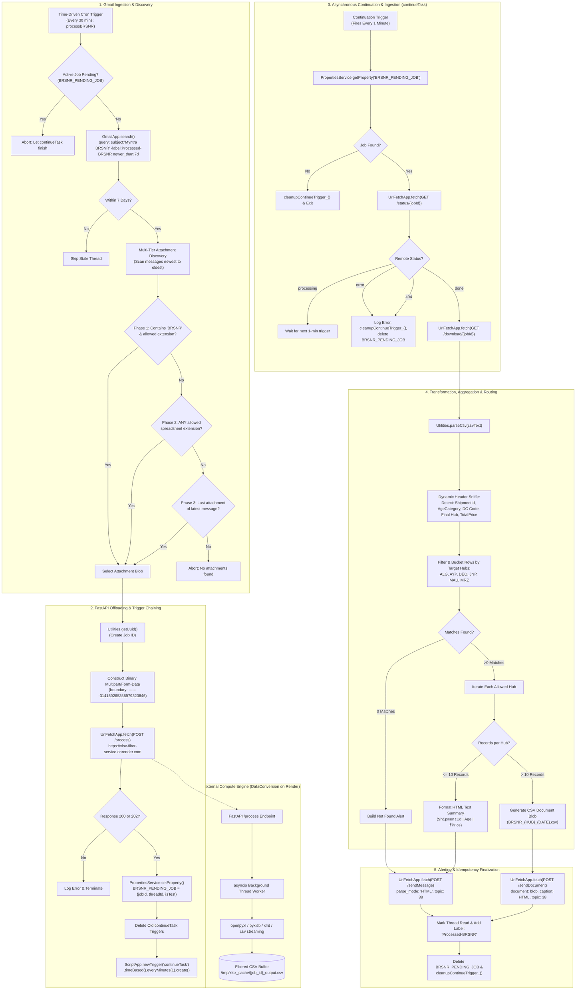
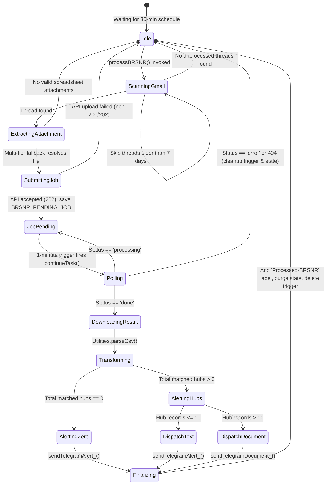
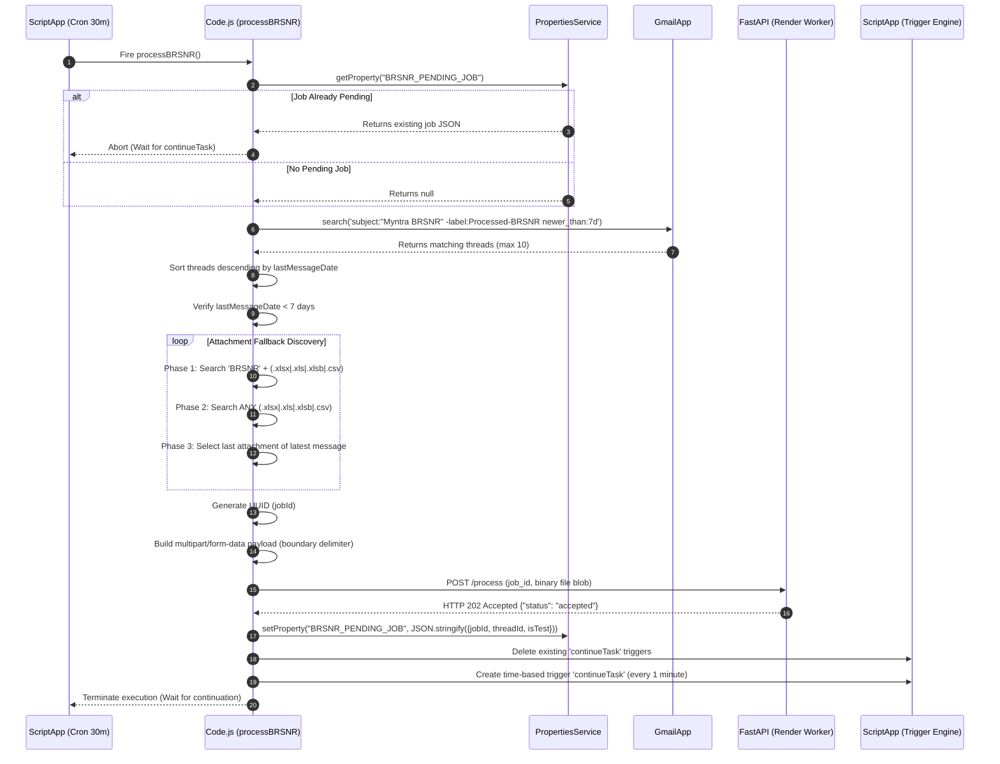
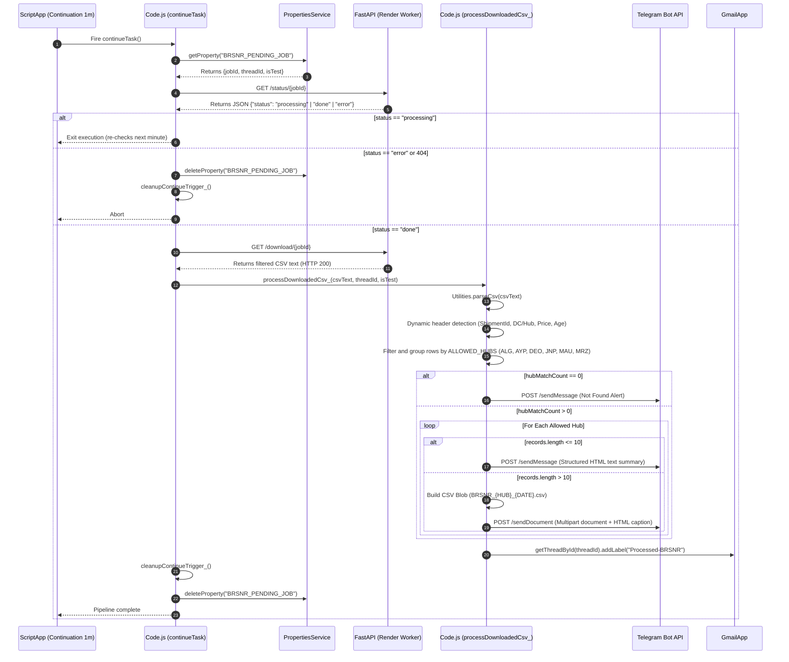
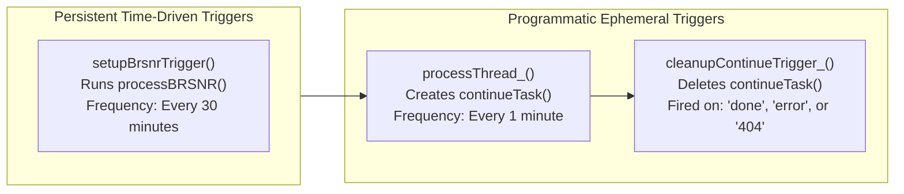

# BRSNRAttributesAutomation
*Subtitle: Myntra BRSNR Automation | Inventory Slug: `BRSNRAttributesAutomation`*

## 1. Overview
**BRSNRAttributesAutomation** is an automated, event-driven serverless logistics extraction, conversion, and alerting pipeline implemented in [[Google Apps Script]] (GAS) running under the [[V8]] runtime. The project operates within the supply chain logistics operations of **Myntra** and **Dexter** across Northern India, specifically focusing on the monitoring and tracking of **Branch Return Shipment Non-Receipt (BRSNR)** records.

### Operational Context & The BRSNR Domain
In modern e-commerce reverse logistics, shipments returned by customers or undelivered consignments (RTO/RVP) are routed back from delivery hubs to regional Distribution Centers (DCs) or originating mother hubs. When a return shipment is dispatched from a delivery branch but fails to be received, checked in, or acknowledged at the destination logistics hub within expected operational Service Level Agreements (SLAs), it is flagged as a **Branch Return Shipment Non-Receipt (BRSNR)**. BRSNR shipments represent immediate risks:
- Unaccounted inventory leakage and financial loss.
- Lost customer returns preventing refund validation.
- Undetected transit theft or shipment misrouting across intermediate transshipment centers.

To mitigate this, enterprise logistics systems generate daily BRSNR data dumps covering regional return shipments. Upstream dispatch systems distribute these dumps via automated emails with subjects following the pattern `Myntra BRSNR <Date>`.

### The Operational Problem
The daily BRSNR workbooks distributed across the supply chain contain high-volume nationwide shipment records formatted in modern OpenXML spreadsheets (`.xlsx`), binary Excel workbooks (`.xlsb`), legacy Excel files (`.xls`), or flat files (`.csv`). A single workbook routinely spans tens of thousands of rows with numerous attribute columns (`ShipmentId`, `AgeCategory`, `DC Code`, `Final Hub`, `TotalPrice`).

Direct execution within Google Apps Script faces severe platform constraints:
1. **Memory Ceiling:** Google Apps Script enforces a strict in-memory heap limit of **50 MB**. Attempting to decompress and parse multi-megabyte `.xlsx` XML archives directly within GAS memory results in catastrophic `Exceeded memory limit` runtime crashes.
2. **Execution Quota:** Standard user executions face a hard **6-minute (360 seconds)** execution timeout. Unzipping OpenXML packages and processing tabular structures in pure JavaScript regularly exceeds this limit.
3. **Lack of Native Compressed Parsers:** GAS does not have native low-overhead SAX or streaming parsers for `.xlsx` or binary `.xlsb` workbooks.

### The Architectural Solution
BRSNRAttributesAutomation overcomes these constraints through an **Asynchronous Trigger-Chained Microservice Offloading Architecture**:
1. **Gmail Ingestion & Discovery:** The script runs on a 30-minute time-driven trigger (`processBRSNR`), querying [[Gmail]] for unprocessed emails within a 7-day rolling window (`subject:"Myntra BRSNR" -label:Processed-BRSNR newer_than:7d`). It implements a 3-phase fallback algorithm to discover the correct Excel or CSV attachment.
2. **Microservice Offloading:** Instead of attempting to parse the binary attachment in GAS, the script constructs a multipart/form-data payload and streams the raw attachment to an external streaming service: DataConversion (`https://xlsx-filter-service.onrender.com/process`), hosted on [[Render]].
3. **Asynchronous Polling Chain:** The external microservice accepts the job, stores it in an ephemeral queue, and immediately returns a `202 Accepted` response with a unique `job_id`. GAS persists this state (`jobId`, `threadId`, `isTest`) into `PropertiesService.getScriptProperties()` under the key `BRSNR_PENDING_JOB` and dynamically schedules a 1-minute time-based continuation trigger (`continueTask`).
4. **CSV Transformation & Hub Filtering:** The continuation trigger polls the service endpoint (`GET /status/{job_id}`). Upon completion (`done`), it streams down a pre-filtered, lightweight CSV file (`GET /download/{job_id}`). GAS parses the clean CSV in milliseconds, extracts specific attributes (`ShipmentId`, `AgeCategory`, `Final Hub`, `TotalPrice`), and isolates records belonging to a whitelist of 6 target logistics hubs: **ALG** (Aligarh), **AYP** (Ayodhya), **DEO** (Deoria), **JNP** (Jaunpur), **MAU** (Mau), and **MRZ** (Mirzapur).
5. **Dual-Mode Telegram Alerting:** For each matched hub, the script publishes operational alerts directly to a dedicated topic (`BRSNR_TOPIC_ID = 38`) in the central operations supergroup (`-1003779595579`):
   - **Text Summary Mode ($\le 10$ shipments):** Sends a structured HTML-formatted summary directly into the chat topic detailing individual shipment IDs, age categories, and loss valuations.
   - **Document Mode ($> 10$ shipments):** Generates an on-the-fly CSV file (`BRSNR_{HUB}_{DATE}.csv`) and uploads it as a document with an HTML caption, preventing message truncation and spam.
6. **State & Label Finalization:** The Gmail thread is permanently tagged with the label `Processed-BRSNR` to guarantee strict idempotency, the pending job state is cleared, and the temporary 1-minute polling trigger is deleted.

---

## 2. Tech Stack

| Component / Layer | Technology | Version / Requirement | Source / Code Reference | Notes |
| :--- | :--- | :--- | :--- | :--- |
| **Execution Runtime** | [[Google Apps Script]] (GAS) | V8 Engine (`runtimeVersion: "V8"`) *(stated)* | `appsscript.json:6` | Modern ECMAScript (ES6+) runtime providing native support for modern syntax, arrow functions, and `Utilities` integration. |
| **Exception Logging** | Google Cloud Stackdriver | `STACKDRIVER` *(stated)* | `appsscript.json:5` | Cloud-based execution logging capturing all `Logger.log()` outputs in the Google Cloud Console. |
| **Timezone Reference** | IANA Timezone | `Asia/Kolkata` (IST, UTC+5:30) *(stated)* | `appsscript.json:2` | Governs all execution timestamps, subject date parsing, and file timestamp generation. |
| **State Persistence** | `PropertiesService` | Built-in `ScriptProperties` | `Code.js:30`, `205`, `228`, `248`, `277` | Key-value store persisting asynchronous job descriptors (`BRSNR_PENDING_JOB`) across trigger execution boundaries. |
| **Trigger Scheduling** | `ScriptApp` | Built-in Event Service | `Code.js:208-215`, `284-291`, `521-529` | Manages programmatic 1-minute continuation triggers (`continueTask`) and recurring 30-minute polling triggers (`setupBrsnrTrigger`). |
| **Email Ingestion** | `GmailApp` | Built-in Workspace API | `Code.js:51`, `67`, `98`, `118-155`, `448-452`, `550-575` | Ingests inbound BRSNR emails, searches message threads, retrieves binary attachments, and applies deduplication labels. |
| **File & Binary Storage** | `DriveApp` | Built-in Workspace API | `DebugUtility.js:116-120` | Used within diagnostic utilities to persist downloaded raw CSV files directly to Google Drive for offline auditing. |
| **Container UI Binding** | `SpreadsheetApp` | Built-in Workspace API | `Code.js:535-541` | Mounts an administrative menu (`🚀 BRSNR Bot`) in Google Sheets UI for manual triggers and historical backlog purging. |
| **HTTP Egress Engine** | `UrlFetchApp` | Built-in Network API | `Code.js:193`, `242`, `264`, `469`, `499`, `DebugUtility.js:60`, `77`, `103`, `151`, `202` | Executes multipart binary POST uploads to FastAPI, polls status endpoints, and dispatches Telegram Bot API calls. |
| **CSV & Data Parsing** | `Utilities` | Built-in Utilities API | `Code.js:20`, `46`, `165`, `180`, `294`, `487` | Handles localized date formatting (`Utilities.formatDate`), UUID generation (`Utilities.getUuid`), binary blob generation, and CSV parsing (`Utilities.parseCsv`). |
| **External Processing Bridge**| DataConversion | Python 3 / FastAPI / Render | `Code.js:10`, `47-49`, `241-263` | External streaming spreadsheet processor (`https://xlsx-filter-service.onrender.com`) that parses `.xlsx`, `.xls`, `.xlsb`, and `.csv` files. |
| **Alerting & Communication** | [[Telegram]] Bot API | HTTP REST API / HTML & MarkdownV2 Modes | `Code.js:458-509`, `DebugUtility.js:127-210` | Dispatches real-time alerts and CSV documents to supergroup `-1003779595579` on Topic `38`. |
| **Local Tooling & CLI** | Google Clasp (`@google/clasp`) | Manifest format 1.0 *(stated)* | `.clasp.json:1-16` | Developer CLI used to synchronize local source files with Script ID `1etYJ_EdmTVTyPPnXwU3jY4-ROkCxvuA3778yOmcAHIkyltpoq6YovTFh`. |

---

## 3. Architecture

### System Architecture Overview
The BRSNR Attributes Automation architecture decouples heavy data ingestion and processing into a distributed, asynchronous topology. Google Apps Script acts as an orchestrator, bridging Google Workspace infrastructure with an external compute engine and operational messaging.



### State Machine Lifecycle
The asynchronous processing cycle coordinates state between Google Apps Script execution instances, the script properties cache, and the external Render microservice.



---

## 4. Folder & File Structure

The project represents a single Google Apps Script deployment managed locally using [[Clasp]].

```
C:\Users\User\Desktop\gas apps\BRSNRAttributesAutomation\
├── .clasp.json          # Clasp project configuration and remote Script ID binding
├── appsscript.json      # Google Apps Script manifest (V8, Asia/Kolkata, Stackdriver)
├── Code.js              # Core orchestration engine, triggers, parsing, and Telegram egress
├── DebugUtility.js      # Diagnostic harnesses: July 3 debug job, Drive export, TG tests
└── Diagnostics.js      # Gmail payload inspector & structural diagnostic JSON logger
```

### Manifest & Source File Inventory

| File Path | Lines | Size (Bytes) | Primary Responsibility | Key Functions / Constants |
| :--- | :--- | :--- | :--- | :--- |
| [`.clasp.json`](file:///C:/Users/User/Desktop/gas%20apps/BRSNRAttributesAutomation/.clasp.json) | 16 | 276 | Maps local directory to Apps Script project ID `1etYJ_EdmTVTyPPnXwU3jY4-ROkCxvuA3778yOmcAHIkyltpoq6YovTFh`. | `scriptId`, `rootDir`, `filePushOrder` |
| [`appsscript.json`](file:///C:/Users/User/Desktop/gas%20apps/BRSNRAttributesAutomation/appsscript.json) | 7 | 120 | Defines runtime configuration, execution time zone, and cloud logging mode. | `V8`, `Asia/Kolkata`, `STACKDRIVER` |
| [`Code.js`](file:///C:/Users/User/Desktop/gas%20apps/BRSNRAttributesAutomation/Code.js) | 578 | 19,798 | Core business logic: Gmail query, attachment extraction, multipart upload, status polling, CSV parsing, hub grouping, Telegram alerts, and triggers. | `processBRSNR`, `continueTask`, `processDownloadedCsv_`, `setupBrsnrTrigger`, `onOpen` |
| [`DebugUtility.js`](file:///C:/Users/User/Desktop/gas%20apps/BRSNRAttributesAutomation/DebugUtility.js) | 211 | 7,059 | Standalone debugging routines: synchronous sleep-loop processing saving raw CSV to Drive, plain text & MarkdownV2 Telegram tests. | `debugJuly3Job`, `testTelegramConnection`, `testStructuredReportTelegram` |
| [`Diagnostics.js`](file:///C:/Users/User/Desktop/gas%20apps/BRSNRAttributesAutomation/Diagnostics.js) | 54 | 1,575 | Diagnostic utility to inspect the metadata and attachment properties of the latest BRSNR Gmail thread. | `logEmailStructure`, `DIAGNOSTIC_QUERY` |

---

## 5. Core Modules & Responsibilities

### Module: `Code.js`
The primary production orchestrator containing 578 lines of execution logic.

#### Constants & Configuration (`Code.js:5-13`)
- `BRSNR_BOT_TOKEN`: Telegram bot authentication token (`[REDACTED_SECRET]`).
- `BRSNR_CHAT_ID`: Operations supergroup destination ID (`"-1003779595579"`).
- `BRSNR_TOPIC_ID`: Supergroup message thread / forum topic ID (`38`).
- `PROCESSED_LABEL`: Deduplication Gmail user label (`"Processed-BRSNR"`).
- `API_BASE_URL`: Base URL for external processing service (`"https://xlsx-filter-service.onrender.com"`).
- `MANUAL_DATE`: String override for manual backfill runs (e.g., `"03-July-2026"`).

#### `getDateStr_()` (`Code.js:15-21`)
- **Signature:** `getDateStr_(): string`
- **Behavior:** Returns `MANUAL_DATE.trim()` if populated. Otherwise, evaluates the current system date in script time zone (`Asia/Kolkata`) formatted as `dd-MMMM-yyyy` (e.g., `"17-September-2026"`).

#### `processBRSNR()` (`Code.js:26-42`)
- **Signature:** `processBRSNR(): void`
- **Behavior:** Main entry point fired every 30 minutes by the installable time-driven trigger.
- **Concurrency Check:** Inspects `PropertiesService.getScriptProperties().getProperty("BRSNR_PENDING_JOB")`. If an active job is already registered, execution halts immediately to allow `continueTask` to complete without race conditions (`Code.js:31-34`).
- **Discovery:** Calls `findUnprocessedBrsnrThread_()`. If found, invokes `processThread_(thread, false)`.

#### `testBRSNR()` (`Code.js:47-59`)
- **Signature:** `testBRSNR(): void`
- **Behavior:** Manual test harness querying Gmail for `subject:"Myntra BRSNR"`, picking the first match regardless of labels or age, and executing `processThread_(thread, false)`.

#### `findUnprocessedBrsnrThread_()` (`Code.js:64-84`)
- **Signature:** `findUnprocessedBrsnrThread_(): GmailThread | null`
- **Behavior:** Executes `GmailApp.search('subject:"Myntra BRSNR" -label:Processed-BRSNR newer_than:7d', 0, 10)`.
- **Sorting:** Sorts candidate threads descending by last message date (`b.getLastMessageDate().getTime() - a.getLastMessageDate().getTime()`) to ensure the absolute latest email is processed first.
- **Stale Guard:** Compares `latestThread.getLastMessageDate()` against a 7-day threshold (`limitDate.setDate(limitDate.getDate() - 7)`). Rejects threads older than 7 days to prevent runaway backlog loops.

#### `backfillBRSNR()` (`Code.js:89-106`)
- **Signature:** `backfillBRSNR(): void`
- **Behavior:** Manual administrative utility to backfill a specific date. Reads `dateStr` from `getDateStr_()`. Validates that `MANUAL_DATE` is explicitly set. Searches Gmail for `subject:"Myntra BRSNR " + dateStr` and processes the first thread.

#### `processThread_(thread, isTest)` (`Code.js:111-222`)
- **Signature:** `processThread_(thread: GmailThread, isTest: boolean): void`
- **Attachment Extraction:** Executes the 3-phase fallback algorithm across messages from newest to oldest:
  - *Phase 1 (`Code.js:118-129`):* Case-insensitive search for attachments with names containing `"BRSNR"` and an allowed extension (`.xlsx`, `.xls`, `.xlsb`, `.csv`).
  - *Phase 2 (`Code.js:132-145`):* Search for ANY attachment with an allowed spreadsheet extension.
  - *Phase 3 (`Code.js:148-156`):* Fallback to the final attachment of the latest message containing any attachments.
- **Multipart Construction (`Code.js:168-183`):** Synthesizes a raw multipart/form-data payload with boundary `-------314159265358979323846`. Encodes `job_id` (UUID generated via `Utilities.getUuid()`) and the binary file attachment blob.
- **Submission (`Code.js:193-206`):** Sends `POST` to `https://xlsx-filter-service.onrender.com/process`. On `200` or `202`, serializes `{ jobId, threadId: thread.getId(), isTest }` into script property `BRSNR_PENDING_JOB`.
- **Trigger Management (`Code.js:208-215`):** Deletes any pre-existing `continueTask` triggers via `ScriptApp.deleteTrigger()` and establishes a new 1-minute time-driven trigger: `ScriptApp.newTrigger("continueTask").timeBased().everyMinutes(1).create()`.

#### `continueTask()` (`Code.js:227-282`)
- **Signature:** `continueTask(): void`
- **Behavior:** Trigger handler fired every 1 minute to poll job status.
- **State Check:** Retrieves `BRSNR_PENDING_JOB`. If empty, invokes `cleanupContinueTrigger_()` and exits.
- **Polling:** Fetches `GET https://xlsx-filter-service.onrender.com/status/{jobId}`:
  - `404 Not Found:` Deletes property, cleans up trigger, and terminates.
  - `status: "processing":` Returns silently to await the next 1-minute trigger.
  - `status: "error":` Logs remote error, purges state and trigger.
  - `status: "done":` Fetches `GET https://xlsx-filter-service.onrender.com/download/{jobId}`. Upon receiving `200 OK`, passes CSV text to `processDownloadedCsv_()`, clears `BRSNR_PENDING_JOB`, and invokes `cleanupContinueTrigger_()`.

#### `cleanupContinueTrigger_()` (`Code.js:284-291`)
- **Signature:** `cleanupContinueTrigger_(): void`
- **Behavior:** Scans all project triggers returned by `ScriptApp.getProjectTriggers()` and deletes any trigger whose handler function matches `"continueTask"`.

#### `processDownloadedCsv_(csvText, threadId, isTest)` (`Code.js:293-453`)
- **Signature:** `processDownloadedCsv_(csvText: string, threadId: string, isTest: boolean): void`
- **CSV Ingestion:** Parses text into a 2D array via `Utilities.parseCsv(csvText)`.
- **Dynamic Header Resolution (`Code.js:300-325`):** Scans the header row for case-insensitive column names:
  - `ShipmentId` $\rightarrow$ `colShipmentId`
  - `AgeCategory` $\rightarrow$ `colAgeCategory`
  - `dc code`, `dccode`, or `dc` $\rightarrow$ `colDcCode`
  - `final hub`, `finalhub`, or substring `"hub"` $\rightarrow$ `colFinalHub`
  - `TotalPrice` $\rightarrow$ `colTotalPrice`
  - Assigns filter column: prioritizes `colDcCode`, falls back to `colFinalHub`.
- **Hub Filtering (`Code.js:328-365`):** Iterates data rows matching against whitelist `['alg', 'ayp', 'deo', 'jnp', 'mau', 'mrz']`. Aggregates records into `groupedRecords` keyed by uppercase hub names (`ALG`, `AYP`, `DEO`, `JNP`, `MAU`, `MRZ`).
- **Date Header Extraction (`Code.js:370-382`):** Attempts to extract report date from Gmail thread subject (`subject.match(/Myntra BRSNR\s+(.*)/i)`). Falls back to `getDateStr_()`.
- **Zero-Match Alerting (`Code.js:383-394`):** If total matches equal 0, dispatches a warning message to Telegram stating no records were found for target hubs.
- **Hub Alerting Loop (`Code.js:396-445`):**
  - If records $\le 10$: Compiles an HTML summary listing individual items (`<code>ShipmentId</code>`, `AgeCategory`, `₹TotalPrice`) and dispatches via `sendTelegramAlert_()`.
  - If records $> 10$: Assembles a CSV payload with headers `ShipmentId,AgeCategory,Final Hub,TotalPrice`, wraps it in a blob named `BRSNR_{KEY}_{DATE}.csv`, and dispatches via `sendTelegramDocument_()`.
- **Labeling (`Code.js:447-452`):** If not in test mode, creates or gets label `Processed-BRSNR` and attaches it to the Gmail thread.

#### `sendTelegramAlert_(text)` (`Code.js:458-480`)
- **Signature:** `sendTelegramAlert_(text: string): void`
- **Behavior:** Executes HTTP POST to `https://api.telegram.org/bot[REDACTED_SECRET]/sendMessage` with JSON payload `{ chat_id: "-1003779595579", text, parse_mode: "HTML", message_thread_id: 38 }`.

#### `sendTelegramDocument_(csvContent, fileName, caption)` (`Code.js:482-509`)
- **Signature:** `sendTelegramDocument_(csvContent: string, fileName: string, caption: string): void`
- **Behavior:** Builds a `text/csv` blob via `Utilities.newBlob(csvContent, "text/csv", fileName)`. Sends a multipart form POST to `https://api.telegram.org/bot[REDACTED_SECRET]/sendDocument` with payload `{ chat_id: "-1003779595579", document: blob, caption, parse_mode: "HTML", message_thread_id: 38 }`.

#### `escTelegramHtml_(v)` (`Code.js:511-516`)
- **Signature:** `escTelegramHtml_(v: any): string`
- **Behavior:** Sanitizes strings for Telegram HTML mode by replacing `&` with `&amp;`, `<` with `&lt;`, and `>` with `&gt;`.

#### `setupBrsnrTrigger()` (`Code.js:521-530`)
- **Signature:** `setupBrsnrTrigger(): void`
- **Behavior:** Idempotently purges existing `processBRSNR` triggers and registers a recurring 30-minute time-driven trigger: `ScriptApp.newTrigger("processBRSNR").timeBased().everyMinutes(30).create()`.

#### `onOpen()` (`Code.js:535-541`)
- **Signature:** `onOpen(): void`
- **Behavior:** Adds a custom menu `🚀 BRSNR Bot` to the Google Sheets UI when bound to a spreadsheet, exposing menu items:
  - *Set Up 30-Min Trigger* $\rightarrow$ `setupBrsnrTrigger`
  - *Mark All Old Emails Processed* $\rightarrow$ `markAllHistoricalBrsnrProcessed`

#### `markAllHistoricalBrsnrProcessed()` (`Code.js:547-578`)
- **Signature:** `markAllHistoricalBrsnrProcessed(): void`
- **Behavior:** Backlog clearance utility. Runs a `while(true)` loop querying Gmail for `subject:"Myntra BRSNR" -label:Processed-BRSNR` in batches of 100 threads (`GmailApp.search(query, 0, 100)`). Applies `Processed-BRSNR` to all returned threads and sleeps 1,000 ms between batches to respect Gmail API quotas.

---

### Module: `DebugUtility.js`
Independent diagnostic and manual verification utilities spanning 211 lines.

#### `debugJuly3Job()` (`DebugUtility.js:5-122`)
- **Signature:** `debugJuly3Job(): void`
- **Behavior:** End-to-end synchronous debug execution targeting a specific historical email (`subject:"Myntra BRSNR 03-July-2026"`).
- **Execution Flow:**
  1. Searches Gmail and extracts the BRSNR attachment using bottom-to-top scanning.
  2. Submits the file directly to `https://xlsx-filter-service.onrender.com/process`.
  3. Executes a synchronous sleep-loop: up to 30 attempts, sleeping 10 seconds per attempt (`Utilities.sleep(10000)`), polling `https://xlsx-filter-service.onrender.com/status/{jobId}` for up to 5 minutes.
  4. Downloads the resulting CSV from `https://xlsx-filter-service.onrender.com/download/{jobId}`.
  5. Directly saves the downloaded file into Google Drive via `DriveApp.createFile("debug_july3_response_" + jobId + ".csv", csvData, "text/csv")` and logs the Google Drive file URL.

#### `testTelegramConnection()` (`DebugUtility.js:127-166`)
- **Signature:** `testTelegramConnection(): void`
- **Behavior:** Connectivity test dispatching a plain-text test message to the Telegram supergroup topic without formatting or parse modes, verifying bot token validity, network egress, and topic permissions.

#### `testStructuredReportTelegram()` (`DebugUtility.js:171-210`)
- **Signature:** `testStructuredReportTelegram(): void`
- **Behavior:** Verifies Telegram API `MarkdownV2` mode formatting. Dispatches a hardcoded test report with escaped characters (`\|`, `\+`) to verify supergroup message thread rendering.

---

### Module: `Diagnostics.js`
Structural inspection tool spanning 54 lines.

#### `logEmailStructure()` (`Diagnostics.js:9-53`)
- **Signature:** `logEmailStructure(): void`
- **Behavior:** Queries Gmail for `subject:"Myntra BRSNR"` (limit 1 thread). Extracts the latest message in the thread and serializes its structural properties into formatted JSON in Stackdriver logs:
  - `subject`, `date`, `from`, `to`, `cc`, `bcc`, `isDraft`
  - Truncated `bodySnippet` (first 500 characters)
  - Array of attachment descriptors: `name`, `contentType`, `sizeBytes`

---

## 6. Data Flow / Key Workflows

### 1. Ingestion & Offloading Workflow
Every 30 minutes, Google Apps Script triggers `processBRSNR()`. The following sequence diagram illustrates the lifecycle from email receipt to asynchronous trigger registration:



### 2. Continuation, Parsing & Alerting Workflow
One minute after upload, the installable trigger invokes `continueTask()`:



---

## 7. Configuration & Environment

### Script & Operational Configuration Parameters

| Variable Name | Scope | Defined In | Type | Configured Value | Description |
| :--- | :--- | :--- | :--- | :--- | :--- |
| `BRSNR_BOT_TOKEN` | Global Constant | `Code.js:5`, `DebugUtility.js:129` | `string` | `[REDACTED_SECRET]` | Authentication token for the Telegram Bot. |
| `BRSNR_CHAT_ID` | Global Constant | `Code.js:6`, `DebugUtility.js:130` | `string` | `"-1003779595579"` | Unique identifier for the target logistics Telegram supergroup. |
| `BRSNR_TOPIC_ID` | Global Constant | `Code.js:7`, `DebugUtility.js:131` | `number` | `38` | Forum topic / thread identifier dedicated to BRSNR returns. |
| `PROCESSED_LABEL` | Global Constant | `Code.js:9` | `string` | `"Processed-BRSNR"` | Gmail label applied to threads after successful processing to prevent re-runs. |
| `API_BASE_URL` | Global Constant | `Code.js:10`, `DebugUtility.js:47` | `string` | `"https://xlsx-filter-service.onrender.com"` | Base URL of the external FastAPI spreadsheet conversion microservice. |
| `MANUAL_DATE` | Global Override | `Code.js:13` | `string` | `""` | Manual date override string (e.g., `"03-July-2026"`) for backfill operations. |
| `ALLOWED_HUBS` | Local Array | `Code.js:328` | `Array<string>` | `['alg', 'ayp', 'deo', 'jnp', 'mau', 'mrz']` | Lowercase prefix whitelist of monitored logistics hubs in Eastern UP. |
| `DIAGNOSTIC_QUERY`| Global Constant | `Diagnostics.js:4` | `string` | `'subject:"Myntra BRSNR"'` | Search filter used by `Diagnostics.js` to inspect recent email structure. |

> [!danger] CRITICAL SECURITY VULNERABILITY: HARDCODED BOT CREDENTIALS
> **Exposed Credential:** The Telegram Bot authentication token is committed in plaintext at `Code.js:5` and `DebugUtility.js:129`.
>
> **Security Impact:** Anyone with read access to this repository or Google Apps Script editor has full administrative control over the bot, including the ability to read messages, intercept webhook events, impersonate the bot, and post unauthorized content into supergroup `-1003779595579`.
>
> **Immediate Remediation Steps:**
> 1. Revoke the existing token via `@BotFather` on Telegram and generate a new bot token.
> 2. Store the new token securely in Apps Script `ScriptProperties`:
>    ```javascript
>    PropertiesService.getScriptProperties().setProperty("BRSNR_BOT_TOKEN", "YOUR_NEW_TOKEN");
>    ```
> 3. Refactor `Code.js` and `DebugUtility.js` to retrieve the secret dynamically:
>    ```javascript
>    var BRSNR_BOT_TOKEN = PropertiesService.getScriptProperties().getProperty("BRSNR_BOT_TOKEN");
>    ```

---

## 8. External Integrations & APIs

### 1. External FastAPI Processing Engine (`xlsx-filter-service`)
- **Service Identity:** DataConversion microservice running on [[Render]].
- **Endpoint 1: `POST /process`**
  - **Payload:** `multipart/form-data; boundary=-------314159265358979323846`
  - **Form Fields:** `job_id` (string UUID), `file` (binary stream with filename and MIME content type).
  - **Response:** `202 Accepted` with JSON `{ "job_id": "<uuid>", "status": "accepted" }`.
- **Endpoint 2: `GET /status/{job_id}`**
  - **Response:** JSON `{ "status": "processing" | "done" | "error", "error": "<optional_msg>" }`.
- **Endpoint 3: `GET /download/{job_id}`**
  - **Response:** Filtered CSV text stream (`200 OK`).

### 2. Telegram Bot API
- **Endpoint 1: `POST https://api.telegram.org/bot[REDACTED_SECRET]/sendMessage`**
  - **Headers:** `Content-Type: application/json`
  - **Payload:**
    ```json
    {
      "chat_id": "-1003779595579",
      "text": "📊 <b>BRSNR Hub Report</b> (MRZ)\nDate: 17-September-2026\n...",
      "parse_mode": "HTML",
      "message_thread_id": 38
    }
    ```
- **Endpoint 2: `POST https://api.telegram.org/bot[REDACTED_SECRET]/sendDocument`**
  - **Payload:** Multipart form containing `chat_id`, `message_thread_id`, `caption`, `parse_mode: "HTML"`, and `document` (binary CSV blob).

### 3. Google Workspace APIs (Implicit Scopes)
Although `appsscript.json` does not explicitly declare oauthScopes, Google Apps Script infers the following permissions during authorization:
- `https://www.googleapis.com/auth/gmail.modify`: Reading Gmail messages, searching threads, creating labels (`Processed-BRSNR`), and tagging threads.
- `https://www.googleapis.com/auth/script.external_request`: Outbound HTTP calls via `UrlFetchApp` to Render and Telegram.
- `https://www.googleapis.com/auth/script.scriptapp`: Programmatic trigger manipulation via `ScriptApp.newTrigger` and `ScriptApp.deleteTrigger`.
- `https://www.googleapis.com/auth/drive`: Saving CSV files via `DriveApp.createFile` (used in `DebugUtility.js`).
- `https://www.googleapis.com/auth/spreadsheets`: Mounting UI menus via `SpreadsheetApp.getUi()`.

---

## 9. Testing

### Diagnostic & Test Harness Functions

| Function Name | Location | Trigger Method | Purpose / Verification Target |
| :--- | :--- | :--- | :--- |
| `testBRSNR()` | `Code.js:47` | Apps Script Editor Run | Tests Gmail query matching `subject:"Myntra BRSNR"`, extraction, API upload, and trigger scheduling without checking 7-day limits. |
| `debugJuly3Job()` | `DebugUtility.js:5` | Apps Script Editor Run | Runs a synchronous 5-minute polling loop for email `03-July-2026` and saves the raw output CSV directly to Google Drive. |
| `testTelegramConnection()` | `DebugUtility.js:127`| Apps Script Editor Run | Sends a plain-text message to supergroup `-1003779595579` on Topic `38` to verify bot credentials and topic permissions. |
| `testStructuredReportTelegram()` | `DebugUtility.js:171`| Apps Script Editor Run | Validates Telegram API MarkdownV2 character escaping (`\|`, `\+`, `\(`) against live Telegram chat endpoints. |
| `logEmailStructure()` | `Diagnostics.js:9` | Apps Script Editor Run | Outputs full JSON structural analysis of the latest BRSNR email including MIME types, attachment names, and byte sizes. |

### Test Scenarios & Expected Outcomes

| Test Case | Inputs / Preconditions | Execution Step | Expected Result |
| :--- | :--- | :--- | :--- |
| **Normal Email Run** | Gmail contains new email with `.xlsx` attachment matching `subject:"Myntra BRSNR"` | Run `processBRSNR()` | Uploads file to Render, creates `continueTask` trigger, returns within 10s. Next minute, `continueTask` downloads CSV and posts report to Topic 38. |
| **Small Dataset ($\le 10$ rows)** | Hub has 5 BRSNR records | Trigger `continueTask()` | Posts structured HTML text message to Topic 38 listing shipment IDs, age, and prices. |
| **Large Dataset ($> 10$ rows)** | Hub has 45 BRSNR records | Trigger `continueTask()` | Generates `BRSNR_{HUB}_{DATE}.csv` and uploads as document attachment with summary caption. |
| **Zero Matches** | Returned CSV contains no matching allowed hubs | Trigger `continueTask()` | Posts `⚠️ BRSNR Records Not Found` warning to Topic 38. |
| **Duplicate Prevention** | Thread has label `Processed-BRSNR` | Run `processBRSNR()` | Query `-label:Processed-BRSNR` filters thread out; logs `No unprocessed BRSNR emails found.` |

---

## 10. CI/CD & Deployment

### Deployment Mechanism
The project uses the Google Apps Script CLI ([[Clasp]]) for local code management and deployment.

- **Script ID:** `1etYJ_EdmTVTyPPnXwU3jY4-ROkCxvuA3778yOmcAHIkyltpoq6YovTFh`
- **Root Directory:** `./`
- **File Extensions:** `.js`, `.gs`, `.html`, `.json`

### Trigger Topography



---

## 11. Setup & Local Development

### Prerequisites
1. **Node.js:** Ensure Node.js (`>=16.x`) is installed.
2. **Clasp CLI:** Install Google Clasp globally:
   ```bash
   npm install -g @google/clasp
   ```
3. **Google Authentication:** Login to your Google account:
   ```bash
   clasp login
   ```

### Cloning & Local Synchronization
Clone the existing Apps Script project locally:
```bash
cd "C:\Users\User\Desktop\gas apps"
clasp clone 1etYJ_EdmTVTyPPnXwU3jY4-ROkCxvuA3778yOmcAHIkyltpoq6YovTFh
cd BRSNRAttributesAutomation
```

### Pushing Code Updates
To compile and upload changes to the Google Apps Script cloud runtime:
```bash
clasp push
```

### Initial Project Setup in Apps Script Console
1. Open the remote project:
   ```bash
   clasp open
   ```
2. Run `setupBrsnrTrigger()` once to establish the 30-minute recurring schedule.
3. If backlogging historical emails, execute `markAllHistoricalBrsnrProcessed()` to label past emails and avoid massive duplicate alert spam.

---

## 12. Security Notes

> [!danger] HARDCODED CREDENTIALS EXPOSURE
> As noted in Section 7, the Telegram Bot Token `[REDACTED_SECRET]` was committed directly into source files:
> - `Code.js:5`
> - `DebugUtility.js:129`
>
> In all documentation, this token is strictly redacted to `[REDACTED_SECRET]`.
> The token must be immediately rotated via Telegram BotFather and migrated to `ScriptProperties`.

### Network Security & Egress Rules
- All external HTTP calls via `UrlFetchApp` utilize HTTPS:
  - External Processing Service: `https://xlsx-filter-service.onrender.com`
  - Telegram Bot API: `https://api.telegram.org`
- Payload transmissions contain internal shipment identifiers (`ShipmentId`), hub names, and inventory valuations (`TotalPrice`). Network transit is encrypted via TLS 1.2/1.3.

### Access Control & Permissions
- **Telegram Supergroup Permissions:** The bot requires `can_send_messages` and `can_send_documents` permissions within supergroup `-1003779595579` and must have explicit access to Topic `38`.
- **Google Account Permissions:** The script runs under the authority of the user who authorizes the OAuth consent screen. It has access to read and tag all emails in that Gmail inbox.

---

## 13. Known Issues, Limitations & Tech Debt

### 1. Global Concurrency Bottleneck (`BRSNR_PENDING_JOB`)
- **Limitation:** The script uses a single script property `BRSNR_PENDING_JOB` to track pending work (`Code.js:205`).
- **Impact:** Only one email attachment can be processed at any given time. If multiple BRSNR emails arrive simultaneously, subsequent emails are blocked until the first completes.
- **Tech Debt:** Needs refactoring into an array or JSON queue if email frequency increases.

### 2. Continuation Trigger Leak Risk
- **Limitation:** If `continueTask()` encounters an unhandled runtime error before reaching `cleanupContinueTrigger_()`, the 1-minute trigger continues firing indefinitely.
- **Remediation:** Enclose the entire body of `continueTask()` in a `try...finally` block that guarantees trigger deletion upon terminal errors.

### 3. Cold Start Delays on Render Free Tier
- **Limitation:** The external microservice `https://xlsx-filter-service.onrender.com` runs on Render's free tier, which spins down containers after 15 minutes of inactivity.
- **Impact:** The initial upload request on `POST /process` can take 30–60 seconds while the container boots, occasionally risking `UrlFetchApp` timeouts if network latency spikes.

### 4. Hardcoded Hub Whitelist
- **Limitation:** The allowed hubs list `['alg', 'ayp', 'deo', 'jnp', 'mau', 'mrz']` is hardcoded directly inside `processDownloadedCsv_()` (`Code.js:328`).
- **Impact:** Adding or removing a monitored hub requires editing and redeploying code.
- **Remediation:** Move allowed hubs into a script property or Google Sheet configuration tab.

### 5. Vestigial Spreadsheet UI Binding
- **Limitation:** `Code.js:535-541` defines an `onOpen()` hook using `SpreadsheetApp.getUi()`, even though line 8 notes that spreadsheet integration was removed.
- **Impact:** In a standalone Apps Script project, `SpreadsheetApp.getUi()` throws an exception if run outside a bound spreadsheet context.

---

## 14. Design Decisions & Rationale

| Architectural Decision | Alternative Considered | Chosen Approach | Rationale & Trade-offs |
| :--- | :--- | :--- | :--- |
| **Spreadsheet Parsing** | In-memory JS decompression (e.g., SheetJS / xlsx) inside GAS | Offload to external FastAPI service on Render | **Chosen: Offload.** SheetJS regularly exceeds GAS's 50MB RAM limit and 6-minute timeout on large supply chain workbooks. External service uses Python streaming in constant memory. |
| **Polling Mechanism** | Synchronous `Utilities.sleep()` loop inside `processBRSNR` | Asynchronous 1-minute continuation trigger | **Chosen: Continuation Trigger.** Synchronous sleep-looping consumes precious GAS runtime quota (6 minutes max) and can cause quota exhaustion. Asynchronous triggers execute in independent 10-second bursts. |
| **Telegram Payload Strategy** | Send text-only messages regardless of size | Dual Mode: HTML text for $\le 10$ rows; CSV document for $> 10$ rows | **Chosen: Dual Mode.** Sending dozens of individual shipments in a single text message hits Telegram's 4096-character limit and creates chat clutter. Sending CSV documents preserves full auditability without spam. |
| **Telegram Formatting** | Telegram MarkdownV2 | HTML Mode (`parse_mode: "HTML"`) | **Chosen: HTML Mode.** MarkdownV2 requires escaping more than 18 special characters (`_`, `*`, `[`, `]`, `(`, `)`, `~`, `` ` ``, `>`, `#`, `+`, `-`, `=`, `|`, `{`, `}`, `.`, `!`). HTML mode only requires escaping `<`, `>`, and `&`, dramatically reducing parsing failures. |
| **Email Discovery Fallback**| Single attachment index lookup (`attachments[0]`) | 3-Phase Multi-Tier Fallback | **Chosen: Multi-Tier Fallback.** Upstream enterprise mailers frequently attach disclaimers, signature images, or change attachment names. Scanning for `"BRSNR"` with extensions prevents parsing failures. |

---

## 15. Roadmap / TODOs

- [ ] **Credential Rotation & Security Hardening (P0):**
  - Revoke Telegram Bot token via BotFather.
  - Migrate token to `PropertiesService.getScriptProperties().getProperty("BRSNR_BOT_TOKEN")`.
- [ ] **Resilient Trigger Cleanup (P1):**
  - Refactor `continueTask()` to wrap status checks in a strict `try...finally` to eliminate dangling 1-minute triggers.
- [ ] **Configurable Hub Whitelist (P2):**
  - Migrate `ALLOWED_HUBS` from hardcoded array to `ScriptProperties.getProperty("ALLOWED_HUBS")`.
- [ ] **Multi-Job Concurrency Queue (P2):**
  - Support multiple simultaneous pending jobs by keying state as a map of job IDs.
- [ ] **Webhook Egress (P3):**
  - Explore replacing the 1-minute polling trigger with an incoming Webhook on Apps Script (`doPost`) triggered by the Render service upon job completion.

---

## 16. Changelog

- **2026-09-17:**
  - Comprehensive architectural analysis and generation of permanent Obsidian reference documentation.
  - Identified hardcoded credentials vulnerability in `Code.js` and `DebugUtility.js`.
  - Documented dual-mode Telegram dispatching logic (text vs CSV document).
- **Historical (Pre-2026):**
  - Removed direct Google Sheets dashboard integration; transitioned to group-allowed hubs filtering.
  - Implemented 3-phase fallback attachment discovery.
  - Integrated external DataConversion FastAPI microservice for offloaded streaming spreadsheet filtering.
  - Added forum topic support (`message_thread_id: 38`) for Telegram supergroup communications.

---

## 17. Glossary

| Term | Category | Definition |
| :--- | :--- | :--- |
| **BRSNR** | Logistics Domain | **Branch Return Shipment Non-Receipt**. A critical supply chain exception where a customer return or undelivered shipment dispatched from a delivery branch is not received at the destination hub within SLA. |
| **DC** | Logistics Domain | **Distribution Center**. Large regional fulfillment center aggregating inventory and routing return shipments back to sellers or mother hubs. |
| **Hub** | Logistics Domain | Local last-mile delivery and dispatch center operating in specific cities (e.g., Mirzapur, Jaunpur, Mau). |
| **RTO** | Logistics Domain | **Return to Origin**. Undelivered customer shipments returning to the fulfillment warehouse. |
| **RVP** | Logistics Domain | **Reverse Pickup**. Shipments picked up from customers for return or replacement. |
| **OpenXML (`.xlsx`)** | Data Architecture | Compressed ZIP archive containing XML structures defined by ISO/IEC 29500. Highly memory-intensive to decompress in resource-limited runtimes. |
| **BIFF8 (`.xls`)** | Data Architecture | Binary Interchange File Format used by Microsoft Excel 97–2003. |
| **XLSB (`.xlsb`)** | Data Architecture | Excel Binary Workbook format storing sheet records in binary streams rather than XML, offering high compression and fast reading. |
| **Clasp** | Developer Tooling | **Command Line Apps Script Projects**. Google CLI tool allowing local development, git version control, and push/pull deployment of Apps Script projects. |
| **Supergroup Forum Topic** | Communication | Sub-channel within a Telegram supergroup (`message_thread_id`) organizing distinct operational discussions under a single group ID. |

---

## 18. Related Notes
- [[Rules/GAS-Architecture-Index|GAS Architecture Index & Agent Router]] — Authoritative decision matrix and TypeScript Native compilation standard.
- [[Rules/GAS-Webapp-Architecture-Rulebook|GAS Webapp Architecture Rulebook]] — 21-section engineering standard for Native Clasp TypeScript and zero-downtime triggers.
- [[Dashboard|Engineering Second Brain & Project Master Map]] — Central knowledge base index and operational project directory.

---


## 19. Update Instructions (meta)

Whenever changes are made to `BRSNRAttributesAutomation`:
1. **Sync Source Code:** Pull the latest source code using Clasp:
   ```bash
   cd "C:\Users\User\Desktop\gas apps\BRSNRAttributesAutomation"
   clasp pull
   ```
2. **Review Structural Changes:**
   - If new hubs are added to `ALLOWED_HUBS`, update Section 5 (`processDownloadedCsv_`), Section 7 (Configuration), and Section 13.
   - If API endpoints change on `https://xlsx-filter-service.onrender.com`, verify and update Section 6 and Section 8.
   - If Telegram chat IDs or topic IDs change, update Section 7.
3. **Audit Token Security:**
   - Always verify that no raw tokens or credentials are introduced. Ensure all instances of bot tokens remain redacted as `[REDACTED_SECRET]`.
4. **Update Metadata:**
   - Update `last-updated` in the YAML frontmatter to the current date (`YYYY-MM-DD`).
   - Append an entry in Section 16 (Changelog) detailing the specific lines and architectural rationale modified.
