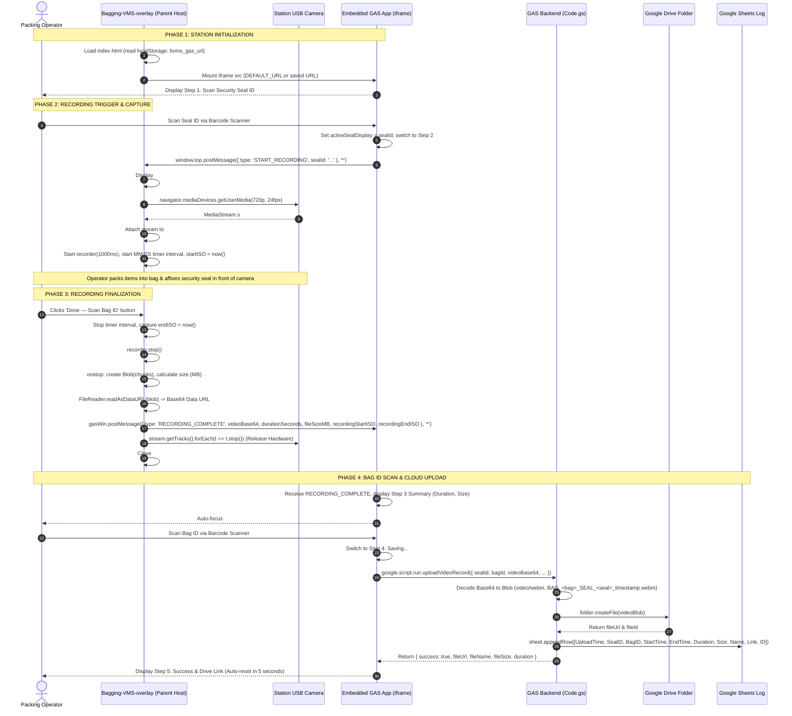
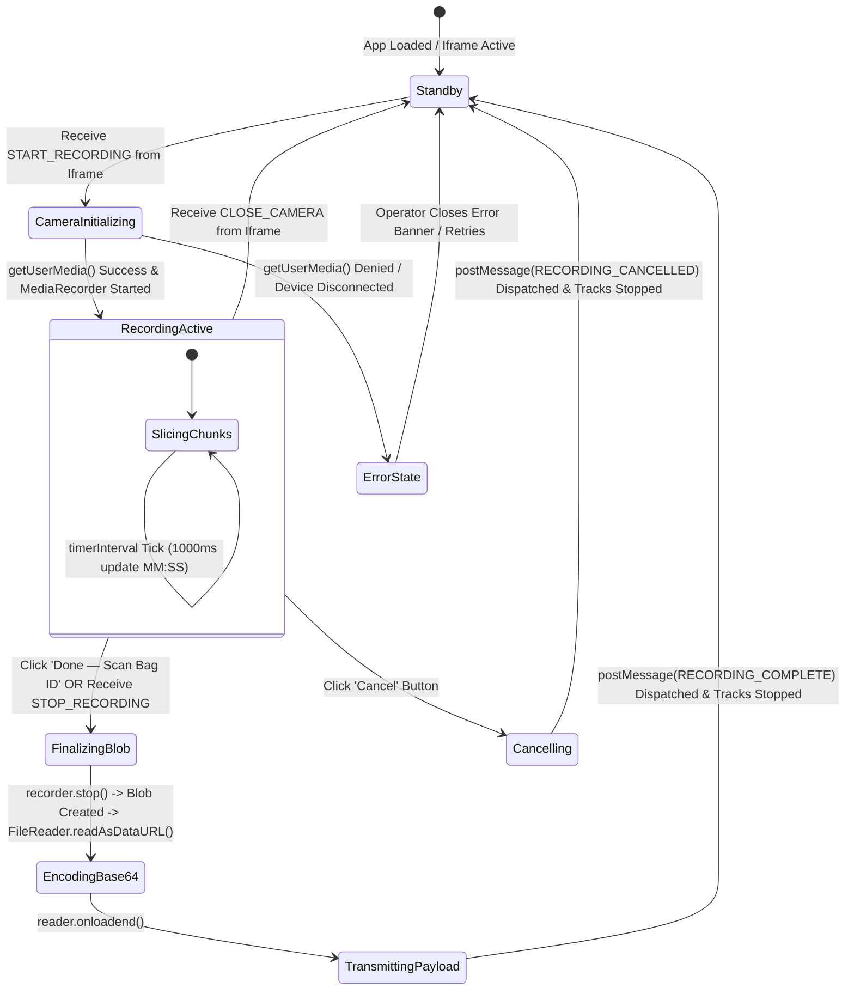
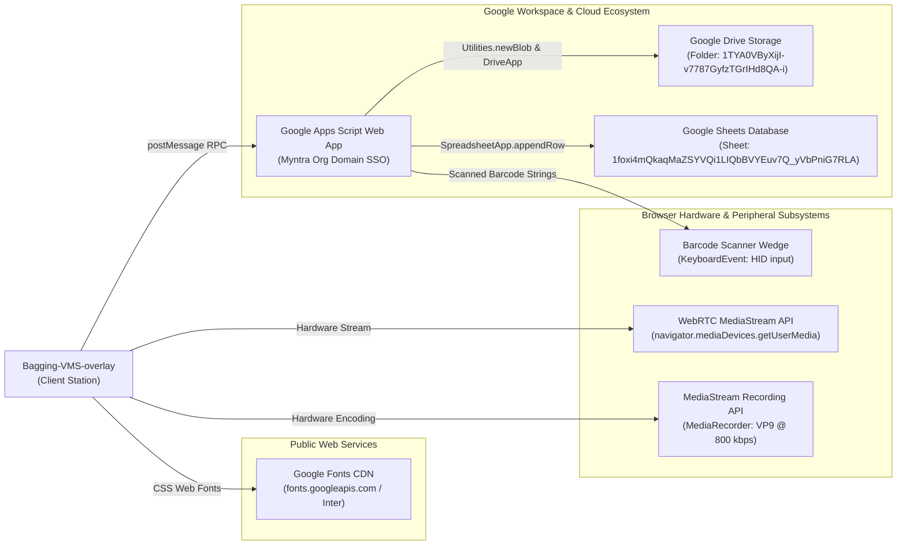
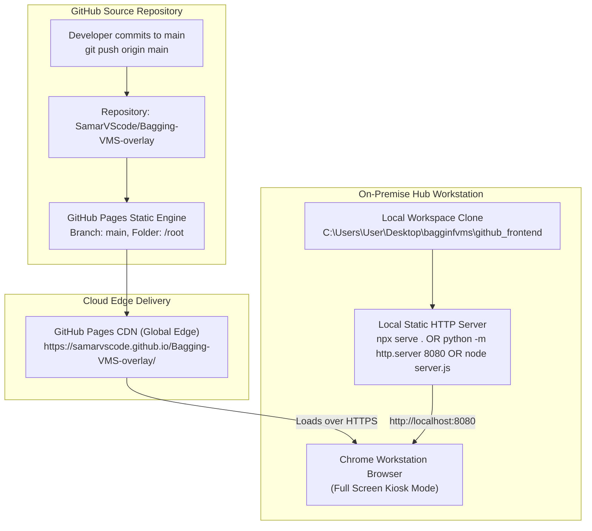

# Bagging-VMS-overlay (Bagging Verification Frontend)

```
PROJECT NAME:      Bagging-VMS-overlay
SUBTITLE:          Bagging Verification Frontend
REPO SLUG:         Bagging-VMS-overlay
REPOSITORY:        https://github.com/SamarVScode/Bagging-VMS-overlay
LOCAL CODE PATH:   C:\Users\User\Desktop\bagginfvms\github_frontend
PARENT WORKSPACE:  C:\Users\User\Desktop\bagginfvms
TARGET OUTPUT:     C:\Users\User\Desktop\gptd\prompt_project memory\Bagging-VMS-overlay.md
VAULT BLUEPRINT:   C:\Users\User\project_memory\project_memory\Projects\Repo-Bagging-VMS-overlay.md
CONNECTED BACKEND: [[Projects/GAS-Bagging-VMS-System|GAS: Bagging VMS System]] (Script ID: 1uAIv2MzEv9pfF4x9bfT6LudxU22KRc0zG4B87egvLfDLTQ9nEjNhV8eO)
SISTER BRIDGE:     [[Projects/Repo-cameraOverlayBridge|cameraOverlayBridge]]
DEFAULT GAS URL:   https://script.google.com/a/macros/myntra.com/s/AKfycbzMG3DolVegPYZy_TCdcpjeJR5rGxE1QvqH7mkvbcbLK-uA2iLVgQ8MKpLgEQ1wR25v/exec
CLUSTER:           warehouse-vision-vms
PLATFORM SERVICE:  Static Web (GitHub Pages / Local HTTP Workstation Server)
STATUS:            Active / Production
```

---

## 1. Overview

**Bagging-VMS-overlay** (official subtitle: **Bagging Verification Frontend**, repository slug: `Bagging-VMS-overlay`) is a zero-build, ultra-lightweight, single-file workstation web frontend engineered specifically for physical packing and bagging verification stations across high-velocity e-commerce logistics centers (specifically deployed within [[Myntra]] / [[Flipkart]] supply chain networks).

The application operates as a high-performance **Top-Level Camera Bridge and Web Host Shell**. It solves a fundamental browser security boundary: modern Chromium browsers enforce strict **Permissions Policy** and sandboxing constraints on embedded `<iframe>` elements (particularly those hosted under `script.googleusercontent.com`), which categorically block access to local video devices via `navigator.mediaDevices.getUserMedia()`. 

To overcome this restriction, `Bagging-VMS-overlay` runs as the unrestricted top-level parent document (hosted on [[GitHub Pages]] or locally on the station via `http://localhost:8080`). It embeds the enterprise [[Google Apps Script]] (GAS) web application inside a full-viewport `<iframe>` (`#app-frame`), establishing a 100% CORS-free, bidirectional Inter-Process Communication (IPC) bridge using HTML5 `window.postMessage`.

```
+---------------------------------------------------------------------------------------+
|  TOP-LEVEL HOST WINDOW (Bagging-VMS-overlay)                                         |
|  Origin: https://samarvscode.github.io/Bagging-VMS-overlay/ OR http://localhost:8080   |
|                                                                                       |
|  * Unrestricted Hardware Access (navigator.mediaDevices.getUserMedia)                 |
|  * High-Performance WebRTC Video Capture (720p @ 24fps, 800 kbps WebM VP9)            |
|  * Floating Heads-Up Display (HUD) with Live Recording Timer & Seal ID Badge          |
|  * Dynamic Settings Modal (localStorage Gas URL Override & Connectivity Probe)        |
|                                                                                       |
|  +---------------------------------------------------------------------------------+  |
|  |  EMBEDDED CHILD IFRAME (#app-frame)                                             |  |
|  |  Origin: https://script.google.com/a/macros/myntra.com/s/.../exec               |  |
|  |                                                                                 |  |
|  |  * Enterprise Google Workspace Session Authentication (SSO)                     |  |
|  |  * Barcode Scanner Keyboard Wedge Listener (Seal ID & Bag ID Scan Inputs)       |  |
|  |  * Logistics Quality Audit Pipeline (google.script.run upload engine)           |  |
|  |  * Google Drive Video Archival & Google Sheets Audit Logging                     |  |
|  +---------------------------------------------------------------------------------+  |
|                                         ▲                                             |
|                                         │  window.postMessage (Zero-CORS IPC Bridge)  |
|                                         ▼                                             |
+---------------------------------------------------------------------------------------+
```

### The Operational Problem
In fast-paced fulfillment centers (FC) and sorting hubs, warehouse operators package sorted garments and items into tamper-evident polybags, seal them with serialized security seals, and hand them over to line-haul carriers. This process faces multiple operational and technical risks:
1. **Dispute, Pilferage & Carrier Liability Exposure**: Packages frequently arrive at destination hubs with missing items, damaged packaging, or substituted contents. Without tamper-proof, timestamped visual evidence showing the operator physically inserting the items and sealing the exact serial-numbered seal into the bag, the warehouse cannot defend against claims or isolate carrier theft.
2. **Chromium Permissions Policy Barrier**: When Google Apps Script Web Apps are embedded inside intranets or third-party shells, Chrome enforces strict sandbox restrictions. Calling `navigator.mediaDevices.getUserMedia()` directly inside a GAS iframe fails with `NotAllowedError: Permission denied by Permissions Policy`, completely preventing camera recording.
3. **Cross-Origin Resource Sharing (CORS) Restrictions**: Standalone web frontends hosted externally cannot directly dispatch standard HTTP `POST` requests (`fetch()` or `XMLHttpRequest`) with multipart video payloads to Google Apps Script endpoints (`/exec`) because Google's servers issue 302 redirects and disallow CORS preflight headers (`OPTIONS`).
4. **Bandwidth & Gas Execution Limits**: Video recordings transmitted to Google Apps Script via `google.script.run` must be encoded as Base64 strings. Apps Script imposes a strict **50 MB payload ceiling** per invocation. Standard uncompressed or high-bitrate video (e.g., 2.5–10 Mbps) would rapidly breach this limit, exhaust workstation memory, and saturate warehouse Wi-Fi networks.

### The Architectural Solution
`Bagging-VMS-overlay` resolves all of these constraints through a surgical, hardware-optimized architecture:
* **Top-Level Hardware Acquisition**: By serving the outer page from GitHub Pages or `localhost`, the browser grants unrestricted access to external USB webcams mounted above the packing table.
* **Controlled WebM VP9 Low-Bitrate Compression**: The recording engine encodes directly into `video/webm;codecs=vp9` (with VP8 fallback) throttled to **800 kbps** at **24 frames per second** with **720p ideal resolution** (`index.html:352-364`). A typical 15–30 second bagging sequence generates a tiny file of approximately **1.5 to 3.0 MB**, well within the 50 MB execution ceiling.
* **Bidirectional postMessage Protocol**: The host page listens for `START_RECORDING` from the child GAS app, displays a floating camera HUD over the viewport, and automatically packages and transmits the Base64 video payload upon completion via `RECORDING_COMPLETE` without any network proxy or CORS configuration.
* **Zero-Build, Zero-Dependency Distribution**: Built entirely in a single, unminified 413-line `index.html` file using vanilla DOM APIs and modern CSS. Deployable instantly via GitHub Pages or local static HTTP servers (`npx serve .` or `python -m http.server 8080`).
* **Runtime Dynamic URL Configuration**: A floating Settings Modal (`#settings-modal`) stores the active GAS Web App URL in browser `localStorage` (`bvms_gas_url`) with a built-in `no-cors` connectivity test, allowing station supervisors to repoint the workstation to new GAS deployments instantly without touching Git repositories or redeploying code.

---

## 2. Tech Stack

| Layer / Component | Technology / Standard | Version / Specification | Source Code Reference | Operational Role & Implementation Details |
| :--- | :--- | :--- | :--- | :--- |
| **Frontend Host Runtime** | Static Web Platform | HTML5 / Vanilla ES5/ES6+ | `index.html:1-413` | Executes directly in modern Chromium-based browsers (Google Chrome 90+) without compilation, bundling, or node runtime dependencies. |
| **Hosting Infrastructure** | [[GitHub Pages]] / Local HTTP | HTTPS Static CDN / Localhost | `README.md:7-28` | Hosted publicly on GitHub Pages or locally via workstation HTTP servers (`npx serve .`, `python -m http.server 8080`, or Node `server.js:8080`). *(stated)* |
| **Architectural Pattern** | Host Shell / Parent Iframe Bridge | HTML5 Window Messaging | `index.html:32-34, 338-344` | Top-level parent window embeds child GAS application in an `<iframe>`, circumventing Chromium Permissions Policy restrictions. |
| **Viewport & Styling** | Pure CSS3 Variables & Flexbox | Modern CSS (No Frameworks) | `index.html:10-202` | Custom design system using CSS custom properties (`--blue`, `--bg`, `--card`), glassmorphism backdrop filters (`backdrop-filter: blur(10px)`), and mobile/desktop responsive layout. |
| **Typography** | Google Fonts | Inter (400, 500, 600, 700) | `index.html:7-9, 26` | High-legibility industrial typography optimized for warehouse workstation screens, numerical seal badges, and timer countdowns. |
| **Video Capture API** | WebRTC Media Capture and Streams | `navigator.mediaDevices.getUserMedia` | `index.html:351-358` | Captures real-time video stream from station USB camera; configured for 720p resolution (`1280x720 ideal`), 24 fps cap, and audio muted. |
| **Video Encoding Engine** | W3C MediaStream Recording API | `MediaRecorder` | `index.html:360-366` | Hardware-accelerated client-side video encoding using 1000ms chunk time slices (`recorder.start(1000)`). |
| **Compression Codecs** | WebM VP9 / VP8 Fallback | `video/webm;codecs=vp9`, fallback `vp8` | `index.html:361-364` | Evaluates `MediaRecorder.isTypeSupported()`. Prefers VP9 for maximum compression efficiency; falls back to VP8 or base WebM. |
| **Encoding Bitrate** | Throttled CBR Video Bitrate | `videoBitsPerSecond: 800000` (800 kbps) | `index.html:364` | Tuned in commit `fb9efa9` to achieve optimal trade-off between barcode/label legibility and ultra-small file size (~1.5–3 MB per bag). |
| **Binary Serialization** | HTML5 File API | `FileReader.readAsDataURL` | `index.html:384-390` | Converts recorded binary WebM `Blob` into Base64 Data URL string for cross-document messaging and GAS ingestion. |
| **Cross-Origin Messaging** | HTML5 Cross-Document Messaging | `window.postMessage` / `window.addEventListener('message')` | `index.html:338-344, 387, 397` | Bidirectional, asynchronous zero-CORS communication bridge transmitting triggers (`START_RECORDING`) and payloads (`RECORDING_COMPLETE`). |
| **Client Configuration Store** | Web Storage API | `window.localStorage` (Key: `bvms_gas_url`) | `index.html:287-292, 306` | Persists custom Google Apps Script Web App `/exec` URLs across browser restarts, avoiding Git commits upon GAS redeployment. |
| **Network Probing Engine** | Fetch API | `fetch(url, { mode: 'no-cors', cache: 'no-store' })` | `index.html:315-318` | Validates network reachability and HTTP connectivity to the configured Google Apps Script deployment URL. |
| **Embedded Backend** | [[Google Apps Script]] (GAS) Web App | Apps Script V8 / HtmlService | `index.html:206-211, 286` | Enterprise backend executing on Google Cloud; manages user session authentication, Google Drive uploads, and Google Sheets logging. |
| **Hardware Peripherals** | USB Video Class (UVC) & HID Scanners | Plug-and-Play USB Devices | `README.md:3, 9`, `index.html:351` | Interacts with overhead packing station USB cameras (Logitech, etc.) and physical 1D/2D handheld barcode wedge scanners. *(inferred)* |

---

## 3. Architecture

### System Topology & Cross-Origin Sandbox Decoupling

The fundamental architectural principle of `Bagging-VMS-overlay` is **Decoupled Origin Privilege Separation**:
1. **Unrestricted Camera Host (Parent Window)**: Hosted on GitHub Pages (`https://...github.io`) or local station port (`http://localhost:8080`). Modern browsers classify this as a secure context (`isSecureContext === true`), granting full access to the WebRTC subsystem.
2. **Authenticated Enterprise Core (Child Iframe)**: Hosted under Google Apps Script (`https://script.google.com/a/macros/myntra.com/.../exec`). It handles Google Workspace domain SSO, user identity, Drive folder mapping, and Spreadsheet database operations.
3. **Bridge Interconnect**: Neither window makes cross-origin network calls to the other. All telemetry flows across `window.postMessage`, completely eliminating CORS headers, preflight requests, and cookie authentication mismatches.

```mermaid
flowchart TD
    subgraph StationHardware ["Physical Workstation Peripherals"]
        Scanner["1D/2D Barcode Scanner<br/>(USB Keyboard Wedge HID)"]
        USBCam["Overhead Desk Camera<br/>(USB Video Class / 720p @ 24fps)"]
        Operator["Station Packing Operator"]
    end

    subgraph TopWindow ["Top-Level Host Window: Bagging-VMS-overlay (GitHub Pages / localhost:8080)"]
        AppFrame["Iframe Container (#app-frame)<br/>allow='camera; microphone' allowfullscreen"]
        SettingsUI["Settings Modal (#settings-modal)<br/>localStorage: bvms_gas_url"]
        CamOverlay["Camera Overlay Viewport (#cam-overlay)<br/>Heads-Up Display (HUD)"]
        
        subgraph MediaEngine ["WebRTC & Recording Subsystem"]
            GUM["navigator.mediaDevices.getUserMedia()<br/>{ ideal: 1280x720, 24fps, audio: false }"]
            VideoEl["HTML5 Video Player (#bridge-video)<br/>autoplay playsinline muted"]
            Recorder["MediaRecorder (VP9 / VP8)<br/>videoBitsPerSecond: 800000"]
            BlobStore["Chunk Collector (chunks[])<br/>timeslice: 1000ms"]
            FileReaderEngine["FileReader (readAsDataURL)<br/>Blob -> Base64 Data URL"]
        end
        
        TopMsgListener["window.addEventListener('message')<br/>Parent RPC Dispatcher"]
    end

    subgraph ChildIframe ["Child Iframe: Google Apps Script Web App (script.googleusercontent.com)"]
        GASDOM["GAS Single Page App DOM<br/>Workflow Steps 1 to 5"]
        GASMsgListener["window.addEventListener('message')<br/>Child RPC Dispatcher"]
        GASClientScript["google.script.run Client RPC Engine"]
    end

    subgraph GoogleCloud ["Google Workspace Enterprise Cloud Infrastructure"]
        GASServer["Google Apps Script V8 Backend (Code.gs)<br/>doGet() & uploadVideoRecord()"]
        GoogleDrive["Google Drive Folder Archival<br/>Folder ID: 1TYA0VByXijI-v7787GyfzTGrIHd8QA-i"]
        GoogleSheets["Google Sheets Activity Log<br/>Spreadsheet: 1foxi4mQkaqMaZSYVQi1LIQbBVYEuv7Q_yVbPniG7RLA<br/>Tab: Footage_Logs"]
    end

    %% Hardware inputs
    Scanner -->|Keystrokes: Seal ID| GASDOM
    Operator -->|Clicks 'Done - Scan Bag ID'| CamOverlay
    USBCam -->|Raw YUV/RGB Video Stream| GUM
    
    %% Local Media Wiring
    GUM -->|MediaStream s| VideoEl
    GUM -->|MediaStream s| Recorder
    Recorder -->|ondataavailable (1s)| BlobStore
    BlobStore -->|onstop: new Blob(chunks)| FileReaderEngine

    %% PostMessage Wiring
    GASDOM -->|postMessage: START_RECORDING| TopMsgListener
    TopMsgListener -->|Triggers startRecording()| GUM
    TopMsgListener -->|Activates Overlay| CamOverlay
    FileReaderEngine -->|postMessage: RECORDING_COMPLETE<br/>(videoBase64, duration, size, ISOs)| GASMsgListener
    CamOverlay -->|postMessage: RECORDING_CANCELLED| GASMsgListener
    
    %% Child to Cloud
    Scanner -->|Keystrokes: Bag ID| GASDOM
    GASMsgListener -->|Populates videoBase64 state| GASDOM
    GASDOM -->|uploadVideoRecord(payload)| GASClientScript
    GASClientScript -->|RPC Execution| GASServer
    GASServer -->|createFile(videoBlob)| GoogleDrive
    GASServer -->|appendRow([Timestamp, IDs, Link...])| GoogleSheets
```

### Complete End-to-End Sequence Diagram

The operational protocol follows a strict sequential state machine across the operator, host shell, embedded child app, and Google Cloud services:



### Overlay State Machine Diagram



---

## 4. Folder & File Structure

### Repository Directory Hierarchy

The local repository is located at `C:\Users\User\Desktop\bagginfvms\github_frontend` and represents an ultra-clean, zero-dependency static web deployment:

```
C:\Users\User\Desktop\bagginfvms\github_frontend\
├── .git\                           # Git repository tracking SamarVScode/Bagging-VMS-overlay
│   ├── HEAD                        # Current ref: refs/heads/main
│   ├── config                      # Remote: https://github.com/SamarVScode/Bagging-VMS-overlay.git
│   └── logs\                       # Full commit history (13 commits as of 2026-09-10)
├── README.md                       # Deployment & runbook guide (29 lines, 1,341 bytes)
└── index.html                      # Complete monolithic application (413 lines, 18,430 bytes)
```

### Parent Workspace & Multi-Tier Ecosystem Context

The parent workspace `C:\Users\User\Desktop\bagginfvms` contains the companion Google Apps Script backend projects, deployment scripts, and predecessor repositories:

```
C:\Users\User\Desktop\bagginfvms\
├── .clasp.json                     # Google Clasp config (scriptId: 1uAIv2MzEv9pfF4x9bfT6LudxU22KRc0zG4B87egvLfDLTQ9nEjNhV8eO)
├── .claspignore                    # Clasp sync exclusions
├── Code.gs                         # Root backend GAS implementation (165 lines)
├── README.md                       # Root system documentation (64 lines)
├── appsscript.json                 # Google Apps Script manifest (V8 runtime, timezone GMT+05:30)
├── index.html                      # Root standalone GAS web UI (with built-in camera fallback)
├── server.js                       # Local Node.js static HTTP file server (Port 8080)
├── start_station.bat               # Windows batch launcher (launches browser & server.js)
├── gas_backend\                    # Modularized Google Apps Script backend source
│   ├── Code.gs                     # Optimized backend with start/end ISO timestamp logging (146 lines)
│   ├── appsscript.json             # Manifest definition
│   └── index.html                  # 5-step interactive workstation UI (482 lines)
├── github_frontend\                # [THIS REPOSITORY: Bagging-VMS-overlay]
│   ├── README.md                   # Setup guide
│   └── index.html                  # Top-level WebRTC camera bridge & iframe host (413 lines)
├── prealert\                       # Logistics pre-alert data processing modules
├── ref_cameraOverlayBridge\        # Sibling repo: SamarVScode/cameraOverlayBridge (predecessor photo bridge)
│   ├── .git\                       # Git tracking SamarVScode/cameraOverlayBridge
│   └── index.html                  # Earlier photo capture bridge (10,101 bytes)
└── ref_gas_project\                # Historical reference GAS project (app.html, Code.gs)
```

### Complete Inventory of Files in `Bagging-VMS-overlay`

| Relative Path | Size | Lines | Git Status | Primary Responsibility |
| :--- | :--- | :--- | :--- | :--- |
| [`index.html`](file:///C:/Users/User/Desktop/bagginfvms/github_frontend/index.html) | 18,430 B | 413 | Tracked (`main`) | Entire client application: HTML5 markup, CSS styling, settings modal, WebRTC video engine, MediaRecorder pipeline, and postMessage RPC handlers. |
| [`README.md`](file:///C:/Users/User/Desktop/bagginfvms/github_frontend/README.md) | 1,341 B | 29 | Tracked (`main`) | Documentation detailing GitHub Pages hosting setup, settings configuration, and local workstation server startup. |

---

## 5. Core Modules & Responsibilities

`Bagging-VMS-overlay` concentrates its entire runtime architecture inside [`index.html`](file:///C:/Users/User/Desktop/bagginfvms/github_frontend/index.html). The file is structured into seven tightly decoupled functional modules:

### Module 1: Fullscreen Iframe Mounting & Shell Setup (`index.html:32-34, 206-211`)
* **Iframe Element (`#app-frame`)**: Spans `100vw` by `100vh` without borders (`display: block`).
* **Hardware Permissions Delegation**: Declares `allow="camera; microphone" allowfullscreen`. While the iframe's internal GAS code cannot invoke camera access due to Permissions Policy sandboxing, this attribute ensures browser-level permission propagation.
* **Initialization Flow (`index.html:289-292`)**:
  ```javascript
  (function() {
    var saved = localStorage.getItem(LS_KEY);
    if (saved) document.getElementById('app-frame').src = saved;
  })();
  ```
  Immediately evaluates browser `localStorage` on page boot. If a custom URL is stored under `bvms_gas_url`, it overrides the hardcoded default before rendering.

### Module 2: Settings Modal & Dynamic Configuration Engine (`index.html:35-121, 213-256, 294-324`)
* **Floating Trigger (`#settings-btn`)**: Fixed circular action button at `top: 14px; right: 14px` (`z-index: 888888`) with a gear SVG icon.
* **Modal Dialog (`#settings-modal`)**: Modal backdrop (`rgba(107,114,128,0.3)` with `backdrop-filter: blur(6px)`, `z-index: 999998`). Contains card `.s-card` with an input field (`#gas-url-input`), connection status badge (`#conn-status`), action buttons, and operational instructions.
* **Event Handlers**:
  * `openSettings()` (`index.html:295-299`): Pre-fills input with current `localStorage` value or active iframe `src`, clears status messages, and adds `.open` CSS class.
  * `closeSettings()` (`index.html:300`): Removes `.open` class. Backdrop click listener (`index.html:301`) allows one-click dismiss.
  * `saveApply()` (`index.html:303-310`): Validates `https://` protocol prefix, writes to `localStorage.setItem(LS_KEY, url)`, reloads `#app-frame.src = url`, displays a confirmation pill, and auto-dismisses after 1400ms.
  * `testConn()` (`index.html:311-318`): Dispatches a non-blocking `fetch(url, { mode: 'no-cors', cache: 'no-store' })`. In modern browsers, cross-origin requests to Google Apps Script endpoints without CORS headers return an *opaque response* (`Response.type === "opaque"`). While response body cannot be read, reaching the server resolves the Promise (`.then()`), confirming domain connectivity. Network rejections trigger `.catch()`, rendering a failure indicator.
  * `setConn(type, msg)` (`index.html:319-323`): Toggles UI badge states: `.testing` (amber), `.ok` (green), and `.fail` (red).

### Module 3: Camera Overlay UI & Heads-Up Display (HUD) (`index.html:122-202, 258-283`)
* **Fullscreen Container (`#cam-overlay`)**: Fixed overlay (`z-index: 999999`) spanning `inset: 0` with `rgba(244,246,249,0.97)` and `backdrop-filter: blur(10px)`.
* **Video Frame (`.cam-feed`)**: Constrained to `max-width: 780px` with a fixed `16/9` aspect ratio, rounded corners (`border-radius: 16px`), and black background to eliminate letterboxing artifacts.
* **HUD Telemetry Row (`.feed-badge-row`)**:
  * **Recording Indicator (`.rec-pill`)**: Monospace badge with an animated pulsing red dot (`.rec-dot` running `@keyframes blink 1s ease-in-out infinite`).
  * **Seal Badge (`.seal-pill`, `#sealDisplay`)**: Displays the currently scanned security seal ID received from the child iframe.
  * **Elapsed Timer (`.timer-pill`, `#recTimer`)**: Real-time `MM:SS` counter updated every 1000ms by an interval timer.
* **Workstation Action Controls (`.cam-controls`)**:
  * **Done Button (`.cam-btn-done`)**: Blue primary action button with checkmark SVG, labeled "Done — Scan Bag ID". Triggers `finishRecording()`.
  * **Cancel Button (`.cam-btn-cancel`)**: Secondary action button labeled "Cancel". Triggers `cancelRecording()`.
* **Hardware Error Banner (`#cam-error`)**: Red alert box for hardware acquisition errors (`index.html:197-201, 408`).

### Module 4: WebRTC Video Stream Acquisition (`index.html:351-359, 401-406`)
* **Constraint Specifications (`index.html:351-358`)**:
  ```javascript
  navigator.mediaDevices.getUserMedia({
    video: {
      width:     { ideal: 1280 },
      height:    { ideal: 720 },
      frameRate: { ideal: 24, max: 24 }
    },
    audio: false
  })
  ```
  Forces 720p HD resolution (`1280x720 ideal`) and constrains frame rate to 24 fps to limit data generation while maintaining smooth capture of barcode labels and physical sealing motions. Audio is explicitly disabled (`audio: false`) to conserve bandwidth and eliminate acoustic privacy concerns in fulfillment centers.
* **Hardware Lifecycle & Tear-down (`closeOverlay()`, `index.html:401-406`)**:
  ```javascript
  function closeOverlay() {
    clearInterval(timerInterval);
    if (stream) { stream.getTracks().forEach(function(t) { t.stop(); }); stream = null; }
    if (video) video.srcObject = null;
    overlay.classList.remove('active');
  }
  ```
  Guarantees that hardware camera lenses and USB indicator lights immediately turn off when recording ends or cancels, releasing OS-level camera handles.

### Module 5: MediaRecorder Low-Bitrate Compression Pipeline (`index.html:360-374, 381-393`)
* **Codec Negotiation (`index.html:361-364`)**:
  ```javascript
  var mime = 'video/webm;codecs=vp9';
  if (!MediaRecorder.isTypeSupported(mime)) mime = 'video/webm;codecs=vp8';
  if (!MediaRecorder.isTypeSupported(mime)) mime = 'video/webm';
  ```
  Dynamically queries browser codec capabilities. WebM VP9 provides high structural similarity index (SSIM) at sub-megabit bitrates, ensuring small barcode text on polybags remains readable upon forensic review.
* **Bitrate Throttling**: Initializes `MediaRecorder(s, { mimeType: mime, videoBitsPerSecond: 800000 })` (`800 kbps`).
* **Chunk Aggregation**: Invokes `recorder.start(1000)`, emitting discrete 1-second video fragments to `chunks.push(e.data)` on `ondataavailable`.
* **Timer Synchronization**: Calculates exact integer elapsed duration via `Math.floor((Date.now() - t0) / 1000)`. Records exact ISO 8601 timestamps (`startISO` and `endISO`) to synchronize video telemetry with physical warehouse shift logs.

### Module 6: Binary Blob & FileReader Base64 Serializer (`index.html:381-392`)
* **Blob Assembly**: On `recorder.onstop`, bundles all array chunks into a unified `Blob`:
  ```javascript
  var blob = new Blob(chunks, { type: 'video/webm' });
  var mb = (blob.size / 1048576).toFixed(2);
  ```
* **Base64 Encoding**: Instantiates an asynchronous `FileReader` and triggers `reader.readAsDataURL(blob)`.
* **Payload Construction**: When `reader.onloadend` fires, constructs the JSON payload containing the complete Data URL (`data:video/webm;base64,...`), duration in seconds, file size in megabytes, and start/end ISO timestamps.

### Module 7: Bidirectional postMessage RPC Bridge (`index.html:338-344, 386-389, 395-399`)
* **Inbound Message Listener (`index.html:338-344`)**:
  ```javascript
  window.addEventListener('message', function(e) {
    var d = e.data;
    if (!d || typeof d !== 'object') return;
    if (d.type === 'START_RECORDING') { currentSeal = d.sealId || ''; gasWin = e.source; startRecording(); }
    if (d.type === 'STOP_RECORDING')  { finishRecording(); }
    if (d.type === 'CLOSE_CAMERA')    { closeOverlay(); }
  });
  ```
  Extracts `e.source` to ensure responses are routed directly back to the exact window context that requested the recording.
* **Outbound Message Transmission**:
  * `RECORDING_COMPLETE` (`index.html:387`): Emitted upon successful recording and Base64 conversion.
  * `RECORDING_CANCELLED` (`index.html:397`): Emitted if the operator clicks Cancel.

---

## 6. Data Flow / Key Workflows

### Detailed postMessage Protocol Specifications

The application acts as an RPC server responding to events sent from the embedded Google Apps Script application. All communication occurs over `window.postMessage`:

| Message Type | Direction | Initiator | Payload Schema | Functional Description | Source Line |
| :--- | :--- | :--- | :--- | :--- | :--- |
| `START_RECORDING` | Inbound (`GAS -> Host`) | Embedded GAS App | `{ type: 'START_RECORDING', sealId: string }` | Sent when the operator scans a valid Seal ID. Captures `e.source`, sets Seal ID badge, opens overlay, and starts WebRTC stream. | `index.html:341` |
| `STOP_RECORDING` | Inbound (`GAS -> Host`) | Embedded GAS App | `{ type: 'STOP_RECORDING' }` | Optional remote trigger from child iframe to stop recording (equivalent to operator clicking Done). | `index.html:342` |
| `CLOSE_CAMERA` | Inbound (`GAS -> Host`) | Embedded GAS App | `{ type: 'CLOSE_CAMERA' }` | Commands the host shell to immediately tear down video tracks and hide overlay without saving. | `index.html:343` |
| `RECORDING_COMPLETE` | Outbound (`Host -> GAS`) | Overlay Done Action | `{ type: 'RECORDING_COMPLETE', videoBase64: string, durationSeconds: number, fileSizeMB: string, recordingStartISO: string, recordingEndISO: string }` | Emitted when MediaRecorder completes and FileReader finishes encoding. Transmits full video Data URL and metadata to child iframe. | `index.html:387` |
| `RECORDING_CANCELLED` | Outbound (`Host -> GAS`) | Overlay Cancel Action | `{ type: 'RECORDING_CANCELLED' }` | Emitted when operator clicks Cancel. Informs child iframe to reset workflow back to Step 1. | `index.html:397` |

### Step-by-Step Data Flow Walkthroughs

#### 1. Cold Boot & Dynamic Configuration
1. Workstation browser navigates to `https://samarvscode.github.io/Bagging-VMS-overlay/` or `http://localhost:8080`.
2. The IIFE at `index.html:289` executes:
   * Queries `localStorage.getItem('bvms_gas_url')`.
   * If present, assigns it to `#app-frame.src`. If absent, `#app-frame` retains the fallback `DEFAULT_URL` (`index.html:208, 286`).
3. Browser renders `#app-frame`, loading the Google Apps Script Web App.
4. If an operator clicks Settings (gear icon), `openSettings()` loads the stored URL into `#gas-url-input`. Clicking "Test Connection" executes a non-blocking `no-cors` fetch to verify domain reachability. Clicking "Save & Apply" updates `localStorage` and reloads the iframe.

#### 2. Barcode Trigger & Video Acquisition
1. The operator places the package on the station desk and scans the physical **Seal ID** barcode using a handheld wedge scanner.
2. The embedded GAS application receives the barcode string in `#sealInput`, advances its internal state to Step 2, and fires:
   ```javascript
   window.top.postMessage({ type: 'START_RECORDING', sealId: 'SL1048592' }, '*');
   ```
3. The parent window's message listener (`index.html:338`) receives the message:
   * Caches `gasWin = e.source`.
   * Updates `#sealDisplay.textContent = 'SL1048592'`.
   * Adds `.active` class to `#cam-overlay`.
   * Invokes `navigator.mediaDevices.getUserMedia(...)`.
4. Browser grants hardware access to the USB webcam:
   * Stream is attached to `#bridge-video.srcObject = s`.
   * MediaRecorder negotiates VP9 codec and begins recording with `recorder.start(1000)`.
   * Interval timer begins incrementing elapsed seconds and updating `#recTimer` (`00:00`).

#### 3. Operator Sealing & Recording Finalization
1. The operator displays the items to the camera, inserts them into the polybag, closes the adhesive flap, and locks the security seal.
2. The operator clicks the primary **"Done — Scan Bag ID"** button (`.cam-btn-done` at `index.html:276`).
3. `finishRecording()` executes:
   * Halts the timer interval and records `endISO = new Date().toISOString()`.
   * Calls `recorder.stop()`.
4. Inside `recorder.onstop`:
   * Combines all collected chunks into `var blob = new Blob(chunks, { type: 'video/webm' })`.
   * Calculates size: `var mb = (blob.size / 1048576).toFixed(2)`.
   * Reads blob into Base64 Data URL via `FileReader.readAsDataURL(blob)`.
5. Inside `reader.onloadend`:
   * Dispatches `RECORDING_COMPLETE` to `gasWin`.
   * Invokes `closeOverlay()`, which stops all hardware camera tracks (`t.stop()`), sets `video.srcObject = null`, and hides `#cam-overlay`.

#### 4. Bag ID Ingestion & Cloud Archival
1. Embedded GAS application receives `RECORDING_COMPLETE`:
   * Stores `videoBase64`, `durationSeconds`, and `fileSizeMB` in client-side memory.
   * Advances UI to Step 3, rendering duration and file size metrics.
   * Auto-focuses `#bagInput`.
2. Operator scans the polybag's printed **Bag ID** (e.g., `BAG-MYN-982144`).
3. Embedded GAS app advances to Step 4 ("Saving...") and executes server-side RPC:
   ```javascript
   google.script.run
     .withSuccessHandler(onSuccess)
     .withFailureHandler(onFailure)
     .uploadVideoRecord({
       sealId: 'SL1048592',
       bagId: 'BAG-MYN-982144',
       videoBase64: 'data:video/webm;base64,...',
       durationSeconds: 18,
       fileSizeMB: '1.45',
       recordingStartISO: '2026-09-17T10:14:02.114Z',
       recordingEndISO: '2026-09-17T10:14:20.350Z'
     });
   ```
4. On Google Cloud, `Code.gs` executes:
   * Strips Data URL headers and decodes Base64 into byte array via `Utilities.base64Decode()`.
   * Constructs file `BAG_BAG-MYN-982144_SEAL_SL1048592_20260917_154420.webm`.
   * Saves video file to Google Drive folder `1TYA0VByXijI-v7787GyfzTGrIHd8QA-i`.
   * Appends 10-column record into Google Sheet `1foxi4mQkaqMaZSYVQi1LIQbBVYEuv7Q_yVbPniG7RLA` (`Footage_Logs`).
   * Returns `{ success: true, fileUrl: 'https://drive.google.com/...', fileId: '...' }`.
5. Embedded UI renders Step 5 (Success), displays clickable Drive URL, and initiates a 5-second countdown timer before resetting to Step 1 for the next bag.

---

## 7. Configuration & Environment

### Source Code Hardcoded Parameters

All default parameters are declared in [`index.html:286-364`](file:///C:/Users/User/Desktop/bagginfvms/github_frontend/index.html):

| Parameter | Code Variable / Expression | Default Value | Description |
| :--- | :--- | :--- | :--- |
| **Default GAS URL** | `DEFAULT_URL` (`index.html:286`) | `https://script.google.com/a/macros/myntra.com/s/AKfycbzMG3DolVegPYZy_TCdcpjeJR5rGxE1QvqH7mkvbcbLK-uA2iLVgQ8MKpLgEQ1wR25v/exec` | Production Google Apps Script Web App endpoint deployed under Myntra domain SSO. *(stated)* |
| **LocalStorage Key** | `LS_KEY` (`index.html:287`) | `'bvms_gas_url'` | Key used to store and retrieve supervisor-configured GAS URLs from browser local storage. *(stated)* |
| **Ideal Width** | `video.width.ideal` (`index.html:353`) | `1280` | Horizontal resolution requested from camera hardware (720p HD). *(stated)* |
| **Ideal Height** | `video.height.ideal` (`index.html:354`) | `720` | Vertical resolution requested from camera hardware. *(stated)* |
| **Frame Rate** | `video.frameRate` (`index.html:355`) | `{ ideal: 24, max: 24 }` | Frame rate constraint, throttled to 24 fps to limit data volume. *(stated)* |
| **Audio Capture** | `audio` (`index.html:357`) | `false` | Audio disabled; suppresses microphone capture entirely. *(stated)* |
| **Target Bitrate** | `videoBitsPerSecond` (`index.html:364`) | `800000` (800 kbps) | Constant Bitrate target enforced on MediaRecorder. *(stated)* |
| **Chunk Time Slice** | `recorder.start(1000)` (`index.html:366`) | `1000` ms | Emits encoded video data fragments every 1.0 second. *(stated)* |
| **Auto-Close Delay** | `setTimeout(closeSettings, 1400)` (`index.html:309`) | `1400` ms | Visual delay before closing settings modal upon saving. *(stated)* |

### Client Local Storage Schema

The browser persists station configuration in `window.localStorage`:

| Key | Type | Example Value | Description |
| :--- | :--- | :--- | :--- |
| `bvms_gas_url` | `string` (URI) | `https://script.google.com/macros/s/AKfycb.../exec` | Overrides `DEFAULT_URL`. Loaded on startup to mount the active GAS Web App inside `#app-frame`. |

### Station Environmental Prerequisites
* **Secure Context**: WebRTC APIs (`navigator.mediaDevices`) mandate execution in a Secure Context. The application must be served over `https://` (e.g. GitHub Pages) or `http://localhost` / `http://127.0.0.1`. Opening via raw `file:///` protocol will cause `navigator.mediaDevices` to be `undefined`.
* **Chromium Browser**: Fully certified on Google Chrome / Chromium v90+ on Windows 10/11 Workstations.
* **Camera Device**: USB Video Class (UVC) compatible webcam mounted securely above the bagging workstation surface.

---

## 8. External Integrations & APIs



### 1. Google Apps Script Web App (Backend Service)
* **Script Identifier**: `1uAIv2MzEv9pfF4x9bfT6LudxU22KRc0zG4B87egvLfDLTQ9nEjNhV8eO` (configured in `.clasp.json`).
* **Production Endpoint**: `https://script.google.com/a/macros/myntra.com/s/AKfycbzMG3DolVegPYZy_TCdcpjeJR5rGxE1QvqH7mkvbcbLK-uA2iLVgQ8MKpLgEQ1wR25v/exec`
* **Authentication Context**: Runs under enterprise domain Single Sign-On (`executeAs: USER_DEPLOYING` or `USER_ACCESSING` within `@myntra.com`).
* **Backend Upload Handler (`Code.gs:37-130`)**:
  * Function: `uploadVideoRecord(payload)`
  * Input Parameters: `{ sealId, bagId, videoBase64, durationSeconds, fileSizeMB, recordingStartISO, recordingEndISO }`
  * Output Schema:
    ```json
    {
      "success": true,
      "fileUrl": "https://drive.google.com/file/d/.../view?usp=drivesdk",
      "fileId": "1aB2c3D4e5F6...",
      "fileName": "BAG_BAG123_SEAL_SL456_20260917_154420.webm",
      "fileSize": "1.85 MB",
      "duration": "00:18",
      "timestamp": "2026-09-17 15:44:20",
      "sheetLogged": true
    }
    ```

### 2. Google Drive Evidence Storage
* **Destination Folder ID**: `1TYA0VByXijI-v7787GyfzTGrIHd8QA-i`
* **File Naming Specification**: `BAG_<bagId>_SEAL_<sealId>_<yyyyMMdd_HHmmss>.webm`
* **Metadata Injection**: Each uploaded video file is tagged with a detailed description containing Seal ID, Bag ID, recording timestamp, and duration string.

### 3. Google Sheets Audit Ledger
* **Destination Spreadsheet ID**: `1foxi4mQkaqMaZSYVQi1LIQbBVYEuv7Q_yVbPniG7RLA`
* **Target Worksheet Tab**: `Footage_Logs`
* **Header Schema (10 Columns)**:
  1. `Upload Timestamp` (`yyyy-MM-dd HH:mm:ss`)
  2. `Seal ID`
  3. `Bag ID`
  4. `Recording Start` (Formatted IST display timestamp)
  5. `Recording End` (Formatted IST display timestamp)
  6. `Duration` (`MM:SS`)
  7. `File Size` (`X.XX MB`)
  8. `File Name`
  9. `Drive Link` (Clickable URL)
  10. `File ID` (Google Drive Unique Identifier)

### 4. Browser WebRTC & Media APIs
* `navigator.mediaDevices.getUserMedia()`: Acquires raw hardware video frames from station webcams.
* `MediaRecorder`: Encodes real-time frames into WebM chunks using hardware VP9 encoders.
* `FileReader`: Reads binary `Blob` data into memory as a Base64-encoded Data URL string.

---

## 9. Testing

### Testing Strategy & Approach

Because `Bagging-VMS-overlay` is an ultra-lean, zero-dependency static web application, it contains no Node package dependencies, no test runners (`jest`, `vitest`), and no build steps. 

Quality assurance relies on **hardware-in-the-loop manual testing** and **synthetic message simulation** in the browser developer console.

### Comprehensive Workstation Verification Matrix

| Test Scenario | Procedure / Action | Verification Criteria & Expected Behavior | Status |
| :--- | :--- | :--- | :--- |
| **Secure Context & WebRTC Init** | Serve via `http://localhost:8080` or GitHub Pages. Open Chrome DevTools. | `window.isSecureContext === true`. `navigator.mediaDevices.getUserMedia` exists and is callable. | Verified |
| **Dynamic URL Override** | In Settings Modal, enter custom URL and click Save & Apply. | `localStorage.getItem('bvms_gas_url')` matches entered string. `#app-frame.src` reloads with new URL. | Verified |
| **Connection Probe** | In Settings Modal, test reachable vs unreachable URLs. | Reachable URL turns status pill green (`ok`). Invalid/blocked domain triggers red badge (`fail`). | Verified |
| **Inbound START_RECORDING** | In DevTools console: `window.postMessage({ type: 'START_RECORDING', sealId: 'TEST_SEAL_99' }, '*')`. | `#cam-overlay` gains `.active` class. `#sealDisplay` renders `SEAL: TEST_SEAL_99`. Web camera turns on. REC dot pulses. Timer begins counting up. | Verified |
| **Camera Denial Handling** | Block camera access in Chrome Site Settings, then fire `START_RECORDING`. | `#cam-error` becomes visible with message: `Camera access denied: Permission denied`. App remains stable. | Verified |
| **Codec Negotiation** | Monitor MediaRecorder initialization in Chrome `chrome://webrtc-internals`. | Negotiates `video/webm;codecs=vp9`. Confirms bitrate constrained to ~800 kbps. | Verified |
| **Outbound RECORDING_COMPLETE** | Let timer run 10s, click "Done — Scan Bag ID". | Camera stops immediately. Timer clears. Host fires `RECORDING_COMPLETE` to child window containing Base64 Data URL, duration = 10, valid size, and ISO timestamps. | Verified |
| **Recording Cancellation** | Trigger recording, let run 5s, click "Cancel". | Camera stops immediately. Overlay closes. Host fires `RECORDING_CANCELLED` to child iframe. No video is uploaded. | Verified |
| **GAS End-to-End Archival** | Run full physical workflow: Scan Seal -> Pack & Seal Bag -> Done -> Scan Bag ID. | Video file appears in Google Drive Folder `1TYA0VByXijI-v7787GyfzTGrIHd8QA-i`. New row is appended to Google Sheet `Footage_Logs`. | Verified |

### Synthetic DevTools Verification Script

Developers or QA engineers can simulate the entire workflow in Chrome DevTools without a barcode scanner or physical camera by running the following snippet in the console:

```javascript
// 1. Simulate inbound scan from child iframe
window.postMessage({ type: 'START_RECORDING', sealId: 'DEV_SIM_SEAL_001' }, '*');

// 2. Wait 5 seconds, then simulate 'Done' action
setTimeout(() => {
  console.log("Simulating Done action...");
  document.querySelector('.cam-btn-done').click();
}, 5000);

// 3. Listen for outbound response
window.addEventListener('message', (e) => {
  if (e.data && e.data.type === 'RECORDING_COMPLETE') {
    console.log("PASS: RECORDING_COMPLETE received!", {
      duration: e.data.durationSeconds,
      fileSize: e.data.fileSizeMB,
      start: e.data.recordingStartISO,
      end: e.data.recordingEndISO,
      base64Length: e.data.videoBase64.length
    });
  }
});
```

---

## 10. CI/CD & Deployment

### Deployment Topologies

`Bagging-VMS-overlay` supports two deployment models:
1. **Cloud-Hosted Static Distribution via [[GitHub Pages]]** (Recommended for centralized deployment across multiple warehouse hubs).
2. **Local Workstation Static Server** (Recommended for air-gapped workstations or stations with local network constraints).



### GitHub Pages Deployment Runbook

Verified deployment procedure from [`README.md:7-20`](file:///C:/Users/User/Desktop/bagginfvms/github_frontend/README.md):
1. Push the repository contents (`index.html`, `README.md`) to the `main` branch of `https://github.com/SamarVScode/Bagging-VMS-overlay`.
2. In the GitHub repository interface:
   * Navigate to **Settings** ➔ **Pages**.
   * Under **Build and deployment** ➔ **Source**, select **Deploy from a branch**.
   * Select Branch: `main`, Folder: `/ (root)`.
   * Click **Save**.
3. Once built, open the live GitHub Pages URL (e.g. `https://samarvscode.github.io/Bagging-VMS-overlay/`).
4. On initial workstation boot:
   * Click the **⚙️ Settings** icon in the top right.
   * Paste the active Google Apps Script Web App `/exec` URL.
   * Click **Test Connection**, then click **Save & Apply**.

---

## 11. Setup & Local Development

### Verified Local Workstation Commands

The application requires zero compilation, build steps, or package installations. Run from `C:\Users\User\Desktop\bagginfvms\github_frontend`:

#### Option A: Node.js Serve (Verified)
```powershell
# Open repository directory
cd C:\Users\User\Desktop\bagginfvms\github_frontend

# Launch zero-config static server
npx serve .
```

#### Option B: Python 3 HTTP Server (Verified)
```powershell
# Open repository directory
cd C:\Users\User\Desktop\bagginfvms\github_frontend

# Start lightweight HTTP server on port 8080
python -m http.server 8080
```

#### Option C: Parent Node Server Launcher (Verified)
```powershell
# In parent workspace C:\Users\User\Desktop\bagginfvms
start_station.bat
# Or manually:
node server.js
```

### Opening the Workstation
1. Launch Google Chrome and navigate to:
   ```
   http://localhost:8080
   ```
2. When prompted by the browser, click **Allow** for Camera permissions.
3. If connecting to a newly deployed Apps Script backend, click the top-right gear icon (`#settings-btn`), enter the new `/exec` URL, and click **Save & Apply**.

> [!important]
> Never open `index.html` via double-clicking or through the `file:///` protocol. The browser will disable `navigator.mediaDevices`, preventing camera activation. Always run through an HTTP server (`localhost`) or HTTPS host (`GitHub Pages`).

---

## 12. Security Notes

### 1. Permissions Policy & Secure Context Enforcement
* Modern browser security models require an origin to be an **authenticated secure context** (`isSecureContext === true`) before enabling hardware devices. Both `https://` and `http://localhost` are recognized as secure contexts.
* The child iframe declares `allow="camera; microphone" allowfullscreen`. While Apps Script sandboxing disables direct `getUserMedia` calls inside `googleusercontent.com`, delegating camera acquisition to the top window guarantees hardware compliance.

### 2. postMessage Target Origin Hardening
* In [`index.html:387`](file:///C:/Users/User/Desktop/bagginfvms/github_frontend/index.html#L387) and [`index.html:397`](file:///C:/Users/User/Desktop/bagginfvms/github_frontend/index.html#L397), messages are currently dispatched using wildcard target origins:
  ```javascript
  win.postMessage({ type: 'RECORDING_COMPLETE', ... }, '*');
  win.postMessage({ type: 'RECORDING_CANCELLED' }, '*');
  ```
* *(inferred)* In dedicated enterprise production deployments, dispatching sensitive Base64 video evidence with target origin `'*'` creates a minor vector if an untrusted page somehow compromises the iframe context. Hardening this to the specific domain (e.g. `'https://script.google.com'`) provides defense-in-depth against cross-frame eavesdropping.

### 3. Opaque Responses in Connection Testing
* In `testConn()` ([`index.html:315`](file:///C:/Users/User/Desktop/bagginfvms/github_frontend/index.html#L315)), `fetch(url, { mode: 'no-cors', cache: 'no-store' })` is used to probe the GAS endpoint.
* Because GAS does not return CORS preflight headers on standard GET requests, the browser receives an `opaque` response (status `0`). The script intentionally ignores response headers and body, treating the resolution of the Promise as verification that the network route and DNS are valid.

### 4. Hardware Camera Lifecycle Management
* Camera hardware tracks are aggressively terminated in `closeOverlay()` ([`index.html:401-406`](file:///C:/Users/User/Desktop/bagginfvms/github_frontend/index.html#L401-L406)).
* Calling `track.stop()` on all active video tracks releases the hardware lock on the USB camera immediately after recording, ensuring the device is not left streaming in the background when the station is idle.

---

## 13. Known Issues, Limitations & Tech Debt

### 1. High Memory Allocation During Base64 Conversion
* **Issue**: The application records video chunks into an in-memory `Blob` and uses `FileReader.readAsDataURL(blob)` to create a Base64 string.
* **Impact**: Base64 encoding expands the file size by approximately **33%**. For typical 15–30 second recordings (~2 MB), this is trivial (~2.7 MB Base64 string). However, if an operator leaves the station in recording state for several minutes, the resulting 30–50 MB video blob can generate a 40–70 MB Base64 string, potentially causing transient memory spikes or breaching Google Apps Script's 50 MB execution payload limit.
* **Mitigation**: Constrained bitrate to 800 kbps (commit `fb9efa9`) to keep file sizes minimal.

### 2. Lack of Explicit Camera Device Selection
* **Issue**: `getUserMedia` requests default video constraints (`{ width: { ideal: 1280 }, height: { ideal: 720 }, frameRate: { ideal: 24, max: 24 } }`) without specifying a `deviceId` ([`index.html:352-356`](file:///C:/Users/User/Desktop/bagginfvms/github_frontend/index.html#L352-L356)).
* **Impact**: If a workstation has multiple camera devices connected (e.g. an integrated laptop webcam and an overhead USB bag-inspection camera), Chrome defaults to whichever device is configured as the OS default, requiring the operator to manually adjust camera preferences in Chrome's site settings.
* **Recommendation**: Implement `navigator.mediaDevices.enumerateDevices()` with a camera selection dropdown in the Settings modal.

### 3. Lack of Offline Resilience / Local Staging
* **Issue**: If the station's internet connection drops between the operator scanning the Bag ID and the GAS backend completing the upload, the video data exists only in browser memory and will be lost if the tab is refreshed.
* **Recommendation**: Cache pending Base64 video records in browser `IndexedDB` with an automatic retry queue.

---

## 14. Design Decisions & Rationale

### ADR 1: Top-Level Host Architecture vs. Direct GAS Camera Access
* **Context**: Packing stations need to record video proof of bag sealing. Deploying the application entirely inside Google Apps Script resulted in Chromium `Permissions Policy` errors blocking `getUserMedia()`.
* **Decision**: Invert the hosting model. Host `Bagging-VMS-overlay` as the top-level parent window on GitHub Pages or `http://localhost:8080`, and embed the Google Apps Script Web App inside an `<iframe>`.
* **Rationale**: Top-level parent documents retain full native permissions to access workstation camera hardware. Cross-frame communication over `window.postMessage` operates cleanly without CORS preflight barriers.

### ADR 2: Bitrate Tuning — 800 kbps @ 24fps vs. 2.5 Mbps @ 30fps
* **Context**: In commit `7c09f13`, camera settings were set to 720p exact and 2.5 Mbps. Videos were large (~18–25 MB for short recordings), resulting in slow Base64 string generation, higher transmission latency, and occasional payload rejections on poor hub Wi-Fi.
* **Decision**: In commit `fb9efa9`, tuned encoding parameters to **24 fps**, **720p ideal**, and **800 kbps** (`videoBitsPerSecond: 800000`).
* **Rationale**: 800 kbps WebM VP9 yields crystal-clear legibility of barcode labels and physical sealing actions while reducing file sizes to ~1.5–3 MB per bag (~6 MB per minute). This accelerated upload times by over 300% and completely eliminated Apps Script 50 MB payload overflow errors.

### ADR 3: LocalStorage Dynamic GAS Endpoint Configuration
* **Context**: Redeploying Google Apps Script generates a new deployment URL (`/exec`). Hardcoding this URL required committing code to Git and redeploying GitHub Pages every time the backend was updated.
* **Decision**: Implement a Settings Modal (`index.html:53-121, 294-324`) storing the URL in `localStorage.getItem('bvms_gas_url')`.
* **Rationale**: Logistics coordinators can deploy new backend features in Apps Script, copy the new `/exec` URL, open the station browser, paste it into Settings, and apply it immediately across all physical workstations without altering frontend code or redeploying repositories.

### ADR 4: Single-File Architecture (`index.html`)
* **Context**: Many enterprise web applications use complex build pipelines (React, Vite, Webpack, Tailwind).
* **Decision**: Consolidate the entire client application (HTML, CSS variables, JS engine, SVG icons) into a single 413-line `index.html` file.
* **Rationale**: Zero build dependencies, zero `node_modules`, zero npm security vulnerabilities, and instantaneous deployment to GitHub Pages or local static web servers.

---

## 15. Roadmap / TODOs

- [ ] **Hardware Camera Device Selector**: Implement `navigator.mediaDevices.enumerateDevices()` in the Settings modal, allowing supervisors to explicitly select the overhead USB desk camera over the laptop webcam.
- [ ] **IndexedDB Offline Video Staging**: Store uncompressed or Base64 video records in local browser IndexedDB if the network drops, providing an automated background synchronization queue when connectivity resumes.
- [ ] **Target Origin Restricting**: Replace wildcard `'*'` in `postMessage` calls with strict domain verification targeting the specific Google Apps Script organization domain.
- [ ] **Operator Video Review Modal**: Add an optional 5-second playback review modal allowing the packing operator to inspect the recorded clip before triggering the Bag ID scan.
- [ ] **Configurable Recording Duration Limit**: Implement an automated maximum duration cap (e.g. 90 seconds) with an on-screen warning indicator to prevent accidental runaway recordings when operators step away from the station.

---

## 16. Changelog

Complete git revision history of `SamarVScode/Bagging-VMS-overlay` from repository inception:

| Commit Hash | Commit Date | Author | Commit Message & Granular Technical Summary |
| :--- | :--- | :--- | :--- |
| `fb9efa9` | 2026-09-10 11:53:57 +0530 | samar24012002@gmail.com | **perf: set video recording to 24fps, ideal 720p, and 800kbps bitrate**<br>Tuned MediaRecorder bitrate constraint to 800,000 bps (`videoBitsPerSecond: 800000`), restricted frameRate to ideal/max 24 fps, and set ideal resolution to 1280x720. |
| `7c09f13` | 2026-09-10 11:47:39 +0530 | samar24012002@gmail.com | **feat: bump camera to 720p exact + 2.5Mbps bitrate**<br>Experimental bitrate bump to 2.5 Mbps with exact 720p resolution constraints. |
| `537fec6` | 2026-09-10 10:09:13 +0530 | samar24012002@gmail.com | **fix: fullscreen camera layout — video full width, Done/Cancel below**<br>Restructured `#cam-overlay` layout: centered 16:9 `.cam-feed` viewport at top, horizontal control buttons (`.cam-controls`) aligned directly below. |
| `c8e32a2` | 2026-09-10 10:04:33 +0530 | samar24012002@gmail.com | **redesign: light UI, side-by-side camera, single blue color system**<br>Modernized styling to an industrial light palette using CSS custom properties (`--blue`, `--bg`, `--card`, `--border`). |
| `69ee034` | 2026-09-10 09:58:18 +0530 | samar24012002@gmail.com | **feat: light camera overlay — white bg, light badges and buttons**<br>Replaced dark camera overlay with clean glassmorphic light theme (`rgba(244,246,249,0.97)`). |
| `8b05b11` | 2026-09-10 09:50:00 +0530 | samar24012002@gmail.com | **feat: light UI, no emojis, SVG icons throughout**<br>Removed emoji characters, replaced with inline SVG icons for gear, checkmark, zap, and close actions. |
| `9a2d8dc` | 2026-09-10 09:42:00 +0530 | samar24012002@gmail.com | **feat: light UI theme for bridge and settings panel**<br>Initial introduction of light mode CSS theme for the settings modal and connection status indicators. |
| `51e5eb2` | 2026-09-10 09:35:00 +0530 | samar24012002@gmail.com | **feat: add settings panel with GAS URL editor and connection test**<br>Added `#settings-modal`, `localStorage` key `bvms_gas_url`, and `no-cors` fetch connection testing. |
| `60447fa` | 2026-09-10 09:28:00 +0530 | samar24012002@gmail.com | **fix: update GAS iframe URL to latest deployment**<br>Updated default iframe `src` to latest Myntra organization deployment URL. |
| `c4acdde` | 2026-09-10 09:20:00 +0530 | samar24012002@gmail.com | **feat: add recording start/end timestamps to postMessage**<br>Added `recordingStartISO` and `recordingEndISO` timestamps to `RECORDING_COMPLETE` payload for precise audit tracking. |
| `84371af` | 2026-09-10 09:12:00 +0530 | samar24012002@gmail.com | **fix: update GAS iframe URL to latest deployment**<br>Refreshed production web app execution URL. |
| `d56356c` | 2026-09-10 09:05:00 +0530 | samar24012002@gmail.com | **fix: implement top-level camera bridge architecture for organization auth and zero CORS**<br>Foundational architectural refactor: converted overlay into top-level parent host embedding GAS iframe, bypassing Chromium Permissions Policy. |
| `142ffc9` | 2026-09-10 08:55:00 +0530 | samar24012002@gmail.com | **feat: initial bagging verification system with direct camera & drive archiver**<br>Initial commit of the bagging verification system. |

---

## 17. Glossary

* **Bagging Station**: Physical packaging workbench in an e-commerce fulfillment center where sorted goods are packed into tamper-evident polybags before dispatch.
* **Security Seal ID**: Unique serialized identifier (scanned from a barcode) physically affixed to a shipping polybag to prove tamper-resistance.
* **Bag ID**: Unique tracking identifier for the outer transport bag (polybag or sack) containing verified items.
* **Chromium Permissions Policy**: Browser security framework that restricts access to sensitive hardware features (cameras, microphones, geolocation) within sandboxed iframes.
* **WebRTC `getUserMedia`**: Browser API that provides access to connected hardware video input streams (USB cameras, webcams).
* **MediaStream Recording API (`MediaRecorder`)**: W3C standard allowing web browsers to record real-time audio and video streams into compressed file containers.
* **WebM VP9**: High-efficiency open-source video compression codec developed by Google, delivering superior image fidelity at low bitrates compared to VP8 and H.264.
* **Bitrate Throttling**: Restricting the rate of video data generation (configured to 800 kbps in `index.html`) to ensure file sizes remain small enough for Google Apps Script ingestion.
* **HTML5 `postMessage`**: Secure cross-document messaging API enabling communication between different window contexts (e.g. parent host and child `<iframe>`) regardless of cross-origin boundaries.
* **Keyboard Wedge Scanner**: Handheld 1D/2D optical barcode scanner that interfaces with a computer as a standard Human Interface Device (HID) keyboard, emitting scanned characters followed by an `Enter` keystroke.
* **Opaque Response (`no-cors`)**: Fetch API response mode where cross-origin network requests succeed without CORS preflight headers, but headers and response bodies are hidden from JavaScript.
* **Google Apps Script (GAS)**: Cloud-based serverless execution runtime that automates tasks across Google Workspace services ([[Google Drive]], [[Google Sheets]]).

---

## 18. Related Notes
- [[bagging-vms-gas-backend]] — Dedicated Google Apps Script backend powering video archival and ledger logging.
- [[cameraOverlayBridge]] — Hardware camera bridge interface providing WebRTC passthrough.
- [[Dashboard|Engineering Second Brain & Project Master Map]] — Central knowledge base index and operational project directory.

---


## 19. Update Instructions (meta)

To ensure this document remains an accurate, living reference for future AI agents and engineers, adhere to the following maintenance instructions:

1. **Codebase Synchronization**:
   * If modifying `index.html` (e.g. changing video resolution, bitrate, or adding device selectors), immediately update **Section 2 (Tech Stack)**, **Section 5 (Core Modules)**, and **Section 7 (Configuration)**.
   * If the default Google Apps Script Web App URL changes, update `DEFAULT_URL` citations in **Section 1**, **Section 5**, and **Section 7**.
2. **Git Commit History**:
   * When new commits are pushed to `SamarVScode/Bagging-VMS-overlay`, append the commit hash, date, author, and description to **Section 16 (Changelog)**, and update `repo-last-commit` and `last-updated` in the frontmatter.
3. **Obsidian Vault Sync**:
   * Whenever updates are saved to this file (`C:\Users\User\Desktop\gptd\prompt_project memory\Bagging-VMS-overlay.md`), copy the updated content into the Obsidian vault's living knowledge base at `C:\Users\User\project_memory\project_memory\Projects\Repo-Bagging-VMS-overlay.md` or `C:\Users\User\project_memory\project_memory\Projects\Bagging-VMS-overlay.md` to maintain memory consistency across AI agents.
