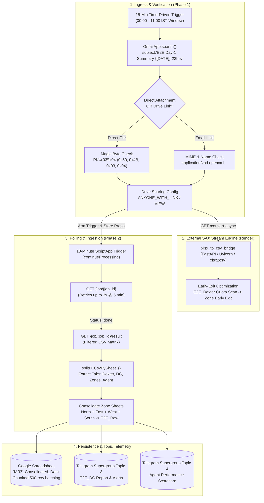
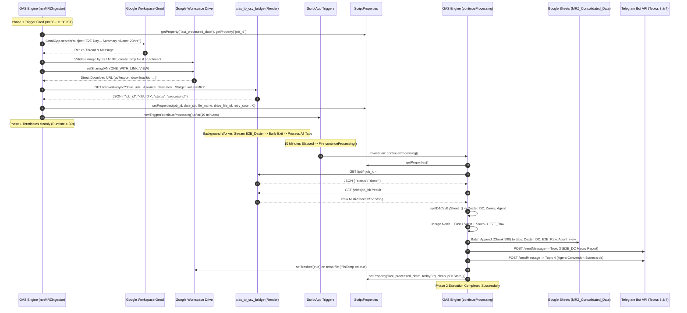
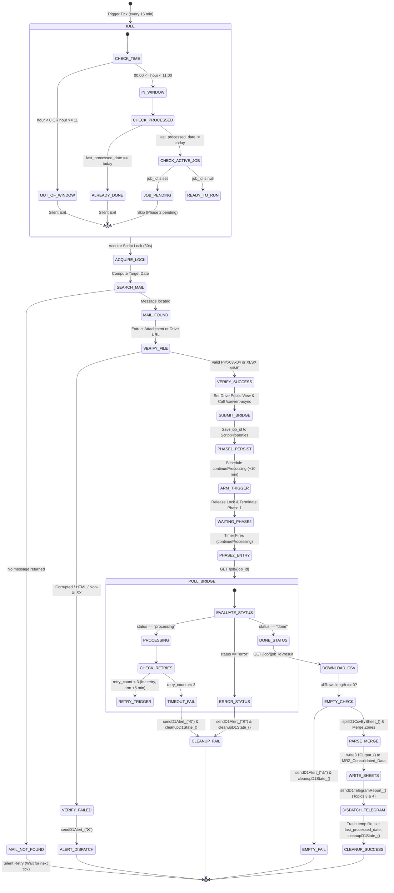
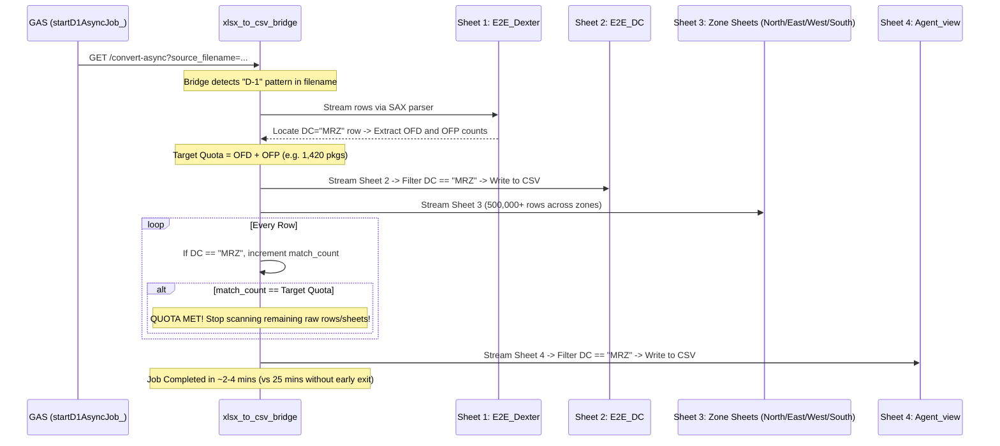
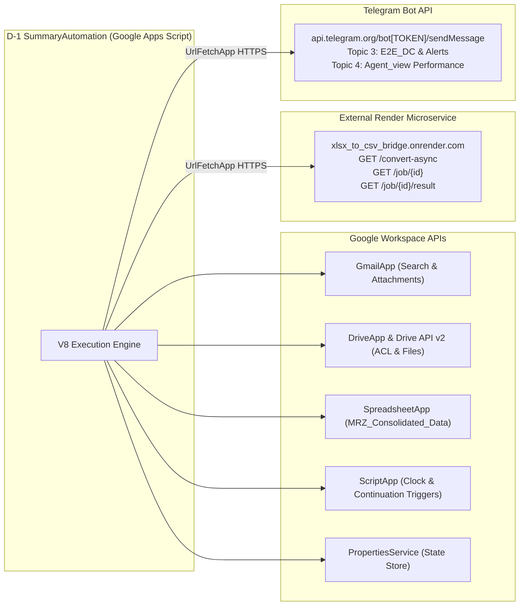
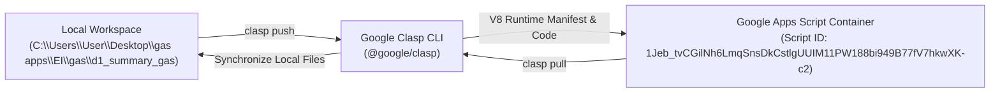

# 📊 D-1 SummaryAutomation (MRZ D-1 Daily Report — V4 Production)

## 1. Overview

The **D-1 SummaryAutomation** (production title: **MRZ D-1 Daily Report — V4 (Production)**, inventory slug: `D-1-SummaryAutomation` or `GAS-D-1-SummaryAutomation`) is an enterprise-grade automated data extraction, transformation, consolidation, and operational dispatch micro-pipeline implemented on [[Google Apps Script]] (GAS). Operating as a mission-critical component within the [[Services/Myntra-Logistics-Infrastructure#logistics-stream-engine|logistics-stream-engine]] cluster, the system automates the daily ingestion of Day Minus 1 ($D-1$) end-to-end performance and dispatch metrics for the **Mirzapur (`MRZ`)** distribution center (DC).

### Operational Context & Supply Chain Domain

In large-scale retail and e-commerce supply chain logistics (Dexter / Myntra logistics network), operational management relies on standardized, pan-India reconciliation reports compiled at 23:00 hours each night covering the preceding operational day ($D-1$). These workbooks encompass millions of package transactions across every distribution center and regional delivery zone throughout India.

### The Operational Problem
The upstream automated reporting system broadcasts daily emails with the subject line pattern `E2E Day-1 Summary <DD-MMM-YYYY> 23hrs`. These messages either attach or link to massive Microsoft Excel (`.xlsx`) workbooks ranging from 100 MB to 250 MB+ containing 500,000 to 1,000,000+ rows partitioned across multiple regional worksheets (`E2E_Dexter`, `E2E_DC`, `North`, `East`, `West`, `South`, and `Agent_view`). Native [[Google Apps Script]] execution environments operate under strict sandboxed quotas: a hard 50 MB in-memory payload ceiling and a hard 6-minute (360 seconds) execution timeout (`UrlFetchApp` and script execution). Attempting to parse OpenXML DOM structures of this scale within GAS causes instantaneous Out-Of-Memory (OOM) fatal crashes or trigger timeout termination.

### The Architectural Solution
To circumvent both the 50 MB memory boundary and the 6-minute execution limit, `D-1 SummaryAutomation` implements a decoupled, **Two-Phase Asynchronous Trigger Pattern** and multi-tab ingestion pipeline:
1. **Phase 1 Ingestion & Delegation**: Phase 1 (`runMRZIngestor`) discovers the daily email, validates file integrity, configures temporary Google Drive access permissions, dispatches an asynchronous conversion payload to an external SAX-streaming bridge microservice (`xlsx_to_csv_bridge`), stores state tokens in `PropertiesService`, and programmatically arms a 10-minute continuation clock trigger (`ScriptApp`).
2. **Phase 2 Polling & Consolidation**: Phase 2 (`continueProcessing`) awakens upon trigger firing, polls the bridge service, downloads the consolidated, filtered tabular CSV payload, merges regional zones into Google Sheets, and broadcasts structured HTML performance cards to specialized Telegram forum topic threads.
3. **Multi-Tab Data Domain & Regional Consolidation**:
   - **`E2E_Dexter`**: Summary worksheet containing high-level hub totals. Extracted for target Out-For-Delivery (`OFD`) and Out-For-Pickup (`OFP`) quotas to establish an early-exit boundary for raw sheet scanning.
   - **`E2E_DC`**: High-level distribution center metrics filtered specifically for `MRZ`, tracking macro delivery numbers and reconciliation statuses.
   - **`E2E_Raw` (Zone Aliases: `North`, `East`, `West`, `South`)**: Detailed package-level operational rows. The pipeline scans across all four cardinal geographic zone sheets, filtering for rows matching `MRZ`, and consolidates all records into a single master `E2E_Raw` worksheet.
   - **`Agent_view`**: Granular, delivery-associate-level performance metrics detailing individual agent dispatches, successful delivery updates, door pickups, and calculated conversion efficiencies.
4. **Targeted Telegram Forum Topic Telemetry**: Operational field leadership monitors performance through a dedicated Telegram supergroup (`-1003779595579`) partitioned into forum topics. Macro DC metrics route to Topic `3` (`TELEGRAM_TOPIC_E2E_DC`), individual delivery agent conversion scorecards route to Topic `4` (`TELEGRAM_TOPIC_AGENT_VIEW`), and operational exceptions/fatal errors route to Topic `3` (`TELEGRAM_TOPIC_ALERTS`).



## 2. Tech Stack

| Component / Layer | Technology | Specification / Version | Source / Code Reference | Notes |
| :--- | :--- | :--- | :--- | :--- |
| **Execution Runtime** | [[Google Apps Script]] V8 Engine | ECMAScript 2020+ / Chrome V8 | `appsscript.json:13` | Modern JavaScript runtime supporting `const`, `let`, arrow functions, template literals, and `Array.prototype` methods *(stated)*. |
| **Hosting Platform** | Google Workspace Serverless | Google Cloud Serverless Infrastructure | `appsscript.json:1-14` | Distributed Google cloud container infrastructure managing script lifecycle and quotas *(stated)*. |
| **Advanced Google Services** | Google Drive API v2 | Advanced Drive Service (`Drive` v2) | `appsscript.json:4-10` | Enabled advanced service binding for programmatic Drive metadata and ACL manipulation *(stated)*. |
| **Native Email Service** | Google Workspace `GmailApp` | Apps Script Built-in Service | `Code.js:731` | Inbox querying, thread inspection, subject regex matching, and attachment blob retrieval *(stated)*. |
| **Native Storage Service** | Google Workspace `DriveApp` | Apps Script Built-in Service | `Code.js:182, 406, 520, 755, 776, 873, 962` | Temporary file persistence, ACL permission configuration (`ANYONE_WITH_LINK`), and file deletion (`setTrashed`) *(stated)*. |
| **Native Spreadsheet Service** | Google Workspace `SpreadsheetApp` | Apps Script Built-in Service | `Code.js:523, 525, 532, 537, 565, 566` | Target workbook resolution, sheet insertion, 500-row batch updates (`setValues`), and buffer flushes *(stated)*. |
| **Concurrency Control** | Google Workspace `LockService` | `getScriptLock()` | `Code.js:152-153, 226, 274-275, 426` | Mutex lock with a 30,000 ms timeout preventing race conditions between trigger cycles *(stated)*. |
| **State Persistence** | Google Workspace `PropertiesService` | `getScriptProperties()` | `Code.js:138, 142, 147, 201-208, 280-286, 412, 473-480, 846, 929, 1033, 1043` | Key-value state persistence across decoupled execution phases (`job_id`, `retry_count`, `last_processed_date`) *(stated)*. |
| **HTTP Client** | Google Workspace `UrlFetchApp` | Native Apps Script HTTP Service | `Code.js:251, 433, 447, 669` | Dispatches outbound HTTPS requests to external bridge microservice and Telegram Bot API *(stated)*. |
| **Scheduling Engine** | `ScriptApp` Project Triggers | Clock-driven & Time-based Triggers | `Code.js:212-215, 307-310, 483-487, 825-829, 894-897, 988-991, 1051-1055` | Schedules the 15-minute polling daemon and dynamic one-shot 10-minute / 5-minute continuation triggers *(stated)*. |
| **External Processing Bridge** | xlsx_to_csv_bridge | Python 3.10+ / FastAPI / Uvicorn | `Code.js:24`, `deployment.md:1-31` | Offloaded SAX stream conversion microservice hosted on Render Free Tier (`https://xlsx-to-csv-bridge.onrender.com`) *(stated)*. |
| **Tabular Stream Parser** | `xlsx2csv` (via Bridge) | SAX Event-Driven XML Streamer | `xlsx_to_csv_bridge:requirements.txt:5` | Python library streaming raw OpenXML sheets without DOM overhead, enforcing early-exit filters *(stated)*. |
| **External Alerting Gateway** | [[Telegram]] Bot API | HTTP REST API (`/sendMessage`) | `Code.js:37-41, 660-680` | Dispatches rich HTML-formatted operational cards to supergroup chat `-1003779595579` across discrete topics *(stated)*. |
| **Cloud Logging** | Google Cloud Stackdriver | `STACKDRIVER` Exception Logging | `appsscript.json:12`, `Code.js:77, 219, 419` | Cloud logging and error reporting surfaced in Google Cloud Console and Apps Script dashboard *(stated)*. |
| **Deployment / Tooling** | `@google/clasp` | Chrome Apps Script CLI | `.clasp.json:1-4` | Bidirectional synchronization between local Git repositories and remote Apps Script container *(stated)*. |
| **Canonical Timezone** | Indian Standard Time (IST) | `Asia/Kolkata` (`UTC+05:30`) | `appsscript.json:2`, `Code.js:139, 413, 686` | Standard timezone governing operational daily reset and operating window guards *(stated)*. |

---

## 3. Architecture

### End-to-End System Architecture

The system operates across three distinct operational layers: the Google Apps Script ingress/egress container, the Render cloud infrastructure running the `xlsx_to_csv_bridge` microservice, and downstream persistence/notification endpoints.

```mermaid
flowchart TD
    subgraph SchedulingLayer ["1. Scheduler & Ingress Controller (Phase 1)"]
        ClockTrigger["ScriptApp 15-Min Trigger<br/>setupD1DailyTrigger()"]
        HourGuard{"Hour Check<br/>00:00 <= hour < 11:00?"}
        DateGuard{"Processed Today Check<br/>last_processed_date == today?"}
        JobGuard{"Active Job Check<br/>job_id != null?"}
        ScriptLock["LockService.getScriptLock()<br/>30-second Mutex Timeout"]
        DateCalc["computeD1Date_()<br/>Target: Yesterday DD-MMM-YYYY"]
        GmailExec["searchD1Mail_()<br/>GmailApp.search(subject:...)"]
    end

    subgraph FileResolutionLayer ["2. Attachment & Verification Engine"]
        FileDetector["getD1DriveFile_()"]
        BlobMagic{"Direct Attachment?<br/>d1IsRealXlsxBlob_()"}
        BodyRegex{"Drive URL in Body?<br/>extractD1DriveId_()"}
        MagicCheck["Validate Magic Bytes<br/>PK\\x03\\x04 (50 4B 03 04)"]
        MimeCheck["Validate Drive MIME<br/>d1VerifyDriveFileMime_()"]
        TempDriveFile["DriveApp.createFile()<br/>Temp_D1_{Date}_{Name}"]
        ShareFile["driveFile.setSharing()<br/>ANYONE_WITH_LINK / VIEW"]
    end

    subgraph OffloadBridgeLayer ["3. Asynchronous Bridge Processing (Render)"]
        BuildUrl["Direct Download URL:<br/>drive.google.com/uc?export=download&id=..."]
        StartJob["startD1AsyncJob_()<br/>GET /convert-async?source_filename=..."]
        BridgeService["xlsx_to_csv_bridge on Render<br/>(Semaphore Throttled, xlsx2csv)"]
        SaveState["ScriptProperties.setProperties()<br/>job_id, date_str, file_name, drive_file_id"]
        ArmPhase2["ScriptApp.newTrigger('continueProcessing')<br/>after(10 minutes)"]
    end

    subgraph IngestionContinuationLayer ["4. Continuation & Parsing (Phase 2)"]
        TimerFire["Trigger Invokes continueProcessing()<br/>Acquire Lock & Delete Trigger"]
        PollEndpoint["checkD1JobStatus_()<br/>GET /job/{job_id}"]
        PollDecision{"Job Status?"}
        RetryBranch["retry_count < 3?<br/>Arm 5-min continuation trigger"]
        TimeoutAlert["sendD1Alert_('⏰')<br/>cleanupD1State_()"]
        DownloadCsv["downloadD1Result_()<br/>GET /job/{job_id}/result"]
        CsvSplitter["splitD1CsvBySheet_()<br/>Header detection & Row slicing"]
    end

    subgraph TransformationPersistenceLayer ["5. Consolidation & Egress Subsystem"]
        ZoneConsolidation["Consolidate Raw Zone Sheets<br/>E2E_Raw + North + East + West + South"]
        SheetsWriter["writeD1Output_()<br/>Batch 500-row chunks to MRZ_Consolidated_Data"]
        TgDispatcher["sendD1TelegramReport_()"]
        CardE2EDC["sendD1E2EDCCard_()<br/>Send to Topic 3 (3500-char chunks)"]
        CardAgent["sendD1AgentViewCard_()<br/>Send to Topic 4 (OFD/OFP Conv %)"]
        CleanTemp["DriveApp.getFileById().setTrashed(true)<br/>(if isTemp == true)"]
        Finalize["Set last_processed_date & cleanupD1State_()"]
    end

    ClockTrigger --> HourGuard
    HourGuard -- "Yes" --> DateGuard
    HourGuard -- "No" --> EndNoop1["Silent No-op"]
    DateGuard -- "Not Processed" --> JobGuard
    DateGuard -- "Already Done" --> EndNoop2["Silent No-op"]
    JobGuard -- "No Job" --> ScriptLock
    JobGuard -- "Job Exists" --> EndNoop3["Skip (Job in progress)"]
    ScriptLock --> DateCalc
    DateCalc --> GmailExec
    GmailExec --> FileDetector
    FileDetector --> BlobMagic
    BlobMagic -- "Has Attachment" --> MagicCheck
    BlobMagic -- "No Attachment" --> BodyRegex
    BodyRegex -- "URL Found" --> MimeCheck
    MagicCheck -- "Valid ZIP/XLSX" --> TempDriveFile
    TempDriveFile --> ShareFile
    MimeCheck -- "Valid XLSX MIME" --> ShareFile
    ShareFile --> BuildUrl
    BuildUrl --> StartJob
    StartJob --> BridgeService
    StartJob --> SaveState
    SaveState --> ArmPhase2

    ArmPhase2 --> TimerFire
    TimerFire --> PollEndpoint
    PollEndpoint --> PollDecision
    PollDecision -- "processing" --> RetryBranch
    RetryBranch -- "retry < 3" --> PollEndpoint
    RetryBranch -- "retry >= 3" --> TimeoutAlert
    PollDecision -- "error" --> TimeoutAlert
    PollDecision -- "done" --> DownloadCsv
    DownloadCsv --> CsvSplitter
    CsvSplitter --> ZoneConsolidation
    ZoneConsolidation --> SheetsWriter
    SheetsWriter --> TgDispatcher
    TgDispatcher --> CardE2EDC
    TgDispatcher --> CardAgent
    CardE2EDC --> CleanTemp
    CardAgent --> CleanTemp
    CleanTemp --> Finalize
```



---

### Sequence Diagram: Asynchronous Two-Phase Lifecycle



---

### State Machine Diagram: Job Lifecycle & Idempotency



---

## 4. Folder & File Structure

The project represents a single-script Google Apps Script workspace synchronized via Clasp (`@google/clasp`), maintaining a minimal, flat root architecture:

```
d1_summary_gas/
├── .clasp.json          # Clasp project metadata and Script ID binding
├── appsscript.json      # Workspace manifest, V8 runtime, Drive v2 service, timezone
└── Code.js              # Monolithic application script (1,056 lines)
```

### Granular File Inventory

| File Path | Byte Size | Line Count | Technical Role & Content Summary |
| :--- | :--- | :--- | :--- |
| `.clasp.json` | 96 B | 5 lines | Stores the Clasp configuration binding the local development directory (`"rootDir": "."`) to the remote Google Apps Script container (`"scriptId": "1Jeb_tvCGilNh6LmqSnsDkCstlgUUIM11PW188bi949B77fV7hkwXK-c2"`). |
| `appsscript.json` | 260 B | 14 lines | Google Apps Script project manifest. Configures the environment for the modern V8 runtime (`"runtimeVersion": "V8"`), sets canonical timezone to Indian Standard Time (`"timeZone": "Asia/Kolkata"`), establishes Cloud logging via `"exceptionLogging": "STACKDRIVER"`, and binds the Google Drive API v2 advanced service (`"serviceId": "drive"`, `"version": "v2"`, `"userSymbol": "Drive"`). |
| `Code.js` | 39,221 B | 1,056 lines | Complete production application logic. Contains the global `CONFIG` dictionary, binary verification routines, Phase 1 ingestion, Phase 2 continuation polling, multi-sheet CSV splitting, raw zone aliasing/merging, chunked Google Sheets writing, rich HTML Telegram topic dispatching, and manual/backfill administrative utilities. |

---

## 5. Core Modules & Responsibilities

The codebase in `Code.js` is structured into functional modules demarcated by banner comments. Below is an exhaustive technical catalog of all functions, line ranges, and responsibilities:

### Detailed Code Section Catalog

```
Code.js Line Structure:
├── Lines 1–20:      Header Documentation & Architectural Overview
├── Lines 22–51:     Configuration Constants (CONFIG)
├── Lines 53–124:    XLSX Binary & Metadata Verification Helpers
├── Lines 126–267:   Phase 1 Ingestion Subsystem (runMRZIngestor, startD1AsyncJob_)
├── Lines 269–428:   Phase 2 Processing Subsystem (continueProcessing)
├── Lines 430–466:   Bridge Status & Download Helpers (checkD1JobStatus_, downloadD1Result_)
├── Lines 468–489:   State & Trigger Cleanup Helpers (cleanupD1State_, cleanupD1Triggers_)
├── Lines 491–514:   CSV Ingestion & Splitting Engine (splitD1CsvBySheet_)
├── Lines 516–568:   Google Sheets Batch Writer (writeD1Output_)
├── Lines 570–710:   Telegram Reporting & Topic Dispatch Engine
├── Lines 712–811:   Gmail & Google Drive Discovery Engine
└── Lines 813–1056:  Administrative, Manual, Backfill & Diagnostic Tools
```

### Granular Function Reference Table

| Function / Symbol | Line Range in `Code.js` | Arguments & Types | Return Value | Modifiers / Scope | Core Responsibility & Side Effects |
| :--- | :--- | :--- | :--- | :--- | :--- |
| `CONFIG` | `22–51` | N/A | `Object` | Global `const` | Centralized operational settings dictionary containing endpoints, tokens, filters, sheet names, topics, and retry thresholds. |
| `d1IsRealXlsxBlob_` | `63–80` | `blob: Blob` | `boolean` | Private (`_`) | Reads first 4 bytes via `blob.getBytes()`. Validates against standard ZIP/XLSX magic bytes `0x50, 0x4B, 0x03, 0x04` (`PK\x03\x04`). Returns `false` for small or corrupted blobs. |
| `d1VerifyDriveFileMime_` | `86–123` | `driveFile: DriveApp.File` | `boolean` | Private (`_`) | Metadata-only validator for large Drive files (100MB+). Rejects native Google Sheets, HTML error pages, and Google Workspace types. Accepts OpenXML, ZIP, octet-stream, or `.xlsx` extension. |
| `runMRZIngestor` | `129–228` | None | `void` | Public (Entrypoint) | **Phase 1 Orchestrator**: Checks time window (00:00–11:00 IST), checks `last_processed_date` and active `job_id`, acquires 30s lock, searches Gmail, verifies XLSX, configures Drive sharing, dispatches async bridge job, stores state in `ScriptProperties`, and schedules `continueProcessing` (+10 min). |
| `startD1AsyncJob_` | `237–267` | `driveUrl: string, dateStr: string, fileName: string` | `string \| null` | Private (`_`) | Submits HTTP GET to `BRIDGE_URL/convert-async` with API key, drive URL, date, and `source_filename` (activating bridge early-exit optimization). Returns `job_id` or `null`. |
| `continueProcessing` | `273–428` | None | `void` | Public (Callback) | **Phase 2 Orchestrator**: Cleans trigger, acquires lock, checks bridge job status. Handles retries (up to 3x @ 5 min), downloads CSV on completion, splits into sheet groups, merges zone sheets into `E2E_Raw`, writes 4 tabs to Google Sheets, dispatches Telegram topic cards, trashes temp files, and marks date as done. |
| `checkD1JobStatus_` | `430–441` | `jobId: string` | `Object` | Private (`_`) | Executes HTTP GET to `BRIDGE_URL/job/{jobId}`. Handles 404 (server restart) and returns parsed JSON `{ status: "processing" \| "done" \| "error" }`. |
| `downloadD1Result_` | `443–466` | `jobId: string` | `Array<Array<string>>` | Private (`_`) | Executes HTTP GET to `BRIDGE_URL/job/{jobId}/result`. Parses returned raw CSV string into 2D tabular array via `Utilities.parseCsv()`, filtering blank lines. |
| `cleanupD1State_` | `472–480` | None | `void` | Private (`_`) | Deletes ephemeral keys (`job_id`, `date_str`, `file_name`, `is_temp`, `drive_file_id`, `retry_count`) from `ScriptProperties`. Leaves `last_processed_date` untouched. |
| `cleanupD1Triggers_` | `482–488` | `functionName: string` | `void` | Private (`_`) | Iterates project triggers via `ScriptApp.getProjectTriggers()` and deletes any trigger matching the handler function name. |
| `splitD1CsvBySheet_` | `494–514` | `rows: Array<Array<string>>` | `Object` | Private (`_`) | Partitions multi-sheet CSV output. Detects sheet header rows (`row[0] === "Sheet"`), maps subsequent rows by sheet name in column 0, and returns `{ [sheetName]: { headers, data } }`. |
| `writeD1Output_` | `519–568` | `headers: Array<string>, dataRows: Array<Array<string>>, tabName: string` | `void` | Private (`_`) | Resolves or creates master spreadsheet (`MRZ_Consolidated_Data`). Resolves or inserts tab (truncated to 31 chars). Appends data or writes headers+data. Batches writes in 500-row chunks with column normalization and `SpreadsheetApp.flush()`. |
| `sendD1TelegramReport_` | `574–580` | `sheetName: string, headers: Array<string>, dataRows: Array<Array<string>>, dateStr: string` | `void` | Private (`_`) | Report router. Directs `E2E_DC` to `sendD1E2EDCCard_` and `Agent_view` to `sendD1AgentViewCard_`. |
| `sendD1E2EDCCard_` | `582–609` | `headers: Array<string>, dataRows: Array<Array<string>>, dateStr: string` | `void` | Private (`_`) | Formats key-value HTML report for `E2E_DC` rows. Splits messages into <= 3500-character chunks to respect Telegram's 4096-char ceiling. Dispatches to Topic `3`. |
| `sendD1AgentViewCard_` | `611–656` | `headers: Array<string>, dataRows: Array<Array<string>>, dateStr: string` | `void` | Private (`_`) | Formats individual delivery associate performance cards. Resolves dynamic columns (`agent_name`, `ofd`, `del_update`, `ofp`, `picked-up`). Calculates conversion percentages (`del_update/ofd*100`, `picked_up/ofp*100`). Splits at 3500 chars and posts to Topic `4`. |
| `sendD1Telegram_` | `660–680` | `htmlMessage: string, topicId: number` | `void` | Private (`_`) | Dispatches HTTP POST to Telegram Bot API `/sendMessage` with `parse_mode: "HTML"`, `disable_web_page_preview: true`, and optional `message_thread_id`. |
| `sendD1Alert_` | `685–691` | `emoji: string, title: string, detail: string` | `void` | Private (`_`) | Constructs formatted operational alert with timestamp and sends to `TELEGRAM_TOPIC_ALERTS` (Topic `3`). |
| `findD1ColIdx_` | `693–698` | `colMap: Object, candidates: Array<string>` | `number` | Private (`_`) | Iterates candidate column header strings against a lowercase column map, returning the first matching zero-based index or `-1`. |
| `getD1Val_` | `700–704` | `row: Array<string>, idx: number, fallback: string` | `string` | Private (`_`) | Safely retrieves and trims a string value at `row[idx]`, returning fallback if out of bounds or empty. |
| `getD1NumVal_` | `706–710` | `row: Array<string>, idx: number` | `number` | Private (`_`) | Retrieves string via `getD1Val_()`, strips commas, and parses as float. Returns `0` if `NaN`. |
| `computeD1Date_` | `720–726` | None | `string` | Private (`_`) | Calculates previous calendar day ($D-1$) formatted as `DD-MMM-YYYY` (e.g., `07-Mar-2026`) matching the automated email subject format. |
| `searchD1Mail_` | `728–734` | `dateStr: string` | `GmailMessage \| null` | Private (`_`) | Compiles search query from template (`subject:"E2E Day-1 Summary <dateStr> 23hrs"`), searches Gmail, and returns the message matching `dateStr`. |
| `getD1DriveFile_` | `744–793` | `message: GmailMessage, d1DateStr: string` | `Object \| null` | Private (`_`) | Two-stage file discovery: (1) Direct attachment checked via `d1IsRealXlsxBlob_()` and saved to Drive with `isTemp: true`. (2) Body Drive link extracted via `extractD1DriveId_()` and verified via `d1VerifyDriveFileMime_()` with `isTemp: false`. |
| `extractD1DriveId_` | `799–811` | `message: GmailMessage` | `string \| null` | Private (`_`) | Applies three regex heuristics to plain-text email body: `/d/([a-zA-Z0-9_-]{33,})/`, `[?&]id=([a-zA-Z0-9_-]{33,})`, and `open\?id=([a-zA-Z0-9_-]{33,})`. |
| `setupD1DailyTrigger` | `824–831` | None | `void` | Public (Admin) | Deletes existing `runMRZIngestor` triggers and registers a recurring 15-minute clock trigger (`everyMinutes(15)`). |
| `testD1Telegram` | `833–835` | None | `void` | Public (Test) | Sends test verification message to Telegram Topic `3`. |
| `manualRun_D1` | `845–901` | None | `void` | Public (Admin) | Manual pipeline runner. Bypasses operating hour window (00:00–11:00) and `last_processed_date` guard, resets state, initiates Phase 1, and arms continuation trigger. |
| `backfillD1ByDate` | `923–996` | None (configured in body) | `void` | Public (Admin) | Reprocessing tool for historical dates (`BACKFILL_DATE = "05-Mar-2026"`). Guards against clobbering active jobs, initiates Phase 1 for historical email, arms continuation trigger, and appends to existing tabs without altering `last_processed_date`. |
| `clearD1Job` | `1014–1019` | None | `void` | Public (Admin) | Emergency reset tool. Clears stuck `job_id` and ephemeral properties, deletes pending continuation triggers, leaving `last_processed_date` intact. |
| `resetD1Today` | `1030–1036` | None | `void` | Public (Admin) | Full environment reset. Clears all job properties, continuation triggers, and deletes `last_processed_date`, permitting the next trigger tick to re-execute today's run. |
| `viewD1State` | `1042–1056` | None | `void` | Public (Diagnostic) | Inspects and logs all `ScriptProperties` keys and enumerates all active project triggers with their handler functions and trigger sources. |

---

## 6. Data Flow / Key Workflows

### 1. Primary Daily Ingestion Workflow (00:00 – 11:00 IST)

The automated ingestion pipeline fires on a recurring 15-minute schedule throughout the night and morning:

1. **Trigger & Guard Validation** (`Code.js:129-153`):
   - Clock trigger fires `runMRZIngestor()`.
   - Current hour in IST (`Asia/Kolkata`) is evaluated: must be `>= 0` and `< 11`.
   - Checks `ScriptProperties` key `last_processed_date`. If equal to today's date (`yyyy-MM-dd`), execution immediately terminates to maintain daily idempotency.
   - Checks `ScriptProperties` key `job_id`. If non-null, an existing bridge conversion is already pending; execution exits to avoid duplicate job submissions.
   - Acquires script lock via `LockService.getScriptLock().tryLock(30000)`. If the lock is held, execution safely aborts.
2. **Date Computation & Gmail Query Formulation** (`Code.js:156-165, 720-734`):
   - Calculates target day $D-1$ (`today - 1 day`) formatted as `DD-MMM-YYYY` (e.g., `07-Mar-2026`).
   - Compiles Gmail search query: `subject:"E2E Day-1 Summary 07-Mar-2026 23hrs"`.
   - Queries Gmail mailbox via `GmailApp.search(query, 0, 1)`. If no matching email thread is returned, the script silently exits (silent retry on subsequent 15-minute clock ticks).
3. **File Discovery & Dual-Verification Pipeline** (`Code.js:168-179, 744-811`):
   - **Strategy 1 (Direct Attachment)**: Inspects message attachments for `.xlsx` filename extensions. If found, reads raw bytes into memory and evaluates the first 4 magic bytes (`0x50, 0x4B, 0x03, 0x04`). If valid, saves blob to Google Drive as `Temp_D1_<Date>_<FileName>`, flags `isTemp = true`, and returns the file reference.
   - **Strategy 2 (Drive URL Extraction)**: If no valid attachment exists, inspects plain-text email body using three regex heuristics to locate the Google Drive file ID. Accesses the file via `DriveApp.getFileById(id)`, performs zero-download MIME verification (`d1VerifyDriveFileMime_`), ensuring it is not an HTML error page or native Google Sheet, and flags `isTemp = false`.
4. **Drive Access Configuration & URL Formulation** (`Code.js:181-190`):
   - Invokes `driveFile.setSharing(DriveApp.Access.ANYONE_WITH_LINK, DriveApp.Permission.VIEW)` and pauses 3,000 ms to propagate Google Drive permissions.
   - Compiles the direct binary download URL: `https://drive.google.com/uc?export=download&id=<FILE_ID>`.
   - *Design Note*: Using the direct `export=download` URL prevents Google Drive from returning an HTML viewer page.
5. **Bridge Job Initiation & Early-Exit Parameter Passing** (`Code.js:191-208, 237-267`):
   - Dispatches HTTP GET to `https://xlsx-to-csv-bridge.onrender.com/convert-async` passing `api_key`, `drive_url`, `date_str`, `target_value=MRZ`, and `source_filename=<FILE_NAME>`.
   - Passing `source_filename` instructs the Python bridge to recognize the workbook as a D-1 report, enabling the SAX streaming early-exit quota optimization.
   - Receives JSON payload with `job_id`.
   - Persists execution state in `ScriptProperties`: `job_id`, `date_str`, `file_name`, `is_temp`, `drive_file_id`, and `retry_count = "0"`.
6. **Continuation Trigger Arming** (`Code.js:210-216`):
   - Removes any lingering `continueProcessing` project triggers.
   - Arms a one-shot time-based trigger:
     ```javascript
     ScriptApp.newTrigger("continueProcessing")
       .timeBased()
       .after(CONFIG.POLL_WAIT_MINUTES * 60 * 1000) // 10 minutes
       .create();
     ```
   - Phase 1 terminates, releasing the script lock within 30 seconds of execution.
7. **Phase 2 Continuation & Status Polling** (`Code.js:273-328, 430-441`):
   - 10 minutes later, `ScriptApp` fires `continueProcessing()`.
   - Acquires script lock, purges the continuation trigger, and retrieves state from `ScriptProperties`.
   - Polls `GET /job/<job_id>`.
   - If `status === "processing"`: checks `retry_count`. If `< 3`, increments retry counter, arms a 5-minute continuation trigger, and exits. If `>= 3`, dispatches timeout alert `sendD1Alert_("⏰")`, purges state, and terminates.
   - If `status === "error"`: dispatches failure alert `sendD1Alert_("❌")`, purges state, and terminates.
   - If `status === "done"`: proceeds to result download.
8. **Result Streaming & In-Memory Splitting** (`Code.js:329-361, 443-466, 494-514`):
   - Downloads filtered CSV from `GET /job/<job_id>/result`.
   - Parses CSV string into 2D array using `Utilities.parseCsv()`.
   - Partitions rows using `splitD1CsvBySheet_()`: recognizes rows where `row[0] === "Sheet"` as sheet boundary definitions, separating records into `{ [sheetName]: { headers, data } }`.
9. **Zone Sheet Consolidation (`E2E_Raw`)** (`Code.js:347-361`):
   - Compares parsed sheet names against `CONFIG.RAW_SHEET_ALIASES` (`["E2E_Raw", "North", "East", "West", "South"]`).
   - Gathers column headers from the first matching raw zone sheet.
   - Consolidates all data rows across `North`, `East`, `West`, `South`, and `E2E_Raw` into a single combined `rawData` matrix.
10. **Google Sheets Batch Persistence** (`Code.js:364-384, 519-568`):
    - Opens or creates target spreadsheet `MRZ_Consolidated_Data`.
    - Iterates target tabs defined in `CONFIG.SHEET_WRITE_TABS` (`["E2E_Dexter", "E2E_DC", "E2E_Raw", "Agent_view"]`).
    - Tab name truncated to 31 characters (`tabName.substring(0, 31)`).
    - If sheet has existing data (`lastRow > 0`), appends data rows below. If blank, writes headers + data.
    - Flushes data in chunks of 500 rows (`CHUNK = 500`) with column width normalization (padding missing cells with `""`) and calls `SpreadsheetApp.flush()`.
11. **Topic-Threaded Telegram Reporting** (`Code.js:386-401, 574-656`):
    - Dispatches `E2E_DC` performance card to Topic `3` (`TELEGRAM_TOPIC_E2E_DC`) in chunks of <= 3500 characters.
    - Dispatches individual `Agent_view` performance cards (calculating OFD and OFP conversion percentages) to Topic `4` (`TELEGRAM_TOPIC_AGENT_VIEW`) in chunks of <= 3500 characters.
12. **Finalization & Temp File Cleanup** (`Code.js:403-417`):
    - If `is_temp === "true"` and `drive_file_id` is present, moves the temporary Drive file to trash: `DriveApp.getFileById(driveFileId).setTrashed(true)`.
    - Writes today's date string into `last_processed_date` property.
    - Invokes `cleanupD1State_()` to remove ephemeral job properties.

---

### 2. Bridge Early-Exit Quota Workflow



---

## 7. Configuration & Environment

### Configuration Parameters (`CONFIG`)

The application's static configuration is consolidated in the `CONFIG` object (`Code.js:22-51`):

| Property Key | Type | Default Value / Representation | Line Reference | Functional Purpose |
| :--- | :--- | :--- | :--- | :--- |
| `BRIDGE_URL` | `string` | `"https://xlsx-to-csv-bridge.onrender.com"` | `Code.js:24` | HTTPS root URL for the external SAX-streaming bridge microservice hosted on Render *(stated)*. |
| `BRIDGE_API_KEY` | `string` | `"[REDACTED_SECRET]"` | `Code.js:25` | Shared secret key required for authenticating requests to the bridge service *(stated)*. |
| `TARGET_DC_VALUE` | `string` | `"MRZ"` | `Code.js:28` | Target distribution center code. Used to filter rows in `E2E_DC`, `E2E_Raw`, and `Agent_view` *(stated)*. |
| `DESTINATION_SHEET_NAME` | `string` | `"MRZ_Consolidated_Data"` | `Code.js:31` | Name of the master Google Spreadsheet in Google Drive where processed tabs are persisted *(stated)*. |
| `SEARCH_QUERY_TEMPLATE` | `string` | `"subject:\"E2E Day-1 Summary {{DATE}} 23hrs\""` | `Code.js:34` | Search query template used by `GmailApp` to locate daily reporting emails. `{{DATE}}` is dynamically replaced *(stated)*. |
| `TELEGRAM_BOT_TOKEN` | `string` | `"[REDACTED_SECRET]"` | `Code.js:37` | Authentication token for the Telegram Bot API endpoint *(stated)*. |
| `TELEGRAM_CHAT_ID` | `string` | `"-1003779595579"` | `Code.js:38` | Telegram supergroup chat ID where operational reports and alerts are published *(stated)*. |
| `TELEGRAM_TOPIC_E2E_DC` | `number` | `3` | `Code.js:39` | Telegram forum topic ID (message thread) dedicated to high-level E2E_DC macro performance reports *(stated)*. |
| `TELEGRAM_TOPIC_AGENT_VIEW` | `number` | `4` | `Code.js:40` | Telegram forum topic ID dedicated to individual delivery agent performance scorecards *(stated)*. |
| `TELEGRAM_TOPIC_ALERTS` | `number` | `3` | `Code.js:41` | Telegram forum topic ID where system failure, timeout, and file verification alerts are routed *(stated)*. |
| `TELEGRAM_SHEETS` | `Array<string>` | `["E2E_DC", "Agent_view"]` | `Code.js:42` | Filter array indicating which parsed sheets generate formatted Telegram notifications *(stated)*. |
| `SHEET_WRITE_TABS` | `Array<string>` | `["E2E_Dexter", "E2E_DC", "E2E_Raw", "Agent_view"]` | `Code.js:43` | Ordered array of worksheet tabs written into the destination Google Spreadsheet *(stated)*. |
| `RAW_SHEET_ALIASES` | `Array<string>` | `["E2E_Raw", "North", "East", "West", "South"]` | `Code.js:44` | List of regional worksheet names that are merged and consolidated into the single `E2E_Raw` tab *(stated)*. |
| `POLL_WAIT_MINUTES` | `number` | `10` | `Code.js:45` | Time delay (in minutes) programmed into the one-shot continuation trigger before Phase 2 checks bridge status *(stated)*. |
| `MAX_RETRIES` | `number` | `3` | `Code.js:46` | Maximum polling retries permitted in Phase 2 if bridge still returns status `"processing"` (5 min per retry) *(stated)*. |
| `RUN_START_HOUR` | `number` | `0` | `Code.js:49` | Daily active operating window start boundary (00:00 IST / midnight) *(stated)*. |
| `RUN_END_HOUR` | `number` | `11` | `Code.js:50` | Daily active operating window end boundary (11:00 IST / 11 AM) *(stated)*. |

---

> [!danger] CRITICAL SECURITY VULNERABILITY: HARDCODED SECRETS IN SOURCE CODE
> The production script `Code.js` contains plaintext credentials hardcoded in the global `CONFIG` object:
> - **Line 25**: `BRIDGE_API_KEY: "[REDACTED_SECRET]"`
> - **Line 37**: `TELEGRAM_BOT_TOKEN: "[REDACTED_SECRET]"`
>
> **Security Implications**:
> 1. Anyone with read access to the Google Apps Script project, Clasp Git repository, or version history can exfiltrate these credentials.
> 2. The `BRIDGE_API_KEY` permits unauthorized invocation of the Render microservice, potentially exhausting memory or incurring bandwidth costs.
> 3. The `TELEGRAM_BOT_TOKEN` allows an attacker to impersonate the operational bot, post fraudulent operational data, delete messages, or read inbound webhook updates across the supergroup.
>
> **Required Remediation (Migration Blueprint)**:
> Externalize both secrets immediately to Google Apps Script `PropertiesService.getScriptProperties()`:
>
> 1. Set the properties via Clasp or Apps Script IDE console:
> ```javascript
> PropertiesService.getScriptProperties().setProperties({
>   "BRIDGE_API_KEY": "...",
>   "TELEGRAM_BOT_TOKEN": "..."
> });
> ```
> 2. Refactor `Code.js` to dynamically retrieve secrets at runtime:
> ```javascript
> const props = PropertiesService.getScriptProperties();
> const BRIDGE_API_KEY = props.getProperty("BRIDGE_API_KEY");
> const TELEGRAM_BOT_TOKEN = props.getProperty("TELEGRAM_BOT_TOKEN");
> ```

---

### Dynamic State Schema (`ScriptProperties`)

The application utilizes `PropertiesService.getScriptProperties()` to maintain asynchronous state across trigger invocations:

| Property Key | Type / Format | Lifecycle | Set Location | Cleared Location | Description |
| :--- | :--- | :--- | :--- | :--- | :--- |
| `job_id` | `string` (UUID) | Ephemeral (Phase 1 → Phase 2) | `Code.js:202` | `Code.js:474, 847, 937, 1015, 1031` | Active job identifier returned by `xlsx_to_csv_bridge`. |
| `date_str` | `string` (`DD-MMM-YYYY`) | Ephemeral (Phase 1 → Phase 2) | `Code.js:203` | `Code.js:475, 847, 937, 1015, 1031` | Canonical date of the $D-1$ operational report being ingested. |
| `file_name` | `string` | Ephemeral (Phase 1 → Phase 2) | `Code.js:204` | `Code.js:476, 847, 937, 1015, 1031` | Name of the source `.xlsx` file passed to bridge for early-exit detection. |
| `is_temp` | `string` (`"true"` \| `"false"`) | Ephemeral (Phase 1 → Phase 2) | `Code.js:205` | `Code.js:477, 847, 937, 1015, 1031` | Indicates whether the Drive file was created from an email attachment and requires deletion. |
| `drive_file_id` | `string` | Ephemeral (Phase 1 → Phase 2) | `Code.js:206` | `Code.js:478, 847, 937, 1015, 1031` | Google Drive file ID of the source XLSX workbook. |
| `retry_count` | `string` (Integer `"0"`–`"3"`) | Ephemeral (Phase 1 → Phase 2) | `Code.js:207, 306` | `Code.js:479, 847, 937, 1015, 1031` | Counter tracking consecutive Phase 2 polling retries while status is `"processing"`. |
| `last_processed_date` | `string` (`yyyy-MM-dd`) | Persistent (Daily) | `Code.js:413` | `Code.js:849, 1033` | Prevents duplicate processing on the same calendar day. Reset only by `resetD1Today()`. |

---

## 8. External Integrations & APIs



### 1. Sister Microservice: `xlsx_to_csv_bridge` (Render)

The application integrates with the cloud microservice documented in xlsx_to_csv_bridge:

- **Host**: `https://xlsx-to-csv-bridge.onrender.com`
- **Authentication**: Query parameter `api_key=[REDACTED_SECRET]`
- **Endpoints Utilized**:
  1. `GET /convert-async`: Dispatches asynchronous conversion.
     - Parameters: `api_key`, `drive_url`, `date_str`, `target_value=MRZ`, `source_filename=<name>`.
     - Response: `{ "job_id": "<UUID>", "status": "processing" }` (or `{ "status": "done" }` on cache hit).
  2. `GET /job/<job_id>`: Polls job status.
     - Response: `{ "status": "processing" | "done" | "error", "error": "..." }`.
  3. `GET /job/<job_id>/result`: Downloads converted multi-sheet CSV tabular output.
     - Format: RFC 4180 CSV with sheet boundary lines (`Sheet,Col1,Col2...`).

### 2. Telegram Bot API Integration

- **Host**: `https://api.telegram.org/bot[REDACTED_SECRET]/sendMessage`
- **Method**: HTTP POST with JSON body
- **Payload Schema**:
  ```json
  {
    "chat_id": "-1003779595579",
    "text": "<HTML formatted message>",
    "parse_mode": "HTML",
    "disable_web_page_preview": true,
    "message_thread_id": 3
  }
  ```
- **Topic Segregation**:
  - `TELEGRAM_TOPIC_E2E_DC = 3`: Macro DC performance summary card.
  - `TELEGRAM_TOPIC_AGENT_VIEW = 4`: Granular delivery associate performance card.
  - `TELEGRAM_TOPIC_ALERTS = 3`: Operational error, timeout, and warning alerts.
- **Message Length Safeguard**: Telegram enforces a hard limit of 4,096 characters per message. `Code.js` checks buffer length at `msg.length > 3500` (`Code.js:603, 650`) and splits reports into chained continuation messages.

### 3. Google Drive Advanced Service & DriveApp

- **Drive Sharing**: Uses `DriveApp.File.setSharing(DriveApp.Access.ANYONE_WITH_LINK, DriveApp.Permission.VIEW)` (`Code.js:182`). Required because Render microservice requests the direct binary download link anonymously.
- **Direct Download Formulation**: Constructs `https://drive.google.com/uc?export=download&id=${driveFile.getId()}`. Avoids web viewer redirects.
- **Temporary Lifecycle**: Attachments saved as `Temp_D1_<Date>_<Name>` are automatically trashed via `DriveApp.getFileById(id).setTrashed(true)` upon successful completion of Phase 2 (`Code.js:406`).

### 4. Google Sheets (`SpreadsheetApp`)

- **Destination Resolution**: Searches for file `MRZ_Consolidated_Data` via `DriveApp.getFilesByName()`. Opens existing or creates new spreadsheet (`Code.js:520-526`).
- **Tab Chunking**: Writes rows in batches of 500 (`CHUNK = 500`) using `sheet.getRange(...).setValues(...)` followed by `SpreadsheetApp.flush()` (`Code.js:557-567`), preventing script memory bloat and execution timeouts during large writes.

---

## 9. Testing

Google Apps Script lacks a native command-line test runner or mocking framework. Testing is conducted via built-in test entrypoints in `Code.js`:

### Built-in Test Functions

| Test Function | Line Reference | Scope & Execution Behavior | Success Criteria |
| :--- | :--- | :--- | :--- |
| `testD1Telegram()` | `Code.js:833–835` | Sends a lightweight test ping to Telegram Topic `3`. | Telegram bot publishes `🧪 D-1 Test Message` to Topic 3 with zero HTTP errors. |
| `manualRun_D1()` | `Code.js:845–901` | Runs the full Phase 1 ingestion pipeline bypassing the 00:00–11:00 IST hour check and `last_processed_date` guard. Arms continuation trigger. | Job ID returned from bridge; state stored in `ScriptProperties`; continuation trigger armed. |
| `viewD1State()` | `Code.js:1042–1056` | Diagnostic inspector. Prints all `ScriptProperties` keys and enumerates all active project triggers. | Console outputs formatted key-value pairs of current properties and trigger handler names. |
| `backfillD1ByDate()` | `Code.js:923–996` | Executes full ingestion for a past date configured in `BACKFILL_DATE` without modifying `last_processed_date`. | Historical data fetched, parsed, appended to Google Sheet, and sent to Telegram. |
| `clearD1Job()` | `Code.js:1014–1019` | Clears stuck job tokens and deletes continuation triggers. | `job_id` and ephemeral keys removed from properties; continuation triggers purged. |
| `resetD1Today()` | `Code.js:1030–1036` | Full state purge including `last_processed_date`. | Environment completely reset; automatic trigger can run today's pipeline again. |

---

## 10. CI/CD & Deployment

The deployment lifecycle is managed through `@google/clasp` (Chrome Apps Script CLI), linking the local workstation repository to the remote script container.



### Verified Deployment Commands

All deployment actions use standard Clasp CLI commands executed from the project root directory:

```bash
# Check clasp login status
clasp login --status

# Pull latest remote changes from Google Apps Script container
clasp pull

# Check differences between local files and remote script
clasp status

# Push local modifications (Code.js, appsscript.json) to remote container
clasp push

# Open the project directly in Google Apps Script web editor
clasp open
```

### Manifest Configuration (`appsscript.json`)

The manifest defines container-level dependencies and engine configurations:

```json
{
  "timeZone": "Asia/Kolkata",
  "dependencies": {
    "enabledAdvancedServices": [
      {
        "userSymbol": "Drive",
        "version": "v2",
        "serviceId": "drive"
      }
    ]
  },
  "exceptionLogging": "STACKDRIVER",
  "runtimeVersion": "V8"
}
```

---

## 11. Setup & Local Development

### Prerequisites

1. **Node.js & npm**: Node.js `>= 18.0.0` installed locally.
2. **Google Clasp**: Installed globally via `npm install -g @google/clasp`.
3. **Google Account Access**: Account with edit access to Script ID `1Jeb_tvCGilNh6LmqSnsDkCstlgUUIM11PW188bi949B77fV7hkwXK-c2`.
4. **Google Apps Script API**: Must be enabled in user profile settings at [script.google.com/home/usersettings](https://script.google.com/home/usersettings).

### Local Workspace Initialization

```bash
# 1. Navigate to target directory
cd "C:\Users\User\Desktop\gas apps\EI\gas\d1_summary_gas"

# 2. Authenticate clasp with Google Workspace credentials
clasp login

# 3. Verify .clasp.json binding
cat .clasp.json
# Expected:
# {
#   "scriptId": "1Jeb_tvCGilNh6LmqSnsDkCstlgUUIM11PW188bi949B77fV7hkwXK-c2",
#   "rootDir": "."
# }

# 4. Pull current code to ensure workspace is in sync
clasp pull
```

### Remote Trigger Installation

After pushing code to the remote script container, initialize the recurring clock trigger:

1. Open script in editor: `clasp open`
2. Select `setupD1DailyTrigger` from the function dropdown.
3. Click **Run**.
4. Grant required OAuth scopes when prompted (`Gmail`, `Drive`, `Spreadsheets`, `Script Triggers`, `External HTTP Requests`).
5. Verify trigger registration by running `viewD1State()`.

---

## 12. Security Notes

> [!danger] PRODUCTION SECURITY ADVISORY: CREDENTIAL REMEDIATION REQUIRED
> The presence of plaintext secrets (`BRIDGE_API_KEY` and `TELEGRAM_BOT_TOKEN`) inside `Code.js` poses an ongoing security exposure.
>
> **Actionable Remediation Code**:
> Replace lines 22–51 of `Code.js` with the following secure implementation:
>
> ```javascript
> const SCRIPT_PROPERTIES = PropertiesService.getScriptProperties();
>
> const CONFIG = {
>   // Secure Secret Retrieval
>   BRIDGE_URL:      "https://xlsx-to-csv-bridge.onrender.com",
>   BRIDGE_API_KEY:  SCRIPT_PROPERTIES.getProperty("BRIDGE_API_KEY") || "",
>
>   TARGET_DC_VALUE: "MRZ",
>   DESTINATION_SHEET_NAME: "MRZ_Consolidated_Data",
>   SEARCH_QUERY_TEMPLATE: "subject:\"E2E Day-1 Summary {{DATE}} 23hrs\"",
>
>   TELEGRAM_BOT_TOKEN:        SCRIPT_PROPERTIES.getProperty("TELEGRAM_BOT_TOKEN") || "",
>   TELEGRAM_CHAT_ID:          "-1003779595579",
>   TELEGRAM_TOPIC_E2E_DC:     3,
>   TELEGRAM_TOPIC_AGENT_VIEW: 4,
>   TELEGRAM_TOPIC_ALERTS:     3,
>   TELEGRAM_SHEETS:           ["E2E_DC", "Agent_view"],
>   SHEET_WRITE_TABS:          ["E2E_Dexter", "E2E_DC", "E2E_Raw", "Agent_view"],
>   RAW_SHEET_ALIASES:         ["E2E_Raw", "North", "East", "West", "South"],
>   POLL_WAIT_MINUTES:         10,
>   MAX_RETRIES:               3,
>   RUN_START_HOUR:            0,
>   RUN_END_HOUR:              11
> };
> ```

### Public Drive Sharing Risk & Mitigation

- **Requirement**: `Code.js:182` sets Drive files to `ANYONE_WITH_LINK` with `VIEW` permissions because Render's background worker downloads the XLSX binary over anonymous HTTP requests.
- **Risk**: Anyone who intercepts the Drive URL can download the full pan-India operational report.
- **Mitigation**:
  - For email attachments, temporary files are prefixed `Temp_D1_` and explicitly trashed (`setTrashed(true)`) upon Phase 2 completion (`Code.js:406`).
  - For files referenced by Drive links in email bodies, permissions remain public. Recommendation: The bridge service should be upgraded to authenticate via a Google Service Account using Drive API v3 to eliminate public link sharing.

---

## 13. Known Issues, Limitations & Tech Debt

| Category | Issue Description | Impact | Code Reference | Recommended Resolution |
| :--- | :--- | :--- | :--- | :--- |
| **Security** | Hardcoded `BRIDGE_API_KEY` and `TELEGRAM_BOT_TOKEN` in plaintext. | High security exposure in code repositories and version histories. | `Code.js:25, 37` | Migrate credentials to `PropertiesService.getScriptProperties()`. |
| **Architecture** | Polling-based continuation trigger rather than webhook callback. | 10-minute static wait adds latency; if job finishes in 2 minutes, system remains idle for 8 minutes. | `Code.js:213, 273` | Implement a Google Apps Script Web App `doPost()` endpoint for bridge callback notification. |
| **Infrastructure** | Render Free Tier spindown latency. | Bridge may take 50+ seconds to spin up on cold start, delaying conversion start. | `Code.js:24` | Keep bridge warm via external ping or upgrade to Render Starter tier. |
| **Data Integrity** | Spreadsheet resolved by name (`MRZ_Consolidated_Data`) rather than ID. | If a duplicate spreadsheet is created in Drive, `getFilesByName()` may bind to the wrong file. | `Code.js:520` | Pin the target spreadsheet by unique Google Drive ID (`openById`). |
| **Scalability** | Tab name truncation at 31 characters. | Worksheets with names $>31$ characters are silently truncated. | `Code.js:528` | Normal behavior in Google Sheets; documented as an expected system boundary. |
| **Error Handling** | Continuation trigger deletion on failure leaves no auto-retry. | If Phase 2 encounters a fatal exception, the state is cleared and the job fails for the day. | `Code.js:319, 415` | Add dead-letter queue or retry scheduling before final state purge. |

---

## 14. Design Decisions & Rationale

### 1. Two-Phase Trigger Pattern vs. Synchronous Execution
- **Decision**: Decouple file discovery from processing using two separate triggers (`runMRZIngestor` -> 10-min wait -> `continueProcessing`).
- **Rationale**: Google Apps Script enforces a hard 6-minute (360 seconds) execution limit. Converting a 200 MB OpenXML workbook on the bridge takes between 2 to 6 minutes. Running synchronously inside a single execution block would frequently exceed the 6-minute quota, aborting the process mid-flight. The two-phase pattern completes Phase 1 in <30 seconds and Phase 2 in <60 seconds.

### 2. External Bridge Microservice Offloading
- **Decision**: Outsource XLSX parsing to an external Python FastAPI service (`xlsx_to_csv_bridge`).
- **Rationale**: Apps Script operates under a 50 MB memory limit. DOM-based XML parsers expand OpenXML files by 5–10x in RAM, causing instant crashes on workbooks >30 MB. The bridge uses SAX-based event streaming (`xlsx2csv`), maintaining peak memory under 50 MB regardless of file size.

### 3. Early-Exit Optimization via `E2E_Dexter` Pre-Scan
- **Decision**: Pre-scan the `E2E_Dexter` summary sheet to calculate the exact quota of expected `MRZ` packages (`OFD + OFP`), and terminate raw sheet scanning once that match count is reached.
- **Rationale**: Raw operational sheets (`North`, `East`, `West`, `South`) contain over 500,000 rows, of which only 1,000–2,000 belong to `MRZ`. Once the quota is satisfied, scanning the remaining hundreds of thousands of rows is computationally wasteful. Early exit cuts conversion runtime from 25 minutes down to 2–4 minutes.

### 4. Regional Zone Sheet Aliasing into `E2E_Raw`
- **Decision**: Group `North`, `East`, `West`, `South`, and `E2E_Raw` into a single consolidated tab in Google Sheets.
- **Rationale**: Field supervisors at the Mirzapur hub require a single unified historical log of all incoming package transactions rather than having to cross-reference four separate geographic worksheets.

### 5. Telegram Forum Topic Routing
- **Decision**: Route macro metrics to Topic 3, individual agent performance cards to Topic 4, and alerts to Topic 3.
- **Rationale**: High-level supervisors monitor macro delivery numbers on Topic 3 without being spammed by dozens of individual delivery associate scorecards. Ground supervisors use Topic 4 for tactical coaching of specific delivery associates.

---

## 15. Roadmap / TODOs

- [ ] **P0 (Security)**: Migrate hardcoded `BRIDGE_API_KEY` and `TELEGRAM_BOT_TOKEN` to `PropertiesService.getScriptProperties()`.
- [ ] **P1 (Resilience)**: Replace `DriveApp.getFilesByName(CONFIG.DESTINATION_SHEET_NAME)` with hardcoded spreadsheet ID binding (`SpreadsheetApp.openById`).
- [ ] **P1 (Security)**: Implement Google Service Account authentication on `xlsx_to_csv_bridge` to eliminate `ANYONE_WITH_LINK` public Drive sharing.
- [ ] **P2 (Architecture)**: Transition Phase 2 from timer polling to an inbound Webhook (`doPost` Web App) triggered directly by the bridge upon job completion.
- [ ] **P2 (Observability)**: Implement an automated heartbeat ping to Telegram Topic 3 at 11:05 AM if no report was processed for the day.
- [ ] **P3 (CI/CD)**: Establish a GitHub Actions workflow with Clasp to automate testing and deployment on repository push.

---

## 16. Changelog

- **v4.0 (Production — Current)**:
  - Implemented two-phase asynchronous trigger architecture (`runMRZIngestor` + `continueProcessing`).
  - Added early-exit quota optimization passing `source_filename` to bridge.
  - Implemented `RAW_SHEET_ALIASES` zone sheet merging into single `E2E_Raw` tab.
  - Added binary magic byte verification (`PK\x03\x04`) for attachments and metadata inspection for Drive links.
  - Added forum topic thread routing for Telegram supergroup (`Topic 3` for DC/Alerts, `Topic 4` for Agent View).
  - Added automatic cleanup of temporary Drive files (`setTrashed`).
- **v3.0**:
  - Introduced Telegram topic thread integration.
  - Added retry loop (up to 3 retries at 5-minute intervals) for bridge polling.
- **v2.0**:
  - Initial integration with `xlsx_to_csv_bridge` microservice.
  - Replaced synchronous OpenXML parsing with async bridge job polling.
- **v1.0**:
  - Legacy synchronous implementation. Hit 6-minute Google Apps Script timeout on large workbooks.

---

## 17. Glossary

- **D-1 (Day Minus 1)**: Operational cadence reporting covering package dispatches, deliveries, and returns from the preceding calendar day.
- **MRZ**: Three-letter distribution center code designating the Mirzapur logistics hub.
- **OFD (Out For Delivery)**: Packages dispatched with delivery associates for customer delivery attempts.
- **OFP (Out For Pickup)**: Customer return packages scheduled for associate door pickup.
- **Del Update (Delivery Update)**: Recorded delivery events updating package status (delivered, customer unavailable, rejected).
- **OFD Conversion %**: Efficiency metric calculated as `(Del Update / OFD) * 100`.
- **OFP Conversion %**: Efficiency metric calculated as `(Picked Up / OFP) * 100`.
- **GAS**: [[Google Apps Script]], Google's cloud-native serverless JavaScript runtime.
- **Clasp**: Chrome Apps Script CLI tool facilitating local development and Git synchronization.
- **Magic Bytes**: First few bytes of a file used to identify format. ZIP/OpenXML files begin with `0x50, 0x4B, 0x03, 0x04` (`PK\x03\x04`).
- **SAX (Simple API for XML)**: Event-driven parsing algorithm that reads XML sequentially without constructing a full Document Object Model (DOM) in memory.
- **Forum Topics**: Sub-threads within a Telegram supergroup allowing distinct notification categories within a single group chat.

---

## 18. Related Notes
- [[Rules/GAS-Architecture-Index|GAS Architecture Index & Agent Router]] — Authoritative decision matrix and TypeScript Native compilation standard.
- [[Rules/GAS-Webapp-Architecture-Rulebook|GAS Webapp Architecture Rulebook]] — 21-section engineering standard for Native Clasp TypeScript and zero-downtime triggers.
- [[Dashboard|Engineering Second Brain & Project Master Map]] — Central knowledge base index and operational project directory.

---


## 19. Update Instructions (meta)

To maintain this reference note as a living architectural document:

1. **When Modifying Code**:
   - If changing `CONFIG` parameters, update Section 7 (Configuration & Environment).
   - If adjusting trigger schedules or timeouts, update Section 3 (Architecture) and Section 6 (Data Flow).
   - If modifying sheet write tabs or zone aliases, update Section 5 and Section 6.
2. **When Resolving Technical Debt**:
   - Upon externalizing secrets to `PropertiesService`, remove the security warning callouts in Section 7 and Section 12, and update the changelog in Section 16.
3. **Synchronization with Central Knowledge Base**:
   - In accordance with the Project Rules, sync any updates to this document back to the master blueprint at `C:\Users\User\project_memory\project_memory\Projects\GAS-D-1-SummaryAutomation.md`.
