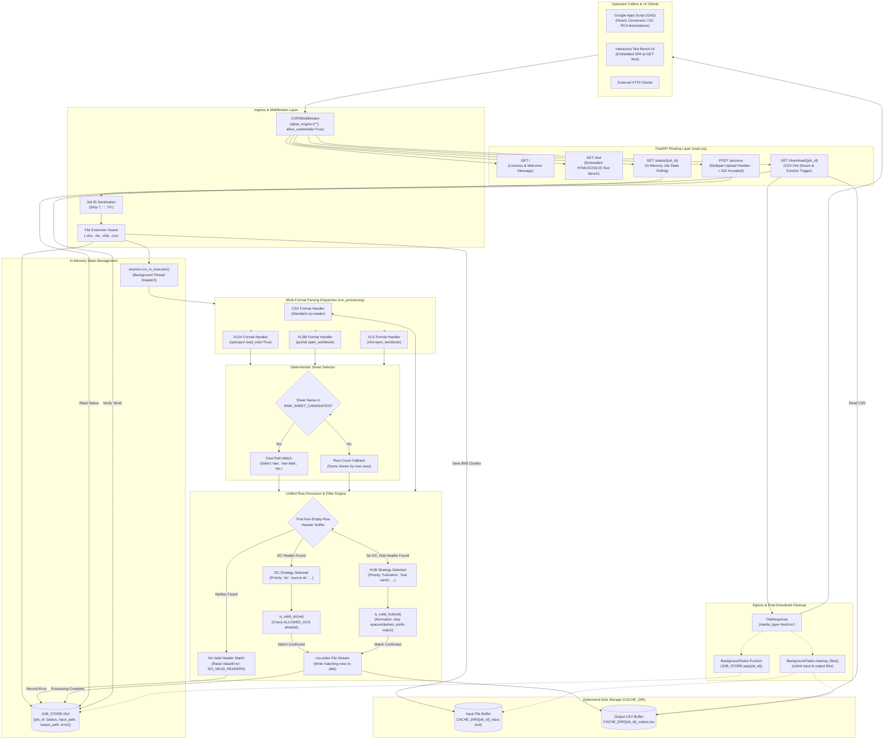
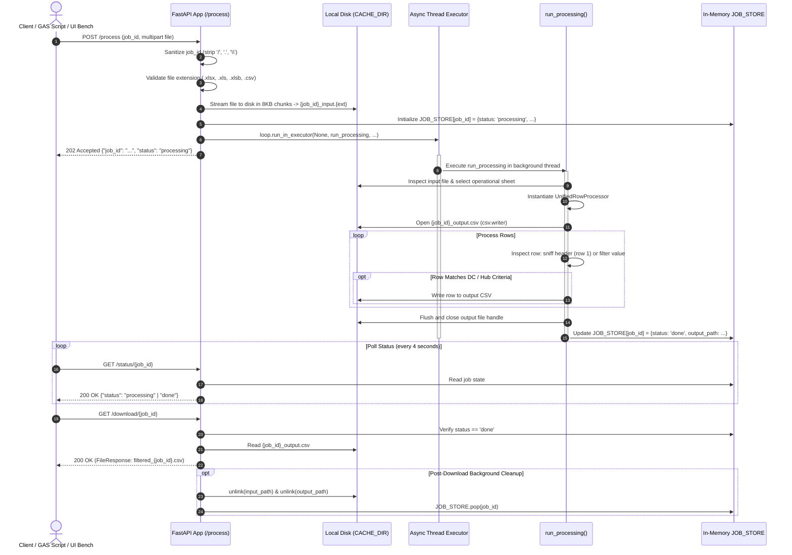
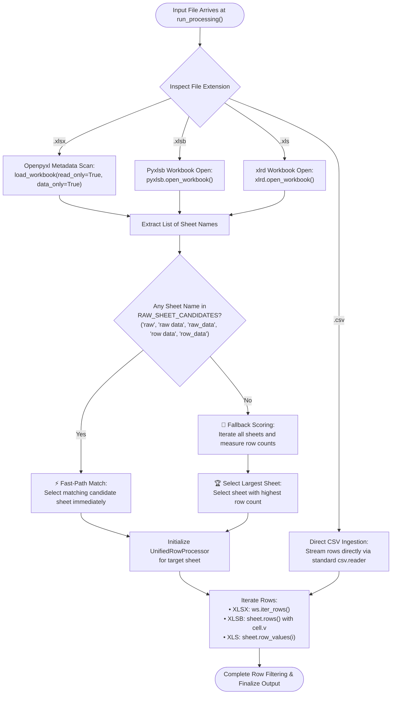
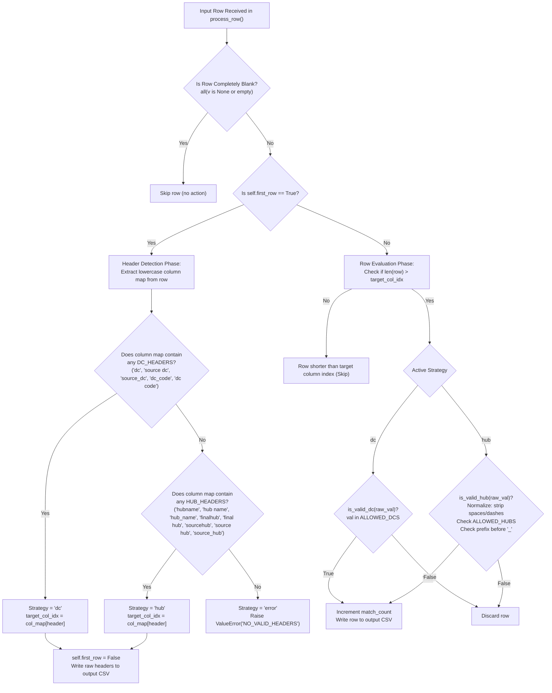

# DataConversion

## 1. Overview
**DataConversion** (internally identified as `server_v2` / `xlsx-filter-service`) is an asynchronous, job-based spreadsheet filtering HTTP microservice written in [[Python]] using [[FastAPI]] and [[Uvicorn]]. Its core operational objective is to ingest large, complex supply-chain workbooks across multiple spreadsheet formats (`.xlsx`, `.xls`, `.xlsb`, and `.csv`), automatically discover operational raw data worksheets, dynamically detect header schemas based on Distribution Center (DC) or Logistics Hub column hierarchies, and stream isolated, filtered records formatted as clean `.csv` files.

### The Operational Problem
The microservice operates within the logistics infrastructure supporting the Myntra and Dexter supply-chain network across Uttar Pradesh and Northern India. Upstream automation pipelines—specifically [[Google Apps Script]] (GAS) instances such as GAS: HourlyConversionReport and GAS: dc rca progression—routinely receive operational shipment dumps containing hundreds of thousands of nationwide rows. GAS suffers from strict architectural boundaries: a 50 MB execution memory ceiling, payload size quotas, and a hard 6-minute (360 seconds) execution timeout (`UrlFetchApp`). These scripts cannot parse multi-megabyte compressed OpenXML (`.xlsx`), binary Excel (`.xlsb`), or legacy BIFF8 (`.xls`) workbooks directly in memory.

### The Architectural Solution
DataConversion solves this by acting as an offloaded conversion engine. Clients submit workbooks via multipart form upload to an asynchronous job queue (`POST /process`). The server validates the format, streams the payload to local ephemeral storage, schedules background processing in an asynchronous thread executor (`loop.run_in_executor`), and returns an immediate `202 Accepted` response. Clients poll a lightweight status endpoint (`GET /status/{job_id}`) and retrieve the filtered CSV upon completion (`GET /download/{job_id}`). To accommodate constrained container environments such as [[Render]]'s 512 MB RAM tier, the engine leverages `openpyxl` in read-only streaming mode, `pyxlsb` binary record unpacking, and row-by-row iteration to filter records against a strict whitelist of 11 regional Distribution Centers and 11 Logistics Hubs with flexible normalization.

## 2. Tech Stack

| Component / Layer | Technology | Version / Requirement | Source / Code Reference | Notes |
| :--- | :--- | :--- | :--- | :--- |
| **Programming Language** | [[Python]] | `3.x` (Python 3) *(stated)* / `>=3.8` *(inferred)* | `Deployment.md:22`, `main.py` | Documented as `Python 3` in Render deployment guide. Uses standard type hints (`str`, `dict`, `Path`), avoiding PEP 604 union operators. |
| **Web Framework** | [[FastAPI]] | Unpinned | `requirements.txt:1`, `main.py:8` | Asynchronous ASGI web framework managing HTTP routing, multipart form parsing, and background task lifecycle. |
| **ASGI Web Server** | [[Uvicorn]] | Unpinned | `requirements.txt:2`, `Deployment.md:26`, `main.py:729` | Production ASGI web server serving the FastAPI application on host `0.0.0.0`. |
| **Data Validation** | [[Pydantic]] | Unpinned | `requirements.txt:3` | Declared in dependency manifest; installed as core FastAPI dependency *(stated: not directly imported in `main.py`)*. |
| **Multipart Form Parser** | `python-multipart` | Unpinned | `requirements.txt:4`, `main.py:8` | Required by FastAPI to process `UploadFile` and `Form` multipart payloads on `/process`. |
| **OpenXML Spreadsheet Parser** | `openpyxl` | Unpinned | `requirements.txt:5`, `main.py:552` | Provides `read_only=True` and `data_only=True` streaming access for `.xlsx` workbooks. |
| **Legacy Excel Parser** | `xlrd` | Unpinned | `requirements.txt:6`, `main.py:623` | Parses legacy Microsoft Excel 97–2003 binary workbooks (`.xls`). |
| **Binary Excel Parser** | `pyxlsb` | Unpinned | `requirements.txt:7`, `main.py:590` | Parses high-compression binary Excel workbooks (`.xlsb`) via record-level streaming. |
| **Flat File Engine** | `csv` (Python Standard Library) | Built-in | `main.py:3`, `main.py:430`, `main.py:547` | Streams native `.csv` input files and serializes filtered rows to output CSV via `csv.writer`. |
| **Hosting Platform** | [[Render]] | Starter (512 MB RAM) / Free Tier | `Deployment.md:20-30` | Cloud application container hosting service with Linux environment and dynamic port binding. |
| **Concurrency & Async Engine** | `asyncio` & `ThreadPoolExecutor` | Built-in | `main.py:721-723` | Dispatches blocking file parsing functions off the event loop via `loop.run_in_executor(None, ...)`. |
| **Client Environments** | [[Google Apps Script]] & Web Browsers | V8 Runtime / Modern Browsers | `Deployment.md:38-42`, `main.py:137-418` | Ingests workbooks generated or fetched by GAS automations and human operators using the `/test` UI bench. |
| **Storage / Cache** | Ephemeral Local Filesystem | `/tmp/xlsx_cache` or `./tmp_cache` | `main.py:34-37` | Stores temporary input files and generated CSV output files prior to download and cleanup. |

---

## 3. Architecture

### System Architecture Overview
DataConversion utilizes an asynchronous, non-blocking job pipeline designed to handle multi-megabyte spreadsheet files within a low-memory container envelope ($<512\text{ MB}$ RSS). It decouples the client upload request from the heavy parsing operation, preventing HTTP gateway timeouts.



### Key Architectural Layers

1. **Ingress & Security Layer**:
   - Wide-open CORS configuration (`allow_origins=["*"]`, `allow_credentials=True`, `allow_methods=["*"]`, `allow_headers=["*"]`) allows web applications and local diagnostic tools to connect without browser origin blocks (`main.py:25-31`).
   - Request parameter sanitization removes path-traversal characters (`/`, `\`, `.`) from client-provided `job_id` strings (`main.py:679`), preventing filesystem injection outside `CACHE_DIR`.
   - File extension whitelisting restricts uploads strictly to `.xlsx`, `.xls`, `.xlsb`, and `.csv`, rejecting all other MIME or extension types with `HTTPException(415)` (`main.py:688-692`).

2. **Asynchronous Thread Execution Layer**:
   - FastAPI's request lifecycle delegates file parsing to Python's background thread pool via `loop.run_in_executor(None, run_processing, ...)` (`main.py:722-723`).
   - Uploading clients receive a `202 Accepted` response immediately after the raw file is saved to disk, eliminating HTTP gateway timeouts when processing workbooks exceeding 100,000 rows.

3. **Multi-Format Ingestion & Sheet Resolution**:
   - Rather than relying on a single parser, the service routes formats to specialized libraries: `openpyxl` (with `read_only=True` to avoid DOM loading) for `.xlsx`, `pyxlsb` for binary `.xlsb`, `xlrd` for legacy `.xls`, and standard `csv` for flat text.
   - For multi-worksheet workbooks, the engine applies a two-stage deterministic worksheet selection algorithm:
     - **Stage 1 (Name-based Fast-Path)**: Scans for operational raw sheets matching `RAW_SHEET_CANDIDATES` (`{"raw", "raw data", "raw_data", "row data", "row_data"}`).
     - **Stage 2 (Size-based Fallback)**: If no candidate name is found, scores all sheets by row count and selects the sheet containing the largest volume of records.

4. **Dynamic Header Schema Sniffing & Filtering**:
   - The engine automatically inspects the first non-empty row of the selected worksheet to identify column schemas without requiring client-specified column indices.
   - **Strategy Precedence**: Distribution Center columns take precedence over Hub columns. If any header in `DC_HEADERS` is detected, the engine switches to `"dc"` strategy. If absent, it checks for `HUB_HEADERS` and adopts `"hub"` strategy. If neither exists, it raises `ValueError("NO_VALID_HEADERS")`.
   - Records are filtered row-by-row against hardcoded whitelists (`ALLOWED_DCS` and `ALLOWED_HUBS`). Hub values undergo flexible normalization (lowercasing, whitespace and dash stripping, and underscore prefix splitting) to handle supply-chain naming variations.

5. **Egress & Single-Use Lifecycle Destruction**:
   - Processed files are delivered via `FileResponse` as `text/csv`.
   - Using FastAPI's `BackgroundTasks`, the service immediately schedules the deletion of both the input spreadsheet and the generated CSV, while purging the job from `JOB_STORE` (`main.py:126-128`). This enforces an ephemeral, zero-persistence lifecycle.

---

## 4. Folder & File Structure

The repository maintains a flat, single-directory layout:

```
DataConversion/
├── .git/                      # Git repository tracking metadata & commit history
├── __pycache__/               # Python bytecode cache directory (untracked)
├── Deployment.md              # Production deployment specifications for Render
├── main.py                    # Monolithic application (FastAPI backend, parsers, UI bench)
└── requirements.txt           # Minimal production Python dependency manifest
```

### Granular Inventory

| File Name | Size (Bytes) | Line Count | Primary Role / Contents | Source Reference |
| :--- | :--- | :--- | :--- | :--- |
| `main.py` | 32,086 | 732 | Full monolithic application code: logging setup, CORS middleware, cache initialization, hub/DC master lists and normalization rules, in-memory `JOB_STORE`, API endpoints (`/`, `/status`, `/download`, `/test`, `/process`), embedded HTML/CSS/JS test bench, `run_processing` background worker, and the `UnifiedRowProcessor` streaming filter engine. | `main.py:1-732` |
| `Deployment.md` | 1,830 | 44 | Deployment runbook for Render Web Services. Details runtime prerequisites, GitHub integration, build/start commands, instance recommendations (Starter 512 MB RAM), and UI testing verification. | `Deployment.md:1-44` |
| `requirements.txt` | 70 | 8 | Python package requirements list specifying unpinned dependencies: `fastapi`, `uvicorn`, `pydantic`, `python-multipart`, `openpyxl`, `xlrd`, and `pyxlsb`. | `requirements.txt:1-8` |

---

## 5. Core Modules & Responsibilities

The entire codebase is structured within `main.py`. The table below outlines each function, class, and component:

| Function / Class / Symbol | Line Range | Responsibility & Logic Breakdown |
| :--- | :--- | :--- |
| `log` / Logging Setup | `main.py:14-20` | Configures structured standard output logging under logger name `"server_v2"` with timestamp, level, and message formatting. |
| `app` / CORS Setup | `main.py:22-31` | Instantiates `FastAPI()` application and applies `CORSMiddleware` with unrestricted origins (`*`), credentials, methods, and headers. |
| `CACHE_DIR` Initialization | `main.py:34-37` | Detects host environment: initializes `Path("/tmp/xlsx_cache")` if `/tmp` exists (Unix/Linux containers); falls back to local `Path("tmp_cache")` (Windows/local dev). Creates directory if missing. |
| `ALLOWED_HUBS` | `main.py:40-52` | Set containing 11 normalized hub identifiers: `aligarhmyntrahub`, `faizabadmyntrahub`, `deoriamyntrahub`, `jaunpurmyntrahub`, `maumyntrahub`, `mirzapurmyntrahub`, `jhansimyntrahub`, `muzzafarnagarmyntrahub`, `mathuramyntrahub`, `saharanpurmyntrahub`, `raebarelimyntrahub`. |
| `ALLOWED_DCS` | `main.py:54-57` | Set containing 11 three-letter Distribution Center location codes: `alg`, `ayp`, `deo`, `jnp`, `mau`, `mrz`, `jhs`, `mzn`, `mth`, `spr`, `rbr`. |
| `is_valid_dc(raw_val)` | `main.py:59-64` | Validates DC codes: strips whitespace, converts to lowercase, and checks presence against `ALLOWED_DCS`. |
| `is_valid_hub(raw_val)` | `main.py:66-76` | Normalizes hub strings: strips whitespace, lowercases, eliminates spaces and hyphens (`.replace(" ", "").replace("-", "")`). Matches against `ALLOWED_HUBS`. If unmatched, splits by underscore (`val.split('_')[0]`) and re-checks the prefix. |
| `DC_HEADERS` / `HUB_HEADERS` | `main.py:79-80` | Ordered priority lists for header sniffing. DC: `["dc", "source dc", "source_dc", "dc_code", "dc code"]`. Hub: `["hubname", "hub name", "hub_name", "finalhub", "final hub", "sourcehub", "source hub", "source_hub"]`. |
| `cleanup_files(*file_paths)` | `main.py:82-91` | Iterates over provided `Path` arguments, verifies existence, and unlinks them from disk. Logs deletions or caught exceptions. |
| `JOB_STORE` | `main.py:94` | Global in-memory dictionary tracking job state: `{job_id: {"status": ..., "output_path": ..., "input_path": ..., "error": ...}}`. |
| `root()` | `main.py:96-98` | Endpoint `GET /`. Returns JSON status `{"status": "ready", "message": "..."}` confirming service availability. |
| `job_status(job_id)` | `main.py:100-109` | Endpoint `GET /status/{job_id}`. Returns JSON dictionary with current status (`processing`, `done`, `error`) and error message if failed. Raises 404 if job ID is unrecognized. |
| `job_download(job_id, background_tasks)` | `main.py:111-135` | Endpoint `GET /download/{job_id}`. Verifies job completion, returns `FileResponse` for `filtered_{job_id}.csv`, and registers `cleanup_files` and `JOB_STORE.pop` as background tasks for automatic post-download deletion. |
| `test_page()` | `main.py:137-418` | Endpoint `GET /test`. Serves an embedded, self-contained single-page application (HTML/CSS/JavaScript) featuring dynamic origin resolution, file selection, XHR upload progress tracking, polling interval (4s), and automatic blob download. |
| `run_processing(job_id, input_path, output_path, ext)` | `main.py:420-670` | Primary background worker function executed in thread pool. Directs format-specific parsing (`.csv`, `.xlsx`, `.xlsb`, `.xls`), performs sheet selection, feeds rows into `UnifiedRowProcessor`, and updates `JOB_STORE`. |
| `UnifiedRowProcessor` | `main.py:427-538` | Internal streaming processor class. Opens output file handle with `csv.writer`. Sniffs headers on the first non-empty row to determine strategy (`"dc"` vs `"hub"`), validates subsequent rows against corresponding rules, logs progress every 50,000 rows, and writes matches directly to disk. |
| `UnifiedRowProcessor.write(data)` | `main.py:443-456` | Text/byte streaming buffer handler. *(Dead code / residual from earlier `xlsx2csv` implementation; never invoked by active format parsers)*. |
| `UnifiedRowProcessor.process_row(row)` | `main.py:458-517` | Evaluates individual rows. Bypasses empty rows, extracts headers on row 0, binds target column index, validates values against `is_valid_dc` or `is_valid_hub`, increments `match_count`, and writes rows. |
| `UnifiedRowProcessor.finalize()` | `main.py:518-537` | Flushes residual line buffers, closes the output file handle, calculates throughput metrics (speed in rows/s, match percentage), and logs completion telemetry. |
| `process_file(background_tasks, job_id, file)` | `main.py:672-726` | Endpoint `POST /process`. Sanitizes `job_id`, validates file extension, writes multipart stream to disk in 8 KB chunks, initializes `JOB_STORE`, dispatches `run_processing` to `asyncio` thread executor, and returns `202 Accepted`. |
| `if __name__ == "__main__"` | `main.py:728-732` | Local startup entry point. Reads `PORT` environment variable (default: `8000`) and launches Uvicorn binding to `0.0.0.0`. |

---

## 6. Data Flow / Key Workflows

### 1. Asynchronous Job Ingestion & Polling Lifecycle
This workflow represents the standard operational lifecycle used by client automation scripts and web users.



### 2. Deterministic Sheet Selection & Parser Workflow
Supply chain workbooks often arrive with multiple tabs (e.g., summary pivots, agent summaries, and raw shipment lines). The engine applies a two-tier strategy to locate the correct operational tab across different file formats.



### 3. Header Schema Sniffing & Filtering Logic
Once row streaming begins, `UnifiedRowProcessor` examines the initial rows to establish whether the workbook structures its logistics hierarchy around Distribution Center codes or Hub facility names.



---

## 7. Configuration & Environment

### Environment Variables

| Variable Name | Required? | Default Value | Referenced In | Description & Caveats |
| :--- | :--- | :--- | :--- | :--- |
| `PORT` | Optional | `8000` (code) / `$PORT` (Render) | `main.py:730`, `Deployment.md:26` | Port bound by Uvicorn. In local execution, defaults to `8000`. On Render, the platform dynamically assigns `$PORT` *(stated)*. |

### Internal Constants & Whitelists

| Constant / Parameter | Value | Defined At | Operational Purpose |
| :--- | :--- | :--- | :--- |
| `CACHE_DIR` | `Path("/tmp/xlsx_cache")` or `Path("tmp_cache")` | `main.py:34-37` | Directory hosting uploaded source files and generated CSV outputs. Automatically detects non-Unix environments. |
| `ALLOWED_HUBS` | Set of 11 normalized strings | `main.py:40-52` | Master whitelist of permitted logistics hub names across UP operations *(stated)*. |
| `ALLOWED_DCS` | Set of 11 three-letter codes | `main.py:54-57` | Master whitelist of permitted Distribution Center codes *(stated)*. |
| `DC_HEADERS` | `["dc", "source dc", "source_dc", "dc_code", "dc code"]` | `main.py:79` | Ordered priority list of column names used to detect DC-based filtering columns. |
| `HUB_HEADERS` | `["hubname", "hub name", "hub_name", "finalhub", "final hub", "sourcehub", "source hub", "source_hub"]` | `main.py:80` | Ordered priority list of column names used to detect Hub-based filtering columns. |
| `RAW_SHEET_CANDIDATES` | `{"raw", "raw data", "raw_data", "row data", "row_data"}` | `main.py:559, 596, 629` | Set of candidate worksheet names checked during fast-path tab selection. |
| `Upload Chunk Size` | `8192` bytes (8 KB) | `main.py:703` | Chunk buffer size utilized when streaming uploaded multipart files to disk. |
| `Telemetry Log Interval` | `50,000` rows | `main.py:460` | Logging frequency for row throughput, speed (rows/s), and match percentage. |
| `UI Polling Interval` | `4000` ms (4 seconds) | `main.py:377` | Frequency at which the embedded web test bench polls `/status/{job_id}`. |

### Distribution Center & Hub Mapping Reference

The 11 Distribution Centers and Hubs configured in `main.py:40-57` correspond to key delivery operational clusters across Northern India:

| Location / Cluster | DC Code (`ALLOWED_DCS`) | Hub Identifier (`ALLOWED_HUBS`) | Added in Commit |
| :--- | :--- | :--- | :--- |
| **Aligarh** | `alg` | `aligarhmyntrahub` | `a2b9f41` (Initial commit) |
| **Faizabad / Ayodhya** | `ayp` | `faizabadmyntrahub` | `a2b9f41` (Initial commit) |
| **Deoria** | `deo` | `deoriamyntrahub` | `a2b9f41` (Initial commit) |
| **Jaunpur** | `jnp` | `jaunpurmyntrahub` | `a2b9f41` (Initial commit) |
| **Mau** | `mau` | `maumyntrahub` | `a2b9f41` (Initial commit) |
| **Mirzapur** | `mrz` | `mirzapurmyntrahub` | `a2b9f41` (Initial commit) |
| **Jhansi** | `jhs` | `jhansimyntrahub` | `0cd2c29` (Jul 2026 update) |
| **Muzaffarnagar** | `mzn` | `muzzafarnagarmyntrahub` | `0cd2c29` (Jul 2026 update) |
| **Mathura** | `mth` | `mathuramyntrahub` | `0cd2c29` (Jul 2026 update) |
| **Saharanpur** | `spr` | `saharanpurmyntrahub` | `0cd2c29` (Jul 2026 update) |
| **Raebareli** | `rbr` | `raebarelimyntrahub` | `0cd2c29` (Jul 2026 update) |

---

## 8. External Integrations & APIs

### External Services Consumed
1. **Render Cloud Platform**:
   - Web service container orchestration, auto-deployment on git pushes to `main`, dynamic port assignment via `$PORT`, and SSL termination.
2. **Upstream Supply Chain Systems**:
   - Google Apps Script automation projects (`GAS-HourlyConversionReport`, `GAS-dc-rca-progression`) dispatching automated cron requests to convert daily dispatch workbooks.

### HTTP Endpoints Exposed

| Method | Path | Auth Required | Parameters / Body | Status Codes | Response Media Type / Payload | Description |
| :--- | :--- | :--- | :--- | :--- | :--- | :--- |
| `GET` | `/` | None | None | `200 OK` | `application/json`<br/>`{"status": "ready", "message": "..."}` | Liveness probe verifying server availability and pointing operators to `/test`. |
| `GET` | `/status/{job_id}` | None | `job_id` (Path, string) | `200 OK`<br/>`404 Not Found` | `application/json`<br/>`{"job_id": "...", "status": "processing"|"done"|"error", "error": ...}` | Polls processing status for a submitted job. Returns 404 if `job_id` does not exist in `JOB_STORE`. |
| `GET` | `/download/{job_id}` | None | `job_id` (Path, string) | `200 OK`<br/>`202 Accepted`<br/>`404 Not Found`<br/>`500 Internal Error` | `text/csv`<br/>Attachment: `filtered_{job_id}.csv`<br/>Headers: `X-Job-ID: {job_id}` | Downloads the filtered CSV file. Triggers background cleanup tasks to delete input/output files and evict job from `JOB_STORE`. Returns 202 if still processing. |
| `GET` | `/test` | None | None | `200 OK` | `text/html`<br/>HTML5 / CSS / JavaScript SPA | Serves the interactive, browser-based test bench application. |
| `POST` | `/process` | None | `job_id` (Form, string)<br/>`file` (File, multipart) | `202 Accepted`<br/>`415 Unsupported Type`<br/>`500 Internal Error` | `application/json`<br/>`{"job_id": "...", "status": "processing", "message": "..."}` | Ingests spreadsheet files via multipart form upload. Sanitizes `job_id`, saves file to disk, queues background thread, and registers job in `JOB_STORE`. |

---

## 9. Testing

### Automated Test Suites
* **Unit Tests**: `Unknown / not documented` *(stated: no `tests/` directory, `test_*.py` files, or test configuration files exist in the repository)*.
* **Integration / E2E Tests**: `Unknown / not documented`.
* **CI Test Runners**: `Unknown / not documented`.

### Manual Test Harness (`GET /test`)
The service includes an embedded, browser-accessible single-page test harness served directly from `main.py:137-418`:
* **Dynamic Origin Resolution**: Automatically sets the server target URL to `window.location.origin` upon page load (`main.py:265`).
* **Input Fields**: Pre-fills a sample Job ID (`test-job-12345`) and provides a file picker accepting `.xlsx`, `.xls`, `.xlsb`, and `.csv`.
* **Upload Progress Telemetry**: Uses `XMLHttpRequest.upload.onprogress` to drive a real-time percentage progress bar during file upload (`main.py:307-321`).
* **Indeterminate Processing State**: Switches to an animated gradient progress bar once upload reaches 100%, indicating server-side background conversion.
* **Automated Polling Loop**: Polls `/status/{job_id}` every 4,000 milliseconds (4 seconds), rendering live log messages with elapsed seconds.
* **Automatic Download Trigger**: Once the status reaches `"done"`, the JavaScript client issues a `fetch` request to `/download/{job_id}`, creates an invisible DOM anchor element (`<a download>`), triggers a click to download `filtered_{job_id}.csv`, and revokes the blob URL (`main.py:380-399`).

---

## 10. CI/CD & Deployment

### CI/CD Pipelines
* **Continuous Integration**: `Unknown / not documented` *(stated: no GitHub Actions `.github/workflows/` or external CI configurations exist)*.
* **Continuous Deployment**: Automated Git push deployments managed natively by Render. Commits pushed to branch `main` trigger automated builds.

### Deployment Specifications (`Deployment.md`)
* **Hosting Platform**: [[Render]] Web Services *(stated)*.
* **Environment**: `Python 3` *(stated)*.
* **Branch**: `main` *(stated)*.
* **Build Command**: `pip install -r requirements.txt` (`Deployment.md:25`).
* **Start Command**: `uvicorn main:app --host 0.0.0.0 --port $PORT` (`Deployment.md:26`).
* **Recommended Tier**: Starter ($7/month) 512 MB RAM tier *(stated)*.

> [!warning] Critical Deployment Gotcha: Root Directory Mismatch
> In `Deployment.md:24`, the documentation instructs:
> *"Root Directory: server_v2 (Very important so Render finds the correct files)."*
>
> In the actual GitHub repository, all application files (`main.py`, `requirements.txt`, `Deployment.md`) are located in the **root directory** (`.`), not within a subdirectory named `server_v2`. If an operator configures Render with `Root Directory: server_v2`, Render will fail during the build step with a directory not found error. The Render Root Directory setting must be left blank or set to `.` *(stated: verified against repository file layout)*.

---

## 11. Setup & Local Development

### Documented Commands
All setup commands documented below derive strictly from repository configuration files (`Deployment.md:25-26` and `main.py:730-731`):

```bash
# 1. Install production dependencies
pip install -r requirements.txt

# 2. Launch production server via Uvicorn (Render start command)
uvicorn main:app --host 0.0.0.0 --port $PORT

# 3. Launch server via Python entry point (uses default port 8000 or $PORT)
python main.py
```

### Local Development Environment Considerations
1. **Operating System & Cache Directory**:
   - On Linux/macOS, `CACHE_DIR` initializes to `/tmp/xlsx_cache`.
   - On Windows, `main.py:35-36` automatically detects that `/tmp` does not exist and redirects `CACHE_DIR` to a local directory named `tmp_cache/`.
2. **Port Binding**:
   - When executing `python main.py`, the application checks `os.getenv("PORT", 8000)`. If `$PORT` is unset, it binds to `http://0.0.0.0:8000`.

---

## 12. Security Notes

### Authentication & Authorization Vulnerabilities
* **Zero Authentication Guard**: All endpoints (`/`, `/status/{job_id}`, `/download/{job_id}`, `/test`, and `/process`) are completely unauthenticated. There are no API keys, tokens, basic auth, or session cookies validated anywhere in the codebase *(stated)*.
* **Public Job Exposure**: Any external user who discovers or guesses an active `job_id` can query `/status/{job_id}` or download filtered supply-chain data from `/download/{job_id}` *(stated)*.
* **Unrestricted CORS Policy**: The CORS middleware sets `allow_origins=["*"]` with `allow_credentials=True` (`main.py:27-28`), permitting arbitrary websites to trigger processing or extract data via client-side JavaScript.

### Input Sanitization & File Safety
* **Path Traversal Guard**: The `process_file` endpoint explicitly strips path traversal characters:
  ```python
  job_id = job_id.replace("/", "").replace(".", "").replace("\\", "")
  ```
  This sanitization (`main.py:679`) prevents malicious clients from targeting system directories (e.g., submitting `../../etc/passwd` as the `job_id`).
* **Extension Whitelisting**: Strict extension enforcement (`.xlsx`, `.xls`, `.xlsb`, `.csv`) prevents executable scripts (`.sh`, `.py`, `.exe`) from being accepted by the upload handler (`main.py:689-691`).
* **Lack of Magic Byte Verification**: Unlike sister microservices (e.g., `xlsx_to_csv_bridge` which verifies `PK\x03\x04` zip headers), DataConversion validates file integrity solely via file extensions. A corrupted or malicious file with an `.xlsx` extension will be passed directly to `openpyxl`.

### Denial of Service & Resource Exhaustion Risks
* **Unbounded Concurrency**: The application dispatches background jobs via `loop.run_in_executor(None, run_processing, ...)` (`main.py:723`) without concurrency throttling or a semaphore lock. If multiple clients upload large `.xlsx` workbooks concurrently, multiple background threads will parse files simultaneously, rapidly exhausting the 512 MB memory limit and causing Render to terminate the container (`SIGKILL` OOM).
* **Disk Exhaustion**: While files are deleted after download, if a client uploads a file but never calls `/download/{job_id}`, both the input file and the generated output CSV remain in `CACHE_DIR` indefinitely, as there is no background TTL eviction daemon.

---

## 13. Known Issues, Limitations & Tech Debt

### 1. Deployment Root Directory Documentation Mismatch
- **Traceability**: `Deployment.md:24` vs repository file layout
- **Issue**: `Deployment.md` instructs configuring Render with `Root Directory: server_v2`. However, the repository contains no `server_v2` folder; `main.py` resides at the root. Following the deployment guide verbatim results in a failed build.

### 2. Dead Code in `UnifiedRowProcessor.write()`
- **Traceability**: `main.py:443-456`, `main.py:519-525`
- **Issue**: `UnifiedRowProcessor` defines a `.write(data)` method with newline line-buffering and `io.StringIO` parsing. This was originally implemented when `xlsx2csv` was used as a SAX callback target. Because the active codebase iterates rows directly (`iter_rows()`, `sheet.rows()`, `sheet.row_values()`), `.write()` is never invoked anywhere in the codebase.

### 3. Double-Pass Workbook Deserialization in `openpyxl`
- **Traceability**: `main.py:554` and `main.py:582`
- **Issue**: For `.xlsx` files, the engine opens the workbook once using `wb_meta = load_workbook(..., read_only=True)` to inspect sheet names and score row counts, closes it, and then opens the workbook a second time (`wb = load_workbook(...)`) to stream the rows. This doubles workbook open latency and I/O overhead.

### 4. Flawed Sheet Scoring via `ws.max_row` in `openpyxl` Read-Only Mode
- **Traceability**: `main.py:571-574`
- **Issue**: When `openpyxl` operates with `read_only=True`, `ws.max_row` is only populated if the underlying worksheet XML includes the `<dimension ref="..."/>` tag. If that tag is omitted by the upstream generator, `ws.max_row` returns `None`. The fallback expression `rows = ws.max_row or 0` results in `0` rows for all sheets, potentially causing the fallback sheet selector to pick an arbitrary or incorrect worksheet.

### 5. Multi-Pass Row Iteration in `pyxlsb` Fallback
- **Traceability**: `main.py:606-610`
- **Issue**: In `.xlsb` workbooks, if no candidate name matches `RAW_SHEET_CANDIDATES`, the engine counts rows across all sheets by iterating every row (`for _ in sheet.rows(): row_count += 1`). It then re-opens the winning sheet to stream rows. On massive workbooks, this leads to significant processing delays.

### 6. Volatile In-Memory `JOB_STORE` without TTL Eviction
- **Traceability**: `main.py:94`, `main.py:661-669`
- **Issue**: `JOB_STORE` is an in-memory dictionary. If the Render instance spins down or restarts due to inactivity, active and completed job states are lost. Furthermore, if a client fails to download a completed job, the job entry and its files on disk are never evicted.

### 7. Destructive Single-Download Retrieval
- **Traceability**: `main.py:126-128`
- **Issue**: `GET /download/{job_id}` schedules `cleanup_files` and `JOB_STORE.pop` as background tasks immediately upon serving the file. If the client's network connection drops mid-download, the output file on the server is unlinked, preventing resume or retry attempts.

### 8. Unused Dependency in `requirements.txt`
- **Traceability**: `requirements.txt:3`
- **Issue**: `pydantic` is listed in `requirements.txt` but is never imported or used directly in `main.py`. (FastAPI depends on Pydantic internally, making explicit top-level declaration redundant unless pinned).

---

## 14. Design Decisions & Rationale

### 1. Asynchronous Job Polling over Synchronous HTTP Responses
* **Decision**: Refactor `/process` to queue background work and return `202 Accepted`, requiring clients to poll `/status` and retrieve results via `/download` (`commit e5117de`).
* **Rationale**: *(stated in Deployment.md and commit history)* Large supply-chain workbooks take 15–90 seconds to parse. In synchronous operations, reverse proxies and Google Apps Script's `UrlFetchApp` frequently time out. The job-based polling pattern ensures reliability across slow networks and constrained clients.

### 2. Elimination of `pandas` and Transition to Streaming Parsers
* **Decision**: Completely remove `pandas` from `requirements.txt` (`commit 4c9d5b5`) and replace full-file ingestion with `openpyxl` read-only mode, `pyxlsb`, and `xlrd`.
* **Rationale**: *(stated in Deployment.md)* Initial iterations using `pandas.read_excel()` exhausted container memory when deserializing 200,000+ rows, causing Render Free/Starter instances (512 MB limit) to crash with OOM errors. Stream and row-based parsers keep resident memory within acceptable bounds.

### 3. Flexible Hub Name Normalization and Prefix Splitting
* **Decision**: Implement `is_valid_hub()` with multi-stage sanitization (stripping whitespace, lowercasing, removing hyphens/spaces, and splitting on `_` to match prefixes) (`commit 0cd2c29`).
* **Rationale**: *(stated in commit 0cd2c29)* Operational spreadsheets in the Myntra/Dexter logistics network often label hubs with operational suffixes (e.g., `mirzapurmyntrahub_dox`, `aligarhmyntrahub_van`, `Jhansi Myntra Hub - Return`). Prefix matching guarantees that valid operational lines are captured despite naming variations.

### 4. Distribution Center Priority over Hub Names
* **Decision**: In `UnifiedRowProcessor`, evaluate `DC_HEADERS` before `HUB_HEADERS` (`main.py:480-496`).
* **Rationale**: *(inferred)* Distribution Center codes (`alg`, `mrz`, `jnp`) are concise, standardized 3-letter tokens that exhibit less ambiguity and human data-entry variance than full descriptive hub strings (`mirzapurmyntrahub`). Prioritizing DC columns yields higher filtering accuracy when both columns coexist in a master shipment report.

### 5. Embedded Single-Page Diagnostic UI (`/test`)
* **Decision**: Hardcode a complete HTML5/CSS/JavaScript test application directly inside `main.py:137-418`.
* **Rationale**: *(inferred)* Eliminates external static asset hosting, template engines, and build tooling. Enables logistics coordinators and engineers to diagnose parser issues, test sample files, and inspect server logs directly from any browser without external API clients.

---

## 15. Roadmap / TODOs

### Documented in Code & Commits
* None explicitly tagged with `TODO`, `FIXME`, or `ROADMAP` in codebase *(stated)*.

### Inferred Technical Debt Remediation
* **Correct `Deployment.md` Root Directory**: Update documentation to specify `Root Directory: .` (empty/root) instead of `server_v2` *(inferred)*.
* **Implement Concurrency Guard**: Add a global `asyncio.Semaphore(1)` or `threading.Semaphore(1)` around `run_processing` to prevent concurrent memory spikes on 512 MB Render instances *(inferred)*.
* **Prune Residual Dead Code**: Remove `.write()` and `self.line_buffer` from `UnifiedRowProcessor` *(inferred)*.
* **Eliminate Double-Pass in Openpyxl**: Reuse the loaded workbook handle or optimize metadata inspection to avoid opening `.xlsx` files twice *(inferred)*.
* **Add TTL-Based Cache Eviction**: Introduce a periodic background task to purge expired input/output files from `CACHE_DIR` if clients fail to download results *(inferred)*.
* **Add Optional API Key Authentication**: Protect public endpoints with an `X-API-KEY` header check to secure supply chain logistics data *(inferred)*.

---

## 16. Changelog

All timestamps and commit hashes below reflect the true commit history of the repository default branch (`main`):

| Commit Hash | Commit Date | Author | Commit Summary & Key Codebase Changes |
| :--- | :--- | :--- | :--- |
| `0cd2c29` | 2026-07-23 | unknown (`samar24012002@gmail.com`) | `feat: add new hub names and DC location codes with flexible normalization`. Expanded `ALLOWED_HUBS` and `ALLOWED_DCS` with 5 new locations: Jhansi (`jhs`), Muzaffarnagar (`mzn`), Mathura (`mth`), Saharanpur (`spr`), and Raebareli (`rbr`). Implemented flexible normalization in `is_valid_hub()` (space/dash stripping, underscore prefix splitting) and created `is_valid_dc()`. |
| `e5117de` | 2026-02-21 | SamarVScode | Major architectural overhaul: converted synchronous processing into an asynchronous job queue. Introduced `JOB_STORE`, `loop.run_in_executor`, `GET /status/{job_id}`, and `GET /download/{job_id}`. Updated embedded `/test` UI bench with polling and download triggers. |
| `4c9d5b5` | 2026-02-21 | SamarVScode | Dependency pruning: removed `pandas` and `xlsx2csv` from `requirements.txt`. |
| `e76d3cf` | 2026-02-21 | SamarVScode | Refactored workbook closing logic, exception propagation, and output path handling in `run_processing`. |
| `5a5b908` | 2026-02-21 | SamarVScode | Added `xlsx2csv` to `requirements.txt` (subsequently removed in commit `4c9d5b5`). |
| `2740d5e` | 2026-02-21 | SamarVScode | Refactored row processing and streaming callbacks in `UnifiedRowProcessor`. |
| `68c11d1` | 2026-02-21 | SamarVScode | Enhanced format-specific streaming handlers for `.xlsx`, `.xlsb`, and `.xls`. Added candidate sheet name detection and row count scoring. |
| `edf2d7a` | 2026-02-21 | SamarVScode | Simplified exception logging and eliminated redundant status checks. |
| `31a2556` | 2026-02-21 | SamarVScode | Updated `process_row` value extraction to prevent `NoneType` errors. |
| `4091a2c` | 2026-02-21 | SamarVScode | Added detailed console telemetry logging every 50,000 rows. |
| `a6346f5` | 2026-02-21 | SamarVScode | Adjusted file upload chunk size and error response format. |
| `4f58ef3` | 2026-02-21 | SamarVScode | Added multi-format parsing support (`pyxlsb` for `.xlsb`, `xlrd` for `.xls`). |
| `35a5c59` | 2026-02-21 | SamarVScode | Minor bug fix in header matching casing. |
| `a2b9f41` | 2026-02-21 | SamarVScode | Initial repository commit. Uploaded `Deployment.md`, `main.py`, and `requirements.txt`. |

---

## 17. Glossary

* **BIFF8**: Binary Interchange File Format version 8, the proprietary binary format used by Microsoft Excel 97–2003 (`.xls`), parsed by `xlrd`.
* **DC (Distribution Center)**: Regional logistics hub responsible for stocking, sorting, and dispatching shipments to delivery facilities (e.g., `mrz` for Mirzapur, `alg` for Aligarh).
* **Dexter**: Internal logistics and shipment tracking ecosystem utilized within Myntra supply chain operations.
* **GAS**: [[Google Apps Script]] — Cloud scripting execution runtime embedded in Google Workspace, constrained by a 50 MB RAM limit and 6-minute execution quota.
* **Hub**: Facility responsible for localized final-mile delivery dispatches (e.g., `mirzapurmyntrahub`).
* **OpenXML**: Compressed ZIP-based XML format utilized by modern Microsoft Excel workbooks (`.xlsx`), parsed in streaming mode via `openpyxl`.
* **Render**: Cloud platform providing containerized web service hosting with Linux environments.
* **UnifiedRowProcessor**: The central data-processing class in `main.py` that sniffs column headers, selects filtering strategies, validates rows against master whitelists, and writes output CSV lines.
* **XLSB**: Binary Excel workbook format storing worksheet records as raw binary records rather than XML, offering high compression and fast parsing via `pyxlsb`.

---

## 18. Related Notes
- [[Dashboard|Engineering Second Brain & Project Master Map]] — Central knowledge base index and operational project directory.
- [[Services/FastAPI-Render-Bridges|FastAPI Render Streaming Microservices]] — Service infrastructure for Python FastAPI streaming workers.

---


## 19. Update Instructions (meta)

To update this document when modifications are committed to the `DataConversion` repository:

1. **Check Git Status & Commit Recency**:
   - Inspect the latest commit date on `main` via `git log -n 1 --format="%ad" --date=short`.
   - Update `repo-last-commit` in the YAML frontmatter.
   - Re-evaluate `status`:
     - `active`: last commit < 30 days ago
     - `paused`: last commit 30–<180 days ago
     - `archived`: last commit ≥ 180 days ago (or if explicitly archived).
   - Set `last-updated` to the current local date (`YYYY-MM-DD`).

2. **Track Dependency & Environment Updates**:
   - If `requirements.txt` is modified, update the table in **Section 2 (Tech Stack)**.
   - If environment variables in `main.py` or `Deployment.md` are added or removed, update **Section 7 (Configuration & Environment)**.

3. **Trace Route, Parser, or Filtering Changes**:
   - If new endpoints are declared in `main.py`, record them in **Section 8 (HTTP Endpoints Exposed)**.
   - If `ALLOWED_HUBS` or `ALLOWED_DCS` are modified, update the mapping table in **Section 7**.
   - If sheet selection candidates (`RAW_SHEET_CANDIDATES`) or header priority lists (`DC_HEADERS`, `HUB_HEADERS`) are altered, update the flowcharts in **Section 3** and **Section 6**.

4. **Audit Against Rules**:
   - Maintain explicit citations to file names and line numbers.
   - Distinguish explicit statements from inferences using `*(stated)*` and `*(inferred)*`.
   - Ensure all documented run commands originate directly from actual repository code or configuration files.
