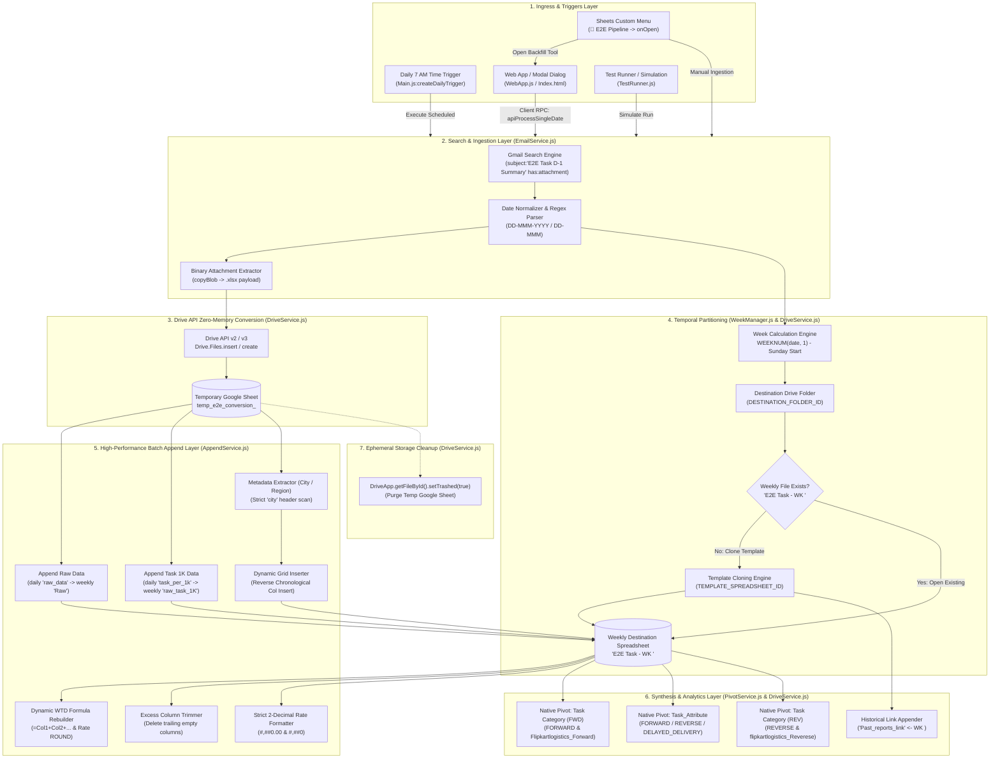
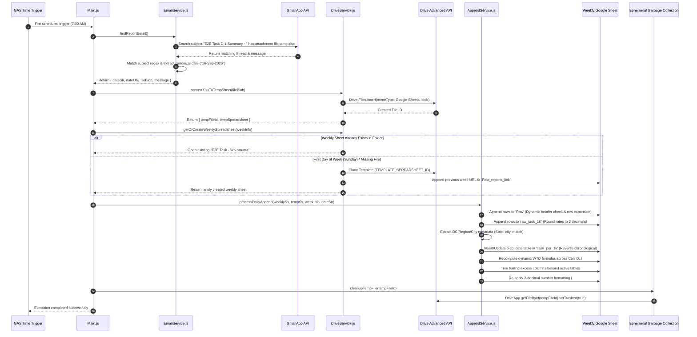
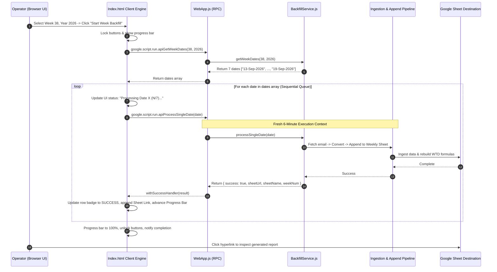
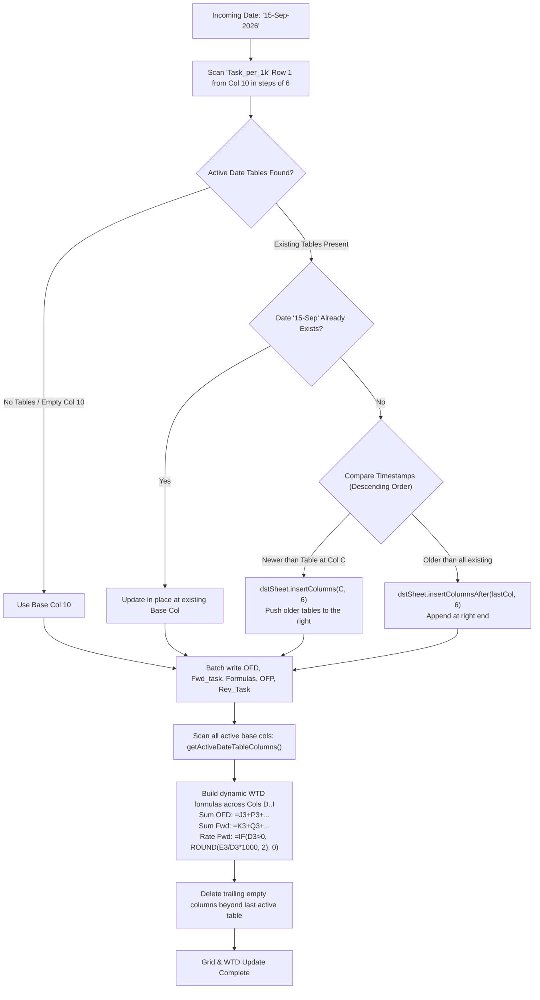
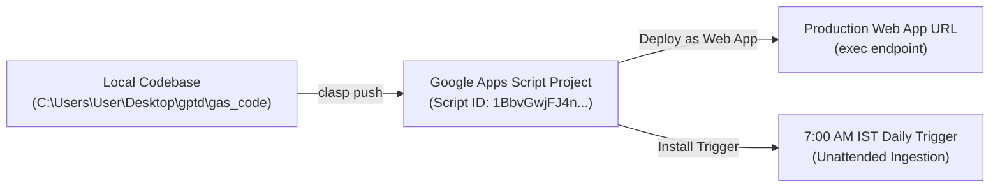

# EI-Pan-India-Report (E2E Task Daily Automation)

## 1. Overview
The **EI-Pan-India-Report** (codebase title: **E2E Task Daily Automation**) is a production [[Google Apps Script]] (GAS) data ingestion and aggregation pipeline operating within the [[Services/Myntra-Logistics-Infrastructure#logistics-stream-engine|Myntra Logistics Stream Engine]]. Its primary function is to automate the daily harvesting of nationwide Early-Ingestion (EI) operational summaries distributed via automated emails (`E2E Task D-1 Summary - <date>`), extract the attached multi-tab OpenXML (`.xlsx`) workbooks, convert them into Google Sheets via the [[Google Drive]] Advanced Service without memory-exhausting client-side parsing, and append the metrics into temporally partitioned weekly master spreadsheets (`E2E Task - WK <weekNum>`).

### The Operational Problem
Daily nationwide Early-Ingestion reports arrive in massive, multi-tab OpenXML spreadsheets encompassing hundreds of thousands of operational rows across nationwide logistics hubs. Processing and parsing these workbooks in native Google Apps Script causes immediate memory exhaustion (exceeding the 50 MB heap ceiling) and execution timeouts (exceeding the 6-minute script quota). Additionally, historical backfills across multi-date ranges cannot run in a single synchronous execution without crashing, leaving operational teams without historical trending or pivot summaries.

### The Architectural Solution
The pipeline circumvents memory limits by converting incoming `.xlsx` workbooks into Google Sheets using the Google Drive Advanced API, bypassing client-side XML DOM parsing entirely. It updates granular transaction logs (`Raw`), hub-level daily summaries (`raw_task_1K`), and an operational tracking grid (`Task_per_1k`) that dynamically inserts 6-column daily metric tables in reverse chronological order with live Week-To-Date (`WTD`) formulas, historical links (`Past_reports_link`), and automated Sheets pivot tables (`Task Category (FWD)`, `Task_Attribute`, `Task Category (REV)`). To eliminate timeout failures, the pipeline implements a dual execution model: an unattended 7:00 AM daily scheduled trigger (`Main.js:61-79`) and a client-orchestrated, chunked backfill Web Application (`WebApp.js:11-15`, `Index.html:1-395`) that processes historical multi-date ranges sequentially across independent HTTP Remote Procedure Call (RPC) threads.

## 2. Tech Stack

| Component / Layer | Technology | Version / Specification | Source / Code Reference | Notes |
| :--- | :--- | :--- | :--- | :--- |
| **Execution Runtime** | [[Google Apps Script]] V8 Engine | Chrome V8 ECMAScript 6+ | `appsscript.json:13` | Modern JavaScript runtime supporting `const`, `let`, arrow functions, template literals, and `Set`. |
| **Platform Target** | Google Cloud / Google Workspace | Cloud-Managed Serverless | `appsscript.json:1-18` | Hosted entirely within Google's cloud infrastructure; bound to Google Drive and Gmail services. |
| **Advanced Cloud API** | [[Google Drive]] API | `v2` (with `v3` fallback support) | `appsscript.json:4-10`, `DriveService.js:25-37` | Advanced service invoked via `Drive.Files.insert` (v2) or `Drive.Files.create` (v3) for zero-memory `.xlsx` to Sheet conversion. |
| **Core App Services** | `SpreadsheetApp`, `DriveApp`, `GmailApp` | GAS Native Services | `Main.js:15`, `DriveService.js:70`, `AppendService.js:70` | Direct Workspace services handling document DOM, Drive file tree hierarchy, and mail search/attachment fetching. |
| **Scheduling Engine** | `ScriptApp` Time-Driven Triggers | Daily Trigger (7:00 AM–8:00 AM IST) | `Main.js:61-79` | Unattended cron-style execution configured via `ScriptApp.newTrigger().timeBased().everyDays(1).atHour(7).create()`. |
| **UI Framework** | HTML5 / CSS3 / Vanilla JavaScript | Standard Web Standards | `Index.html:1-395`, `WebApp.js:11-15` | Responsive modal dialog and standalone Web App powered by `google.script.run` asynchronous client RPC. |
| **Timezone Setting** | Asia/Kolkata (IST) | `UTC+05:30` | `appsscript.json:2` | Mandates all date calculations, Gmail search queries, and display strings align with Indian Standard Time. |
| **Telemetry & Logs** | Google Cloud Stackdriver Logging | `STACKDRIVER` | `appsscript.json:12` | Structured cloud execution logs accessible through GCP Console and the Apps Script Execution Dashboard. |
| **Deployment / CLI** | `@google/clasp` (Chrome Apps Script) | Clasp CLI (`.clasp.json`) | `gas_code/.clasp.json:1-4` | Local command-line tooling for bidirectional synchronization (`clasp push`/`clasp pull`) against Script ID `1BbvGwj...`. |

---

## 3. Architecture

### System Architecture Overview
The system follows an **Asynchronous Stream-and-Partition Architecture** engineered to circumvent the fundamental resource constraints of Google Apps Script: a 50 MB heap limit and a 6-minute (360 seconds) execution ceiling. 



### Architectural Highlights & Constraints Mitigation

1. **Zero-Memory OpenXML Parsing via Drive API**:
   Google Apps Script cannot parse 10 MB–50 MB `.xlsx` files using JavaScript DOM or XML parsers without exhausting its 50 MB heap space. `DriveService.convertXlsxToTempSheet` (`DriveService.js:14-48`) streams the raw blob into the Google Drive Advanced API (`Drive.Files.insert` in v2 or `Drive.Files.create` in v3) specifying `mimeType: MimeType.GOOGLE_SHEETS`. Google's internal servers perform the binary format conversion asynchronously, returning a fully native `Spreadsheet` reference.
2. **Temporal Weekly Partitioning (`E2E Task - WK <weekNum>`)**:
   Pan-India operational data generates tens of thousands of rows per day. Storing a year of data in a single Google Sheet would breach Google Sheets' hard ceiling of **10,000,000 cells** and degrade calculation performance. `WeekManager.js` splits data into Sunday-to-Saturday partitions (`E2E Task - WK <weekNum>`), cloning a master template (`E2E Task - Template.xlsx`) on Sundays and appending across the remaining 6 days.
3. **Dynamic Reverse-Chronological Table Insertion**:
   Rather than hardcoding static 7-day tables (which causes premature blank columns and `#DIV/0!` errors), `AppendService.js:397-478` scans Row 1 starting at Column 10 in 6-column increments. Incoming dates are evaluated against existing date blocks. If a newer date arrives, 6 columns are injected dynamically at that exact column index, pushing older dates to the right.
4. **Client-Orchestrated Chunked Backfill Engine**:
   When backfilling an entire week (7 days) or a custom month range, running all days in a single GAS script execution would fail at 360 seconds (6 minutes). The Web App (`Index.html:264-345`) orchestrates execution on the browser side: it pulls the target dates via `apiGetWeekDates`, then triggers `apiProcessSingleDate` sequentially. Each day runs in its own isolated 6-minute cloud invocation context with independent retries and real-time UI progress bars.

---

## 4. Folder & File Structure

```
gptd/
├── AGENTS.md                                # Central agent memory bridge & Obsidian vault instructions
├── E2E Task - Template.xlsx                 # Pre-cleaned master template workbook (Cols A..C, WTD, 1-Table layout)
├── E2E Task - WK 38 (1).xlsx                # Production weekly snapshot: Week 38 with multi-day ingested data
├── E2E Task - WK 38.xlsx                    # Production weekly snapshot: Week 38 complete
├── E2E Task_Summary_13-Sep-2026.xlsx        # Sample daily raw attachment: Sunday (Day 0)
├── E2E Task_Summary_14-Sep-2026.xlsx        # Sample daily raw attachment: Monday (Day 1)
├── E2E Task_Summary_15-Sep-2026.xlsx        # Sample daily raw attachment: Tuesday (Day 2)
├── E2E_Task_Template_7Days.xlsx             # Deprecated legacy template containing hardcoded 7-day layout
├── gas_code/                                # Production Google Apps Script codebase (clasp managed)
│   ├── .clasp.json                          # Clasp configuration binding local files to Apps Script Script ID
│   ├── .claspignore                         # Files ignored during clasp push/pull
│   ├── appsscript.json                      # Project manifest: V8 runtime, Drive v2 service, timezone, webapp
│   ├── AppendService.js                     # Batch ingestion engine, metadata extraction, dynamic grid insertion
│   ├── BackfillService.js                   # Date range computation and single-date backfill execution service
│   ├── Config.js                            # System configuration: folder IDs, template ID, subject prefix, tab maps
│   ├── DriveService.js                      # Drive API XLSX conversion, template cloning, layout & rate formatting
│   ├── EmailService.js                      # Gmail search query builder, regex date parser, attachment extractor
│   ├── Index.html                           # Single-page HTML5/CSS3 application for backfill UI & template repair
│   ├── Main.js                              # Scheduled daily execution controller and trigger lifecycle manager
│   ├── PivotService.js                      # Programmatic builder for 3 native Google Sheets pivot tables
│   ├── README.md                            # Comprehensive setup, deployment, and operational runbook
│   ├── TestRunner.js                        # Simulation test suites, manual appenders, template formatter utility
│   ├── WebApp.js                            # Web App endpoints (doGet), custom spreadsheet menus, and server RPCs
│   └── WeekManager.js                       # ISO/Excel WEEKNUM calculations, date parsing, and string formatters
├── obsidian-project-memory-prompt.md        # Standardization prompt template for vault project memory generation
├── project_memory/                          # Local mirror of central Obsidian vault
└── prompt_project memory/                   # Target directory for generated vault project memory markdown notes
```

---

## 5. Core Modules & Responsibilities

### `gas_code/Config.js`
- **Purpose:** Centralized operational settings, folder/file pointers, tab names, and column indexing maps.
- **Key Objects:**
  - `CONFIG` (`Config.js:8-51`): Configuration dictionary containing:
    - `DESTINATION_FOLDER_ID` (`Config.js:10`): Google Drive folder ID where weekly files (`E2E Task - WK XX`) are created.
    - `TEMPLATE_SPREADSHEET_ID` (`Config.js:13`): Google Sheets template ID cloned at the start of each week.
    - `EMAIL_SUBJECT_PREFIX` (`Config.js:16`): Gmail search prefix (`"E2E Task D-1 Summary - "`).
    - `PROCESSED_LABEL_NAME` (`Config.js:19`): Optional Gmail label to tag processed threads (defaults to `null`).
    - `TABS` (`Config.js:22-30`): Destination tab name map (`RAW: "Raw"`, `RAW_TASK_1K: "raw_task_1K"`, `TASK_PER_1K: "Task_per_1k"`, `PAST_REPORTS: "Past_reports_link"`, `PIVOT_FWD: "Task Category (FWD)"`, `PIVOT_ATTR: "Task_Attribute"`, `PIVOT_REV: "Task Category (REV)"`).
    - `SOURCE_TABS` (`Config.js:33-36`): Expected worksheet names in source `.xlsx` (`RAW_DATA: "raw_data"`, `TASK_PER_1K: "task_per_1k"`).
    - `DAY_COLUMNS` (`Config.js:42-50`): Legacy day-of-week column map (0=Col 46 down to 6=Col 10); preserved for backward compatibility.
- **Depends on:** Nothing (standalone configuration).
- **Depended on by:** `Main.js`, `EmailService.js`, `DriveService.js`, `AppendService.js`, `PivotService.js`, `BackfillService.js`, `TestRunner.js`, `WebApp.js`.
- **Notable logic / gotchas:** Contains hardcoded Google Drive Folder and Template IDs. If these IDs are deleted or lack edit permissions, the entire pipeline halts immediately.

---

### `gas_code/Main.js`
- **Purpose:** Entry point for scheduled daily execution, trigger creation, and high-level pipeline orchestration.
- **Key Functions:**
  - `processDailyE2EReport()` (`Main.js:11-55`): Unattended controller. Executes: `EmailService.findReportEmail()` -> `WeekManager.getWeekInfo()` -> `DriveService.convertXlsxToTempSheet()` -> `DriveService.getOrCreateWeeklySpreadsheet()` -> `AppendService.processDailyAppend()`. Trashes the temporary file inside a `finally` block.
  - `createDailyTrigger()` (`Main.js:61-79`): Deletes existing triggers for `processDailyE2EReport` to avoid duplication, then installs a new time-driven trigger running daily at 7:00 AM IST (`ScriptApp.newTrigger().timeBased().everyDays(1).atHour(7).create()`).
- **Depends on:** `Config.js`, `EmailService.js`, `WeekManager.js`, `DriveService.js`, `AppendService.js`.
- **Depended on by:** Time-driven triggers, `WebApp.js:25` (`onOpen` menu item).
- **Notable logic / gotchas:** The `finally` block (`Main.js:49-54`) ensures that even if `processDailyAppend` throws an unhandled error, the temporary converted Google Sheet is trashed via `DriveService.cleanupTempFile`, preventing orphaned files from accumulating in Google Drive.

---

### `gas_code/WeekManager.js`
- **Purpose:** Temporal calculation engine managing date parsing, week boundaries, and Excel-compatible week numbers.
- **Key Functions:**
  - `parseDate(dateStr, defaultYear = null)` (`WeekManager.js:14-42`): Converts strings formatted as `"DD-MMM"` or `"DD-MMM-YYYY"` (e.g., `"13-Sep-2026"`) into a JavaScript `Date`. Explicitly sets hours to `12:00:00` (midday) to prevent daylight saving time or UTC date-flipping bugs. If a two-part date (`"DD-MMM"`) is passed, defaults to `defaultYear || new Date().getFullYear()`.
  - `getWeekNumber(date)` (`WeekManager.js:50-65`): Implements the exact algorithm of Excel/Sheets `WEEKNUM(date, 1)`: week begins on Sunday; the week containing January 1 is Week 1.
  - `getWeekInfo(date)` (`WeekManager.js:72-90`): Computes metadata: `{ weekNum, year, dayOfWeek (0=Sun..6=Sat), spreadsheetName: "E2E Task - WK <weekNum>", sundayDate, saturdayDate, isFirstDayOfWeek: dayOfWeek === 0 }`.
  - `formatDate(date, includeYear = false)` (`WeekManager.js:95-103`): Emits zero-padded `"DD-MMM"` or `"DD-MMM-YYYY"`.
- **Depends on:** Nothing (pure utility).
- **Depended on by:** `Main.js`, `EmailService.js`, `DriveService.js`, `AppendService.js`, `BackfillService.js`, `TestRunner.js`.
- **Notable logic / gotchas:** `parseDate` splits on `[\s-]+` and parses month names via a lowercase 3-letter dictionary. Two-digit years (e.g., `"26"`) are automatically expanded to `2000 + parsedYear`.

---

### `gas_code/EmailService.js`
- **Purpose:** Automated Gmail querying, thread parsing, subject matching, and `.xlsx` attachment extraction.
- **Key Functions:**
  - `findReportEmail(targetDateStr = null)` (`EmailService.js:13-90`): Constructs a Gmail search query: `subject:"${CONFIG.EMAIL_SUBJECT_PREFIX}" has:attachment filename:xlsx`. If `targetDateStr` is provided, adds single- and double-digit day variations (`(6-Sep OR 06-Sep)`). Searches up to 15 threads via `GmailApp.search(searchQuery, 0, 15)`. Scans messages in reverse chronological order (newest first). Evaluates subjects against regex `/E2E Task D-1 Summary\s*-\s*([0-9]{1,2}\s*-\s*[A-Za-z]{3}(?:\s*-\s*[0-9]{2,4})?)/i`. Copies the binary attachment via `att.copyBlob().setName(name)` and returns `{ dateStr, dateObj, fileBlob, message }`.
- **Depends on:** `Config.js`, `WeekManager.js`.
- **Depended on by:** `Main.js`, `BackfillService.js`.
- **Notable logic / gotchas:** If `PROCESSED_LABEL_NAME` is configured, it is currently NOT applied automatically in code (identified as tech debt). The search evaluates the newest messages first to ensure that re-sent or corrected reports take precedence over initial daily dispatches.

---

### `gas_code/DriveService.js`
- **Purpose:** Advanced Google Drive API conversion, template cloning, sheet layout initialization, and rate formatting.
- **Key Functions:**
  - `convertXlsxToTempSheet(xlsxBlob)` (`DriveService.js:14-48`): Performs zero-memory conversion by calling `Drive.Files.insert` (Drive API v2) or `Drive.Files.create` (v3) with `mimeType: MimeType.GOOGLE_SHEETS`. Returns `{ tempFileId, tempSpreadsheet }`.
  - `cleanupTempFile(tempFileId)` (`DriveService.js:54-62`): Calls `DriveApp.getFileById(tempFileId).setTrashed(true)`.
  - `getOrCreateWeeklySpreadsheet(weekInfo)` (`DriveService.js:69-133`): Searches `CONFIG.DESTINATION_FOLDER_ID` for `E2E Task - WK <weekNum>`. If found, verifies layout via `ensureTaskPer1kLayout` and `initializeRateFormatting`. If not found, duplicates `CONFIG.TEMPLATE_SPREADSHEET_ID` into the destination folder via `templateFile.makeCopy(targetFileName, folder)`. **Automated Sanitization**: Purges columns beyond 15 in `Task_per_1k` (`deleteColumns(16, maxCols - 15)`) and deletes leftover data rows from `Raw` and `raw_task_1K`. Initializes the historical week link (`initializePastReportsLink`), verifies freeze panes, and pre-applies rate formatting.
  - `initializePastReportsLink(newSpreadsheet, weekInfo, folder)` (`DriveService.js:138-166`): Looks up `E2E Task - WK <weekNum - 1>` in the folder (handles Week 1 rollover to Week 52 of previous year) and appends `[ "Week<prevNum>_<prevYear>", prevFile.getUrl() ]` into `Past_reports_link`.
  - `ensureTaskPer1kLayout(spreadsheet)` (`DriveService.js:173-222`): Freezes Columns A..C and Rows 1..2. Ensures headers A2:C2 (`Source_DC`, `Region`, `City`), WTD headers D1:I1, Row 2 subheaders, ensures at least 15 columns exist, and unhides all columns via `AppendService.ensureAllColumnsVisible`.
  - `initializeRateFormatting(spreadsheet)` (`DriveService.js:227-269`): Pre-applies `#,#0` to volume columns and `#,##0.00` to all rate columns across `Task_per_1k` and `raw_task_1K`.
- **Depends on:** `Config.js`, `AppendService.js` (for `ensureAllColumnsVisible`).
- **Depended on by:** `Main.js`, `BackfillService.js`, `TestRunner.js`.
- **Notable logic / gotchas:** Relies on the Drive API Advanced Service being enabled in Apps Script. If Drive API is disabled, throws: `"Drive API Advanced Service is not enabled! Please enable 'Drive API' under Services in Apps Script."` (`DriveService.js:39`).

---

### `gas_code/AppendService.js`
- **Purpose:** The core data transformation engine. Handles high-volume batch writes, hub metadata discovery, dynamic reverse-chronological column insertion, and dynamic WTD formula generation.
- **Key Functions:**
  - `processDailyAppend(weeklySs, tempSs, weekInfo, dateStr)` (`AppendService.js:15-39`): Master coordinator: calls `appendRawData`, `appendRawTask1k`, `cleanupStaleDateTables`, `updateTaskPer1kGrid`, `updateDynamicWtdFormulas`, `trimExcessColumns`, and `initializeRateFormatting`.
  - `appendRawData(weeklySs, tempSs)` (`AppendService.js:47-100`): Reads all rows from `raw_data` in `tempSs`. If `Raw` in `weeklySs` has no headers, dynamically writes Row 1 headers from the source file. Expands destination rows via `dstSheet.insertRowsAfter` if needed to prevent index overflow. Batch writes data via `getRange(startRow, 1, numRows, numCols).setValues(rowsToAppend)`.
  - `appendRawTask1k(weeklySs, tempSs)` (`AppendService.js:106-176`): Appends daily DC summaries into `raw_task_1K`. Rounds rate columns 5 and 8 mathematically via `Math.round(val * 100) / 100` before writing. Formats rates as `#,##0.00` and counts as `#,##0`.
  - `updateTaskPer1kGrid(weeklySs, tempSs, dayOfWeek, dateStr, weekInfo = null)` (`AppendService.js:182-379`):
    1. Builds in-memory lookup map from daily `task_per_1k` (`ofd`, `fwd_task`, `ofp`, `rev_task`) with comma-safe numeric parsing (`parseNum`).
    2. Reads existing hubs in Column A of `Task_per_1k` (Row 3 onwards). Backfills missing Region/City for existing hubs using `extractDcMetadata`.
    3. Discovers new hubs present in the report but missing from `Task_per_1k`. Sorts alphabetically, appends to rows, and styles with thin black borders (`#000000`).
    4. Determines column insertion index via `getOrCreateDateTableBlock(dstSheet, dateStr, weekInfo)`.
    5. Writes rates as dynamic spreadsheet formulas:
       - Fwd Rate: `=IF(OFD>0, ROUND(Fwd_task/OFD*1000, 2), 0)`
       - Rev Rate: `=IF(OFP>0, ROUND(Rev_Task/OFP*1000, 2), 0)`
    6. Formats day table headers via `formatDayTableHeaders` (Row 1 merged date in `#fff2cc`, Row 2 subheaders, solid medium black right border).
  - `cleanupStaleDateTables(dstSheet, weekInfo)` (`AppendService.js:401-447`): Scans 6-column blocks right-to-left from `maxCols - 5` down to `10`. Any block whose header is not a valid date within `weekInfo.sundayDate`..`weekInfo.saturdayDate` (or empty beyond Col 10) is deleted with `dstSheet.deleteColumns(c, 6)`.
  - `getOrCreateDateTableBlock(dstSheet, dateStr, weekInfo = null)` (`AppendService.js:455-550`): Scans Row 1 starting at Col 10 in steps of 6. If date already exists, updates in place. If date is newer than an existing table, snapshots shifted tables, inserts 6 columns (`dstSheet.insertColumns(insertAtCol, 6)`), and restores merged date headers via `formatDayTableHeaders(dstSheet, shiftedCol, st.shortDate, curMaxRows)` to prevent merged cell expansion corruption. If older, appends 6 columns at the end.
  - `formatDayTableHeaders(dstSheet, baseCol, shortDate, maxRow)` (`AppendService.js:556-590`): Formats the merged Row 1 date header (`dd-mmm`, centered, `#fff2cc`), Row 2 subheaders, data cell borders, and medium black right separator border.
  - `getActiveDateTableColumns(dstSheet, weekInfo = null)` (`AppendService.js:596-627`): Scans Row 1 in steps of 6. When `weekInfo` is provided, strictly filters for dates falling within `weekInfo.sundayDate`..`weekInfo.saturdayDate`.
  - `updateDynamicWtdFormulas(dstSheet, weekInfo = null)` (`AppendService.js:633-674`): Scans active date table columns via `getActiveDateTableColumns(dstSheet, weekInfo)`. Dynamically rebuilds WTD formulas across Cols D..I for all DC rows based strictly on the current week's active date tables.
  - `trimExcessColumns(dstSheet, weekInfo = null)` (`AppendService.js:680-692`): Deletes trailing columns beyond the active date tables of the current week.
  - `getColumnLetter(colNum)` (`AppendService.js:695-704`): Converts 1-indexed column numbers into Excel letters (e.g., `1 -> A`, `27 -> AA`).
  - `extractDcMetadata(weeklySs, tempSs)` (`AppendService.js:716-769`): Scans accumulated `Raw` in `weeklySs`, `raw_data` in `tempSs`, and fallback tab `OFD_OFP`. Extracts `Region` and `City` mapped to `Source_DC`. **Strict matching rule**: Matches only the header strictly named `"city"` (case-insensitive) to prevent false substring matches.
- **Depends on:** `Config.js`, `WeekManager.js`, `DriveService.js`.
- **Depended on by:** `Main.js`, `DriveService.js`, `BackfillService.js`, `TestRunner.js`.
- **Notable logic / gotchas:** Generating rate metrics as dynamic spreadsheet formulas rather than hardcoded floats ensures that manual data corrections in the daily columns automatically ripple through to WTD and rate metrics without requiring script re-execution. Snapshotting shifted tables prior to column insertion avoids Google Sheets merged cell header deletion.

---

### `gas_code/PivotService.js`
- **Purpose:** Programmatic construction and automated refreshing of native Google Sheets pivot tables from `Raw!A1:V`.
- **Key Functions:**
  - `buildOrRefreshPivotTables(spreadsheet)` (`PivotService.js:24-60`): Verifies `Raw` sheet has data rows, then builds: `Task Category (FWD)`, `Task_Attribute`, and `Task Category (REV)`.
  - `buildFwdCategoryPivot(spreadsheet, sourceRange)` (`PivotService.js:69-117`):
    - Anchor: `Task Category (FWD)!A1`.
    - Row Group: `Source_DC` (Col 16).
    - Col Groups: `t_created_date` (Col 6, grouped by `DAY_MONTH`), `category_2` (Col 4).
    - Value: `COUNTA` of `Tasky Id` (Col 1).
    - Filters: `leg_flag = 'FORWARD'` (Col 8), `attribute = 'Flipkartlogistics_Forward'` (Col 14).
  - `buildTaskAttributePivot(spreadsheet, sourceRange)` (`PivotService.js:126-164`):
    - Anchor: `Task_Attribute!A1`.
    - Row Group: `Source_DC` (Col 16).
    - Col Groups: `t_created_date` (Col 6, grouped by `DAY_MONTH`), `attribute` (Col 14).
    - Value: `COUNTA` of `Tasky Id` (Col 1).
    - Filters: `leg_flag` in `['FORWARD', 'REVERSE', 'DELAYED_DELIVERY']` (Col 8).
  - `buildRevCategoryPivot(spreadsheet, sourceRange)` (`PivotService.js:173-221`):
    - Anchor: `Task Category (REV)!A1`.
    - Row Group: `Source_DC` (Col 16).
    - Col Groups: `t_created_date` (Col 6, grouped by `DAY_MONTH`), `category_2` (Col 4).
    - Value: `COUNTA` of `Tasky Id` (Col 1).
    - Filters: `leg_flag = 'REVERSE'` (Col 8), `attribute = 'flipkartlogistics_Reverese'` (Col 14 - note exact spelling in raw feed).
  - `getOrCreateSheet(spreadsheet, sheetName)` (`PivotService.js:229-236`): Clears or creates destination pivot tabs.
- **Depends on:** `Config.js`.
- **Depended on by:** `WebApp.js` (custom menu), `TestRunner.js`.
- **Notable logic / gotchas:** Grouping `t_created_date` via `setDateTimeGroupingRule(SpreadsheetApp.DateTimeGroupingRule.DAY_MONTH)` is critical; without date grouping, raw timestamp variations expand the pivot table horizontally beyond Google Sheets' 18,278 column limit, crashing the sheet.

---

### `gas_code/BackfillService.js`
- **Purpose:** Historical data processing engine supporting manual replays, single-date backfills, and full-week regeneration.
- **Key Functions:**
  - `processSingleDate(dateStr)` (`BackfillService.js:13-67`): Normalizes date, searches Gmail for that specific date's summary email, converts attachment, locates or creates the weekly sheet, runs `AppendService.processDailyAppend`, and returns `{ success, date, weekNum, sheetUrl, sheetName, message }`. Trashes temporary conversion files in a `finally` block.
  - `getWeekDates(weekNum, year)` (`BackfillService.js:75-90`): Mathematical generator calculating the exact 7 calendar dates (Sunday to Saturday) for any given week number and year. Returns `["DD-MMM-YYYY", ...]`.
- **Depends on:** `Config.js`, `WeekManager.js`, `EmailService.js`, `DriveService.js`, `AppendService.js`.
- **Depended on by:** `WebApp.js` (Server RPCs), `TestRunner.js`.
- **Notable logic / gotchas:** Does NOT iterate across all 7 days internally. It processes strictly one date at a time, designed specifically to be called iteratively by client-side JavaScript to respect the 6-minute GAS timeout.

---

### `gas_code/WebApp.js`
- **Purpose:** User interface controller providing standalone Web App endpoints (`doGet`), Google Sheets container UI menus (`onOpen`), and server-side RPC handlers for `google.script.run`.
- **Key Functions:**
  - `doGet(e)` (`WebApp.js:11-15`): Serves `Index.html` with title `"E2E Report Backfill & Manager"` and `XFrameOptionsMode.ALLOWALL`.
  - `onOpen()` (`WebApp.js:20-32`): Installs custom menu **`🚀 E2E Pipeline`** with items: `"Open Backfill Tool"`, `"Run Daily Ingestion Now"`, `"Setup Daily 7 AM Trigger"`, `"Format Master Template (One Table Structure)"`, `"Rebuild Native Pivot Tables"`, `"Clean & Repair Master Template"`.
  - `showBackfillModal()` (`WebApp.js:54-59`): Renders `Index.html` as an 800x680 modal dialog inside Google Sheets.
  - `apiGetWeekDates(weekNum, year)` (`WebApp.js:68-75`): RPC returning 7 dates for target week.
  - `apiProcessSingleDate(dateStr)` (`WebApp.js:80-82`): RPC executing `BackfillService.processSingleDate(dateStr)`.
  - `apiFormatMasterTemplate()` (`WebApp.js:87-94`): RPC invoking `TestRunner.formatTemplateOneTableStructure()`.
  - `apiGetConfig()` (`WebApp.js:111-117`): Returns sanity-check flags on whether IDs are configured.
- **Depends on:** `BackfillService.js`, `TestRunner.js`, `PivotService.js`, `Config.js`.
- **Depended on by:** `Index.html` (via `google.script.run`).
- **Notable logic / gotchas:** All RPC functions wrap execution in `try/catch` blocks and return structured JSON objects (`{ success: boolean, error?: string }`), ensuring client-side error handling never breaks silently.

---

### `gas_code/Index.html`
- **Purpose:** Interactive HTML5 Single-Page Application (SPA) providing an administrative backfill dashboard and template repair interface.
- **Key Modules / Tabs:**
  1. **Tab 1: Backfill by Week** (`Index.html:87-106`): Inputs for Week Number (default: `38`) and Year (`2026`). Live chip preview of Sunday-to-Saturday dates.
  2. **Tab 2: Single Date** (`Index.html:109-115`): Single date processor (e.g., `16-Sep-2026`).
  3. **Tab 3: Custom Date Range** (`Index.html:118-130`): Native HTML5 date pickers (`inputStartDate`, `inputEndDate`) computing arbitrary calendar spans.
  4. **Tab 4: Master Template Layout Maintenance** (`Index.html:133-143`): One-click formatting button that resets `E2E Task - Template.xlsx` to the dynamic 1-table layout (15 columns).
  5. **Progress & Results Matrix** (`Index.html:146-169`): Dynamic progress bar, status badges (`PENDING`, `PROCESSING`, `SUCCESS`, `NOT FOUND`, `ERROR`), and direct hyperlinks to generated Google Sheets.
  6. **Sequential Execution Engine (`processDatesSequentially`)** (`Index.html:264-345`): Recursive JavaScript queue invoking `google.script.run.apiProcessSingleDate()` one date at a time.
- **Depends on:** `WebApp.js` RPC endpoints.
- **Notable logic / gotchas:** Client-side button locking (`toggleButtons(true)`) prevents operators from triggering parallel execution threads which would cause race conditions and sheet locking conflicts.

---

### `gas_code/TestRunner.js`
- **Purpose:** Testing workbench, simulation harness, and template restructuring utility.
- **Key Functions:**
  - `manualAppendFromGmail()` (`TestRunner.js:13-23`): Triggers ingestion for a hardcoded date string (e.g., `"16-Sep-2026"`).
  - `testProcessWithDriveFile()` (`TestRunner.js:34-63`): Bypasses Gmail entirely by taking an existing Drive File ID of an uploaded `.xlsx` file, converting it, and appending it to the target week.
  - `testWeekCalculations()` (`TestRunner.js:69-87`): Unit test suite verifying that Week 38, leap years, Sunday start dates, and year rollovers calculate accurately according to Excel conventions.
  - `formatTemplateOneTableStructure(spreadsheetId = null)` (`TestRunner.js:123-243`): Automated template sanitizer:
    - Cleans data rows from `Raw` and `raw_task_1K`.
    - Resizes `Task_per_1k` to exactly 15 columns (Cols 1..3: Meta, Cols 4..9: WTD, Cols 10..15: Initial day table).
    - Deletes extra columns beyond Col 15 (`tpSheet.deleteColumns(16, extraCols)`).
    - Pre-populates clean WTD formulas referencing J..O.
    - Freezes panes at D3.
- **Depends on:** `Config.js`, `WeekManager.js`, `DriveService.js`, `AppendService.js`, `PivotService.js`.
- **Depended on by:** `WebApp.js:89`.
- **Notable logic / gotchas:** `formatTemplateOneTableStructure` can format any target sheet if a `spreadsheetId` is passed, but defaults to `CONFIG.TEMPLATE_SPREADSHEET_ID` if null.

---

## 6. Data Flow / Key Workflows

### Workflow 1: Unattended Daily Scheduled Ingestion (7:00 AM IST)



---

### Workflow 2: Client-Orchestrated Chunked Backfill Flow



---

### Workflow 3: Dynamic Grid Insertion & WTD Rebuilding (`AppendService.js`)



---

## 7. Configuration & Environment

### Script Configuration Properties (`gas_code/Config.js`)

| Key | Type | Default / Example Value | Source Line | Description / Constraints |
| :--- | :--- | :--- | :--- | :--- |
| `DESTINATION_FOLDER_ID` | `string` | `1BZ5kkIgO8uVA9...` *(redacted)* | `Config.js:10` | Target Google Drive folder where weekly workbooks are created. |
| `TEMPLATE_SPREADSHEET_ID` | `string` | `1vtB2Z7ZhbCcF-...` *(redacted)* | `Config.js:13` | Google Spreadsheet ID of the clean 15-column master template. |
| `EMAIL_SUBJECT_PREFIX` | `string` | `"E2E Task D-1 Summary - "` | `Config.js:16` | Subject prefix used by Gmail search filter. |
| `PROCESSED_LABEL_NAME` | `string \| null` | `null` | `Config.js:19` | Gmail label for marking ingested threads (set to `null` to bypass). |
| `TABS.RAW` | `string` | `"Raw"` | `Config.js:23` | Master raw transaction tab (51 columns). |
| `TABS.RAW_TASK_1K` | `string` | `"raw_task_1K"` | `Config.js:24` | Master daily hub summary tab (8 columns). |
| `TABS.TASK_PER_1K` | `string` | `"Task_per_1k"` | `Config.js:25` | Primary executive summary grid with dynamic date blocks. |
| `TABS.PAST_REPORTS` | `string` | `"Past_reports_link"` | `Config.js:26` | Tab listing historical weekly workbook URLs. |
| `TABS.PIVOT_FWD` | `string` | `"Task Category (FWD)"` | `Config.js:27` | Native pivot table for forward category volumes. |
| `TABS.PIVOT_ATTR` | `string` | `"Task_Attribute"` | `Config.js:28` | Native pivot table for task attribute groupings. |
| `TABS.PIVOT_REV` | `string` | `"Task Category (REV)"` | `Config.js:29` | Native pivot table for reverse category volumes. |
| `SOURCE_TABS.RAW_DATA` | `string` | `"raw_data"` | `Config.js:34` | Source worksheet in incoming `.xlsx` attachment. |
| `SOURCE_TABS.TASK_PER_1K` | `string` | `"task_per_1k"` | `Config.js:35` | Source summary worksheet in incoming `.xlsx` attachment. |

> [!warning] Security Risk: Hardcoded Drive IDs
> `DESTINATION_FOLDER_ID` and `TEMPLATE_SPREADSHEET_ID` are committed directly into `Config.js` in plaintext. While typical for GAS scripts, best security practice mandates migrating these IDs into `PropertiesService.getScriptProperties()` so that folder and spreadsheet IDs can be rotated without modifying source code.

### Manifest Configuration (`gas_code/appsscript.json`)

```json
{
  "timeZone": "Asia/Kolkata",
  "dependencies": {
    "enabledAdvancedServices": [
      {
        "userSymbol": "Drive",
        "serviceId": "drive",
        "version": "v2"
      }
    ]
  },
  "exceptionLogging": "STACKDRIVER",
  "runtimeVersion": "V8",
  "webapp": {
    "executeAs": "USER_DEPLOYING",
    "access": "ANYONE"
  }
}
```

- **`timeZone`**: `"Asia/Kolkata"` guarantees all `Date` objects evaluate in Indian Standard Time (IST).
- **`dependencies.enabledAdvancedServices`**: Declares Google Drive API v2 under symbol `Drive`. This is required for `Drive.Files.insert()`.
- **`runtimeVersion`**: `"V8"` enables modern ECMAScript 6+ execution.
- **`exceptionLogging`**: `"STACKDRIVER"` routes unhandled script exceptions directly to Google Cloud Logging.
- **`webapp.executeAs`**: `"USER_DEPLOYING"` ensures web app executions run under the developer's credentials, giving access to the destination Drive folder regardless of who clicks the link.
- **`webapp.access`**: `"ANYONE"` allows internal organizational users to trigger backfills without requiring individual GCP IAM role assignment.

---

## 8. External Integrations & APIs

| Integration / API | Service Purpose | Auth / Binding Method | Where Called in Code | Rate Limits / Platform Quirks |
| :--- | :--- | :--- | :--- | :--- |
| **[[Google Drive]] Advanced Service (Drive API v2)** | Programmatic conversion of `.xlsx` binary blobs into Google Sheets without client-side parsing. | Workspace OAuth (`https://www.googleapis.com/auth/drive`) | `DriveService.js:29` (`Drive.Files.insert`) | Subject to Drive API daily request quotas. Google Drive imposes a 100 MB conversion ceiling on spreadsheet uploads. |
| **[[Google Drive]] Native Service (`DriveApp`)** | File search, folder traversal, template cloning, and file trashing. | Workspace OAuth (`https://www.googleapis.com/auth/drive`) | `DriveService.js:57`, `DriveService.js:70`, `DriveService.js:92` | `DriveApp.searchFiles` can suffer from indexing propagation delays of 1–5 seconds immediately after file creation. |
| **[[Google Sheets]] Native Service (`SpreadsheetApp`)** | DOM manipulation, batch reads/writes, formula injection, number formatting, pivot table creation. | Workspace OAuth (`https://www.googleapis.com/auth/spreadsheets`) | `AppendService.js`, `PivotService.js`, `DriveService.js` | Bulk operations must use `getRange().setValues()` or `setFormulas()`; single-cell `setValue()` calls in loops will trigger script timeouts. |
| **[[Gmail]] Native Service (`GmailApp`)** | Automated searching of supply chain email threads, subject parsing, attachment binary downloads. | Workspace OAuth (`https://www.googleapis.com/auth/gmail.readonly`) | `EmailService.js:34` (`GmailApp.search`) | `GmailApp.search()` returns a maximum of 500 threads per call. Search index updates may lag by 30–60 seconds after email arrival. |
| **Google Apps Script Triggers (`ScriptApp`)** | Automated daily scheduling of the 7:00 AM ingestion job. | Internal Script Engine | `Main.js:63-76` (`ScriptApp.newTrigger`) | Hard limit of 20 installable triggers per script project. Existing triggers must be purged before creating new ones (`Main.js:64-69`). |
| **Google Cloud Logging (`STACKDRIVER`)** | Centralized application telemetry, performance tracking, and error tracing. | Automatic via Manifest | `appsscript.json:12`, `Main.js:46` (`Logger.log`) | Logs stream to GCP Cloud Logging with a 30-day retention window under standard Google Workspace plans. |

---

## 9. Testing

### Test Coverage Assessment
The project contains no automated unit testing framework (e.g., Jest, Mocha) due to Google Apps Script's proprietary execution environment. Testing and verification are handled through dedicated simulation suites in `TestRunner.js`:

| Test Suite / Function | Execution Method | Source Line | Purpose / Scope |
| :--- | :--- | :--- | :--- |
| `testWeekCalculations()` | Apps Script Editor > Select & Run | `TestRunner.js:69-87` | Unit tests `WeekManager.js` against historical edge cases: Week 38, leap years, Sunday start dates, and year rollover (`01-Jan-2026` -> Week 1). |
| `manualAppendFromGmail()` | Apps Script Editor > Select & Run | `TestRunner.js:13-23` | Integration test searching Gmail for a specific date (`16-Sep-2026`) and executing the full ingestion pipeline. |
| `testProcessWithDriveFile()` | Apps Script Editor > Select & Run | `TestRunner.js:34-63` | End-to-end simulation bypassing Gmail. Uses an existing Drive file ID of an uploaded `.xlsx` file to test Drive API conversion and data appending. |
| `cleanAndRepairTemplate()` | Sheets Menu or Apps Script Editor | `TestRunner.js:96-98` | Sanitizes the Master Template: purges data rows in `Raw` and `raw_task_1K`, trims `Task_per_1k` to 15 columns, and sets clean initial WTD formulas. |
| `testBuildPivotTables()` | Apps Script Editor > Select & Run | `TestRunner.js:104-110` | Verifies programmatic construction of all 3 native pivot tables against a specified spreadsheet ID. |
| `verify_fixes.js` | Terminal (`node tests/verify_fixes.js`) | `tests/verify_fixes.js:1-250` | 5-suite headless unit test verifying date parsing `defaultYear`, right-to-left stale table cleanup, week boundary filtering, merged header restoration, and dynamic WTD formula generation. |

### How to Run Verification Tests
1. **Week Calculation Verification**:
   Open the Apps Script editor, select `testWeekCalculations` from the toolbar dropdown, click **Run**, and open the **Execution Log** (`Ctrl+Enter`). Verify:
   ```
   Date: 13-Sep-2026 => Week: 38, SheetName: 'E2E Task - WK 38', DayOfWeek: 0, Sunday: 13-Sep-2026
   Date: 14-Sep-2026 => Week: 38, SheetName: 'E2E Task - WK 38', DayOfWeek: 1, Sunday: 13-Sep-2026
   Date: 01-Jan-2026 => Week: 1, SheetName: 'E2E Task - WK 1', DayOfWeek: 4, Sunday: 28-Dec-2025
   ```
2. **End-to-End File Processing Test**:
   Upload `E2E Task_Summary_13-Sep-2026.xlsx` to Google Drive, copy its File ID, paste it into `TEST_FILE_ID` in `TestRunner.js:35`, and run `testProcessWithDriveFile()`. Confirm the weekly sheet `E2E Task - WK 38` is generated in `DESTINATION_FOLDER_ID` and populated with clean data.

### Fragility & Untested Areas
- **Email Subject Drift**: If upstream systems modify the subject line formatting (e.g., removing `"E2E Task D-1 Summary - "`), `EmailService.findReportEmail` will return `null` without throwing an error.
- **Source Sheet Name Changes**: If upstream systems rename worksheets from `"raw_data"` or `"task_per_1k"`, `AppendService` throws hard errors (`AppendService.js:47, 106`).
- **City Header Renaming**: Hub metadata extraction relies strictly on a header named `"city"` (`AppendService.js:637`). If changed to `"destination_city"` or `"hub_city"`, hub cities will remain blank.

---

## 10. CI/CD & Deployment

### Deployment Pipeline
Deployment is managed via `@google/clasp` (Chrome Apps Script CLI), pushing local files directly into Google's cloud script container.



### Deployment Configuration (`.clasp.json`)
- **Script ID**: `1BbvGwjFJ4n-x0Z26gxBJFMOs0NyUFfewPY-eddLZfMfS8YZy54uBqT6R`
- **Root Directory**: `.` (maps to `gas_code/`)

### Release Procedure
1. **Synchronize Code**:
   Execute clasp push from the `gas_code` directory *(stated in README)*:
   ```bash
   cd C:\Users\User\Desktop\gptd\gas_code
   clasp push
   ```
2. **Deploy Web App Version**:
   - In the Apps Script Editor, click **Deploy** > **New deployment**.
   - Type: **Web app**.
   - Description: `E2E Task Daily Automation - Production`.
   - Execute as: **Me** (`USER_DEPLOYING`).
   - Who has access: **Anyone within your organization** (or **Anyone**).
   - Click **Deploy**.
3. **Initialize Daily Trigger**:
   In the Apps Script Editor, select `createDailyTrigger` and click **Run**. Grant required OAuth permissions.
4. **Rollback Strategy**:
   Google Apps Script retains automatic version history under **Project History** (Version History). Rollback can be executed immediately by reverting to a previous deployment version in the editor UI or executing `clasp push` with a previous Git commit snapshot.

---

## 11. Setup & Local Development

### Prerequisites
- Node.js (`>= 16.x`) and npm installed locally.
- Google Clasp CLI installed globally: `npm install -g @google/clasp`.
- Google Workspace account with edit access to Google Drive and Gmail.

### Step-by-Step Setup Runbook

1. **Authenticate Clasp Locally**:
   ```bash
   clasp login
   ```
2. **Prepare the Google Drive Hierarchy**:
   - Create a Google Drive folder for weekly outputs (e.g., `"E2E Weekly Reports"`). Copy its Folder ID from the URL.
   - Upload `E2E Task - Template.xlsx` from `C:\Users\User\Desktop\gptd\` into Google Drive.
   - Right-click > **Open with** > **Google Sheets**.
   - Go to **File** > **Save as Google Sheets**.
   - Copy the Spreadsheet ID from the URL (`https://docs.google.com/spreadsheets/d/<SPREADSHEET_ID>/edit`).
3. **Update Configuration**:
   Open `gas_code/Config.js` and paste your IDs:
   ```javascript
   const CONFIG = {
     DESTINATION_FOLDER_ID: "PASTE_YOUR_DESTINATION_FOLDER_ID",
     TEMPLATE_SPREADSHEET_ID: "PASTE_YOUR_TEMPLATE_SPREADSHEET_ID",
     EMAIL_SUBJECT_PREFIX: "E2E Task D-1 Summary - ",
     ...
   };
   ```
4. **Push Code to Google Apps Script**:
   ```bash
   cd C:\Users\User\Desktop\gptd\gas_code
   clasp push
   ```
5. **Enable Google Drive API Advanced Service (MANDATORY)**:
   - Open the Apps Script project: `https://script.google.com/home/projects/1BbvGwjFJ4n-x0Z26gxBJFMOs0NyUFfewPY-eddLZfMfS8YZy54uBqT6R/edit`
   - In the left sidebar, click the **`+`** icon next to **Services**.
   - Select **Drive API**.
   - Select Version **v2** (or **v3**).
   - Click **Add**.
6. **Format and Repair Master Template**:
   - In the toolbar dropdown, select `cleanAndRepairTemplate` and click **Run**.
   - Confirm in Google Drive that the template contains exactly 15 columns with clean WTD formulas.
7. **Install the Daily 7:00 AM Trigger**:
   - Select `createDailyTrigger` from the toolbar and click **Run**.
   - Accept the OAuth permission prompts for Gmail, Drive, and Spreadsheets.

---

## 12. Security Notes

### OAuth Scopes Analysis
The script requests the following permissions declared implicitly or explicitly through service calls:

| Scope | Permission Level | Code Source | Security Assessment |
| :--- | :--- | :--- | :--- |
| `https://www.googleapis.com/auth/drive` | Full Drive Read/Write/Delete | `DriveService.js`, `appsscript.json:7` | **Over-privileged.** Granted because Drive API v2 requires full drive access for conversion. Could theoretically be scoped down if restricted service accounts were used. |
| `https://www.googleapis.com/auth/spreadsheets` | Full Google Sheets Access | `SpreadsheetApp` operations | **Appropriate.** Required to create, append, modify, and format destination spreadsheets. |
| `https://www.googleapis.com/auth/gmail.readonly` | Read Gmail Threads & Attachments | `EmailService.js:34` (`GmailApp.search`) | **Least-Privilege Compliant.** Grants read-only access to messages and attachments; cannot send, delete, or modify emails. |
| `https://www.googleapis.com/auth/script.external_request` | Outbound HTTP Requests | Inferred if UrlFetch is invoked | Not currently used; all conversion is handled natively via Drive API. |

### Attack Surface & Vulnerability Review
- **Web App Endpoint Exposure**:
  `appsscript.json:16` sets `webapp.access: "ANYONE"`. Anyone with the deployed Web App URL can trigger single-date or weekly backfills. 
  > [!warning] Web App Public Access Warning
  > While execution runs as `USER_DEPLOYING`, setting access to `ANYONE` exposes the backfill trigger to unauthorized external invocation. For production deployment, access should be restricted to `ANYONE_ANONYMOUS` (if behind SSO) or strictly `MY_ORGANIZATION` (Google Workspace domain only).
- **Sensitive Operational Data**:
  The reports contain proprietary logistics throughput metrics: pan-India delivery counts (`OFD`), return task counts (`Fwd_task`), pickup volumes (`OFP`), reverse breach metrics (`Rev_Task`), hub names (`Source_DC`), and regional routing cities. Destination folders must enforce restricted Google Drive ACLs.

---

## 13. Known Issues, Limitations & Tech Debt

### Google Apps Script Platform Hard Quotas
The application operates within Google's standing serverless constraints:
- **6-Minute Maximum Runtime**: Any single execution exceeding 360 seconds is killed abruptly by Google Cloud (`Exceeded maximum execution time`).
  - *Impact*: Ingesting an `.xlsx` file with 70,000+ rows takes ~30–50 seconds. Ingesting 7 days in a single server-side loop would time out around Day 5.
  - *Mitigation*: The client-side UI (`Index.html`) chunks multi-date backfills into independent single-date HTTP requests.
- **50 MB Heap Memory Ceiling**: Loading large OpenXML documents into memory causes `Out of memory` crashes.
  - *Mitigation*: Bypassed completely by using Drive API v2 serverless file conversion (`Drive.Files.insert`).
- **10,000,000 Cell Google Spreadsheet Limit**:
  - *Mitigation*: Partitioned into weekly workbooks (`E2E Task - WK <num>`). A typical weekly workbook consumes ~350,000 cells, operating safely below 5% of Google's ceiling.

### Technical Debt & Codebase Flaws

1. **Plaintext Secrets in Code** (`Config.js:10, 13`):
   Folder ID `1BZ5kkIgO8u...` and Template ID `1vtB2Z7Zhb...` are hardcoded in source control.
   - *Fix*: Migrate to `PropertiesService.getScriptProperties().getProperty("DESTINATION_FOLDER_ID")`.
2. **Missing Email Tagging / Label Application** (`Config.js:19`, `EmailService.js`):
   `CONFIG.PROCESSED_LABEL_NAME` defaults to `null`. Even if set to a string, `EmailService.findReportEmail` does not call `thread.addLabel()`. Consequently, re-running `processDailyE2EReport` on the same day will re-append duplicate rows into `Raw` and `raw_task_1K`.
   - *Fix*: Implement idempotent checks: before appending, inspect `Raw` for the incoming date string, or tag processed Gmail threads with a dedicated label (`E2E_PROCESSED`).
3. **Drive API v2 Deprecation Risk** (`appsscript.json:8`):
   The manifest binds to Drive API `v2`. While `DriveService.js:26-37` includes a runtime fallback to `Drive.Files.create` (v3), `appsscript.json` should be modernized to declare `version: "v3"`.
4. **Strict City Matching Sensitivity** (`AppendService.js:637`):
   `AppendService.extractDcMetadata` enforces `headers.findIndex(h => h === "city")`. If upstream operations change the Excel header to `"hub_city"` or `"delivery_city"`, DC cities will silently fail to backfill.

---

## 14. Design Decisions & Rationale

1. **Weekly Partitioning vs. Monolithic Annual Sheet**:
   - *Decision*: Split sheets into weekly workbooks (`E2E Task - WK <weekNum>`) named Sunday-to-Saturday.
   - *Rationale*: Storing 365 days of nationwide supply chain tasks in a single sheet would generate over 3,000,000 rows, exceeding Google Sheets cell limits and rendering the spreadsheet unusable in browser tabs. Weekly partitioning keeps file sizes under 20 MB and maintains rapid formula calculation speeds. *(stated)*
2. **Drive API Advanced Service vs. In-Memory JS Parser**:
   - *Decision*: Upload `.xlsx` blobs to Google Drive as Google Sheets via `Drive.Files.insert` rather than using libraries like `SheetJS` (`xlsx.full.min.js`).
   - *Rationale*: SheetJS requires loading the entire uncompressed XML structure into GAS heap memory (~50 MB limit). Large daily files (20 MB–40 MB) consistently trigger `RangeError: Out of memory` in GAS V8. Drive API delegates conversion to Google's internal backend infrastructure. *(stated)*
3. **Dynamic Reverse-Chronological Column Insertion vs. Static 7-Day Grids**:
   - *Decision*: Dynamically insert 6-column blocks for newly ingested dates with newest dates on the left (Col 10+), pushing older dates to the right.
   - *Rationale*: Static 7-day grids show empty placeholder tables for upcoming days of the week, cluttering executive views and generating `#DIV/0!` errors in rate formulas. Dynamic insertion ensures only ingested dates exist, and the most recent operational metrics appear immediately adjacent to the WTD summary without horizontal scrolling. *(stated)*
4. **In-Cell Rate Formulas vs. Static Numerical Values**:
   - *Decision*: Write `=IF(OFD>0, ROUND(Fwd_task/OFD*1000, 2), 0)` into rate cells rather than calculating rates in JavaScript and writing static numbers.
   - *Rationale*: Operational teams frequently perform manual audits or correct delivery counts directly in the Google Sheet. In-cell formulas ensure that any manual adjustment instantly recalculates rates and WTD metrics without requiring a script re-run. *(inferred)*
5. **Native Pivot Tables vs. Script-Aggregated Summary Tabs**:
   - *Decision*: Construct native Google Sheets pivot tables via `anchor.createPivotTable(sourceRange)` in `PivotService.js`.
   - *Rationale*: Native pivot tables dynamically re-aggregate when data rows are added to `Raw` and allow operations managers to slice by date, region, and attribute using Google Sheets' native UI filters. Grouping `t_created_date` by `DAY_MONTH` prevents column explosion. *(stated)*

---

## 15. Roadmap / TODOs

### High Priority
- [ ] **Idempotent Ingestion Guard**: Implement pre-ingestion date check on `Raw` to prevent accidental duplicate row appending when triggers re-run *(inferred from technical debt)*.
- [ ] **Gmail Thread Labeling**: Update `EmailService.js` to automatically tag processed threads with `E2E_PROCESSED` label to prevent re-processing identical emails.
- [ ] **ScriptProperties Migration**: Move `DESTINATION_FOLDER_ID` and `TEMPLATE_SPREADSHEET_ID` from `Config.js` into Google Apps Script `PropertiesService`.

### Medium Priority
- [ ] **Modernize Drive API**: Upgrade `appsscript.json` from Drive API `v2` to `v3` and refactor `DriveService.js` to standardize on `Drive.Files.create()`.
- [ ] **Automated Slack/Email Failure Alerting**: Integrate `UrlFetchApp` webhook alerts to notify the logistics engineering group if daily email ingestion fails or finds no matching attachment.
- [ ] **Flexible Header Normalizer**: Update `extractDcMetadata` to support synonym matching for `City` (`"city"`, `"hub_city"`, `"dc_city"`).

---

## 16. Changelog
*No prior note supplied — changelog starts here.*

- **2026-09-19 (Dynamic Date Table & Stale Table Bug Fix)**:
  - Resolved dynamic date table failure in `Task_per_1k`: Added snapshot and header restoration in `AppendService.js:getOrCreateDateTableBlock` via `formatDayTableHeaders` so `insertColumns(10, 6)` does not wipe shifted table headers.
  - Implemented `AppendService.js:cleanupStaleDateTables` to actively purge out-of-week and uningested template tables right-to-left down to base 15 columns.
  - Upgraded `AppendService.js:getActiveDateTableColumns` to strictly filter by `weekInfo.sundayDate`..`weekInfo.saturdayDate`, preventing stale template dates from polluting dynamic WTD calculations.
  - Added template sanitization to `DriveService.js:getOrCreateWeeklySpreadsheet`, ensuring cloned templates are trimmed to 15 columns and emptied of historical data rows.
  - Updated `WeekManager.js:parseDate` with `defaultYear` parameter for reliable parsing of two-part date strings (`DD-MMM`).
  - Added full test suite in `tests/verify_fixes.js` passing 5/5 programmatic verification suites.

- **2026-09-17 (Initial Documentation & Master Reference Note)**:
  - Comprehensive architectural mapping of the `EI-Pan-India-Report` (`E2E Task Daily Automation`) Google Apps Script codebase.
  - Documented core services: `Main`, `Config`, `WeekManager`, `EmailService`, `DriveService`, `AppendService`, `PivotService`, `BackfillService`, `WebApp`, `TestRunner`, and `Index.html`.
  - Documented Drive API v2 zero-memory conversion architecture and client-orchestrated chunked backfill flow.
  - Outlined dynamic reverse-chronological table insertion mechanics and dynamic WTD formula generation.
  - Recorded security, OAuth scope, and hard quota risk profiles.

---

## 17. Glossary

| Term / Acronym | Definition |
| :--- | :--- |
| **EI** | **Early Ingestion**: Upstream supply chain process capturing shipments arriving at sorting hubs before morning dispatch. |
| **E2E Task** | **End-to-End Task**: Delivery lifecycle tasks tracking individual shipments from dispatch to delivery/return. |
| **OFD** | **Out For Delivery**: Shipments loaded onto field delivery agent bags for forward customer delivery. |
| **OFP** | **Out For Pickup**: Customer return packages assigned to delivery agents for doorstep collection. |
| **Fwd_task** | **Forward Task**: Customer delivery attempts completed or attempted in the forward logistics flow. |
| **Rev_Task** | **Reverse Task**: Customer pickup attempts completed or attempted in the reverse return flow. |
| **Fwd_task_1k** | **Forward Tasks Per 1,000**: Normalized forward task rate metric: `(Fwd_task / OFD) * 1000`. |
| **Rev_task_1k** | **Reverse Tasks Per 1,000**: Normalized reverse task rate metric: `(Rev_Task / OFP) * 1000`. |
| **WTD** | **Week-To-Date**: Cumulative aggregated volume and rate metrics summed from Sunday to the current operating day. |
| **Source_DC** | **Source Distribution Center**: Three-to-five letter alphanumeric hub code (e.g., `MRZ`, `BLR_DC`) identifying the facility. |
| **leg_flag** | Classification flag indicating delivery direction: `'FORWARD'`, `'REVERSE'`, or `'DELAYED_DELIVERY'`. |
| **Tasky Id** | Unique alphanumeric operational task identifier tracked in Column 1 of the `Raw` transaction sheet. |
| **Clasp** | **Chrome Apps Script Projects**: Google's official CLI enabling local development and Git synchronization for GAS code. |

---

## 18. Related Notes
- [[Rules/GAS-Architecture-Index|GAS Architecture Index & Agent Router]] — Authoritative decision matrix and TypeScript Native compilation standard.
- [[Rules/GAS-Webapp-Architecture-Rulebook|GAS Webapp Architecture Rulebook]] — 21-section engineering standard for Native Clasp TypeScript and zero-downtime triggers.
- [[Dashboard|Engineering Second Brain & Project Master Map]] — Central knowledge base index and operational project directory.

---


## 19. Update Instructions (meta)

To safely update or refresh this document when the codebase evolves:
1. Re-read the current version of this note alongside the local repository at `C:\Users\User\Desktop\gptd\gas_code\`.
2. Inspect `git diff` or commit history via Clasp/Git to identify newly added services, modified sheet tabs, or altered column mappings.
3. Update **Section 5 (Core Modules & Responsibilities)** and **Section 7 (Configuration & Environment)** if new configuration keys or sheet names are introduced.
4. If Drive API versioning changes (e.g., full migration to Drive API v3), update **Section 2 (Tech Stack)**, **Section 3 (Architecture)**, and **Section 12 (Security Notes)**.
5. Append new dated release entries into **Section 16 (Changelog)**; do not overwrite existing historical log entries.
6. Preserve all existing `[[wikilinks]]` in **Section 18 (Related Notes)** and maintain the exact 19 required H2 headers.
