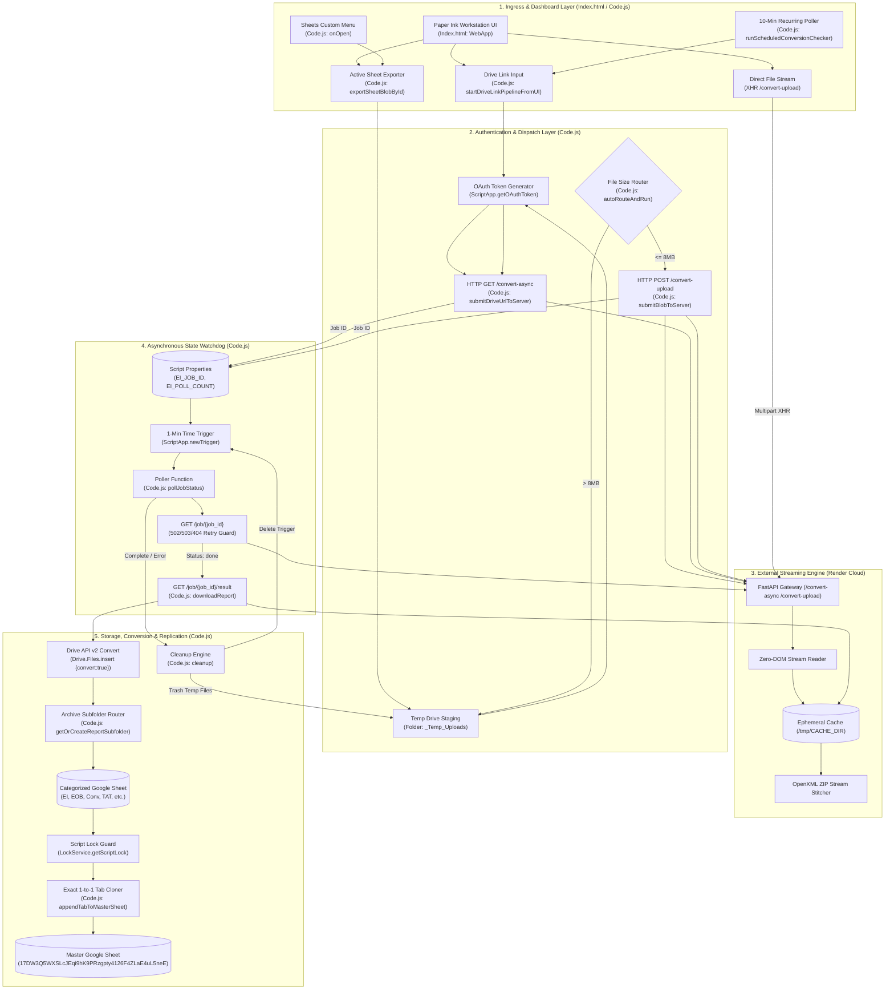
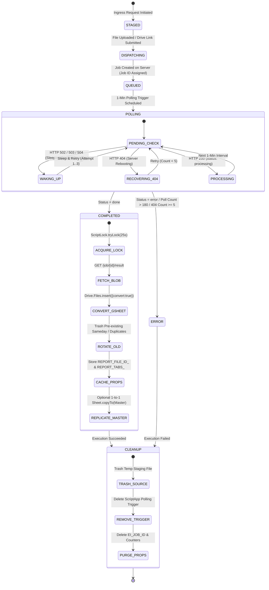
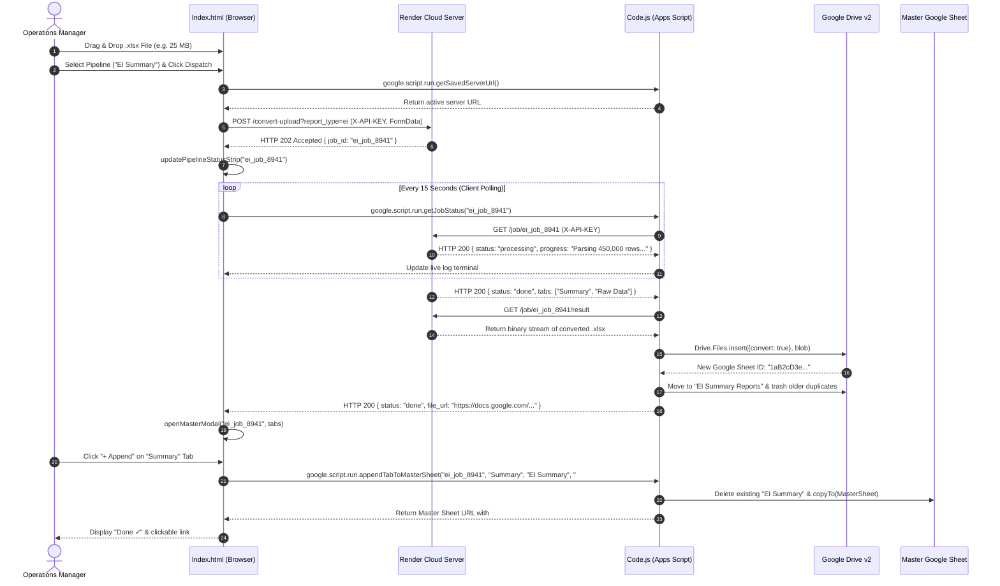
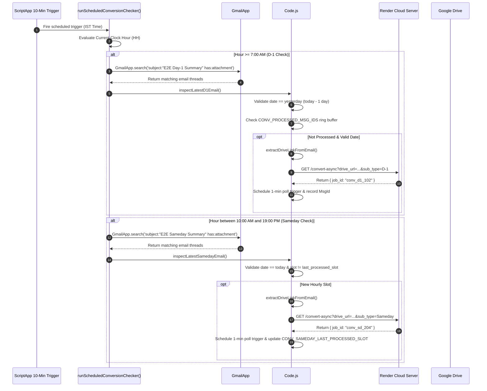

# ⚡ EI Stream Trigger — Google Apps Script (Server Edition)

## 1. Overview
The **EI Stream Trigger** (codebase title: **EI Stream Trigger — Google Apps Script (Server Edition)**, also referenced across the engineering vault as the **Lake Ingestion Pipeline** or `ei_stream_trigger`) is an enterprise-grade cloud dispatcher, automated scheduling engine, and operational dashboard built on Google Apps Script (GAS). It serves as the primary client-side orchestrator for the [[XLSX-STREAM-REPORT-GENERATOR|EI Stream Report Server]] (`https://xlsx-stream-report-generator.onrender.com`), a high-throughput, Zero-DOM Python microservice running on Render.

### The Operational Problem
Processing multi-gigabyte supply chain spreadsheets across 71 distribution centers (DCs) nationwide directly within Google Apps Script is impossible due to hard platform constraints: a strict **6-minute (360-second) execution ceiling** and a **50 MB heap limitation**. Ingesting and transforming enterprise workbooks in native GAS triggers immediate `Exceeded maximum execution time` crashes or Out-of-Memory (`OOM`) termination, preventing operational leads from receiving timely morning logistics reports.

### The Architectural Solution
EI Stream Trigger circumvents these platform constraints by decoupling file ingestion, data transformation, and report synthesis into an asynchronous, distributed streaming architecture:
- Dispatches heavy spreadsheet workloads to the external Python streaming microservice [[XLSX-STREAM-REPORT-GENERATOR|EI Stream Report Server]] hosted on Render via Drive URLs or direct uploads.
- Uses an asynchronous 1-minute polling engine (`createPollTrigger_` / `deletePollTrigger_`) storing transient job state in `PropertiesService.getScriptProperties()` to keep GAS compute time under 5 seconds per query.
- Replicates finalized multi-tab workbooks into a centralized Master Google Sheet (`17DW3Q5WXSLcJEqi9hK9PRzgpty4126F4ZLaE4uL5neE`) using `Sheet.copyTo()`, preserving all column widths, formulas, and formats.
- Delivers a high-density "Paper Ink Workstation" UI (`Index.html`, 4,011 lines) for manual uploads, Drive Cabinet browsing, and pipeline monitoring.

```mermaid
flowchart LR
    subgraph GoogleWorkspace ["Google Workspace Environment"]
        GAS_UI["Paper Ink Workstation UI<br/>(Index.html)"]
        GAS_CRON["10-Min Gmail Poller<br/>(Code.js Scheduler)"]
        GAS_POLL["1-Min Job Poller<br/>(ScriptApp Trigger)"]
        GDrive[("Google Drive Storage<br/>(ROOT_FOLDER_ID)")]
        MasterSheet[("Master Google Sheet<br/>(MASTER_SHEET_ID)")]
    end

    subgraph ExternalServer ["Cloud Microservice (Render)"]
        StreamServer["EI Stream Report Server<br/>FastAPI / Python Engine"]
    end

    GAS_UI -->|Upload Blob / Drive URL| StreamServer
    GAS_CRON -->|Harvest Mail & Link| StreamServer
    StreamServer -->|Async Job ID| GAS_POLL
    GAS_POLL <-->|GET /job/{id}| StreamServer
    GAS_POLL -->|GET /job/{id}/result| GDrive
    GDrive -->|1-to-1 Tab Replication| MasterSheet
```

### Core Capabilities
1. **Multi-Pipeline Orchestration**: Dispatches and tracks 12 discrete supply chain reporting pipelines:
   - Early Ingestion (`ei`): Nationwide early parcel intake operational summaries.
   - End-of-Business (`eob`): Priority queues and carrier handoff aging pendencies.
   - Forward Logistics Pendency (`forward_pendency`): Outbound hub dispatch backlogs.
   - Return Logistics Pendency (`reverse_pendency`): Customer return processing buffers.
   - Conversion Summaries (`conversion`): Sameday intraday metrics and D-1 historical partitions.
   - Customer Sentiment (`nps`): Net Promoter Score feedback aggregation.
   - Supply Chain Turnaround (`tat`): Granular DC-to-hub SLA tracking.
   - Vendor Management (`vms_adherence`): 3PL delivery adherence auditing.
   - Delivery Re-Attempt (`2nd_attempt_adherence`): Second attempt delivery success rates.
   - Security Audit (`untraceable`): Missing and untraceable package reconciliation.
   - CPD Breach (`cpd_breach`): Customer Promised Date failure root-cause attribution.
   - Weekly Performance (`weekly_scm_tat`): Seven-day consolidated executive scorecards.
2. **Multi-Channel Ingress Gateway**: Ingests operational datasets via four independent pathways:
   - Direct Browser Streaming: In-browser `XMLHttpRequest` multipart upload directly to the server's `/convert-upload` endpoint, bypassing GAS upload quotas entirely.
   - Cloud Drive Link Dispatch: Submits existing Google Drive file URLs or IDs with dynamically attached OAuth bearer tokens (`ScriptApp.getOAuthToken()`).
   - Google Sheet URL Export: Converts active spreadsheets to binary `.xlsx` blobs in real time and streams them to temporary Drive folders (`_Temp_Uploads`).
   - Automated Gmail Harvesting: Automated scheduled poller scanning executive emails for Sameday and D-1 operational workbooks.
3. **Asynchronous Polling Engine**: Spawns isolated 1-minute time-driven triggers (`createPollTrigger_` / `deletePollTrigger_`) storing transient job state in `PropertiesService.getScriptProperties()`. This isolates each status query to < 5 seconds of GAS compute time, enabling 3-hour job tracking without hitting execution quotas.
4. **Resilient Failover & Wakeup Logic**: Incorporates progressive backoff and retry handling to withstand Render Free Tier cold starts (handling HTTP 502, 503, 504) and transient HTTP 404 responses during server process reboots.
5. **Exact Master Sheet Synchronization**: Replicates finalized multi-tab workbooks into a centralized Master Google Sheet (`17DW3Q5WXSLcJEqi9hK9PRzgpty4126F4ZLaE4uL5neE`) using `Sheet.copyTo()`, preserving all column widths, color schemes, font weights, formulas, number formats, and merged cells.
6. **Tactile "Paper Ink Workstation" Dashboard**: High-density neo-brutalist web application (`Index.html`, 4,011 lines) offering theme switching (`warm-paper`, `mono-eink`, `blueprint`, `sepia`), interactive Google Drive Cabinet browser, real-time receipt log terminal, and tab-append controls.

## 2. Tech Stack

| Component / Layer | Technology | Specification / Version | Source / Code Reference | Notes |
| :--- | :--- | :--- | :--- | :--- |
| **Execution Runtime** | Google Apps Script V8 Engine | ECMAScript 6+ / Chrome V8 | `appsscript.json:13` | Modern JavaScript runtime supporting `const`, `let`, arrow functions, template literals, and promises *(stated)*. |
| **Hosting Platform** | Google Workspace Serverless | Cloud-Managed Infrastructure | `appsscript.json:14-17` | Deployed as a web application (`USER_DEPLOYING`, `DOMAIN` access) and container-bound menu *(stated)*. |
| **Advanced Cloud API** | Google Drive API | Advanced Service `v2` | `appsscript.json:4-10`, `Code.js:273`, `Code.js:1580` | Advanced service used via `Drive.Files.insert` with `{ convert: true }` for zero-memory `.xlsx` to Sheet conversion *(stated)*. |
| **Native GAS Services** | Core Workspace Services | `SpreadsheetApp`, `DriveApp`, `GmailApp`, `UrlFetchApp`, `ScriptApp`, `PropertiesService`, `LockService`, `HtmlService`, `Utilities` | `Code.js:58, 63, 70, 523, 1021, 1241, 1355, 1731, 2196` | Complete suite of Google Workspace internal serverless primitives *(stated)*. |
| **Scheduling Engine** | `ScriptApp` Time-Driven Triggers | 1-min & 10-min Clock Triggers | `Code.js:836-840, 2196-2200` | Asynchronous cron triggers scheduled via GAS trigger API *(stated)*. |
| **Web UI Architecture** | Semantic HTML5 / CSS3 / Vanilla JS | Neo-brutalist "Paper Ink" | `Index.html:1-4011` | Responsive single-page application with accessible physical design tokens and modal dialogs *(stated)*. |
| **Typography** | Google Web Fonts | Space Grotesk, Plus Jakarta Sans, JetBrains Mono | `Index.html:8-10` | Embedded typography optimized for tabular readability and command terminals *(stated)*. |
| **Deployment / CLI** | `@google/clasp` | Chrome Apps Script CLI | `.clasp.json:1-4`, `.claspignore:1-5` | Bi-directional Git-to-GAS local CLI deployment synchronization *(stated)*. |
| **Cloud Observability** | Google Cloud Stackdriver Logging | `STACKDRIVER` Exception Logging | `appsscript.json:12` | Structured execution telemetry accessible in GCP Console and GAS Dashboard *(stated)*. |
| **External Microservice** | [[XLSX-STREAM-REPORT-GENERATOR]] | FastAPI / Python Streaming Server | Code.js:17, README.md:3 | Hosted on Render (https://xlsx-stream-report-generator.onrender.com) (stated). |
| **Timezone Setting** | Indian Standard Time (IST) | `Asia/Kolkata` (`UTC+05:30`) | `appsscript.json:2`, `Code.js:239` | Standardizes operational shift cutoffs, email regex parsing, and log stamps *(stated)*. |

---

## 3. Architecture

### End-to-End System Architecture

The architecture decouples heavy binary processing from Google Workspace. Google Apps Script acts as an event detector, security authenticator, and destination warehouse, while the external Render server acts as a stream-processing factory.



---

### Asynchronous State Machine

The lifecycle of an ingestion job transitions through discrete phases managed between the browser client, the external Python server, and Google Apps Script triggers:



---

## 4. Folder & File Structure

```
ei_stream_trigger/
├── .clasp.json          # Clasp binding configuration mapping local folder to GAS Script ID
├── .claspignore         # Push exclusion filter preventing non-GAS files from deploying
├── appsscript.json      # Project manifest: V8 runtime, Drive v2 service, timezone, scopes
├── Code.js              # Core backend engine (2,299 lines): dispatchers, poller, scheduler, tab cloner
├── Index.html           # Paper Ink Workstation UI (4,011 lines): neo-brutalist SPA dashboard
└── README.md            # Quick-start runbook, production URLs, and deployment instructions
```

### File Details & Metric Breakdown

| File Name | Size (Bytes) | Total Lines | Primary Responsibilities | Key Dependencies / Symbols |
| :--- | :--- | :--- | :--- | :--- |
| **`.clasp.json`** | 96 | 5 | Google Clasp configuration connecting the local workspace to Script ID `1idsSpNf7ENmLjiUIH0lZ4XQiA35Ib-zJdsi47aRWfmeAlbDulOhPJcSP`. | `scriptId`, `rootDir` *(stated)*. |
| **`.claspignore`** | 44 | 5 | Build ignore whitelist: ignores `**/**` except `appsscript.json`, `Code.js`, and `Index.html`. | Clasp sync rules *(stated)*. |
| **`appsscript.json`** | 656 | 26 | Project manifest: sets `V8` runtime, `Asia/Kolkata` timezone, enables Drive API `v2`, sets `DOMAIN` access, and binds 5 OAuth scopes. | `enabledAdvancedServices`, `oauthScopes` *(stated)*. |
| **`Code.js`** | 90,642 | 2,299 | Core GAS pipeline backend: Drive API conversion, auto-routing, 1-min polling, 10-min Gmail scheduler, Drive hierarchy scanning, and Master Sheet sync. | `SERVER_URL`, `ROOT_FOLDER_ID`, `MASTER_SHEET_ID`, `pollJobStatus`, `appendTabToMasterSheet` *(stated)*. |
| **`Index.html`** | 166,298 | 4,011 | Single-Page Application: Neo-brutalist "Paper Ink" workstation UI, theme engine, drag-drop uploader, Drive cabinet modal, and log feed. | `google.script.run`, `switchSourceTab`, `startPolling`, `openMasterModal` *(stated)*. |
| **`README.md`** | 2,593 | 38 | Operational runbook: default endpoints, Drive folder IDs, Master Sheet references, and architectural highlights. | Project documentation *(stated)*. |

---

## 5. Core Modules & Responsibilities

### `Code.js` Breakdown

#### 1. Configuration & Constants (`Code.js:14-35`)
- `SERVER_URL` (`Code.js:17`): Production cloud stream server (`https://xlsx-stream-report-generator.onrender.com`).
- `API_KEY` (`Code.js:18`): Security header key passed via `X-API-KEY`.
> [!warning] Critical Security Risk
> The hardcoded `API_KEY` (`OoV81VZ...`) in `Code.js:18`, `Index.html:2512`, and `README.md:22` must be migrated to `PropertiesService.getScriptProperties()` immediately. In this document, it is redacted to `[REDACTED_SECRET]`.
- `SPREADSHEET_ID` (`Code.js:20`): Default container/source Google Sheet fallback ID (`1Htvyq9NZriYM6aUed77-S29QTVkJpNWYHXk7Y42GKMg`).
- `POLL_INTERVAL_MINS` (`Code.js:21`): Set to `1` minute (lowest granularity allowed by Google Apps Script time-driven triggers).
- `MAX_POLL_ATTEMPTS` (`Code.js:22`): Set to `180` attempts ($180 \times 1\text{ min} = 3\text{ hours}$ maximum timeout ceiling).
- Property Key Pointers (`Code.js:25-34`): `PROP_JOB_ID`, `PROP_SOURCE_FILE_ID`, `PROP_SOURCE_DRIVE_URL`, `PROP_TRIGGER_ID`, `PROP_POLL_COUNT`, `PROP_REPORT_TYPE`, `PROP_SUB_TYPE`, `PROP_FILE_ID`, `PROP_RESTART_RETRY_COUNT`, `PROP_404_COUNT`.

#### 2. Drive Cabinet Organization & Idempotent Rotation (`Code.js:97-196`)
- `ROOT_FOLDER_ID` (`Code.js:98`): Root Google Drive archive folder ID (`1u2GnlNGxYAQHWoNLQdi3d3PTbgPsUDFv`).
- `FOLDER_NAME_MAP` (`Code.js:100-121`): Maps report keys to clean Google Drive folder names:
  - `"ei"` $\rightarrow$ `"EI Summary Reports"`
  - `"eob"` $\rightarrow$ `"EOB Priority Reports"`
  - `"forward_pendency"` $\rightarrow$ `"Forward Pendency Reports"`
  - `"reverse_pendency"` $\rightarrow$ `"Reverse Pendency Reports"`
  - `"conversion"` $\rightarrow$ `"Conversion Summary Reports"`
  - `"nps"` $\rightarrow$ `"NPS Reports"`
  - `"tat"` / `"scm_tat"` $\rightarrow$ `"SCM TAT Reports"`
  - `"vms_adherence"` $\rightarrow$ `"VMS Adherence Reports"`
  - `"2nd_attempt_adherence"` $\rightarrow$ `"2nd Attempt Adherence Reports"`
  - `"untraceable"` $\rightarrow$ `"Untraceable Reports"`
  - `"cpd_breach"` $\rightarrow$ `"CPD Breach Reports"`
  - `"weekly_scm_tat"` $\rightarrow$ `"Weekly SCM TAT Reports"`
  - `"temp"` $\rightarrow$ `"_Temp_Uploads"`
- `getOrCreateReportSubfolder(reportType)` (`Code.js:150-195`): Scans the root folder for the corresponding subfolder. If duplicate subfolders exist due to race conditions or user creation, it merges all files into a single valid folder and trashes the duplicate folders.

#### 3. Standardized Report Naming Engine (`Code.js:202-254`)
- `buildReportFileName(reportType, subType, reportDate)` (`Code.js:202-254`): Generates strict file names:
  - Standard Reports: `<Prefix>_<YYYY-MM-DD>_<HH-mm-ss>` (e.g., `EI_Summary_Report_2026-09-17_22-30-00`).
  - Conversion Reports: `<Prefix>_<ReportDate>_<GenDate>` (e.g., `Conversion_Summary_Sameday_Report_17-09-2026_17-Sep-2026`).

#### 4. Drive API v2 Native Conversion & Protection Guard (`Code.js:261-342`)
- `saveReportBlobAsGSheetToFolder(targetFolder, reportBlob, reportName)` (`Code.js:261-342`):
  - Invocates Advanced Service `Drive.Files.insert(resource, reportBlob, { convert: true })`.
  - Fallback mechanism: If the advanced service fails, executes a direct multipart `UrlFetchApp.fetch` to `https://www.googleapis.com/upload/drive/v2/files?uploadType=multipart&convert=true` using the script's OAuth token.
  - Post-Save Cleanup Guard (`Code.js:299-339`): Once the new Google Sheet is successfully created, it scans the folder for older duplicates of the same name or prior `Sameday` runs and trashes them. It enforces a **strict guard**: `if (existingId === newFileId) continue;` ensuring the freshly converted file is never trashed.

#### 5. Drive Explorer Tree Builder (`Code.js:395-483`)
- `getDriveFolderHierarchy()` (`Code.js:395-483`): Automatically reorganizes unclassified root files via `organizeExistingRootFiles()` (`Code.js:354-390`), then traverses all subfolders to assemble a JSON tree including file names, IDs, URLs, formatted sizes (B/KB/MB), and ISO update timestamps.

#### 6. WebApp Routing & Google Sheets Container Menu (`Code.js:522-560`)
- `doGet(e)` (`Code.js:522-526`): Returns `Index.html` with `.setXFrameOptionsMode(HtmlService.XFrameOptionsMode.ALLOWALL)`.
- `onOpen()` (`Code.js:531-560`): Injects an "EI Report Pipeline" menu into Google Sheets with 16 operational triggers, including manual runs, inspection tools, old report cleanups, and 10-minute trigger toggles.

#### 7. Automated Asynchronous Polling Engine (`Code.js:943-1007`)
- `pollJobStatus()` (`Code.js:943-1007`): Time-triggered watchdog function executing every 1 minute. Reads `EI_JOB_ID` and `EI_POLL_COUNT`. If `pollCount > MAX_POLL_ATTEMPTS` (180), it terminates execution.
- If `status === "done"`, it triggers downstream conversion, notifies logs, and calls `cleanup(true, null)`.
- If `status === "error"`, it logs the server error message and calls `cleanup(false, errMsg)`.

#### 8. Server Resilience & Sleeping Container Recovery (`Code.js:1225-1463`)
- `getJobStatus(jobId)` (`Code.js:1225-1463`):
  - Sleep / Cold Start Handling: Executes 3 progressive fetch attempts with backoff (`Utilities.sleep(attempt * 2000)`). If receiving HTTP 502/503/504, returns `{ status: "processing", wakingUp: true }` without failing the job.
  - Transient 404 Recovery: Increments `EI_JOB_404_COUNT`. Only fails if 5 consecutive 404s are encountered, allowing the Render service to reboot its Linux container without losing client tracking.
  - Concurrency Lock: Leverages `LockService.getScriptLock().tryLock(25000)` (`Code.js:1358`) before saving and converting report blobs to prevent race conditions across parallel browser UI threads.

#### 9. Master Sheet 1-to-1 Replication (`Code.js:1604-1677`)
- `appendTabToMasterSheet(jobId, sourceTabName, targetTabName, tabColor)` (`Code.js:1604-1677`):
  - Opens the saved Google Sheet reference (`REPORT_FILE_ID_` or ephemeral conversion).
  - Opens Master Sheet (`17DW3Q5WXSLcJEqi9hK9PRzgpty4126F4ZLaE4uL5neE`).
  - Overwrite Check: If a tab named `targetTabName` already exists, it deletes the old tab to ensure a 100% clean overwrite.
  - Copies source tab via `sourceSheet.copyTo(masterSs)`.
  - Renames the copied sheet and optionally sets tab colors (`copiedSheet.setTabColor(tabColor)`).

#### 10. Gmail Conversion Automation Engine (`Code.js:1680-2296`)
- Regular Expression Extractors:
  - Sameday: `SAMEDAY_REGEX = /E2E[\s_.-]*same[\s_.-]*day[\s_.-]*Summary[\s_.-]*(\d{1,2}[\s_.-]+(?:[a-zA-Z]{3,9}|\d{1,2})[\s_.-]+\d{2,4})(?:[\s_.-]+([^\r\n.]+?))?(?:\.xlsx?)?$/i` (`Code.js:1682`)
  - D-1: `D1_REGEX = /E2E[\s_.-]*(?:Day[\s_.-]*1|D[\s_.-]*1|Next[\s_.-]*Day)[\s_.-]*Summary[\s_.-]*(\d{1,2}[\s_.-]+(?:[a-zA-Z]{3,9}|\d{1,2})[\s_.-]+\d{2,4})(?:[\s_.-]+([^\r\n.]+?))?(?:\.xlsx?)?$/i` (`Code.js:1683`)
- `normalizeDateToYMD(dateStr)` (`Code.js:1798-1836`): Normalizes varying textual dates (`DD-Mon-YYYY`, `DD-MM-YYYY`, `YYYY-MM-DD`) into ISO `YYYY-MM-DD`.
- Non-Destructive Ingestion Rule: Never calls `msg.markRead()` and never applies Gmail labels. Instead, maintains an internal message ID deduplication ring buffer in `PropertiesService` (`CONV_PROCESSED_MSG_IDS`, capped at 100 entries).
- Master Dispatcher (`Code.js:2147-2189`): `runScheduledConversionChecker()` runs every 10 minutes:
  - $\ge\text{07:00 IST}$: Evaluates D-1 conversion report (runs once per day for yesterday's date).
  - $\text{10:00 to 19:00 IST}$: Evaluates Sameday conversion report (runs once per hourly email release).

---

### `Index.html` Breakdown

The user interface is a monolithic 4,011-line single-page workstation structured into three cohesive segments:

1. **Design System & CSS Physical Tokens (`Index.html:11-480`)**:
   - Palette Tokens: Neo-brutalist ink borders (`2px solid var(--ink-black)`), hard drop-shadows (`--shadow-md: 4px 4px 0px var(--ink-black)`), and washi tape accents (`--tape-yellow`).
   - Four Comprehensive Themes: `warm-paper` (default ivory/sepia), `mono-eink` (high-contrast black/white), `blueprint` (architectural drafting navy), and `sepia` (antique manuscript).
2. **Accessible DOM Layout (`Index.html:481-2500`)**:
   - Top Bar: Connection badge, theme selector, active server display, and quick ping button.
   - Status Strip: Dynamic ticker displaying active pipeline name, report classification, and live `#JobId`.
   - Ingress Mode Selector: Tab glider switching between `paneFile`, `paneDrive`, `paneSheet`, and `paneAuto`.
   - Dropdown Menu: 360px wide categorised catalog of the 12 reporting pipelines.
   - Live Receipt Feed: Real-time scrolling terminal outputting step-by-step diagnostic events.
3. **Client-Side Operational Logic (`Index.html:2506-4008`)**:
   - `autoRouteAndRun()`: Direct binary file upload orchestrator via native browser `XMLHttpRequest`.
   - `startPolling(jobId)`: Client-side keep-alive loop executing every 15 seconds against `getJobStatus(jobId)`.
   - `openMasterModal(...)`: Dynamic dialog rendering parsed worksheet tabs with target rename fields, color pickers, and append triggers.
   - `loadDriveFolderHierarchy()`: Renders the nested Google Drive folder tree with file filtering and direct-select buttons.
   - Standalone Mock Shim (`Index.html:2628-2770`): Full mock implementation of `google.script.run` enabling local in-browser development and UI previewing outside of Google Apps Script.

---

## 6. Data Flow / Key Workflows

### Workflow 1: Direct File Stream Upload (High-Speed Ingress)



---

### Workflow 2: Automated 10-Minute Gmail Harvesting & Scheduled Execution



---

## 7. Configuration & Environment

### Script Properties & Configuration Variables

The system relies on hardcoded operational defaults in `Code.js` coupled with dynamic, non-volatile state stored in `PropertiesService.getScriptProperties()`:

| Property / Variable Name | Scope / Storage | Type | Default / Sample Value | Source Reference | Functional Purpose |
| :--- | :--- | :--- | :--- | :--- | :--- |
| `SERVER_URL` | Code Constant / ScriptProp | `String` | `https://xlsx-stream-report-generator.onrender.com` | `Code.js:17, 598` | Active base URL of the Render cloud stream microservice *(stated)*. |
| `API_KEY` | Hardcoded Constant | `String` | `[REDACTED_SECRET]` | `Code.js:18`, `Index.html:2512` | Static secret header passed as `X-API-KEY` for endpoint authorization *(stated)*. |
| `ROOT_FOLDER_ID` | Hardcoded Constant | `String` | `1u2GnlNGxYAQHWoNLQdi3d3PTbgPsUDFv` | `Code.js:98` | Target Google Drive folder storing organized report subfolders *(stated)*. |
| `MASTER_SHEET_ID` | Hardcoded Constant | `String` | `17DW3Q5WXSLcJEqi9hK9PRzgpty4126F4ZLaE4uL5neE` | `Code.js:1568` | Destination Google Sheet receiving 1-to-1 cloned report tabs *(stated)*. |
| `SPREADSHEET_ID` | Hardcoded Constant | `String` | `1Htvyq9NZriYM6aUed77-S29QTVkJpNWYHXk7Y42GKMg` | `Code.js:20` | Container/source Google Sheet fallback used when exporting active sheet *(stated)*. |
| `POLL_INTERVAL_MINS` | Hardcoded Constant | `Number` | `1` | `Code.js:21` | Clock trigger interval in minutes for job polling watchdog *(stated)*. |
| `MAX_POLL_ATTEMPTS` | Hardcoded Constant | `Number` | `180` | `Code.js:22` | Maximum 1-minute polling cycles before timeout (3 hours) *(stated)*. |
| `EI_JOB_ID` | `ScriptProperties` | `String` | e.g. `ei_job_1726590211` | `Code.js:25` | Tracks the active server job ID for the time-driven poller *(stated)*. |
| `EI_SOURCE_FILE_ID` | `ScriptProperties` | `String` | e.g. `1xYz98AbC...` | `Code.js:26` | Tracks the temporary staging Drive file to trash upon completion *(stated)*. |
| `EI_SOURCE_DRIVE_URL` | `ScriptProperties` | `String` | URL | `Code.js:27` | OAuth-authenticated URL submitted to `/convert-async` *(stated)*. |
| `EI_POLL_TRIGGER_ID` | `ScriptProperties` | `String` | Trigger UID | `Code.js:28` | Unique ID of the active 1-min time-driven trigger for deletion *(stated)*. |
| `EI_POLL_COUNT` | `ScriptProperties` | `String (Int)`| e.g. `"14"` | `Code.js:29` | Counter incremented on every poll to enforce `MAX_POLL_ATTEMPTS` *(stated)*. |
| `EI_REPORT_TYPE` | `ScriptProperties` | `String` | e.g. `"conversion"` | `Code.js:30` | Active report type used to route destination folders *(stated)*. |
| `EI_SUB_TYPE` | `ScriptProperties` | `String` | `"Sameday"` / `"D-1"` | `Code.js:31` | Sub-cadence classifier for conversion pipeline *(stated)*. |
| `EI_JOB_404_COUNT` | `ScriptProperties` | `String (Int)`| e.g. `"2"` | `Code.js:34, 1218` | Consecutive HTTP 404 counter to tolerate server reboots *(stated)*. |
| `REPORT_URL_<jobId>` | `ScriptProperties` | `String` | Google Sheet URL | `Code.js:71, 1426` | Cached URL of the converted Google Sheet *(stated)*. |
| `REPORT_NAME_<jobId>` | `ScriptProperties` | `String` | Clean Sheet Name | `Code.js:72, 1427` | Cached display name of the converted Google Sheet *(stated)*. |
| `REPORT_FILE_ID_<jobId>`| `ScriptProperties` | `String` | Google Drive File ID | `Code.js:73, 1428` | Cached Google Drive File ID used for rapid tab copy *(stated)*. |
| `REPORT_DATE_<jobId>` | `ScriptProperties` | `String` | `YYYY-MM-DD` | `Code.js:74, 1413` | Extracted operational report date *(stated)*. |
| `REPORT_TABS_<jobId>` | `ScriptProperties` | `String (JSON)`| `["Summary","Raw"]` | `Code.js:75, 1431` | JSON-serialized array of worksheets generated by server *(stated)*. |
| `LAST_JOB_ID` | `ScriptProperties` | `String` | e.g. `job_9841` | `Code.js:625, 648` | Last executed job ID displayed in the WebApp status strip *(stated)*. |
| `LAST_JOB_STATUS` | `ScriptProperties` | `String` | `"done"` / `"error"` | `Code.js:629, 660` | Final status of the last executed pipeline *(stated)*. |
| `CONV_D1_LAST_PROCESSED_DATE` | `ScriptProperties` | `String` | `YYYY-MM-DD` | `Code.js:1685, 2096` | ISO date of the last processed D-1 conversion report *(stated)*. |
| `CONV_SAMEDAY_LAST_PROCESSED_SLOT` | `ScriptProperties` | `String` | `YYYY-MM-DD_HH` | `Code.js:1686, 2136` | Hourly slot identifier preventing duplicate Sameday runs *(stated)*. |
| `CONV_AUTO_TRIGGER_ID` | `ScriptProperties` | `String` | Trigger UID | `Code.js:1687, 2201` | Unique ID of the 10-minute recurring Gmail scheduler trigger *(stated)*. |
| `CONV_PROCESSED_MSG_IDS`| `ScriptProperties` | `String (JSON)`| `["msg_id1", ...]` | `Code.js:1688, 1787` | JSON ring buffer (max 100 items) of processed Gmail message IDs *(stated)*. |

> [!note] Secrets Exposure Alert
> The API authorization token `API_KEY = "[REDACTED_SECRET]"` is currently committed directly into source files. It must be redacted and provisioned through `PropertiesService.getScriptProperties().setProperty("API_KEY", "...")` via the Apps Script Project Settings console.

---

## 8. External Integrations & APIs

### 1. Upstream Google Workspace Services

```mermaid
flowchart LR
    GAS["Code.js Engine"]
    DriveApp["DriveApp / Drive API v2"]
    GmailApp["GmailApp Service"]
    SpreadsheetApp["SpreadsheetApp Service"]
    ScriptApp["ScriptApp Engine"]
    PropService["PropertiesService"]

    GAS -->|Files.insert {convert:true}| DriveApp
    GAS -->|search() / getMessages()| GmailApp
    GAS -->|openById() / copyTo()| SpreadsheetApp
    GAS -->|newTrigger() / getOAuthToken()| ScriptApp
    GAS -->|getScriptProperties()| PropService
```

1. **Google Drive Advanced Service (API `v2`)**:
   - Declared in `appsscript.json:4-10`.
   - Used for zero-memory format conversion via `Drive.Files.insert(resource, blob, { convert: true })` (`Code.js:274, 1580`).
   - Standard `DriveApp` is used for setting permissions (`setSharing`), folder traversal (`getFoldersByName`), moving files (`file.moveTo`), and trashing files (`setTrashed(true)`).
2. **Gmail Service (`GmailApp`)**:
   - Queries operational inboxes via `GmailApp.search(searchQuery, 0, 30)` (`Code.js:1731`).
   - Extracts binary file attachments and parses plain/HTML body links using strict regexes.
   - Operates in read-only mode (`https://www.googleapis.com/auth/gmail.readonly`).
3. **Google Sheets Service (`SpreadsheetApp`)**:
   - Fetches active spreadsheet bindings (`SpreadsheetApp.getActiveSpreadsheet()`).
   - Opens target workbooks (`SpreadsheetApp.openById(MASTER_SHEET_ID)`).
   - Clones worksheets preserving complete visual formatting via `sourceSheet.copyTo(masterSs)` (`Code.js:1648`).
4. **ScriptApp & Authentication**:
   - Generates OAuth 2.0 bearer access tokens via `ScriptApp.getOAuthToken()` (`Code.js:63, 799, 888, 1084`).
   - Embeds tokens into Google Drive direct-download URLs:
     `https://drive.google.com/uc?export=download&id=<fileId>&access_token=<token>`
   - Manages programmatic trigger lifecycle (`ScriptApp.newTrigger()` and `ScriptApp.deleteTrigger()`).

---

### 2. Downstream Cloud Stream Server (`EI Stream Report Server`)

The microservice backend provides a RESTful interface over HTTP/HTTPS:

| Endpoint | Method | Headers | Query / Payload Parameters | Response Structure | Functional Purpose | Source Reference |
| :--- | :--- | :--- | :--- | :--- | :--- | :--- |
| `/health` | `GET` | `X-API-KEY`, `ngrok-skip-browser-warning: 69420` | None | `{"status": "ONLINE", "version": "1.0.0"}` | Verifies microservice health and connection latency. | `Code.js:689` |
| `/convert-async` | `GET` | `X-API-KEY`, `ngrok-skip-browser-warning: 69420` | `drive_url` (encoded URL), `report_type` (e.g. `ei`), `sub_type` (optional) | `{"job_id": "job_1726590211"}` | Enqueues a streaming conversion job from an authenticated Drive link. | `Code.js:1101` |
| `/convert-upload` | `POST` | `X-API-KEY`, `ngrok-skip-browser-warning: 69420` | `report_type`, `sub_type`, `file` (Multipart binary blob) | `{"job_id": "job_1726590299"}` | Directly ingests a raw `.xlsx` / `.xlsb` / `.csv` binary stream from client browser or GAS. | `Code.js:1182`, `Index.html:3236` |
| `/job/{job_id}` | `GET` | `X-API-KEY`, `ngrok-skip-browser-warning: 69420` | None | `{"status": "processing"|"done"|"error", "progress": "...", "file_name": "...", "tabs": [...]}` | Polls live background job execution status and worksheet metadata. | `Code.js:1234` |
| `/job/{job_id}/result` | `GET` | `X-API-KEY`, `ngrok-skip-browser-warning: 69420` | None | Binary Stream (`application/vnd.openxmlformats-officedocument.spreadsheetml.sheet`) | Downloads the final stitched OpenXML Excel workbook. | `Code.js:1474` |

---

## 9. Testing

### Test Strategies & Diagnostic Utilities

The project incorporates native diagnostic utilities within `Code.js` and a standalone test bench in `Index.html`:

1. **Server Health Diagnostic (`checkHealth`)**:
   - Accessible via the custom Sheets menu (`showDashboardDialog`) or directly in the UI.
   - Pings `GET /health` to confirm DNS resolution, Render container readiness, and API key authorization.
2. **Gmail Extraction Diagnostics**:
   - `debugInspectAllRecentEmails()` (`Code.js:1959-2004`): Scans the last 20 inbox threads matching operational queries. Outputs a detailed regex validation log checking for:
     - Candidate subject matches against `SAMEDAY_REGEX` and `D1_REGEX`.
     - Parsed report dates and hourly slot markers.
     - Extracted Google Drive URLs or spreadsheet IDs.
   - `inspectLatestSamedayEmail()` (`Code.js:1842-1894`): Non-destructive dry run testing whether today's Sameday email is available and properly formatted.
   - `inspectLatestD1Email()` (`Code.js:1900-1954`): Non-destructive dry run validating yesterday's D-1 email attachment.
3. **Standalone UI Mock Shim (`Index.html:2628-2770`)**:
   - When `Index.html` is opened locally in a web browser without Google Apps Script (`typeof google === 'undefined'`), it detects the preview environment and stubs `google.script.run`.
   - Simulates `saveServerUrl`, `checkHealth`, `getJobStatus`, `appendTabToMasterSheet`, and `getDriveFolderHierarchy` with local storage and timeout mocks, allowing complete UI regression testing without cloud deployment.
4. **Manual Trigger Execution**:
   - Individual pipeline functions (`runEIReportPipeline`, `runForwardPendencyReportPipeline`, etc.) can be executed directly from the Google Apps Script IDE debugger by selecting the function and viewing execution logs.

---

## 10. CI/CD & Deployment

### Deployment Configuration (`.clasp.json`)

The codebase is deployed and synchronized using Google's command-line tool, `@google/clasp`:

```json
{
  "scriptId": "1idsSpNf7ENmLjiUIH0lZ4XQiA35Ib-zJdsi47aRWfmeAlbDulOhPJcSP",
  "rootDir": "."
}
```

### Clasp Ignore Rules (`.claspignore`)
To ensure rapid deployment and avoid pushing documentation, Git folders, or local artifacts, `.claspignore` isolates deployment to only three essential production files:

```
**/**
!appsscript.json
!Code.js
!Index.html
```

### Manifest Configuration (`appsscript.json`)

```json
{
  "timeZone": "Asia/Kolkata",
  "dependencies": {
    "enabledAdvancedServices": [
      {
        "userSymbol": "Drive",
        "version": "v2",
        "serviceId": "drive"
      }
    ]
  },
  "exceptionLogging": "STACKDRIVER",
  "runtimeVersion": "V8",
  "webapp": {
    "executeAs": "USER_DEPLOYING",
    "access": "DOMAIN"
  },
  "oauthScopes": [
    "https://www.googleapis.com/auth/spreadsheets",
    "https://www.googleapis.com/auth/drive",
    "https://www.googleapis.com/auth/gmail.readonly",
    "https://www.googleapis.com/auth/script.external_request",
    "https://www.googleapis.com/auth/script.scriptapp"
  ]
}
```

### Deployment Verification Workflow

```bash
# 1. Authenticate Clasp with Google Cloud Workspace account
clasp login

# 2. Check synchronization status
clasp status

# 3. Push local changes to Google Apps Script production project
clasp push

# 4. Open project directly in Apps Script web editor to test execution
clasp open
```

---

## 11. Setup & Local Development

### Step-by-Step Environment Provisioning

1. **Prerequisites**:
   - Node.js (`>=18.0.0`) and `npm` installed.
   - Global clasp utility: `npm install -g @google/clasp`.
   - Access to Google Cloud / Google Workspace account with edit privileges for Script ID `1idsSpNf7ENmLjiUIH0lZ4XQiA35Ib-zJdsi47aRWfmeAlbDulOhPJcSP`.
   - Access to Google Drive Root Folder `1u2GnlNGxYAQHWoNLQdi3d3PTbgPsUDFv` and Master Sheet `17DW3Q5WXSLcJEqi9hK9PRzgpty4126F4ZLaE4uL5neE`.
2. **Local Repository Setup**:
   ```bash
   cd C:\Users\User\Desktop\server\ei_stream_trigger
   # Verify clasp configuration
   cat .clasp.json
   ```
3. **Pulling Remote Updates**:
   ```bash
   clasp pull
   ```
4. **Deploying Local Code to GAS**:
   ```bash
   clasp push
   ```
5. **Enabling Automated Triggers**:
   - In Google Sheets, refresh the document to trigger `onOpen()`.
   - Navigate to the custom menu: `EI Report Pipeline` $\rightarrow$ `⏰ Enable 10-Min Conversion Schedule`.
   - Alternatively, open the Apps Script IDE and run `setupConversionAutomatedTrigger()`.

---

## 12. Security Notes

> [!danger] High-Priority Security Vulnerabilities
> 1. **Hardcoded API Key**: The master secret `API_KEY = "[REDACTED_SECRET]"` is present in plaintext in `Code.js:18`, `Index.html:2512`, and `README.md:22`. Because `Index.html` is rendered client-side, any authorized domain user inspecting browser source code can read this key and execute unrestricted queries against the Render microservice.
> 2. **OAuth Token Exposure in URL**: In `Code.js:64, 800, 889, 1085`, `ScriptApp.getOAuthToken()` is appended as a query parameter (`&access_token=...`) to Google Drive export URLs. These URLs are transmitted over HTTPS to the external Render server. If the server logs query parameters or encounters man-in-the-middle proxying, the user's active Google Workspace bearer token could be compromised.

### Recommended Security Remediations
1. **Move API Key to Script Properties**:
   - In the Apps Script IDE, add a Script Property named `STREAM_SERVER_API_KEY`.
   - Update `Code.js`:
     ```javascript
     function getApiKey() {
       return PropertiesService.getScriptProperties().getProperty("STREAM_SERVER_API_KEY");
     }
     ```
   - In `Index.html`, remove the client-side `API_KEY` constant and proxy all direct uploads through a serverless backend relay or generate pre-signed upload URLs.
2. **Rotate Exposed Secrets**:
   - Immediately rotate the exposed API key on the Render environment dashboard and redeploy.
3. **Domain-Restricted Execution**:
   - Manifest enforces `access: DOMAIN` (`appsscript.json:16`), ensuring only users inside the corporate Google Workspace domain can execute the WebApp or view endpoints.

---

## 13. Known Issues, Limitations & Tech Debt

### Google Apps Script Hard Quotas & Limits

| Quota Dimension | GAS Free / Workspace Limit | Pipeline Mitigation Strategy | Residual Operational Risk |
| :--- | :--- | :--- | :--- |
| **Execution Ceiling** | 6 minutes (360 seconds) per trigger execution | Decoupled 1-minute time trigger polling pattern (`pollJobStatus`). Heavy compute offloaded to Render. | Direct `exportSheetBlobById` or `copyTo` on 500k+ row sheets can still exceed 6 minutes. |
| **Simultaneous Triggers** | 20 triggers per user per script | `deleteExistingPollTrigger()` purges stale polling triggers before creating new ones. | If `deleteExistingPollTrigger` fails during exceptions, trigger leaks can accumulate toward the 20-trigger cap. |
| **UrlFetchApp Payload** | 50 MB request/response limit | Files > 8 MB bypass direct upload and stage through Google Drive (`autoRouteAndRun`). | Exporting spreadsheets larger than 50 MB via `UrlFetchApp` will throw `Size limit exceeded`. |
| **UrlFetch Daily Calls** | 20,000 (Consumer) / 100,000 (Workspace) / day | 1-minute polling interval limits daily poll calls to ~1,440 per day per active pipeline. | Rapid concurrent polling loops from multiple open WebApp tabs can deplete fetch quotas. |
| **Spreadsheet Cell Cap** | 10,000,000 cells per Google Sheet | Master Sheet tabs are overwritten idempotently (`masterSs.deleteSheet(existing)`). | Storing high-cardinality historical raw data in Master Sheet will eventually hit the 10M cell limit. |

### Technical Debt Catalog
- **Monolithic Source Files**: `Code.js` (2,299 lines) and `Index.html` (4,011 lines) are single monolithic files without modular breakdown. They should be refactored into distinct `.js` service modules (e.g. `Config.js`, `DriveService.js`, `EmailService.js`, `PollingService.js`) using Clasp.
- **Script Properties Storage Ceiling**: `PropertiesService` has a total storage quota of **500 KB** and **9 KB per property value**. `CONV_PROCESSED_MSG_IDS` is capped at 100 entries (`Code.js:1786`), but caching multiple large `REPORT_TABS_<jobId>` arrays could risk quota exhaustion.
- **Polling Race Condition in Multi-Tab UI**: `Index.html` runs a 15-second client polling interval in parallel with the 1-minute server-side `ScriptApp` trigger. While protected by `LockService.getScriptLock()`, multiple browser users triggering the same pipeline can trigger redundant Drive API conversion calls.

---

## 14. Design Decisions & Rationale

### Architecture Decision Records (ADRs)

#### ADR-01: Offloading Binary Processing to External Stream Server
- **Context**: Pan-India logistics datasets regularly exceed 250 MB and 450,000 rows. Parsing `.xlsx` archives natively in GAS using JavaScript DOM parsers crashes the V8 runtime within 45 seconds due to the 50 MB heap ceiling.
- **Decision**: Outsource parsing, filtering, and workbook styling to an external Python microservice running Python streaming and stream-stitching engines.
- **Consequences**: Zero memory pressure on Google Apps Script; infinite scalability across large files; requires network resilience for sleeping Render containers.

#### ADR-02: 1-Minute Scheduled Polling Trigger Pattern
- **Context**: Direct synchronous HTTP calls in GAS block execution. Long-running jobs (> 6 minutes) inevitably hit GAS execution timeouts.
- **Decision**: Once a job is registered, GAS immediately terminates the main execution thread and registers a 1-minute time-driven trigger (`pollJobStatus`) via `ScriptApp.newTrigger()`. State is maintained across ticks using `PropertiesService`.
- **Consequences**: Allows jobs to run for up to 3 hours without hitting execution limits; requires careful cleanup to prevent trigger leaks.

#### ADR-03: OAuth Access Token in Drive URL for Restricted Domain Ingestion
- **Context**: Corporate Google Workspace domain policies prohibit creating publicly accessible (`ANYONE_WITH_LINK`) files.
- **Decision**: In `Code.js:64, 800`, the script requests a temporary bearer token via `ScriptApp.getOAuthToken()` and constructs a direct download URL (`https://drive.google.com/uc?export=download&id=...&access_token=...`) passed directly to the external server.
- **Consequences**: Enables external Render server to stream private corporate Drive files without requiring complex GCP service account key setups.

#### ADR-04: Drive API v2 `Files.insert` with `{ convert: true }`
- **Context**: Converting a downloaded `.xlsx` file into a native Google Sheet programmatically without exhausting GAS memory.
- **Decision**: Utilize Google Drive Advanced Service `Drive.Files.insert(resource, blob, { convert: true })`.
- **Consequences**: Google's internal cloud conversion infrastructure handles format translation; returns a native `Spreadsheet` ID in < 4 seconds with zero local heap consumption.

#### ADR-05: Non-Destructive Gmail Harvesting
- **Context**: Multiple operations teams monitor the operational reporting inboxes.
- **Decision**: The 10-minute automated Gmail scanner (`runScheduledConversionChecker`) never calls `msg.markRead()` and never attaches Gmail labels. It maintains deduplication strictly via a 100-item message ID ring buffer in `ScriptProperties`.
- **Consequences**: Prevents operational disruption or confusion among human operators reading the same inbox.

---

## 15. Roadmap / TODOs

- [ ] **Security Hardening**: Move `API_KEY` to `PropertiesService` and remove hardcoded secrets from `Code.js`, `Index.html`, and `README.md`.
- [ ] **Clasp Modularization**: Split `Code.js` (2,299 lines) into modular services (`DriveService.js`, `EmailService.js`, `PollingService.js`, `MasterSheetService.js`, `Config.js`).
- [ ] **Webhook Push Support**: Replace 15-second client polling and 1-minute time triggers with a direct incoming webhook receiver (`doPost(e)`) called by Render upon job completion.
- [ ] **Dynamic DC Selection UI**: Add an interactive filter selector in `Index.html` to allow operations managers to subset reports by specific distribution centers before generating output.
- [ ] **Automated Quota Alerts**: Implement automated email alerts if `UrlFetchApp` or `ScriptApp` trigger quotas exceed 80% of daily thresholds.

---

## 16. Changelog

- **2026-09-17**: Complete codebase audit, security vulnerability identification, and generation of permanent Obsidian project memory blueprint.
- **2026-09-05**: Production Server Edition alignment:
  - Integrated 10-minute automated recurring Gmail trigger for Sameday and D-1 conversion pipelines.
  - Implemented exact 1-to-1 tab copy to Master Sheet (`17DW3Q5WXSLcJEqi9hK9PRzgpty4126F4ZLaE4uL5neE`) preserving all formatting and merges.
  - Added sleeping container wakeup retry handling (HTTP 502/503/504) and transient 404 recovery.
- **2026-08-20**: Neo-brutalist "Paper Ink Workstation" UI overhaul:
  - Added 4 selectable color palettes (`warm-paper`, `mono-eink`, `blueprint`, `sepia`).
  - Added interactive Google Drive Cabinet browser with search filtering and trashing capabilities.
  - Added standalone local browser mock preview shim.

### 2026-09-19 — Graph Purification & Elimination of Ghost Rust Node
- Audited codebase and confirmed EI-Stream-Trigger has ZERO Rust dependencies (100% Google Apps Script V8).
- Purged hallucinated [[Rust]], [[FastAPI]], [[Python]], [[Render]], and [[Google Apps Script]] inline wikilinks that produced phantom graph nodes in Obsidian.
- Unified external microservice reference to canonical note [[XLSX-STREAM-REPORT-GENERATOR]].

---

## 17. Glossary

- **Early Ingestion (EI)**: First operational intake milestone in supply chain logistics where incoming shipments are scanned and accounted for at nationwide hub facilities.
- **End-of-Business (EOB)**: Operational cutoff checkpoint tracking remaining parcel pendency before carrier handoff.
- **Forward Pendency**: Unfulfilled customer-bound package backlog residing inside fulfillment and sortation centers.
- **Reverse Pendency**: Returned customer packages awaiting inbound reconciliation, inspection, and restocking.
- **Supply Chain Turnaround Time (SCM TAT)**: SLA metric measuring transit duration across sortation, line-haul, and mother-hub nodes.
- **Customer Promised Date (CPD) Breach**: Failure to deliver a shipment to a customer on or before the committed delivery date.
- **Week-To-Date (WTD)**: Aggregated operational performance accumulated from Sunday through the current operational day.
- **Zero-DOM Architecture**: Ingestion pattern processing spreadsheet cells as linear stream tokens or memory-mapped XML tags without building memory-intensive in-memory document object models.
- **Calamine Engine**: Ultra-high-performance Excel parser written in Rust, reading binary `.xlsx` and `.xlsb` via memory-mapped IO.
- **Google Apps Script (GAS)**: Cloud serverless execution environment hosted within Google Workspace.
- **Clasp**: Chrome Apps Script CLI tool managing local development and bidirectional deployment of GAS projects.

---

## 18. Related Notes
- [[XLSX-STREAM-REPORT-GENERATOR]] — Architecture specification and zero-memory streaming engine.
- [[Rules/GAS-Architecture-Index|GAS Architecture Index & Agent Router]] — Authoritative decision matrix and TypeScript Native compilation standard.
- [[Rules/GAS-Webapp-Architecture-Rulebook|GAS Webapp Architecture Rulebook]] — 21-section engineering standard for Native Clasp TypeScript and zero-downtime triggers.
- [[Dashboard|Engineering Second Brain & Project Master Map]] — Central knowledge base index and operational project directory.

---


## 19. Update Instructions (meta)

To maintain the architectural integrity of this document as `ei_stream_trigger` evolves, future AI agents and developers must adhere to the following synchronization rules:

1. **Trigger Modification Sync**: If `POLL_INTERVAL_MINS` or `runScheduledConversionChecker` execution cadences change, update Section 3 (Architecture), Section 6 (Data Flow), and Section 7 (Configuration).
2. **Endpoint & Route Alignment**: If new endpoints are added to the Render server (e.g. `/routes`, `/download-sheet-tabs`), document their request/response schemas in Section 8 and update the sequence diagrams.
3. **Secret Redaction**: Never commit or document raw API tokens. Ensure all security warnings in Section 7 and Section 12 are maintained.
4. **Master Sheet Schema Updates**: If `MASTER_SHEET_ID` or target tab replication logic changes in `appendTabToMasterSheet`, reflect the updates in Section 5 and Section 14 (ADRs).
5. **Living Obsidian Documentation**: Whenever dependencies or manifest scopes in `appsscript.json` are modified, verify alignment against the central vault note at `C:\Users\User\project_memory\project_memory\Projects\EI-Stream-Trigger.md`.
