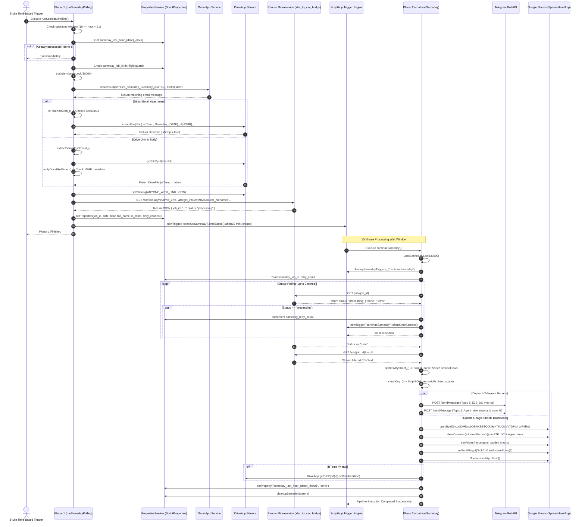
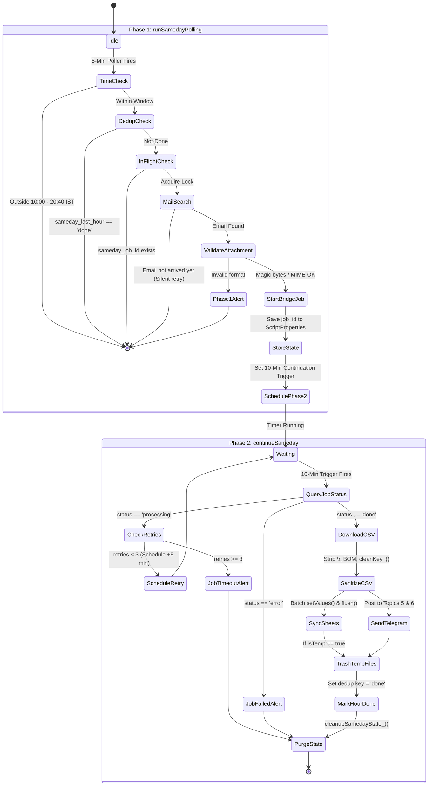
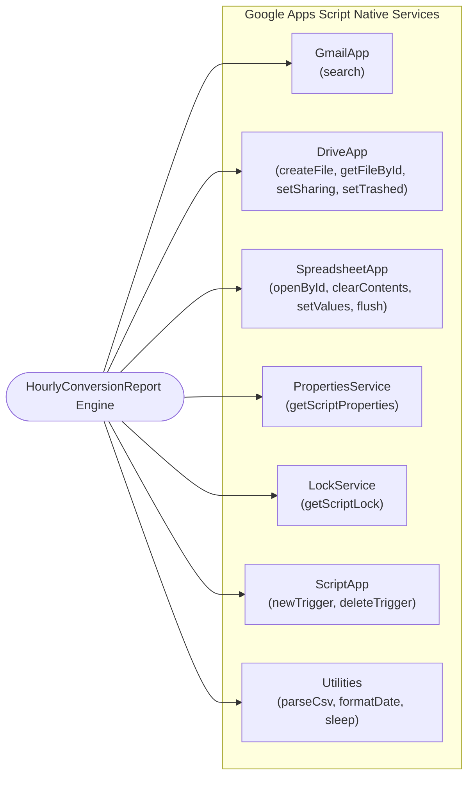
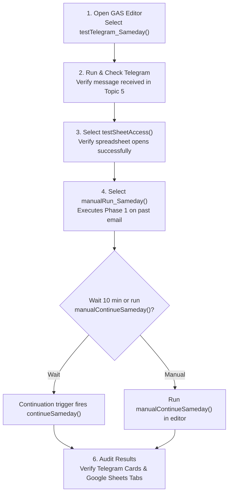

# HourlyConversionReport

## 1. Overview
**HourlyConversionReport** is an automated, event-driven serverless logistics tracking pipeline running on [[Google Apps Script]] (GAS) under the modern [[V8]] runtime. Operating within the supply-chain network of Myntra / Dexter in Northern India, its core operational mandate is to perform intraday, hourly extraction, conversion, performance computation, and multi-channel alerting for same-day delivery operations centered on the **Mirzapur Distribution Center (`MRZ`)**.

### The Operational Problem
Every operating day between **10:00 AM and 8:00 PM IST**, upstream enterprise dispatch systems emit automated hourly snapshot emails containing nationwide same-day workbooks (`E2E_sameday_Summary_DD-MMM-YYYY HH.xlsx`). These comprehensive dumps contain hundreds of thousands of shipment rows spanning all Northern hubs and Distribution Centers. Native Google Apps Script execution environments cannot ingest or parse these massive OpenXML (`.xlsx`) files directly: GAS enforces a hard **6-minute (360 seconds)** execution timeout, a **50 MB in-memory heap limitation**, strict payload size quotas on `UrlFetchApp`, and lacks a native, low-memory XML SAX parser.

### The Architectural Solution
HourlyConversionReport solves this architectural barrier by implementing a **Two-Phase Asynchronous Polling & Chained-Trigger Architecture**:
1. **Phase 1 (`runSamedayPolling`)**: Triggered every 5 minutes by a time-based cron trigger during the operational window (10:00 AM to 8:40 PM IST). It queries [[Gmail]] for the expected hourly email (`subject:"E2E_sameday_Summary_{{DATE}} {{HOUR}}.xlsx"`), verifies the payload format using binary magic-byte inspection (`PK\x03\x04`) or MIME metadata filtering, makes the file accessible via [[Google Drive]], and delegates heavy spreadsheet decompression and target-filtering to an external streaming microservice: xlsx_to_csv_bridge hosted on [[Render]]. Phase 1 records the job identifier in `ScriptProperties` and registers a self-scheduling, one-shot time-based trigger for Phase 2.
2. **Phase 2 (`continueSameday`)**: Fired 10 minutes later (with up to 3 subsequent 5-minute retries) by the installable continuation trigger. It queries the bridge's `/job/{job_id}` endpoint, downloads a pre-filtered, lightweight CSV containing only `MRZ` operational records, cleans hidden carriage returns (`\r`) and Byte-Order Marks (`\uFEFF`), decomposes the data into sheet groups (`E2E_DC` and `Agent_view`), updates a live [[Google Sheets]] operational dashboard (`1vuzG3MNccbOBNKBBTQ0kf9yKT8UQLVV7J9AUj1vR5Rw`) via atomic batch writes, and broadcasts rich HTML KPI cards to dedicated forum topics in a central [[Telegram]] operations supergroup.

## 2. Tech Stack

| Component / Layer | Technology | Version / Requirement | Source / Code Reference | Notes |
| :--- | :--- | :--- | :--- | :--- |
| **Execution Runtime** | [[Google Apps Script]] (GAS) | V8 Runtime (`runtimeVersion: "V8"`) *(stated)* | `appsscript.json:6` | Modern ECMAScript (ES6+) execution environment supporting `const`, `let`, arrow functions, template literals, and `Array.prototype` methods. |
| **Exception Logging** | Google Cloud Stackdriver | `STACKDRIVER` *(stated)* | `appsscript.json:5` | Cloud logging backend capturing standard `console.log`, `console.warn`, and `console.error` outputs in Google Cloud Console. |
| **Timezone Reference** | IANA Timezone | `Asia/Kolkata` (IST, UTC+5:30) *(stated)* | `appsscript.json:2` | Governs all execution timestamps, date formatting (`dd-MMM-yyyy`), and operational hour checks (10:00 to 20:40 IST). |
| **State & Config Store** | `PropertiesService` | Built-in `ScriptProperties` | `Code.js:148-155`, `210-218`, `422-430`, `577-586` | Global key-value store maintaining async job tracking, retry counters, and daily hour deduplication state. |
| **Concurrency Control** | `LockService` | Built-in `ScriptLock` | `Code.js:163-165`, `236`, `416-418`, `531` | Prevents overlapping executions of Phase 1 and Phase 2 with a 30-second wait timeout (`tryLock(30000)`). |
| **Trigger Management** | `ScriptApp` | Built-in Event API | `Code.js:221-225`, `450-454`, `588-594`, `888-895` | Manages recurring 5-minute polling triggers and one-shot programmatic continuation triggers. |
| **Mail Ingestion** | `GmailApp` | Built-in Workspace API | `Code.js:801-807` | Performs filtered subject queries (`subject:"E2E_sameday_Summary_{{DATE}} {{HOUR}}.xlsx"`) and parses attachments. |
| **File Storage & Auth** | `DriveApp` | Built-in Workspace API | `Code.js:192-194`, `829-832`, `850-871` | Buffers raw attachments, generates public view links for bridge download, and manages temporary file trashing. |
| **Live Dashboard Store** | `SpreadsheetApp` | Built-in Workspace API | `Code.js:324-400` | Refreshes tabs `E2E_DC` and `Agent_view` in target workbook `1vuzG3MNccbOBNKBBTQ0kf9yKT8UQLVV7J9AUj1vR5Rw`. |
| **HTTP Egress & Fetch** | `UrlFetchApp` | Built-in Networking API | `Code.js:262`, `538`, `552`, `741-746` | Communicates with the external FastAPI conversion bridge and Telegram Bot API. |
| **CSV Parsing & Text** | `Utilities` | Built-in Utility API | `Code.js:149`, `560`, `759` | Converts raw CSV text into 2D arrays via `Utilities.parseCsv()` and formats localized date strings. |
| **External Bridge Engine** | xlsx_to_csv_bridge | Python / FastAPI / `xlsx2csv` on [[Render]] | `Code.js:23-24`, `248-278`, `535-571` | External streaming SAX microservice that parses multi-megabyte `.xlsx` files and filters for `MRZ` rows. |
| **Alerting & Notification** | [[Telegram]] Bot API | HTTP REST API / HTML Mode | `Code.js:34-38`, `732-752` | Dispatches formatted HTML performance cards to topics 5 (`E2E_DC` / Alerts) and 6 (`Agent_view`). |
| **Project CLI Tooling** | Google Clasp (`@google/clasp`) | `>=2.4.0` *(inferred)* | Project Structure | CLI environment used to manage local source files and push to script ID `1385RHzZzU52h6Mjs-eUmaQle84gjjHANZ-eX_tvou_JhLdgCwHxnux1M`. |

---

## 3. Architecture

### System Architecture Overview
The system bridges Google Workspace enterprise applications ([[Gmail]], [[Google Drive]], [[Google Sheets]]) with an external cloud compute worker (xlsx_to_csv_bridge) and real-time operational communications ([[Telegram]]). Because Google Apps Script enforces a strict 6-minute execution limit, the architecture strictly segregates file acquisition from downstream processing.

```mermaid
flowchart TD
    subgraph Schedulers ["Trigger & Scheduling Subsystem"]
        Cron5Min["Installable Cron Trigger<br/>(Every 5 Minutes)"]
        ChainedTrigger["Programmatic Continuation Trigger<br/>(ScriptApp.newTrigger - 10 Min Wait)"]
    end

    subgraph Phase1 ["Phase 1: Ingestion & Offloading (runSamedayPolling)"]
        TimeGuard{"Within Window?<br/>(10:00 - 20:40 IST)"}
        DedupGuard{"Hour Already Done?<br/>(ScriptProperties Dedup Key)"}
        Lock1["LockService.getScriptLock()<br/>(30s Timeout)"]
        GmailSearch["GmailApp.search()<br/>(Query: subject:E2E_sameday_Summary_...)"]
        AttachmentCheck{"Attachment or<br/>Drive Link?"}
        MagicByteCheck{"Verify Magic Bytes<br/>(PK 0x03 0x04)"}
        DriveUpload["DriveApp.createFile()<br/>(Buffer as Temp_Sameday_...)"]
        DrivePublic["DriveApp.setSharing()<br/>(ANYONE_WITH_LINK: VIEW)"]
        StartBridge["UrlFetchApp: POST /convert-async<br/>(Pass drive_url, date_str, target=MRZ, filename)"]
        SaveState["ScriptProperties.setProperties()<br/>(Save job_id, hour, retry_count=0)"]
    end

    subgraph External_Cloud ["External Streaming Worker (Render)"]
        Bridge["xlsx_to_csv_bridge (FastAPI)<br/>https://xlsx-to-csv-bridge.onrender.com"]
        SAXEngine["xlsx2csv SAX Parser<br/>(Restricts to Agent_view & E2E_DC)"]
        DiskCache[("Filtered CSV Cache<br/>/tmp/xlsx_cache/job_id.csv")]
    end

    subgraph Phase2 ["Phase 2: Polling, Transformation & Presentation (continueSameday)"]
        Lock2["LockService.getScriptLock()<br/>(30s Timeout)"]
        PollStatus["UrlFetchApp: GET /job/{job_id}"]
        StatusCheck{"Job Status?"}
        RetryCount{"Retries < 3?"}
        ScheduleRetry["Schedule continueSameday<br/>(+5 Minutes)"]
        DownloadCSV["UrlFetchApp: GET /job/{job_id}/result"]
        CSVSplit["splitCsvBySheet_()<br/>(Strip \\r, detect 'Sheet' sentinel)"]
        KeySanitizer["cleanKey_()<br/>(Strip BOM, \\r, spaces, hyphens)"]
    end

    subgraph Egress_Ecosystem ["Egress & Presentation Layer"]
        subgraph Telegram_Dispatch ["Telegram Bot API Dispatch"]
            TGRouter{"Sheet Router"}
            E2EDCCard["sendSamedayE2EDCCard_()<br/>(Row-by-row DC metrics)"]
            AgentCard["sendSamedayAgentViewCard_()<br/>(OFD, Del Update, OFP, Conv %)"]
            TGChunker{"Length > 3500?"}
            TGTopic5["Telegram Chat Topic 5<br/>(E2E_DC & System Alerts)"]
            TGTopic6["Telegram Chat Topic 6<br/>(Agent_view Performance)"]
        end

        subgraph Sheets_Sync ["Google Sheets Synchronizer"]
            OpenSheet["SpreadsheetApp.openById()<br/>(ID: 1vuzG3MNccbOBNKBBTQ0kf9yKT8UQLVV7J9AUj1vR5Rw)"]
            RectPad["Pad Rows to Uniform Rectangle"]
            AtomicWrite["tab.getRange().setValues()<br/>(Full Tab Replacement)"]
            StyleTab["Set Bold Headers & Freeze 2 Rows"]
            Flush["SpreadsheetApp.flush()"]
        end

        subgraph Cleanup_Cycle ["State & Ephemeral Cleanup"]
            TrashDrive["DriveApp.setTrashed(true)<br/>(Delete Temp File)"]
            MarkDone["Set Dedup Key = 'done'"]
            ClearProps["cleanupSamedayState_()<br/>(Purge ScriptProperties)"]
        end
    end

    Cron5Min --> TimeGuard
    TimeGuard -- Yes --> DedupGuard
    DedupGuard -- Not Done --> Lock1
    Lock1 --> GmailSearch
    GmailSearch --> AttachmentCheck
    AttachmentCheck -- Email Attachment --> MagicByteCheck
    MagicByteCheck -- Valid PK --> DriveUpload
    AttachmentCheck -- Body Link --> DrivePublic
    DriveUpload --> DrivePublic
    DrivePublic --> StartBridge
    StartBridge --> SaveState
    SaveState --> ChainedTrigger

    StartBridge -. HTTP POST .-> Bridge
    Bridge --> SAXEngine
    SAXEngine --> DiskCache

    ChainedTrigger --> Lock2
    Lock2 --> PollStatus
    PollStatus -. HTTP GET .-> Bridge
    Bridge -. JSON Status .-> StatusCheck

    StatusCheck -- "processing" --> RetryCount
    RetryCount -- Yes --> ScheduleRetry
    ScheduleRetry --> ChainedTrigger
    RetryCount -- No --> TGTopic5
    StatusCheck -- "error" --> TGTopic5

    StatusCheck -- "done" --> DownloadCSV
    DownloadCSV -. HTTP Stream .-> CSVSplit
    CSVSplit --> KeySanitizer
    KeySanitizer --> TGRouter & OpenSheet

    TGRouter -- "E2E_DC" --> E2EDCCard
    TGRouter -- "Agent_view" --> AgentCard
    E2EDCCard & AgentCard --> TGChunker
    TGChunker --> TGTopic5 & TGTopic6

    OpenSheet --> RectPad --> AtomicWrite --> StyleTab --> Flush

    Flush & TGTopic6 --> TrashDrive --> MarkDone --> ClearProps
```



### Key Architectural Layers

1. **Ingress, Verification & Concurrency Guard Layer**:
   - **Time & Dedup Guards**: The poller evaluates current hour against `SD_CONFIG.RUN_START_HOUR` (10) and `SD_CONFIG.RUN_END_HOUR` (21). It checks `ScriptProperties` for key `sameday_last_hour_YYYY-MM-DD_HH`. If present with value `"done"`, execution terminates in under 50ms (`Code.js:142-155`).
   - **ScriptLocking**: Both phases wrap execution in `LockService.getScriptLock().tryLock(30000)`. If a prior trigger invocation is still executing, overlapping runs back off immediately (`Code.js:163-165`, `416-418`).
   - **Binary Magic-Byte Inspection (`isRealXlsxBlob_`)**: Before uploading email attachments, GAS reads the initial 4 bytes. An authentic OpenXML/ZIP archive must match magic bytes `[0x50, 0x4B, 0x03, 0x04]` (`PK\x03\x04`). This shields downstream parsers from HTML error dumps or truncated files (`Code.js:58-76`).
   - **MIME Inspection for Large Links (`verifyDriveFileMime_`)**: When workbooks arrive as Google Drive hyperlinks in the email body, the script queries Drive metadata without downloading the file into GAS memory, rejecting Google Sheets native formats and HTML pages while accepting `application/vnd.openxmlformats-officedocument.spreadsheetml.sheet` and zip archives (`Code.js:82-119`).

2. **Asynchronous Compute Offloading Layer**:
   - **Bridge Dispatch**: Phase 1 calls `POST /convert-async` on xlsx_to_csv_bridge. Critically, it passes `source_filename`, which signals the bridge parser to discard massive raw inventory and nationwide dispatch sheets, strictly converting only `Agent_view` and `E2E_DC` (`Code.js:248-260`).
   - **Trigger Chaining**: Instead of idling in `Utilities.sleep()` (which exhausts GAS execution runtime and blocks the thread), Phase 1 dynamically instantiates a one-shot time-based trigger targeting `continueSameday` scheduled for 10 minutes in the future (`Code.js:221-225`).

3. **Transformation & String Sanitization Layer**:
   - **Carriage Return (`\r`) Stripping**: Because the bridge runs on Linux/Windows containers and emits standard CSV text, cells parsed via `Utilities.parseCsv()` preserve trailing `\r` on the final column of each record. The function `splitCsvBySheet_()` sanitizes every cell with `.replace(/\r/g, "").trim()`, preventing corrupted dictionary lookups (`Code.js:607-640`).
   - **BOM & Zero-Width Sanitization (`cleanKey_`)**: Tab names and sheet keys are scrubbed of Byte-Order Marks (`\uFEFF`), zero-width spaces (`\u200B`), whitespace, underscores, and hyphens (`Code.js:301-309`).

4. **Multi-Channel Presentation & Egress Layer**:
   - **Telegram Supergroup Dispatch**: Formats operational metrics into HTML cards. If a message exceeds 3,500 characters, `sendSamedayE2EDCCard_` and `sendSamedayAgentViewCard_` chunk the message to comply with Telegram's hard 4,096-character limit (`Code.js:675-678`, `722-725`).
   - **Atomic Google Sheets Replacement**: Rather than appending or performing cell-by-cell edits, `writeSamedayToSheet_()` clears the destination tab (`tab.clearContents()`), calculates the maximum row width, pads short rows to create a perfect rectangular 2D matrix, executes an atomic `setValues()`, applies bold styling, freezes 2 header rows, and immediately invokes `SpreadsheetApp.flush()` to force an instant commit (`Code.js:369-400`).

---

## 4. Folder & File Structure

The project follows a standard Google Apps Script flat file structure maintained locally via clasp:

```
HourlyConversionReport/
├── appsscript.json            # Google Apps Script project manifest (V8 runtime, timezone, logging)
└── Code.js                    # Monolithic application script containing all pipelines, configs, and helpers
```

### Granular File Inventory

| File Name | Size (Bytes) | Line Count | Primary Role / Contents | Source Reference |
| :--- | :--- | :--- | :--- | :--- |
| `appsscript.json` | 120 | 7 | Manifest file configuring IANA timezone `Asia/Kolkata`, empty external dependencies, Stackdriver cloud logging, and modern `V8` runtime engine. | `appsscript.json:1-7` |
| `Code.js` | 38,738 | 1,011 | Core operational monolith containing `SD_CONFIG`, `SHEET_CONFIG`, binary verification, Phase 1 polling (`runSamedayPolling`), Phase 2 continuation (`continueSameday`), Google Sheets sync (`writeSamedayToSheet_`), Telegram card builders, Gmail/Drive helpers, state purgers, and manual diagnostic triggers. | `Code.js:1-1011` |

---

## 5. Core Modules & Responsibilities

All executable logic resides within `Code.js`. The breakdown below details every symbol, function, and configuration block:

| Function / Component | Line Range | Responsibility & Architectural Details | Source Reference |
| :--- | :--- | :--- | :--- |
| `SD_CONFIG` | `Code.js:21-46` | Global configuration dictionary defining bridge endpoints, API credentials, target DC (`MRZ`), search query templates, Telegram bot credentials, forum topic IDs, polling intervals (10 min wait, max 3 retries), and operating hours (10:00–21:00). | `Code.js:21-46` |
| `isRealXlsxBlob_(blob)` | `Code.js:58-76` | Validates file integrity for blobs under 25 MB. Extracts byte array and matches first 4 bytes against ZIP magic header `0x50, 0x4B, 0x03, 0x04`. Returns boolean. | `Code.js:58-76` |
| `verifyDriveFileMime_(driveFile)` | `Code.js:82-119` | Metadata-only validator for large Drive files (100MB+). Rejects native Google Sheets, HTML error responses, and non-binary types without loading payload into memory. | `Code.js:82-119` |
| `getVerifiedXlsxDriveFile_(originalFile)`| `Code.js:125-132`| Wrapper returning `{ file, isConverted: false }` if Drive file passes MIME checks; else returns `null`. | `Code.js:125-132` |
| `runSamedayPolling()` | `Code.js:138-238` | **Phase 1 Entry Point**. Verifies time window (10:00–20:40), checks daily deduplication key, enforces `LockService`, queries Gmail, verifies attachment, sets public Drive sharing, initiates bridge job, stores state in `ScriptProperties`, and schedules `continueSameday` trigger. | `Code.js:138-238` |
| `startSamedayAsyncJob_(driveUrl, dateStr, fileName)` | `Code.js:248-278` | Dispatches HTTP GET to `/convert-async` on the bridge with encoded parameters (`api_key`, `drive_url`, `date_str`, `target_value=MRZ`, `source_filename`). Returns `job_id`. | `Code.js:248-278` |
| `SHEET_CONFIG` | `Code.js:284-288` | Constants for Google Sheet updates: `SPREADSHEET_ID` (`1vuzG3MNccbOBNKBBTQ0kf9yKT8UQLVV7J9AUj1vR5Rw`), `TAB_E2E_DC` (`E2E_DC`), and `TAB_AGENT_VIEW` (`Agent_view`). | `Code.js:284-288` |
| `cleanKey_(s)` | `Code.js:301-309` | Sanitizes sheet names and headers. Strips BOM (`\uFEFF`), carriage returns (`\r`), zero-width spaces (`\u200B`), trims whitespace, lowercases, and deletes spaces, underscores, and hyphens. | `Code.js:301-309` |
| `testSheetAccess()` | `Code.js:310-313` | Test harness confirming script read/write authorization against target spreadsheet ID. | `Code.js:310-313` |
| `writeSamedayToSheet_(sheetGroups, dateStr, hourLabel)` | `Code.js:323-409` | Iterates `E2E_DC` and `Agent_view` groups. Clears destination sheets, generates a timestamp banner row (`Last updated: ...`), pads rows to uniform width, performs atomic `setValues()`, formats header styling, freezes rows, and calls `SpreadsheetApp.flush()`. | `Code.js:323-409` |
| `continueSameday()` | `Code.js:415-533` | **Phase 2 Entry Point**. Acquires lock, cleans existing triggers, reads `ScriptProperties`, polls `/job/{job_id}`, manages retries (up to 3), downloads result CSV, parses sheet groups, dispatches Telegram reports, triggers Google Sheet update, trashes temporary Drive files, and sets deduplication key to `"done"`. | `Code.js:415-533` |
| `checkSamedayJobStatus_(jobId)` | `Code.js:535-546` | Queries `${BRIDGE_URL}/job/${jobId}`. Handles 404 (server restart) and returns JSON status (`processing`, `done`, `error`). | `Code.js:535-546` |
| `downloadSamedayResult_(jobId)` | `Code.js:548-571` | Fetches `${BRIDGE_URL}/job/${jobId}/result`. Parses CSV payload with `Utilities.parseCsv()` and filters out blank lines. | `Code.js:548-571` |
| `cleanupSamedayState_()` | `Code.js:577-586` | Purges the 7 operational properties (`sameday_job_id`, `sameday_date_str`, etc.) from `ScriptProperties`. | `Code.js:577-586` |
| `cleanupSamedayTriggers_(functionName)` | `Code.js:588-594` | Deletes all project triggers associated with a specific handler function to avoid orphan trigger accumulation. | `Code.js:588-594` |
| `splitCsvBySheet_(rows)` | `Code.js:607-640` | Parses bridge CSV output into sheet groups based on sentinel row `"Sheet"`. Strips `\r` from headers and cell values to ensure compatibility. | `Code.js:607-640` |
| `sendSamedayTelegramReport_(sheetName, headers, dataRows, dateStr, hourLabel)` | `Code.js:646-652` | Routes sheet data to specialized Telegram card generators based on sheet name (`E2E_DC` vs `Agent_view`). | `Code.js:646-652` |
| `sendSamedayE2EDCCard_(headers, dataRows, dateStr, hourLabel)` | `Code.js:654-681` | Builds formatted HTML message for `E2E_DC` metrics. Iterates rows, formats column key-value pairs, splits at 3,500 characters, and posts to Topic 5. | `Code.js:654-681` |
| `sendSamedayAgentViewCard_(headers, dataRows, dateStr, hourLabel)` | `Code.js:683-728` | Resolves column indices for Agent, OFD, Del Update, OFP, Picked-up. Computes OFD Conversion % (`delUpd / ofd`) and OFP Conversion % (`picked / ofp`). Chunks and posts to Topic 6. | `Code.js:683-728` |
| `sendSamedayTelegram_(htmlMessage, topicId)` | `Code.js:732-752` | Executes POST request to Telegram Bot API `sendMessage` endpoint with `parse_mode: "HTML"`, `disable_web_page_preview: true`, and optional `message_thread_id`. | `Code.js:732-752` |
| `sendSamedayAlert_(emoji, title, detail)` | `Code.js:758-764` | Dispatches standardized operational alert messages (error/warning/info) with timestamp to `TELEGRAM_TOPIC_ALERTS` (Topic 5). | `Code.js:758-764` |
| `findSamedayColIdx_(colMap, candidates)` | `Code.js:766-771` | Helper that searches column index map against an array of lowercased alias candidates. Returns `-1` if not found. | `Code.js:766-771` |
| `getSamedayVal_(row, idx, fallback)` | `Code.js:773-776` | Safely retrieves trimmed string cell value from row array with fallback. | `Code.js:773-776` |
| `getSamedayNumVal_(row, idx)` | `Code.js:778-782` | Safely parses floating point numbers from formatted strings (stripping commas). Returns `0` on NaN. | `Code.js:778-782` |
| `formatTodayDate_()` | `Code.js:791-795` | Formats the current date as `DD-MMM-YYYY` (e.g., `18-Feb-2026`) matching the email subject pattern. | `Code.js:791-795` |
| `searchSamedayMail_(dateStr, hour)` | `Code.js:797-807` | Performs Gmail search using subject template and strictly checks exact subject string to avoid hour collisions (e.g., hour 7 vs 17). | `Code.js:797-807` |
| `getSamedayDriveFile_(message, dateStr, hour)` | `Code.js:817-872` | Extracts XLSX workbook from email. Checks direct attachment with magic-byte check first; falls back to parsing Google Drive URLs from email body. | `Code.js:817-872` |
| `extractSamedayDriveId_(message)` | `Code.js:874-882` | Regex extractor retrieving 33+ character Google Drive IDs from plain text email body (`/d/ID`, `id=ID`, or raw ID strings). | `Code.js:874-882` |
| `setupSamedayTrigger()` / `setupHourlyTrigger()` | `Code.js:888-898` | Admin setup functions installing the primary 5-minute time-driven trigger for `runSamedayPolling`. | `Code.js:888-898` |
| `testTelegram_Sameday()` | `Code.js:900-902` | Dispatches verification ping to Telegram Topic 5. | `Code.js:900-902` |
| `viewSamedayState()` | `Code.js:905-917` | Diagnostic tool logging all `sameday_*` keys from `ScriptProperties` and all active project triggers. | `Code.js:905-917` |
| `manualContinueSameday()` | `Code.js:920-928` | Bypasses trigger delay to immediately run `continueSameday()` against currently stored `sameday_job_id`. | `Code.js:920-928` |
| `clearSamedayHourKey()` | `Code.js:932-939` | Admin helper deleting specific deduplication key `sameday_last_hour_YYYY-MM-DD_HH` to permit backfilling. | `Code.js:932-939` |
| `manualRun_Sameday()` | `Code.js:949-1011` | End-to-end testing harness. Bypasses time window and dedup guards, calculates target time as 2 hours prior (safely rolling back midnight), triggers Phase 1, and schedules Phase 2. | `Code.js:949-1011` |

---

## 6. Data Flow / Key Workflows

### 1. End-to-End Hourly Processing Sequence



### 2. Two-Phase Asynchronous State Machine



---

## 7. Configuration & Environment

### Google Apps Script Manifest (`appsscript.json`)
The script manifest specifies the execution context for Google Apps Script:

```json
{
  "timeZone": "Asia/Kolkata",
  "dependencies": {},
  "exceptionLogging": "STACKDRIVER",
  "runtimeVersion": "V8"
}
```
- `timeZone`: Set to `Asia/Kolkata`. All execution timestamps (`Utilities.formatDate`) match Indian Standard Time (UTC+5:30).
- `dependencies`: Empty dictionary (`{}`). No external GAS libraries are bound to the project, avoiding external dependency lookup latencies.
- `exceptionLogging`: Configured to `STACKDRIVER`. Unhandled exceptions automatically propagate to Google Cloud Stackdriver Logging.
- `runtimeVersion`: Specified as `V8`. Executes ECMAScript 6+ standard code.

### In-Code Configuration Objects

#### 1. Primary Operational Config (`SD_CONFIG`)
Defined in `Code.js:21-46`:

| Parameter | Type | Value / Pattern | Description |
| :--- | :--- | :--- | :--- |
| `BRIDGE_URL` | String | `https://xlsx-to-csv-bridge.onrender.com` | Base URL of the remote FastAPI conversion microservice hosted on Render. |
| `BRIDGE_API_KEY` | String | `[REDACTED_SECRET]` | Authentication key passed in query parameter `api_key` to access the bridge. |
| `TARGET_DC_VALUE` | String | `"MRZ"` | Filter constant. Restricts CSV output strictly to rows matching Mirzapur Hub/DC. |
| `SEARCH_QUERY_TEMPLATE` | String | `subject:"E2E_sameday_Summary_{{DATE}} {{HOUR}}.xlsx"` | Gmail query pattern. `{{DATE}}` is replaced with `DD-MMM-YYYY`; `{{HOUR}}` with integer hour. |
| `TELEGRAM_BOT_TOKEN` | String | `[REDACTED_SECRET]` | Bot token used to authorize calls to `https://api.telegram.org/bot<TOKEN>/`. |
| `TELEGRAM_CHAT_ID` | String | `"-1003779595579"` | Unique chat/channel ID of the target operational Telegram supergroup. |
| `TELEGRAM_TOPIC_E2E_DC` | Integer | `5` | Forum thread ID for DC-level logistics conversions and summaries. |
| `TELEGRAM_TOPIC_AGENT_VIEW` | Integer | `6` | Forum thread ID for field agent delivery performance reports. |
| `TELEGRAM_TOPIC_ALERTS` | Integer | `5` | Forum thread ID for error alerts, timeouts, and missing file warnings. |
| `TELEGRAM_SHEETS` | Array | `["E2E_DC", "Agent_view"]` | List of sheet names extracted from the bridge CSV to format for Telegram. |
| `POLL_WAIT_MINUTES` | Integer | `10` | Initial delay between Phase 1 bridge dispatch and Phase 2 continuation trigger. |
| `MAX_RETRIES` | Integer | `3` | Maximum number of 5-minute continuation retry attempts before declaring job failure. |
| `RUN_START_HOUR` | Integer | `10` | Earliest hour (10:00 AM IST) at which polling triggers will process incoming emails. |
| `RUN_END_HOUR` | Integer | `21` | Cutoff hour (8:00 PM operational, up to 20:40 trigger) after which executions skip. |

#### 2. Spreadsheet Destination Config (`SHEET_CONFIG`)
Defined in `Code.js:284-288`:

| Parameter | Type | Value | Description |
| :--- | :--- | :--- | :--- |
| `SPREADSHEET_ID` | String | `1vuzG3MNccbOBNKBBTQ0kf9yKT8UQLVV7J9AUj1vR5Rw` | Target Google Spreadsheet holding live operational tracking data. |
| `TAB_E2E_DC` | String | `"E2E_DC"` | Sheet tab name holding the refreshed Distribution Center metrics. |
| `TAB_AGENT_VIEW` | String | `"Agent_view"` | Sheet tab name holding individual agent delivery/pickup conversions. |

### Dynamic State Storage (`ScriptProperties`)
The script uses `PropertiesService.getScriptProperties()` for inter-phase communication and deduplication:

| Property Key | Type / Sample | Scope / Lifespan | Responsibility |
| :--- | :--- | :--- | :--- |
| `sameday_job_id` | String (`uuid`) | Ephemeral (Phase 1 to Phase 2) | Active job ID returned by the bridge `/convert-async` endpoint. |
| `sameday_date_str` | String (`18-Feb-2026`) | Ephemeral (Phase 1 to Phase 2) | Current target operational date string passed to Telegram and Sheets. |
| `sameday_hour` | String (`16`) | Ephemeral (Phase 1 to Phase 2) | Target operational hour currently undergoing processing. |
| `sameday_file_name` | String | Ephemeral (Phase 1 to Phase 2) | File name of the attached or linked workbook. |
| `sameday_is_temp` | String (`"true"`, `"false"`) | Ephemeral (Phase 1 to Phase 2) | Indicates if file was created in Drive from an attachment and must be trashed. |
| `sameday_drive_file_id` | String (`id`) | Ephemeral (Phase 1 to Phase 2) | Google Drive File ID of the buffered workbook. |
| `sameday_retry_count` | String (`"0"` to `"3"`) | Ephemeral (Phase 2 retries) | Counter tracking how many 5-minute continuation retries have elapsed. |
| `sameday_last_hour_{date}_{hour}` | String (`"done"`) | Persistent (Daily) | Deduplication lock ensuring a specific operational hour is processed only once. |

---

## 8. External Integrations & APIs

### 1. External Streaming Bridge (xlsx_to_csv_bridge)
The conversion microservice is hosted on [[Render]] (`https://xlsx-to-csv-bridge.onrender.com`). Communication uses HTTP via `UrlFetchApp`:

- **Job Initiation Endpoint (`GET /convert-async`)**:
  - URL Format: `${BRIDGE_URL}/convert-async?api_key=...&drive_url=...&date_str=...&target_value=MRZ&source_filename=...`
  - Parameters:
    - `api_key`: Secret authentication token.
    - `drive_url`: Direct download URL generated via `https://drive.google.com/uc?export=download&id=${driveFile.getId()}`.
    - `date_str`: Target date string (`DD-MMM-YYYY`).
    - `target_value`: Constant `"MRZ"`. Instructs bridge to filter rows matching Mirzapur.
    - `source_filename`: Critical parameter. When the bridge detects `"sameday"` in the filename, its sheet selection logic restricts parsing strictly to tabs `Agent_view` and `E2E_DC`, ignoring massive raw shipment dumps (`Code.js:248-260`).
  - Response: `200 OK` with JSON `{"job_id": "...", "status": "processing" | "done"}`.
- **Job Status Polling (`GET /job/{job_id}`)**:
  - URL Format: `${BRIDGE_URL}/job/${jobId}`
  - Response: JSON `{"job_id": "...", "status": "processing" | "done" | "error", "error": "..."}`.
  - Special Handling: HTTP 404 response is caught and translated to `{ status: "error", error: "Job not found (server may have restarted)" }` (`Code.js:539-542`).
- **Result Download (`GET /job/{job_id}/result`)**:
  - URL Format: `${BRIDGE_URL}/job/${jobId}/result`
  - Response: Streamed CSV text payload containing rows for both sheets separated by sentinel rows (`Sheet,Header1,Header2...`).

### 2. Telegram Bot API
Alerts and performance cards are dispatched via HTTP POST to `https://api.telegram.org/bot<TOKEN>/sendMessage`:
- **Payload Schema**:
  ```json
  {
    "chat_id": "-1003779595579",
    "text": "<b>HTML Formatted Message</b>",
    "parse_mode": "HTML",
    "disable_web_page_preview": true,
    "message_thread_id": 5
  }
  ```
- **Topic Segmentation**:
  - `TELEGRAM_TOPIC_E2E_DC` (`5`): Receives row-by-row DC metrics and operational error/warning alerts.
  - `TELEGRAM_TOPIC_AGENT_VIEW` (`6`): Receives agent-level delivery metrics (OFD, Del Update, OFP, Picked-up, and conversion percentages).
- **Message Chunking**:
  Telegram enforces a hard 4,096-character limit per message. The script monitors payload length and splits messages at 3,500 characters, appending `(cont.)` in subsequent chunks (`Code.js:675-678`, `722-725`).

### 3. Google Workspace Native Services



---

## 9. Testing

The codebase embeds a comprehensive diagnostic test suite directly in `Code.js` to enable interactive verification via the Apps Script IDE:

| Diagnostic Function | Line Range | Execution Role & Procedure |
| :--- | :--- | :--- |
| `testTelegram_Sameday()` | `Code.js:900-902` | Dispatches an immediate test ping (`🧪 Sameday Hourly Test: Telegram bot is connected! ✅`) to Topic 5. Used to verify bot token and network connectivity. |
| `testSheetAccess()` | `Code.js:310-313` | Opens the target spreadsheet `1vuzG3MNccbOBNKBBTQ0kf9yKT8UQLVV7J9AUj1vR5Rw` and logs its name. Confirms OAuth read/write authorization. |
| `viewSamedayState()` | `Code.js:905-917` | Dumps all `sameday_*` keys stored in `ScriptProperties` and iterates all active project triggers, logging their target functions and event types. Vital for diagnosing stuck triggers. |
| `manualContinueSameday()` | `Code.js:920-928` | Forcefully triggers Phase 2 (`continueSameday()`) immediately. Useful when testing Phase 2 logic after Phase 1 has completed without waiting for the 10-minute timer. |
| `clearSamedayHourKey()` | `Code.js:932-939` | Manually deletes a specific `sameday_last_hour_YYYY-MM-DD_HH` key from `ScriptProperties`. Allows developers to re-run pipeline testing for an hour that was already completed. |
| `manualRun_Sameday()` | `Code.js:949-1011` | **Full Pipeline Simulation**. Cleans state, bypasses operating hour guards and deduplication locks, targets the email from 2 hours prior (safely handling midnight rollovers), initiates Phase 1, and creates the Phase 2 trigger. |

### Manual Verification Procedure



---

## 10. CI/CD & Deployment

Deployment is managed using the Google clasp (`@google/clasp`) command-line tool.

### Clasp Configuration (`.clasp.json`)
To manage this project locally, a `.clasp.json` file is configured in the repository root:

```json
{
  "scriptId": "1385RHzZzU52h6Mjs-eUmaQle84gjjHANZ-eX_tvou_JhLdgCwHxnux1M",
  "rootDir": "."
}
```

### Verified Development & Deployment Commands

```bash
# 1. Install clasp globally via npm
npm install -g @google/clasp

# 2. Authenticate clasp with your Google Workspace account
clasp login

# 3. Clone the remote script repository to your local machine
clasp clone 1385RHzZzU52h6Mjs-eUmaQle84gjjHANZ-eX_tvou_JhLdgCwHxnux1M

# 4. Pull remote changes from the Apps Script cloud editor
clasp pull

# 5. Push local modifications to Apps Script
clasp push

# 6. Deploy a new version
clasp version "v2.0.0-sameday-hourly"
clasp deploy --description "Production Sameday Hourly Poller v2"
```

> [!important]
> Always execute `clasp pull` before editing local files if modifications have been made directly in the Google Apps Script web editor to avoid overwriting remote changes.

---

## 11. Setup & Local Development

### Prerequisites
1. **Google Workspace Account** with access to:
   - Target Gmail inbox receiving `E2E_sameday_Summary_*.xlsx` emails.
   - Target Google Sheet: `https://docs.google.com/spreadsheets/d/1vuzG3MNccbOBNKBBTQ0kf9yKT8UQLVV7J9AUj1vR5Rw/edit`.
   - Google Drive storage.
2. **Node.js & npm** (`>=18.0.0`) for local clasp CLI tooling.
3. **Running External Bridge**: Access to xlsx_to_csv_bridge on Render.

### Step-by-Step Initial Configuration
1. **Clone Codebase Locally**:
   ```bash
   mkdir HourlyConversionReport && cd HourlyConversionReport
   clasp clone 1385RHzZzU52h6Mjs-eUmaQle84gjjHANZ-eX_tvou_JhLdgCwHxnux1M
   ```
2. **Review Manifest**: Ensure `appsscript.json` contains `runtimeVersion: "V8"` and `timeZone: "Asia/Kolkata"`.
3. **Verify API Credentials**:
   Ensure `SD_CONFIG.BRIDGE_API_KEY` and `SD_CONFIG.TELEGRAM_BOT_TOKEN` are valid.
4. **Push Code to Remote**:
   ```bash
   clasp push
   ```
5. **Authorize Script Permissions**:
   - Open the Apps Script web editor via `clasp open` or via URL: `https://script.google.com/home/projects/1385RHzZzU52h6Mjs-eUmaQle84gjjHANZ-eX_tvou_JhLdgCwHxnux1M/edit`.
   - Select function `testTelegram_Sameday` and click **Run**.
   - Accept Google OAuth authorization prompts for Gmail, Drive, Spreadsheets, and external HTTP fetch access.
6. **Install Operational Polling Trigger**:
   - In the Apps Script web editor, select and run `setupSamedayTrigger()` (`Code.js:888-895`).
   - This creates the 5-minute time-driven trigger for `runSamedayPolling`.

---

## 12. Security Notes

> [!warning] Security Risk: Hardcoded API Keys & Bot Tokens
> The production script contains hardcoded sensitive credentials directly within the source text in `Code.js`:
> - `SD_CONFIG.BRIDGE_API_KEY`: Raw secret string hardcoded at `Code.js:24`.
> - `SD_CONFIG.TELEGRAM_BOT_TOKEN`: Telegram bot token hardcoded at `Code.js:34`.
> - `SD_CONFIG.TELEGRAM_CHAT_ID`: Telegram internal chat ID hardcoded at `Code.js:35`.
> - `SHEET_CONFIG.SPREADSHEET_ID`: Target spreadsheet identifier hardcoded at `Code.js:285`.
> 
> **Remediation Recommendation**: Migrate all secrets into `ScriptProperties` using the Apps Script Project Settings UI (`Project Settings > Script Properties`) and load them dynamically at runtime via `PropertiesService.getScriptProperties().getProperty("KEY")`.

> [!caution] Security Risk: Public Google Drive File Sharing
> In order for the external Render conversion bridge to download the workbook, Phase 1 invokes:
> `driveFile.setSharing(DriveApp.Access.ANYONE_WITH_LINK, DriveApp.Permission.VIEW)` (`Code.js:192`).
> - While temporary files extracted from email attachments are trashed in Phase 2 (`Code.js:512`), files referenced via Google Drive links in the email body remain set to `ANYONE_WITH_LINK` view permissions permanently.
> - Anyone possessing the 33-character Google Drive ID can download the operational shipment dump.

---

## 13. Known Issues, Limitations & Tech Debt

### 1. Google Apps Script Hard Quotas & Limits
- **Execution Time Ceiling**: Maximum **6 minutes (360 seconds)** per invocation. If the Render bridge takes over 6 minutes to return a result during Phase 2 result download or CSV parsing, the execution will crash. The two-phase trigger-chaining architecture successfully isolates file upload from result processing to stay well within this quota.
- **Trigger Runtime Quota**: Google Workspace accounts are capped at **90 minutes/day** (consumer/free) or **6 hours/day** (Google Workspace enterprise) of total trigger execution time. Running a 5-minute polling trigger across a 10-hour window consumes ~120 executions daily. Fast early exits (<100ms when skipping) are necessary to conserve quota.
- **UrlFetchApp Daily Bandwidth**: Capped at **100 MB/day** (consumer) or **2 GB/day** (Workspace). Downloading pre-filtered CSVs (<2 MB) instead of raw XLSX dumps (50–250 MB) prevents exceeding this quota.

### 2. Operational Ingestion Vulnerabilities
- **Delayed Email Arrival Window**: The script's active window runs from 10:00 AM (`RUN_START_HOUR = 10`) to 8:40 PM (`RUN_END_HOUR = 21`). Central reports typically arrive ~40 minutes past each hour. If an email arrives delayed at 21:05, `runSamedayPolling` will skip execution and the 8:00 PM operational report will never be processed.
- **Deduplication Immutability**: Once an hour is processed, `sameday_last_hour_{date}_{hour}` is marked `"done"`. If central systems re-send a corrected workbook for that same hour, the system will ignore it unless an administrator executes `clearSamedayHourKey()` (`Code.js:932-939`).

### 3. Historical Windows CRLF Line Endings Bug
Prior to v2, `Utilities.parseCsv()` preserved trailing carriage returns (`\r`) from Windows-generated CSV files on the final column. When `sheetGroups` were keyed as `"E2E_DC\r"`, exact string matches failed silently, resulting in zero rows written to Google Sheets. This was resolved by implementing `cleanKey_()` (`Code.js:301-309`) and cell-level `.replace(/\r/g, "")` in `splitCsvBySheet_()` (`Code.js:615-632`).

---

## 14. Design Decisions & Rationale

1. **Why Offload to xlsx_to_csv_bridge on Render?**
   - *Rationale*: A 150 MB OpenXML `.xlsx` file contains compressed XML packages. Parsing XML in Google Apps Script requires loading the DOM into memory via `XmlService` or regex parsing raw strings. Both approaches exceed GAS's 50 MB heap limit and time out after 6 minutes. Offloading to an external streaming SAX parser (`xlsx2csv`) running in Python on Render maintains an $O(1)$ memory footprint (<50 MB RSS) and returns a clean, filtered CSV in seconds.

2. **Why Two-Phase Trigger Chaining Instead of Synchronous Sleeping?**
   - *Rationale*: Cold starts on Render free tier take 30–60 seconds, and SAX parsing takes 1–3 minutes. If GAS paused via `Utilities.sleep(180000)`, it would waste execution runtime and risk hitting the 6-minute cutoff. Creating a time-based continuation trigger (`ScriptApp.newTrigger("continueSameday")`) terminates Phase 1 in <15 seconds, releasing the thread and avoiding quota consumption.

3. **Why Pass `source_filename` to the Bridge?**
   - *Rationale*: Upstream workbooks contain dozens of sheets, including raw shipment dispatches exceeding 500,000 rows. By passing `source_filename`, the bridge detects the token `"sameday"` and instructs its engine to process *only* `Agent_view` and `E2E_DC`, bypassing massive raw tabs and reducing conversion time from 5 minutes to under 20 seconds.

4. **Why Atomic Full Tab Replacements in Google Sheets?**
   - *Rationale*: Hourly conversion data represents cumulative intraday status. Appending rows creates duplicates, while cell-by-cell writing makes hundreds of API calls and hits Sheets quota. Padding short rows to a uniform rectangle and invoking `tab.getRange(1, 1, numRows, numCols).setValues(padded)` executes a single atomic commit, followed by `SpreadsheetApp.flush()`.

---

## 15. Roadmap / TODOs

- [ ] **Secret Migration**: Extract `SD_CONFIG.BRIDGE_API_KEY` and `SD_CONFIG.TELEGRAM_BOT_TOKEN` from code and migrate them to `ScriptProperties`.
- [ ] **Dynamic Cutoff Extension**: Automatically extend `RUN_END_HOUR` if the 8:00 PM email has not yet been processed by 20:50 IST.
- [ ] **Reprocessing / Revision Detection**: Compare incoming email thread IDs or message timestamps against processed emails to allow automatic reprocessing if a revised workbook is received.
- [ ] **Direct Drive Permission Revocation**: After Phase 2 completes, automatically revoke `ANYONE_WITH_LINK` permissions on external Drive links to restore security isolation.

---

## 16. Changelog

### Version 2.0.0 (Current Production)
- **Fix (Sheet Synchronization)**: Added `cleanKey_()` (`Code.js:301-309`) to strip Byte-Order Marks (`\uFEFF`), carriage returns (`\r`), zero-width spaces (`\u200B`), and punctuation before matching sheet names.
- **Fix (CSV Line Endings)**: Implemented cell-level `.replace(/\r/g, "")` in `splitCsvBySheet_()` (`Code.js:615-632`) to eliminate Windows CRLF trailing characters.
- **Enhancement (Sheet Write Robustness)**: Updated `writeSamedayToSheet_()` (`Code.js:323-409`) to calculate max row widths, pad short rows into uniform rectangular matrices, apply bold header styling, freeze top 2 rows, and call `SpreadsheetApp.flush()`.
- **Enhancement (Error Visibility)**: Replaced silent write failures with automated Telegram alert notifications (`sendSamedayAlert_()`).
- **Optimization (Bridge Sheet Filtering)**: Added `source_filename` parameter to `/convert-async` call to restrict bridge parsing exclusively to `Agent_view` and `E2E_DC`.
- **Optimization (MIME Verification)**: Added `verifyDriveFileMime_()` (`Code.js:82-119`) for safe metadata inspection of large Drive files (100MB+) without loading into memory.

### Version 1.0.0 (Legacy)
- Initial release featuring single-phase and early two-phase polling for hourly same-day reports.
- Suffered from tab name matching failures caused by invisible `\r` characters from Windows CSV line endings.

---

## 17. Glossary

| Term | Context | Definition |
| :--- | :--- | :--- |
| **OFD** | Logistics KPI | **Out For Delivery**. Shipments assigned to delivery agents that have left the hub for customer delivery. |
| **Del Update** | Logistics KPI | **Delivery Update**. Total delivery status updates recorded (successful deliveries or marked attempts). |
| **OFD Conv %** | Logistics Metric | **OFD Conversion Percentage**. Computed as `(Del Update / OFD) * 100`. Measures agent delivery completion efficiency. |
| **OFP** | Logistics KPI | **Out For Pickup**. Shipments scheduled for customer return pickup by field agents. |
| **Picked-up** | Logistics KPI | Successfully completed customer return pickups. |
| **OFP Conv %** | Logistics Metric | **OFP Conversion Percentage**. Computed as `(Picked-up / OFP) * 100`. Measures agent pickup fulfillment efficiency. |
| **MRZ** | Geography / Hub | **Mirzapur Distribution Center / Hub**. The target logistics node in Uttar Pradesh monitored by this script. |
| **V8 Runtime** | Infrastructure | The Google Apps Script execution runtime supporting modern ECMAScript standard syntax. |
| **LockService** | Infrastructure | Google Apps Script concurrency mechanism preventing multiple trigger executions from executing overlapping critical sections. |
| **Sentinel Row** | Data Format | A delimiter row in the bridge CSV output starting with `"Sheet"`, used to demarcate multi-sheet datasets within a flat CSV stream. |
| **Trigger Chaining**| Architecture | Software design pattern where an initial function creates a future time-based trigger targeting a downstream continuation function. |

---

## 18. Related Notes
- [[Rules/GAS-Architecture-Index|GAS Architecture Index & Agent Router]] — Authoritative decision matrix and TypeScript Native compilation standard.
- [[Rules/GAS-Webapp-Architecture-Rulebook|GAS Webapp Architecture Rulebook]] — 21-section engineering standard for Native Clasp TypeScript and zero-downtime triggers.
- [[Dashboard|Engineering Second Brain & Project Master Map]] — Central knowledge base index and operational project directory.

---


## 19. Update Instructions (meta)

When updating this document in future development cycles:
1. **Trace Every Claim**: Always verify function names, argument signatures, and line ranges against `Code.js` and `appsscript.json`.
2. **Never Expose Secrets**: Redact any Telegram bot tokens, API keys, or private chat IDs using `[REDACTED_SECRET]`.
3. **Keep Frontmatter Synchronized**: Update `last-updated` in the YAML frontmatter whenever changes are written.
4. **Preserve Section Ordering**: Maintain the exact H2 header hierarchy (Sections 1 through 19).
5. **Sync with Central Vault**: Whenever updating endpoints, sheet IDs, or cron schedules, sync updates back to [[Projects/GAS-HourlyConversionReport]] in the central Obsidian vault (`C:\Users\User\project_memory\project_memory\Projects\GAS-HourlyConversionReport.md`).
