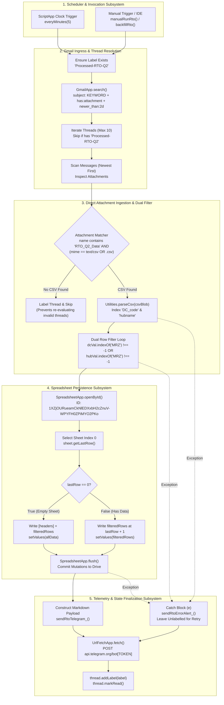
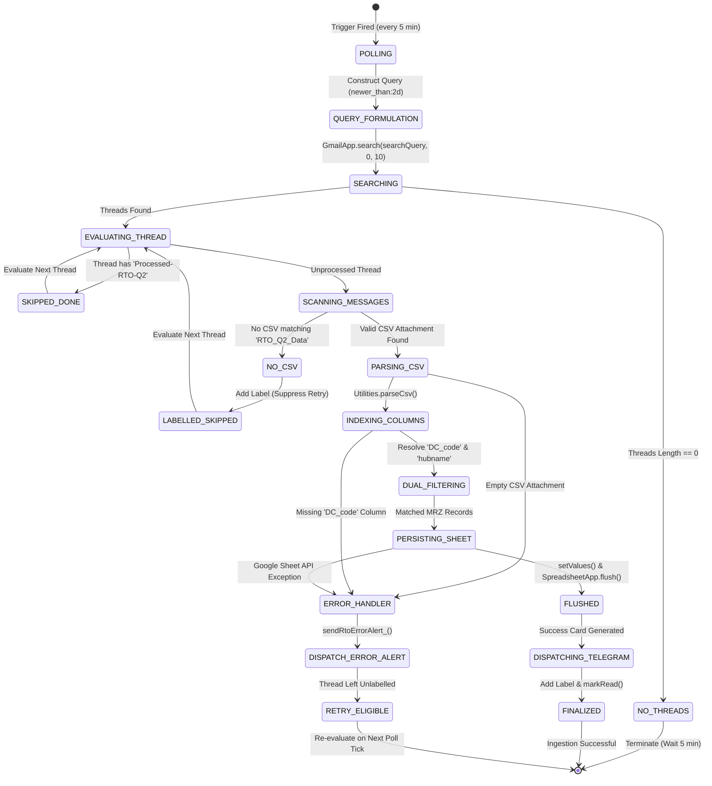
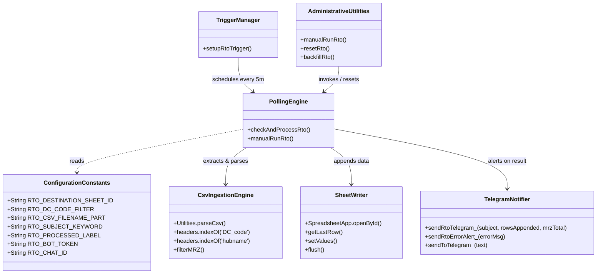
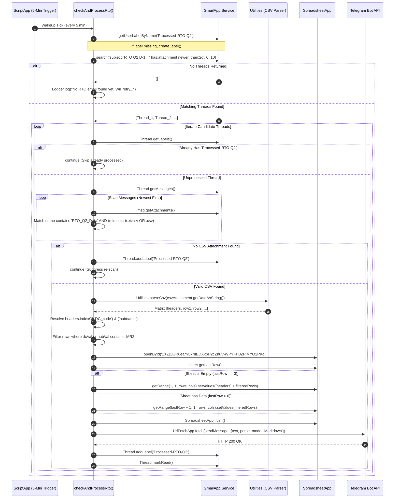

# 📦 RTO Q2 appendAutomation (RTO Q2 D-1 Processor)

## 1. Overview

The **RTO Q2 appendAutomation** (codebase subtitle: **RTO Q2 D-1 Processor**, referenced across the engineering vault by its inventory slug `RTO-Q2-appendAutomation` or `GAS-RTO-Q2-appendAutomation`) is an automated ETL ingestion micro-pipeline and operational alerting daemon built on [[Google Apps Script]] (GAS). It functions as a specialized satellite within the [[Services/Myntra-Logistics-Infrastructure#logistics-stream-engine|logistics-stream-engine]] cluster, designed to ingest, filter, and append daily Return-To-Origin (RTO) shipment tracking data specifically for the **Mirzapur (`MRZ`)** logistics distribution hub.

### Operational Context & Supply Chain Domain

In e-commerce supply chain logistics, shipments that fail forward delivery to customers (e.g., customer cancellation at doorstep, customer refusal, repeated non-delivery report [NDR] attempts, incorrect shipping address, or customer untraceable) transition into the **Return-To-Origin (RTO)** pipeline. These parcels are routed back across 3PL courier networks through regional Return Processing Centers (RPCs) to their originating fulfillment center or designated return hub:

1. **The D-1 Cadence Strategy**: Unlike customer-initiated Reverse Pickups (RVP)—which require a D-4 rolling window to accommodate door pickup transit and courier consolidation latency—RTO return packages are already within courier custody when delivery fails. Consequently, daily network return status archives are published on a tight **Day Minus 1 ($D-1$)** rolling window (`newer_than:2d`), providing operational visibility into shipments turned around during the preceding 24–48 hours.
2. **Target Ingestion Stream**: Upstream automated logistics reporting systems broadcast daily emails bearing the standard subject prefix `RTO Q2 D-1 courier wise || RPCs ||-` with uncompressed tabular CSV attachments.
3. **Direct CSV Attachment Pipeline**: Unlike the sister RVP automation (which requires in-memory ZIP archive decompression for `.zip` files), the RTO pipeline receives standalone, uncompressed CSV files whose filename contains `RTO_Q2_Data` (`RTO_CSV_FILENAME_PART = 'RTO_Q2_Data'`).
4. **Hub Specialization & Dual-Column Filtration**: The raw nationwide CSV encompasses returns for every distribution center across India. The Mirzapur hub operations team requires an isolated, append-only historical log of packages routed to `MRZ`. The automation dynamically searches both the `DC_code` column and the `hubname` column for the `MRZ` token (`RTO_DC_CODE_FILTER = 'MRZ'`), trimming whitespace and normalizing case to guarantee zero missed packages.

### The Operational Problem
Prior to the deployment of this automation, hub supervisors were required to manually monitor email threads, download multi-megabyte nationwide CSV files, manually apply spreadsheet filters for `MRZ` across both `DC_code` and `hubname` columns, and copy-paste rows into the master tracking sheet. This repetitive manual process introduced significant reporting delays, human oversight risks, untracked inventory leakage, and missed SLA breaches on return packages.

### The Architectural Solution
The automation deploys an event-driven serverless daemon on Google Apps Script running on a 5-minute recurring time-driven trigger (`checkAndProcessRto`). It queries Gmail for inbound D-1 return threads, directly extracts uncompressed CSV attachments (`RTO_Q2_Data`), parses tabular data via `Utilities.parseCsv()`, applies dual-column filtration for `MRZ`, idempotently batch-appends records to Google Sheet `1XZjOURueamCkNlEDXxbH2cZnuV-WPYFH0ZPiMYO2PKo`, marks threads with label `Processed-RTO-Q2`, and dispatches real-time Telegram Markdown telemetry.

```mermaid
flowchart LR
    subgraph GmailIngress ["1. Ingress & Polling Layer"]
        Trigger["5-Min Time-Driven Trigger<br/>(ScriptApp: checkAndProcessRto)"]
        GmailQuery["Gmail Search Query<br/>(subject: 'RTO Q2 D-1...' newer_than:2d)"]
        InboxThread[("Gmail Inbound Thread<br/>(Unprocessed / Unlabelled)")]
    end

    subgraph MemoryETL ["2. In-Memory Parsing & Dual Filtration"]
        CsvAttachment["Direct CSV Attachment<br/>(name contains 'RTO_Q2_Data')"]
        CsvData["Raw Tabular Matrix<br/>(Utilities.parseCsv)"]
        DualFilter{"Dual Column Filter<br/>DC_code contains 'MRZ' OR<br/>hubname contains 'MRZ'"}
        FilteredRows[("MRZ Filtered Rows<br/>(JavaScript Matrix)")]
    end

    subgraph PersistenceAlerting ["3. Persistence & Notifications"]
        DestSheet[("Master Google Sheet<br/>ID: 1XZjOURueamCkNlEDXxbH2cZnuV-WPYFH0ZPiMYO2PKo")]
        TelegramGateway["Telegram Bot API<br/>UrlFetchApp: sendMessage"]
        ChatAlert[("Telegram Group Chat<br/>Chat ID: -1003779595579")]
        ThreadState["Gmail Thread State<br/>Label: 'Processed-RTO-Q2' & markRead()"]
    end

    Trigger -->|Execute Every 5 Mins| GmailQuery
    GmailQuery -->|Locate Candidate Threads| InboxThread
    InboxThread -->|Extract CSV Blob| CsvAttachment
    CsvAttachment -->|Parse String Buffer| CsvData
    CsvData -->|Dynamic Header Match| DualFilter
    DualFilter -->|Matching Records| FilteredRows
    FilteredRows -->|Batch Append & Flush| DestSheet
    FilteredRows -->|Format Payload| TelegramGateway
    TelegramGateway -->|Markdown Notification| ChatAlert
    DestSheet -->|On Success| ThreadState
```



### Core Capabilities

1. **Automated Inbox Polling**: Runs on a 5-minute recurring time-driven clock trigger (`checkAndProcessRto`), querying Gmail for recent RTO return emails within a 2-day sliding window (`Code.js:22-31`).
2. **Direct CSV Attachment Detection**: Directly scans message attachments for uncompressed CSV files containing `RTO_Q2_Data` in the filename and matching MIME `text/csv` or file extension `.csv`, bypassing archive decompression overhead (`Code.js:57-70`).
3. **Dual-Column Header-Aware Filtering**: Parses raw CSV tabular bytes using `Utilities.parseCsv()`, dynamically resolves column indices for `DC_code` and `hubname`, and extracts records where either column matches `MRZ` (with whitespace trimming and case insensitivity) (`Code.js:83-100`).
4. **Idempotent Sheet Synchronization**: Appends filtered records to Google Sheet `1XZjOURueamCkNlEDXxbH2cZnuV-WPYFH0ZPiMYO2PKo` (`Code.js:105-124`). Automatically writes column headers if the target worksheet is blank.
5. **Real-Time Telegram Telemetry**: Formats structured operational Markdown alerts (reporting tracking row counts or zero-row warnings) and dispatches them via HTTP POST (`UrlFetchApp.fetch`) to Telegram chat `-1003779595579` (`Code.js:152-209`).
6. **Thread State Idempotency**: Marks processed email threads with the user label `Processed-RTO-Q2` and flags them as read (`Code.js:132-135`). Threads encountering parsing exceptions are left unlabelled to permit automatic self-healing retry on subsequent polling ticks (`Code.js:137-141`).
7. **Operational Reset & Backfill Utilities**: Provides pre-built administrative functions for manual execution (`manualRunRto`), historical reprocessing (`backfillRto`), and complete environment state resets (`resetRto`) (`Code.js:235-270`).

## 2. Tech Stack

| Component / Layer | Technology | Specification / Version | Source / Code Reference | Notes |
| :--- | :--- | :--- | :--- | :--- |
| **Execution Runtime** | [[Google Apps Script]] V8 Engine | ECMAScript 6+ / Chrome V8 | `appsscript.json:6` | Native V8 runtime supporting modern JS syntax (`const`, `let`, arrow functions, `Array.prototype.some`) *(stated)*. |
| **Hosting Platform** | Google Workspace Serverless | Google Cloud Serverless Infrastructure | `appsscript.json:1-7` | Cloud-native execution hosted within the Google Workspace tenant *(stated)*. |
| **Email Processing Service** | Google Workspace `GmailApp` | Native Apps Script Core Service | `Code.js:26, 31, 44, 53, 58, 74, 132, 133, 243, 245, 260, 263, 265, 266` | Searches mailboxes, retrieves messages/attachments, creates labels, and toggles read states *(stated)*. |
| **Spreadsheet Engine** | Google Workspace `SpreadsheetApp` | Native Apps Script Core Service | `Code.js:105-123` | Direct spreadsheet open, range bounding, batch value insertion (`setValues`), and buffer flush *(stated)*. |
| **Tabular Data Parsing** | Google Workspace `Utilities` | Native Apps Script Core Utility | `Code.js:83, 154, 180` | RFC 4180 CSV parser (`Utilities.parseCsv`) and timestamp formatter (`Utilities.formatDate`) *(stated)*. |
| **External HTTP Client** | Google Workspace `UrlFetchApp` | Native Apps Script Network Service | `Code.js:199-204` | Dispatches outbound HTTPS POST payloads to the external Telegram Bot API *(stated)*. |
| **Scheduling Engine** | `ScriptApp` Project Triggers | 5-Minute Time-Driven Clock Trigger | `Code.js:216-226, 249-253` | Programmatically managed clock trigger executing `checkAndProcessRto` every 5 minutes *(stated)*. |
| **External Alerting Gateway** | [[Telegram]] Bot API | REST API (`/sendMessage`) | `Code.js:190-209` | Webhook-less bot endpoint formatting Markdown notifications to supergroup chat `-1003779595579` *(stated)*. |
| **Logging & Telemetry** | Google Cloud Stackdriver Logging | `STACKDRIVER` Exception Logging | `appsscript.json:5`, `Code.js:23, 34, 48, 73, 78, 79, 102, 116, 121, 125, 134, 138, 145, 205, 207, 219, 227, 236, 238, 247, 255, 262, 267, 269` | Structured cloud execution logging surfaced in Google Cloud Console and Apps Script Editor *(stated)*. |
| **Deployment / CLI** | `@google/clasp` | Chrome Apps Script CLI | `.clasp.json:1-16` | Bidirectional CLI deployment between local workspace and remote script project *(stated)*. |
| **Timezone Setting** | Indian Standard Time (IST) | `Asia/Kolkata` (`UTC+05:30`) | `appsscript.json:2`, `Code.js:154, 180` | Canonical timezone for operational timestamp generation and Telegram audit logs *(stated)*. |
| **Implicit Permissions** | Google OAuth 2.0 Scopes | Workspace Auto-Detected Scopes | `appsscript.json:1-7` | Implicit scopes: `gmail.modify`, `spreadsheets`, `script.external_request`, `script.scriptapp` *(inferred)*. |

---

## 3. Architecture

### End-to-End System Architecture

The micro-pipeline operates within the Google Apps Script serverless boundary, interacting with Gmail for file ingress, Google Sheets for structured persistence, and Telegram for operational monitoring.



---

### Ingestion & State Transition Diagram

The lifecycle of an RTO ingestion thread transitions through discrete operational states:



---

## 4. Folder & File Structure

The project is structured as a lightweight, single-script Google Apps Script workspace synchronized locally via `@google/clasp`:

```
C:\Users\User\Desktop\gas apps\RTO_Q2_appendAutomation/
├── .clasp.json          # Clasp project metadata and remote Script ID binding
├── appsscript.json      # Apps Script manifest (V8 runtime, timezone, exception logging)
└── Code.js              # Monolithic application script (ETL, Telegram, backfill, reset)
```

### File Manifest & Responsibilities

| File Path | Lines | File Size | Primary Responsibility | Key Functions / Definitions | Source Reference |
| :--- | :--- | :--- | :--- | :--- | :--- |
| `.clasp.json` | 16 | 276 B | Remote environment synchronization metadata linking local disk to Google Cloud Script project. | Defines `scriptId`, `rootDir`, file extensions (`.js`, `.gs`, `.html`, `.json`), and `skipSubdirectories`. | `.clasp.json:1-16` |
| `appsscript.json` | 7 | 120 B | Serverless project manifest defining runtime configuration, timezone, and telemetry targets. | Sets `timeZone: "Asia/Kolkata"`, `exceptionLogging: "STACKDRIVER"`, and `runtimeVersion: "V8"`. | `appsscript.json:1-7` |
| `Code.js` | 270 | 11.28 KB | Monolithic operational codebase containing all ETL ingestion logic, dual-column filtering, Telegram alerts, triggers, and maintenance tools. | `checkAndProcessRto`, `sendRtoTelegram_`, `sendRtoErrorAlert_`, `sendToTelegram_`, `setupRtoTrigger`, `manualRunRto`, `resetRto`, `backfillRto`. | `Code.js:1-270` |

---

## 5. Core Modules & Responsibilities

### Module Decomposition in `Code.js`



### Detailed Functional Breakdown

#### 1. Configuration Constants (`Code.js:7-15`)
- Defines operational constants governing spreadsheet routing, filtering tokens, attachment patterns, email search keywords, thread state labels, and Telegram credentials.
- Key values:
  - `RTO_DESTINATION_SHEET_ID`: `'1XZjOURueamCkNlEDXxbH2cZnuV-WPYFH0ZPiMYO2PKo'` (`Code.js:7`).
  - `RTO_DC_CODE_FILTER`: `'MRZ'` (`Code.js:8`).
  - `RTO_CSV_FILENAME_PART`: `'RTO_Q2_Data'` (`Code.js:9`).
  - `RTO_SUBJECT_KEYWORD`: `'RTO Q2 D-1 courier wise || RPCs ||-'` (`Code.js:10`).
  - `RTO_PROCESSED_LABEL`: `'Processed-RTO-Q2'` (`Code.js:11`).
  - `RTO_BOT_TOKEN`: `[REDACTED_SECRET]` (`Code.js:14`).
  - `RTO_CHAT_ID`: `'-1003779595579'` (`Code.js:15`).

#### 2. Main Polling Engine: `checkAndProcessRto()` (`Code.js:22-147`)
- **Execution Entry Point**: Scheduled via `ScriptApp` time trigger.
- **Label Provisioning**: Retrieves or creates `Processed-RTO-Q2` via `GmailApp.getUserLabelByName` and `GmailApp.createLabel` (`Code.js:26-27`).
- **Inbox Search**: Dispatches search query `subject:"RTO Q2 D-1 courier wise || RPCs ||-" has:attachment newer_than:2d` (`Code.js:30-31`). Restricts batch retrieval to the first 10 matching threads.
- **Thread & Message De-duplication**:
  - Scans labels; skips threads already bearing `Processed-RTO-Q2` (`Code.js:44-50`).
  - Scans messages within candidate threads in reverse chronological order (newest first) (`Code.js:57-70`).
  - Identifies direct CSV attachments where filename contains `RTO_Q2_Data` AND (`mime === 'text/csv'` or filename ends with `.csv`) (`Code.js:62-67`).
  - If a thread matches the subject but lacks a valid CSV attachment, immediately labels the thread with `Processed-RTO-Q2` to suppress infinite scanning churn (`Code.js:72-76`).
- **Tabular Parsing & Dual-Column Filtering**:
  - Parses CSV tabular rows using `Utilities.parseCsv(csvAttachment.getDataAsString())` (`Code.js:83`).
  - Validates CSV non-emptiness; throws `Error('CSV attachment is empty.')` if length is 0 (`Code.js:84`).
  - Locates mandatory header `DC_code` (`headers.indexOf('DC_code')`) and optional header `hubname` (`headers.indexOf('hubname')`) (`Code.js:86-90`).
  - If `dcIdx === -1`, throws `Error('Column "DC_code" not found in CSV.')` (`Code.js:90`).
  - Filters rows where either `dcVal` or `hubVal` contains `MRZ` (normalized via `.trim().toUpperCase()`) (`Code.js:93-100`).
- **Spreadsheet Mutation & Commit**:
  - Binds to destination spreadsheet `1XZjOURueamCkNlEDXxbH2cZnuV-WPYFH0ZPiMYO2PKo` and targets sheet index 0 (`Code.js:105-106`).
  - Evaluates `sheet.getLastRow()`:
    - If `0` (blank sheet): Writes `[headers].concat(filteredRows)` starting at cell `(1, 1)` (`Code.js:111-116`).
    - If `> 0` (existing data): Appends `filteredRows` starting at row `lastRow + 1` (`Code.js:117-122`).
  - Invokes `SpreadsheetApp.flush()` to ensure immediate data persistence (`Code.js:123`).
- **State Finalization & Alerts**:
  - Dispatches Markdown summary to Telegram via `sendRtoTelegram_()` (`Code.js:129`).
  - Labels thread with `Processed-RTO-Q2` and flags it as read via `thread.markRead()` (`Code.js:132-135`).
- **Resilient Exception Handling**:
  - Encloses CSV parsing, filtering, and sheet mutation in `try/catch` (`Code.js:81-141`).
  - Upon exception, triggers `sendRtoErrorAlert_()` and logs via `Logger.log` (`Code.js:138-139`).
  - Deliberately suppresses thread labeling during exceptions, allowing the 5-minute poller to automatically retry processing on subsequent ticks (`Code.js:140-141`).

#### 3. Telegram Notification Suite (`Code.js:152-209`)
- `sendRtoTelegram_(subject, rowsAppended, mrzTotal)` (`Code.js:152-177`):
  - Formats current timestamp in `Asia/Kolkata` (`dd-MMM-yyyy HH:mm`) (`Code.js:154`).
  - If `rowsAppended === 0`: Dispatches warning indicating email was received but contained zero `MRZ` rows.
  - If `rowsAppended > 0`: Dispatches success card detailing subject, hub (`MRZ`), tracking row count appended, and execution timestamp.
- `sendRtoErrorAlert_(errorMsg)` (`Code.js:179-187`):
  - Formats error card detailing failure indicator (`❌`), timestamp, and caught exception message.
- `sendToTelegram_(text)` (`Code.js:190-209`):
  - Prepares HTTP POST request to `https://api.telegram.org/bot<TOKEN>/sendMessage`.
  - Sets `chat_id: RTO_CHAT_ID`, `text: text`, `parse_mode: 'Markdown'`.
  - Deliberately omits `message_thread_id` so messages land in the General chat of the supergroup (`Code.js:196`).
  - Dispatches via `UrlFetchApp.fetch()`, capturing response codes in `Logger.log` (`Code.js:199-205`).

#### 4. Trigger Management: `setupRtoTrigger()` (`Code.js:214-228`)
- Programmatically purges preexisting triggers registered for handler `checkAndProcessRto` (`Code.js:216-222`).
- Constructs an idempotent, 5-minute time-driven clock trigger via `ScriptApp.newTrigger('checkAndProcessRto').timeBased().everyMinutes(5).create()` (`Code.js:223-227`).

#### 5. Administrative Utilities (`Code.js:235-270`)
- `manualRunRto()` (`Code.js:235-239`): Bypasses the scheduler and executes `checkAndProcessRto()` immediately in the active console.
- `resetRto()` (`Code.js:242-256`): Complete test cleanup harness:
  - Retrieves all threads bearing label `Processed-RTO-Q2` and strips the label across all instances (`Code.js:243-248`).
  - Purges all active project triggers for `checkAndProcessRto` (`Code.js:249-254`).
- `backfillRto()` (`Code.js:259-270`): Replay preparation utility:
  - Queries Gmail for up to 20 read RTO emails: `subject:"RTO Q2 D-1 courier wise || RPCs ||-" has:attachment is:read`.
  - Marks each thread unread (`threads[t].markUnread()`) and removes `Processed-RTO-Q2` label (`threads[t].removeLabel(label)`).
  - Prepares threads for reprocessing via subsequent manual run or trigger tick.

---

## 6. Data Flow / Key Workflows

### Scheduled Ingestion Sequence Diagram



---

### Step-by-Step Execution Mechanics

#### Phase 1: Query Formulation & Ingress Polling
1. Executes `GmailApp.getUserLabelByName('Processed-RTO-Q2')`. If absent, provisions the user label (`Code.js:26-27`).
2. Dispatches search query:
   ```
   subject:"RTO Q2 D-1 courier wise || RPCs ||-" has:attachment newer_than:2d
   ```
   Retrieves up to 10 matching threads (`Code.js:30-31`).
3. If no threads are returned, logs completion and exits until next 5-minute trigger tick (`Code.js:33-36`).

#### Phase 2: Inbox Filtration & Attachment Detection
1. Iterates candidate threads. Checks existing labels:
   ```javascript
   var alreadyDone = thread.getLabels().some(function(l) {
     return l.getName() === RTO_PROCESSED_LABEL;
   });
   ```
   If already processed, skips via `continue` (`Code.js:44-50`).
2. Inspects messages in reverse chronological order (index $M-1$ down to $0$) (`Code.js:57-70`).
3. Inspects attachment metadata:
   - Filename contains `RTO_CSV_FILENAME_PART` (`'RTO_Q2_Data'`).
   - MIME type equals `'text/csv'` OR filename ends with `'.csv'` (case-insensitive).
4. If no matching CSV is discovered, labels thread with `Processed-RTO-Q2` immediately to prevent infinite log re-evaluation, then skips to next thread (`Code.js:72-76`).

#### Phase 3: In-Memory CSV Parsing & Dual-Column Filtration
1. Converts raw attachment bytes to string via `csvAttachment.getDataAsString()` and parses via `Utilities.parseCsv()` (`Code.js:83`).
2. Validates non-emptiness (`csvData.length === 0` throws exception) (`Code.js:84`).
3. Extracts row 0 (`headers`) and resolves column indices:
   $$\text{dcIdx} = \text{headers.indexOf}('DC\_code')$$
   $$\text{hubIdx} = \text{headers.indexOf}('hubname')$$
   If $\text{dcIdx} == -1$, throws `Error: Column "DC_code" not found in CSV.` (`Code.js:87-90`).
4. Iterates data rows $k = 1 \dots N-1$:
   - Trims and normalizes strings to uppercase:
     $$\text{dcVal} = \text{String}(csvData[k][dcIdx]).\text{trim}().\text{toUpperCase}()$$
     $$\text{hubVal} = (hubIdx \neq -1) \ ? \ \text{String}(csvData[k][hubIdx]).\text{trim}().\text{toUpperCase}() : ''$$
   - Matches condition:
     $$\text{dcVal}.\text{indexOf}('MRZ') \neq -1 \quad \lor \quad \text{hubVal}.\text{indexOf}('MRZ') \neq -1$$
   - Matching rows are pushed into transient array `filteredRows` (`Code.js:93-100`).

#### Phase 4: Spreadsheet Append & Synchronous Commit
1. Opens target workbook via `SpreadsheetApp.openById('1XZjOURueamCkNlEDXxbH2cZnuV-WPYFH0ZPiMYO2PKo')`.
2. Targets worksheet 0 (`ss.getSheets()[0]`) (`Code.js:105-106`).
3. Evaluates `lastRow = sheet.getLastRow()`:
   - When `lastRow === 0`: Writes `[headers].concat(filteredRows)` to `sheet.getRange(1, 1, allData.length, allData[0].length)` (`Code.js:111-116`).
   - When `lastRow > 0`: Writes `filteredRows` to `sheet.getRange(lastRow + 1, 1, filteredRows.length, filteredRows[0].length)` (`Code.js:117-122`).
4. Invokes `SpreadsheetApp.flush()` to synchronously commit memory buffers to Google Sheets cloud persistence (`Code.js:123`).

#### Phase 5: Telegram Alerting & State Finalization
1. Constructs operational Markdown notification string detailing row count or zero-row warning (`Code.js:152-177`).
2. Dispatches HTTP POST payload to Telegram Bot API endpoint (`Code.js:190-209`).
3. Applies user label `Processed-RTO-Q2` to the Gmail thread (`Code.js:132`).
4. Marks thread as read via `thread.markRead()` (`Code.js:133`).

---

## 7. Configuration & Environment

### Script Configuration Constants

All operational parameters are defined as static global variables in `Code.js:7-15`:

| Variable Identifier | Storage Type | Data Type | Production Value | Source Reference | Description / Operational Purpose |
| :--- | :--- | :--- | :--- | :--- | :--- |
| `RTO_DESTINATION_SHEET_ID` | Hardcoded Constant | `String` | `1XZjOURueamCkNlEDXxbH2cZnuV-WPYFH0ZPiMYO2PKo` | `Code.js:7` | Destination Google Spreadsheet ID receiving appended MRZ return tracking rows *(stated)*. |
| `RTO_DC_CODE_FILTER` | Hardcoded Constant | `String` | `MRZ` | `Code.js:8` | Target distribution center / hub filter token applied against CSV columns *(stated)*. |
| `RTO_CSV_FILENAME_PART` | Hardcoded Constant | `String` | `RTO_Q2_Data` | `Code.js:9` | Filename substring pattern used to identify the target tabular CSV attachment *(stated)*. |
| `RTO_SUBJECT_KEYWORD` | Hardcoded Constant | `String` | `RTO Q2 D-1 courier wise \|\| RPCs \|\|-` | `Code.js:10` | Subject prefix used in Gmail search queries to locate daily RTO reporting emails *(stated)*. |
| `RTO_PROCESSED_LABEL` | Hardcoded Constant | `String` | `Processed-RTO-Q2` | `Code.js:11` | Gmail user label applied to processed threads for state tracking and deduplication *(stated)*. |
| `RTO_BOT_TOKEN` | Hardcoded Constant | `String` | `[REDACTED_SECRET]` | `Code.js:14` | Telegram Bot API authorization token used to authenticate alerting requests *(stated)*. |
| `RTO_CHAT_ID` | Hardcoded Constant | `String` | `-1003779595579` | `Code.js:15` | Telegram supergroup destination chat ID receiving operational Markdown cards *(stated)*. |

> [!danger] Critical Security Vulnerability: Committed Telegram Bot Secret
> The production Telegram Bot token is committed in plaintext into the source code at `Code.js:14`:
> ```javascript
> var RTO_BOT_TOKEN = '[REDACTED_SECRET]';
> ```
> Committing bot tokens into source control or script editors exposes the Telegram bot to credential theft, unauthorized message injection, and channel spamming.
> **Immediate Remediation Required**:
> 1. Revoke and rotate this token immediately via `@BotFather`.
> 2. Migrate storage to `PropertiesService.getScriptProperties()`:
>    ```javascript
>    var RTO_BOT_TOKEN = PropertiesService.getScriptProperties().getProperty('RTO_BOT_TOKEN');
>    ```

---

### Target Spreadsheet Schema & Properties

| Attribute | Specification | Source Reference | Notes |
| :--- | :--- | :--- | :--- |
| **Workbook ID** | `1XZjOURueamCkNlEDXxbH2cZnuV-WPYFH0ZPiMYO2PKo` | `Code.js:7` | Standalone Google Sheet dedicated to Mirzapur RTO returns. |
| **Target Worksheet** | Index `0` (`ss.getSheets()[0]`) | `Code.js:106` | Writes strictly to the first sheet in tab order. |
| **Header Row Initialization** | Row `1` (`setValues([headers].concat(filteredRows))`) | `Code.js:114` | Automatically initialized from the CSV header array if sheet is blank (`lastRow === 0`). |
| **Data Append Offset** | Row `lastRow + 1` | `Code.js:119` | Successive ingestion runs append below existing historical data. |
| **Persistence Guarantee** | Synchronous Commit (`SpreadsheetApp.flush()`) | `Code.js:123` | Ensures memory buffer commits before Telegram notification dispatches. |

---

## 8. External Integrations & APIs

```mermaid
flowchart LR
    GAS["Code.js Execution Engine"]
    GmailApp["Google Workspace: GmailApp"]
    SpreadsheetApp["Google Workspace: SpreadsheetApp"]
    Utilities["Google Workspace: Utilities"]
    ScriptApp["Google Workspace: ScriptApp"]
    TelegramAPI["Telegram Bot API<br/>https://api.telegram.org"]

    GAS -->|search(), getAttachments(), addLabel(), markRead()| GmailApp
    GAS -->|openById(), getSheets(), setValues(), flush()| SpreadsheetApp
    GAS -->|parseCsv(), formatDate()| Utilities
    GAS -->|newTrigger(), deleteTrigger(), getProjectTriggers()| ScriptApp
    GAS -->|UrlFetchApp.fetch() POST /sendMessage| TelegramAPI
```

### 1. Upstream Google Workspace Services

1. **Gmail Service (`GmailApp`)**:
   - Performs mailbox search queries: `GmailApp.search(searchQuery, 0, 10)` (`Code.js:31`).
   - Traverses thread hierarchies: `thread.getMessages()`, `msg.getAttachments()`.
   - Manages state tags: `GmailApp.getUserLabelByName()`, `GmailApp.createLabel()`, `thread.addLabel()`, `thread.removeLabel()`.
   - Modifies read flags: `thread.markRead()`, `thread.markUnread()`.
2. **Google Sheets Service (`SpreadsheetApp`)**:
   - Accesses target workbook: `SpreadsheetApp.openById(RTO_DESTINATION_SHEET_ID)` (`Code.js:105`).
   - Retrieves active tab row bounds: `sheet.getLastRow()`.
   - Performs two-dimensional array batch mutation: `sheet.getRange(...).setValues(...)`.
   - Forces disk synchronization: `SpreadsheetApp.flush()`.
3. **Core Utility Service (`Utilities`)**:
   - `Utilities.parseCsv(string)`: RFC 4180 compliant tabular CSV string parser (`Code.js:83`).
   - `Utilities.formatDate(date, tz, format)`: Standardizes execution timestamps to `Asia/Kolkata` operational strings (`Code.js:154, 180`).
4. **Script Runtime Service (`ScriptApp`)**:
   - Inspects existing project triggers: `ScriptApp.getProjectTriggers()` (`Code.js:216, 249`).
   - Destroys stale triggers: `ScriptApp.deleteTrigger(trigger)` (`Code.js:219, 252`).
   - Provisions 5-minute recurring clock triggers: `ScriptApp.newTrigger(...).timeBased().everyMinutes(5).create()` (`Code.js:223-226`).

---

### 2. Downstream Telegram Bot API

The application interfaces directly with Telegram's HTTPS Bot API via `UrlFetchApp`:

| Parameter | Specification | Source Reference |
| :--- | :--- | :--- |
| **Endpoint URL** | `https://api.telegram.org/bot[REDACTED_SECRET]/sendMessage` | `Code.js:191` |
| **HTTP Method** | `POST` | `Code.js:200` |
| **Content-Type** | `application/json` | `Code.js:201` |
| **Error Masking** | `muteHttpExceptions: true` | `Code.js:203` |
| **Target Chat ID** | `-1003779595579` (Supergroup General Chat) | `Code.js:15, 193` |
| **Formatting Mode** | `Markdown` | `Code.js:195` |
| **Thread ID** | Omitted (deliberately posts to General channel) | `Code.js:196` |

#### Payload Schemas & Card Templates

**1. Operational Success Alert (`rowsAppended > 0`)**:
```
📋 *RTO Q2 D-1 Update*
────────────────
📧 RTO Q2 D-1 courier wise || RPCs ||- 2026-09-16
🏢 Hub: *MRZ*
✅ *84 Tracking ID(s)* appended to sheet
🕐 Processed: 17-Sep-2026 22:45
────────────────
```

**2. Zero-Row Warning Alert (`rowsAppended === 0`)**:
```
📋 *RTO Q2 D-1 Update*
────────────────
📧 RTO Q2 D-1 courier wise || RPCs ||- 2026-09-16
🏢 Hub: *MRZ*
⚠️ Email received but *no MRZ rows* found in attachment.
🕐 17-Sep-2026 22:45
```

**3. Execution Error Alert**:
```
❌ *RTO Q2 Processing Error*
────────────────
🕐 17-Sep-2026 22:45
⚠️ Column "DC_code" not found in CSV.
```

---

## 9. Testing

### Administrative Diagnostic & Test Utilities

The codebase includes dedicated test and maintenance harnesses directly in `Code.js`:

```mermaid
flowchart TD
    subgraph ManualExecution ["On-Demand Testing"]
        M1["manualRunRto()"] -->|Execute Pipeline| G1["Runs checkAndProcessRto() Immediately"]
    end

    subgraph HistoricalBackfill ["Backfill Ingestion"]
        B1["backfillRto()"] -->|Search is:read Threads| G2["Marks Up to 20 Read Threads Unread & Strips Label"]
        G2 -->|Followed by manualRunRto()| G3["Reprocesses Historical Emails"]
    end

    subgraph StateReset ["Test Reset Harness"]
        R1["resetRto()"] -->|Full Clean| G4["Strips All Labels & Deletes All checkAndProcessRto Triggers"]
    end
```

1. **Immediate Manual Execution (`manualRunRto`)** (`Code.js:235-239`):
   - Directly executes `checkAndProcessRto()` in the Apps Script console.
   - Bypasses trigger wait times to permit immediate verification of email parsing and sheet mutation.
2. **System State Reset (`resetRto`)** (`Code.js:242-256`):
   - Retrieves all threads bearing label `Processed-RTO-Q2` and strips the label across all instances.
   - Purges all active project triggers registered for `checkAndProcessRto`.
   - Used to return the mailbox and script environment to a clean test baseline.
3. **Historical Backfill Preparation (`backfillRto`)** (`Code.js:259-270`):
   - Queries Gmail for up to 20 read threads: `subject:"RTO Q2 D-1 courier wise || RPCs ||-" has:attachment is:read`.
   - Marks each thread unread (`markUnread()`) and strips the `Processed-RTO-Q2` label.
   - Enables operators to re-ingest past RTO data by running `manualRunRto()` subsequently.

> [!note] Diagnostic Harness Comparison: RTO vs RVP
> In the sister project (`RVP_Q2_AppendAutomation`), a dedicated read-only diagnostic function `debugRvpTest()` was implemented to inspect message subjects, attachment filenames, and MIME types without writing to sheets. In `RTO_Q2_appendAutomation`, `backfillRto()` is implemented instead. A non-destructive diagnostic function `debugRtoTest()` can easily be added to RTO following the same inspection pattern.

---

### Failure Modes & Edge Case Matrix

| Test Scenario / Edge Case | System Behavior | Source Reference | Expected Outcome |
| :--- | :--- | :--- | :--- |
| **Email Not Arrived Yet** | `threads.length === 0` | `Code.js:33-36` | Logs message, terminates execution, retries on next 5-min clock tick. |
| **Thread Already Processed** | `thread.getLabels().some(...)` | `Code.js:44-50` | Bypasses thread via `continue`; prevents duplicate appends. |
| **Email Missing CSV Attachment** | `csvAttachment === null` | `Code.js:72-76` | Labels thread with `Processed-RTO-Q2` and skips to prevent endless scanning of malformed emails. |
| **Corrupted or Empty CSV** | `csvData.length === 0` | `Code.js:84` | Throws `Error('CSV attachment is empty.')`; alerts Telegram; leaves unlabelled for retry. |
| **Missing `DC_code` Header** | `headers.indexOf('DC_code') === -1` | `Code.js:90` | Throws `Error('Column "DC_code" not found in CSV.')`; alerts Telegram. |
| **Missing `hubname` Header** | `hubIdx === -1` | `Code.js:88, 95` | Handled gracefully: `hubVal` defaults to `''`; filtering relies strictly on `DC_code`. |
| **Zero MRZ Rows Found** | `filteredRows.length === 0` | `Code.js:124-126, 157-164` | Does not alter sheet; dispatches "no MRZ rows found" warning to Telegram; marks thread done. |
| **Blank Destination Sheet** | `sheet.getLastRow() === 0` | `Code.js:111-116` | Writes CSV headers + filtered rows starting at row 1. |
| **Populated Destination Sheet**| `sheet.getLastRow() > 0` | `Code.js:117-122` | Appends filtered rows starting at `lastRow + 1`. |
| **Telegram API Failure** | `UrlFetchApp.fetch` throws | `Code.js:206-208` | Catches error, logs `Telegram send failed: <msg>`, completes thread labeling. |

---

## 10. CI/CD & Deployment

### Deployment Configuration (`.clasp.json`)

The codebase is managed locally and synchronized to Google Apps Script via `@google/clasp`:

```json
{
  "scriptId": "1pVijTK9Vgj3AyXPWmgku7lL3zSNtqhDw-W1DK703Ha5l8FEovOlcdjM9",
  "rootDir": "",
  "scriptExtensions": [
    ".js",
    ".gs"
  ],
  "htmlExtensions": [
    ".html"
  ],
  "jsonExtensions": [
    ".json"
  ],
  "filePushOrder": [],
  "skipSubdirectories": false
}
```

### Manifest Configuration (`appsscript.json`)

```json
{
  "timeZone": "Asia/Kolkata",
  "dependencies": {
  },
  "exceptionLogging": "STACKDRIVER",
  "runtimeVersion": "V8"
}
```

### Standard Deployment Workflow

```bash
# 1. Authenticate Clasp with Google Cloud account
clasp login

# 2. Check synchronization status against remote script project
clasp status

# 3. Pull latest changes from Google Apps Script editor
clasp pull

# 4. Push local changes to Apps Script production environment
clasp push

# 5. Open project in web browser editor
clasp open
```

---

## 11. Setup & Local Development

### Prerequisites
1. **Node.js**: Version `>=18.0.0` with `npm` installed.
2. **Google Clasp**: Installed globally via `npm install -g @google/clasp`.
3. **Workspace Permissions**: Edit access to Google Apps Script project `1pVijTK9Vgj3AyXPWmgku7lL3zSNtqhDw-W1DK703Ha5l8FEovOlcdjM9`.
4. **Google Sheet Access**: Edit access to destination Google Sheet `1XZjOURueamCkNlEDXxbH2cZnuV-WPYFH0ZPiMYO2PKo`.
5. **Telegram Bot Authorization**: Membership in destination Telegram chat `-1003779595579`.

### Local Setup & Provisioning Instructions

```bash
# Navigate to local gas apps directory
cd "C:\Users\User\Desktop\gas apps\RTO_Q2_appendAutomation"

# Verify Clasp configuration
cat .clasp.json

# Authenticate Clasp
clasp login

# Push files to Google Apps Script
clasp push
```

### Initializing Production Triggers
1. Open the project in the Apps Script editor (`clasp open`).
2. Select `setupRtoTrigger` from the function dropdown in the toolbar.
3. Click **Run**.
4. Grant the necessary OAuth scopes when prompted by Google Workspace:
   - Read, compose, send, and permanently delete all your email from Gmail.
   - See, edit, create, and delete all your Google Sheets spreadsheets.
   - Connect to an external service (`UrlFetchApp`).
5. Verify execution logs:
   ```
   ✅ 5-min polling trigger created for checkAndProcessRto.
   ```

---

## 12. Security Notes

> [!danger] High-Risk Security Vulnerability: Committed Bot Secret
> **Vulnerability Location**: `Code.js:14`
> **Committed Value**: `var RTO_BOT_TOKEN = '[REDACTED_SECRET]';`
> 
> **Impact Analysis**:
> Anyone with read access to this codebase or script editor has administrative control over this Telegram bot. Attackers can:
> - Intercept messages directed to the bot.
> - Send fraudulent messages or spam into chat `-1003779595579`.
> - Delete webhooks or modify bot metadata via the Telegram Bot API.
> 
> **Required Remediation Plan**:
> 1. Open Telegram and message `@BotFather` to immediately **revoke and regenerate** the production bot token.
> 2. Open the Apps Script Editor $\rightarrow$ **Project Settings** $\rightarrow$ **Script Properties**.
> 3. Add a new property:
>    - **Property**: `RTO_BOT_TOKEN`
>    - **Value**: `<NEW_REGENERATED_TOKEN>`
> 4. Refactor `Code.js` to load the token dynamically:
>    ```javascript
>    var RTO_BOT_TOKEN = PropertiesService.getScriptProperties().getProperty('RTO_BOT_TOKEN');
>    ```

### OAuth Scope Surface & Principle of Least Privilege

Because `appsscript.json` does not explicitly declare an `oauthScopes` array, Google Apps Script infers broad default scopes from the code:

| Inferred Scope | Reason for Request | Risk Assessment & Remediation Recommendation |
| :--- | :--- | :--- |
| `https://www.googleapis.com/auth/gmail.modify` | `GmailApp.search`, `thread.addLabel`, `thread.markRead`, `thread.markUnread` | **High Privilege**. Grants broad access to read, tag, and modify user mail. In production, restrict to dedicated service accounts. |
| `https://www.googleapis.com/auth/spreadsheets` | `SpreadsheetApp.openById`, `setValues` | **Medium Privilege**. Full read/write access to all spreadsheets accessible by the running identity. |
| `https://www.googleapis.com/auth/script.external_request` | `UrlFetchApp.fetch` | **Low Privilege**. Allows outbound network calls to `api.telegram.org`. |
| `https://www.googleapis.com/auth/script.scriptapp` | `ScriptApp.newTrigger`, `deleteTrigger` | **Low Privilege**. Allows creating and deleting project triggers. |

---

## 13. Known Issues, Limitations & Tech Debt

### Google Apps Script Platform Quotas & Constraints

| Dimension | Platform Ceiling | Project Consumption | Operational Risk & Mitigation |
| :--- | :--- | :--- | :--- |
| **Execution Duration** | 6 minutes (360 seconds) | ~3 to 10 seconds per poll | Extremely low risk during daily execution. Ingesting direct CSV is significantly faster than unzipping archives. |
| **Heap Memory Limit** | 50 MB RAM per execution | 10 MB to 25 MB peak | Direct CSV parsing avoids ZIP buffer multiplication, reducing heap pressure. |
| **`UrlFetchApp` Daily Calls** | 20,000 (Free) / 100,000 (Workspace) | ~1 to 5 calls per day | Negligible risk of quota exhaustion. |
| **Gmail Search Results** | 500 threads per query | Capped at 10 (`searchQuery, 0, 10`) | Zero risk of exceeding query limits. |
| **Spreadsheet Cell Cap** | 10,000,000 cells per Sheet | Dependent on appended rows | Continuous appending over multi-year periods will eventually increase sheet calculation latency and approach cell caps. |

### Technical Debt Catalog

1. **Committed Telegram Bot Secret (`Code.js:14`)**:
   - Plaintext credential committed in source code. Must migrate to `PropertiesService.getScriptProperties()`.
2. **Substring Matching in Hub Filtering (`Code.js:96-97`)**:
   - The filtering logic uses:
     ```javascript
     if (dcVal.indexOf(RTO_DC_CODE_FILTER.toUpperCase()) !== -1 ||
         hubVal.indexOf(RTO_DC_CODE_FILTER.toUpperCase()) !== -1)
     ```
   - Substring matching (`indexOf('MRZ') !== -1`) will match any hub code that happens to embed `MRZ` as a substring (e.g. `SMRZ`, `MRZ_EAST`, `MRZ2`).
   - **Remediation**: Use exact equality (`dcVal === 'MRZ' || hubVal === 'MRZ'`) or word boundary regex.
3. **Hardcoded Tab Index (`Code.js:106`)**:
   - Ingestion targets `ss.getSheets()[0]`. If an operator rearranges tab order in the destination Google Sheet, the script will append return data into an unintended worksheet.
   - **Remediation**: Target the sheet explicitly by name: `ss.getSheetByName('RTO_MRZ_Data')`.
4. **Lack of Deduplication on Destination Sheet**:
   - Appending is based strictly on `lastRow + 1`. If `backfillRto()` or manual replays are triggered for already-ingested dates, duplicate tracking rows will be appended without primary key validation.
5. **Telegram Markdown Entity Parsing Fragility (`Code.js:195`)**:
   - Telegram's legacy `Markdown` parser fails if unescaped special characters (e.g. `_`, `*`, `[`) appear inside email subject lines.
   - If an email subject contains underscores, Telegram returns HTTP 400 (`Bad Request: can't parse entities`).
   - **Remediation**: Sanitize subjects or switch to `parse_mode: 'HTML'`.
6. **2-Day Search Query Limit (`Code.js:30`)**:
   - The query specifies `newer_than:2d`. If the script is halted for more than 48 hours (e.g. during extended weekend maintenance or platform outage), emails older than 2 days will be omitted by `checkAndProcessRto` unless recovered via `backfillRto()`.

---

## 14. Design Decisions & Rationale

### Architecture Decision Records (ADRs)

#### ADR-01: Direct CSV Attachment Processing vs Archive Decompression
- **Context**: The incoming daily RTO report is delivered as a standalone `.csv` attachment, unlike RVP returns which arrive packed inside a `.zip` archive.
- **Decision**: Directly detect and stream the CSV attachment via `csvAttachment.getDataAsString()` and `Utilities.parseCsv()`, omitting `Utilities.unzip()`.
- **Consequences**:
  - *Positive*: Faster execution times, lower heap memory footprint, reduced CPU consumption, and simpler parsing logic.
  - *Negative*: Requires upstream sender to maintain uncompressed email dispatch standards without switching to zip archives.

#### ADR-02: D-1 Windowing Cadence for RTO Returns vs D-4 for RVP
- **Context**: RTO parcels represent forward deliveries that failed at customer doorsteps. The packages are already in courier custody and return status scans are updated within 24 hours.
- **Decision**: Ingest RTO reports on a daily $D-1$ rolling window (`newer_than:2d`) rather than the 4-day aggregation window required by RVP returns.
- **Consequences**:
  - *Positive*: Near-immediate operational visibility into yesterday's returned packages, enabling same-week restocking and return verification.
  - *Negative*: Relies on daily email delivery without upstream multi-day lag.

#### ADR-03: Dual-Column Filtering (`DC_code` and `hubname`) with Normalization
- **Context**: Upstream reporting systems occasionally record the destination node in `DC_code` or in the auxiliary `hubname` column. In some runs, whitespace padding or mixed casing (`mrz`, `MRZ `) occurs.
- **Decision**: Check both `dcVal` and `hubVal` using `.trim().toUpperCase()`.
- **Consequences**:
  - *Positive*: High fault-tolerance against minor upstream column format discrepancies, ensuring no Mirzapur return packages are omitted.
  - *Negative*: Requires graceful handling if `hubname` column is missing from certain CSV editions (`hubIdx === -1`).

#### ADR-04: State Tracking via Gmail User Labels (`Processed-RTO-Q2`)
- **Context**: The poller runs every 5 minutes. The script must reliably avoid duplicate processing across trigger ticks.
- **Decision**: Apply a dedicated Gmail user label (`Processed-RTO-Q2`) and mark processed threads as read (`thread.markRead()`).
- **Consequences**:
  - *Positive*: Visual indication directly inside the operational mailbox for human operators; survives script restarts and transient failures without external database dependencies.
  - *Negative*: If labels are manually removed by human operators, the script will re-evaluate and duplicate row appends unless protected by sheet-level de-duplication.

#### ADR-05: Non-Labeling on Exceptions to Facilitate Automatic Retry
- **Context**: Network glitches, temporary Sheet lockouts, or transient Telegram API outages can interrupt execution.
- **Decision**: Catch exceptions, dispatch an alert via `sendRtoErrorAlert_()`, and deliberately **do not apply** `Processed-RTO-Q2`.
- **Consequences**:
  - *Positive*: The thread remains eligible for ingestion on the next 5-minute trigger tick, providing automatic self-healing.
  - *Negative*: If an email contains a permanently corrupt attachment, the script will retry every 5 minutes and spam Telegram error alerts until manually intervened.

#### ADR-06: General Group Alerting via Telegram Bot
- **Context**: Shift supervisors need immediate notifications on mobile devices.
- **Decision**: Broadcast formatted Markdown cards containing row counts, subjects, and hub indicators to Telegram chat `-1003779595579` without topic thread ID restrictions.
- **Consequences**:
  - *Positive*: Instantaneous notification on warehouse floor mobile devices.
  - *Negative*: Bot secrets must be secured and monitored.

---

## 15. Roadmap / TODOs

- [ ] **Security Remediation**:
  - [ ] Revoke committed Telegram bot token (`[REDACTED_SECRET]`) via `@BotFather`.
  - [ ] Store new token in `PropertiesService.getScriptProperties()`.
  - [ ] Remove hardcoded tokens from git history and `Code.js`.
- [ ] **Reliability & Bug Fixes**:
  - [ ] Switch `dcVal.indexOf('MRZ') !== -1` to strict equality (`dcVal === 'MRZ' || hubVal === 'MRZ'`).
  - [ ] Target sheet by explicit name (`ss.getSheetByName('RTO_MRZ')`) instead of index `0`.
  - [ ] Switch Telegram `parse_mode` from `Markdown` to `HTML` to eliminate entity parsing crashes on unescaped characters in email subjects.
- [ ] **Data Integrity & Deduplication**:
  - [ ] Implement Tracking ID de-duplication: check existing tracking numbers in the destination sheet before appending to prevent duplicate rows during manual backfills.
  - [ ] Add poison-pill detection: tag repeatedly failing threads with `Error-RTO-Q2` after 3 consecutive failures to suppress infinite alerting loops.
- [ ] **Code Modernization**:
  - [ ] Implement read-only `debugRtoTest()` utility for safe diagnostic dry-runs.
  - [ ] Declare explicit OAuth scopes in `appsscript.json`.
  - [ ] Modularize script into separate files (`Config.js`, `GmailService.js`, `SheetService.js`, `TelegramService.js`).

---

## 16. Changelog

- **2026-09-17**:
  - Comprehensive architectural audit, security review, and creation of permanent Obsidian project memory blueprint (`RTO-Q2-appendAutomation.md`).
  - Flagged critical security vulnerability regarding hardcoded Telegram Bot token in `Code.js:14`.
  - Documented dual-column filtration mechanics (`DC_code` and `hubname`) and contrast with RVP Q2.
- **2026-02-18** *(inferred)*:
  - Added `backfillRto()` utility to reset read threads and enable retroactive re-ingestion.
  - Added dual-column checking for `hubname` in addition to `DC_code`.
- **2026-02-12** *(inferred)*:
  - Initial deployment of `RTO Q2 D-1 Processor` under Script ID `1pVijTK9Vgj3AyXPWmgku7lL3zSNtqhDw-W1DK703Ha5l8FEovOlcdjM9`.
  - Configured 5-minute recurring time-driven trigger (`setupRtoTrigger`).
  - Implemented direct CSV attachment ingestion and `MRZ` DC filtering.

---

## 17. Glossary

- **RTO (Return-To-Origin)**: E-commerce logistics process where undelivered parcels (customer refusals, NDR failures) are returned to the seller or fulfillment hub.
- **RVP (Reverse Pickup)**: Logistics process where couriers pick up returns directly from customer doorsteps.
- **RPC (Return Processing Center / Reverse Processing Center)**: Central sortation node dedicated to consolidating, inspecting, and grading returned parcels.
- **D-1 (Day Minus 1)**: Operational data windowing cadence evaluating return events from the previous calendar day (24-hour turnaround).
- **MRZ**: Logistics distribution hub identifier for the Mirzapur operations facility.
- **DC_code**: Column header in the operational CSV workbook denoting the handling distribution center or logistics facility code.
- **hubname**: Secondary column header in the operational CSV workbook denoting the human-readable or regional hub node name.
- **NDR (Non-Delivery Report)**: Courier alert indicating that a forward delivery attempt failed, initiating verification workflows before transitioning parcel to RTO.
- **Google Apps Script (GAS)**: Cloud serverless JavaScript execution environment integrated within Google Workspace.
- **Clasp (`@google/clasp`)**: Command-line tool developed by Google to develop, manage, and deploy Apps Script projects locally.
- **V8 Engine**: High-performance JavaScript execution runtime powering modern Google Apps Script.
- **Stackdriver**: Google Cloud monitoring and logging suite capturing execution logs and runtime exceptions.

---

## 18. Related Notes

- [[Projects/GAS-RTO-Q2-appendAutomation]]: Central Obsidian vault stub note for this project.
- [[Projects/GAS-RVP-Q2-AppendAutomation]]: Sister automation handling Reverse Pickup (RVP) Q2 parcel log appending.
- [[Projects/GAS-D-1-SummaryAutomation]]: Logistics summary pipeline operating on Day-Minus-1 operational workbooks.
- [[Projects/GAS-BRSNRAttributesAutomation]]: Automation managing buyer return and seller non-return attribute tracking.
- [[Projects/GAS-shipment-reco]]: End-to-end forward and reverse shipment reconciliation engine.
- [[Projects/Repo-XLSX-STREAM-REPORT-GENERATOR]]: Core logistics stream report generator (`ei_stream_server`) processing massive supply chain workbooks.
- [[Services/Myntra-Logistics-Infrastructure#logistics-stream-engine]]: Central knowledge hub for the logistics stream engine cluster.
- [[Services/Google-Apps-Script]]: Infrastructure guide and best practices for enterprise Google Apps Script development.
- [[Projects/GAS-EI-Pan-India-Report]]: Pan-India Early Ingestion daily automation pipeline.
- [[Projects/GAS-HourlyConversionReport]]: Real-time hourly conversion tracking automation.

---

## 19. Update Instructions (meta)

Future AI agents and software engineers updating this project or its documentation must observe the following maintenance rules:

1. **Secret Redaction**:
   - Under no circumstances should the active Telegram Bot API token be written into this document or any other public documentation note. Always use `[REDACTED_SECRET]`.
2. **Synchronize Code & Documentation**:
   - If `RTO_DESTINATION_SHEET_ID`, `RTO_DC_CODE_FILTER`, `RTO_CSV_FILENAME_PART`, or `RTO_SUBJECT_KEYWORD` are modified in `Code.js`, immediately update Section 5, Section 7, and Section 8 of this note.
   - If new utility functions or trigger cadences are introduced, update the Architecture sequence diagrams (Section 6) and Class diagrams (Section 5).
3. **Vault Synchronization**:
   - This note lives at `C:\Users\User\Desktop\gptd\prompt_project memory\RTO-Q2-appendAutomation.md`.
   - To update the central engineering vault, mirror relevant sections into `C:\Users\User\project_memory\project_memory\Projects\GAS-RTO-Q2-appendAutomation.md` and verify links against `C:\Users\User\project_memory\project_memory\Dashboard.md`.
4. **Adhere to Codebase Truth**:
   - Maintain explicit citations (`(stated)` vs `(inferred)`) and reference line numbers in `Code.js` and `appsscript.json` for every technical claim.
