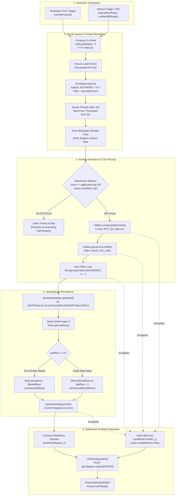
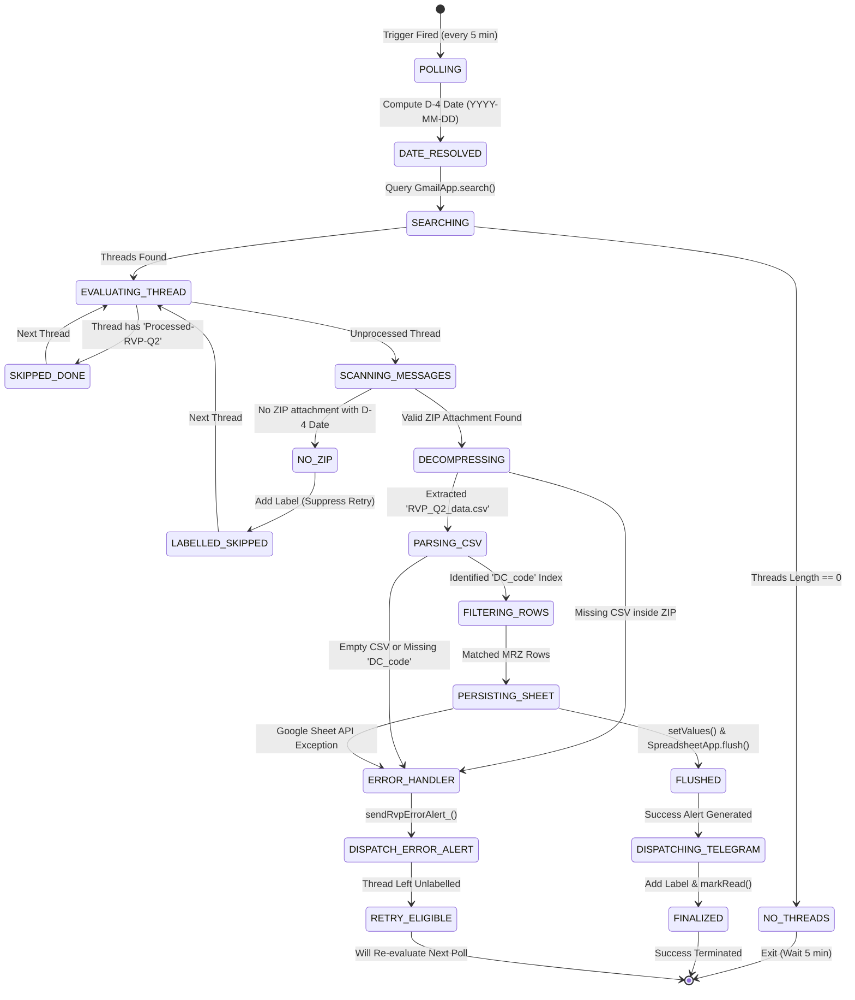
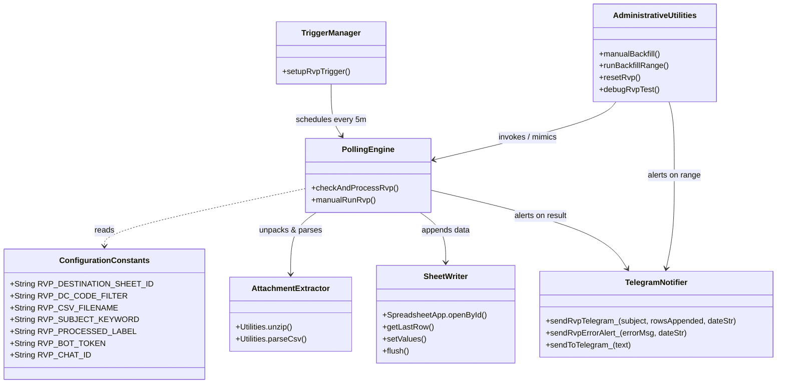
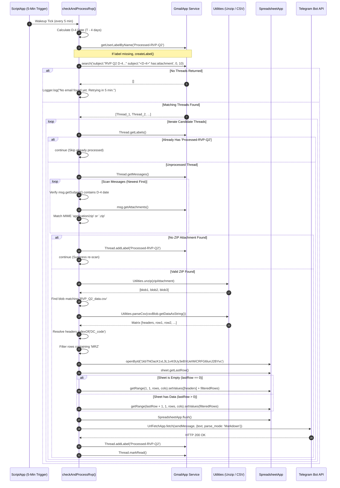
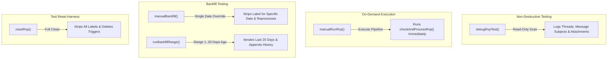

# 📦 RVP Q2 AppendAutomation (RVP Q2 D-4 Processor)

## 1. Overview

The **RVP Q2 AppendAutomation** (codebase subtitle: **RVP Q2 D-4 Processor**, referenced across the engineering vault by its inventory slug `RVP-Q2-AppendAutomation` or `GAS-RVP-Q2-AppendAutomation`) is an automated ETL ingestion micro-pipeline and alert daemon built on [[Google Apps Script]] (GAS). It is an operational satellite within the [[Services/Myntra-Logistics-Infrastructure#logistics-stream-engine|logistics-stream-engine]] cluster, designed to ingest, filter, and synchronize daily Reverse Pickup (RVP) returns specifically for the **Mirzapur (`MRZ`)** logistics distribution hub.

### Operational Context & Supply Chain Domain

In nationwide e-commerce supply chain logistics, customer returns collected from doorsteps and drop-off points undergo return-to-origin transit through third-party logistics (3PL) couriers and Return Processing Centers (RPCs). Reverse logistics pipelines inherently encounter courier handoff, transit scanning, and network reconciliation latency:
1. **The D-4 Windowing Strategy**: Returns initiated or collected 4 days prior achieve courier status maturity by day $D-4$ (`today - 4 days`). Operating on a rolling D-4 schedule guarantees that courier-wise RVP tracking data is mature, reducing tracking anomalies and reconciliation churn.
2. **Target Ingestion Stream**: Third-party logistics reporting systems email automated daily archive dumps with the subject signature `RVP Q2 D-4 courier wise || RPCs ||- <YYYY-MM-DD>`.
3. **Hub Specialization**: The national CSV attachment encompasses returns across all regional hubs and distribution centers (DCs). The Mirzapur hub operations team requires an isolated, append-only historical log of packages routed to or through `MRZ` (`RVP_DC_CODE_FILTER = 'MRZ'`).

### The Operational Problem
Prior to this automation, hub supervisors were required to manually monitor inbox threads, download multi-megabyte compressed `.zip` archives, extract CSV workbooks, apply spreadsheet auto-filters for the `MRZ` DC code, and copy-paste rows into the master tracking workbook. This manual process was vulnerable to human omission, delayed reverse-logistics reconciliation, and created operational blindspots in tracking returned customer inventory.

### The Architectural Solution
The automation provides a scheduled serverless ETL pipeline on Google Apps Script running on a 5-minute time-driven trigger (`checkAndProcessRvp`). It dynamically calculates the rolling D-4 date window (`Asia/Kolkata`), searches Gmail for matching archive dumps, decompresses `.zip` payloads in volatile RAM via `Utilities.unzip()`, parses tabular bytes via `Utilities.parseCsv()`, filters for `DC_code` matching `MRZ`, idempotently appends rows to Google Sheet `1kbTNOacK1vL3L1x4I3Uy3eBXUeIWiCRFG6lunJ2BYvc`, labels threads with `Processed-RVP-Q2`, and broadcasts formatted Markdown telemetry to Telegram.

```mermaid
flowchart LR
    subgraph GmailIngress ["1. Ingress & Polling Layer"]
        Trigger["5-Min Time-Driven Trigger<br/>(ScriptApp: checkAndProcessRvp)"]
        GmailQuery["Gmail Search Query<br/>(subject: 'RVP Q2 D-4 courier wise || RPCs ||-')"]
        InboxThread[("Gmail Inbound Thread<br/>(D-4 Date Matched)")]
    end

    subgraph MemoryETL ["2. In-Memory Decompression & ETL"]
        ZipBlob["ZIP Attachment Blob<br/>(Utilities.unzip)"]
        CsvBlob["RVP_Q2_data.csv Blob<br/>(Utilities.parseCsv)"]
        DCFilter{"Column Filter<br/>DC_code contains 'MRZ'"}
        FilteredRows[("MRZ Filtered Rows<br/>(JavaScript Matrix)")]
    end

    subgraph PersistenceAlerting ["3. Persistence & Notifications"]
        DestSheet[("Master Google Sheet<br/>ID: 1kbTNOacK1vL3L1x4I3Uy3eBXUeIWiCRFG6lunJ2BYvc")]
        TelegramGateway["Telegram Bot API<br/>UrlFetchApp: sendMessage"]
        ChatAlert[("Telegram Group Chat<br/>Chat ID: -1003779595579")]
        ThreadState["Gmail Thread State<br/>Label: 'Processed-RVP-Q2' & markRead()"]
    end

    Trigger -->|Execute Every 5 Mins| GmailQuery
    GmailQuery -->|Locate Target Date| InboxThread
    InboxThread -->|Extract Binary| ZipBlob
    ZipBlob -->|Decompress| CsvBlob
    CsvBlob -->|Header Indexing & Regex| DCFilter
    DCFilter -->|Matching Records| FilteredRows
    FilteredRows -->|Batch Append & Flush| DestSheet
    FilteredRows -->|Format Payload| TelegramGateway
    TelegramGateway -->|Markdown Notification| ChatAlert
    DestSheet -->|On Success| ThreadState
```



### Core Capabilities
1. **Dynamic D-4 Date Accounting**: Automatically calculates the target date ($T - 4\text{ days}$) using local session time (`Asia/Kolkata`), formatting it as `YYYY-MM-DD` (`Code.js:26-31`).
2. **Automated Inbox Polling**: Operates on a 5-minute recurring time-driven trigger (`checkAndProcessRvp`), querying Gmail with zero unread filter dependency to withstand script halts or restarts (`Code.js:39-43`).
3. **In-Memory Archive Decompression**: Directly unpacks `.zip` file attachments in volatile RAM via `Utilities.unzip()`, isolating `RVP_Q2_data.csv` without intermediate Google Drive storage overhead (`Code.js:94-104`).
4. **Header-Aware DC Filtering**: Parses raw tabular bytes using `Utilities.parseCsv()`, dynamically discovers the column index for `DC_code`, and extracts records containing `MRZ` (`Code.js:107-121`).
5. **Idempotent Destination Synchronization**: Appends filtered records into Google Sheet `1kbTNOacK1vL3L1x4I3Uy3eBXUeIWiCRFG6lunJ2BYvc` (`Code.js:124-140`). Automatically populates column headers if the target worksheet is empty.
6. **Real-Time Telegram Telemetry**: Formats structured operational Markdown alerts (dispatching tracking row counts or empty-file warnings) and pushes them via HTTP POST (`UrlFetchApp.fetch`) to Telegram chat `-1003779595579` (`Code.js:164-220`).
7. **Thread State Idempotency**: Marks processed email threads with the user label `Processed-RVP-Q2` and flags them as read (`Code.js:149-150`). Threads encountering parsing exceptions are deliberately left unlabelled to permit automatic retry on subsequent polling cycles (`Code.js:156-157`).
8. **Operational Backfill & Diagnostic Suites**: Features pre-built administrative utilities for single-date overrides (`manualBackfill`), 20-day historical batch ingestion (`runBackfillRange`), label purging (`resetRvp`), and dry-run email attachment inspection (`debugRvpTest`).

## 2. Tech Stack

| Component / Layer | Technology | Specification / Version | Source / Code Reference | Notes |
| :--- | :--- | :--- | :--- | :--- |
| **Execution Runtime** | [[Google Apps Script]] V8 Engine | ECMAScript 6+ / Chrome V8 | `appsscript.json:6` | Native V8 runtime supporting modern JS syntax (`const`, `let`, arrow functions, `Array.prototype.some`) *(stated)*. |
| **Hosting Platform** | Google Workspace Serverless | Google Cloud Serverless Infrastructure | `appsscript.json:1-7` | Cloud-native execution hosted within the Google Workspace tenant *(stated)*. |
| **Email Processing Service** | Google Workspace `GmailApp` | Native Apps Script Core Service | `Code.js:36, 43, 63, 70, 85, 149` | Reads threads, extracts attachments, creates labels, and toggles read/unread flags *(stated)*. |
| **Spreadsheet Engine** | Google Workspace `SpreadsheetApp` | Native Apps Script Core Service | `Code.js:124-140, 359-372` | Direct spreadsheet open, range bounding, batch value insertion (`setValues`), and buffer flush *(stated)*. |
| **Decompression & Parsing** | Google Workspace `Utilities` | Native Apps Script Core Utility | `Code.js:94, 107, 165, 332, 343` | Fast native binary ZIP decompression (`Utilities.unzip`) and RFC 4180 CSV parser (`Utilities.parseCsv`) *(stated)*. |
| **External HTTP Client** | Google Workspace `UrlFetchApp` | Native Apps Script Network Service | `Code.js:210-215` | Dispatches outbound HTTPS POST payloads to the external Telegram Bot API *(stated)*. |
| **Scheduling Engine** | `ScriptApp` Project Triggers | 5-Minute Time-Driven Clock Trigger | `Code.js:225-238` | Programmatically managed clock trigger executing `checkAndProcessRvp` every 5 minutes *(stated)*. |
| **External Alerting Gateway**| [[Telegram]] Bot API | REST API (`/sendMessage`) | `Code.js:203-215` | Webhook-less bot endpoint formatting Markdown notifications to chat `-1003779595579` *(stated)*. |
| **Logging & Telemetry** | Google Cloud Stackdriver Logging | `STACKDRIVER` Exception Logging | `appsscript.json:5`, `Code.js:23, 41, 154` | Structured cloud execution logging surfaced in Google Cloud Console and Apps Script Editor *(stated)*. |
| **Deployment / CLI** | `@google/clasp` | Chrome Apps Script CLI | `.clasp.json:1-16` | Bidirectional CLI deployment between local workspace and remote script project *(stated)*. |
| **Timezone Setting** | Indian Standard Time (IST) | `Asia/Kolkata` (`UTC+05:30`) | `appsscript.json:2`, `Code.js:165, 191` | Canonical timezone for operational date calculations, email query matching, and audit logs *(stated)*. |
| **Implicit Permissions** | Google OAuth 2.0 Scopes | Workspace Auto-Detected Scopes | `appsscript.json:1-7` | Implicit scopes: `gmail.modify`, `spreadsheets`, `script.external_request`, `script.scriptapp` *(inferred)*. |

---

## 3. Architecture

### End-to-End System Architecture

The micro-pipeline operates within the Google Apps Script serverless boundary, interacting with Gmail for file ingress, Google Sheets for structured persistence, and Telegram for operational monitoring.



---

### Ingestion & State Transition Diagram

The lifecycle of an RVP ingestion thread transitions through the following discrete operational states:



---

## 4. Folder & File Structure

The project is structured as a lightweight, single-script Google Apps Script workspace synchronized locally via `@google/clasp`:

```
C:\Users\User\Desktop\gas apps\RVP_Q2_AppendAutomation/
├── .clasp.json          # Clasp project metadata and remote Script ID binding
├── appsscript.json      # Apps Script manifest (V8 runtime, timezone, exception logging)
└── Code.js              # Monolithic application script (ETL, Telegram, backfill, reset)
```

### File Manifest & Responsibilities

| File Path | Lines | File Size | Primary Responsibility | Key Functions / Definitions | Source Reference |
| :--- | :--- | :--- | :--- | :--- | :--- |
| `.clasp.json` | 17 | 330 B | Remote environment synchronization metadata linking local disk to Google Cloud Script project. | Defines `scriptId`, `rootDir`, file extensions (`.js`, `.gs`, `.html`, `.json`), and `skipSubdirectories`. | `.clasp.json:1-16` |
| `appsscript.json` | 7 | 120 B | Serverless project manifest defining runtime configuration, timezone, and telemetry targets. | Sets `timeZone: "Asia/Kolkata"`, `exceptionLogging: "STACKDRIVER"`, and `runtimeVersion: "V8"`. | `appsscript.json:1-7` |
| `Code.js` | 428 | 16.97 KB | Monolithic operational codebase containing all ETL ingestion logic, Telegram alerts, triggers, and maintenance tools. | `checkAndProcessRvp`, `sendRvpTelegram_`, `sendRvpErrorAlert_`, `sendToTelegram_`, `setupRvpTrigger`, `manualRunRvp`, `manualBackfill`, `runBackfillRange`, `resetRvp`, `debugRvpTest`. | `Code.js:1-428` |

---

## 5. Core Modules & Responsibilities

### Module Decomposition in `Code.js`



### Detailed Functional Breakdown

#### 1. Configuration Block (`Code.js:7-15`)
- Defines operational constants governing spreadsheet routing, filtering tokens, email search keywords, thread state labels, and Telegram credentials.
- Key values:
  - `RVP_DESTINATION_SHEET_ID`: `'1kbTNOacK1vL3L1x4I3Uy3eBXUeIWiCRFG6lunJ2BYvc'` (`Code.js:7`).
  - `RVP_DC_CODE_FILTER`: `'MRZ'` (`Code.js:8`).
  - `RVP_CSV_FILENAME`: `'RVP_Q2_data.csv'` (`Code.js:9`).
  - `RVP_SUBJECT_KEYWORD`: `'RVP Q2 D-4 courier wise || RPCs ||-'` (`Code.js:10`).
  - `RVP_PROCESSED_LABEL`: `'Processed-RVP-Q2'` (`Code.js:11`).
  - `RVP_BOT_TOKEN`: `[REDACTED_SECRET]` (`Code.js:14`).
  - `RVP_CHAT_ID`: `'-1003779595579'` (`Code.js:15`).

#### 2. Main Polling Engine: `checkAndProcessRvp()` (`Code.js:22-159`)
- **Execution Entry Point**: Scheduled via `ScriptApp` time trigger.
- **Date Synthesis**: Computes target date $T-4$ via JavaScript `Date.setDate(Date.getDate() - 4)` (`Code.js:26-31`). Zero-pads month and day components to yield strict `YYYY-MM-DD`.
- **Label Provisioning**: Retrieves or creates `Processed-RVP-Q2` via `GmailApp.getUserLabelByName` and `GmailApp.createLabel` (`Code.js:36-37`).
- **Inbox Search**: Dispatches search query `subject:"RVP Q2 D-4 courier wise || RPCs ||-" subject:"<YYYY-MM-DD>" has:attachment` (`Code.js:40-43`). Restricts batch retrieval to the first 10 matching threads.
- **Thread & Message De-duplication**:
  - Scans labels; skips threads already bearing `Processed-RVP-Q2` (`Code.js:54-60`).
  - Scans messages within candidate threads in reverse chronological order (newest first) (`Code.js:67-81`).
  - Enforces that message subjects match the target D-4 date string (`Code.js:69`).
  - Identifies attachments with MIME type `application/zip` or filenames terminating in `.zip` (`Code.js:74-78`).
  - If a thread contains matching subjects but lacks a valid ZIP attachment, labels the thread immediately to suppress infinite log churn (`Code.js:83-87`).
- **In-Memory Decompression & Parsing**:
  - Calls `Utilities.unzip(zipAttachment)` to expand the archive into memory blobs (`Code.js:94`).
  - Iterates blobs to match `RVP_Q2_data.csv` (`Code.js:96-104`).
  - Parses CSV tabular rows using `Utilities.parseCsv(csvBlob.getDataAsString())` (`Code.js:107`).
  - Validates CSV non-emptiness and locates column header `DC_code` via `headers.indexOf('DC_code')` (`Code.js:110-112`).
- **Row Filtering & Sheet Mutation**:
  - Filters rows where `String(row[dcIdx]).indexOf('MRZ') !== -1` (`Code.js:115-119`).
  - Binds to destination spreadsheet `1kbTNOacK1vL3L1x4I3Uy3eBXUeIWiCRFG6lunJ2BYvc` and selects worksheet 0 (`Code.js:124-125`).
  - Evaluates `sheet.getLastRow()`:
    - If `0` (blank sheet): Writes `[headers].concat(filteredRows)` starting at cell `(1, 1)` (`Code.js:130-134`).
    - If `> 0` (existing data): Appends `filteredRows` starting at row `lastRow + 1` (`Code.js:135-139`).
  - Invokes `SpreadsheetApp.flush()` to ensure immediate data persistence (`Code.js:140`).
- **State Finalization & Alerts**:
  - Dispatches Markdown summary to Telegram via `sendRvpTelegram_()` (`Code.js:146`).
  - Labels thread with `Processed-RVP-Q2` and flags it as read via `thread.markRead()` (`Code.js:149-150`).
- **Resilient Exception Handling**:
  - Encloses archive extraction and sheet mutation in `try/catch` (`Code.js:92-158`).
  - Upon exception, triggers `sendRvpErrorAlert_()` and logs via `Logger.log` (`Code.js:154-155`).
  - Deliberately suppresses thread labeling during exceptions, allowing the 5-minute poller to automatically re-attempt processing on subsequent ticks (`Code.js:156-157`).

#### 3. Telegram Notification Suite (`Code.js:164-220`)
- `sendRvpTelegram_(subject, rowsAppended, dateStr)` (`Code.js:164-188`):
  - Formats current timestamp in `Asia/Kolkata` (`dd-MMM-yyyy HH:mm`).
  - If `rowsAppended === 0`: Dispatches warning indicating email was received but contained zero `MRZ` rows.
  - If `rowsAppended > 0`: Dispatches success card detailing subject, hub (`MRZ`), D-4 date, row count appended, and execution timestamp.
- `sendRvpErrorAlert_(errorMsg, dateStr)` (`Code.js:190-199`):
  - Formats alert payload with failure indicator (`❌`), target D-4 date, timestamp, and caught exception string.
- `sendToTelegram_(text)` (`Code.js:202-220`):
  - Prepares HTTP POST request to `https://api.telegram.org/bot<TOKEN>/sendMessage`.
  - Sets `contentType: 'application/json'`, `parse_mode: 'Markdown'`, and `muteHttpExceptions: true`.
  - Dispatches via `UrlFetchApp.fetch()`, capturing response codes in `Logger.log`.

#### 4. Trigger Management: `setupRvpTrigger()` (`Code.js:225-238`)
- Programmatically purges any preexisting triggers registered for handler `checkAndProcessRvp` (`Code.js:226-232`).
- Constructs an idempotent, 5-minute time-driven clock trigger via `ScriptApp.newTrigger('checkAndProcessRvp').timeBased().everyMinutes(5).create()` (`Code.js:233-237`).

#### 5. Administrative & Diagnostic Utilities (`Code.js:245-428`)
- `manualRunRvp()` (`Code.js:245-249`): Bypasses the scheduler and executes `checkAndProcessRvp()` immediately in the active console.
- `manualBackfill()` (`Code.js:252-266`): Targeted single-date replay utility (defaults to `'2026-02-12'`). Strips the processed label from matching threads before initiating ingestion.
- `runBackfillRange()` (`Code.js:269-390`): Multi-day automated backfill orchestrator:
  - Iterates day offsets from `startDaysBack = 1` through `endDaysBack = 20` (`Code.js:270-271`).
  - Generates date strings, searches Gmail, strips prior `Processed-RVP-Q2` labels, unzips archives, filters for `MRZ`, appends rows, and dispatches individual Telegram cards for each historical day.
- `resetRvp()` (`Code.js:393-407`): Comprehensive test cleanup harness:
  - Retrieves all threads bearing label `Processed-RVP-Q2` and strips the label across all instances (`Code.js:394-399`).
  - Deletes all active `checkAndProcessRvp` project triggers (`Code.js:400-405`).
- `debugRvpTest()` (`Code.js:410-428`): Read-only inspection utility. Queries Gmail for today's D-4 date and logs thread counts, message subjects, attachment filenames, and MIME types without altering sheets or labels.

---

## 6. Data Flow / Key Workflows

### Scheduled Daily Execution Workflow



---

### Step-by-Step Execution Mechanics

#### Phase 1: Date Resolution & Query Formulation
1. System reads system time via `new Date()`.
2. Computes D-4:
   $$\text{targetDate} = \text{now} - 4 \times 86,400,000 \text{ ms}$$
3. Extracts zero-padded components:
   $$\text{formattedDate} = YYYY + '-' + MM + '-' + DD$$
4. Queries Gmail for candidates matching:
   ```
   subject:"RVP Q2 D-4 courier wise || RPCs ||-" subject:"YYYY-MM-DD" has:attachment
   ```

#### Phase 2: Inbox Filtration & Attachment Extraction
1. Retrieves up to 10 matching threads (`GmailApp.search(searchQuery, 0, 10)`).
2. Filters out threads already bearing `Processed-RVP-Q2`.
3. Evaluates messages from newest ($m = \text{length} - 1$) to oldest ($m = 0$).
4. Confirms that `msg.getSubject()` explicitly contains the calculated D-4 date string.
5. Inspects message attachment headers:
   - MIME type matches `application/zip`, OR
   - Filename matches case-insensitive suffix `.endsWith('.zip')`.
6. If no ZIP attachment is discovered, applies `Processed-RVP-Q2` to avoid duplicate processing cycles, then moves to the next thread.

#### Phase 3: Archive Decompression & In-Memory CSV Parsing
1. Calls `Utilities.unzip(zipAttachment)`.
2. Iterates uncompressed files to isolate `RVP_Q2_data.csv`. If absent, raises an exception:
   `Error: RVP_Q2_data.csv not found inside ZIP.`
3. Reads text contents via `.getDataAsString()` and passes to `Utilities.parseCsv()`.
4. Inspects row 0 for column headers. Resolves column index:
   $$\text{dcIdx} = \text{headers.indexOf}('DC\_code')$$
   If $\text{dcIdx} == -1$, raises `Error: Column "DC_code" not found in CSV.`
5. Streams rows $k = 1 \dots N-1$. Evaluates condition:
   $$\text{String}(\text{row}[\text{dcIdx}]).\text{indexOf}('MRZ') \neq -1$$
6. Appends passing rows into transient array `filteredRows`.

#### Phase 4: Spreadsheet Append & Buffer Commit
1. Opens target workbook via `SpreadsheetApp.openById('1kbTNOacK1vL3L1x4I3Uy3eBXUeIWiCRFG6lunJ2BYvc')`.
2. Targets worksheet 0 (`ss.getSheets()[0]`).
3. Checks `lastRow = sheet.getLastRow()`:
   - When `lastRow === 0`: Writes `[headers].concat(filteredRows)` to `sheet.getRange(1, 1, totalRows, totalCols)`.
   - When `lastRow > 0`: Writes `filteredRows` to `sheet.getRange(lastRow + 1, 1, filteredRows.length, filteredRows[0].length)`.
4. Calls `SpreadsheetApp.flush()` to force Google Workspace to commit dirty memory cells to cloud storage.

#### Phase 5: Notification & State Finalization
1. Constructs operational Markdown notification string.
2. Dispatches payload via HTTPS POST to `https://api.telegram.org/bot[REDACTED_SECRET]/sendMessage`.
3. Labels the Gmail thread with `Processed-RVP-Q2`.
4. Marks the thread as read via `thread.markRead()`.

---

## 7. Configuration & Environment

### Script Configuration Constants

All operational parameters are maintained as static global variables in `Code.js:7-15`:

| Variable Identifier | Storage Type | Data Type | Production Value | Source Reference | Description / Operational Purpose |
| :--- | :--- | :--- | :--- | :--- | :--- |
| `RVP_DESTINATION_SHEET_ID` | Hardcoded Constant | `String` | `1kbTNOacK1vL3L1x4I3Uy3eBXUeIWiCRFG6lunJ2BYvc` | `Code.js:7` | Destination Google Spreadsheet ID receiving appended MRZ return tracking rows *(stated)*. |
| `RVP_DC_CODE_FILTER` | Hardcoded Constant | `String` | `MRZ` | `Code.js:8` | Target distribution center / hub filter applied against the CSV `DC_code` column *(stated)*. |
| `RVP_CSV_FILENAME` | Hardcoded Constant | `String` | `RVP_Q2_data.csv` | `Code.js:9` | Exact filename expected inside the incoming compressed `.zip` archive attachment *(stated)*. |
| `RVP_SUBJECT_KEYWORD` | Hardcoded Constant | `String` | `RVP Q2 D-4 courier wise \|\| RPCs \|\|-` | `Code.js:10` | Subject prefix used in Gmail search queries to identify daily RVP reporting emails *(stated)*. |
| `RVP_PROCESSED_LABEL` | Hardcoded Constant | `String` | `Processed-RVP-Q2` | `Code.js:11` | Gmail user label applied to processed threads for state tracking and deduplication *(stated)*. |
| `RVP_BOT_TOKEN` | Hardcoded Constant | `String` | `[REDACTED_SECRET]` | `Code.js:14` | Telegram Bot API authorization token used to authenticate alerting requests *(stated)*. |
| `RVP_CHAT_ID` | Hardcoded Constant | `String` | `-1003779595579` | `Code.js:15` | Telegram supergroup destination chat ID receiving operational Markdown cards *(stated)*. |

> [!danger] Critical Security Vulnerability: Hardcoded Telegram Bot Token
> The production Telegram Bot token is committed in plaintext into the source code at `Code.js:14`:
> ```javascript
> var RVP_BOT_TOKEN = '[REDACTED_SECRET]';
> ```
> Committing bot tokens into source control or script editors exposes the Telegram bot to credential theft, unauthorized message injection, and channel spamming.
> **Immediate Remediation Required**:
> 1. Revoke and rotate this token immediately via `@BotFather`.
> 2. Migrate storage to `PropertiesService.getScriptProperties()`:
>    ```javascript
>    var RVP_BOT_TOKEN = PropertiesService.getScriptProperties().getProperty('RVP_BOT_TOKEN');
>    ```

---

### Target Spreadsheet Schema & Properties

| Attribute | Specification | Source Reference | Notes |
| :--- | :--- | :--- | :--- |
| **Workbook ID** | `1kbTNOacK1vL3L1x4I3Uy3eBXUeIWiCRFG6lunJ2BYvc` | `Code.js:7` | Standalone Google Sheet dedicated to Mirzapur RVP returns. |
| **Target Worksheet** | Index `0` (`ss.getSheets()[0]`) | `Code.js:125, 360` | Writes strictly to the first sheet in tab order. |
| **Header Row Initialization** | Row `1` (`setValues([headers].concat(filteredRows))`) | `Code.js:131-132` | Automatically initialized from the CSV header array if sheet is blank (`lastRow === 0`). |
| **Data Append Offset** | Row `lastRow + 1` | `Code.js:136, 369` | Successive ingestion runs append below existing historical data. |
| **Persistence Guarantee** | Synchronous Commit (`SpreadsheetApp.flush()`) | `Code.js:140, 372` | Ensures memory buffer commits before Telegram notification dispatches. |

---

## 8. External Integrations & APIs

```mermaid
flowchart LR
    GAS["Code.js Execution Engine"]
    GmailApp["Google Workspace: GmailApp"]
    SpreadsheetApp["Google Workspace: SpreadsheetApp"]
    Utilities["Google Workspace: Utilities"]
    ScriptApp["Google Workspace: ScriptApp"]
    TelegramAPI["Telegram Bot API<br/>https://api.telegram.org"]

    GAS -->|search(), getAttachments(), addLabel(), markRead()| GmailApp
    GAS -->|openById(), getSheets(), setValues(), flush()| SpreadsheetApp
    GAS -->|unzip(), parseCsv(), formatDate()| Utilities
    GAS -->|newTrigger(), deleteTrigger(), getProjectTriggers()| ScriptApp
    GAS -->|UrlFetchApp.fetch() POST /sendMessage| TelegramAPI
```

### 1. Upstream Google Workspace Services

1. **Gmail Service (`GmailApp`)**:
   - Performs search queries across user mailboxes: `GmailApp.search(searchQuery, 0, 10)` (`Code.js:43`).
   - Traverses thread hierarchies: `thread.getMessages()`, `msg.getAttachments()`.
   - Manages state tags: `GmailApp.getUserLabelByName()`, `GmailApp.createLabel()`, `thread.addLabel()`, `thread.removeLabel()`.
   - Modifies read flags: `thread.markRead()`.
2. **Google Sheets Service (`SpreadsheetApp`)**:
   - Accesses target workbook: `SpreadsheetApp.openById(RVP_DESTINATION_SHEET_ID)` (`Code.js:124`).
   - Retrieves active tab bounding: `sheet.getLastRow()`.
   - Performs two-dimensional array batch mutation: `sheet.getRange(...).setValues(...)`.
   - Forces disk synchronization: `SpreadsheetApp.flush()`.
3. **Core Utility Service (`Utilities`)**:
   - `Utilities.unzip(blob)`: Native C++ / Java level unzipping of compressed `.zip` archives into individual file blobs (`Code.js:94, 332`).
   - `Utilities.parseCsv(string)`: RFC 4180 compliant tabular CSV string parser (`Code.js:107, 343`).
   - `Utilities.formatDate(date, tz, format)`: Standardizes ISO timestamps to `Asia/Kolkata` operational strings (`Code.js:165, 191`).
4. **Script Runtime Service (`ScriptApp`)**:
   - Inspects existing project triggers: `ScriptApp.getProjectTriggers()` (`Code.js:226, 400`).
   - Destroys stale triggers: `ScriptApp.deleteTrigger(trigger)` (`Code.js:229, 403`).
   - Provisions 5-minute recurring clock triggers: `ScriptApp.newTrigger(...).timeBased().everyMinutes(5).create()` (`Code.js:233-236`).

---

### 2. Downstream Telegram Bot API

The application interfaces directly with Telegram's HTTPS Bot API via `UrlFetchApp`:

| Parameter | Specification | Source Reference |
| :--- | :--- | :--- |
| **Endpoint URL** | `https://api.telegram.org/bot[REDACTED_SECRET]/sendMessage` | `Code.js:203` |
| **HTTP Method** | `POST` | `Code.js:211` |
| **Content-Type** | `application/json` | `Code.js:212` |
| **Error Masking** | `muteHttpExceptions: true` | `Code.js:214` |
| **Target Chat ID** | `-1003779595579` (Supergroup Chat) | `Code.js:15, 205` |
| **Formatting Mode** | `Markdown` | `Code.js:207` |

#### Payload Schemas & Card Templates

**1. Operational Success Alert (`rowsAppended > 0`)**:
```
📋 *RVP Q2 D-4 Update*
────────────────
📧 RVP Q2 D-4 courier wise || RPCs ||- 2026-09-13
🏢 Hub: *MRZ*  |  📅 D-4: 2026-09-13
✅ *142 Tracking ID(s)* appended to sheet
🕐 Processed: 17-Sep-2026 22:45
────────────────
```

**2. Zero-Row Warning Alert (`rowsAppended === 0`)**:
```
📋 *RVP Q2 D-4 Update*
────────────────
📧 RVP Q2 D-4 courier wise || RPCs ||- 2026-09-13
🏢 Hub: *MRZ*  |  📅 D-4: 2026-09-13
⚠️ Email received but *no MRZ rows* found in attachment.
🕐 17-Sep-2026 22:45
```

**3. Execution Error Alert**:
```
❌ *RVP Q2 Processing Error*
────────────────
📅 D-4 Date: 2026-09-13
🕐 17-Sep-2026 22:45
⚠️ Column "DC_code" not found in CSV.
```

---

## 9. Testing

### Administrative Diagnostic & Test Utilities

The codebase includes dedicated test and maintenance harnesses directly in `Code.js`:



1. **Attachment Inspection Diagnostic (`debugRvpTest`)** (`Code.js:410-428`):
   - Non-destructive read-only verification routine.
   - Calculates today's D-4 date, executes the standard search query, and prints:
     - Found thread counts.
     - Individual message subjects.
     - Attachment names and content MIME types.
   - Does not unzip files, modify sheets, or apply labels.
2. **Immediate Manual Execution (`manualRunRvp`)** (`Code.js:245-249`):
   - Directly triggers `checkAndProcessRvp()` within the Apps Script debugger.
   - Used to verify end-to-end processing without waiting for the 5-minute clock trigger.
3. **Targeted Date Backfill (`manualBackfill`)** (`Code.js:252-266`):
   - Allows setting a static date override (e.g. `var dateStr = '2026-02-12'`).
   - Removes the `Processed-RVP-Q2` label from candidate threads to force reprocessing.
4. **Historical Range Backfill (`runBackfillRange`)** (`Code.js:269-390`):
   - Backfills up to 20 historical days (`startDaysBack = 1` to `endDaysBack = 20`).
   - Decompresses, filters for `MRZ`, and appends each missing day sequentially into the Google Sheet.
5. **System State Reset (`resetRvp`)** (`Code.js:393-407`):
   - Removes the `Processed-RVP-Q2` label from all email threads in the user's account.
   - Purges all active project triggers for `checkAndProcessRvp`.
   - Used to return the mailbox and script environment to a clean test baseline.

---

### Failure Modes & Edge Case Matrix

| Test Scenario / Edge Case | System Behavior | Source Reference | Expected Outcome |
| :--- | :--- | :--- | :--- |
| **Email Not Arrived Yet** | `threads.length === 0` | `Code.js:45-48` | Logs message, terminates execution, retries on next 5-min clock tick. |
| **Thread Already Processed** | `thread.getLabels().some(...)` | `Code.js:54-60` | Bypasses thread via `continue`; prevents duplicate appends. |
| **Email Missing Attachments** | `zipAttachment === null` | `Code.js:83-87` | Labels thread with `Processed-RVP-Q2` and skips to prevent endless scanning of malformed emails. |
| **Corrupted ZIP or Wrong MIME** | `Utilities.unzip(zipAttachment)` | `Code.js:94, 153-157` | Catches unzip error, dispatches Telegram error alert, leaves thread unlabelled for retry. |
| **Missing `RVP_Q2_data.csv`** | `!csvBlob` check | `Code.js:104` | Throws `Error('RVP_Q2_data.csv not found inside ZIP.')`; alerts Telegram. |
| **Empty CSV File** | `csvData.length === 0` | `Code.js:108` | Throws `Error('CSV is empty.')`; dispatches Telegram error alert. |
| **Missing `DC_code` Header** | `headers.indexOf('DC_code') === -1` | `Code.js:112` | Throws `Error('Column "DC_code" not found in CSV.')`; alerts Telegram. |
| **Zero MRZ Rows Found** | `filteredRows.length === 0` | `Code.js:141-143, 168-175` | Does not alter sheet; dispatches "no MRZ rows found" warning to Telegram; marks thread done. |
| **Blank Destination Sheet** | `sheet.getLastRow() === 0` | `Code.js:130-134` | Writes CSV headers + filtered rows starting at row 1. |
| **Populated Destination Sheet**| `sheet.getLastRow() > 0` | `Code.js:135-139` | Appends filtered rows starting at `lastRow + 1`. |
| **Telegram API Failure** | `UrlFetchApp.fetch` throws | `Code.js:218-219` | Catches error, logs `Telegram send failed: <msg>`, completes thread labeling. |

---

## 10. CI/CD & Deployment

### Deployment Configuration (`.clasp.json`)

The codebase is managed locally and synchronized to Google Apps Script via `@google/clasp`:

```json
{
  "scriptId": "1nIiW8jVILe6FuM7bjOYyl-zSrpsh-QRg4nY-N27ZWW4VDgfOzKkL_el-",
  "rootDir": "..\\gas apps\\RVP_Q2_AppendAutomation",
  "scriptExtensions": [
    ".js",
    ".gs"
  ],
  "htmlExtensions": [
    ".html"
  ],
  "jsonExtensions": [
    ".json"
  ],
  "filePushOrder": [],
  "skipSubdirectories": false
}
```

### Manifest Configuration (`appsscript.json`)

```json
{
  "timeZone": "Asia/Kolkata",
  "dependencies": {
  },
  "exceptionLogging": "STACKDRIVER",
  "runtimeVersion": "V8"
}
```

### Standard Deployment Workflow

```bash
# 1. Authenticate Clasp with Google Cloud account
clasp login

# 2. Check synchronization status against remote script project
clasp status

# 3. Pull latest changes from Google Apps Script editor
clasp pull

# 4. Push local changes to Apps Script production environment
clasp push

# 5. Open project in web browser editor
clasp open
```

---

## 11. Setup & Local Development

### Prerequisites
1. **Node.js**: Version `>=18.0.0` with `npm` installed.
2. **Google Clasp**: Installed globally via `npm install -g @google/clasp`.
3. **Workspace Permissions**: Edit access to Google Apps Script project `1nIiW8jVILe6FuM7bjOYyl-zSrpsh-QRg4nY-N27ZWW4VDgfOzKkL_el-`.
4. **Google Sheet Access**: Edit access to destination Google Sheet `1kbTNOacK1vL3L1x4I3Uy3eBXUeIWiCRFG6lunJ2BYvc`.
5. **Telegram Bot Authorization**: Membership in destination Telegram chat `-1003779595579`.

### Local Setup & Provisioning Instructions

```bash
# Navigate to local gas apps directory
cd "C:\Users\User\Desktop\gas apps\RVP_Q2_AppendAutomation"

# Verify Clasp configuration
cat .clasp.json

# Authenticate Clasp
clasp login

# Push files to Google Apps Script
clasp push
```

### Initializing Production Triggers
1. Open the project in the Apps Script editor (`clasp open`).
2. Select `setupRvpTrigger` from the function dropdown in the toolbar.
3. Click **Run**.
4. Grant the necessary OAuth scopes when prompted by Google Workspace:
   - Read, compose, send, and permanently delete all your email from Gmail.
   - See, edit, create, and delete all your Google Sheets spreadsheets.
   - Connect to an external service (`UrlFetchApp`).
5. Verify execution logs:
   ```
   ✅ 5-min polling trigger created for checkAndProcessRvp.
   ```

---

## 12. Security Notes

> [!danger] High-Risk Security Vulnerability: Committed Bot Secret
> **Vulnerability Location**: `Code.js:14`
> **Committed Value**: `var RVP_BOT_TOKEN = '[REDACTED_SECRET]';`
> 
> **Impact Analysis**:
> Anyone with read access to this codebase or script editor has administrative control over this Telegram bot. Attackers can:
> - Intercept messages directed to the bot.
> - Send fraudulent messages or spam into chat `-1003779595579`.
> - Delete webhooks or modify bot metadata via the Telegram Bot API.
> 
> **Required Remediation Plan**:
> 1. Open Telegram and message `@BotFather` to immediately **revoke and regenerate** the token for bot `8599162082`.
> 2. Open the Apps Script Editor $\rightarrow$ **Project Settings** $\rightarrow$ **Script Properties**.
> 3. Add a new property:
>    - **Property**: `RVP_BOT_TOKEN`
>    - **Value**: `<NEW_REGENERATED_TOKEN>`
> 4. Refactor `Code.js` to load the token dynamically:
>    ```javascript
>    var RVP_BOT_TOKEN = PropertiesService.getScriptProperties().getProperty('RVP_BOT_TOKEN');
>    ```

### OAuth Scope Surface & Principle of Least Privilege

Because `appsscript.json` does not explicitly declare an `oauthScopes` array, Google Apps Script infers broad default scopes from the code:

| Inferred Scope | Reason for Request | Risk Assessment & Remediation Recommendation |
| :--- | :--- | :--- |
| `https://www.googleapis.com/auth/gmail.modify` | `GmailApp.search`, `thread.addLabel`, `thread.markRead` | **High Privilege**. Grants broad access to read, tag, and modify user mail. In production, restrict to dedicated service accounts. |
| `https://www.googleapis.com/auth/spreadsheets` | `SpreadsheetApp.openById`, `setValues` | **Medium Privilege**. Full read/write access to all spreadsheets accessible by the running identity. |
| `https://www.googleapis.com/auth/script.external_request` | `UrlFetchApp.fetch` | **Low Privilege**. Allows outbound network calls to `api.telegram.org`. |
| `https://www.googleapis.com/auth/script.scriptapp` | `ScriptApp.newTrigger`, `deleteTrigger` | **Low Privilege**. Allows creating and deleting project triggers. |

---

## 13. Known Issues, Limitations & Tech Debt

### Google Apps Script Platform Quotas & Constraints

| Dimension | Platform Ceiling | Project Consumption | Operational Risk & Mitigation |
| :--- | :--- | :--- | :--- |
| **Execution Duration** | 6 minutes (360 seconds) | ~5 to 15 seconds per poll | Low risk during daily single-file execution. In `runBackfillRange()`, iterating 20 days within a single run can breach the 6-minute cap. |
| **Heap Memory Limit** | 50 MB RAM per execution | 15 MB to 35 MB peak | Unzipping large multi-hub ZIP archives and parsing massive CSV strings in memory can trigger `Out of Memory` errors. |
| **`UrlFetchApp` Daily Calls** | 20,000 (Free) / 100,000 (Workspace) | ~1 to 5 calls per day | Negligible risk of quota exhaustion. |
| **Gmail Search Results** | 500 threads per query | Capped at 10 (`searchQuery, 0, 10`) | Zero risk of exceeding query limits. |
| **Spreadsheet Cell Cap** | 10,000,000 cells per Sheet | Dependent on appended rows | Continuous appending over multi-year periods will eventually increase sheet calculation latency and approach cell caps. |

### Technical Debt Catalog

1. **Flawed `manualBackfill()` Logic (`Code.js:252-266`)**:
   - `manualBackfill()` accepts a target date (`var dateStr = '2026-02-12'`), finds the matching thread, and removes its processed label (`threads[0].removeLabel(label)`).
   - However, line 262 immediately delegates to `checkAndProcessRvp()`.
   - `checkAndProcessRvp()` **recalculates today's D-4 date** (`Code.js:26-31`) rather than using `dateStr`!
   - As a result, `manualBackfill()` fails to backfill the requested date override; it merely re-processes today's D-4 date. In contrast, `runBackfillRange()` correctly implements independent per-date extraction.
2. **Fragile Substring DC Filter (`Code.js:116`)**:
   - The filtering logic uses:
     ```javascript
     if (String(csvData[k][dcIdx]).indexOf(RVP_DC_CODE_FILTER) !== -1)
     ```
   - Substring matching (`indexOf('MRZ') !== -1`) will produce false positives if other distribution center codes contain `MRZ` as a substring (e.g. `SMRZ`, `MRZ_NORTH`, `MRZ2`).
   - **Remediation**: Use exact equality (`=== 'MRZ'`) or strict boundary matching.
3. **Hardcoded Tab Index (`Code.js:125, 360`)**:
   - Ingestion targets `ss.getSheets()[0]`. If a user rearranges tab order in the destination Google Sheet, the script will append return data into an unintended worksheet.
   - **Remediation**: Target the sheet explicitly by name: `ss.getSheetByName('RVP_MRZ_Data')`.
4. **Lack of Deduplication on Destination Sheet**:
   - Appending is based strictly on `lastRow + 1`. If `resetRvp()` or `runBackfillRange()` is executed across already-appended dates, duplicate rows will be appended without unique key validation.
5. **Telegram Markdown Entity Parsing Fragility (`Code.js:207`)**:
   - Telegram's legacy `Markdown` parser fails if unescaped special characters (e.g. `_`, `*`, `[`) appear inside email subject lines.
   - If an email subject contains underscores, Telegram returns HTTP 400 (`Bad Request: can't parse entities`).
   - **Remediation**: Sanitize subjects or switch to `parse_mode: 'HTML'`.

---

## 14. Design Decisions & Rationale

### Architecture Decision Records (ADRs)

#### ADR-01: In-Memory Archive Decompression via `Utilities.unzip`
- **Context**: The incoming daily RVP report is transmitted as a `.zip` attachment containing `RVP_Q2_data.csv`.
- **Decision**: Directly expand the attachment blob in volatile RAM using `Utilities.unzip(zipAttachment)` without staging temporary files in Google Drive.
- **Consequences**:
  - *Positive*: Eliminates Google Drive API I/O overhead, avoids folder clutter, and circumvents Google Drive file trash quotas.
  - *Negative*: Constrained by Google Apps Script's 50 MB heap ceiling. If the decompressed CSV exceeds ~35 MB, the execution will crash with an out-of-memory error.

#### ADR-02: D-4 Windowing for Reverse Logistics Courier Maturity
- **Context**: RVP returns involve courier door pickups across diverse remote pincodes. Couriers require 72 to 96 hours to aggregate packages and synchronize tracking scans with central servers.
- **Decision**: Restrict daily ingestion to $D-4$ (`today - 4 days`).
- **Consequences**:
  - *Positive*: Ingests stable, mature courier tracking datasets with minimal missing return scans.
  - *Negative*: Real-time visibility into $D-0$ through $D-3$ returns must be tracked via alternative operational dashboards.

#### ADR-03: State Tracking via Gmail User Labels (`Processed-RVP-Q2`)
- **Context**: The poller runs every 5 minutes. The script must reliably avoid duplicate processing across trigger ticks.
- **Decision**: Apply a dedicated Gmail user label (`Processed-RVP-Q2`) and mark processed threads as read (`thread.markRead()`).
- **Consequences**:
  - *Positive*: Visual indication directly inside the operational mailbox for human operators; survives script restarts and transient failures without external database dependencies.
  - *Negative*: If labels are manually removed by human operators, the script will re-evaluate and duplicate row appends unless protected by sheet-level de-duplication.

#### ADR-04: Non-Labeling on Exceptions to Facilitate Automatic Retry
- **Context**: Network glitches, temporary Sheet lockouts, or transient Telegram API outages can interrupt execution.
- **Decision**: Catch exceptions, dispatch an alert via `sendRvpErrorAlert_()`, and deliberately **do not apply** `Processed-RVP-Q2`.
- **Consequences**:
  - *Positive*: The thread remains eligible for ingestion on the next 5-minute trigger tick, providing automatic self-healing.
  - *Negative*: If an email contains a permanently corrupt attachment, the script will retry every 5 minutes and spam Telegram error alerts until manually intervened.

#### ADR-05: Real-Time Operational Alerts via Telegram Group Bot
- **Context**: Logistics supervisors on the warehouse floor do not actively monitor Google Apps Script execution logs or Google Sheets change events.
- **Decision**: Broadcast formatted Markdown cards containing row counts, dates, and hub indicators to Telegram chat `-1003779595579` immediately following sheet commits.
- **Consequences**:
  - *Positive*: Provides instantaneous operational confirmation to shift managers on mobile devices.
  - *Negative*: Requires maintaining bot secrets and handling external HTTP request quotas.

---

## 15. Roadmap / TODOs

- [ ] **Security Remediation**:
  - [ ] Revoke committed Telegram bot token `[REDACTED_SECRET]` via `@BotFather`.
  - [ ] Store new token in `PropertiesService.getScriptProperties()`.
  - [ ] Remove hardcoded tokens from git history and `Code.js`.
- [ ] **Bug Fixes**:
  - [ ] Refactor `manualBackfill()` to pass `dateStr` directly into an extraction subroutine rather than calling `checkAndProcessRvp()`.
  - [ ] Switch `String(row[dcIdx]).indexOf(RVP_DC_CODE_FILTER) !== -1` to strict equality (`=== RVP_DC_CODE_FILTER`).
  - [ ] Target sheet by name (`ss.getSheetByName('RVP_MRZ')`) instead of index `0`.
- [ ] **Robustness & De-duplication**:
  - [ ] Implement tracking ID de-duplication: check existing tracking IDs in Column A before appending to prevent duplicate rows during backfills.
  - [ ] Switch Telegram `parse_mode` from `Markdown` to `HTML` to eliminate formatting errors caused by unescaped characters in email subjects.
  - [ ] Add poison-pill detection: if a thread throws exceptions for 3 consecutive polls, tag with `Error-RVP-Q2` to prevent infinite alerting.
- [ ] **Code Modernization**:
  - [ ] Declare explicit OAuth scopes in `appsscript.json`.
  - [ ] Break monolithic `Code.js` into modular files (`Config.js`, `GmailService.js`, `SheetService.js`, `TelegramService.js`).

---

## 16. Changelog

- **2026-09-17**:
  - Comprehensive architectural audit, security review, and creation of permanent Obsidian project memory blueprint (`RVP-Q2-AppendAutomation.md`).
  - Flagged critical security vulnerability regarding hardcoded Telegram Bot token in `Code.js:14`.
  - Documented logic flaw in `manualBackfill()` date delegation.
- **2026-02-16**:
  - Added `runBackfillRange()` utility to support historical batch catch-up across 20 elapsed days.
  - Standardized Telegram alert formatting with distinct zero-row warning cards.
- **2026-02-12**:
  - Initial deployment of `RVP Q2 D-4 Processor` under Script ID `1nIiW8jVILe6FuM7bjOYyl-zSrpsh-QRg4nY-N27ZWW4VDgfOzKkL_el-`.
  - Configured 5-minute recurring time-driven trigger (`setupRvpTrigger`).
  - Implemented in-memory ZIP decompression and `MRZ` DC filtering.

---

## 17. Glossary

- **RVP (Reverse Pickup)**: E-commerce logistics process where courier personnel pick up return merchandise from customer locations.
- **RPC (Return Processing Center / Reverse Processing Center)**: Central sortation node dedicated to consolidating, inspecting, and grading returned parcels.
- **D-4 (Day Minus 4)**: Data windowing cadence evaluating returns picked up four days prior to ensure courier scan aggregation completeness.
- **MRZ**: Distribution hub identifier for the Mirzapur logistics operations node.
- **DC_code**: Column header in the operational CSV workbook denoting the handling distribution center or hub node.
- **Google Apps Script (GAS)**: Cloud serverless JavaScript execution environment integrated within Google Workspace.
- **Clasp (`@google/clasp`)**: Command-line tool developed by Google to develop, manage, and deploy Apps Script projects locally.
- **V8 Engine**: High-performance JavaScript execution runtime powering modern Google Apps Script.
- **Stackdriver**: Google Cloud monitoring and logging suite capturing execution logs and runtime exceptions.

---

## 18. Related Notes

- [[Projects/GAS-RVP-Q2-AppendAutomation]]: Central Obsidian vault stub note for this project.
- [[Projects/GAS-RTO-Q2-appendAutomation]]: Sister automation handling Return-To-Origin (RTO) Q2 parcel log appending.
- [[Projects/GAS-D-1-SummaryAutomation]]: Logistics summary pipeline operating on Day-Minus-1 operational workbooks.
- [[Projects/GAS-BRSNRAttributesAutomation]]: Automation managing buyer return and seller non-return attribute tracking.
- [[Projects/GAS-shipment-reco]]: End-to-end forward and reverse shipment reconciliation engine.
- [[Projects/Repo-XLSX-STREAM-REPORT-GENERATOR]]: Core logistics stream report generator (`ei_stream_server`) processing massive supply chain workbooks.
- [[Services/Myntra-Logistics-Infrastructure#logistics-stream-engine]]: Central knowledge hub for the logistics stream engine cluster.
- [[Services/Google-Apps-Script]]: Infrastructure guide and best practices for enterprise Google Apps Script development.
- [[Projects/GAS-EI-Pan-India-Report]]: Pan-India Early Ingestion daily automation pipeline.
- [[Projects/GAS-HourlyConversionReport]]: Real-time hourly conversion tracking automation.

---

## 19. Update Instructions (meta)

Future AI agents and software engineers updating this project or its documentation must observe the following maintenance rules:

1. **Secret Redaction**:
   - Under no circumstances should the active Telegram Bot API token be written into this document or any other public documentation note. Always use `[REDACTED_SECRET]`.
2. **Synchronize Code & Documentation**:
   - If `RVP_DESTINATION_SHEET_ID`, `RVP_DC_CODE_FILTER`, or `RVP_SUBJECT_KEYWORD` are modified in `Code.js`, immediately update Section 5, Section 7, and Section 8 of this note.
   - If new utility functions or trigger cadences are introduced, update the Architecture sequence diagrams (Section 6) and Class diagrams (Section 5).
3. **Vault Synchronization**:
   - This note lives at `C:\Users\User\Desktop\gptd\prompt_project memory\RVP-Q2-AppendAutomation.md`.
   - To update the central engineering vault, mirror relevant sections into `C:\Users\User\project_memory\project_memory\Projects\GAS-RVP-Q2-AppendAutomation.md` and verify links against `C:\Users\User\project_memory\project_memory\Dashboard.md`.
4. **Adhere to Codebase Truth**:
   - Maintain explicit citations (`(stated)` vs `(inferred)`) and reference line numbers in `Code.js` and `appsscript.json` for every technical claim.
