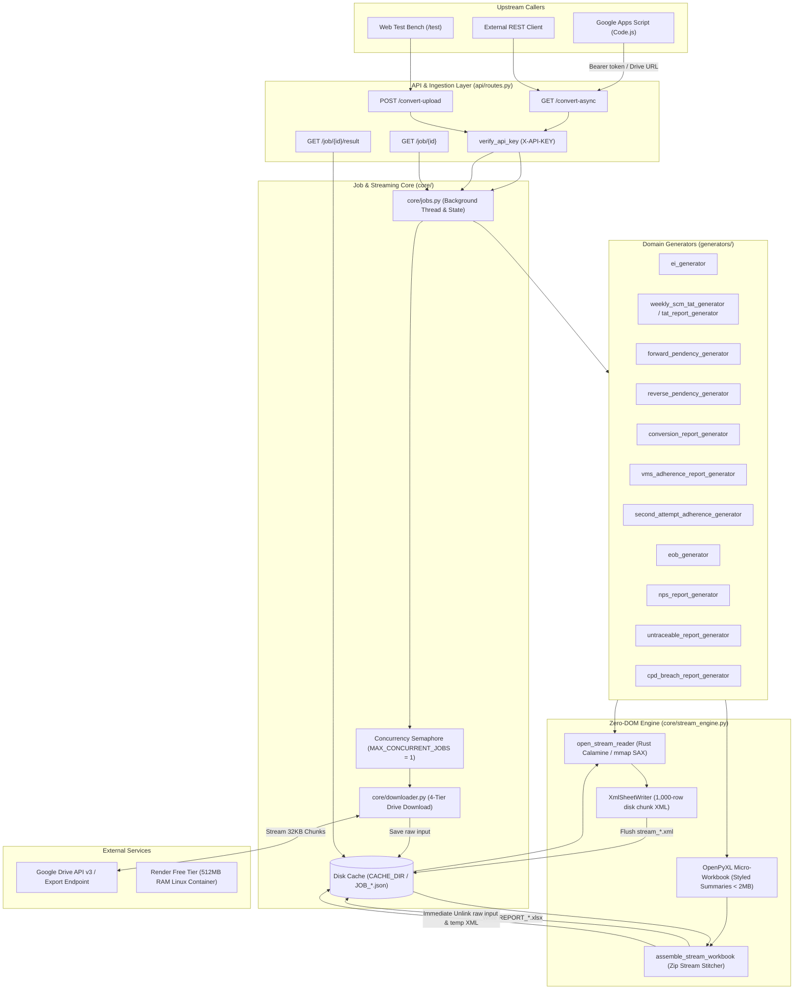
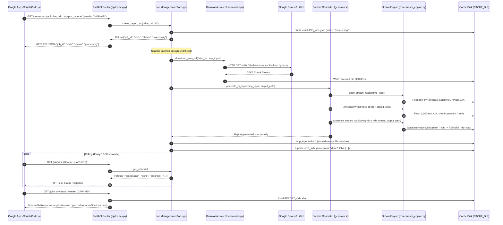
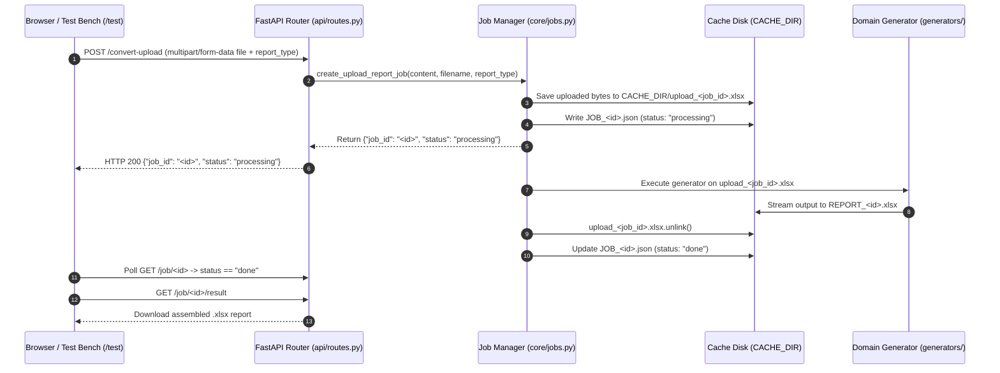
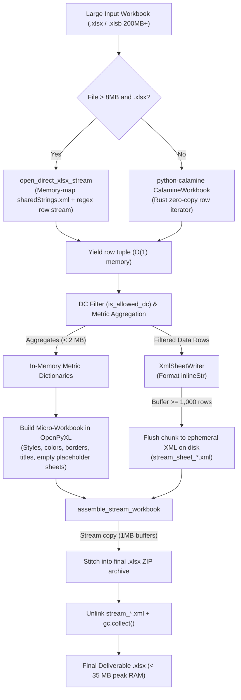

# EI Stream Report Server

## 1. Overview
The **EI Stream Report Server** (`ei_stream_server`) is a high-throughput, Zero-DOM asynchronous streaming microservice built in Python using [[FastAPI]] and [[Uvicorn]]. It is purpose-built to ingest, transform, and aggregate massive production supply chain spreadsheets (`.xlsx`, `.xlsb`, `.csv`, `.ods` up to 350 MB+ and 500,000+ rows) sourced from [[Google Drive]] or direct client uploads into corporate-styled, multi-tab operational Excel workbooks.

### The Operational Problem
Regional logistics operations managers across 71 distribution centers (DCs) rely on daily performance scorecards, turnaround time (TAT) metrics, delivery adherence, and aging pendency reports compiled from multi-hundred-megabyte nationwide spreadsheets. Standard spreadsheet processing libraries (`pandas`, `openpyxl`, `xlsxwriter`) load entire workbook DOM structures into memory, causing catastrophic Out-of-Memory (OOM / `SIGKILL`) crashes in resource-constrained environments such as Render's 512 MB RAM Free Tier. Furthermore, upstream Google Apps Script orchestrators cannot process these files due to a strict 50 MB heap ceiling and 6-minute execution limits.

### The Architectural Solution
The microservice implements a Zero-DOM streaming architecture leveraging SAX parsing and low-overhead generators to maintain a constant $O(1)$ memory footprint of ~15 MB to 35 MB RAM even when processing 350 MB+ workbooks. It provides asynchronous job processing with unique job tokens, Google Drive virus-scan token bypassing, multi-format parsing (`.xlsx`, `.xlsb`, `.csv`, `.ods`), and dynamic multi-tab report synthesis, allowing upstream GAS triggers and web workstations to poll job status and retrieve styled operational workbooks reliably.

## 2. Tech Stack

| Layer | Technology | Version | Notes |
| :--- | :--- | :--- | :--- |
| **Language** | [[Python]] | `>=3.10` (`3.11.0` on Render) | Core programming language; declared in `render.yaml` as `3.11.0` *(stated)*. |
| **Web Framework** | [[FastAPI]] | `>=0.100.0` | Asynchronous ASGI framework handling routing, dependency injection, and background tasks *(stated)*. |
| **ASGI Server** | [[Uvicorn]] | `>=0.22.0` | Production ASGI web server running the FastAPI app *(stated)*. |
| **Streaming Parser** | [[python-calamine]] | `>=0.1.0` | High-performance Rust-backed Excel reader reading `.xlsx`, `.xlsb`, and `.ods` via memory-mapped IO *(stated)*. |
| **Binary Excel Reader** | [[pyxlsb]] | `>=1.0.10` | Binary Excel parser supporting `.xlsb` (BIFF12) structures *(stated)*. |
| **Spreadsheet Engine** | [[OpenPyXL]] | `>=3.1.0` | Used exclusively for lightweight micro-summary generation (< 2 MB) and read-only fallback streaming *(stated)*. |
| **Data Manipulation** | [[pandas]] | `>=2.0.0` | Utilized for tabular calculations in select reports (e.g., Conversion, EOB) *(stated)*. |
| **HTTP Client** | [[requests]] | `>=2.28.0` | Synchronous HTTP client used in `core/downloader.py` for chunked streaming downloads from Google Drive *(stated)*. |
| **Async HTTP Client** | [[httpx]] | `>=0.24.0` | Used for FastAPI `TestClient` test harness execution *(stated)*. |
| **Multipart Parsing** | `python-multipart` | `>=0.0.6` | Handles multipart form-data payload parsing for direct file upload endpoints *(stated)*. |
| **Data Validation** | [[Pydantic]] | `>=2.0.0` | Data validation and settings management *(stated)*. |
| **Testing** | [[pytest]] | `>=7.0.0` | Test runner executing automated test suites in `test_server.py` *(stated)*. |
| **Hosting Platform** | [[Render]] | Free Tier (Singapore) | Web service environment with 512 MB RAM and 0.5 CPU limits *(stated)*. |
| **Upstream Caller** | [[Google Apps Script]] | V8 Runtime | Automated time-driven cron triggers that invoke report generation and poll results *(stated)*. |

---

## 3. Architecture

### High-Level System Design
The server decouples input file size from memory consumption by implementing a strict **5-Layer Zero-Memory Pipeline** (`ARCHITECTURE.md:26-66`). Standard web frameworks crash on 200 MB+ spreadsheets because deserializing 15,000,000 cells into Python objects consumes 1.2 GB to 3.5 GB of RAM. The EI Stream Server bypasses this entirely:

1. **Layer 1: Concurrency Guard & Chunked Disk Ingestion**: Incoming requests from Google Apps Script or browser clients are throttled via an execution lock (`threading.Semaphore(MAX_CONCURRENT_JOBS)` where default is `1`). Files downloaded from Google Drive or uploaded via HTTP are streamed in 32 KB / 64 KB chunks directly to disk (`CACHE_DIR`), keeping RAM at 0 MB (`core/downloader.py:182-194`).
2. **Layer 2: Zero-DOM Stream Reading**: Files are opened via `core/stream_engine.py:open_stream_reader`. For `.xlsx` files exceeding 8 MB, the server invokes `open_direct_xlsx_stream`, which uses Python's `mmap` module to index `xl/sharedStrings.xml` on disk and streams worksheet row tags via regular expressions. For `.xlsb` and smaller files, it leverages the Rust-based `python-calamine` engine. Cells are yielded as lightweight tuples and immediately discarded on each iteration.
3. **Layer 3: Single-Pass In-Flight Filtering & Disk XML Streaming**: Data rows are evaluated on-the-fly against the 71 allowed distribution centers (`config/dc_config.py`). Filtered data rows are streamed straight to disk XML fragments using `XmlSheetWriter` (flushed in 1,000-row chunks). Only aggregate metric matrices (< 2 MB) are retained in memory.
4. **Layer 4: Hybrid OpenXML ZIP Stitching**: Richly formatted summary tabs (with corporate colors, merged titles, conditional formatting rules, and formulas) are created in an in-memory OpenPyXL micro-workbook. The final `.xlsx` archive is assembled via `core/stream_engine.py:assemble_stream_workbook`, which replaces empty placeholder sheets with the pre-written disk XML files using 1 MB buffered stream pipes.
5. **Layer 5: Immediate Storage & Memory Reclamation**: Once assembled, intermediate XML chunks and the original 350 MB raw input file are immediately unlinked (`unlink()`), and explicit `gc.collect()` calls return memory allocations back to the OS.



### External Services & APIs
* **Google Drive API v3 / Web Endpoints**: Sourced for raw input spreadsheets. The server connects via OAuth2 Bearer tokens or executes public form-bypass downloads (`core/downloader.py:200-306`).
* **Render.com Web Service Infrastructure**: Hosts the containerized application, mapping environment variables and managing incoming HTTPS traffic on `$PORT` (`render.yaml:1-16`).

---

## 4. Folder & File Structure

```text
C:\Users\User\Desktop\server\ei_stream_server\
├── api/                                # REST API and Web Interface
│   ├── __init__.py                     # Package initialization
│   ├── routes.py                       # FastAPI route definitions and job dispatch endpoints
│   └── ui.py                           # Embedded HTML test bench UI (GET /test)
├── config/                             # Centralized settings and domain configuration
│   ├── __init__.py                     # Package initialization
│   ├── dc_config.py                    # 71 Allowed Source DCs, aliases map, normalization logic
│   └── settings.py                     # Environment variables, cache paths, concurrency limits
├── core/                               # Zero-memory streaming and infrastructure engine
│   ├── __init__.py                     # Package initialization
│   ├── auth.py                         # API Key validation dependency (X-API-KEY header)
│   ├── downloader.py                   # Multi-strategy Google Drive downloader with bypass logic
│   ├── jobs.py                         # Background job manager, disk persistence, state recovery
│   ├── logger.py                       # In-memory bounded per-job logging ring buffer
│   └── stream_engine.py                # Zero-DOM XML reader, mmap sharedStrings, ZIP stitcher
├── generators/                         # Domain-specific report generation modules
│   ├── __init__.py                     # Generator package registry exporting all 12 modules
│   ├── conversion_report_generator.py  # COD/Prepaid conversion report (Sameday & D-1)
│   ├── cpd_breach_report_generator.py  # Customer Promise Date breach delay attribution report
│   ├── ei_generator.py                 # Executive Index summary & agent counsel/warning report
│   ├── eob_generator.py                # End of Business priority shipment & status breakdown
│   ├── forward_pendency_generator.py   # Forward undelivered pendency & CPD-DID priority report
│   ├── nps_report_generator.py         # Net Promoter Score breakdown by DC and delivery agent
│   ├── reverse_pendency_generator.py   # Reverse return pendency & critical aged P0 items report
│   ├── second_attempt_adherence_generator.py # 2nd delivery attempt compliance report
│   ├── tat_report_generator.py         # SCM 24-hour turnaround time dispatch report
│   ├── untraceable_report_generator.py # Untraceable parcel tracking and loss valuation report
│   ├── vms_adherence_report_generator.py # Vehicle Management System vehicle scan adherence report
│   └── weekly_scm_tat_generator.py     # 7-tab Weekly SCM TAT, HCQ, and root cause analysis report
├── app.py                              # FastAPI application factory, CORS, and startup lifespan
├── main.py                             # Server entrypoint running Uvicorn on $PORT
├── render.yaml                         # Render.com Infrastructure-as-Code service deployment manifest
├── requirements.txt                    # Project Python package dependencies
├── test_server.py                      # Complete test suite testing API and streaming generators
├── ARCHITECTURE.md                     # Comprehensive technical whitepaper on streaming pipeline
├── Deployment.md                       # Operational deployment runbook for Render.com Free Tier
├── README.md                           # Project introduction, quick start, and API reference
├── API_KEY.txt                         # Plaintext credential reference file committed to repository
└── .gitignore                          # Git ignore rules for virtualenvs, caches, and temp files
```

---

## 5. Core Modules & Responsibilities

### `core/stream_engine.py`
- **Purpose:** Core engine implementing zero-memory single-pass reading, disk XML chunk writing, and hybrid OpenXML ZIP assembly.
- **Key Functions/Classes:**
  - `ColumnFinder(headers, schema)`: Resilient regex-based column detector resolving column indices by clean name or keyword fallbacks.
  - `XmlSheetWriter(sheet_name, headers, chunk_size=1000)`: Context manager formatting rows into OpenXML `<row>` and `<c>` tags, flushing to an ephemeral disk XML file every 1,000 rows ($0$ MB RAM).
  - `assemble_stream_workbook(summary_workbook, stream_sheets, output_path)`: Stitches an in-memory OpenPyXL summary workbook with raw XML disk sheets, patching `[Content_Types].xml`, `xl/workbook.xml`, and `xl/_rels/workbook.xml.rels` via 1 MB buffer streams.
  - `open_direct_xlsx_stream(file_path, sheet_name, header_row)`: Context manager that memory-maps `xl/sharedStrings.xml` using `mmap`, indexes string offsets via regex array, and streams worksheet XML rows with flat < 60 MB RAM on 1 GB+ uncompressed files.
  - `open_stream_reader(file_path, sheet_name, header_row)`: Universal entry point. Selects direct XML stream if file > 8 MB, else Rust `python-calamine`, falling back to `openpyxl(read_only=True)`. Yields `(headers, row_iterator)`.
  - `get_sheet_names(file_path)`: Inspects workbook sheet names in $0$ MB RAM by parsing `xl/workbook.xml` within the ZIP header or calling Calamine metadata.
  - `esc(val)`: Fast XML entity escaping (`&`, `<`, `>`, `"`).
- **Depends on:** `python-calamine`, `openpyxl`, `mmap`, `zipfile`, `tempfile`, `xml.etree.ElementTree`.
- **Depended on by:** `generators/*` (all 12 generators).
- **Notable logic/gotchas:** 
  - Direct OpenXML streaming triggers automatically for `.xlsx` files > 8 MB (`core/stream_engine.py:569`) to prevent `python-calamine` from loading massive shared strings into RAM (> 400 MB).
  - Uses LRU cache `@functools.lru_cache(maxsize=65536)` for string lookups in `mmap` sharedStrings (`core/stream_engine.py:451`).
  - Triggers manual `gc.collect()` every 15,000 rows during streaming iteration (`core/stream_engine.py:364`).

### `core/jobs.py`
- **Purpose:** Central coordinator managing asynchronous background task execution, job status persistence, concurrency locks, and cache management.
- **Key Functions/Classes:**
  - `create_report_job(drive_url, report_type, sub_type)`: Validates URL, checks if cached result exists within `CACHE_TTL`, writes initial job metadata to `JOB_<id>.json`, and dispatches background worker thread.
  - `create_upload_report_job(file_bytes, filename, report_type, sub_type)`: Writes uploaded bytes to disk and spawns background worker thread.
  - `background_report_job(job_id, file_id, output_path, report_type)`: Worker function. Acquires `conversion_semaphore` (timeout 600s), downloads source file if needed, routes to appropriate generator, logs step timings, inspects output tabs, unlinks raw input file immediately upon success, and releases semaphore.
  - `recover_jobs_from_disk()`: Invoked on server boot (`app.py:lifespan`). Scans `CACHE_DIR` for `JOB_*.json` metadata. Marks any interrupted `"processing"` jobs as `"error"` ("Job interrupted by server restart") to prevent reboot crash loops.
  - `generate_proper_report_filename(...)`: Dynamically generates clean, standardized filenames (e.g. `Conversion_Summary_Sameday_Report_18-08-2026_17-Sep-2026.xlsx`) based on report type, sub-type, and extracted report date.
  - `evict_old_jobs()`: Unlinks job metadata and output files older than `CACHE_MAX_AGE` (7,200s / 2 hours).
- **Depends on:** `config.settings`, `core.downloader`, `core.logger`, `generators.*`.
- **Depended on by:** `api/routes.py`, `app.py`.
- **Notable logic/gotchas:**
  - `conversion_semaphore = threading.Semaphore(MAX_CONCURRENT_JOBS)` enforces sequential job execution (`MAX_CONCURRENT_JOBS = 1`).
  - Immediate disk reclamation: as soon as the output `.xlsx` is validated (> 100 bytes), `tmp_input.unlink()` deletes the 350 MB input file (`core/jobs.py:330-335`).
  - Tab validation: reads output sheet names in < 1ms via lightweight zipfile XML parsing without constructing a DOM (`core/jobs.py:316-328`).

### `core/downloader.py`
- **Purpose:** Robust Google Drive file downloader supporting OAuth authentication, public sharing URLs, virus scan warnings, and HTML confirmation forms.
- **Key Functions/Classes:**
  - `download_from_url(url, dest_path, job_id)`: Single download entry point. Executes a 4-tier download cascade:
    1. Drive API v3 `Files.export` (Google Sheets $\rightarrow$ OpenXML `.xlsx`).
    2. Drive API v3 `Files.get alt=media` (Binary files with OAuth Bearer token).
    3. Direct HTTP GET on URL (handles standard redirects).
    4. Public `uc?export=download` with cookie inspection (`download_warning` cookie bypass).
  - `_handle_drive_confirm_form(session, html_text, headers, job_id)`: Parses Google Drive HTML virus scan warning pages, extracts `id`, `confirm`, and `uuid` tokens, and submits the internal confirmation form or targets `drive.usercontent.google.com`.
  - `extract_file_id(url_or_id)`: Regex extractor parsing 25+ character Google Drive file IDs from varied URL formats.
  - `_validate_downloaded_file(dest_path)`: Inspects first 4,096 bytes of downloaded file; raises HTTP 400 if HTML content (`accounts.google.com` or `<html`) is detected instead of spreadsheet binary.
- **Depends on:** `requests`, `fastapi.HTTPException`, `core.logger`.
- **Depended on by:** `core/jobs.py`.
- **Notable logic/gotchas:** Google Drive serves HTML virus scan confirmation pages for files > 25 MB. `_handle_drive_confirm_form` executes up to 4 fallback sub-strategies (form submission, usercontent direct link, classic uc link, href parsing) to bypass this barrier automatically (`core/downloader.py:48-143`).

### `core/auth.py`
- **Purpose:** Header-based API authorization.
- **Key Functions/Classes:**
  - `verify_api_key(x_api_key)`: FastAPI dependency reading `X-API-KEY` header. Compares against `REQUIRED_API_KEY`. Raises `HTTPException(403)` on mismatch.
- **Depends on:** `config.settings.REQUIRED_API_KEY`.
- **Depended on by:** `api/routes.py`.
- **Notable logic/gotchas:** If `REQUIRED_API_KEY` is empty or unset, all requests are permitted *(inferred from code structure)*.

### `core/logger.py`
- **Purpose:** Structured logging and in-memory log buffering for real-time client polling.
- **Key Functions/Classes:**
  - `log_job_message(job_id, message, level)`: Logs to standard Python logger and appends to per-job circular buffer.
  - `get_job_log_lines(job_id)`: Retrieves accumulated log entries for a given job.
  - `print_job_start`, `print_job_step`, `print_job_success`, `print_job_error`: Standardized console telemetry formatters.
- **Depends on:** `logging`, `collections.defaultdict`.
- **Depended on by:** `core/jobs.py`, `core/downloader.py`, `api/routes.py`.
- **Notable logic/gotchas:** The buffer `_job_logs[job_id]` is capped at 500 lines per job (`core/logger.py:15-16`) to prevent memory leaks during long-running tasks.

### `config/settings.py`
- **Purpose:** Environment variable ingestion and centralized runtime configuration.
- **Key Variables:**
  - `REQUIRED_API_KEY`: Sourced from `os.getenv("API_KEY")`.
  - `CACHE_DIR`: Sourced from `os.getenv("CACHE_DIR")`, defaults to `tempfile.gettempdir() / "ei_stream_cache"`.
  - `CACHE_TTL`: Cache retention duration in seconds, defaults to `1800` (30 minutes).
  - `CACHE_MAX_AGE`: Metadata eviction limit in seconds, defaults to `7200` (2 hours).
  - `MAX_CONCURRENT_JOBS`: Concurrency semaphore limit, defaults to `1`.
- **Depends on:** `os`, `tempfile`, `pathlib`.
- **Depended on by:** `core/auth.py`, `core/jobs.py`, `api/routes.py`.

### `config/dc_config.py`
- **Purpose:** Central domain registry of allowed logistics distribution centers and hub aliasing.
- **Key Variables/Functions:**
  - `ALLOWED_SOURCE_DCS`: Explicit list of 71 allowed DC codes (`GZB`, `NDA`, `GND`, `WDL`, `MEE`, `AGR`, `MTH`, `SPR`, `MZN`, `HPA`, `FZD`, `LKO`, `BRL`, `MOR`, `GKP`, `DRD`, `HDN`, `HRD`, `RDP`, `RSH`, `RKR`, `GRM`, `GUR`, `KOT`, `JDH`, `UDR`, `AJM`, `BKR`, `BLW`, `SIK`, `SGG`, `ALW`, `HIS`, `ROH`, `SON`, `PPT`, `KRN`, `AMB`, `YMG`, `KRK`, `JMU`, `ATQ`, `SRG`, `PTK`, `NBZ`, `LXR`, `FAR`, `SDL`, `JAI`, `ALL`, `KNP`, `VNS`, `MAU`, `MRZ`, `AYP`, `ALG`, `DEO`, `JNP`, `JHS`, `RBR`, `BTD`, `CAR`, `JLD`, `LDH`, `LUD`, `PTL`, `RUP`, `SHM`, `MPR`, `MHP`, `NDL`).
  - `DC_ALIASES`: Dictionary mapping spokes/mini-hubs to canonical parent DCs (e.g., `'CAR-KHR'`, `'CAR_KHR'`, `'CARKHR'` $\rightarrow$ `'CAR'`).
  - `normalize_dc_code(raw_dc)`: Resolves any DC code or alias to its canonical parent code.
  - `is_allowed_dc(raw_dc)`: Validates if raw DC or its alias belongs to `ALLOWED_DCS_SET`.
- **Depends on:** Built-in Python structures.
- **Depended on by:** `generators/*` (all 12 generators).

### `api/routes.py`
- **Purpose:** FastAPI REST endpoints handling client requests, job status queries, file downloads, and manual cache flushing.
- **Key Endpoints:**
  - `GET /`: Health & server readiness probe.
  - `GET /health`: Detailed status reporting active job counts and cache directory path.
  - `GET /convert-async`: Submits an asynchronous report generation job via Google Drive URL.
  - `POST /convert-upload` (and aliases `/generate-report`, `/reports/{type}`): Receives direct multipart file uploads.
  - `GET /job/{job_id}`: Returns job execution status (`processing`, `done`, `error`), progress messages, sheet tabs, and log lines.
  - `GET /job/{job_id}/logs`: Retrieves execution logs for debugging.
  - `GET /job/{job_id}/result`: Downloads the completed `.xlsx` file.
  - `GET /clear-cache` / `POST /clear-cache`: Purges all cached files and resets active job state.
- **Depends on:** `core/auth.py`, `core/jobs.py`, `core/logger.py`, `config/settings.py`.
- **Depended on by:** `app.py`.

### `api/ui.py`
- **Purpose:** Serves an interactive HTML5/JavaScript test bench for browser-based testing.
- **Key Functions/Classes:**
  - `test_ui()`: Renders `/test` route containing form inputs for Google Drive URLs, report type selector, API Key input, and real-time polling logic.
- **Depends on:** `fastapi.responses.HTMLResponse`.
- **Depended on by:** `app.py`.

### `app.py` & `main.py`
- **Purpose:** Application factory and production startup script.
- **Key Functions/Classes:**
  - `create_app()`: Instantiates FastAPI app, enables CORS (`allow_origins=["*"]`), registers lifespan handler, and mounts API and UI routers.
  - `lifespan(app)`: Context manager running startup tasks (`recover_jobs_from_disk()`) and shutdown logging.
  - `main.py`: Entrypoint binding host `0.0.0.0` and port from `PORT` environment variable (defaults to `8000`).

---

### Domain Generators (`generators/`)

#### `generators/weekly_scm_tat_generator.py`
- **Purpose:** Generates the massive 7-tab Weekly SCM TAT & HCQ report.
- **Output Tabs (7):**
  1. `summary`: Filtered DC scorecard with 4 tables (Overall, Forward, Reverse, Within vs Post TAT).
  2. `raw data`: Full filtered dataset for configured DCs (streamed to disk XML).
  3. `Tasks`: Open/pending tasks (`status != 'Closed'`) across Within TAT and Post TAT (streamed to disk XML).
  4. `today's tasky`: Open tasks where `Closure_TAT == 'Post TAT'` and `Aging == '<24Hrs'` (streamed to disk XML).
  5. `today's task summary`: Executive KPI cards (Open, Forward, Reverse), DC $\times$ Aging matrix, and L4/L5 root cause analysis.
  6. `hub l5 summary`: Hub-wise matrix with distinct L5 Root Reasons as column headers.
  7. `hub l4 l5 breakdown`: Granular hub drilldown showing L4, L5, open counts, and share percentages.
- **Key Functions:** `generate_weekly_scm_tat_report(input_file, output_file)`, `parse_dc_sheet`, `normalize_aging_bucket`, `aging_sort_key`, `build_summary_sheet`, `build_task_summary_sheet_from_metrics`, `_post_process_xml_entities`.
- **Notable logic/gotchas:** Runs `_post_process_xml_entities` on final `.xlsx` to replace `&gt;` with `>` inside XML files to prevent Google Sheets from displaying raw HTML entity codes (`generators/weekly_scm_tat_generator.py:972-1000`).

#### `generators/ei_generator.py`
- **Purpose:** Generates Executive Index performance summary report.
- **Output Tabs (5):** `SUMMARY`, `Filtered_Source_DC`, `FWD EI`, `REVERSE EI`, `Agent Summary`.
- **Key Functions:** `generate_ei_report(source_file_path, output_file_path)`, `parse_task_per_1k_rows`, `select_daily_block`, `select_wtd_block`, `write_summary_sheet`, `write_agent_summary_tab`.
- **Notable logic/gotchas:** Parses dual-header date and WTD blocks in `Task_per_1k` tab; categorizes delivery agents into "Agents to be counselled" (counts > 2) and "Agents to be Warned" (counts > 5).

#### `generators/forward_pendency_generator.py`
- **Purpose:** Processes undelivered forward shipments across North region hubs.
- **Output Tabs (3):** `Summary` (Aging-wise table, Priority Table P0-P4, CPD Pendency table), `CPD-DID pendency`, `RAW`.
- **Key Functions:** `generate_forward_pendency_report(input_file, output_file)`, `compute_aging_category`, `normalize_priority`, `build_summary_sheet_from_pivots`.

#### `generators/reverse_pendency_generator.py`
- **Purpose:** Evaluates return shipments and aged reverse pickups.
- **Output Tabs (3):** `Summary` (Aging categories: `0-2 Days`, `3-5 Days`, `6-10 Days`, `>10 Days`), `Critical P0` (Aging $\ge 2$ days), `Raw`.
- **Key Functions:** `generate_reverse_pendency_report(input_file, output_file)`, `compute_age_bucket`, `build_summary_sheet`.

#### `generators/conversion_report_generator.py`
- **Purpose:** Computes COD to Prepaid conversion success rates for Sameday and D-1 runs.
- **Output Tabs (2):** `{prefix} DC_View` and `{prefix} Agent_View` (where `{prefix}` is `Sameday` or `D-1`).
- **Key Functions:** `generate_conversion_report(input_file, output_file, sub_type)`, `extract_report_date_from_agent_view`, `build_dc_view`, `build_agent_view`, `style_sheet`.
- **Notable logic/gotchas:** Applies conditional threshold styling to success percentages (< 85% Red, 85–90% Yellow, > 90% Green). Sanitizes `NaN` float values to prevent integer conversion errors (`generators/conversion_report_generator.py:262-277`).

#### `generators/tat_report_generator.py`
- **Purpose:** 24-hour turnaround time dispatch performance tracking.
- **Output Tabs (2):** `SCM tat performance summary` and `SCM TAT raw data`.
- **Key Functions:** `generate_tat_report(input_file, output_file)`.

#### `generators/vms_adherence_report_generator.py`
- **Purpose:** Vehicle Management System route and scan compliance tracking.
- **Output Tabs (2):** `Summary` (Total, Adherence, Non-Adherence, Adherence %) and `Raw`.
- **Key Functions:** `generate_vms_adherence_report(input_file, output_file)`. Supports both legacy and new adherence status tags (`Done`/`Not Done` and `Adherence`/`Non-Adherence`).

#### `generators/second_attempt_adherence_generator.py`
- **Purpose:** Evaluates re-attempt delivery compliance across forward and reverse shipments.
- **Output Tabs (2):** `Summary` (side-by-side FWD and REV adherence matrices) and `Raw`.
- **Key Functions:** `generate_second_attempt_adherence_report(input_path, output_path)`.

#### `generators/cpd_breach_report_generator.py`
- **Purpose:** Tracks shipments breaching Customer Promise Dates categorized by operational delay tag.
- **Output Tabs (2):** `summary` (Breakdown across `Customer Attributed`, `Last Mile delay`, `RTO/IC - NCD`, and `Total CPD Breach`) and `raw`.
- **Key Functions:** `generate_cpd_breach_report(input_file, output_file)`.

#### `generators/nps_report_generator.py`
- **Purpose:** Net Promoter Score customer satisfaction evaluation.
- **Output Tabs (2):** `Summary` (DC and Agent response breakdown with calculated NPS %) and `Raw`.
- **Key Functions:** `generate_nps_report(input_file, output_file)`, `nps_pct(p, n, d)`. NPS calculated as `round((Promoters - Detractors) / Total * 100)`.

#### `generators/eob_generator.py`
- **Purpose:** End of Business operational summary of pending and attempted parcels.
- **Output Tabs (2):** `Summary` (Table 1: Aging Bucket Priority Count; Table 2: Normalized Latest Status Count) and `Raw`.
- **Key Functions:** `generate_eob_report(input_file, output_file)`, `get_short_status`.

#### `generators/untraceable_report_generator.py`
- **Purpose:** Untraceable parcel tracking and loss claim valuation.
- **Output Tabs (2):** `Summary` (Shipment count and monetary valuation pivot across standard aging buckets: `0-2 Days`, `3-5 Days`, `6-10 Days`, `11-20 Days`, `21-30 Days`, `>30 Days`) and `Raw`.
- **Key Functions:** `generate_untraceable_report(input_file, output_file)`.

---

## 6. Data Flow / Key Workflows

### Workflow 1: Asynchronous Google Drive Report Pipeline (Primary GAS Workflow)
Used by Google Apps Script triggers to process heavy workbooks without encountering Google's 6-minute execution timeout.



### Workflow 2: Direct Multipart File Upload Workflow
Used via curl, Postman, or the embedded Web Test Bench (`/test`).



### Workflow 3: Zero-Memory Stream Reading & Assembly Architecture
Details the exact byte-level mechanics inside `core/stream_engine.py`:



---

## 7. Configuration & Environment

| Variable Name | Purpose | Required? | Default Value | Notes |
| :--- | :--- | :--- | :--- | :--- |
| `API_KEY` | Secret token required in `X-API-KEY` header for client authentication | Optional | `[REDACTED_IN_SOURCE]` | Sourced in `config/settings.py:9`. Committed fallback present in repo *(stated)*. |
| `PORT` | Local and cloud HTTP port binding | Optional | `8000` | Sourced in `main.py:22`. Automatically populated by Render on deployment *(stated)*. |
| `CACHE_DIR` | Directory for downloading raw files, storing job metadata, and writing final reports | Optional | `<OS_TEMP>/ei_stream_cache` | Sourced in `config/settings.py:12-16`. Overridable via env var *(stated)*. |
| `CACHE_TTL` | Output report retention window in seconds | Optional | `1800` (30 minutes) | Sourced in `config/settings.py:24`. Reports older than this are rebuilt *(stated)*. |
| `CACHE_MAX_AGE`| Job metadata and cached file eviction ceiling in seconds | Optional | `7200` (2 hours) | Sourced in `config/settings.py:25`. Expired jobs are purged from disk *(stated)*. |
| `MAX_CONCURRENT_JOBS` | Concurrency semaphore capacity | Optional | `1` | Sourced in `config/settings.py:28`. Enforces strictly sequential processing *(stated)*. |
| `PYTHON_VERSION` | Python runtime version for container build | Optional | `3.11.0` | Specified in `render.yaml:15` *(stated)*. |

### Secrets Management Approach
> [!warning] Critical Security Alert: Plaintext Credentials Committed
> The production API key is currently stored in plaintext across multiple repository files (`API_KEY.txt`, `render.yaml`, `Deployment.md`, `README.md`, `api/ui.py`, and `config/settings.py`). While functional for local testing, this secret must be immediately rotated in production, removed from Git history, and injected strictly via Render's encrypted dashboard environment variables.

---

## 8. External Integrations & APIs

| Service / API | Purpose | Authentication Method | Code Reference | Rate Limits / Known Quirks |
| :--- | :--- | :--- | :--- | :--- |
| **Google Drive API v3 (`Files.export`)** | Converts Google Sheets to OpenXML `.xlsx` on-the-fly | OAuth 2.0 Bearer Token (optional query parameter) | `core/downloader.py:220-230` | Rate limited by Google Cloud quotas (typically 20,000 to 100,000 requests/day). Fails if token expires. |
| **Google Drive API v3 (`Files.get alt=media`)** | Downloads uploaded binary spreadsheets directly | OAuth 2.0 Bearer Token (optional query parameter) | `core/downloader.py:232-242` | Fails with HTTP 403/404 if file permissions do not allow reading by the authenticated account. |
| **Google Drive Public (`uc?export=download`)** | Downloads publicly shared files without credentials | Public HTTP cookies / URL confirm tokens | `core/downloader.py:264-295` | Files > 25 MB trigger Google virus scan warning HTML pages. Requires cookie and form-parsing bypass. |
| **Google Apps Script (GAS)** | Upstream workflow orchestrator triggering report generation | HTTP header `X-API-KEY` | Documented in `Deployment.md:46-51` | Hard 6-minute execution quota on GAS scripts. Requires asynchronous triggering and polling. |
| **Render.com Cloud Platform** | Cloud hosting environment | Render platform API / Git webhook | `render.yaml:1-16` | Free tier instances spin down after 15 minutes of inactivity. Cold start latency is ~30 to 60 seconds. |

---

## 9. Testing

### Existing Coverage
The repository contains an automated integration test suite in `test_server.py` using [[pytest]] and FastAPI's `TestClient` (`httpx`). It covers API authentication, endpoint responses, and mock workbook generation across all streaming report generators.

* **Framework:** `pytest` (v9.0.3 verified in local runtime environment).
* **Test File:** `test_server.py` (693 lines, 15 collected test functions).

### Exact Test Execution Commands
From repo documentation (`README.md:40`):
```bash
pytest test_server.py -v
```
Or to run a specific generator test:
```bash
pytest test_server.py -k "test_forward_pendency_stream" -v
```

### Verified Audit Test Results
Running `pytest test_server.py` against the repository codebase yielded **14 PASSED**, **1 FAILED** *(stated)*:
* `test_root`: PASSED
* `test_health`: PASSED
* `test_health_invalid_key`: PASSED
* `test_forward_pendency_stream`: PASSED
* `test_reverse_pendency_stream`: PASSED
* `test_conversion_stream`: PASSED
* `test_nps_stream`: PASSED
* `test_tat_stream`: PASSED
* `test_vms_stream`: PASSED
* `test_second_attempt_stream`: PASSED
* `test_eob_stream`: PASSED
* `test_untraceable_stream`: PASSED
* `test_ei_stream`: PASSED
* `test_cpd_breach_stream`: PASSED
* `test_weekly_scm_tat_stream`: **FAILED** *(AssertionError: `test_server.py:667`)*

### Untested & Fragile Areas
* **Outdated Weekly TAT Test Assertion**: Commit `e26fe3b` and `5c88ea7` updated `weekly_scm_tat_generator.py` to produce 7 tabs (`summary`, `raw data`, `Tasks`, `today's tasky`, `today's task summary`, `hub l5 summary`, `hub l4 l5 breakdown`), but `test_server.py:667` still asserts the legacy 4 tabs (`["summary", "raw data", "todays tasks", "today's task summary"]`), causing an assertion mismatch *(stated)*.
* **Live Google Drive OAuth Download**: Network calls to Google Drive API v3 (`core/downloader.py`) are not mocked with live external credentials in automated CI; testing relies on local synthetic workbooks *(inferred)*.
* **Multipart Upload Endpoints**: Endpoints `/convert-upload` and `/clear-cache` do not have explicit integration test functions in `test_server.py` *(stated)*.
* **Extreme File Scale (> 200 MB)**: Automated tests use lightweight synthetic mock workbooks (dozens of rows); full multi-hundred megabyte stress testing is performed manually *(inferred)*.

---

## 10. CI/CD & Deployment

### Pipeline Steps
* **CI Build Pipeline:** No GitHub Actions workflow files (`.github/workflows/`) exist in the repository *(stated)*.
* **CD Automated Deployment:** Render automatically deploys on git push to branch `main`, driven by `render.yaml` *(stated)*:
  1. Detects push on default branch `main`.
  2. Executes build command: `pip install -r requirements.txt`.
  3. Executes start command: `uvicorn main:app --host 0.0.0.0 --port $PORT`.
  4. Provisions container in `singapore` region on `free` tier.

### Rollback Process
Rollbacks must be executed manually either through the Render dashboard (redeploying a prior commit) or via Git commands:
```bash
git revert HEAD
git push origin main
```
*(inferred)*.

---

## 11. Setup & Local Development

### Prerequisites
* Python `3.10` or higher (Python `3.11` recommended to mirror Render).
* `pip` and virtual environment tooling (`venv`).
* C/C++ compiler and Rust toolchain only if pre-compiled wheels for `python-calamine` are unavailable for your OS architecture.

### Clean Setup Commands
From a clean terminal session:

```bash
# 1. Clone repository
git clone https://github.com/SamarVScode/XLSX-STREAM-REPORT-GENERATOR.git
cd XLSX-STREAM-REPORT-GENERATOR

# 2. Create and activate virtual environment
python -m venv venv

# Windows PowerShell:
.\venv\Scripts\Activate.ps1
# Linux / macOS:
# source venv/bin/activate

# 3. Upgrade pip and install dependencies
pip install --upgrade pip
pip install -r requirements.txt

# 4. Run automated test suite
pytest test_server.py -v

# 5. Launch development server with auto-reload
python main.py
# Or directly via uvicorn:
uvicorn main:app --host 0.0.0.0 --port 8000 --reload
```

### Common Setup Gotchas
* **Windows Execution Policy**: When activating `venv` in PowerShell, run `Set-ExecutionPolicy -ExecutionPolicy RemoteSigned -Scope CurrentUser` if script execution is blocked.
* **Windows File Locks**: When running generators locally on Windows, temporary files may fail to delete if file handles remain unclosed. The codebase incorporates explicit try/except guards and `gc.collect()` to mitigate this.
* **Port Availability**: If port `8000` is in use, supply an alternative port via environment variable: `$env:PORT="8080"; python main.py`.

---

## 12. Security Notes

### Authentication & Authorization
* Client requests must supply the API key via the `X-API-KEY` HTTP header.
* Validated in `core/auth.py:verify_api_key` via FastAPI dependency injection.
* Enforced on all operational endpoints: `/health`, `/convert-async`, `/convert-upload`, `/job/{id}`, `/job/{id}/result`, `/clear-cache`.
* Unauthenticated endpoints: `GET /` (returns basic version info) and `GET /test` (serves HTML test UI).

### Sensitive Data Handling
* **Logistics Customer Data**: Input spreadsheets contain customer names, delivery addresses, phone numbers, tracking numbers, and COD payment values.
* **Immediate Disk Reclamation**: Raw customer data files downloaded to disk are deleted immediately (`unlink()`) once report summaries are generated (`core/jobs.py:330-335`), reducing exposure on container disk storage.
* **CORS Policy**: Configured with `allow_origins=["*"]` in `app.py:43`. For production enterprise deployments, this should be restricted to trusted domains.

### Plaintext Secret Warning
> [!warning] Security Risk: Committed Plaintext API Key
> An active production API key is checked into Git source control in `API_KEY.txt`, `render.yaml`, `Deployment.md`, `README.md`, and hardcoded as a fallback in `config/settings.py:9` and `api/ui.py:43`.
> **Remediation Plan:**
> 1. Invalidate and rotate the key immediately.
> 2. Remove `API_KEY.txt` from the Git repository (`git rm API_KEY.txt`).
> 3. Add `API_KEY.txt` and `.env` to `.gitignore`.
> 4. Configure `API_KEY` exclusively via Render's encrypted environment variables dashboard.
> 5. Change `config/settings.py` to raise a `RuntimeError` if `API_KEY` is not provided in production.

---

## 13. Known Issues, Limitations & Tech Debt

- **Single Concurrency Limit (`MAX_CONCURRENT_JOBS = 1`)**:
  - *What's wrong:* Only one heavy report transformation can run at any given moment. Simultaneous requests wait for up to 600 seconds on `conversion_semaphore.acquire(timeout=600)`. If timeout expires, the job errors out with "Server busy: concurrent limit reached."
  - *Why it exists:* Deliberate architectural protection against OOM crashes on Render's 512 MB Free Tier (`config/settings.py:28`, `ARCHITECTURE.md:74-76`).
  - *Impact:* Multiple Google Apps Script cron triggers firing at the same minute will queue or fail.
  - *Suggested fix:* Upgrade to a paid cloud tier (e.g., 2 GB–4 GB RAM) and scale `MAX_CONCURRENT_JOBS` dynamically or integrate Celery/Redis for external job queueing.

- **Outdated Test Assertion in `test_server.py`**:
  - *What's wrong:* `test_weekly_scm_tat_stream` fails with `AssertionError: assert ['summary', 'raw data', 'Tasks', "today's tasky", "today's task summary", 'hub l5 summary', 'hub l4 l5 breakdown'] == ['summary', 'raw data', 'todays tasks', 'today's task summary']`.
  - *Why it exists:* Generator output was enhanced to 7 tabs in commits `5c88ea7` and `e26fe3b`, but the test file was not updated.
  - *Impact:* `pytest` fails in CI/CD environments.
  - *Suggested fix:* Update `test_server.py:667` to assert the 7 expected sheet names.

- **Unbounded Memory Retention in `_job_logs`**:
  - *What's wrong:* Job log strings are stored in memory inside `core/logger.py:_job_logs = defaultdict(list)`. While individual job logs are capped at 500 lines, keys for old jobs are never removed during `evict_old_jobs()`.
  - *Why it exists:* Logging module is decoupled from job eviction logic.
  - *Impact:* Slow memory accumulation over thousands of job runs.
  - *Suggested fix:* Add an eviction hook in `core/logger.py` called by `core/jobs.py:evict_old_jobs()`.

- **Windows File Replacement Quirk in `weekly_scm_tat_generator.py`**:
  - *What's wrong:* In `_post_process_xml_entities`, `temp_path.replace(xlsx_path)` is wrapped in a fallback to `shutil.copyfile` due to `PermissionError` on Windows (`generators/weekly_scm_tat_generator.py:985-992`).
  - *Why it exists:* Windows keeps file handles locked until garbage collection finalizes ZIP read handles.
  - *Impact:* Slight disk I/O overhead on Windows platforms.
  - *Suggested fix:* Explicitly close all underlying file descriptors before replacing files.

- **Synchronous Downloader in Asynchronous App**:
  - *What's wrong:* `core/downloader.py` uses synchronous `requests.Session()` instead of asynchronous `httpx.AsyncClient`.
  - *Why it exists:* Synchronous streaming with redirect and form parsing is simpler and runs inside a worker thread.
  - *Impact:* Worker thread blocks on network I/O.
  - *Suggested fix:* Migrate downloader to `httpx.AsyncClient` or retain background thread execution.

---

## 14. Design Decisions & Rationale

* **Zero-DOM Streaming over Pandas/OpenPyXL DOM Loading**: *(stated)*
  - *Decision:* Build a custom streaming pipeline (`core/stream_engine.py`) rather than using `pandas.read_excel()` or standard `openpyxl.load_workbook()`.
  - *Rationale:* Deserializing 500,000 rows &times; 30 columns into Python objects requires 1.5 GB to 3.5 GB of RAM (`ARCHITECTURE.md:1-24`). On a 512 MB cloud container, this instantly triggers Linux kernel OOM killer (`SIGKILL`). The Zero-DOM pipeline streams rows in constant $O(1)$ memory (~30 MB RAM).

* **Direct OpenXML mmap Streaming for Files > 8 MB**: *(stated)*
  - *Decision:* If `.xlsx` file size exceeds 8 MB, bypass `python-calamine` and stream worksheet XML using memory-mapped (`mmap`) `sharedStrings.xml` indexing (`core/stream_engine.py:569`).
  - *Rationale:* While `python-calamine` is fast, for very large workbooks it buffers the entire shared strings table into RAM, consuming 400 MB+ and risking OOM crashes. Direct mmap keeps string lookups on disk with a small LRU cache, ensuring RAM stays under 60 MB even on 1 GB+ uncompressed files.

* **Hybrid ZIP Assembly Strategy**: *(stated)*
  - *Decision:* Render rich formatting (fonts, backgrounds, borders, conditional formatting) only for small summary tabs (< 2 MB) using OpenPyXL, and stream massive data tables as raw XML fragments.
  - *Rationale:* Business users require exact corporate branding and color rules, but OpenPyXL cannot format 500,000 cells without exhausting RAM. Hybrid stitching replaces empty placeholder XML files in the ZIP archive with disk-streamed fragments using 1 MB stream buffers.

* **Single Concurrent Job Concurrency Semaphore**: *(stated)*
  - *Decision:* Set `MAX_CONCURRENT_JOBS = 1` by default (`config/settings.py:28`).
  - *Rationale:* Ensures that a single background report transformation has 100% of the container's 512 MB memory envelope and 0.5 CPU allocation, preventing memory contention between competing jobs.

* **Asynchronous Polling Architecture for Google Apps Script**: *(stated)*
  - *Decision:* Expose `/convert-async` returning a `job_id`, requiring clients to poll `/job/{id}` and download `/job/{id}/result`.
  - *Rationale:* Google Apps Script has a hard 6-minute execution quota. Synchronous transformation of 350 MB files over HTTP could cause timeout failures in GAS. The polling pattern allows GAS to trigger jobs and poll status across separate time-triggered script invocations.

* **Centralized DC Aliasing Registry**: *(stated)*
  - *Decision:* Route all mini-hubs, spokes, and alternate codes (e.g., `CAR-KHR`, `CAR_KHR`) through `normalize_dc_code()` in `config/dc_config.py`.
  - *Rationale:* Logistics field data often uses varied spelling or sub-hub naming for distribution centers. Normalizing to parent canonical codes ensures uniform aggregation across all 12 report generators.

---

## 15. Roadmap / TODOs

- [ ] **Fix Test Suite Discrepancy**: Update `test_server.py:667` to assert 7 sheets for `weekly_scm_tat_report` to restore 100% test pass rate *(inferred from test audit)*.
- [ ] **Secrets Hardening**: Remove hardcoded API keys from `API_KEY.txt`, `render.yaml`, `Deployment.md`, `README.md`, `api/ui.py`, and `config/settings.py`. Require environment injection *(stated / security best practice)*.
- [ ] **Job Log Memory Cleanup**: Introduce periodic eviction for `_job_logs` in `core/logger.py` matching `evict_old_jobs()` *(inferred)*.
- [ ] **Automated CI/CD**: Add GitHub Actions workflow (`.github/workflows/test.yml`) to execute `pytest` on pull requests *(inferred)*.
- [ ] **Expand DC Aliases**: Add additional spoke-to-hub alias mappings in `config/dc_config.py:DC_ALIASES` as regional logistics networks expand *(inferred from commit 6452f28)*.
- [ ] **Client SDK / Apps Script Library**: Package `ei_report_trigger/Code.js` into an installable Google Apps Script library for seamless deployment across multiple regional sheets *(inferred)*.

---

## 16. Changelog

*No prior note supplied — changelog starts here.*

- **2026-09-13** (`e26fe3b`): Include Allahabad hub across generators; update weekly SCM TAT report with Tasks and today's tasky tabs, freeze Source DC col in hub l5 summary, and add DC Task Volume table.
- **2026-09-13** (`5c88ea7`): `feat(weekly-report)`: Add hub l5 summary and l4-l5 breakdown tabs, fix XML `&gt;` rendering for Google Sheets.
- **2026-09-13** (`f4a3cdf`): `fix(weekly-report)`: Dynamic DC column detection, aging normalization and table spacing.
- **2026-09-12** (`6452f28`): `feat`: Add weekly SCM TAT streaming report, P0/P1 forward pendency, and modular mini-DC aliasing across all generators.
- **2026-09-10** (`8421d18`): `feat`: Add `cpd_breach` report generator with zero-memory stream architecture.
- **2026-09-07** (`cf427fe`): `feat(vms)`: Support Adherence and Non-Adherence status and update summary headers.
- **2026-09-06** (`128846f`): `fix(ei)`: Resolve empty weekly table and summary dates in streaming reader.
- **2026-09-06** (`ee8d673`): Fix cannot convert float NaN to integer in conversion report generator.
- **2026-09-05** (`7f602d0`): `fix(stream_engine)`: Lower direct stream threshold to 8MB, fix rel target path normalization, and optimize zero-memory sheet discovery.
- **2026-09-04** (`bb27625`): `feat(stream_engine)`: Add direct OpenXML streaming reader with mmap `sharedStrings` for massive workbooks.

---

## 17. Glossary

- **Zero-DOM:** A processing architecture where structured documents (such as XML or spreadsheets) are parsed and evaluated sequentially row-by-row without building an in-memory document object model.
- **Calamine (`python-calamine`):** A high-performance Rust library with Python bindings designed to parse Excel and OpenDocument spreadsheet files with zero-copy memory-mapped operations.
- **OpenXML:** The ECMA-376 international standard for zipped XML spreadsheet files (`.xlsx`).
- **Distribution Center (DC) / Hub:** A regional logistics sorting and delivery hub responsible for last-mile delivery and initial return ingestion.
- **Customer Promise Date (CPD):** The guaranteed delivery commitment date provided to an e-commerce buyer.
- **Delivered In Days (DID):** Delivery speed metric measuring elapsed days from shipment creation to final delivery.
- **P0 / P1 / P2 / P3 / P4:** Operational priority levels for undelivered shipments (P0 represents critical aged pendency $\ge 2$ days).
- **Out For Delivery (OFD):** Status of a forward parcel assigned to a delivery agent and actively out on a delivery route.
- **Out For Pickup (OFP):** Status of a reverse return parcel assigned to an agent to collect from a customer.
- **Task per 1k:** Operational quality metric measuring defect or escalation tickets raised per 1,000 dispatched orders.
- **Turnaround Time (TAT):** Supply chain efficiency metric tracking the duration taken to move shipments between operational stages.
- **Vehicle Management System (VMS):** System tracking delivery vehicles, scanning compliance, and driver route adherence.
- **End of Business (EOB):** Daily operational closing report summarizing pending, attempted, and completed parcel statuses.
- **Week to Date (WTD):** Cumulative operational metric aggregated from the start of the current operational week up to the reporting date.

---

## 18. Related Notes

* Placeholder wikilinks to related architectural records and sister repository projects:
  - [[EI Stream Report Server — Architecture Decisions]]
  - [[EI Stream Report Server — Changelog]]
  - [[Projects/Repo-xlsx_to_csv_bridge|xlsx_to_csv_bridge]]
  - [[Projects/Repo-DataConversion|DataConversion]]
  - [[Projects/GAS-EI-Pan-India-Report|GAS: EI Pan India Report]]
  - [[Projects/GAS-HourlyConversionReport|GAS: HourlyConversionReport]]
  - [[Projects/GAS-Lake-Ingestion-Pipeline|GAS: Lake Ingestion Pipeline]]
  - [[Projects/GAS-dc-rca-progression|GAS: dc rca progression]]
  - [[Projects/GAS-spf-final|GAS: spf final]]

---

## 19. Update Instructions (meta)

To refresh or regenerate this memory document in future runs:
1. Provide this existing document alongside the target repository path (`C:\Users\User\Desktop\server\ei_stream_server`) to the agent.
2. The agent must inspect Git history using `git log -n 10 --date=short` and diff the latest changes against Section 16 (Changelog).
3. If new report generators, environment variables, or endpoints have been added, update Sections 2, 4, 5, 7, and 8 accordingly.
4. Run `pytest test_server.py -v` and update Section 9 (Testing) with current test pass/fail metrics.
5. Preserve manually authored context in Section 14 (Design Decisions & Rationale) and Section 18 (Related Notes). Never overwrite previous manual annotations unless the codebase has explicitly changed or invalidated them.
