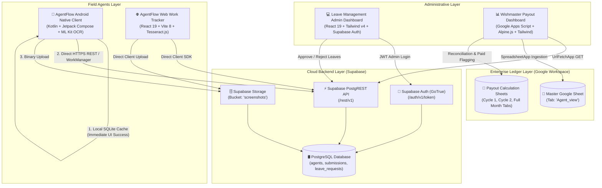
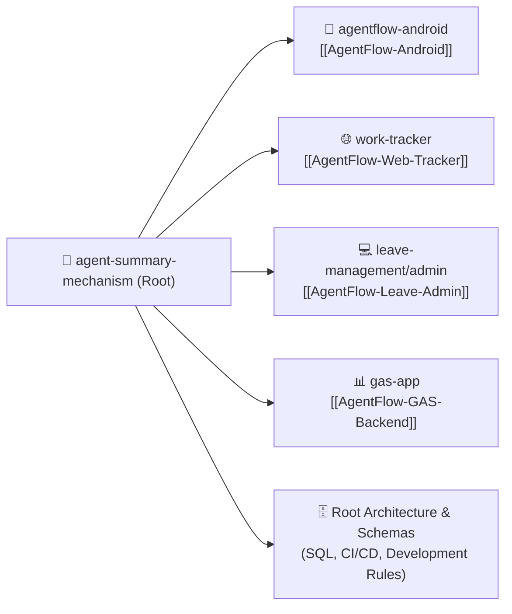
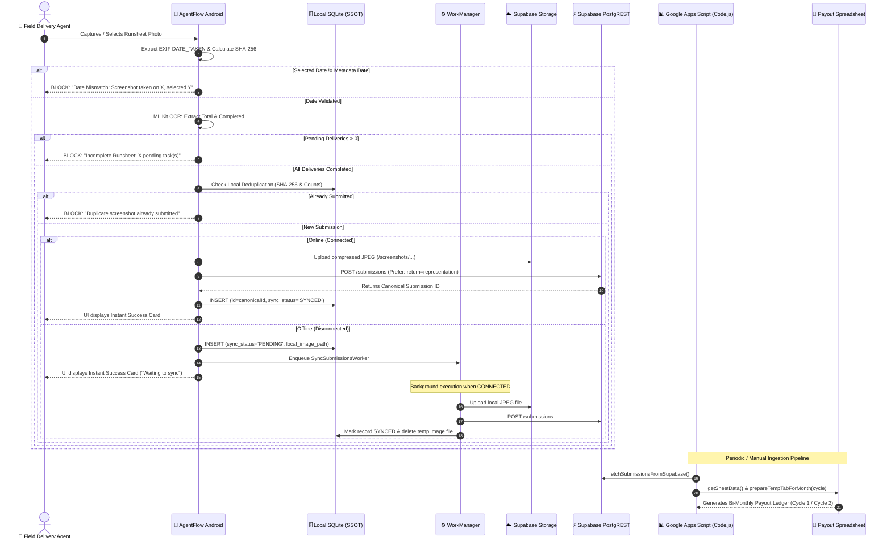
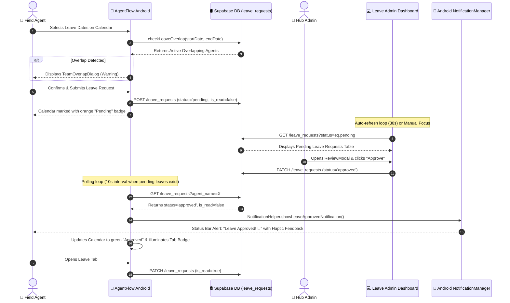

# agent-summary-mechanism
> **AgentFlow Logistics & Agent Payout Platform** — Monorepo Architecture & Cross-System Master Blueprint

---

## 1. Overview
The `agent-summary-mechanism` repository is an end-to-end logistics operations, work verification, leave administration, and bi-monthly agent payout ecosystem designed for warehouse hubs, field delivery agents, and logistics administrative operations.

### The Operational Problem
Last-mile delivery hubs face pervasive operational reconciliation gaps between physical delivery runsheets, delivery associate attendance, and financial payout disbursements. Manual paper runsheet handling results in lost proofs, fraudulent or misdated claims, uncoordinated rider absenteeism, and delayed bi-monthly payroll calculations. Furthermore, operations teams lack unified, real-time telemetry bridging frontline field submissions with back-office spreadsheet ledgers, leading to payout disputes and delivery capacity shortages.

### The Architectural Solution
The ecosystem resolves these operational challenges by integrating six specialized architectural components:
1. **Native Android Client (`AgentFlow-Android`)**: High-performance mobile app with on-device ML Kit OCR, EXIF date verification, and offline-first SQLite/WorkManager synchronization.
2. **Web Fallback Workstation (`AgentFlow-Web-Tracker`)**: Browser SPA featuring client-side WebAssembly `Tesseract.js` OCR and SHA-256 deduplication.
3. **Administrative Dashboard (`AgentFlow-Leave-Admin`)**: Centralized React 19 governance console for supervisor leave approvals, shift density monitoring, and audit trails.
4. **Cloud Persistence (`Supabase`)**: PostgreSQL database, PostgREST APIs, and Supabase Storage for encrypted proof image retention.
5. **Reconciliation Engine (`AgentFlow-GAS-Backend`)**: Google Apps Script V8 pipeline computing bi-monthly payout tabs (`Cycle 1`, `Cycle 2`, `Full Month`) directly in Google Sheets.
6. **Root Orchestration Architecture**: Unified monorepo tooling and shared contracts ensuring zero data loss and automated bi-monthly settlement.

## 2. Tech Stack

| Layer / Subsystem | Technology | Version | Purpose & Architectural Notes |
|---|---|---|---|
| **Monorepo Topology** | Multi-Manifest Hybrid Monorepo | N/A | Contains 4 decoupled sub-projects: native Android client, React Web tracker, React Admin dashboard, and GAS backend *(stated)*. |
| **Mobile Client (`agentflow-android`)** | Kotlin / Jetpack Compose / Material 3 | Kotlin 2.1.0 / Compose BOM 2025.02.00 / AGP 8.8.0 | Native Android client (`com.agentflow.tracker`), compileSdk 35, minSdk 26, targetSdk 35. Local SQLite (`LocalSubmissionsDbHelper`), WorkManager 2.10.0, OkHttp 4.12.0, Coil Compose 2.7.0. |
| **Mobile OCR Engine** | Google Play Services ML Kit Text Recognition | `19.0.1` | On-device spatial text recognition with 2D bounding-box grid mapping (`OcrParser.kt`) and mathematical count reconciliation. |
| **Web Client (`work-tracker`)** | React 19 / Vite 8 / Tesseract.js | React 19.2.6 / Vite 8.0.12 / Tesseract.js 7.0.0 | Client-side web portal fallback for field agents with browser-based OCR and `@supabase/supabase-js` 2.107.0 integration. |
| **Admin Web (`leave-management/admin`)** | React 19 / Vite 8 / Tailwind CSS v4 | React 19.2.7 / Vite 8.1.1 / Tailwind 4.3.2 | Operational supervisor dashboard for managing leave requests, reviewing team overlaps, and auditing historical logs; verified via `oxlint` 1.71.0. |
| **Spreadsheet Engine (`gas-app`)** | Google Apps Script (V8) / Alpine.js / Tailwind CDN | V8 Runtime / Alpine 3.x / Clasp | Enterprise spreadsheet financial reconciliation engine with bi-monthly payout cycle tabs (`c1`, `c2`, `full`), inline editing, and Supabase data ingestion. |
| **Central Database & Auth** | Supabase (PostgreSQL 15+ & GoTrue Auth) | Cloud Managed | Central relational datastore (`submissions`, `leave_requests`, `agents`), public storage bucket (`screenshots`), and JWT admin authentication. |
| **Local Device Cache** | SQLite (`SQLiteOpenHelper`) | Schema v1 (`agentflow_local.db`) | Single source of truth for Android client submissions cache with reactive `StateFlow` change broadcasting and SHA-256 deduplication. |
| **Mobile CI/CD Pipeline** | GitHub Actions | `ubuntu-latest` / JDK 17 | Automatic R8 release compilation, artifact generation, and zero-reinstall GitHub Releases publication triggered by git tags. |

---

## 3. Architecture

### High-Level System Architecture & Monorepo Topology
The monorepo connects field execution clients, administrative oversight interfaces, cloud persistence, and spreadsheet ledger generation into an integrated operational cycle:



### Monorepo Constituent Sub-Project Breakdown
Each sub-project occupies its own directory with dedicated package manifests, dependency trees, and deployment lifecycles:



---

## 4. Folder & File Structure

Below is an annotated tree of the monorepo root and all primary constituent project trees:

```
agent-summary-mechanism/
├── .github/
│   └── workflows/
│       └── build-apk.yml            # CI/CD pipeline: builds release APK, signs with persistent JKS, creates GitHub Release
├── .gitignore                       # Root ignore configuration for OS, node_modules, and build outputs
├── APP_DEVELOPMENT_RULES.md         # Mandatory engineering standards for CI/CD, offline architecture, and validation
├── PRODUCT.md                       # Product vision, brand personality, and accessibility principles
├── PROJECT_REFERENCE.md             # Android architecture reference, keystore documentation, and auto-updater SOP
├── RELEASE_CHANGELOG.md             # Release notes used by GitHub Release action and in-app auto-updater
├── STATE.md                         # Autonomous agent state, safety harness mapping, and verification logs
├── REQUIREMENTS.md                  # Development checklist and acceptance gates
├── supabase_leave_requests.sql      # PostgreSQL DDL for leave_requests table with Row-Level Security policies
│
├── agentflow-android/               # Sub-Project 1: Native Android Mobile Client (com.agentflow.tracker)
│   ├── app/
│   │   ├── agentflow-release.jks    # Persistent cryptographic signing keystore (alias: agentflow)
│   │   ├── build.gradle.kts         # App-level build script (versionCode: 7, versionName: 1.0.6, R8 minification)
│   │   ├── proguard-rules.pro       # R8 preservation rules for WorkManager, serialization, and domain models
│   │   └── src/
│   │       ├── main/
│   │       │   ├── AndroidManifest.xml   # Manifest (INTERNET, REQUEST_INSTALL_PACKAGES, POST_NOTIFICATIONS)
│   │       │   ├── java/com/agentflow/tracker/
│   │       │   │   ├── AgentFlowApplication.kt       # Application class: singleton DataStore, OkHttp, Coil ImageLoader
│   │       │   │   ├── MainActivity.kt               # Single Activity entry point with runtime notification permissions
│   │       │   │   ├── data/
│   │       │   │   │   ├── api/                      # SupabaseConfig.kt, SupabaseService.kt (pure OkHttp REST client)
│   │       │   │   │   ├── local/                    # LocalSubmissionsDbHelper.kt (SQLite), UserPreferences.kt (DataStore)
│   │       │   │   │   └── model/                    # Models.kt (Agent, Submission, LeaveRequest, CycleStats)
│   │       │   │   ├── domain/
│   │       │   │   │   ├── date/DateUtils.kt         # Date parsing, cycle calculations (c1: 1-15, c2: 16-End)
│   │       │   │   │   ├── ocr/                      # MlKitOcrExtractor.kt, OcrParser.kt (spatial grid text parser)
│   │       │   │   │   ├── sync/                     # SyncSubmissionsWorker.kt (WorkManager background sync worker)
│   │       │   │   │   ├── update/                   # AppUpdateManager.kt (GitHub Releases in-app self-updater)
│   │       │   │   │   └── utils/                    # HashUtils.kt, ImageMetadataUtils.kt, NotificationHelper.kt
│   │       │   │   └── ui/
│   │       │   │       ├── components/               # AgentFlowTopBar, AgentFlowBottomBar, AppUpdateDialog, MetricBox
│   │       │   │       ├── navigation/               # NavGraph.kt (Login, Tracker, Dashboard, Leave, Profile routes)
│   │       │   │       ├── screens/                  # Compose UI & ViewModels (dashboard, leave, login, profile, tracker)
│   │       │   │       └── theme/                    # Color.kt, Theme.kt, Type.kt (modern flat blue #2563EB design)
│   │       │   └── res/                          # Vector drawables, mipmaps, adaptive icons, FileProvider paths
│   │       └── test/                             # JUnit unit tests (DateUtilsTest.kt, OcrParserTest.kt)
│   ├── gradle/libs.versions.toml    # Centralized Gradle version catalog
│   ├── build.gradle.kts             # Root Gradle build script
│   └── settings.gradle.kts          # Gradle settings: rootProject.name = "AgentFlow", include(":app")
│
├── agent-summary-mechanism/         # Sub-Project 2: Legacy Root & Web Work Tracker Client
│   ├── Code.js                      # Legacy Google Apps Script backend file (55 KB)
│   ├── Index.html                   # Legacy HTML template (142 KB)
│   └── work-tracker/                # SPA React Web Work Tracker
│       ├── package.json             # Manifest: name: "work-tracker", React 19, Vite 8, Tesseract.js 7.0
│       ├── vite.config.js           # Vite development and build configuration
│       ├── vercel.json              # Vercel SPA routing rewrite configuration
│       └── src/
│           ├── App.jsx              # Root router, authentication gate, theme toggle, shared submissions state
│           ├── config.js            # Supabase URL and anon key configuration
│           ├── components/          # TrackerPage, Dashboard, ProfilePage, LeavePage, LoginPage, ConfirmModal
│           ├── hooks/               # useOcrExtract (Tesseract.js), useGasSubmit (Supabase upload), useSubmissions
│           ├── lib/supabase.js      # Supabase JS client instantiation
│           └── utils/               # dateUtils.js, hashUtils.js, imageUtils.js, cycleUtils.js
│
├── leave-management/                # Sub-Project 3: Web Admin Leave Management Dashboard
│   └── admin/
│       ├── package.json             # Manifest: name: "admin", React 19, Vite 8, Tailwind v4, date-fns, oxlint
│       ├── vite.config.js           # Vite configuration with @tailwindcss/vite plugin
│       ├── .oxlintrc.json           # Oxlint code quality configuration
│       └── src/
│           ├── App.jsx              # Main dashboard: statistics overview, month calendar view, 30s auto-refresh
│           ├── config.js            # Supabase endpoint configuration
│           ├── components/          # AdminLogin, PendingRequestsTable, LeaveHistoryTable, ReviewModal, ConfirmDeleteModal
│           └── hooks/
│               └── useLeaveManagement.js # Supabase GoTrue Auth token handling, leave fetching, and status updates
│
└── gas-app/                         # Sub-Project 4: Production Google Apps Script Backend & Payout Engine
    ├── .clasp.json                  # Google Clasp script ID (123Tjjgr4ICG_WlhxpbpWlmxqEOYKKKHYQu0bbSVr3w7Ggbd2UH4GI07c)
    ├── appsscript.json              # Manifest: V8 runtime, Asia/Kolkata timezone, USER_DEPLOYING execution
    ├── Code.js                      # Core server script (71 KB): Supabase ingestion, cycle tab creation, bulk status updates
    ├── Index.html                   # Embedded web dashboard (160 KB): Alpine.js, Tailwind CDN, Chart.js, cycle modal
    └── PAYOUT_CYCLES_PLAN.md        # Technical execution plan for bi-monthly cycles (c1: 1-15, c2: 16-End, full)
```

---

## 5. Core Modules & Responsibilities

### Cross-System Architecture & Responsibilities Matrix

| Sub-Project | Canonical Link | Primary Role | Core Dependencies | Primary Outputs |
|---|---|---|---|---|
| **Android Client** | [[AgentFlow-Android]] | Mobile runsheet capture, on-device OCR, offline caching, in-app self-update | Jetpack Compose, ML Kit, SQLite, WorkManager, OkHttp | Encrypted APK releases, verified runsheet submissions, leave bookings |
| **Web Tracker** | [[AgentFlow-Web-Tracker]] | Browser-based fallback for field agents to submit runsheets and review earnings | React 19, Vite 8, Tesseract.js, @supabase/supabase-js | Public web SPA deployed to Vercel/CDN |
| **Leave Admin** | [[AgentFlow-Leave-Admin]] | Administrative review, team overlap resolution, and leave lifecycle governance | React 19, Vite 8, Tailwind CSS v4, date-fns, oxlint | Protected admin web application |
| **GAS Backend** | [[AgentFlow-GAS-Backend]] | Financial ledger generation, bi-monthly cycle calculation, bulk payment status sync | Google Apps Script (V8), Alpine.js, Chart.js, Clasp | Google Sheets payout tabs, interactive web app |

---

### Root Architecture & Shared Infrastructure Files

#### `APP_DEVELOPMENT_RULES.md`
- **Purpose:** Defines mandatory engineering constraints across all projects in the repository to prevent build breaks, update failures, battery drain, and offline data corruption *(stated)*.
- **Key Directives:**
  - *CI/CD:* Never use third-party wrapper actions (`android-actions/setup-android@v3` was deprecated); rely directly on pre-installed SDKs on GitHub-hosted `ubuntu-latest` runners.
  - *Cryptographic Signing:* Maintain persistent keystore `agentflow-release.jks` with identical configuration across release and debug builds to guarantee zero-reinstall updates without `INSTALL_FAILED_UPDATE_INCOMPATIBLE`.
  - *Offline-First:* The UI must observe local SQLite database (`LocalSubmissionsDbHelper`) as Single Source of Truth (SSOT). Background uploads must use AndroidX `WorkManager` with `NetworkType.CONNECTED` constraint. Continuous timer polling loops are strictly prohibited.
  - *Anti-Tampering:* Captured dates must be extracted strictly from system `MediaStore.Images.Media.DATE_TAKEN` and binary `ExifInterface` headers (`TAG_DATETIME_ORIGINAL`). Zero filename parsing allowed. Client-side SHA-256 deduplication is mandatory before network dispatch.
- **Depends on:** Git workflow, Android toolchain.
- **Depended on by:** All sub-projects, GitHub Actions, future AI developers.

#### `.github/workflows/build-apk.yml`
- **Purpose:** GitHub Actions continuous integration pipeline for building and publishing the Android release APK.
- **Key Pipeline Steps:**
  - Triggers on push/PR to `main` and on tag pushes matching `v*` (lines 3–10).
  - Configures JDK 17 via `actions/setup-java@v4` with Gradle caching (lines 28–33).
  - Sanitizes CRLF line endings on runner: `sed -i 's/\r$//' ./gradlew && chmod +x ./gradlew` (lines 40–42).
  - Compiles release APK: `./gradlew assembleRelease --stacktrace --no-daemon` (line 47).
  - Publishes production GitHub Release assets via `softprops/action-gh-release@v2` when a version tag (`v*`) is pushed, attaching `RELEASE_CHANGELOG.md` as release notes (lines 64–75).
- **Depends on:** `agentflow-android/` Gradle project, `RELEASE_CHANGELOG.md`.
- **Depended on by:** Android in-app auto-updater (`AppUpdateManager.kt`).

#### `supabase_leave_requests.sql`
- **Purpose:** Database schema definition and Row-Level Security (RLS) policies for leave management in Supabase PostgreSQL.
- **Key Entities & Policies:**
  - Table `leave_requests` (id UUID PK, agent_name TEXT, start_date DATE, end_date DATE, status TEXT CHECK ('pending', 'approved', 'rejected'), reason TEXT, created_at TIMESTAMPTZ).
  - `ALTER TABLE leave_requests ENABLE ROW LEVEL SECURITY;`
  - RLS Policies for INSERT, SELECT, and ALL (lines 15–29).
- **Depends on:** PostgreSQL `uuid-ossp` extension.
- **Depended on by:** `agentflow-android`, `work-tracker`, `leave-management/admin`.

---

## 6. Data Flow / Key Workflows

### 1. Cross-Platform Runsheet Submission & Financial Ingestion Flow
This flow traces how a physical delivery runsheet is captured on an Android device or Web client, verified via computer vision, cached locally, synced to Supabase, and ingested into Google Sheets for payout calculation:



### 2. Leave Request, Admin Approval & Real-Time Mobile Notification Flow
This flow traces how an agent requests time off, how team concurrency is checked, how an administrator reviews the request, and how the mobile client receives instant notification:



---

## 7. Configuration & Environment

### Cross-System Environment & Configuration Matrix

| Subsystem | Configuration Store | Parameter / Key | Required | Description & Canonical Setting |
|---|---|---|---|---|
| **Root CI/CD** | GitHub Repository Secrets | `GITHUB_TOKEN` | Yes | Automatically injected by GitHub Actions runner for publishing release assets *(stated)*. |
| **Android Client** | Kotlin Object (`SupabaseConfig.kt`) | `BASE_URL` | Yes | Supabase endpoint: `https://matoieqhletkjcjfvars.supabase.co` |
| **Android Client** | Kotlin Object (`SupabaseConfig.kt`) | `ANON_KEY` | Yes | Supabase publishable anonymous key (`[REDACTED_SECRET]`) |
| **Android Client** | Kotlin Object (`SupabaseConfig.kt`) | `STORAGE_BUCKET` | Yes | Target storage bucket for runsheet images: `"screenshots"` |
| **Android Client** | Gradle (`build.gradle.kts`) | `signingConfigs.release` | Yes | Keystore: `agentflow-release.jks`, alias: `agentflow`, password: `[REDACTED_SECRET]` |
| **Android Client** | DataStore (`UserPreferences.kt`) | `agentflow_prefs` | Yes | Local preferences store: `wt_agent_name`, `wt_agent_id`, `wt_agent_rate`, `wt_theme` |
| **Web Tracker** | Vite Environment (`config.js`) | `VITE_SUPABASE_URL` | Yes | Environment variable with fallback: `https://matoieqhletkjcjfvars.supabase.co` |
| **Web Tracker** | Vite Environment (`config.js`) | `VITE_SUPABASE_ANON_KEY` | Yes | Environment variable with fallback: `[REDACTED_SECRET]` |
| **Admin Web** | Vite Environment (`config.js`) | `VITE_SUPABASE_URL` | Yes | Environment variable with fallback: `https://matoieqhletkjcjfvars.supabase.co` |
| **Admin Web** | Vite Environment (`config.js`) | `VITE_SUPABASE_ANON_KEY` | Yes | Environment variable with fallback: `[REDACTED_SECRET]` |
| **GAS Backend** | Script Globals (`Code.js`) | `SPREADSHEET_ID` | Yes | Target master spreadsheet ID: `1avV2Tx9SGaaUeFu2alONmXeXkGYqE4I5r1ZncPYmY7M` |
| **GAS Backend** | Script Globals (`Code.js`) | `TEMP_SPREADSHEET_ID` | Yes | Dedicated payout spreadsheet ID: `1yVhXMczYVNIaR1rbuMCALyfhr9H8sFat8jPGL3YdZv0` |
| **GAS Backend** | Script Globals (`Code.js`) | `RATE_PER_TASK` | Yes | Default payout rate per completed delivery: `13.00` |
| **GAS Backend** | Script Globals (`Code.js`) | `SUPABASE_URL` / `SUPABASE_KEY` | Yes | REST integration endpoint and key: `[REDACTED_SECRET]` |

---

## 8. External Integrations & APIs

| Service / External Dependency | Purpose | Authentication Method | Invocation Location in Code | Known Quotas, Limitations & Quirks |
|---|---|---|---|---|
| **Supabase PostgREST API** | CRUD operations for submissions, agents, and leaves | `apikey` & `Authorization: Bearer <anon_key>` HTTP headers | Android: `SupabaseService.kt`; Web Tracker: `supabase.js`; Admin: `useLeaveManagement.js` | REST endpoint pagination default 1000 rows. Rate-limited on free tiers. |
| **Supabase Storage API** | Storing runsheet screenshot JPEGs | Public POST with anon bearer token | Android: `SupabaseService.kt` (lines 106–131); Web Tracker: `useGasSubmit.js` | Bucket `screenshots` is configured for public read access. |
| **Supabase GoTrue Auth** | Admin authentication via password grant | POST `/auth/v1/token?grant_type=password` | Admin: `useLeaveManagement.js` (lines 81–93) | Returns JWT access token stored in browser `localStorage.admin_token`. |
| **Google ML Kit Text Recognition** | High-speed on-device runsheet OCR | Google Play Services dynamic model download | Android: `MlKitOcrExtractor.kt` & `OcrParser.kt` | Requires `com.google.mlkit.vision.DEPENDENCIES = "ocr"` in manifest; runs fully offline. |
| **GitHub Releases API** | Automated in-app update checking & APK binary download | Public GET with custom `User-Agent` | Android: `AppUpdateManager.kt` (lines 72–137) | GitHub API rate limit for unauthenticated requests is 60 requests/hr per IP address. |
| **Google Apps Script SpreadsheetApp** | Ledger creation, cycle tab generation, cell formatting | Google Workspace Internal OAuth | GAS: `Code.js` (`SpreadsheetApp.openById`) | Hard 6-minute execution quota per invocation; daily trigger limits. |

---

## 9. Testing

### Test Coverage Overview
The monorepo contains targeted unit testing for mathematical invariants, cycle slicing, and string normalizations, while end-to-end UI flows are manually verified:

- **Android Unit Tests:**
  - `agentflow-android/app/src/test/java/com/agentflow/tracker/DateUtilsTest.kt`: Tests month normalization (`"Sep"` vs `"Sept"`), cycle date range matching (`c1`: 1–15, `c2`: 16–End, `all`), and aggregate earnings calculations (`assertEquals(80 * 13.0, stats.c1Earnings)`).
  - `agentflow-android/app/src/test/java/com/agentflow/tracker/OcrParserTest.kt`: Tests runsheet layout parsing across 2-column grid text, fallback regex patterns, and newline-separated tokens.
- **Web Frontend Testing & Linting:**
  - `work-tracker/src/utils/date/cycleUtils.test.js`: Validates cycle boundary detection and date range math.
  - `work-tracker/src/utils/date/formatDateRange.test.js`: Validates date formatting strings.
  - `leave-management/admin/src/formatDateRange.test.js`: Validates admin date formatting.
  - Linting: Oxlint in `leave-management/admin` (`npm run lint`), ESLint in `work-tracker` (`npm run lint`).
- **Google Apps Script Testing:**
  - Built-in verification functions inside `gas-app/Code.js`: `testNormalizeAgentName()`, `testDoGet()`, `testCalculations()`, `testUpdateRowStatus()`, `testBulkUpdateRowStatuses()`.
- **Root Harness:**
  - `tests/test_stub.py`: Pytest harness placeholder managed by orchestrator loop.

### Verified Test & Lint Commands

```bash
# 1. Android Client Unit Tests
cd agentflow-android
./gradlew testDebugUnitTest --info

# 2. Web Work Tracker Lint
cd agent-summary-mechanism/work-tracker
npm run lint

# 3. Leave Management Admin Oxlint
cd leave-management/admin
npm run lint

# 4. Root Verification Stub
pytest tests/
```

---

## 10. CI/CD & Deployment

### Automated Release Pipeline (`.github/workflows/build-apk.yml`)
The native Android client features automated compilation and publishing:
1. **Trigger:** Push to `main` branch or tag push matching `v*` (e.g. `v1.0.6`).
2. **Environment:** Ubuntu Linux runner (`ubuntu-latest`) with pre-installed Android SDK tools.
3. **Compilation:** Executes `./gradlew assembleRelease --stacktrace --no-daemon`. R8 minification and resource shrinking are enabled in `build.gradle.kts`.
4. **Artifact Generation:** Stores `app-release.apk` and compilation log `build_output.log` as GitHub Actions build artifacts.
5. **Release Publication:** When triggered by a git tag, `softprops/action-gh-release@v2` creates an official GitHub Release, attaches `app-release.apk`, and embeds `RELEASE_CHANGELOG.md` as release notes.

### Web Deployment Pipelines
- **Web Work Tracker:** Configured for Vercel deployment with `agent-summary-mechanism/work-tracker/vercel.json` routing rewrites (`{"source": "/(.*)", "destination": "/"}`) to support client-side routing.
- **Admin Dashboard:** Standard Vite SPA build (`npm run build`), producing optimized static assets in `dist/` ready for hosting on Vercel, Netlify, or GitHub Pages.
- **Google Apps Script:** Deployed directly to Google Workspace using Google Clasp CLI:
  ```bash
  cd gas-app
  npx @google/clasp push
  ```

---

## 11. Setup & Local Development

### Prerequisites
- **Android:** Android Studio Ladybug (2024.2+) or later, JDK 17, Android SDK Platform 35.
- **Web (Node.js):** Node.js v18+ or v20+, npm v9+.
- **Google Apps Script:** Node.js, `@google/clasp` (`npm install -g @google/clasp`), and authenticated Google account (`clasp login`).

### Setup Commands by Subsystem

#### 1. Android Mobile Client
```powershell
cd "C:\Users\User\Desktop\payout app\agentflow-android"
# Build release APK locally
.\gradlew assembleRelease

# Direct ADB installation to connected physical device
& "$env:LOCALAPPDATA\Android\platform-tools\adb.exe" install -r "app\build\outputs\apk\release\app-release.apk"

# Launch MainActivity
& "$env:LOCALAPPDATA\Android\platform-tools\adb.exe" shell am start -n com.agentflow.tracker/.MainActivity
```

#### 2. Web Work Tracker SPA
```powershell
cd "C:\Users\User\Desktop\payout app\agent-summary-mechanism\work-tracker"
npm install
npm run dev
# App launches at http://localhost:5173
```

#### 3. Leave Management Admin Dashboard
```powershell
cd "C:\Users\User\Desktop\payout app\leave-management\admin"
npm install
npm run dev
# Dashboard launches at http://localhost:5173
```

#### 4. Google Apps Script Backend
```powershell
cd "C:\Users\User\Desktop\payout app\gas-app"
npx @google/clasp status
npx @google/clasp push
```

---

## 12. Security Notes

> [!WARNING]
> **Hardcoded Plaintext Secrets in Repository Code:**
> 1. **Supabase Publishable Anon Key:** Hardcoded in `agentflow-android/.../SupabaseConfig.kt` (line 5), `work-tracker/.../config.js` (line 3), `leave-management/admin/.../config.js` (line 3), and `gas-app/Code.js` (line 11). While anon keys are intended for public client use, Row-Level Security (RLS) policies must be strictly maintained in PostgreSQL to prevent unauthorized access.
> 2. **Android Production Signing Keystore in VCS:** The binary keystore `agentflow-release.jks` and credentials (`storePassword = "[REDACTED_SECRET]"`, `keyPassword = "[REDACTED_SECRET]"`) are committed directly to `agentflow-android/app/build.gradle.kts` (lines 31–34). This design was intentionally implemented to preserve permanent signing for zero-reinstall updates *(stated in PROJECT_REFERENCE.md)*, but presents security risk if the repository becomes public.
> 3. **Plaintext Password Comparison in Agents Table:** `LoginPage.jsx` (lines 32–34) and `LoginViewModel.kt` (line 50) verify credentials via `agent.password == pass` retrieved from the `agents` table over public PostgREST API without cryptographic hashing (bcrypt/Argon2).

### Declared Android Permissions (`AndroidManifest.xml`)
- `android.permission.INTERNET`: Network access for Supabase REST API, image storage uploads, and GitHub update checks.
- `android.permission.ACCESS_NETWORK_STATE`: Evaluated by `NetworkUtils.isOnline()` and WorkManager network constraints.
- `android.permission.REQUEST_INSTALL_PACKAGES`: Required by `AppUpdateManager` to invoke package installer (`Intent.ACTION_VIEW`) for in-place self-updates.
- `android.permission.POST_NOTIFICATIONS`: Android 13+ (API 33+) runtime permission required for real-time leave approval system notifications.

### Row-Level Security (RLS) Status (`supabase_leave_requests.sql`)
- RLS is explicitly enabled on `leave_requests`. However, policies currently default to `WITH CHECK (true)` and `USING (true)` because agents authenticate via `casper_id` rather than Supabase Auth UUIDs. Production hardening should enforce service-role checking or signed JWT verification.

---

## 13. Known Issues, Limitations & Tech Debt

> [!WARNING]
> **Continuous Polling Loop for Pending Leaves:**
> In `LeaveViewModel.kt` (lines 93–102), a coroutine polling loop executes every 10 seconds while pending leaves exist (`delay(10_000L)`). While this provides real-time notifications when an admin approves a leave, continuous network polling drains mobile battery and cellular data. A WebSocket-based Supabase Realtime subscription or Firebase Cloud Messaging (FCM) push notification architecture would be significantly more efficient *(inferred)*.

- **Google Apps Script 6-Minute Hard Quota:** Google Apps Script imposes a strict 6-minute execution ceiling per invocation and quotas on `UrlFetchApp` calls (20,000/day for consumer accounts, 100,000/day for Workspace accounts). In `gas-app/Code.js`, bulk operations across hundreds of agent rows must avoid synchronous cell-by-cell calls and use 2D array batch operations.
- **EXIF Timestamp Stripping by Social Messaging Apps:** If agents share runsheet screenshots via WhatsApp or Telegram before submission, the messaging service strips binary EXIF metadata. `ImageMetadataUtils.kt` gracefully falls back to `MediaStore.Images.Media.DATE_MODIFIED`, but if both are missing or tampered with, submission may require manual date alignment.
- **Legacy Hook Naming:** `useGasSubmit.js` in `work-tracker` was originally written to submit to Google Apps Script, but was refactored to submit directly to Supabase Storage and PostgREST. The legacy file name remains in place *(inferred)*.

---

## 14. Design Decisions & Rationale

- **Online-First Single Entry with Offline Fallback:** Introduced in commit `3678c84`. When connected, submissions are written directly to Supabase and immediately cached in local SQLite as `SYNCED` with the remote ID. This completely eliminated dashboard card duplication and doubled earnings calculations while maintaining seamless offline buffering when disconnected *(stated in RELEASE_CHANGELOG.md)*.
- **On-Device ML Kit OCR vs Cloud Vision API:** Chosen to guarantee zero per-request API costs, sub-second extraction latencies, and full offline functionality on field devices without relying on external network endpoints *(stated)*.
- **Persistent Keystore in VCS:** Both debug and release build variants explicitly bind to `agentflow-release.jks`. This guarantees that field devices can receive continuous over-the-air updates without encountering `INSTALL_FAILED_UPDATE_INCOMPATIBLE`, avoiding data loss from forced uninstalls *(stated in PROJECT_REFERENCE.md)*.
- **Bi-Monthly Payout Cycles (`c1` vs `c2`):** Logistics operations disburse compensation twice per month. `DateUtils.kt` and `gas-app/Code.js` partition data into Cycle 1 (days 1–15) and Cycle 2 (day 16 to end of month), creating dedicated ledger tabs in Google Sheets.

---

## 15. Roadmap / TODOs

- [ ] **Push Notification Migration:** Replace the 10-second polling loop in `LeaveViewModel.kt` with Firebase Cloud Messaging (FCM) or Supabase Realtime WebSocket listeners.
- [ ] **Cryptographic Password Hashing:** Migrate agent authentication from plaintext password matching in `agents` table to bcrypt/PBKDF2 or Supabase Auth native user accounts.
- [ ] **Supabase RLS Hardening:** Refactor `leave_requests` and `submissions` RLS policies to restrict queries by agent token rather than open public access.
- [ ] **Unified Monorepo Tooling:** Evaluate Turborepo or Nx for orchestrating web package linting and builds across `work-tracker` and `leave-management/admin`.

---

## 16. Changelog

*No prior note supplied — changelog starts here.*

- **3678c84 (2026-09-16):** `feat: online-first single entry submission, real-time leave approval notifications, bump v1.0.6`
  - Implemented online-first submission in `TrackerViewModel.kt` to eliminate duplicate dashboard entries and doubled earnings.
  - Added real-time 10-second leave approval polling, system status bar notifications (`NotificationHelper.kt`), and notification badges.
  - Added deduplication cleanup in `LocalSubmissionsDbHelper.kt`.
- **2e4445d (2026-09-15):** `feat: cross-device EXIF date normalization, offline profile earnings, instant tab switching, bump v1.0.5`
  - Normalized cross-device EXIF date parsing in `ImageMetadataUtils.kt`.
  - Added reactive offline earnings calculations to `ProfileViewModel.kt`.
- **8ec2060 (2026-09-15):** `docs: add universal APP_DEVELOPMENT_RULES.md and reference in PROJECT_REFERENCE.md`
  - Established golden rules for CI/CD, offline architecture, and media validation.
- **b47c8f0 (2026-09-15):** `fix(ci): use pre-installed Android SDK on GitHub Actions runner`
  - Eliminated third-party setup action to fix HTTP 404 SDK download failures.
- **a699516 (2026-09-15):** `fix(ci): upgrade setup-android to v4 to fix SDK download 404`
- **d803813 (2026-09-15):** `feat: offline-first SQLite caching, WorkManager background sync, strict EXIF/MediaStore date validation, bump v1.0.4`
  - Added `LocalSubmissionsDbHelper.kt` and `SyncSubmissionsWorker.kt`.
- **a7fee10 (2026-09-14):** `fix: remove duplicate dateFormatted declaration in TrackerViewModel`
- **967d158 (2026-09-14):** `feat: spatial OCR grid parser, pending task enforcement, strict multi-tier deduplication, bump v1.0.3`
  - Implemented 2D spatial bounding box parsing in `OcrParser.kt` and pending task blocking.
- **4d07143 (2026-09-14):** `docs: add comprehensive PROJECT_REFERENCE.md for future development`
- **1c90b19 (2026-09-14):** `feat: adaptive icon, flat blue theme, fix logout & navigation, add loaders, bump v1.0.2`

---

## 17. Glossary

- **Casper ID:** Unique employee identification code (e.g. `FHR10042`) used by delivery agents to authenticate and bind payout records.
- **Runsheet:** Physical or digital daily dispatch summary displaying package delivery counts: Total, Completed, Failed, and Pending.
- **Cycle 1 (`c1`):** First bi-monthly payout period spanning days 1 through 15 of a calendar month.
- **Cycle 2 (`c2`):** Second bi-monthly payout period spanning day 16 through the final day of a calendar month (28th–31st).
- **In-Place Update:** Android application update installed directly over an existing installation without uninstallation, preserving local SQLite databases and DataStore preferences.
- **R8 / ProGuard:** Android code shrinker and optimizer that strips unused classes and obfuscates bytecode during release builds.
- **Clasp:** Command Line Apps Script Projects — Google CLI tool for developing and pushing Apps Script code locally.

---

## 18. Related Notes

### Constituent Sub-Project Notes
- [[AgentFlow-Android]] — Native Android application architecture, SQLite caching, ML Kit OCR, and auto-updater.
- [[AgentFlow-Web-Tracker]] — Browser-based work tracker SPA with Tesseract.js and Supabase integration.
- [[AgentFlow-Leave-Admin]] — Web administrative leave management dashboard with date-fns and oxlint.
- [[AgentFlow-GAS-Backend]] — Google Apps Script payout ledger engine, bi-monthly cycles, and Alpine.js dashboard.

### Rules & Engineering Standards
- [[Rules/GAS-Architecture-Index|GAS Architecture Index & Agent Router]] — Authoritative decision matrix and TypeScript Native compilation standard.
- [[Rules/GAS-Webapp-Architecture-Rulebook|GAS Webapp Architecture Rulebook]] — 21-section engineering standard for Native Clasp TypeScript and zero-downtime triggers.
- [[Dashboard|Engineering Second Brain & Project Master Map]] — Central knowledge base index and operational project directory.

---


## 19. Update Instructions (meta)

To refresh this monorepo master note in future iterations:
1. Re-run repository discovery and git log analysis:
   ```bash
   git log -n 10 --oneline
   ```
2. Diff sub-project manifests (`build.gradle.kts`, `package.json`, `.clasp.json`) against Sections 2, 4, 7, and 16.
3. If new constituent sub-packages or services are added, create corresponding constituent notes and update the Architecture diagram (Section 3) and Related Notes (Section 18).
4. Preserve all manual architectural rationale in Section 14 and never paste plaintext secrets into Section 12.
