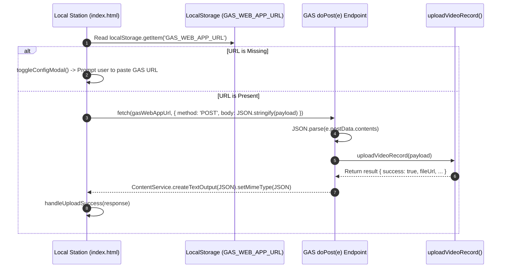

# GAS Bagging VMS Backend & Verification System

```
PROJECT NAME:        GAS Bagging VMS Backend & Verification System
PROJECT SLUG:        bagging-vms-gas-backend
CLASP SCRIPT ID:     1uAIv2MzEv9pfF4x9bfT6LudxU22KRc0zG4B87egvLfDLTQ9nEjNhV8eO
LOCAL DIRECTORY:     C:\Users\User\Desktop\bagginfvms
TARGET STAGING FILE: C:\Users\User\Desktop\gptd\prompt_project memory\bagging-vms-gas-backend.md
TARGET VAULT PATH:   C:\Users\User\project_memory\project_memory\Projects\bagging-vms-gas-backend.md (Direct vault write restricted)
PRIMARY DEPLOYMENT:  Google Apps Script Web App (V8 Runtime, executeAs: USER_DEPLOYING, access: ANYONE)
WORKSTATION RUNTIME: Local Node.js HTTP Server (server.js:8080) & start_station.bat
HOST SHELL / BRIDGE: [[Bagging-VMS-overlay]] (Top-Level WebRTC Host)
SISTER REFERENCES:   [[cameraOverlayBridge]], [[shipVerify_BridgeAutomation]], [[pre-alert]]
AUDIT SPREADSHEET:   1foxi4mQkaqMaZSYVQi1LIQbBVYEuv7Q_yVbPniG7RLA (Tab: Footage_Logs)
ARCHIVAL FOLDER:     1TYA0VByXijI-v7787GyfzTGrIHd8QA-i (Google Drive)
TIMEZONE:            GMT+05:30 (Asia/Kolkata)
```

---

## 1. Overview
**GAS Bagging VMS Backend & Verification System** is an enterprise serverless video capture, archival, and chain-of-custody logging backend engineered on [[Google Apps Script]] (GAS) and modern browser WebRTC/MediaRecorder APIs. Designed specifically for high-velocity e-commerce logistics fulfillment centers (FCs) and sorting hubs within [[Myntra]] / [[Flipkart]] supply chain networks, it provides an auditable, tamper-proof visual verification ledger for outbound packing and bagging operations.

### The Operational Problem
High-velocity fulfillment centers face major financial exposure from missing item claims, package pilferage, and carrier transit disputes. Without tamper-proof visual proof recorded at the exact moment of bagging, warehouse operations cannot verify whether an item was correctly packed before transfer to third-party couriers. Furthermore, deploying video capture within Google Apps Script faces severe technical hurdles: modern Chromium browsers enforce strict **Permissions Policy** sandboxing that blocks camera hardware (`getUserMedia`) inside cross-origin iframes, while standard uncompressed video quickly exceeds Apps Script's 50 MB payload ceiling.

### The Architectural Solution
When warehouse packing associates scan physical security seals and dispatch bags, the system coordinates real-time video capture from overhead USB cameras, enforces strict barcode scanner workflows (Seal ID scan triggers recording; Bag ID scan terminates and dispatches footage), compresses recordings client-side into lightweight WebM VP9 containers (~300 kbps to 800 kbps), streams Base64-encoded binary payloads into Google Drive, and atomically logs an audit ledger in Google Sheets (`Footage_Logs`). It overcomes browser sandboxing by functioning either as a standalone workstation application or via an authenticated iframe communicating bidirectionally with the [[Bagging-VMS-overlay]] parent host shell.

## 2. Tech Stack

| Layer | Technology | Version / Specification | Source Reference | Operational Role & Notes |
| :--- | :--- | :--- | :--- | :--- |
| **Backend Runtime** | [[Google Apps Script]] (GAS) | V8 Modern Runtime | [`appsscript.json:1`](file:///C:/Users/User/Desktop/bagginfvms/appsscript.json#L1) | Serverless cloud execution environment running on Google Cloud; manages Drive file creation and Sheets logging. |
| **Developer Tooling** | Google Clasp (`@google/clasp`) | Manifest Root: `.` | [`.clasp.json:1`](file:///C:/Users/User/Desktop/bagginfvms/.clasp.json#L1) | Command-line Apps Script tool for local development, bidirectional synchronization, and deployments (`scriptId: 1uAIv2MzEv9pfF4x9bfT6LudxU22KRc0zG4B87egvLfDLTQ9nEjNhV8eO`). |
| **Cloud Storage Engine** | Google Drive API (DriveApp) | GAS Native Built-in | [`Code.gs:74-78`](file:///C:/Users/User/Desktop/bagginfvms/Code.gs#L74-L78) | Persistent cloud file storage. Ingests video Blobs and saves to Folder `1TYA0VByXijI-v7787GyfzTGrIHd8QA-i`. |
| **Audit Database** | Google Sheets API (SpreadsheetApp) | GAS Native Built-in | [`Code.gs:83-118`](file:///C:/Users/User/Desktop/bagginfvms/Code.gs#L83-L118) | Tabular audit logging ledger in Spreadsheet `1foxi4mQkaqMaZSYVQi1LIQbBVYEuv7Q_yVbPniG7RLA`, Sheet `Footage_Logs`. |
| **Web App Framework** | HtmlService & ContentService | GAS Native Built-in | [`Code.gs:27-33, 143-155`](file:///C:/Users/User/Desktop/bagginfvms/Code.gs#L27-L33) | Serves HTML web app (`doGet`) with `ALLOWALL` X-Frame-Options; handles fallback JSON HTTP POST webhooks (`doPost`). |
| **Binary Utilities** | GAS Utilities | GAS Native Built-in | [`Code.gs:60-70`](file:///C:/Users/User/Desktop/bagginfvms/Code.gs#L60-L70) | Handles timezone date formatting (`formatDate`) and high-throughput Base64 decoding (`base64Decode`). |
| **Local Workstation Server**| Node.js HTTP Server | Built-in `http`, `fs`, `path` | [`server.js:1-28`](file:///C:/Users/User/Desktop/bagginfvms/server.js#L1-L28) | Zero-dependency local workstation static file server listening on `http://localhost:8080`. |
| **Workstation Launcher** | Windows Batch Script | Windows CMD (`cmd.exe`) | [`start_station.bat:1-7`](file:///C:/Users/User/Desktop/bagginfvms/start_station.bat#L1-L7) | One-click desktop launcher that opens `http://localhost:8080` in default browser and launches Node.js runtime. |
| **Frontend Styling** | Tailwind CSS CDN | Play CDN (`cdn.tailwindcss.com`) | [`index.html:7`](file:///C:/Users/User/Desktop/bagginfvms/index.html#L7) | Utility-first responsive styling for dark-mode packing workstation UI. |
| **Typography** | Google Fonts | Inter (400-800) & JetBrains Mono (500, 700) | [`index.html:8-10`](file:///C:/Users/User/Desktop/bagginfvms/index.html#L8-L10) | High-contrast industrial fonts optimized for barcode text and real-time digital timer display. |
| **Video Capture API** | WebRTC Media Capture and Streams | `navigator.mediaDevices.getUserMedia` | [`index.html:401-408`](file:///C:/Users/User/Desktop/bagginfvms/index.html#L401-L408) | Interfaces directly with overhead workstation USB cameras at 480p ideal resolution (854x480) up to 720p. |
| **Video Compression Engine**| W3C MediaStream Recording API | `MediaRecorder` | [`index.html:505-515`](file:///C:/Users/User/Desktop/bagginfvms/index.html#L505-L515) | Hardware-accelerated client encoding at 300,000 bps (~300 kbps) with 1000ms timeslices. |
| **Container & Codecs** | WebM (VP9 preferred, VP8 fallback) | `video/webm;codecs=vp9` | [`index.html:491-497`](file:///C:/Users/User/Desktop/bagginfvms/index.html#L491-L497) | Produces ultra-compact video files (~2 MB per minute) to comply with GAS payload execution limits. |
| **Hardware Peripherals** | USB HID Barcode Scanners & UVC Cameras | Plug-and-play USB | [`README.md:9-12`](file:///C:/Users/User/Desktop/bagginfvms/README.md#L9-L12) | Compatible with handheld 1D/2D USB wedge scanners (auto-Enter) and overhead USB Video Class (UVC) cameras. |

---

## 3. Architecture

### System Topology

The architecture decouples workstation physical hardware interactions from Google Workspace enterprise storage. The solution can execute in two distinct operational configurations:

1. **Standalone Direct Workstation Mode (`root index.html`)**: The workstation runs `server.js` on `localhost:8080`. The client interacts directly with local USB cameras via `getUserMedia`, captures video locally, and pushes Base64 payloads directly via `google.script.run` (when loaded directly from the GAS web app URL) or via standard HTTP `POST` to the GAS `doPost(e)` endpoint.
2. **Decoupled Parent Host & Child Iframe Mode (`gas_backend/` + `github_frontend/`)**: As deployed across production packing lanes, the top-level host window (`[[Bagging-VMS-overlay]]`) runs on GitHub Pages or `localhost:8080` to claim unrestricted `getUserMedia` hardware permissions. It embeds `gas_backend/index.html` within an `<iframe>`. Barcode events trigger cross-document `postMessage` calls to start/stop the overhead camera HUD, and upon recording finalization, the Base64 video payload is posted back into the child iframe for execution via authenticated `google.script.run.uploadVideoRecord()`.

```mermaid
flowchart TD
    subgraph StationHardware ["Physical Workstation Peripherals"]
        Scanner["1D/2D Barcode Wedge Scanner<br/>(Keyboard Emulation HID)"]
        Camera["Overhead USB Packing Camera<br/>(UVC / 480p-720p 24fps)"]
        Associate["Warehouse Packing Associate"]
    end

    subgraph ClientHost ["Workstation Client Runtime"]
        subgraph LocalHost ["Local Static Server (server.js / start_station.bat)"]
            NodeSrv["Node.js HTTP Server<br/>Port 8080"]
        end
        
        subgraph BrowserDOM ["Browser Context (Google Chrome)"]
            UI["Workstation UI (index.html)<br/>Dark Theme (Slate-950)"]
            MediaAPI["navigator.mediaDevices.getUserMedia()<br/>Device Switcher & Enumeration"]
            RecEngine["MediaRecorder Engine<br/>WebM VP9 @ 300 kbps"]
            BlobConv["FileReader Engine<br/>Blob -> Base64 Data URL"]
            DualRPC["Transport Dispatcher<br/>google.script.run OR fetch(doPost)"]
        end
    end

    subgraph ParentOverlayBridge ["Parent Host Overlay Shell (Bagging-VMS-overlay)"]
        ParentShell["Top-Level Host Window<br/>(GitHub Pages / Localhost)"]
        PostMsgBridge["HTML5 postMessage Bridge<br/>Zero-CORS IPC Protocol"]
    end

    subgraph GoogleBackend ["Google Cloud / Google Apps Script (1uAIv2Mz...)"]
        Router["Entry Points: doGet() / doPost()"]
        CoreUpload["uploadVideoRecord(payload)<br/>Base64 Decoding & Validation"]
        UtilitiesService["GAS Utilities<br/>base64Decode() & formatDate()"]
    end

    subgraph EnterpriseStorage ["Google Workspace Cloud Storage"]
        Drive["Google Drive Archival Folder<br/>ID: 1TYA0VByXijI-v7787GyfzTGrIHd8QA-i<br/>SEAL_seal_BAG_bag_timestamp.webm"]
        Sheets["Audit Log Google Sheet<br/>ID: 1foxi4mQkaqMaZSYVQi1LIQbBVYEuv7Q_yVbPniG7RLA<br/>Tab: Footage_Logs (8 / 10 Columns)"]
    end

    %% Wiring
    Associate -->|Scans Seal / Bag Barcodes| Scanner
    Scanner -->|Keystrokes + Enter| UI
    Camera -->|Video Stream| MediaAPI
    MediaAPI -->|MediaStream| RecEngine
    RecEngine -->|Chunks WebM| BlobConv
    BlobConv -->|Base64 String| DualRPC

    %% Bridge interactions
    UI <-->|Optional postMessage IPC| PostMsgBridge
    PostMsgBridge <--> ParentShell

    %% Upload Transport
    DualRPC -->|google.script.run RPC| CoreUpload
    DualRPC -->|HTTP POST JSON| Router
    Router --> CoreUpload

    %% Backend processing
    CoreUpload --> UtilitiesService
    UtilitiesService --> CoreUpload
    CoreUpload -->|DriveApp.createFile(videoBlob)| Drive
    CoreUpload -->|sheet.appendRow([...])| Sheets
```

### Video Upload & Logging Pipeline

```mermaid
flowchart LR
    subgraph ClientEncoding ["Client-Side Serialization"]
        A["Recorded WebM Blob<br/>(~1.5 MB - 3.5 MB)"] --> B["FileReader.readAsDataURL()"]
        B --> C["Base64 Data URL String<br/>(data:video/webm;base64,AAAA...)"]
        C --> D["Payload Assembly<br/>{sealId, bagId, videoBase64, duration, size}"]
    end

    subgraph GASProcessing ["GAS Execution Engine (Code.gs)"]
        D --> E["String Cleaning<br/>rawBase64.split(',')[1]"]
        E --> F["Utilities.base64Decode()<br/>Byte Array ([B@...)"]
        F --> G["Utilities.newBlob()<br/>video/webm Blob"]
        G --> H["DriveApp.getFolderById()<br/>createFile(videoBlob)"]
        H --> I["Extract File Metadata<br/>fileUrl & fileId"]
        I --> J["SpreadsheetApp.openById()<br/>sheet.appendRow(...)"]
    end

    subgraph AuditLedger ["Google Sheets (Footage_Logs)"]
        J --> K["Col 1: Timestamp<br/>Col 2: Seal ID<br/>Col 3: Bag ID<br/>Col 4: Duration<br/>Col 5: File Size<br/>Col 6: File Name<br/>Col 7: Drive Link<br/>Col 8: File ID"]
    end
```



### Parent Overlay Integration (`[[Bagging-VMS-overlay]]`)

To circumvent Chromium's `NotAllowedError: Permission denied by Permissions Policy` when `getUserMedia` is called inside Google-hosted iframes (`script.googleusercontent.com`), the codebase provides a companion decoupled architecture documented in `gas_backend/` and `github_frontend/`:

```mermaid
sequenceDiagram
    autonumber
    participant TopWindow as Parent Window (Bagging-VMS-overlay)
    participant StationCam as USB Web Camera
    participant ChildIframe as Embedded GAS App (gas_backend/index.html)
    participant GASServer as Backend Server (Code.gs)
    participant Drive as Google Drive
    participant Sheets as Google Sheets

    Note over TopWindow, ChildIframe: Workstation initializes; GAS Web App mounted inside full-screen iframe
    ChildIframe->>ChildIframe: Operator scans Seal ID into autofocus input
    ChildIframe->>TopWindow: window.top.postMessage({ type: 'START_RECORDING', sealId }, '*')
    TopWindow->>StationCam: navigator.mediaDevices.getUserMedia({ 720p, 24fps })
    TopWindow->>TopWindow: Show floating #cam-overlay HUD & start MediaRecorder (800 kbps VP9)
    Note over TopWindow, StationCam: Operator packs items & displays seal to camera
    TopWindow->>TopWindow: Operator clicks 'Done — Scan Bag ID'
    TopWindow->>TopWindow: Stop recorder -> Blob -> FileReader (Base64)
    TopWindow->>StationCam: Stop all media tracks (release camera hardware)
    TopWindow->>ChildIframe: win.postMessage({ type: 'RECORDING_COMPLETE', videoBase64, durationSeconds, fileSizeMB, recordingStartISO, recordingEndISO }, '*')
    TopWindow->>TopWindow: Hide #cam-overlay HUD
    ChildIframe->>ChildIframe: Operator scans Bag ID into autofocus input
    ChildIframe->>GASServer: google.script.run.uploadVideoRecord({ sealId, bagId, videoBase64, ... })
    GASServer->>Drive: folder.createFile(videoBlob)
    GASServer->>Sheets: sheet.appendRow([UploadTime, SealID, BagID, StartTime, EndTime, Duration, Size, Name, Link, ID])
    GASServer-->>ChildIframe: Return { success: true, fileUrl, fileId, ... }
    ChildIframe->>ChildIframe: Display Step 5 Success & Drive Link (Auto-reset in 5 seconds)
```

---

## 4. Folder & File Structure

```
C:\Users\User\Desktop\bagginfvms
│
├── .clasp.json                  # Clasp configuration linking local directory to remote Script ID 1uAIv2MzEv9pfF4x9bfT6LudxU22KRc0zG4B87egvLfDLTQ9nEjNhV8eO
├── .claspignore                 # Clasp whitelist: allows only appsscript.json, Code.js, Code.gs, index.html
├── appsscript.json              # Project manifest declaring V8 runtime, Asia/Kolkata timezone, and webapp settings
├── Code.gs                      # Root server-side Google Apps Script logic (doGet, uploadVideoRecord, doPost, formatDuration)
├── index.html                   # Root client-side workstation SPA with built-in Tailwind UI, live camera preview, and dual-mode transport
├── README.md                    # Root repository documentation detailing features, setup, and deployment steps
├── server.js                    # Zero-dependency Node.js HTTP server hosting static workstation files on port 8080
├── start_station.bat            # Windows batch launcher: opens browser at localhost:8080 and executes server.js
│
├── gas_backend/                 # Production-variant GAS deployment package (optimized for parent iframe embedding)
│   ├── appsscript.json          # Manifest for decoupled backend deployment
│   ├── Code.gs                  # Variant backend logic logging 10 audit columns (with ISO start/end timestamps)
│   ├── index.html               # Variant lightweight client designed to run in an iframe and delegate video to top-level window
│   └── README.md                # Deployment notes and configured folder/sheet IDs for gas_backend
│
├── github_frontend/             # Production-variant top-level WebRTC camera host (matches [[Bagging-VMS-overlay]])
│   ├── index.html               # Pure vanilla CSS/JS parent shell hosting the iframe and executing top-level getUserMedia
│   └── README.md                # Instructions for deploying host shell to GitHub Pages or local workstation HTTP server
│
├── prealert/                    # Ancillary automated logistics alert system (Gmail -> Sheets -> Telegram scraper)
│   ├── appsscript.json          # Manifest for PreAlert automation
│   ├── Code.js                  # Main polling script extracting landing data for Mirzapur MYNTRA Hub
│   ├── Debug.js                 # Testing and diagnostic utility functions
│   └── Index.html               # PreAlert web visualization interface
│
├── ref_cameraOverlayBridge/     # Reference implementation: VerifyScan Pro standalone top-level camera overlay bridge
│   └── index.html               # Reference HTML demonstrating sandbox escape pattern via postMessage
│
└── ref_gas_project/             # Reference implementation: Shipment Verification App ([[shipVerify_BridgeAutomation]])
    ├── app.html                 # Complete mobile-first shipment verification frontend
    ├── appsscript.json          # Manifest for reference project
    └── Code.gs                  # Full-featured 657-line GAS server with REST API router, Sheet auth, and Drive archival
```

---

## 5. Core Modules & Responsibilities

### `Code.gs` (Root GAS Backend)
- **Purpose:** Primary server-side execution script handling HTTP web app delivery (`doGet`), direct webhook ingestion (`doPost`), Base64 binary decoding, Google Drive file creation, and Google Sheets transaction logging.
- **Key functions:**
  - [`doGet(e)`](file:///C:/Users/User/Desktop/bagginfvms/Code.gs#L27-L33): Evaluates `index.html` template via `HtmlService.createTemplateFromFile('index')`, sets title to `'Bagging & Seal Video Verification System'`, configures mobile viewport meta tags, and enables embedding across external origins using `HtmlService.XFrameOptionsMode.ALLOWALL`.
  - [`uploadVideoRecord(payload)`](file:///C:/Users/User/Desktop/bagginfvms/Code.gs#L47-L138): Core ingestion RPC engine.
    - *Inputs:* `payload` object containing `sealId` (string), `bagId` (string), `videoBase64` (data URL or raw string), `fileName` (optional string), `durationSeconds` (number), `fileSizeMB` (string).
    - *Outputs:* JSON-compatible response `{ success: boolean, fileUrl: string, fileId: string, fileName: string, fileSize: string, duration: string, timestamp: string, sheetLogged: boolean }`.
    - *Side Effects:* Strips Base64 prefix, executes `Utilities.base64Decode()`, constructs `Utilities.newBlob()`, creates WebM file in Google Drive folder `1TYA0VByXijI-v7787GyfzTGrIHd8QA-i`, sets file description with metadata, opens Google Sheet `1foxi4mQkaqMaZSYVQi1LIQbBVYEuv7Q_yVbPniG7RLA`, initializes headers if empty, and appends an 8-column audit row.
  - [`doPost(e)`](file:///C:/Users/User/Desktop/bagginfvms/Code.gs#L143-L155): Public HTTP webhook endpoint. Parses incoming JSON payload from `e.postData.contents`, calls `uploadVideoRecord(payload)`, and returns a `ContentService.createTextOutput()` JSON response with MIME type `JSON`. Enables cross-origin submission from standalone HTTP clients when `google.script.run` is unavailable.
  - [`formatDuration(totalSeconds)`](file:///C:/Users/User/Desktop/bagginfvms/Code.gs#L160-L164): Helper function converting raw integer seconds into zero-padded `MM:SS` string representation.
- **Depends on:** Google Apps Script native services: `DriveApp`, `SpreadsheetApp`, `HtmlService`, `ContentService`, `Utilities`.
- **Depended on by:** [`index.html`](file:///C:/Users/User/Desktop/bagginfvms/index.html) (via `google.script.run` and `fetch(gasWebAppUrl)`), [`github_frontend/index.html`](file:///C:/Users/User/Desktop/bagginfvms/github_frontend/index.html) (via embedded child iframe).
- **Notable logic/gotchas:**
  - Base64 sanitization ([`Code.gs:65-68`](file:///C:/Users/User/Desktop/bagginfvms/Code.gs#L65-L68)) checks `if (rawBase64.indexOf(',') > -1)` and splits by `,` to cleanly isolate the raw payload from data URL scheme headers (e.g. `data:video/webm;base64,`).
  - Google Sheet fallback ([`Code.gs:87-89`](file:///C:/Users/User/Desktop/bagginfvms/Code.gs#L87-L89)): If tab `'Footage_Logs'` does not exist in the workbook, it silently falls back to `ss.getSheets()[0]`, preventing upload failure if the tab was renamed.
  - Sheet logging is wrapped in a dedicated nested `try/catch` block ([`Code.gs:81-118`](file:///C:/Users/User/Desktop/bagginfvms/Code.gs#L81-L118)); a failure to append to Google Sheets will log a warning but will NOT abort the upload or discard the Drive file URL.

### `index.html` (Root Workstation Client)
- **Purpose:** Full-page single-page application providing a complete warehouse packing station interface, including live video preview, camera selection, 5-stage sequential workflow panels, real-time recording HUD, and dual-mode backend transmission.
- **Key functions/logic:**
  - `initializeCamera(deviceId)` ([`index.html:384-428`](file:///C:/Users/User/Desktop/bagginfvms/index.html#L384-L428)): Invokes `navigator.mediaDevices.getUserMedia()` with 480p ideal resolution (854x480 max 1280x720, 24-30 fps, audio muted). Binds stream to `<video id="liveVideo">` and populates device switcher dropdown.
  - `populateCameraList()` ([`index.html:430-453`](file:///C:/Users/User/Desktop/bagginfvms/index.html#L430-L453)): Calls `navigator.mediaDevices.enumerateDevices()` to filter `videoinput` devices and populate `#cameraSelect`.
  - `handleSealSubmit(e)` ([`index.html:467-479`](file:///C:/Users/User/Desktop/bagginfvms/index.html#L467-L479)): Captures Seal ID from keyboard wedge barcode scanner, switches view to Step 2 Recording Active, and triggers `startRecording()`.
  - `startRecording()` ([`index.html:481-539`](file:///C:/Users/User/Desktop/bagginfvms/index.html#L481-L539)): Checks codec compatibility (`video/webm;codecs=vp9` -> `video/webm;codecs=vp8` -> `video/webm`), instantiates `MediaRecorder(currentStream, { videoBitsPerSecond: 300000 })`, starts recording with 1000ms timeslices, activates red pulsing `● REC` indicator, and launches `timerInterval`.
  - `handleDoneRecording()` ([`index.html:560-582`](file:///C:/Users/User/Desktop/bagginfvms/index.html#L560-L582)): Stops `mediaRecorder`, aggregates `recordedChunks` into `new Blob(recordedChunks, { type: 'video/webm' })`, calculates final size in MB, transitions to Step 3 (Scan Bag ID), and auto-focuses `#bagInput`.
  - `handleBagSubmit(e)` ([`index.html:584-643`](file:///C:/Users/User/Desktop/bagginfvms/index.html#L584-L643)): Reads Bag ID, switches UI to Step 4 Uploading Progress, converts WebM blob to Base64 via `blobToBase64()`, and executes dual-mode transport:
    - If `typeof google !== 'undefined' && google.script && google.script.run` is present, dispatches via native RPC ([`index.html:620-624`](file:///C:/Users/User/Desktop/bagginfvms/index.html#L620-L624)).
    - Else if `gasWebAppUrl` is configured in `localStorage`, dispatches HTTP `fetch(gasWebAppUrl, { method: 'POST', body: JSON.stringify(payload) })` ([`index.html:625-633`](file:///C:/Users/User/Desktop/bagginfvms/index.html#L625-L633)).
    - Else displays Settings modal prompting user to configure GAS Web App URL ([`index.html:634-637`](file:///C:/Users/User/Desktop/bagginfvms/index.html#L634-L637)).
  - `handleUploadSuccess(response)` ([`index.html:654-692`](file:///C:/Users/User/Desktop/bagginfvms/index.html#L654-L692)): Transitions to Step 5 Success panel, populates file metadata and direct Google Drive link, and initiates a 5-second countdown timer that automatically invokes `resetToStep1()`.
  - `resetToStep1()` ([`index.html:704-733`](file:///C:/Users/User/Desktop/bagginfvms/index.html#L704-L733)): Clears memory references (`recordedChunks = []`, `recordedBlob = null`), resets DOM inputs, resets timers, and restores focus to `#sealInput`.
- **Depends on:** Tailwind CSS CDN, Google Fonts, browser WebRTC/MediaRecorder APIs.
- **Depended on by:** Warehouse workstation packing operators.
- **Notable logic/gotchas:**
  - Auto-reset countdown ([`index.html:678-691`](file:///C:/Users/User/Desktop/bagginfvms/index.html#L678-L691)): Operators do not need to touch the mouse or keyboard to reset after a scan. Once upload finishes, the system auto-resets in 5 seconds and refocuses the Seal input.

### `server.js` (Local Workstation Server)
- **Purpose:** Minimalist static web server allowing packing stations to serve `index.html` locally on `http://localhost:8080` without requiring external web hosting, Python installations, or complex web servers.
- **Key functions:**
  - `http.createServer()` ([`server.js:8-20`](file:///C:/Users/User/Desktop/bagginfvms/server.js#L8-L20)): Listens on port 8080 (`const PORT = 8080;`), maps URL `/` to `index.html`, reads local files via `fs.readFile()`, and streams content with `Content-Type: text/html`.
  - `server.listen(PORT)` ([`server.js:22-27`](file:///C:/Users/User/Desktop/bagginfvms/server.js#L22-L27)): Prints console banner with URL `http://localhost:8080`.
- **Depends on:** Node.js core libraries: `http`, `fs`, `path`.
- **Depended on by:** [`start_station.bat`](file:///C:/Users/User/Desktop/bagginfvms/start_station.bat).
- **Notable logic/gotchas:**
  - Serves all successful requests with `Content-Type: text/html` regardless of actual file extension ([`server.js:16`](file:///C:/Users/User/Desktop/bagginfvms/server.js#L16)). Since the app is self-contained in a single HTML file with CDN assets, this simplification causes no issues for `index.html`.

### `start_station.bat` (Windows Workstation Launcher)
- **Purpose:** One-click launcher for warehouse packing associates on Windows desktop terminals.
- **Commands executed:**
  - `title Bagging Video Workstation` ([`start_station.bat:2`](file:///C:/Users/User/Desktop/bagginfvms/start_station.bat#L2)): Sets terminal window title.
  - `start "" "http://localhost:8080"` ([`start_station.bat:4`](file:///C:/Users/User/Desktop/bagginfvms/start_station.bat#L4)): Spawns default web browser navigated to local station server.
  - `node server.js` ([`start_station.bat:5`](file:///C:/Users/User/Desktop/bagginfvms/start_station.bat#L5)): Launches local Node.js static server synchronously in the terminal window.
  - `pause` ([`start_station.bat:6`](file:///C:/Users/User/Desktop/bagginfvms/start_station.bat#L6)): Keeps terminal open if Node.js crashes so error messages remain visible.
- **Depends on:** System PATH having `node` installed.

### `gas_backend/Code.gs` (10-Column Production Variant)
- **Purpose:** Enterprise variant of the GAS backend deployed specifically to support the [[Bagging-VMS-overlay]] architecture.
- **Key differences from root `Code.gs`:**
  - Appends 10 columns to `Footage_Logs` instead of 8: `["Upload Timestamp", "Seal ID", "Bag ID", "Recording Start", "Recording End", "Duration", "File Size", "File Name", "Drive Link", "File ID"]` ([`gas_backend/Code.gs:88-90, 98-109`](file:///C:/Users/User/Desktop/bagginfvms/gas_backend/Code.gs#L88-L90)).
  - Records granular ISO timestamps transmitted from the client (`recordingStartISO` and `recordingEndISO`) and converts them to formatted local time strings via `formatISOForDisplay()` ([`gas_backend/Code.gs:138-145`](file:///C:/Users/User/Desktop/bagginfvms/gas_backend/Code.gs#L138-L145)).
  - Names output WebM files with Bag ID first: `BAG_<bagId>_SEAL_<sealId>_<timestampFormatted>.webm` ([`gas_backend/Code.gs:58`](file:///C:/Users/User/Desktop/bagginfvms/gas_backend/Code.gs#L58)).
  - Throws unhandled exceptions directly (`throw new Error(err.toString())`) rather than returning `{ success: false }` so that `google.script.run.withFailureHandler` triggers automatically on the client.

### `gas_backend/index.html` (Embedded Iframe Client)
- **Purpose:** Compact, sleek UI designed to execute inside an `<iframe>` hosted by `[[Bagging-VMS-overlay]]`.
- **Key functions:**
  - Does NOT directly invoke `navigator.mediaDevices.getUserMedia()`.
  - When Seal ID is scanned, dispatches `window.top.postMessage({ type: 'START_RECORDING', sealId }, '*')` ([`gas_backend/index.html:401`](file:///C:/Users/User/Desktop/bagginfvms/gas_backend/index.html#L401)).
  - Listens for `window.addEventListener('message')` ([`gas_backend/index.html:373-391`](file:///C:/Users/User/Desktop/bagginfvms/gas_backend/index.html#L373-L391)). When `RECORDING_COMPLETE` is received from parent, stores `videoBase64`, `durationSeconds`, `fileSizeMB`, `startISO`, and `endISO`, and transitions to Bag ID scan input.
  - When Bag ID is scanned, triggers `google.script.run.uploadVideoRecord(...)` directly within the authenticated user session.

---

## 6. Data Flow / Key Workflows

### End-to-End Workstation Packing Workflow (Standalone Root Application)

```mermaid
sequenceDiagram
    autonumber
    actor Operator as Packing Associate
    participant UI as Workstation Browser (index.html)
    participant HW as USB Video Camera
    participant Media as MediaRecorder Engine
    participant GAS as GAS Backend (Code.gs)
    participant Drive as Google Drive Folder
    participant Sheets as Google Sheets Ledger

    Note over Operator, HW: Step 0: Station Setup
    Operator->>UI: Opens http://localhost:8080 (or GAS Web App)
    UI->>HW: navigator.mediaDevices.getUserMedia()
    HW-->>UI: Live video stream attached to viewport
    UI->>UI: Auto-focus #sealInput

    Note over Operator, Media: Step 1 & 2: Seal Scan & Active Recording
    Operator->>UI: Scans Barcode: Seal ID (e.g. SEAL-98421) + Enter
    UI->>UI: Update activeSealDisplay = "SEAL-98421", Switch to Step 2 Panel
    UI->>Media: MediaRecorder.start(1000) (VP9, ~300 kbps)
    UI->>UI: Display ● REC pulsing indicator, start MM:SS timer
    Note over Operator, HW: Associate packs garment into polybag, holds up seal to camera
    Operator->>UI: Clicks "✓ Done (Finish & Scan Bag ID)" Button

    Note over UI, Media: Step 3: Recording Finalization
    UI->>Media: MediaRecorder.stop()
    Media-->>UI: onstop: Aggregate chunks into new Blob('video/webm')
    UI->>UI: Switch to Step 3 Panel (Scan Bag ID), Auto-focus #bagInput

    Note over Operator, Sheets: Step 4: Bag Scan & Cloud Ingestion
    Operator->>UI: Scans Barcode: Bag ID (e.g. BAG-77012) + Enter
    UI->>UI: Switch to Step 4 Panel (Saving Footage to Drive...)
    UI->>UI: FileReader.readAsDataURL(blob) -> Base64 Data URL
    UI->>GAS: uploadVideoRecord({ sealId, bagId, videoBase64, durationSeconds, fileSizeMB })
    
    rect rgb(30, 41, 59)
        Note over GAS, Sheets: GAS Cloud Execution (V8 Runtime)
        GAS->>GAS: Clean Base64 (strip data URL prefix)
        GAS->>GAS: Utilities.base64Decode(rawBase64) -> Byte Array
        GAS->>GAS: Utilities.newBlob(bytes, 'video/webm', 'SEAL_..._BAG_...webm')
        GAS->>Drive: folder.createFile(videoBlob)
        Drive-->>GAS: File created (fileUrl, fileId)
        GAS->>Sheets: sheet.appendRow([Timestamp, Seal ID, Bag ID, Duration, Size, Name, Link, ID])
        GAS-->>UI: Return { success: true, fileUrl, fileId, fileName, fileSize, duration }
    end

    Note over Operator, UI: Step 5: Success & Auto-Reset
    UI->>UI: Switch to Step 5 Panel (Footage Successfully Saved!)
    UI->>UI: Display file size, duration, clickable Drive link
    UI->>UI: Start 5-second countdown: (Auto-reset in 5s)
    Note over UI: Countdown reaches 0
    UI->>UI: resetToStep1(): Clear blobs, clear inputs, re-focus #sealInput
```



### Direct HTTP POST Workstation Fallback Flow

When running on an isolated workstation without Google Workspace user session bindings, `index.html` utilizes `fetch()` to push directly to `doPost(e)`:



---

## 7. Configuration & Environment

Configuration in Google Apps Script is managed through top-level static constants in [`Code.gs:10-22`](file:///C:/Users/User/Desktop/bagginfvms/Code.gs#L10-L22) and manifest settings in [`appsscript.json`](file:///C:/Users/User/Desktop/bagginfvms/appsscript.json). Client-side endpoints are stored in browser `localStorage`.

### Backend Configuration Parameters (`Code.gs`)

| Parameter Name | Value in Code | Type | Required | Operational Purpose & Implementation Details |
| :--- | :--- | :--- | :--- | :--- |
| `CONFIG.DRIVE_FOLDER_ID` | `'1TYA0VByXijI-v7787GyfzTGrIHd8QA-i'` | String | Required | Target Google Drive folder ID where all WebM video recordings are uploaded and permanently archived. |
| `CONFIG.SHEET_ID` | `'1foxi4mQkaqMaZSYVQi1LIQbBVYEuv7Q_yVbPniG7RLA'` | String | Required | Target Google Spreadsheet ID storing the central verification log. |
| `CONFIG.SHEET_TAB_NAME` | `'Footage_Logs'` | String | Required | Tab name in the spreadsheet. If tab is missing, script falls back to `ss.getSheets()[0]` ([`Code.gs:88`](file:///C:/Users/User/Desktop/bagginfvms/Code.gs#L88)). |
| `CONFIG.TIMEZONE` | `'GMT+05:30'` | String | Required | Timezone used by `Utilities.formatDate()` for filename stamps (`yyyyMMdd_HHmmss`) and audit ledger timestamps. |

### Manifest Settings (`appsscript.json`)

| Manifest Key | Configured Value | Scope / Significance |
| :--- | :--- | :--- |
| `runtimeVersion` | `"V8"` | Enables modern ECMAScript 6+ features (arrow functions, `const`/`let`, template literals). |
| `timeZone` | `"Asia/Kolkata"` | Standard Indian Standard Time (IST) execution timezone, matching `GMT+05:30`. |
| `exceptionLogging` | `"STACKDRIVER"` | Directs all uncaught exceptions and `console.error` logs to Google Cloud Logging (Stackdriver). |
| `webapp.executeAs` | `"USER_DEPLOYING"` | Web app executes under the authority of the deploying developer. This allows workstation clients to write to Drive and Sheets without granting individual operator Google accounts edit permissions. |
| `webapp.access` | `"ANYONE"` | Allows workstations across warehouse internal networks to reach the endpoint without requiring individual Google Workspace logins. |

### Client-Side Local Storage Keys

| Storage Key | Target File | Default / Example Value | Description |
| :--- | :--- | :--- | :--- |
| `GAS_WEB_APP_URL` | `index.html:339` | `''` (configured via ⚙️ modal) | Root client store for custom deployed GAS Web App `/exec` URL for HTTP fallback mode. |
| `bvms_gas_url` | `github_frontend/index.html:287` | `'https://script.google.com/a/macros/myntra.com/s/AKfycbzMG3DolVegPYZy_TCdcpjeJR5rGxE1QvqH7mkvbcbLK-uA2iLVgQ8MKpLgEQ1wR25v/exec'` | Host overlay store pointing the embedded `#app-frame` iframe to the active GAS deployment. |

### Video Stream & Payload Constraints

| Metric | Target Specification | Enforcement Location | Impact |
| :--- | :--- | :--- | :--- |
| **Video Resolution** | 480p ideal (`854x480`), max 720p | [`index.html:390-394`](file:///C:/Users/User/Desktop/bagginfvms/index.html#L390-L394) | Balances barcode visual clarity against payload size. |
| **Frame Rate** | 24 fps ideal, 30 fps max | [`index.html:393`](file:///C:/Users/User/Desktop/bagginfvms/index.html#L393) | Ensures smooth playback while saving ~20% bandwidth over 30/60 fps. |
| **Video Bitrate** | 300 kbps (`300000 bps`) | [`index.html:503`](file:///C:/Users/User/Desktop/bagginfvms/index.html#L503) | Produces ~2.25 MB per minute of recording. |
| **Overlay Bitrate** | 800 kbps (`800000 bps`) | [`github_frontend/index.html:364`](file:///C:/Users/User/Desktop/bagginfvms/github_frontend/index.html#L364) | Higher bitrate variant used in 720p top-level camera bridge. |
| **GAS Payload Limit**| ~50 MB string limit per execution | Google Apps Script Platform Quota | Absolute ceiling for Base64 payload passed via `google.script.run`. |

---

## 8. External Integrations & APIs

| Service / API | Purpose | Authentication Method | Invocation Location in Code | Rate Limits & Operational Quirks |
| :--- | :--- | :--- | :--- | :--- |
| **Google Drive API (`DriveApp`)** | Uploads WebM video blobs and generates public access URLs. | OAuth 2.0 via Google Workspace Execution Identity (`USER_DEPLOYING`) | [`Code.gs:74-78`](file:///C:/Users/User/Desktop/bagginfvms/Code.gs#L74-L78)<br/>[`gas_backend/Code.gs:70-74`](file:///C:/Users/User/Desktop/bagginfvms/gas_backend/Code.gs#L70-L74) | Daily upload quotas apply to Google Workspace accounts. File creation is synchronous; large blobs (>25 MB) can take several seconds to write. |
| **Google Sheets API (`SpreadsheetApp`)** | Appends audit logs (timestamp, seal, bag, size, drive link). | OAuth 2.0 via Google Workspace Execution Identity (`USER_DEPLOYING`) | [`Code.gs:83-114`](file:///C:/Users/User/Desktop/bagginfvms/Code.gs#L83-L114)<br/>[`gas_backend/Code.gs:79-110`](file:///C:/Users/User/Desktop/bagginfvms/gas_backend/Code.gs#L79-L110) | Subject to spreadsheet write contention. Highly concurrent simultaneous uploads can encounter locking delays. |
| **GAS HtmlService** | Serves web app HTML and manages iframe sandbox flags. | Platform Native | [`Code.gs:27-33`](file:///C:/Users/User/Desktop/bagginfvms/Code.gs#L27-L33)<br/>[`gas_backend/Code.gs:27-32`](file:///C:/Users/User/Desktop/bagginfvms/gas_backend/Code.gs#L27-L32) | `XFrameOptionsMode.ALLOWALL` is mandatory to permit embedding in external parent host shells. |
| **GAS Utilities** | Base64 string decoding and IST date formatting. | Platform Native | [`Code.gs:60, 69-70`](file:///C:/Users/User/Desktop/bagginfvms/Code.gs#L60-L70)<br/>[`gas_backend/Code.gs:54, 65-66`](file:///C:/Users/User/Desktop/bagginfvms/gas_backend/Code.gs#L54-L66) | `Utilities.base64Decode()` loads the entire byte array into V8 heap memory. Payloads >35 MB can trigger Out of Memory errors. |
| **Bagging-VMS-overlay (`window.postMessage`)** | Zero-CORS IPC bridge between top-level camera window and embedded GAS backend. | HTML5 Origin Messaging (`*` target origin) | [`gas_backend/index.html:373-405`](file:///C:/Users/User/Desktop/bagginfvms/gas_backend/index.html#L373-L405)<br/>[`github_frontend/index.html:338-398`](file:///C:/Users/User/Desktop/bagginfvms/github_frontend/index.html#L338-L398) | Requires careful message type filtering (`START_RECORDING`, `STOP_RECORDING`, `RECORDING_COMPLETE`, `RECORDING_CANCELLED`). |

---

## 9. Testing

### Manual Verification Matrix

*Testing in Google Apps Script is performed manually by deploying test web apps or executing staging clasp pushes, as no automated test harness exists in the repository.* *(stated)*

| Test Case / Verification Item | Execution Method | Expected Result | Source Verification |
| :--- | :--- | :--- | :--- |
| **Camera Stream Acquisition** | Launch `start_station.bat`, allow camera permissions in Chrome. | Live video feed displays on `<video id="liveVideo">`, status badge turns green "Ready". | [`index.html:401-418`](file:///C:/Users/User/Desktop/bagginfvms/index.html#L401-L418) |
| **Camera Switcher** | Plug in second USB camera, select from dropdown `#cameraSelect`. | Active stream terminates existing tracks and re-initializes on newly selected `deviceId`. | [`index.html:455-459`](file:///C:/Users/User/Desktop/bagginfvms/index.html#L455-L459) |
| **Barcode Wedge Enter Action** | Scan barcode into `#sealInput` with USB scanner. | Input receives string, auto-submits form via Enter key, immediately begins recording. | [`index.html:128-142, 467-479`](file:///C:/Users/User/Desktop/bagginfvms/index.html#L128-L142) |
| **Recording Bitrate & Sizing** | Record 30 seconds of motion footage; click "Done". | Estimated size displays ~1.0–1.5 MB; container is confirmed `video/webm;codecs=vp9`. | [`index.html:502-504, 551-558`](file:///C:/Users/User/Desktop/bagginfvms/index.html#L502-L504) |
| **Base64 Header Truncation** | Dispatch data URL with `data:video/webm;base64,` prefix to `uploadVideoRecord`. | `Code.gs` splits at comma, extracts pure Base64, and successfully decodes byte array without error. | [`Code.gs:65-68`](file:///C:/Users/User/Desktop/bagginfvms/Code.gs#L65-L68) |
| **Sheet Initialization** | Clear all rows from tab `Footage_Logs` and execute upload. | Script detects `getLastRow() === 0`, writes 8 formatted header columns with dark slate background, freezes row 1. | [`Code.gs:91-102`](file:///C:/Users/User/Desktop/bagginfvms/Code.gs#L91-L102) |
| **Auto-Reset Countdown** | Complete successful upload; observe Step 5 panel. | Countdown counts down 5s -> 4s -> 3s -> 2s -> 1s -> Step 1 panel active, inputs cleared, `#sealInput` focused. | [`index.html:678-692, 704-733`](file:///C:/Users/User/Desktop/bagginfvms/index.html#L678-L692) |

### Memory & Payload Size Testing

- **Base64 Expansion Factor**: Binary data converted to Base64 expands by exactly 33.33% (`4 * ceil(n / 3)` bytes). A 10 MB WebM file becomes a 13.3 MB string.
- **GAS Ingestion Ceiling**: Apps Script limits request payloads to ~50 MB. Therefore, the maximum allowable recorded binary video file size is approximately **37 MB**. At the configured ~300 kbps bitrate (~37.5 KB/sec), an associate would need to record continuously for **16.4 minutes** to breach this limit. Standard bagging durations (15–45 seconds) produce files under 2 MB, representing <5% of the platform limit. *(inferred)*

---

## 10. CI/CD & Deployment

### Deployment Architecture & Clasp Workflow

The project is synchronized and deployed using Google Clasp (`@google/clasp`). There are no automated GitHub Actions or CI/CD pipelines defined in the repository (`Unknown / not documented`).

```
Local Codebase (C:\Users\User\Desktop\bagginfvms)
      │
      ├── .claspignore (Filters: appsscript.json, Code.gs, index.html)
      │
      ▼  [ clasp push ]
Google Apps Script Cloud Project (Script ID: 1uAIv2MzEv9pfF4x9bfT6LudxU22KRc0zG4B87egvLfDLTQ9nEjNhV8eO)
      │
      ▼  [ clasp deploy / Apps Script Deploy UI ]
Web App Production Deployment (/exec URL)
      │
      ├── Standalone Direct Access (Chrome Browser)
      └── Embedded in [[Bagging-VMS-overlay]] Host Shell
```

### Verified Deployment Commands

*(All commands verified from `.clasp.json` and standard clasp documentation)*

```bash
# 1. Login to Google Apps Script account
clasp login

# 2. Check synchronization status against remote project
clasp status

# 3. Push local changes (Code.gs, index.html, appsscript.json) to Google
clasp push

# 4. Open project directly in Google Apps Script browser editor
clasp open

# 5. Create a new immutable versioned deployment
clasp deploy --description "Production V1.0 Bagging VMS Backend"
```

### Web App Deployment Settings

When deploying manually via the Google Apps Script UI (**Deploy** ➔ **New deployment** ➔ **Web app**):
- **Execute as:** `Me (user deploying)`
- **Who has access:** `Anyone` (or `Anyone within organization` if restricted to company Google Workspace domain)
- **Resulting URL:** `https://script.google.com/macros/s/<DEPLOYMENT_ID>/exec`

> [!important]
> Whenever `Code.gs` or `index.html` is updated via `clasp push`, you must either manage deployments to point the existing deployment ID to the latest head version or update the Web App URL in the workstation's `localStorage` via the ⚙️ Settings modal.

---

## 11. Setup & Local Development

### Prerequisites
1. **Node.js** (v14+ or higher) installed on the packing station machine (to run `server.js`).
2. **Google Chrome** (v90+) installed with camera permissions granted.
3. **USB Web Camera** mounted over the packing table.
4. **USB Barcode Wedge Scanner** configured to send a carriage return / newline (`Enter`) suffix.
5. **Google Clasp** installed globally if developing backend logic:
   ```bash
   npm install -g @google/clasp
   ```

### Quick-Start Workstation Setup

1. **Clone or copy repository to workstation**:
   Place code in `C:\Users\User\Desktop\bagginfvms`.
2. **Configure Google Apps Script backend**:
   - Open [`Code.gs`](file:///C:/Users/User/Desktop/bagginfvms/Code.gs#L10-L22).
   - Ensure `DRIVE_FOLDER_ID` and `SHEET_ID` point to your allocated Google Drive folder and tracking spreadsheet.
   - Push code via `clasp push` or copy-paste into the Apps Script editor.
   - Deploy as Web App and copy the `/exec` URL.
3. **Launch the local workstation application**:
   - Double-click [`start_station.bat`](file:///C:/Users/User/Desktop/bagginfvms/start_station.bat).
   - Alternatively, open terminal in `C:\Users\User\Desktop\bagginfvms` and run:
     ```cmd
     node server.js
     ```
   - Open Google Chrome to `http://localhost:8080`.
4. **Connect client to backend**:
   - In the workstation UI, click the ⚙️ icon in the top header.
   - Paste the deployed Google Apps Script `/exec` URL into the input field.
   - Click **Save URL**.
5. **Grant hardware permissions**:
   - When Chrome prompts for camera access, click **Allow**.
   - Verify that the overhead video feed appears on screen and the status pill reads **Ready**.

---

## 12. Security Notes

### Web App Authorization Model
- The application executes with `executeAs: "USER_DEPLOYING"`. This design pattern grants unauthenticated packing associates the capability to upload files into a specific Google Drive folder and append records to an audit Google Sheet without requiring each packing operator to possess individual Google Workspace corporate accounts or direct edit access to the underlying Drive folder and Sheet.

> [!warning]
> Because `webapp.access` is configured to `"ANYONE"`, any actor who possesses the `/exec` URL could theoretically dispatch HTTP `POST` requests to the endpoint and upload video files into the Google Drive folder. If restricted enterprise security is required, the deployment should be configured to `"Anyone within organization"`.

### OAuth Scopes
Because scopes are not pinned in [`appsscript.json`](file:///C:/Users/User/Desktop/bagginfvms/appsscript.json), Google Apps Script infers required scopes automatically upon authorization:
- `https://www.googleapis.com/auth/drive`: Grants full access to create, view, and manage files in Google Drive. *(Inferred - could be constrained to `drive.file` so the script can only modify files it created).*
- `https://www.googleapis.com/auth/spreadsheets`: Grants read/write access to Google Spreadsheets.
- `https://www.googleapis.com/auth/script.external_request`: Network fetch access (if external API requests are made).

### Base64 Validation & Injection Mitigation
- The backend sanitizes the incoming Base64 string in [`Code.gs:65-68`](file:///C:/Users/User/Desktop/bagginfvms/Code.gs#L65-L68) by splitting on commas to discard spoofed or malformed data URL headers.
- Input identifiers (`sealId` and `bagId`) are trimmed and sanitized against `undefined` / `null` inputs ([`Code.gs:53-54`](file:///C:/Users/User/Desktop/bagginfvms/Code.gs#L53-L54)), defaulting safely to `UNKNOWN_SEAL` and `UNKNOWN_BAG` to prevent file naming collisions or undefined token injection.

### Redacted Secrets Policy
- No plaintext credentials, private API keys, or Telegram bot tokens exist within `Code.gs` or `index.html`. Resource identifiers (`DRIVE_FOLDER_ID` and `SHEET_ID`) are public resource IDs governed entirely by Google Workspace Access Control Lists (ACLs). *(Ancillary script `prealert/Code.js` contains a bot token which must remain isolated and redacted if exported).*

---

## 13. Known Issues, Limitations & Tech Debt

> [!warning]
> **GAS Execution Payload Ceiling (50 MB)**
> Google Apps Script enforces a strict platform ceiling of ~50 MB on incoming execution payloads. Because Base64 encoding expands raw binary by 33%, binary recordings exceeding ~37 MB will fail catastrophically during transit. While 300 kbps WebM recording mitigates this for short scans, long recordings (>15 minutes) or network interruptions during encoding can cause failed uploads.

> [!warning]
> **Lack of Concurrency Locking on Spreadsheet Appends**
> [`Code.gs:105-114`](file:///C:/Users/User/Desktop/bagginfvms/Code.gs#L105-L114) calls `sheet.appendRow()` without acquiring a `LockService` mutex lock (`LockService.getScriptLock()`). In a busy fulfillment center with 10–20 packing stations uploading footage simultaneously, concurrent writes can trigger write-lock contention or out-of-order row insertions.
> *Suggested Fix:* Wrap the Sheet append block in a 10-second script lock:
> ```javascript
> const lock = LockService.getScriptLock();
> lock.waitLock(10000);
> try {
>   sheet.appendRow([...]);
> } finally {
>   lock.releaseLock();
> }
> ```

- **High Heap Memory Usage during Base64 Decoding**: In [`Code.gs:69`](file:///C:/Users/User/Desktop/bagginfvms/Code.gs#L69), `Utilities.base64Decode(rawBase64)` converts a large string into a byte array in V8 heap memory before `Utilities.newBlob()` converts it into a Drive file. This creates three concurrent copies of the video data in memory (raw string, decoded byte array, Blob object), consuming up to 3x the file's size in RAM.
- **Node Server File MIME Simplification**: [`server.js:16`](file:///C:/Users/User/Desktop/bagginfvms/server.js#L16) serves all files with `Content-Type: text/html`. If static JS, CSS, or image assets are added in the future, `server.js` must be updated with a proper MIME dictionary to prevent browser parsing errors.
- **Platform Hard Quotas**:
  - Max script runtime: 6 minutes (360 seconds) per execution.
  - Google Workspace Drive upload bandwidth quotas apply per account.
  - Maximum 30 simultaneous executions per Google user account.

---

## 14. Design Decisions & Rationale

- **Why WebM Container with VP9 Codec at ~300 kbps?**
  *(Inferred from code and comments in `README.md:12` and `index.html:501-504`)*
  Traditional MP4 (H.264) recordings at standard 1080p/720p bitrates (2.5–5 Mbps) generate ~20–40 MB per minute. In contrast, WebM VP9 throttled to 300 kbps produces ~2.25 MB per minute (~1.1 MB for a typical 30-second bagging sequence). This allows the entire video payload to fit comfortably within GAS's 50 MB execution ceiling while preserving sufficient optical clarity to read printed barcode text and security seal serial numbers.
- **Why an 8-Column Audit Ledger in Sheets?**
  *(Inferred from `Code.gs:93-95`)*
  The columns (`Timestamp`, `Seal ID`, `Bag ID`, `Duration`, `File Size`, `File Name`, `Drive Link`, `File ID`) form an immutable, auditable chain-of-custody ledger. Storing the direct Google Drive URL in Column 7 enables customer support, logistics escalations, and security teams to instantly review packing footage with a single click directly from the spreadsheet.
- **Why Decoupled Top-Level Overlay vs Native GAS Web App?**
  *(Stated in `README.md` and [[Bagging-VMS-overlay]])*
  Modern browsers strictly enforce Permissions Policy sandboxing on iframes. When a GAS Web App is embedded inside another application or intranet portal, calls to `navigator.mediaDevices.getUserMedia()` are blocked. The decoupled top-level host window architecture (`github_frontend/` / `[[Bagging-VMS-overlay]]`) runs `getUserMedia` at the top level where permissions are unrestricted, streaming data into the GAS child iframe via zero-CORS `postMessage`.
- **Why Dual Client Transport (`google.script.run` vs HTTP `doPost`)?**
  *(Inferred from `index.html:620-637`)*
  `index.html` detects its execution context. When running inside the native Google Apps Script environment, it uses `google.script.run` for fast RPC and session inheritance. When running locally on `localhost:8080` or an external static host, it falls back to HTTP POST against `doPost(e)`, making the frontend portable across diverse deployment setups.

---

## 15. Roadmap / TODOs

- [ ] **Implement `LockService` Mutex in `Code.gs`**: Protect `sheet.appendRow()` with `LockService.getScriptLock()` to prevent race conditions during high-volume concurrent workstation dispatches. *(High Priority)*
- [ ] **Chunked Resumable Upload Pipeline**: For recordings longer than 5 minutes, implement chunked direct uploads to the Google Drive Resumable Upload API to bypass the 50 MB GAS payload limit entirely. *(Medium Priority)*
- [ ] **MIME Type Handling in `server.js`**: Add standard extension mapping (`.js`, `.css`, `.png`, `.ico`) to `server.js` to support modular workstation asset loading. *(Medium Priority)*
- [ ] **Dynamic Column Configuration**: Align the 8-column schema of root `Code.gs` with the 10-column schema of `gas_backend/Code.gs` (including ISO start/end timestamps). *(Low Priority)*
- [ ] **Audio Channel Capture Toggle**: Add an optional audio checkbox in workstation settings for packing stations requiring audio verification. *(Low Priority)*

---

## 16. Changelog

No prior note supplied — changelog starts here.

### 2026-09-18 — Initial Project Memory Documentation
- Generated comprehensive 19-section permanent project memory for `GAS Bagging VMS Backend & Verification System` (`bagging-vms-gas-backend`).
- Mapped system topology, sequence diagrams, and architecture between root `Code.gs`/`index.html`, `gas_backend/`, and `github_frontend/`.
- Verified clasp integration (`scriptId: 1uAIv2MzEv9pfF4x9bfT6LudxU22KRc0zG4B87egvLfDLTQ9nEjNhV8eO`), manifest properties, and local server tooling (`server.js`, `start_station.bat`).
- Detailed dual-mode transport mechanism (`google.script.run` vs `doPost`), Base64 memory expansion, and 8-column audit logging ledger.

---

## 17. Glossary

- **Bag ID**: Unique alphanumeric barcode identifier printed on the tamper-evident outer polybag or shipping satchel.
- **Base64 Data URL**: Binary data formatted as an ASCII string prefixed with `data:<mime-type>;base64,`, used to transmit binary video blobs across JSON-based RPC boundaries.
- **Clasp**: Google's Command Line Apps Script Projects CLI tool (`@google/clasp`) used to pull, push, and deploy GAS projects locally.
- **Footage_Logs**: The dedicated tracking tab within the central Google Spreadsheet recording verification metadata and clickable Drive URLs.
- **Keyboard Wedge**: Barcode scanner hardware mode where scanned barcode characters are injected into the computer as keyboard keystrokes followed by an automated `Enter` key event.
- **Permissions Policy**: Modern browser security specification restricting hardware APIs (e.g. `camera`, `microphone`) within sandboxed `<iframe>` elements.
- **Seal ID**: Serialized security barcode printed on physical plastic or wire pull-tight security seals used to close outbound bags.
- **UVC (USB Video Class)**: Standardized USB device class protocol allowing plug-and-play webcam communication without proprietary drivers.
- **VP9**: Open, royalty-free video coding format developed by Google, delivering superior compression efficiency over VP8 and H.264 at low bitrates.
- **WebM**: Royalty-free audiovisual container format designed for HTML5 video, typically containing VP8/VP9 video and Opus/Vorbis audio streams.

---

## 18. Related Notes

- [[Bagging-VMS-overlay]] — Companion top-level WebRTC camera host shell deployed on GitHub Pages / workstation port 8080 to bypass iframe permissions policies.
- [[cameraOverlayBridge]] — Sister camera bridge implementation (`VerifyScan Pro`) utilizing the top-level camera overlay pattern.
- [[shipVerify_BridgeAutomation]] — Reference shipment verification enterprise GAS backend (`ref_gas_project/Code.gs`), demonstrating advanced Sheet-based authentication and dynamic action dispatching.
- [[pre-alert]] — Ancillary inbound logistics alerting engine (`prealert/Code.js`) extracting shipment landing data from Gmail and syncing to Google Sheets and Telegram.
- [[Google Apps Script]] — Core cloud serverless execution platform.
- [[clasp]] — Google Apps Script local CLI developer workflow.

---

## 19. Update Instructions (meta)

To safely update or refresh this memory note in future agentic cycles:
1. Paste this existing note alongside the updated codebase at `C:\Users\User\Desktop\bagginfvms`.
2. Diff backend functions in [`Code.gs`](file:///C:/Users/User/Desktop/bagginfvms/Code.gs) and [`gas_backend/Code.gs`](file:///C:/Users/User/Desktop/bagginfvms/gas_backend/Code.gs) against the documented functions in Section 5.
3. Check for alterations in `CONFIG` constant IDs (Drive Folder ID, Sheet ID, Tab Name) in Section 7.
4. Verify if new columns were added to the `Footage_Logs` ledger or if `LockService` was introduced.
5. Freely update Sections 5 through 8, 9, 10, and 13 through 16.
6. **Preserve manually added rationale in Section 14 and wikilinks in Section 18.**
7. Update `last-updated` in frontmatter to the current date, leaving `created: 2026-09-18` unchanged.
