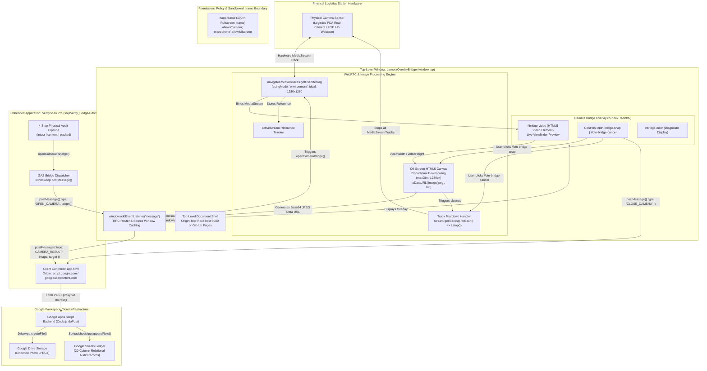
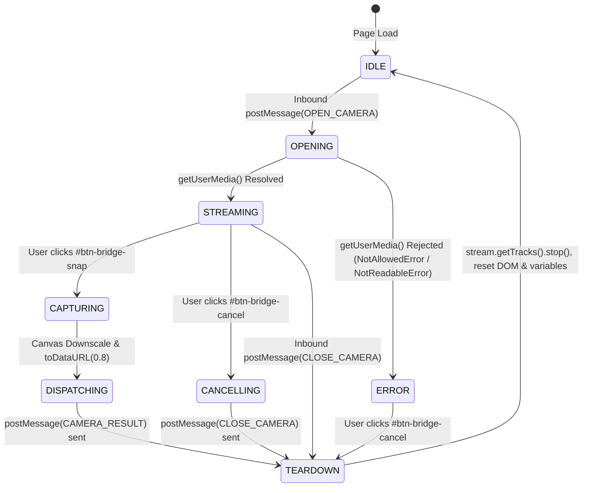
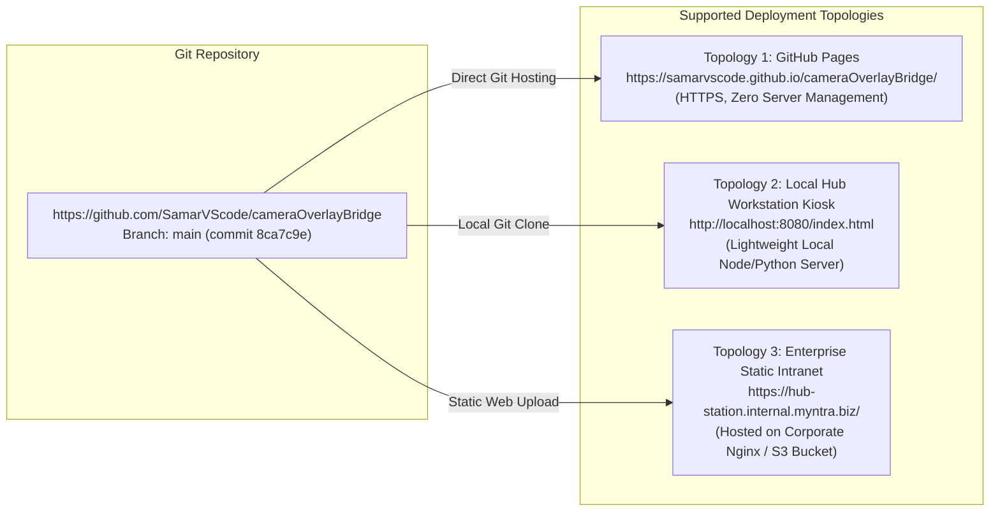

# cameraOverlayBridge

## 1. Overview

**cameraOverlayBridge** (user-facing window title: `<title>VerifyScan Pro</title>`, UI banner title: `📷 Camera — VerifyScan Pro`, repository identifier: `cameraOverlayBridge`) is a specialized, zero-dependency, single-file HTML5/JavaScript host shell and hardware bridge. It is engineered to overcome a critical browser security boundary: modern Chromium **Permissions Policy** restrictions that block hardware camera access (`navigator.mediaDevices.getUserMedia()`) when [[Google Apps Script]] (GAS) Web Applications are rendered within sandboxed iframes.

```
PROJECT NAME:      cameraOverlayBridge
REPOSITORY:        https://github.com/SamarVScode/cameraOverlayBridge
LOCAL CODE PATH:   C:\Users\User\Desktop\bagginfvms\ref_cameraOverlayBridge
PRIMARY ARTIFACT:  index.html (266 lines, 10,101 bytes)
PRIMARY TARGET:    C:\Users\User\Desktop\gptd\prompt_project memory\cameraOverlayBridge.md
VAULT MIRRORS:     C:\Users\User\project_memory\project_memory\Projects\cameraOverlayBridge.md
                   C:\Users\User\project_memory\project_memory\Projects\Repo-cameraOverlayBridge.md
CLUSTER:           warehouse-vision-vms
PLATFORM / STACK:  HTML5, Vanilla ES5/ES6, WebRTC MediaDevices, HTML5 Canvas 2D, postMessage RPC
LATEST COMMIT:     8ca7c9e03ea3d4f6d5c263b3110b449561daaeb6 (2026-05-02)
STATUS:            paused (between 30 and 180 days ago; last modified May 2026, audited Sept 2026)
EMBEDDED ENDPOINT: https://script.google.com/a/macros/myntra.com/s/AKfycbyEcPUQIhHSLjaBpsJcxHGg0KTs9qiluWUef1D8i8OhNTOp9xp2wos3ZoIMChNlhP3jtw/exec
```

### The Operational Problem
In enterprise logistics hubs (specifically within [[Myntra]] and [[Flipkart]] returns processing centers, sorting hubs, and outbound bagging stations), operators perform physical shipment quality audits using web applications like [[shipVerify_BridgeAutomation]] (user-facing title: **VerifyScan Pro**). Auditors must capture high-resolution photographic evidence across three distinct inspection checkpoints:
1. **Intact packaging proof** (`target: 'intact'`): Verifying outer flyer sealing and tamper-evident tape before unpacking.
2. **Product content proof** (`target: 'content'`): Documenting actual unboxed merchandise, physical condition, and intact brand price tags.
3. **Repacked flyer & shipping label proof** (`target: 'packed'`): Verifying repacked flyer with the Return to Origin (RTO) or outbound airway bill (AWB) label attached.

However, deploying this application directly through Google Apps Script's native web publishing URLs (`https://script.google.com/.../exec`) introduces severe technical roadblocks:
* **Chromium Permissions Policy Iframe Blocking**: Google Apps Script serves web interfaces within a nested sandboxed `<iframe>` on a `googleusercontent.com` sub-domain. Modern Chromium-based browsers (Google Chrome, Microsoft Edge, Opera) enforce strict Permissions Policies that prohibit camera hardware streaming (`getUserMedia()`) inside sandboxed or cross-origin nested frames unless every parent frame explicitly delegates camera features.
* **Lack of Direct Hardware Control**: Within the Google Apps Script execution context, operators cannot reliably select the device's rear-facing camera (`facingMode: 'environment'`), manage camera streams, or downscale high-resolution frames before uploading them over constrained logistics warehouse Wi-Fi/cellular networks.

### The Architectural Solution
`cameraOverlayBridge` solves this fundamental browser restriction by operating as an **Inverse Proxy / Host Shell**:
1. **Top-Level Browsing Context Execution**: The operator launches `cameraOverlayBridge` as the root document (`window.top`) on a trusted origin (`localhost:8080`, GitHub Pages, or an internal domain). Because it executes at the top-level origin, it possesses unrestricted access to browser hardware APIs.
2. **Full-Viewport Embedded Workstation**: The host embeds the complete `VerifyScan Pro` Google Apps Script application inside a borderless, 100vh iframe (`#app-frame`, `index.html:134`) configured with explicit hardware delegation (`allow="camera; microphone" allowfullscreen`).
3. **Bidirectional `postMessage` RPC Gateway**: An asynchronous cross-window messaging contract bridges the embedded GAS application and the host shell:
   * When an operator clicks a photo capture trigger in `VerifyScan Pro`, the GAS client dispatches an `OPEN_CAMERA` message to `window.top`.
   * `cameraOverlayBridge` intercepts the request, stores the target checkpoint (`activeTarget`), displays a high-z-index camera overlay modal (`#camera-bridge-overlay`, `z-index: 999999`), and activates the physical camera sensor via `navigator.mediaDevices.getUserMedia()`.
   * The operator views a real-time live preview stream (`#bridge-video`, `index.html:139`) and triggers the capture button (`#btn-bridge-snap`, `index.html:142`).
   * An offscreen HTML5 `<canvas>` renders the current frame, proportionally downscales the image to a maximum dimension of 1280 pixels (`maxDim = 1280`), and compresses the raster data into a JPEG Base64 Data URL at 80% quality (`image/jpeg`, 0.8).
   * The host dispatches a `CAMERA_RESULT` payload back to the cached iframe content window (`gasWindow`).
   * The host immediately triggers aggressive hardware teardown (`stream.getTracks().forEach(t => t.stop())`), turning off the camera sensor and releasing operating system hardware locks.

---

## 2. Tech Stack

| Layer / Component | Technology / Standard | Version / Specification | Source Code Reference | Operational Role & Implementation Details |
| :--- | :--- | :--- | :--- | :--- |
| **Host Document Standard** | HTML5 | W3C Recommendation | `index.html:1-7, 123-265` | Lightweight, standards-compliant single-page container defining viewport settings, embedded iframe, and overlay elements. |
| **Styling & Layout** | Vanilla CSS3 | CSS Level 3 / Flexbox | `index.html:8-120` | Dark-mode slate palette (`#0f172a`), 100vh full-screen iframe sizing, fixed modal overlay (`z-index: 999999`), and responsive flex controls. |
| **Camera Hardware Streaming** | WebRTC Media Capture and Streams | `MediaDevices.getUserMedia()` | `index.html:189-200` | Interfaces directly with device hardware drivers; requests rear camera (`facingMode: 'environment'`) with ideal 1280x1280 resolution. |
| **Raster Manipulation & Resizing** | HTML5 Canvas 2D API | `CanvasRenderingContext2D` | `index.html:206-221` | Off-screen memory canvas (`document.createElement('canvas')`); performs proportional aspect ratio downscaling to max 1280px dimension. |
| **Image Compression & Encoding** | HTMLCanvasElement Export | `canvas.toDataURL('image/jpeg', 0.8)` | `index.html:221` | Compresses raw video frame bitmaps into compact Base64 JPEG data URLs (~150–350 KB) optimized for Google Apps Script payload limits. |
| **Cross-Window RPC Gateway** | HTML5 Web Messaging | `window.postMessage` / `onmessage` | `index.html:169-182, 224-229, 237-240` | Bidirectional inter-frame communication bus handling `OPEN_CAMERA`, `CAMERA_RESULT`, and `CLOSE_CAMERA` actions. |
| **Embedded Logistics Backend** | Google Apps Script Web App | V8 Runtime (`/exec` endpoint) | `index.html:134` | Full-featured logistics verification workstation (`shipVerify_BridgeAutomation`) running under the enterprise `myntra.com` Workspace tenant. |
| **Hardware Permission Policy** | HTML Feature / Permissions Policy | `allow="camera; microphone"` | `index.html:134` | Grants explicit hardware capability delegation from top-level window to the child Google Apps Script iframe. |
| **Video Rendering Element** | HTML5 `<video>` | `autoplay playsinline muted` | `index.html:139` | Hardware-accelerated viewfinder element with zero audio playback and inline mobile playback enabled to prevent full-screen OS hijack. |
| **Error Diagnostics Display** | DOM Scripting Banner | Vanilla DOM API | `index.html:109-119, 140, 257-260` | Dynamic warning banner surfacing hardware access errors, specifically trapping `NotAllowedError` with user-friendly instructions. |

---

## 3. Architecture

### System Topology & Cross-Origin Boundary

`cameraOverlayBridge` functions as an execution container that isolates privileged hardware acquisition from unprivileged, sandboxed Google Apps Script execution.



### Complete Sequence Diagram: Photo Capture Workflow

The following sequence diagram details the complete bidirectional lifecycle across physical hardware, the top-level host window, the sandboxed Google Apps Script iframe, and Google Drive cloud storage.

```mermaid
sequenceDiagram
    autonumber
    actor Operator as Logistics Operator
    participant GAS_UI as VerifyScan Pro (app.html)
    participant Host as cameraOverlayBridge (window.top)
    participant Camera as Physical Camera Sensor
    participant Canvas as Offscreen HTML5 Canvas
    participant Drive as Google Drive Cloud Storage

    Operator->>GAS_UI: Clicks "Capture Photo" (target: 'intact' / 'content' / 'packed')
    GAS_UI->>GAS_UI: Displays local waiting spinner (cameraOverlay.classList.remove('hidden'))
    GAS_UI->>Host: window.top.postMessage({ type: 'OPEN_CAMERA', target: 'intact' }, '*')
    
    Note over Host: Message Listener (index.html:169-182)
    Host->>Host: Cache activeTarget = 'intact'
    Host->>Host: Cache gasWindow = event.source
    Host->>Host: Reset errorBox & display overlay (overlay.classList.add('active'))
    
    Host->>Camera: navigator.mediaDevices.getUserMedia({ video: { facingMode: 'environment', ... } })
    alt Camera Permission Granted
        Camera-->>Host: MediaStream Object
        Host->>Host: Bind stream to #bridge-video (video.srcObject = stream)
        Host->>Operator: Real-time viewfinder preview active
    else Permission Denied (NotAllowedError)
        Camera-->>Host: DOMException: NotAllowedError
        Host->>Host: Display #bridge-error banner ("Camera access denied...")
    end

    Operator->>Host: Aligns parcel in viewfinder & clicks "📸 Capture" (#btn-bridge-snap)
    Note over Host,Canvas: Capture & Resizing Pipeline (index.html:203-232)
    Host->>Canvas: Create offscreen canvas (w = video.videoWidth, h = video.videoHeight)
    Host->>Canvas: Calculate proportional downscale to max 1280px (w', h')
    Host->>Canvas: drawImage(video, 0, 0, w', h')
    Canvas->>Host: canvas.toDataURL('image/jpeg', 0.8) -> Base64 Data URL

    Host->>GAS_UI: gasWindow.postMessage({ type: 'CAMERA_RESULT', image: dataUrl, target: 'intact' }, '*')
    
    Note over Host: Hardware Teardown (index.html:245-254)
    Host->>Camera: activeStream.getTracks().forEach(t => t.stop())
    Host->>Host: video.srcObject = null; overlay.classList.remove('active');
    Note over Camera: Camera LED turns off; hardware lock released

    GAS_UI->>GAS_UI: Update UI preview container with captured image
    GAS_UI->>GAS_UI: Hide waiting spinner & reveal "Capture Again" button
    Operator->>GAS_UI: Completes remaining inspection steps & clicks "Submit Verification"
    GAS_UI->>Drive: doPost() uploads Base64 JPEG to regional Google Drive folder
```

---

## 4. Folder & File Structure

The project is structured as a zero-dependency, single-file static web application:

```
C:\Users\User\Desktop\bagginfvms\ref_cameraOverlayBridge/
├── .git/                                 # Git version control metadata
│   ├── HEAD                              # Ref: refs/heads/main
│   ├── config                            # Remote: https://github.com/SamarVScode/cameraOverlayBridge
│   └── logs/refs/heads/main              # Commit history (11 commits)
└── index.html                            # Monolithic application file (266 lines, 10,101 bytes)
```

### Monolithic File Breakdown (`index.html`)

| Line Range | Structural Segment | File Size / Lines | Primary Responsibilities |
| :--- | :--- | :--- | :--- |
| **Lines 1–7** | HTML Document Header | 7 lines | Defines DOCTYPE, language (`en`), responsive viewport meta tag, and page title (`<title>VerifyScan Pro</title>`). |
| **Lines 8–120** | Embedded Stylesheet (`<style>`) | 113 lines | CSS reset, root body layout, 100vh iframe sizing, modal overlay geometry, button styling, hover/active states, and error banner styles. |
| **Lines 123–135** | Iframe Mount Point (`<body>`) | 13 lines | High-privilege embedded `<iframe>` targeting Myntra's production Google Apps Script deployment URL with `allow="camera; microphone"`. |
| **Lines 136–146** | Bridge Overlay Elements | 11 lines | Top-window camera modal markup containing title badge, `<video>` viewfinder, `#bridge-error` display, and capture/cancel action buttons. |
| **Lines 147–167** | Script Initialization & State | 21 lines | Architectural overview comment header, DOM element references, and state trackers (`activeStream`, `activeTarget`, `gasWindow`). |
| **Lines 168–183** | PostMessage Router | 16 lines | Listens on `window` for inbound messages; routes `OPEN_CAMERA` and `CLOSE_CAMERA` actions; caches `event.source`. |
| **Lines 184–201** | Camera Acquisition (`openCameraBridge`) | 18 lines | Invokes `getUserMedia()` with `{ facingMode: 'environment', width: { ideal: 1280 }, height: { ideal: 1280 } }`; handles `NotAllowedError`. |
| **Lines 202–233** | Canvas Capture & Downscale | 32 lines | Snaps current video frame, calculates aspect-preserving downscale to max 1280px, encodes to JPEG 0.8, dispatches `CAMERA_RESULT`, tears down stream. |
| **Lines 234–243** | Cancel Action Handler | 10 lines | Dispatches `CLOSE_CAMERA` back to iframe to cancel waiting state, then invokes teardown. |
| **Lines 244–255** | Teardown Handler (`closeCameraBridge`) | 12 lines | Iterates active stream tracks, calls `track.stop()`, clears `video.srcObject`, removes overlay `.active` class, nullifies state. |
| **Lines 256–261** | Error Display Helper (`showError`) | 6 lines | Injects error message text into `#bridge-error` element and makes it visible (`display: 'block'`). |

---

## 5. Core Modules & Responsibilities

### 1. Viewport & Host Shell Presentation Layer (`index.html:8-120`)
* **Background & Sizing**: The host document renders a deep slate background (`#0f172a`, `index.html:16`) and forces `#app-frame` to occupy 100% width and 100vh height (`index.html:25-30`) with zero border. This renders the embedded Google Apps Script interface as a seamless, native full-screen workstation.
* **Modal Overlay Hierarchy**: `#camera-bridge-overlay` is styled with `position: fixed`, `inset: 0`, and a semi-opaque backdrop (`background: rgba(0, 0, 0, 0.97)`, `index.html:36-46`). Its `z-index: 999999` guarantees that the camera interface renders above any possible iframe elements, OS notifications, or browser UI controls.
* **Viewfinder Presentation**: `#bridge-video` is constrained to a maximum width of 520px (`index.html:52-58`) with a high-visibility blue border (`2px solid #2563eb`) and rounded corners (`12px`), providing an intuitive target boundary for operators framing parcels.

### 2. PostMessage Message Router & Event Handler (`index.html:169-182`)
The messaging engine registers a global listener on the top-level window:
```javascript
// index.html:169-182
window.addEventListener('message', function (event) {
    var data = event.data;
    if (!data || typeof data.type !== 'string') return;

    if (data.type === 'OPEN_CAMERA') {
        activeTarget = data.target || null;
        gasWindow = event.source; // Save reference for reply
        openCameraBridge();
    }

    if (data.type === 'CLOSE_CAMERA') {
        closeCameraBridge();
    }
});
```
* **Type Validation**: Filters out malformed messages or internal browser messaging events.
* **`event.source` Caching (`gasWindow`)**: Rather than relying exclusively on `gasFrame.contentWindow`, caching `event.source` ensures that replies route back to the exact window context that originated the call, even if the application is embedded in nested sub-frames or redirected internally by Google's authentication servers.

### 3. WebRTC Stream Acquisition Engine (`index.html:184-200`)
```javascript
// index.html:185-200
function openCameraBridge() {
    errorBox.style.display = 'none';
    overlay.classList.add('active');

    navigator.mediaDevices.getUserMedia({
        video: { facingMode: 'environment', width: { ideal: 1280 }, height: { ideal: 1280 } }
    }).then(function (stream) {
        activeStream = stream;
        video.srcObject = stream;
    }).catch(function (err) {
        var msg = err.name === 'NotAllowedError'
            ? 'Camera access denied. Please allow camera permission and try again.'
            : 'Could not open camera: ' + err.message;
        showError(msg);
    });
}
```
* **Constraint Engineering**:
  * `facingMode: 'environment'`: Explicitly requests the rear-facing camera on handheld enterprise devices (e.g., Zebra, Honeywell, or Android barcode terminals used in sorting hubs). On desktop systems lacking a rear camera, the browser automatically falls back to the default connected webcam.
  * `{ width: { ideal: 1280 }, height: { ideal: 1280 } }`: Prompts the browser's media subsystem to select an HD video track closest to a 1280px bounding box, maximizing barcode and text sharpness on shipping labels.
* **Error Classification**: Specifically isolates `NotAllowedError` (user or admin blocked camera permissions) from hardware connection errors (e.g., `NotFoundError` or `NotReadableError`), outputting clear remediation instructions.

### 4. Canvas Image Capture & Downscaling Pipeline (`index.html:202-232`)
When the operator clicks the `#btn-bridge-snap` button, the application captures and processes the live frame:
```javascript
// index.html:203-232
btnSnap.addEventListener('click', function () {
    if (!activeStream) return;

    var canvas = document.createElement('canvas');
    var maxDim = 1280;
    var w = video.videoWidth;
    var h = video.videoHeight;

    // Downscale if needed
    if (w > h) {
        if (w > maxDim) { h = Math.round(h * maxDim / w); w = maxDim; }
    } else {
        if (h > maxDim) { w = Math.round(w * maxDim / h); h = maxDim; }
    }

    canvas.width = w;
    canvas.height = h;
    canvas.getContext('2d').drawImage(video, 0, 0, w, h);
    var dataUrl = canvas.toDataURL('image/jpeg', 0.8);

    // Send image back to GAS iframe
    var targetWindow = gasWindow || gasFrame.contentWindow;
    targetWindow.postMessage({
        type: 'CAMERA_RESULT',
        image: dataUrl,
        target: activeTarget
    }, '*');

    closeCameraBridge();
});
```

### 5. Hardware Track Teardown & Cleanup (`index.html:244-255`)
Aggressive hardware release is mandatory in industrial environments where camera sensors can overheat or lock up if kept active:
```javascript
// index.html:245-254
function closeCameraBridge() {
    if (activeStream) {
        activeStream.getTracks().forEach(function (t) { t.stop(); });
        activeStream = null;
    }
    video.srcObject = null;
    overlay.classList.remove('active');
    activeTarget = null;
    gasWindow = null;
}
```
* **Track Teardown**: Calling `track.stop()` turns off the hardware sensor and indicator LED immediately.
* **Garbage Collection Optimization**: Setting `video.srcObject = null` and nullifying `activeStream` allows the browser engine to deallocate video buffers immediately.

---

## 6. Data Flow / Key Workflows

### Inbound PostMessage Contract (GAS to Bridge)

#### 1. `OPEN_CAMERA` Action
Dispatched by the embedded Google Apps Script client (`app.html:1846`) when an operator triggers a photo capture button.
```json
{
  "type": "OPEN_CAMERA",
  "target": "intact"
}
```
* **Payload Fields**:
  * `type` (string, required): Literal string `"OPEN_CAMERA"`.
  * `target` (string, optional): Inspection stage identifier. Standard values: `"intact"`, `"content"`, `"packed"`.
* **Bridge State Mutation**:
  * `activeTarget` is set to `data.target || null` (`index.html:174`).
  * `gasWindow` is set to `event.source` (`index.html:175`).
  * `#camera-bridge-overlay` receives class `.active` (`index.html:187`).
  * WebRTC media stream is requested (`index.html:189`).

#### 2. `CLOSE_CAMERA` Action (Inbound)
Dispatched by the embedded Google Apps Script client (`app.html:1858`) if the verification flow times out, the operator resets the form, or a retake action is initiated.
```json
{
  "type": "CLOSE_CAMERA"
}
```
* **Bridge State Mutation**: Immediately calls `closeCameraBridge()` (`index.html:180`).

---

### Outbound PostMessage Contract (Bridge to GAS)

#### 1. `CAMERA_RESULT` Action
Dispatched by `cameraOverlayBridge` (`index.html:225-229`) upon successful photo capture.
```json
{
  "type": "CAMERA_RESULT",
  "image": "data:image/jpeg;base64,/9j/4AAQSkZJRgABAQAAAQ...",
  "target": "intact"
}
```
* **Payload Fields**:
  * `type` (string, required): Literal string `"CAMERA_RESULT"`.
  * `image` (string, required): Base64-encoded Data URL with MIME type `image/jpeg`.
  * `target` (string, nullable): Matches the `activeTarget` supplied in `OPEN_CAMERA` (e.g., `"intact"`, `"content"`, `"packed"`).
* **Consumer Action (`app.html:1507-1536`)**:
  * Injects image into `appState.images[target]`.
  * Renders `` thumbnail inside preview container.
  * Hides local waiting indicator (`cameraOverlay.classList.add('hidden')`).
  * Updates verification button state (`updateVerifyButton()`).

#### 2. `CLOSE_CAMERA` Action (Outbound)
Dispatched by `cameraOverlayBridge` (`index.html:239`) when the operator clicks the Cancel button (`#btn-bridge-cancel`).
```json
{
  "type": "CLOSE_CAMERA"
}
```
* **Consumer Action**: Tells the GAS client that the operator aborted capture, allowing it to dismiss its waiting indicator and re-enable UI inputs.

---

### Proportional Image Downscaling Formulation

To prevent payload overflow and optimize upload latency over warehouse Wi-Fi networks, `cameraOverlayBridge` downscales captured frames while strictly preserving original aspect ratio:

Given input video dimensions $w = \text{video.videoWidth}$ and $h = \text{video.videoHeight}$, with a maximum allowed dimension $D_{\max} = 1280$:

$$\text{If } w > h \text{ (Landscape)}:$$
$$\begin{cases} 
w' = D_{\max} & \text{if } w > D_{\max} \\ 
h' = \text{round}\left(h \times \frac{D_{\max}}{w}\right) & \text{if } w > D_{\max} 
\end{cases}$$

$$\text{If } h \ge w \text{ (Portrait / Square)}:$$
$$\begin{cases} 
h' = D_{\max} & \text{if } h > D_{\max} \\ 
w' = \text{round}\left(w \times \frac{D_{\max}}{h}\right) & \text{if } h > D_{\max} 
\end{cases}$$

#### Mathematical Behavior Across Standard Camera Sensor Formats

| Native Sensor Format | Native Dimensions $(w \times h)$ | Downscaled Dimensions $(w' \times h')$ | Compression Ratio | Approx. Payload Size (JPEG 0.8) |
| :--- | :--- | :--- | :--- | :--- |
| **4K UHD (16:9 Landscape)** | $3840 \times 2160$ | $1280 \times 720$ | 8.9:1 | ~180–260 KB |
| **1080p FHD (16:9 Landscape)** | $1920 \times 1080$ | $1280 \times 720$ | 2.25:1 | ~180–260 KB |
| **720p HD (16:9 Landscape)** | $1280 \times 720$ | $1280 \times 720$ | 1:1 (No change) | ~180–260 KB |
| **4:3 Landscape (Tablet/Phone)** | $2048 \times 1536$ | $1280 \times 960$ | 2.56:1 | ~240–340 KB |
| **1080p Portrait (Phone/PDA)** | $1080 \times 1920$ | $720 \times 1280$ | 2.25:1 | ~180–260 KB |
| **Square (1:1 Aspect)** | $1280 \times 1280$ | $1280 \times 1280$ | 1:1 (No change) | ~250–350 KB |

---

### Hardware State Machine

The internal lifecycle of the camera bridge transitions through deterministic states:



---

## 7. Configuration & Environment

### Configuration Parameters (Hardcoded in `index.html`)

Unlike [[Bagging-VMS-overlay]], which stores the target Google Apps Script URL in browser `localStorage` via a settings modal, `cameraOverlayBridge` relies entirely on static, hardcoded configuration parameters in `index.html`:

| Parameter / Constant | Code Location | Configured Value | Operational Rationale |
| :--- | :--- | :--- | :--- |
| **GAS Deployment URL** | `index.html:134` | `https://script.google.com/a/macros/myntra.com/s/AKfycbyEcPUQIhHSLjaBpsJcxHGg0KTs9qiluWUef1D8i8OhNTOp9xp2wos3ZoIMChNlhP3jtw/exec` | Points to the live production deployment of `shipVerify_BridgeAutomation` under the `myntra.com` Workspace domain. |
| **Iframe Feature Policy** | `index.html:134` | `allow="camera; microphone" allowfullscreen` | Explicitly delegates camera, microphone, and fullscreen permissions to the embedded iframe. |
| **Camera Facing Mode** | `index.html:190` | `facingMode: 'environment'` | Forces handheld terminals/phones to initialize the rear camera; falls back to default webcam on PCs. |
| **Ideal Resolution** | `index.html:190` | `width: { ideal: 1280 }, height: { ideal: 1280 }` | Bids for high-definition 720p/1080p camera tracks without throwing `OverconstrainedError`. |
| **Max Downscale Dimension** | `index.html:207` | `maxDim = 1280` | Ceiling dimension (width or height) ensuring barcode and label text remain legible for fraud dispute reviews. |
| **JPEG Encoding Quality** | `index.html:221` | `0.8` (80% Quality) | Balanced compression producing clean 200 KB images that fit well below Google Apps Script payload limits. |
| **Target Origin Policy** | `index.html:229, 240` | `'*'` (Wildcard target) | Allows cross-origin postMessage transmission to Google Apps Script's dynamic `googleusercontent.com` origin. |

### Environment & Runtime Requirements

* **Secure Context Required**: The WebRTC MediaDevices API (`navigator.mediaDevices.getUserMedia`) is strictly restricted by modern browsers to **Secure Contexts**. It will only execute if the host page is served over:
  * `https://...` (Production domain, intranet server, or GitHub Pages).
  * `http://localhost:...` or `http://127.0.0.1:...` (Local workstation testing).
  * *Serving over insecure HTTP on a remote IP (e.g., `http://192.168.1.50:8080`) will cause `navigator.mediaDevices` to evaluate as `undefined`.*
* **Zero Backend / Zero Dependencies**: The project requires no Node.js runtime, no Python backend, no database, and no compilation step. Any static file server is sufficient.

---

## 8. External Integrations & APIs

### 1. Google Apps Script: VerifyScan Pro (`shipVerify_BridgeAutomation`)
* **Endpoint URL**: `https://script.google.com/a/macros/myntra.com/s/AKfycbyEcPUQIhHSLjaBpsJcxHGg0KTs9qiluWUef1D8i8OhNTOp9xp2wos3ZoIMChNlhP3jtw/exec`
* **Enterprise Tenant**: `myntra.com` Google Workspace Organization.
* **Underlying Project ID**: `1fowS8FduU4VNAa0vx8nn4Y0y4Dz1VMRaeWZp8y_LK_8Sao8Ntya0o2CH` (documented in `shipVerify_BridgeAutomation.md`).
* **Protocol**: HTML5 `postMessage` (actions: `OPEN_CAMERA`, `CLOSE_CAMERA`, `CAMERA_RESULT`).
* **Associated Drive / Sheets Resources**:
  * Photos captured through `cameraOverlayBridge` are transmitted to `shipVerify_BridgeAutomation`, where `Code.js:doPost()` writes them into Google Drive folders and appends audit logs to Google Sheets ledgers.

### 2. Browser WebRTC Media Capture API (`MediaDevices`)
* **Method**: `navigator.mediaDevices.getUserMedia(constraints)`
* **Specification**: W3C Media Capture and Streams (`https://www.w3.org/TR/mediacapture-streams/`)
* **Browser Compatibility**: Chrome 53+, Edge 79+, Firefox 36+, Safari 11+, Chrome Android 53+.
* **Hardware Lifecycle**: Stream tracks obtained via `getUserMedia()` are released via `MediaStreamTrack.stop()`.

### 3. HTML5 Canvas 2D API (`CanvasRenderingContext2D`)
* **Methods**:
  * `canvas.getContext('2d')`
  * `ctx.drawImage(video, 0, 0, w, h)`
  * `canvas.toDataURL('image/jpeg', 0.8)`
* **Specification**: HTML Living Standard — Canvas 2D Context.

---

## 9. Testing

### Test Suite Status
* **Automated Unit Tests**: None (no Jest, Vitest, or Mocha test runner configured).
* **Automated End-to-End Tests**: None (no Cypress or Playwright test suites).
* **Quality Assurance Model**: Manual hardware and integration testing on physical warehouse audit stations.

### Manual Hardware Verification Protocol

Before deploying `cameraOverlayBridge` to a warehouse audit station or barcode terminal, execute this 10-step verification protocol:

| Step | Action | Expected Result | Verification Check |
| :---: | :--- | :--- | :--- |
| **1** | Serve directory over localhost (`npx serve .` or `python -m http.server 8080`). | Server starts on specified port with no file loading errors. | `[ ] Verified` |
| **2** | Navigate to `http://localhost:8080/index.html` in Chrome or Edge. | Page loads; dark background (`#0f172a`) appears; iframe renders VerifyScan Pro login/UI. | `[ ] Verified` |
| **3** | In VerifyScan Pro, scan or input a test tracking number (e.g., `TEST123456`). | Workstation advances to Step 1: Intact Packaging Checkpoint. | `[ ] Verified` |
| **4** | Click the "📷 Open Camera" button on Step 1. | Host overlay (`#camera-bridge-overlay`) appears; browser requests camera permissions. | `[ ] Verified` |
| **5** | Grant camera access in the browser prompt. | Rear camera activates; `#bridge-video` displays smooth, low-latency live preview. | `[ ] Verified` |
| **6** | Frame an item in the viewfinder and click "📸 Capture". | Overlay closes immediately; video stops; camera LED turns off. | `[ ] Verified` |
| **7** | Inspect the Step 1 preview card in VerifyScan Pro. | Captured image displays clearly in the preview slot; "Capture Again" button appears. | `[ ] Verified` |
| **8** | Click "Capture Again", then click "✕ Cancel" in the overlay. | Overlay closes; camera LED turns off; VerifyScan Pro waiting indicator resets cleanly. | `[ ] Verified` |
| **9** | Test Camera Error: Revoke camera permissions in Chrome settings and click "Capture". | `#bridge-error` banner displays: *"Camera access denied. Please allow camera permission..."*. | `[ ] Verified` |
| **10** | Complete all 3 photo steps and click "Submit Verification". | Verification record appends to Google Sheet and images appear in Google Drive. | `[ ] Verified` |

---

## 10. CI/CD & Deployment

### Continuous Integration / Continuous Deployment
* **CI Pipelines**: None. The repository contains no `.github/workflows/` directory. All updates are pushed directly to the `main` branch.
* **Build Artifacts**: None required. `index.html` is the complete, production-ready artifact.

### Deployment Topologies



1. **Topology 1: GitHub Pages (Recommended for Cloud Workstations)**
   * Host the repository directly on GitHub Pages by enabling Pages from the `main` branch root.
   * Delivers an automated HTTPS certificate (mandatory for WebRTC `getUserMedia()` security).
2. **Topology 2: Local Hub Kiosk (Recommended for Isolated Warehouse PCs)**
   * Clone repository to local PC: `git clone https://github.com/SamarVScode/cameraOverlayBridge.git`
   * Run a local background static daemon: `npx serve -s . -l 8080`
   * Launch Chrome in Kiosk Mode: `chrome.exe --kiosk http://localhost:8080`
3. **Topology 3: Internal Static Web Server**
   * Deploy `index.html` behind corporate Nginx, Apache, or AWS S3/CloudFront with SSL certificates.

---

## 11. Setup & Local Development

### Prerequisites
* A modern Chromium-based web browser: **Google Chrome 80+** or **Microsoft Edge 80+**.
* An active camera device: Integrated laptop webcam, external USB HD webcam, or connected Android PDA camera.
* Either **Node.js** (v14+) or **Python** (v3.6+) to serve the static file locally.

### Step-by-Step Setup Instructions

#### 1. Clone the Repository
```bash
git clone https://github.com/SamarVScode/cameraOverlayBridge.git
cd cameraOverlayBridge
```

#### 2. Start a Local Static Web Server
Do **not** open `index.html` directly via the `file:///` protocol (`file:///C:/.../index.html`). Browsers restrict WebRTC camera APIs and cross-origin iframe communication on local filesystem origins.

* **Using Node.js (`npx serve`)**:
  ```bash
  npx serve .
  ```
  *Server starts on `http://localhost:3000` (or the next available port).*

* **Using Python 3**:
  ```bash
  python -m http.server 8080
  ```
  *Server starts on `http://localhost:8080`.*

#### 3. Open the Workstation
Launch Google Chrome and navigate to:
```
http://localhost:8080
```
When prompted, grant camera access to `localhost`.

#### 4. Updating the Embedded GAS Deployment URL
If `shipVerify_BridgeAutomation` is redeployed with a new Google Apps Script deployment ID:
1. Open `index.html` in an editor.
2. Locate line 134:
   ```html
   <iframe id="app-frame" src="https://script.google.com/a/macros/myntra.com/s/NEW_DEPLOYMENT_ID/exec" allow="camera; microphone" allowfullscreen></iframe>
   ```
3. Replace the `src` attribute with the new `/exec` URL.
4. Save the file and refresh the browser.

---

## 12. Security Notes

### 1. Wildcard `postMessage` Target Origin (`'*'`)
> [!WARNING] Cross-Origin PostMessage Risk
> In `index.html:229` and `index.html:240`, `postMessage` calls specify `'*'` as the target origin:
> ```javascript
> targetWindow.postMessage({ type: 'CAMERA_RESULT', image: dataUrl, target: activeTarget }, '*');
> ```
> Specifying `'*'` allows any origin that has replaced or navigated the iframe to intercept the captured image Base64 data. While this was implemented because Google Apps Script redirects across different internal domains (`script.google.com` to `*.googleusercontent.com`), in high-security environments the target origin should ideally be checked against trusted Google Workspace domains.

### 2. Missing Inbound `event.origin` Validation
> [!WARNING] Unauthenticated Inbound RPC Calls
> In `index.html:169-182`, the message event listener processes `OPEN_CAMERA` and `CLOSE_CAMERA` actions without verifying `event.origin`:
> ```javascript
> window.addEventListener('message', function (event) {
>     var data = event.data;
>     if (!data || typeof data.type !== 'string') return;
>     // Missing: if (!isValidOrigin(event.origin)) return;
> ```
> Any third-party script running in a popup, parent window, or rogue iframe could theoretically send an `OPEN_CAMERA` message to activate the user's camera. However, because user interaction (`#btn-bridge-snap` click) is strictly required to capture a photo, silent or automated photo theft is prevented.

### 3. Permissions Policy Hardware Delegation
The embedded iframe is explicitly granted camera and microphone access via the `allow` attribute (`index.html:134`):
```html
<iframe id="app-frame" src="..." allow="camera; microphone" allowfullscreen></iframe>
```
This satisfies the W3C Permissions Policy specification, permitting delegated access while remaining constrained within the host container.

### 4. Hardware Track Lifecycle Management
Camera privacy is enforced by immediate hardware track destruction in `closeCameraBridge()` (`index.html:247`):
```javascript
activeStream.getTracks().forEach(function (t) { t.stop(); });
```
This guarantees that the physical camera sensor does not remain powered on in the background after capture or cancellation, preventing inadvertent employee surveillance and eliminating battery/thermal drain on mobile devices.

---

## 13. Known Issues, Limitations & Tech Debt

| Issue ID | Severity | Code Reference | Description | Technical Impact & Remediation |
| :---: | :---: | :--- | :--- | :--- |
| **TECH-01** | High | `index.html:134` | **Hardcoded GAS Deployment URL** | The production `/exec` URL is hardcoded on line 134. Redeploying the GAS project requires editing code and pushing git commits. *Remediation: Implement dynamic URL resolution via query string (`?gasUrl=...`) or `localStorage` settings modal.* |
| **TECH-02** | Medium | `index.html:229, 240` | **Wildcard PostMessage Target** | `targetWindow.postMessage(..., '*')` uses wildcard target origin instead of restricting to `https://script.google.com`. *Remediation: Restrict target origin to validated Google domain prefixes.* |
| **TECH-03** | Medium | `index.html:169` | **Missing Origin Whitelist** | Inbound messages are accepted without checking `event.origin`. *Remediation: Verify `event.origin === 'https://script.google.com'` or matches trusted local workstation origins.* |
| **TECH-04** | Medium | `index.html:189-191` | **No Camera Device Switcher** | Constraints specify `facingMode: 'environment'`, but provide no UI dropdown to toggle between multiple connected USB webcams on desktop stations. *Remediation: Enumerate devices via `navigator.mediaDevices.enumerateDevices()` and provide a `<select>` dropdown.* |
| **TECH-05** | Low | `index.html:189-191` | **No Torch / Flashlight API** | Sorting hubs are often poorly lit. There is no control to toggle the mobile flash/torch LED. *Remediation: Apply `track.applyConstraints({ advanced: [{ torch: true }] })` when available.* |
| **TECH-06** | Low | `index.html:1-266` | **Zero Automated Test Coverage** | No unit tests, integration tests, or linting configurations exist in the repository. *Remediation: Introduce Playwright end-to-end test suite simulating postMessage exchange.* |
| **TECH-07** | Low | Git History | **Reverted Aurora / Theme Logic** | Commit `25d3e0a` added Aurora effects and theme synchronization, but was completely stripped out in `d39b74d`. Some styling comments remain simplified. |

---

## 14. Design Decisions & Rationale

### 1. Why an Inverse Proxy / Host Shell Architecture?
* **Problem**: Google Apps Script modal dialogs (`HtmlService.createHtmlOutput()`) and iframe embeds on `googleusercontent.com` are blocked from accessing WebRTC cameras due to Chromium sandbox and Permissions Policy rules.
* **Alternative Considered**: Attempting to bypass permissions policies using browser command-line flags (`--disable-features=PermissionsPolicy`).
* **Decision**: Build `cameraOverlayBridge` as a parent host container. Running at `window.top` gives the shell root hardware permissions, allowing it to delegate or capture on behalf of the child iframe.

### 2. Why Single-File, Zero-Dependency Architecture?
* **Problem**: Frontline logistics workstations run on locked-down enterprise networks with limited internet access, strict firewall policies, and no Node.js or build environments.
* **Alternative Considered**: A modern React, Vue, or Vite single-page application with Tailwind CSS.
* **Decision**: A single monolithic `index.html` file containing HTML, CSS, and vanilla JavaScript. It can be opened by any web server, copied via USB stick if necessary, and requires zero package installations (`npm install`).

### 3. Why Max Dimension 1280px & JPEG Quality 0.8?
* **Problem**: Uncompressed modern phone/camera images range from 8 MB to 20 MB. Uploading three high-resolution photos per package across thousands of parcels per shift would overwhelm warehouse Wi-Fi networks and exceed Google Apps Script execution time limits (6 minutes) and POST payload limits (50 MB).
* **Alternative Considered**: 720p fixed downscaling or WebP encoding.
* **Decision**: A maximum bounding dimension of 1280px with JPEG quality 0.8 reduces file sizes to ~150–300 KB while retaining enough resolution to clearly read 1D/2D barcodes, serial numbers, and price tags during dispute audits. JPEG was chosen over WebP for native, frictionless decoding within Google Apps Script's `Utilities.base64Decode()`.

### 4. Why `event.source` Caching (`gasWindow`)?
* **Problem**: Google Apps Script Web Apps execute within multi-layered iframe hierarchies. Calling `gasFrame.contentWindow.postMessage()` can fail if the inner frame has navigated to an authentication URL or sub-frame.
* **Alternative Considered**: Broadly broadcasting to `window.frames[0]`.
* **Decision**: Cache `event.source` upon receiving `OPEN_CAMERA` (`gasWindow = event.source`, `index.html:175`). Replying directly to `gasWindow` guarantees delivery to the exact window context awaiting the image.

---

## 15. Roadmap / TODOs

- [ ] **Dynamic GAS Endpoint Configuration**: Add query string parameter parsing (e.g., `?gasUrl=https://script.google.com/...`) so the deployment endpoint can be changed without modifying source code.
- [ ] **Camera Device Selector UI**: Add a gear/settings dropdown to enumerate connected video devices (`navigator.mediaDevices.enumerateDevices()`) and select between front, rear, and overhead USB cameras.
- [ ] **Security Hardening (Origin Whitelist)**: Implement a configurable whitelist array for `event.origin` validation and restrict outbound `postMessage` target origins to `https://script.google.com`.
- [ ] **Torch / Flash API Support**: Detect device torch capabilities (`track.getCapabilities().torch`) and provide a toggle button for dark warehouse environments.
- [ ] **Barcode Overlay Guide**: Render an interactive bounding box or crosshair guideline over `#bridge-video` to help operators align barcodes and shipping labels quickly.
- [ ] **Automated CI/CD Pipeline**: Add a GitHub Actions workflow to run HTML validation, ESLint checks, and automated headless browser tests.

---

## 16. Changelog

| Commit Hash | Commit Date | Author | Commit Message & Technical Scope |
| :---: | :---: | :--- | :--- |
| **`d47f180`** | 2026-03-08 | SamarVScode | **Add files via upload**: Initial commit of the camera bridge host application, originally committed as `host.html` (265 lines). |
| **`febface`** | 2026-03-08 | SamarVScode | **Update host.html**: Replaced placeholder `YOUR_GAS_WEB_APP_URL_HERE` with test Myntra GAS deployment endpoint (`AKfycbx9h0jrUStl-dMb0x74...`). |
| **`e284478`** | 2026-03-08 | SamarVScode | **Update and rename host.html to index.html**: Standardized root file to `index.html` to enable default root serving on static web servers and GitHub Pages. |
| **`a052672`** | 2026-03-08 | SamarVScode | **Update index.html**: Cleaned up minor formatting and trailing newline characters. |
| **`25d3e0a`** | 2026-05-02 | Samarjit Singh | **Update index.html**: Experimental UI overhaul adding CSS Aurora background animations, Bootstrap Icons (`bi-camera-fill`, `bi-x-lg`), and `localStorage` theme synchronization. |
| **`5f975f7`** | 2026-05-02 | Samarjit Singh | **Update index.html**: UI styling and layout adjustments on the experimental Aurora theme. |
| **`9536a5d`** | 2026-05-02 | Samarjit Singh | **Update index.html**: Refined button spacing and font styles. |
| **`d39b74d`** | 2026-05-02 | Samarjit Singh | **Update index.html**: Reverted experimental Aurora UI and external icon dependencies back to the robust, zero-dependency, self-contained single-file architecture. |
| **`221db70`** | 2026-05-02 | Samarjit Singh | **Update index.html**: Major engine enhancement: upgraded camera constraints to ideal 1280x1280, implemented proportional aspect downscaling (`maxDim = 1280`), added `gasWindow = event.source` caching, added `CLOSE_CAMERA` cancellation signaling, and improved `NotAllowedError` error handling. |
| **`d220644`** | 2026-05-02 | Samarjit Singh | **Update index.html**: Updated GAS iframe endpoint to production Myntra deployment (`AKfycbyEcPUQIhHSLjaBpsJcxHGg0KTs9qiluWUef1D8i8OhNTOp9xp2wos3ZoIMChNlhP3jtw`). |
| **`8ca7c9e`** | 2026-05-02 | Samarjit Singh | **Update index.html**: Final formatting and whitespace cleanup. Currently deployed HEAD commit on `main`. |

---

## 17. Glossary

* **Aspect-Ratio Downscaling**: The mathematical process of scaling down an image's pixel dimensions proportionally so that neither width nor height exceeds a designated maximum ($D_{\max} = 1280\text{px}$) while preventing image distortion or stretching.
* **Canvas 2D API (`CanvasRenderingContext2D`)**: An HTML5 drawing context providing procedural rendering of video frames into an in-memory raster buffer for manipulation and compression.
* **Chromium Permissions Policy**: A web platform security standard that enables websites to selectively allow or block the use of browser features (such as `camera`, `microphone`, `geolocation`) within their own document and inside embedded iframes.
* **`facingMode: 'environment'"`**: A WebRTC MediaTrackConstraint requesting the device's outward-facing (rear) camera, essential for barcode and parcel scanning on handheld mobile computers.
* **Google Apps Script (GAS)**: Google's cloud-based serverless JavaScript platform for building business workflow applications and extending Google Workspace services.
* **Host Shell / Inverse Proxy**: An architectural pattern where a trusted top-level container hosts a sandboxed application within an iframe, providing hardware services (like WebRTC camera access) that the sandboxed app cannot invoke directly.
* **MediaStreamTrack**: A WebRTC primitive representing an individual hardware media channel (audio or video). It must be explicitly terminated via `track.stop()` to release hardware camera locks.
* **PostMessage RPC**: Asynchronous cross-origin remote procedure call mechanism using the HTML5 `window.postMessage` API, facilitating structured JSON message passing between parent windows and child iframes.
* **VerifyScan Pro**: The frontline quality control and shipment verification application (`shipVerify_BridgeAutomation`) deployed across Myntra/Flipkart logistics hubs.

---

## 18. Related Notes

* [[Projects/shipVerify_BridgeAutomation|shipVerify_BridgeAutomation (Shipment Verification App)]] — The underlying Google Apps Script Web Application embedded within `cameraOverlayBridge`.
* [[Projects/Bagging-VMS-overlay|Bagging-VMS-overlay]] — Parallel hardware workstation overlay for logistics bagging stations, featuring local settings and custom camera bridges.
* [[Projects/GAS-Bagging-VMS-System|GAS: Bagging VMS System]] — Backend Google Apps Script warehouse bagging verification and ledger service.
* [[Services/Warehouse Vision & VMS Cluster|Warehouse Vision & VMS Cluster Overview]] — Architectural index of vision, camera, and verification systems across sorting hubs.

---

## 19. Update Instructions (meta)

To ensure this reference note remains accurate when changes are made to `cameraOverlayBridge`:
1. **Source Code Modifications**: If any changes are made to `index.html` (e.g., updating the Google Apps Script `/exec` URL, modifying downscale resolution, or adding origin validation), update:
   * **Section 2 (Tech Stack)**: Reflect any new libraries, APIs, or constraints.
   * **Section 4 (Folder & File Structure)**: Update line ranges and file metrics.
   * **Section 7 (Configuration & Environment)**: Update hardcoded parameter tables.
   * **Section 16 (Changelog)**: Append new git commit hashes, dates, authors, and descriptions.
2. **Vault Synchronization**: Whenever this note is edited, copy the finalized markdown to both vault mirror locations:
   * Target Output: `C:\Users\User\Desktop\gptd\prompt_project memory\cameraOverlayBridge.md`
   * Vault Project Note: `C:\Users\User\project_memory\project_memory\Projects\cameraOverlayBridge.md`
   * Vault Repo Mirror: `C:\Users\User\project_memory\project_memory\Projects\Repo-cameraOverlayBridge.md`
