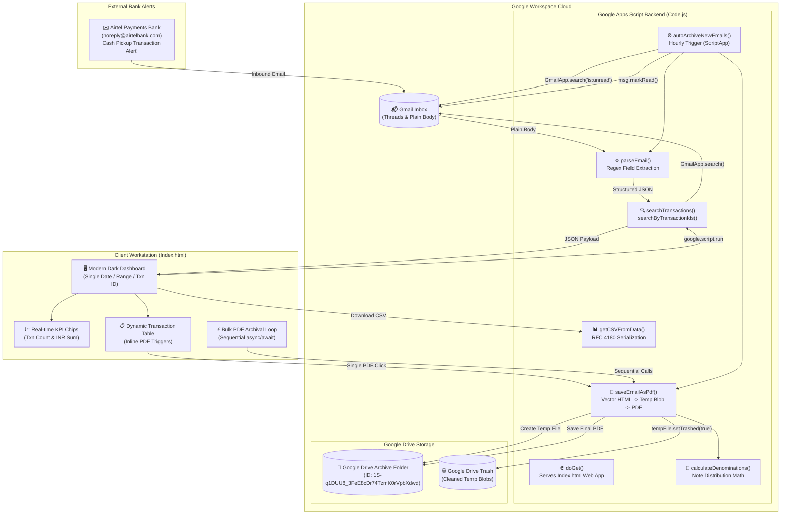
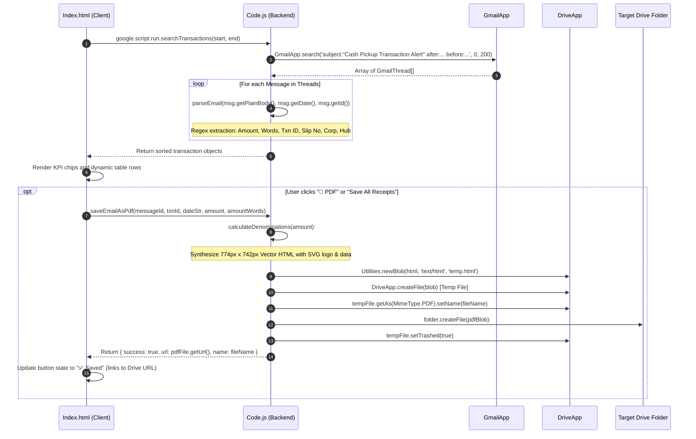

# Cash Pickup Transaction Tracker
> **Airtel Payments Bank Gmail Transaction Scanner & 1:1 Vector PDF Receipt Generator** — Architecture Specification & Project Memory Note

---

## 1. Overview
`Cash Pickup Transaction Tracker` (local project directory: `cash inject`, Clasp Script ID: `1eGrhywcx4GylK9g0VP1iwoq6ylaVYWAiFO9TCKytFUVMhcea0vZ1cg6E`) is an automated financial auditing tool and batch receipt generation system built on [[Google Apps Script]] (V8 engine). The application is designed to ingest, verify, and archive physical cash drop transactions conducted across logistics fulfillment hubs and courier distribution centers *(inferred from Flipkart India Private Limited and Myntra Hub records)*. Functioning both as a high-contrast dark-mode interactive web dashboard (`Index.html`) and an automated hourly background ingestion daemon (`autoArchiveNewEmails` in `Code.js`), the system scans an authorized Gmail inbox for transaction alert notifications matching `subject:"Cash Pickup Transaction Alert"`. It extracts structured transactional data (amount in figures and words, unique cash pickup transaction ID, deposit slip number, corporate entity, hub name, and transaction timestamp) using specialized regular expressions, provides real-time single-date, date-range, and bulk transaction ID lookup interfaces, serializes query results into RFC 4180 compliant CSV reports, and generates pixel-perfect, 1:1 vector PDF payment receipts stored directly in a designated [[Google Drive]] archive folder (`1S-q1DUU8_3FeE8cDr74TzmK0rVpbXdwd`).

---

## 2. Tech Stack

| Layer | Technology | Version | Purpose & Architectural Notes |
|---|---|---|---|
| **Server Runtime** | [[Google Apps Script]] | V8 Runtime *(stated in appsscript.json)* | Executes server-side JavaScript in Google Workspace infrastructure; provides access to Workspace services. |
| **Project Manifest** | `appsscript.json` | Manifest V1 *(stated)* | Configures `timeZone: "Asia/Kolkata"`, `exceptionLogging: "STACKDRIVER"`, and web app execution as `USER_DEPLOYING` with `MYSELF` access. |
| **CLI & Tooling** | Google Clasp (`@google/clasp`) | Standard Clasp *(stated in .clasp.json)* | Local development, version synchronization, and deployment bridge to Google Apps Script (`scriptId: 1eGrhywcx4GylK9g0VP1iwoq6ylaVYWAiFO9TCKytFUVMhcea0vZ1cg6E`). |
| **Frontend Workstation** | HTML5 / Vanilla ES6+ | Modern Browser Standard | Single-Page Application (`Index.html`) with interactive state management, multi-criteria filtering, and batch RPC calls. |
| **UI Design System** | Custom CSS3 (Dark Theme) | Custom (`:root` variables) | High-contrast workstation dark UI (`#0a0c10` background, `#00e5a0` green accent, `#0099ff` secondary accent, `#ff4d6d` danger alert, CSS Grid/Flexbox). |
| **Typography** | Google Fonts CDN | Syne & JetBrains Mono *(stated in Index.html line 7)* | Syne (weights 400, 600, 700, 800) for structural headings and JetBrains Mono (weights 400, 500) for transaction IDs and metrics. |
| **Email Processing** | `GmailApp` (Google Apps Script) | Native Service *(stated in Code.js)* | Inbox search with queries (`subject:`, `after:`, `before:`, `is:unread`), thread iteration, message retrieval, and `markRead()` flagging. |
| **PDF Generation** | `HtmlService` + `DriveApp` | Native Service *(stated in Code.js)* | Compiles inline vector HTML with `@page { size: 774px 742px; margin: 0; }` into temporary HTML blobs, converted to PDF via `getAs(MimeType.PDF)`. |
| **Cloud Storage** | [[Google Drive]] (`DriveApp`) | Native Service *(stated in Code.js)* | Persistent storage of generated PDF receipts in target folder `1S-q1DUU8_3FeE8cDr74TzmK0rVpbXdwd` and automatic trashing of temp files. |
| **Automation Engine** | `ScriptApp` | Native Service *(stated in Code.js)* | Programmatic time-driven cron trigger (`everyHours(1)`) running headless inbox sweeps and automated PDF archiving. |
| **Data Export** | Client-Side CSV Blob Engine | RFC 4180 / UTF-8 BOM | Server-side serialization via `getCSVFromData()` and client-side browser trigger using `\uFEFF` UTF-8 BOM Blob. |

---

## 3. Architecture

### System Architecture Overview
The system bridges Google Workspace communication services ([[Gmail]]) with cloud document storage ([[Google Drive]]) through an event-driven and user-driven dual execution model:



### Gmail Ingestion & 1:1 Vector PDF Generation Pipeline
When an alert email is processed, the data flows through a parsing, denomination calculation, and vector PDF rendering sequence:



---

## 4. Folder & File Structure

```
cash inject/
├── .clasp.json                                                # Clasp binding configuration (Script ID & rootDir)
├── .claspignore                                               # Clasp synchronization ignore rules
├── appsscript.json                                            # Apps Script project manifest (V8 runtime, timezone, scopes)
├── Code.js                                                    # Core server engine (705 lines): Gmail scan, regex, PDF synthesis, cron
├── Index.html                                                 # Frontend workstation (432 lines): search modes, KPI chips, table, CSV/PDF actions
├── Receipt.html                                               # Standalone 1:1 vector receipt mockup (487 lines, excluded from clasp push)
├── PH609041866170914_Fri-Sep-04-18_43_55-IST-2026.pdf        # Real sample PDF generated by the system (87.7 KB)
└── gas_app_backup/                                            # Historical development snapshot
    ├── .clasp.json                                            # Backup clasp binding configuration
    ├── appsscript.json                                        # Backup manifest
    ├── Code.js                                                # Early prototype script (253 lines, basic non-vector table layout)
    ├── gas_Index.html                                         # Backup UI template
    └── index.html                                             # Backup UI template
```

---

## 5. Core Modules & Responsibilities

### `Code.js` (705 lines)
- **Purpose:** Central server-side controller for Google Apps Script. Handles HTTP request serving, Gmail thread scanning, regular expression data extraction, denomination modeling, inline vector PDF compilation, Google Drive storage management, CSV generation, and automated time-driven cron triggers.
- **Key functions/classes:**
  - `doGet()` *(lines 11–15)*: Web application entry point. Serves `Index.html` via `HtmlService.createHtmlOutputFromFile('Index')`, sets page title to `'Cash Pickup Tracker'`, and configures frame options mode to `HtmlService.XFrameOptionsMode.ALLOWALL` *(inputs: HTTP GET event → outputs: HtmlOutput, side effects: none)*.
  - `testFolderAccess()` *(lines 20–29)*: Diagnostic and permissions enforcement routine. Verifies access to `PDF_FOLDER_ID` (`1S-q1DUU8_3FeE8cDr74TzmK0rVpbXdwd`) via `DriveApp.getFolderById()`. Catches errors and calls `DriveApp.getRootFolder()` to force Google OAuth authorization prompt *(inputs: none → outputs: confirmation string, side effects: logs to Logger, forces Drive permissions)*.
  - `searchTransactions(startDate, endDate)` *(lines 35–51)*: Ingests date strings (`YYYY-MM-DD`), replaces dashes with slashes, calculates the upper bound using `incrementDate(endDate)`, executes `GmailApp.search('subject:"Cash Pickup Transaction Alert" after:YYYY/MM/DD before:YYYY/MM/DD', 0, 200)`, extracts all messages from threads, calls `parseEmail()`, sorts transactions descending by raw timestamp, and returns structured transaction list *(inputs: startDate, endDate → outputs: Array of transaction objects, side effects: reads Gmail threads)*.
  - `searchByTransactionIds(startDate, endDate, txnIdsText)` *(lines 53–67)*: Bulk transaction reconciliation function. Splits `txnIdsText` by `/[\n,\s]+/`, removes empty entries, queries `searchTransactions(startDate, endDate)`, partitions results into matched transactions and a `notFound` array of missing IDs *(inputs: startDate, endDate, txnIdsText → outputs: `{ matched: Array, notFound: Array }`, side effects: reads Gmail)*.
  - `parseEmail(body, date, msgId)` *(lines 69–90)*: Regular expression parsing engine. Matches plain text email content against seven distinct regex patterns to extract Amount, Amount in Words, Cash Pickup Transaction ID, Deposit Slip Number, Corporate Name, Hub Name, and body timestamp *(inputs: body string, date Date object, msgId string → outputs: transaction object or null, side effects: none)*.
  - `getCSVFromData(rows)` *(lines 96–105)*: Serializes transaction object arrays into an RFC 4180 compliant CSV string using `csvCell()` escaping *(inputs: Array of transaction objects → outputs: CSV string, side effects: none)*.
  - `saveEmailAsPdf(messageId, txnId, dateStr, amount, amountWords)` *(lines 110–613)*: High-fidelity PDF rendering engine. Computes denominations via `calculateDenominations()`, formats timestamps with line breaks, injects parameters into a 483-line vector HTML template (with pure SVG Airtel logo and print styling), creates a temporary HTML file in Google Drive via `Utilities.newBlob()`, converts to PDF via `tempFile.getAs(MimeType.PDF)`, saves to target folder `PDF_FOLDER_ID`, moves temporary file to trash (`tempFile.setTrashed(true)`), and returns `{ success: true, url, name }` *(inputs: messageId, txnId, dateStr, amount, amountWords → outputs: `{ success: boolean, url?: string, name?: string, error?: string }`, side effects: creates and trashes Drive files)*.
  - `calculateDenominations(amount)` *(lines 615–634)*: Algorithmic cash denomination simulation. Allocates the integer amount into higher denominations (₹500, ₹200, ₹100 using a 85%/60% distribution model), lower notes (₹50, ₹20, ₹10), and coins (₹5, ₹2, ₹1) *(inputs: numeric amount → outputs: `{ high: string, low: string, coins: string }`, side effects: none)*.
  - `setupAutomation()` *(lines 640–657)*: One-time setup utility. Cleans up existing `autoArchiveNewEmails` triggers via `ScriptApp.getProjectTriggers()` and `ScriptApp.deleteTrigger()`, then registers a new hourly time-based trigger (`ScriptApp.newTrigger('autoArchiveNewEmails').timeBased().everyHours(1).create()`) *(inputs: none → outputs: status confirmation string, side effects: creates persistent Google Apps Script project trigger)*.
  - `autoArchiveNewEmails()` *(lines 664–697)*: Unattended cron daemon handler. Queries `GmailApp.search('subject:"Cash Pickup Transaction Alert" is:unread', 0, 50)`, iterates unread messages, extracts metadata via `parseEmail()`, triggers `saveEmailAsPdf()`, and calls `msg.markRead()` upon successful archival to prevent duplicate processing *(inputs: none → outputs: void, side effects: marks Gmail messages as read, creates Drive PDF files)*.
  - `incrementDate(dateStr)` *(lines 699–702)*: Date math utility. Increments input date by one day using `Session.getScriptTimeZone()` to ensure Gmail's exclusive `before:` query parameter includes the selected end date *(inputs: date string → outputs: formatted date string `yyyy/MM/dd`, side effects: none)*.
  - `formatDate(d)` *(line 703)*: Formats a JavaScript Date object into `dd MMM yyyy, HH:mm:ss` in script timezone *(inputs: Date → outputs: formatted string, side effects: none)*.
  - `csvCell(val)` *(line 704)*: Sanitizes string values for CSV output by replacing double quotes with `""` and quoting entries containing commas, quotes, or newlines *(inputs: string/number → outputs: escaped string, side effects: none)*.
- **Depends on:** `Index.html` (served to client), Google Workspace native services (`GmailApp`, `DriveApp`, `HtmlService`, `ScriptApp`, `Utilities`, `Session`).
- **Depended on by:** Client workstation `Index.html` (via `google.script.run`) and Google Apps Script time-driven event infrastructure.
- **Notable logic/gotchas:**
  - `saveEmailAsPdf()` inlines a complete 483-line vector HTML document (lines 117–600) directly inside a template literal in JavaScript rather than loading `Receipt.html` from `HtmlService`. This avoids file I/O latency during batch operations and makes the PDF generator self-contained within `Code.js`.
  - In `autoArchiveNewEmails()`, the search query specifically includes `is:unread` and caps processing at 50 threads per cycle (`GmailApp.search(query, 0, 50)`). Messages are only marked read if PDF creation succeeds (`res.success`), providing primitive error resilience.
  - `testFolderAccess()` includes a unique diagnostic pattern: in its `catch` block, it invokes `DriveApp.getRootFolder()` before throwing an error, intentionally provoking Google Apps Script's OAuth permission consent flow if Drive access is ungranted.

---

### `Index.html` (432 lines)
- **Purpose:** Single-page client application providing an enterprise-grade dark dashboard for searching, auditing, reviewing, and batch-exporting transaction records and PDF receipts.
- **Key functions/classes:**
  - `setMode(mode)` *(lines 325–330)*: UI mode switcher. Toggles between `'single'`, `'range'`, and `'txn'` search interfaces, updates panel display styles, toggles active CSS button classes, and calls `clearAll()`.
  - `doSearch()` *(lines 337–352)*: Client search orchestrator. Validates date and textarea inputs, sets button loading state, clears previous results, and invokes `google.script.run` calling either `searchByTransactionIds` or `searchTransactions`.
  - `onResults(data)` *(lines 354–393)*: RPC success handler. Extracts matched and un-matched rows, calculates aggregate transaction sums formatted as Indian currency (`₹ ${total.toLocaleString('en-IN')}`), populates `#chipCount` and `#chipTotal`, renders HTML table rows with individual PDF generation buttons, conditionally injects the "Save All Receipts to Drive" bulk button if records exceed 1, and populates the `#notFoundSection` if IDs were missing.
  - `onError(err)` *(lines 395–398)*: RPC error handler. Resets loading state and displays error text in `#statusBar`.
  - `requestPdf(mId, tId, dt, amt, amW, btn)` *(lines 400–406)*: Single PDF generator trigger. Disables clicked button, displays CSS loading spinner, calls `google.script.run.saveEmailAsPdf()`, and upon success updates button to "✅ Saved" with an `onclick` opening the newly created Google Drive PDF URL in a new browser tab.
  - `saveAllPdfs()` *(lines 408–420)*: Sequential batch PDF processor. Prompts user confirmation, loops through all loaded records using `await new Promise(...)` to invoke `saveEmailAsPdf()` sequentially, updating button states row-by-row to avoid hitting Apps Script concurrent execution limits.
  - `downloadCSV()` *(line 429)*: Client-side CSV exporter. Invokes `google.script.run.getCSVFromData(_lastRows)`, prepends a UTF-8 Byte Order Mark (`\uFEFF`) to prevent character corruption in Excel, creates a Blob URL, and triggers an anchor download for `CashPickup.csv`.
  - Helper functions: `setBtnLoading(l)` *(line 422)*, `setCsvBtns(e)` *(line 423)*, `showStatus(t, m)` *(line 424)*, `hideStatus()` *(line 425)*, `hideResults()` *(line 426)*, `clearAll()` *(line 427)*, `escJs(s)` *(line 428)*.
- **Depends on:** Google Fonts CDN (`Syne`, `JetBrains Mono`), Google Apps Script client runner (`google.script.run`).
- **Depended on by:** End-user browser session accessing the Web App URL.
- **Notable logic/gotchas:**
  - Date inputs are initialized automatically to the current client date via an IIFE executing `new Date().toISOString().slice(0, 10)` on DOM initialization *(lines 332–335)*.
  - Bulk PDF generation explicitly avoids `Promise.all()` in favor of a sequential `for` loop with `await new Promise(...)` *(lines 412–418)*. This prevents Google Apps Script simultaneous connection throttling and Drive write race conditions.
  - All single quotes in strings passed to inline onclick handlers are escaped via `escJs()` (`s.replace(/'/g, "\\'").replace(/"/g, '\\"')`) *(line 428)*.

---

### `Receipt.html` (487 lines)
- **Purpose:** Standalone 1:1 vector receipt mockup and visual prototype for the Airtel Payments Bank Money Transfer Receipt.
- **Key details:**
  - Excluded from deployment via `.claspignore` *(stated in .claspignore line 1)*.
  - Implements exact print dimensions: `@page { size: 774px 742px; margin: 0; }` and `-webkit-print-color-adjust: exact !important`.
  - Contains full vector SVG definitions for the Airtel Payments Bank logo (`viewBox="0 0 664 212"`, width 119px, height 38px, fill `#e60012`) and red circular download icon (`viewBox="0 0 38 38"`, width 28px, height 27px).
  - Features two-column metadata layout: Transaction Details (Cash Drop, SUCCESS) and Agent Details (Retailer Mobile, Puspa Singh, masked address) on the left; Depositor Details (Depositor Mobile `XXXXXX0600`, HUB NAME `MIRZAPURMYNTRAHUB_MRZ`, Deposit Slip Number, Amount in words) on the right.
  - Contains two primary data tables: Table 1 (Transaction Summary: Time, Company Name, Reference ID, Amount in INR, Transaction ID) and Table 2 (Denominations: Higher 100/200/500, Lower 10/20/50, Coins 1/2/5/10/20).
  - Includes legal disclaimers, fraud warning email (`noreply@airtelbank.com`), and Airtel Payments Bank corporate registered office address in New Delhi and Gurugram.
- **Depends on:** Standalone browser rendering.
- **Depended on by:** Served as the visual and structural blueprint for the inline template literal inside `Code.js` (`saveEmailAsPdf`).

---

### `appsscript.json` (10 lines)
- **Purpose:** Google Apps Script project manifest configuring runtime, timezone, exception logging, and web application access controls.
- **Key configuration fields:**
  - `timeZone: "Asia/Kolkata"` *(stated)*: Sets script timezone to Indian Standard Time (IST, UTC+5:30).
  - `runtimeVersion: "V8"` *(stated)*: Modern Chrome V8 execution engine supporting ES6+ syntax (arrow functions, template literals, async/await).
  - `exceptionLogging: "STACKDRIVER"` *(stated)*: Routes unhandled exceptions to Google Cloud Logging (formerly Stackdriver).
  - `webapp.executeAs: "USER_DEPLOYING"` *(stated)*: The web app executes under the permissions and identity of the developer who deployed the script.
  - `webapp.access: "MYSELF"` *(stated)*: Restricts web app access strictly to the owner's Google account (private internal tool).
  - `dependencies: {}` *(stated)*: No external Google Apps Script libraries or GCP Advanced Services are linked.

---

### `.clasp.json` (5 lines) & `.claspignore` (8 lines)
- **Purpose:** Clasp CLI environment configuration and synchronization ignore file.
- **Key parameters:**
  - `.clasp.json`:
    - `scriptId: "1eGrhywcx4GylK9g0VP1iwoq6ylaVYWAiFO9TCKytFUVMhcea0vZ1cg6E"`
    - `rootDir: "."`
  - `.claspignore`: Excludes non-runtime files from pushing to Google Drive:
    - `Receipt.html` *(preventing template duplication)*
    - `gas_app_backup/**` *(preventing historical backups from overwriting live code)*
    - `scratch/**`
    - `*.py`, `*.log`, `*.pdf`, `*.html.bak`

---

## 6. Data Flow / Key Workflows

### Workflow 1: Single Date & Date Range Gmail Scanning
1. **User Action:** User selects a single date or date range in `Index.html` and clicks `🔍 Search`.
2. **Date Transformation:** Client calls `doSearch()`, validating inputs. Backend receives `startDate` and `endDate`.
3. **Query Construction:** `searchTransactions()` transforms dates from `YYYY-MM-DD` to `YYYY/MM/DD`. Upper bound is computed via `incrementDate(endDate)`. Query formed: `subject:"Cash Pickup Transaction Alert" after:YYYY/MM/DD before:YYYY/MM/DD` *(Code.js line 39)*.
4. **Thread Query:** `GmailApp.search(query, 0, 200)` returns up to 200 matching threads.
5. **Message Iteration:** Loops through messages across threads. Each message's plain body, date, and ID are passed to `parseEmail()`.
6. **Regex Extraction:** Fields extracted: Amount, Amount Words, Txn ID, Deposit Slip, Corporate Name, Hub Name, and body timestamp.
7. **Sorting & Payload:** Transactions sorted descending by `rawDate` and returned to client.
8. **UI Rendering:** Client updates `#chipCount`, calculates sum in INR for `#chipTotal`, and renders table rows.

### Workflow 2: Bulk Transaction ID Reconciliation
1. **User Action:** User switches to `🔍 Search by Txn ID` tab, inputs a date range, pastes a list of transaction IDs (newline, space, or comma-separated) into `#txnIdsInput`, and clicks `🔍 Search by IDs`.
2. **Sanitization:** Client passes `startDate`, `endDate`, and raw text to `searchByTransactionIds()`. Backend parses IDs using `txnIdsText.split(/[\n,\s]+/).map(id => id.trim()).filter(id => id.length > 0)` *(Code.js line 55)*.
3. **Scan Execution:** Calls `searchTransactions(startDate, endDate)` to retrieve all transactions in the time window.
4. **Partitioning:**
   - Filters transactions matching any target ID: `targetIds.indexOf(tx.txnId) !== -1`.
   - Records matched IDs in `foundIds` map.
   - Computes missing transactions: `targetIds.filter(id => !foundIds[id])`.
5. **Client Response:** Returns `{ matched: [...], notFound: [...] }`.
6. **Missing Notice Rendering:** If `notFound.length > 0`, client displays `#notFoundSection` with red badges displaying the missing transaction IDs *(Index.html lines 363–366)*.

### Workflow 3: 1:1 Vector PDF Synthesis & Drive Archival
1. **Trigger:** User clicks "📄 PDF" on a specific table row (or invokes "Save All Receipts").
2. **Denomination Calculation:** Backend `saveEmailAsPdf()` invokes `calculateDenominations(amount)`, breaking the amount into ₹500, ₹200, ₹100, ₹50, ₹20, ₹10 notes and ₹5, ₹2, ₹1 coins *(Code.js lines 615–634)*.
3. **Template Compilation:** Backend compiles a 483-line vector HTML string, populating `${dateTimeFormatted}`, `${amountWords}`, `${txnId}`, `${denoms.high}`, `${denoms.low}`, and `${denoms.coins}`.
4. **Temporary Blob Creation:** Generates HTML blob `Utilities.newBlob(html, 'text/html', 'temp.html')` and writes to Drive root via `DriveApp.createFile(blob)`.
5. **PDF Conversion:** Converts temporary file using `tempFile.getAs(MimeType.PDF).setName(fileName)`.
6. **Archive File Creation:** Saves PDF blob in folder `PDF_FOLDER_ID` (`1S-q1DUU8_3FeE8cDr74TzmK0rVpbXdwd`) via `folder.createFile(pdfBlob)`.
7. **Cleanup:** Moves temporary HTML file to trash via `tempFile.setTrashed(true)`.
8. **Client Link:** Returns `{ success: true, url: pdfFile.getUrl(), name: fileName }`. Client button transforms into "✅ Saved" linking directly to the PDF on Google Drive.

### Workflow 4: Hourly Automated Ingestion Daemon (`autoArchiveNewEmails`)
1. **Clock Trigger:** Google Apps Script time-driven trigger fires every 1 hour *(Code.js line 652)*.
2. **Unread Thread Scan:** Daemon searches `subject:"Cash Pickup Transaction Alert" is:unread` up to 50 threads *(Code.js line 667)*.
3. **Validation:** Checks if `msg.isUnread()` is true.
4. **Parse & Render:** Passes message body to `parseEmail()`, then immediately invokes `saveEmailAsPdf()`.
5. **Mark Read:** Upon successful PDF creation (`res.success === true`), calls `msg.markRead()` to prevent subsequent runs from reprocessing the email *(Code.js line 689)*.
6. **Logging:** Logs success or failure status to Stackdriver / Google Cloud Logging.

---

## 7. Configuration & Environment

### Configuration Variables in Code

| Variable Name | Location | Type | Current Value | Description & Architectural Purpose |
|---|---|---|---|---|
| `PDF_FOLDER_ID` | `Code.js` *(line 8)* | String | `1S-q1DUU8_3FeE8cDr74TzmK0rVpbXdwd` | Google Drive folder ID where all compiled PDF receipts are stored. |
| `query` (manual) | `Code.js` *(line 39)* | String | `'subject:"Cash Pickup Transaction Alert" after:... before:...'` | Search filter used to query transaction alert emails in date windows. |
| `query` (auto) | `Code.js` *(line 666)* | String | `'subject:"Cash Pickup Transaction Alert" is:unread'` | Search filter used by the hourly daemon to find unread alerts. |
| `searchLimit` (manual)| `Code.js` *(line 40)* | Integer | `200` | Hard ceiling on Gmail threads fetched per manual query. |
| `searchLimit` (auto) | `Code.js` *(line 667)* | Integer | `50` | Thread processing limit per automated execution to avoid 6-minute timeouts. |

### Regular Expression Match Rules (`Code.js` lines 71–77)

| Field | Regex Pattern | Target / Sample Match | Extraction Group / Behavior |
|---|---|---|---|
| **Amount** | `/Rs\.\s*([\d,]+\.?\d*)/i` | `Rs. 1,67,519.00` | Group 1: Commas stripped via `.replace(/,/g, '')`. Defaults to `'—'`. |
| **Amount in Words** | `/Rs\.\s*[\d,]+\.?\d*,?\s*([A-Za-z\s]+?)(?:\s*are successfully\|\s*only)/i` | `Rs. 1,67,519, One Lakh Sixty Seven Thousand... are successfully` | Group 1: Trimmed text representing currency words. Defaults to `'—'`. |
| **Transaction ID** | `/CashPickup\s+Txn\s+ID\s*#\s*([A-Z0-9]+)/i` | `CashPickup Txn ID # PH609032122510396` | Group 1: Alphanumeric transaction string. Defaults to `'—'`. |
| **Deposit Slip No**| `/DEPOSIT\s+SLIP\s+NUMBER[- ]*(\d+)/i` | `DEPOSIT SLIP NUMBER - 0` | Group 1: Numeric slip ID. Defaults to `'—'`. |
| **Corporate Name** | `/corporate\s*[-–]\s*([^,_\n]+?)(?:_CASH-PICKUP\|,\|\n)/i` | `corporate - FLIPKART INDIA PRIVATE LIMITED_CASH-PICKUP` | Group 1: Trimmed company name. Defaults to `'—'`. |
| **Hub Name** | `/HUB\s+NAME[- ]*([A-Z0-9_]+)/i` | `HUB NAME - MIRZAPURMYNTRAHUB_MRZ` | Group 1: Logistics hub identifier. Defaults to `'—'`. |
| **Timestamp** | `/on\s+((?:Mon\|Tue\|Wed\|Thu\|Fri\|Sat\|Sun)\s+\w+\s+\d{1,2}\s+[\d:]+\s+\w+\s+\d{4})/i` | `on Fri Sep 04 18:43:55 IST 2026` | Group 1: Transaction time string. Falls back to `formatDate(date)` if null. |

### PropertiesService & Secrets
- `PropertiesService` (`ScriptProperties`, `UserProperties`, `DocumentProperties`): Not used in this codebase *(stated)*. Configuration is maintained directly as top-level script constants in `Code.js`.
- **Secrets Management:** The application requires no third-party API tokens, database connection strings, or private keys. Authentication is managed entirely through Google Workspace OAuth 2.0 delegated authorization scopes *(stated)*.

---

## 8. External Integrations & APIs

| Service / API | Purpose | Auth Method | Where Called in Code | Rate Limits / Platform Quirks |
|---|---|---|---|---|
| **Gmail Service (`GmailApp`)** | Scans mailbox for alert threads, retrieves message bodies, and marks messages read. | Google Workspace OAuth (`mail.google.com` or `gmail.readonly`) | `Code.js` *(lines 40, 42, 45, 667, 677, 689)* | 200-thread limit per search call; subject to Google Workspace daily email read/search quotas. |
| **Drive Service (`DriveApp`)** | Resolves destination archive folder, creates temporary HTML files, converts blobs to PDF, and manages trash. | Google Workspace OAuth (`drive` or `drive.file`) | `Code.js` *(lines 22, 26, 112, 604, 606, 607)* | File creation limits apply; converting large HTML blobs via `getAs(MimeType.PDF)` can take 1–3 seconds per document. |
| **HTML Service (`HtmlService`)** | Serves web application interface to browsers. | Google Apps Script Internal | `Code.js` *(line 12)* | `XFrameOptionsMode.ALLOWALL` enabled; served in sandboxed iframe environment. |
| **Script Service (`ScriptApp`)** | Creates and manages automated time-driven cron triggers. | Google Workspace OAuth (`script.scriptapp`) | `Code.js` *(lines 642, 645, 650)* | Maximum 20 installable triggers per script project. |
| **Utilities Service (`Utilities`)** | Formats dates in script timezone and generates HTML/PDF blobs. | Google Apps Script Internal | `Code.js` *(lines 603, 701, 703)* | Synchronous utility calls; negligible overhead. |
| **Session Service (`Session`)** | Fetches the script execution timezone (`Asia/Kolkata`). | Google Apps Script Internal | `Code.js` *(lines 701, 703)* | Fast internal session lookup. |

---

## 9. Testing

### Test Coverage & Frameworks
- Automated test coverage: `Unknown / not documented` *(stated)*. No test runner (e.g., Jest, QUnit, Mocha) is configured in the repository.

### Built-in Diagnostic Routines
- `testFolderAccess()` *(Code.js lines 20–29)*: A built-in manual verification function. Can be executed directly in the Google Apps Script IDE to verify that the Google account has authorized access to the designated `PDF_FOLDER_ID` (`1S-q1DUU8_3FeE8cDr74TzmK0rVpbXdwd`). It logs `SUCCESS! Folder found: <name>` upon success and throws an explicit authorization error if permissions are missing.

### Manual Verification Matrix

| Test Scenario | Input / Action | Expected Result | Verified In Code |
|---|---|---|---|
| **Drive Access Check** | Execute `testFolderAccess()` in Apps Script editor. | Returns "Access granted to: [Folder Name]"; confirms write scope. | `Code.js` *(lines 20–29)* |
| **Single Date Scan** | Select date (e.g. `2026-09-04`) and click `🔍 Search`. | Queries `after:2026/09/04 before:2026/09/05`, renders results and KPI sums. | `Code.js` *(lines 35–51)*, `Index.html` *(line 339)* |
| **Date Range Scan** | Select `startDate` and `endDate`; click `🔍 Search`. | Correctly queries full range inclusive of `endDate`; populates table. | `Code.js` *(line 39)*, `Index.html` *(line 340)* |
| **Batch ID Lookup** | Paste mix of valid and invalid IDs in `panelTxn`. | Valid IDs rendered in table; invalid IDs rendered in red alert chips in `#notFoundSection`. | `Code.js` *(lines 53–67)*, `Index.html` *(lines 363–366)* |
| **Single PDF Archival**| Click `📄 PDF` on any table row. | Button turns to spinner, creates PDF in Drive, transforms to "✅ Saved" opening Drive link. | `Code.js` *(lines 110–613)*, `Index.html` *(lines 400–406)* |
| **Bulk PDF Generation**| Click `📂 Save All (N) Receipts to Drive`. | Sequentially processes all rows via `await new Promise(...)` without UI freeze. | `Index.html` *(lines 408–420)* |
| **CSV Export** | Click `⬇ Download CSV`. | Triggers browser download for `CashPickup.csv` with UTF-8 BOM encoding. | `Code.js` *(lines 96–105)*, `Index.html` *(line 429)* |
| **Cron Ingestion** | Execute `autoArchiveNewEmails()` manually. | Scans up to 50 unread alert emails, archives PDFs, marks emails as read. | `Code.js` *(lines 664–697)* |

### Known Fragile Areas
- **Email Body Variations:** Any subtle shift in email formatting by Airtel Payments Bank (e.g., changes in punctuation, spacing, or label casing) will cause `parseEmail()` regex matches to fail silently and fall back to `'—'`.
- **Search Cap:** `searchTransactions()` limits Gmail search results to 200 threads (`GmailApp.search(query, 0, 200)`). On high-volume days with >200 alerts, older transactions will be truncated.

---

## 10. CI/CD & Deployment

### Pipeline & Automation
- CI/CD Pipelines (e.g. GitHub Actions, GitLab CI): `Unknown / not documented` *(stated)*. No CI configuration files exist in the repository.
- Version Control: Local files are managed via Google Clasp (`.clasp.json`) and synchronized directly with the Google Apps Script cloud project.

### Deployment Method
Deployments are executed manually via the Google Clasp CLI or Google Apps Script online editor:
- **Local Push:** `clasp push` uploads `Code.js`, `Index.html`, and `appsscript.json` while ignoring files listed in `.claspignore`.
- **Web App Release:**
  - Configured in `appsscript.json` with `executeAs: "USER_DEPLOYING"` and `access: "MYSELF"`.
  - In Apps Script IDE: `Deploy > Manage deployments > New deployment > Type: Web app`.

### Rollback Process
- **Apps Script Version History:** The Google Apps Script web editor maintains immutable deployment versions. Rollbacks can be performed by opening `Manage deployments` and re-pointing the active URL to a prior deployment version.
- **Local Git / Clasp Rollback:** Revert local files and run `clasp push` to overwrite the HEAD code.

---

## 11. Setup & Local Development

### Prerequisites
- Node.js (>= 16.x) and npm installed.
- Google Clasp CLI installed globally:
  ```bash
  npm install -g @google/clasp
  ```
- Authorized access to the Google account owning Script ID `1eGrhywcx4GylK9g0VP1iwoq6ylaVYWAiFO9TCKytFUVMhcea0vZ1cg6E`.

### Step-by-Step Local Setup

1. **Authenticate Clasp with Google:**
   ```bash
   clasp login
   ```
2. **Clone or Verify Local Workspace:**
   If initializing in an empty directory:
   ```bash
   clasp clone 1eGrhywcx4GylK9g0VP1iwoq6ylaVYWAiFO9TCKytFUVMhcea0vZ1cg6E
   ```
   Or ensure `.clasp.json` contains:
   ```json
   {
     "scriptId": "1eGrhywcx4GylK9g0VP1iwoq6ylaVYWAiFO9TCKytFUVMhcea0vZ1cg6E",
     "rootDir": "."
   }
   ```
3. **Verify `.claspignore` Configuration:**
   Ensure `.claspignore` excludes local mockups and backups:
   ```
   Receipt.html
   gas_app_backup/**
   scratch/**
   *.py
   *.log
   *.pdf
   *.html.bak
   ```
4. **Push Local Code to Apps Script:**
   ```bash
   clasp push
   ```
5. **Authorize Permissions:**
   - Open the project in the browser:
     ```bash
     clasp open
     ```
   - In the Apps Script code editor, select `testFolderAccess` from the function dropdown and click **Run**.
   - Review and accept Google OAuth permissions for Gmail and Google Drive.
6. **Enable Hourly Background Archival:**
   - Select `setupAutomation` from the function dropdown and click **Run**.
   - Check the execution log to confirm: `Automation successfully enabled! The script will now scan for new receipts every 1 hour.`

---

## 12. Security Notes

### Authentication & Authorization
- **Access Model:** In `appsscript.json`, `webapp.access` is set to `MYSELF` and `webapp.executeAs` is set to `USER_DEPLOYING`. This ensures the web application is accessible exclusively to the authenticated Google account that deployed it, preventing unauthorized external access.
- **OAuth Scopes:**
  Google Apps Script automatically computes required OAuth scopes based on API services invoked in `Code.js`:
  - `https://www.googleapis.com/auth/gmail.readonly` or `https://mail.google.com/` (invoked via `GmailApp.search`, `msg.getPlainBody`, `msg.markRead`).
  - `https://www.googleapis.com/auth/drive` or `https://www.googleapis.com/auth/drive.file` (invoked via `DriveApp.getFolderById`, `createFile`, `tempFile.setTrashed`).
  - `https://www.googleapis.com/auth/script.scriptapp` (invoked via `ScriptApp.newTrigger`, `getProjectTriggers`).

> [!note]
> The manifest `appsscript.json` does not declare explicit `oauthScopes`. Google Apps Script infers them automatically from code usage. For tighter enterprise security, explicit scopes can be pinned to restrict write access exclusively to files created by the application (`https://www.googleapis.com/auth/drive.file`).

### Data Privacy & Sensitive Information
- **Financial & Identity Data:** The plain text of transaction emails contains retailer phone numbers (e.g. `XXXXXX9008`), depositor phone numbers (e.g. `XXXXXX0600`), hub names, physical street addresses, and cash transaction sums. These are rendered in the workstation UI and embedded in generated PDF receipts.
- **Client Security:** No database or third-party cloud services are used. All financial data remains strictly within the Google Workspace boundary (Gmail → Google Apps Script → Google Drive).
- **Secrets:** No API keys, passwords, or credentials are hardcoded in the codebase. The `PDF_FOLDER_ID` is an internal Drive resource identifier.

---

## 13. Known Issues, Limitations & Tech Debt

- **Gmail Search Ceiling (200 Threads):** `searchTransactions()` queries `GmailApp.search(query, 0, 200)`. If more than 200 transaction emails match the search window, older transactions are silently omitted *(Code.js line 40)*.
  - *Suggested Fix:* Implement pagination using an offset loop (`GmailApp.search(query, start, max)`) or narrow date bounds.
- **Regular Expression Brittleness:** Email parsing relies on fragile regular expressions (`parseEmail()` in `Code.js lines 69–90`). If Airtel Payments Bank modifies phrasing (e.g. changing "DEPOSIT SLIP NUMBER" to "Deposit Slip #", or altering currency formatting), data extraction will fail silently, populating `'—'`.
- **Drive Trash Accumulation:** During PDF synthesis in `saveEmailAsPdf()`, a temporary HTML file is created in the Drive root and immediately moved to trash via `tempFile.setTrashed(true)` *(Code.js line 607)*. In high-volume operations, hundreds of temporary HTML files accumulate in the Google Drive trash before automated 30-day purge.
- **Simulated Currency Denominations:** `calculateDenominations()` *(Code.js lines 615–634)* calculates currency note distributions using a heuristic mathematical split (85% to ₹500, 60% of remainder to ₹200) rather than extracting verified physical currency breakdown from the bank alert email.
- **Hardcoded Configuration:** `PDF_FOLDER_ID` is hardcoded directly at the top of `Code.js` *(line 8)* instead of being loaded dynamically from `PropertiesService.getScriptProperties()`.

> [!warning]
> **Google Apps Script Platform Quotas (Standing Constraints):**
> - **Execution Timeout:** Synchronous script execution has a hard limit of **6 minutes per run**. While the client UI mitigates this by running `saveAllPdfs()` as a sequential client-side loop, any server-side bulk operation exceeding 6 minutes will throw an unrecoverable timeout error.
> - **Trigger Runtime Quota:** Total trigger runtime is capped at **90 minutes/day** for consumer accounts and **6 hours/day** for Google Workspace accounts.
> - **Simultaneous Executions:** Google Apps Script throttles concurrent executions for a single user to 30 simultaneous runs. The sequential loop in `Index.html` explicitly mitigates this constraint.

---

## 14. Design Decisions & Rationale

- **Direct Gmail Inbox Querying vs External Webhooks/Polling:** *(inferred)*
  Airtel Payments Bank transaction alerts are delivered exclusively via automated email notifications (`noreply@airtelbank.com`) with no direct API or webhook support. Querying Gmail directly via `GmailApp` eliminated the need for external email-forwarding infrastructure, webhook servers, or intermediate databases.
- **Inline Vector HTML Template in `Code.js` vs Separate HTML Template:** *(stated in code comments / inferred)*
  In the early prototype (`gas_app_backup/Code.js`), a basic table template was used. To achieve a 1:1 vector replica matching the physical Airtel Payments Bank receipt layout (`774px x 742px`, pure SVG logo paths, precise badge styling, and print CSS), the developer embedded the full template inside `saveEmailAsPdf()`. Inlining the template avoided repeated disk reads via `HtmlService.createTemplateFromFile()` during high-volume batch runs and simplified deployment by eliminating dependency on external template files.
- **Exclusion of `Receipt.html` in `.claspignore`:** *(stated in .claspignore line 1 / inferred)*
  `Receipt.html` was created as an isolated HTML/CSS mockup and prototype for visual browser inspection. Once its DOM structure and vector assets were incorporated into `Code.js`, `Receipt.html` was excluded from clasp sync to prevent uploading redundant template files into the Apps Script project.
- **Sequential Client-Side Processing for Bulk PDF Generation:** *(inferred from Index.html lines 408–420)*
  In `Index.html`, `saveAllPdfs()` iterates through `_lastRows` using `await new Promise(...)` rather than triggering a server-side bulk loop. This decision distributes the execution load across multiple discrete RPC calls, avoiding the 6-minute Google Apps Script execution timeout, providing real-time visual progress to the operator, and preventing Drive API rate throttling.

---

## 15. Roadmap / TODOs

- [ ] **Pagination for Gmail Queries:** Replace the 200-message hard limit in `searchTransactions()` with cursor/offset pagination to support deep historical audits.
- [ ] **Dynamic Configuration via ScriptProperties:** Move `PDF_FOLDER_ID` from a hardcoded global variable to `PropertiesService.getScriptProperties()`, accompanied by an admin configuration modal.
- [ ] **Ledger Integration (Google Sheets / Supabase):** Add automated logging of extracted transaction records into a Google Sheets ledger or PostgreSQL database for historical search and reconciliation without rescanning Gmail.
- [ ] **Robust Error Alerting in Automation:** Implement an email or Google Chat webhook notification inside `autoArchiveNewEmails()` to alert operations if an email fails to parse or Drive storage quota is exceeded.
- [ ] **Denomination Data Extraction:** Update `parseEmail()` to extract true currency denomination breakdowns if Airtel Payments Bank includes them in the alert body, replacing the heuristic calculation.

---

## 16. Changelog

> *No prior note supplied — changelog starts here.*

- **2026-09-05 (Local Development & Clasp Synchronization):**
  - Archived initial prototype into `gas_app_backup/`: basic table-based PDF generator, early UI layout.
  - Implemented 1:1 Vector PDF Receipt layout in `Code.js` matching Airtel Payments Bank Cash Drop receipts (774px x 742px, pure SVG vector logo, exact typography, two-column layout, denomination breakdown).
  - Built high-contrast dark workstation UI in `Index.html` supporting Single Date, Date Range, and Batch Transaction ID lookup modes.
  - Implemented client-side sequential bulk PDF generation (`saveAllPdfs`) using `async/await` to bypass Apps Script concurrency limits.
  - Added RFC 4180 compliant CSV export engine with UTF-8 BOM encoding for seamless Microsoft Excel compatibility.
  - Added automated hourly background ingestion daemon (`autoArchiveNewEmails`) with `is:unread` filtering, automated PDF archival, and `markRead()` processing.
  - Created `.claspignore` to isolate local mockups (`Receipt.html`) and historical backups (`gas_app_backup/**`).
  - Verified end-to-end PDF generation producing real transaction artifact `PH609041866170914_Fri-Sep-04-18_43_55-IST-2026.pdf` (87.7 KB).

---

## 17. Glossary

- **Airtel Payments Bank:** An Indian payments bank offering corporate banking, retailer cash drop services, and digital financial solutions.
- **Cash Drop / Cash Pickup:** A logistics and retail financial operation where physical cash collected by delivery agents or hubs is deposited at authorized banking access points / retailers.
- **Deposit Slip Number:** A unique physical or digital counterfoil tracking identifier issued during a bank cash deposit.
- **Clasp (`@google/clasp`):** The official Google Command Line Apps Script Projects tool, allowing developers to manage Google Apps Script projects locally using standard IDEs and git.
- **V8 Engine:** Google's open-source high-performance JavaScript engine powering modern Google Apps Script runtimes, enabling ES6+ features.
- **HtmlService:** A Google Apps Script service used to build and serve user interfaces and web applications, or render HTML strings into exportable documents.
- **DriveApp:** A Google Apps Script platform service used to create, read, update, convert, and trash files and folders within Google Drive.
- **GmailApp:** A Google Apps Script platform service used to query threads, inspect message contents, and modify email labels and read status.
- **ScriptApp:** A Google Apps Script platform service used to inspect, create, and manage time-driven and event-driven installable triggers.

---

## 18. Related Notes

- [[GAS-cash-inject]] — Historical project note stub for cash injection tracking.
- [[Services/Google-Apps-Script]] — Central architecture guidelines and quota references for Google Workspace Apps Script services.
- [[Services/Myntra-Logistics-Infrastructure#financial-operations]] — Financial operations cluster documentation for logistics hub reconciliations.
- [[Projects/Repo-agent-summary-mechanism]] — Associated logistics tracking repository within the financial operations infrastructure.
- [[AgentFlow-GAS-Backend]] — Related Google Apps Script backend engine for payout calculations and financial ledgers.
- [[Cash Pickup Transaction Tracker — Architecture Decisions]] — Dedicated architectural decision record for receipt template vectorization.
- [[Cash Pickup Transaction Tracker — Changelog]] — Detailed release history tracking.

---

## 19. Update Instructions (meta)

To refresh or update this document in future maintenance cycles:
1. Do not overwrite this document blindly. Open this note alongside the local repository at `C:\Users\User\Desktop\gas apps\cash inject`.
2. Inspect `Code.js`, `Index.html`, and `appsscript.json` for code modifications, newly added regex extraction patterns, or changes to `PDF_FOLDER_ID`.
3. If new functions, triggers, or export formats are introduced, update **Section 5 (Core Modules & Responsibilities)**, **Section 6 (Data Flow / Key Workflows)**, and **Section 7 (Configuration & Environment)**.
4. Append new dated entries to **Section 16 (Changelog)**, maintaining the existing baseline history.
5. Preserve all manually curated architectural rationales in **Section 14 (Design Decisions & Rationale)** and vault links in **Section 18 (Related Notes)**.
6. When generating updates via an AI agent, ensure outputs remain staged in `C:\Users\User\Desktop\gptd\prompt_project memory\` and are never written directly into the live Obsidian vault without human review.
