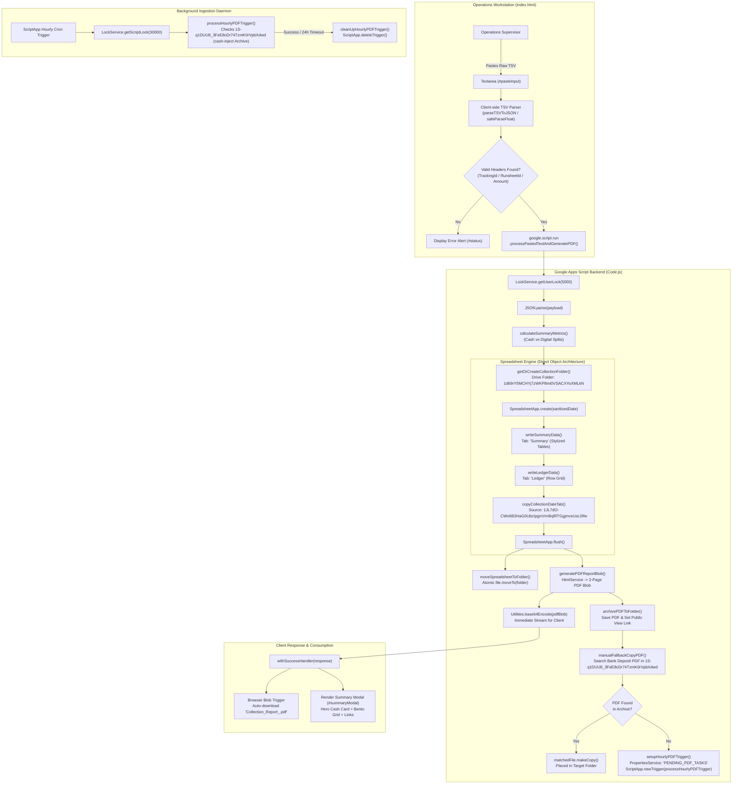
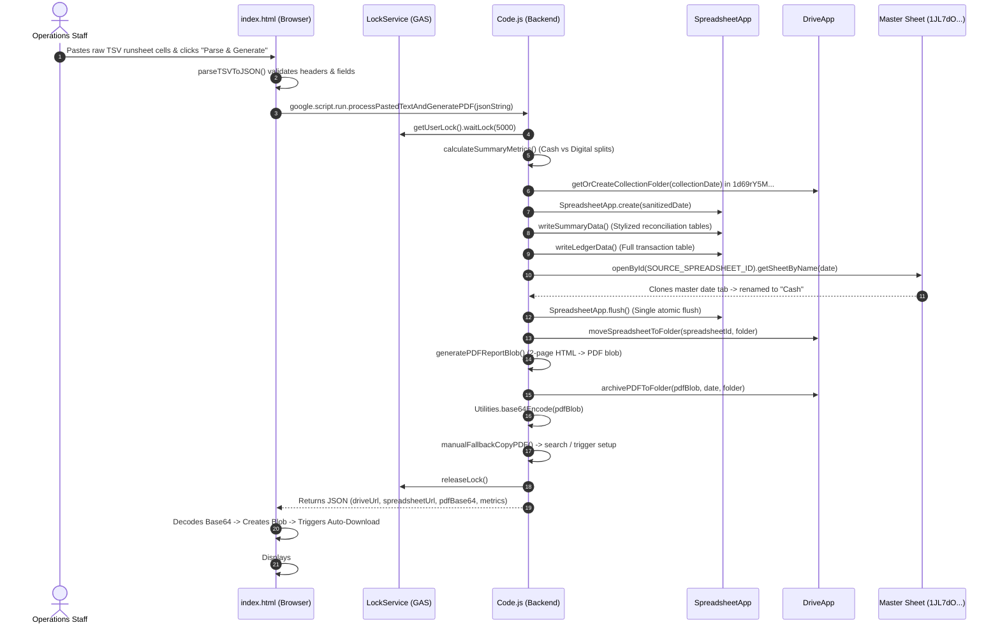
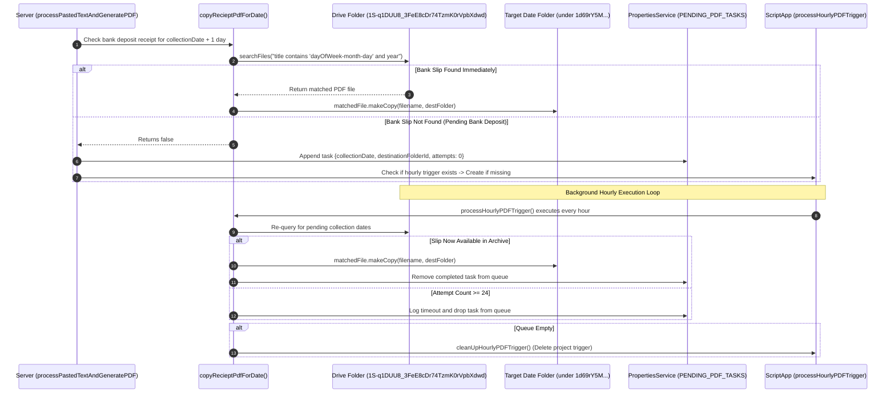

# COD Automation
> **Excel Runsheet Bridge & Automated Hub Cash Reconciliation Engine** — Architecture Specification & Project Memory Note

---

## 1. Overview
`COD Automation` (internal web app title: `Excel Runsheet Bridge`, dashboard header: `Hub Cash Recon Dashboard`, Clasp Script ID: `1gcCe2od7PapnNtHzmwc12RMwzGd23nSp-Q-mlSuMeW7sYrV429reEwNQ`, Editor URL: [script.google.com project](https://script.google.com/home/projects/1gcCe2od7PapnNtHzmwc12RMwzGd23nSp-Q-mlSuMeW7sYrV429reEwNQ/edit)) is an enterprise-grade financial auditing, cash-on-delivery (COD) runsheet reconciliation, and automated document compilation system built on the [[Google Apps Script]] (V8 engine) serverless platform. The tool serves operations supervisors and cash desk personnel at logistics fulfillment hubs and courier distribution facilities *(inferred)*. It addresses the operational friction and manual calculation errors inherent in reconciling physical cash collected by delivery executives against logistics manifest TSV exports from ERP systems. 

Deployed as a client-side Single-Page Application (`index.html`) backed by an atomic server execution pipeline (`Code.js`), the application ingests raw tab-delimited Excel clipboard data, parses and validates multi-column courier delivery runsheets, isolates cash collections from digital gateway transactions, computes aggregated financial metrics, and generates a formatted, three-tab [[Google Sheets]] workbook (`Summary`, `Ledger`, and an archived `Cash` tab cloned directly from master spreadsheet `1JL7dO-CWo6B3HaG0UbcIpgmVmBqlRTGgjmvsUsL0Ifw`). Simultaneously, it renders a pixel-perfect, two-page vector audit PDF slip, generates an immediate client-side base64 download stream, organizes generated documents in date-indexed [[Google Drive]] archive folders (`1d69rY5MCHYj7zWKP8mi0VSACXYoXMLkN`), and registers an asynchronous polling trigger to locate and copy corresponding Airtel Payments Bank deposit receipts archived in Drive folder `1S-q1DUU8_3FeE8cDr74TzmK0rVpbXdwd` (managed by companion project [[cash-inject]]).

---

## 2. Tech Stack

| Layer | Technology | Version | Purpose & Architectural Notes |
|---|---|---|---|
| **Server Runtime** | [[Google Apps Script]] | V8 Runtime *(stated in appsscript.json line 4)* | Executes server-side JavaScript within Google Workspace cloud infrastructure; handles data processing, Drive file manipulation, and trigger orchestration. |
| **Project Manifest** | `appsscript.json` | V1 *(stated)* | Configures project environment: `timeZone: "Asia/Kolkata"`, `exceptionLogging: "STACKDRIVER"`, `runtimeVersion: "V8"`, and web app execution as `USER_DEPLOYING` with `MYSELF` access. |
| **CLI & Sync Tooling** | Google Clasp (`@google/clasp`) | Standard Clasp *(stated in .clasp.json)* | Local development, script synchronization, and deployment bridge bound to Script ID `1gcCe2od7PapnNtHzmwc12RMwzGd23nSp-Q-mlSuMeW7sYrV429reEwNQ`. |
| **Advanced Cloud Services** | Drive API (`drive`) | `v3` *(stated in appsscript.json line 10)* | Google Advanced Service symbol `Drive` declared for direct Google Drive v3 REST interactions. |
| **Advanced Cloud Services** | Sheets API (`sheets`) | `v4` *(stated in appsscript.json line 15)* | Google Advanced Service symbol `Sheets` declared for programmatic spreadsheet manipulation. |
| **Spreadsheet Engine** | `SpreadsheetApp` (GAS Native) | Native V8 API | In-memory spreadsheet creation and batch mutation; implements direct object referencing to avoid `openById` quota overhead. |
| **PDF Rendering Engine** | `HtmlService` + `Utilities` | Native V8 API | Evaluates inline CSS-styled HTML templates (`generatePDFReportBlob`) and converts them into PDF blobs via `getAs('application/pdf')`. |
| **Client Workstation** | HTML5 / Vanilla ES6+ | Modern Browser Standard | Single-Page Application (`index.html`) featuring tab navigation, Excel TSV parser, bento grid analytics, and interactive modal dialogs. |
| **Frontend Styling** | Custom CSS3 | CSS Variables (`:root`) | Responsive desktop workstation styling with clean slate/blue/emerald palettes, CSS Grid layouts, and animated skeleton loaders. |
| **Web Typography** | Google Fonts CDN | Inter & Fira Code *(stated in index.html line 9)* | Inter (weights 300–800) for structural UI and Fira Code (weights 400–700) for numeric ledgers, runsheet IDs, and monetary figures. |
| **Concurrency Control** | `LockService` (GAS Native) | Native User & Script Locks | Short-lived user lock (`waitLock(5000)` in line 39) prevents double-click race conditions; script lock (`waitLock(30000)` in line 1057) serializes trigger runs. |
| **Queue & State Storage** | `PropertiesService` | Script Properties | Persistent key-value storage (`PENDING_PDF_TASKS`) maintaining state for asynchronous hourly bank slip search tasks. |
| **Scheduled Automation** | `ScriptApp` (GAS Native) | Programmatic Trigger API | Dynamically instantiates and self-terminates hourly time-based background triggers (`processHourlyPDFTrigger`). |

---

## 3. Architecture

### System Architecture Overview
The system bridges operational spreadsheet data with Google Workspace cloud storage through a hybrid synchronous/asynchronous execution architecture:



### Core Architectural Patterns
1. **Direct Object Reference Pattern (`Code.js` lines 180–250):** Standard GAS scripts frequently instantiate spreadsheets, close them, and re-open them via `SpreadsheetApp.openById()`. On newly created, unindexed cloud files, `openById()` and `getSheetByName()` frequently throw transient `DocumentApp / SpreadsheetApp` lookup exceptions. This project maintains the live reference returned by `SpreadsheetApp.create()` across all sheet mutations (`ss.getSheets()[0]`, `ss.insertSheet("Ledger")`, and `sourceSheet.copyTo(ss)`), performing a single atomic `SpreadsheetApp.flush()` prior to moving the file into its parent folder.
2. **Dual Client/Server Parsing Redundancy:** Identical regular expressions and safe fraction parsers (`/(?:"([^"]*(?:""[^"]*)*)"|([^\t]*))(\t|$)/g` and `^i?(-?\d+)\s+(-?\d+)\/(-?\d+)$`) are implemented in both `index.html` (lines 787–874) and `Code.js` (lines 120–131, 703–757). This ensures immediate client-side UI feedback and validation before dispatching large JSON payloads across `google.script.run`.
3. **Cross-Project Drive Storage Decoupling:** The application integrates directly with the output of [[cash-inject]] (Airtel Payments Bank transaction scanner). It polls folder `1S-q1DUU8_3FeE8cDr74TzmK0rVpbXdwd` for bank deposit receipts dated `collectionDate + 1 day` (the physical bank deposit day).
4. **Self-Pruning Asynchronous State Machine:** When bank deposit receipts are not yet available in Drive at the moment the runsheet is processed, the system serializes a background task into `ScriptProperties` under `PENDING_PDF_TASKS` and establishes a single `everyHours(1)` trigger. Once all queued dates are resolved (or reach a 24-attempt timeout), the trigger explicitly unregisters itself via `cleanUpHourlyPDFTrigger()`, preventing trigger leakages.

---

## 4. Folder & File Structure

```
C:\Users\User\Desktop\gptd\remote_clones\cash\
├── .clasp.json          # Clasp configuration linking local workspace to GAS project ID
├── appsscript.json      # Manifest defining V8 runtime, timezone, scopes, and advanced APIs
├── Code.js              # Server-side monolith: RPC endpoints, spreadsheet/PDF compilers, queue daemon
└── index.html           # Client-side SPA: Excel paste parser, live analytics modal, history viewer
```

| File Name | Size | Purpose & Technical Scope |
|---|---|---|
| `.clasp.json` | 276 B | Defines clasp bindings (`scriptId: 1gcCe2od7PapnNtHzmwc12RMwzGd23nSp-Q-mlSuMeW7sYrV429reEwNQ`, file push extensions `.js`, `.gs`, `.html`, `.json`). |
| `appsscript.json` | 680 B | Apps Script project manifest. Configures `Asia/Kolkata` timezone, V8 engine, Advanced Services `Drive` (v3) and `Sheets` (v4), 4 OAuth permission scopes, and restricted web app access (`executeAs: "USER_DEPLOYING"`, `access: "MYSELF"`). |
| `Code.js` | 48.2 KB (1,135 lines) | Core backend controller. Manages TSV parsing, financial metric calculations, direct-object spreadsheet generation, inline vector HTML PDF generation, Drive organization, and hourly task queue polling. |
| `index.html` | 42.3 KB (1,249 lines) | Frontend presentation layer. Provides paste interception, client TSV normalization, bento-grid metrics modal, Base64 Blob instant PDF download, and archived report history viewer. |

---

## 5. Core Modules & Responsibilities

### `Code.js`
- **Purpose:** Server-side engine handling RPC entry points from `google.script.run`, concurrency locks, mathematical summaries, Google Sheets generation, PDF compilation, Google Drive file movement, and background trigger orchestration.
- **Key Configuration Constants (`Code.js` lines 6–9):**
  - `DRIVE_FOLDER_ID`: `"1d69rY5MCHYj7zWKP8mi0VSACXYoXMLkN"` — Primary root Drive folder where per-date subfolders (e.g. `02-07-2026`) are created.
  - `DELAYED_PDF_SOURCE_FOLDER_ID`: `"1S-q1DUU8_3FeE8cDr74TzmK0rVpbXdwd"` — Source archive folder holding bank cash pickup deposit slips generated by [[cash-inject]].
  - `PENDING_TASKS_PROPERTY_KEY`: `"PENDING_PDF_TASKS"` — Key in `PropertiesService.getScriptProperties()` for asynchronous polling tasks.
  - `SOURCE_SPREADSHEET_ID`: `"1JL7dO-CWo6B3HaG0UbcIpgmVmBqlRTGgjmvsUsL0Ifw"` — External master spreadsheet containing historical daily collection tabs.
- **Key Functions:**
  - `doGet()` (lines 17–22): Serves `index.html` using `HtmlService.createTemplateFromFile('index').evaluate()`. Sets title to `'Excel Runsheet Bridge'` and enables framing via `HtmlService.XFrameOptionsMode.ALLOWALL`.
  - `processPastedTextAndGeneratePDF(parsedDataStr)` (lines 36–112): Primary end-to-end execution pipeline called by the frontend. Acquires a 5-second user lock (`LockService.getUserLock()`), validates the JSON array, computes metrics, resolves target Drive folders, generates the Google Sheet, creates the vector PDF, encodes it to Base64, moves files, archives the PDF, and dispatches the fallback bank slip search.
  - `safeParseFloat(val)` (lines 120–131): Robust number parser. Strips commas, evaluates mixed fractions (e.g., `"1 1/2"` → `1.5`), simple fractions (e.g., `"1/2"` → `0.5`), and regex-matches decimal patterns. Returns `0` on invalid input.
  - `normalizeRowKeys(row)` (lines 133–140): Converts raw row object keys to lowercase alphanumeric strings (`String(key).toLowerCase().replace(/[^a-z0-9]/g, "")`) to ensure case-insensitive, whitespace-agnostic property access.
  - `calculateSummaryMetrics(data)` (lines 142–169): Iterates all runsheet rows to accumulate `totalCashToCollect`, `totalCashCollected`, `cashCount`, `totalDigitalToCollect`, `totalDigitalCollected`, and `digitalCount`. Tallies distinct delivery executives and runsheet IDs using JavaScript `Set` collections.
  - `sanitizeCellValue(val)` (lines 171–176): Formula injection mitigation. Prepends an apostrophe (`'`) if any string value starts with `'='`.
  - `createAndPopulateSpreadsheet(collectionDate, parsedData, metrics)` (lines 190–250): Core spreadsheet factory. Directly creates `SpreadsheetApp.create(sanitizedDate)`, configures the default sheet as `Summary`, inserts `Ledger` (with up to 3 retries), invokes data/formatting writers, copies the master collection tab, and flushes all changes atomically.
  - `writeSummaryData(sheet, filteredData, metrics)` (lines 256–494): Assembles and writes the high-level reconciliation dashboard in `Summary`. Formats distinct sections: Title, Subtitle, Batch Information, Runsheet IDs list, Executive Names list, Cash Deposition Summary (green `#065f46`), Digital Channels Summary (blue `#1e40af`), and Grand Combined Total (dark `#0f172a`). Performs atomic `setValues()` and wraps styling in non-fatal `try/catch`.
  - `writeLedgerData(sheet, filteredData)` (lines 500–555): Generates the complete raw transaction grid in `Ledger`. Freezes top row and first 2 columns, applies alternating row zebra stripes (`#f8fafc` vs `#ffffff`), sets border styling, and auto-resizes columns.
  - `copyCollectionDateTab(destinationSs, collectionDate)` (lines 846–877): Opens master sheet `SOURCE_SPREADSHEET_ID`, searches for a tab matching `DD/MM/YYYY`, copies it via `sourceSheet.copyTo(destinationSs)`, and renames it to `"Cash"`. If missing or errored, inserts a fallback `"Cash"` tab with an explanatory diagnostic message.
  - `moveSpreadsheetToFolder(spreadsheetId, folder)` (lines 563–584): Uses `DriveApp.getFileById(spreadsheetId)`, trashes any existing file in `folder` with an identical name, and executes `file.moveTo(folder)` with 3 exponential backoff attempts.
  - `getOrCreateCollectionFolder(collectionDate)` (lines 586–591): Queries subfolders of `DRIVE_FOLDER_ID` by sanitized date (`YYYY-MM-DD` or `DD-MM-YYYY`). Returns existing folder or creates a new one.
  - `archivePDFToFolder(pdfBlob, collectionDate, folder)` (lines 593–608): Trashes existing PDF files of the same name in `folder`, writes `sanitizedDate + ".pdf"`, sets view permissions (`DriveApp.Access.ANYONE_WITH_LINK, DriveApp.Permission.VIEW`), and returns file URL and ID.
  - `generatePDFReportBlob(data, metrics)` (lines 621–695): Compiles an inline 2-page CSS/HTML document (Page 1: Summary cards with metric badges; Page 2: Detailed Transaction Ledger table with page break). Converts the HTML string to a PDF blob via `HtmlService.createHtmlOutput(html).getAs('application/pdf')`.
  - `parseRowFields(rowText)` (lines 703–713) & `parseTSVToJSON(pastedText)` (lines 741–757): Server-side TSV parser supporting quoted fields and embedded tabs.
  - `normalizeHeader(header)` (lines 715–729): Maps messy column headers (`runsheetno`, `waybill`, `codamount`, `posref`, `paymentmode`) to standardized schema keys (`RunsheetId`, `TrackingId`, `AmountToBeCollected`, `TransactionId(POS)`, `TransactionType`).
  - `fetchCollectionHistory()` (lines 765–789): Scans all child folders in `DRIVE_FOLDER_ID`, detects `.pdf` and Google Sheets files within each, sorts entries descending by parsed folder date, and returns `{ success: true, history: [...] }`.
  - `copyRecieptPdfForDate(collectionDateStr, destinationFolderId)` (lines 919–1003): Calculates target bank search date (`collectionDate + 1 day`), constructs query patterns (`dayOfWeek-monthName-dayOfMonth` e.g. `thu-jul-02` / `thu-jul-2` and `year`), searches `DELAYED_PDF_SOURCE_FOLDER_ID`, and copies matching deposit slips into the destination folder.
  - `setupHourlyPDFTrigger(collectionDateStr, destinationFolderId)` (lines 1010–1049): Queues pending date tasks in `ScriptProperties` under `PENDING_PDF_TASKS`. Instantiates an hourly trigger for `processHourlyPDFTrigger` if not already registered.
  - `processHourlyPDFTrigger()` (lines 1054–1118): Trigger handler guarded by `LockService.getScriptLock().waitLock(30000)`. Iterates queued tasks, invokes `copyRecieptPdfForDate`, retains failed tasks up to 24 attempts, updates `ScriptProperties`, and triggers `cleanUpHourlyPDFTrigger()` when the queue empties.
  - `cleanUpHourlyPDFTrigger()` (lines 1123–1134): Deletes all project triggers bound to handler function `"processHourlyPDFTrigger"`.
- **Depends on:** `SpreadsheetApp`, `DriveApp`, `HtmlService`, `Utilities`, `LockService`, `PropertiesService`, `ScriptApp`.
- **Depended on by:** `index.html` (via `google.script.run`).
- **Notable Logic & Gotchas:**
  - *Lock timeout fragility:* `LockService.getUserLock().waitLock(5000)` aborts execution if another runsheet submission is active.
  - *Direct Object Pattern:* Avoiding `openById()` prevents Google Drive unindexed file lookup failures.
  - *Date + 1 Search Offset:* Bank cash pickups happen the day *after* field collection. Searching on `collectionDate + 1 day` is critical to locating the correct deposit receipt.

---

### `index.html`
- **Purpose:** Client-side Single-Page Application providing the operational interface for pasting TSV runsheet data, displaying parsed metrics in an interactive modal, initiating automatic local PDF downloads, and inspecting historical archives.
- **Key Sections:**
  - **Styles (`index.html` lines 10–616):** Defines `:root` color tokens, light workstation aesthetic, responsive flex/grid layouts, bento grid statistics, summary cards, and `@keyframes loading-skeleton` animations.
  - **Main Container & Navigation (lines 619–674):** Renders dashboard header with SVG icon, tab switcher (`#uploadTabBtn` vs `#historyTabBtn`), and status notification banner (`#status`).
  - **Upload Tab (`#uploadTab`, lines 634–646):** Textarea (`#pasteInput`) and primary action button (`#parseBtn`).
  - **History Tab (`#historyTab`, lines 648–674):** Refresh button (`#refreshHistoryBtn`), animated skeleton loader (`#skeletonLoader`), and history table (`#historyTable`).
  - **Validation Summary Modal (`#summaryModal`, lines 677–768):** Modal overlay featuring:
    - *Hero Cash Card:* Displays total cash collected in large 32px font (`#modalHeroCash`).
    - *Bento Grid:* 4-column statistic grid (Total Shipments, Unique Runsheets, Unique Executives, Collection Date).
    - *Summary Breakdown Cards:* Cash Deposition card (green border) and Digital Channels card (blue border).
    - *Generated Documents Section:* Links to view PDF in Drive, open the created Google Spreadsheet, and download the local PDF blob.
  - **Client-Side Scripts (lines 770–1246):**
    - `escapeHtml(unsafe)` (lines 774–782): Encodes `&`, `<`, `>`, `"`, and `'` to prevent XSS.
    - `parseRowFields(rowText)` (lines 787–806): TSV field extractor handling quotes and delimiters.
    - `parseTSVToJSON(pastedText)` (lines 808–850): Scans up to the first 10 rows to detect the true header row (matching `runsheet`, `tracking`, `amount`, or `date`), maps columns, and serializes rows into JSON.
    - `safeParseFloat(val)` (lines 852–874): Client-side numeric and fraction evaluation.
    - `calculateSummaryMetrics(data)` (lines 876–940): Client-side metrics accumulator.
    - `initializeApp()` (lines 945–1245): Binds DOM event listeners, handles tab switching, triggers `google.script.run.processPastedTextAndGeneratePDF()`, handles base64-to-Blob decoding (`atob` → `Uint8Array` → `Blob` → `<a download>.click()`), and loads history via `fetchCollectionHistory()`.
- **Depends on:** Google Apps Script client API (`google.script.run`), Google Fonts CDN.
- **Depended on by:** Operations end-user browser session.
- **Notable Logic & Gotchas:**
  - *Instant Blob Download:* Instead of waiting for Drive file sharing propagation or redirecting users to Drive preview links, `index.html` decodes `response.pdfBase64` into a local browser `Blob` and simulates an immediate programmatic `.click()` on a temporary anchor element (lines 1040–1068).
  - *Browser Popup Blockers:* Certain strict browser configurations may block programmatic `.click()` anchor downloads; fallback manual buttons are provided inside the modal (`#modalDocLinks`).

---

### `appsscript.json`
- **Purpose:** Google Apps Script project manifest configuring the execution environment, third-party libraries, and security scopes.
- **Key Fields:**
  - `timeZone`: `"Asia/Kolkata"` *(stated in line 2)* — Ensures all `new Date()` operations, folder names, and PDF timestamps align with Indian Standard Time (IST).
  - `runtimeVersion`: `"V8"` *(stated in line 4)* — Enables modern ECMAScript 6+ syntax (classes, arrow functions, `const`/`let`, template literals).
  - `exceptionLogging`: `"STACKDRIVER"` *(stated in line 3)* — Directs console errors and traces to Google Cloud Logging.
  - `dependencies.enabledAdvancedServices`: Includes `drive` (v3) and `sheets` (v4).
  - `oauthScopes` (lines 19–24): Explicit list of requested permissions:
    - `https://www.googleapis.com/auth/spreadsheets` (Read/write access to Google Sheets)
    - `https://www.googleapis.com/auth/drive` (Full read/write access to Google Drive)
    - `https://www.googleapis.com/auth/script.external_request` (Allows outbound UrlFetchApp requests)
    - `https://www.googleapis.com/auth/script.scriptapp` (Allows programmatic trigger management)
  - `webapp` (lines 25–28): Configured with `executeAs: "USER_DEPLOYING"` and `access: "MYSELF"`.

---

### `.clasp.json`
- **Purpose:** Configuration file for Google Clasp (Command Line Apps Script Projects).
- **Key Fields:**
  - `scriptId`: `"1gcCe2od7PapnNtHzmwc12RMwzGd23nSp-Q-mlSuMeW7sYrV429reEwNQ"`
  - `rootDir`: `""` (root of repository)
  - `scriptExtensions`: `[".js", ".gs"]`
  - `htmlExtensions`: `[".html"]`
  - `jsonExtensions`: `[".json"]`

---

## 6. Data Flow / Key Workflows

### 1. Runsheet Processing & Document Generation Pipeline



### 2. Asynchronous Bank Deposit Slip Search & Fallback Trigger Flow



### 3. Collection Archive History Retrieval Flow
1. User clicks **"Archive History"** tab (`#historyTabBtn`) in `index.html`.
2. UI displays `#skeletonLoader` animation and invokes `google.script.run.fetchCollectionHistory()`.
3. Server executes `fetchCollectionHistory()` in `Code.js` (lines 765–789):
   - Opens `DRIVE_FOLDER_ID` (`1d69rY5MCHYj7zWKP8mi0VSACXYoXMLkN`).
   - Iterates all child date subfolders.
   - For each subfolder, inspects contained files for `.pdf` and `MimeType.GOOGLE_SHEETS`.
   - Sorts folder entries chronologically descending using `parseFolderDate()`.
4. Server returns `{ success: true, history: [...] }`.
5. Frontend renders `#historyTableBody` with direct hyperlinks to open Google Sheets and view PDFs in Google Drive.

---

## 7. Configuration & Environment

### Configuration Constants (`Code.js`)

| Constant | Code Location | Value | Description |
|---|---|---|---|
| `DRIVE_FOLDER_ID` | `Code.js` line 6 | `1d69rY5MCHYj7zWKP8mi0VSACXYoXMLkN` | Target parent folder in Google Drive where daily reconciliation folders (e.g. `02-07-2026`) are created. |
| `DELAYED_PDF_SOURCE_FOLDER_ID` | `Code.js` line 7 | `1S-q1DUU8_3FeE8cDr74TzmK0rVpbXdwd` | Archive folder where bank cash pickup receipts generated by [[cash-inject]] are stored. |
| `PENDING_TASKS_PROPERTY_KEY` | `Code.js` line 8 | `PENDING_PDF_TASKS` | Property key in `PropertiesService.getScriptProperties()` storing the array of pending search tasks. |
| `SOURCE_SPREADSHEET_ID` | `Code.js` line 9 | `1JL7dO-CWo6B3HaG0UbcIpgmVmBqlRTGgjmvsUsL0Ifw` | Master Google Spreadsheet containing daily collection date sheets copied into generated workbooks. |

### Script Properties (`PropertiesService`)

| Property Key | Storage Store | Data Type | Purpose | Example / Default |
|---|---|---|---|---|
| `PENDING_PDF_TASKS` | `ScriptProperties` | JSON String (Array) | Stores queued background tasks waiting for bank PDF deposit receipts. | `[{"collectionDateStr":"02/07/2026","destinationFolderId":"1abc...","attempts":2}]` |

### Manifest Settings (`appsscript.json`)

| Manifest Key | Value | Purpose |
|---|---|---|
| `timeZone` | `Asia/Kolkata` | Standardizes all date math, folder names, and timestamps to Indian Standard Time (IST). |
| `runtimeVersion` | `V8` | Configures Google Apps Script V8 execution engine. |
| `exceptionLogging` | `STACKDRIVER` | Routes error traces to Google Cloud Logging. |
| `webapp.executeAs` | `USER_DEPLOYING` | Executes all script logic under the identity and permissions of the developer who deployed the web app. |
| `webapp.access` | `MYSELF` | Restricts access exclusively to the deploying user account (internal private tool). |

### Secrets Management
- No API tokens, passwords, or service account keys are stored in code or repository files.
- Authorization relies exclusively on native Google Workspace OAuth 2.0 consent granted during deployment.

---

## 8. External Integrations & APIs

| Service / API | Purpose | Auth Method | Location in Code | Rate Limits / Platform Quirks |
|---|---|---|---|---|
| **Google Drive API (v3)** | Creating folders, searching files, setting view sharing, moving spreadsheets | User OAuth (`auth/drive`) | `Code.js` lines 563–608, 765–789, 940–995 | Subject to Drive API read/write quotas; unindexed file searches can experience propagation lag. |
| **Google Sheets API (v4)** | Batch creating workbooks, formatting cells, cloning sheets | User OAuth (`auth/spreadsheets`) | `Code.js` lines 190–555, 846–877 | Direct object referencing is utilized to prevent `openById` quota exhaustion and caching delays. |
| **Google Apps Script LockService** | User and script execution synchronization | Native Runtime API | `Code.js` lines 37, 1055 | User locks wait max 5,000 ms; script locks wait max 30,000 ms. Throws timeout errors if contention occurs. |
| **Google Apps Script PropertiesService** | Persistent key-value storage for task queue | Native Runtime API | `Code.js` lines 1011, 1064, 1108 | Maximum property value size is 9 KB; total property storage limit is 500 KB per script. |
| **Google Apps Script ScriptApp** | Programmatic creation and deletion of time-driven triggers | Native Runtime API (`auth/script.scriptapp`) | `Code.js` lines 1042, 1125–1132 | Script trigger limit is 20 triggers per user per script; total trigger execution time is capped at 90 min/day (consumer) or 6 hr/day (Workspace). |
| **Google Fonts CDN** | Typography assets (Inter & Fira Code) | Public HTTP GET | `index.html` lines 7–9 | Standard web font delivery; cached by modern browser instances. |

---

## 9. Testing

- **Automated Test Coverage:** `Unknown / not documented` *(stated — standard for Google Apps Script projects lacking CI/CD runners)*.
- **Local Testing Execution Command:** `Unknown / not documented` *(no local test harness or npm test script exists in the repository)*.
- **Manual Verification Workflow:**
  1. Open the Web App URL generated by Clasp deployment.
  2. Copy a sample TSV runsheet block from Excel containing `TrackingId`, `RunsheetId`, `AmountToBeCollected`, `CashCollected`, `TransactionType` (CASH/DIGITAL), and `Date Of Collection`.
  3. Paste into the `#pasteInput` textarea and click **"Parse & Generate Report"**.
  4. Verify that:
     - The browser triggers an immediate PDF download named `Collection_Report_<date>.pdf`.
     - The modal appears showing exact matching cash and digital counts and currency totals.
     - The Google Drive folder `DRIVE_FOLDER_ID/<date>/` contains the newly created Google Sheet and PDF report.
     - The Google Sheet contains `Summary`, `Ledger`, and `Cash` tabs with proper currency and header formatting.
  5. In the Apps Script Editor, execute `manualFallbackCopyPDF()` to verify receipt search and trigger creation logic.
- **Explicitly Untested & Known Fragile Areas:**
  - `parseRowFields()` with malformed quotes or nested non-standard delimiter combinations.
  - Fractions parsing in `safeParseFloat()` when strings contain unexpected alphabetical characters.
  - Asynchronous trigger persistence when `PENDING_PDF_TASKS` payload approaches the 9 KB script property limit.

---

## 10. CI/CD & Deployment

- **Pipeline Definition:** `Unknown / not documented` *(no GitHub Actions or CI configuration committed)*.
- **Deployment Tooling:** Google Clasp (`@google/clasp`).
- **Deployment Process (Manual via Clasp):**
  1. Login to Google account via CLI:
     ```bash
     clasp login
     ```
  2. Push code to the Apps Script project:
     ```bash
     clasp push
     ```
  3. Deploy web app version:
     ```bash
     clasp deploy --description "Production Deployment"
     ```
- **Web App Execution Configuration:**
  - `executeAs: "USER_DEPLOYING"` *(stated in appsscript.json)* — The script runs under the authority of the deploying developer.
  - `access: "MYSELF"` *(stated in appsscript.json)* — Only the deploying account can access the published web app URL.
- **Rollback Process:** Rollbacks are performed manually in the Google Apps Script web editor via **Project History / Version Management** (`Deploy` > `Manage deployments` > Select prior version).

---

## 11. Setup & Local Development

### Prerequisites
- Node.js (v16+ recommended)
- `@google/clasp` installed globally:
  ```bash
  npm install -g @google/clasp
  ```
- Access to Google Apps Script project `1gcCe2od7PapnNtHzmwc12RMwzGd23nSp-Q-mlSuMeW7sYrV429reEwNQ`.
- Read/write permissions on Google Drive folders `1d69rY5MCHYj7zWKP8mi0VSACXYoXMLkN` and `1S-q1DUU8_3FeE8cDr74TzmK0rVpbXdwd`.

### Setup Steps
1. Navigate to the local workspace:
   ```bash
   cd C:\Users\User\Desktop\gptd\remote_clones\cash
   ```
2. Verify `.clasp.json` contains the target script ID:
   ```json
   {
     "scriptId": "1gcCe2od7PapnNtHzmwc12RMwzGd23nSp-Q-mlSuMeW7sYrV429reEwNQ",
     "rootDir": ""
   }
   ```
3. Authenticate Clasp:
   ```bash
   clasp login
   ```
4. Pull current remote code or push local edits:
   ```bash
   clasp pull
   clasp push
   ```
5. Open the project in the web editor to test or deploy:
   ```bash
   clasp open
   ```

---

## 12. Security Notes

### OAuth Scopes Audit (`appsscript.json`)

| OAuth Scope | Permission Level | Risk Assessment & Least Privilege Analysis |
|---|---|---|
| `https://www.googleapis.com/auth/spreadsheets` | Full Read/Write Google Sheets | **Appropriate:** Required to create new sheets, clone tabs from master sheet, and write cell data. |
| `https://www.googleapis.com/auth/drive` | Full Google Drive Access | > [!warning]<br/>**Overly Broad Scope:** Grants read/write/delete permissions across the user's entire Google Drive. The script only requires access to specific folders (`DRIVE_FOLDER_ID` and `DELAYED_PDF_SOURCE_FOLDER_ID`) and files created by the application. Migrating to `https://www.googleapis.com/auth/drive.file` would adhere to least-privilege principles, though it requires files to be opened or created directly by the script. |
| `https://www.googleapis.com/auth/script.external_request` | Outbound HTTP Requests | **Declared but Unused:** Present in manifest line 22, but no `UrlFetchApp` calls exist in `Code.js`. Can be safely removed to reduce attack surface. |
| `https://www.googleapis.com/auth/script.scriptapp` | Programmatic Triggers | **Appropriate:** Required by `setupHourlyPDFTrigger()` and `cleanUpHourlyPDFTrigger()` to manage cron triggers. |

### Web App Surface Security
- **Access Control:** `webapp.access` is configured as `"MYSELF"`. The web app endpoint is private and inaccessible to anonymous internet users.
- **Frame Embedding:** `setXFrameOptionsMode(HtmlService.XFrameOptionsMode.ALLOWALL)` is enabled in `Code.js` line 21. This permits the application to be embedded inside internal company portals or iframe dashboards, but exposes it to potential clickjacking if deployed in a public context.
- **Formula Injection Mitigation:** Implemented in `Code.js` line 175 (`sanitizeCellValue`): any cell string beginning with `=` is prefixed with `'` to neutralize CSV/Spreadsheet formula execution.
- **XSS Sanitization:** `escapeHtml()` is implemented in both `Code.js` (line 616) and `index.html` (line 774), escaping HTML entities before injecting runsheet fields into vector PDF reports or browser DOM innerHTML.

---

## 13. Known Issues, Limitations & Tech Debt

### Platform Standing Quotas (Google Apps Script)
> [!note]
> - **Execution Timeout:** Maximum runtime is 6 minutes per script execution. Large runsheet payloads (>5,000 rows) with heavy formatting may risk reaching this limit.
> - **Trigger Limits:** Google accounts are limited to 20 triggers per user per script. The auto-cleanup mechanism in `cleanUpHourlyPDFTrigger()` is critical to prevent trigger exhaustion.
> - **Drive Search Quotas:** `DriveApp.searchFiles()` queries on shared corporate folders can be slow and may throttle if executed frequently.

### Identified Technical Debt & Vulnerabilities
1. **Hardcoded Drive & Spreadsheet IDs (`Code.js` lines 6–9):**
   > [!warning]
   > The IDs for `DRIVE_FOLDER_ID`, `DELAYED_PDF_SOURCE_FOLDER_ID`, and `SOURCE_SPREADSHEET_ID` are hardcoded strings in `Code.js`. If folders or sheets are moved, deleted, or recreated in Google Drive, the script fails fatally without configurable fallbacks. These should be moved to `ScriptProperties`.
2. **Short Concurrency Lock Timeout (`Code.js` line 39):**
   `LockService.getUserLock().waitLock(5000)` waits only 5 seconds before returning `"Server execution lock timeout."`. If a supervisor submits a large runsheet while another request is actively writing and flushing spreadsheets (which typically takes 4–8 seconds), the second submission will be aborted.
3. **Receipt Matching Date Pattern Sensitivity (`Code.js` lines 937–944):**
   The search query pattern in `copyRecieptPdfForDate` relies on strict day/month strings:
   `const patternPaddedLower = (dayOfWeek + "-" + monthName + "-" + dayOfMonth).toLowerCase();`
   If the bank deposit slip generated by [[cash-inject]] uses an alternate naming convention (e.g. `YYYY-MM-DD`, `DD-MM-YYYY`, or a different locale), the matching logic fails and the task times out after 24 attempts.
4. **Base64 Payload Memory Footprint (`Code.js` line 82 & `index.html` lines 1040–1056):**
   Encoding multi-page PDFs to Base64 and passing them in the `google.script.run` response payload consumes significant browser and GAS memory. While effective for immediate downloads, very large reports (>10 MB) can exceed GAS RPC payload limits (~50 MB max, but performance degrades above 10 MB).

---

## 14. Design Decisions & Rationale

1. **Direct Object Referencing over `openById()` (`Code.js` lines 180–188):**
   - *Decision:* Retain live object references returned by `SpreadsheetApp.create()` and pass them through `writeSummaryData()`, `writeLedgerData()`, and `copyCollectionDateTab()`.
   - *Rationale *(stated)*:* Calling `SpreadsheetApp.openById()` or `getSheetByName()` immediately after file creation frequently triggers server-side lookup failures on unindexed Google Drive files. Keeping direct object pointers bypasses lookup overhead and improves execution speed.
2. **Single Atomic Flush Pattern (`Code.js` lines 231–241):**
   - *Decision:* Execute a single `SpreadsheetApp.flush()` with retry loops at the end of the spreadsheet generation chain rather than flushing after each sheet insertion or formatting block.
   - *Rationale *(stated/inferred)*:* Calling `flush()` repeatedly causes blocking RPC roundtrips between GAS and the Sheets backend, dramatically increasing execution time and triggering quota throttling.
3. **Direct Client-Side Base64 Download Stream (`Code.js` line 82 & `index.html` lines 1040–1068):**
   - *Decision:* Base64-encode the generated PDF blob and transmit it back to the client for immediate synthesis into a `Blob` URL.
   - *Rationale *(inferred)*:* Avoids requiring the user to navigate to Google Drive, authenticate separate view permissions, or wait for Drive file indexers before accessing the generated PDF deposit slip.
4. **Self-Terminating Asynchronous Task Queue (`Code.js` lines 1010–1134):**
   - *Decision:* Establish an hourly polling trigger via `ScriptApp.newTrigger()` that queries `PropertiesService` and auto-deletes itself via `cleanUpHourlyPDFTrigger()` once all queued dates are resolved.
   - *Rationale *(inferred)*:* Bank deposit slips from [[cash-inject]] arrive hours after runsheet reconciliation. Polling synchronously would violate the 6-minute GAS execution limit. Implementing a persistent background trigger with automatic unregistration prevents trigger leaks while guaranteeing eventual document linkage.

---

## 15. Roadmap / TODOs

- [ ] **Externalize Configuration:** Move `DRIVE_FOLDER_ID`, `DELAYED_PDF_SOURCE_FOLDER_ID`, and `SOURCE_SPREADSHEET_ID` into `PropertiesService` with a configuration modal in the web app UI.
- [ ] **Expand Lock Timeout:** Increase `getUserLock().waitLock(5000)` to 15,000 ms to reduce false lock timeout rejections during heavy concurrent hub operations.
- [ ] **Remove Unused Manifest Scopes:** Remove `https://www.googleapis.com/auth/script.external_request` from `appsscript.json` since `UrlFetchApp` is not utilized in the codebase.
- [ ] **Adopt `drive.file` Scope:** Transition from full `auth/drive` to `auth/drive.file` to align with enterprise security least-privilege standards.
- [ ] **Batch Runsheet Aggregation:** Allow operations staff to paste multiple runsheets across multiple days simultaneously and generate consolidated multi-day reconciliation workbooks.

---

## 16. Changelog

> *No prior note supplied — changelog starts here.*

- **2026-09-18:** Initial comprehensive project memory generated from Clasp clone codebase (`remote_clones/cash`). Documented complete architecture, direct-object spreadsheet patterns, TSV parsing engines, two-page vector PDF generation, Base64 client download streams, and the asynchronous hourly bank deposit slip polling daemon connecting to [[cash-inject]].

---

## 17. Glossary

| Term | Definition |
|---|---|
| **COD (Cash on Delivery)** | Logistics payment model where field delivery executives collect physical cash from customers upon package delivery. |
| **Runsheet** | A daily dispatch manifest assigning packages and collection amounts to delivery executives for a specific delivery route. |
| **Remittance** | The physical cash and digital funds collected by riders that must be reconciled and deposited into the company's accounting bank vault. |
| **POS (Point of Sale)** | Digital payment terminals or UPI QR gateway transactions collected by riders in lieu of physical cash. |
| **Clasp** | Command Line Apps Script Projects — Google CLI tool for local version control and push/pull deployment of Apps Script projects. |
| **V8 Runtime** | Google Apps Script's modern execution engine providing ECMAScript 6+ standard features. |
| **LockService** | GAS concurrency utility providing mutex locking (`getUserLock` / `getScriptLock`) to prevent race conditions. |
| **PropertiesService** | GAS persistent key-value store for saving configuration parameters and background task queues. |

---

## 18. Related Notes

- [[GAS-COD-Automation]] — Initial high-level project memory stub in the Obsidian vault.
- [[cash-inject]] — Companion project: Airtel Payments Bank Gmail transaction scanner & vector PDF receipt generator that populates `1S-q1DUU8_3FeE8cDr74TzmK0rVpbXdwd`.
- [[Projects/Repo-XLSX-STREAM-REPORT-GENERATOR]] — Connected financial operations repository.
- [[Google Apps Script]] — Core runtime platform reference.
- [[Google Drive]] — Target storage and archive infrastructure.
- [[Google Sheets]] — Report compilation and ledger storage engine.

---

## 19. Update Instructions (meta)

To refresh or update this document in future maintenance cycles:
1. Re-clone or pull the latest code using Clasp:
   ```bash
   cd C:\Users\User\Desktop\gptd\remote_clones\cash
   clasp pull
   ```
2. Feed this existing note alongside any changed code files (`Code.js`, `index.html`, `appsscript.json`) into the AI assistant.
3. Diff updates against Sections 5 (Core Modules), 6 (Data Flow), 7 (Configuration), 12 (Security), and 13 (Known Issues).
4. Append new dated entries to Section 16 (Changelog).
5. **Strict Constraint:** DO NOT overwrite manually established architectural decisions in Section 14 or cross-project links in Section 18 without explicit code verification. Always write staging outputs to `C:\Users\User\Desktop\gptd\prompt_project memory\` before vault synchronization.
