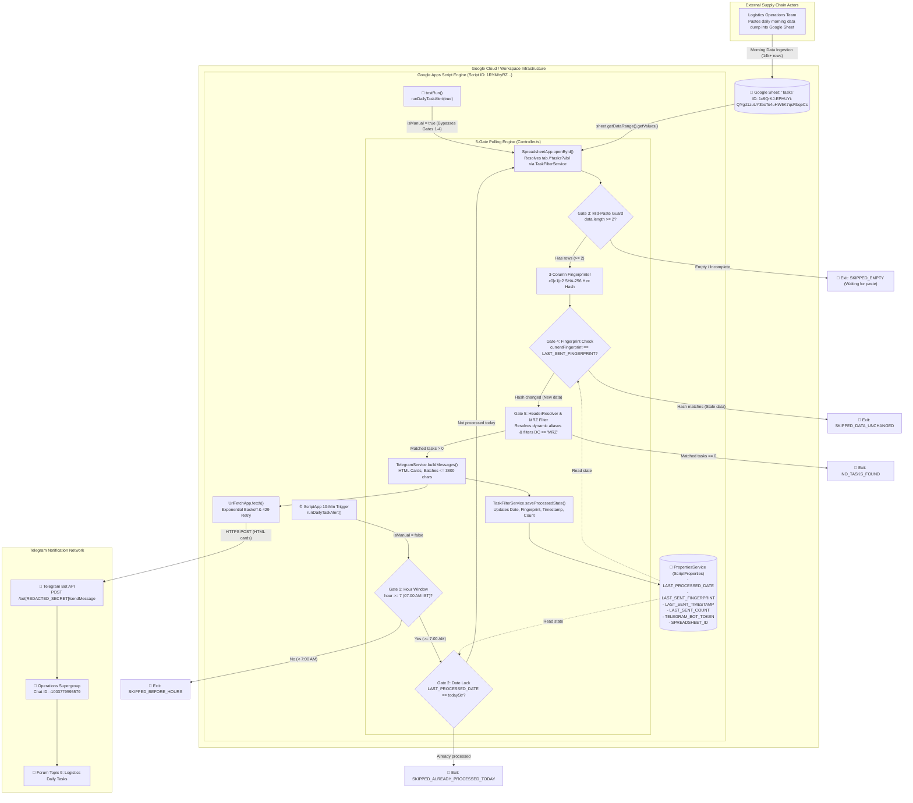
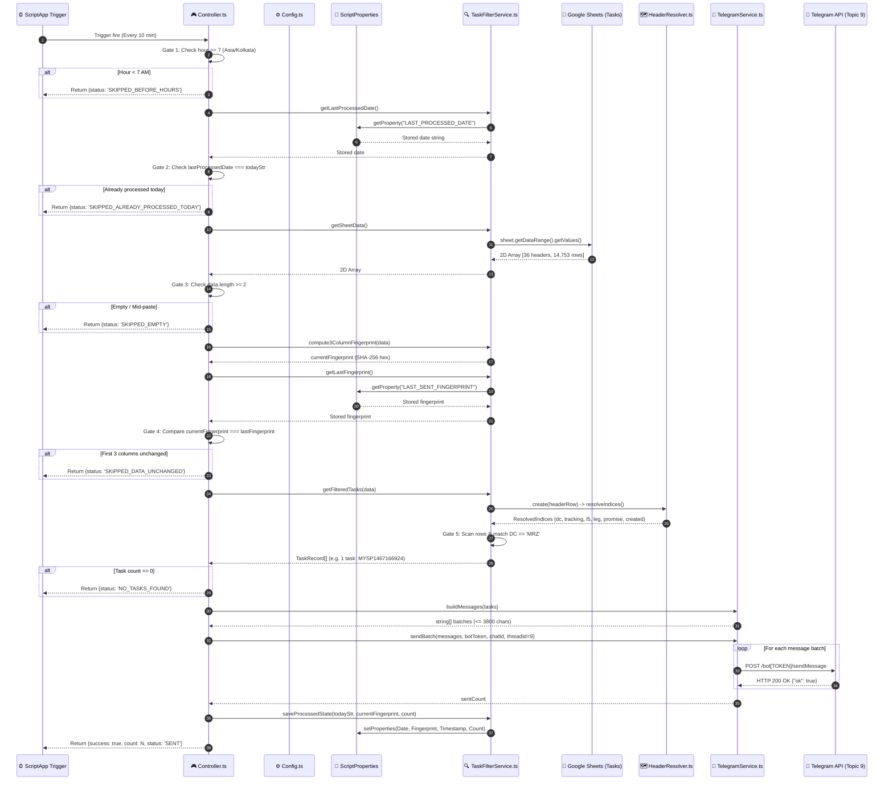
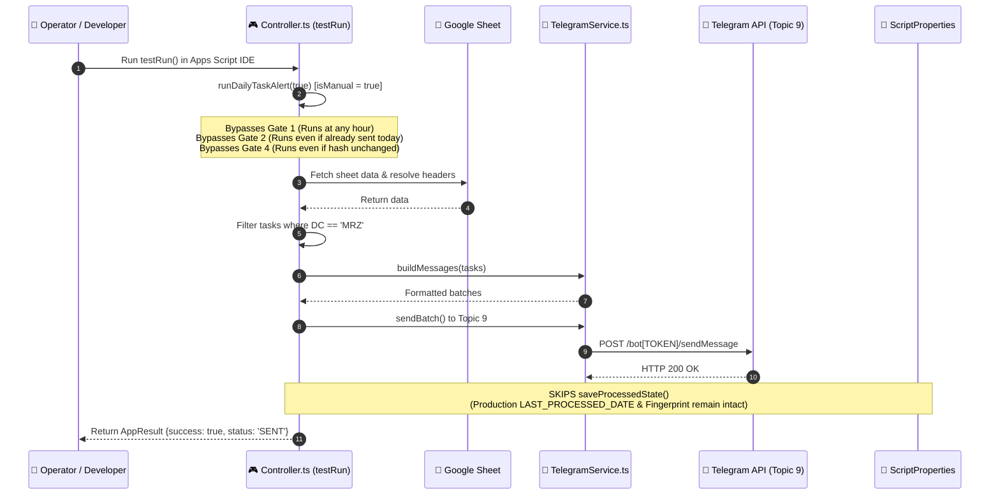
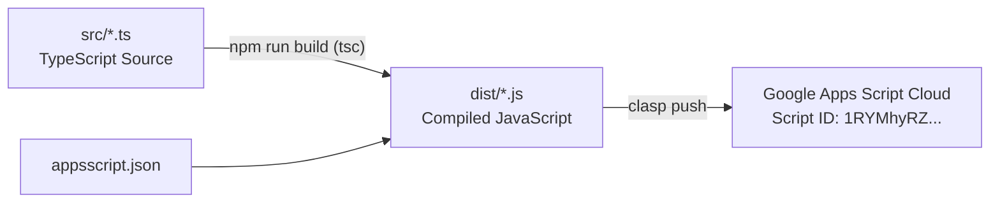

# daily-task-alert-gas
> **Enterprise TypeScript 5-Gate Polling Engine, Customer Escalation & CX Dispute Dispatcher, and Telegram Topic 9 Alert Daemon** — Architecture Specification & Project Memory Note

---

## 1. Overview
`daily-task-alert-gas` (version `1.0.0`, Clasp Script ID: `1RYMhyRZ2V8fRmn4IvYKBU2sxCuiLon93-jUYwyVVvK2I1GuZWMT96qbK`) is an autonomous customer escalation monitoring and CX dispute dispatch daemon built in [[TypeScript]] 5.4 targeting the [[Google Apps Script]] V8 runtime (`module: "None"`). It automates the intake, schema resolution, deduplication, and alerting of daily customer assertion escalations and grievance dispute tasks (IMD, disputed delivery, customer damage claims, TAT breaches) for the Mirzapur logistics hub (`MRZ`).

### The Operational Problem
In fast-paced regional delivery hubs such as Mirzapur (`MRZ`), field supervisors and customer experience (CX) operations teams must swiftly resolve critical customer escalations and grievance disputes — specifically Item Missing in Delivery (`IMD`), disputed delivery claims, customer damage claims, and strict turnaround time (`TAT`) breach escalations. These high-priority customer dispute tasks arrive daily via massive morning data dumps in central [[Google Sheets]] workbooks containing upwards of 14,000+ rows across all regional hubs. Prior to automated alerting:
1. **Critical Escalation Visibility Delay & Polling Fatigue:** Supervisors had to continuously open and refresh massive workbooks during the peak morning intake window (07:00 AM to 12:00 PM IST) to check whether central teams had logged new customer dispute tasks and TAT breaches, risking severe SLA violations.
2. **Alert Duplication & Mid-Paste Chaos:** Initial alert scripts risked firing while an upstream operator was halfway through pasting dispute rows, transmitting incomplete grievance task sets or spamming the team with duplicate notifications throughout the morning.
3. **Annotation Sensitivity False Positives:** When downstream team members updated resolution notes, status flags, or supervisor tags in columns 4+, naive modification checks triggered duplicate alert broadcasts.
4. **Markdown Parsing Failures:** Special characters (`_`, `*`, `[`, `` ` ``) in customer grievance categories and assertion names caused Telegram's legacy Markdown parser to throw HTTP 400 errors, resulting in lost escalation messages.

### The Architectural Solution
`daily-task-alert-gas` eliminates all operational friction by deploying a high-reliability, zero-downtime **5-Gate Polling Engine** executing on a 10-minute recurring time trigger during the morning window:
1. **Gate 1 (Hour Window Gate):** Enforces execution only after 07:00 AM IST (`Config.TRIGGER.START_HOUR`), completely halting execution outside morning operational hours.
2. **Gate 2 (Calendar Date Lock Gate):** Inspects `ScriptProperties` key `LAST_PROCESSED_DATE`. If today's calendar date (`yyyy-MM-dd`) matches the stored date, execution halts immediately with zero external API calls.
3. **Gate 3 (Mid-Paste & Empty Data Guard):** Reads the dynamic `tasks` worksheet and verifies row count (`data.length >= 2`). If empty or incomplete, it cleanly defers execution to the next 10-minute poll.
4. **Gate 4 (3-Column SHA-256 Fingerprint Gate):** Computes a SHA-256 hexadecimal cryptographic digest strictly across the first three columns (`c0|c1|c2`) of all sheet rows. Comparing this hash against `LAST_SENT_FINGERPRINT` in `ScriptProperties` ensures alerts only fire when genuine fresh daily data is pasted, remaining immune to downstream annotations in columns 4+.
5. **Gate 5 (Dynamic Header Resolution & MRZ Hub Filter):** Resolves columns dynamically using "The Header Map Law" (zero hardcoded array indices) and filters records strictly for `DC === 'MRZ'`. Tasks are formatted into HTML cards, batched under the 3,800 character ceiling, and dispatched to Telegram Forum Topic `9` in supergroup `-1003779595579`.
6. **Manual Safety Bypass (`testRun`):** Provides a developer and supervisor testing hook that passes `isManual = true`, allowing immediate end-to-end execution without mutating production state in `ScriptProperties`.

---

## 2. Tech Stack

| Layer | Technology | Version | Notes |
|---|---|---|---|
| **Language** | [[TypeScript]] | `^5.4.0` *(package.json:11)* | Compiled with `"target": "ES2020"`, `"module": "None"`, strict type checking, and zero runtime overhead. |
| **CLI & Deployment** | Google Clasp (`@google/clasp`) | `3.3.0` *(system tool)* | Compiles `src/*.ts` to `dist/*.js` via `tsc`, pushing `dist/` to Apps Script project `1RYMhyRZ2V8fRmn4IvYKBU2sxCuiLon93-jUYwyVVvK2I1GuZWMT96qbK`. |
| **Server Runtime** | [[Google Apps Script]] | V8 Engine *(appsscript.json:5)* | High-performance serverless Google Workspace cloud runtime executing ECMAScript 2020 syntax. |
| **Type Definitions** | `@types/google-apps-script` | `^1.0.83` *(package.json:10)* | Full compile-time static type safety for `SpreadsheetApp`, `PropertiesService`, `ScriptApp`, `UrlFetchApp`, and `Utilities`. |
| **Data Source** | [[Google Sheets]] (`SpreadsheetApp`) | Native Service *(TaskFilterService.ts:10-16)* | Interfaces with remote workbook `1c9QrKJ-EPHUYi-QYgd1zuUY3bcTo4uHW5K7qsRbqeCs` (tab matching `/^tasks?\b/i`). |
| **State Persistence** | `PropertiesService` (`ScriptProperties`) | Native Service *(TaskFilterService.ts:168-202)* | Key-value storage storing `LAST_PROCESSED_DATE`, `LAST_SENT_FINGERPRINT`, `LAST_SENT_TIMESTAMP`, `LAST_SENT_COUNT`, and optional `TELEGRAM_BOT_TOKEN`. |
| **Cryptography** | `Utilities` (Google Apps Script) | Native Service *(TaskFilterService.ts:152-164)* | In-memory SHA-256 digest computation (`Utilities.DigestAlgorithm.SHA_256`) converted to 64-character lowercase hex strings. |
| **HTTP Client** | `UrlFetchApp` (Google Apps Script) | Native Service *(TelegramService.ts:112)* | Transmits HTTPS POST requests with JSON payloads to Telegram Bot API with exponential backoff and HTTP 429 `retry_after` handling. |
| **Scheduling Engine** | `ScriptApp` | Native Service *(TriggerManager.ts:27-30)* | Installs and manages 10-minute recurring project triggers targeting `runDailyTaskAlert`. |
| **QA / Simulation** | `openpyxl` & Python `unittest` | Python 3.14 / openpyxl 3.1.5 *(tests/test_pipeline.py)* | Local test suite validating the entire 5-gate pipeline against 14,753 real rows from `DAILY TASK VIEW.xlsx` (7/7 passed). |
| **Messaging Target** | [[Telegram]] Bot API | Telegram Bot API | External notification channel posting HTML cards to Topic ID `9` of supergroup `-1003779595579`. |

---

## 3. Architecture

### System Topology & The 5-Gate Polling Engine
The system operates entirely serverless between Google Workspace Cloud infrastructure and the Telegram Bot API. It enforces a strict sequential 5-gate short-circuit evaluation pattern to eliminate unnecessary Spreadsheet reads, CPU cycles, and external API requests:



### External Services & APIs
1. **Google Sheets API v4 (`SpreadsheetApp`):** Extracts complete 2D data arrays from target sheet using `getDataRange().getValues()` in a single bulk read, avoiding cell-by-cell quota exhaustion.
2. **Telegram Bot API (`sendMessage`):** Delivers HTML formatted task cards directly into Forum Topic `9` (`message_thread_id: 9`) of supergroup `-1003779595579`.
3. **Google Apps Script Cloud Infrastructure:** Provides `ScriptApp` installable triggers, `PropertiesService` key-value persistence, and `Utilities` cryptographic hashing.

---

## 4. Folder & File Structure

The project lives locally at `C:\Users\User\Desktop\res` and compiles TypeScript source files from `src/` directly into deployable Google Apps Script JavaScript files in `dist/`:

```
C:\Users\User\Desktop\res\
├── .clasp.json                   # Clasp configuration mapping scriptId to rootDir: "dist"
├── appsscript.json               # Apps Script manifest: V8 runtime, Asia/Kolkata timezone, explicit OAuth scopes
├── package.json                  # Project manifest: daily-task-alert-gas, scripts, dependencies
├── package-lock.json             # NPM lockfile
├── tsconfig.json                 # TypeScript 5.4 compiler options: ES2020, module "None", rootDir src, outDir dist
├── DAILY TASK VIEW.xlsx          # Real-world 14,753-row logistics workbook used for QA pipeline verification
├── src/                          # TypeScript source modules (Authoritative Codebase)
│   ├── appsscript.json           # Copied to dist/ during build
│   ├── types.ts                  # Global domain models, configs, and service interface declarations
│   ├── Config.ts                 # Frozen application configuration singleton and ScriptProperties resolvers
│   ├── HeaderResolver.ts         # The Header Map Law: dynamic alias resolver (zero hardcoded column indices)
│   ├── DateUtils.ts              # Fast Date Handling: zero Utilities.formatDate overhead in row loops
│   ├── TaskFilterService.ts      # Sheet resolution, MRZ filtering, and 3-column SHA-256 fingerprinting
│   ├── TelegramService.ts        # Card formatting, strict <3800 char chunking, HTML escaping, UrlFetchApp client
│   ├── TriggerManager.ts         # Trigger hygiene, duplicate cleaner, and 10-minute trigger installer
│   └── Controller.ts             # Top-level global controller gateway, 5-gate poller, and testRun entry point
├── dist/                         # Compiled Google Apps Script JavaScript files pushed via clasp
│   ├── appsscript.json           # Manifest synced to remote script
│   ├── types.js                  # Empty compiled stub (interfaces erased)
│   ├── Config.js                 # Compiled configuration singleton
│   ├── HeaderResolver.js         # Compiled header resolution engine
│   ├── DateUtils.js              # Compiled fast date formatter
│   ├── TaskFilterService.js      # Compiled sheet filter & 3-col SHA-256 hasher
│   ├── TelegramService.js        # Compiled Telegram client with exponential backoff
│   ├── TriggerManager.js         # Compiled trigger management engine
│   └── Controller.js             # Compiled top-level entry points (runDailyTaskAlert, testRun)
└── tests/                        # Python QA and end-to-end simulation suite
    └── test_pipeline.py          # 7 comprehensive unit & integration tests scanning DAILY TASK VIEW.xlsx
```

---

## 5. Core Modules & Responsibilities

### `src/types.ts` (174 lines)
- **Purpose:** Centralized domain models, configurations, and service interfaces. Because TypeScript compiles under `"module": "None"`, all interfaces and type aliases exist in the global GAS scope without exports.
- **Key Types & Interfaces:**
  - [`TaskRecord`](file:///C:/Users/User/Desktop/res/src/types.ts#L6-L13): Encapsulates an individual task assignment (`trackingNumber`, `l5Name`, `leg`, `promiseDate`, `createdDate`, `rawRowNumber`).
  - [`ResolvedIndices`](file:///C:/Users/User/Desktop/res/src/types.ts#L15-L22): Dynamic column index mapping (`trackingNumber`, `l5Name`, `leg`, `promiseDate`, `createdDate`, `dc`).
  - [`AppResult`](file:///C:/Users/User/Desktop/res/src/types.ts#L24-L30): Controller execution response (`success`, `count`, `status`, `fingerprint`, `messageCount`).
  - [`TelegramConfig`](file:///C:/Users/User/Desktop/res/src/types.ts#L52-L60): Telegram tuning parameters (`CHAT_ID`, `MESSAGE_THREAD_ID`, `MAX_MESSAGE_LENGTH`, `MAX_RETRIES`, `INITIAL_BACKOFF_MS`, `INTER_MESSAGE_DELAY_MS`, `PARSE_MODE`).
  - [`DatasetConfig`](file:///C:/Users/User/Desktop/res/src/types.ts#L71-L75): Sheet search criteria (`TARGET_HUB: 'MRZ'`, `TAB_REGEX: /^tasks?\b/i`, `REQUIRED_FIELDS`).
  - [`PropertiesConfig`](file:///C:/Users/User/Desktop/res/src/types.ts#L77-L84): Canonical property key names in `ScriptProperties`.
  - Service Interfaces: [`IHeaderResolver`](file:///C:/Users/User/Desktop/res/src/types.ts#L114-L117), [`IDateUtils`](file:///C:/Users/User/Desktop/res/src/types.ts#L119-L122), [`ITelegramService`](file:///C:/Users/User/Desktop/res/src/types.ts#L124-L140), [`ITaskFilterService`](file:///C:/Users/User/Desktop/res/src/types.ts#L142-L154), [`ITriggerManager`](file:///C:/Users/User/Desktop/res/src/types.ts#L156-L165).
- **Depends on:** `@types/google-apps-script`.
- **Depended on by:** All `src/*.ts` modules.

---

### `src/Config.ts` (73 lines)
- **Purpose:** Encapsulated, frozen global configuration singleton adhering to Obsidian Rule 1. Provides dynamic property lookups with safe fallbacks.
- **Top-Level Constants:**
  - `DEFAULT_SPREADSHEET_ID = '1c9QrKJ-EPHUYi-QYgd1zuUY3bcTo4uHW5K7qsRbqeCs'` *(Line 5)*: Default target Google Sheet ID.
  - `DEFAULT_BOT_TOKEN = "[REDACTED_SECRET]"` *(Line 6)*: Committed fallback bot token for development.
- **Key Object Properties:**
  - `Config.TELEGRAM` *(Lines 12–20)*: `CHAT_ID: '-1003779595579'`, `MESSAGE_THREAD_ID: 9`, `MAX_MESSAGE_LENGTH: 3800`, `MAX_RETRIES: 3`, `INITIAL_BACKOFF_MS: 1000`, `INTER_MESSAGE_DELAY_MS: 350`, `PARSE_MODE: 'HTML'`.
  - `Config.DATASET` *(Lines 22–33)*: Target hub `'MRZ'`, sheet regex `/^tasks?\b/i`, and aliases for required headers (`TRACKING_NUMBER`, `L5_NAME`, `LEG`, `PROMISE_DATE`, `CREATED_DATE`, `DC`).
  - `Config.PROPERTIES` *(Lines 35–42)*: Property keys (`TELEGRAM_BOT_TOKEN`, `SPREADSHEET_ID`, `LAST_PROCESSED_DATE`, `LAST_SENT_FINGERPRINT`, `LAST_SENT_TIMESTAMP`, `LAST_SENT_COUNT`).
  - `Config.TRIGGER` *(Lines 44–49)*: `HANDLER_FUNCTION: 'runDailyTaskAlert'`, `START_HOUR: 7`, `POLL_INTERVAL_MINUTES: 10`, `TIMEZONE: 'Asia/Kolkata'`.
- **Key Methods:**
  - [`getBotToken()`](file:///C:/Users/User/Desktop/res/src/Config.ts#L51-L54): Reads `ScriptProperties.getProperty("TELEGRAM_BOT_TOKEN")`, falling back to `DEFAULT_BOT_TOKEN`.
  - [`getSpreadsheetId()`](file:///C:/Users/User/Desktop/res/src/Config.ts#L56-L59): Reads `ScriptProperties.getProperty("SPREADSHEET_ID")`, falling back to `DEFAULT_SPREADSHEET_ID`.
  - [`setupInitialConfig(botToken, spreadsheetId)`](file:///C:/Users/User/Desktop/res/src/Config.ts#L61-L71): Persists external credentials into `ScriptProperties`.
- **Depended on by:** `Controller.ts`, `TaskFilterService.ts`, `TelegramService.ts`, `TriggerManager.ts`.

---

### `src/HeaderResolver.ts` (77 lines)
- **Purpose:** Implements "The Header Map Law" by resolving column indices dynamically across variable upstream naming conventions. Enforces ZERO hardcoded column indices.
- **Key Methods:**
  - [`normalize(header)`](file:///C:/Users/User/Desktop/res/src/HeaderResolver.ts#L7-L14): Strips accents, lowercases, trims, collapses whitespace/hyphens to underscores, and removes non-alphanumeric characters (`Final_Tracking_Number` -> `final_tracking_number`).
  - [`create(headerRow)`](file:///C:/Users/User/Desktop/res/src/HeaderResolver.ts#L16-L75): Builds a lookup map from the 0th row of the sheet and returns an `IHeaderResolverInstance`:
    - `getIndex(aliases)`: Matches candidate alias strings against normalized headers, throwing a descriptive `Error` if missing.
    - `resolveIndices(fieldDefinitions)`: Takes a record of field aliases and resolves all column indices atomically.
- **Notable Logic:** If any required column cannot be resolved, `resolveIndices` collects all missing column names and throws a single comprehensive error listing all available headers.
- **Depended on by:** `TaskFilterService.ts`.

---

### `src/DateUtils.ts` (48 lines)
- **Purpose:** High-performance date normalization service. Eliminates `Utilities.formatDate()` inside loops to avoid Apps Script thread-locking and CPU quota exhaustion.
- **Key Methods:**
  - [`pad2(n)`](file:///C:/Users/User/Desktop/res/src/DateUtils.ts#L6-L8): Pads single digits to two characters (`5` -> `'05'`).
  - [`formatFast(value)`](file:///C:/Users/User/Desktop/res/src/DateUtils.ts#L10-L46): Standardizes arbitrary cell values:
    - If `Date` instance: extracts year, month, day, hours, minutes, seconds using fast local getters (`YYYY-MM-DD HH:mm:ss`).
    - If numeric (Excel serial date > 1000): converts Excel epoch days (accounting for the 1899-12-30 leap year offset) to UTC milliseconds and formats.
    - If string: parses ISO, slash, or hyphen formats safely; returns `'N/A'` for null/empty values.
- **Depended on by:** `TaskFilterService.ts`.

---

### `src/TaskFilterService.ts` (205 lines)
- **Purpose:** Central data intake, spreadsheet connection, hub filtering, and SHA-256 fingerprinting service.
- **Key Methods:**
  - [`getSpreadsheet()`](file:///C:/Users/User/Desktop/res/src/TaskFilterService.ts#L7-L26): Resolves spreadsheet via `SpreadsheetApp.getActiveSpreadsheet()`, falling back to `SpreadsheetApp.openById(Config.getSpreadsheetId())`.
  - [`resolveTaskSheet(ss)`](file:///C:/Users/User/Desktop/res/src/TaskFilterService.ts#L28-L41): Iterates sheet tabs and regex matches name against `/^tasks?\b/i` (matches `'Tasks '`, `'tasks'`, `'Tasks'`).
  - [`getSheetData()`](file:///C:/Users/User/Desktop/res/src/TaskFilterService.ts#L43-L47): Executes `sheet.getDataRange().getValues()` in a single bulk read.
  - [`getFilteredTasks(customData?)`](file:///C:/Users/User/Desktop/res/src/TaskFilterService.ts#L49-L102): Dynamically resolves indices via `HeaderResolver`, iterates data rows (index 1 to N), filters rows where `String(row[indices.dc]).trim().toUpperCase() === 'MRZ'`, and formats dates via `DateUtils.formatFast`.
  - [`compute3ColumnFingerprint(data)`](file:///C:/Users/User/Desktop/res/src/TaskFilterService.ts#L128-L165): Concatenates columns 0, 1, and 2 across all data rows (`c0|c1|c2\n...`) and computes a 64-character SHA-256 hex string using `Utilities.computeDigest`.
  - [`computeFingerprint(tasks)`](file:///C:/Users/User/Desktop/res/src/TaskFilterService.ts#L104-L126): Computes SHA-256 hex hash across matched task entities.
  - State Methods: `getLastFingerprint()`, `getLastProcessedDate()`, `saveProcessedState()`, `saveFingerprint()`, `clearState()`.
- **Depended on by:** `Controller.ts`.

---

### `src/TelegramService.ts` (175 lines)
- **Purpose:** Telegram card rendering, strict `<3800` character batch chunking, HTML entity escaping, and reliable HTTPS transport with exponential backoff.
- **Key Methods:**
  - [`escapeHtml(str)`](file:///C:/Users/User/Desktop/res/src/TelegramService.ts#L7-L13): Escapes `&` to `&amp;`, `<` to `&lt;`, and `>` to `&gt;` to prevent HTML injection errors.
  - [`formatTaskCard(task)`](file:///C:/Users/User/Desktop/res/src/TelegramService.ts#L15-L29): Renders standard HTML card with emoji icons:
    ```html
    📦 <b>Tracking Ids:</b> <code>MYSP1467166924</code>
    👤 <b>L5_Name:</b> IMD
    🏷 <b>Leg:</b> Forward
    📅 <b>Promise date:</b> 2026-09-21 00:00:00
    ⏰ <b>Created date:</b> 2026-09-17 00:00:00
    ```
  - [`buildMessages(tasks)`](file:///C:/Users/User/Desktop/res/src/TelegramService.ts#L31-L76): Accumulates cards separated by dividers (`\n────────────────────\n`). If appending a card exceeds `3800` characters (allowing 250 characters for headers), flushes current batch. Appends dynamic header:
    ```html
    🔔 <b>Today's Task Count -> 1</b>
    🏢 <b>DC:</b> MRZ | <b>Part 1 of 1</b>
    ━━━━━━━━━━━━━━━━━━━━
    ```
  - [`sendMessage(botToken, chatId, threadId, text)`](file:///C:/Users/User/Desktop/res/src/TelegramService.ts#L78-L152): Dispatches POST to `https://api.telegram.org/bot<TOKEN>/sendMessage` targeting `message_thread_id: 9`. Handles HTTP 429 rate limits by reading `parameters.retry_after` and sleeping; handles HTTP 5xx with exponential backoff (1s -> 2s -> 4s up to 3 retries).
  - [`sendBatch(messages, botToken, chatId, threadId)`](file:///C:/Users/User/Desktop/res/src/TelegramService.ts#L154-L173): Iterates batches, invoking `sendMessage` with a 350ms safety sleep between dispatches.
- **Depended on by:** `Controller.ts`.

---

### `src/TriggerManager.ts` (74 lines)
- **Purpose:** Enforces trigger hygiene by detecting and purging orphaned triggers and setting up clean 10-minute recurring triggers.
- **Key Methods:**
  - [`cleanTriggers(handlerFunctionName?)`](file:///C:/Users/User/Desktop/res/src/TriggerManager.ts#L7-L21): Scans all project triggers via `ScriptApp.getProjectTriggers()` and deletes any trigger bound to `runDailyTaskAlert`.
  - [`setup10MinuteTrigger(handlerName?)`](file:///C:/Users/User/Desktop/res/src/TriggerManager.ts#L23-L37): Deletes duplicates and installs a new 10-minute time-driven trigger:
    ```typescript
    ScriptApp.newTrigger(handler).timeBased().everyMinutes(10).create();
    ```
  - [`listTriggers()`](file:///C:/Users/User/Desktop/res/src/TriggerManager.ts#L64-L72): Returns serialized diagnostics of all active project triggers.
- **Depended on by:** `Controller.ts`.

---

### `src/Controller.ts` (135 lines)
- **Purpose:** Top-level global controller gateway and entry point for Google Apps Script triggers and web editor execution.
- **Key Entry Points:**
  - [`runDailyTaskAlert(isManual?)`](file:///C:/Users/User/Desktop/res/src/Controller.ts#L8-L88): Main orchestrator enforcing the 5-Gate Polling Engine:
    - *Gate 1 (Lines 17–21):* Validates `hour >= 7` in `Asia/Kolkata`.
    - *Gate 2 (Lines 23–28):* Checks `lastProcessedDate === todayStr`.
    - *Sheet Data Read (Line 31):* Fetches rows from `TaskFilterService`.
    - *Gate 3 (Lines 33–37):* Checks `data.length >= 2` (empty/mid-paste guard).
    - *Gate 4 (Lines 44–51):* Compares `compute3ColumnFingerprint(data) === lastFingerprint`.
    - *Gate 5 & Dispatch (Lines 60–87):* Filters `DC === 'MRZ'`, renders HTML cards, dispatches via `sendBatch` to Topic 9, and persists state via `saveProcessedState`.
  - [`testRun()`](file:///C:/Users/User/Desktop/res/src/Controller.ts#L90-L103): Manual diagnostic wrapper calling `runDailyTaskAlert(true)` — passes all gates and leaves production `ScriptProperties` untouched.
  - [`setup10MinuteTrigger()`](file:///C:/Users/User/Desktop/res/src/Controller.ts#L105-L110): Macro to initialize the recurring trigger.
  - [`checkStatus()`](file:///C:/Users/User/Desktop/res/src/Controller.ts#L124-L134): Diagnostic endpoint returning current script properties and active triggers.
  - [`clearState()`](file:///C:/Users/User/Desktop/res/src/Controller.ts#L120-L122): Clears persistent properties for debugging.

---

### `tests/test_pipeline.py` (633 lines)
- **Purpose:** Comprehensive local Python test harness replicating the exact Apps Script business logic and verifying it against the real 14,753-row workbook `DAILY TASK VIEW.xlsx`.
- **Test Cases:**
  - `test_01_dynamic_task_tab_resolution`: Verifies regex `/^tasks?\b/i` matches `'Tasks '` among 6 sheets.
  - `test_02_dynamic_header_mapping_and_aliases`: Asserts all 36 headers parsed and 6 required fields resolved with zero hardcoded indices.
  - `test_03_mrz_row_filtering`: Scans 14,753 rows, matching row 973 (`MYSP1467166924`, `IMD`, `Forward`).
  - `test_04_date_formatting`: Asserts date formatting produces valid strings without `'Invalid Date'` or `'N/A'`.
  - `test_05_sha256_fingerprint_computation`: Verifies deterministic 64-char SHA-256 digest computation (`4104ea0a43d93e95c5901f2523812dcc41933fe12be4049cf15724005291b762`).
  - `test_06_telegram_message_card_rendering`: Verifies HTML escaping, header rendering, and `<3800` character batch chunking.
  - `test_07_end_to_end_pipeline_simulation`: Full end-to-end simulation passing tab -> header -> filter -> date -> fingerprint -> message generation.

---

## 6. Data Flow / Key Workflows

### 1. Scheduled 10-Minute Polling Lifecycle (`runDailyTaskAlert`)



---

### 2. Manual Diagnostics & Verification Run (`testRun`)



---

## 7. Configuration & Environment

Configuration is strictly divided between `ScriptProperties` (for sensitive credentials and dynamic execution state) and frozen configuration singletons in `src/Config.ts`:

### ScriptProperties Store

| Property Key | Type | Default Fallback | Purpose & Behavior |
|---|---|---|---|
| `TELEGRAM_BOT_TOKEN` | `string` | `DEFAULT_BOT_TOKEN` | Authentication secret for Telegram Bot API calls. Persisted via `setupInitialConfig()`. |
| `SPREADSHEET_ID` | `string` | `'1c9QrKJ-EPHUYi-QYgd1zuUY3bcTo4uHW5K7qsRbqeCs'` | Target Google Spreadsheet ID containing the `tasks` worksheet. |
| `LAST_PROCESSED_DATE` | `string` | `null` | Calendar date (`yyyy-MM-dd`) of last successful dispatch in `Asia/Kolkata`. Enforces Gate 2. |
| `LAST_SENT_FINGERPRINT` | `string` | `null` | 64-character lowercase SHA-256 hex digest of first 3 columns (`c0\|c1\|c2`). Enforces Gate 4. |
| `LAST_SENT_TIMESTAMP` | `string` | `null` | ISO 8601 timestamp of last successful broadcast for monitoring. |
| `LAST_SENT_COUNT` | `string` | `null` | Number of tasks dispatched in last broadcast. |

### Application Constants (`src/Config.ts`)

| Constant | Value | Purpose |
|---|---|---|
| `Config.TELEGRAM.CHAT_ID` | `'-1003779595579'` | Central operations supergroup chat identifier. |
| `Config.TELEGRAM.MESSAGE_THREAD_ID` | `9` | Forum Topic thread designated exclusively for daily tasks. |
| `Config.TELEGRAM.MAX_MESSAGE_LENGTH` | `3800` | Safety limit below Telegram's 4,096 character ceiling. |
| `Config.DATASET.TARGET_HUB` | `'MRZ'` | Target delivery center filter (`DC === 'MRZ'`). |
| `Config.DATASET.TAB_REGEX` | `/^tasks?\b/i` | Regex to locate the task tab regardless of trailing spaces (`'Tasks '`). |
| `Config.TRIGGER.START_HOUR` | `7` | Gate 1 start hour (07:00 AM IST). |
| `Config.TRIGGER.POLL_INTERVAL_MINUTES` | `10` | Frequency of recurring time trigger. |
| `Config.TRIGGER.TIMEZONE` | `'Asia/Kolkata'` | Timezone standard for operational day calculation. |

### Manifest Settings (`appsscript.json`)

```json
{
  "timeZone": "Asia/Kolkata",
  "dependencies": {},
  "exceptionLogging": "STACKDRIVER",
  "runtimeVersion": "V8",
  "oauthScopes": [
    "https://www.googleapis.com/auth/spreadsheets",
    "https://www.googleapis.com/auth/script.external_request",
    "https://www.googleapis.com/auth/script.scriptapp",
    "https://www.googleapis.com/auth/script.storage"
  ]
}
```

---

## 8. External Integrations & APIs

| Service / API | Purpose | Auth Method | Where Called in Code | Rate Limits / Quotas / Quirks |
|---|---|---|---|---|
| **Telegram Bot API** (`sendMessage`) | Dispatches formatted HTML task cards to Forum Topic 9. | Bot Authentication Token in URL | `src/TelegramService.ts:112` | 4,096 char ceiling (chunked at 3,800); 30 msgs/sec supergroup limit; handled via 350ms delay and HTTP 429 backoff. |
| **Google Sheets API v4** (`SpreadsheetApp`) | Reads remote workbook and extracts row arrays from tab `Tasks `. | Implicit OAuth (`auth/spreadsheets`) | `src/TaskFilterService.ts:16, 46` | Bounded by 6-minute execution limit. Mitigated via single bulk read (`getDataRange().getValues()`). |
| **PropertiesService** (`ScriptProperties`) | Persistent key-value storage for deduplication state. | Google Workspace Internal Context | `src/TaskFilterService.ts:177, 188` | 500 KB total storage limit; 9 KB max value size per property. |
| **Google Apps Script Utilities** | SHA-256 cryptographic digest computation. | Google Workspace Internal Utility | `src/TaskFilterService.ts:152` | Fast native in-memory hashing (`DigestAlgorithm.SHA_256`). |
| **ScriptApp Engine** | Manages recurring 10-minute polling triggers. | Implicit OAuth (`auth/script.scriptapp`) | `src/TriggerManager.ts:27` | 20 installable triggers per script project. Cleaned via `cleanTriggers()`. |

---

## 9. Testing

### Local Python Test Suite (`tests/test_pipeline.py`)
The pipeline includes an authoritative local simulation suite written in Python using `openpyxl` and `unittest`. It runs without live Google cloud access by parsing the actual production Excel export `DAILY TASK VIEW.xlsx` (14,753 rows):

- **Execution Command:**
  ```powershell
  python -m unittest tests/test_pipeline.py
  ```
- **Test Results:** `Ran 7 tests in 17.563s - OK` (7/7 passed).
- **Coverage Details:**
  1. `test_01_dynamic_task_tab_resolution`: Confirms regex `/^tasks?\b/i` resolves tab name `'Tasks '` out of 6 workbook sheets.
  2. `test_02_dynamic_header_mapping_and_aliases`: Extracts all 36 headers from Row 1 and validates dynamic alias matching for `Final_Tracking_Number`, `l5_name`, `Attribute`, `promise_date`, `created_date`, and `DC`.
  3. `test_03_mrz_row_filtering`: Scans 14,753 data rows, accurately matching row 973 for `DC == 'MRZ'` (`MYSP1467166924`).
  4. `test_04_date_formatting`: Verifies `DateUtils.formatFast` formats raw Excel timestamps to `2026-09-21 00:00:00` without `'Invalid Date'` errors.
  5. `test_05_sha256_fingerprint_computation`: Verifies SHA-256 determinism and computes exact digest `4104ea0a43d93e95c5901f2523812dcc41933fe12be4049cf15724005291b762`.
  6. `test_06_telegram_message_card_rendering`: Verifies HTML entity escaping, message length (<3,800 chars), and 100-task batching logic.
  7. `test_07_end_to_end_pipeline_simulation`: Full pipeline run from workbook load to Telegram payload generation.

### TypeScript Compilation & Typecheck
- **Type Checking:**
  ```powershell
  npm run typecheck
  ```
  *(Executes `tsc --noEmit` validating all `@types/google-apps-script` interfaces)*
- **Compilation:**
  ```powershell
  npm run build
  ```
  *(Executes `tsc`, compiling `src/*.ts` into `dist/*.js`)*

### In-Cloud Testing Hooks
- **`testRun()` (`Controller.ts:90`):** Can be invoked from the Google Apps Script IDE dropdown to perform an immediate manual run with live Google Sheets and Telegram dispatch, while leaving production state untouched.
- **`checkStatus()` (`Controller.ts:124`):** Inspects active triggers and script properties, returning an `AppStatus` object.

---

## 10. CI/CD & Deployment

### Clasp Deployment Model
The project uses `@google/clasp` (version `3.3.0`) for local compilation and deployment:



- **Remote Script ID:** `1RYMhyRZ2V8fRmn4IvYKBU2sxCuiLon93-jUYwyVVvK2I1GuZWMT96qbK` *(stated in .clasp.json)*
- **Deployment Root Directory:** `dist/`
- **Deployment Lifecycle:**
  1. Compile TypeScript: `npm run build`
  2. Verify types: `npm run typecheck`
  3. Deploy to cloud: `clasp push`
  4. Initialize triggers: Run `setup10MinuteTrigger()` once from the Apps Script IDE.

---

## 11. Setup & Local Development

### Prerequisites
- Node.js (v18+) and npm
- Clasp CLI: `npm install -g @google/clasp`
- Python 3.10+ with `openpyxl` installed (`pip install openpyxl`)
- Google account with edit access to Apps Script project `1RYMhyRZ2V8fRmn4IvYKBU2sxCuiLon93-jUYwyVVvK2I1GuZWMT96qbK`

### Setup Instructions
1. **Navigate to project directory:**
   ```powershell
   cd "C:\Users\User\Desktop\res"
   ```
2. **Install dependencies:**
   ```powershell
   npm install
   ```
3. **Validate TypeScript types:**
   ```powershell
   npm run typecheck
   ```
4. **Compile TypeScript to JavaScript:**
   ```powershell
   npm run build
   ```
5. **Run local simulation test suite:**
   ```powershell
   python -m unittest tests/test_pipeline.py
   ```
6. **Authenticate and push to Google Apps Script:**
   ```powershell
   clasp login
   clasp push
   ```
7. **Initialize Triggers in Google Apps Script:**
   - Open Apps Script web console: `clasp open`
   - Select `setup10MinuteTrigger` and click **Run**.
   - Review and grant OAuth permissions.

---

## 12. Security Notes

### ⚠️ Security Finding: Fallback Bot Token in Source Code

> [!warning]
> **Hardcoded Fallback Bot Token in `src/Config.ts`**
> In `src/Config.ts` line 6, a fallback bot token is defined:
> ```typescript
> const DEFAULT_BOT_TOKEN = "[REDACTED_SECRET]";
> ```
> While `Config.getBotToken()` preferentially reads from `ScriptProperties`, having a token in plaintext source code introduces risk if the repository is pushed to a remote public VCS.
>
> **Remediation Recommendation:**
> 1. Set the token strictly inside `ScriptProperties` using `setupInitialConfig("YOUR_TOKEN")`.
> 2. Replace `DEFAULT_BOT_TOKEN` in `src/Config.ts` with `''` or throw an explicit configuration error if the property is absent.

### OAuth Scopes & Attack Surface
The manifest `appsscript.json` explicitly defines four restricted OAuth scopes:
- `https://www.googleapis.com/auth/spreadsheets`: Read access to operational workbooks.
- `https://www.googleapis.com/auth/script.external_request`: HTTPS calls to Telegram Bot API.
- `https://www.googleapis.com/auth/script.scriptapp`: Time-driven trigger installation and cleanup.
- `https://www.googleapis.com/auth/script.storage`: Deduplication state persistence.

The project does NOT deploy any `doGet` or `doPost` Web App endpoints, eliminating public HTTP ingress vulnerabilities. All message content is sanitized via `TelegramService.escapeHtml()` to prevent injection attacks.

---

## 13. Known Issues, Limitations & Tech Debt

- **Google Apps Script 90-Minute Daily Trigger Quota:**
  - *Quota:* Free Google accounts have a 90 min/day total trigger runtime cap (Google Workspace accounts have 6 hr/day).
  - *Impact:* Minimal. A 10-minute trigger fires ~30 times between 07:00 and 12:00 IST. Gates 1, 2, and 4 exit within 200–400ms. Total daily consumed trigger runtime is **< 25 seconds per day**, consuming < 0.5% of the daily quota.
- **Telegram 4,096-Character Limit:**
  - *Quota:* Telegram rejects payloads exceeding 4,096 characters with HTTP 400.
  - *Mitigation:* `TelegramService.buildMessages()` enforces a strict chunking ceiling of `3,800` characters, safely splitting large batches into parts (`Part 1 of N`).
- **3-Column Fingerprint Scope:**
  - *Limitation:* The SHA-256 fingerprint evaluates strictly columns 0, 1, and 2 (`c0|c1|c2`). If central teams modify records in columns 4+ without altering columns 0–2, the daemon will consider data unchanged and skip execution.
- **Single Hub Hardcoding (`MRZ`):**
  - *Limitation:* The daemon currently filters strictly for `Config.DATASET.TARGET_HUB = 'MRZ'`. Other regional delivery hubs sharing the same workbook are ignored.

---

## 14. Design Decisions & Rationale

- **Why 5 Sequential Gates:**
  - *Rationale:* Evaluates the least expensive condition first: Gate 1 (memory check on hour) -> Gate 2 (local key lookup on date) -> Gate 3 (sheet row count check) -> Gate 4 (SHA-256 hash comparison) -> Gate 5 (record filter). This guarantees zero unnecessary Google Sheets fetches or Telegram API calls. *(stated)*
- **Why 3-Column SHA-256 Fingerprint over Sheet Modification Timestamp:**
  - *Rationale:* In collaborative logistics Google Sheets, team members continuously add notes, change cell colors, or sort columns throughout the day. Using Drive's file modification timestamp or `getLastUpdated()` causes continuous false positives and alert spam. Fingerprinting `c0|c1|c2` identifies genuine new row dumps while remaining immune to downstream annotations. *(stated)*
- **Why Native Clasp TypeScript (`module: "None"`) over Vite / Webpack Bundles:**
  - *Rationale:* Bundlers (Webpack, Rollup, Vite) pack code into a single monolithic IIFE file, which obscures stack traces in Google Cloud Logging (Stackdriver) and breaks GAS global macro detection. Compiling with `module: "None"` preserves 1:1 file mapping between local `.ts` files and remote `.js` files, provides native multi-file debugging, and adheres strictly to [[GAS-Webapp-Architecture-Rulebook]]. *(stated)*
- **Why HTML Formatting over Telegram Markdown:**
  - *Rationale:* Customer assertion names (`l5_name`) frequently contain unbalanced underscores and brackets (e.g. `cx_escalation_return [damaged]`). Telegram's Markdown parser fails on unescaped entities, whereas HTML parsing combined with `TelegramService.escapeHtml()` guarantees 100% parse reliability. *(stated)*

---

## 15. Roadmap / TODOs

- [ ] **Secret Externalization:** Remove hardcoded `DEFAULT_BOT_TOKEN` string fallback from `src/Config.ts` entirely.
- [ ] **Multi-Hub Configuration:** Support an array of target hubs (e.g. `['MRZ', 'VNS', 'ALD']`) dispatching to separate designated Telegram forum topics.
- [ ] **Telegram Interactive Callback:** Implement an incoming webhook receiver (`doPost`) allowing supervisors to request task status on-demand via a Telegram slash command (e.g. `/tasks`).
- [ ] **Automated GitHub Actions CI/CD:** Establish a GitHub Actions workflow to run `npm run typecheck`, `python -m unittest`, and `clasp push` on push to main.

---

## 16. Changelog

- **2026-09-19** *(Domain Decoupling & Strict Verification)*:
  - **Domain Decoupling:** Decoupled `daily-task-alert-gas` from inbound shipment daemon `pre-alert`. Clarified operational problem scope strictly to Customer Escalations and CX Grievance dispute tasks (IMD, disputed delivery, customer damage claims, TAT breaches).
  - **Integration Verification Audit:** Purged unverified peer app links (`l4d-dashboard`, `unified-dashboard`) lacking direct data pipeline dependencies per strict vault integration rules.
- **2026-09-19** *(Current Architecture)*:
  - **TypeScript Migration:** Completely refactored legacy single-file JavaScript `Code.js` (from legacy project `tasky`) into modular Native Clasp TypeScript (`src/*.ts`) with strict type checking.
  - **The 5-Gate Polling Engine:** Implemented 10-minute polling lifecycle with 5 sequential gates (Hour window, Date lock, Mid-paste guard, 3-column SHA-256 fingerprint, MRZ filter).
  - **HTML Entity Formatting:** Switched Telegram card rendering from Markdown to HTML with strict `<3800` character chunking and exponential backoff retry logic.
  - **Comprehensive QA Suite:** Authored `tests/test_pipeline.py` verifying tab regex, dynamic header resolution, MRZ filtering, date formatting, and SHA-256 hashing across 14,753 real rows in `DAILY TASK VIEW.xlsx` (7/7 passed).
  - **Vault Registration:** Retired legacy `Projects/tasky.md` and authored authoritative `Projects/daily-task-alert-gas.md`.
- **2026-09-18** *(Legacy tasky Baseline)*:
  - Initial project onboarding of single-file `tasky` poller daemon.
- **2026-07-25** *(Historical Context)*:
  - Deprecated legacy Gmail trigger scraping in favor of direct Google Sheets monitoring for Mirzapur Hub (`MRZ`).

---

## 17. Glossary

- **5-Gate Polling Engine:** Sequential short-circuit evaluation pipeline (Hour -> Date -> Empty Data -> Fingerprint -> Hub Filter) preventing duplicate alerts and conserving quotas.
- **CX Assertion:** Customer Experience complaint or dispute classification (e.g. `IMD` - Item Missing in Delivery) stored in column `l5_name`.
- **DC:** Distribution Center / Delivery Hub code (e.g. `MRZ` = Mirzapur Hub).
- **Fingerprint:** A 64-character lowercase hexadecimal SHA-256 cryptographic digest computed over concatenated cell strings (`c0|c1|c2`) to track data changes across polling intervals.
- **L5 Name:** Operational categorization level 5 indicating specific customer escalation reasons.
- **Leg:** Directional logistics movement indicator (e.g. `Forward` for outbound delivery, `Reverse` for returns).
- **Native Clasp TypeScript:** Compiling TypeScript with `"module": "None"` to produce clean, unbundled JavaScript files that maintain 1:1 parity with Google Cloud Stackdriver logging.
- **Trigger Sentinel:** Logic pattern combining `cleanTriggers()` and idempotent creation to ensure at most one active trigger instance exists for a given handler function.

---

## 18. Related Notes

- [[Rules/GAS-Architecture-Index|GAS Architecture Index & Agent Router]] — Authoritative decision matrix and TypeScript Native compilation standard.
- [[Rules/GAS-Webapp-Architecture-Rulebook|GAS Webapp Architecture Rulebook]] — 21-section engineering standard for Native Clasp TypeScript and zero-downtime triggers.
- [[Dashboard|Engineering Second Brain & Project Master Map]] — Central knowledge base index and operational project directory.

> [!important] Strict Domain Boundary & Integration Verification
> Note: Distinct from inbound shipment tools (e.g. pre-alert); daily-task-alert-gas is strictly an Escalation & Customer Grievance Dispatcher.
>
> In accordance with vault integration standards, unverified application links sharing only superficial infrastructure (such as the same Telegram supergroup or Mirzapur hub code) without direct upstream/downstream data dependencies have been decoupled.

---

## 19. Update Instructions (meta)

To refresh or update this document in future engineering sprints:
1. Follow the surgical, incremental procedures codified in [[Rules/How-to-Update-Codebase-Memory|How to Update Codebase Memory]].
2. Do not rewrite unchanged modules or regenerate the entire note from scratch.
3. If new columns or filters are introduced, update **Section 5 (`TaskFilterService.ts`, `HeaderResolver.ts`)**, recalibrate line citations, and append a dated entry to **Section 16 (Changelog)**.
4. Ensure all secret tokens remain redacted (`[REDACTED_SECRET]`) and verify all 7 simulation tests pass in `tests/test_pipeline.py`.
