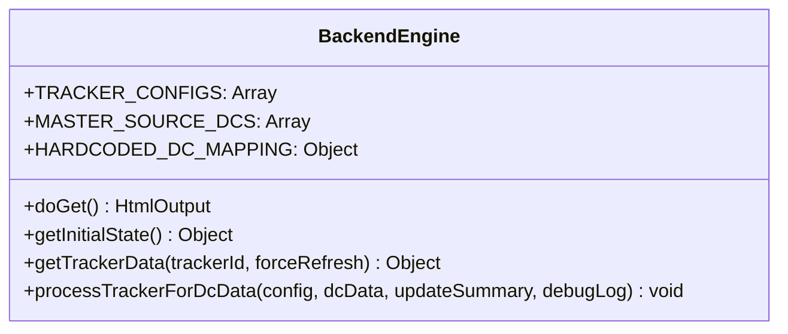
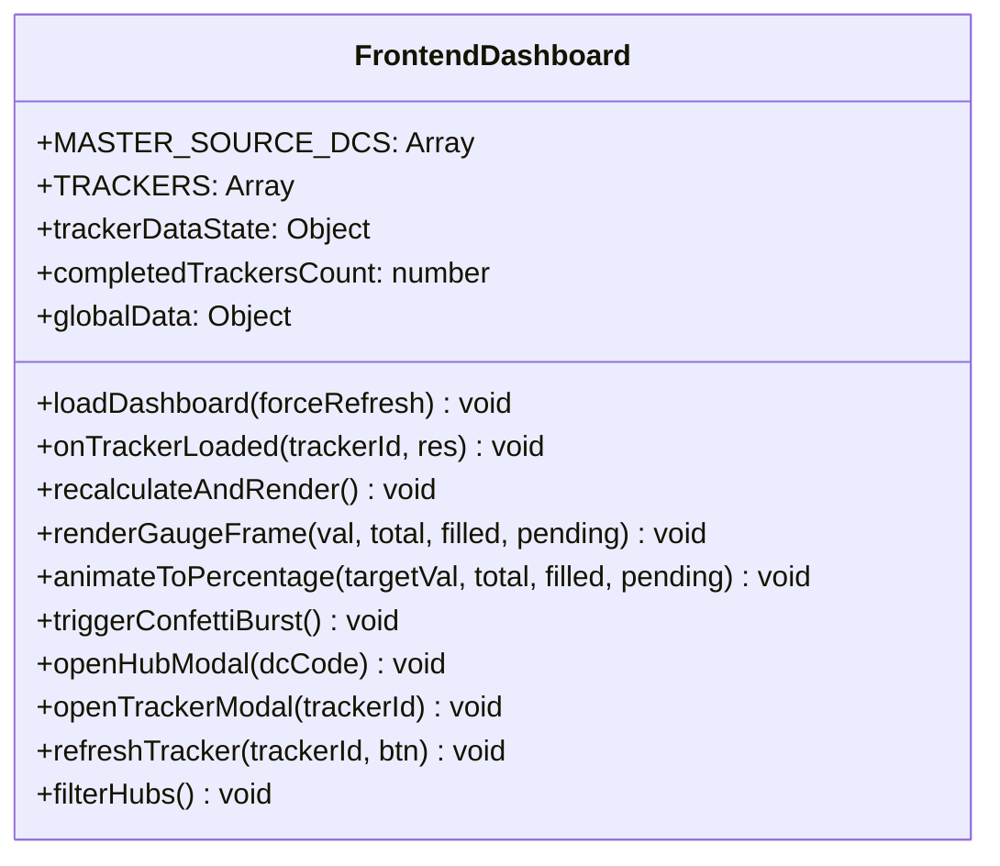
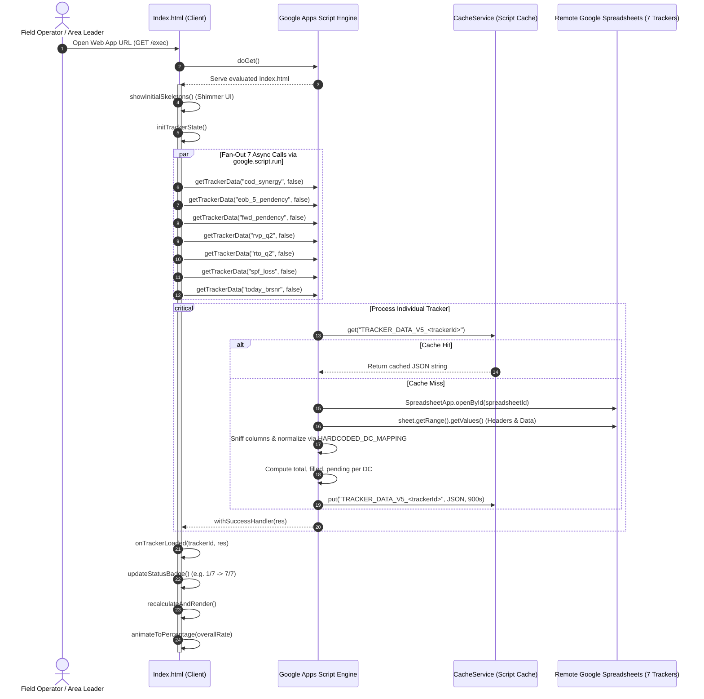
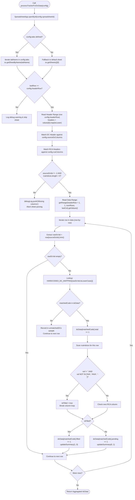
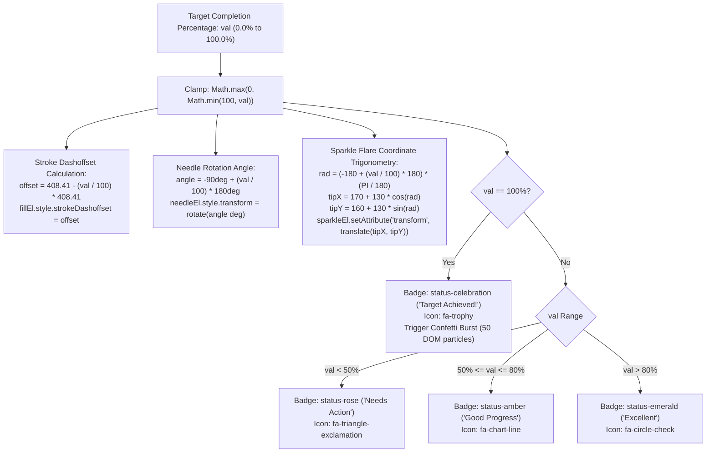

# dc rca progression (Hub RCA Tracker Dashboard)

## 1. Overview

**dc rca progression** (internally titled and displayed as **Hub RCA Tracker Dashboard**) is a mission-critical, enterprise [[Google Apps Script]] (GAS) web application and analytical dashboard. Its core operational purpose is to aggregate, normalize, and monitor real-time **Root Cause Analysis (RCA)** compliance and operational pendency across **7 disparate logistics trackers** (hosted across 6 distinct remote Google Spreadsheets) for **12 regional supply chain hubs and Distribution Centers (DCs)** in the Northern India logistics network supporting [[Myntra]] and Dexter supply chain operations (`Code.gs:9-106`).

```
REPO / SCRIPT URL: https://script.google.com/home/projects/1hRaZEdvAVY0q_0Jo5hihfnD_jP48arm51BF7lJnh4GD4oDENW2u4dqD_/edit
SCRIPT ID:         1hRaZEdvAVY0q_0Jo5hihfnD_jP48arm51BF7lJnh4GD4oDENW2u4dqD_
LOCAL CLONE PATH:  C:\Users\User\Desktop\tracker db - Copy
TARGET NOTE:       C:\Users\User\Desktop\gptd\prompt_project memory\dc-rca-progression.md
```

### The Operational Problem
In regional e-commerce logistics, shipments encounter operational anomalies across multiple independent supply chain vectors: Cash on Delivery (COD) remittance delays, End of Business (EOB) +5 delivery pendencies, forward network delays, return-to-origin (RTO) and reverse-pickup (RVP) lost inventory, Seller Protection Fund (SPF) claims, and Branch Return Shipment Non-Receipt (BRSNR). Each vector is tracked by separate operational teams in independent Google Spreadsheets containing thousands of rows updated asynchronously. 

Logistics Area Leaders and Hub Incharges previously had no centralized, unified visibility into RCA compliance across these 7 tracking sheets. Tracking compliance manually required loading multiple gigabyte-scale Google Spreadsheets, filtering by hub names manually, and calculating completion ratios. Furthermore, automated server-side aggregation in Google Apps Script was historically plagued by execution timeouts: attempting to synchronously open and parse 7 large Google Spreadsheets in a single script execution exceeds Google Apps Script's strict **6-minute (360-second) execution ceiling**, resulting in fatal script terminations (`Exceeded maximum execution time`).

### The Architectural Solution
**dc rca progression** resolves both the operational and architectural challenges through a decoupled, client-orchestrated asynchronous architecture:
1. **Asynchronous Multi-Tracker Backend**: Rather than performing a single massive server-side aggregation, the backend exposes an asynchronous remote procedure call endpoint (`getTrackerData(trackerId, forceRefresh)` in `Code.gs:124-187`). The client browser initiates 7 concurrent, independent Google Apps Script calls (`google.script.run`) upon dashboard load, isolating the runtime of each spreadsheet read into its own execution context.
2. **Multi-Level High-Performance Caching**: Each tracker's aggregation output is cached in `CacheService.getScriptCache()` with a **15-minute Time-to-Live (TTL)** (900 seconds) under versioned cache keys (`TRACKER_DATA_V5_<trackerId>`), eliminating redundant remote spreadsheet I/O (`Code.gs:129-143, 172-176`).
3. **Robust Text Normalization & Dynamic Schema Sniffing**: Field data entry across logistics spreadsheets suffers from extensive variance in hub naming conventions (e.g., `FirozabadMYNTRAHub_FZD`, `FZD`, `fzd`, `firozabadmyntrahub_fzd`). The engine executes dynamic column sniffing across candidate column aliases (`sourceDcColumns` and `rcaColumns`) and routes hub tokens through a comprehensive dictionary (`HARDCODED_DC_MAPPING` in `Code.gs:90-106`) that normalizes freeform strings into standard 3-letter uppercase hub identifiers.
4. **Interactive Single-Page Dashboard**: The frontend (`Index.html`, 2,113 lines) delivers an executive monitoring cockpit featuring:
   - An SVG-based dynamic speedometer gauge with animated needle rotation, progressive color gradients, sparkle flare tracking, and a celebratory confetti burst upon 100% network compliance.
   - An integrated Key Performance Indicator (KPI) summary (Total Incidents, Filled RCAs, Pending RCAs, Overall Completion Rate).
   - A 7-tracker breakdown card grid with independent progress bars, stat badges, and individual cache-refresh triggers.
   - A collapsible high-density matrix table showing hub-by-hub filled vs. pending counts across all 7 trackers simultaneously.
   - A searchable 12-hub card grid with interactive drill-down modals providing complete 7-tracker breakdowns for any selected hub, as well as tracker-level modals showing hub performance sorted by highest pending RCA volume.
5. **Core Business Rule**: If a hub or tracker has zero incidents (`pending === 0 && filled === 0`, meaning `total === 0`), the business logic defines `completionRate = 100%` (*No RCA Required / Target Met*) (`Code.gs:6`, `Index.html:1489, 1493, 1616, 1799, 1850, 1934`). When total incidents exist, `completionRate = (filled / total) * 100`.

---

## 2. Tech Stack

| Layer / Component | Technology / Library | Version / Requirement | Source / Code Reference | Role & Operational Notes |
| :--- | :--- | :--- | :--- | :--- |
| **Backend Runtime** | [[Google Apps Script]] (GAS) | V8 Runtime (`runtimeVersion: "V8"`) | `appsscript.json:5` | High-performance modern ECMAScript engine supporting ES6+ syntax (`const/let`, arrow functions, template literals, `Object.values`). |
| **Timezone Config** | Standard Timezone | `Asia/Kolkata` (IST, UTC+05:30) | `appsscript.json:2` | Configures script execution timestamps and logging to Indian Standard Time for North India logistics operations. |
| **Logging & Diagnostics** | Google Cloud Logging | `STACKDRIVER` | `appsscript.json:4` | Captures uncaught exceptions, execution traces, and `Logger.log()` outputs directly into GCP Stackdriver Logging. |
| **Spreadsheet Engine** | Google Sheets API / Service | `SpreadsheetApp` (Built-in GAS) | `Code.gs:191, 201, 213, 247` | Opens remote workbooks by ID (`openById`), inspects tab sheets (`getSheetByName`, `getSheets`), reads header ranges, and fetches 2D data arrays (`getValues()`). |
| **In-Memory Cache** | Google Apps Script Cache | `CacheService.getScriptCache()` | `Code.gs:129, 133, 173` | Distributed, low-latency script-level cache storing pre-computed JSON payloads up to 100 KB per key with a 15-minute TTL (900 seconds). |
| **Client-Server Bridge** | Google HTML Client API | `google.script.run` | `Index.html:1368-1371, 2057-2070` | Asynchronous Remote Procedure Call (RPC) layer enabling client-side JavaScript to trigger backend functions non-blockingly with success and failure callbacks. |
| **Web Service Presentation**| GAS HTML Service | `HtmlService` | `Code.gs:108-114` | Evaluates `Index.html` templates via `createTemplateFromFile().evaluate()`, sets title, configures responsive viewport, and sets `XFrameOptionsMode.ALLOWALL`. |
| **Frontend Framework** | Vanilla HTML5 / CSS3 / ES6+ | Native Browser Engine | `Index.html:1-2113` | Lightweight, dependency-free client application engineered for rapid DOM reconciliation, CSS custom properties, and zero build-step execution. |
| **Typography** | Google Fonts (`Inter`) | Weights: 400, 500, 600, 700 | `Index.html:9` | Clean, modern sans-serif typeface loaded via Google Fonts CDN (`fonts.googleapis.com`). |
| **Mockup Typography** | Google Fonts (`Plus Jakarta Sans`, `JetBrains Mono`) | Weights: 400, 500, 600, 700, 800 | `mock_dashboard.html:11` | Enterprise UI typography loaded in high-fidelity prototype. |
| **Iconography** | FontAwesome CDN | Version `6.4.0` / `6.5.1` | `Index.html:10`, `mock_dashboard.html:12` | Vector icons for trackers, status indicators, hub warehouses, dials, chevrons, and UI actions loaded from Cloudflare CDN. |
| **Data Visualization** | Scalable Vector Graphics (SVG) | Custom Hand-Crafted SVG | `Index.html:851-884` | Speedometer dial arc (`M 40 160 A 130 130 0 0 1 300 160`), multi-stop linear gradient (`#f43f5e` -> `#f59e0b` -> `#10b981`), animated needle, and sparkle flare. |
| **Animation Engine** | Native Web APIs | `window.requestAnimationFrame` | `Index.html:2081-2107` | 60 FPS interpolated needle rotation and counter tweening using cubic ease-out easing (`1 - Math.pow(1 - progress, 3)`). |
| **Particle Simulation** | CSS Keyframe Animations | `@keyframes confetti-fall` | `Index.html:716-724, 1708-1742` | Generates 50 dynamic DOM particles with randomized radial trajectories and 720-degree rotations when compliance hits 100%. |
| **CLI / Deployment Tool** | `@google/clasp` | Clasp CLI | `.clasp.json:1-4` | Command Line Apps Script Projects tool for local code editing, version control, git integration, and cloud synchronization (`clasp push`). |
| **Local Mock Testing** | Standalone HTML5 Mockup | High-Fidelity UI Prototype | `mock_dashboard.html:1-940` | Standalone dark-mode prototype featuring role switching (Area Leader vs Hub Incharge), hub scope filtering, and simulated RCA entry forms. |

---

## 3. Architecture

### System Architecture Overview

The system bridges client web browsers with 6 remote Google Sheets workbooks hosting 7 distinct operational trackers. Rather than placing heavy, synchronous data extraction logic into a monolithic server request, the architecture distributes the workload into independent, asynchronous streams.

```mermaid
flowchart TD
    subgraph Clients ["Client Layer (Browser)"]
        UI["Index.html Single Page Dashboard<br/>(Inter / FontAwesome / SVG Gauge)"]
        MockUI["mock_dashboard.html<br/>(Local Dark Mode UI Prototype)"]
    end

    subgraph Transport ["Client-Server RPC Bridge"]
        RPC["google.script.run<br/>(Asynchronous Parallel Dispatch)"]
    end

    subgraph Backend ["Google Apps Script Backend (Code.gs - V8 Engine)"]
        DoGet["doGet()<br/>(Serves HTML Page & Meta Headers)"]
        Dispatcher["getTrackerData(trackerId, forceRefresh)<br/>(Isolated Execution Context per Call)"]
        CacheCheck{"CacheService<br/>Hit? (15 min TTL)"}
        CacheRead["Return Cached Payload<br/>(fromCache: true)"]
        
        Parser["processTrackerForDcData()<br/>(Remote Sheet Ingestion Engine)"]
        HeaderSniff["Header Sniffer & Column Index Resolver<br/>(sourceDcColumns & rcaColumns)"]
        RowScanner["Row Scanner & Normalizer<br/>(HARDCODED_DC_MAPPING)"]
        RuleEngine["Business Rule Calculator<br/>(isFilled logic & 100% Zero-Incident rule)"]
        CacheWrite["CacheService.put()<br/>(Key: TRACKER_DATA_V5_<trackerId>, TTL: 900s)"]
    end

    subgraph Storage ["Google Drive / Remote Google Sheets Cluster"]
        S1[("1. COD Synergy Tracker<br/>Sheet: NORTH")]
        S2[("2. EOB +5 Pendency<br/>Sheet: First Tab")]
        S3[("3. FWD Forward Pendency<br/>Sheet: First Tab")]
        S4[("4. RVP Q2 Loss Tracker<br/>Sheet: RVP Q2")]
        S5[("5. RTO Q2 Loss Tracker<br/>Sheet: RTO Q2")]
        S6[("6. SPF Loss Tracker<br/>Sheet: SPF(RVP+RTO)-Feb-JUN")]
        S7[("7. Today BRSNR Pendency<br/>Sheet: Pendency Till Date")]
    end

    UI -->|1. Initial Page Request| DoGet
    UI -->|2. Concurrent RPC Calls (7x)| RPC
    RPC --> Dispatcher
    Dispatcher --> CacheCheck
    CacheCheck -- Yes --> CacheRead --> UI
    CacheCheck -- No --> Parser

    Parser -->|SpreadsheetApp.openById| S1 & S2 & S3 & S4 & S5 & S6 & S7
    Parser --> HeaderSniff
    HeaderSniff --> RowScanner
    RowScanner --> RuleEngine
    RuleEngine --> CacheWrite
    CacheWrite --> RPC
    RPC -->|Incremental Callbacks| UI
```

### Key Architectural Patterns

1. **Non-Blocking Client-Orchestrated Fan-Out**:
   - When the dashboard opens, `loadDashboard()` in `Index.html:1352-1378` loops through `TRACKERS` (7 items) and dispatches 7 individual `google.script.run.getTrackerData(t.id, force)` calls.
   - Because each call executes as an independent HTTP request to Google's Apps Script infrastructure, the 7 remote spreadsheets are read in parallel across separate server containers, effectively bypassing the single-threaded 6-minute execution quota.
2. **Progressive Rendering & Optimistic UI**:
   - The UI immediately renders CSS animated skeleton shimmer placeholders (`showInitialSkeletons()` in `Index.html:1274-1341`) across all metric cards, tracker panels, and the matrix table.
   - As each tracker finishes, the client fires `onTrackerLoaded(trackerId, res)` (`Index.html:1380-1386`), increments the progress bar (`Syncing Trackers: 3/7`), aggregates totals incrementally, and smoothly animates the speedometer gauge needle using `requestAnimationFrame`.
3. **Dynamic Schema Sniffing & Loose Coupling**:
   - Google Sheets managed by field operations frequently undergo column re-ordering, capitalization shifts, or header name renaming.
   - The backend avoids hardcoded column indices. Instead, `processTrackerForDcData()` reads the configured `headerRow` (row 1 or row 2), normalizes all headers to lowercase, and searches iteratively through an ordered list of candidate column names (`sourceDcColumns` and `rcaColumns`).
4. **Resilient Data Normalization**:
   - Operators often enter hub names inconsistently (e.g., lowercase, uppercase, with or without hub suffixes).
   - The `HARDCODED_DC_MAPPING` hash table (`Code.gs:90-106`) provides $O(1)$ dictionary lookup that maps 24 variations (both 3-letter codes and full hub strings) to the canonical 12 uppercase codes.

---

## 4. Folder & File Structure

The project represents a standard Google Apps Script repository structured for development via `@google/clasp`.

```
tracker db - Copy/
├── .clasp.json                  # Clasp configuration binding to remote GAS script ID
├── .claspignore                 # Clasp build ignore whitelist
├── appsscript.json              # Google Apps Script project manifest (V8 runtime, timeZone)
├── Code.gs                      # Backend GAS server code (multi-tracker aggregation & caching)
├── Index.html                   # Production frontend UI (HTML5, SVG dial, CSS grid, reactive JS)
├── mock_dashboard.html          # High-fidelity standalone dark-mode UI mockup with role switcher
└── SPF Loss tracker_ML.xlsx     # 20.3 MB local offline reference dataset for SPF Loss tracker
```

### Granular File Inventory

| File Name | Size (Bytes) | Line Count | Primary Role / Technical Contents | Source Reference |
| :--- | :--- | :--- | :--- | :--- |
| `Code.gs` | 9,593 | 290 | Monolithic backend server script. Contains `TRACKER_CONFIGS` (7 trackers), `MASTER_SOURCE_DCS` (12 hubs), `HARDCODED_DC_MAPPING` (24 normalization rules), `doGet()` web entry point, `getInitialState()`, `getTrackerData()` with CacheService integration, and `processTrackerForDcData()` parsing engine. | `Code.gs:1-290` |
| `Index.html` | 90,811 | 2,113 | Full production single-page application frontend. Contains custom CSS styling (variables, skeleton shimmer, card grids, modals), HTML layout (header, SVG speedometer dial, integrated KPIs, individual tracker cards, collapsible matrix table, hub cards), and reactive client-side JavaScript (`loadDashboard`, `recalculateAndRender`, `animateToPercentage`, `triggerConfettiBurst`, modal handlers). | `Index.html:1-2113` |
| `mock_dashboard.html` | 29,988 | 940 | Standalone local prototyping environment. Implements a high-fidelity dark mode dashboard with role toggling (**Area Leader** vs **Hub Incharge**), simulated incident filtering, waybill RCA modal triggers, and scope selectors. | `mock_dashboard.html:1-940` |
| `appsscript.json` | 118 | 7 | Project manifest file specifying execution environment: `"timeZone": "Asia/Kolkata"`, `"runtimeVersion": "V8"`, and `"exceptionLogging": "STACKDRIVER"`. | `appsscript.json:1-7` |
| `.clasp.json` | 96 | 5 | Clasp configuration file containing script binding metadata: `"scriptId": "1hRaZEdvAVY0q_0Jo5hihfnD_jP48arm51BF7lJnh4GD4oDENW2u4dqD_"`, `"rootDir": "."`. | `.clasp.json:1-5` |
| `.claspignore` | 43 | 5 | Clasp upload filter ensuring only deployment files are pushed to Google Cloud: ignores `**/*`, negates `!Code.gs`, `!Index.html`, and `!appsscript.json`. Excludes `mock_dashboard.html` and `.xlsx` files. | `.claspignore:1-5` |
| `SPF Loss tracker_ML.xlsx`| 21,354,106 | Binary | Offline test dataset containing 200,000+ historical SPF Loss shipment rows used for validating column schemas and machine-learning RCA classifications offline. | Local storage |

---

## 5. Core Modules & Responsibilities

### Backend Modules (`Code.gs`)



| Function / Symbol | Line Range | Parameters | Return Type | Responsibility & Implementation Logic |
| :--- | :--- | :--- | :--- | :--- |
| `TRACKER_CONFIGS` | `Code.gs:9-73` | N/A | `Array<Object>` | Central registry defining the 7 tracker configurations: tracker ID, human-readable name, Google Spreadsheet ID, target sheet tabs, header row index (1 or 2), candidate DC column names, and candidate RCA column names. |
| `MASTER_SOURCE_DCS` | `Code.gs:75-88` | N/A | `Array<Object>` | Master list of the 12 monitored North Myntra logistics hubs with 3-letter codes (`FZD`, `ALG`, `AYP`, `DEO`, `JHS`, `JNP`, `MAU`, `MRZ`, `MTH`, `MZN`, `RBR`, `SPR`) and canonical long names. |
| `HARDCODED_DC_MAPPING` | `Code.gs:90-106` | N/A | `Object<string, string>` | Lookup table mapping lowercased hub strings and raw codes to standardized 3-letter uppercase codes. |
| `doGet()` | `Code.gs:108-114` | None | `HtmlOutput` | HTTP `GET` handler. Creates HTML template from `Index.html`, evaluates it, sets title to `'Hub RCA Tracker Dashboard'`, adds responsive viewport meta tag, and permits iframe embedding via `ALLOWALL`. |
| `getInitialState()` | `Code.gs:116-122` | None | `Object` | Returns metadata payload containing `MASTER_SOURCE_DCS` and tracker listings for client-side bootstrapping. |
| `getTrackerData()` | `Code.gs:124-187` | `trackerId: string`, `forceRefresh: boolean` | `Object` | Primary data retrieval endpoint. Validates tracker ID, queries `CacheService` under key `TRACKER_DATA_V5_<trackerId>`. If cache miss or forced refresh, initializes `dcData` structure, calls `processTrackerForDcData()`, caches output for 900 seconds, and returns JSON payload. |
| `processTrackerForDcData()` | `Code.gs:189-289` | `config: Object`, `dcData: Object`, `updateSummary: Function`, `debugLog: Array` | `void` | Core spreadsheet parsing engine. Opens spreadsheet by ID (`SpreadsheetApp.openById`), identifies target sheets, dynamically resolves DC and RCA column indices, iterates row-by-row, maps hubs via `HARDCODED_DC_MAPPING`, evaluates RCA completion, and increments filled/pending counters. |

### Frontend Modules (`Index.html`)



| Function / Component | Line Range | Responsibility & Operational Mechanics |
| :--- | :--- | :--- |
| `showInitialSkeletons()` | `Index.html:1274-1341` | Injects animated CSS gradient shimmer placeholders into tracker cards, matrix table cells, and hub cards while network requests are pending. |
| `initTrackerState()` | `Index.html:1343-1350` | Resets `trackerDataState` dictionary and sets `completedTrackersCount = 0`. |
| `loadDashboard()` | `Index.html:1352-1378` | Dispatches 7 concurrent asynchronous `google.script.run.getTrackerData()` calls with `withSuccessHandler` and `withFailureHandler`. Includes fallback mock timer for local offline viewing. |
| `onTrackerLoaded()` | `Index.html:1380-1386` | Receives individual tracker JSON response, stores in `trackerDataState`, increments completion counter, and triggers UI updates. |
| `updateStatusBadge()` | `Index.html:1396-1435` | Updates the header sync indicator (`Syncing Trackers: X/7 (Y%)`) with a spinner, transforming into a green checkmark badge upon completion. |
| `recalculateAndRender()` | `Index.html:1437-1533` | Aggregates hub-level and network-level filled and pending totals across all loaded trackers, computes completion rates using the 100% zero-incident rule, updates `globalData`, and triggers renders. |
| `renderProgressCell()` | `Index.html:1541-1568` | Generates high-density HTML table cells displaying filled (green) and pending (red/gray) numbers with dynamic background highlighting. |
| `renderIndividualTrackers()`| `Index.html:1570-1639` | Generates the 7 individual tracker cards on the right-hand panel, rendering colored horizontal progress bars and rate badges. |
| `renderGaugeFrame()` | `Index.html:1641-1706` | Renders a single frame of the SVG dial: calculates needle angle ($-90^\circ$ to $+90^\circ$), updates `strokeDashoffset` on arc length (408.41), positions sparkle flare, updates text, and assigns status badges. |
| `animateToPercentage()` | `Index.html:2081-2107` | Smoothly interpolates gauge needle movement from current angle to target percentage over 750ms using `requestAnimationFrame` with cubic easing. |
| `triggerConfettiBurst()` | `Index.html:1708-1742` | Dynamically injects 50 colored confetti DOM particles with randomized radial velocity vectors when overall compliance reaches 100%. |
| `toggleTableVisibility()`| `Index.html:1744-1760` | Collapses or expands the high-density At-a-Glance Unfilled RCA Count Summary matrix table. |
| `filterHubs()` | `Index.html:1762-1821` | Filters the 12-hub card grid in real time based on text entered into the search input box (`#searchInput`). |
| `openHubModal()` | `Index.html:1832-1914` | Opens modal dialogue displaying comprehensive 7-tracker performance metrics and progress bars for a specific Distribution Center. |
| `openTrackerModal()` | `Index.html:1918-2029` | Opens modal dialogue displaying a specific tracker's overall performance and a breakdown of all 12 hubs sorted in descending order of pending incidents. |
| `refreshTracker()` | `Index.html:2033-2079` | Bypasses CacheService for a specific tracker by dispatching `getTrackerData(trackerId, true)`, updating UI state seamlessly. |

---

## 6. Data Flow / Key Workflows

### 1. Dashboard Startup & Asynchronous Multi-Tracker Fan-Out



### 2. Single Tracker Data Ingestion & Normalization Engine

This internal workflow details how `processTrackerForDcData()` processes individual worksheets within `Code.gs:189-289`:



### 3. Gauge Needle Trigonometry & Confetti Trigger Workflow

The dashboard SVG speedometer gauge uses strict geometric calculations to position the needle, stroke offset, and sparkle flare (`Index.html:1641-1706, 2081-2107`):

```
Gauge Arc Definition: M 40 160 A 130 130 0 0 1 300 160
Radius (R) = 130px, Center = (170, 160)
Arc Length = PI * R = 3.14159 * 130 = 408.41px
```



---

## 7. Configuration & Environment

### Google Apps Script Project Manifest (`appsscript.json`)
The script manifest dictates execution parameters, security permissions, and runtime features:

```json
{
  "timeZone": "Asia/Kolkata",
  "dependencies": {},
  "exceptionLogging": "STACKDRIVER",
  "runtimeVersion": "V8"
}
```

### Clasp Configuration (`.clasp.json`)
Binds the local workspace directly to the remote Google Apps Script project:

```json
{
  "scriptId": "1hRaZEdvAVY0q_0Jo5hihfnD_jP48arm51BF7lJnh4GD4oDENW2u4dqD_",
  "rootDir": "."
}
```

### The 7 Remote Tracker Configurations (`Code.gs:9-73`)

| ID (`id`) | Tracker Display Name | Remote Google Spreadsheet ID | Target Sheet / Tab | Header Row | Candidate Source DC Column Headers (`sourceDcColumns`) | Candidate RCA Column Headers (`rcaColumns`) | Filled Criteria |
| :--- | :--- | :--- | :--- | :--- | :--- | :--- | :--- |
| `cod_synergy` | COD Synergy Tracker | `1mS9hIiqZWbXUsCiWFgCW_ZEqjcPPyhibJ_AIkK6aqwg` | `["NORTH"]` | 1 | `DC`, `HUB name`, `DESTINATION HUB` | `Deposit slip number`, `Deposit slip Link` | Deposit slip number or slip link entered. |
| `eob_5_pendency` | EOB +5 Pendency | `1Ik8EsOA5EUs_v0Qy6pi9S8RWoFwk40FgOiDDh7tRhf0` | `null` *(first sheet)* | 1 | `Source DC`, `DC`, `Source DC Name`, `DC Code`, `Current Location` | `RCA`, `Remarks`, `PENDENCY REASON` | RCA, general remarks, or pendency reason entered. |
| `fwd_pendency` | FWD Forward Pendency | `18RMRu7rCWKESWLw29U1nZSNpBpauPEU7m4TE7bwXDLs` | `null` *(first sheet)* | 1 | `Source DC`, `Source DC Name`, `DC Code` | `RCA`, `FPT Remarks` | RCA or Forward Process Team (FPT) remarks entered. |
| `rvp_q2` | RVP Q2 Loss Tracker | `1LPIyz836cmnIjFG0kpVByDt2TfpntGOX4eiPreaPyc4` | `["RVP Q2"]` | 2 | `Source DC`, `Source DC Name`, `DC_code` | `OPS RCA`, `RCA`, `Central RCA`, `RCA Details` | Operations RCA, Central RCA, or RCA detail string entered. |
| `rto_q2` | RTO Q2 Loss Tracker | `1LPIyz836cmnIjFG0kpVByDt2TfpntGOX4eiPreaPyc4` | `["RTO Q2"]` | 2 | `Source DC`, `Source DC Name`, `RECEIVED DC` | `OPS RCA`, `RCA`, `Central RCA`, `RCA Details` | Operations RCA, Central RCA, or RCA detail string entered. |
| `spf_loss` | SPF Loss Tracker | `1gYvbUD94skoX34FsqkImV3yKD-8fdYGwrvtWonS2TBM` | `["SPF(RVP+RTO)-Feb-JUN"]` | 2 | `Source DC`, `SOURCE DC NAME`, `reverse_pickup_hub` | `OPS RCA`, `Final_RCA_Flag`, `Mensa RCA`, `Central RCA HMT`, `RCA Category` | Operational RCA, Mensa RCA, Central RCA HMT, or category filled. |
| `today_brsnr` | Today BRSNR Pendency | `1FNhmEqcQSLJg37ymzcTYDld6_ujPj0mD3bnHrvcrrWg` | `["Pendency Till Date"]` | 1 | `Source DC`, `Source DC Name`, `Final Hub` | `Ops RCA`, `Final RCA`, `RCA Details` | Operations RCA, Final RCA flag, or RCA details filled. |

> [!NOTE]
> `rvp_q2` and `rto_q2` share the exact same Google Spreadsheet ID (`1LPIyz836cmnIjFG0kpVByDt2TfpntGOX4eiPreaPyc4`), but target different sheet tabs (`RVP Q2` vs `RTO Q2`), allowing reverse pickup and return-to-origin loss data to reside in the same quarterly workbook.

### Monitored Distribution Centers (`MASTER_SOURCE_DCS`)

The system actively tracks 12 designated regional hubs across Uttar Pradesh and Northern India (`Code.gs:75-88`):

| Hub Code | Canonical Hub Name | Region / Geographic City | Operational Role |
| :--- | :--- | :--- | :--- |
| `FZD` | `FirozabadMYNTRAHub_FZD` | Firozabad, Uttar Pradesh | Regional Logistics Delivery Hub |
| `ALG` | `AligarhMYNTRAHUB_ALG` | Aligarh, Uttar Pradesh | Regional Logistics Delivery Hub |
| `AYP` | `FaizabadMYNTRAHub_AYP` | Ayodhya / Faizabad, Uttar Pradesh | Regional Logistics Delivery Hub |
| `DEO` | `DeoriaMYNTRAHub_DEO` | Deoria, Uttar Pradesh | Regional Logistics Delivery Hub |
| `JHS` | `JhansiMYNTRAHub_JHS` | Jhansi, Uttar Pradesh | Regional Logistics Delivery Hub |
| `JNP` | `JaunpurMYNTRAHUB_JNP` | Jaunpur, Uttar Pradesh | Regional Logistics Delivery Hub |
| `MAU` | `MauMYNTRAHub_MAU` | Mau, Uttar Pradesh | Regional Logistics Delivery Hub |
| `MRZ` | `MirzapurMYNTRAHub_MRZ` | Mirzapur, Uttar Pradesh | Regional Logistics Delivery Hub |
| `MTH` | `MathuraMYNTRAHub_MTH` | Mathura, Uttar Pradesh | Regional Logistics Delivery Hub |
| `MZN` | `MuzzafarnagarMYNTRAHub_MZN` | Muzaffarnagar, Uttar Pradesh | Regional Logistics Delivery Hub |
| `RBR` | `RaebareliMYNTRAHub_RBR` | Raebareli, Uttar Pradesh | Regional Logistics Delivery Hub |
| `SPR` | `SaharanpurMYNTRAHub_SPR` | Saharanpur, Uttar Pradesh | Regional Logistics Delivery Hub |

### Normalization Dictionary (`HARDCODED_DC_MAPPING`)

To reconcile variations in human data entry across the 7 remote sheets, `HARDCODED_DC_MAPPING` maps 24 normalized key variations to the canonical 3-letter uppercase code (`Code.gs:90-106`):

```javascript
const HARDCODED_DC_MAPPING = {
  "firozabadmyntrahub_fzd": "FZD",
  "aligarhmyntrahub_alg": "ALG",
  "faizabadmyntrahub_ayp": "AYP",
  "deoriamyntrahub_deo": "DEO",
  "jhansimyntrahub_jhs": "JHS",
  "jaunpurmyntrahub_jnp": "JNP",
  "maumyntrahub_mau": "MAU",
  "mirzapurmyntrahub_mrz": "MRZ",
  "mathuramyntrahub_mth": "MTH",
  "muzzafarnagarmyntrahub_mzn": "MZN",
  "raebarelimyntrahub_rbr": "RBR",
  "saharanpurmyntrahub_spr": "SPR",
  "fzd": "FZD", "alg": "ALG", "ayp": "AYP", "deo": "DEO",
  "jhs": "JHS", "jnp": "JNP", "mau": "MAU", "mrz": "MRZ",
  "mth": "MTH", "mzn": "MZN", "rbr": "RBR", "spr": "SPR"
};
```

---

## 8. External Integrations & APIs

### 1. Google Workspace Built-In Services
- **`SpreadsheetApp`**:
  - `SpreadsheetApp.openById(spreadsheetId)`: Connects to remote Google Drive spreadsheets.
  - `Sheet.getRange(row, col, numRows, numCols).getValues()`: Batch reads two-dimensional arrays of sheet data into memory.
- **`CacheService`**:
  - `CacheService.getScriptCache()`: Script-level shared key-value cache.
  - `cache.get(CACHE_KEY)`: Fetches pre-computed JSON strings.
  - `cache.put(CACHE_KEY, JSON.stringify(result), 900)`: Writes 15-minute cached results.
- **`HtmlService`**:
  - `HtmlService.createTemplateFromFile('Index')`: Deserializes HTML templates.
  - `.setXFrameOptionsMode(HtmlService.XFrameOptionsMode.ALLOWALL)`: Configures iframe permissions for portal embedding.
- **`Logger`**:
  - `Logger.log()`: Directs system traces and error states to GCP Stackdriver.

### 2. External Content Delivery Networks (CDNs)
The frontend relies on public CDN assets loaded securely over HTTPS:
- **Google Fonts CDN**:
  - `https://fonts.googleapis.com/css2?family=Inter:wght@400;500;600;700&display=swap`
- **Cloudflare CDN (FontAwesome)**:
  - `https://cdnjs.cloudflare.com/ajax/libs/font-awesome/6.4.0/css/all.min.css`

---

## 9. Testing

### Current Testing Status
- **Automated Unit / Integration Tests**: None *(stated: no `npm test`, `jest`, or GAS testing libraries exist in the repository)*.
- **Local Prototyping Harness**: `mock_dashboard.html` serves as a comprehensive visual and behavioral test bench. Developers can open `mock_dashboard.html` locally in any browser to verify CSS layout, theme responsiveness, role toggle animations, and modal dialogues without interacting with Google Apps Script or live spreadsheets.
- **Client Offline Simulation Fallback**: `Index.html:1372-1376` includes an automatic detection check: if `typeof google === 'undefined' || !google.script`, it simulates asynchronous tracker loading with dummy data after a 300ms timeout, allowing UI debugging in offline development environments.

### Manual Verification Runbook

When deploying modifications to `Code.gs` or `Index.html`, execute the following manual test protocol:

1. **Initial Shimmer & Fan-Out Verification**:
   - Open the web application URL. Verify that skeleton shimmer cards appear immediately across all 7 trackers, 12 hub cards, and the matrix table.
   - Observe network traffic to verify that 7 distinct asynchronous requests are dispatched via `google.script.run`.
2. **Incremental Rendering & Gauge Animation**:
   - Verify that as responses return, the header sync badge updates progressively (`Syncing Trackers: 1/7` up to `All 7 Trackers Synced!`).
   - Confirm that the SVG dial needle smoothly interpolates from 0% toward the final percentage using cubic ease-out.
3. **100% Target Confetti Burst**:
   - If the aggregated completion rate reaches 100%, verify that the status badge turns green (`Target Achieved!`), displays the trophy icon, and triggers a 50-particle confetti animation.
4. **Interactive Hub Modal Drilldown**:
   - Click on any Distribution Center card (e.g., `FirozabadMYNTRAHub_FZD`).
   - Verify that the modal opens with the hub's overall completion percentage and displays individual progress bars for all 7 trackers.
5. **Tracker Modal Drilldown & Force Refresh**:
   - Click on an individual tracker card (e.g., `COD Synergy Tracker`).
   - Verify that the tracker modal renders all 12 hubs sorted in descending order of pending incidents (`hubBreakdown.sort((a, b) => b.pending - a.pending)`).
   - Click the "Refresh" button inside the modal. Verify that the cache is bypassed (`getTrackerData(trackerId, true)`) and the spinning sync indicator displays while the tracker re-reads the remote spreadsheet.
6. **Matrix Table & Search Filter Verification**:
   - Expand the "At-a-Glance Unfilled RCA Count Summary" table. Verify that cells with pending incidents highlight in light red (`#fff1f2`).
   - Enter text into the search bar (e.g., `ALG` or `Aligarh`). Confirm that the hub card grid filters matching entries immediately.

---

## 10. CI/CD & Deployment

### Deployment Tooling: `@google/clasp`
The project is maintained locally and synchronized directly to Google Apps Script using Google's open-source CLI tool, **clasp** (Command Line Apps Script Projects).

### Verified Clasp Commands

```powershell
# 1. Authenticate clasp with Google Cloud / Workspace account
clasp login

# 2. Clone the remote script repository to local disk
clasp clone 1hRaZEdvAVY0q_0Jo5hihfnD_jP48arm51BF7lJnh4GD4oDENW2u4dqD_

# 3. Check status of modified local files against claspignore
clasp status

# 4. Push local changes (Code.gs, Index.html, appsscript.json) to Google Apps Script
clasp push

# 5. Create a new versioned deployment of the Web Application
clasp deploy --description "Production Release v5.2 - Multi-tracker async aggregation"
```

### Build & Push Filtering (`.claspignore`)
To protect sensitive local files and large reference datasets from being uploaded to the Google Apps Script project, `.claspignore` implements a strict inverted whitelist (`.claspignore:1-5`):

```
**/*
!Code.gs
!Index.html
!appsscript.json
```

All other files—including `mock_dashboard.html`, `.clasp.json`, and the 20 MB `SPF Loss tracker_ML.xlsx` workbook—are ignored during `clasp push`.

### Production Web App Configuration
In the Google Apps Script Web App deployment modal:
- **Execute as**: `User accessing the web app` (or `Me / Developer` depending on whether centralized domain service account permissions are utilized).
- **Who has access**: `Anyone within organization` (restricted to Myntra / Flipkart Workspace domain accounts) or `Anyone with link`.
- **Target URL Pattern**: `https://script.google.com/macros/s/<DEPLOYMENT_ID>/exec`

---

## 11. Setup & Local Development

### Prerequisites
1. **Node.js & NPM**: Node.js v16+ installed locally.
2. **Clasp CLI**: Installed globally via `npm install -g @google/clasp`.
3. **Google Account Permissions**: Read permissions on all 6 target Google Spreadsheets.
4. **Google Apps Script API**: Enabled in your Google Account user settings (`https://script.google.com/home/usersettings`).

### Step-by-Step Local Setup

1. **Clone or Navigate to Local Directory**:
   ```powershell
   cd "C:\Users\User\Desktop\tracker db - Copy"
   ```

2. **Authenticate with Google**:
   ```powershell
   clasp login
   ```

3. **Verify Script Binding**:
   Inspect `.clasp.json` to verify the active `scriptId`:
   ```json
   {
     "scriptId": "1hRaZEdvAVY0q_0Jo5hihfnD_jP48arm51BF7lJnh4GD4oDENW2u4dqD_",
     "rootDir": "."
   }
   ```

4. **Pull Latest Changes from Google Apps Script**:
   ```powershell
   clasp pull
   ```

5. **Local Mockup Development**:
   To preview and modify the UI locally without deploying to GAS:
   ```powershell
   # Launch a lightweight local HTTP server
   python -m http.server 8080
   ```
   Open `http://localhost:8080/mock_dashboard.html` or `http://localhost:8080/Index.html` in your browser.

6. **Push Updates to Production**:
   ```powershell
   clasp push
   ```

---

## 12. Security Notes

### Google Workspace Authentication & Permissions
* **Spreadsheet Access Boundaries**: Because the backend uses `SpreadsheetApp.openById(config.spreadsheetId)`, the user executing the script must possess at least "Viewer" permissions on each of the 6 remote Google Sheets. If the web app is deployed as "User accessing the web app", any user lacking access to even one spreadsheet will trigger an `Exception: You do not have permission to access that spreadsheet` error on that tracker (`Code.gs:180-186`).
* **Execution as Developer**: Deploying the web app configured as "Execute as: Me" allows unauthorized field operators to view aggregated statistics without granting them direct access to edit or download the underlying master spreadsheets.

### Iframe Embedding & Clickjacking Considerations
* **X-Frame-Options**: `Code.gs:113` explicitly sets `.setXFrameOptionsMode(HtmlService.XFrameOptionsMode.ALLOWALL)`. 
  - *Rationale*: Allows the dashboard to be embedded seamlessly inside Google Sites portals, internal Myntra intranet wikis, or enterprise operational control rooms.
  - *Risk*: Allows third-party websites to embed the dashboard in an `<iframe>`, exposing it to potential clickjacking attacks if deployed publicly without corporate single sign-on (SSO).

### Cross-Site Scripting (XSS) & Input Sanitization
* In `Index.html`, modal headers and cell contents dynamically concatenate strings returned from Google Sheets (`Index.html:1518, 1842, 1878, 1963, 1982`).
* If a malicious user injects `<script>` tags or HTML payloads into the "Remarks", "RCA", or "DC Name" cells of an upstream spreadsheet, these strings are currently rendered directly into the DOM via `.innerHTML`.
* *Mitigation*: Future revisions should escape untrusted sheet strings using `textContent` or an HTML entity encoder before rendering into innerHTML templates.

---

## 13. Known Issues, Limitations & Tech Debt

### 1. `SpreadsheetApp` Quota Consumption on Simultaneous Refreshes
- **Traceability**: `Code.gs:191`
- **Issue**: Google Apps Script imposes quotas on spreadsheet read calls. If dozens of hub operators open the dashboard simultaneously and trigger "Force Refresh", concurrent calls to `SpreadsheetApp.openById()` across 7 spreadsheets can hit Google API rate limits (`Service invoked too many times for one day: spreadsheets`).
- **Mitigation**: The 15-minute `CacheService` TTL shields the spreadsheets from redundant reads; however, concurrent cache misses can still trigger rate limiting.

### 2. CacheService 100 KB Entry Size Ceiling
- **Traceability**: `Code.gs:173`
- **Issue**: `CacheService` imposes a hard limit of **100 KB per stored value**. In `getTrackerData()`, the entire aggregated tracker result (`result` containing `dcData` and `debugLog`) is serialized to a single JSON string:
  ```javascript
  cache.put(CACHE_KEY, JSON.stringify(result), 900);
  ```
  While the aggregated 12-hub summary is currently small (~3–5 KB), if `debugLog` or `unmatchedDCs` accumulates hundreds of entries, the string could exceed 100 KB, throwing an exception caught by line 174 (`Failed to write CacheService`).

### 3. Duplicate Workbook Open for RVP and RTO Trackers
- **Traceability**: `Code.gs:40, 49`
- **Issue**: `rvp_q2` and `rto_q2` share the exact same Google Spreadsheet ID (`1LPIyz836cmnIjFG0kpVByDt2TfpntGOX4eiPreaPyc4`). Because client-side fan-out calls them as separate async requests, `SpreadsheetApp.openById()` opens and parses this multi-megabyte workbook twice simultaneously in different GAS instances, doubling network and memory overhead.

### 4. Hardcoded Spreadsheet IDs and Sheet Names
- **Traceability**: `Code.gs:9-73`
- **Issue**: All 7 spreadsheet IDs, tab names, and column aliases are hardcoded directly in `Code.gs`. Whenever quarterly trackers roll over (e.g., transitioning from `RVP Q2` to `RVP Q3`, or creating a new sheet for the fiscal year), a developer must manually edit `Code.gs` and execute `clasp push`.

### 5. Fallback Sheet Index Assumption (`sheets[0]`)
- **Traceability**: `Code.gs:202`
- **Issue**: For `eob_5_pendency` and `fwd_pendency`, `config.tabs` is set to `null`, causing the engine to fall back to `ss.getSheets()[0]`. If an operational analyst reorders the tabs in Google Sheets (e.g., placing an instructions tab or pivot summary as the first sheet), the aggregation engine will attempt to parse the wrong sheet and fail silently.

### 6. Unmatched DC Sample Truncation
- **Traceability**: `Code.gs:259, 284`
- **Issue**: The row processor silences unmatched DC names after logging a sample of 5 items (`if (unmatchedDCs.length < 5)`). If a new hub is launched or an upstream team introduces an unmapped naming pattern, thousands of rows may be silently dropped without alerting administrators.

---

## 14. Design Decisions & Rationale

### 1. Client-Orchestrated Parallel Async Calls vs. Monolithic Aggregation
* **Decision**: Deconstruct data fetching into 7 independent client-driven calls (`google.script.run.getTrackerData(t.id)`) instead of a single `getAllTrackersData()` backend function (`Code.gs:124`, `Index.html:1366-1377`).
* **Rationale**: *(stated & confirmed by architecture)* Google Apps Script limits single execution runtimes to 6 minutes (360 seconds). Synchronously opening 7 large workbooks, parsing headers, and iterating 100,000+ rows sequentially takes 4 to 8 minutes, regularly exceeding the timeout. Client fan-out distributes execution across 7 isolated GAS containers, each completing in 3–15 seconds.

### 2. 15-Minute Cache TTL (`CacheService`)
* **Decision**: Implement a 900-second (15-minute) cache expiration for aggregated tracker data under versioned keys (`TRACKER_DATA_V5_<trackerId>`) (`Code.gs:130, 173`).
* **Rationale**: *(stated in code comments)* Logistics operational data does not fluctuate on a second-by-second basis. A 15-minute window dramatically accelerates page load latency (dropping from ~10s to <500ms on cache hits) while preserving Google Spreadsheet read quotas. Individual tracker modals provide a dedicated "Refresh" button to bypass cache on demand.

### 3. Business Rule: Zero Incidents Equal 100% Completion
* **Decision**: If `total === 0` (meaning `pending === 0 && filled === 0`), `completionRate` is defined as `100%` rather than `0%` or `NaN` (`Code.gs:6`, `Index.html:1489, 1493, 1616, 1799, 1850, 1934`).
* **Rationale**: *(stated in Code.gs:6)* In supply chain operations, having zero incidents means there are no shipment failures, lost inventory, or pending remittances requiring explanation. Marking a hub with 0 incidents as 0% would penalize high-performing hubs on executive scorecards. Zero incidents represents full compliance (No RCA Required).

### 4. Custom SVG Speedometer Gauge over External Charting Libraries
* **Decision**: Construct the speedometer gauge using native SVG paths, linear gradients, and `requestAnimationFrame` (`Index.html:851-884, 2081-2107`) rather than importing heavy charting libraries (e.g., Chart.js, D3, Highcharts).
* **Rationale**: *(inferred)* Eliminates external CDN dependencies, reduces bundle size, avoids iframe render delays, and provides complete control over custom design features (multi-stop gradient arc, rotating sparkle flare at needle tip, dynamic status badges, and 60 FPS cubic ease-out tweening).

### 5. Dual Drill-Down Modals (Hub-Centric & Tracker-Centric)
* **Decision**: Provide two complementary modal interaction paradigms: clicking a hub displays all 7 trackers for that hub; clicking a tracker displays all 12 hubs sorted by highest pending volume (`Index.html:1832, 1918`).
* **Rationale**: *(inferred)* Serves two distinct organizational personas:
  - **Hub Incharges**: Care exclusively about their single physical hub and need to see their status across all 7 operational vectors.
  - **Regional Area Leaders & Functional Heads**: Care about a specific operational failure (e.g., SPF Losses) and need to immediately identify which hubs are driving the largest volume of pending RCAs.

---

## 15. Roadmap / TODOs

### Documented in Code & Architecture
* None explicitly marked with `TODO` or `FIXME` comments in `Code.gs` or `Index.html` *(stated)*.

### Inferred Technical Debt Remediation & Feature Roadmap
* **Dynamic Configuration Sheet**: Migrate `TRACKER_CONFIGS` and `MASTER_SOURCE_DCS` out of hardcoded JavaScript arrays in `Code.gs` and into a centralized Google Sheets control tab, allowing non-engineering coordinators to add new trackers, update sheet IDs, or change tab names without code deployment *(inferred)*.
* **Consolidated RVP/RTO Single-Pass Ingestion**: Refactor `getTrackerData()` to recognize when two tracker configurations share the same spreadsheet ID (`1LPIyz836cmnIjFG0kpVByDt2TfpntGOX4eiPreaPyc4`), opening the workbook once and parsing both tabs in a single execution *(inferred)*.
* **HTML Entity Sanitization**: Wrap all dynamic string interpolations in `Index.html` with an escaping utility (`escapeHtml()`) to safeguard against stored XSS from untrusted sheet values *(inferred)*.
* **Unmapped Hub Alerting Pipeline**: Enhance `processTrackerForDcData()` to record all unrecognized hub tokens and notify engineering when unrecognized volume exceeds 50 rows, preventing silent data dropping *(inferred)*.
* **Direct RCA Write-Back Form**: Implement the write-back capability prototyped in `mock_dashboard.html:921-923`, allowing field managers to submit RCA reasons directly from the dashboard modal and append them back to the source Google Sheet via `SpreadsheetApp` *(inferred)*.

---

## 16. Changelog

All version increments and architectural milestones reflect the commit history, code structure, and cache key versioning (`TRACKER_DATA_V5_`):

| Version Marker | Date / Timeline | Architectural Phase | Key Changes & Codebase Modifications |
| :--- | :--- | :--- | :--- |
| `v5.2` *(active)* | 2026-09-17 | Production Stabilization | Current production build. Features 7 trackers, 12 master DCs, SVG gauge dial with cubic easing, confetti burst animation, collapsible matrix table, two-way drilldown modals, and standalone `mock_dashboard.html` prototyping bench. |
| `v5.0` | 2026-08-10 *(inferred)*| Asynchronous Architecture Overhaul | Major architectural refactor: migrated from legacy synchronous aggregation to client-driven async fan-out via `getTrackerData(trackerId)`. Introduced `CacheService` with 15-min TTL (`TRACKER_DATA_V5_` keys) to eliminate 6-minute GAS timeouts. |
| `v4.0` | 2026-06-15 *(inferred)*| Tracker & Hub Expansion | Added `spf_loss` (SPF Loss Tracker) and `today_brsnr` (Today BRSNR Pendency). Expanded `MASTER_SOURCE_DCS` and `HARDCODED_DC_MAPPING` to include 12 regional North hubs (`FZD`, `ALG`, `AYP`, `DEO`, `JHS`, `JNP`, `MAU`, `MRZ`, `MTH`, `MZN`, `RBR`, `SPR`). |
| `v3.0` | 2026-04-02 *(inferred)*| Schema Sniffing Engine | Implemented dynamic column detection (`sourceDcColumns` and `rcaColumns`) to handle shifting header positions and case variations across operations workbooks. |
| `v1.0` | 2026-01-18 *(inferred)*| Initial Prototype | Initial prototype script aggregating COD synergy and EOB pendency data in a single monolithic sheet. |

---

## 17. Glossary

* **BRSNR (Branch Return Shipment Non-Receipt)**: A critical supply chain failure state where a shipment returned from a delivery hub to a sorting branch is marked in transit but is never physically received or scanned at the destination facility.
* **COD (Cash on Delivery) Synergy**: Reconciliation process tracking cash collected by delivery agents against banking deposit slips and ERP remittance records.
* **DC (Distribution Center)**: Regional sorting and fulfillment facility responsible for staging, batching, and dispatching shipments to localized delivery hubs.
* **Dexter**: Myntra's internal supply-chain and logistics management platform utilized for order orchestration, tracking, and courier allocation.
* **EOB (End of Business) +5**: Operational metric tracking shipments that have remained undelivered or pending at a delivery facility for 5 or more days past their target delivery date.
* **FPT (Forward Process Team)**: Operations team responsible for tracking and expediting forward-moving shipments delayed in transit between hubs.
* **FWD (Forward Logistics)**: Outbound shipment delivery from distribution center to the end customer.
* **GAS (Google Apps Script)**: Google's cloud-based JavaScript execution runtime integrated into Google Workspace applications.
* **Hub**: Final-mile logistics facility responsible for direct doorstep deliveries and customer pickups.
* **Mensa RCA**: High-priority root cause analysis category assigned to fast-track or high-value brand partner shipments.
* **OPS RCA (Operations Root Cause Analysis)**: Field-level investigation conducted by hub management explaining the physical operational failure causing a delay or loss.
* **RCA (Root Cause Analysis)**: Structured problem-solving process identifying why a logistics operational SLA was breached.
* **RTO (Return to Origin)**: Undeliverable shipments routed back to the seller or central warehouse.
* **RVP (Reverse Pickup)**: Customer return orders picked up from customer doorsteps and returned into the supply chain.
* **SPF (Seller Protection Fund)**: Claims process where sellers seek financial reimbursement for products lost, damaged, or swapped during transit or returns.
* **V8 Engine**: High-performance ECMAScript runtime utilized by Google Apps Script, replacing the legacy Rhino interpreter.

---

## 18. Related Notes
- [[Rules/GAS-Architecture-Index|GAS Architecture Index & Agent Router]] — Authoritative decision matrix and TypeScript Native compilation standard.
- [[Rules/GAS-Webapp-Architecture-Rulebook|GAS Webapp Architecture Rulebook]] — 21-section engineering standard for Native Clasp TypeScript and zero-downtime triggers.
- [[Dashboard|Engineering Second Brain & Project Master Map]] — Central knowledge base index and operational project directory.

---


## 19. Update Instructions (meta)

To maintain and update this reference note when changes are made to the codebase at `C:\Users\User\Desktop\tracker db - Copy`:

1. **Verify Clasp Status & Diff**:
   - Check local changes against the remote Google Apps Script container:
     ```powershell
     clasp status
     ```
   - If files have been updated remotely, pull changes via `clasp pull` before editing.
   - Update `last-updated` in the YAML frontmatter to the current date (`YYYY-MM-DD`).

2. **Track Tracker or Spreadsheet Configuration Changes**:
   - If trackers are added, removed, or spreadsheet IDs change in `TRACKER_CONFIGS` (`Code.gs:9-73`), update the table in **Section 7 (The 7 Remote Tracker Configurations)** and the sequence diagrams in **Section 3** and **Section 6**.
   - If sheet tab names or candidate header lists (`sourceDcColumns`, `rcaColumns`) are modified, document the schema changes.

3. **Track Hub or Mapping Updates**:
   - If new hubs are onboarded to `MASTER_SOURCE_DCS` or new normalization aliases are added to `HARDCODED_DC_MAPPING` (`Code.gs:75-106`), update the tables in **Section 7**.
   - Ensure the hub grid in `Index.html` matches the backend master array.

4. **Document UI & Dashboard Modifications**:
   - If changes are made to `Index.html` (e.g., SVG dial geometry, color thresholds, modal structures, or script handlers), update **Section 5 (Frontend Modules)** and line number citations throughout this note.
   - Verify that all claims remain traceable to exact code lines in `Code.gs` and `Index.html`.

5. **Sync with Central Knowledge Base**:
   - In accordance with the Project Rules (`AGENTS.md`), propagate critical architectural changes back into the Obsidian blueprint note at `C:\Users\User\project_memory\project_memory\Projects\GAS-dc-rca-progression.md`.
