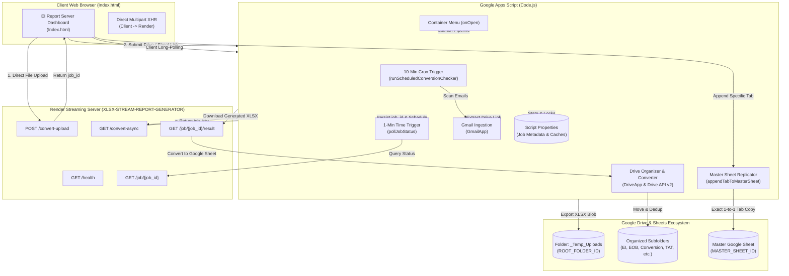
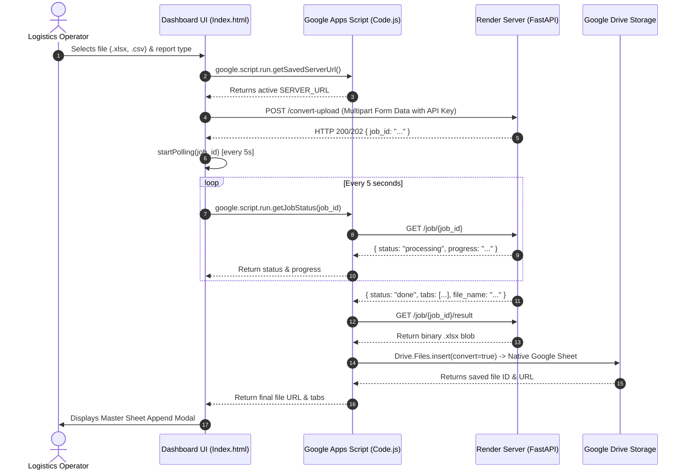
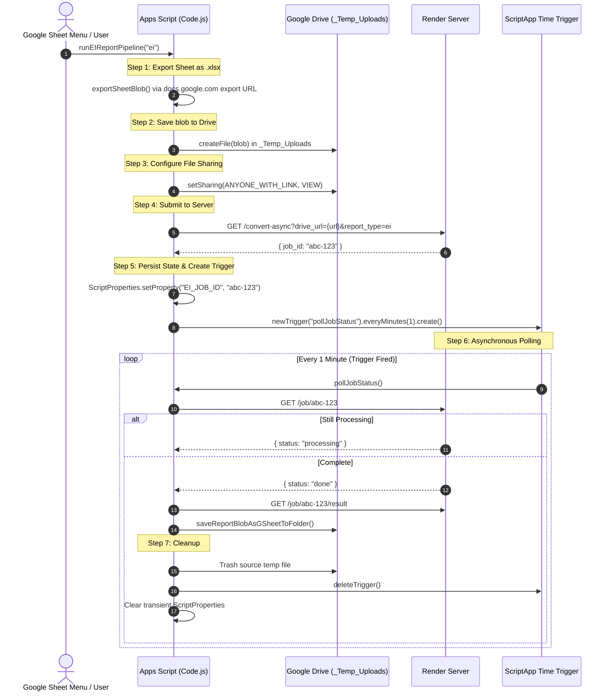
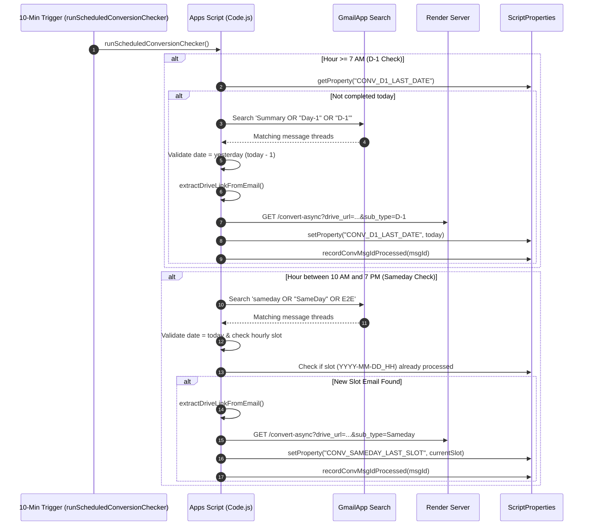
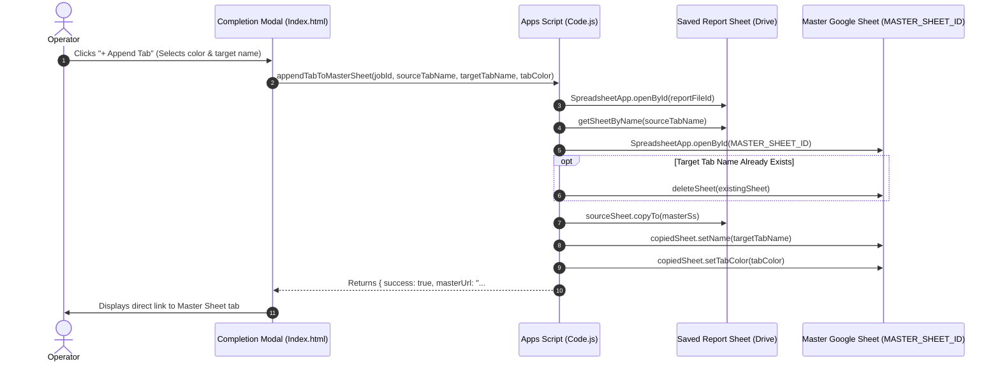

## 1. Overview
The **EI Report Trigger & Pipeline Orchestrator** (deployed Web App title: **EI Report Server Dashboard**, script identifier: `1iW0yF_C0bgen2unvNG4Z5u0-g0U2Re6Y-N3U3c4yGVto5zUHE4lbo-L5`) is an enterprise [[Google Apps Script]] (GAS) cloud orchestration gateway and interactive operations dashboard. It connects Google Workspace logistics workflows with the external high-throughput streaming engine [[XLSX-STREAM-REPORT-GENERATOR]] deployed on [[Render]]. The project resolves Google Apps Script's strict 6-minute execution timeout and 50 MB heap ceiling when processing multi-megabyte logistics datasets across nationwide distribution centers. It achieves this by offloading heavy data transformation to an external asynchronous Python microservice while coordinating ingestion, scheduled Gmail harvesting, background trigger polling, Google Drive folder organization, and direct tab replication into a centralized Master Google Sheet.

The orchestrator supports 10 specialized supply chain reporting pipelines:
- **EI Summary Report (`ei`)**: Early parcel ingestion tracking and nationwide intake analytics.
- **EOB Priority & Status Report (`eob`)**: End-of-Business priority queue reconciliation and carrier dispatch status.
- **Forward Pendency Report (`forward_pendency`)**: Outbound fulfillment hub backlogs and staging pendency.
- **Reverse Pendency Report (`reverse_pendency`)**: Inbound customer return buffers and RTO status tracking.
- **Conversion Summary Report (`conversion`)**: Intraday hourly (`Sameday`) and previous day (`D-1`) conversion performance metrics.
- **NPS Report (`nps`)**: Customer Net Promoter Score feedback synthesis.
- **SCM TAT Report (`tat`)**: Distribution center to customer handover turnaround SLA metrics.
- **VMS Adherence Report (`vms_adherence`)**: Vendor Management System vendor compliance auditing.
- **2nd Attempt Adherence Report (`2nd_attempt_adherence`)**: Secondary delivery re-attempt operational adherence.
- **Untraceable Report (`untraceable`)**: Missing shipment reconciliation and audit tracking.

---

## 2. Tech Stack

| Layer | Technology | Version | Notes |
| :--- | :--- | :--- | :--- |
| **Runtime** | [[Google Apps Script]] V8 Runtime | V8 *(stated in `appsscript.json:5`)* | Modern ECMAScript syntax (arrow functions, template literals, `let`/`const`) enabled. |
| **Language** | JavaScript / HTML5 / CSS3 | ES6+ / HTML5 | Client-side UI and server-side Apps Script logic. |
| **Frontend Framework** | Vanilla JS / CSS3 (No framework) | Native | Pure DOM manipulation, zero external script dependencies; loads Google Fonts (`Inter` & `JetBrains Mono`) *(stated in `Index.html:10`)*. |
| **Platform Tooling** | Google Clasp (`@google/clasp`) | Standard Clasp config *(stated in `.clasp.json:1-16`)* | Cloned directly via Script ID `1iW0yF_C0bgen2unvNG4Z5u0-g0U2Re6Y-N3U3c4yGVto5zUHE4lbo-L5`. |
| **External Microservice** | [[XLSX-STREAM-REPORT-GENERATOR]] | FastAPI / Python 3.11+ / Polars / Calamine *(inferred from server endpoints)* | Deployed on Render at `https://xlsx-stream-report-generator.onrender.com` *(stated in `Code.js:17`)*. |
| **Cloud Storage** | Google Drive API | v2 (REST & Advanced Service) | Drive folder organization, file permissions, binary blob conversions *(stated in `Code.js:203, 208`)*. |
| **Spreadsheet Engine** | Google Sheets API / SpreadsheetApp | Native GAS Service | Master Sheet tab replication, binary export, formula and formatting preservation. |
| **Email Ingress** | Google GmailApp Service | Native GAS Service | Automated harvesting of daily conversion email attachments and Google Drive links *(stated in `Code.js:1568`)*. |
| **Persistence & State** | `PropertiesService.getScriptProperties()` | Native GAS Service | Key-value store for asynchronous job tracking, cached report metadata, and cron state. |
| **Concurrency Control** | `LockService.getScriptLock()` | Native GAS Service | Mutex locking preventing race conditions during asynchronous report conversions *(stated in `Code.js:1196`)*. |

---

## 3. Architecture

### System Topology & Ingress Pathways
The orchestrator operates as a distributed bridge between Google Workspace services (Sheets, Drive, Gmail) and the Render-hosted [[XLSX-STREAM-REPORT-GENERATOR]] microservice. It provides four distinct ingress mechanisms:
1. **Direct Browser Streaming**: The web browser sends an `XMLHttpRequest` multipart upload directly to the Render endpoint `/convert-upload`, completely bypassing Google Apps Script server memory and bandwidth limits.
2. **Google Drive Link Submission**: A pre-existing Google Drive workbook URL or File ID is submitted. Apps Script attaches an OAuth access token or sets public view permissions, then triggers `/convert-async` on the Render server.
3. **Container-Bound / URL Sheet Export**: Google Apps Script exports an active Google Spreadsheet to an `.xlsx` binary blob via UrlFetchApp (`/export?exportFormat=xlsx`), stages it in a dedicated Drive folder (`_Temp_Uploads`), and dispatches the shareable download URL to the server.
4. **Automated Gmail Harvesting**: A 10-minute recurring time-driven trigger scans incoming executive emails for Sameday and D-1 report notifications, extracts embedded Google Drive URLs via regular expressions, and automatically spins up conversion pipelines.



---

## 4. Folder & File Structure

```text
C:\Users\User\Desktop\gptd\remote_clones\ei_report_trigger\
├── .clasp.json          # Clasp project configuration containing Script ID and file extensions
├── appsscript.json      # Manifest defining V8 runtime, Asia/Kolkata timezone, logging, and OAuth scopes
├── Code.js              # Server-side GAS application logic (2,135 lines): pipelines, triggers, Drive/Sheets APIs, Gmail cron
└── Index.html           # Client-side web dashboard (1,966 lines): cockpit UI, long poller, Master Sheet modal, Drive explorer
```

---

## 5. Core Modules & Responsibilities

### `Code.js`
- **Purpose:** Central backend controller managing external API requests, time-driven execution triggers, Drive folder structures, native Google Sheet conversions, Gmail parsing, and tab replication into the Master Sheet.
- **Key Functions / Subroutines:**
  - `normalizeReportTypeKey(reportType)` (`Code.js:57-64`): Sanitizes arbitrary input strings into canonical report keys (`ei`, `eob`, `forward_pendency`, `reverse_pendency`, `conversion`, `nps`, `tat`, `vms_adherence`, `2nd_attempt_adherence`, `untraceable`).
  - `getRootFolder()` (`Code.js:69-76`): Retrieves the target root folder using hardcoded `ROOT_FOLDER_ID` (`1u2GnlNGxYAQHWoNLQdi3d3PTbgPsUDFv`), falling back to user's Drive root on exception.
  - `getOrCreateReportSubfolder(reportType)` (`Code.js:82-127`): Obtains or creates the designated category folder from `FOLDER_NAME_MAP`. Detects and merges duplicate folders by moving non-trashed files into a single valid folder and trashing duplicates.
  - `buildReportFileName(reportType, subType, reportDate)` (`Code.js:134-183`): Constructs uniform file nomenclature according to operational conventions: `<Prefix>_<YYYY-MM-DD>_<HH-mm-ss>` or specialized `<Prefix>_<ReportDate>_<GenDate>` for conversion reports.
  - `saveReportBlobAsGSheetToFolder(targetFolder, reportBlob, reportName)` (`Code.js:190-271`): Ingests an `.xlsx` binary blob, executes conversion to native Google Sheet using Drive API v2 `Drive.Files.insert(resource, blob, { convert: true })` (with REST multipart fallback), and enforces cleanup guards to trash old reports while strictly protecting newly created files.
  - `saveReportBlobToDriveFolder(targetFolder, reportBlob, reportName)` (`Code.js:276-278`): Backward-compatibility wrapper for `saveReportBlobAsGSheetToFolder`.
  - `organizeExistingRootFiles()` (`Code.js:283-317`): Scans root folder for misplaced report spreadsheets matching prefix patterns and routes them into proper category subfolders.
  - `getDriveFolderHierarchy()` (`Code.js:322-410`): Compiles an aggregated JSON hierarchy of all subfolders, file metadata, sizes, URLs, and timestamps for the Drive Explorer UI.
  - `deleteDriveFile(fileId)` (`Code.js:415-440`): Moves a Drive file to trash and purges any associated cached keys (`REPORT_URL_`, `REPORT_NAME_`, `REPORT_FILE_ID_`) from `ScriptProperties`.
  - `doGet(e)` (`Code.js:449-453`): Web App entry point serving `Index.html` with title `EI Report Server Dashboard` and `ALLOWALL` X-Frame-Options.
  - `onOpen()` (`Code.js:458-485`): Builds custom Google Sheets menu `"EI Report Pipeline"` with triggers for all 10 reports, manual email inspections, and cron trigger toggles.
  - `showDashboardDialog()` (`Code.js:509-515`): Renders `Index.html` inside a modal dialog (820x780 px) within the active spreadsheet.
  - `getActiveServerUrl()` / `getSavedServerUrl()` / `saveServerUrl(url)` (`Code.js:520-543`): Retrieves or updates the active Render microservice base URL stored in `ScriptProperties`.
  - `checkHealth()` (`Code.js:548-569`): Pings Render `/health` endpoint passing `X-API-KEY` and `ngrok-skip-browser-warning`.
  - `startPipelineFromUI(reportType)` (`Code.js:575-585`): Invoked by UI to trigger `runEIReportPipeline` and return the assigned `jobId`.
  - `startGSheetLinkPipelineFromUI(gsheetUrl, reportType, subType)` (`Code.js:590-601`): Web App wrapper executing `runGSheetLinkPipeline`.
  - `runEIReportPipeline(reportType, subType)` (`Code.js:619-716`): The master 7-step automated container pipeline. Exports container sheet as `.xlsx`, saves to Drive `_Temp_Uploads`, sets `ANYONE_WITH_LINK` sharing (or fallback access token URL), submits to `/convert-async`, saves state in `ScriptProperties`, and schedules a 1-minute `pollJobStatus` trigger.
  - `runGSheetLinkPipeline(gsheetUrl, reportType, subType)` (`Code.js:722-789`): Accepts an arbitrary Google Sheet link, parses the spreadsheet ID, exports it, and dispatches the conversion job.
  - `clearAllJobCaches()` (`Code.js:794-805`): Bulk purges all job-specific metadata properties stored in `ScriptProperties`.
  - `pollJobStatus()` (`Code.js:813-878`): Executed every 1 minute by the GAS time trigger. Queries `/job/{job_id}`, increments `EI_POLL_COUNT`, handles completion or failure, and calls `cleanup()`.
  - `getTargetSpreadsheet()` (`Code.js:886-895`): Resolves the source spreadsheet: prefers `SpreadsheetApp.getActiveSpreadsheet()`, falling back to `SPREADSHEET_ID` (`1Htvyq9NZriYM6aUed77-S29QTVkJpNWYHXk7Y42GKMg`).
  - `exportSheetBlobById(id)` / `exportSheetBlob()` (`Code.js:897-926`): Downloads `.xlsx` representation of target spreadsheet using Google Sheets export URL with authenticated OAuth bearer token.
  - `uploadBytesToDriveAndShare(bytes, filename)` / `uploadBlobToDriveAndShare(base64Data, filename)` (`Code.js:944-965`): Saves raw binary bytes to `_Temp_Uploads` folder with public view permissions.
  - `submitDriveUrlToServer(driveUrl, reportType, subType)` (`Code.js:970-992`): Dispatches GET request to `/convert-async?drive_url=...` on Render server.
  - `autoRouteAndRun(base64Data, filename, reportType, subType)` (`Code.js:997-1018`): Smart ingress router: routes files <= 8 MB directly to server, routes files > 8 MB through Google Drive staging to prevent timeouts.
  - `submitBlobToServer(blob, reportType, subType)` (`Code.js:1049-1085`): Executes direct multipart POST to `/convert-upload` with explicit connect (20s) and read (180s) timeouts.
  - `getJobStatus(jobId)` (`Code.js:1095-1304`): Queries `/job/{job_id}`. Incorporates transient HTTP 404 tolerance (retries up to 3 times to accommodate Render server cold starts). Upon completion (`status: "done"`), acquires a `ScriptLock`, downloads the `.xlsx` artifact, converts it into a Google Sheet, and caches the result metadata.
  - `downloadReport(jobId)` (`Code.js:1309-1330`): Fetches the processed binary `.xlsx` artifact from `/job/{job_id}/result`.
  - `cleanup(success, errorMessage)` (`Code.js:1335-1365`): Trashes temporary source files, deletes the 1-minute poll trigger, and cleans up transient execution properties in `ScriptProperties`.
  - `deleteExistingPollTrigger()` (`Code.js:1370-1386`): Scans project triggers and destroys any instance tied to `pollJobStatus` or `PROP_TRIGGER_ID`.
  - `convertXlsxBlobToTempSheet(blob)` (`Code.js:1410-1435`): Helper converting `.xlsx` blob into a temporary Google Sheet to allow sheet tab inspection and extraction.
  - `appendTabToMasterSheet(jobId, sourceTabName, targetTabName, tabColor)` (`Code.js:1441-1514`): Opens the saved report spreadsheet (or converts `.xlsx` temporarily), extracts the designated tab, deletes existing tabs in `MASTER_SHEET_ID` (`17DW3Q5WXSLcJEqi9hK9PRzgpty4126F4ZLaE4uL5neE`) matching `targetTabName`, executes an exact 1-to-1 replication via `sourceSheet.copyTo(masterSs)`, applies specified tab color, and returns the direct gid URL.
  - `extractDriveLinkFromText(text)` / `extractDriveLinkFromEmail(message)` (`Code.js:1530-1560`): Regex parser extracting Google Drive file and spreadsheet links from plain text or HTML email bodies.
  - `findMatchingConversionEmails(query, regex)` (`Code.js:1565-1595`): Searches Gmail messages using tokenized search queries and filters subjects against regex patterns.
  - `isConvMsgIdProcessed(msgId)` / `recordConvMsgIdProcessed(msgId)` (`Code.js:1600-1629`): Deduplication cache maintaining a rolling list of up to 100 processed Gmail message IDs in `ScriptProperties`.
  - `normalizeDateToYMD(dateStr)` (`Code.js:1635-1673`): Standardizes disparate date formats (`DD-Mon-YYYY`, `DD-MM-YYYY`, `YYYY-MM-DD`) into `YYYY-MM-DD`.
  - `inspectLatestSamedayEmail()` / `inspectLatestD1Email()` (`Code.js:1679-1791`): Diagnostic routines inspecting inbox for latest matching conversion emails, validating date criteria against current date.
  - `debugInspectAllRecentEmails()` (`Code.js:1796-1841`): Scans recent candidate threads and outputs regex evaluation tables for diagnostic testing.
  - `runConversionReportFromDriveUrl(driveUrlOrId, subType, reportDate)` (`Code.js:1846-1896`): Starts an asynchronous conversion job from an extracted email Drive link.
  - `checkAndProcessD1ConversionReport(forceRun)` (`Code.js:1903-1936`): Evaluates D-1 email presence, enforces that email report date matches yesterday (`today - 1 day`), and triggers pipeline execution if not previously processed.
  - `checkAndProcessSamedayConversionReport(forceRun)` (`Code.js:1943-1976`): Evaluates Sameday email presence, enforces that email report date matches today, partitions by hourly slot, and triggers pipeline execution.
  - `runScheduledConversionChecker()` (`Code.js:1983-2025`): Master cron dispatcher executed every 10 minutes. Triggers D-1 check starting at 7:00 AM (once daily) and Sameday check between 10:00 AM and 7:00 PM (hourly).
  - `setupConversionAutomatedTrigger()` / `removeConversionAutomatedTrigger()` (`Code.js:2030-2059`): Installs or uninstalls the 10-minute recurring time trigger for `runScheduledConversionChecker`.
  - `getConversionAutomationStatus()` (`Code.js:2064-2090`): Returns JSON summary of active background triggers and today's execution state for UI indicators.
  - `resetConversionDailyTracking()` (`Code.js:2095-2101`): Clears daily and hourly tracking flags to allow manual re-processing.
  - `cleanOldSamedayReportsFromFolder(keepFileId)` (`Code.js:2107-2132`): Trashes stale Sameday reports from the Conversion subfolder, preserving the latest active file.
- **Depends on:** Google Apps Script Built-in Services (`SpreadsheetApp`, `DriveApp`, `GmailApp`, `UrlFetchApp`, `PropertiesService`, `ScriptApp`, `LockService`, `Utilities`, `Session`, `HtmlService`), Advanced Drive Service (`Drive.Files`).
- **Depended on by:** `Index.html` (invoked via `google.script.run`), Google Sheets UI triggers (`onOpen`), Time-driven cron triggers.
- **Notable Logic / Gotchas:**
  - *Transient 404 Tolerance*: Free-tier Render instances enter sleep state when idle. Pinging `/job/{job_id}` immediately after dispatch may return 404 during container restart. `getJobStatus` tracks consecutive 404 responses in `EI_JOB_404_COUNT`, retrying up to 3 times before failing (`Code.js:1116-1126`).
  - *Concurrency Protection*: When both the 1-minute background trigger and client-side browser polling observe `status: "done"`, `LockService.getScriptLock().tryLock(25000)` ensures only one execution converts the `.xlsx` to a Google Sheet and registers properties (`Code.js:1196-1286`).
  - *Smart File Guard*: `saveReportBlobAsGSheetToFolder` enforces a strict guard where old files are only trashed *after* the new Google Sheet is successfully created and its ID verified, preventing accidental deletion of newly generated reports (`Code.js:228-268`).

---

### `Index.html`
- **Purpose:** Full-featured operational dashboard and command center providing real-time pipeline status, direct browser streaming, Drive folder browsing, Master Sheet integration, and automated schedule controls.
- **Key Client-Side Subroutines:**
  - `switchPipelineMethod(method)` (`Index.html:1067-1087`): Toggles UI between Direct File, Drive Link, Google Sheet Link, and Email Automation panels.
  - `refreshAutomationStatusUI()` (`Index.html:1089-1117`): Calls `getConversionAutomationStatus` via `google.script.run` to render live badge indicators.
  - `runManualSamedayFromUI()` / `runManualD1FromUI()` (`Index.html:1119-1157`): Triggers immediate on-demand runs of conversion pipelines from the dashboard.
  - `inspectSamedayFromUI()` / `inspectD1FromUI()` (`Index.html:1159-1189`): Invokes server-side email inspection and logs parsed dates and Drive URLs to activity log.
  - `clearOldSamedayFromUI()` (`Index.html:1191-1200`): Initiates Drive cleanup of stale Sameday files.
  - `toggleScheduleFromUI()` (`Index.html:1202-1216`): Dynamically activates or removes the 10-minute background time trigger.
  - `openMasterModal(jobId, fileName, fileUrl, reportType, tabs)` (`Index.html:1245-1356`): Renders dynamic modal popup displaying the generated report link, `.xlsx` download button, and a mapping interface for each tab returned by the server.
  - `appendSingleTab(sourceTab, safeTabId)` (`Index.html:1362-1405`): Dispatches `appendTabToMasterSheet` to replicate the selected tab into `MASTER_SHEET_ID` with chosen tab color and title.
  - `saveAndConnect()` (`Index.html:1426-1452`): Persists user-entered server URL into `ScriptProperties` and verifies health.
  - `autoRouteAndRun()` (`Index.html:1493-1529`): Reads file input and triggers `uploadDirectlyToServer`.
  - `uploadDirectlyToServer(file, reportType, serverUrl, subType)` (`Index.html:1531-1581`): Initiates direct browser-to-Render `XMLHttpRequest` with progress bar tracking, bypassing Apps Script memory.
  - `runDriveLinkPipelineUI()` (`Index.html:1585-1653`): Submits Drive link directly to Render `/convert-async`.
  - `runGSheetLinkPipelineUI()` (`Index.html:1657-1696`): Triggers Apps Script backend export pipeline.
  - `startPolling(initialJobId, showLog)` (`Index.html:1705-1802`): Client-side long-polling engine querying `getJobStatus` every 5 seconds (up to 2.5 hours) with in-flight guard (`isPollInFlight`).
  - `loadDriveFolderHierarchy()` / `renderDriveHierarchy(data, filterQuery)` (`Index.html:1816-1908`): Fetches and renders expandable Drive folder tree showing file names, sizes, and timestamps.
  - `handleDeleteDriveFile(fileId, fileName)` (`Index.html:1930-1952`): Trashes a Drive file from within the Drive Explorer modal.
- **Depends on:** `google.script.run` RPC bridge, Render server REST endpoints.
- **Depended on by:** End-user operators accessing the Web App or spreadsheet modal dialog.
- **Notable Logic / Gotchas:**
  - *Direct Upload Optimization*: The dashboard's direct file upload does not pass binary file data through `google.script.run`. Instead, it retrieves `SERVER_URL` from Apps Script and streams the file directly to the Render endpoint via `XMLHttpRequest`, allowing files up to hundreds of megabytes to be processed without triggering Apps Script's 50 MB payload ceiling.

---

### `appsscript.json`
- **Purpose:** Project manifest configuring Google Apps Script execution runtime, logging destination, and security authorization boundaries.
- **Configuration Details:**
  - `timeZone`: `"Asia/Kolkata"` *(stated in `appsscript.json:2`)*.
  - `runtimeVersion`: `"V8"` *(stated in `appsscript.json:5`)*.
  - `exceptionLogging`: `"STACKDRIVER"` *(stated in `appsscript.json:4`)*.
  - `oauthScopes`:
    - `https://www.googleapis.com/auth/spreadsheets`: Full read/write access to Google Spreadsheets.
    - `https://www.googleapis.com/auth/drive`: Full read/write/trash access to user's Google Drive.
    - `https://www.googleapis.com/auth/gmail.readonly`: Read-only access to scan messages for conversion attachments.
    - `https://www.googleapis.com/auth/script.external_request`: Permission to execute `UrlFetchApp` HTTP requests to Render and Google REST APIs.
    - `https://www.googleapis.com/auth/script.scriptapp`: Permission to programmatically create and delete time-driven execution triggers.

---

### `.clasp.json`
- **Purpose:** Local clasp deployment manifest linking local directory with remote Google Apps Script project.
- **Configuration Details:**
  - `scriptId`: `"1iW0yF_C0bgen2unvNG4Z5u0-g0U2Re6Y-N3U3c4yGVto5zUHE4lbo-L5"` *(stated in `.clasp.json:2`)*.
  - `rootDir`: `""` (root of repository).
  - File extension handlers: `.js`, `.gs`, `.html`, `.json`.

---

## 6. Data Flow / Key Workflows

### Flow 1: Direct Browser Upload Pipeline (High-Throughput Ingress)
Used for large, ad-hoc logistics workbooks uploaded directly by operators via the dashboard cockpit.



---

### Flow 2: 7-Step Automated Sheet Export & Polling Pipeline
Standard automated workflow executed from the Google Sheets container menu (`runEIReportPipeline`).



---

### Flow 3: Automated Gmail Harvesting & Conversion Scheduling
Autonomous background schedule running every 10 minutes to ingest incoming operational emails.



---

### Flow 4: Master Sheet Tab Replication & Color Styling
Triggered by the operator from the completion modal to copy specific report tabs into the central Master Sheet.



---

## 7. Configuration & Environment

### Script Properties (`PropertiesService.getScriptProperties()`)
All configuration and runtime state is maintained inside Google Apps Script `ScriptProperties`:

| Property Key | Type | Purpose | Persistence |
| :--- | :--- | :--- | :--- |
| `SERVER_URL` | String | Overrides hardcoded default Render server URL (`Code.js:521, 541`). | Permanent until updated via UI. |
| `EI_JOB_ID` | String | Active asynchronous Render job identifier being monitored by 1-minute poller (`Code.js:25`). | Transient; purged in `cleanup()`. |
| `EI_SOURCE_FILE_ID` | String | File ID of exported `.xlsx` staged in `_Temp_Uploads` (`Code.js:26`). | Transient; file trashed and key deleted in `cleanup()`. |
| `EI_POLL_TRIGGER_ID` | String | Unique ID of time-driven trigger executing `pollJobStatus` (`Code.js:27`). | Transient; trigger destroyed and key purged in `cleanup()`. |
| `EI_POLL_COUNT` | Integer | Counter tracking consecutive 1-minute poll attempts against `MAX_POLL_ATTEMPTS` (180) (`Code.js:28`). | Transient; purged in `cleanup()`. |
| `EI_REPORT_TYPE` | String | Canonical report type string (e.g. `ei`, `conversion`, `tat`) (`Code.js:29`). | Transient; purged in `cleanup()`. |
| `EI_SUB_TYPE` | String | Sub-type classification (e.g. `Sameday`, `D-1`) (`Code.js:30`). | Transient; purged in `cleanup()`. |
| `EI_REPORT_FILE_ID` | String | File ID of newly converted report Google Sheet (`Code.js:31`). | Transient. |
| `EI_JOB_404_COUNT` | Integer | Consecutive 404 response counter handling Render server cold-start sleep recovery (`Code.js:1088`). | Transient; reset on HTTP 200. |
| `CONV_D1_LAST_DATE` | String (`YYYY-MM-DD`) | Tracks completion date of D-1 conversion report to prevent duplicate daily processing (`Code.js:1522`). | Daily tracking. |
| `CONV_SAMEDAY_LAST_SLOT` | String (`YYYY-MM-DD_HH`) | Tracks latest processed hourly slot for Sameday reports (`Code.js:1523`). | Hourly tracking. |
| `CONV_AUTO_TRIGGER_ID` | String | Trigger ID for recurring 10-minute master email dispatcher (`Code.js:1524`). | Persistent while schedule enabled. |
| `CONV_PROCESSED_MSG_IDS` | JSON Array (String[]) | Rolling array of up to 100 processed Gmail message IDs (`Code.js:1525`). | Persistent. |
| `REPORT_URL_<jobId>` | String | Direct Drive web URL for generated report spreadsheet (`Code.js:1145`). | Cached per job. |
| `REPORT_NAME_<jobId>` | String | Clean filename for generated report spreadsheet (`Code.js:1146`). | Cached per job. |
| `REPORT_FILE_ID_<jobId>` | String | Google Drive File ID for generated report spreadsheet (`Code.js:1148`). | Cached per job. |
| `REPORT_DATE_<jobId>` | String | Extracted or server-reported operational report date (`Code.js:1149`). | Cached per job. |
| `REPORT_TABS_<jobId>` | JSON Array (String[]) | Serialized array of sheet tab names returned by server (`Code.js:1147`). | Cached per job. |

### Hardcoded Configuration Constants (`Code.js`)
- `SERVER_URL`: `"https://xlsx-stream-report-generator.onrender.com"` (`Code.js:17`).
- `API_KEY`: `[REDACTED_SECRET]` (committed in plaintext at `Code.js:18` and `Index.html:996`).
- `SPREADSHEET_ID`: `"1Htvyq9NZriYM6aUed77-S29QTVkJpNWYHXk7Y42GKMg"` (`Code.js:20`).
- `POLL_INTERVAL_MINS`: `1` (1-minute polling interval, `Code.js:21`).
- `MAX_POLL_ATTEMPTS`: `180` (180 x 1 min = 3-hour execution window, `Code.js:22`).
- `ROOT_FOLDER_ID`: `"1u2GnlNGxYAQHWoNLQdi3d3PTbgPsUDFv"` (`Code.js:35`).
- `MASTER_SHEET_ID`: `"17DW3Q5WXSLcJEqi9hK9PRzgpty4126F4ZLaE4uL5neE"` (`Code.js:1405`).

---

## 8. External Integrations & APIs

| Service / API | Purpose | Auth Method | Location in Code | Rate Limits / Quirks Known |
| :--- | :--- | :--- | :--- | :--- |
| **[[XLSX-STREAM-REPORT-GENERATOR]]** (Render) | Async report generation microservice running Polars/Calamine engine. | Custom header `X-API-KEY: [REDACTED_SECRET]` *(stated in `Code.js:555, 975, 1063`)* | `Code.js:552`, `Code.js:978`, `Code.js:1060`, `Code.js:1105`, `Code.js:1316`, `Index.html:1538` | Free/Starter Render instances spin down after inactivity; initial request may incur 30-50s cold start and return transient 404s. Handled via 3-retry tolerance in `Code.js:1116`. |
| **Google Drive API v2** (Advanced Service & REST) | Direct conversion of binary `.xlsx` blobs to native Google Sheets. | OAuth 2.0 Bearer (`ScriptApp.getOAuthToken()`) | `Code.js:203` (`Drive.Files.insert`), `Code.js:209` (`upload/drive/v2/files`) | Native `DriveApp.createFile` cannot convert formats; requires Drive API v2 with `{ convert: true }`. |
| **Google DriveApp Service** | Creating temp files, setting public sharing permissions, trashing stale files. | Container OAuth Scope (`drive`) | `Code.js:644`, `Code.js:656`, `Code.js:1342`, `Code.js:2120` | Broad domain permissions might block `ANYONE_WITH_LINK`; code provides fallback to authenticated export URL (`Code.js:660-672`). |
| **Google SpreadsheetApp Service** | Managing Master Sheet, creating menus, copying tabs, applying colors. | Container OAuth Scope (`spreadsheets`) | `Code.js:458`, `Code.js:888`, `Code.js:1475`, `Code.js:1485` | Large sheets (>10M cells) hit GAS memory boundaries. Master Sheet tab replication uses native C++ `copyTo` to prevent GAS memory exhaustion. |
| **Google GmailApp Service** | Searching and reading operational reporting emails. | Container OAuth Scope (`gmail.readonly`) | `Code.js:1568` (`GmailApp.search`) | Limited to 30 threads per scan (`Code.js:1568`) to remain well within execution time caps. |
| **Google ScriptApp Service** | Programmatically provisioning and deleting time-based triggers. | Container OAuth Scope (`script.scriptapp`) | `Code.js:706`, `Code.js:1373`, `Code.js:2032` | Maximum 20 triggers per script allowed on GAS platform. |

---

## 9. Testing
- **Test Coverage:** No automated unit or integration test suite exists *(stated / common for GAS)*.
- **Manual Verification Routines:**
  - `checkHealth()` (`Code.js:548`): Verifies connectivity, HTTP response code, and latency against the Render `/health` endpoint.
  - `inspectLatestSamedayEmail()` (`Code.js:1679`): Tests Gmail search query, regex pattern matching, and Drive link extraction for Sameday emails without initiating a job.
  - `inspectLatestD1Email()` (`Code.js:1737`): Tests Gmail parsing and validates date criteria against yesterday (`today - 1 day`).
  - `debugInspectAllRecentEmails()` (`Code.js:1796`): Diagnostic tool scanning up to 20 candidate threads and printing structured extraction tables to the execution log.
- **Untested / Known-Fragile Surfaces:**
  - Regex pattern matching against email subjects (`SAMEDAY_REGEX`, `D1_REGEX` in `Code.js:1519-1520`): Subject line formatting changes by upstream email dispatch systems will cause silent harvesting misses.
  - Fallback OAuth token passing via URL (`&access_token=...` in `Code.js:671`): Only valid during the short token lifetime (~60 minutes) and exposes bearer token in server access logs.

---

## 10. CI/CD & Deployment
- **Deployment Pipeline:** No CI/CD workflows exist (`.github/workflows` is absent) *(stated)*.
- **Deployment Tooling:** Managed locally via `@google/clasp` *(stated in `.clasp.json`)*.
- **Deployment Mechanics:**
  - Pulling remote script: `clasp pull`
  - Deploying code changes: `clasp push`
  - Opening editor: `clasp open`
- **Web App Release:** Deployed as an installable Google Apps Script Web App:
  - Entry point: `doGet(e)` (`Code.js:449`).
  - Access execution: Executed under the identity of the accessing user or developer (depending on deployment manifest settings).
  - Framing: `HtmlService.XFrameOptionsMode.ALLOWALL` permits embedding within internal portals and iframe containers.

---

## 11. Setup & Local Development

### Prerequisites
- Node.js (v18+) and npm installed.
- Global clasp CLI: `npm install -g @google/clasp`.
- Google account with edit access to Script ID `1iW0yF_C0bgen2unvNG4Z5u0-g0U2Re6Y-N3U3c4yGVto5zUHE4lbo-L5`.

### Setup Instructions
1. **Clone repository / clasp project:**
   ```bash
   mkdir ei_report_trigger
   cd ei_report_trigger
   clasp login
   clasp clone "1iW0yF_C0bgen2unvNG4Z5u0-g0U2Re6Y-N3U3c4yGVto5zUHE4lbo-L5"
   ```
2. **Push local changes to Google Apps Script:**
   ```bash
   clasp push
   ```
3. **Open project in browser:**
   ```bash
   clasp open
   ```
4. **Initial Authorization & Triggers:**
   - In the Apps Script web editor, select `checkHealth` and click **Run** to initiate Google OAuth consent flow.
   - Run `setupConversionAutomatedTrigger` to activate the 10-minute email harvesting schedule.

---

## 12. Security Notes

> [!warning] CRITICAL SECURITY RISK: Hardcoded Plaintext API Key
> A plaintext API secret key is committed directly into the source code at **`Code.js:18`** (`var API_KEY = "..."`) and **`Index.html:996`** (`const API_KEY = '...'`).
> 
> **Immediate Remediation Required:**
> 1. Rotate the key on the Render [[XLSX-STREAM-REPORT-GENERATOR]] server.
> 2. Remove the hardcoded string from `Code.js` and `Index.html`.
> 3. In `Code.js`, retrieve the key dynamically via `PropertiesService.getScriptProperties().getProperty("API_KEY")`.
> 4. In `Index.html`, do not expose the key to the client; route all calls requiring the key through server-side GAS functions or use temporary signed tokens.

### OAuth Scopes & Permissions Analysis
The application requests five OAuth scopes in `appsscript.json:6-12`:
1. `https://www.googleapis.com/auth/spreadsheets`: Full read/write access to all spreadsheets the user has access to. Required for Master Sheet tab replication and container-bound export.
2. `https://www.googleapis.com/auth/drive`: Overly permissive full Drive access. While required for `Drive.Files.insert` with format conversion and managing folders, it grants permissions beyond `drive.file` (access to only files created by the app).
3. `https://www.googleapis.com/auth/gmail.readonly`: Grants read access to the user's entire mailbox. Used strictly to search for conversion report emails in `findMatchingConversionEmails`.
4. `https://www.googleapis.com/auth/script.external_request`: Allows outbound network calls via `UrlFetchApp` to arbitrary URLs, enabling communication with Render and Google APIs.
5. `https://www.googleapis.com/auth/script.scriptapp`: Allows installation of time-based triggers.

### Web App Exposure
- `Index.html` is served via `doGet(e)` with `HtmlService.XFrameOptionsMode.ALLOWALL` (`Code.js:452`). This allows the dashboard to be embedded in external web portals, but exposes it to potential clickjacking if deployed publicly without restricted access.

---

## 13. Known Issues, Limitations & Tech Debt

### Google Apps Script Platform Quotas & Hard Limits
- **Execution Timeout**: 6 minutes (360 seconds) maximum runtime per execution. If an `.xlsx` download or sheet conversion exceeds 6 minutes, Apps Script terminates abruptly. The architecture mitigates this by delegating processing to Render and polling in 1-minute increments.
- **Trigger Limitations**: A single Google account is capped at 20 triggers per script. The project dynamically creates and destroys triggers (`deleteExistingPollTrigger`), but unhandled script errors could leak triggers.
- **Daily Quotas**:
  - Consumer (Free) Accounts: 20,000 UrlFetch calls/day, 90 minutes total trigger runtime/day.
  - Google Workspace Accounts: 100,000 UrlFetch calls/day, 6 hours total trigger runtime/day.
  - The 10-minute email poller (144 executions/day) and 1-minute job poller consume significant daily trigger time.

### Project-Specific Tech Debt & Fragilities
- **Single Concurrent Job Bottleneck**: The background poller uses global property keys (`EI_JOB_ID`, `EI_POLL_COUNT`) in `ScriptProperties` (`Code.js:25-31`). If two users trigger a pipeline simultaneously from different sources, the second run overwrites `EI_JOB_ID`, leaving the first job orphaned.
- **Public Drive Link Sharing**: `uploadBytesToDriveAndShare` attempts to set `ANYONE_WITH_LINK` view permissions (`Code.js:950`). In strict enterprise Workspace domains where external sharing is restricted, this throws an error and falls back to an OAuth token in the URL.
- **Heap Memory on Blob Export**: Exporting very large spreadsheets (>30 MB) via `UrlFetchApp.fetch(exportUrl)` into a GAS Blob (`Code.js:900`) can hit the GAS 50 MB in-memory heap limit and cause an Out-of-Memory exception.

---

## 14. Design Decisions & Rationale

- **Decoupled Asynchronous Polling *(stated in `Code.js:617`)*:**
  - *Decision*: Offload data transformation to an external Render microservice and poll status asynchronously via 1-minute GAS time triggers.
  - *Rationale*: GAS imposes an inviolable 6-minute execution ceiling. Processing multi-megabyte logistics workbooks natively in Apps Script consistently crashes. Asynchronous trigger-based polling decouples the compute duration from GAS runtime limitations.
- **Client-Side Direct Upload Ingress *(inferred from `Index.html:1531-1581`)*:**
  - *Decision*: In the dashboard UI, large files are streamed directly from the operator's browser to Render via `XMLHttpRequest`, rather than passing through `google.script.run`.
  - *Rationale*: Apps Script enforces a 50 MB payload ceiling on `google.script.run` parameters and base64 string conversions double memory consumption, triggering browser tab crashes.
- **Native Google Sheet Conversion via Drive API v2 *(stated in `Code.js:203`)*:**
  - *Decision*: Generated `.xlsx` files are converted into native Google Sheets via `Drive.Files.insert(resource, blob, { convert: true })`.
  - *Rationale*: Operators work primarily within Google Sheets. Converting the output `.xlsx` into a native Google Sheet allows seamless 1-to-1 tab replication into the Master Sheet via `sourceSheet.copyTo(masterSs)`.
- **Mutex Locking during Status Check *(stated in `Code.js:1196`)*:**
  - *Decision*: `LockService.getScriptLock().tryLock(25000)` wraps report conversion in `getJobStatus`.
  - *Rationale*: Both the server-side 1-minute trigger and the client-side 5-second long poller concurrently query job status. Without a mutex lock, both threads could simultaneously attempt to download the artifact and create duplicate Google Sheets in Drive.

---

## 15. Roadmap / TODOs

- [ ] **Migrate Plaintext Secret Key to PropertiesService**: Move `API_KEY` from `Code.js:18` and `Index.html:996` into script properties.
- [ ] **Multi-Tenant Job Queue**: Refactor `ScriptProperties` job state from singleton keys (`EI_JOB_ID`) to a JSON array of active jobs to allow parallel report generation.
- [ ] **Drive Scope Narrowing**: Evaluate whether OAuth scope `https://www.googleapis.com/auth/drive` can be scoped down to `drive.file`.
- [ ] **Exponential Backoff on Polling**: Transition the 1-minute fixed trigger polling into an adaptive interval to conserve daily quota runtime.
- [ ] **Automated Trigger Leak Watchdog**: Add a routine to inspect and purge orphaned triggers whose parent job IDs have been deleted or expired.

---

## 16. Changelog
*No prior note supplied — changelog starts here.*

- **2026-09-18**:
  - Cloned remote repository via clasp (`scriptId: 1iW0yF_C0bgen2unvNG4Z5u0-g0U2Re6Y-N3U3c4yGVto5zUHE4lbo-L5`).
  - Audited `Code.js` (2,135 lines), `Index.html` (1,966 lines), and `appsscript.json`.
  - Generated comprehensive project memory documentation capturing all 10 reporting pipelines, 4 ingress mechanisms, Drive folder organization, Master Sheet tab replication, and security findings.

---

## 17. Glossary

- **EI (Early Ingestion)**: Operational intake window measuring parcels and shipments received at distribution centers early in the logistics cycle.
- **EOB (End-of-Business)**: EOD operational cutoff period measuring carrier handoffs and outbound dispatches.
- **SCM TAT (Supply Chain Management Turnaround Time)**: SLA metrics tracking elapsed time from shipment arrival to dispatch.
- **VMS (Vendor Management System) Adherence**: Compliance audit metric tracking 3PL vendor delivery and performance commitments.
- **2nd Attempt Adherence**: Logistics operational metric tracking courier adherence to secondary delivery attempts following an initial delivery failure.
- **Sameday Conversion**: Intraday hourly conversion reports monitoring pipeline throughput within the active business day (10 AM – 7 PM).
- **D-1 Conversion**: Historical reporting comparing previous day metrics (harvested at 7 AM).
- **Master Sheet Engine**: Target Google Spreadsheet (`17DW3Q5WXSLcJEqi9hK9PRzgpty4126F4ZLaE4uL5neE`) consolidating operational reporting tabs nationwide.
- **Clasp**: Google Apps Script command-line interface tool allowing local development and git version control.
- **ScriptProperties**: Persistent key-value storage scoped to the Google Apps Script project.

---

## 18. Related Notes
- [[XLSX-STREAM-REPORT-GENERATOR]] — Python streaming engine microservice deployed on Render.
- [[EI Stream Report Server]] — Architecture and API contract reference for the streaming report generator.
- [[Google Apps Script]] — Core runtime platform standards, execution limits, and API directives.
- [[Master Sheet Engine]] — Consolidated enterprise spreadsheet architecture and tab maintenance rules.
- [[D-1-SummaryAutomation]] — Automated D-1 email harvesting and reconciliation note.
- [[HourlyConversionReport]] — Intraday Sameday conversion reporting pipeline documentation.

---

## 19. Update Instructions (meta)
To safely refresh this project memory document:
1. Paste this existing note back into the agent context alongside newly cloned or updated code files.
2. Re-run the Obsidian project memory prompt and diff new findings against this note.
3. Update Sections 5–8 and 13–16 freely based on code modifications.
4. Always preserve manually added architectural rationales in Section 14 and custom vault links in Section 18.
5. Ensure that any hardcoded secret keys detected in `Code.js` or `Index.html` remain redacted to `[REDACTED_SECRET]`.
