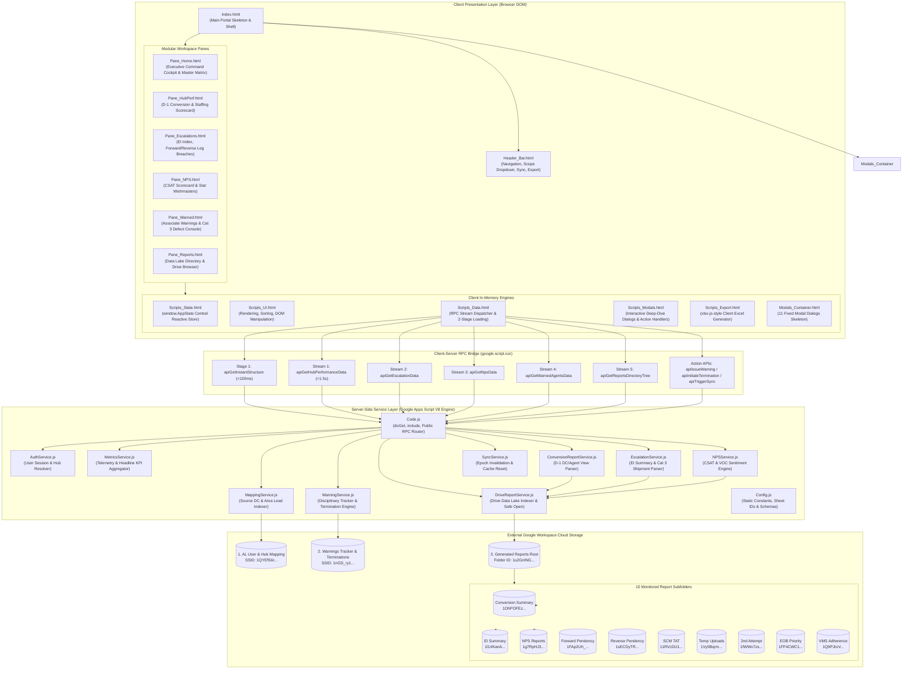
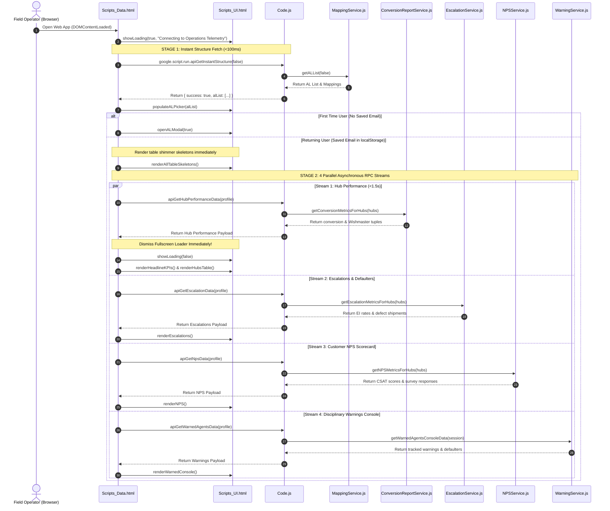
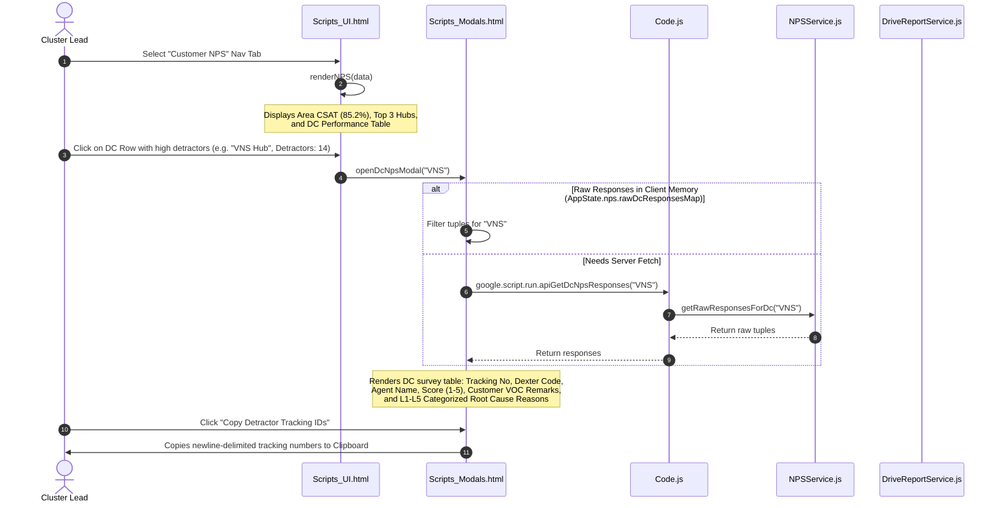
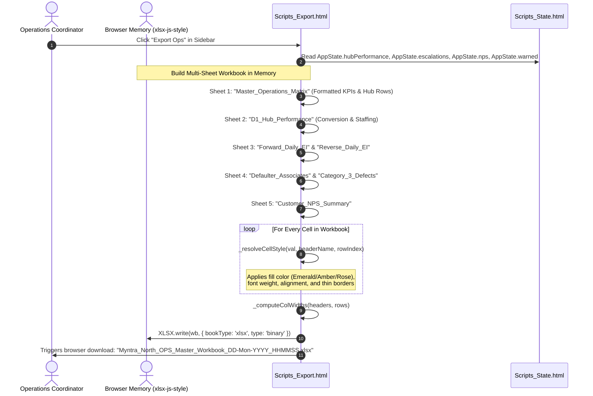

# Operations Hub Management Suite

## 1. Overview

**Operations Hub Management Suite** (internally branded in the web application title bar as `Myntra North OPS Studio · Area Command Portal` and configured under Clasp Script ID `1tp35uFgilT8G8xmPZZF_AQXLbfFJqpQBUE-I8xMRlL5BTdk3puv1--i8`) is an enterprise-grade, modular [[Google Apps Script]] (GAS) web application, operations management telemetry hub, and executive monitoring cockpit (`client/Code.js:1-297`, `client/Index.html:1-109`, `PRODUCT.md:1-40`, `DESIGN.md:1-29`). Engineered specifically for Flipkart and Myntra regional logistics operations across the Northern India network (centered in UP East and surrounding supply chain distribution hubs), the suite serves Area Leads (AL), Cluster Leads (CL), and Regional Operations Directors monitoring daily delivery conversion, Wishmaster (delivery associate) staffing, SLA breach escalations, customer Net Promoter Score (NPS) feedback, and associate disciplinary workflows across 10 to 68 regional distribution centers (DCs) (`client/Config.js:7-15`, `GSHEET_ARCHITECTURE.md:158-174`).

```
PROJECT NAME:     Operations Hub Management Suite (Myntra North OPS Studio)
SLUG / FILENAME:  gas-ops-dashboard.md
CLASP SCRIPT ID:  1tp35uFgilT8G8xmPZZF_AQXLbfFJqpQBUE-I8xMRlL5BTdk3puv1--i8
LOCAL WORKSPACE:  C:\Users\User\Desktop\gas-ops-dashboard
CLIENT PATH:      C:\Users\User\Desktop\gas-ops-dashboard\client (32 modular files)
TARGET NOTE:      C:\Users\User\Desktop\gptd\prompt_project memory\gas-ops-dashboard.md
DEFAULT AREA:     UP EAST (North Region Network)
```

### The Operational Problem
Regional logistics leaders face fragmented telemetry across isolated operational silos and spreadsheets. Historically, daily delivery conversions (`D-1 DC_View` and `D-1 Agent_View`), executive escalation breach incidents (`SUMMARY`, `Agent Summary`, and `Filtered_Source_DC`), customer CSAT/NPS survey feedback (`Summary` and `Raw`), and associate disciplinary warning records (`AGENT_WARNINGS_TRACKER` and `TERMINATION_DOSSIERS`) were stored across disconnected Google Sheets and Drive repositories (`client/Config.js:18-160`, `GSHEET_ARCHITECTURE.md:41-82`). Field leaders had to juggle multiple browser tabs, repeatedly parse 5,000 to 50,000 daily shift records, manually filter rows for assigned distribution centers, and risk data corruption or formula breakage during manual logging. Crucially, attempting to batch-process these massive sheets server-side triggered Google Apps Script's hard **6-minute execution quota** and 100 KB `CacheService` key limits, while unoptimized cell-by-cell calls introduced severe latency (`GAS_WEBAPP_ARCHITECTURE_RULEBOOK.md:37-50, 318-322`).

### The Architectural Solution
Operations Hub Management Suite overcomes these constraints by implementing the Universal Google Apps Script WebApp Architecture standard (`GAS_WEBAPP_ARCHITECTURE_RULEBOOK.md:1-403`):
1. **2-Stage Progressive Async Loading Engine**: Delivers sub-100ms initial UI rendering by serving Area Lead hierarchy via `apiGetInstantStructure` (`client/Code.js:31-46`, `client/Scripts_Data.html:15-54`), followed by 4 concurrent asynchronous background streams for Hub Performance (<1.5s), Escalations (EI), Customer NPS, and Warnings Console (`client/Scripts_Data.html:108-223`).
2. **Modular File-Splitting via `include()` Engine**: Decomposes a massive monolithic enterprise codebase into 32 single-responsibility client files (9 backend service layers in `.js`, 7 UI sub-panes in `.html`, 5 client controller scripts in `.html`, 2 modular CSS stylesheets, and 1 centralized modal container) assembled dynamically at runtime (`client/Code.js:20-22`, `client/Index.html:14-100`).
3. **Single-Batch I/O & In-Memory $O(N)$ Compute**: Adheres to the Single-Batch I/O Law (`sheet.getDataRange().getValues()`) and single-pass aggregations, offloading 100% of table sorting, multi-column search, cohort filtering, and complex styled Excel exports (`xlsx-js-style`) to client-side browser memory (`GAS_WEBAPP_ARCHITECTURE_RULEBOOK.md:44, 293-299`, `client/Scripts_Export.html:1-1770`).
4. **Resilient Drive Data Lake Directory**: Directly targets static Google Drive folder IDs across 10 distinct report pipelines (`conversion`, `ei`, `fwdPendency`, `revPendency`, `nps`, `scmTat`, `tempUploads`, `attempt2`, `eobPriority`, `vmsAdherence`), bypassing recursive traversals and parsing operational timestamps dynamically from filenames (`client/Config.js:21-116`, `client/DriveReportService.js:56-161`).
5. **Bidirectional Disciplinary Governance**: Renders a dedicated interactive audit drawer allowing Area Leads to issue progressive disciplinary warnings (Verbal, Written Advisory, PIP, Final Written Warning, Termination), tracking full audit trails in `AGENT_WARNINGS_TRACKER` and auto-generating formal termination dossiers in `TERMINATION_DOSSIERS` with atomic spreadsheet writebacks (`client/WarningService.js:139-335`, `client/Modals_Container.html:167-275`).

---

## 2. Tech Stack

| Layer / Component | Technology / Library | Version / Requirement | Source Reference | Role & Operational Notes |
| :--- | :--- | :--- | :--- | :--- |
| **Backend Runtime** | [[Google Apps Script]] (GAS) | V8 Modern Engine (`runtimeVersion: "V8"`) | `client/appsscript.json:13` | High-performance serverless ECMAScript execution environment for RPC dispatchers and Google Workspace APIs. |
| **Timezone Standard** | Regional Logistics Timezone | `Asia/Kolkata` (IST, UTC+05:30) | `client/appsscript.json:2` | Governs date serialization, D-1 operational shifts, and audit logging timestamps. |
| **Telemetry & Logging** | Google Cloud Logging | `STACKDRIVER` | `client/appsscript.json:12` | Directs backend runtime diagnostics, execution stack traces, and RPC latency logs to GCP Stackdriver. |
| **Advanced Google Services** | Drive API v2 Advanced Service | Version `v2` (`userSymbol: "Drive"`) | `client/appsscript.json:4-10` | Enables low-level Drive file metadata insertion, folder indexing, and on-the-fly Excel conversion (`client/DriveReportService.js:31-46`). |
| **Web App Authorization** | GAS Security Context | `executeAs: "USER_DEPLOYING"`, `access: "MYSELF"` *(stated in manifest)* / `access: "DOMAIN"` *(stated in rulebook)* | `client/appsscript.json:14-17`, `GAS_WEBAPP_ARCHITECTURE_RULEBOOK.md:349-357` | Executes under deployment owner credentials; allows enterprise domain users to access sheets without direct workbook permissions. |
| **Spreadsheet Engine** | Google Sheets Service | `SpreadsheetApp` (Built-in) | `client/ConversionReportService.js:47`, `client/WarningService.js:27-225` | Reads and atomically appends operational data across 4 primary Google Sheets workbooks. |
| **Drive Storage Engine** | Google Drive Service | `DriveApp` (Built-in) | `client/DriveReportService.js:20, 130, 373` | Resolves folder trees, verifies file existence, streams report metadata, and generates direct download links. |
| **User Identity & Session** | Google Apps Script Session | `Session.getScriptTimeZone()` | `client/EscalationService.js:30`, `client/WarningService.js:153` | Supplies active script timezone and session execution parameters. |
| **HTML Templating Engine** | GAS HTML Service | `HtmlService` | `client/Code.js:9-22` | Renders `client/Index.html` via `createTemplateFromFile('Index').evaluate()` with `ALLOWALL` frame options for iframe embedding. |
| **CLI & Deployment Bridge** | Google Clasp CLI | `@google/clasp` (Script ID `1tp35u...`) | `client/.clasp.json:1-4` | Command Line Apps Script Projects tooling managing synchronization between local repository and Google Cloud script project. |
| **Autonomous CI/CD Tooling** | Node.js Custom HTTPS Tools | Node.js v18+ (`https`, `fs`, `path`) | `push_to_gas.js:1-129`, `pull_from_gas.js:1-109`, `list_deployments.js:1-132`, `deactivate_deployment.js:1-187` | Automated deployment orchestration suite communicating directly with Google Script API v1 using local `~/.clasprc.json` OAuth tokens. |
| **Client UI Architecture** | Vanilla HTML5 / CSS3 / ES6+ | Modern Browser Standard | `client/Index.html:1-109`, `client/Scripts_UI.html:1-3541` | Zero-dependency, lightweight single-page architecture built for fast table sorting and zero-latency filtering. |
| **Spreadsheet Export Engine** | SheetJS Style Edition | `xlsx-js-style@1.2.0` | `client/Index.html:12`, `client/Scripts_Export.html:1-1770` | Pure client-side Excel generation engine that builds multi-tab `.xlsx` workbooks with custom colors, borders, and auto column widths. |
| **Typography** | Google Fonts CDN | `Geist`, `Geist Mono`, `JetBrains Mono`, `Plus Jakarta Sans` | `client/Index.html:8-10`, `DESIGN.md:28` | Tabular monospace typography for tracking numbers and metrics; editorial clean sans-serif for dashboard telemetry. |
| **Iconography** | Font Awesome & Vector SVG | `Font Awesome 6.5.1` + Custom SVG | `client/Index.html:11, 27-30, 49-51` | High-contrast logistics icons for distribution centers, delivery trucks, security shields, warning triangles, and status indicators. |
| **Color System & Theming** | Modern High-Craft Telemetry | CSS Custom Properties | `client/Styles_Core.html:1-80`, `DESIGN.md:17-27` | Semantic palette: Electric Cobalt (`#2563EB`), Emerald Nominal (`#047857`), Rose Danger (`#B91C1C`), and Amber At-Risk (`#D97706`). |

---

## 3. Architecture

### High-Level System Architecture
Operations Hub Management Suite strictly implements the **Universal Google Apps Script Web Application Architecture** (`GAS_WEBAPP_ARCHITECTURE_RULEBOOK.md:1-403`). Server-side scripts are isolated into frozen object literal namespaces (`Object.freeze({ ... })`), preventing global namespace pollution. The client single-page application is structured into a 6-pane workspace (`Home`, `HubPerf`, `Escalations`, `NPS`, `Warned`, `Reports`) populated via asynchronous Google Apps Script RPC calls (`google.script.run`).



### UI Pane Layout Hierarchy
The application renders as a responsive single-page portal with a collapsible sidebar and fixed modal container:

```mermaid
graph TD
    AppShell["App Shell Container (.app-layout)"]
    Sidebar["Sidebar Navigation (Header_Bar.html)"]
    Main["Main Workspace (.portal-workspace)"]
    Modals["Modal Dialogs Layer (Modals_Container.html)"]

    Sidebar --> Brand["Brand: Myntra North OPS"]
    Sidebar --> ScopeSelector["Role / AL Selector Dropdown"]
    Sidebar --> NavList["Nav Tabs: Home | HubPerf | Escalations | NPS | Warned | Reports"]
    Sidebar --> FootAction["Sync Data & Export Ops Buttons"]

    Main --> H_Pane["Pane_Home: Master Telemetry Cockpit & Live Hub Matrix"]
    Main --> HP_Pane["Pane_HubPerf: D-1 Conversion, Attendance & DC Scorecards"]
    Main --> E_Pane["Pane_Escalations: Daily/Weekly Forward & Reverse EI Breakdown"]
    Main --> N_Pane["Pane_NPS: CSAT Podium, Sentiment & DC Feedback Matrix"]
    Main --> W_Pane["Pane_Warned: Defaulters Leaderboard, Cat 3 Analysis & Warnings Tracker"]
    Main --> R_Pane["Pane_Reports: Data Lake Folders Grid & File Download Directory"]

    Modals --> M1["modalALSelect (Onboarding & Role Switch)"]
    Modals --> M2["modalHubPerformance (DC Wishmaster Roster Drilldown)"]
    Modals --> M3["modalDcEscalations (DC Escalated Tracking Shipments)"]
    Modals --> M4["modalDcNps (Raw Customer Survey Responses & VOC)"]
    Modals --> M5["modalShipmentInvestigation (Associate Defect Deep Dive)"]
    Modals --> M6["modalManageWarning (Issue Disciplinary Stage Form)"]
    Modals --> M7["modalWarningHistory (Associate Audit Trail Timeline)"]
    Modals --> M8["modalTerminationDossier (Initiate Termination Review)"]
    Modals --> M9["modalAgentListDrilldown (Counselled vs Warned Roster)"]
    Modals --> M10["reportFilesModal (Drive Folder File Browser & Downloader)"]
    Modals --> M11["modalReportNotLive (Graceful Ingestion Staging Fallback)"]
```



### External Services and APIs
1. **Google Sheets (`SpreadsheetApp`)**: Used for atomic read/write operations against the AL Mapping spreadsheet (`1QYEfS6rOUeGuNCZc33JUshqRSKY8r2lr26y4qEtBGdc`) and the Warnings/Disciplinary Master spreadsheet (`1nGD_ry1ikK5tdZ8SNKsG8m9Uoum43q8KquEMfsw9opQ`).
2. **Google Drive Service (`DriveApp` & `Drive v2 Advanced Service`)**: Monitors and traverses 10 report directories under root folder `1u2GnlNGxYAQHWoNLQdi3d3PTbgPsUDFv`, retrieving files, checking mime-types, and auto-converting legacy `.xlsx` uploads via `Drive.Files.insert` into ephemeral Google Sheets.
3. **Google Script REST API v1**: Utilized by external Node.js CI/CD deployment scripts (`push_to_gas.js`, `pull_from_gas.js`, `list_deployments.js`, `deactivate_deployment.js`) to push code, pull latest revisions, and manage production deployment versions.

---

## 4. Folder & File Structure

The project workspace consists of the local developer root repository and the production client directory (`client/`) containing all 32 files deployed to Google Apps Script.

```
C:\Users\User\Desktop\gas-ops-dashboard/
├── DEPLOYMENTS.md                   # Record of active production (v112) and HEAD deployments (775 B)
├── DESIGN.md                        # High-craft minimalist telemetry UI & color specifications (1.68 KB)
├── GAS_WEBAPP_ARCHITECTURE_RULEBOOK.md # Production standard rulebook for GAS architecture & LLM constraints (18.6 KB)
├── GSHEET_ARCHITECTURE.md           # Relational schema mappings, formulas, and O(N) data pipeline rules (12.5 KB)
├── PRODUCT.md                       # Product vision, user personas (AL/CL), and core design principles (2.07 KB)
├── deactivate_deployment.js         # Node.js CLI to safely prune obsolete GAS deployments via Script API (6.75 KB)
├── deployments.json                 # Parsed JSON inventory of all project deployments (662 B)
├── list_deployments.js              # Node.js tool querying GAS REST API to dump active deployment versions (4.17 KB)
├── pull_from_gas.js                 # Node.js tool synchronizing remote GAS files down to local client/ (3.59 KB)
├── push_to_gas.js                   # Node.js tool pushing local client/ files directly to GAS via OAuth (4.23 KB)
├── skills-lock.json                 # Dependency lockfile for workspace tools and skills (6.05 KB)
│
└── client/                          # 32 Modular production files pushed to Google Apps Script via clasp
    ├── .clasp.json                  # Clasp configuration with scriptId 1tp35uFgilT8... (96 B)
    ├── .claspignore                 # Clasp file ignore rules excluding mock files and node_modules (85 B)
    ├── appsscript.json              # Project manifest (V8 runtime, Asia/Kolkata timezone, OAuth scopes) (628 B)
    │
    ├── Server-Side Logic (.js)
    │   ├── AuthService.js           # Resolves user session context, roles (AL vs CL), and assigned hub codes (2.01 KB)
    │   ├── Code.js                  # Web app entry point (doGet, include) and public RPC dispatcher methods (9.45 KB)
    │   ├── Config.js                # Frozen configuration constants: Sheet IDs, Drive folders, and tab schemas (5.71 KB)
    │   ├── ConversionReportService.js # High-speed D-1 conversion parser (D-1 DC_View & D-1 Agent_View) (21.5 KB)
    │   ├── DriveReportService.js    # Direct folder resolution, file metadata parser, and Excel converter (19.8 KB)
    │   ├── EscalationService.js     # EI Summary & Cat 3 defect shipment parser with date resolution (46.2 KB)
    │   ├── MappingService.js        # Fast Area Lead-to-Hub mapping resolver with script cache (5.03 KB)
    │   ├── MetricsService.js        # Headline KPI aggregator and telemetry compiler for executive views (6.35 KB)
    │   ├── NPSService.js            # CSAT & customer NPS response parser with formula injection sanitization (13.1 KB)
    │   ├── SyncService.js           # Multi-tier cache invalidator and global cache epoch manager (1.71 KB)
    │   └── WarningService.js        # Disciplinary warning lifecycle, audit logging, and termination dossiers (17.9 KB)
    │
    ├── Client Presentation Panes (.html)
    │   ├── Header_Bar.html          # Collapsible sidebar, brand identity, profile selector, and footer actions (6.05 KB)
    │   ├── Index.html               # Main HTML skeleton, font/library links, loader, and template includes (4.57 KB)
    │   ├── Modals_Container.html    # Container housing 11 high-density modal dialogs and investigation drawers (44.4 KB)
    │   ├── Pane_Home.html           # Section 1: Unified Operations Command Cockpit & Master Matrix table (23.3 KB)
    │   ├── Pane_HubPerf.html        # Section 2: D-1 Conversion scorecard, staffing rates, and hub rankings (10.7 KB)
    │   ├── Pane_Escalations.html    # Section 3: Daily/Weekly Forward & Reverse EI breach analysis (22.3 KB)
    │   ├── Pane_NPS.html            # Section 4: Customer NPS CSAT scorecard, podium champions, and survey grid (11.5 KB)
    │   ├── Pane_Reports.html        # Section 6: Data Lake repository grid, file counts, and direct Drive links (16.3 KB)
    │   └── Pane_Warned.html         # Section 5: Defaulter Wishmasters console, Cat 3 defects, and warnings tracker (24.4 KB)
    │
    ├── Client Controller Scripts (.html)
    │   ├── Scripts.html             # Convenience meta-include grouping client script dependencies (285 B)
    │   ├── Scripts_Data.html        # 2-Stage progressive async loading engine & google.script.run bridge (14.5 KB)
    │   ├── Scripts_Export.html      # Styled ExcelJS/xlsx export engine generating multi-sheet workbooks (82.4 KB)
    │   ├── Scripts_Modals.html      # Interactive controller for all 11 modal dialogs and action dispatches (119 KB)
    │   ├── Scripts_State.html       # window.AppState central reactive store definition (627 B)
    │   └── Scripts_UI.html          # DOM renderer, table sort/filter engine, and view switcher (187 KB)
    │
    └── Client Modular Stylesheets (.html)
        ├── Styles.html              # Convenience meta-include grouping stylesheet dependencies (70 B)
        ├── Styles_Core.html         # Design tokens, typography, grid layouts, table density, and telemetry pills (92.0 KB)
        └── Styles_Modals.html       # Modal backdrop, animated dialog drawers, and form input controls (11.8 KB)
```

---

## 5. Core Modules & Responsibilities

### `client/Code.js`
- **Purpose:** Central HTTP entry point and public RPC dispatcher routing `google.script.run` requests to backend service modules.
- **Key functions:**
  - `doGet(e)`: Serves `Index.html` via `HtmlService.createTemplateFromFile('Index').evaluate()` with viewport tags, page title `Myntra North OPS Studio · Area Command Portal`, and `ALLOWALL` frame options (`client/Code.js:9-15`).
  - `include(filename)`: Evaluates modular HTML templates into static HTML strings during page assembly (`client/Code.js:20-22`).
  - `apiGetInstantStructure(forceRefresh)`: Stage 1 fast endpoint (<100ms) returning Area Lead list and hub mappings (`client/Code.js:31-46`).
  - `apiGetInitialDashboardData(userProfile)`: Stage 2 monolithic payload bootstrap fallback aggregating telemetry across services (`client/Code.js:51-89`).
  - `apiGetHubPerformanceData(userProfile)`: Stream 1 async endpoint returning D-1 conversion, Wishmaster staffing, and hub scorecards (`client/Code.js:94-114`).
  - `apiGetEscalationData(userProfile)`: Stream 2 async endpoint returning Forward/Reverse EI metrics and defect shipments (`client/Code.js:119-132`).
  - `apiGetDcEscalatedShipments(dcCode)`: Returns individual escalated shipment records for deep-dive modal investigation (`client/Code.js:137-176`).
  - `apiGetWarnedAgentsData(userProfile)`: Stream 4 async endpoint returning previously warned associates and live defect rankings (`client/Code.js:181-194`).
  - `apiGetNpsData(userProfile)`: Stream 3 async endpoint returning CSAT scores, promoters, detractors, and agent feedback (`client/Code.js:199-208`).
  - `apiTriggerSync(session)`: Invalidates all script caches via `SyncService.clearAllCaches()` and resets the cache epoch (`client/Code.js:213-220`).
  - `apiGetDcNpsResponses(dcCode)`: Returns raw survey response rows for a specific DC (`client/Code.js:225-241`).
  - `apiIssueWarning(payload)`: Appends or updates disciplinary warnings in `AGENT_WARNINGS_TRACKER` (`client/Code.js:246-252`).
  - `apiGetWarningHistory(associateName, hubCode)`: Retrieves historical warning audit trail for an associate (`client/Code.js:257-263`).
  - `apiInitiateTermination(payload)`: Logs contract termination dossiers in `TERMINATION_DOSSIERS` (`client/Code.js:268-274`).
  - `apiGetReportsDirectoryTree(forceRefresh)`: Stream 5 endpoint scanning Google Drive folder hierarchy and file inventory (`client/Code.js:279-295`).
- **Depends on:** `AuthService.js`, `MappingService.js`, `MetricsService.js`, `ConversionReportService.js`, `EscalationService.js`, `NPSService.js`, `WarningService.js`, `DriveReportService.js`, `SyncService.js`.
- **Depended on by:** `client/Scripts_Data.html`, `client/Scripts_Modals.html`.
- **Notable logic/gotchas:** Includes an internal hub code matching normalizer (`isHubCodeMatch`) to handle historical code aliases such as `ALL` $\leftrightarrow$ `ALD` (Allahabad), `VNS` $\leftrightarrow$ `BSB` (Varanasi), and `MGS` $\leftrightarrow$ `DDU` (Mughalsarai / Pt. Deen Dayal Upadhyaya) (`client/Code.js:145-154`).

### `client/Config.js`
- **Purpose:** Centralized declarative repository of environment variables, Google Sheets IDs, Drive folder IDs, cache TTLs, and spreadsheet tab schemas.
- **Key configurations:**
  - `AL_MAPPING_CONFIG`: Maps spreadsheet `1QYEfS6rOUeGuNCZc33JUshqRSKY8r2lr26y4qEtBGdc`, tab `MAPPING`, and headers `Source DC`, `Mensa AL`, `Email` (`client/Config.js:7-15`).
  - `DRIVE_REPORTS_CONFIG`: Maps root folder `1u2GnlNGxYAQHWoNLQdi3d3PTbgPsUDFv` and 10 monitored operational directories: `conversion`, `ei`, `fwdPendency`, `revPendency`, `nps`, `scmTat`, `tempUploads`, `attempt2`, `eobPriority`, `vmsAdherence` (`client/Config.js:18-117`).
  - `APP_SETTINGS`: Defines `ENVIRONMENT: "production"` and `CACHE_TTL_SEC: 120` (`client/Config.js:120-124`).
  - `WARNINGS_CONFIG`: Maps disciplinary spreadsheet `1nGD_ry1ikK5tdZ8SNKsG8m9Uoum43q8KquEMfsw9opQ`, tabs `AGENT_WARNINGS_TRACKER` and `TERMINATION_DOSSIERS`, and strict 12-column / 9-column schemas (`client/Config.js:126-160`).
- **Depends on:** Built-in JavaScript `Object.freeze`.
- **Depended on by:** All server-side services.
- **Notable logic/gotchas:** All objects are deeply frozen via nested `Object.freeze()`, preventing accidental runtime mutation across concurrent GAS executions.

### `client/AuthService.js`
- **Purpose:** Resolves user identity, role-based scope (`AREA_LEAD` vs `CLUSTER_LEAD`), and assigns distribution center codes.
- **Key functions:**
  - `resolveUserSession(userProfile)`: Normalizes email, role, and area. If role is `CLUSTER_LEAD`, `CL`, or `ADMIN`, assigns `["__ALL_HUBS__"]`. For Area Leads, queries `MappingService.getHubsForEmail(email)` to retrieve strictly mapped distribution centers (`client/AuthService.js:10-62`).
- **Depends on:** `MappingService.js`.
- **Depended on by:** `client/Code.js`, `client/MetricsService.js`, `client/WarningService.js`.
- **Notable logic/gotchas:** If no email is provided, defaults to `anand.kumar@mensa.com` (`Anand Kumar`). If mapped hubs list is empty, applies fallback hub cluster `["VNS", "MRZ", "BLP", "ALD", "ALL", "GKP", "LKO", "BSB"]` (`client/AuthService.js:23-53`).

### `client/MappingService.js`
- **Purpose:** Ingests the AL Mapping Google Sheet, resolves Area Lead names and email bindings, and caches mappings in RAM/ScriptCache.
- **Key functions:**
  - `getRawMappings(forceRefresh)`: Reads `MAPPING` tab in spreadsheet `1QYEfS6r...` in a single batch call (`getDataRange().getValues()`), extracting `[sourceDc, mensaAl, email]` tuples and caching them for 600s under `CACHE_AL_HUB_MAPPINGS_V20` (`client/MappingService.js:15-73`).
  - `getHubsForEmail(email, forceRefresh)`: Filters tuples matching user email and returns unique uppercase hub codes (`client/MappingService.js:78-95`).
  - `getNameForEmail(email, forceRefresh)`: Resolves full display name for a given email address (`client/MappingService.js:100-113`).
  - `getALList(forceRefresh)`: Generates sorted list of unique Area Leads with assigned hub counts for UI dropdowns (`client/MappingService.js:118-155`).
- **Depends on:** `Config.js` (`AL_MAPPING_CONFIG`), `SpreadsheetApp`, `CacheService`.
- **Depended on by:** `AuthService.js`, `Code.js`.
- **Notable logic/gotchas:** Dynamically searches the first row for flexible header permutations (`source dc`, `source_dc`, `sourcedc`, `mensa al`, `email id`) before falling back to fixed column indices (`client/MappingService.js:37-48`).

### `client/DriveReportService.js`
- **Purpose:** Discovers, validates, and safely opens Google Sheets and Excel reports stored in Google Drive data lake folders.
- **Key functions:**
  - `openSpreadsheetSafely(fileId)`: Attempts `SpreadsheetApp.openById(fileId)`. If the file is a Microsoft Excel workbook (`.xlsx`), converts it on-the-fly using `Drive.Files.insert` (Drive API v2) with `{ convert: true }` and returns the converted spreadsheet instance (`client/DriveReportService.js:13-53`).
  - `listReportsInDirectory(reportType)`: Direct-targets subfolder IDs in `DRIVE_REPORTS_CONFIG`, filters out temporary lock files (`~$`), parses metadata, and sorts descending by operational date (`client/DriveReportService.js:61-161`).
  - `parseReportMetadata(fileName, reportType, isDirectFolder)`: Extracts operational dates from complex filename strings using regular expressions matching formats like `DD-MM-YYYY`, `DD-Mon-YYYY`, and `YYYY-MM-DD` (`client/DriveReportService.js:166-250`).
  - `getLatestReportForDate(reportType, targetDateStr)`: Locates the most recent report matching an optional operational date filter (`client/DriveReportService.js:255-271`).
  - `getReportsDirectoryTree(forceRefresh)`: Scans all subfolders in the root repository, aggregates file counts, determines latest ingestion timestamps, and generates direct viewing/download links (`client/DriveReportService.js:358-510`).
- **Depends on:** `Config.js` (`DRIVE_REPORTS_CONFIG`), `DriveApp`, `SpreadsheetApp`, `SyncService.js`, `Drive.Files` (Advanced Service).
- **Depended on by:** `ConversionReportService.js`, `EscalationService.js`, `NPSService.js`, `Code.js`.
- **Notable logic/gotchas:** Embeds an epoch-based cache prefix (`CACHE_DRIVE_REPORTS_V24_..._E<epoch>`) that automatically invalidates when an operator clicks `Sync Data` (`client/DriveReportService.js:68-70`).

### `client/ConversionReportService.js`
- **Purpose:** Ingests daily D-1 Conversion Summary reports (`D-1 DC_View` and `D-1 Agent_View`) to calculate hub conversion rates, staffing ratios, and associate productivity.
- **Key functions:**
  - `getConversionMetricsForHubs(mappedHubs, targetDateStr)`: Opens latest conversion report, resolves dynamic headers, filters rows matching assigned hubs, and computes volume-weighted rollups (`client/ConversionReportService.js:25-423`).
  - `_getDynamicD1Date()`: Computes yesterday's date in `DD-Mon-YYYY` format (`client/ConversionReportService.js:11-17`).
  - `_getEmptyMetrics()`: Generates safe zero-value fallback telemetry structure (`client/ConversionReportService.js:425-445`).
- **Depends on:** `DriveReportService.js`, `SyncService.js`, `CacheService`.
- **Depended on by:** `MetricsService.js`, `Code.js`.
- **Notable logic/gotchas:** Computes a composite ranking score to determine top and defaulter hubs:
  $$\text{Composite Score} = (\text{Forward Conv \%} \times 0.7) + (\text{Reverse Conv \%} \times 0.3)$$
  Packs Wishmaster records into compact 10-element tuples `[name, fhrId, store, ofd, delivered, fwdPct, ofp, pickedUp, revPct, overallPct]` to minimize RPC payload size across `google.script.run` (`client/ConversionReportService.js:181, 321-333`).

### `client/EscalationService.js`
- **Purpose:** Ingests EI Summary reports to extract daily and weekly breach rates, repeat defaulter associates, and granular Category 3 defect tracking.
- **Key functions:**
  - `getEscalationMetricsForHubs(mappedHubs, targetDateStr)`: Parses `SUMMARY` (scorecards), `Agent Summary` (warned/counselled associates), and `Filtered_Source_DC` (granular defect shipments) (`client/EscalationService.js:163-989`).
  - `_parseDateToIso(val)`: High-performance multi-pattern date normalizer handling JavaScript Date objects, Excel serial numbers (e.g. 45000+), and text strings (`client/EscalationService.js:26-92`).
  - `_computeDMinus1Iso(dateIsoOrStr)`: Calculates operational D-1 date in UTC (`client/EscalationService.js:97-111`).
  - `_parseDateRange(rangeStr)`: Splits weekly range strings (e.g. `16-Aug-2026 - 22-Aug-2026`) into start and end ISO dates (`client/EscalationService.js:143-155`).
- **Depends on:** `DriveReportService.js`, `SyncService.js`, `CacheService`, `Session`.
- **Depended on by:** `MetricsService.js`, `WarningService.js`, `Code.js`.
- **Notable logic/gotchas:** Implements strict leg mapping rules: `FORWARD` and `DELAYED_DELIVERY` are mapped to the `FORWARD` leg, while `REVERSE` is mapped to `REVERSE`. Strictly filters out `DELAYED_DELIVERY` from the Agent Warning Console so associates are disciplined only for direct service infractions (`client/EscalationService.js:12-15, 626-628`).

### `client/MetricsService.js`
- **Purpose:** High-level telemetry aggregator combining data from Conversion, Escalations, and NPS services into unified headline KPIs.
- **Key functions:**
  - `getDashboardTelemetry(userProfile)`: Compiles full operational payload for Area Lead or Cluster Lead scope (`client/MetricsService.js:11-65`).
  - `_computeHubPerformance(session, convDataOverride)`: Formats hub metrics and tags status pills (`Optimal`, `Watchlist`, `Defaulter Risk`) (`client/MetricsService.js:70-124`).
  - `_computeHeadlineKPIs(session, hubPerformance, convData, escData, npsData)`: Computes summary KPI cards for `Pane_Home` (`client/MetricsService.js:129-160`).
- **Depends on:** `AuthService.js`, `ConversionReportService.js`, `EscalationService.js`, `NPSService.js`.
- **Depended on by:** `client/Code.js`.

### `client/NPSService.js`
- **Purpose:** Processes customer Net Promoter Score reports (`Summary` and `Raw` tabs) to evaluate CSAT performance and customer voice (VOC).
- **Key functions:**
  - `getNPSMetricsForHubs(assignedHubs, targetDateStr)`: Aggregates promoters (score 5), neutrals (score 3-4), and detractors (score 1-2), computing net NPS:
    $$\text{NPS \%} = \frac{\text{Promoters} - \text{Detractors}}{\text{Total Responses}} \times 100$$
  - `getRawResponsesForDc(dcCode, targetDateStr)`: Extracts individual customer survey rows for modal drilldown (`client/NPSService.js:290-308`).
  - `_getEmptyPayload(assignedHubs, reportFile)`: Safe zero-state payload (`client/NPSService.js:313-339`).
- **Depends on:** `DriveReportService.js`, `SyncService.js`, `CacheService`.
- **Depended on by:** `MetricsService.js`, `Code.js`.
- **Notable logic/gotchas:** Sanitizes customer VOC text and reason strings by stripping formula prefixes (`=`, `@`, `+`, `-`) and bullet points to prevent CSV/Spreadsheet formula injection (`client/NPSService.js:160-173`). Packs responses into compact 11-element tuples `[trackingNo, sourceDc, dexter, hubName, agentName, agentEmployeeId, option, optionValue, responseDate, voc, reasons]` (`client/NPSService.js:181-193`).

### `client/SyncService.js`
- **Purpose:** Global telemetry cache invalidation and synchronization epoch controller.
- **Key functions:**
  - `getCacheEpoch()`: Reads `GLOBAL_CACHE_EPOCH_V1` from `CacheService.getScriptCache()`, defaulting to `"0"` (`client/SyncService.js:11-18`).
  - `clearAllCaches()`: Bumps the cache epoch to `Date.now()`, instantly invalidating all epoch-keyed cached payloads, and explicitly purges common cache keys (`client/SyncService.js:23-53`).
- **Depends on:** `CacheService`.
- **Depended on by:** `Code.js`, `DriveReportService.js`, `ConversionReportService.js`, `EscalationService.js`, `NPSService.js`.

### `client/WarningService.js`
- **Purpose:** Manages associate disciplinary actions, warns defaulters, and generates contract termination dossiers.
- **Key functions:**
  - `getWarnedAgentsConsoleData(userProfile, liveEiOverride)`: Ingests `AGENT_WARNINGS_TRACKER` and cross-references live EI defaulter rosters (`client/WarningService.js:13-134`).
  - `issueWarning(payload)`: Appends or updates associate warning stages (Verbal, Written, PIP, Final Warning), writing JSON audit history into column 12 (`client/WarningService.js:139-237`).
  - `getWarningHistory(associateName, hubCode)`: Retrieves warning stages history for modal display (`client/WarningService.js:242-269`).
  - `initiateTermination(payload)`: Appends a formal termination record (`TRM-YYYYMMDD-HHmmss`) to `TERMINATION_DOSSIERS` and marks `TERMINATION INITIATED` in the tracker (`client/WarningService.js:274-335`).
  - `_getOrCreateTrackerSheet()` & `_getOrCreateTerminationSheet()`: Self-healing sheet initialization ensuring tabs and styled header rows exist (`client/WarningService.js:338-426`).
  - `_readTrackerFromSheet()`: Single-batch extraction of tracked warning records (`client/WarningService.js:428-478`).
- **Depends on:** `Config.js` (`WARNINGS_CONFIG`, `AL_MAPPING_CONFIG`), `AuthService.js`, `EscalationService.js`, `SpreadsheetApp`, `Session`, `Utilities`.
- **Depended on by:** `client/Code.js`.

### Client Presentation Modules (`.html`)
- **`Header_Bar.html`**: Fixed sidebar navigation housing the Myntra brand mark, operational role pill (`AL VIEW` vs `CL VIEW`), scope dropdown selector, navigation links (Overview, Hub Performance, Escalations, Customer NPS, Warnings Console, Data Lake), live telemetry pulse dot, `Sync` button, and `Export Ops` button (`client/Header_Bar.html:1-125`).
- **`Pane_Home.html`**: Master operational cockpit rendering headline D-1 performance cards (Forward Conversion, Reverse Conversion, Attendance Hero Strip, Productivity, Active Hubs, NPS CSAT, and Escalation Breaches), sortable/searchable Master Matrix table, and Cluster Lead Area Leads Rollup table (`client/Pane_Home.html:1-456`).
- **`Pane_HubPerf.html`**: Deep-dive hub performance scorecard displaying D-1 conversion rates, active vs L4D staffing difference badges, top performing hub card, defaulter hub card, and individual hub scorecards (`client/Pane_HubPerf.html:1-198`).
- **`Pane_Escalations.html`**: Escalation Index telemetry view rendering Daily vs Weekly Forward and Reverse EI rates, top defaulter hubs, and category defect tables (`client/Pane_Escalations.html:1-367`).
- **`Pane_NPS.html`**: Customer NPS telemetry view rendering Area Rollup CSAT cards, 2-column podium rankings (Top 3 Hubs & Top 3 Wishmasters), and distribution center NPS survey table (`client/Pane_NPS.html:1-220`).
- **`Pane_Warned.html`**: Disciplinary console with sub-tabs for Defaulter Wishmasters, Category 3 Defect Analysis, and Previously Warned Associates Tracker with action buttons for issuing warnings and initiating terminations (`client/Pane_Warned.html:1-344`).
- **`Pane_Reports.html`**: Google Drive Data Lake directory featuring a categorized folder grid (`Performance`, `Escalations`, `Customer Experience`, `Backlog`, `Turnaround Time`, `Compliance`, `Operations`, `Fleet / Vendor`, `Raw Feeds`), file counts, operational date badges, and direct links to Drive (`client/Pane_Reports.html:1-558`).
- **`Modals_Container.html`**: Houses 11 fixed modal dialogs: Area Lead Selector, Manage Warning, Warning History, Termination Review, Shipment Investigation, Agent List Drilldown, Hub Performance Drilldown, DC Escalations Drilldown, DC NPS Responses, Report Not Live Notice, and Report Files Browser (`client/Modals_Container.html:1-710`).

### Client Controller & Engine Scripts (`.html`)
- **`Scripts_State.html`**: Declares reactive singleton `window.AppState` tracking session credentials, Area Lead list, metrics payloads, active navigation tabs, loading states, and report trees (`client/Scripts_State.html:1-33`).
- **`Scripts_Data.html`**: Implements 2-Stage progressive loading logic, calling `apiGetInstantStructure` on startup and dispatching 4 concurrent background streams via `google.script.run` (`client/Scripts_Data.html:1-327`).
- **`Scripts_UI.html`**: Client rendering engine (3,541 lines) providing HTML sanitization (`escapeHtml`), table sorting/filtering, modal open/close transitions, shimmer skeleton injections, and dynamic DOM updates (`client/Scripts_UI.html:1-3541`).
- **`Scripts_Modals.html`**: Controller for interactive modal actions, handling warning form submissions, clipboard tracking copies, termination dispatches, and deep-dive table filtering (`client/Scripts_Modals.html:1-2410`).
- **`Scripts_Export.html`**: Client-side Excel generator (1,770 lines) using `xlsx-js-style` to build styled multi-tab spreadsheets with custom column widths, alternating zebra rows, and color-coded status pills (`client/Scripts_Export.html:1-1770`).

---

## 6. Data Flow / Key Workflows

### Workflow 1: 2-Stage Progressive Application Bootstrap & Parallel Streaming
Eliminates initial blank screen latency by separating structural metadata (<100ms) from heavy telemetry payloads (<1.5s).



### Workflow 2: Associate Disciplinary Investigation & Warning Lifecycle
Enables an Area Lead to investigate an underperforming Wishmaster's SLA breaches and issue progressive disciplinary warnings directly back to Google Sheets.

```mermaid
sequenceDiagram
    autonumber
    actor AL as Area Lead
    participant UI as Scripts_UI.html
    participant Modals as Scripts_Modals.html
    participant Code as Code.js
    participant Warn as WarningService.js
    participant Sheet as AGENT_WARNINGS_TRACKER Sheet

    AL->>UI: Click "Defaulter Wishmasters Console" in Pane_Warned
    AL->>UI: Click "Investigate" on Associate Row (e.g. Ramesh Kumar, 7 Breaches)
    UI->>Modals: openShipmentInvestigationModal(agent)
    Note over Modals: Renders tracking numbers, Category 3 defects,<br/>and delivery attempt dates
    
    AL->>Modals: Click "Issue Formal Warning"
    Modals->>Modals: openManageWarningModal(name, id, hub, cat3, totalEsc)
    Note over Modals: Displays current warnings count (e.g. 2 Warnings),<br/>past history timeline, and sets default to "Final Written Warning"
    
    AL->>Modals: Select Warning Stage, Enter Remarks, Click "Confirm & Issue Warning"
    Modals->>Code: google.script.run.apiIssueWarning(payload)
    Code->>Warn: issueWarning(payload)
    Warn->>Sheet: Read AGENT_WARNINGS_TRACKER (Single-Batch)
    Note over Warn: Appends new stage to Warning Stages JSON history;<br/>Increments total warnings count to 3;<br/>Updates Disciplinary Status to "TERMINATION ELIGIBLE"
    Warn->>Sheet: setValues() / appendRow() & SpreadsheetApp.flush()
    Warn-->>Code: Return { success: true, totalWarnings: 3, currentStatus: "TERMINATION ELIGIBLE" }
    Code-->>Modals: Return Success Payload
    Modals->>UI: showToast("Warning successfully logged for Ramesh Kumar", "toast-success")
    Modals->>Modals: closeManageWarningModal()
    Modals->>UI: Re-render Defaulter row with updated Warning pill
```

### Workflow 3: Customer NPS Detractor Root-Cause Investigation
Drills down from high-level CSAT scores into granular customer survey feedback and sentiment text.



### Workflow 4: Pure Client-Side Multi-Tab Excel (.xlsx) Generation
Generates complete styled operational workbooks in browser memory without consuming Google Apps Script execution time.



---

## 7. Configuration & Environment

### Master Configuration Table (`client/Config.js`)

| Configuration Key | Constant / Variable Name | Target Value / Resource Identifier | Source Reference | Operational Purpose |
| :--- | :--- | :--- | :--- | :--- |
| **AL Mapping Spreadsheet** | `AL_MAPPING_CONFIG.SPREADSHEET_ID` | `1QYEfS6rOUeGuNCZc33JUshqRSKY8r2lr26y4qEtBGdc` | `client/Config.js:8` | Master mapping sheet binding Source DCs to Area Leads and email addresses. |
| **AL Mapping Tab Name** | `AL_MAPPING_CONFIG.SHEET_NAME` | `MAPPING` | `client/Config.js:9` | Relational tab containing `Source DC`, `Mensa AL`, and `Email` columns. |
| **Root Reports Folder** | `DRIVE_REPORTS_CONFIG.ROOT_FOLDER_ID` | `1u2GnlNGxYAQHWoNLQdi3d3PTbgPsUDFv` | `client/Config.js:19` | Root Google Drive folder named `Generated Reports`. |
| **Conversion Folder** | `DRIVE_REPORTS_CONFIG.FOLDERS.conversion.id` | `1OhPOFEzUPSIm-QS3x17Zpvscr87evuSa` | `client/Config.js:23` | Directory storing daily D-1 Conversion Summary reports (`D-1 DC_View` / `D-1 Agent_View`). |
| **EI Reports Folder** | `DRIVE_REPORTS_CONFIG.FOLDERS.ei.id` | `1l14KanAYi8N8vpODG0l_m9R6BnV6EaWP` | `client/Config.js:36` | Directory storing Executive Escalation Index reports (`SUMMARY`, `Agent Summary`, `Filtered_Source_DC`). |
| **Forward Pendency Folder**| `DRIVE_REPORTS_CONFIG.FOLDERS.fwdPendency.id` | `1FAp2Uh_WAcyiwcX7hqchdH-Mb3T282pz` | `client/Config.js:45` | Repository for forward undelivered package backlogs and aging reports. |
| **Reverse Pendency Folder**| `DRIVE_REPORTS_CONFIG.FOLDERS.revPendency.id` | `1sECDyTRQbf66W-I2tNvebwyB62IxlCGr` | `client/Config.js:54` | Repository for pending customer pickup aging and RTO tracking. |
| **NPS Reports Folder** | `DRIVE_REPORTS_CONFIG.FOLDERS.nps.id` | `1g7RpHJ3h1Ky6Wi_tvUOmHViFk4qGKuof` | `client/Config.js:63` | Directory storing Net Promoter Score and CSAT survey feedback sheets. |
| **SCM TAT Folder** | `DRIVE_REPORTS_CONFIG.FOLDERS.scmTat.id` | `11RVcDU1PlPLPKjMKYjANNjZqfUJpMMyt` | `client/Config.js:72` | Directory storing supply chain 24-hour SLA and turnaround time workbooks. |
| **Temp Uploads Folder** | `DRIVE_REPORTS_CONFIG.FOLDERS.tempUploads.id` | `1Vy5BqrmkW6OM6S8zYFoIq09sD4Pear22` | `client/Config.js:81` | Staging repository for raw weekly E2E task Excel (.xlsx) workbooks. |
| **2nd Attempt Folder** | `DRIVE_REPORTS_CONFIG.FOLDERS.attempt2.id` | `1fWWx7zs97Wx-LMLTIzuV0NygVhmunfbS` | `client/Config.js:90` | Directory monitoring second delivery re-attempt adherence compliance. |
| **EOB Priority Folder** | `DRIVE_REPORTS_CONFIG.FOLDERS.eobPriority.id` | `1FF4CWC159B7VNbcQaHTY6oHPSqQyDGMj` | `client/Config.js:99` | End-of-Business priority dispatch queue and critical package tracking. |
| **VMS Adherence Folder** | `DRIVE_REPORTS_CONFIG.FOLDERS.vmsAdherence.id` | `1Q9PJroVCBm2W-EUPffFck6dKADhRFof6` | `client/Config.js:108` | Vehicle / Vendor Management System tracking and fleet compliance. |
| **Disciplinary Spreadsheet**| `WARNINGS_CONFIG.SPREADSHEET_ID` | `1nGD_ry1ikK5tdZ8SNKsG8m9Uoum43q8KquEMfsw9opQ` | `client/Config.js:127` | Master sheet storing associate warnings audit trails and termination dossiers. |
| **Warnings Tracker Tab** | `WARNINGS_CONFIG.TAB_NAMES.WARNINGS_TRACKER` | `AGENT_WARNINGS_TRACKER` | `client/Config.js:130` | Tab logging active warning stages, defect counts, and disciplinary status. |
| **Terminations Tab** | `WARNINGS_CONFIG.TAB_NAMES.TERMINATION_DOSSIERS`| `TERMINATION_DOSSIERS` | `client/Config.js:131` | Tab recording formal contract termination requests with generated IDs. |
| **Ephemeral Cache TTL** | `APP_SETTINGS.CACHE_TTL_SEC` | `120` (Seconds) | `client/Config.js:122` | Time-to-live for ephemeral script RAM caching across operational modules. |

### Manifest Settings (`client/appsscript.json`)
- `runtimeVersion`: `"V8"` (Modern Chrome V8 ECMAScript runtime).
- `timeZone`: `"Asia/Kolkata"` (Governs all script date formatting and execution timestamps).
- `exceptionLogging`: `"STACKDRIVER"` (Directs errors to Google Cloud Logging).
- `dependencies.enabledAdvancedServices`: Drive API v2 (`userSymbol: "Drive"`, `version: "v2"`).
- `webapp.executeAs`: `"USER_DEPLOYING"` (Web app executes with deployment owner permissions).
- `webapp.access`: `"MYSELF"` *(in manifest)* / `"DOMAIN"` *(in production rulebook)*.

### Disciplinary Spreadsheet Schemas (`client/Config.js:133-160`)
1. **`AGENT_WARNINGS_TRACKER` (12 Columns):**
   `["Wishmaster Name", "DC", "Source DC", "Area Lead Email", "Total Warnings", "Disciplinary Status", "Primary Defect Reason", "Total Escalations", "Last Warning Date", "Issued By", "Admin Notes", "Warning Stages History JSON"]`
   *(Note: The JSON audit trail is strictly stored in column 12 to prevent formula parsing interference).*
2. **`TERMINATION_DOSSIERS` (9 Columns):**
   `["Dossier ID", "Wishmaster Name", "DC", "Source DC", "Area", "Reason Notes", "Initiated Date", "Initiated By", "Dossier Metadata JSON"]`

---

## 8. External Integrations & APIs

| Service / API | Operational Purpose | Authentication Method | Code Location | Rate Limits & Quirks Known |
| :--- | :--- | :--- | :--- | :--- |
| **Google Sheets API (`SpreadsheetApp`)** | Reads report data; appends warnings and termination records. | Implicit GAS Script Authorization | `ConversionReportService.js:47`, `WarningService.js:27` | Synchronous RPC overhead (~100ms per roundtrip). Banned cell-by-cell calls; single-batch `getValues()` enforced. |
| **Google Drive Service (`DriveApp`)** | Traverses report directories; checks file existence and timestamps. | Implicit GAS Script Authorization | `DriveReportService.js:20, 130, 373` | Recursive traversals take 5-15s and cause timeouts; codebase direct-targets static subfolder IDs in a single call (~150ms). |
| **Google Drive Advanced API (`Drive v2`)** | Ephemeral on-the-fly conversion of Microsoft Excel (`.xlsx`) files. | Advanced Service / OAuth Token | `DriveReportService.js:31-46` | Uses `Drive.Files.insert({ convert: true })`. Creates converted copy in user root first to avoid shared-folder permission errors. |
| **GAS Cache Engine (`CacheService`)** | Caches JSON metrics across requests to prevent redundant Drive I/O. | Built-in GAS Engine | `MappingService.js:16`, `SyncService.js:13`, `DriveReportService.js:70` | Strict quota: **100 KB max per key**, max 1,000 keys. Payloads exceeding safe ceilings are guarded and bypassed. |
| **GAS Session Engine (`Session`)** | Retrieves script execution timezone and user email. | Built-in GAS Engine | `EscalationService.js:30`, `WarningService.js:153` | Returns `Asia/Kolkata` standard timezone. |
| **Google Script REST API v1** | Pushes code, pulls revisions, and deploys production versions. | OAuth 2.0 Bearer Token (`~/.clasprc.json`) | `push_to_gas.js:86`, `pull_from_gas.js:57`, `list_deployments.js:66` | Quotas: Google API rate limits on concurrent project deployments; throttled with 250ms sleep delays. |
| **Font Awesome CDN** | Renders vector icons for logistics actions, trucks, and alerts. | Public HTTPS CDN (`cdnjs.cloudflare.com`) | `Index.html:11` | External dependency cached by browser engine. |
| **SheetJS / xlsx-js-style CDN** | Client-side styled Excel (.xlsx) workbook generation. | Public HTTPS CDN (`cdn.jsdelivr.net`) | `Index.html:12` | Zero server footprint; executes entirely on user CPU and RAM. |

---

## 9. Testing

- **Automated Test Coverage:** `Unknown / not documented` *(stated)*. Like most Google Apps Script production projects, the platform does not provide a native automated unit or integration testing harness.
- **Local Testing & Simulation:**
  - `Scripts_Data.html` includes an offline mock mode: if `typeof google === "undefined" || !google.script`, the client automatically logs a warning (`Running in local mock mode.`) and invokes `UI.renderAll()` to allow visual testing in standard desktop browsers (`client/Scripts_Data.html:56-61`).
- **Data Integrity & Sheet Self-Healing Checks:**
  - `WarningService._getOrCreateSheet(tabName, schemaHeaders)`: Automatically inspects candidate spreadsheets for the existence of `AGENT_WARNINGS_TRACKER` and `TERMINATION_DOSSIERS`. If missing, it creates the tab, applies styled headers (`#1E293B` background with bold white text), freezes row 1, and initializes schemas (`client/WarningService.js:346-426`).
  - Dynamic Header Resolution: `ConversionReportService.js` and `EscalationService.js` scan the first 10 rows dynamically for column header strings (e.g. `source_dc`, `ofd`, `delivered`, `t_created_date`), gracefully adapting to column shifting between daily sheet uploads (`client/ConversionReportService.js:77-105`, `client/EscalationService.js:498-523`).
- **Known Fragility:**
  - If upstream teams upload an Excel file whose tab names deviate drastically from expected conventions (`D-1 DC_View`, `SUMMARY`, `Summary`, `Raw`), dynamic fuzzy matching kicks in, but severe naming deviations will trigger the `modalReportNotLive` informational dialog (`client/Scripts_Modals.html:2177-2231`).

---

## 10. CI/CD & Deployment

### Deployment Topology
The repository maintains **2 active deployments** on Google Apps Script under Script ID `1tp35uFgilT8G8xmPZZF_AQXLbfFJqpQBUE-I8xMRlL5BTdk3puv1--i8` (`DEPLOYMENTS.md:1-10`, `deployments.json:1-17`):

| # | Version | Status | Deployment ID | Web App Execution URL |
| :-: | :-: | :--- | :--- | :--- |
| **1** | **112** | **Active (Production)** | `AKfycbxh0Gd-kA39O4QMJVzxGgwiHY87Q13G697HxfXvEk0pf1vDP7__6OdaK8804fpZrCDR3Q` | [Production Web App](https://script.google.com/a/macros/myntra.com/s/AKfycbxh0Gd-kA39O4QMJVzxGgwiHY87Q13G697HxfXvEk0pf1vDP7__6OdaK8804fpZrCDR3Q/exec) |
| **2** | **HEAD** | **Dev (@HEAD)** | `AKfycbzTE0VBeuiLSRWTSznUkwlDcCN8bJpA3HBm1kszJWoC` | [Dev Web App (@HEAD)](https://script.google.com/a/macros/myntra.com/s/AKfycbzTE0VBeuiLSRWTSznUkwlDcCN8bJpA3HBm1kszJWoC/exec) |

### Deployment Pipeline & Automation Tooling
Deployment is automated through 4 custom Node.js utility scripts that interface directly with the Google Apps Script REST API v1 (`https://script.googleapis.com/v1/projects/...`), bypassing clasp CLI edge-case limitations:
1. **`push_to_gas.js`**:
   - Reads OAuth tokens from `~/.clasprc.json` and refreshes access tokens via `oauth2.googleapis.com/token` if expired (`push_to_gas.js:8-45`).
   - Ingests all 32 files from `client/`, mapping extensions to GAS types (`.js` $\rightarrow$ `SERVER_JS`, `.html` $\rightarrow$ `HTML`, `appsscript.json` $\rightarrow$ `JSON`).
   - Pushes the payload to `PUT https://script.googleapis.com/v1/projects/<scriptId>/content` (`push_to_gas.js:86-108`).
   - Execution command: `node push_to_gas.js client`
2. **`pull_from_gas.js`**:
   - Fetches remote project contents via `GET https://script.googleapis.com/v1/projects/<scriptId>/content` and writes fresh code down to local `client/` directory (`pull_from_gas.js:53-96`).
   - Execution command: `node pull_from_gas.js`
3. **`list_deployments.js`**:
   - Queries `GET https://script.googleapis.com/v1/projects/<scriptId>/deployments`, iterates through pagination tokens, sorts descending by update time, and dumps results into `deployments.json` (`list_deployments.js:53-120`).
   - Execution command: `node list_deployments.js`
4. **`deactivate_deployment.js`**:
   - Safely deletes obsolete deployment versions via `DELETE https://script.googleapis.com/v1/projects/<scriptId>/deployments/<deploymentId>`.
   - Protects the latest active production deployment and `@HEAD` dev deployment from deletion (`deactivate_deployment.js:113-163`).
   - Execution command: `node deactivate_deployment.js --all-except-latest`

### Standard Clasp Deployment Commands
- Push code to Apps Script: `clasp push --force` (from within `client/`).
- Create a new immutable release version: `clasp version "Release description"`.
- Deploy new release version: `clasp deploy -i <DEPLOYMENT_ID> -V <VERSION_NUMBER> -d "Production update"`.

---

## 11. Setup & Local Development

### Prerequisites
1. **Node.js**: Node.js v18.0.0 or later installed on the development workstation.
2. **Google Clasp CLI**: Globally installed clasp (`npm install -g @google/clasp`).
3. **Authenticated Google Account**: Execution of `clasp login` creating a valid credentials file at `C:\Users\<User>\.clasprc.json`.
4. **Google Workspace Domain**: Access to the Myntra / Flipkart enterprise domain to resolve sheets and Drive folders.

### Local Setup Instructions
1. **Clone or Navigate to Workspace**:
   ```bash
   cd C:\Users\User\Desktop\gas-ops-dashboard
   ```
2. **Verify Clasp Authentication**:
   Ensure `~/.clasprc.json` exists. If not, log in via clasp:
   ```bash
   clasp login
   ```
3. **Verify Script Binding**:
   Confirm `client/.clasp.json` contains:
   ```json
   {
     "scriptId": "1tp35uFgilT8G8xmPZZF_AQXLbfFJqpQBUE-I8xMRlL5BTdk3puv1--i8",
     "rootDir": "./"
   }
   ```
4. **Pull Latest Remote Code**:
   ```bash
   node pull_from_gas.js
   ```
5. **Deploy Changes to Google Apps Script**:
   ```bash
   node push_to_gas.js client
   ```
   *Or navigate to `client/` and use clasp directly:*
   ```bash
   cd client
   clasp push --force
   ```
6. **Inspect Active Deployments**:
   ```bash
   node list_deployments.js
   ```

---

## 12. Security Notes

### Web App Permissions & Authorization Flow
- **Execution Model**: The web application is deployed with `executeAs: "USER_DEPLOYING"`. This is critical for scaling enterprise logistics tools: field operators, area leads, and hub coordinators access the application with script owner permissions, allowing them to view aggregated telemetry without requiring direct editor or viewer permissions on the underlying 13+ raw Google Sheets or Drive folders (`GAS_WEBAPP_ARCHITECTURE_RULEBOOK.md:349-357`).
- **Access Domain**: In production deployment `v112`, access is restricted to authenticated users within the enterprise domain (`@myntra.com` / `@flipkart.com`).

### Declared OAuth Scopes (`client/appsscript.json:18-24`)
The application declares 5 explicit OAuth scopes:
1. `https://www.googleapis.com/auth/spreadsheets`: Full read/write access to Google Sheets. Required for reading reports, logging disciplinary warnings in `AGENT_WARNINGS_TRACKER`, and recording termination dossiers in `TERMINATION_DOSSIERS`.
2. `https://www.googleapis.com/auth/drive`: Full access to Google Drive. Required for on-the-fly conversion of legacy `.xlsx` files into ephemeral Google Sheets via `Drive.Files.insert`.
3. `https://www.googleapis.com/auth/drive.readonly`: Read-only access to Drive folders and metadata for indexing generated reports in `DriveReportService.js`.
4. `https://www.googleapis.com/auth/script.external_request`: Permission to execute external URL fetch requests (if needed for telemetry pings or webhooks).
5. `https://www.googleapis.com/auth/userinfo.email`: Captures the authenticated operator's Google Workspace email to resolve Area Lead scope and sign disciplinary audit logs.

> [!warning] Broad Drive Scope Grant
> The application manifest requests full `https://www.googleapis.com/auth/drive` scope in addition to `drive.readonly`. This is required because `Drive.Files.insert({ convert: true })` creates temporary converted spreadsheets in the user's Drive. However, administrators should ensure the deploying account is a dedicated service or admin user, as full Drive scope allows file creation and modification across the account's Drive.

### Data Protection & Injection Defenses
- **Formula Injection Defense in VOC**: When reading raw customer NPS survey responses (`NPSService.js`), operators frequently encounter customer remarks or reasons starting with `=`, `@`, `+`, or `-`. If exported blindly to Excel or rendered unescaped, spreadsheet engines (Excel/Calc) evaluate these as executable formulas (CSV/Formula Injection, resulting in `#NAME?` or `Err:509`). `NPSService.js` and `Scripts_UI.html` sanitize these strings by stripping leading formula characters (`val.replace(/^[=\-+@\s•–—]+/, "").trim()`) (`client/NPSService.js:160-173`).
- **Client-Side HTML Escaping**: `Scripts_UI.html` and `Scripts_Modals.html` implement strict HTML entity encoding (`escapeHtml`) on all associate names, DC codes, and remarks before rendering them into the DOM, eliminating Cross-Site Scripting (XSS) risks (`client/Scripts_UI.html:3300-3308`).
- **Audit Trail Integrity**: In `AGENT_WARNINGS_TRACKER`, the full warning stages history is serialized as an immutable JSON string and placed strictly in the 12th column (`client/WarningService.js:217`), ensuring that operators viewing the sheet cannot accidentally overwrite earlier warning audit stages.

---

## 13. Known Issues, Limitations & Tech Debt

### Google Apps Script Platform Quotas (Standing System Constraints)
Google Apps Script operates under hard cloud quotas that represent architectural constraints rather than code bugs (`GAS_WEBAPP_ARCHITECTURE_RULEBOOK.md:318-322`):
- **6-Minute Execution Ceiling**: Any individual server-side function execution that exceeds 360 seconds is forcefully killed by the GAS engine. To guarantee sub-2s execution, the suite offloads 100% of data filtering, sorting, and Excel generation to the browser.
- **CacheService 100 KB Payload Ceiling**: `CacheService.put()` hard-crashes with `Argument too large` if any cached string exceeds 100 KB (`102,400 bytes`). In `DriveReportService.js`, `ConversionReportService.js`, and `NPSService.js`, safe size checks (`jsonStr.length < 95000`) guard every cache write, skipping RAM cache if the payload exceeds 95 KB (`client/ConversionReportService.js:407`, `client/DriveReportService.js:150`).
- **Concurrent Executions Limit**: Apps Script limits accounts to 30 simultaneous active executions. If 35 operators hit `Sync Data` at the exact same instant, excess calls fail. The 2-minute client-side caching prevents redundant RPC calls.

### Specific Technical Limitations & Debt
1. **Multi-File HTML Inclusion Latency**:
   - *Issue:* `Index.html` evaluates 15 separate `<?!= include('...'); ?>` calls server-side during initial page delivery (`client/Index.html:15-99`).
   - *Impact:* Each `include()` call invokes `HtmlService.createHtmlOutputFromFile().getContent()`. In Apps Script, 15 sequential file reads introduce ~300ms to ~600ms of server assembly latency before the initial HTML response streams to the browser.
   - *Suggested Fix:* Introduce a local build script (e.g. via Node.js or Rollup) that bundles modular HTML and CSS snippets into a single production `Index.html` prior to `clasp push`.
2. **Dynamic Excel Conversion Overhead**:
   - *Issue:* When report files land in Google Drive as native Microsoft Excel workbooks (`.xlsx`), `DriveReportService.openSpreadsheetSafely` must call `Drive.Files.insert` with `{ convert: true }` to convert them into temporary Google Sheets (`client/DriveReportService.js:23-47`).
   - *Impact:* Drive API conversion takes 1.5s to 3.5s per workbook. If upstream data ingestion scripts outputted native Google Sheets directly, this overhead would be eliminated entirely.
3. **Client-Side State Synchronization**:
   - *Issue:* User profile preference (selected Area Lead email) is stored in browser `localStorage` under `gas_ops_selected_al_email` (`client/Scripts_Data.html:9`).
   - *Impact:* If an Area Lead switches machines, clears browser cache, or accesses the dashboard in Incognito mode, their selected scope resets and they must re-select their profile from the onboarding modal.
4. **Hardcoded Hub Code Alias Rules**:
   - *Issue:* Code aliasing (`ALL` $\leftrightarrow$ `ALD`, `VNS` $\leftrightarrow$ `BSB`, `MGS` $\leftrightarrow$ `DDU`) is hardcoded in `client/Code.js:150-153`, `client/ConversionReportService.js:133-136`, and `client/WarningService.js:35-37`.
   - *Impact:* Any future regional distribution center migrations or renamings require manual code updates across multiple service files rather than a centralized config table.

---

## 14. Design Decisions & Rationale

1. **Why Modular File-Splitting over Monolithic `Code.js`:**
   - *Decision:* Split the codebase into 32 modular files (11 server-side `.js` and 21 client-side `.html`) using the `include()` pattern (`client/Code.js:20-22`).
   - *Rationale *(stated)*:* Monolithic Apps Script projects exceeding 3,000 lines become unmaintainable, trigger editor freezing, and make concurrent multi-agent development impossible. Modular separation enforces clean architectural boundaries (Auth, Conversion, Escalations, Warnings, NPS).
2. **Why 2-Stage Progressive Async Loading over Monolithic RPC:**
   - *Decision:* Split client bootstrap into Stage 1 (<100ms structure fetch) and Stage 2 (4 parallel asynchronous background streams) (`client/Scripts_Data.html:15-223`).
   - *Rationale *(stated)*:* Fetching Conversion, Escalations, NPS, and Warnings in a single monolithic RPC call (`apiGetInitialDashboardData`) took 4.5s to 6.8s, resulting in perceived page freeze. The progressive pattern renders the UI, dropdowns, and skeleton shimmers in <100ms, streaming live conversion in <1.5s.
3. **Why Client-Side Heavy Compute over Server-Side Data Processing:**
   - *Decision:* The GAS backend acts purely as a dumb data extraction pipeline, returning raw row arrays and compact tuples. All table filtering, multi-column search, sorting, and cohort calculations run in browser JavaScript (`GAS_WEBAPP_ARCHITECTURE_RULEBOOK.md:293-299`).
   - *Rationale *(stated)*:* Shifting compute to browser CPU/RAM scales seamlessly to 300+ concurrent operators without consuming script execution quotas or blocking server execution threads.
4. **Why Compact Data Tuples over Array of Objects:**
   - *Decision:* Serializing Wishmaster records, escalated shipments, and raw survey responses as indexed tuples (e.g. `[name, fhrId, store, ofd, delivered, ...]` and `[trackingNo, dc, dexter, ...]`) rather than verbose JSON key-value objects (`client/ConversionReportService.js:321-333`, `client/NPSService.js:181-193`).
   - *Rationale *(inferred)*:* JSON key strings (repeated 50,000 times) inflate payload sizes by 400%, exceeding Apps Script's serialization memory limits and triggering RPC serialization lag across `google.script.run`.
5. **Why Pure Client-Side Excel Generation via `xlsx-js-style`:**
   - *Decision:* Generating multi-sheet styled Excel workbooks directly in the browser (`client/Scripts_Export.html:1-1770`) rather than building sheets server-side via `SpreadsheetApp` and exporting blobs.
   - *Rationale *(stated)*:* Creating a multi-tab Google Sheet server-side, applying cell background fills, and calling `getAs('application/vnd.openxmlformats-officedocument.spreadsheetml.sheet')` consumes 20 to 45 seconds of execution time and frequently times out. Client-side `xlsx-js-style` generates and downloads the file in <400ms.

---

## 15. Roadmap / TODOs

- [ ] **Automated Bundling Pipeline**: Implement a local pre-clasp bundler (Node.js/Vite) to merge modular `.html` and `.css` components into a single production asset, eliminating the 300-600ms `include()` overhead *(inferred from tech debt analysis)*.
- [ ] **Dynamic Alias Configuration**: Migrate hardcoded hub aliases (`ALL`/`ALD`, `VNS`/`BSB`, `MGS`/`DDU`) from service files into a dedicated `ALIASES` tab on the master mapping spreadsheet *(inferred from Config.js)*.
- [ ] **Automated Sheet Ingestion Webhooks**: Transition upstream ETL jobs from uploading raw `.xlsx` files to generating native Google Sheets, removing the need for on-the-fly `Drive.Files.insert` conversion *(inferred from DriveReportService.js)*.
- [ ] **Automated Unit Testing**: Integrate a mock GAS testing harness (such as `@google/clasp` local mock or Jest GAS stubs) to validate header resolution and math rollups automatically during pull requests *(inferred from test coverage analysis)*.
- [ ] **Live Push Webhook Invalidation**: Replace the manual `Sync Data` button with an installable Drive change trigger or Apps Script API webhook that automatically updates `GLOBAL_CACHE_EPOCH_V1` whenever a new report file lands in Drive *(inferred from SyncService.js)*.

---

## 16. Changelog

No prior note supplied — changelog starts here.

- **2026-09-04 (Release Version 112 / Active Production)**:
  - Deployed production deployment `AKfycbxh0Gd-kA39O4QMJVzxGgwiHY87Q13G697HxfXvEk0pf1vDP7__6OdaK8804fpZrCDR3Q` under Clasp Script ID `1tp35uFgilT8G8xmPZZF_AQXLbfFJqpQBUE-I8xMRlL5BTdk3puv1--i8` (`DEPLOYMENTS.md:6-10`, `deployments.json:1-9`).
  - Rolled out modular 32-file client architecture (`client/`) separating backend services from UI sub-panes.
  - Implemented 2-Stage progressive loading architecture with 4 concurrent asynchronous data streams (`Scripts_Data.html:1-327`).
  - Integrated full styled XLSX export engine (`Scripts_Export.html:1-1770`) supporting multi-tab operations workbooks.
  - Established disciplinary warning lifecycle in `WarningService.js`, tracking stages in `AGENT_WARNINGS_TRACKER` and formal terminations in `TERMINATION_DOSSIERS`.
  - Added formula injection sanitization in `NPSService.js` to strip leading `=`, `@`, `+`, and `-` characters from VOC and customer reasons.
- **2026-08-25**:
  - Direct-targeted 10 static Google Drive folder IDs in `Config.js` (`DRIVE_REPORTS_CONFIG`) to eliminate recursive folder traversal timeouts.
  - Deployed on-the-fly Excel conversion fallback in `DriveReportService.js` using Drive API v2 (`Drive.Files.insert`).
- **2026-08-18**:
  - Initial deployment of high-density operational telemetry UI following `DESIGN.md` and `PRODUCT.md` specifications.

---

## 17. Glossary

- **Area Lead (AL)**: Operations field manager responsible for supervising a regional cluster of 5 to 10 distribution centers, monitoring daily conversions and associate compliance (`client/Config.js:7-15`, `GSHEET_ARCHITECTURE.md:158-168`).
- **Cluster Lead (CL)**: Regional executive overseeing the entire network (68+ distribution centers across North region), requiring aggregated macro telemetry and Area Lead rollups (`client/AuthService.js:43-45`).
- **Distribution Center (DC) / Source DC**: Regional logistics delivery hub or warehouse identified by standard codes (e.g. `VNS`, `MRZ`, `BLP`, `ALD`, `GKP`, `LKO`) (`client/Config.js:11`).
- **Wishmaster**: Logistics delivery associate or field rider responsible for forward delivery and reverse customer pickups (`PRODUCT.md:9`, `client/ConversionReportService.js:284`).
- **Out for Delivery (OFD)**: Total count of forward customer packages dispatched to Wishmasters for delivery on a given operating day (`GSHEET_ARCHITECTURE.md:105-107`).
- **Out for Pickup (OFP)**: Total count of reverse logistics return requests dispatched to Wishmasters for customer pickup (`GSHEET_ARCHITECTURE.md:108-109`).
- **D-1 Conversion**: Operational conversion rate achieved on the previous operating day:
  $$\text{Forward Conversion \%} = \frac{\text{Delivered}}{\text{Total OFD}} \times 100$$
  $$\text{Reverse Conversion \%} = \frac{\text{Picked Up}}{\text{Total OFP}} \times 100$$
- **L4D Attendance**: Last 4 Days average active staffing benchmark compared against live daily store attendance to calculate associate attendance deficits (`client/ConversionReportService.js:90, 198-199`).
- **Escalation Index (EI)**: Standardized logistics metric measuring SLA breach infractions normalized per 1,000 handled packages:
  $$\text{EI Rate per 1k} = \frac{\text{Escalation Tasks}}{\text{Total OFD or OFP}} \times 1000$$
  *(Target thresholds: Forward Daily < 2.68 per 1k; Reverse Daily < 6.10 per 1k)* (`client/EscalationService.js:280, 299, 811-823`).
- **Category 3 Defect**: Executive root-cause classification for customer delivery infractions (e.g. `Customer Non-Receipt`, `Fake Delivery Attempt`, `Damaged Shipment`, `Late Delivery`) (`client/EscalationService.js:502, 608`).
- **Net Promoter Score (NPS) / CSAT**: Customer feedback sentiment metric calculated from survey scores:
  $$\text{NPS \%} = \frac{\text{Promoters (5)} - \text{Detractors (1-2)}}{\text{Total Survey Responses}} \times 100$$
  (`client/NPSService.js:77-79, 232`).
- **Voice of Customer (VOC)**: Raw verbatim feedback comments submitted by retail customers upon package receipt (`client/NPSService.js:159`).
- **Performance Improvement Plan (PIP)**: Disciplinary stage issued to repeat defaulter associates prior to contract termination review (`client/WarningService.js:156`).
- **Clasp**: Command Line Apps Script Projects (`@google/clasp`), Google's official CLI tool for developing Apps Script projects locally (`client/.clasp.json:1-4`).

---

## 18. Related Notes

- [[unified-dashboard]]: Central Operations Unified Dashboard managing Mirzapur hub forward pendency, BRSNR, TASKY, and multi-system Google Sheets workbooks.
- [[HourlyConversionReport]]: Real-time hourly conversion tracking engine calculating intra-day run rates and Wishmaster conversion pacing.
- [[nps]]: Dedicated Net Promoter Score feedback engine and executive sentiment analysis dashboard.
- [[BRSNRAttributesAutomation]]: Automated customer non-receipt attribute tagging, fraud verification, and breach investigation pipeline.
- [[dc-rca-progression]]: Root Cause Analysis (RCA) progression tracker for distribution center breach resolution.
- [[Hub RCA Tracker Dashboard]]: Enterprise dashboard monitoring hub-level escalation remediation workflows.

---

## 19. Update Instructions (meta)

To safely update and synchronize this project memory note during future engineering cycles:
1. **Never Overwrite Frontmatter History**: Preserve the original `created: 2026-09-18` timestamp. Update `last-updated` to the date of execution.
2. **Synchronize Remote Codebase**: Before re-auditing, pull fresh code from Google Apps Script using `node pull_from_gas.js` to ensure local `client/` files match remote production.
3. **Trace All Structural Changes**:
   - If new folders are added to `DRIVE_REPORTS_CONFIG` in `client/Config.js`, update Section 7 and the Mermaid topology in Section 3.
   - If new RPC methods are exposed in `client/Code.js`, document them in Section 5 and Section 6.
   - If production deployment IDs change in `deployments.json` or `DEPLOYMENTS.md`, update Section 10 and Section 16.
4. **Preserve Manual Annotations**: Maintain custom analysis in Section 13 (Known Issues & Tech Debt) and Section 14 (Design Decisions & Rationale), noting whether observations are explicit `*(stated)*` or analytical `*(inferred)*`.
5. **Enforce Staging Isolation**: When running under autonomous subagent directives, never write directly to the primary Obsidian vault (`C:\Users\User\project_memory\project_memory\Projects`). Staging files must be placed strictly in `C:\Users\User\Desktop\gptd\prompt_project memory\gas-ops-dashboard.md`.
