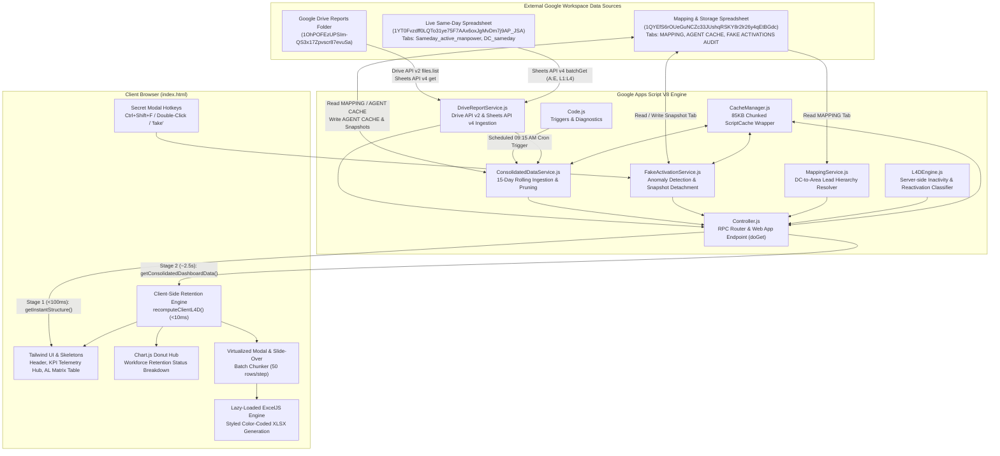
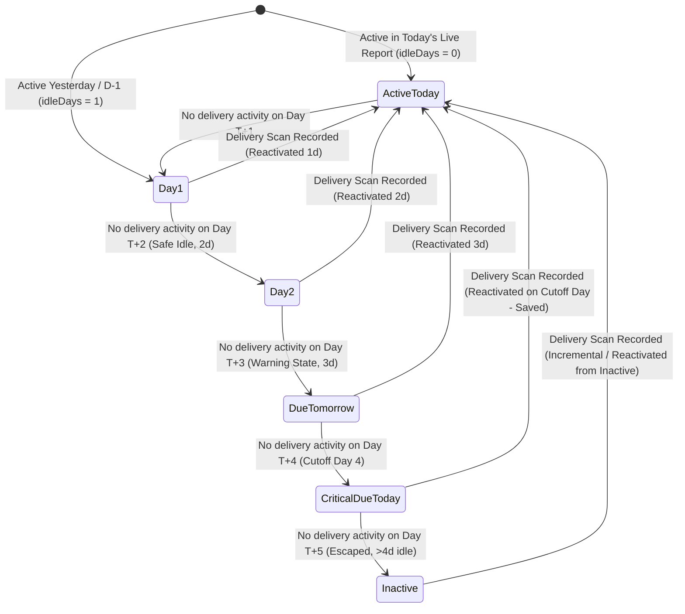
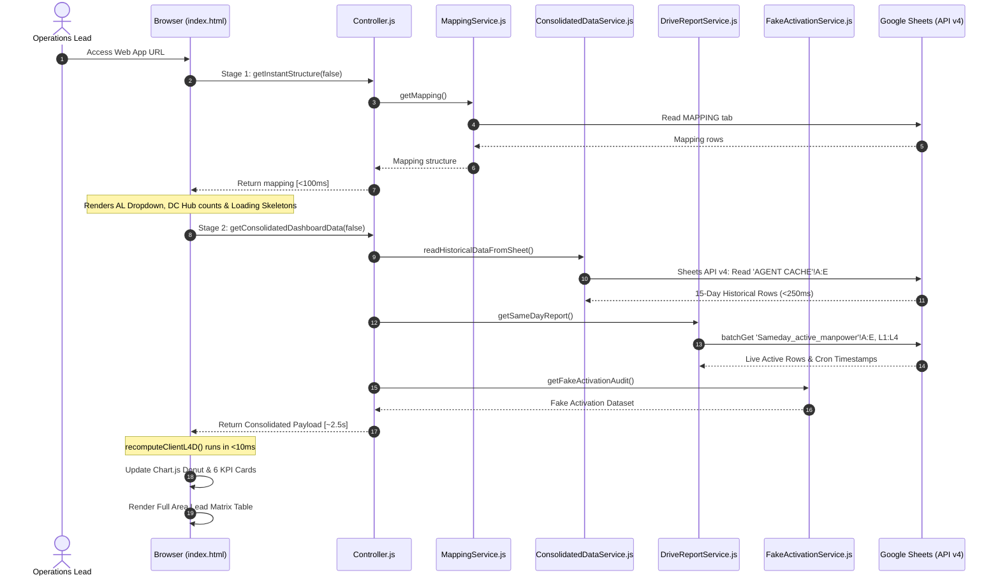
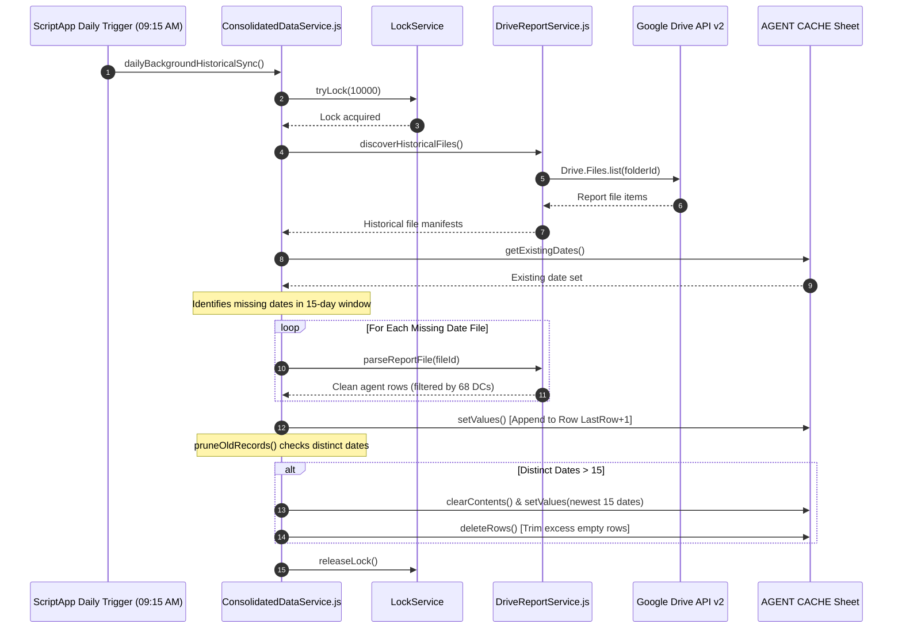

## 1. Overview
The **L4D Inactivity Engine & Roster Dashboard** (also designated in Google Apps Script as `live l4d test` and `L4D Agent Retention Console`) is an enterprise operations console and algorithmic workforce retention engine developed for Myntra Logistics manpower operations.

### The Operational Problem
Last-mile delivery networks suffer from high rider/Wishmaster attrition, unannounced absenteeism, and sudden inactive drops. When delivery associates go inactive for 1 to 4+ consecutive days, delivery capacity collapses, leading to customer delivery breaches and delayed delivery runs. Furthermore, manual roster checking fails to detect fraudulent or synthetic scan events (*Fake Activations*), where associates register superficial scans without performing actual deliveries to reset their inactivity counters.

### The Architectural Solution
The system tracks daily attendance records across a rolling 15-day observation window, classifies delivery riders across four critical stages of last-4-days (L4D) inactivity, detects synthetic or fraudulent scan events (*Fake Activations*), and delivers real-time telemetry to Area Leads (ALs) and Cluster Leads (CLs). Operating as a high-performance Google Apps Script web application backed by Google Drive and Google Sheets, it ingests multi-source historical delivery reports alongside live intraday delivery trackers, serving sub-second dashboard interactions through a two-stage progressive asynchronous data pipeline and client-side V8 retention evaluation.

## 2. Tech Stack

| Layer | Technology | Version | Notes |
| :--- | :--- | :--- | :--- |
| **Runtime Environment** | Google Apps Script (V8) | V8 (`appsscript.json#L22`) | Modern JavaScript execution engine with ES6+ classes, arrow functions, and native Set/Map support. |
| **CLI & Project Tooling** | `@google/clasp` | Unknown / not documented | Used for local development, code cloning, and script version deployment (`.clasp.json#L1-16`). |
| **Advanced Google Services** | Google Drive API | v2 (`appsscript.json#L8`) | Batch folder file listing (`Drive.Files.list`) delivering sub-200ms folder scans (`DriveReportService.js#L20-53`). |
| **Advanced Google Services** | Google Sheets API | v4 (`appsscript.json#L13`) | Direct range batch extraction (`Sheets.Spreadsheets.Values.get` / `batchGet`) in <250ms (`ConsolidatedDataService.js#L185-196`). |
| **Persistence / Relational Store**| Google Sheets | Cloud SaaS | Multi-tab spreadsheet database: `MAPPING`, `AGENT CACHE`, `FAKE ACTIVATIONS AUDIT`, and live tracker sheets. |
| **Object / Report Store** | Google Drive | Cloud SaaS | Reports directory (`1OhPOFEzUPSIm-QS3x17Zpvscr87evuSa`) storing daily conversion summary workbooks. |
| **Caching Layer** | Google Apps Script `CacheService` | Native Platform API | Script-level cache with custom 85KB chunking engine to bypass the 100KB per-item quota (`CacheManager.js#L14-74`). |
| **Metadata & State Store** | Google Apps Script `PropertiesService`| Native Platform API | `ScriptProperties` storing fake activation audit metadata (`FakeActivationService.js#L235-242`). |
| **Concurrency Control** | Google Apps Script `LockService` | Native Platform API | Script-level mutual exclusion lock (`tryLock(10000)`) preventing overlapping ingestion cron runs (`ConsolidatedDataService.js#L259-266`). |
| **Trigger Scheduling** | Google Apps Script `ScriptApp` | Native Platform API | Time-driven daily trigger at 09:15 AM IST for automated D-1 historical ingestion (`Code.js#L58-76`). |
| **Client UI Framework** | Vanilla HTML5 / ES6+ JavaScript | Modern Browser DOM | Single-page console application with virtual scroll rendering, modal inspectors, and slide-overs (`index.html#L1-3455`). |
| **CSS Utility Engine** | Tailwind CSS | JIT / CDN | Injected via CDN (`https://cdn.tailwindcss.com`) with custom font extensions (`index.html#L8,L16-27`). |
| **Data Visualization** | Chart.js | CDN (Deferred) | Donut telemetry visualization of workforce retention distribution (`index.html#L10,L1572-1614`). |
| **Export Generation Engine** | ExcelJS & SheetJS | `exceljs@4.4.0` / `xlsx@0.18.5` | Asynchronously lazy-loaded on user export demand for formatted `.xlsx` generation (`index.html#L2119-2132`). |
| **Observability & Logging** | Google Cloud Stackdriver Logging | Native GCP Logging | Configured via `"exceptionLogging": "STACKDRIVER"` (`appsscript.json#L21`) with server-side `Logger.log()`. |

## 3. Architecture

### High-Level Architecture Overview
The system bridges static historical delivery summaries stored as Google Drive files and dynamic intra-day delivery records stored in Google Sheets into a consolidated operational view. The architecture separates ingestion, normalization, retention computation, and presentation into decoupled services:

1. **Ingestion & Storage Layer:**
   - **Historical Ingestion:** `DriveReportService.js` scans the target Drive folder using Google Drive API v2 (`Drive.Files.list`) to discover daily finalized reports (`Conversion_Summary_D-1_Report_*`). `ConsolidatedDataService.js` parses the report workbooks via Sheets API v4, filters rows against an allowed 68-distribution-center whitelist (`APP_CONFIG.ALLOWED_SOURCE_DCS`), normalizes varied date representations into ISO `YYYY-MM-DD`, and appends deduplicated rows to the `AGENT CACHE` sheet tab.
   - **Rolling Retention Pruning:** To maintain high sheet performance and prevent row bloat, `ConsolidatedDataService.pruneOldRecords()` enforces an automatic 15-day retention window (`APP_CONFIG.RETENTION.WINDOW_DAYS = 15`), purging historical data older than 15 distinct dates in memory before rewriting the sheet atomically.
   - **Intraday Live Tracker:** `DriveReportService.fetchSameDayFromLiveSheet()` establishes a sub-second connection to the live manpower tracker spreadsheet (`SPREADSHEET_ID_SAMEDAY`), reading today's active scans (`Sameday_active_manpower`) along with cron execution timestamps from cell range `L1:L4`.

2. **Classification & Audit Engines:**
   - **L4D Inactivity Engine:** Implemented both in GAS (`L4DEngine.js`) and within the browser (`index.html#L1067-1360`). It indexes all unique Casper IDs across the retention window, determines the most recent active date ($T_{latest}$) and the preceding active date ($T_{prev}$), and computes elapsed idle days relative to the reference date. Riders are categorized into distinct operational states: Active Today, Safe Idle (1–2 days), Due Tomorrow (3 days idle), Critical Due Today (4 days idle / cutoff), and Inactive (>4 days idle / escaped).
   - **Fake Activation Engine:** `FakeActivationService.js` identifies riders who appear active in today's intra-day tracker without any recorded activity on D-1. When the intra-day tracker shares the date of the latest finalized historical report, it computes a live audit. When the intra-day tracker transitions to a new calendar day, the service detaches and freezes the audit snapshot into the `FAKE ACTIVATIONS AUDIT` sheet tab and `ScriptProperties`.

3. **Multi-Stage Progressive Controller & Client UI:**
   - `Controller.js` exposes a two-stage Remote Procedure Call (RPC) architecture to `index.html`. Stage 1 (`getInstantStructure`) executes in <100ms, returning the Area Lead mapping structure to render table skeletons and navigation filters immediately. Stage 2 (`getConsolidatedDashboardData`) fetches the full 15-day consolidated historical dataset, live intra-day records, and fake activation snapshots in ~2.5s.
   - In `index.html`, client-side V8 algorithms recalculate retention matrices in <10ms upon data receipt, enabling instant search, multi-column sorting, Area Lead filtering, and virtualized chunk rendering (50 rows per batch) without triggering subsequent server RPC round-trips.

### System Architecture Diagram



### Rider Inactivity State Lifecycle



## 4. Folder & File Structure

```
l4d_dashboard/
├── .clasp.json                  # Clasp configuration mapping scriptId, root directory, and file push filters
├── appsscript.json              # Apps Script manifest declaring V8 runtime, timezone, Drive v2/Sheets v4, scopes
├── Config.js                    # APP_CONFIG constants: Spreadsheet IDs, Folder IDs, 68 DC whitelist, retention rules
├── Code.js                      # Root entry points, daily 09:15 AM trigger installation, diagnostic pipelines
├── Controller.js                # Web app entry point (doGet), Stage 1/Stage 2 RPC endpoints, sync controllers
├── L4DEngine.js                 # Algorithmic inactivity classifier, attendance matrix, and hub aggregations
├── ConsolidatedDataService.js   # Rolling historical master storage manager, sheet formatting, incremental sync, pruning
├── FakeActivationService.js     # Synthetic activation audit engine, transition date detection, snapshot detachment
├── DriveReportService.js        # Drive report discovery, regex filename parser, Drive v2/Sheets v4 batch reader
├── MappingService.js            # Distribution center to Area Lead / Cluster Lead hierarchy parser and cache
├── CacheManager.js              # Resilient ScriptCache wrapper supporting 85KB payload chunking
└── index.html                   # Single-page dashboard UI, Chart.js donut, virtualized modal, client engine, XLSX export
```

> [!note] File Extension Convention Note
> Files in the primary developer workspace `C:\Users\User\Desktop\L4D Dashboard` carry `.gs` extensions (`Code.gs`, `Controller.gs`, etc.), while the remote clone repository at `remote_clones\l4d_dashboard` uses `.js` extensions. Clasp automatically synchronizes both to the remote Google Apps Script container.

## 5. Core Modules & Responsibilities

### `Config.js`
- **Purpose:** Centralizes all configuration settings, external entity IDs, column name regex matchers, caching limits, and regional distribution center whitelists.
- **Key Objects:**
  - `APP_CONFIG` (`Config.js#L7-73`): Master configuration dictionary.
    - `SPREADSHEET_ID_MAPPING`: `'1QYEfS6rOUeGuNCZc33JUshqRSKY8r2lr26y4qEtBGdc'` (`Config.js#L9`).
    - `SPREADSHEET_ID_SAMEDAY`: `'1YT0Fvzdff0LQTo31ye75F7AAx6oxJgMvDm7j9AP_JSA'` (`Config.js#L10`).
    - `DRIVE_FOLDER_ID_REPORTS`: `'1OhPOFEzUPSIm-QS3x17Zpvscr87evuSa'` (`Config.js#L11`).
    - `SHEETS`: Tab matchers for `MAPPING`, `AGENT CACHE`, `Sameday_active_manpower`, `DC_sameday`, and variations of `agent_view` (`Config.js#L14-20`).
    - `ALLOWED_SOURCE_DCS`: Array of 68 3-letter North region distribution center codes (e.g., `ALG`, `AYP`, `DEO`, `JHS`, `KNP`, `NDL`, `JAI`, `GUR`, `WDL`, `LKO`, `GZB`, `FAR`, `DRD`, `LDH`, etc.) (`Config.js#L23-38`).
    - `RETENTION`: `WINDOW_DAYS = 15`, `AUTO_PRUNE_ENABLED = true` (`Config.js#L41-44`).
    - `HEADERS`: Flexible regular expression matchers for header resolution: `MENSA_AL`, `SOURCE_DC`, `MINI_DC`, `AGENT_NAME`, `CASPER_ID`, `DATE` (`Config.js#L47-54`).
    - `SAMEDAY_FILENAME_REGEX`: `/conversion_summary_sameday/i` (`Config.js#L57`).
    - `HISTORICAL_REPORT_DATE_REGEX`: `/Report_(\d{1,2})[-_](\d{1,2})[-_](\d{4})/i` (`Config.js#L58`).
    - `CACHE`: `ENABLED: true`, `MAPPING_TTL_SEC: 1800` (30m), `FULL_DATA_TTL_SEC: 300` (5m), `DAILY_REPORT_TTL_SEC: 21600` (6h) (`Config.js#L63-68`).
- **Depends on:** Nothing (pure configuration object).
- **Depended on by:** Every backend module (`Controller.js`, `ConsolidatedDataService.js`, `DriveReportService.js`, `FakeActivationService.js`, `L4DEngine.js`, `MappingService.js`, `CacheManager.js`).
- **Notable logic / gotchas:**
  - The `ALLOWED_SOURCE_DCS` list acts as a strict operational boundary; any agent whose delivery hub prefix does not match one of these 68 codes is dropped during ingestion (`ConsolidatedDataService.js#L233-236`, `DriveReportService.js#L455-458`).

---

### `Code.js`
- **Purpose:** Houses developer diagnostic runners, one-click sheet schema initializers, and time-driven trigger installation routines.
- **Key functions:**
  - `testPipeline()` (`Code.js#L7-18`): Diagnostic harness that verifies Stage 1 structure discovery and fetches the first manifest item chunk.
  - `runInitialConsolidatedSync()` (`Code.js#L24-29`): Ingestion entry point that forces a historical sync across all reports in the Drive folder.
  - `setupFreshAgentCacheHeaders()` (`Code.js#L34-39`): Resets and formats the `AGENT CACHE` sheet with bold dark headers (`#0F172A`) and plain-text (`@`) column constraints.
  - `resyncCleanAgentCache()` (`Code.js#L45-52`): Clears `CacheManager`, formats the `AGENT CACHE` sheet, and performs an initial clean sync of historical files.
  - `setupDailySyncTrigger()` (`Code.js#L58-76`): Idempotently inspects existing script triggers, removes any prior `dailyBackgroundHistoricalSync` trigger, and registers a new time-driven trigger scheduled daily at 09:15 AM IST (`Config.TIMEZONE`).
  - `dailyBackgroundHistoricalSync()` (`Code.js#L81-89`): Target execution function invoked by the daily trigger to ingest yesterday's report (`ConsolidatedDataService.syncMissingHistoricalReports(false)`).
- **Depends on:** `ConsolidatedDataService.js`, `CacheManager.js`, `Config.js`, `Controller.js`.
- **Depended on by:** Google Apps Script trigger infrastructure and developers running administrative scripts.
- **Notable logic / gotchas:**
  - Trigger execution is scheduled specifically for 09:15 AM IST because upstream corporate pipeline jobs generate and drop daily conversion summary reports into Google Drive between 07:00 AM and 09:00 AM IST (`Code.js#L56`).

---

### `Controller.js`
- **Purpose:** Serves the HTML frontend and routes client-side Remote Procedure Calls (RPC) to internal backend services.
- **Key functions:**
  - `doGet(e)` (`Controller.js#L7-12`): Web app entry point. Evaluates `index.html`, sets title to `'L4D Agent Retention Console'`, applies mobile viewport meta tag, and enables frame embedding with `XFrameOptionsMode.ALLOWALL`.
  - `getInstantStructure(forceRefresh)` (`Controller.js#L18-33`): Stage 1 RPC (<100ms). Reads and returns the Area Lead mapping structure to allow the frontend to render table skeletons immediately.
  - `getConsolidatedDashboardData(forceRefresh)` (`Controller.js#L40-151`): Stage 2 RPC (~2.5s). Loads 15 days of historical data from `AGENT CACHE`, triggers smart auto-sync if yesterday's report is missing, queries the live intra-day report, evaluates fake activations, and compiles a date manifest.
  - `syncConsolidatedData(forceRefresh)` (`Controller.js#L156-172`): Clears cache and executes incremental sync of missing historical reports.
  - `getInitialStructure(forceRefresh)` (`Controller.js#L178-201`): Alternative discovery RPC scanning Drive folder manifests directly.
  - `fetchReportChunk(fileId, dateStr, isSameDay, forceRefresh)` (`Controller.js#L206-226`): Fetches and parses a single report file chunk with dedicated caching.
  - `getL4DData(forceRefresh)` (`Controller.js#L231-278`): Full-sync fallback endpoint parsing all manifest files synchronously and executing `L4DEngine.processL4DData()`.
  - `clearAppCache()` (`Controller.js#L280-283`): Flushes all script-level cache keys via `CacheManager.clearAll()`.
- **Depends on:** `MappingService.js`, `ConsolidatedDataService.js`, `DriveReportService.js`, `FakeActivationService.js`, `L4DEngine.js`, `CacheManager.js`, `Config.js`.
- **Depended on by:** `index.html` (invoked via `google.script.run`).
- **Notable logic / gotchas:**
  - `getConsolidatedDashboardData()` features a "Smart Auto-Sync" check (`Controller.js#L71-84`). If `AGENT CACHE` is empty or its latest date is older than yesterday, it automatically triggers Drive ingestion during user page load, protected by a 300-second cache debounce key (`DRIVE_SYNC_CHECK_${yesterdayStr}`).

---

### `L4DEngine.js`
- **Purpose:** Core server-side algorithmic retention engine classifying rider inactivity ranges, tracking attendance continuity, and aggregating hub telemetry.
- **Key functions:**
  - `processL4DData(rawEntries, dcToAlMap, hasSameDay, datesProcessed, referenceDate)` (`L4DEngine.js#L12-268`):
    - *Step 1:* Groups raw row entries by `casperId` into a `Map()`, compiling unique active date sets and sorted date lists (`L4DEngine.js#L16-47`).
    - *Step 2:* Iterates over grouped agents, sorting active dates descending. Calls `analyzeRetentionAndInactivity()` using latest date ($T_{latest}$) and previous date ($T_{prev}$) (`L4DEngine.js#L52-98`).
    - *Step 3:* Maps distribution centers to Area Leads and computes aggregate metrics for each DC and AL (`L4DEngine.js#L100-236`).
    - *Step 4:* Compiles `globalStats` dictionary tracking total DCs, ALs, active riders, L4D pool, reactivated counts, and due statuses (`L4DEngine.js#L238-267`).
  - `analyzeRetentionAndInactivity(today, latestDate, prevDate, daysAgoLatest, daysAgoPrev, hasSameDay)` (`L4DEngine.js#L285-466`):
    - Core classification switch based on elapsed days ($d = \text{calculateDaysAgo}(today, T_{latest})$).
    - If $d = 0$: Evaluates gap to previous date. Gap $\le 0 \rightarrow$ Active; gap $= 1 \rightarrow$ Reactivated (1d idle); gap $= 2 \rightarrow$ Reactivated (2d idle); gap $= 3 \rightarrow$ Reactivated on Cutoff Day (saved); gap $> 3 \rightarrow$ Incremental / New (`L4DEngine.js#L288-377`).
    - If $d = 1$: `DAY_1` (`L4DEngine.js#L378-402`).
    - If $d = 2$: `DAY_2` (`L4DEngine.js#L403-427`).
    - If $d = 3$: `DUE_TOMORROW` (Need Activation Tomorrow) (`L4DEngine.js#L428-439`).
    - If $d = 4$: `DUE_TODAY` (Critical Due Today - Day 4 Cutoff) (`L4DEngine.js#L440-451`).
    - If $d \ge 5$: `INACTIVE` (>4d idle / escaped) (`L4DEngine.js#L452-465`).
  - `getFormattedOffsetDate(refDate, daysBack)` (`L4DEngine.js#L468-472`): Calculates and returns formatted `d-MMM` string offset from reference date.
  - `calculateDaysAgo(refDate, targetDate)` (`L4DEngine.js#L474-479`): Computes calendar day difference rounded to midnight.
  - `parseDate(val)` (`L4DEngine.js#L481-497`): Converts strings, timestamps, or Date objects into clean Date instances.
- **Depends on:** `Config.js`, `MappingService.js`.
- **Depended on by:** `Controller.js` (used in fallback `getL4DData`).
- **Notable logic / gotchas:**
  - Inactivity range calculation strictly differentiates between live Same-Day mode (`hasSameDay = true`) and D-1 historical mode (`hasSameDay = false`). In D-1 mode, the reference anchor is yesterday's report, and today's date is guaranteed never to appear in inactive date ranges (`L4DEngine.js#L271-284,L379-391`).

---

### `ConsolidatedDataService.js`
- **Purpose:** Manages the rolling historical master sheet (`AGENT CACHE`), handling schema creation, date normalization, idempotent ingestion, and automatic 15-day pruning.
- **Key functions:**
  - `getOrCreateConsolidatedSheet()` (`ConsolidatedDataService.js#L17-65`): Locates or creates the `AGENT CACHE` sheet tab, establishing headers `['Date', 'Casper_ID', 'Agent_Name', 'Source_DC', 'Mini_DC', 'Ingested_At']`, setting column widths, freezing row 1, and applying `@` (Plain Text) number formatting.
  - `resetAndFormatCacheSheet()` (`ConsolidatedDataService.js#L70-90`): Clears and reconstructs the `AGENT CACHE` tab with pristine headers and plain-text formatting.
  - `normalizeDate(raw)` (`ConsolidatedDataService.js#L97-138`): Multi-pattern date normalizer supporting ISO (`YYYY-MM-DD`), named month (`DD-MMM-YYYY` e.g., `03-Sep-2026`), numeric (`DD-MM-YYYY` / `DD/MM/YYYY`), and Date instances.
  - `getExistingDates(sheet)` (`ConsolidatedDataService.js#L145-156`): Returns a `Set<string>` of distinct dates already stored in column A of the sheet.
  - `readHistoricalDataFromSheet(sheet)` (`ConsolidatedDataService.js#L178-251`): High-speed reader. Uses Google Sheets API v4 (`Sheets.Spreadsheets.Values.get`) for sub-250ms matrix extraction, falling back to `sheet.getDataRange().getValues()`. Filters rows against `ALLOWED_SOURCE_DCS` and groups records by date into `{ [dateStr]: Array<Agent> }`.
  - `syncMissingHistoricalReports(forceRefresh)` (`ConsolidatedDataService.js#L258-379`): Synchronizes Drive reports into `AGENT CACHE`.
    - Obtains a script lock via `LockService.getScriptLock().tryLock(10000)` to eliminate race conditions.
    - Scans Drive files via `DriveReportService.discoverHistoricalFiles()`.
    - Filters files to only include dates within the latest 15-day window that are missing from the sheet.
    - Enforces defensive checks preventing any same-day file (`conversion_summary_sameday`) from entering `AGENT CACHE` (`ConsolidatedDataService.js#L294-298`).
    - Appends new records cleanly at the bottom (`currentLastRow + 1`), preserving sheet styles.
    - Triggers `pruneOldRecords(sheet)` if retention pruning is enabled.
  - `pruneOldRecords(sheet)` (`ConsolidatedDataService.js#L387-491`): In-memory retention pruner. Collects all distinct dates, sorts them descending, keeps the newest 15 dates, filters rows in memory, performs an atomic single-batch rewrite of the sheet, and trims excess blank rows.
- **Depends on:** `Config.js`, `DriveReportService.js`, `MappingService.js`, `CacheManager.js`.
- **Depended on by:** `Controller.js`, `Code.js`.
- **Notable logic / gotchas:**
  - Date-based in-memory pruning eliminates any dependency on physical row order. Regardless of where rows were appended, only records corresponding to the newest 15 dates are retained (`ConsolidatedDataService.js#L427-455`).

---

### `FakeActivationService.js`
- **Purpose:** Detects, audits, freezes, and serves "Fake Activations" — instances where riders appear active in intra-day delivery scans without being active on D-1.
- **Key functions:**
  - `getFakeActivationAudit(historicalByDate, sameDayReport, forceRefresh, ssInstance)` (`FakeActivationService.js#L19-81`): Orchestrates evaluation based on report date alignment:
    - *Condition A (Active Transition Window):* Same-Day date equals latest D-1 report date. Computes live audit and executes `saveSnapshot()` (`FakeActivationService.js#L28-45`).
    - *Condition B (Date Transition / Next Day):* Same-Day date moves past D-1 date. Detaches from live data and serves the frozen snapshot via `getSavedSnapshot()` (`FakeActivationService.js#L47-60`).
    - *Fallback:* Computes audit against latest available historical baseline (`FakeActivationService.js#L61-72`).
  - `computeAudit(historicalByDate, sameDayRows, sameDayDateStr, d1DateStr)` (`FakeActivationService.js#L86-214`): Compiles a `Set` of all Casper IDs active on D-1. For every rider in `sameDayRows`, if their ID is absent from the D-1 set, flags them as an anomaly and determines their previous active date from historical records to assign category codes:
    - `NEW`: Joinee / Incremental with no prior history (`FakeActivationService.js#L150-153`).
    - `IDLE`: Safe idle prior to activation (1–2 days) (`FakeActivationService.js#L182-187`).
    - `IDLE`: Due tomorrow prior to activation (3 days) (`FakeActivationService.js#L176-181`).
    - `CUTOFF`: Activated on Cutoff Day 4 (`FakeActivationService.js#L169-175`).
    - `INACTIVE`: Escaped rider reactivated after >4 days idle (`FakeActivationService.js#L162-168`).
  - `saveSnapshot(computedList, snapshotDate, ssInstance)` (`FakeActivationService.js#L225-251`): Persists audit payload into `CacheManager` (24h TTL), saves summary metadata to `ScriptProperties` (`L4D_FAKE_ACTIVATION_META`), and writes rows to the `FAKE ACTIVATIONS AUDIT` sheet tab.
  - `getSavedSnapshot()` (`FakeActivationService.js#L253-268`): Retrieves frozen snapshot from cache or sheet.
  - `writeSnapshotToSheet(payload, ssInstance)` (`FakeActivationService.js#L270-310`): Clears and populates the `FAKE ACTIVATIONS AUDIT` tab with headers and color-coded rows.
  - `readSnapshotFromSheet()` (`FakeActivationService.js#L312-398`): Reads the `FAKE ACTIVATIONS AUDIT` tab via Sheets API v4 (<200ms) or SpreadsheetApp fallback.
- **Depends on:** `Config.js`, `DriveReportService.js`, `MappingService.js`, `CacheManager.js`.
- **Depended on by:** `Controller.js`.
- **Notable logic / gotchas:**
  - The snapshot detachment mechanism prevents an operational artifact where a dashboard left open overnight recalculates fake activations against an incomplete morning dataset, ensuring supervisors retain an immutable audit of yesterday's anomalies (`FakeActivationService.js#L47-60`).

---

### `DriveReportService.js`
- **Purpose:** High-speed file discovery in Google Drive, regex-based filename date extraction, and dual-strategy parsing for Drive reports and live intra-day sheets.
- **Key functions:**
  - `listDriveFolderFiles(folderId)` (`DriveReportService.js#L14-81`): Scans Google Drive folder. Primary strategy executes Google Drive API v2 (`Drive.Files.list`) returning file ID, title, and modified date in <200ms; falls back to `DriveApp.getFolderById()`.
  - `discoverManifest(referenceDate)` (`DriveReportService.js#L88-225`): Fast discovery engine returning report manifests without opening workbooks. Identifies same-day summary files vs historical files, deduplicates by date, and builds priority manifests.
  - `discoverHistoricalFiles(limit)` (`DriveReportService.js#L232-279`): Discovers and deduplicates all finalized D-1 report files in Drive, explicitly rejecting same-day files.
  - `fetchSameDayFromLiveSheet(spreadsheetId)` (`DriveReportService.js#L286-505`): Connects directly to the live tracker spreadsheet (`SPREADSHEET_ID_SAMEDAY`).
    - Uses Sheets API v4 `batchGet` to query data range `Sameday_active_manpower!A:E` and metadata range `Sameday_active_manpower!L1:L4` in <300ms (`DriveReportService.js#L302-317`).
    - Extracts cron metadata from `L1:L4` (L2: Last Updated timestamp, L4: Cron slot e.g., "18 hrs") (`DriveReportService.js#L358-374`).
    - Extracts 3-letter Source DC codes from mini-DC strings (handling hyphenated formats like `NDL-NRL` $\rightarrow$ `NDL`) and filters against `ALLOWED_SOURCE_DCS` (`DriveReportService.js#L442-458`).
  - `getSameDayReport(forceRefresh)` (`DriveReportService.js#L512-584`): Primary entry point for intra-day data. Queries live spreadsheet first; falls back to searching Drive folder for `conversion_summary_sameday`.
  - `parseReportFile(fileOrId, defaultDateStr, isSameDay)` (`DriveReportService.js#L622-692`): Opens report workbooks. Primary strategy uses Sheets API v4 to inspect sheet titles, locate the `agent_view` tab, and extract cell values; falls back to `SpreadsheetApp.openById()`.
  - `extractAgentRowsFromValues(data, defaultDateStr, isSameDay)` (`DriveReportService.js#L726-810`): Inspects header rows using fuzzy and exact keyword matching (`findColumnIndex`) to extract `casperId`, `name`, `sourceDC`, `miniDC`, and activity date.
  - `extractDateFromFilename(filename)` (`DriveReportService.js#L852-926`): Extracts date from report filenames using tiered regex rules:
    1. Text immediately following `"Report_"` (`Report_(\d{1,2})[-_](\d{1,2})[-_](\d{4})` or `Report_(\d{4})[-_](\d{1,2})[-_](\d{1,2})`).
    2. ISO format (`YYYY-MM-DD`).
    3. Standard numeric fallback (`DD-MM-YYYY`).
    4. Named month fallback (`DD-MMM-YYYY`).
  - `parseDateString(val)` (`DriveReportService.js#L928-965`): Robust string date parser.
- **Depends on:** `Config.js`, `CacheManager.js`, `MappingService.js`.
- **Depended on by:** `Controller.js`, `ConsolidatedDataService.js`, `FakeActivationService.js`.
- **Notable logic / gotchas:**
  - Filename date extraction specifically isolates the date immediately following `"Report_"` (`DriveReportService.js#L855-865`). In filenames such as `Conversion_Summary_D-1_Report_06-09-2026_07-Sep-2026`, `06-09-2026` represents the actual operational report date, whereas `07-Sep-2026` is merely the timestamp when the cron generated the file.

---

### `MappingService.js`
- **Purpose:** Resolves the management hierarchy by mapping 3-letter distribution centers to Area Leads and Cluster Leads.
- **Key functions:**
  - `getMapping(forceRefresh)` (`MappingService.js#L14-29`): Reads hierarchy mapping with script cache support (`MAPPING_CACHE`, 30-minute TTL).
  - `fetchFromOpenSpreadsheet(ss)` (`MappingService.js#L36-51`): Fast parser reading the `MAPPING` tab from an already open spreadsheet instance.
  - `fetchFromSpreadsheet()` (`MappingService.js#L56-99`): Primary fetcher using Sheets API v4 (`'MAPPING'!A:E`) in <200ms, with `SpreadsheetApp.openById` fallback.
  - `parseMappingFromValues(data, sheetName)` (`MappingService.js#L101-135`): Resolves column indices for `SOURCE_DC` and `MENSA_AL` and deduplicates `(AL, DC)` pairs.
  - `getDcToAlLookupMap()` (`MappingService.js#L159-175`): Returns a lowercase lookup `Map<string, string>` mapping Source DC codes to Area Lead names.
- **Depends on:** `Config.js`, `CacheManager.js`.
- **Depended on by:** `Controller.js`, `L4DEngine.js`, `ConsolidatedDataService.js`, `FakeActivationService.js`, `DriveReportService.js`.
- **Notable logic / gotchas:**
  - If header matchers fail to find explicit columns for `SOURCE_DC` and `MENSA_AL`, the parser falls back to positional indexing: column 0 = Source DC, column 1 = Area Lead (`MappingService.js#L108-110`).

---

### `CacheManager.js`
- **Purpose:** Manages caching via `CacheService.getScriptCache()`, implementing chunking to circumvent Apps Script's 100KB per-item cache limit.
- **Key functions:**
  - `get(key)` (`CacheManager.js#L10-43`): Inspects cache for `${key}__meta`. If metadata exists, reads all chunk keys (`${key}__chunk_0..n`) via `cache.getAll()` and reassembles the JSON string. Otherwise, reads single-key cache.
  - `put(key, data, ttlSeconds)` (`CacheManager.js#L45-79`): Serializes data to JSON.
    - If payload exceeds 500KB, skips cache to prevent quota errors (`CacheManager.js#L55-58`).
    - If payload exceeds 85KB (`CHUNK_SIZE = 85000`), splits string into $N$ chunks, stores metadata in `${key}__meta`, and executes `cache.putAll()` (`CacheManager.js#L60-70`).
    - Otherwise, writes standard single-key cache entry.
  - `remove(key)` (`CacheManager.js#L81-98`): Removes metadata key, all chunk keys, and base key.
  - `clearAll()` (`CacheManager.js#L100-111`): Clears all primary application cache keys (`L4D_MAPPING_CACHE`, `L4D_DATA_CACHE`, `L4D_MANIFEST_CACHE`, `L4D_CONSOLIDATED_HISTORICAL_DATA`, `L4D_SAMEDAY_LIVE_DATA`).
- **Depends on:** `Config.js`.
- **Depended on by:** `Controller.js`, `ConsolidatedDataService.js`, `FakeActivationService.js`, `MappingService.js`.
- **Notable logic / gotchas:**
  - Large consolidated datasets (>500KB) bypass `CacheService` entirely and stream directly from Google Sheets API v4, preventing cache truncation exceptions (`CacheManager.js#L55-58`).

---

### `index.html`
- **Purpose:** Single-page operations console (~3,455 lines) delivering real-time retention telemetry, interactive Area Lead matrix tables, virtualized agent rosters, and export capabilities.
- **Key functions & UI Modules:**
  - **Stage 1 & Stage 2 Orchestration:** `startAsyncDataFetch(forceRefresh)` (`index.html#L847-1028`) invokes `getInstantStructure()` for immediate layout rendering, followed by `getConsolidatedDashboardData()` for data hydration.
  - **Client Retention Engine:** `recomputeClientL4D()` (`index.html#L1067-1160`) and `analyzeAgentRetention()` (`index.html#L1168-1360`) mirror the server-side L4D engine in client V8 JavaScript, computing active ranges, idle counts, and reactivation labels in ~10ms.
  - **Telemetry Hub & Chart:** `computeGlobalStats()` (`index.html#L1521-1570`) and `updateDonutChart()` (`index.html#L1572-1614`) render Chart.js donut visualizations and 6 equal-height KPI cards (Active Today, Reactivated, Safe Idle 1-2d, Due Tomorrow, Critical Due Today, Inactive).
  - **Performance Matrix Table:** `renderMainTable()` (`index.html#L1895-1996`) displays Area Lead performance metrics, expanding into child rows for individual delivery hubs.
  - **Detail Modal & Virtual Chunker:** `renderModalTable()` (`index.html#L2513-2565`) and `renderNextModalChunk()` (`index.html#L2567-2652`) render agent roster tables in progressive 50-row DOM chunks on scroll, maintaining smooth 60fps scrolling across 10,000+ records.
  - **Styled Excel Export Engine:** `exportStyledModalToXLSX()` (`index.html#L2677-2866`) and `exportMatrixTableToXLSX()` (`index.html#L2135-2274`) dynamically lazy-load ExcelJS (`exceljs@4.4.0`) via `ensureExportLibraries()`, generating formatted `.xlsx` workbooks with dark navy headers (`#0F172A`), custom column widths, and cell borders.
  - **Secret Fake Activation Trigger:** `handleSecretTrigger()` (`index.html#L3035-3058`), `openFakeActivationModal()` (`index.html#L3080-3130`), and keyboard listener (`index.html#L3061-3078`) open the hidden Fake Activation audit console when a user double-clicks the header, presses `Ctrl+Shift+F` / `Alt+F`, or types `"fake"`, `"l4d"`, or `"audit"`.
- **Depends on:** Tailwind CSS CDN, Chart.js CDN, ExcelJS/SheetJS CDN, Google Apps Script server endpoints.
- **Depended on by:** End-user web browser.

## 6. Data Flow / Key Workflows

### Workflow 1: Initial Page Load & Progressive Two-Stage Rendering
1. The user navigates to the deployed Web App URL. Google Apps Script invokes `doGet(e)` in `Controller.js#L7`, serving `index.html`.
2. Upon DOM load, `index.html` initiates `startAsyncDataFetch(false)` (`index.html#L847`).
3. **Stage 1 (Instant Structure RPC):**
   - The client calls `google.script.run.getInstantStructure(false)` (`Controller.js#L18`).
   - `MappingService.getMapping()` loads the DC-to-AL mapping from cache or `MAPPING` sheet tab (<100ms).
   - The client receives the mapping, initializes Area Lead dropdown filters, and calls `renderMainTable()`, displaying Area Lead names, DC counts, and animated loading skeletons (`index.html#L883-894`).
4. **Stage 2 (Consolidated Data Stream RPC):**
   - The client calls `google.script.run.getConsolidatedDashboardData(false)` (`Controller.js#L40`).
   - `ConsolidatedDataService.readHistoricalDataFromSheet()` loads 15 days of historical delivery records from `AGENT CACHE` in a single Sheets API v4 batch (<250ms).
   - `DriveReportService.getSameDayReport()` queries `Sameday_active_manpower` from the live tracker sheet (<300ms).
   - `FakeActivationService.getFakeActivationAudit()` computes or retrieves the detached fake activation audit.
   - The server packages and returns the consolidated payload (~2.5s).
5. **Client Hydration & Recalculation:**
   - Client executes `recomputeClientL4D()` (`index.html#L1067`), aggregating 5,000+ agent records in <10ms.
   - `renderGlobalKPIs()`, `updateDonutChart()`, and `renderMainTable()` update with finalized numbers.



### Workflow 2: Daily Scheduled Ingestion & Rolling Retention Pruning
1. At 09:15 AM IST daily, Google Apps Script invokes `dailyBackgroundHistoricalSync()` in `Code.js#L81`.
2. The function delegates to `ConsolidatedDataService.syncMissingHistoricalReports(false)` (`ConsolidatedDataService.js#L258`).
3. The service acquires a 10-second script lock via `LockService.getScriptLock().tryLock(10000)` to ensure mutual exclusion.
4. `DriveReportService.discoverHistoricalFiles()` lists all files in the Drive folder using Drive API v2 (`Drive.Files.list`), filtering for filenames matching `Conversion_Summary_D-1_Report_*`.
5. The service cross-references discovered dates against existing dates in `AGENT CACHE` (`ConsolidatedDataService.getExistingDates()`).
6. For missing dates within the 15-day window, `DriveReportService.parseReportFile()` extracts rows from the `agent_view` sheet tab, validating against the 68 allowed distribution centers.
7. Deduplicated rows are appended to the bottom of `AGENT CACHE` in a single batch operation (`sheet.getRange(...).setValues(...)`) with `@` plain-text number formatting.
8. `ConsolidatedDataService.pruneOldRecords(sheet)` reads all stored dates. If the number of distinct dates exceeds 15 (`APP_CONFIG.RETENTION.WINDOW_DAYS`), the oldest dates are pruned in memory, and the retained 15 days are rewritten atomically to the sheet.
9. `CacheManager.remove('L4D_CONSOLIDATED_HISTORICAL_DATA')` invalidates cached records, and the script lock is released.



### Workflow 3: Fake Activation Audit Detection & Detachment
1. During Stage 2 data loading, `Controller.js` calls `FakeActivationService.getFakeActivationAudit()`.
2. The service checks date alignment between the live intra-day report (`sameDayReport.dateStr`) and the newest date in `AGENT CACHE` (`latestHistDateStr`):
   - **Scenario A (Same-Day == D-1):** Both datasets reference the same operational cycle. The engine executes `computeAudit()`, identifying riders present in today's live scans who were absent on D-1. It calls `saveSnapshot()`, writing the records to the `FAKE ACTIVATIONS AUDIT` sheet tab and updating `CacheManager`.
   - **Scenario B (Same-Day > D-1):** The live report has rolled over to a new calendar day while the D-1 report for yesterday has not landed yet. To prevent false inflation, the engine detaches from live computation and serves the frozen snapshot via `getSavedSnapshot()`.
3. In `index.html`, an authorized supervisor triggers `handleSecretTrigger()` (double-clicking the title or pressing `Ctrl+Shift+F`), opening the Fake Activation Audit Modal (`index.html#L3080`).
4. The supervisor inspects flagged riders across sub-tabs (`All`, `Incrementals/New`, `Escaped >4d`, `Cutoff Day 4`, `Safe Idle`) and exports the audit via `exportFakeActivationsToXLSX()`.

## 7. Configuration & Environment

### Google Apps Script Manifest (`appsscript.json`)
The script manifest (`appsscript.json#L1-27`) defines runtime versions, regional localization, advanced services, and OAuth security scopes:
- **`runtimeVersion`:** `"V8"` (`appsscript.json#L22`) *(stated)*.
- **`timeZone`:** `"Asia/Kolkata"` (`appsscript.json#L2`) *(stated)*.
- **`exceptionLogging`:** `"STACKDRIVER"` (`appsscript.json#L21`) *(stated)*.
- **`webapp.executeAs`:** `"USER_DEPLOYING"` (`appsscript.json#L18`) *(stated)*. Web app runs under the authority of the deploying developer/admin account.
- **`webapp.access`:** `"DOMAIN"` (`appsscript.json#L19`) *(stated)*. Access restricted to authenticated users within the Google Workspace domain.
- **`enabledAdvancedServices`:**
  - `Drive` (v2) (`appsscript.json#L6-9`) *(stated)*.
  - `Sheets` (v4) (`appsscript.json#L11-14`) *(stated)*.
- **`oauthScopes`:**
  - `https://www.googleapis.com/auth/drive` (`appsscript.json#L24`) *(stated)*.
  - `https://www.googleapis.com/auth/spreadsheets` (`appsscript.json#L25`) *(stated)*.

### Application Configuration Dictionary (`Config.js`)

| Key | Value / Expression | Purpose |
| :--- | :--- | :--- |
| `SPREADSHEET_ID_MAPPING` | `'1QYEfS6rOUeGuNCZc33JUshqRSKY8r2lr26y4qEtBGdc'` | Google Sheet hosting `MAPPING`, `AGENT CACHE`, and `FAKE ACTIVATIONS AUDIT` tabs. |
| `SPREADSHEET_ID_SAMEDAY` | `'1YT0Fvzdff0LQTo31ye75F7AAx6oxJgMvDm7j9AP_JSA'` | Live tracker spreadsheet containing intra-day scan records and cron metadata. |
| `DRIVE_FOLDER_ID_REPORTS` | `'1OhPOFEzUPSIm-QS3x17Zpvscr87evuSa'` | Target Google Drive folder where upstream ETL drops daily report workbooks. |
| `SHEETS.MAPPING_TAB` | `'MAPPING'` | Tab name for DC-to-Area Lead relationships. |
| `SHEETS.CONSOLIDATED_TAB` | `'AGENT CACHE'` | Master consolidated sheet tab holding 15 rolling days of historical attendance. |
| `SHEETS.SAMEDAY_ACTIVE_MANPOWER_TAB` | `'Sameday_active_manpower'` | Live tracker tab containing today's active delivery scans. |
| `SHEETS.DC_SAMEDAY_TAB` | `'DC_sameday'` | Secondary live hub summary tab in the same-day spreadsheet. |
| `SHEETS.AGENT_VIEW_MATCHERS` | `['agent_view', 'agent view', 'd-1 agent_view', 'agent-view', 'agentview']` | Case-insensitive matchers to locate the agent data tab within Drive report workbooks. |
| `ALLOWED_SOURCE_DCS` | Array of 68 3-letter codes (`ALG`, `AYP`, `DEO`, `JHS`, `KNP`, `NDL`, `JAI`, `GUR`, `WDL`, `LKO`, `GZB`, `FAR`, `DRD`, `LDH`, etc.) | Strict distribution center whitelist; non-matching delivery hubs are dropped during ingestion. |
| `RETENTION.WINDOW_DAYS` | `15` | Maximum number of distinct calendar dates retained in `AGENT CACHE`. |
| `RETENTION.AUTO_PRUNE_ENABLED` | `true` | Enables automatic pruning of dates older than 15 days during sync. |
| `CACHE.ENABLED` | `true` | Controls use of Google Apps Script `CacheService`. |
| `CACHE.MAPPING_TTL_SEC` | `1800` (30 minutes) | Expiration TTL for Area Lead mapping data. |
| `CACHE.FULL_DATA_TTL_SEC` | `300` (5 minutes) | Expiration TTL for full consolidated dataset cache. |
| `CACHE.DAILY_REPORT_TTL_SEC` | `21600` (6 hours) | Expiration TTL for immutable single-day report chunks. |
| `TIMEZONE` | `'Asia/Kolkata'` | Default timezone for date string formatting. |
| `DATE_FORMAT` | `'yyyy-MM-dd'` | Standard ISO date format used across sheet rows and cache keys. |

### PropertiesService Storage (`ScriptProperties`)
- **`L4D_FAKE_ACTIVATION_META`** (`FakeActivationService.js#L236`): Serialized JSON object storing snapshot metadata (`snapshotDate`, `savedAt`, `total`) whenever a fake activation audit is frozen.

> [!warning] Hardcoded Resource Identifiers
> Spreadsheet IDs and Google Drive Folder IDs are committed as string literals in `Config.js#L9-11` rather than stored dynamically in `ScriptProperties`. Moving these IDs to `ScriptProperties` is recommended to allow environment reassignment without modifying code.

## 8. External Integrations & APIs

| Integration / Service | Purpose | Auth Method | Location in Code | Rate Limits / Platform Quirks |
| :--- | :--- | :--- | :--- | :--- |
| **Google Drive API v2** | Rapid folder scanning and metadata discovery (`Drive.Files.list`) | OAuth 2.0 (User Deploying) | `DriveReportService.js#L20-53` | Sub-200ms batch listing; subject to Google Workspace Drive API daily quota (20,000 requests/day). |
| **Google DriveApp Service** | Fallback folder traversal and file retrieval (`getFileById`, `searchFiles`) | Built-in Apps Script OAuth | `DriveReportService.js#L59-78,L540-558` | Slower than Drive API v2; used as defensive fallback if Advanced Service is disabled. |
| **Google Sheets API v4** | Sub-250ms batch matrix cell retrieval (`Spreadsheets.Values.get` / `batchGet`) | OAuth 2.0 (User Deploying) | `ConsolidatedDataService.js#L185-196`, `DriveReportService.js#L302-317`, `MappingService.js#L61-69` | High-throughput batch endpoint; bypasses cell-by-cell overhead of `SpreadsheetApp`. |
| **Google SpreadsheetApp** | Sheet formatting, column width setting, range styling, fallback read/write | Built-in Apps Script OAuth | `ConsolidatedDataService.js#L46-62,L335-353`, `FakeActivationService.js#L274-309` | Execution time scales with row count; large writes must be batched (`setValues`) to avoid 6-minute timeout. |
| **Google CacheService** | Distributed in-memory caching across Web App executions | Built-in Apps Script API | `CacheManager.js#L14,L49,L83` | 100KB per-item limit; bypassed by `CacheManager` 85KB chunking engine. Max TTL 21,600s (6h). |
| **Google LockService** | Distributed mutual exclusion lock preventing concurrent ingestion runs | Built-in Apps Script API | `ConsolidatedDataService.js#L259-266` | Script lock wait timeout set to 10,000ms (`tryLock(10000)`). |
| **Google ScriptApp Triggers** | Scheduled time-driven execution of background ingestion jobs | Built-in Apps Script API | `Code.js#L59-73` | Hard limit of 20 installable triggers per script. Trigger timing is approximate ($\pm 15$ minutes). |
| **Tailwind CSS CDN** | Client-side CSS layout and typography styling | Public HTTP GET | `index.html#L8` | Delivered via `https://cdn.tailwindcss.com`. Requires client internet connectivity. |
| **Chart.js CDN** | Client-side interactive donut chart rendering | Public HTTP GET | `index.html#L10` | Loaded asynchronously with `defer` attribute. |
| **ExcelJS & SheetJS CDNs** | In-browser styled `.xlsx` workbook generation | Dynamic async injection | `index.html#L2124,L2127` | Dynamically injected only when user clicks export; falls back to SheetJS if ExcelJS CDN fails. |

## 9. Testing
- **Automated Test Coverage:** `Unknown / not documented`. There are no unit test suites (e.g., Jest, Mocha, Gas-Test) or CI-driven end-to-end tests committed in the repository.
- **Manual Diagnostic Test Routines:**
  - `testPipeline()` (`Code.js#L7-18`): Diagnostic function executable within the Google Apps Script IDE. It runs `getInitialStructure(true)` and attempts to fetch and parse the first manifest file chunk, logging execution timing to the Logger console.
  - `setupFreshAgentCacheHeaders()` (`Code.js#L34-39`): Administrative helper used during testing to verify sheet header creation and formatting.
  - `loadMockFallbackData()` (`index.html#L3414-3454`): Offline testing harness. When `index.html` is opened locally in a web browser without the `google.script.run` environment, it generates 6 mock Area Leads, 12 distribution centers, and 28 simulated agent records, enabling local UI layout testing without connecting to Google Workspace.
- **Known-Fragile Logic Points:**
  - **Filename Regex Variations:** Upstream reporting jobs occasionally alter filename casing or date formats (e.g., switching between `Report_DD-MM-YYYY` and `Report_DD-MMM-YYYY`). `DriveReportService.extractDateFromFilename()` implements a 4-tier regex fallback to mitigate this (`DriveReportService.js#L852-926`).
  - **Header Position Variations:** If an upstream sheet omits header names matching `APP_CONFIG.HEADERS`, the parser falls back to positional index heuristics (`DriveReportService.js#L767-771`).

## 10. CI/CD & Deployment
- **CI/CD Pipelines:** `Unknown / not documented`. No GitHub Actions workflows, GitLab CI configurations, or automated deployment scripts are present.
- **Deployment Mechanism:**
  - Deployment is managed manually via `@google/clasp` (`.clasp.json#L1-16`):
    ```bash
    # Push local code changes to Google Apps Script
    clasp push
    
    # Deploy a new web app version
    clasp deploy --description "Production Release"
    ```
- **Web App Execution Environment:**
  - Configured in `appsscript.json#L17-20`:
    - `executeAs`: `"USER_DEPLOYING"` *(stated)*.
    - `access`: `"DOMAIN"` *(stated)*.
- **Rollback Process:**
  - Rollbacks are performed manually via the Google Apps Script Version History UI ([Project Editor](https://script.google.com/home/projects/1xZ-uN3J6RJ_tYyO0zdTniKcvFMklU2uywcdVof3Lft64YDsVxzZtBWKt/edit)) by deploying a prior version ID, or locally by checking out a previous commit and running `clasp push`.

## 11. Setup & Local Development

### Prerequisites
- Node.js (v16.0.0 or higher recommended)
- Google Cloud / Google Workspace account with edit access to Google Apps Script project `1xZ-uN3J6RJ_tYyO0zdTniKcvFMklU2uywcdVof3Lft64YDsVxzZtBWKt`
- View/Edit permissions on Mapping Spreadsheet (`1QYEfS6rOUeGuNCZc33JUshqRSKY8r2lr26y4qEtBGdc`), Same-Day Spreadsheet (`1YT0Fvzdff0LQTo31ye75F7AAx6oxJgMvDm7j9AP_JSA`), and Drive Folder (`1OhPOFEzUPSIm-QS3x17Zpvscr87evuSa`)
- `@google/clasp` CLI tool installed globally:
  ```bash
  npm install -g @google/clasp
  ```

### Local Setup Steps
1. **Authenticate Clasp with Google Workspace:**
   ```bash
   clasp login
   ```
2. **Clone the Remote Repository:**
   ```bash
   clasp clone 1xZ-uN3J6RJ_tYyO0zdTniKcvFMklU2uywcdVof3Lft64YDsVxzZtBWKt
   ```
3. **Verify Configuration:**
   - Inspect `Config.js` and ensure all Spreadsheet IDs, Folder IDs, and sheet tab names correspond to active workspace documents.
4. **Push Local Modifications to Apps Script:**
   ```bash
   clasp push
   ```
5. **Initialize Sheet Headers & Install Triggers (One-Time Setup):**
   - Open the Apps Script Editor:
     ```bash
     clasp open
     ```
   - In the Apps Script console, select `Code.gs` and execute `setupFreshAgentCacheHeaders()` to initialize the `AGENT CACHE` sheet schema.
   - Execute `setupDailySyncTrigger()` to install the daily 09:15 AM IST background synchronization trigger.
   - Execute `runInitialConsolidatedSync()` to populate the initial 15-day historical dataset from Google Drive.
6. **Local Browser Testing:**
   - Double-click or open `index.html` directly in a browser. It automatically detects the absence of `google.script.run` and loads `loadMockFallbackData()`, allowing interface validation without Google Workspace credentials.

## 12. Security Notes

### OAuth Scopes & Permissions
The script requests two Google OAuth scopes in `appsscript.json#L23-26`:
- `https://www.googleapis.com/auth/drive`: Grants full read and write access to the user's Google Drive.
  > [!warning] Excessive OAuth Privilege Scope
  > The script requests broad `drive` scope permissions rather than restricted scopes such as `https://www.googleapis.com/auth/drive.readonly` or `https://www.googleapis.com/auth/drive.file`. Because the script only reads report files in a specific folder, scoping permissions down to `drive.readonly` is recommended to adhere to the principle of least privilege.
- `https://www.googleapis.com/auth/spreadsheets`: Grants full access to Google Sheets. Necessary for reading raw reports, maintaining `AGENT CACHE`, and writing `FAKE ACTIVATIONS AUDIT` snapshots.

### Attack Surfaces & Authorization Model
- **Domain-Restricted Execution:** The Web App specifies `"access": "DOMAIN"` (`appsscript.json#L19`), preventing unauthenticated public access. Only users authenticated within the organization's Google Workspace domain can load the interface.
- **Execution Authority (`USER_DEPLOYING`):** Configured with `"executeAs": "USER_DEPLOYING"` (`appsscript.json#L18`). All spreadsheet reads and Drive queries execute under the identity and permissions of the deploying administrator. Individual Area Leads and Cluster Leads do not require direct write permissions on the underlying spreadsheets.
- **IFrame Embedding Surface:** `Controller.js#L11` explicitly sets `HtmlService.XFrameOptionsMode.ALLOWALL`. While this allows embedding the dashboard inside internal operations portals or Google Sites, it exposes the application to clickjacking if rendered on unauthorized origins.

### Data Protection & PII Handling
- The application processes logistics personnel data: Rider Full Names, Casper HR IDs (Employee IDs), Delivery Hub assignments, and attendance logs.
- Data is stored within the organization's Google Workspace boundary and transmitted directly over HTTPS via Google's internal RPC channel (`google.script.run`).
- No personally identifiable information is transmitted to third-party tracking services or external analytics endpoints.

### Hidden Operational Features
- **Secret Fake Activation Trigger:** `index.html#L3035-3078` includes undocumented client-side hotkeys (`Ctrl+Shift+F`, `Alt+F`, `Alt+A`, double-clicking UI elements, or typing the string `"fake"`) that reveal the Fake Activation audit modal. While not an authentication bypass (since all data is already loaded in the client payload), it exposes sensitive anomaly detection data intended for managerial oversight.

## 13. Known Issues, Limitations & Tech Debt

### Standing Platform Quotas & Execution Constraints
- **6-Minute Maximum Execution Quota:** Google Apps Script enforces a hard 6-minute execution limit on all trigger and Web App executions *(stated)*. If `ConsolidatedDataService.syncMissingHistoricalReports()` encounters more than 8–10 large Excel workbooks during a single cold-start sync, it risks reaching this limit. The multi-stage async architecture and incremental daily sync mitigate this by parsing only missing daily files.
- **CacheService 100KB Size Limit:** Apps Script's `CacheService` rejects single values exceeding 100KB. `CacheManager.js` mitigates this by chunking payloads into 85KB segments, but completely bypasses caching for payloads exceeding 500KB (`CacheManager.js#L55-58`).
- **Consumer vs Workspace API Caps:** Daily URL fetch and trigger limits differ between consumer and Google Workspace accounts (e.g., Workspace accounts receive 100,000 UrlFetch calls/day and 6 hours total trigger runtime/day).

### Technical Debt & Code Fragility
- **Dual Classification Engine Duplication:** Identical L4D retention logic is implemented twice: once in Google Apps Script (`L4DEngine.js#L285-466`) and once in client-side JavaScript (`index.html#L1168-1360`). Any algorithmic change to idle day thresholds or reactivation labels must be manually synchronized across both files to prevent discrepancies.
- **Hardcoded 68-DC Whitelist:** `APP_CONFIG.ALLOWED_SOURCE_DCS` in `Config.js#L23-38` hardcodes 68 distribution center codes. Onboarding a new distribution center requires modifying source code and executing `clasp push`, rather than updating a configuration row in Google Sheets.
- **In-Memory Sheet Pruning Scalability:** `ConsolidatedDataService.pruneOldRecords()` reads all rows from `AGENT CACHE` into server memory, filters them, clears the sheet, and writes back the retained rows (`ConsolidatedDataService.js#L387-491`). As historical records approach 60,000+ rows, this operation consumes significant memory and execution time.
- **Drive Report File Formatting Dependency:** Ingestion relies on upstream ETL pipelines consistently naming files with `Conversion_Summary_D-1_Report_*` and placing agent attendance data inside an `agent_view` tab. Upstream schema changes can halt historical synchronization.

## 14. Design Decisions & Rationale

- **Direct Google Sheets API v4 over SpreadsheetApp:**
  - *Decision:* Backend services prioritize `Sheets.Spreadsheets.Values.get` and `batchGet` over native `SpreadsheetApp` methods (`ConsolidatedDataService.js#L185-196`, `DriveReportService.js#L302-317`, `MappingService.js#L61-69`). *(stated)*
  - *Rationale:* Native `SpreadsheetApp.getValues()` on a 50,000-row sheet takes 1,200ms–2,500ms and consumes substantial memory. Sheets API v4 batch queries execute directly against the Google Sheets matrix engine in <250ms, keeping RPC latency within responsive thresholds.
- **Two-Stage Progressive Client Hydration:**
  - *Decision:* Split dashboard loading into Stage 1 (<100ms) and Stage 2 (~2.5s) RPC calls (`Controller.js#L18,L40`, `index.html#L883,L901`). *(stated)*
  - *Rationale:* In Google Apps Script, loading 15 days of data in a single blocking `doGet` call results in a blank screen for 3–5 seconds. Stage 1 immediately paints the navigation bar, Area Lead filters, and table skeletons, eliminating perceived loading delay.
- **Client-Side V8 Retention Recalculation:**
  - *Decision:* Perform full agent grouping, inactivity range calculation, and metric aggregation inside the browser (`index.html#L1067-1160`) rather than having the server transmit pre-aggregated tables. *(inferred)*
  - *Rationale:* Transmitting raw agent arrays allows the browser's V8 engine to recalculate metrics across 5,000+ agents in ~10ms. Filtering by Area Lead or searching by rider name happens locally without initiating server round-trips.
- **Idempotent Bottom-Append with Date-Based Pruning:**
  - *Decision:* New historical reports are appended to the bottom of `AGENT CACHE` (`lastRow + 1`) rather than shifting rows, followed by date-set pruning (`ConsolidatedDataService.js#L339-353,L387-491`). *(stated)*
  - *Rationale:* Inserting rows at row 2 causes Google Sheets to shift 50,000 physical rows down, which is computationally expensive and causes rows to inherit dark header formatting. Bottom-appending is fast and stable.
- **Audit Snapshot Detachment Mechanism:**
  - *Decision:* Freeze and persist fake activation datasets into dedicated sheet tabs and script properties when the live report transitions to a new calendar day (`FakeActivationService.js#L47-60`). *(stated)*
  - *Rationale:* When the live intra-day report rolls over to Day $T+1$ while the finalized D-1 report for Day $T$ has not yet landed, calculating live fake activations against Day $T-1$ produces false positives. Detaching and serving the frozen snapshot preserves audit integrity across daily reporting transitions.

## 15. Roadmap / TODOs

- [ ] **Externalize Configuration to ScriptProperties:** Move hardcoded Spreadsheet IDs (`SPREADSHEET_ID_MAPPING`, `SPREADSHEET_ID_SAMEDAY`) and Drive Folder IDs (`DRIVE_FOLDER_ID_REPORTS`) from `Config.js` into Google Apps Script `ScriptProperties` *(inferred from hardcoded values)*.
- [ ] **Dynamic Distribution Center Mapping Tab:** Replace the static 68-DC array in `Config.js#L23-38` with a dedicated sheet tab in `SPREADSHEET_ID_MAPPING` to allow operations leads to onboard new hubs without code changes *(inferred from architecture)*.
- [ ] **Unified Classification Engine via Web Workers:** Consolidate the dual L4D engine implementations into a single JavaScript module shared between server and client web workers *(inferred from code duplication)*.
- [ ] **Automated Ingestion Failure Alerts:** Implement webhook notifications (Google Chat or Slack) in `dailyBackgroundHistoricalSync()` to alert administrators when morning report files fail to land or sync *(inferred from silent logging)*.
- [ ] **Narrow OAuth Scope Requirements:** Replace the broad `https://www.googleapis.com/auth/drive` scope with restricted Drive read scopes (`drive.readonly` or `drive.file`) *(inferred from security review)*.

## 16. Changelog
*No prior note supplied — changelog starts here.*

- **2026-09-18:**
  - Cloned and inspected remote clasp repository `1xZ-uN3J6RJ_tYyO0zdTniKcvFMklU2uywcdVof3Lft64YDsVxzZtBWKt`.
  - Audited high-speed Google Sheets API v4 integration across `ConsolidatedDataService.js`, `DriveReportService.js`, and `MappingService.js`.
  - Documented two-stage progressive async pipeline (`getInstantStructure` <100ms and `getConsolidatedDashboardData` ~2.5s).
  - Documented rolling 15-day retention window and atomic pruning engine in `ConsolidatedDataService.js`.
  - Audited Fake Activation anomaly detection engine, transition boundary handling, and snapshot persistence in `FakeActivationService.js`.
  - Analyzed client-side single-page console in `index.html`, including Chart.js telemetry hub, virtualized table chunking (50 rows/batch), lazy-loaded ExcelJS `.xlsx` exporter, and secret audit hotkeys.
  - Generated initial permanent project memory note.

## 17. Glossary

| Term | Definition |
| :--- | :--- |
| **L4D** | **Last 4 Days**; the operational retention window monitoring rider inactivity over four consecutive days to identify churn before termination. |
| **Wishmaster** | Internal Myntra Logistics terminology designating last-mile delivery riders/field delivery executives. |
| **Casper ID** | Unique employee/rider identification number assigned by the workforce HR management system (e.g., `Casper HR ID`). |
| **Source DC** | Parent/Primary Distribution Center (e.g., `NDL`, `GUR`, `WDL`, `KNP`); represented as a 3-letter regional code. |
| **Mini DC / Sub DC** | Specific sub-delivery hub, mother hub branch, or delivery node under a parent Source DC (e.g., `NDL-NRL`). |
| **Mensa AL** | Mensa Area Lead; operational manager supervising delivery centers and rider rosters across an assigned territory. |
| **Cluster Lead (CL)** | Senior operations manager overseeing multiple Area Leads and regional logistics clusters. |
| **Same-Day Report** | Volatile, intra-day delivery tracking report reflecting live scans, active riders, and package conversions for the current calendar day. |
| **D-1 Report** | Finalized historical attendance report reflecting completed operations for the previous calendar day. |
| **Fake Activation** | An operational anomaly where a rider registers an active scan event on day $T$ without having worked on D-1, often indicating synthetic scan activity or abrupt unscheduled returns. |
| **Incremental (New Joinee)** | A newly onboarded rider appearing in active delivery records with zero prior attendance history within the 15-day tracking window. |
| **Cutoff Day 4 (Due Today)** | Critical retention state where a rider has been inactive for exactly 4 consecutive days and must deliver today to avoid being classified as inactive. |
| **Escaped (>4d Idle)** | A rider inactive for 5 or more consecutive days, categorized as unassigned/churned and dropped from active workforce rosters. |
| **AGENT CACHE** | The consolidated Google Sheets storage tab in `SPREADSHEET_ID_MAPPING` maintaining 15 rolling days of deduplicated historical delivery records. |

## 18. Related Notes
- [[Rules/GAS-Architecture-Index|GAS Architecture Index & Agent Router]] — Authoritative decision matrix and TypeScript Native compilation standard.
- [[Rules/GAS-Webapp-Architecture-Rulebook|GAS Webapp Architecture Rulebook]] — 21-section engineering standard for Native Clasp TypeScript and zero-downtime triggers.
- [[Dashboard|Engineering Second Brain & Project Master Map]] — Central knowledge base index and operational project directory.

---


## 19. Update Instructions (meta)
To refresh or update this project memory document in future runs:
1. Provide this existing document along with the cloned repository files (`remote_clones/l4d_dashboard`).
2. Run the memory generation agent to diff codebase changes against this document.
3. Update Sections 5 through 8 (Core Modules, Workflows, Configuration, External Integrations) to reflect any modified endpoints, sheet IDs, or schema alterations.
4. Update Sections 13 (Known Issues), 14 (Design Decisions), and 15 (Roadmap) based on resolved technical debt or newly added features.
5. Append a new dated entry to Section 16 (Changelog) summarizing code updates, preserving prior log history.
6. Preserve all manual cross-vault links in Section 18 (Related Notes).
