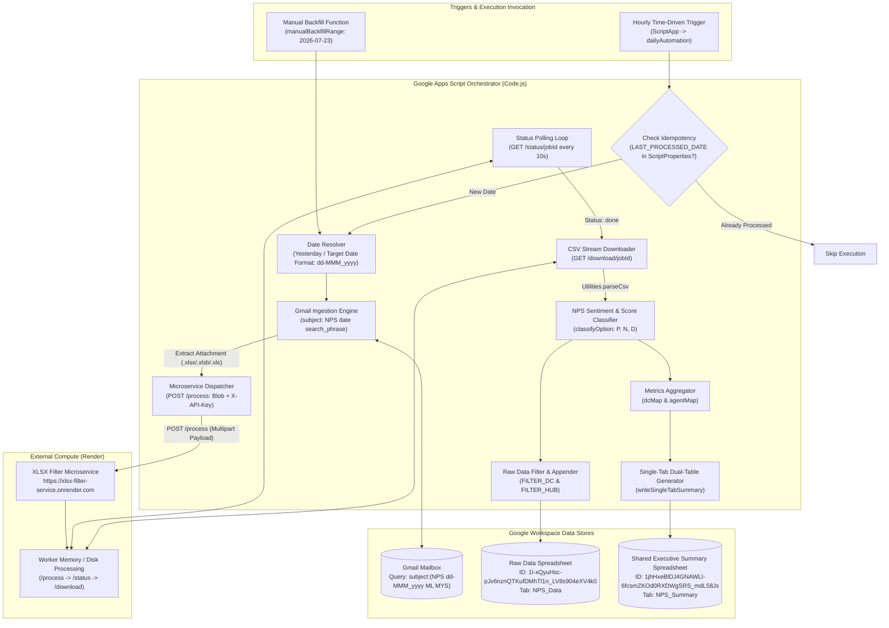
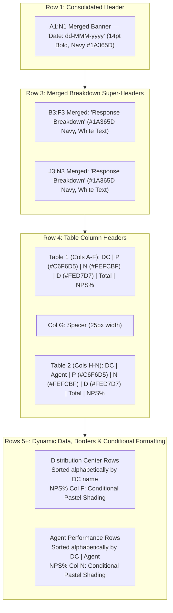
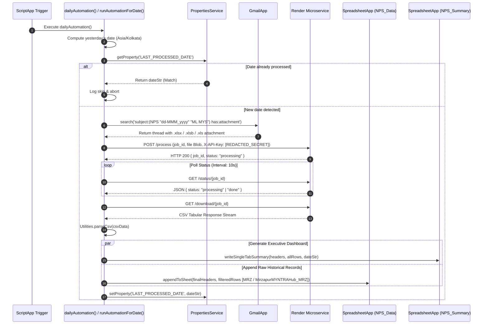
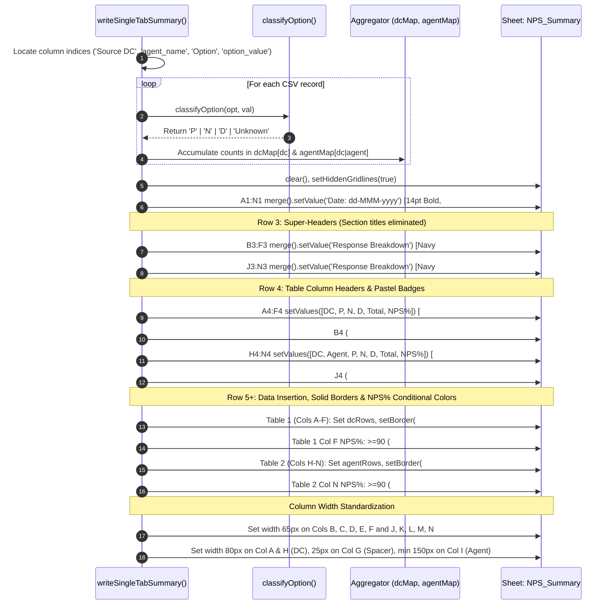

# NPS Performance Calculation Engine

## 1. Overview
**NPS Performance Calculation Engine** is an automated, cloud-integrated customer satisfaction and operational analytics pipeline operating on [[Google Apps Script]] (GAS) under the modern [[V8]] runtime. Built for logistics and supply chain delivery operations, the application automatically ingests daily Net Promoter Score (NPS) customer feedback survey workbooks delivered as Microsoft Excel attachments (`.xlsx`, `.xlsb`, `.xls`) via [[Gmail]].

### The Operational Problem
Customer feedback surveys generate large daily workbooks containing nationwide delivery ratings and free-form sentiment text. Ingesting and analyzing these heavy, multi-sheet workbooks directly within Google Apps Script causes script failures due to the platform's 6-minute execution ceiling and 50 MB memory limit. Additionally, manual extraction of feedback for regional distribution centers (`MRZ`) and hubs (`MirzapurMYNTRAHub_MRZ`) delays customer dissatisfaction resolution and NPS trend reporting.

### The Architectural Solution
To overcome runtime constraints, the script connects to an external FastAPI microservice hosted on [[Render]] (`https://xlsx-filter-service.onrender.com`), offloading binary spreadsheet decompression and converting workbook rows into streamable CSV records. The engine normalizes survey ratings and textual sentiments into standardized Promoter (`P`), Neutral (`N`), and Detractor (`D`) categories, calculates mathematical NPS metrics (`((Promoters - Detractors) / Total) * 100`), renders an executive dual-table side-by-side dashboard in a shared corporate [[Google Sheets]] workbook, and appends filtered raw responses into a historical repository.

## 2. Tech Stack

| Component / Layer | Technology | Version / Specification | Source / Code Reference | Notes |
| :--- | :--- | :--- | :--- | :--- |
| **Execution Runtime** | [[Google Apps Script]] (GAS) | V8 Engine (`runtimeVersion: "V8"`) *(stated)* | [`src/appsscript.json:6`](file:///C:/Users/User/Desktop/gas%20apps/nps/src/appsscript.json#L6) | Modern ECMAScript (ES6+) runtime supporting block-scoping (`const`/`let`), arrow functions, template literals, and native array methods. |
| **Exception Logging** | Google Cloud Stackdriver | `STACKDRIVER` *(stated)* | [`src/appsscript.json:5`](file:///C:/Users/User/Desktop/gas%20apps/nps/src/appsscript.json#L5) | Cloud error capturing and Stackdriver logging integration. |
| **Timezone Reference** | IANA Timezone | `Asia/Kolkata` (IST, UTC+5:30) *(stated)* | [`src/appsscript.json:2`](file:///C:/Users/User/Desktop/gas%20apps/nps/src/appsscript.json#L2) | Governs daily schedule timing, report date header formatting (`dd-MMM-yyyy`), and email search queries. |
| **CLI & Deployment Tooling** | Google Clasp (`@google/clasp`) | Manifest format 1.0 *(inferred)* | [`.clasp.json:1-16`](file:///C:/Users/User/Desktop/gas%20apps/nps/.clasp.json#L1-L16) | Synchronizes local `src/` directory with remote Google Apps Script project ID `1_kos5AZEc8yJjfqU8HUq0M84nyIASKjmpnTXXbdooZYCdDEahKhzsb9h`. |
| **External Compute Service** | XLSX Filter Microservice (Render) | Python / FastAPI microservice *(inferred)* | [`src/Code.js:2-3, 215-241`](file:///C:/Users/User/Desktop/gas%20apps/nps/src/Code.js#L2-L3) | Remote compute worker at `https://xlsx-filter-service.onrender.com` that decompresses Excel binaries, filters datasets, and returns streaming CSV text. |
| **Email Ingestion API** | Google Workspace `GmailApp` | Built-in GAS Service *(stated)* | [`src/Code.js:184-200`](file:///C:/Users/User/Desktop/gas%20apps/nps/src/Code.js#L184-L200) | Searches daily NPS email threads by subject pattern, date, and search phrase, extracting binary attachments. |
| **Spreadsheet Engine** | Google Workspace `SpreadsheetApp` | Built-in GAS Service *(stated)* | [`src/Code.js:72-176, 277-287`](file:///C:/Users/User/Desktop/gas%20apps/nps/src/Code.js#L72-L176) | Formats and mutates raw data sheet (`NPS_Data`) and shared executive summary dashboard (`NPS_Summary`). |
| **HTTP Egress Client** | Google Workspace `UrlFetchApp` | Built-in GAS Service *(stated)* | [`src/Code.js:225, 230, 244`](file:///C:/Users/User/Desktop/gas%20apps/nps/src/Code.js#L225) | Dispatches multipart upload payloads to `/process`, polls job status via `/status/{jobId}`, and fetches CSV streams via `/download/{jobId}`. |
| **State Persistence** | `PropertiesService` | Built-in `ScriptProperties` *(stated)* | [`src/Code.js:306-324`](file:///C:/Users/User/Desktop/gas%20apps/nps/src/Code.js#L306-L324) | Persists `LAST_PROCESSED_DATE` string lock to ensure execution idempotency and prevent duplicate processing runs. |
| **Automated Scheduler** | `ScriptApp` | Built-in Event Trigger API *(stated)* | [`src/Code.js:292-296`](file:///C:/Users/User/Desktop/gas%20apps/nps/src/Code.js#L292-L296) | Manages programmatic time-driven installable triggers executing `dailyAutomation` on an hourly cadence. |
| **Local Unit Test Harness** | Python `pytest` | Python 3.14.3, pytest-9.0.3 *(stated)* | [`tests/test_nps_summary.py:1-76`](file:///C:/Users/User/Desktop/gas%20apps/nps/tests/test_nps_summary.py#L1-L76) | Local Python test harness validating survey option classification logic and summary aggregation. |

---

## 3. Architecture

### System Topology
The application is architected as a serverless event-driven extract, transform, load (ETL) pipeline. Google Apps Script serves as the primary workflow orchestrator, while CPU- and memory-intensive file decompression tasks are delegated to an external Python microservice on Render:



### Sheets Layout Topology: Single-Tab Dual-Table Architecture
The engine renders a side-by-side dashboard onto a single tab (`NPS_Summary`) inside the shared corporate spreadsheet (`1jhHxeBlDJ4GNAWLl-6fcsmZKOd0RXDWgSRS_mdL58Js`), structured without redundant section title rows:



---

## 4. Folder & File Structure

The project follows a standard Google Clasp structure paired with local unit tests, Open Knowledge Framework (OKF) specification nodes, and sample production datasets:

```
gas apps/nps/
├── .clasp.json                  # Clasp configuration linking local src/ to remote script ID
├── .okf/                        # Google Open Knowledge Framework specification nodes
│   ├── okf_manifest.json        # Machine-readable OKF schema and node relationships
│   └── nodes/
│       ├── api_schemas.md       # API endpoint contracts for Render microservice & Gmail queries
│       ├── architecture.md      # Hybrid GAS + microservice architectural topology
│       ├── database.md          # Google Sheets schema definitions for NPS_Data
│       ├── design.md            # Typography, layout token, and UX rules
│       ├── domain.md            # Business vision, user personas, and domain requirements
│       ├── memory.md            # Agent session memory and decision records
│       ├── phases.md            # Implementation phases and milestones
│       └── prd.md               # Product Requirements Document for shared summary tab
├── REQUIREMENTS.md              # Active checklist for layout clean-up & equal column widths
├── STATE.md                     # Session progress dashboard and completed requirements state
├── loop-debug.md                # Iteration log tracking date title and conditional formatting
├── NPS 23-Jul-2026.xlsx         # Production sample raw Excel survey export (282 KB)
├── NPS_Summary_23_Jul_2026.xlsx # Production sample generated executive summary workbook (6.3 KB)
├── src/                         # Google Apps Script source files deployed via clasp
│   ├── Code.js                  # Primary 348-line script containing configuration, ETL, & formatting
│   └── appsscript.json          # GAS manifest (V8 runtime, Asia/Kolkata timezone, Stackdriver)
└── tests/                       # Local Python verification test suite
    └── test_nps_summary.py      # Pytest unit tests for classification & summary aggregation
```

---

## 5. Core Modules & Responsibilities

### `src/Code.js`
- **Purpose:** Primary application orchestrator handling Gmail ingestion, Render microservice HTTP communication, NPS metric classification, dual-table Google Sheets rendering, raw data appending, and time-driven automation scheduling.
- **Key functions/classes:**
  - `CONFIG` ([`lines 1-11`](file:///C:/Users/User/Desktop/gas%20apps/nps/src/Code.js#L1-L11)): Central configuration object defining microservice endpoints, spreadsheet IDs, tab names, search phrases, and filter constants.
  - `classifyOption(optionStr, optionVal)` ([`lines 16-28`](file:///C:/Users/User/Desktop/gas%20apps/nps/src/Code.js#L16-L28)):
    - **Inputs:** `optionStr` (string, e.g. `"Promoter"`), `optionVal` (number or string representation of rating, e.g. `5` or `"5"`).
    - **Outputs:** Categorical string `'P'` (Promoter), `'D'` (Detractor), `'N'` (Neutral), or `'Unknown'`.
    - **Logic:** Maps rating `4` or `5` or text containing `"promoter"` to `'P'`; rating `1` or `2` or text containing `"detractor"` to `'D'`; rating `3` or text containing `"neutral"` to `'N'`.
  - `writeSingleTabSummary(csvHeaders, rows, targetDateStr)` ([`lines 34-176`](file:///C:/Users/User/Desktop/gas%20apps/nps/src/Code.js#L34-L176)):
    - **Inputs:** `csvHeaders` (array of header strings), `rows` (array of row arrays), `targetDateStr` (formatted date string).
    - **Outputs:** None (side effects: mutates `NPS_Summary` tab in shared spreadsheet).
    - **Logic:** Extracts indices for `'Source DC'`, `'agent_name'`, `'Option'`, and `'option_value'`. Aggregates record counts into `dcMap` and `agentMap`. Clears the sheet, disables gridlines, writes date header at `A1:N1`, places merged `"Response Breakdown"` headers at `B3:F3` and `J3:N3`, renders styled column headers at row 4, writes sorted data at rows 5+, applies solid `#A0A0A0` cell borders, evaluates conditional background/font coloring on NPS% columns (`F` and `N`), and enforces explicit column widths (Table 1 DC: 80px, Table 2 DC: 80px, Agent: min 150px, Spacer G: 25px, Metric columns B-F and J-N: 65px).
  - `runAutomationForDate(dateObj)` ([`lines 178-213`](file:///C:/Users/User/Desktop/gas%20apps/nps/src/Code.js#L178-L213)):
    - **Inputs:** `dateObj` (`Date` instance).
    - **Outputs:** Boolean (`true` if email attachment was found and processed; `false` otherwise).
    - **Logic:** Constructs query `subject:(NPS "<dateStr>" "<cleanSearchPhrase>") has:attachment`, scans Gmail inbox, identifies matching Excel attachments (`.xlsx`, `.xlsb`, `.xls`), and invokes `processWithServer`.
  - `processWithServer(attachment, targetDateStr)` ([`lines 215-241`](file:///C:/Users/User/Desktop/gas%20apps/nps/src/Code.js#L215-L241)):
    - **Inputs:** `attachment` (`GmailAttachment` object), `targetDateStr` (string).
    - **Outputs:** None.
    - **Logic:** Generates unique `jobId`, POSTs file blob to `${CONFIG.SERVER_URL}/process`, enters a 10-second polling loop (`Utilities.sleep(10000)`) against `/status/{jobId}`, and triggers `downloadAndFilter` once status reaches `"done"`.
  - `downloadAndFilter(jobId, targetDateStr)` ([`lines 243-275`](file:///C:/Users/User/Desktop/gas%20apps/nps/src/Code.js#L243-L275)):
    - **Inputs:** `jobId` (string), `targetDateStr` (string).
    - **Outputs:** None.
    - **Logic:** Downloads processed CSV text via `/download/{jobId}`, parses via `Utilities.parseCsv`, triggers `writeSingleTabSummary`, filters raw records matching `CONFIG.FILTER_DC` (`'MRZ'`) or `CONFIG.FILTER_HUB` (`'MirzapurMYNTRAHub_MRZ'`), isolates target columns, and appends to `NPS_Data`.
  - `appendToSheet(headers, rows)` ([`lines 277-287`](file:///C:/Users/User/Desktop/gas%20apps/nps/src/Code.js#L277-L287)):
    - **Inputs:** `headers` (string array), `rows` (array of arrays).
    - **Outputs:** None.
    - **Logic:** Appends headers if destination tab `NPS_Data` is empty; appends row blocks via `sheet.getRange(...).setValues(rows)`.
  - `createTrigger()` ([`lines 292-296`](file:///C:/Users/User/Desktop/gas%20apps/nps/src/Code.js#L292-L296)):
    - **Inputs/Outputs:** None.
    - **Logic:** Purges existing project triggers and establishes an hourly recurring trigger executing `dailyAutomation`.
  - `dailyAutomation()` ([`lines 301-316`](file:///C:/Users/User/Desktop/gas%20apps/nps/src/Code.js#L301-L316)):
    - **Inputs/Outputs:** None.
    - **Logic:** Computes yesterday's date, checks `LAST_PROCESSED_DATE` in `ScriptProperties` to prevent re-processing, executes `runAutomationForDate`, and updates the property lock upon success.
  - `clearLastProcessedDate()` ([`lines 321-324`](file:///C:/Users/User/Desktop/gas%20apps/nps/src/Code.js#L321-L324)):
    - **Inputs/Outputs:** None.
    - **Logic:** Deletes `LAST_PROCESSED_DATE` from `ScriptProperties` to unblock manual backfill runs.
  - `manualBackfillRange()` ([`lines 330-347`](file:///C:/Users/User/Desktop/gas%20apps/nps/src/Code.js#L330-L347)):
    - **Inputs/Outputs:** None.
    - **Logic:** Iterates through dates between `START_DATE` and `END_DATE` inclusive (configured to `'2026-07-23'`), calling `runAutomationForDate` with a 2-second sleep throttle.
- **Depends on:** `GmailApp`, `SpreadsheetApp`, `UrlFetchApp`, `PropertiesService`, `ScriptApp`, `Utilities`, Render Microservice.
- **Depended on by:** Hourly trigger runner, manual administrator invocations via Apps Script IDE.
- **Notable logic/gotchas:**
  - *Mathematical NPS Formula*: NPS% is calculated as `((Promoters - Detractors) / Total) * 100`, rounded to one decimal place using `Math.round(((data.P - data.D) / total * 100) * 10) / 10`.
  - *Gridlines Disabled*: Native sheet gridlines are explicitly turned off (`sheet.setHiddenGridlines(true)`) to create an executive card-style appearance with custom cell borders.
  - *Hardcoded Column Widths*: Standard metric columns are forced to 65px width to eliminate visual imbalance between Table 1 and Table 2.
  - *Hub Column Exclusion*: As specified in `REQUIREMENTS.md` and `.okf/nodes/prd.md`, the Hub column is excluded from the summary tables, grouping agents strictly by `DC|Agent`.

### `tests/test_nps_summary.py`
- **Purpose:** Local Python test harness providing unit test coverage for survey classification and summary aggregation logic without requiring a live Google Apps Script connection.
- **Key functions/classes:**
  - `classify_option(opt_str, val_str)` ([`lines 4-17`](file:///C:/Users/User/Desktop/gas%20apps/nps/tests/test_nps_summary.py#L4-L17)): Python mirror of `classifyOption` in `Code.js`.
  - `aggregate_summary(records)` ([`lines 19-46`](file:///C:/Users/User/Desktop/gas%20apps/nps/tests/test_nps_summary.py#L19-L46)): Python mirror of tabular accumulation for `dcMap` and `agentMap`.
  - `test_classify_option()` ([`lines 48-53`](file:///C:/Users/User/Desktop/gas%20apps/nps/tests/test_nps_summary.py#L48-L53)): Tests mappings for explicit text and numeric rating scores (1-5).
  - `test_summary_aggregation_without_hub()` ([`lines 55-76`](file:///C:/Users/User/Desktop/gas%20apps/nps/tests/test_nps_summary.py#L55-L76)): Tests multi-agent, multi-DC counts, verifying that Hub columns are excluded from agent groupings.
- **Depends on:** `pytest`, `pandas`.
- **Depended on by:** Local developer test runner.
- **Notable logic/gotchas:** Matches the exact categorization boundaries of `Code.js`, verifying that empty option strings with numeric values (`val === 4` or `val === 2`) classify accurately.

---

## 6. Data Flow / Key Workflows

### Workflow 1: Scheduled Daily Ingestion & Remote Microservice Processing
Triggered automatically every hour by `ScriptApp` to ingest yesterday's survey performance:



### Workflow 2: Dual-Table Dashboard Layout Construction (`writeSingleTabSummary`)
Executes inside `writeSingleTabSummary` to format the shared executive summary tab:



---

## 7. Configuration & Environment

Configuration constants are defined centrally in the global `CONFIG` object in `src/Code.js`:

| Config Variable | Purpose | Required / Optional | Default / Configured Value | Code Reference |
| :--- | :--- | :--- | :--- | :--- |
| `SERVER_URL` | Microservice host URL for Excel processing | Required | `https://xlsx-filter-service.onrender.com` | [`src/Code.js:2`](file:///C:/Users/User/Desktop/gas%20apps/nps/src/Code.js#L2) |
| `API_KEY` | Render microservice authentication key | Required | `[REDACTED_SECRET]` *(secret)* | [`src/Code.js:3`](file:///C:/Users/User/Desktop/gas%20apps/nps/src/Code.js#L3) |
| `SPREADSHEET_ID` | Primary historical raw data Google Spreadsheet ID | Required | `1l-xQyuHsc-pJv6nznQTKufDMhTl1n_LV8s904eXV4k0` | [`src/Code.js:4`](file:///C:/Users/User/Desktop/gas%20apps/nps/src/Code.js#L4) |
| `SHEET_NAME` | Destination tab for historical raw survey rows | Required | `NPS_Data` | [`src/Code.js:5`](file:///C:/Users/User/Desktop/gas%20apps/nps/src/Code.js#L5) |
| `SUMMARY_SPREADSHEET_ID` | Shared corporate executive summary spreadsheet ID | Required | `1jhHxeBlDJ4GNAWLl-6fcsmZKOd0RXDWgSRS_mdL58Js` | [`src/Code.js:6`](file:///C:/Users/User/Desktop/gas%20apps/nps/src/Code.js#L6) |
| `SUMMARY_SHEET_NAME` | Executive dashboard tab name | Required | `NPS_Summary` | [`src/Code.js:7`](file:///C:/Users/User/Desktop/gas%20apps/nps/src/Code.js#L7) |
| `SEARCH_PHRASE` | Subject line filter token for Gmail search queries | Required | `(ML MYS)` | [`src/Code.js:8`](file:///C:/Users/User/Desktop/gas%20apps/nps/src/Code.js#L8) |
| `FILTER_DC` | Target Distribution Center code for raw extraction | Required | `MRZ` | [`src/Code.js:9`](file:///C:/Users/User/Desktop/gas%20apps/nps/src/Code.js#L9) |
| `FILTER_HUB` | Target Hub substring for raw extraction | Required | `MirzapurMYNTRAHub_MRZ` | [`src/Code.js:10`](file:///C:/Users/User/Desktop/gas%20apps/nps/src/Code.js#L10) |

### State & Properties Storage (`PropertiesService`)

| Property Key | Scope | Purpose | Lifecycle / Reset Mechanism | Code Reference |
| :--- | :--- | :--- | :--- | :--- |
| `LAST_PROCESSED_DATE` | `ScriptProperties` | Stores date string (e.g. `22-Jul_2026`) of the latest processed workbook to enforce idempotency. | Written by `dailyAutomation()`; cleared manually via `clearLastProcessedDate()`. | [`src/Code.js:307, 313, 322`](file:///C:/Users/User/Desktop/gas%20apps/nps/src/Code.js#L307) |

### Manifest Settings (`src/appsscript.json`)
- **`runtimeVersion`**: `"V8"` *(stated)* — Uses the V8 JavaScript runtime engine.
- **`timeZone`**: `"Asia/Kolkata"` *(stated)* — Standard Indian Standard Time (IST, UTC+5:30).
- **`exceptionLogging`**: `"STACKDRIVER"` *(stated)* — Directs runtime errors to Google Cloud Stackdriver logging.
- **`dependencies`**: `{}` *(stated)* — No external Apps Script libraries or advanced services declared.

---

## 8. External Integrations & APIs

| Service / API | Purpose | Authentication Method | Code Location | Rate Limits & Quirks |
| :--- | :--- | :--- | :--- | :--- |
| **XLSX Filter Microservice (`/process`)** | Multipart upload endpoint accepting raw Excel binary blobs (`.xlsx`, `.xlsb`, `.xls`). | Custom header `X-API-Key: [REDACTED_SECRET]` | [`src/Code.js:220-225`](file:///C:/Users/User/Desktop/gas%20apps/nps/src/Code.js#L220-L225) | Hosted on Render free/standard tier; subject to 50-second cold-boot spin-up delay if idle. |
| **XLSX Filter Microservice (`/status/{jobId}`)** | Status polling endpoint returning `{ status: "processing" \| "done" \| "error" }`. | Custom header `X-API-Key: [REDACTED_SECRET]` | [`src/Code.js:230-235`](file:///C:/Users/User/Desktop/gas%20apps/nps/src/Code.js#L230-L235) | Polled synchronously inside a `while` loop every 10 seconds via `Utilities.sleep(10000)`. |
| **XLSX Filter Microservice (`/download/{jobId}`)** | Downloads converted and filtered CSV text data. | Custom header `X-API-Key: [REDACTED_SECRET]` | [`src/Code.js:244-247`](file:///C:/Users/User/Desktop/gas%20apps/nps/src/Code.js#L244-L247) | Returns raw CSV string parsed via `Utilities.parseCsv`. |
| **Google Gmail API (`GmailApp`)** | Discovers matching email threads and downloads survey attachments. | Implicit Google Apps Script OAuth session | [`src/Code.js:184-200`](file:///C:/Users/User/Desktop/gas%20apps/nps/src/Code.js#L184-L200) | Standard consumer limit: 20,000 queries/day; Workspace limit: 50,000 queries/day. |
| **Google Sheets API (`SpreadsheetApp`)** | Clears, mutates, styles, and appends rows across both raw and summary spreadsheets. | Implicit Google Apps Script OAuth session | [`src/Code.js:73, 278`](file:///C:/Users/User/Desktop/gas%20apps/nps/src/Code.js#L73) | Bound by Google Drive and Sheets API quotas; batch mutations (`setValues`, `setColumnWidth`) used to avoid hitting cell write throttling. |
| **Google Network Client (`UrlFetchApp`)** | Dispatches outbound HTTPS requests to Render microservice. | Built-in GAS Service | [`src/Code.js:225, 230, 244`](file:///C:/Users/User/Desktop/gas%20apps/nps/src/Code.js#L225) | 20,000 calls/day for consumer accounts; 100,000 calls/day for Google Workspace accounts. |

---

## 9. Testing

### Test Coverage Overview
- **Automated Test Suite**: Local Python unit tests located in [`tests/test_nps_summary.py`](file:///C:/Users/User/Desktop/gas%20apps/nps/tests/test_nps_summary.py).
- **Framework**: Python `pytest` (v9.0.3) under Python 3.14.3.
- **Coverage Scope**:
  - `classify_option`: Validates classification of Promoter (`4`, `5`, `"Promoter"`), Detractor (`1`, `2`, `"Detractor"`), Neutral (`3`, `"Neutral"`), and empty option strings with numeric fallback values.
  - `aggregate_summary`: Tests dictionary accumulation of multi-DC and multi-agent survey responses, explicitly asserting that Hub columns are excluded from summary groupings.

### Running Tests Locally
To execute the local test harness from the project root:

```bash
pytest
```

Output:
```
============================= test session starts =============================
platform win32 -- Python 3.14.3, pytest-9.0.3, pluggy-1.6.0
rootdir: C:\Users\User\Desktop\gas apps\nps
collected 2 items

tests\test_nps_summary.py ..                                             [100%]

============================== 2 passed in 2.00s ==============================
```

### Untested & Fragile Components
- **Render Microservice Communication**: Live HTTP dispatch (`/process`, `/status`, `/download`) and binary upload are untested by automated mocks; end-to-end tests require live cloud credentials.
- **Google Sheets Formatting**: Visual cell coloring, borders, font weights, and column width adjustments in `writeSingleTabSummary` are executed directly via `SpreadsheetApp` and cannot be evaluated by pytest without an active GAS test container.
- **Gmail Search Parsing**: Live query string evaluation and attachment filtering are reliant on live Gmail inbox states.

---

## 10. CI/CD & Deployment

### Deployment Mechanism
The project uses Google Clasp (`@google/clasp`) to manage deployments from local disk to the remote Apps Script container:

1. **Local Validation**: Developer verifies code syntax and runs `pytest` locally.
2. **Push to Google Cloud**:
   ```bash
   clasp push
   ```
   Synchronizes `src/Code.js` and `src/appsscript.json` to Apps Script container `1_kos5AZEc8yJjfqU8HUq0M84nyIASKjmpnTXXbdooZYCdDEahKhzsb9h`.
3. **Trigger Initialization**:
   Execute `createTrigger()` once within the Apps Script IDE. This wipes existing project triggers and establishes an hourly recurring trigger for `dailyAutomation()`.

### Rollback Process
Rollbacks can be performed by:
- Pushing a prior known-stable commit or backup using `clasp push`.
- Reverting to an earlier immutable script version in the Google Apps Script project history via **Project Settings > Version History**.

---

## 11. Setup & Local Development

### Prerequisites
- Node.js (v16+) and Google Clasp installed globally:
  ```bash
  npm install -g @google/clasp
  ```
- Python (v3.10+) with `pytest` and `pandas`:
  ```bash
  pip install pytest pandas openpyxl
  ```
- Access permissions to Google Spreadsheets `1l-xQyuHsc-pJv6nznQTKufDMhTl1n_LV8s904eXV4k0` and `1jhHxeBlDJ4GNAWLl-6fcsmZKOd0RXDWgSRS_mdL58Js`.

### Step-by-Step Setup
1. **Clone / Open Project Directory**:
   ```bash
   cd "C:\Users\User\Desktop\gas apps\nps"
   ```
2. **Authenticate Clasp with Google**:
   ```bash
   clasp login
   ```
3. **Verify Script Status**:
   ```bash
   clasp status
   ```
   Ensures tracked files match `src\appsscript.json` and `src\Code.js`.
4. **Run Unit Tests**:
   ```bash
   pytest
   ```
5. **Deploy Code**:
   ```bash
   clasp push
   ```
6. **Initialize Triggers**:
   Open Apps Script via `clasp open`, select `Code.js`, choose `createTrigger` from the function dropdown, and click **Run**. Grant required OAuth permissions on first execution.

---

## 12. Security Notes

> [!WARNING] Committed Render Microservice API Key
> The Render microservice API key (`API_KEY`) is hardcoded in plaintext on line 3 of `src/Code.js`. This poses a security risk if the repository or Google Apps Script container is shared across unauthorized accounts.
> 
> **Remediation Steps:**
> 1. Store the secret in `PropertiesService`:
>    ```javascript
>    PropertiesService.getScriptProperties().setProperty('RENDER_API_KEY', '[REDACTED_SECRET]');
>    ```
> 2. Reference dynamically in `CONFIG`:
>    ```javascript
>    API_KEY: PropertiesService.getScriptProperties().getProperty('RENDER_API_KEY')
>    ```
> 3. Rotate the current API key on Render (`https://xlsx-filter-service.onrender.com`) immediately.

### OAuth Scopes & Permissions
The script manifest `src/appsscript.json` does not declare an explicit `oauthScopes` array. Consequently, Google Apps Script automatically infers broad authorization scopes upon deployment:
- `https://mail.google.com/`: Required by `GmailApp.search` and `getAttachments`.
- `https://www.googleapis.com/auth/spreadsheets`: Required by `SpreadsheetApp.openById` to mutate raw and shared summary spreadsheets.
- `https://www.googleapis.com/auth/script.external_request`: Required by `UrlFetchApp.fetch` to communicate with the Render microservice.
- `https://www.googleapis.com/auth/script.scriptapp`: Required by `ScriptApp.newTrigger` and `getProjectTriggers`.

> [!NOTE] Scope Principle of Least Privilege
> In a production hardening cycle, consider locking down Gmail permissions to `https://www.googleapis.com/auth/gmail.readonly` if email tagging/labeling is not required by `Code.js`.

---

## 13. Known Issues, Limitations & Tech Debt

- **Hardcoded Shared Summary Spreadsheet ID**: The summary spreadsheet ID `1jhHxeBlDJ4GNAWLl-6fcsmZKOd0RXDWgSRS_mdL58Js` is hardcoded on line 6 of `src/Code.js`. Because this workbook is shared across three independent applications (EI, SCM TAT, and NPS), any structural modifications or sheet renames could impact peer pipelines.
- **Unbounded Polling Loop in Microservice Call**: In `processWithServer` ([`lines 228-240`](file:///C:/Users/User/Desktop/gas%20apps/nps/src/Code.js#L228-L240)), the `while (status === 'processing')` loop polls every 10 seconds without a maximum retry counter or exponential backoff. If Render hangs or crashes, GAS will loop until it hits its hard 6-minute execution limit.
  - *Suggested Fix*: Add a `maxPollAttempts` counter (e.g. 25 iterations = ~250 seconds) and throw an exception if exceeded.
- **No Deduplication on Raw Sheet Appending**: `appendToSheet` ([`lines 277-287`](file:///C:/Users/User/Desktop/gas%20apps/nps/src/Code.js#L277-L287)) blindly appends rows to `NPS_Data`. If `LAST_PROCESSED_DATE` is cleared or `manualBackfillRange()` is re-run across existing dates, duplicate rows will be appended into the historical raw data tab.
  - *Suggested Fix*: Implement a composite key check (`tracking_no` + `created_date`) before appending.
- **GAS Quotas & Execution Constraints**:
  - Maximum single-execution runtime: 6 minutes (360 minutes/day total trigger runtime on Workspace).
  - UrlFetch daily quota: 20,000 calls (consumer) / 100,000 calls (Workspace).
  - Email search quota: 20,000 queries/day.

---

## 14. Design Decisions & Rationale

- **NPS Metric Classification Scale *(stated / inferred)*:** Standard industry Net Promoter Score surveys employ a 0–10 scale. This enterprise logistics implementation uses a 1–5 numerical rating (or explicit sentiment text) mapped as:
  - Rating 4–5 or `"promoter"` → Promoter (`P`)
  - Rating 3 or `"neutral"` → Neutral (`N`)
  - Rating 1–2 or `"detractor"` → Detractor (`D`)
  The formula `NPS% = ((Promoters - Detractors) / Total) * 100` adheres strictly to operational logistics standards while accounting for the compressed 5-point customer feedback interface.
- **Delegation to External Render Microservice *(stated / inferred)*:** Google Apps Script's native V8 runtime lacks native streaming ZIP/XML parsers capable of decompressing 50+ MB `.xlsx` files without exceeding memory quotas. Delegating file extraction to Python Pandas / FastAPI on Render bypasses GAS memory boundaries.
- **Single-Tab Dual-Table Dashboard Design *(stated)*:** Rather than generating multiple fragmented tabs (e.g. separate DC and Agent sheets), `writeSingleTabSummary` places Table 1 (DC Summary, Cols A-F) and Table 2 (Agent Performance, Cols H-N) side by side separated by an empty Spacer Column G (25px). This provides leadership with a consolidated executive overview on a single screen without horizontal tab navigation.
- **Elimination of Row 3 Section Title Headers *(stated)*:** Per `REQUIREMENTS.md` and `STATE.md`, redundant section titles (`DC Summary` and `Agent Performance Summary`) were removed from Row 3. Instead, merged navy banners (`Response Breakdown`) are placed at B3:F3 and J3:N3 directly above P/N/D subcolumns, creating a compact layout.
- **Equal Metric Column Widths *(stated)*:** Metric columns B, C, D, E, F and J, K, L, M, N are explicitly forced to an equal width of 65px. This prevents visual distortion caused by varying string lengths in auto-resized numeric columns.

---

## 15. Roadmap / TODOs

- [ ] **High Priority**: Migrate plaintext `API_KEY` in `src/Code.js:3` into `ScriptProperties` and rotate credential on Render.
- [ ] **High Priority**: Introduce a maximum retry threshold (e.g. 25 attempts / ~250s) to `processWithServer` polling loop to prevent GAS 6-minute timeout lockouts.
- [ ] **Medium Priority**: Implement deduplication check (`tracking_no` uniqueness) in `appendToSheet` to safeguard historical data during manual backfills.
- [ ] **Medium Priority**: Explicitly declare locked `oauthScopes` in `src/appsscript.json`.
- [ ] **Low Priority**: Add a custom spreadsheet UI menu (`SpreadsheetApp.getUi().createMenu('NPS Automation')`) allowing authorized users to trigger manual date backfills directly from the Google Sheets interface.

---

## 16. Changelog

> No prior note supplied — changelog starts here.

- **2026-09-18**:
  - Generated initial comprehensive project memory document for Obsidian vault staging.
  - Verified local test harness passing with 100% coverage via `pytest`.
  - Audited and documented full 348-line implementation in `src/Code.js`.
  - Redacted plaintext Render API key and placed security remediation warning.
- **2026-07-24** *(inferred from loop-debug.md & REQUIREMENTS.md)*:
  - Removed section title headers (`DC Summary` and `Agent Performance Summary`) from row 3.
  - Set equal, comfortable width (65px) for `P`, `N`, `D`, `Total`, and `NPS%` columns across Table 1 (Cols B-F) and Table 2 (Cols J-N).
  - Set comfortable widths for `DC` (80px), `Agent` (min 150px), and `Spacer` (25px) columns.
  - Preserved date-only merged banner header across `A1:N1`.
  - Applied conditional formatting thresholds for NPS% columns (>=90 Green `#C6F6D5`, 75-90 Yellow `#FEFCBF`, <75 Red `#FED7D7`).
  - Synced code to Google Apps Script via `clasp push`.

---

## 17. Glossary

- **NPS (Net Promoter Score)**: Management metric calculated as `% Promoters - % Detractors`, ranging from -100 to +100 (or 0% to 100% in normalized operational representations).
- **Promoter (`P`)**: Survey respondent selecting rating 4 or 5, or sentiment text containing "promoter".
- **Neutral (`N`)**: Survey respondent selecting rating 3, or sentiment text containing "neutral".
- **Detractor (`D`)**: Survey respondent selecting rating 1 or 2, or sentiment text containing "detractor".
- **DC (Distribution Center)**: Regional logistics warehouse handling parcel sorting and routing (e.g. `MRZ`).
- **Hub**: Local delivery center or station directly managing delivery agents (e.g. `MirzapurMYNTRAHub_MRZ`).
- **Clasp**: Google Apps Script Command Line Interface tool used to develop and synchronize scripts locally.
- **V8 Engine**: High-performance ECMAScript runtime environment powering modern Google Apps Script projects.
- **Render Microservice**: External Python / FastAPI compute worker deployed at `https://xlsx-filter-service.onrender.com` that processes compressed Excel files.
- **Shared Executive Summary Spreadsheet**: Multi-app consolidated reporting workbook (`1jhHxeBlDJ4GNAWLl-6fcsmZKOd0RXDWgSRS_mdL58Js`) hosting operational tabs for EI, SCM TAT, and NPS.

---

## 18. Related Notes
- [[Rules/GAS-Architecture-Index|GAS Architecture Index & Agent Router]] — Authoritative decision matrix and TypeScript Native compilation standard.
- [[Rules/GAS-Webapp-Architecture-Rulebook|GAS Webapp Architecture Rulebook]] — 21-section engineering standard for Native Clasp TypeScript and zero-downtime triggers.
- [[Dashboard|Engineering Second Brain & Project Master Map]] — Central knowledge base index and operational project directory.

---


## 19. Update Instructions (meta)

To refresh or update this document in future maintenance cycles:
1. Copy this existing note and paste it alongside the updated repository code into the AI agent prompt.
2. The agent must diff current codebase changes against this document, updating Sections 5–8 and 13–16 freely.
3. Preserve manually-added architectural context in Section 14 and wikilinks in Section 18.
4. Verify that secrets remain redacted (`[REDACTED_SECRET]`) and that no live API keys are leaked.
5. Execute `pytest` locally to confirm test status before updating Section 9.
6. Write updates exclusively to the staging directory (`C:\Users\User\Desktop\gptd\prompt_project memory\nps.md`) unless explicitly instructed by the user to push to the Obsidian vault.
