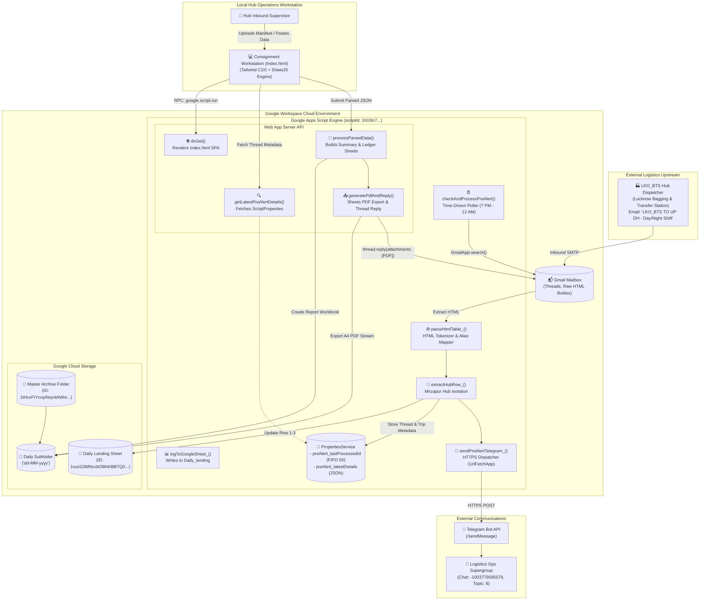
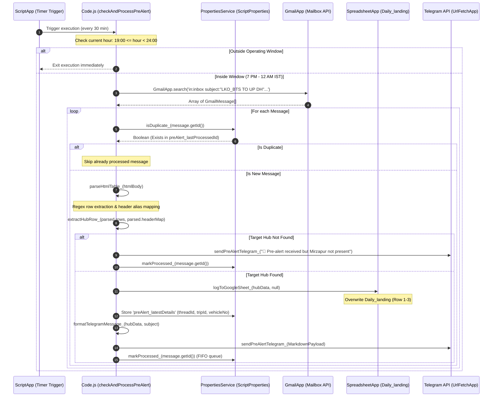
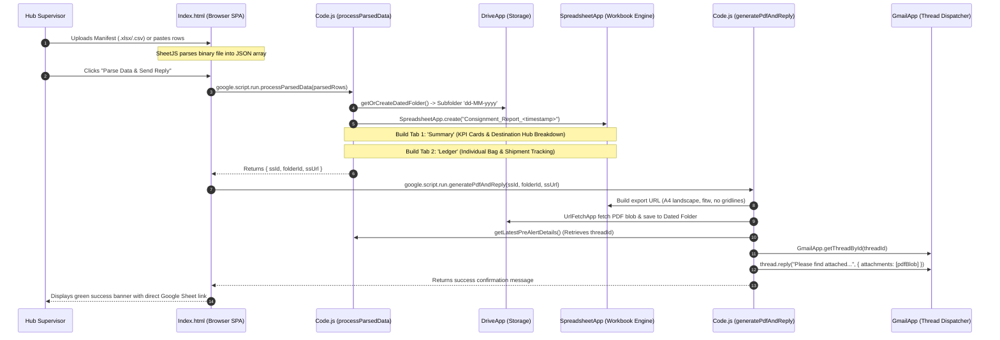
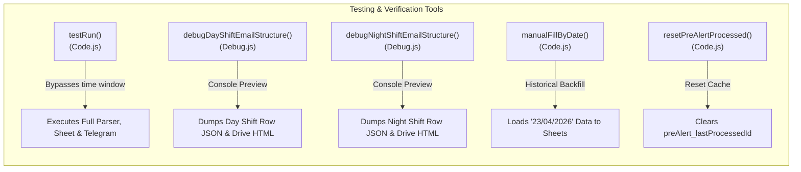
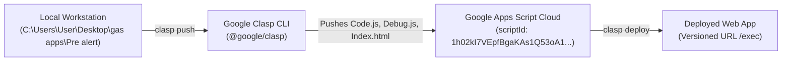

# Pre-Alert Logistics Automation
> **Inbound BTS Pre-Alert Ingestion Daemon, Mirzapur Hub Filter, Telegram Topic Dispatcher & Two-Tier Consignment Reconciliation Engine** — Architecture Specification & Project Memory Note

---

## 1. Overview
`Pre-Alert Logistics Automation` (local project directory: `Pre alert`, Google Clasp Script ID: `1h02kI7VEpfBgaKAs1Q53oA1_oSon-AM5laK7_xZE10jBttIfQ6toxkZY`) is a mission-critical supply chain automation daemon and web-based consignment reconciliation platform built on [[Google Apps Script]] (V8 runtime). It automates the intake, filtering, operational dispatch, and formal acknowledgement of cross-dock logistics transfers originating from Lucknow Bagging & Transfer Station (`LKO_BTS`) destined for Uttar Pradesh Delivery Hubs (`UP DH`), with dedicated focus on the Mirzapur Myntra fulfillment center (`MirzapurMYNTRAHub_MRZ`). 

The application operates in two synchronized operational modes:
1. **Headless Ingestion Daemon (`Code.js`):** A scheduled background poller running during peak transfer windows (7:00 PM to 12:00 AM Midnight IST) that sweeps an authorized [[Gmail]] inbox for shift pre-alerts matching `subject:"LKO_BTS TO UP DH"`. It dynamically parses unstructured inline HTML table matrices using regular expression tokenizers, isolates consignment metrics for `MirzapurMYNTRAHub_MRZ`, records real-time delivery manifests into a central [[Google Sheets]] operational log (`Daily_landing`), persists message thread state in `PropertiesService`, and dispatches rich markdown logistics notifications directly to Topic `8` of an operations [[Telegram]] supergroup.
2. **Interactive Reconciliation Workstation (`Index.html`):** A client-facing Single Page Application (SPA) powered by [[Tailwind CSS]] and [[SheetJS]] deployed as a Google Apps Script Web App. Hub operators upload inbound Excel/CSV manifests or paste tabular bag-level data, which the backend aggregates into a two-tier formatted [[Google Sheets]] workbook (Executive Summary with KPI scorecards and Destination Hub breakdown, plus a detailed Consignment Ledger tab). The system exports this workbook as an A4 landscape PDF via Google Sheets export endpoints and automatically dispatches a reply-all acknowledgement containing the PDF report directly back to the original Gmail pre-alert thread.

---

## 2. Tech Stack

| Layer | Technology | Version | Purpose & Architectural Notes |
|---|---|---|---|
| **Server Runtime** | [[Google Apps Script]] | V8 Engine *(stated in appsscript.json)* | Executes modern ECMAScript 6+ backend logic within Google Workspace cloud infrastructure; interfaces directly with Workspace APIs. |
| **Project Manifest** | `appsscript.json` | Manifest V1 *(stated)* | Declares environment configuration: `timeZone: "Asia/Kolkata"`, `exceptionLogging: "STACKDRIVER"`, and web app execution as `USER_DEPLOYING` with `ANYONE` access. |
| **CLI & Deployment** | Google Clasp (`@google/clasp`) | Standard Clasp *(stated in .clasp.json)* | Local code editing, version synchronization, and bidirectional push/pull between local workstation and Apps Script project `1h02kI7VEpfBgaKAs1Q53oA1_oSon-AM5laK7_xZE10jBttIfQ6toxkZY`. |
| **Email Ingestion** | `GmailApp` (Google Apps Script) | Native Service *(stated in Code.js)* | Executes contextual Gmail queries (`in:inbox subject:"LKO_BTS TO UP DH"`), retrieves message thread collections, accesses raw HTML bodies, and performs thread replies. |
| **HTML Parser** | Custom JavaScript Regex Tokenizer | Custom ES6 Regex *(stated in Code.js)* | Headless parsing of nested `<tr>`, `<td>`, `<th>` HTML markup from inbound vendor emails, cleaning entity encodings (`&nbsp;`, `<br>`), and resolving dynamic column aliases. |
| **Operational Logging** | [[Google Sheets]] (`SpreadsheetApp`) | Native Service *(stated in Code.js)* | Maintains live landing metrics on spreadsheet `1vuzG3MNccbOBNKBBTQ0kf9yKT8UQLVV7J9AUj1vR5Rw` (tab `Daily_landing`) and generates formatted customer-facing reports. |
| **File Storage & PDF** | [[Google Drive]] (`DriveApp`) | Native Service *(stated in Code.js)* | Hierarchical folder management under root parent `1tHcxFiYcvqXteyxtAWreYEE50qhWJ6Qb`, daily date-stamped folder provisioning (`dd-MM-yyyy`), and binary PDF archival. |
| **HTTP Transport** | `UrlFetchApp` (Google Apps Script) | Native Service *(stated in Code.js)* | Dispatches HTTPS POST payloads to Telegram Bot API (`sendMessage`), and fetches binary PDF stream exports from Google Sheets export URLs using OAuth bearer tokens. |
| **State Persistence** | `PropertiesService` (`ScriptProperties`) | Native Service *(stated in Code.js)* | Persists deduplication queues (`preAlert_lastProcessedId` FIFO array capped at 50 IDs) and latest pre-alert metadata (`preAlert_latestDetails` JSON payload). |
| **Scheduling Engine** | `ScriptApp` | Native Service *(stated in Code.js)* | Manages time-driven installable triggers (`checkAndProcessPreAlert`) executing automated polling routines across shift operating windows. |
| **Client Workstation** | HTML5 / Vanilla ES6+ | Modern Browser DOM *(stated in Index.html)* | Single Page Web App featuring drag-and-drop file ingestion, clipboard tabular parsing, reactive state loaders, and asynchronous RPC bridges via `google.script.run`. |
| **UI Framework** | Tailwind CSS | v3 Play CDN (`cdn.tailwindcss.com`) | Rapid utility-first responsive styling for workstation forms, drop zones, progress spinners, and status alert components. |
| **In-Browser Parser** | SheetJS (`xlsx.full.min.js`) | v0.18.5 (`jsdelivr CDN`) | High-performance client-side parsing of binary Excel files (`.xlsx`, `.xls`) and CSV files into structured JSON row objects prior to server transmission. |
| **Messaging Channel** | Telegram Bot API | Telegram Bot REST API | Instant push alerts dispatched to supergroup Chat ID `-1003779595579` targeted to Topic ID `8` with markdown fallback handling. |

---

## 3. Architecture

### System Topology Overview
The solution coordinates asynchronous inbound email signals with synchronous operator actions through a decoupled Google Workspace serverless architecture:



---

## 4. Folder & File Structure

The project maintains a compact, flat Apps Script structure managed locally via `@google/clasp`:

```
C:\Users\User\Desktop\gas apps\Pre alert\
├── .clasp.json            # Clasp deployment manifest defining Script ID and root directory
├── .claspignore           # Clasp ignore rules restricting pushes to production GAS source files
├── appsscript.json        # Google Apps Script manifest declaring V8 runtime, time zone, and OAuth scopes
├── Code.js                # Core backend script (990 lines) containing daemon, parsers, and web handlers
├── Debug.js               # Diagnostic utilities for shift email discovery and raw HTML DOM inspection
├── Index.html             # Client-side web workstation SPA (HTML5, Tailwind CSS, SheetJS)
└── .agents/               # Agent configuration directory containing workspace sidecar scripts and MCP configs
    ├── developer_knowledge_mcp.py  # Local Python-based documentation bridge
    ├── hooks.json         # Workspace hooks definition
    ├── mcp.json           # Model Context Protocol server configuration
    ├── hooks/             # Execution hook definitions
    └── skills/            # Local skill specifications
```

---

## 5. Core Modules & Responsibilities

### `Code.js`
- **Purpose:** Primary server-side orchestrator containing the background email poller, HTML table extraction engine, Google Sheets logger, Telegram alert client, and Web App RPC endpoints.
- **Key functions/classes:**
  - `checkAndProcessPreAlert()`: Primary cron entry point. Enforces the 19:00–24:00 IST execution window, queries Gmail for today's pre-alert emails, filters processed message IDs via `isDuplicate_()`, coordinates table parsing, updates Google Sheets, updates `ScriptProperties`, and triggers Telegram notifications. *(Lines 35–114)*
  - `findPreAlertEmails_(dateStr)`: Helper to search Gmail inbox using query `in:inbox subject:"LKO_BTS TO UP DH" subject:("Day Shift" OR "Night Shift") subject:"<dateStr>"`. If `dateStr` is null, defaults to today's date in `dd/MM/yyyy` format. Returns array of `GmailMessage` objects. *(Lines 121–142)*
  - `manualFillByDate()`: Diagnostic and backfill utility allowing developers to specify a historical date string (`MANUAL_DATE = "23/04/2026"`), bypass dedup checks, parse matching messages, and write to the landing sheet with a simulated date override. *(Lines 148–193)*
  - `logToGoogleSheet_(data, dateOverride)`: Clears and writes a 3-row structured snapshot to `SHEET_ID` tab `Daily_landing`. Row 1 records execution timestamp; Row 2 writes column headers (`Hub`, `Trip ID`, `Consignment`, `T B`, `Bag`, `Ship`, `Seal`, `Vehicle No`); Row 3 writes extracted values for `TARGET_HUB`. *(Lines 201–234)*
  - `parseHtmlTable_(htmlBody)`: Regex-based HTML tokenizer. Identifies `<tr>` tags, strips nested tags and formatting entities, evaluates rows against fuzzy header heuristics (`hasCriticalField && (matchCount >= 3 || (matchCount >= 2 && hasHubCol))`), maps dynamic column positions, and returns structured data rows. *(Lines 240–339)*
  - `findColumnIndex_(headerCells, fieldName)`: Case-insensitive alias matcher matching field names against dictionary arrays (e.g. mapping `"sl"` to `["semi large", "semi-large", "semilarge"]`, `"t b"` to `["tb", "total bag"]`). *(Lines 341–365)*
  - `extractHubRow_(rows, headerMap)`: Scans extracted data rows for `TARGET_HUB` (`MirzapurMYNTRAHub_MRZ`) by checking the designated Hub column first, falling back to a full-row scan. Returns key-value object of all 10 target fields. *(Lines 371–401)*
  - `formatTelegramMessage_(data, subjectString)`: Compiles formatted Markdown notification message. Detects shift name (Day vs Night) from email subject, prepends logistics emojis, formats key-value pairs, and escapes Markdown control characters. *(Lines 407–440)*
  - `escapeMarkdown_(text)`: Sanitizes strings for Telegram Markdown by escaping `_`, `*`, `[`, and `` ` ``. *(Lines 442–445)*
  - `sendPreAlertTelegram_(text)`: Dispatches HTTPS POST request to Telegram Bot API (`sendMessage`) with `chat_id: PRE_ALERT_CHAT_ID` and `message_thread_id: 8`. Includes automatic fallback that re-dispatches without Markdown if API returns HTTP error. *(Lines 451–486)*
  - `isDuplicate_(messageId)`: Checks whether `messageId` is present in the comma-delimited `preAlert_lastProcessedId` string stored in `ScriptProperties`. *(Lines 491–494)*
  - `markProcessed_(messageId)`: Appends `messageId` to `preAlert_lastProcessedId` in `ScriptProperties`. Implements FIFO trimming keeping a maximum of 50 IDs to prevent exceeding the 9KB property value limit. *(Lines 496–506)*
  - `setupPreAlertTrigger()`: Setup utility. Removes existing triggers for `checkAndProcessPreAlert` and provisions a new time-based trigger set to run every 30 minutes. *(Lines 511–525)*
  - `checkSubjectLines()`: Diagnostic tool logging all matching subject lines in the inbox for today to verify vendor subject variations. *(Lines 532–541)*
  - `testRun()`: Manual testing harness. Executes complete extraction, sheet logging, and Telegram dispatch on the latest pre-alert email regardless of time-of-day guards or dedup state. *(Lines 544–577)*
  - `resetPreAlertProcessed()`: Deletes `preAlert_lastProcessedId` from `ScriptProperties`, resetting the deduplication cache. *(Lines 580–583)*
  - `doGet()`: Web App HTTP GET router. Serves `Index.html` with title `"Consignment Pre-Alert Parser"` and `XFrameOptionsMode.ALLOWALL`. *(Lines 590–595)*
  - `getLatestPreAlertDetails()`: RPC callable returning stored metadata JSON (`threadId`, `tripId`, `vehicleNo`) from `ScriptProperties` to populate the Web App UI. *(Lines 598–604)*
  - `getOrCreateDatedFolder()`: Checks Drive parent folder `1tHcxFiYcvqXteyxtAWreYEE50qhWJ6Qb` for a subfolder matching current date (`dd-MM-yyyy`), creating it if absent. *(Lines 607–618)*
  - `processParsedData(parsedRows)`: Compiles uploaded consignment data into a dedicated Google Sheet named `Consignment_Report_<timestamp>`. Builds two custom-styled tabs: `Summary` (KPI scorecards and Destination Hub aggregation) and `Ledger` (individual item detail). *(Lines 623–899)*
  - `drawKpiCard_(sheet, startRow, startCol, endRow, endCol, title, value, ...)`: Low-level spreadsheet graphics helper creating merged, color-coded, bordered KPI tiles. *(Lines 904–929)*
  - `generatePdfAndReply(ssId, folderId, ssUrl)`: Generates an A4 Landscape PDF from the generated spreadsheet via Google Sheets export URL, saves the blob to Google Drive, retrieves the stored pre-alert Gmail thread, and replies with the PDF attached. *(Lines 934–990)*
- **Depends on:** `GmailApp`, `SpreadsheetApp`, `DriveApp`, `UrlFetchApp`, `PropertiesService`, `ScriptApp`.
- **Depended on by:** `Index.html` (via `google.script.run`).
- **Notable logic/gotchas:**
  - *Trigger Interval Discrepancy:* Header comment states "Polls Gmail every 5 min" (line 3), but `setupPreAlertTrigger()` creates an `everyMinutes(30)` trigger (line 521).
  - *Operating Window Guard:* Between 00:00 and 18:59 IST, `checkAndProcessPreAlert()` silently exits immediately (line 40).
  - *FIFO Dedup Cache:* The deduplication queue stores up to 50 Gmail Message IDs as a comma-separated string in `ScriptProperties`. If more than 50 pre-alert emails arrive in a cycle, old message IDs are dropped, theoretically risking re-processing if Gmail query returns them.

---

### `Debug.js`
- **Purpose:** Diagnostic toolset for inspecting email HTML tables received from logistics partners and dumping raw payloads for format verification.
- **Key functions/classes:**
  - `debugDayShiftEmailStructure()`: Convenience wrapper executing `debugEmailStructure_("Day Shift")`. *(Lines 5–7)*
  - `debugNightShiftEmailStructure()`: Convenience wrapper executing `debugEmailStructure_("Night Shift")`. *(Lines 9–11)*
  - `debugEmailStructure_(shiftName)`: Searches Gmail for the latest email matching `in:inbox subject:"LKO_BTS TO UP DH" subject:"<shiftName>"`. Logs the first 10 rows of parsed table cells to Logger console as JSON arrays. Additionally writes the complete raw HTML string into an `.html` file saved directly to the user's root Google Drive folder and logs the file URL. *(Lines 13–75)*
- **Depends on:** `GmailApp`, `DriveApp`, `Logger`, `Utilities`.
- **Depended on by:** Standalone developer execution during format changes.
- **Notable logic/gotchas:**
  - `debugEmailStructure_` saves `.html` dump files to the root of the user's Google Drive (`DriveApp.createFile(blob)`), which can clutter Drive if invoked frequently during testing.

---

### `Index.html`
- **Purpose:** Client-side Single Page Application providing an interactive reconciliation workstation for hub operations personnel.
- **Key UI Components & Logic:**
  - *Target Thread Information Banner:* Dynamically displays active `Trip ID`, `Vehicle No`, and `Email Thread ID` retrieved on startup via `google.script.run.getLatestPreAlertDetails()`. *(Lines 24–44, 98–106)*
  - *Option A (File Upload Zone):* Drag-and-drop / file selector supporting `.xlsx`, `.xls`, and `.csv` files. Excel files are converted directly in the browser using SheetJS (`XLSX.read` and `XLSX.utils.sheet_to_json`). *(Lines 48–64, 108–147)*
  - *Option B (Tabular Paste Area):* Textarea accepting raw tab-separated (TSV) or comma-separated (CSV) rows copied directly from desktop spreadsheets. *(Lines 72–77, 203–218)*
  - *Chained Submission Controller:* Disables UI and displays spinner while invoking `processParsedData(parsedRows)` on the server. On receipt of spreadsheet metadata (`ssId`, `folderId`, `ssUrl`), automatically chains a second call to `generatePdfAndReply(...)` to export the PDF and reply to the pre-alert email thread. *(Lines 225–253)*
  - *In-Browser CSV Parser:* `parseCsvText()` and `parseCsvLine()` parse RFC-style CSV text with quotation handling entirely in browser memory. *(Lines 156–192)*
- **Depends on:** Tailwind CSS CDN (`cdn.tailwindcss.com`), SheetJS CDN (`cdn.jsdelivr.net/npm/xlsx@0.18.5/dist/xlsx.full.min.js`), `google.script.run`.
- **Depended on by:** Loaded by `doGet()` in `Code.js`.

---

### `appsscript.json`
- **Purpose:** Project manifest configuring Google Apps Script runtime parameters, web app access policies, and explicit OAuth authorization scopes.
- **Key Declarations:**
  - `runtimeVersion: "V8"`: Modern V8 execution engine.
  - `timeZone: "Asia/Kolkata"`: Indian Standard Time (IST) execution context.
  - `exceptionLogging: "STACKDRIVER"`: Automatic error telemetry integration with Google Cloud Operations (Stackdriver) Logging.
  - `webapp.access: "ANYONE"`: Enables public web access to the workstation without requiring individual Google Workspace user authentication.
  - `webapp.executeAs: "USER_DEPLOYING"`: All web app actions run under the authority and credentials of the script owner.
  - `oauthScopes`: 9 explicit scopes authorizing read/modify access across Gmail, Google Drive, Google Sheets, external URL fetches, and script execution.

---

## 6. Data Flow / Key Workflows

### Flow 1: Inbound Pre-Alert Ingestion, Filtering & Telegram Notification
This automated workflow runs autonomously via time-driven trigger every 30 minutes during the active evening shift window:



---

### Flow 2: Operator Workstation Manifest Processing & Thread Reply
This interactive workflow allows hub personnel to ingest detailed bag-level consignment data and automatically acknowledge the inbound pre-alert thread:



---

## 7. Configuration & Environment

### Script Constants (`Code.js`)

| Constant | Location | Stated Value | Purpose & Architectural Notes |
|---|---|---|---|
| `PRE_ALERT_BOT_TOKEN` | `Code.js:8` | `[REDACTED_SECRET]` | Telegram Bot HTTP API authentication token used in `sendPreAlertTelegram_()`. *(High-priority security risk — hardcoded in source)*. |
| `PRE_ALERT_CHAT_ID` | `Code.js:9` | `"-1003779595579"` | Target Telegram Supergroup / Channel identifier. |
| `PRE_ALERT_TOPIC_ID` | `Code.js:10` | `8` | Target Telegram Forum Topic thread ID for Pre-Alert notifications. |
| `TARGET_HUB` | `Code.js:11` | `"MirzapurMYNTRAHub_MRZ"` | Primary logistics fulfillment center filter string. |
| `PROCESSED_KEY` | `Code.js:12` | `"preAlert_lastProcessedId"` | ScriptProperties key maintaining the FIFO message deduplication queue. |
| `PRE_ALERT_START_HOUR` | `Code.js:14` | `19` | Operating window start hour (7:00 PM IST). |
| `PRE_ALERT_END_HOUR` | `Code.js:15` | `24` | Operating window termination hour (12:00 AM Midnight IST). |
| `SUBJECT_BASE` | `Code.js:18` | `"LKO_BTS TO UP DH"` | Gmail subject search query base string. |
| `SHEET_ID` | `Code.js:21` | `"1vuzG3MNccbOBNKBBTQ0kf9yKT8UQLVV7J9AUj1vR5Rw"` | Target Google Sheet ID for operational landing metrics. |
| `SHEET_TAB` | `Code.js:22` | `"Daily_landing"` | Specific tab name within `SHEET_ID` where pre-alert data is overwritten. |
| `Parent Folder ID` | `Code.js:608` | `"1tHcxFiYcvqXteyxtAWreYEE50qhWJ6Qb"` | Parent Google Drive directory under which daily date folders are created. |
| `FIELDS_TO_EXTRACT` | `Code.js:24-27` | `["Trip ID", "Consignment", "T B", "Bag", "Ship", "SL", "Tote", "Seal", "Vehicle No", "IT Bag Seal"]` | Complete list of 10 columnar data attributes extracted from vendor HTML tables. |
| `DISPLAY_FIELDS` | `Code.js:29` | `["Trip ID", "Consignment", "T B", "Bag", "Ship", "Seal", "Vehicle No"]` | Subset of 7 fields displayed in Telegram notifications and Google Sheets. |

---

### `PropertiesService` Store

| Property Key | Storage Scope | Type | Purpose |
|---|---|---|---|
| `preAlert_lastProcessedId` | `ScriptProperties` | Comma-delimited String | FIFO array of up to 50 processed Gmail Message IDs used by `isDuplicate_()` and `markProcessed_()`. |
| `preAlert_latestDetails` | `ScriptProperties` | JSON String | Stores latest inbound consignment metadata: `{ threadId, tripId, vehicleNo, timestamp }`. Loaded by `Index.html` via `getLatestPreAlertDetails()` to link replies. |

---

### Manifest Configuration (`appsscript.json`)

| Manifest Attribute | Configured Value | Architectural Implications |
|---|---|---|
| `timeZone` | `"Asia/Kolkata"` | Standardizes all date math, folder names, and sheet labels to Indian Standard Time (IST). |
| `runtimeVersion` | `"V8"` | Enables ES6 syntax (arrow functions, template literals, `let`/`const`, destructuring). |
| `exceptionLogging` | `"STACKDRIVER"` | Cloud logging integration for automated tracing and error alerting. |
| `webapp.access` | `"ANYONE"` | Publicly accessible workstation URL. Allows field operations to access the tool without corporate login gates. |
| `webapp.executeAs` | `"USER_DEPLOYING"` | Web App executes with developer credentials, bypassing individual Drive/Sheet permissions for end users. |

---

## 8. External Integrations & APIs

| Integration / API | Role & Purpose | Authentication Mechanism | Code Location | Known Quirks & Rate Limits |
|---|---|---|---|---|
| **Telegram Bot API** (`/sendMessage`) | Operational alerting in logistics supergroup | Bot Token embedded in HTTP URL | `Code.js:451-486` | Fails with HTTP 400 if Markdown entities are improperly unescaped. Handled gracefully by re-dispatching payload without `parse_mode`. |
| **Gmail API** (`GmailApp`) | Search and retrieve inbound vendor pre-alerts; dispatch thread replies | Google OAuth2 (`gmail.readonly`, `gmail.modify`, `gmail.send`) | `Code.js:130, 974, 983`, `Debug.js:18` | Consumer limit: 100 recipients/day; Workspace: 1,500 recipients/day. `GmailApp.search()` returns maximum 500 threads per call. |
| **Google Sheets API** (`SpreadsheetApp`) | Dynamic sheet creation, cell styling, KPI card rendering, data persistence | Google OAuth2 (`spreadsheets`) | `Code.js:203, 626, 935` | 6-minute maximum script execution limit. Formatting individual cells in loops is slow; mitigated by batch `setValues()` and targeted range formatting. |
| **Google Drive API** (`DriveApp`) | Folder creation, report file moving, PDF binary storage | Google OAuth2 (`drive`) | `Code.js:609, 627, 963`, `Debug.js:66` | Quotas tied to Google Drive storage tier. Large blob movements can experience minor latency. |
| **Google Sheets PDF Exporter** | Generates pixel-perfect A4 landscape PDFs from spreadsheets | Bearer OAuth token (`ScriptApp.getOAuthToken()`) via `UrlFetchApp` | `Code.js:939-960` | Undocumented URL parameter syntax (`fitw=true`, `fzr=true`, `portrait=false`). Requires explicit OAuth token header. |
| **SheetJS (CDN)** | Client-side spreadsheet parsing | Public CDN (`jsdelivr`) | `Index.html:11` | Client-side memory limits apply if handling multi-megabyte Excel workbooks in browser memory. |
| **Tailwind CSS (CDN)** | Web App workstation design system | Public CDN (`cdn.tailwindcss.com`) | `Index.html:9` | JIT script loaded from CDN; requires active internet connection on workstation browser. |

---

## 9. Testing

### Diagnostic Test Harness (`Debug.js` & `Code.js`)



- **Live End-to-End Simulation (`testRun()`):**
  - Manually invokable from the Apps Script editor.
  - Bypasses the 19:00–24:00 IST operating window filter.
  - Pulls the most recent pre-alert email for today, runs table parsing, logs extracted metrics to Google Sheets, and pushes a real notification to Telegram Topic `8`.
- **HTML DOM Structure Inspection (`debugEmailStructure_()`):**
  - Designed to diagnose upstream formatting changes made by BTS logistics teams.
  - Queries latest Day Shift or Night Shift email, parses the first 10 rows of table cells, and logs clean string arrays to the console.
  - Generates a standalone `.html` file saved to Google Drive root and outputs a clickable URL for visual verification in Chrome/Edge.
- **Historical Backfill Harness (`manualFillByDate()`):**
  - Allows manual reprocessing of any historical date (e.g., `"23/04/2026"`) by overriding the date parameter and populating the landing sheet.
- **Deduplication Verification & Reset (`resetPreAlertProcessed()`):**
  - Clears `preAlert_lastProcessedId` from `ScriptProperties`, allowing immediate re-processing of previously processed messages during testing.
- **Untested & Known Fragile Areas:**
  - No automated CI unit test runner (e.g. Jest or Mocha) exists *(stated/standard for GAS)*.
  - Nested HTML parsing relies on regular expressions rather than an XML/DOM tree parser; changes to table nesting or attributes can cause parsing failures.

---

## 10. CI/CD & Deployment

### Deployment Pipeline
The application utilizes Google Clasp (`@google/clasp`) for local version control and deployment to Google Workspace:



- **Clasp Push Order & Filtering:**
  - Controlled by `.claspignore`. Only `appsscript.json`, `Code.js`, `Debug.js`, and `Index.html` are synced to the cloud project. All other local artifacts (`.agents/`, docs, temp files) are excluded.
- **Production Trigger Installation:**
  - The scheduled daemon trigger is initialized by running `setupPreAlertTrigger()` once from the Apps Script IDE. This registers an installable time-driven trigger invoking `checkAndProcessPreAlert()`.

---

## 11. Setup & Local Development

### Prerequisites
- Node.js (v18.0.0 or higher) and npm.
- Google Clasp installed globally: `npm install -g @google/clasp`.
- Google Cloud / Workspace account with access to Script ID `1h02kI7VEpfBgaKAs1Q53oA1_oSon-AM5laK7_xZE10jBttIfQ6toxkZY`.

### Clean-Machine Setup Steps

1. **Authenticate Clasp with Google:**
   ```bash
   clasp login
   ```
2. **Navigate to the Project Directory:**
   ```bash
   cd "C:\Users\User\Desktop\gas apps\Pre alert"
   ```
3. **Verify Configuration:**
   Inspect `.clasp.json` to confirm script binding:
   ```json
   {
     "scriptId": "1h02kI7VEpfBgaKAs1Q53oA1_oSon-AM5laK7_xZE10jBttIfQ6toxkZY",
     "rootDir": ""
   }
   ```
4. **Pull Latest Remote Code (Optional):**
   ```bash
   clasp pull
   ```
5. **Push Local Code to Google Apps Script:**
   ```bash
   clasp push
   ```
6. **Open Apps Script IDE:**
   ```bash
   clasp open
   ```
7. **Initialize Triggers:**
   In the Apps Script IDE, select `setupPreAlertTrigger` from the function dropdown and click **Run**. Grant all required Google Workspace OAuth permissions when prompted.

---

## 12. Security Notes

> [!WARNING]
> **CRITICAL SECURITY ALERT: HARDCODED TELEGRAM BOT TOKEN IN SOURCE CODE**
> In `Code.js` line 8, the Telegram Bot authorization token is committed directly in plaintext:
> ```javascript
> var PRE_ALERT_BOT_TOKEN = "[REDACTED_SECRET]"; // Plaintext token committed in Code.js line 8
> ```
> This token grants complete administrative control over the Telegram Bot, including reading incoming messages and dispatching unauthorized messages.
> **Remediation Plan:**
> 1. Immediately revoke this bot token via Telegram `@BotFather` and issue a new secret token.
> 2. Delete the token string from `Code.js` and migrate it to `PropertiesService`:
>    ```javascript
>    var PRE_ALERT_BOT_TOKEN = PropertiesService.getScriptProperties().getProperty("TELEGRAM_BOT_TOKEN");
>    ```
> 3. Populate `TELEGRAM_BOT_TOKEN` in the Apps Script Project Settings > Script Properties console.

> [!WARNING]
> **PUBLIC WEB APP ACCESS (`webapp.access: "ANYONE"`)**
> In `appsscript.json`, the Web App execution policy is set to:
> ```json
> "webapp": {
>   "access": "ANYONE",
>   "executeAs": "USER_DEPLOYING"
> }
> ```
> This configuration allows any internet user who discovers the deployment URL to access the reconciliation workstation, upload files, generate Google Sheets under the deployer's Drive storage, and dispatch reply-all emails to internal pre-alert threads. Restricting access to `"DOMAIN"` (Google Workspace tenant only) is strongly recommended.

### OAuth Scopes Audit

| Scope | Declared In | Privilege Level | Justification & Risk Assessment |
|---|---|---|---|
| `https://www.googleapis.com/auth/gmail.readonly` | `appsscript.json:11` | High | Required for `GmailApp.search()` and reading pre-alert HTML message bodies. |
| `https://www.googleapis.com/auth/gmail.send` | `appsscript.json:12` | High | Required for replying to pre-alert threads with attached PDF reports. |
| `https://www.googleapis.com/auth/gmail.modify` | `appsscript.json:13` | High | Declared in manifest; allows modifying message labels and read status. |
| `https://www.googleapis.com/auth/spreadsheets` | `appsscript.json:14` | High | Grants read/write access to all spreadsheets in the deployer's account. Broader than necessary; could be scoped to specific documents if feasible. |
| `https://www.googleapis.com/auth/drive` | `appsscript.json:15` | Critical | Full access to user Google Drive files and folders. Required for folder creation and PDF storage under parent `1tHcxFiYcvqXteyxtAWreYEE50qhWJ6Qb`. |
| `https://www.googleapis.com/auth/script.send_mail` | `appsscript.json:16` | Moderate | Auxiliary email sending permission. |
| `https://www.googleapis.com/auth/script.external_request` | `appsscript.json:17` | High | Required for `UrlFetchApp.fetch()` calls to Telegram API and Google Sheets export endpoints. |
| `https://www.googleapis.com/auth/script.scriptapp` | `appsscript.json:18` | Moderate | Required for programmatic trigger creation via `ScriptApp.newTrigger()`. |
| `https://www.googleapis.com/auth/userinfo.email` | `appsscript.json:19` | Low | Standard identity resolution scope. |

---

## 13. Known Issues, Limitations & Tech Debt

### Code-Level Limitations & Tech Debt
1. **Operating Window Constraint (7 PM – 12 AM):**
   - In `Code.js` line 40, `checkAndProcessPreAlert()` enforces:
     ```javascript
     if (currentHour < PRE_ALERT_START_HOUR || currentHour >= PRE_ALERT_END_HOUR) return;
     ```
   - Pre-alerts dispatched outside this 5-hour window (e.g., early Day Shift alerts sent at 16:00 IST or delayed Night Shift alerts arriving at 01:00 IST) are skipped until the window opens, or missed entirely if subsequent emails push them past the search depth.
2. **Trigger Frequency Inconsistency:**
   - Documentation and header comments state the poller runs every 5 minutes (line 3, line 33), but `setupPreAlertTrigger()` explicitly creates a 30-minute trigger (`everyMinutes(30)`, line 521).
3. **Hardcoded Infrastructure Identifiers:**
   - `SHEET_ID` (`1vuzG3MNccbOBNKBBTQ0kf9yKT8UQLVV7J9AUj1vR5Rw`), `Parent Folder ID` (`1tHcxFiYcvqXteyxtAWreYEE50qhWJ6Qb`), and Telegram Chat/Topic IDs are hardcoded in `Code.js` rather than stored in `ScriptProperties`.
4. **HTML Table Regex Fragility:**
   - `parseHtmlTable_()` extracts table rows using regular expression `/<tr[^>]*>([\s\S]*?)<\/tr>/gi`. If the upstream BTS sender switches to nested tables, CSS grid layouts, or adds custom container wrappers, the regex parser will fail to extract cell matrices correctly.
5. **Deduplication Array Limit:**
   - `markProcessed_()` caps the stored ID array at 50 elements (`if (arr.length > 50) arr.shift()`). While this prevents exceeding the 9KB `ScriptProperties` value limit, high-volume periods could theoretically cycle IDs out of the queue within 2–3 days.

### Standing Google Apps Script Platform Quotas
As a Google Apps Script serverless project, the runtime is subject to strict platform quotas:
- **Maximum Execution Time:** 6 minutes per execution. (PDF generation and Sheets styling take ~15–30 seconds, safely within limits).
- **UrlFetchApp Daily Quotas:** 20,000 calls/day (Consumer) or 100,000 calls/day (Workspace).
- **Total Trigger Runtime:** 90 minutes/day (Consumer) or 6 hours/day (Workspace). At 30-minute intervals during a 5-hour active window (10 executions/day), total daily trigger runtime is ~1–2 minutes, well below platform caps.

---

## 14. Design Decisions & Rationale

1. **Direct HTML Body Table Parsing vs Attachment Scraping:**
   - *(stated in Code.js)* BTS pre-alerts are transmitted with the consignment data matrix embedded directly inside the email HTML body rather than as attached CSV/XLSX files. A lightweight regex tokenizer extracts data without requiring external attachment decoders or drive scratch spaces.
2. **Telegram Forum Topic Targeting (`message_thread_id: 8`):**
   - *(stated in Code.js:462)* The operations supergroup (`-1003779595579`) uses Telegram Topics to separate hub streams. Targeting Topic `8` ensures Mirzapur alerts arrive in the dedicated logistics channel without cluttering other hub feeds.
3. **Two-Tier Spreadsheet Design (`Summary` + `Ledger`):**
   - *(stated in Code.js:629-899)* Executive leadership requires high-level KPI cards and hub-level bag totals, while field floor teams require item-level tracking IDs. Generating a two-tab workbook provides both views in a single artifact.
4. **PDF Landscape Export via Internal Sheets Exporter:**
   - *(stated in Code.js:939-956)* Rather than writing complex custom PDF rendering logic in HTML, the system styles a Google Sheet using native spreadsheet formatting and exports it via the Google Sheets export endpoint (`exportFormat=pdf&portrait=false&fitw=true`). This guarantees consistent A4 printable output.
5. **Client-Side SheetJS Parsing:**
   - *(stated in Index.html:138-145)* Parsing `.xlsx` files in the browser via SheetJS before transmitting JSON to Apps Script reduces server memory consumption and avoids Apps Script execution timeout limits on large files.

---

## 15. Roadmap / TODOs

- [ ] **High Priority:** Migrate `PRE_ALERT_BOT_TOKEN`, `SHEET_ID`, and Drive `Parent Folder ID` out of `Code.js` and into `ScriptProperties`.
- [ ] **High Priority:** Rotate the exposed Telegram bot token via BotFather.
- [ ] **Medium Priority:** Reconcile polling frequency: update `setupPreAlertTrigger()` to `everyMinutes(5)` or `everyMinutes(10)` to match operational requirements.
- [ ] **Medium Priority:** Restrict Web App access in `appsscript.json` from `ANYONE` to `DOMAIN` to prevent unauthorized external access.
- [ ] **Low Priority:** Implement `XmlService` DOM parser fallback in `parseHtmlTable_()` to improve resilience against malformed HTML vendor emails.
- [ ] **Low Priority:** Add automated Slack or Webhook fallback notification if Telegram API dispatch fails repeatedly.

---

## 16. Changelog

> *No prior note supplied — changelog starts here.*

- **2026-09-18 (Current Release / Memory Baseline):**
  - Comprehensive codebase audit of `Code.js`, `Debug.js`, `Index.html`, `appsscript.json`, and `.clasp.json`.
  - Audited regex HTML parser supporting Day Shift and Night Shift pre-alert emails from `LKO_BTS`.
  - Documented Google Sheets landing sync (`Daily_landing` on sheet `1vuzG3MNccbOBNKBBTQ0kf9yKT8UQLVV7J9AUj1vR5Rw`).
  - Documented Telegram alert bot integration targeting Supergroup `-1003779595579` Topic `8`.
  - Documented Web App workstation (`Index.html`) supporting file upload, SheetJS parsing, two-tier report generation, PDF compilation, and automated Gmail thread replies.
  - Redacted exposed Telegram Bot token to `[REDACTED_SECRET]` and logged critical security warnings.

---

## 17. Glossary

- **Pre-Alert:** An advance shipping notice (ASN) emailed by an upstream transfer center notifying downstream destination hubs of in-transit consignments, bag counts, and vehicle details.
- **BTS (Bagging & Transfer Station):** A major logistics transshipment hub (specifically `LKO_BTS` — Lucknow BTS) responsible for sorting, bagging, and dispatching consignments across regional hubs.
- **DH (Delivery Hub):** Destination distribution center (e.g. `MirzapurMYNTRAHub_MRZ`) responsible for receiving line-haul runs and initiating last-mile delivery.
- **Consignment ID:** Master tracking identifier assigned to a group of bags and shipments dispatched on a specific trip.
- **T B / Bag / Ship:** Operational acronyms representing Total Bags, Bag Tracking IDs, and Individual Shipment/Order counts.
- **SL (Semi-Large):** Dimensional classification category for medium-to-large cargo bags.
- **IT Bag Seal:** High-security tamper-evident serialized seal attached to bags containing high-value electronics and IT merchandise.
- **Clasp:** Command-line Apps Script Projects CLI tool by Google (`@google/clasp`) enabling local development and Git version control for Apps Script.
- **ScriptProperties:** Key-value data store provided by Google Apps Script scoped to the script project, accessible across all executions.

---

## 18. Related Notes

- [[Pre-Alert Logistics Automation — Architecture Decisions]]
- [[Pre-Alert Logistics Automation — Changelog]]
- [[Cash Pickup Transaction Tracker]] — Parallel GAS email ingestion and PDF generation daemon
- [[Shipment Verification App]] — Inbound scanning and reconciliation system
- [[Hub RCA Tracker Dashboard]] — Fulfillment center reporting and incident tracking

---

## 19. Update Instructions (meta)

To refresh or update this document in future development cycles:
1. Paste this existing note alongside the updated codebase into your coding assistant.
2. Direct the agent to diff the codebase against this document, paying specific attention to:
   - Modifications in `Code.js` (constants, regex matching logic, operating hours, target fields).
   - Updates to UI or SheetJS integration in `Index.html`.
   - Any changes to `appsscript.json` (OAuth scopes, runtime versions, access settings).
3. Update Sections 5–8, 12, and 13 to reflect actual code changes.
4. Append a new dated entry to Section 16 (Changelog) while preserving the original `created` date (`2026-09-18`) in the YAML frontmatter.
5. Preserve manually authored architectural commentary in Section 14 and vault links in Section 18.
