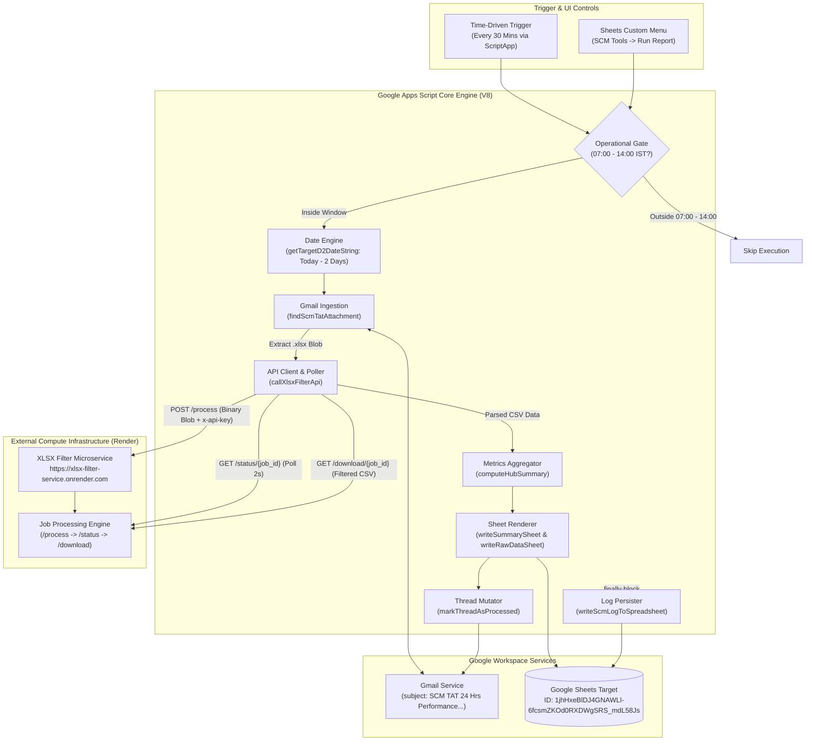
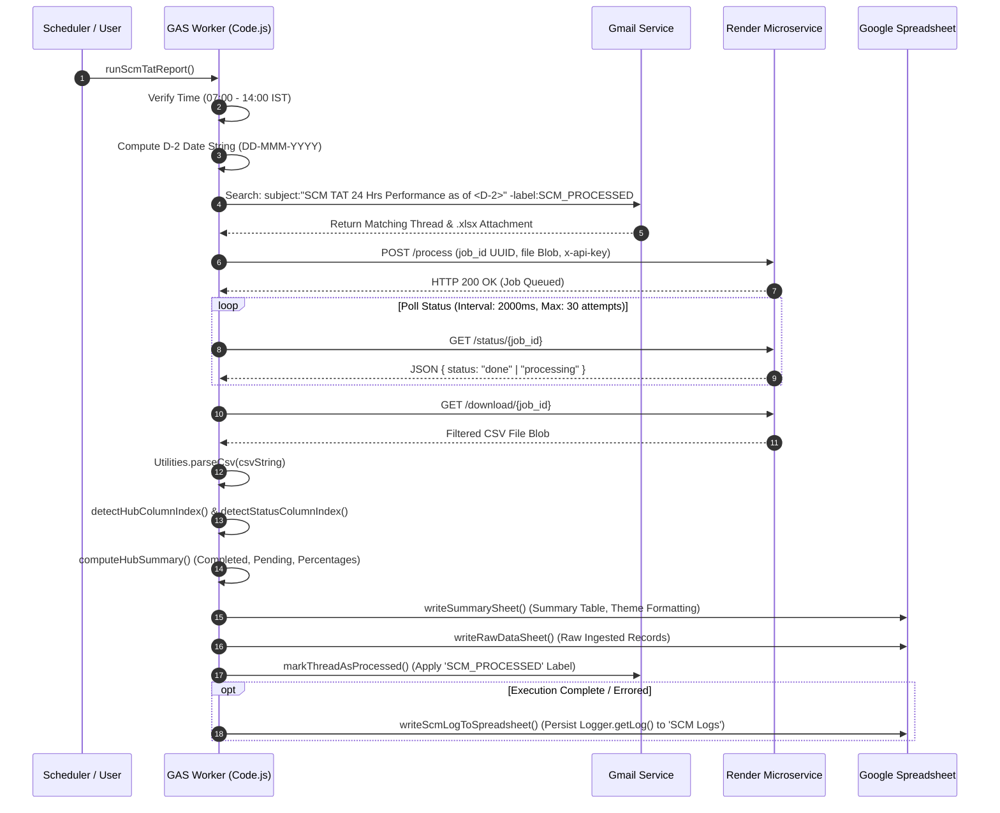
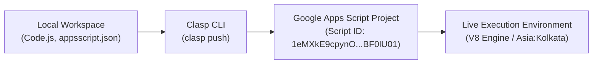

# SCM TAT 24 Hrs Performance Automation

## 1. Overview
**SCM TAT 24 Hrs Performance Automation** is an automated, cloud-integrated logistics performance pipeline running on [[Google Apps Script]] (GAS) under the modern [[V8]] runtime. Developed for supply-chain logistics operations, the application automatically ingests, extracts, transforms, and analyzes daily rolling 24-hour turnaround time (TAT) performance workbooks dispatched via [[Gmail]]. To circumvent Google Apps Script's strict platform boundaries—notably the 6-minute execution ceiling and 50 MB memory quota—the script establishes an asynchronous bridge to an external cloud microservice (`https://xlsx-filter-service.onrender.com`) hosted on [[Render]], offloading the decompression and filtering of heavy Microsoft Excel (`.xlsx`) files. Once converted into streaming tabular CSV records, the system aggregates operational counts and closure rates across regional Distribution Centers (DCs / Hubs), renders a formatted executive dashboard with conditional formatting in [[Google Sheets]], updates execution diagnostics in a dedicated `SCM Logs` tab, and tags source email threads with `SCM_PROCESSED` to ensure idempotency.

---

## 2. Tech Stack

| Component / Layer | Technology | Version / Specification | Source / Code Reference | Notes |
| :--- | :--- | :--- | :--- | :--- |
| **Execution Runtime** | [[Google Apps Script]] (GAS) | V8 Engine (`runtimeVersion: "V8"`) *(stated)* | [`appsscript.json:13`](file:///C:/Users/User/Desktop/gas%20apps/scm%20performance/appsscript.json#L13) | Modern ECMAScript (ES6+) runtime supporting `const`/`let`, arrow functions, template strings, and array manipulation methods. |
| **Exception Logging** | Google Cloud Stackdriver | `STACKDRIVER` *(stated)* | [`appsscript.json:4`](file:///C:/Users/User/Desktop/gas%20apps/scm%20performance/appsscript.json#L4) | Cloud exception logging capturing script runtime exceptions and Stackdriver error tracking. |
| **Timezone Reference** | IANA Timezone | `Asia/Kolkata` (IST, UTC+5:30) *(stated)* | [`appsscript.json:2`](file:///C:/Users/User/Desktop/gas%20apps/scm%20performance/appsscript.json#L2) | Standardizes operational window gating (07:00 to 14:00 IST) and D-2 target date calculations. |
| **CLI & Development Tooling** | Google Clasp (`@google/clasp`) | Manifest format 1.0 *(inferred)* | [`.clasp.json:1-16`](file:///C:/Users/User/Desktop/gas%20apps/scm%20performance/.clasp.json#L1-L16) | Synchronizes local scripts with remote Apps Script project ID `1eMXkE9cpynO2Pxt8ukcqtEsMm8pueVEbe_1tIglGropAw9WIjBF0lU01`. |
| **External Compute Bridge** | XLSX Filter Service (Render) | Python / FastAPI microservice *(inferred)* | [`Code.js:18-21, 124-184`](file:///C:/Users/User/Desktop/gas%20apps/scm%20performance/Code.js#L18-L21) | Remote worker hosted at `https://xlsx-filter-service.onrender.com` that accepts `.xlsx` blobs and emits filtered CSV streams. |
| **Email Ingestion & Tagging** | Google Workspace `GmailApp` | Built-in GAS Service | [`Code.js:53-105`](file:///C:/Users/User/Desktop/gas%20apps/scm%20performance/Code.js#L53-L105) | Searches subject lines with rolling date stamps, filters attachments, and applies `SCM_PROCESSED` user labels. |
| **Data Presentation & Storage** | Google Workspace `SpreadsheetApp` | Built-in GAS Service | [`Code.js:303-466`](file:///C:/Users/User/Desktop/gas%20apps/scm%20performance/Code.js#L303-L466) | Creates/updates `SCM tat performance summary`, `SCM TAT raw data`, and `SCM Logs` tabs in target workbook. |
| **HTTP Egress Client** | Google Workspace `UrlFetchApp` | Built-in GAS Service | [`Code.js:145, 161, 177`](file:///C:/Users/User/Desktop/gas%20apps/scm%20performance/Code.js#L145) | Dispatches binary multipart payloads to `/process`, polls `/status/{job_id}`, and downloads CSV blobs via `/download/{job_id}`. |
| **State & Config Storage** | `PropertiesService` | Built-in `ScriptProperties` | [`Code.js:314-320`](file:///C:/Users/User/Desktop/gas%20apps/scm%20performance/Code.js#L314-L320) | Persists dynamic `SPREADSHEET_ID` fallback if default sheet ID is inaccessible or unlinked. |
| **Automated Triggers** | `ScriptApp` | Built-in Event API | [`Code.js:580-594`](file:///C:/Users/User/Desktop/gas%20apps/scm%20performance/Code.js#L580-L594) | Creates programmatic time-driven triggers executing `runScmTatReport` every 30 minutes. |
| **Local Test Harness** | Python `pytest` | `pytest` placeholder *(stated)* | [`tests/test_stub.py:1-2`](file:///C:/Users/User/Desktop/gas%20apps/scm%20performance/tests/test_stub.py#L1-L2) | Basic test stub directory present in the local workspace repository. |

---

## 3. Architecture

### System Topology
The application functions as an event-driven extract-transform-load (ETL) pipeline connecting enterprise Google Workspace components with an external compute engine on Render:



### Ingestion & Transformation Pipeline
The ETL pipeline separates message retrieval, remote binary transformation, and in-memory tabular summarization:



---

## 4. Folder & File Structure

```text
C:\Users\User\Desktop\gas apps\scm performance\
├── .agents/                          # Agentic orchestration & specification metadata
│   ├── architecture.md               # High-level architecture summary for automated agents
│   ├── design.md                     # Design guidelines and logging requirements
│   ├── memory.md                     # Context and state memory pointers
│   ├── okf_knowledge_mcp.py          # Python knowledge base MCP helper
│   ├── phases.md                     # Implementation execution phases
│   ├── prd.md                        # Product Requirements Document for SCM Logs addition
│   ├── rules.md                      # Operational rules (strict SCM Logs naming, silent error catching)
│   ├── hooks/                        # Automation lifecycle hooks
│   └── skills/                       # Orchestration skill configs
├── .clasp.json                       # Clasp CLI project link (scriptId, file extensions, root dir)
├── .gemini/                          # Gemini agent framework settings & telemetry
├── .goal_achieved                    # Completion receipt recording log helper delivery (2026-07-23)
├── .okf/                             # Google Open Knowledge Framework schema and knowledge nodes
│   ├── nodes/                        # OKF guideline, architecture, and skill nodes
│   └── okf_manifest.json             # Manifest referencing machine-readable OKF nodes
├── appsscript.json                   # Google Apps Script manifest (V8, Asia/Kolkata, OAuth scopes)
├── Code.js                           # Complete production script (595 lines, ETL & formatting)
├── loop-debug.md                     # Execution log for automated coding loops
├── REQUIREMENTS.md                   # Completed requirements checklist for SCM Logs implementation
├── src/                              # Empty directory reserved for modular source splits *(inferred)*
├── STATE.md                          # Live task state tracking document (COMPLETED)
└── tests/                            # Test directory
    └── test_stub.py                  # Basic Python placeholder unit test
```

---

## 5. Core Modules & Responsibilities

### `Code.js`
The entire production application is contained in [`Code.js`](file:///C:/Users/User/Desktop/gas%20apps/scm%20performance/Code.js) (595 lines). The script is logically partitioned into six functional tiers:

#### Tier 1: Configuration & Constants ([`Code.js:14-25`](file:///C:/Users/User/Desktop/gas%20apps/scm%20performance/Code.js#L14-L25))
- **Purpose:** Centralizes static configuration parameters for external API connectivity, Gmail tagging labels, and target spreadsheet sheet names.
- **Key Definitions:**
  - `XLSX_SERVICE_CONFIG`: Object containing `SERVER_URL` (`https://xlsx-filter-service.onrender.com`) and `API_KEY` (`[REDACTED_SECRET]`).
  - `PROCESSED_LABEL_NAME`: `'SCM_PROCESSED'`—Gmail label applied to threads to prevent re-processing.
  - `LOGS_SHEET_NAME`: `'SCM Logs'`—Target sheet name for runtime execution diagnostics.
- **Notable Logic/Gotchas:** The Render API key was directly committed in plaintext on line 20 (`API_KEY`). See [Section 12: Security Notes](#12-security-notes) for remediation details.

#### Tier 2: Gmail Search, Date Logic, & Attachment Extraction ([`Code.js:27-106`](file:///C:/Users/User/Desktop/gas%20apps/scm%20performance/Code.js#L27-L106))
- **`getTargetD2DateString(baseDate)` ([`Code.js:35-45`](file:///C:/Users/User/Desktop/gas%20apps/scm%20performance/Code.js#L35-L45)):
  - **Inputs:** Optional `baseDate` (`Date`). Defaults to `new Date()`.
  - **Outputs:** `string` formatted as `DD-MMM-YYYY` (e.g., `"21-Jul-2026"`).
  - **Logic:** Subtracts exactly 2 days from the input date (`d.setDate(d.getDate() - 2)`) and indexes against a 3-letter English month array (`['Jan', 'Feb', ...]`).
- **`findScmTatAttachment()` ([`Code.js:53-91`](file:///C:/Users/User/Desktop/gas%20apps/scm%20performance/Code.js#L53-L91)):
  - **Inputs:** None.
  - **Outputs:** `{ attachment: GmailAttachment, thread: GmailThread }` or `null`.
  - **Logic:** Queries Gmail with `subject:"SCM TAT 24 Hrs Performance as of <DD-MMM-YYYY>" has:attachment -label:SCM_PROCESSED` (fetching first 10 threads).
  - **Strict Exclusion:** Explicitly checks `if (subject.indexOf('HCQ Performance Summary') !== -1) continue;` to avoid false-positive processing of dual-summary reports.
  - **Attachment Filtering:** Case-insensitively inspects attachment names ending with `.xlsx` or `.xls`.
- **`markThreadAsProcessed(thread)` ([`Code.js:97-105`](file:///C:/Users/User/Desktop/gas%20apps/scm%20performance/Code.js#L97-L105)):
  - **Inputs:** `thread` (`GmailThread`).
  - **Outputs:** `void`.
  - **Logic:** Checks `GmailApp.getUserLabelByName('SCM_PROCESSED')`. If missing, creates it via `GmailApp.createLabel()`, then calls `thread.addLabel()`.

#### Tier 3: External API Client / XLSX Filter Service ([`Code.js:108-185`](file:///C:/Users/User/Desktop/gas%20apps/scm%20performance/Code.js#L108-L185))
- **`generateUuid()` ([`Code.js:115-117`](file:///C:/Users/User/Desktop/gas%20apps/scm%20performance/Code.js#L115-L117)):
  - **Outputs:** UUID v4 string via `Utilities.getUuid()`.
- **`callXlsxFilterApi(fileBlob)` ([`Code.js:124-184`](file:///C:/Users/User/Desktop/gas%20apps/scm%20performance/Code.js#L124-L184)):
  - **Inputs:** `fileBlob` (`Blob`) extracted from Gmail.
  - **Outputs:** `Blob` containing parsed and filtered CSV data.
  - **Workflow:**
    1. Generates `jobId` via `generateUuid()`.
    2. Dispatches `POST` request to `https://xlsx-filter-service.onrender.com/process` with multipart payload `{ job_id: jobId, file: fileBlob }` and header `x-api-key: [REDACTED_SECRET]`.
    3. Enters polling loop against `/status/{job_id}` with a 2,000ms delay (`Utilities.sleep(2000)`), capped at 30 attempts (maximum 60 seconds elapsed).
    4. Breaks loop when `status` is `'done'` or `'completed'`; throws exception if `status` is `'failed'`.
    5. Issues `GET` request to `/download/{job_id}` and returns the resulting binary CSV blob.
  - **Notable Logic/Gotchas:** Synchronous polling inside GAS consumes valuable runtime against the 6-minute execution limit. If the Render instance is experiencing a cold start (>60s), the 30-attempt loop will exhaust without retrieving the download blob.

#### Tier 4: Data Processing & Hub Summary Calculations ([`Code.js:187-294`](file:///C:/Users/User/Desktop/gas%20apps/scm%20performance/Code.js#L187-L294))
- **`detectHubColumnIndex(headers)` ([`Code.js:195-204`](file:///C:/Users/User/Desktop/gas%20apps/scm%20performance/Code.js#L195-L204)):
  - **Inputs:** `headers` (`Array<string>`).
  - **Outputs:** `number` (0-indexed column position).
  - **Logic:** Normalizes header strings to lowercase and searches across four recognized alias priorities: `'source dc'`, `'source_dc'`, `'dc code'`, `'dc'`. Throws an explicit error if none match.
- **`detectStatusColumnIndex(headers)` ([`Code.js:209-216`](file:///C:/Users/User/Desktop/gas%20apps/scm%20performance/Code.js#L209-L216)):
  - **Inputs:** `headers` (`Array<string>`).
  - **Outputs:** `number` (0-indexed column position).
  - **Logic:** Identifies the exact index of column `'status_status'`. Throws an error if missing.
- **`computeHubSummary(headers, rows)` ([`Code.js:224-293`](file:///C:/Users/User/Desktop/gas%20apps/scm%20performance/Code.js#L224-L293)):
  - **Inputs:** `headers` (`Array<string>`), `rows` (`Array<Array>`).
  - **Outputs:** `{ rows: Array<Array>, totals: Array }`.
  - **Logic:** Iterates through records, tracking per-hub counts for `complete` (`status_status === 'closed'`) vs `notComplete` (all other statuses). Aggregates counts, calculates completion percentages (`complete / total`), sorts hubs alphabetically, and computes a grand totals row (`'TOTAL / SUMMARY'`).

#### Tier 5: Sheet Reporting & Formatting ([`Code.js:296-467`](file:///C:/Users/User/Desktop/gas%20apps/scm%20performance/Code.js#L296-L467))
- **`getTargetSpreadsheet()` ([`Code.js:303-324`](file:///C:/Users/User/Desktop/gas%20apps/scm%20performance/Code.js#L303-L324)):
  - **Resolution Hierarchy:**
    1. Attempts `SpreadsheetApp.getActiveSpreadsheet()` (if running bound).
    2. Attempts opening hardcoded ID `1jhHxeBlDJ4GNAWLl-6fcsmZKOd0RXDWgSRS_mdL58Js`.
    3. Attempts opening ID from `ScriptProperties.getProperty('SPREADSHEET_ID')`.
    4. Creates a new sheet (`'SCM TAT 24 Hrs Performance Summary Report'`) and stores the ID in `ScriptProperties`.
- **`writeSummarySheet(ss, summaryData, dateStr)` ([`Code.js:333-436`](file:///C:/Users/User/Desktop/gas%20apps/scm%20performance/Code.js#L333-L436)):
  - **Destination Tab:** `'SCM tat performance summary'`.
  - **Styling Specs:**
    - Clears sheet and disables gridlines (`sheet.setHiddenGridlines(true)`).
    - Fills background with clean white (`#ffffff`).
    - Row 1: Merged title banner across columns 1–6 showing `dateStr`, filled in deep purple (`#4c1d95`), bold white text, height 22px.
    - Row 3: Table headers (`['DC', 'Completed', 'Pending', 'Total', 'Done %', 'Pending %']`) styled with royal purple (`#6d28d9`), white text, bold, border `#3b0764`.
    - Data Rows: Zebra striping (`#ffffff` / `#f5f3ff`), bordered with `#ddd6fe`.
    - Number Formatting: Volume counts formatted as `#,##0`; percentages as `0.0%`.
    - Conditional Formatting on Column 5 (`Done %`):
      - $\ge 90\%$: Light green (`#dcfce7`, text `#166534`)
      - $\ge 75\%$: Soft yellow (`#fef9c3`, text `#854d0e`)
      - $< 75\%$: Soft red (`#fee2e2`, text `#991b1b`)
    - Dynamic column auto-resizing via `sheet.autoResizeColumns(1, 6)`.
- **`writeRawDataSheet(ss, headers, rows)` ([`Code.js:444-466`](file:///C:/Users/User/Desktop/gas%20apps/scm%20performance/Code.js#L444-L466)):
  - **Destination Tab:** `'SCM TAT raw data'`.
  - **Logic:** Writes full dataset returned from conversion microservice, applies slate-gray header (`#334155`, white bold text), and auto-resizes columns up to index 20.

#### Tier 6: Main Handlers, Diagnostics & Scheduling ([`Code.js:469-594`](file:///C:/Users/User/Desktop/gas%20apps/scm%20performance/Code.js#L469-L594))
- **`onOpen()` ([`Code.js:475-481`](file:///C:/Users/User/Desktop/gas%20apps/scm%20performance/Code.js#L475-L481)):
  - Installs custom UI menu `'SCM Tools'` with actions to trigger execution manually or register the 30-minute cron trigger.
- **`runScmTatReport()` ([`Code.js:487-546`](file:///C:/Users/User/Desktop/gas%20apps/scm%20performance/Code.js#L487-L546)):
  - **Primary Entry Point:** Enforces operational window (07:00 to 14:00 IST) via `Utilities.formatDate(now, 'Asia/Kolkata', 'H')`.
  - Enclosed in `try ... catch ... finally` block. The `finally` block guarantees that `writeScmLogToSpreadsheet(Logger.getLog())` executes regardless of script termination state.
- **`writeScmLogToSpreadsheet(logText)` ([`Code.js:552-573`](file:///C:/Users/User/Desktop/gas%20apps/scm%20performance/Code.js#L552-L573)):
  - Writes timestamped lines (`[new Date(), logLine]`) to the `'SCM Logs'` tab. Catches exceptions silently to avoid recursion.
- **`installDailyTrigger()` ([`Code.js:580-594`](file:///C:/Users/User/Desktop/gas%20apps/scm%20performance/Code.js#L580-L594)):
  - Idempotently purges existing triggers for `runScmTatReport` and creates a 30-minute time-driven trigger.

---

## 6. Data Flow / Key Workflows

### Workflow 1: End-to-End Automated Ingestion & Processing
1. **Trigger Activation:** Every 30 minutes between 07:00 and 14:00 IST, `ScriptApp` fires `runScmTatReport()` ([`Code.js:487`](file:///C:/Users/User/Desktop/gas%20apps/scm%20performance/Code.js#L487)).
2. **Time Boundary Validation:** The script queries the current hour in `Asia/Kolkata`. If `currentHour < 7 || currentHour >= 14`, it exits immediately ([`Code.js:494`](file:///C:/Users/User/Desktop/gas%20apps/scm%20performance/Code.js#L494)).
3. **Date Resolution:** Computes `dateStr = getTargetD2DateString()` (e.g., `"21-Jul-2026"`) representing $T - 2$ days ([`Code.js:499`](file:///C:/Users/User/Desktop/gas%20apps/scm%20performance/Code.js#L499)).
4. **Gmail Mailbox Search:** Calls `findScmTatAttachment()`, querying Gmail for unprocessed messages with subject `"SCM TAT 24 Hrs Performance as of <dateStr>"` having an attachment and lacking `SCM_PROCESSED` ([`Code.js:53`](file:///C:/Users/User/Desktop/gas%20apps/scm%20performance/Code.js#L53)).
5. **Microservice Delegation:** Extracts `.xlsx` blob, passes it to `callXlsxFilterApi()`, which submits to Render, polls job status, and streams back the filtered CSV blob ([`Code.js:517`](file:///C:/Users/User/Desktop/gas%20apps/scm%20performance/Code.js#L517)).
6. **In-Memory Transformation:** Parses CSV string into 2D array via `Utilities.parseCsv()`. Passes data to `computeHubSummary()` to calculate completed vs pending orders and done percentages per DC ([`Code.js:521-527`](file:///C:/Users/User/Desktop/gas%20apps/scm%20performance/Code.js#L521-L527)).
7. **Sheets Ingestion & Formatting:** Overwrites `'SCM tat performance summary'` with styled summary tables and `'SCM TAT raw data'` with the full CSV dataset ([`Code.js:528-529`](file:///C:/Users/User/Desktop/gas%20apps/scm%20performance/Code.js#L528-L529)).
8. **Thread Tagging:** Calls `markThreadAsProcessed(thread)` to attach the `SCM_PROCESSED` label to the source email thread, preventing duplicate processing ([`Code.js:532`](file:///C:/Users/User/Desktop/gas%20apps/scm%20performance/Code.js#L532)).
9. **Diagnostics Persistence:** The `finally` block captures `Logger.getLog()` and records all execution events into the `'SCM Logs'` tab ([`Code.js:544`](file:///C:/Users/User/Desktop/gas%20apps/scm%20performance/Code.js#L544)).

---

## 7. Configuration & Environment

### Configuration Parameters

| Variable / Constant | Storage Location | Type | Current / Default Value | Purpose | Sensitivity |
| :--- | :--- | :--- | :--- | :--- | :--- |
| `SERVER_URL` | [`Code.js:19`](file:///C:/Users/User/Desktop/gas%20apps/scm%20performance/Code.js#L19) | `string` | `https://xlsx-filter-service.onrender.com` | Base URL of the remote XLSX filter microservice on Render. | Public |
| `API_KEY` | [`Code.js:20`](file:///C:/Users/User/Desktop/gas%20apps/scm%20performance/Code.js#L20) | `string` | `[REDACTED_SECRET]` | Authentication secret passed via `x-api-key` header to Render microservice. | **High (Secret)** |
| `PROCESSED_LABEL_NAME` | [`Code.js:23`](file:///C:/Users/User/Desktop/gas%20apps/scm%20performance/Code.js#L23) | `string` | `'SCM_PROCESSED'` | Gmail label applied to processed threads to guarantee idempotency. | Internal |
| `LOGS_SHEET_NAME` | [`Code.js:24`](file:///C:/Users/User/Desktop/gas%20apps/scm%20performance/Code.js#L24) | `string` | `'SCM Logs'` | Name of the spreadsheet tab storing execution telemetry logs. | Internal |
| `TARGET_ID` | [`Code.js:305`](file:///C:/Users/User/Desktop/gas%20apps/scm%20performance/Code.js#L305) | `string` | `1jhHxeBlDJ4GNAWLl-6fcsmZKOd0RXDWgSRS_mdL58Js` | Primary target Google Spreadsheet ID. | Internal |
| `SPREADSHEET_ID` | `ScriptProperties` | `string` | Dynamic (fallback ID) | Dynamic fallback spreadsheet ID if primary ID cannot be opened. | Internal |

### Apps Script Manifest Configuration (`appsscript.json`)
- **`runtimeVersion`:** `"V8"`—Enables modern ECMAScript standard support.
- **`timeZone`:** `"Asia/Kolkata"`—Governs all date representations and operational execution gating.
- **`exceptionLogging`:** `"STACKDRIVER"`—Transmits runtime exceptions directly to Google Cloud Console logs.
- **`dependencies`:** `{}`—Zero external Apps Script libraries linked; relies entirely on native workspace services and HTTP egress.

### D-2 Rolling Date Logic
```javascript
// Code.js:35-45
function getTargetD2DateString(baseDate) {
  const d = baseDate ? new Date(baseDate) : new Date();
  d.setDate(d.getDate() - 2); // Exactly 48 hours backward
  const months = ['Jan', 'Feb', 'Mar', 'Apr', 'May', 'Jun', 'Jul', 'Aug', 'Sep', 'Oct', 'Nov', 'Dec'];
  const day = ('0' + d.getDate()).slice(-2);
  const month = months[d.getMonth()];
  const year = d.getFullYear();
  return `${day}-${month}-${year}`; // e.g. "21-Jul-2026"
}
```

---

## 8. External Integrations & APIs

| Service / API | Purpose | Auth Method | Where in Code | Quotas / Rate Limits / Quirks |
| :--- | :--- | :--- | :--- | :--- |
| **XLSX Filter Service (Render)** | Offloads heavy `.xlsx` decompression and filtering to emit raw CSV. | HTTP Header (`x-api-key: [REDACTED_SECRET]`) | [`Code.js:124-184`](file:///C:/Users/User/Desktop/gas%20apps/scm%20performance/Code.js#L124-L184) | Free/hobby instances on Render spin down during inactivity; cold starts can require 45–60 seconds, risking poll exhaustion. |
| **Google Gmail API (`GmailApp`)** | Discovers target email reports and tags threads with `SCM_PROCESSED`. | Workspace OAuth Token (Automatic) | [`Code.js:57, 99-103`](file:///C:/Users/User/Desktop/gas%20apps/scm%20performance/Code.js#L57) | Search results capped at 10 threads. Daily email read/modify quotas apply (Workspace: 10,000s/day). |
| **Google Sheets API (`SpreadsheetApp`)** | Clears and rewrites summary dashboard, raw data, and diagnostic logs. | Workspace OAuth Token (Automatic) | [`Code.js:303-466, 552-573`](file:///C:/Users/User/Desktop/gas%20apps/scm%20performance/Code.js#L303-L466) | 10 million cells per spreadsheet limit; `setValues()` batching is strictly used to prevent execution slowdowns. |
| **Google Apps Script Triggers (`ScriptApp`)** | Registers 30-minute automated cron execution. | Workspace OAuth Token (Automatic) | [`Code.js:580-594`](file:///C:/Users/User/Desktop/gas%20apps/scm%20performance/Code.js#L580-L594) | Hard limit of 20 installable triggers per script. Existing triggers are explicitly pruned before creation. |
| **Google Properties Service** | Stores dynamic spreadsheet IDs across script invocations. | Workspace OAuth Token (Automatic) | [`Code.js:314-320`](file:///C:/Users/User/Desktop/gas%20apps/scm%20performance/Code.js#L314-L320) | 9KB max per property value; 500KB total property store limit. |

---

## 9. Testing

### Test Infrastructure & Coverage
- **Automated Tests:** Minimal automated testing infrastructure is present in the repository. The `tests/` directory contains only a single test stub ([`tests/test_stub.py`](file:///C:/Users/User/Desktop/gas%20apps/scm%20performance/tests/test_stub.py)):
  ```python
  def test_placeholder():
      assert True
  ```
- **Execution Command:**
  ```bash
  pytest tests/
  ```
- **Manual Verification & Testing:** Testing has historically been conducted manually inside the Google Apps Script IDE by triggering `runScmTatReport()` or running syntax verification prior to pushing via `clasp push` ([`REQUIREMENTS.md:6`](file:///C:/Users/User/Desktop/gas%20apps/scm%20performance/REQUIREMENTS.md#L6)).
- **Untested & Fragile Areas:**
  - **Date Rollovers:** Rolling $T - 2$ calculations across month ends (e.g., March 1 $\rightarrow$ February 27/28) and leap years rely on standard JavaScript `Date` mutation, which is functionally sound but lacks unit test assertions.
  - **Render API Failures:** Network timeout, 5xx server errors, or schema drift in the external microservice's JSON response will cause uncaught exceptions in `callXlsxFilterApi`.
  - **Excel Column Mutations:** If upstream report generators alter header names outside the detected aliases (`source dc`, `source_dc`, `dc code`, `dc`), `detectHubColumnIndex()` throws an uncaught error.

---

## 10. CI/CD & Deployment

### Deployment Pipeline
The application utilizes Google's Command Line Apps Script Projects (`@google/clasp`) tool to synchronize local script files with the remote Google Apps Script container.



### Verified Clasp Operations
- **Push Local Code to Google Script:**
  ```bash
  clasp push
  ```
- **Pull Remote Changes from Google Script:**
  ```bash
  clasp pull
  ```
- **Check Clasp Link Status:**
  ```bash
  clasp status
  ```

### Release & Trigger Management
1. Changes made to `Code.js` or `appsscript.json` are deployed to Google's servers using `clasp push`.
2. Operational triggers are registered directly from the target Google Sheet UI:
   - Navigate to `SCM Tools` $\rightarrow$ `Install Schedule Trigger (7 AM - 2 PM, every 30 mins)` ([`Code.js:479`](file:///C:/Users/User/Desktop/gas%20apps/scm%20performance/Code.js#L479)).
   - Alternatively, execute `installDailyTrigger()` directly in the Apps Script console.
3. Rollbacks are managed by reverting local Git commits (or local copies) and re-running `clasp push`, or using Apps Script Version History in the web editor.

---

## 11. Setup & Local Development

### Prerequisites
1. **Node.js & Clasp:** Node.js (v16+) and `@google/clasp` installed globally:
   ```bash
   npm install -g @google/clasp
   ```
2. **Google Apps Script API:** Ensure the Google Apps Script API is enabled in your Google account settings ([Google Apps Script User Settings](https://script.google.com/home/usersettings)).
3. **Python (Optional):** Python 3.9+ if executing the local test stub.

### Step-by-Step Workspace Setup
1. **Authenticate Clasp:**
   ```bash
   clasp login
   ```
2. **Clone Project (if initializing clean workspace):**
   ```bash
   clasp clone 1eMXkE9cpynO2Pxt8ukcqtEsMm8pueVEbe_1tIglGropAw9WIjBF0lU01
   ```
3. **Verify Configuration:**
   Ensure `.clasp.json` contains:
   ```json
   {
     "scriptId": "1eMXkE9cpynO2Pxt8ukcqtEsMm8pueVEbe_1tIglGropAw9WIjBF0lU01",
     "rootDir": ""
   }
   ```
4. **Deploy Code to Remote Project:**
   ```bash
   clasp push
   ```
5. **Execute Unit Tests:**
   ```bash
   pytest tests/
   ```

---

## 12. Security Notes

### Render Microservice Secret Exposure
> [!warning] CRITICAL SECURITY VULNERABILITY: Committed API Secret
> The external Render microservice API key is hardcoded directly in plaintext inside [`Code.js:20`](file:///C:/Users/User/Desktop/gas%20apps/scm%20performance/Code.js#L20):
> ```javascript
> const XLSX_SERVICE_CONFIG = {
>   SERVER_URL: 'https://xlsx-filter-service.onrender.com',
>   API_KEY: '[REDACTED_SECRET]' // Line 20
> };
> ```
> **Remediation & Rotation Steps:**
> 1. Immediately rotate the API key on the Render microservice instance (`xlsx-filter-service.onrender.com`).
> 2. Remove the plaintext string from `Code.js`.
> 3. Store the rotated secret in Apps Script `ScriptProperties`:
>    ```javascript
>    PropertiesService.getScriptProperties().setProperty('XLSX_SERVICE_API_KEY', '<new_secret>');
>    ```
> 4. Update [`Code.js`](file:///C:/Users/User/Desktop/gas%20apps/scm%20performance/Code.js) to retrieve the secret dynamically:
>    ```javascript
>    const API_KEY = PropertiesService.getScriptProperties().getProperty('XLSX_SERVICE_API_KEY');
>    ```

### OAuth Scope Audit (`appsscript.json`)

| OAuth Scope | Description / Permission Granted | Justification & Risk Analysis |
| :--- | :--- | :--- |
| `https://www.googleapis.com/auth/gmail.readonly` | Read-only access to email messages and metadata. | Required for `findScmTatAttachment()` to locate daily SCM TAT emails and inspect `.xlsx` attachments. |
| `https://www.googleapis.com/auth/gmail.labels` | Create, read, and update user email labels. | Required for `markThreadAsProcessed()` to look up or create the `SCM_PROCESSED` label. |
| `https://www.googleapis.com/auth/gmail.modify` | Read, compose, send, and modify email messages and threads. | Required to apply the `SCM_PROCESSED` label to threads via `thread.addLabel()`. *Note: Broad permission, but necessary for thread label mutation.* |
| `https://www.googleapis.com/auth/spreadsheets` | Read and write access to all user Google Spreadsheets. | Required by `writeSummarySheet`, `writeRawDataSheet`, and `writeScmLogToSpreadsheet`. Since the script opens an external sheet by ID (`1jhHxeBlDJ4GNAWLl-6fcsmZKOd0RXDWgSRS_mdL58Js`), the restricted `.currentonly` scope cannot be used. |
| `https://www.googleapis.com/auth/script.external_request` | Connect to external services via `UrlFetchApp`. | Required to transmit payloads to `https://xlsx-filter-service.onrender.com`. |
| `https://www.googleapis.com/auth/script.scriptapp` | Create and manage project installable triggers. | Required for `installDailyTrigger()` to create and prune recurring 30-minute triggers. |

---

## 13. Known Issues, Limitations & Tech Debt

- **Rigid D-2 Date Search Logic:** The system strictly queries for emails matching today minus 2 days (`getTargetD2DateString()`). If upstream reporting pipelines stall over weekends or holidays, or if reports arrive delayed by 3 days, the query misses the email entirely.
  > [!note] Recommended Fix
  > Implement an optional parameter or fallback search range (e.g., checking D-1 through D-4) when D-2 returns no results.
- **Microservice Cold Starts on Render Free Tier:** The Render service (`xlsx-filter-service.onrender.com`) may take up to 60 seconds to spin up from an idle state. In `callXlsxFilterApi()`, the polling loop checks `/status/{job_id}` up to 30 times at 2-second intervals (60s total). If the microservice takes longer than 60 seconds to boot and process, the loop exits without downloading results.
- **Synchronous HTTP Polling Consumption:** Google Apps Script imposes a strict **6-minute (360 seconds)** execution timeout per execution. Synchronously blocking execution for 30–60 seconds while polling Render consumes 15% of the total available execution budget.
- **Hardcoded Target Spreadsheet ID:** If the hardcoded ID `1jhHxeBlDJ4GNAWLl-6fcsmZKOd0RXDWgSRS_mdL58Js` is deleted or permissions are revoked, the script falls back to creating a new sheet every time `ScriptProperties` is cleared, leading to orphan spreadsheets.
- **UI Alerts in Background Triggers:** `runScmTatReport()` contains calls to `SpreadsheetApp.getUi().alert(...)`. While wrapped in `try ... catch (e) {}` ([`Code.js:507, 537`](file:///C:/Users/User/Desktop/gas%20apps/scm%20performance/Code.js#L507)), running UI methods in time-driven background triggers produces silent caught exceptions.
- **Standing Platform Quotas (Google Apps Script):**
  - Maximum script execution time: 6 minutes/execution.
  - Maximum triggers per script: 20.
  - Daily `UrlFetchApp` calls: 20,000/day (consumer) / 100,000/day (Google Workspace).
  - Daily trigger runtime: 90 minutes/day (consumer) / 6 hours/day (Workspace).

---

## 14. Design Decisions & Rationale

- **Offloading XLSX Parsing to External Render Service *(stated & inferred)*:**
  - *Context:* SCM TAT reports are distributed as compressed OpenXML `.xlsx` binary files containing comprehensive nationwide order rows.
  - *Decision:* Forward the binary attachment blob via `UrlFetchApp` to a dedicated microservice on Render (`xlsx-filter-service.onrender.com`) rather than parsing in GAS.
  - *Rationale:* Native Apps Script lacks low-memory streaming XML SAX parsers. Loading and decompressing large workbooks via JavaScript libraries (such as SheetJS / `xlsx.js`) inside GAS triggers heap overflows (>50 MB limit) and script timeouts (>6 minutes). The Python microservice decomposes and filters the workbook in seconds.
- **D-2 Rolling Evaluation Window *(inferred)*:**
  - *Context:* Supply chain logistics Turnaround Time (TAT) measures order closure over a completed 24-hour cycle.
  - *Decision:* Calculate target date as `Today - 2 Days`.
  - *Rationale:* Upstream reporting pipelines require a 48-hour reconciliation buffer to capture final mile delivery scans, Return-to-Origin (RTO) updates, and warehouse returns before performance metrics solidify.
- **Email Thread Tagging via `SCM_PROCESSED` Label *(stated)*:**
  - *Context:* Time-based triggers run every 30 minutes between 07:00 and 14:00 IST.
  - *Decision:* Apply `SCM_PROCESSED` to the thread and filter queries with `-label:SCM_PROCESSED`.
  - *Rationale:* Provides an atomic, state-free deduplication mechanism that avoids reprocessing the same attachment across multiple trigger cycles.
- **Dedicated `'SCM Logs'` Tab *(stated)*:**
  - *Context:* Multiple operations scripts may log to the same spreadsheet workbook.
  - *Decision:* Name the logging tab strictly `'SCM Logs'` rather than standard `'LOGS'`.
  - *Rationale:* Avoids sheet naming collisions with concurrent or adjacent operational tools (e.g., Escalation Index / EI tools) writing to the same workbook.

---

## 15. Roadmap / TODOs

- [ ] **Migrate Secret to `ScriptProperties`:** Remove hardcoded API key from [`Code.js:20`](file:///C:/Users/User/Desktop/gas%20apps/scm%20performance/Code.js#L20) and inject via `PropertiesService.getScriptProperties().getProperty('XLSX_SERVICE_API_KEY')`.
- [ ] **Flexible Historical Backfill:** Add a custom dialog or prompt in the `SCM Tools` menu allowing operators to input an arbitrary date (`DD-MMM-YYYY`) to process missed or historical reports.
- [ ] **Asynchronous Chained Continuation:** Decouple file submission and result polling into two phases (using one-shot triggers similar to [[HourlyConversionReport]]) to eliminate the synchronous 60-second blocking sleep loop.
- [ ] **Telegram Incident Alerting:** Incorporate Telegram Bot API alerts to notify operations supervisors in dedicated topics when an email is missing or when closure rates fall below 75%.
- [ ] **Dynamic Hub Configuration:** Move hardcoded DC alias keywords from [`Code.js:196`](file:///C:/Users/User/Desktop/gas%20apps/scm%20performance/Code.js#L196) into a spreadsheet config tab or Script Property.

---

## 16. Changelog

> No prior note supplied — changelog starts here.

### 2026-07-23 — Diagnostic Logging & Error Resilience
- **Added `LOGS_SHEET_NAME` Constant:** Registered `'SCM Logs'` constant in configuration ([`Code.js:24`](file:///C:/Users/User/Desktop/gas%20apps/scm%20performance/Code.js#L24)).
- **Implemented `writeScmLogToSpreadsheet`:** Added helper function that opens/creates the `'SCM Logs'` sheet, clears previous log records, and writes timestamped lines from `Logger.getLog()` ([`Code.js:552-573`](file:///C:/Users/User/Desktop/gas%20apps/scm%20performance/Code.js#L552-L573)).
- **Try-Finally Execution Wrap:** Wrapped `runScmTatReport()` in a `try ... finally` block ensuring diagnostic logs persist even during runtime failures ([`Code.js:491, 543`](file:///C:/Users/User/Desktop/gas%20apps/scm%20performance/Code.js#L491)).
- **Synchronized via Clasp:** Deployed code changes to script ID `1eMXkE9cpynO2Pxt8ukcqtEsMm8pueVEbe_1tIglGropAw9WIjBF0lU01` ([`loop-debug.md:7`](file:///C:/Users/User/Desktop/gas%20apps/scm%20performance/loop-debug.md#L7), [`.goal_achieved:1-6`](file:///C:/Users/User/Desktop/gas%20apps/scm%20performance/.goal_achieved#L1-L6)).

---

## 17. Glossary

- **SCM (Supply Chain Management):** Logistics and distribution network operations managing order fulfillment, hub transfers, and final delivery.
- **TAT (Turnaround Time):** Key performance indicator measuring elapsed duration between dispatch and milestone completion (targeted at 24 hours).
- **DC (Distribution Center / Hub):** Regional logistics node responsible for sorting, routing, and fulfilling parcels within an assigned territory.
- **D-2 (Date Minus 2 Days):** Operational reporting window targeting performance metrics from two calendar days prior to allow for status settlement.
- **Clasp:** Google Apps Script Command Line tool for managing, developing, and deploying Apps Script code locally.
- **V8 Engine:** The high-performance ECMAScript runtime environment powering modern Google Apps Script projects.
- **OpenXML / XLSX:** Compressed zip-container format storing spreadsheet worksheets as XML files.
- **Idempotency:** Operational design ensuring repeated executions with the same input produce identical state without duplicate writes.
- **Render:** Cloud hosting platform operating the external Python XLSX decompression and filtering microservice.

---

## 18. Related Notes

- [[Projects/DataConversion|DataConversion]] — Dedicated microservice repository documentation for Excel-to-CSV streaming conversions.
- [[Projects/xlsx_to_csv_bridge|xlsx_to_csv_bridge]] — FastAPI conversion bridge deployed on Render for supply chain workloads.
- [[Projects/HourlyConversionReport|HourlyConversionReport]] — Parallel GAS application implementing two-phase chained trigger polling for hourly logistics reports.
- [[Projects/unified-dashboard|unified-dashboard]] — Central supply chain operational monitoring dashboard.
- [[Projects/EI-Stream-Trigger|EI-Stream-Trigger]] — Escalation Index trigger architecture sharing logging conventions.
- [[Projects/D-1-SummaryAutomation|D-1-SummaryAutomation]] — End-of-day summary ingestion automation pipeline.

---

## 19. Update Instructions (meta)

To refresh or update this document in future maintenance runs:
1. Copy this existing note and supply it to the updating AI agent alongside the project repository.
2. The agent will inspect local file changes in `Code.js`, `appsscript.json`, and `.clasp.json`.
3. Update [Section 5: Core Modules](#5-core-modules--responsibilities), [Section 7: Configuration](#7-configuration--environment), [Section 8: External Integrations](#8-external-integrations--apis), and [Section 13: Known Issues](#13-known-issues-limitations--tech-debt) based on recent code diffs.
4. Append new dated entries to [Section 16: Changelog](#16-changelog) without overwriting historical entries.
5. Retain manually documented rationale in [Section 14: Design Decisions](#14-design-decisions--rationale) and custom links in [Section 18: Related Notes](#18-related-notes).
6. **Critical:** Always maintain the redaction of secrets (`[REDACTED_SECRET]`) in all sections and code blocks.
