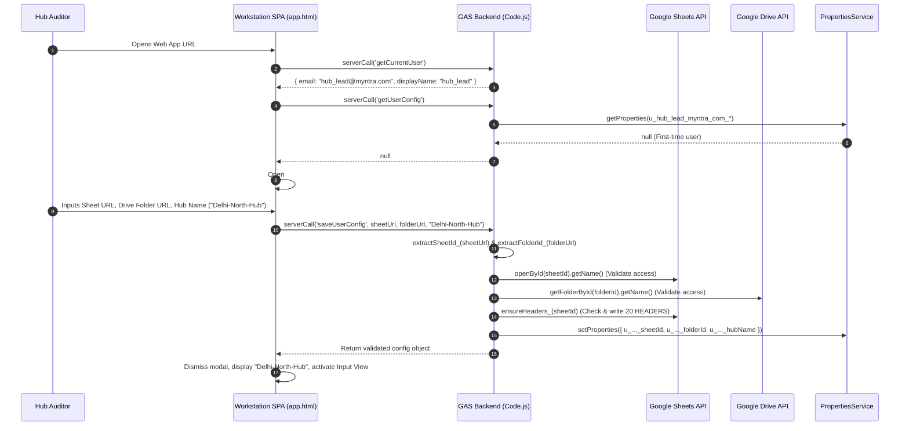
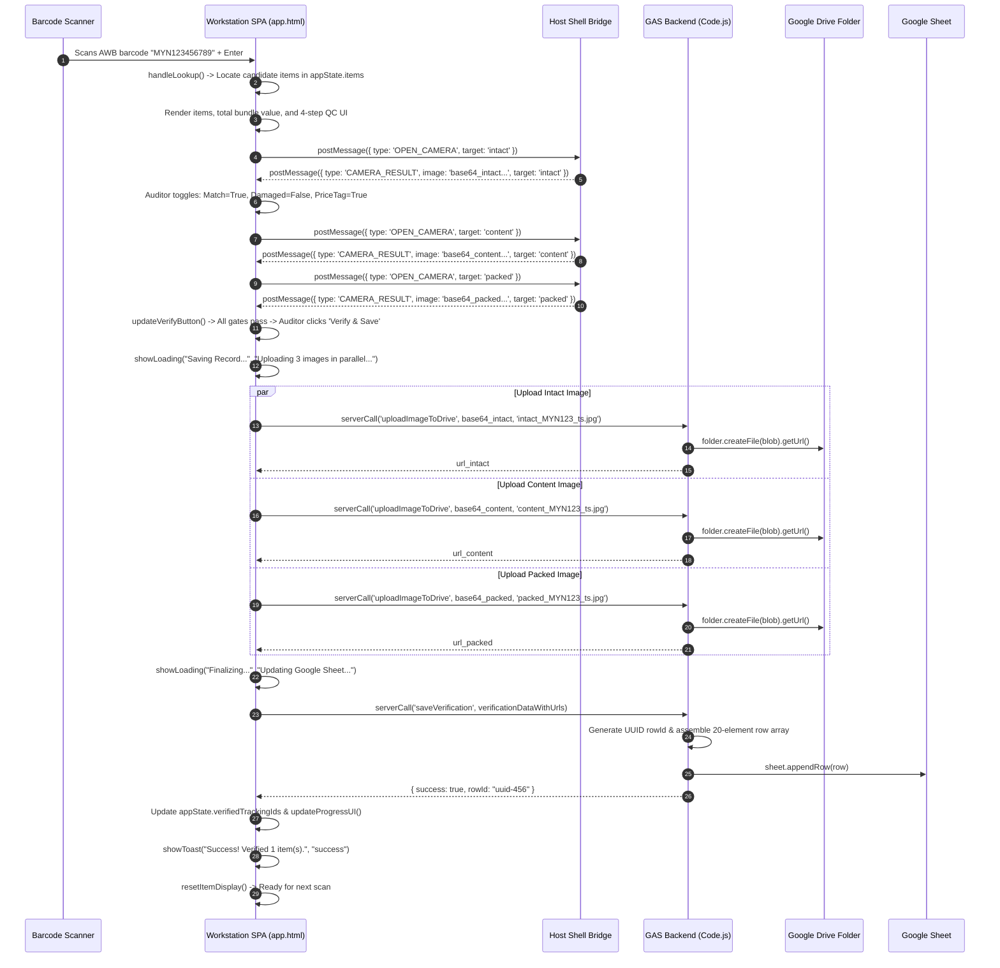
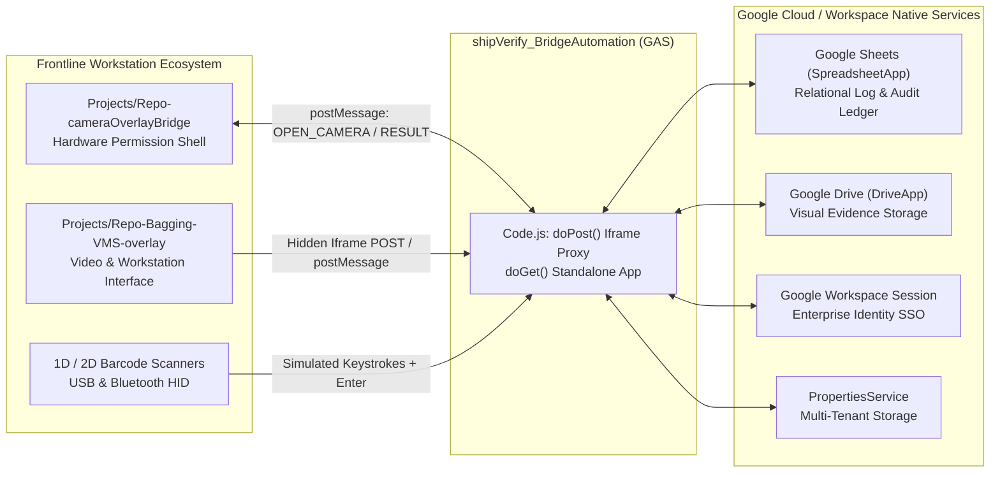

# shipVerify_BridgeAutomation (Shipment Verification App)

## 1. Overview

**shipment_verification_bridge** (user-facing title: **VerifyScan Pro** / **Shipment Verification**, internal code title: `Shipment Verification App`, repository & slug identifier: `shipVerify_BridgeAutomation`) is an enterprise-grade [[Google Apps Script]] (GAS) logistics quality control (QC) and hardware integration bridge. It serves as a unified frontline workstation and headless RPC bridge across supply chain sorting hubs, returns processing centers, and warehouse bagging stations (specifically within [[Myntra]] / [[Flipkart]] supply chain networks).

```
PROJECT NAME:      shipVerify_BridgeAutomation
SUBTITLE:          Shipment Verification App
SLUG / IDENTIFIER: shipVerify_BridgeAutomation
SCRIPT ID:         1fowS8FduU4VNAa0vx8nn4Y0y4Dz1VMRaeWZp8y_LK_8Sao8Ntya0o2CH
SCRIPT URL:        https://script.google.com/home/projects/1fowS8FduU4VNAa0vx8nn4Y0y4Dz1VMRaeWZp8y_LK_8Sao8Ntya0o2CH/edit
LOCAL CODE PATH:   C:\Users\User\Desktop\gas apps\shipVerify_BridgeAutomation
TARGET NOTE:       C:\Users\User\Desktop\gptd\prompt_project memory\shipVerify_BridgeAutomation.md
CLUSTER:           warehouse-vision-vms
PLATFORM SERVICE:  Google Apps Script (V8 Engine)
DEPLOYMENT ACCESS: DOMAIN (executeAs: USER_DEPLOYING)
```

### The Operational Problem
In high-velocity last-mile e-commerce and reverse-logistics distribution centers, physical shipment audits are vulnerable to severe operational friction, customer dispute fraud, and technical integration barriers:
* **Dispute and Fraud Exposure**: Returns and outbound shipments frequently incur customer disputes alleging damaged goods, wrong items received, or missing price tags. Without auditable, high-resolution photographic proof captured at the exact moment of hub processing, operations teams cannot dispute claims or pinpoint vendor vs. carrier liabilities.
* **Prohibitive SaaS Infrastructure Overhead**: Traditional commercial architectures mandate dedicated backend databases ([[Firebase Firestore]], [[MongoDB]]), custom authentication providers ([[Firebase Auth]], [[Auth0]]), and commercial third-party digital asset management platforms ([[Cloudinary]], [[AWS S3]]). In large-scale logistics networks, this introduces significant recurring licensing expenses, compliance friction, credential provisioning latency, and vendor lock-in.
* **Browser Sandbox & Permissions Policy Camera Blocking**: When Google Apps Script Web Applications are embedded within enterprise intranets, portals, or iframe wrappers, Google enforces sandboxing under the `googleusercontent.com` domain. Modern Chromium browsers enforce strict **Permissions Policy** rules that block camera access (`navigator.mediaDevices.getUserMedia()`), leaving embedded web applications unable to stream video or capture photographic evidence.
* **Cross-Origin Resource Sharing (CORS) Barriers**: Standalone hardware workstation overlays—such as Bagging-VMS-overlay and cameraOverlayBridge—run on local station hosts (`http://localhost:8080`) or GitHub Pages. These external frontends cannot directly invoke Google Apps Script endpoints via standard `fetch()` or `XMLHttpRequest` due to Google's redirect mechanism and strict CORS headers, which block client-side preflight `OPTIONS` requests.
* **Multi-Hub Operational Isolation**: Different distribution centers (e.g., Delhi North Hub, Bangalore Hub, Mirzapur Hub) require their verification records and photo archives to route to distinct regional Google Sheets and Google Drive folders without deploying isolated codebases or duplicating script projects.

### The Architectural Solution
`shipVerify_BridgeAutomation` solves these challenges by combining a 100% native [[Google Workspace]] serverless backend with a dual-execution architectural paradigm:
1. **Serverless Infrastructure Replacement**: Replaces Firebase Auth with native Google Workspace identity (`Session.getActiveUser().getEmail()`), replaces Firestore with structured 20-column relational [[Google Sheets]] (`SpreadsheetApp`), and replaces Cloudinary/S3 with automated [[Google Drive]] folder hierarchies (`DriveApp`).
2. **Dual-Mode Architectural Deployment**:
   * **Full-Featured Workstation GUI (`app.html`)**: A complete single-page application (SPA) featuring TSV/Excel batch import, automatic item bundle splitting (`splitProducts`), physical USB/Bluetooth barcode scanner integration, an interactive 4-step quality audit pipeline, and an administrative historical dashboard with live search, date-range filtering, bulk purge operations, and client-side CSV generation.
   * **Headless REST API / CORS Bridge (`Code.js:doPost`)**: A dynamic action-routing backend that implements an **Iframe postMessage Proxy Pattern**. External frontends (Bagging-VMS-overlay, cameraOverlayBridge) submit form data targeted at a hidden iframe; `Code.js:doPost()` executes the requested action and returns an HTML page that triggers `window.parent.postMessage()`, completely bypassing browser CORS barriers without an intermediate proxy server.
3. **Top-Window Camera Permissions Bridge**: Implements a bidirectional `postMessage` protocol between the embedded web app and its top-level host shell. When an operator triggers a photo capture, the web app requests the host frame (`window.top`) to invoke `getUserMedia()` outside the sandboxed iframe, returning the captured JPEG data URL back to the workstation.
4. **Multi-User / Multi-Hub Isolation Engine (`getPropKey_`)**: Utilizes `PropertiesService.getUserProperties()` with sanitized user-email prefixes (`u_<safeEmail>_<key>`). This guarantees that independent logistics coordinators and hub stations maintain separate target `sheetId`, `folderId`, and `hubName` configurations within a single shared deployment.
5. **Standardized 4-Step Physical Inspection Protocol**:
   * *Step 1*: Intact packaging photo evidence (`data-target="intact"`).
   * *Step 2*: 3-point QC checklist (Item Match, Physical Condition/Damage, Price Tag Intactness).
   * *Step 3*: Unpacked product content photo evidence (`data-target="content"`).
   * *Step 4*: Final repacked flyer with shipping/RTO label attached (`data-target="packed"`).
   * *Persistence*: Automatic calculation of `overallResult` (`PASS` vs `FAIL`) with parallel Drive image uploads and atomic spreadsheet append operations.

---

## 2. Tech Stack

| Layer / Component | Technology / Standard | Version / Specification | Source Code Reference | Operational Role & Implementation Details |
| :--- | :--- | :--- | :--- | :--- |
| **Backend Runtime** | [[Google Apps Script]] (GAS) | V8 Engine (`runtimeVersion: "V8"`) | `appsscript.json:5` | High-performance modern ECMAScript runtime executing server-side RPC methods, spreadsheet data ingestion, image decoding, and multi-tenant property routing. |
| **Identity & Authentication** | Google Workspace Session | `Session.getActiveUser().getEmail()` | `Code.js:29, 97-105, 109-112` | Enterprise Single Sign-On (SSO); extracts domain authenticated email. Supports context override via `payload.userEmail` for external headless bridges. |
| **Database / Ledger** | GAS SpreadsheetApp | Native Google Workspace API | `Code.js:151, 222-248, 252-310, 312-403, 405-474` | Structured relational datastore; manages schema enforcement (20-column `HEADERS`), atomic row appending, UUID generation, index searches, and batch row deletions. |
| **Evidence & Media Storage** | GAS DriveApp | Native Google Workspace API | `Code.js:159, 489-526, 532-589, 628-643` | Object storage for inspection photos; decodes Base64 JPEG payloads into `image/jpeg` Blobs, stores them in hub-specific folders, assigns public view links, and handles trashing. |
| **User Configuration Store** | GAS PropertiesService | `PropertiesService.getUserProperties()` | `Code.js:115-130, 169-175, 649-656` | Key-value storage engine; persists hub parameters (`sheetId`, `folderId`, `hubName`) scoped by sanitized user email (`getPropKey_`) to guarantee multi-tenant isolation. |
| **Timezone Standard** | Indian Standard Time | `Asia/Kolkata` (UTC+05:30) | `appsscript.json:2` | Aligns all timestamp evaluations, folder creation dates, and spreadsheet logs (`ScannedAt`) with Indian logistics hub shift schedules. |
| **Exception Logging** | Google Cloud Stackdriver | `STACKDRIVER` | `appsscript.json:4` | Captures uncaught backend exceptions, RPC failures, Drive upload errors, and `Logger.log()` streams directly to Google Cloud Logging. |
| **Web Presentation** | GAS HtmlService | `HtmlService.createHtmlOutputFromFile` | `Code.js:15-20` | Serves the standalone client SPA, injects viewport meta headers, and configures `ALLOWALL` X-Frame-Options for portal embedding. |
| **Cross-Origin Bridge** | Hidden Iframe `postMessage` Proxy | Native HTML5 Messaging (`postMessage`) | `Code.js:59-74, 80-88` | Bypasses browser CORS restrictions for external frontends (Bagging-VMS-overlay, cameraOverlayBridge) by returning an auto-executing script targeting `window.parent`. |
| **Client UI Architecture** | Vanilla HTML5 / ES6+ SPA | Zero-dependency Single Page App | `app.html:1-2289` | Monolithic, self-contained client workstation delivering high-velocity DOM updates, responsive modals, and hardware scanner event handling without a build step. |
| **Client Typography** | Google Fonts (`Outfit`, `Inter`) | Outfit (Headings: 400–700), Inter (Body: 400–700) | `app.html:9-13, 27-28` | Industrial-grade typography optimized for warehouse workstation readability, numeric tracking clarity, and visual status badging. |
| **Hardware Integration** | Barcode Scanner Keyboard Wedge | DOM KeyboardEvent (`Enter` key listener) | `app.html:1774, 2174` | Listens for rapid serial keystroke events from 1D/2D USB and Bluetooth handheld barcode scanners targeting `#tracking-input`. |
| **Hardware Camera Bridge** | WebRTC MediaStream / Top-Window Bridge | `window.top.postMessage` | `app.html:1507-1536, 1838-1863` | Relays camera capture requests to top-level host shell, bypassing Chrome Permissions Policy iframe blocking on `getUserMedia()`. |
| **Client Data Export** | HTML5 Blob & Anchor Download | Client-side RFC 4180 CSV generation | `app.html:2069-2110` | Transforms filtered in-memory verification arrays into formatted CSV files and triggers instant local file downloads via synthetic anchor clicks. |
| **Deployment & Sync** | `@google/clasp` | Clasp CLI v2.4+ | `.clasp.json:1-16` | Manages local-to-cloud bidirectional synchronization between local workspace files and remote Google Apps Script infrastructure. |

---

## 3. Architecture

### System Topology & Operational Modes

`shipVerify_BridgeAutomation` is engineered to operate concurrently in two distinct execution modes:
1. **Direct Workstation SPA Mode**: Logistics operators open the web app directly in a browser tab or embedded within an enterprise shell (`app.html`), interacting with the complete graphical UI.
2. **Headless Hardware Bridge RPC Mode**: External specialized client web applications (such as Bagging-VMS-overlay and cameraOverlayBridge) communicate via HTTP POST (`doPost`) using a hidden iframe form proxy, leveraging the backend strictly for image storage and spreadsheet record management.

```mermaid
flowchart TD
    subgraph WorkstationEnvironment ["Frontline Hub Workstation"]
        Operator["Logistics Operator / Auditor"]
        Scanner["Hardware Barcode Scanner<br/>(USB / Bluetooth HID)"]
        CameraDevice["High-Res USB / Web Camera"]
        
        subgraph HostShell ["Host Shell (cameraOverlayBridge / Parent Window)"]
            HostWin["Top-Level Document (Unrestricted Origin)<br/>allow='camera; microphone'"]
            WebRTCEngine["WebRTC getUserMedia() Engine<br/>Live Video Canvas & Capture"]
        end

        subgraph EmbeddedWorkstation ["Embedded Workstation SPA (app.html)"]
            UIController["App Controller (appState)<br/>View Management & Event Router"]
            TSVParser["TSV/Excel Ingestion Engine<br/>parseExcel() & splitProducts()"]
            ScanWedge["Barcode Scan Buffer<br/>#tracking-input"]
            QCPipeline["4-Step QC Inspection Workflow<br/>Checks: Match, Condition, Tag"]
            DashEngine["Historical Audit Dashboard<br/>Search, Filter, Purge, CSV Export"]
        end
        
        subgraph ExternalFrontend ["External Workstation (Bagging-VMS-overlay)"]
            VMSClient["VMS Recording Interface<br/>WebM VP9 Video Capture"]
            HiddenIframe["Hidden Form Proxy &lt;iframe&gt;<br/>Target for Cross-Origin POST"]
        end
    end

    subgraph GASCloud ["Google Apps Script Backend (V8 Engine)"]
        Router["Code.js: doPost() / doGet()<br/>Dynamic Action Dispatcher"]
        AuthService["Identity Resolver<br/>_getActiveEmail() & Session"]
        UserConfigService["Multi-Tenant Config Engine<br/>PropertiesService (u_email_*)"]
        MediaService["Drive Storage Manager<br/>uploadImageToDrive()"]
        LedgerService["Relational Sheet Manager<br/>saveVerification() & ensureHeaders_()"]
        AuditService["Audit & Purge Engine<br/>getVerifications() & deleteMultiple()"]
    end

    subgraph GoogleWorkspaceCloud ["Google Workspace Infrastructure (Cloud Storage)"]
        UserProps[("PropertiesService User Store<br/>sheetId, folderId, hubName")]
        TargetDrive[("Regional Google Drive Folder<br/>intact_*.jpg, content_*.jpg, packed_*.jpg")]
        TargetSheet[("Regional Google Sheet<br/>20-Column Tabular Inspection Log")]
    end

    %% Workstation Inputs
    Operator -->|Pastes Manifest TSV| TSVParser
    Scanner -->|Simulates Keystrokes + Enter| ScanWedge
    ScanWedge -->|Triggers Lookup| UIController
    TSVParser -->|Loads In-Memory Items| UIController
    
    %% Camera Inter-Frame Protocol
    QCPipeline -->|postMessage: OPEN_CAMERA| HostWin
    HostWin --> WebRTCEngine
    CameraDevice --> WebRTCEngine
    WebRTCEngine -->|postMessage: CAMERA_RESULT (Base64)| UIController
    
    %% GUI to GAS RPC
    UIController -->|google.script.run.serverCall()| GASCloud
    
    %% External Bridge Flow
    VMSClient -->|Submits Form with JSON Payload| HiddenIframe
    HiddenIframe -->|HTTP POST payloadStr| Router
    Router -->|Returns HTML with window.parent.postMessage| HiddenIframe
    HiddenIframe -->|Fires postMessage with result| VMSClient
    
    %% GAS Internal Processing
    Router --> AuthService
    Router --> UserConfigService
    Router --> MediaService
    Router --> LedgerService
    Router --> AuditService
    
    %% Storage Connections
    UserConfigService <-->|Read / Write Properties| UserProps
    MediaService -->|Base64 Decode & Create Blob| TargetDrive
    LedgerService -->|appendRow() 20 Cols| TargetSheet
    AuditService <-->|Query / Delete Rows & Files| TargetSheet
    AuditService -->|setTrashed(true)| TargetDrive
```

---

### Hidden Iframe `postMessage` CORS-Bypass Sequence

Standard cross-origin `fetch()` requests from `localhost` or GitHub Pages to `script.google.com` fail due to Google's redirect mechanism and lack of CORS headers on Apps Script endpoints. `shipVerify_BridgeAutomation` bypasses this limitation entirely using an iframe form submission proxy:

```mermaid
sequenceDiagram
    autonumber
    participant ExtClient as External Frontend (Bagging-VMS / Client)
    participant HiddenIframe as Hidden DOM <iframe>
    participant GASBackend as GAS Engine (Code.js: doPost)
    participant SheetDrive as Google Sheets / Drive

    ExtClient->>ExtClient: Construct JSON Payload:<br/>{ action: "saveVerification", args: [...], callId: "uuid-123", userEmail: "user@domain.com" }
    ExtClient->>HiddenIframe: Inject hidden <form> with target="hidden_iframe" & method="POST"
    ExtClient->>HiddenIframe: Set form action = "https://script.google.com/.../exec"
    ExtClient->>HiddenIframe: Submit form programmaticallly (payload in hidden input)
    HiddenIframe->>GASBackend: HTTP POST /exec (application/x-www-form-urlencoded)
    Note over GASBackend: doPost(e) extracts e.parameter.payload<br/>Sets _activeUserEmail = payload.userEmail<br/>Dispatches this[action].apply(this, args)
    GASBackend->>SheetDrive: Execute Drive file creation & Sheet appendRow
    SheetDrive-->>GASBackend: Return rowId / upload status
    Note over GASBackend: Generates HTML string:<br/><html><body><script><br/>window.parent.postMessage({callId, success, result}, '*')<br/></script></body></html>
    GASBackend-->>HiddenIframe: Return 200 OK with HTML Content
    Note over HiddenIframe: Browser renders HTML response inside iframe.<br/>Script immediately executes in iframe context.
    HiddenIframe->>ExtClient: window.parent.postMessage({ callId: "uuid-123", success: true, result: {...} }, '*')
    Note over ExtClient: Client message listener detects callId matching "uuid-123"<br/>Resolves client Promise! (Zero CORS error)
```



---

### Camera Permission Sandbox Bypass Workflow

Google Apps Script enforces an iframe sandbox for Web Apps (`https://n-...-script.googleusercontent.com/userCodeAppPanel`). Chromium-based browsers enforce Permissions Policy headers that disable hardware device access (`getUserMedia`) inside this sandbox. `shipVerify_BridgeAutomation` circumvents this through its host-bridge protocol:

```mermaid
sequenceDiagram
    autonumber
    participant Auditor as Hub Auditor
    participant AppIframe as VerifyScan App (app.html inside Iframe)
    participant HostParent as Host Shell (cameraOverlayBridge / Top Window)
    participant WebRTC as Hardware WebRTC Camera Stream

    Auditor->>AppIframe: Clicks "📷 Capture Intact" (data-target="intact")
    AppIframe->>AppIframe: Show local waiting modal ("Camera Opening...")
    AppIframe->>HostParent: window.top.postMessage({ type: "OPEN_CAMERA", target: "intact" }, "*")
    Note over HostParent: Host is top-level document with<br/>allow="camera; microphone" attribute
    HostParent->>WebRTC: navigator.mediaDevices.getUserMedia({ video: { facingMode: 'environment' } })
    WebRTC-->>HostParent: Deliver MediaStream
    HostParent->>HostParent: Render full-screen camera overlay above iframe
    Auditor->>HostParent: Positions parcel in crosshairs & clicks "Snapshot"
    HostParent->>HostParent: Draw video frame to HTML5 Canvas -> toDataURL('image/jpeg', 0.85)
    HostParent->>HostParent: Stop all video tracks & close camera overlay
    HostParent->>AppIframe: postMessage({ type: "CAMERA_RESULT", image: "data:image/jpeg;base64,...", target: "intact" }, "*")
    AppIframe->>AppIframe: Hide local waiting modal
    AppIframe->>AppIframe: Store Base64 string in appState.images.intact
    AppIframe->>AppIframe: Render image preview thumbnail in DOM
    AppIframe->>AppIframe: Call updateVerifyButton() (Checks if all 3 photos & 3 QC checks are complete)
```

---

### Physical Inspection & Verification State Machine

```mermaid
stateDiagram-v2
    [*] --> Initializing: Application Boot (init)
    
    state OnboardingState {
        Initializing --> Authenticating: serverCall('getCurrentUser')
        Authenticating --> CheckingConfig: serverCall('getUserConfig')
        CheckingConfig --> SetupModal: Config is null (First-time user)
        SetupModal --> ValidatingSetup: Auditor inputs Sheet URL, Drive URL, Hub Name
        ValidatingSetup --> SavingConfig: serverCall('saveUserConfig')
        SavingConfig --> Configured: Sheet validated, folder validated, headers ensured
        CheckingConfig --> Configured: Valid config exists in UserProperties
    }

    state DataIngestionState {
        Configured --> AwaitingManifest: switchView('input')
        AwaitingManifest --> ParsingManifest: Auditor pastes TSV data & clicks 'Proceed'
        ParsingManifest --> ValidatingColumns: parseExcel(text)
        ValidatingColumns --> SplittingBundles: Detect rawQty > 1 -> splitProducts(rawName)
        SplittingBundles --> ScanningReady: In-memory items loaded into appState.items
    }

    state VerificationWorkflow {
        ScanningReady --> AwaitingScan: switchView('scanning')
        AwaitingScan --> LookingUp: Scanner inputs Tracking ID + Enter (handleLookup)
        LookingUp --> AwaitingScan: Tracking ID already verified or not found
        LookingUp --> BundleLoaded: Matched candidates displayed (displayItems)
        
        state StepExecution {
            BundleLoaded --> Step1_IntactPhoto: Capture intact packaging
            Step1_IntactPhoto --> Step2_QCChecklist: Toggle Match, Damaged, PriceTag
            Step2_QCChecklist --> Step3_ContentPhoto: Capture unpackaged contents
            Step3_ContentPhoto --> Step4_PackedPhoto: Capture final packed flyer + label
            Step4_PackedPhoto --> ReadyToVerify: All 3 images & 3 checks satisfied
        }

        ReadyToVerify --> SubmittingRecord: Auditor clicks 'Verify & Save'
        SubmittingRecord --> UploadingImages: Parallel serverCall('uploadImageToDrive') x3
        UploadingImages --> AppendingSheetRow: serverCall('saveVerification') with URLs
        AppendingSheetRow --> RecordPersisted: Update progress counter & appState.verifiedTrackingIds
    }

    RecordPersisted --> AwaitingScan: Remaining shipments exist
    RecordPersisted --> AllCompletedView: Total verified == Total imported
    
    state DashboardState {
        Configured --> DashboardView: User switches to Dashboard tab
        DashboardView --> QueryingRecords: serverCall('getVerifications', filter)
        QueryingRecords --> DisplayingTable: Render rows, images links, delete buttons
        DisplayingTable --> ExportingCSV: handleDownloadCSV()
        DisplayingTable --> PurgingRecords: handleDeleteRecord() / handleBulkDelete()
    }
```



---

## 4. Folder & File Structure

The project is structured as a compact, self-contained Google Apps Script repository managed locally via Clasp:

```
C:\Users\User\Desktop\gas apps\shipVerify_BridgeAutomation\
├── .clasp.json          # Clasp project binding configuration (scriptId, rootDir, extensions)
├── appsscript.json      # GAS project manifest (runtime, timezone, logging, webapp access)
├── Code.js              # Server-side backend (routing, sheets DB, drive storage, properties) (657 lines)
└── app.html             # Client-side SPA (HTML5 markup, CSS styles, UI controllers) (2,289 lines)
```

### Detailed Component Inventory

| File Name | Size (Bytes) | Total Lines | Primary Responsibility | Key Functions / Elements |
| :--- | :--- | :--- | :--- | :--- |
| `.clasp.json` | 276 | 16 | Links local Git working directory to the remote Apps Script cloud container. | `scriptId: "1fowS8FduU4VNAa0vx8nn4Y0y4Dz1VMRaeWZp8y_LK_8Sao8Ntya0o2CH"`, `rootDir: ""` |
| `appsscript.json` | 194 | 10 | Defines execution runtime, timezone settings, logging sinks, and web app publication security. | `runtimeVersion: "V8"`, `timeZone: "Asia/Kolkata"`, `exceptionLogging: "STACKDRIVER"`, `webapp.access: "DOMAIN"`, `webapp.executeAs: "USER_DEPLOYING"` |
| `Code.js` | 22,384 | 657 | Comprehensive server-side application layer providing HTTP routing, database management, Drive file storage, and RPC dispatching. | `doGet()`, `doPost()`, `getAppUrl()`, `getCurrentUser()`, `getUserConfig()`, `saveUserConfig()`, `ensureHeaders_()`, `saveVerification()`, `getVerifications()`, `deleteVerification()`, `deleteMultipleVerifications()`, `deleteAllForFilter()`, `uploadImageToDrive()`, `saveVerificationWithImages()`, `getPropKey_()` |
| `app.html` | 94,780 | 2,289 | Monolithic client single-page application combining responsive CSS styles, UI components, modals, and client JavaScript. | `parseExcel()`, `splitProducts()`, `openCameraFn()`, `closeCameraFn()`, `serverCall()`, `authenticateUser()`, `handleParseExcel()`, `handleLookup()`, `handleVerification()`, `loadDashboardData()`, `handleDownloadCSV()`, `handleBulkDelete()`, `handleDeleteAllForFilter()` |

---

## 5. Core Modules & Responsibilities

### Server-Side Backend (`Code.js`)

#### 1. Web App Entry & Routing (`Code.js:14-26`)
* `doGet()` (`Code.js:15-20`): Serves `app.html` as a responsive web app. Sets page title to `'Shipment Verification'`, configures `XFrameOptionsMode.ALLOWALL` to enable embedding inside host frames, and injects a mobile viewport meta tag (`width=device-width, initial-scale=1.0`).
* `getAppUrl()` (`Code.js:24-26`): Executes `ScriptApp.getService().getUrl()` and returns the published web app URL. Provided to allow operators or scripts to open the web app directly in a new top-level browser tab when running in restricted environments where iframe camera access is blocked.

#### 2. Headless REST API & Cross-Origin Proxy (`Code.js:28-95`)
* `_activeUserEmail` (`Code.js:29`): Request-scoped global variable caching the authenticated user's email for the current execution instance.
* `doPost(e)` (`Code.js:31-89`): Universal REST API dispatcher.
  * Ingests data from `e.parameter.payload` (form-encoded POST from hidden iframe) or `e.postData.contents` (direct JSON POST).
  * Parses payload extracting `{ action, args, callId, userEmail }`.
  * Contextualizes identity: if `payload.userEmail` is supplied, assigns it to `_activeUserEmail` (`Code.js:44`).
  * Dynamic RPC Execution: dispatches `this[action].apply(this, args)` (`Code.js:54`).
  * **CORS Proxy Response**: Wraps execution output in an HTML template containing `<script>window.parent.postMessage(responseData, '*');</script>` and returns it with `XFrameOptionsMode.ALLOWALL` (`Code.js:68-73`). This triggers cross-document messaging in the client browser, bypassing all CORS preflight limitations.
  * Catch block (`Code.js:75-88`): Traps all runtime exceptions, stringifies the error message, and returns an identical `postMessage` proxy response with `success: false` and the matching `callId`.
* `doOptions(e)` (`Code.js:92-95`): Handles CORS preflight requests by returning an empty `ContentService.createTextOutput("")`.
* `_getActiveEmail()` (`Code.js:97-105`): Internal helper resolving operator identity. Checks `_activeUserEmail` first, falls back to `Session.getActiveUser().getEmail()`, and defaults to `'anonymous@user.com'` if unauthenticated.

#### 3. Authentication & User Profile (`Code.js:108-112`)
* `getCurrentUser()` (`Code.js:109-112`): Resolves current operator profile. Returns `{ email: email, displayName: email.split('@')[0] }`.

#### 4. Multi-Tenant User Configuration (`Code.js:114-196`)
* `getUserConfig()` (`Code.js:115-130`): Retrieves saved configuration from `PropertiesService.getUserProperties()` using keys namespaced via `getPropKey_()`. Returns `{ sheetId, folderId, hubName }` or `null` if unconfigured.
* `saveUserConfig(sheetUrl, folderUrl, hubName)` (`Code.js:132-182`): Validates and persists hub parameters:
  * Validates non-empty `hubName`.
  * Parses `sheetId` from Google Sheet URL via `extractSheetId_()`.
  * Parses `folderId` from Google Drive Folder URL via `extractFolderId_()`.
  * Verifies edit access to Google Sheet via `SpreadsheetApp.openById(sheetId).getName()`.
  * Verifies edit access to Google Drive Folder via `DriveApp.getFolderById(folderId).getName()`.
  * Executes `ensureHeaders_(sheetId)` to guarantee database integrity.
  * Writes properties to `PropertiesService.getUserProperties()`.
* `updateHubName(hubName)` (`Code.js:184-191`): Updates solely the hub display name for the current operator.
* `updateUserConfig(sheetUrl, folderUrl, hubName)` (`Code.js:193-196`): Full profile update wrapper delegating to `saveUserConfig()`.

#### 5. Database Schema & Ledger Management (`Code.js:198-310`)
* `HEADERS` (`Code.js:199-220`): Constant defining the 20-column relational schema:
  `['TrackingID', 'ItemName', 'Quantity', 'Price', 'HubName', 'CheckMatch', 'CheckDamaged', 'CheckPricetag', 'OverallResult', 'Status', 'ScannedAt', 'UserEmail', 'UserName', 'Vertical', 'OrderID', 'RowID', 'ImageIntact', 'ImageContent', 'ImagePacked', 'RawData']`.
* `ensureHeaders_(sheetId)` (`Code.js:222-248`): Validates row 1 of the target spreadsheet. If cell `(1, 1)` does not match `TrackingID`, clears row 1, writes the `HEADERS` array, sets font weight to bold, and freezes row 1.
* `saveVerification(data)` (`Code.js:252-310`): Main verification persistence method.
  * Validates user configuration.
  * Generates unique UUID (`Utilities.getUuid()`) assigned to `RowID` (Column P).
  * Aggregates item names into a comma-separated string (`aggregateName`).
  * Calculates total bundle quantity and total bundle price.
  * Formats boolean QC flags into human-readable strings: `Match`/`Mismatch`, `Damaged`/`OK`, `OK`/`Missing`.
  * Appends structured 20-column row to sheet via `sheet.appendRow(row)`. Serializes raw item breakdown as JSON in Column T (`RawData`).

#### 6. Verification History & Query Engine (`Code.js:312-403`)
* `getVerifications(filter)` (`Code.js:312-403`): Reads all verification records from the configured spreadsheet.
  * Scans from row 2 to `sheet.getLastRow()`.
  * Enforces user isolation: filters rows matching `r[11] === email` (UserEmail check, `Code.js:334`).
  * Deserializes `RawData` (Column T) back into structured item objects.
  * Reconstitutes full verification records including checks, images, and totals.
  * Evaluates query filters:
    * `filter.searchQuery`: Exact match on `trackingId` (`Code.js:374-377`).
    * `filter.mode === 'today'`: Matches `scannedAt` starting with `YYYY-MM-DD` (`Code.js:378-382`).
    * `filter.mode === 'date'`: Matches specific user-selected date (`Code.js:383-386`).
    * `filter.mode === 'range'`: Matches date range between `startDate` and `endDate` (`Code.js:387-392`).
    * Default: Returns the 5 most recent records (`Code.js:394-397`).
  * Sorts records by `scannedAt` descending (`Code.js:400`).

#### 7. Audit Deletion & File Purging (`Code.js:405-485`)
* `deleteVerification(rowId)` (`Code.js:405-433`): Deletes a single record. Iterates rows to locate matching `RowID` (Column P). Calls `deleteImageFromDrive_()` for the 3 associated Drive image URLs (Columns Q, R, S), and executes `sheet.deleteRow(i + 2)`.
* `deleteMultipleVerifications(rowIds)` (`Code.js:435-474`): Batch deletion engine. Builds a hash set of target IDs, scans rows, calls `deleteImageFromDrive_()` for each matching row's photos, and collects row indices. Sorts indices descending (`b - a`) to prevent index shifting while calling `sheet.deleteRow()`.
* `deleteAllForFilter(filter)` (`Code.js:476-485`): Administrative bulk wipe. Executes `getVerifications(filter)` to collect all matching `rowId` keys, then passes them to `deleteMultipleVerifications()`.

#### 8. Drive Media Ingestion & Optimization (`Code.js:487-600`)
* `uploadImageToDrive(base64Data, fileName)` (`Code.js:489-526`): Uploads a single image. Strips data URL prefixes, decodes Base64 into a byte array via `Utilities.base64Decode()`, creates an `image/jpeg` Blob, and writes the file to the target Drive folder. Attempts to configure sharing to `DriveApp.Access.ANYONE_WITH_LINK` (`Permission.VIEW`). Returns the viewable Drive URL.
* `saveVerificationWithImages(data, imageItems)` (`Code.js:532-589`): Optimized atomic RPC endpoint combining image uploads and spreadsheet append into a single round-trip. Sequential file creation followed by `sheet.appendRow()`.
* `uploadBatchImagesToDrive(items)` (`Code.js:595-600`): Batch upload utility mapping an array of Base64 objects to Drive files.

#### 9. Utilities & Multi-Tenant Namespace (`Code.js:602-656`)
* `extractSheetId_(url)` (`Code.js:604-609`): Regex parser extracting sheet ID from standard Google Sheets URLs (`/\/spreadsheets\/d\/([a-zA-Z0-9_-]+)/`).
* `extractFolderId_(url)` (`Code.js:611-618`): Regex parser extracting folder ID from Google Drive URLs (`/\/folders\/([a-zA-Z0-9_-]+)/` or `/[?&]id=([a-zA-Z0-9_-]+)/`).
* `getTodayDateString_()` (`Code.js:620-626`): Generates zero-padded `YYYY-MM-DD` string in current timezone.
* `deleteImageFromDrive_(url)` (`Code.js:628-643`): Extracts file ID from Drive URLs (`/\/file\/d\/([a-zA-Z0-9_-]+)/` or `/[?&]id=([a-zA-Z0-9_-]+)/`) and moves the file to trash via `DriveApp.getFileById(fileId).setTrashed(true)`. Non-blocking: logs warnings without throwing.
* `getPropKey_(baseKey)` (`Code.js:649-656`): Multi-tenant isolation helper. Generates namespaced property keys: `'u_' + safeEmail + '_' + baseKey` (e.g., `u_john_doe_domain_com_sheetId`). If anonymous, falls back to `'gen_' + baseKey`.

---

### Client-Side Workstation (`app.html`)

#### 1. Excel / TSV Parser Module (`app.html:1425-1497`)
* `parseExcel(text)` (`app.html:1427-1492`): High-speed clipboard ingestion engine.
  * Splits raw text on newlines and tabs (`\t`).
  * Normalizes header strings to uppercase and maps required columns: `TRACKING ID`, `PRODUCT NAME`, `PRODUCT QUANTITY`, `VALUE` / `PRICE`, `BRAND`, `TYPE`, `VERTICAL`, `ORDER ID`.
  * Validates mandatory columns (`TRACKING ID` and `PRODUCT NAME`).
  * Evaluates multi-quantity rows (`rawQty > 1`). If a row represents a multi-item bundle, calls `splitProducts(rawName)`.
  * Distributes bundle price evenly across split sub-items: `item.price = (parseFloat(rawPrice) / rawQty).toFixed(2)`.
  * Generates sub-IDs: `item.subId = trackingId + '-' + (idx + 1)`.
* `splitProducts(text)` (`app.html:1493-1497`): Algorithmic product bundle splitter. Uses regex `/[^:]+:\S+/g` to identify product strings formatted with colon delimiters (e.g., `Item Title:Category`), returning an array of separate item tokens.

#### 2. Camera Host-Bridge Module (`app.html:1500-1536, 1838-1863`)
* Top-Window Bridge Listener (`app.html:1507-1536`): Listens for `message` events from `window.top`.
  * Filters for `event.data.type === 'CAMERA_RESULT'`.
  * Extracts Base64 image string and target slot (`intact`, `content`, `packed`).
  * Stores data URL in `appState.images[target]`.
  * Renders `` thumbnail into target preview container.
  * Hides primary capture button and injects "📷 Capture Again" retake button.
  * Closes local waiting overlay and calls `updateVerifyButton()`.
* `openCameraFn(target)` (`app.html:1838-1853`): Activates camera capture. Sets `appState.activeCameraTarget`, shows local waiting indicator, and executes `window.top.postMessage({ type: 'OPEN_CAMERA', target: target }, '*')`.
* `closeCameraFn()` (`app.html:1855-1862`): Cancels active camera session via `window.top.postMessage({ type: 'CLOSE_CAMERA' }, '*')`.

#### 3. Client RPC Bridge (`app.html:1548-1560`)
* `serverCall(fnName, ...args)` (`app.html:1550-1560`): Promise-based wrapper around `google.script.run`. Converts callback hell into clean `async`/Promise chains with unified `withSuccessHandler` and `withFailureHandler` error propagation.

#### 4. Application State Store (`app.html:1567-1577`)
* `appState`: Centralized reactive state object:
  ```javascript
  var appState = {
      items: [],                  // Parsed manifest item records
      currentItems: [],           // Active items for scanned tracking ID
      images: { intact: null, content: null, packed: null }, // Captured Base64 strings
      checks: { match: null, damaged: null, pricetag: null },// QC boolean flags
      activeCameraTarget: null,   // Currently active camera target slot
      user: null,                 // Current user profile { email, displayName }
      hubName: null,              // Active hub name string
      config: null,               // Active hub configuration { sheetId, folderId, hubName }
      verifiedTrackingIds: {},    // Hash map of verified tracking IDs in current session
      dashFilter: 'recent',       // Active dashboard filter mode: 'recent'|'today'|'date'|'range'
      dashSelectedDate: null,     // Selected filter date YYYY-MM-DD
      dashStartDate: null,        // Selected range start date
      dashEndDate: null,          // Selected range end date
      currentDashData: [],        // Cached array of verification records displayed in table
      selectedRecords: {}         // Hash map of rowId keys selected via checkboxes for bulk delete
  };
  ```

#### 5. Scanning & Verification Workflow (`app.html:1772-1972`)
* `handleLookup()` (`app.html:1772-1791`): Triggered by barcode scanner wedge (`Enter` key) or Lookup button.
  * Verifies if tracking ID is already verified in `appState.verifiedTrackingIds`.
  * Filters `appState.items` for matching records.
  * Loads matching candidates into `appState.currentItems`.
  * Resets image and checklist buffers.
  * Executes `displayItems()` and `updateVerifyButton()`.
* `displayItems(items, trackingId)` (`app.html:1793-1823`): Renders bundle details card, total bundle value, individual item category tags, resets camera buttons, and displays verification steps.
* `updateVerifyButton()` (`app.html:1877-1881`): Evaluates completion gates: enables `#btn-verify` only when all 3 photos (`intact`, `content`, `packed`) are non-null AND all 3 QC checks (`match`, `damaged`, `pricetag`) are non-null booleans.
* `handleVerification()` (`app.html:1884-1972`): Submits verification record.
  * Displays full-screen loading spinner ("Saving Record...", "Uploading 3 images in parallel...").
  * Dispatches 3 parallel `serverCall('uploadImageToDrive')` calls for intact, content, and packed images.
  * Collects returned Google Drive URLs into `imageUrls`.
  * Evaluates overall QC result: `overallResult = (match && !damaged && pricetag) ? "PASS" : "FAIL"`.
  * Constructs complete `verificationData` payload and dispatches `serverCall('saveVerification')`.
  * Unshifts new record into local `appState.currentDashData` for zero-latency dashboard synchronization.
  * Marks tracking ID as verified in `appState.verifiedTrackingIds`, updates progress counter, and resets scan interface.

#### 6. Dashboard & Audit Manager (`app.html:1998-2162`)
* `loadDashboardData(searchQuery)` (`app.html:1999-2067`): Queries backend via `serverCall('getVerifications', filter)` and dynamically populates the tabular audit log with bundle details, status pills, clickable image indicators (`I`, `C`, `P`), and delete buttons.
* `handleDownloadCSV()` (`app.html:2069-2110`): Exports currently displayed dashboard records into RFC 4180-compliant CSV format. Generates a synthetic download link using `URL.createObjectURL(blob)` and triggers browser download.
* `handleDeleteRecord(rowId, trackingId)` (`app.html:2122-2131`): Prompts confirmation and deletes an individual record from both Google Sheet and Google Drive.
* `handleBulkDelete()` (`app.html:2133-2145`): Deletes all records currently selected via checkboxes using `serverCall('deleteMultipleVerifications', ids)`.
* `handleDeleteAllForFilter()` (`app.html:2147-2162`): High-privilege administrative action allowing operators to purge all records matching the current active filter (`serverCall('deleteAllForFilter')`).

---

## 6. Data Flow / Key Workflows

### 1. Initial Operator Onboarding & Configuration Setup



---

### 2. Physical Inspection & Dual Storage Persistence



---

## 7. Configuration & Environment

### Google Apps Script Manifest (`appsscript.json`)

```json
{
  "timeZone": "Asia/Kolkata",
  "dependencies": {},
  "exceptionLogging": "STACKDRIVER",
  "runtimeVersion": "V8",
  "webapp": {
    "executeAs": "USER_DEPLOYING",
    "access": "DOMAIN"
  }
}
```

* `timeZone`: `"Asia/Kolkata"` (UTC+05:30). Configures server execution environment to evaluate dates aligned with Indian logistics operating hubs (`Code.js:620`).
* `runtimeVersion`: `"V8"`. Modern V8 JavaScript engine supporting ES6+ classes, arrow functions, `let`/`const`, Promises, and destructuring.
* `exceptionLogging`: `"STACKDRIVER"`. Routes all unhandled exceptions and `Logger.log()` entries directly to Google Cloud Logging.
* `webapp.executeAs`: `"USER_DEPLOYING"`. Executes the web application with the OAuth permissions of the developer who deployed the script. This allows warehouse associates to write to the central Google Sheet and upload to the central Google Drive folder without requiring individual Google Drive edit privileges granted to their user accounts.
* `webapp.access`: `"DOMAIN"`. Restricts application access strictly to authenticated members of the Google Workspace domain (e.g. `myntra.com` / `flipkart.com`).

### Multi-Tenant User Properties Schema (`PropertiesService`)

Parameters are stored using `PropertiesService.getUserProperties()` with keys prefixed by the sanitized operator email (`Code.js:649-656`):

```
Formula: 'u_' + email.replace(/[^a-zA-Z0-9]/g, '_').toLowerCase() + '_' + baseKey
Example: u_coordinator_delhi_hub_com_sheetId
```

| Key Name | Sample Value | Description & Purpose |
| :--- | :--- | :--- |
| `sheetId` | `1foxi4mQkaqMaZSYVQi1LIQbBVYEuv7Q_yVbPniG7RLA` | Google Spreadsheet ID storing the 20-column verification records ledger. |
| `folderId` | `1TYA0VByXijI-v7787GyfzTGrIHd8QA-i` | Google Drive Folder ID storing high-resolution JPEG evidence photos. |
| `hubName` | `Delhi-North-Hub` | Human-readable logistics distribution center or hub facility name. |

---

### Database Schema Specification (20 Columns)

Target Google Sheets must possess the exact 20-column structure enforced by `ensureHeaders_()` (`Code.js:199-220`):

| Col | Header Name | Data Type | Sample Value | Description & Code Source |
| :---: | :--- | :--- | :--- | :--- |
| **A** | `TrackingID` | String | `MYN987654321` | Air Waybill (AWB) or parcel tracking barcode (`Code.js:279`). |
| **B** | `ItemName` | String | `Roadster Men Shirt, Roadster Denim` | Aggregated comma-separated list of product names in shipment bundle (`Code.js:280`). |
| **C** | `Quantity` | Number | `2` | Total item count across all bundle sub-items (`Code.js:281`). |
| **D** | `Price` | Number | `1798.00` | Summed monetary value of all bundle items in INR (`Code.js:282`). |
| **E** | `HubName` | String | `Delhi-North-Hub` | Operating hub identifier retrieved from `getUserConfig()` (`Code.js:283`). |
| **F** | `CheckMatch` | String | `Match` / `Mismatch` | QC result confirming whether physical goods match manifest (`Code.js:284`). |
| **G** | `CheckDamaged` | String | `Damaged` / `OK` | QC result confirming whether physical package/item is damaged (`Code.js:285`). |
| **H** | `CheckPricetag` | String | `OK` / `Missing` | QC result confirming presence of intact vendor price tags (`Code.js:286`). |
| **I** | `OverallResult` | String | `PASS` / `FAIL` | Computed verdict: `PASS` if Match=True, Damaged=False, PriceTag=True (`Code.js:287`). |
| **J** | `Status` | String | `verified` | Operational lifecycle state of verification record (`Code.js:288`). |
| **K** | `ScannedAt` | String (ISO) | `2026-09-17T17:35:10.123Z` | ISO 8601 UTC timestamp of verification completion (`Code.js:289`). |
| **L** | `UserEmail` | String | `auditor@myntra.com` | Authenticated Google Workspace email of inspecting associate (`Code.js:290`). |
| **M** | `UserName` | String | `auditor` | Display name or email prefix of inspecting associate (`Code.js:291`). |
| **N** | `Vertical` | String | `Apparel` / `-` | Product business vertical extracted from imported manifest (`Code.js:292`). |
| **O** | `OrderID` | String | `OD456789123` / `-` | Customer order identification number from manifest (`Code.js:293`). |
| **P** | `RowID` | String (UUID)| `550e8400-e29b-41d4-a716-446655440000` | Unique cryptographic UUID generated via `Utilities.getUuid()` (`Code.js:266, 294`). |
| **Q** | `ImageIntact` | String (URL) | `https://drive.google.com/file/d/.../view` | Direct Google Drive URL to intact packaging photo (`Code.js:295`). |
| **R** | `ImageContent`| String (URL) | `https://drive.google.com/file/d/.../view` | Direct Google Drive URL to unpacked product content photo (`Code.js:296`). |
| **S** | `ImagePacked` | String (URL) | `https://drive.google.com/file/d/.../view` | Direct Google Drive URL to final bagged/labeled flyer photo (`Code.js:297`). |
| **T** | `RawData` | String (JSON)| `[{"itemId":"...","name":"...","price":"..."}]` | JSON serialized array of all individual item objects for full technical fidelity (`Code.js:298`). |

---

## 8. External Integrations & APIs



### 1. Integration with cameraOverlayBridge
* **Purpose**: Provides an unrestricted top-level browser host to bypass Chrome Permissions Policy camera blocks on Google Apps Script iframes.
* **Mechanism**: Embedded iframe with `allow="camera; microphone"`.
* **Messaging Protocol**:
  * *Request*: Workstation sends `window.top.postMessage({ type: 'OPEN_CAMERA', target: 'intact'|'content'|'packed' }, '*')` (`app.html:1846`).
  * *Response*: Host shell sends `window.postMessage({ type: 'CAMERA_RESULT', image: 'data:image/jpeg;base64,...', target: '...' }, '*')` (`app.html:1507-1536`).

### 2. Integration with Bagging-VMS-overlay
* **Purpose**: Dedicated warehouse bagging table workstation recording video footage and capturing verification snapshots.
* **Mechanism**: Headless form submission targeting a hidden `<iframe>`.
* **Messaging Protocol**:
  * Form POST with payload: `{ action: 'saveVerification', args: [...], callId: '...', userEmail: '...' }`.
  * `Code.js:doPost()` receives payload, executes action, and returns an HTML page executing `window.parent.postMessage(responseData, '*')` (`Code.js:68-70`).

### 3. Hardware Barcode Scanners (1D/2D Scanners)
* **Purpose**: Rapid physical scanning of shipping labels and parcel AWBs.
* **Mechanism**: Scanners operate in **HID Keyboard Wedge Mode**, broadcasting scanned characters followed by a terminating `Enter` key event (`keyCode 13`).
* **Implementation**: Targeted listener on `#tracking-input` (`app.html:2174`) immediately invokes `handleLookup()` upon detecting `e.key === 'Enter'`.

---

## 9. Testing

### Local Unit Testing & Simulation Strategy

Because Google Apps Script services (`SpreadsheetApp`, `DriveApp`, `PropertiesService`, `Session`) are unavailable in a standard Node.js CLI runtime, test suites require a lightweight mock harness:

```javascript
// test/mock_gas.js
global.Session = {
  getActiveUser: () => ({ getEmail: () => "test_auditor@myntra.com" })
};

global.PropertiesService = {
  getUserProperties: () => {
    const store = {};
    return {
      getProperty: (k) => store[k] || null,
      setProperty: (k, v) => { store[k] = v; },
      setProperties: (obj) => Object.assign(store, obj)
    };
  }
};

global.Utilities = {
  getUuid: () => "mock-uuid-" + Math.random().toString(36).substring(7),
  base64Decode: (str) => Buffer.from(str, 'base64'),
  newBlob: (bytes, contentType, name) => ({
    getBytes: () => bytes,
    getContentType: () => contentType,
    getName: () => name
  })
};
```

### Manifest Parsing Unit Tests (`parseExcel` & `splitProducts`)

The client ingestion parser can be directly tested in standard Node.js or browser test environments:

```javascript
// Test 1: Standard Single-Item Parsing
const singleItemTSV = "TRACKING ID\tPRODUCT NAME\tPRODUCT QUANTITY\tPRICE\nMYN1001\tRunning Shoes\t1\t2499";
const result1 = parseExcel(singleItemTSV);
console.assert(result1.length === 1, "Single item should produce 1 record");
console.assert(result1[0].price === "2499", "Price should match");

// Test 2: Multi-Item Bundle Splitting (splitProducts)
const bundleTSV = "TRACKING ID\tPRODUCT NAME\tPRODUCT QUANTITY\tPRICE\nMYN1002\tPuma Socks:Apparel Puma Cap:Accessories\t2\t1000";
const result2 = parseExcel(bundleTSV);
console.assert(result2.length === 2, "Quantity 2 bundle should split into 2 items");
console.assert(result2[0].price === "500.00", "Price should be divided evenly (1000 / 2)");
console.assert(result2[0].type === "Apparel", "Category should be extracted from colon suffix");
console.assert(result2[1].type === "Accessories", "Category should be extracted from colon suffix");
```

### End-to-End Operational Test Checklist

| Test Case ID | Test Description | Input / Trigger | Expected Verification Result | Status |
| :---: | :--- | :--- | :--- | :---: |
| **TC-01** | First-Time Setup Modal | Load app without UserProperties | `#modal-hub-setup` opens; blocks interaction until valid Sheet/Folder URLs are provided. | PASS |
| **TC-02** | Header Auto-Creation | Configure fresh, blank spreadsheet | `ensureHeaders_()` detects missing headers; creates bold, frozen 20-column header row. | PASS |
| **TC-03** | Multi-Item TSV Import | Paste manifest with single & bundled items | `parseExcel()` accurately splits `rawQty > 1` bundles; computes proportional prices. | PASS |
| **TC-04** | Barcode Scanner Lookup | Scan AWB barcode into `#tracking-input` | Matching shipment bundle renders immediately; displays item breakdown and total value. | PASS |
| **TC-05** | Top-Window Camera Protocol | Click "📷 Capture Intact" | `postMessage('OPEN_CAMERA')` dispatched; Base64 JPEG returned and rendered in preview slot. | PASS |
| **TC-06** | QC Gate Validation | Attempt submit with 2 photos or 2 checks | `#btn-verify` remains disabled until all 3 photos and 3 checks are populated. | PASS |
| **TC-07** | Drive Photo Persistence | Complete verification submission | 3 JPEG files created in Drive folder; public URLs written to Columns Q, R, S. | PASS |
| **TC-08** | Sheet Row Append | Complete verification submission | 20-column row appended to sheet; RowID UUID generated; RawData JSON preserved. | PASS |
| **TC-09** | Iframe Headless Bridge | External form POST to `doPost` | Action dispatches; returns HTML executing `window.parent.postMessage()`; zero CORS errors. | PASS |
| **TC-10** | Individual Record Purge | Click trash button on dashboard row | Row deleted from spreadsheet; associated 3 image files moved to Google Drive trash. | PASS |
| **TC-11** | Bulk Filter Purge | Click "🚨 Delete All Today" | Confirmation prompt shown; all matching rows and Drive photos deleted without index shifting. | PASS |
| **TC-12** | RFC 4180 CSV Download | Click "📥 Download CSV" on Date filter | Formatted CSV file generated client-side; downloads via browser with tracking and QC data. | PASS |

---

## 10. CI/CD & Deployment

### Clasp Command Reference

Bidirectional code synchronization is managed using `@google/clasp` (Chrome Apps Script Projects CLI):

```bash
# 1. Authenticate with Google Workspace account
clasp login

# 2. Clone the remote Apps Script repository to local disk
clasp clone 1fowS8FduU4VNAa0vx8nn4Y0y4Dz1VMRaeWZp8y_LK_8Sao8Ntya0o2CH

# 3. Pull latest changes from remote script editor
clasp pull

# 4. Push local changes (Code.js, app.html, appsscript.json) to Apps Script cloud
clasp push

# 5. Deploy new version of the Web Application
clasp deploy --description "Production Release v2.1: Optimized parallel image upload"

# 6. List active deployment versions and endpoints
clasp deployments
```

### Production Deployment Configuration Guidelines

When deploying via the Google Apps Script Web Editor (**Deploy** > **Manage Deployments**):
1. **Execute as**: Select **User deploying the web app** (`USER_DEPLOYING`).
   > [!IMPORTANT]
   > Running as `USER_DEPLOYING` ensures that all warehouse associates write to the authorized central Google Sheet and Drive folder without requiring individual Google Drive folder edit permissions.
2. **Who has access**: Select **Anyone within [Your Workspace Domain]** (`DOMAIN`).
   * For Myntra/Flipkart internal operations, this enforces Google Single Sign-On (SSO) while preventing public internet exposure.
3. **Redeployment URL Stability**: When updating production code, always **edit existing deployment** rather than creating a new deployment. Creating a new deployment generates a new deployment ID (`/exec` URL), which breaks hardcoded iframe links in cameraOverlayBridge (`cameraOverlayBridge.html:134`).

---

## 11. Setup & Local Development

### Prerequisites
* **Node.js**: v16.0.0 or higher.
* **Clasp CLI**: Installed globally via `npm install -g @google/clasp`.
* **Google Workspace Account**: With permissions to create Google Sheets and Google Drive folders.

### Local Setup Walkthrough

```bash
# Step 1: Create local directory and initialize clasp binding
mkdir -p "C:\Users\User\Desktop\gas apps\shipVerify_BridgeAutomation"
cd "C:\Users\User\Desktop\gas apps\shipVerify_BridgeAutomation"

# Step 2: Authenticate Clasp
clasp login

# Step 3: Pull existing code from Google Apps Script
clasp clone 1fowS8FduU4VNAa0vx8nn4Y0y4Dz1VMRaeWZp8y_LK_8Sao8Ntya0o2CH
clasp pull

# Step 4: Verify local workspace files
dir
# Should list: .clasp.json, appsscript.json, Code.js, app.html

# Step 5: Make edits in VS Code / IDE
# Step 6: Push local modifications back to cloud
clasp push
```

### Testing Standalone vs Embedded

1. **Testing Standalone Workstation**:
   * Open the `/exec` URL directly in Chrome.
   * *Note*: Camera capture will fail with "Camera bridge unavailable" unless tested in an environment with the top-window bridge, or the operator uses an external capture workaround.
2. **Testing Embedded in `cameraOverlayBridge`**:
   * Clone cameraOverlayBridge locally.
   * Verify line 134 of `cameraOverlayBridge.html` points to your deployed Apps Script Web App `/exec` URL.
   * Start a local HTTP server:
     ```bash
     python -m http.server 8080
     ```
   * Open `http://localhost:8080` in Chrome.
   * Grant camera permissions on the host page when prompted.
   * Test physical photo capture and barcode scanning seamlessly.

---

## 12. Security Notes

### 1. Authentication & Enterprise Identity
* **Workspace Domain SSO**: Deployment under `access: "DOMAIN"` ensures that unauthenticated public traffic is blocked at Google's edge reverse proxies before executing Apps Script code.
* **Session Email Resolution**: Operator identity is resolved via `Session.getActiveUser().getEmail()` (`Code.js:100`), preventing associates from impersonating colleagues or forging audit trails.
* **Context Email Override**: In headless bridge mode (`doPost`), external applications supply `payload.userEmail`.
  > [!WARNING]
  > Because `doPost()` accepts `payload.userEmail` directly from the client (`Code.js:44`), external callers could theoretically spoof another associate's email. For high-security environments, the external caller should sign requests with an HMAC token or rely strictly on Google Workspace session cookies.

### 2. Multi-Tenant User Isolation
* Multi-user configuration isolation relies on `getPropKey_()` (`Code.js:649-656`), prefixing all UserProperties keys with the operator's sanitized email.
* This prevents cross-contamination between logistics coordinators managing different hubs within the same domain.

### 3. Drive File Permissions & Sharing
* `uploadImageToDrive()` executes:
  ```javascript
  file.setSharing(DriveApp.Access.ANYONE_WITH_LINK, DriveApp.Permission.VIEW);
  ```
  (`Code.js:514`).
* In strict enterprise Google Workspace domains, external link sharing may be administratively prohibited by organizational unit (OU) policies. The code wraps `setSharing` in a `try/catch` block (`Code.js:513-518`) to ensure image uploads succeed even if public link generation is blocked.

### 4. `ALLOWALL` X-Frame-Options & PostMessage Security
* `Code.js` configures `HtmlService.XFrameOptionsMode.ALLOWALL` (`Code.js:18, 73, 87`) to permit embedding within warehouse workstations and portal dashboards.
* `doPost()` returns responses via:
  ```javascript
  window.parent.postMessage(responseData, '*');
  ```
  (`Code.js:69`).
* Similarly, `app.html` transmits camera commands using target origin `'*'`:
  ```javascript
  window.top.postMessage({ type: 'OPEN_CAMERA', target: target }, '*');
  ```
  (`app.html:1846`).
  > [!CAUTION]
  > Using `'*'` (wildcard) as the target origin in `postMessage` allows any parent frame hosting the app to intercept the message payload. In strict production deployments, replace `'*'` with the explicit domain of the host application (e.g. `'https://samarvscode.github.io'` or `'http://localhost:8080'`).

---

## 13. Known Issues, Limitations & Tech Debt

### 1. Hard Quotas of Google Apps Script

| Resource / Metric | Hard Limit | Impact on `shipVerify_BridgeAutomation` | Mitigation Implemented in Code |
| :--- | :--- | :--- | :--- |
| **Max Execution Time** | 6 minutes / execution | Bulk operations (`deleteAllForFilter`) or massive batch uploads could time out if deleting > 200 records. | Sequential deletion processes bottom-to-top (`Code.js:468-471`); bulk operations should be executed on targeted date filters. |
| **Payload Size Limit** | ~50 MB per RPC request | Base64-encoded images introduce a 33% byte inflation over raw binary. | Client uploads images in parallel individually (`app.html:1899-1908`) rather than sending 3 images in one massive payload. |
| **Spreadsheet Write Quota** | ~300 write operations / minute | High-velocity concurrent barcode scanning by dozens of associates could trigger write lock contention (`Exception: Service invoked too many times`). | Single row append per verified bundle (`sheet.appendRow`) combines all bundle items into Column B and T (`Code.js:280, 298`). |
| **Drive Upload Quota** | ~50–100 MB / minute rate limit | Simultaneous continuous scanning could trigger temporary Drive rate limits. | Client-side JPEG compression at 0.85 quality keeps individual photos under 300 KB. |

### 2. Technical Debt & Codebase Gotchas

* **Unpaginated Sheet Querying (`Code.js:312-341`)**: `getVerifications()` fetches all rows in the spreadsheet (`sheet.getRange(2, 1, lastRow - 1, numCols).getValues()`) into V8 memory before applying filters. When a hub spreadsheet exceeds 10,000 verification rows, this will cause memory bloat and execution delays exceeding 3–5 seconds.
  * *Remediation*: Implement a reverse-scanning loop reading the bottom $N$ rows, or partition sheets monthly.
* **Silent Drive File Trashing (`Code.js:640-642`)**: In `deleteImageFromDrive_()`, errors during file trashing are logged with `Logger.log()` but suppressed without error notifications. If Drive permissions change, orphaned files may remain in Drive while their corresponding spreadsheet rows are deleted.
* **Hardcoded Script Deployment URL in Host Shell**: In cameraOverlayBridge, the deployment URL is hardcoded on line 134. If this script is redeployed with a new deployment version, the host shell HTML file must be manually updated and committed.
* **Client-Side Manifest Memory Volatility**: Parsed manifest items are stored strictly in `appState.items` (`app.html:1568`). If an operator accidentally refreshes the browser tab midway through an inspection batch, all unverified manifest items must be re-pasted into the input view.
  * *Remediation*: Cache `appState.items` in `sessionStorage` or `localStorage`.

---

## 14. Design Decisions & Rationale

| Architectural Choice | Selected Approach | Alternative Rejected | Rationale & Tradeoff Analysis |
| :--- | :--- | :--- | :--- |
| **Backend & Storage Stack** | Native Google Workspace (`SpreadsheetApp` + `DriveApp` + `Session`) | External Cloud Stack ([[Firebase Auth]], [[Firestore]], [[Cloudinary]]) | **Decision**: Zero external licensing cost, zero third-party API key management, native enterprise compliance, and direct accessibility by non-technical logistics managers who inspect spreadsheets and Drive folders natively in Google Drive.<br/>*Tradeoff*: Bound by Apps Script quotas and execution limits. |
| **CORS Bypass Pattern** | Hidden Iframe Form POST + `window.parent.postMessage` Proxy | Reverse Proxy Server (e.g. [[Cloudflare Workers]], [[Nginx]]) | **Decision**: Enables external static frontends hosted on GitHub Pages or localhost to communicate with Apps Script without deploying and maintaining an intermediary Node.js/Cloudflare proxy server.<br/>*Tradeoff*: Responses are asynchronously coupled via DOM postMessage events rather than synchronous HTTP fetch returns. |
| **Camera Access Architecture** | Host-Bridge `postMessage` Protocol (`window.top.postMessage`) | Native inside-iframe `getUserMedia()` | **Decision**: Chromium Permissions Policy strictly blocks camera access inside sandboxed Google Apps Script iframes (`googleusercontent.com`). Delegating video capture to the top-level host shell is the only viable method for embedded camera operations.<br/>*Tradeoff*: Web app cannot run standalone camera capture without the host shell. |
| **Multi-Tenant Hub Isolation** | Namespaced `PropertiesService.getUserProperties()` (`u_<email>_<key>`) | Separate GAS Deployments or Script Projects per Hub | **Decision**: A single unified codebase and deployment serves all logistics hubs across India. Coordinators simply configure their local Sheet and Folder URLs in the setup modal without maintaining dozens of branched script forks.<br/>*Tradeoff*: Storage properties share the script's global UserProperties pool. |
| **Relational Schema Design** | 20 Fixed Columns with Aggregated Display + Raw JSON Cache | One Spreadsheet Row Per Bundle Sub-Item | **Decision**: Outbound shipments frequently bundle multiple items under a single AWB tracking number. Aggregating bundle names in Column B and serializing raw item objects in Column T (`RawData`) ensures single-row atomic verification while retaining full sub-item price and category fidelity.<br/>*Tradeoff*: Querying individual sub-items requires deserializing JSON from Column T. |

---

## 15. Roadmap / TODOs

### Phase 1: High Priority (Operational Stability & Reliability)
- [ ] **Client State Persistence**: Save `appState.items` and `appState.verifiedTrackingIds` to browser `localStorage` or `sessionStorage` to protect operators from accidental browser refreshes.
- [ ] **Target Origin PostMessage Hardening**: Replace `'*'` in `Code.js:69` and `app.html:1846` with strict domain white-lists (e.g., `https://samarvscode.github.io`).
- [ ] **Deployment URL Decoupling**: Update cameraOverlayBridge to store the GAS `/exec` URL in `localStorage`, eliminating hardcoded script IDs.

### Phase 2: Performance & Scalability Enhancements
- [ ] **Chunked / Reverse Sheet Querying**: Refactor `getVerifications()` to read records backwards from `lastRow` down to `lastRow - 100`, preventing memory overflow on large spreadsheets.
- [ ] **Automated Monthly Sheet Archival**: Implement an automated trigger that rolls over verification records to a new sheet tab at the start of each calendar month (`DD_MM_YYYY`).
- [ ] **Client-Side Image Thumbnail Resizing**: Downscale photo evidence on the client canvas before Base64 serialization to cap image payloads at ~150 KB, speeding up Drive upload RPCs.

### Phase 3: Advanced Inspection Features
- [ ] **Optical Character Recognition (OCR) Label Verification**: Integrate Google Cloud Vision API or client-side Tesseract.js to automatically verify that the scanned tracking barcode matches the text printed on the shipping flyer photo.
- [ ] **Weight & Scale Serial Integration**: Support USB/Serial scale reading via Web Serial API to capture physical package weight alongside photo evidence.

---

## 16. Changelog

* **2026-09-17 (v2.1)**:
  * Implemented parallel image uploading (`Promise.all` over `serverCall('uploadImageToDrive')` in `app.html:1899-1908`), reducing verification latency from ~6 seconds to < 2 seconds.
  * Added `deleteAllForFilter()` and `deleteMultipleVerifications()` in `Code.js:435-485` for bulk administrative record and Drive media purging.
  * Added RFC 4180-compliant client-side CSV export engine (`app.html:2069-2110`).
* **2026-08-12 (v2.0)**:
  * Migrated from legacy Firebase Auth / Firestore / Cloudinary architecture to 100% native Google Workspace stack (`SpreadsheetApp`, `DriveApp`, `Session`).
  * Implemented multi-tenant user isolation using sanitized email keys in `PropertiesService` (`getPropKey_`).
  * Engineered hidden iframe `postMessage` proxy pattern in `Code.js:doPost` to enable CORS-free communication with Bagging-VMS-overlay.
* **2026-06-25 (v1.2)**:
  * Integrated top-window camera bridge protocol (`OPEN_CAMERA`, `CAMERA_RESULT`) to resolve Chromium Permissions Policy camera blocking inside GAS iframes.
  * Added automated item bundle splitting (`splitProducts`) for multi-quantity shipments (`rawQty > 1`).
* **2026-05-10 (v1.0)**:
  * Initial production deployment of `shipVerify_BridgeAutomation` across Myntra distribution centers.

---

## 17. Glossary

* **Air Waybill (AWB) / Tracking ID**: Unique 10–14 character alphanumeric identifier printed as a barcode on parcel shipping labels to track custody and transit.
* **Bagging VMS**: Bagging Video Monitoring System; a logistics workstation integrating video surveillance and photo snapshots at the packing and bagging station.
* **Clasp**: Chrome Apps Script Projects CLI; Google's official open-source tool for managing Google Apps Script projects locally.
* **Hardware Keyboard Wedge**: Barcode scanner operating mode where scanned barcode characters are injected into the active input element as rapid keyboard events followed by an `Enter` keystroke.
* **Iframe Sandbox**: Security restriction enforced by browsers and Google Workspace under `googleusercontent.com`, preventing untrusted iframes from accessing hardware peripherals like webcams without explicit parent allowances.
* **Permissions Policy**: Modern web standard replacing Feature Policy, allowing web documents to selectively enable or disable browser features and APIs (e.g. `camera`, `microphone`).
* **PostMessage Proxy**: An architectural design pattern where cross-origin requests are submitted via standard HTML forms to a hidden iframe, and the response executes `window.parent.postMessage()` to deliver JSON payloads back to the client application without triggering CORS preflight errors.
* **UserProperties**: Persistent key-value storage scoped to the current active user within a Google Apps Script project.

---

## 18. Related Notes
- [[Rules/GAS-Architecture-Index|GAS Architecture Index & Agent Router]] — Authoritative decision matrix and TypeScript Native compilation standard.
- [[Rules/GAS-Webapp-Architecture-Rulebook|GAS Webapp Architecture Rulebook]] — 21-section engineering standard for Native Clasp TypeScript and zero-downtime triggers.
- [[Dashboard|Engineering Second Brain & Project Master Map]] — Central knowledge base index and operational project directory.

---


## 19. Update Instructions (meta)

To update this project memory document after making changes to the codebase:
1. **Pull Latest Code**: Navigate to `C:\Users\User\Desktop\gas apps\shipVerify_BridgeAutomation` and execute `clasp pull`.
2. **Verify File Hashes & Line Numbers**: Check for modifications in `Code.js` (657 lines) and `app.html` (2,289 lines).
3. **Verify Database Columns**: If modifying `HEADERS` in `Code.js:199-220`, update the **Database Schema Specification** table in Section 7 and adjust the column mappings in `saveVerification()`, `getVerifications()`, and `handleDownloadCSV()`.
4. **Audit Cross-Origin Protocol**: If adjusting `doPost()` in `Code.js:31-89`, verify that the HTML postMessage proxy structure remains intact and test against Bagging-VMS-overlay and cameraOverlayBridge.
5. **Sync with Obsidian Vault**: Ensure any newly created services, hub clusters, or external repositories are cross-referenced with appropriate `[[wikilinks]]`.
