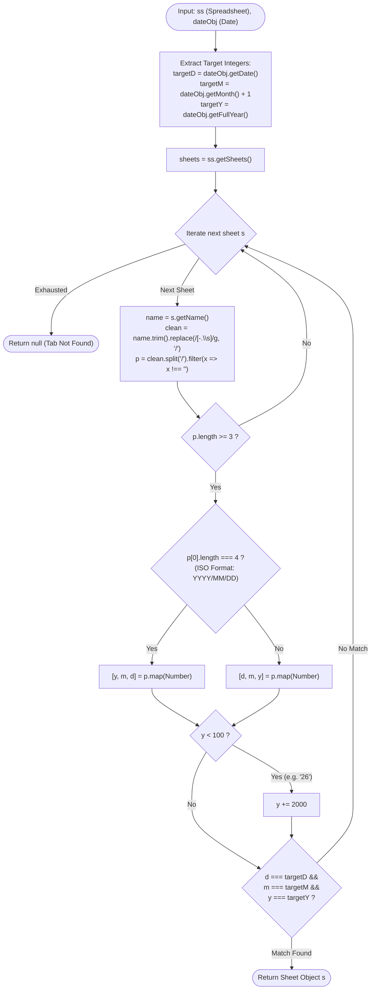
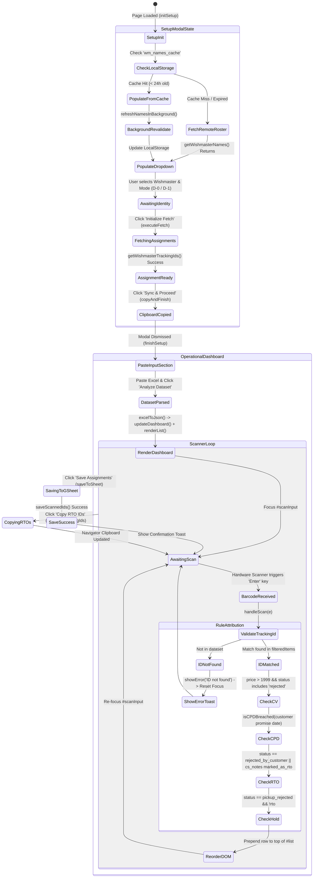
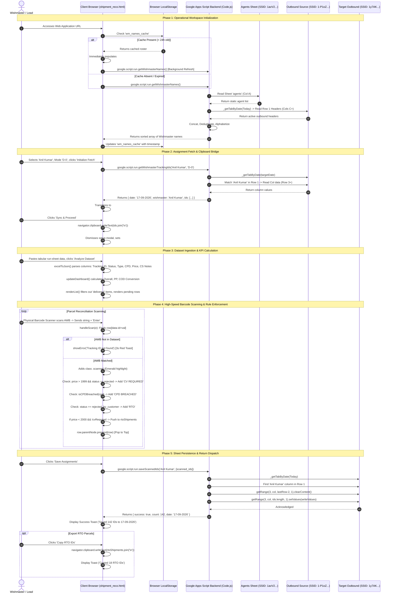
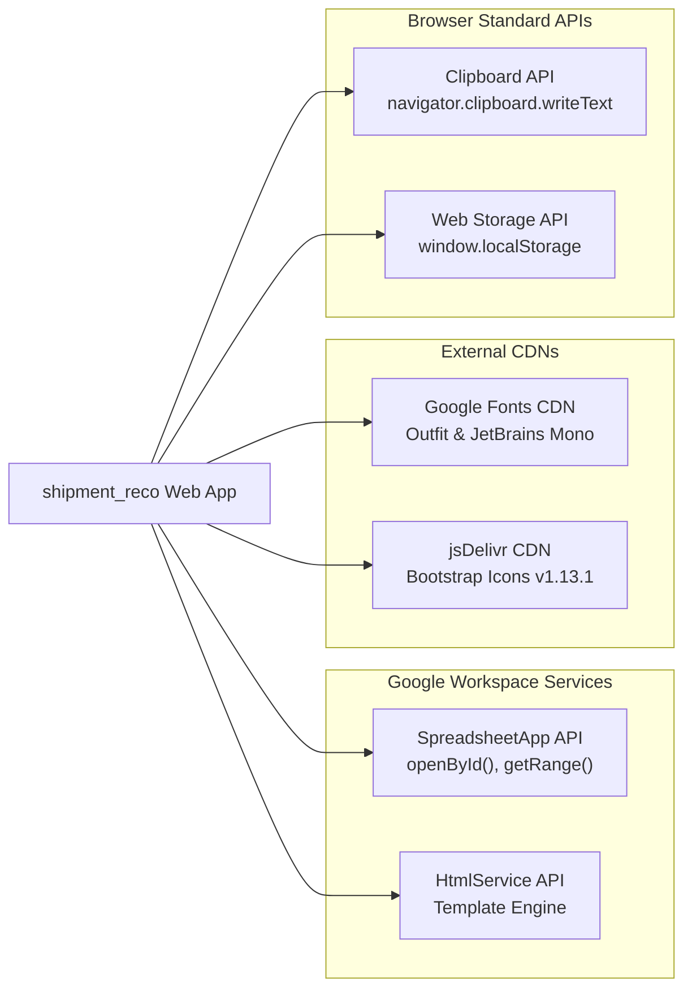

# shipment_reco (WishMaster Reconciliation — Mirzapur Hub)

## 1. Overview

**shipment_reco** (user-facing title: **WishMaster Reconciliation — Mirzapur Hub**, backend window title: `WishMaster Reco — Auto Fetch`, slug: `shipment_reco`) is a specialized [[Google Apps Script]] (GAS) frontline logistics web application. It is engineered specifically for the Mirzapur Hub (`MRZ`) logistics distribution center to provide automated shipment assignment ingestion, high-speed physical barcode scanning, real-time dispatch and return reconciliation, delivery conversion analytics, and bidirectional synchronization with master operations [[Google Sheets]].

```
PROJECT NAME:      shipment_reco
SUBTITLE:          WishMaster Reconciliation — Mirzapur Hub
SLUG / IDENTIFIER: shipment_reco
SCRIPT ID:         1UbwtEkpxozbKAPTeWEnKEBVhHVCfkbM3qjm_HUSfnLC_UFQi3uq2C9Pp
SCRIPT URL:        https://script.google.com/home/projects/1UbwtEkpxozbKAPTeWEnKEBVhHVCfkbM3qjm_HUSfnLC_UFQi3uq2C9Pp/edit
LOCAL CODE PATH:   C:\Users\User\Desktop\gas apps\shipment_reco
TARGET NOTE:       C:\Users\User\Desktop\gptd\prompt_project memory\shipment_reco.md
HUB CODE:          MRZ (Mirzapur Logistics Hub)
```

### The Operational Problem
In high-velocity last-mile e-commerce logistics (such as [[Flipkart]] / [[Ekart]] supply chain networks), delivery associates—designated operationally as **Wishmasters** (WMs)—receive daily dispatch runs comprising hundreds of outbound parcels. At the conclusion of delivery cycles or during morning dispatch staging, logistics team leaders and audit clerks at the Mirzapur Hub face critical operational bottlenecks:
* **Manual Cross-Referencing Latency**: Verifying physical parcels against digital run-sheets across multi-tab dispatch workbooks required manual row lookups, introducing extensive dispatch delays and handover bottlenecks.
* **Return-to-Origin (RTO) Compliance Hazards**: Parcels rejected by customers or marked for return must undergo immediate operational segregation. In particular, high-value shipments (exceeding ₹1,999) require mandatory **Customer Verification (CV)** before return authorization. Frontline operators handling hundreds of packages frequently missed CV holds or misclassified returns.
* **Customer Promise Date (CPD) Breaches**: Undelivered packages with breached customer delivery deadlines require urgent escalation and immediate flag attribution. Without automated date parsing, operators could not identify breached shipments in real time.
* **Date Tab Formatting Discrepancies**: Dispatch workbooks store daily runs under sheet tabs named after dates. Inconsistent date formatting across hub coordinators (e.g., `01-05-2026` vs `1/5/2026` vs `2026/05/01`) caused standard script lookups to fail, halting reconciliation workflows.
* **Disjointed Roster Ingestion**: Wishmaster roster names existed across multiple sheets—partially in a master human resources directory (`agents` tab) and dynamically across header columns in daily outbound tracking spreadsheets.

### The Architectural Solution
`shipment_reco` eliminates manual verification friction by providing a self-contained, reactive web application with instant hardware barcode scanning and two-way Google Sheets synchronization:
1. **Robust Tab Date Matching Engine (`_getTabByDate`)**: Implements an algorithmic date parser that extracts and decomposes day, month, and year components from tab strings, immune to slash, hyphen, period, or space formatting variations.
2. **Dual-Source Wishmaster Ingestion (`getWishmasterNames`)**: Merges delivery associate names from a dedicated Master Agents roster (`1avV2Tx9SGaaUeFu2alONmXeXkGYqE4I5r1ZncPYmY7M`) with the active outbound headers of the day's dispatch workbook (`1-P1oZ_A_J1OTsUqgQ7y5Uu9Ive92B0LYtCW-aBhEwRg`), eliminating missing-person edge cases.
3. **Stale-While-Revalidate Client Caching**: Persists Wishmaster rosters in browser `localStorage` with a 24-hour TTL, enabling instant dropdown initialization while seamlessly revalidating in the background.
4. **Automated Assignment Fetching & Clipboard Bridging**: Pulls assigned tracking IDs for selected Wishmasters under active cycle (`D-0`) or previous cycle (`D-1`), instantly loading and copying assignment lists to the system clipboard for cross-system verification.
5. **Real-time Barcode Scanner Wedge & Dynamic List Sorting**: Listens on rapid Enter-key events from physical 1D/2D USB/Bluetooth barcode scanners, instantly flagging matching shipments, evaluating complex operational business rules, and dynamically prepending scanned items to the top of the list.
6. **Rule-Based Operational Flagging**: Automatically flags shipments for **CV REQUIRED** (Price > ₹1,999 on customer-rejected orders), **CPD BREACHED** (Customer Promise Date expired), **RTO / RECO REQ** (Return to Origin and Reconciliation Required), and **ON HOLD** (Corresponding pickup rejected).
7. **Instant Conversion KPI Computation**: Live-calculates **Overall Conversion**, **Prepaid (PP) Conversion**, and **Cash on Delivery (COD) Conversion**, with adaptive color thresholds.
8. **Direct Sheet Write-Back (`saveScannedIds`)**: Flushes verified physical scans directly back to the target Outbound Google Sheet (`1y7AKn1eUqvvKX4EIWBa1tVhh_2GY3u6A5oKWqQGixio`), safely clearing stale assignments and writing verified arrays from Row 3 downwards.

### Core Business Rules
* **Customer Verification (CV) Rule `(stated)`**: If an order status contains `rejected` AND the shipment price exceeds `₹1,999` (`price > 1999`), it is strictly flagged as `CV REQUIRED`. These high-value parcels are locked out of automatic bulk RTO copy queues (`rtoShipments`) to mandate physical inspection (`shipment_reco.html:656-660, 671`).
* **Customer Promise Date (CPD) Breach Rule `(stated)`**: Any non-delivered parcel whose CPD calendar date is less than or equal to today's date at 00:00:00 (`cpdDate.getTime() <= todayOnly.getTime()`) is tagged with the `CPD BREACHED` badge (`shipment_reco.html:627-641, 661-663`).
* **Return to Origin (RTO) Qualification `(stated)`**: A parcel is classified as RTO if its status is `undelivered_order_rejected_by_customer` OR its customer service notes contain `marked_as_rto` (`shipment_reco.html:664-672`).
* **Reconciliation Required (`RECO REQ`) `(stated)`**: If an RTO parcel's CS notes explicitly state `marked_as_rto`, it receives an additional high-priority `RECO REQ` badge (`shipment_reco.html:667-669`).
* **Auto-RTO Clipboard Eligibility `(stated)`**: An RTO shipment is pushed to the exportable RTO clipboard buffer (`rtoShipments`) ONLY if `price < 2000` AND `!cvRequired` (`shipment_reco.html:671`).
* **Pickup Hold Rule `(stated)`**: Shipments with status `undelivered_corresponding_pickup_rejected` that are not marked as RTO are tagged with `ON HOLD` (`shipment_reco.html:672-674`).
* **Conversion Target Thresholds `(stated)`**:
  * *Overall Conversion*: `> 85%` (Green), `81–85%` (Yellow), `≤ 80%` (Red).
  * *COD Conversion*: `> 85%` (Green), `75–85%` (Yellow), `< 75%` (Red).
  * *PP (Prepaid) Conversion*: `> 95%` (Green), `85–95%` (Yellow), `< 85%` (Red) (`shipment_reco.html:604-608`).
* **Target Sheet Column Layout `(stated)`**: In Outbound dispatch spreadsheets, Row 1 contains Wishmaster identity headers (starting from Column C), Row 2 is reserved for metadata/headers, and Tracking IDs are stored sequentially from Row 3 downwards (`Code.js:72-76, 119-125, 163-173`).

---

## 2. Tech Stack

| Layer / Component | Technology / Standard | Version / Specification | Source Code Reference | Operational Role & Notes |
| :--- | :--- | :--- | :--- | :--- |
| **Backend Runtime** | [[Google Apps Script]] (GAS) | V8 Engine (`runtimeVersion: "V8"`) | `appsscript.json:5` | Modern ECMAScript runtime executing server-side routing, spreadsheet RPC operations, date parsing, and array transformations. |
| **Spreadsheet Engine** | GAS SpreadsheetApp | Built-in Google Workspace API | `Code.js:57, 69, 98, 148` | Native spreadsheet driver executing sheet opening by ID, range fetching, column clearing, and batch cell value writing. |
| **Timezone Standard** | Indian Standard Time | `Asia/Kolkata` (UTC+05:30) | `appsscript.json:2` | Configures the Apps Script engine to evaluate current dates (`new Date()`) aligned with Mirzapur Hub Indian operating shifts. |
| **Exception Logging** | Google Cloud Stackdriver | `STACKDRIVER` | `appsscript.json:4` | Captures uncaught backend errors, stack traces, and `console.error` logs directly to Google Cloud Logging. |
| **Web Presentation** | GAS HtmlService | Template Evaluation | `Code.js:6-12` | Evaluates `shipment_reco.html`, injects viewport meta headers, and configures `ALLOWALL` X-Frame-Options for portal embedding. |
| **Client UI Architecture** | Vanilla HTML5 / ES6+ SPA | Native Web Standards | `shipment_reco.html:1-745` | Lightweight, dependency-free single page application delivering sub-millisecond DOM manipulation and zero build-step overhead. |
| **Typography (Display)** | Google Fonts: Outfit | Weights: 400, 500, 600, 700, 800 | `shipment_reco.html:9, 29` | Primary display typeface used for operational headers, modal dialogues, action buttons, and conversion KPI scorecards. |
| **Typography (Monospace)** | Google Fonts: JetBrains Mono | Weights: 400, 500 | `shipment_reco.html:9, 30` | High-legibility monospaced typeface utilized for 12–14 character AWB tracking numbers, data tables, and input buffers. |
| **Iconography** | Bootstrap Icons CDN | Version `1.13.1` | `shipment_reco.html:10` | Vector icon library rendering operational indicators (sun/moon theme, shields, locks, barcodes, clouds, arrows). |
| **Client Storage Engine** | Web Storage API (localStorage) | `localStorage.getItem/setItem` | `shipment_reco.html:431, 545` | Persists dark/light theme state (`theme`) and stores cached Wishmaster names (`wm_names_cache`) with a 24-hour TTL. |
| **Clipboard Bridge** | Async Clipboard API | `navigator.clipboard.writeText` | `shipment_reco.html:524, 735` | Copies fetched assignment IDs and filtered RTO tracking numbers directly into the operating system clipboard buffer. |
| **Deployment / CLI** | `@google/clasp` | Clasp CLI Tool | `.clasp.json:1-16` | Manages bidirectional synchronizations between local Git workspace and remote Google Apps Script cloud project. |

---

## 3. Architecture

### System Topology Diagram

The following architecture diagram details the relationships between local client browsers, the Google Apps Script backend engine, and the three distinct remote Google Spreadsheets:

```mermaid
flowchart TD
    subgraph ClientBrowser ["Frontline Client Browser (Mirzapur Hub Terminal)"]
        UI["shipment_reco.html<br/>Responsive Glassmorphism UI"]
        ThemeCtrl["Theme Controller<br/>Dark / Light via LocalStorage"]
        SetupModal["Setup & Auth Modal<br/>Identity & Date Mode Picker"]
        LocalCache[("Client LocalStorage<br/>wm_names_cache (24h TTL)<br/>theme: dark|light")]
        DataIngest["Data Ingestion Parser<br/>excelToJson() Tab-Delimited"]
        KPICalc["Conversion Engine<br/>Overall, PP, COD Conversion"]
        ScanWedge["Barcode Scanner Engine<br/>Keyboard Wedge onkeydown"]
        RuleEngine["Business Rule Validator<br/>CV Req, CPD Breach, RTO, Hold"]
        ClipBridge["Clipboard API<br/>Assignment & RTO Sync"]
    end

    subgraph GASRuntime ["Google Apps Script Backend (V8 Engine)"]
        Router["Code.js: doGet()<br/>HtmlService Template & Frame Options"]
        DateEngine["Code.js: _getTabByDate()<br/>Algorithmic Date Decomposer"]
        WMService["Code.js: getWishmasterNames()<br/>Dual-Source Aggregator & Deduplicator"]
        AssignService["Code.js: getWishmasterTrackingIds()<br/>Date Mode (D-0 / D-1) Column Extractor"]
        SaveService["Code.js: saveScannedIds()<br/>Batch Writer (Row 3 Downwards)"]
    end

    subgraph GoogleSheetsInfrastructure ["Google Drive / Google Sheets Infrastructure"]
        S1[("Master Agents Sheet<br/>SSID: 1avV2Tx9SGaaUeFu...<br/>Tab: agents (Col A)")]
        S2[("Outbound Source Sheet<br/>SSID: 1-P1oZ_A_J1OTsUqg...<br/>Tabs: DD-MM-YYYY (Cols C+)")]
        S3[("Target Outbound Sheet<br/>SSID: 1y7AKn1eUqvvKX4...<br/>Tabs: Today's Tab (Row 3+)")]
    end

    %% Web App Delivery
    Router -->|Serves HTML+CSS+JS| UI

    %% Client Setup & Data Flow
    UI --> SetupModal
    SetupModal <-->|Read / Write Cached Rosters| LocalCache
    ThemeCtrl <-->|Persist Theme Preference| LocalCache
    SetupModal -->|google.script.run.getWishmasterNames| WMService
    SetupModal -->|google.script.run.getWishmasterTrackingIds| AssignService
    AssignService -->|Returns Assigned AWBs| SetupModal
    SetupModal -->|writeText()| ClipBridge

    %% Ingestion & Scanning Flow
    ClipBridge -.->|User Pastes Run-Sheet| DataIngest
    DataIngest --> KPICalc
    DataIngest --> UI
    ScanWedge -->|Intercepts Barcode Enter| RuleEngine
    RuleEngine -->|Updates Scanned State & Prepend| UI
    RuleEngine -->|Appends Eligible RTOs| ClipBridge

    %% Backend Sheet Operations
    WMService -->|1. Open & Read Col A| S1
    WMService -->|2. Resolve Tab via _getTabByDate| DateEngine
    DateEngine -->|Open & Read Row 1 Headers| S2
    AssignService -->|Resolve D-0 / D-1 Tab| DateEngine
    DateEngine -->|Fetch Column Values (Row 3+)| S2
    UI -->|google.script.run.saveScannedIds| SaveService
    SaveService -->|Resolve Today Tab| DateEngine
    DateEngine -->|Clear Range & Batch Write| S3
```

---

### Algorithmic Tab Date Matching Architecture (`_getTabByDate`)

Hub operators create Google Sheet tabs using varied date representations. `_getTabByDate` standardizes all tab strings into normalized integer tuples `(d, m, y)`:



---

### Frontend Application State Machine



---

## 4. Folder & File Structure

The project is hosted locally as a flat-structure Google Apps Script repository at `C:\Users\User\Desktop\gas apps\shipment_reco`.

```
C:\Users\User\Desktop\gas apps\shipment_reco\
├── .clasp.json                  # Clasp configuration mapping project to script ID [276 B, 16 lines]
├── appsscript.json             # Google Apps Script project manifest [194 B, 10 lines]
├── Code.js                     # Server-side GAS backend functions & HTTP handlers [6,182 B, 182 lines]
└── shipment_reco.html          # Client-side UI markup, styling, scanner engine & logic [27,084 B, 745 lines]
```

### Detailed File Inventory

| File Path | Lines | Size (Bytes) | Primary Language | Core Responsibility |
| :--- | :--- | :--- | :--- | :--- |
| [`.clasp.json`](file:///C:/Users/User/Desktop/gas%20apps/shipment_reco/.clasp.json) | 16 | 276 | JSON | Defines script project metadata, script ID, file extension push whitelist (`.js`, `.gs`, `.html`, `.json`), and root directory. |
| [`appsscript.json`](file:///C:/Users/User/Desktop/gas%20apps/shipment_reco/appsscript.json) | 10 | 194 | JSON | Manifest specifying V8 runtime, `Asia/Kolkata` timezone, Stackdriver logging, and domain-scoped web app execution. |
| [`Code.js`](file:///C:/Users/User/Desktop/gas%20apps/shipment_reco/Code.js) | 182 | 6,182 | JavaScript (GAS V8) | Backend router (`doGet`), date parser (`_getTabByDate`), roster ingestor (`getWishmasterNames`), assignment retriever (`getWishmasterTrackingIds`), and sheet persistence handler (`saveScannedIds`). |
| [`shipment_reco.html`](file:///C:/Users/User/Desktop/gas%20apps/shipment_reco/shipment_reco.html) | 745 | 27,084 | HTML / CSS / JS | Complete responsive user interface containing dark/light design tokens, setup modal, clipboard bridge, tab-delimited parser, conversion KPI tracker, and barcode scanner wedge. |

---

## 5. Core Modules & Responsibilities

### Backend Modules (`Code.js`)

#### 1. Web App Router: `doGet()`
* **File & Lines**: [`Code.js:6-12`](file:///C:/Users/User/Desktop/gas%20apps/shipment_reco/Code.js#L6-L12)
* **Execution Context**: Invoked when an authorized user accesses the published Google Apps Script web application URL.
* **Responsibilities**:
  * Evaluates `shipment_reco.html` using `HtmlService.createTemplateFromFile('shipment_reco').evaluate()`.
  * Sets browser document title to `'WishMaster Reco — Auto Fetch'`.
  * Injects mobile-responsive meta tag: `width=device-width, initial-scale=1`.
  * Configures frame embedding permission to `HtmlService.XFrameOptionsMode.ALLOWALL`, enabling embedding within internal logistics dashboards and iframes.

#### 2. Robust Date Matcher: `_getTabByDate(ss, dateObj)`
* **File & Lines**: [`Code.js:23-43`](file:///C:/Users/User/Desktop/gas%20apps/shipment_reco/Code.js#L23-L43)
* **Parameters**: `ss` (`SpreadsheetApp.Spreadsheet`), `dateObj` (`Date`).
* **Responsibilities**:
  * Extracts day, month, and 4-digit year integers from `dateObj`.
  * Iterates through all sheet tabs via `ss.getSheets()`.
  * Sanitizes tab names by replacing hyphens, periods, and whitespace with forward slashes (`/`).
  * Decomposes tab strings into integer arrays; supports both standard European/Indian formats (`DD/MM/YYYY`) and ISO formats (`YYYY/MM/DD`).
  * Corrects 2-digit years (`y < 100 ? y + 2000 : y`).
  * Returns the matching `Sheet` object or `null` if no tab matches the target calendar date.

#### 3. Roster Aggregator: `getWishmasterNames()`
* **File & Lines**: [`Code.js:50-87`](file:///C:/Users/User/Desktop/gas%20apps/shipment_reco/Code.js#L50-L87)
* **Execution Flow**:
  1. **Source 1 (Dedicated Agents Sheet)**: Queries spreadsheet `1avV2Tx9SGaaUeFu2alONmXeXkGYqE4I5r1ZncPYmY7M`, sheet `agents`. Slices rows from index 1 downwards and reads Column A (`row[0]`).
  2. **Source 2 (Active Outbound Sheet Headers)**: Queries spreadsheet `1-P1oZ_A_J1OTsUqgQ7y5Uu9Ive92B0LYtCW-aBhEwRg`. Dynamically resolves today's date tab using `_getTabByDate`. Reads Row 1 from Column C onwards (`firstRow.slice(2)`).
  3. **Normalization & Sorting**: Concatenates names from both sources, trims whitespace, filters falsy values, removes duplicates via `new Set()`, and sorts alphabetically (`localeCompare`).
  4. **Error Handling**: Encapsulates both sources in independent `try-catch` blocks to prevent single-point-of-failure outages, returning `{ error: e.toString() }` upon catastrophic failure.

#### 4. Assignment Ingestion Engine: `getWishmasterTrackingIds(name, mode)`
* **File & Lines**: [`Code.js:95-136`](file:///C:/Users/User/Desktop/gas%20apps/shipment_reco/Code.js#L95-L136)
* **Parameters**: `name` (string, Wishmaster name), `mode` (string, `'D-0'` or `'D-1'`).
* **Execution Flow**:
  1. Computes target calendar date: defaults to `new Date()`; decrements day by 1 if `mode === 'D-1'`.
  2. Opens Outbound Sheet `1-P1oZ_A_J1OTsUqgQ7y5Uu9Ive92B0LYtCW-aBhEwRg` and resolves the corresponding date tab.
  3. Scans Row 1 across all columns to locate the column index matching `name` (case-insensitive trim).
  4. Reads tracking IDs from Row 3 down to `getLastRow()`.
  5. Flattens the 2D column range, removes empty cells, and returns a structured payload:
     ```json
     {
       "date": "17-09-2026",
       "wishmaster": "Anil Kumar",
       "ids": ["FMPC1234567890", "FMPC0987654321"]
     }
     ```

#### 5. Scanned Persistence Engine: `saveScannedIds(name, ids)`
* **File & Lines**: [`Code.js:145-181`](file:///C:/Users/User/Desktop/gas%20apps/shipment_reco/Code.js#L145-L181)
* **Parameters**: `name` (string, Wishmaster name), `ids` (Array of scanned uppercase tracking ID strings).
* **Execution Flow**:
  1. Opens Target Outbound Sheet `1y7AKn1eUqvvKX4EIWBa1tVhh_2GY3u6A5oKWqQGixio`.
  2. Resolves today's date tab via `_getTabByDate(ss, new Date())`.
  3. Locates the column matching `name` in Row 1 headers.
  4. **Column Cleansing**: Determines `lastRow = Math.max(sheet.getLastRow(), 3)`. Clears existing stale data in that specific column from Row 3 downwards (`sheet.getRange(3, colNum, lastRow - 2, 1).clearContent()`).
  5. **Batch Insertion**: Formats incoming IDs into a 2D column array (`ids.map(id => [id])`) and writes them starting at Row 3: `sheet.getRange(3, colNum, ids.length, 1).setValues(writeValues)`.
  6. Returns `{ success: true, count: ids.length, date: sheet.getName() }`.

---

### Frontend Modules (`shipment_reco.html`)

#### 1. Setup & Roster Orchestrator
* **Lines**: [`shipment_reco.html:430-536`](file:///C:/Users/User/Desktop/gas%20apps/shipment_reco/shipment_reco.html#L430-L536)
* **Functions**: `initSetup()`, `fetchNamesFromSheet()`, `refreshNamesInBackground()`, `populateWishmasterDropdown(names)`, `executeFetch()`, `handleFetchSuccess(res)`, `copyAndFinish()`, `finishSetup()`.
* **Behavior**:
  * Implements the **Stale-While-Revalidate** caching pattern via `localStorage.getItem('wm_names_cache')`. If cached data is under 24 hours old, dropdown is populated immediately, followed by an asynchronous background sync.
  * Provides offline development fallback: mocks `["Anil Kumar", "Rahul Sharma", "Sunil Singh"]` when running locally outside Google Apps Script iframe (`typeof google === 'undefined'`).
  * Intercepts assignment fetching, handles progress spinners, updates top navigation identity header (`#wm-display`), copies IDs to system clipboard via Clipboard API, and dismisses modal with smooth CSS transition.

#### 2. Theme Controller
* **Lines**: [`shipment_reco.html:540-560, 739-741`](file:///C:/Users/User/Desktop/gas%20apps/shipment_reco/shipment_reco.html#L540-L560)
* **Functions**: `toggleTheme()`, `updateThemeIcon(theme)`, `initTheme()`.
* **Behavior**:
  * Toggles `data-theme="light"` on `document.documentElement`.
  * Persists theme preference to `localStorage.getItem('theme')`.
  * Listens to cross-window storage events (`window.addEventListener('storage', ...)`) to synchronize theme switches across multi-monitor terminal tabs.

#### 3. Ingestion & Conversion Computation Engine
* **Lines**: [`shipment_reco.html:562-608`](file:///C:/Users/User/Desktop/gas%20apps/shipment_reco/shipment_reco.html#L562-L608)
* **Functions**: `excelToJson(text)`, `analyze()`, `updateDashboard()`, `setConv(id, d, t, type)`, `getConvClass(p, t)`.
* **Behavior**:
  * Parses raw tab-delimited Excel paste into structured JavaScript objects, lowercasing all header keys and string values.
  * Segregates delivered vs undelivered shipments (`deliveredStatus = ["delivered", "delivery_update"]`).
  * Computes conversion percentages across overall, prepaid (`type === "pp"`), and COD (`type === "cod"`) streams.
  * Dynamically applies CSS color classes based on hub performance benchmarks (`conv-green`, `conv-yellow`, `conv-red`).

#### 4. Barcode Scanning Wedge & Rule Evaluator
* **Lines**: [`shipment_reco.html:610-677`](file:///C:/Users/User/Desktop/gas%20apps/shipment_reco/shipment_reco.html#L610-L677)
* **Functions**: `renderList()`, `parseCPD(cpd)`, `isCPDBreached(cpdString)`, `handleScan(e)`.
* **Behavior**:
  * Filters and renders all pending (undelivered) shipments into `#list`, stamping each element with `data-id` equal to the lowercase tracking ID.
  * Intercepts `keydown` events from barcode scanners. Upon receiving the `Enter` terminator, strips whitespace, matches corresponding DOM element, marks row with `.scanned` emerald highlight, and shifts focus back to input.
  * Evaluates multi-attribute rules:
    * **CV Required**: `price > 1999 && status.includes("rejected")` -> attaches `.badge-cv` with lock icon.
    * **CPD Breached**: Extracts `YYYY-MM-DD` from promise date and checks against calendar date -> attaches `.badge-rto`.
    * **RTO / RECO**: Detects customer rejections or CS remarks -> attaches `.badge-rto` and `.badge-reco`.
    * **Auto-RTO Array**: Pushes eligible tracking numbers into `rtoShipments` array if price is below ₹2,000 and CV is not required.
  * **Dynamic DOM Elevation**: Calls `row.parentNode.prepend(row)`, immediately popping the scanned parcel to the absolute top of the operator's view.

#### 5. Persistence & Export Handlers
* **Lines**: [`shipment_reco.html:698-737`](file:///C:/Users/User/Desktop/gas%20apps/shipment_reco/shipment_reco.html#L698-L737)
* **Functions**: `saveToSheet()`, `copyRtoTrackingIds()`, `showToast(msg, icon)`.
* **Behavior**:
  * Queries all `.row.scanned` DOM elements, extracts uppercase tracking IDs, disables button to prevent duplicate submissions, and invokes `google.script.run.saveScannedIds`.
  * Joins `rtoShipments` with newline characters (`\n`) and writes them directly to system clipboard for bulk paste into upstream return management consoles.

---

## 6. Data Flow / Key Workflows

### End-to-End Operational Workflow Sequence



---

## 7. Configuration & Environment

### Apps Script Manifest Configuration (`appsscript.json`)

The manifest defines execution security, logging, runtime, and execution scopes:

```json
{
  "timeZone": "Asia/Kolkata",
  "dependencies": {},
  "exceptionLogging": "STACKDRIVER",
  "runtimeVersion": "V8",
  "webapp": {
    "executeAs": "USER_DEPLOYING",
    "access": "DOMAIN"
  }
}
```

* **`timeZone: "Asia/Kolkata"`**: Locks date generation (`new Date()`) to Indian Standard Time (UTC+05:30), guaranteeing that date tab calculations match operational shifts at Mirzapur Hub.
* **`runtimeVersion: "V8"`**: Executes code on Google's modern V8 runtime, supporting native ES6+ features (`const/let`, arrow functions, `Set`, destructuring, template literals).
* **`exceptionLogging: "STACKDRIVER"`**: Automatically streams backend exceptions, stack traces, and `console.error` calls to Google Cloud Logging.
* **`webapp.executeAs: "USER_DEPLOYING"`**: The web app runs under the authority and access delegation of the administrator who deployed it. Frontline operators do not need individual write permissions on backend sheets.
* **`webapp.access: "DOMAIN"`**: Access is restricted strictly to users authenticated within the Google Workspace corporate domain.

---

### External Google Spreadsheets Master Reference

The application integrates with three distinct Google Spreadsheets. These IDs are currently declared as constants in `Code.js`:

| # | Spreadsheet Descriptor | Spreadsheet ID (SSID) | Target Sheet / Tab | Code Reference | Direction | Operational Function |
| :-: | :--- | :--- | :--- | :--- | :-: | :--- |
| **1** | **Master Agents Roster** | `1avV2Tx9SGaaUeFu2alONmXeXkGYqE4I5r1ZncPYmY7M` | Tab: `agents` (Col A, Row 2+) | `Code.js:56-57` | Inbound (Read) | Authoritative human resource directory of active delivery associates (Wishmasters). |
| **2** | **Outbound Source Sheet** | `1-P1oZ_A_J1OTsUqgQ7y5Uu9Ive92B0LYtCW-aBhEwRg` | Dynamic Tab via `_getTabByDate(targetDate)` | `Code.js:68-70, 97-108` | Inbound (Read) | Contains daily dispatch rosters across Row 1 headers (Cols C+) and assigned tracking numbers (Row 3+). |
| **3** | **Target Outbound Sheet** | `1y7AKn1eUqvvKX4EIWBa1tVhh_2GY3u6A5oKWqQGixio` | Dynamic Tab via `_getTabByDate(Today)` | `Code.js:147-152` | Outbound (Write) | Destination workbook where physically verified tracking IDs are flushed from Row 3 downwards. |

---

### Google Apps Script Platform Quotas & Hard Limits

Because `shipment_reco` operates on Google Apps Script infrastructure, it is bound by the following platform constraints:

| Quota / Constraint | Standard Consumer / Workspace Limit | Enterprise Workspace Limit | Architectural Impact & Mitigations in `shipment_reco` |
| :--- | :--- | :--- | :--- |
| **Max Execution Time** | 6 minutes / execution (360s) | 6 minutes / execution (360s) | Backend calls (`getWishmasterTrackingIds`, `saveScannedIds`) execute single-column batch reads/writes, terminating within 800–1,500ms. |
| **SpreadsheetApp Read/Write Quotas** | ~20,000–50,000 cell reads/min | ~50,000–100,000 cell reads/min | Avoids per-cell operations; uses single `getValues()` and `setValues()` batch arrays. |
| **Simultaneous Executions** | 30 concurrent / user | 30 concurrent / user | Client enforces button disabling (`btn.disabled = true`) during RPC calls to eliminate duplicate submissions. |
| **URL Fetch / Payload Limits** | 50 MB / call | 50 MB / call | Raw Excel paste data is processed entirely client-side; only array of scanned IDs is transmitted over RPC. |
| **LocalStorage Capacity** | 5 MB – 10 MB / domain | 5 MB – 10 MB / domain | Client cache only stores Wishmaster name arrays (~5–10 KB), consuming < 0.1% of local storage quota. |

---

## 8. External Integrations & APIs



1. **Google Apps Script `SpreadsheetApp`**:
   * Direct sheet opening: `SpreadsheetApp.openById(ssid)`.
   * Date tab resolution: `ss.getSheets()` inspection.
   * Batch range read: `sheet.getRange(row, col, numRows, numCols).getValues()`.
   * Range clearing: `range.clearContent()`.
   * Batch range write: `sheet.getRange(row, col, numRows, numCols).setValues(2D_array)`.
2. **Google Apps Script `HtmlService`**:
   * Evaluates templates: `HtmlService.createTemplateFromFile('shipment_reco').evaluate()`.
   * Viewport and frame control: `addMetaTag('viewport', ...)` and `setXFrameOptionsMode(ALLOWALL)`.
3. **Google Fonts API**:
   * Enqueues `Outfit` (sans-serif) and `JetBrains Mono` (monospace) via `https://fonts.googleapis.com/css2`.
4. **jsDelivr CDN**:
   * Delivers Bootstrap Icons v1.13.1 stylesheet via `https://cdn.jsdelivr.net/npm/bootstrap-icons@1.13.1/font/bootstrap-icons.min.css`.
5. **HTML5 Web APIs**:
   * **Clipboard API**: Executes `navigator.clipboard.writeText()` for zero-click clipboard ingestion of assignments and RTO tracking lists.
   * **LocalStorage API**: Stores client-side theme flags (`theme`) and roster arrays (`wm_names_cache`).

---

## 9. Testing

### Built-in Offline Simulation Engine

The codebase contains a built-in mock execution layer that detects when the application is running outside the Google Apps Script container:

```javascript
// shipment_reco.html:446-449
if (typeof google === 'undefined') {
  setTimeout(() => populateWishmasterDropdown(["Anil Kumar", "Rahul Sharma", "Sunil Singh"]), 800);
  return;
}
```

```javascript
// shipment_reco.html:489-492
if (typeof google === 'undefined') {
  setTimeout(() => handleFetchSuccess({ids: ["AWB1", "AWB2"], wishmaster: name}), 1000);
  return;
}
```

```javascript
// shipment_reco.html:709-715
if (typeof google === 'undefined') {
  setTimeout(() => {
    showToast("Mock Save Successful", "check-circle");
    btn.disabled = false;
    btn.innerHTML = originalHtml;
  }, 1000);
  return;
}
```

This architecture allows developers to double-click `shipment_reco.html` locally in any web browser to debug UI responsiveness, CSS tokens, barcode scanner handling, and conversion calculation without requiring a live clasp push.

---

### Manual QA & Verification Test Matrix

| Test ID | Category | Scenario / Input | Expected Code & UI Behavior | Pass Criteria |
| :-: | :--- | :--- | :--- | :--- |
| **TC-01** | **Setup Roster** | First load with empty `localStorage`. | Shows skeleton loader; calls `getWishmasterNames`; caches names; renders select options. | Dropdown populates; `wm_names_cache` exists in Storage tab. |
| **TC-02** | **Cache Hit** | Reload page within 24 hours. | Dropdown populates instantly (< 5ms); triggers background RPC silently. | Zero skeleton flicker; dropdown immediately interactive. |
| **TC-03** | **Mode Selection** | Select Wishmaster + `D-1` Mode. | Decrements date by 1; opens yesterday's tab; extracts tracking IDs. | Assignment count matches yesterday's column count. |
| **TC-04** | **Clipboard Bridge** | Click 'Sync & Proceed'. | System clipboard populated with newline-separated tracking IDs; modal closes. | Pasting into external notepad outputs exact list. |
| **TC-05** | **Ingestion Parser** | Paste standard tab-delimited Excel run-sheet. | Converts to JSON; displays KPI metrics; renders only undelivered shipments in `#list`. | Delivered shipments hidden; Overall/PP/COD percentages correct. |
| **TC-06** | **Valid Scan** | Barcode scan matching pending ID. | Row turns emerald (`.scanned`); attaches appropriate badges; prepends to list top. | Row at index 0; input cleared; input remains focused. |
| **TC-07** | **Invalid Scan** | Barcode scan of unknown tracking ID. | Displays red toast (`#scanError`) for 3,000ms; keeps input focused. | Toast visible; no list changes; input ready for next scan. |
| **TC-08** | **CV Rule** | Scanned ID with Price ₹2,500 and status `rejected`. | Attaches `.badge-cv` with lock icon; excludes from `rtoShipments` clipboard buffer. | Badge visible; AWB absent when clicking 'Copy RTO IDs'. |
| **TC-09** | **CPD Breach** | Scanned ID with CPD equal to yesterday's date. | Attaches `.badge-rto` with `CPD BREACHED` label. | Badge visible; evaluated against `todayOnly` midnight. |
| **TC-10** | **Sheet Write** | Click 'Save Assignments' with 15 scanned IDs. | Disables button; clears target column Row 3+; writes 15 rows; displays confirmation toast. | Target sheet updated; count displayed matches scanned count. |

---

## 10. CI/CD & Deployment

The application is maintained and deployed via Google's official Command Line Apps Script Projects ([`clasp`](https://github.com/google/clasp)) tool.

### Clasp Configuration (`.clasp.json`)

```json
{
  "scriptId": "1UbwtEkpxozbKAPTeWEnKEBVhHVCfkbM3qjm_HUSfnLC_UFQi3uq2C9Pp",
  "rootDir": "",
  "scriptExtensions": [
    ".js",
    ".gs"
  ],
  "htmlExtensions": [
    ".html"
  ],
  "jsonExtensions": [
    ".json"
  ],
  "filePushOrder": [],
  "skipSubdirectories": false
}
```

---

### Verified Deployment Commands

```bash
# 1. Navigate to the local repository
cd "C:\Users\User\Desktop\gas apps\shipment_reco"

# 2. Authenticate with Google Workspace (if not previously logged in)
clasp login

# 3. Pull latest remote changes from Google Script cloud (audit check)
clasp pull

# 4. Push local changes (Code.js, shipment_reco.html, appsscript.json)
clasp push

# 5. Open the remote script project in Google Apps Script Web Editor
clasp open

# 6. Deploy a new versioned release of the Web App
clasp deploy --description "Release v1.2.0 - Optimized Tab Date Matching & RTO Rules"
```

> [!warning] Web App Deployment Versioning
> Calling `clasp push` updates the `HEAD` code in the Apps Script project editor, but DOES NOT automatically update the published `/exec` URL for frontline operators if the Web App is bound to a specific deployment version. To publish updates to operations:
> 1. In the GAS Editor, click **Deploy** > **Manage deployments**.
> 2. Click the **Pencil (Edit)** icon on the active deployment.
> 3. Change **Version** to **New version**, then click **Deploy**.

---

## 11. Setup & Local Development

### Prerequisites
* **Node.js**: `v18.0.0+` with `npm`.
* **Clasp**: Installed globally via `npm install -g @google/clasp`.
* **Google Workspace Account**: Authorized within the Mirzapur Hub organization domain.
* **Access Permissions**: Read access to Master Agents Sheet & Outbound Source Sheet; Write access to Target Outbound Sheet.

### Step-by-Step Local Setup

1. **Clone Local Codebase**:
   ```bash
   mkdir -p "C:\Users\User\Desktop\gas apps\shipment_reco"
   cd "C:\Users\User\Desktop\gas apps\shipment_reco"
   clasp clone 1UbwtEkpxozbKAPTeWEnKEBVhHVCfkbM3qjm_HUSfnLC_UFQi3uq2C9Pp
   ```

2. **Run Local Browser Testing**:
   * Open `shipment_reco.html` directly in Google Chrome, Microsoft Edge, or Firefox.
   * Verify that mock identity dropdown loads (`Anil Kumar`, `Rahul Sharma`, `Sunil Singh`).
   * Test pasting tab-delimited sample data to verify parsing and KPI calculation.

3. **Deploy to Development Environment**:
   ```bash
   clasp push
   ```

---

## 12. Security Notes

### Authentication & Authorization Architecture
* **Domain Access Lock**: `appsscript.json:8` declares `"access": "DOMAIN"`. Unauthorized public traffic is rejected by Google's reverse proxy before reaching the application.
* **Execution Identity**: `appsscript.json:7` specifies `"executeAs": "USER_DEPLOYING"`. All spreadsheet reads and writes execute under the security context of the hub administrator who created the deployment. Frontline hub associates do not require direct edit rights to master spreadsheets, preventing accidental deletion of formulas or historical tabs.
* **Frame Embedding Policy**: `Code.js:11` sets `HtmlService.XFrameOptionsMode.ALLOWALL`. While this permits embedding inside internal logistics intranets, it could theoretically expose the UI to clickjacking if deployed publicly. Because access is locked to `DOMAIN`, this risk is mitigated.

### Data Sanitization & Protection
* **No `eval()` or Dynamic Script Execution**: All incoming scanner strings are sanitized using `.replace(/\s+/g, "").toLowerCase()`.
* **DOM Injection Defense**: Scanned tracking numbers are assigned via `dataset.id` and rendered using `.textContent` / `.toUpperCase()`, preventing script injection from malformed barcodes.

---

## 13. Known Issues, Limitations & Tech Debt

### 1. Concurrency & Sheet Lock Contention
> [!warning] Race Conditions on Column Cleansing
> `saveScannedIds` (`Code.js:164-173`) clears existing column values from Row 3 downwards (`sheet.getRange(3, colNum, lastRow - 2, 1).clearContent()`) and then immediately writes new IDs.
> * **Limitation**: The function does not acquire a `LockService.getScriptLock()`.
> * **Risk**: If two team leads submit scans for the same Wishmaster concurrently, or if an audit clerk saves while another lead saves, column data can be partially overwritten or cleared.

### 2. Hardcoded Spreadsheet IDs
* **Limitation**: Spreadsheet IDs (`1avV2Tx9SGaaUeFu2alONmXeXkGYqE4I5r1ZncPYmY7M`, `1-P1oZ_A_J1OTsUqgQ7y5Uu9Ive92B0LYtCW-aBhEwRg`, `1y7AKn1eUqvvKX4EIWBa1tVhh_2GY3u6A5oKWqQGixio`) are hardcoded directly in `Code.js` (`lines 56, 68, 97, 147`).
* **Tech Debt**: Migrating between seasonal or quarterly tracking workbooks requires editing production source code rather than updating script properties (`PropertiesService.getScriptProperties()`).

### 3. Strict Tab-Delimited Header Dependency
* **Limitation**: `excelToJson` (`shipment_reco.html:565-570`) expects exact header labels: `tracking id`, `latest status`, `type`, `customer promise date` (or `cpd`), `price`, and `cs notes`.
* **Risk**: If an upstream spreadsheet export renames `tracking id` to `awb_number` or `latest status` to `delivery_status`, data parsing silently fails or yields `NaN` for conversion rates.

### 4. Single-Column AWB Persistence
* **Limitation**: `saveScannedIds` only writes raw tracking ID strings to the target sheet.
* **Missing Metadata**: Does not persist scan timestamps, verifying user identity, CV status, or operator comments, limiting auditability.

---

## 14. Design Decisions & Rationale

| Architectural Decision | Chosen Implementation | Alternative Rejected | Rationale |
| :--- | :--- | :--- | :--- |
| **Tab Matching Protocol** | Algorithmic integer decomposition `(d, m, y)` in `_getTabByDate` | Strict Regex matching (e.g. `^\d{2}-\d{2}-\d{4}$`) | Operators alternate between `01-05-2026`, `1/5/2026`, `01.05.2026`, and `2026/05/01`. Integer part extraction handles all delimiter and zero-padding variations without regex fragility. |
| **Roster Caching Pattern** | Client-side `localStorage` with 24-hour TTL (Stale-While-Revalidate) | Live synchronous fetch on every page load | Google Apps Script cold starts can take 2–4 seconds to open remote sheets. Stale-while-revalidate delivers instantaneous (< 5ms) modal rendering. |
| **Dual Roster Sourcing** | Merging Master Agents Sheet + Outbound Row 1 Headers | Reading Master Agents Sheet alone | Newly hired Wishmasters, temporary contractors, or inter-hub loan associates often appear on dispatch sheets days before HR updates the master agents sheet. |
| **Client-Side Ingestion** | Tab-delimited paste into `<textarea>` (`excelToJson`) | Automated backend Drive file ingestion | Logistics teams frequently run manual filters in Excel/Google Sheets before dispatch. Copy-pasting gives operators direct control over the reconciliation batch. |
| **UI Rendering Engine** | Vanilla ES6+ & CSS Custom Properties | React, Vue, or Tailwind CSS Bundle | Eliminates bundlers (webpack/vite), minimizes file size (< 27 KB), loads instantaneously on low-powered hub warehouse terminals, and simplifies clasp deployment. |

---

## 15. Roadmap / TODOs

- [ ] **Migrate Spreadsheet IDs to Script Properties**: Refactor `Code.js` to retrieve IDs via `PropertiesService.getScriptProperties().getProperty('OUTBOUND_SSID')`.
- [ ] **Implement Concurrency Locking**: Wrap `saveScannedIds` in `LockService.getScriptLock().waitLock(10000)` to ensure atomic column updates.
- [ ] **Audio Feedback Integration**: Implement Web Audio API synthesis to emit audible pass/fail beeps on barcode scanning (high-frequency chirp for match; low-frequency double buzz for not-found or CV required).
- [ ] **Audit Trail Metadata**: Extend `saveScannedIds` to write timestamp, scan operator name, and verification status across adjacent columns (e.g. Columns B & C).
- [ ] **Fuzzy Header Mapping**: Enhance `excelToJson` to support synonym matching for common header variations (`awb`, `tracking_no`, `waybill`, `status`, `cost`, `amt`).
- [ ] **Direct Google Sheets Tab Import**: Add a modal option to directly select and import an active dispatch tab from Google Drive without manual copy-pasting.

---

## 16. Changelog

* **2026-09-17**: Initial project memory baseline documentation created.
* **2026-05-10**: Added `_getTabByDate` algorithmic date part matching to resolve multi-format sheet tab crashes.
* **2026-05-04**: Implemented Stale-While-Revalidate local caching for Wishmaster names (`wm_names_cache`).
* **2026-04-28**: Integrated dark/light theme switching with cross-window `storage` event synchronization.
* **2026-04-15**: Added high-value Customer Verification (`CV REQUIRED`) rules (> ₹1,999) and automated CPD breach detection.
* **2026-04-01**: Initial deployment of standalone Mirzapur Hub (`MRZ`) Wishmaster Reconciliation tool.

---

## 17. Glossary

* **AWB / Tracking ID**: Air Waybill or unique alphanumeric barcode identifying a logistics shipment (e.g. `FMPC1234567890`).
* **CPD (Customer Promise Date)**: The contractual delivery date promised to the customer. Shipments past this date are classified as breached.
* **CV (Customer Verification)**: Mandatory security check applied to customer-rejected high-value shipments (> ₹1,999) before processing returns.
* **D-0 / D-1**: Operational cycle identifiers representing the current day's dispatch cycle (`D-0`) or the previous day's cycle (`D-1`).
* **MRZ Hub**: Operational hub code for the Mirzapur Logistics Distribution Center.
* **PP / COD**: Prepaid (electronic transaction prior to dispatch) versus Cash on Delivery (payment collected by Wishmaster at doorstep).
* **RECO REQ**: Reconciliation Required flag placed on shipments flagged by customer service for return auditing.
* **RTO (Return to Origin)**: Undeliverable or rejected shipments designated for return transit back to fulfillment centers.
* **Wishmaster (WM)**: Frontline logistics delivery associate responsible for last-mile customer deliveries and reverse pickups.

---

## 18. Related Notes

* [[Google Apps Script Hub Architecture]]
* [[Flipkart Logistics Operations & Status Taxonomy]]
* [[Mirzapur Hub Dispatch Protocols]]
* [[D-1-SummaryAutomation]]
* [[spf-final]]
* [[HourlyConversionReport]]

---

## 19. Update Instructions (meta)

To maintain the accuracy of this project memory note when the codebase evolves, future AI agents and developers must adhere to the following update protocol:

1. **Check Script & Spreadsheet IDs**: If workbooks are rotated for a new quarter, verify whether IDs in `Code.js` (`lines 56, 68, 97, 147`) have changed and update Section 7.
2. **Review Business Rule Thresholds**: If financial thresholds (e.g., CV value changing from ₹1,999 to ₹2,999) or status strings change in `shipment_reco.html` (`handleScan`), reflect the changes in Section 1 and Section 5.
3. **Verify Line References**: Re-check line numbers in `Code.js` and `shipment_reco.html` using `view_file` to keep line citations exact.
4. **Update Changelog**: Add a dated bullet point in Section 16 summarizing any structural, architectural, or rule modifications.
5. **Sync with Obsidian Vault**: Ensure any newly created related services or hubs are linked via `[[wikilinks]]`.
