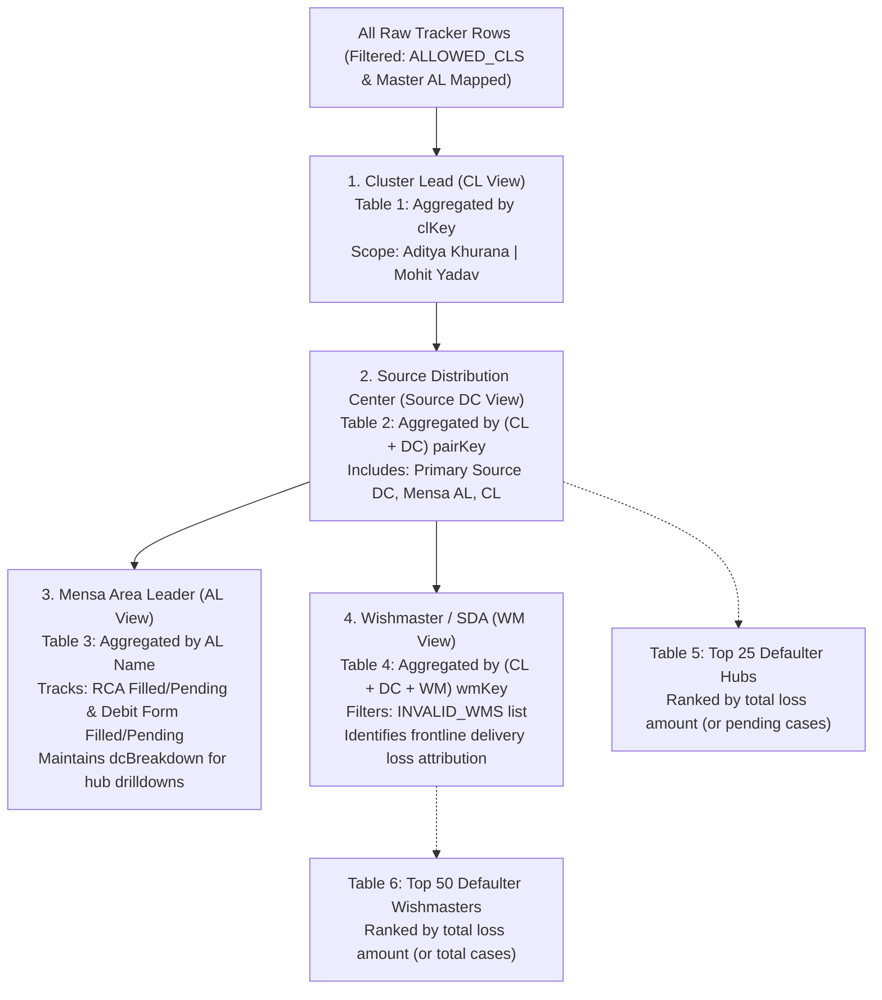
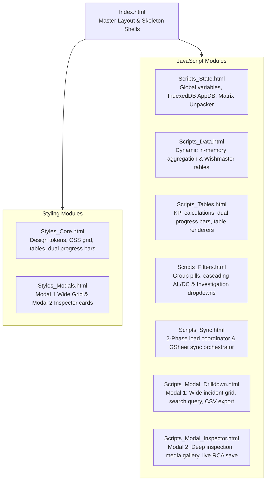

# spf final (Hub RCA Tracker Dashboard - CL View)

## 1. Overview

**spf final** (user-facing title: **Hub RCA Tracker Dashboard - CL View**, internal project identifier: `North Loss DB`, slug: `spf-final`) is an enterprise-grade [[Google Apps Script]] (GAS) web application and analytical dashboard. It operates as the mission-critical loss analysis and **Root Cause Analysis (RCA)** tracking platform for regional logistics networks supporting [[Myntra]] supply chain operations across Northern India. 

The application aggregates, normalizes, tracks, and synchronizes financial losses and operational RCA compliance across two core tracking domains:
1. **RVP Loss**: Reverse Pickup (customer returns) shipment losses (`rvp_q2`).
2. **SPF Loss**: Seller Protection Fund claims and vendor return losses (`spf_loss`).

```
PROJECT NAME:      spf final
UI TITLE:          Hub RCA Tracker Dashboard - CL View
SLUG / IDENTIFIER: spf-final / North Loss DB
SCRIPT ID:         1uuhrqMb324m73VE5r6GhhrzBhZLTCuSjRifquYKaFiy64LFXiwWQ-1mM
SCRIPT URL:        https://script.google.com/home/projects/1uuhrqMb324m73VE5r6GhhrzBhZLTCuSjRifquYKaFiy64LFXiwWQ-1mM/edit
LOCAL CODE PATH:   C:\Users\User\Desktop\North Loss DB
TARGET NOTE:       C:\Users\User\Desktop\gptd\prompt_project memory\spf-final.md
```

### The Operational Problem
In high-volume e-commerce reverse logistics, shipments that fail delivery, go missing, or arrive damaged at return processing centers incur financial liability. These liabilities fall into two primary buckets:
* **Reverse Pickup Losses (RVP)**: Disputed customer returns where articles are lost, stolen, or relabeled.
* **Seller Protection Fund Claims (SPF)**: Claims raised by marketplace sellers for lost, damaged, or swapped inventory during transit or returns.

Operational tracking was fragmented across separate remote Google Spreadsheets containing tens of thousands of incident rows updated concurrently by warehouse teams, dispatch clerks, and regional coordinators. Regional executives—specifically **Cluster Leads (CLs)** and **Area Leaders (ALs)**—faced severe operational friction:
* **No Unified Hierarchy Visibility**: No real-time view mapping incidents from high-level Cluster Leads (`Aditya Khurana`, `Mohit Yadav`) down through Distribution Centers (Source DCs), Area Leaders, and frontline delivery personnel (**Wishmasters** / SDAs).
* **Dual-Compliance Blindspots**: Tracking RCA completion alone was insufficient. High-loss incidents require filing financial **Debit Forms**. Operational leaders lacked visibility into whether an incident had its RCA filled AND whether the corresponding Debit Form had been submitted.
* **Google Apps Script Scalability Walls**: Synchronously pulling and aggregating tens of thousands of rows across multi-tab sheets repeatedly exceeded the Google Apps Script **6-minute (360-second) execution limit**, crashed browser tabs from DOM overload, and exhausted the **CacheService 100 KB per-key limit**.

### The Architectural Solution
`spf final` resolves these bottlenecks through a high-performance, multi-tiered architecture:
1. **Google Sheets Advanced API v4 Direct RPC Engine**: Bypasses slow `SpreadsheetApp` DOM abstractions by querying the Google Sheets Advanced Service (v4 RPC protocol) via `Sheets.Spreadsheets.Values.get()`, falling back gracefully to `SpreadsheetApp` only when necessary (`TrackerService.gs:182-222`).
2. **Two-Phase Asynchronous Client Hydration**:
   * *Phase 1 (Instant KPI & Hierarchy)*: `getTrackerData()` executes a fast aggregation pass of Cluster Leads, Source DCs, and Area Leads, returning within 1–2 seconds and caching summary JSON in `CacheService` for 15 minutes (`TrackerService.gs:21-132`).
   * *Phase 2 (Background Wishmaster & Incident Streaming)*: `getWishmasterData()` triggers automatically in the background, extracting granular Wishmaster aggregations, compact columnar incident matrices, and image proof URLs (`TrackerService.gs:138-175`).
3. **Dual Client-Side Storage (Memory + IndexedDB)**: Unpacked incident datasets are stored in browser memory (`rawIncidentsCache`) and persisted locally into native browser [[IndexedDB]] (`NorthLossDB_v4`) (`Scripts_State.html:26-100`). Subsequent page visits achieve instant **0ms rehydration** without network latency.
4. **Single Source of Truth Dynamic Hierarchy**: Evaluates an authoritative remote mapping spreadsheet (`1QYEfS6rOUeGuNCZc33JUshqRSKY8r2lr26y4qEtBGdc`, tab `MAPPING`) to bind Source DCs to Mensa Area Leaders (`TrackerService.gs:696-779`), ensuring data integrity regardless of naming discrepancies in source trackers.
5. **Interactive Executive Monitoring & Incident Inspector**:
   * Multi-view dashboard grouping by Cluster Lead (CL), Distribution Center (DC), Area Leader (AL), and Wishmaster (WM).
   * Dual-progress visual indicators rendering simultaneous completion rates for **AL RCA** and **Debit Form** submission.
   * Multi-dimensional dynamic cross-filtering by Investigation/Bucket, Restock Month, and Debit Status.
   * Wide drilldown incident browser (Modal 1) with instant text search and CSV export.
   * Deep-dive incident inspector (Modal 2) displaying complete product metadata, team hierarchy, proof galleries (PDP, LM, ERP, VMS, RPC), and a live RCA/Remark editor with direct write-back to Google Sheets (`TrackerService.gs:646-679`).
6. **Side-by-Side Executive Google Sheets Sync**: `SyncService.gs` formats and exports 8 side-by-side executive tables with color banners, completion percentages, and currency formatting into a dedicated destination spreadsheet (`DESTINATION_SPREADSHEET_ID`), alongside a 1:1 raw filtered record tab (`SyncService.gs:6-471`).

### Core Business Rules
* **Cluster Lead Boundary (Strict)**: Incidents are strictly filtered to `ALLOWED_CLS = ["aditya khurana", "mohit yadav"]` (`Config.gs:14`, `TrackerService.gs:310-312`). All other Cluster Leads are excluded from processing and export.
* **Source DC Mapping Boundary (Strict)**: Every incident's Source DC is looked up against the Master AL Mapping. If a Source DC cannot be mapped to a valid Area Leader, the incident is discarded (`TrackerService.gs:321-324`).
* **RCA Completion Definition**: An incident is marked `isFilled = true` if and only if the Mensa / AL RCA field contains a non-empty string that is not `"N/A"`, `"#N/A"`, or `"-"` (`TrackerService.gs:355`).
* **Debit Form Submission Logic**:
  * An incident is flagged `isDebitRca = true` if `mensaRca.toLowerCase().includes("debit")`.
  * If `isDebitRca` is true, it is classified as `isDebitFilled` if `rawDebitStatus` is populated and does NOT equal `"debit form not filled"`, `"not filled"`, `"n/a"`, `"#n/a"`, or `"-"` (`TrackerService.gs:357-369`).
  * If `isDebitRca` is true but no valid status exists, it is marked `isDebitPending`.
* **Zero-Incident Completion Rule**: If an entity has 0 total incidents (`total === 0`), completion rate defaults to **100%** (`TrackerService.gs:327`, `SyncService.gs:327, 342, 358`, `Scripts_Tables.html:30, 134`).
* **Financial Rounding**: All financial loss values (`finalAmount`, `totalAmount`) are parsed from messy currency strings and rounded to the nearest whole integer (`TrackerService.gs:375-378`).

---

## 2. Tech Stack

| Layer / Component | Technology / Standard | Version / Specification | Source Code Reference | Operational Role & Notes |
| :--- | :--- | :--- | :--- | :--- |
| **Backend Runtime** | [[Google Apps Script]] (GAS) | V8 Engine (`runtimeVersion: "V8"`) | `appsscript.json:13` | Modern JavaScript runtime supporting ES6+ classes, arrow functions, template strings, `const/let`, and native `Set`/`Map`. |
| **Advanced Service** | Google Sheets API v4 | Version `v4`, service ID `sheets` | `appsscript.json:4-10` | High-throughput direct RPC access (`Sheets.Spreadsheets.Values.get`) bypassing SpreadsheetApp DOM serialization overhead. |
| **Spreadsheet Engine** | GAS SpreadsheetApp | Built-in Service | `TrackerService.gs:197`, `SyncService.gs:9` | Native GAS service utilized for cell formatting, color palettes, merging, batch writes, and fallback reading. |
| **Server Cache** | GAS CacheService | `CacheService.getScriptCache()` | `TrackerService.gs:24-34, 120-124` | Distributed memory cache storing Phase 1 lightweight summaries (`TRACKER_LIGHT_V8_<id>`) with 15-min TTL (900s) and Master Mapping with 30-min TTL (1800s). |
| **Timezone Config** | Indian Standard Time | `Asia/Kolkata` (UTC+05:30) | `appsscript.json:2` | Standardizes all date/time processing and log timestamps to North India regional operational hours. |
| **Cloud Logging** | Google Cloud Stackdriver | `STACKDRIVER` | `appsscript.json:12` | Captures exceptions, RPC execution traces, and `Logger.log()` outputs directly into GCP Cloud Logging console. |
| **Client Storage** | HTML5 [[IndexedDB]] API | Database: `NorthLossDB_v4` (v1) | `Scripts_State.html:26-100` | Browser-side client object store (`summaries`, `incidents`) providing instant 0ms dashboard rehydration across reloads. |
| **Memory Cache** | In-Memory Object Cache | Native JavaScript Object | `Scripts_State.html:14` | Global `rawIncidentsCache` mapping tracker ID to hydrated incident records for instantaneous client filtering. |
| **Web Presentation** | GAS HtmlService | `HtmlService` Template Engine | `Code.gs:5-11, 17-19` | Evaluates modular HTML templates (`createTemplateFromFile`), injects partials (`include()`), sets responsive viewport, and enables `ALLOWALL` framing. |
| **Frontend Framework** | Vanilla HTML5 / ES6+ | Native Web Standards | `Index.html:1-501`, `Scripts_*.html` | Dependency-free, highly responsive client-side SPA architecture with zero compilation or bundling steps. |
| **Typography** | Google Fonts | `Inter` (Weights: 400, 500, 600, 700, 800) | `Index.html:10` | High-legibility typography optimized for complex data-dense tables and executive metric displays. |
| **Iconography** | FontAwesome CDN | Version `6.4.0` | `Index.html:11` | Enterprise iconography for tracking IDs, logistics statuses, warehouse markers, progress badges, and proof links. |
| **CLI / Tooling** | `@google/clasp` | Clasp CLI | `.clasp.json:1-4` | Command Line Apps Script Projects tool for local version control, git commits, and bi-directional cloud deployment (`clasp push`). |
| **Test Engine** | Node.js Headless Runner | Node.js Native (`vm`, `fs`) | `test_all_workflows.js:1-256` | Local headless test suite that mocks DOM and GAS RPC environments to validate workflows, filters, and modals offline. |
| **Syntax Verification** | Strict Evaluators & Sanitizers | Node.js Scripts | `check_all_ids.js`, `sanitize_all.js` | Custom scripts ensuring HTML template DOM IDs match JavaScript handlers and stripping non-ASCII characters that break V8 parsing. |

---

## 3. Architecture

### System Topology Diagram

The following diagram illustrates the complete data flow, from source and mapping spreadsheets through the Google Apps Script backend engine to client browsers and destination export targets:

```mermaid
flowchart TD
    subgraph RemoteSheets ["Google Drive Data Sources"]
        S1[("SPF Loss Tracker<br/>ID: 1gYvbUD94skoX...<br/>Tab: SPF(RVP+RTO)-Feb-JUN")]
        S2[("RVP Q2 Loss Tracker<br/>ID: 1LPIyz836cmnI...<br/>Tab: RVP Q2")]
        MapSheet[("Master Mapping Sheet<br/>ID: 1QYEfS6rOUeGuNCZc33...<br/>Tab: MAPPING")]
        DestSheet[("Destination Sync Sheet<br/>ID: 1wGxUZOM5YV8QcpQ5m3...<br/>Tabs: Summary & Raw Data")]
    end

    subgraph GASBackend ["Google Apps Script Backend (V8 Engine)"]
        Router["Code.gs<br/>doGet() & include()"]
        Config["Config.gs<br/>TRACKER_CONFIGS & ALLOWED_CLS"]
        
        subgraph TrackerEngine ["TrackerService.gs"]
            FetchRPC["fetchSheetValues()<br/>Sheets API v4 (RPC) + SpreadsheetApp Fallback"]
            MappingService["getMasterDcToAlMapping()<br/>Cache: 30-min TTL"]
            Phase1["getTrackerData(trackerId, forceRefresh)<br/>Phase 1 Light Summary (15-min TTL)"]
            Phase2["getWishmasterData(trackerId)<br/>Phase 2 Incident Matrix & WM Aggregation"]
            RcaWriter["saveRcaRecord()<br/>Writes AL RCA & Remark to Sheet"]
        end

        subgraph SyncEngine ["SyncService.gs"]
            SyncRun["syncWithGsheet(trackerId)<br/>Generates 8 Executive Tables + 1:1 Raw Export"]
        end

        Cache["CacheService (Script Cache)<br/>TRACKER_LIGHT_V8_<id><br/>MASTER_DC_AL_MAPPING_V3"]
    end

    subgraph ClientBrowser ["Client Web Browser (Single Page App)"]
        UI["Index.html<br/>Header, KPIs, Group Pills, Tables 1-6"]
        State["Scripts_State.html<br/>State Variables & formatters"]
        LocalDB[("IndexedDB Storage<br/>DB: NorthLossDB_v4")]
        MemCache["In-Memory Cache<br/>rawIncidentsCache[trackerId]"]
        DataSync["Scripts_Sync.html<br/>2-Phase Load Orchestrator & Sync Trigger"]
        DataEngine["Scripts_Data.html<br/>Dynamic In-Memory Cross-Filter Aggregator"]
        TableRenderer["Scripts_Tables.html<br/>KPIs, Dual Progress Bars, Tables 1-6"]
        FilterEngine["Scripts_Filters.html<br/>Pills, AL/DC, Investigation, Month Dropdowns"]
        Modal1["Scripts_Modal_Drilldown.html<br/>Wide Incident Grid, Search, CSV Export"]
        Modal2["Scripts_Modal_Inspector.html<br/>Deep Inspection Card, Media Proofs, RCA Editor"]
    end

    %% Routing and Serving
    Router -->|Serves HTML+CSS+JS| UI

    %% Backend Sheet Access
    FetchRPC -->|v4 Values.get / openById| S1
    FetchRPC -->|v4 Values.get / openById| S2
    MappingService -->|fetchSheetValues| MapSheet
    RcaWriter -->|SpreadsheetApp setValue| S1
    RcaWriter -->|SpreadsheetApp setValue| S2
    SyncRun -->|SpreadsheetApp Batch Write| DestSheet

    %% Caching
    Phase1 <--> Cache
    MappingService <--> Cache

    %% Client-Server RPC Communication
    DataSync -->|google.script.run.getTrackerData| Phase1
    DataSync -->|google.script.run.getWishmasterData| Phase2
    DataSync -->|google.script.run.syncWithGsheet| SyncRun
    Modal2 -->|google.script.run.saveRcaRecord| RcaWriter

    %% Client Internal Flow
    DataSync -->|Saves Summary & Matrix| LocalDB
    DataSync -->|Caches Raw Incidents| MemCache
    LocalDB -.->|0ms Instant Rehydration| State
    FilterEngine -->|Triggers Dynamic Recalc| DataEngine
    DataEngine -->|Feeds Data| TableRenderer
    TableRenderer -->|Renders DOM| UI
    UI -->|Click Row| Modal1
    Modal1 -->|Click Tracking ID| Modal2
```



### Two-Phase Asynchronous Hydration Sequence

To prevent script execution timeouts and eliminate browser UI freezes, data loading is explicitly split into two asynchronous cycles:

```mermaid
sequenceDiagram
    autonumber
    actor User as Logistics Coordinator
    participant Browser as Client Browser (SPA)
    participant IDB as IndexedDB (NorthLossDB_v4)
    participant GAS as Google Apps Script Server
    participant Cache as CacheService (15m TTL)
    participant SheetsAPI as Sheets API v4 / Remote Sheets

    User->>Browser: Opens Web App URL / Switches Tracker
    Browser->>IDB: Checks for cached summary & incidents
    alt Local Storage Hit (0ms)
        IDB-->>Browser: Returns cached summary & incidents
        Browser->>Browser: Instantly renders KPIs & Tables (0ms delay)
    else Local Storage Miss
        Browser->>Browser: Renders Skeleton Loaders & Top Progress Bar
    end

    Note over Browser,GAS: Phase 1: Instant Lightweight Summary Load
    Browser->>GAS: google.script.run.getTrackerData(trackerId, forceRefresh)
    GAS->>Cache: Check for TRACKER_LIGHT_V8_<trackerId>
    alt Server Cache Hit
        Cache-->>GAS: Returns pre-aggregated JSON payload
    else Server Cache Miss
        GAS->>SheetsAPI: Sheets.Spreadsheets.Values.get(range)
        SheetsAPI-->>GAS: 2D Raw Sheet Data Array
        GAS->>GAS: Ingests Master AL Mapping (MAPPING tab)
        GAS->>GAS: Single-pass scan (aggregates CL, DC, AL; excludes WM)
        GAS->>Cache: Stores lightweight summary (TTL: 900s)
    end
    GAS-->>Browser: Returns Light Result (CL, DC, AL, KPI counts, dropdown options)
    Browser->>Browser: Re-renders KPIs & Tables 1-3 with live server data
    Browser->>IDB: Persists updated summary in IndexedDB

    Note over Browser,GAS: Phase 2: Asynchronous Background Incident Streaming
    Browser->>GAS: google.script.run.getWishmasterData(trackerId)
    GAS->>SheetsAPI: Sheets.Spreadsheets.Values.get(range)
    SheetsAPI-->>GAS: 2D Raw Sheet Data Array
    GAS->>GAS: Full single-pass scan (WM aggregation + incident matrix)
    GAS-->>Browser: Returns wmList, incidentCols, incidentMatrix, rawIncidents
    Browser->>Browser: Hydrates columnar matrix into incident objects
    Browser->>Browser: Caches in rawIncidentsCache[trackerId]
    Browser->>IDB: Stores incidents in IndexedDB
    Browser->>Browser: Renders Table 4 (WM) & Table 6 (Top 50 Defaulter WMs)
    Browser->>Browser: Enables 0ms Drilldown on all table rows
```

### Multi-Dimensional Data Aggregation Hierarchy

The backend and frontend aggregate raw incidents across a strict 4-level organizational hierarchy:



---

## 4. Folder & File Structure

The project resides locally at `C:\Users\User\Desktop\North Loss DB`. Deployed production code consists solely of Google Apps Script files (`.gs`), modular HTML templates (`.html`), and the manifest (`appsscript.json`), governed by `.claspignore`.

```
C:\Users\User\Desktop\North Loss DB\
├── .clasp.json                                # Clasp config (Script ID & root dir) [96 B, 5 lines]
├── .claspignore                              # Clasp file upload whitelist [36 B, 5 lines]
├── .gitignore                                # Git ignore file [269 B, 23 lines]
│
├── Manifest & Backend Code (GAS)
│   ├── appsscript.json                       # GAS manifest: V8 runtime, Sheets v4 API, IST timezone [414 B, 21 lines]
│   ├── Code.gs                               # Main web app entrypoint: doGet(), include(), getInitialState() [834 B, 30 lines]
│   ├── Config.gs                             # Constants: Spreadsheet IDs, Allowed CLs, Tracker definitions [2,359 B, 59 lines]
│   ├── TrackerService.gs                     # Sheets v4 RPC fetcher, 2-phase streaming, aggregation, RCA save [35,010 B, 780 lines]
│   └── SyncService.gs                        # GSheet sync engine: 8 executive tables & raw export [22,197 B, 472 lines]
│
├── Frontend Templates & Modular Partials (HTML)
│   ├── Index.html                            # Master HTML layout, KPI cards, table containers, modal shells [24,452 B, 501 lines]
│   ├── Scripts.html                          # Documentation wrapper referencing modular script partials [349 B, 7 lines]
│   ├── Scripts_State.html                    # Global state, IndexedDB (AppDB), matrix unpacker, formatters [6,019 B, 177 lines]
│   ├── Scripts_Data.html                     # In-memory aggregation engine, active data source, WM tables [18,148 B, 391 lines]
│   ├── Scripts_Tables.html                   # KPI rendering, dual progress bars, table body builders (CL, DC, AL) [24,930 B, 460 lines]
│   ├── Scripts_Filters.html                  # Group pills, sub-nav tabs, AL/DC dropdowns, Investigation, Month [22,236 B, 554 lines]
│   ├── Scripts_Sync.html                     # 2-phase load coordinator, status badges, GSheet sync trigger [18,606 B, 428 lines]
│   ├── Scripts_Modal_Drilldown.html          # Modal 1: Wide incident grid, search query, RCA filter pills, CSV [20,922 B, 476 lines]
│   ├── Scripts_Modal_Inspector.html          # Modal 2: Deep inspection card, media proof buttons, live RCA save [21,819 B, 433 lines]
│   ├── Scripts_Modals.html                   # Documentation wrapper referencing modular modal partials [243 B, 5 lines]
│   ├── Styles.html                           # Documentation wrapper referencing modular style partials [222 B, 5 lines]
│   ├── Styles_Core.html                      # CSS design tokens, layout, header, KPI cards, tables, badges [16,245 B, 742 lines]
│   └── Styles_Modals.html                    # CSS styling for Modal 1 (Wide Grid) & Modal 2 (Inspector) [9,868 B, 445 lines]
│
├── Offline Testing & Verification Suite (Node.js)
│   ├── test_all_workflows.js                 # Complete headless DOM simulation of user workflows [7,383 B, 256 lines]
│   ├── check_all_ids.js                      # Verifies all DOM IDs referenced in JS exist in Index.html [940 B, 36 lines]
│   ├── check_tables_syntax.js                # Evaluates Scripts_Tables.html in Function constructor [358 B, 12 lines]
│   ├── check_tokens_strict.js                # Strict-mode evaluator checking for syntax/token issues [882 B, 27 lines]
│   ├── check_xlsx_inv.js                     # XLSX inspection script for investigation column headers [880 B, 26 lines]
│   ├── chromeConsole.txt                     # Recorded browser console error from historical token syntax crash [49 B, 1 lines]
│   ├── find_all_non_ascii.js                 # Scans codebase for non-ASCII characters causing V8 parser errors [652 B, 26 lines]
│   ├── find_backslashes.js                   # Scans for unescaped backslashes in JavaScript templates [500 B, 22 lines]
│   └── sanitize_all.js                       # Automated sanitizer stripping problematic unicode/em-dashes [827 B, 36 lines]
│
├── Configuration Reference & Local Workbooks
│   ├── tracker_headers_config.md             # Detailed column header reference for RVP Q2 and SPF Loss [919 B, 28 lines]
│   ├── RVP_RTO Q2 Loss tracker_ML Debit file.xlsx # Reference offline dataset for RVP Q2 loss [27.5 MB]
│   └── SPF Loss tracker_ML.xlsx              # Reference offline dataset for SPF loss [21.3 MB]
```

---

## 5. Core Modules & Responsibilities

### `appsscript.json` (Manifest)
* **Lines**: 21 | **Size**: 414 Bytes
* **Role**: Configures the Google Apps Script project environment and permissions.
* **Key Directives**:
  * `runtimeVersion: "V8"`: Enables modern ECMAScript 6+ execution.
  * `enabledAdvancedServices`: Enables `Sheets` API `v4` (`userSymbol: "Sheets"`, `serviceId: "sheets"`).
  * `timeZone: "Asia/Kolkata"`: Configures IST timezone for all date/time calculations.
  * `exceptionLogging: "STACKDRIVER"`: Routes runtime exceptions to GCP Cloud Logging.
  * `webapp`: `{ "executeAs": "USER_DEPLOYING", "access": "MYSELF" }`: Restricts execution to the deployment account.
  * `oauthScopes`: Declares required authorization: `https://www.googleapis.com/auth/spreadsheets`.

### `Code.gs` (Main Entrypoint)
* **Lines**: 30 | **Size**: 834 Bytes
* **Role**: Handles HTTP GET routing and partial template inclusion.
* **Key Functions**:
  * `doGet()` (`Code.gs:5-11`): Instantiates `Index.html` via `HtmlService.createTemplateFromFile('Index')`, evaluates all template scriptlets, sets the browser tab title to `'Hub RCA Tracker Dashboard - CL View'`, configures the responsive viewport, and sets `XFrameOptionsMode.ALLOWALL`.
  * `include(filename)` (`Code.gs:17-19`): Evaluates partial HTML files (`Styles_Core`, `Scripts_Data`, etc.) and injects their raw content into `Index.html`.
  * `getInitialState()` (`Code.gs:24-29`): Returns bootstrap metadata containing available tracker IDs, names, and amount flags.

### `Config.gs` (Global Configuration)
* **Lines**: 59 | **Size**: 2,359 Bytes
* **Role**: Centralized configuration store for spreadsheet IDs, allowed personnel, and schema column aliases.
* **Key Constants**:
  * `DESTINATION_SPREADSHEET_ID = "1wGxUZOM5YV8QcpQ5m3Bs19TXf1EjgOUgm0KRWKFv3lw"`: Target workbook for synchronization and export (`Config.gs:7`).
  * `MASTER_MAPPING_SPREADSHEET_ID = "1QYEfS6rOUeGuNCZc33JUshqRSKY8r2lr26y4qEtBGdc"`: Authoritative mapping workbook (`Config.gs:10`).
  * `MASTER_MAPPING_TAB_NAME = "MAPPING"`: Specific tab containing Source DC -> Mensa AL pairings (`Config.gs:11`).
  * `ALLOWED_CLS = ["aditya khurana", "mohit yadav"]`: Cluster Leads permitted within dashboard scope (`Config.gs:14`).
  * `INVALID_WMS`: Array of null/unassigned string representations (`"", "na", "n/a", "#n/a", "-", "null", "none", "0", "unassigned wishmaster"`) (`Config.gs:17`).
  * `TRACKER_CONFIGS`: Configuration objects for the two active trackers (`rvp_q2` and `spf_loss`), specifying spreadsheet IDs, tab names, header row numbers (Row 2), and column aliases for schema sniffing (`Config.gs:20-49`).
  * `getTrackerConfig(trackerId)`: Utility retrieving a configuration object by ID with error handling (`Config.gs:54-58`).

### `TrackerService.gs` (Data Streaming & Processing Engine)
* **Lines**: 780 | **Size**: 35,010 Bytes
* **Role**: Core data extraction, multi-level caching, single-pass streaming aggregation, and live RCA updating.
* **Key Functions**:
  * `getTrackerData(trackerId, forceRefresh)` (`TrackerService.gs:21-132`): Phase 1 light aggregation. Checks `CacheService` for key `TRACKER_LIGHT_V8_<trackerId>`. If missing or forced, executes `processTrackerData()` to aggregate CL, DC, and AL views while omitting individual Wishmasters. Writes result to cache with a 900-second TTL.
  * `getWishmasterData(trackerId)` (`TrackerService.gs:138-175`): Phase 2 background extraction. Runs a full pass populating `wmList`, `rawIncidents`, and `incidentMatrix`.
  * `fetchSheetValues(spreadsheetId, tabName, headerRow)` (`TrackerService.gs:182-222`): High-speed data reader. Attempts direct RPC extraction via `Sheets.Spreadsheets.Values.get(spreadsheetId, range)`. If Sheets API v4 is unavailable or errors, falls back to `SpreadsheetApp.openById().getSheetByName().getRange().getValues()`.
  * `processTrackerData(...)` (`TrackerService.gs:228-577`): The central processing loop. Resolves column indices using alias lists, filters rows by `ALLOWED_CLS`, maps Source DCs to ALs via `lookupAlFromMapping()`, computes RCA and Debit Form status flags, parses numeric loss values, updates aggregation maps (`clMap`, `dcMap`, `alMap`, `wmMap`), collects dropdown options (`mensaRcaSet`, `investigationSet`, `debitStatusSet`, `monthSet`), and generates both object-based (`rawIncidents`) and compact columnar matrix (`incidentMatrix`) records.
  * `extractDataValidationOptions(sheet, sampleRow, sampleCol, targetSet)` (`TrackerService.gs:582-607`): Reads spreadsheet cell validation rules to automatically discover valid RCA dropdown options.
  * `normalizeDebitStatus(rawVal)` (`TrackerService.gs:617-625`): Categorizes raw debit status strings into `"Debit Form Filled"` or `"Debit Form Pending"`.
  * `cleanUrlString(val)` (`TrackerService.gs:627-641`): Extracts clean HTTP/HTTPS URLs from raw text, stripping HYPERLINK formulas, NA values, and formatting Myntra links.
  * `saveRcaRecord(trackerId, rowIndex, trackingNumber, mensaRca, remark, optRemark)` (`TrackerService.gs:646-679`): Finds the exact Mensa RCA and Remark column positions in the remote spreadsheet and updates the specified `rowIndex` directly via `SpreadsheetApp`.
  * `getMasterDcToAlMapping(forceRefresh)` (`TrackerService.gs:696-759`): Reads the `MAPPING` tab of `MASTER_MAPPING_SPREADSHEET_ID`, parses Source DC -> Mensa AL relations, creates clean key aliases (removing spaces/hyphens), and caches the dictionary in `CacheService` for 1,800 seconds (30 minutes).
  * `lookupAlFromMapping(masterAlMap, rawDcVal, secDcVal)` (`TrackerService.gs:764-779`): Looks up an Area Leader by primary Source DC name or secondary hub code.

### `SyncService.gs` (Google Sheets Export & Synchronization)
* **Lines**: 472 | **Size**: 22,197 Bytes
* **Role**: Builds formatted executive summaries and 1:1 raw filtered record tabs in `DESTINATION_SPREADSHEET_ID`.
* **Key Functions**:
  * `syncWithGsheet(trackerId)` (`SyncService.gs:6-471`):
    1. Reads active tracker sheet and filters rows strictly matching `ALLOWED_CLS` and valid Master AL Mappings (`SyncService.gs:76-96`).
    2. Aggregates 8 distinct analytical cuts: CL View, Source DC View (with Mensa AL), AL View, Wishmaster View, Top 25 Defaulter Hubs, Top 50 Defaulter Wishmasters, Investigation/Bucket View, and Debit Form Status View (`SyncService.gs:143-234`).
    3. Formats **Tab 1 ("Summary - <Tracker>")**: Writes a dark blue title banner (Row 1), section header banners with distinctive color coding (Row 3), bold column headers (Row 4), and formatted data rows starting at Row 5 (`SyncService.gs:269-439`).
    4. Applies currency formatting (`₹#,##0`) to all financial columns across all 8 side-by-side tables (`SyncService.gs:427-436`).
    5. Formats **Tab 2 ("Raw Data")**: Clears existing data, writes 1:1 original headers with a dark slate background, writes all filtered raw rows, updates the AL column with mapped Area Leaders, and auto-resizes columns (`SyncService.gs:443-460`).

### Modular HTML Frontend Architecture
The frontend is composed of `Index.html` and 8 modular partials included via `<?!= include('...'); ?>`:



* **`Index.html`** (`Index.html:1-501`): Defines the semantic skeleton: Top Loading Progress Bar, Brand Header with live sync badges, 4-card KPI summary, Active Tracker selector, Group Filter pill grid (`ALL`, `CL`, `DC`, `AL`, `WM`), sub-navigation controls, Table Cards 1 through 6, Modal 1 container, and Modal 2 container.
* **`Scripts_State.html`** (`Scripts_State.html:1-177`): Houses global state variables (`currentData`, `currentGroupFilter`, `rawIncidentsCache`), the `AppDB` IndexedDB manager (`init`, `getSummary`, `saveSummary`, `getIncidents`, `saveIncidents`), the compact matrix unpacker `hydrateIncidentsFromResponse()`, and number/currency/URL formatters.
* **`Scripts_Data.html`** (`Scripts_Data.html:1-391`): Contains `aggregateFromRawIncidents()` which recalculates CL, DC, AL, and WM hierarchies in-memory on the client whenever a user applies secondary filters (Investigation, Month, Debit Status). Manages `renderWishmasterTables()` and `calculateActiveKpis()`.
* **`Scripts_Tables.html`** (`Scripts_Tables.html:1-460`): Implements `buildDualProgressBarHtml()` (visualizing independent progress bars for RCA and Debit Form completion), `renderKPIs()`, and table renderers for Table 1 (CL Summary), Table 2 (Source DC Breakdown), Table 3 (AL Summary), and Table 5 (Top 25 Defaulter Hubs).
* **`Scripts_Filters.html`** (`Scripts_Filters.html:1-554`): Manages primary view group switching via `setGroupFilter()`, sub-navigation tab rendering via `renderSubNavTabs()`, dynamic population of cascading AL and Source DC dropdowns, and automated selection of default investigation buckets (`"WM_Non Adherence"` for SPF, `"WM"` for RVP).
* **`Scripts_Sync.html`** (`Scripts_Sync.html:1-428`): Coordinates the two-phase data retrieval flow (`loadSelectedTracker()`, `onTrackerLoaded()`, `onWishmasterLoaded()`), updates sync badges (`CL - Live`, `WM - Cached`, etc.), manages skeleton animations, and triggers Google Sheet synchronization via `syncToGoogleSheet()`.
* **`Scripts_Modal_Drilldown.html`** (`Scripts_Modal_Drilldown.html:1-476`): Controls Modal 1. Filters cached incidents by entity (AL, DC, WM) with 0ms latency, handles status pill filters (`All`, `AL RCA Filled`, `AL RCA Pending`), executes real-time multi-column search, and exports filtered results to CSV via `exportModal1Csv()`.
* **`Scripts_Modal_Inspector.html`** (`Scripts_Modal_Inspector.html:1-433`): Controls Modal 2. Renders structured metadata cards for the selected incident (Product & Shipment, Team & Hierarchy, Image Proof Gallery), binds live inputs for AL RCA and Remark, and sends updates back to the spreadsheet via `saveCurrentRcaChanges()`.
* **`Styles_Core.html`** & **`Styles_Modals.html`**: Provide the responsive CSS architecture, custom scrollbars, animated loading skeletons, glassmorphism modal overlays, and status badge color themes.

---

## 6. Data Flow / Key Workflows

### Workflow 1: Initial Dashboard Bootstrapping & Phase 1 Fast Render
1. User loads the web app URL.
2. `Index.html` initializes; `Scripts_State.html` opens IndexedDB (`NorthLossDB_v4`).
3. If IndexedDB contains cached summary data for the active tracker (`spf_loss`), `onTrackerLoaded()` is triggered immediately, achieving an instantaneous **0ms initial render**.
4. Concurrently, `loadSelectedTracker(true)` dispatches an asynchronous RPC call: `google.script.run.getTrackerData("spf_loss", true)`.
5. On the server, `getTrackerData()` checks `CacheService`. If missing, `fetchSheetValues()` queries Google Sheets API v4.
6. The server parses the Master AL Mapping, scans raw rows, filters by `ALLOWED_CLS` (`"aditya khurana"`, `"mohit yadav"`), aggregates CL, DC, and AL totals, and returns a lightweight payload (`lightResult`) in ~1.5 seconds.
7. The client receives `lightResult`, updates IndexedDB, hides skeletons, renders KPIs, populates dropdowns, and draws Tables 1, 2, and 3.

### Workflow 2: Phase 2 Background Wishmaster Streaming & Caching
1. Inside `onTrackerLoaded()`, detecting that Wishmaster data is pending (`res.wmPending === true`), the client automatically fires: `google.script.run.getWishmasterData("spf_loss")`.
2. The server executes a full scan, compiling Wishmaster aggregations and compressing incident rows into a compact columnar matrix (`incidentMatrix`).
3. `onWishmasterLoaded()` receives the response, uncompresses the matrix into full incident objects via `hydrateIncidentsFromResponse()`, and caches the entire array in `rawIncidentsCache["spf_loss"]` and IndexedDB.
4. `renderWishmasterTables()` renders Table 4 (Wishmaster Performance) and Table 6 (Top 50 Defaulter Wishmasters).
5. All header sync badges transition from `Loading` to `Live` (or `Cached`).

### Workflow 3: Client-Side Multi-Dimensional Cross-Filtering
When a user alters any secondary filter (Investigation / Bucket, Restock Month, Debit Form Status):
1. The respective change handler (`onInvestigationChanged`, `onMonthChanged`, `onDebitStatusChanged`) records the selection.
2. `getActiveDataSource()` inspects `rawIncidentsCache`. If any filter is active, it routes the incident array through `aggregateFromRawIncidents()`.
3. The client recalculates all CL, DC, AL, and WM summary objects purely in memory in <15ms.
4. `renderKPIs()` updates Total Incidents, AL RCA Completed/Pending counts, Completion Rate, and Loss Amount.
5. All visible tables re-render instantly without triggering any network requests to Google Apps Script.

### Workflow 4: Interactive Incident Drilldown (Modal 1) & Deep Inspection (Modal 2)
1. User clicks any entity row (e.g., Area Leader "Praveen Sharma" or Hub "FirozabadMYNTRAHub_FZD") across Tables 1–6.
2. `openDrilldownModal(entityType, entityName, extraContext)` checks `rawIncidentsCache`.
3. Incidents matching the entity and active global filters are filtered instantly in memory and rendered in the Modal 1 wide grid.
4. User can toggle AL RCA filter pills (`All`, `AL RCA Filled`, `AL RCA Pending`) or enter search queries in the search box.
5. Clicking any tracking number pill (e.g., `#TRK1092834`) opens Modal 2 (`openInspectorModal`).
6. Modal 2 renders comprehensive incident details, direct media proof links (PDP, ERP, LM, VMS), and populates the live AL RCA dropdown and RCA Remark text field.

### Workflow 5: Live RCA Editing & Spreadsheet Write-Back
1. User modifies the AL RCA dropdown or edits the RCA Remark in Modal 2.
2. `onRcaFieldChanged()` detects the diff against initial values and enables the "Save RCA Changes" button.
3. User clicks "Save RCA Changes"; `saveCurrentRcaChanges()` invokes: `google.script.run.saveRcaRecord(trackerId, rowIndex, trackingNumber, newMensa, newRemark)`.
4. The server opens the tracker spreadsheet, locates the `"Mensa RCA"` and `"RCA Remark"` column indices, and writes the updated strings directly to cell coordinates `(rowIndex, colIndex)`.
5. Upon successful return, the client updates the in-memory incident object, marks `isFilled = true`, updates the Modal 1 table row, recalculates dashboard KPIs, and displays a success alert.

### Workflow 6: Executive Google Sheets Synchronization (`SyncService`)
1. User clicks the "Sync with Gsheet" header button.
2. `syncToGoogleSheet()` triggers `google.script.run.syncWithGsheet(trackerId)`.
3. `SyncService.gs`:
   * Opens the source tracker spreadsheet and ingests all rows.
   * Filters rows by `ALLOWED_CLS` and valid Master AL Mappings.
   * Aggregates 8 analytical tables: CL View, Source DC View, AL View, Wishmaster View, Top 25 Defaulter Hubs, Top 50 Defaulter WMs, Investigation View, and Debit Status View.
   * Opens `DESTINATION_SPREADSHEET_ID`.
   * Clears and formats Tab 1 (`"Summary - <Tracker>"`), rendering all 8 tables side-by-side with color banners, completion percentages, and `₹#,##0` currency formatting.
   * Clears and formats Tab 2 (`"Raw Data"`), writing all 1:1 raw filtered incident records with mapped Area Leaders.
4. Server returns success message; the client displays confirmation and updates the sync status pill.

---

## 7. Configuration & Environment

### Master Configuration Constants (`Config.gs`)

| Constant | Data Type | Value | Code Reference | Description & Operational Purpose |
| :--- | :--- | :--- | :--- | :--- |
| `DESTINATION_SPREADSHEET_ID` | `String` | `"1wGxUZOM5YV8QcpQ5m3Bs19TXf1EjgOUgm0KRWKFv3lw"` | `Config.gs:7` | Destination Google Spreadsheet ID where formatted executive summary tables and 1:1 raw filtered data are exported. |
| `MASTER_MAPPING_SPREADSHEET_ID` | `String` | `"1QYEfS6rOUeGuNCZc33JUshqRSKY8r2lr26y4qEtBGdc"` | `Config.gs:10` | Authoritative Master Mapping Google Spreadsheet establishing Source DC to Mensa Area Leader relationships. |
| `MASTER_MAPPING_TAB_NAME` | `String` | `"MAPPING"` | `Config.gs:11` | Specific tab name within the mapping sheet holding the lookup table. |
| `ALLOWED_CLS` | `Array<String>` | `["aditya khurana", "mohit yadav"]` | `Config.gs:14` | Permitted Cluster Leads defining the operational boundary of this dashboard. All other CLs are ignored. |
| `INVALID_WMS` | `Array<String>` | `["", "na", "n/a", "#n/a", "-", "null", "none", "0", "unassigned wishmaster"]` | `Config.gs:17` | Denylist of null/dummy Wishmaster values excluded from Wishmaster performance rankings. |

### Active Tracker Definitions (`TRACKER_CONFIGS`)

```javascript
// Config.gs:20-49
const TRACKER_CONFIGS = [
  {
    id: "rvp_q2",
    trackerName: "RVP Q2 Loss Tracker",
    spreadsheetId: "1LPIyz836cmnIjFG0kpVByDt2TfpntGOX4eiPreaPyc4",
    tabs: ["RVP Q2"],
    headerRow: 2,
    clColumns: ["Mensa CL", "CL Name", "CL"],
    alColumns: ["Mensa AL", "AL Name", "AL"],
    wishmasterColumns: ["sda_name", "Wishmaster", "Wishmaster Name", "emp_name"],
    sourceDcColumns: ["Source DC", "Source DC Name", "DC_code"],
    rcaColumns: ["Mensa RCA", "mensa_rca", "mensa", "rca", "RCA", "al rca", "AL RCA", "AL RCA Status"],
    amountColumns: ["final Value", "Final Value", "final_value", "finalvalue"],
    hasAmount: true
  },
  {
    id: "spf_loss",
    trackerName: "SPF Loss Tracker",
    spreadsheetId: "1gYvbUD94skoX34FsqkImV3yKD-8fdYGwrvtWonS2TBM",
    tabs: ["SPF(RVP+RTO)-Feb-JUN"],
    headerRow: 2,
    clColumns: ["CL Name", "Mensa CL", "CL"],
    alColumns: ["AL name", "Mensa AL", "AL"],
    wishmasterColumns: ["emp_name", "sda_name", "Wishmaster", "Wishmaster Name"],
    sourceDcColumns: ["Source DC", "SOURCE DC NAME", "reverse_pickup_hub"],
    rcaColumns: ["Mensa RCA", "mensa_rca", "mensa", "rca", "RCA", "al rca", "AL RCA", "AL RCA Status"],
    amountColumns: ["final_amount", "Final Amount", "final amount", "final_amount_rs"],
    hasAmount: true
  }
];
```

### Schema Mapping & Aliasing Table

The engine uses dynamic column sniffing to accommodate variations in column headers across sheets:

| Canonical Field | `rvp_q2` Target Header | `spf_loss` Target Header | Fallback Column Aliases Recognized (`TrackerService.gs`) |
| :--- | :--- | :--- | :--- |
| **Cluster Lead (CL)** | `Mensa CL` | `CL Name` | `["Mensa CL", "CL Name", "CL"]` |
| **Area Leader (AL)** | `Mensa AL` | `AL name` | `["Mensa AL", "AL Name", "AL", "Area Lead"]` |
| **Wishmaster / SDA** | `sda_name` | `emp_name` | `["sda_name", "emp_name", "Wishmaster", "Wishmaster Name"]` |
| **Source DC (Hub)** | `Source DC` | `Source DC` | `["Source DC", "Source DC Name", "DC_code", "SOURCE DC NAME", "reverse_pickup_hub"]` |
| **Tracking Number** | Column G (Index 6) | `tracking_number` | `["tracking_number", "tracking number", "tracking_id", "waybill_num", "waybill", "incident_id"]` |
| **Loss Amount** | `final Value` | `final_amount` | `["final Value", "Final Value", "final_amount", "Final Amount", "final_amount_rs"]` |
| **Root Cause (RCA)**| `Mensa RCA` | `Mensa RCA` | `["Mensa RCA", "mensa_rca", "mensa", "rca", "RCA", "al rca", "AL RCA Status"]` |
| **RCA Remark** | `rca remark` | `rca remark` | `["rca remark", "rca_remark", "mensa remark", "remark", "remarks", "al remarks"]` |
| **Debit Form Status**| `Debit Form Status` | `Debit form Status` | `["debit form status", "debit_form_status", "debit status", "debit form"]` |
| **Investigation / Bucket**| `Bucket` | `Investigation` | `["investigation", "Investigation", "bucket", "Bucket", "bucket_name", "inv_status"]` |
| **Restock Month** | `restock_month` | `month` | `["restock_month", "restock month", "month", "Month", "spf_month"]` |

---

## 8. External Integrations & APIs

### 1. Google Sheets API v4 (Advanced Service)
* **Interface**: `Sheets.Spreadsheets.Values.get(spreadsheetId, range)`
* **Usage**: Direct RPC protocol fetching 2D arrays of row data without spreadsheet object construction (`TrackerService.gs:186-190`).
* **Performance Gain**: Approximately 3x–5x faster execution compared to `SpreadsheetApp.openById().getDataRange().getValues()`, reducing total execution duration well below the GAS 6-minute ceiling.

### 2. Google Apps Script Built-in Services
* **`SpreadsheetApp`**: Used for write operations, cell range styling, color setting, merging, and data validation extraction (`TrackerService.gs:584, 656`, `SyncService.gs:9, 273, 444`).
* **`CacheService.getScriptCache()`**: High-speed memory store caching pre-computed JSON payloads up to 100 KB per entry. Used with versioned keys:
  * `TRACKER_LIGHT_V8_<trackerId>`: 15-minute TTL (900s) for lightweight summaries.
  * `MASTER_DC_AL_MAPPING_V3`: 30-minute TTL (1,800s) for the DC-to-AL lookup table.
* **`HtmlService`**: Evaluates HTML templates, injects modular script/style partials, sets browser tab titles, and configures iframe policies (`Code.gs:5-19`).

### 3. Native Browser IndexedDB (`NorthLossDB_v4`)
* **Interface**: Native Browser `window.indexedDB`
* **Object Stores**:
  * `summaries` (keyPath: `trackerId`): Stores pre-aggregated CL, DC, AL lists and KPI totals.
  * `incidents` (keyPath: `trackerId`): Stores fully hydrated raw incident arrays and matrices.
* **Operational Benefit**: Delivers immediate **0ms dashboard rehydration** on subsequent page loads while the server performs background validation.

### 4. Content Delivery Networks (CDNs)
* **Google Fonts CDN** (`fonts.googleapis.com`): Imports the `Inter` font family (weights 400 through 800) (`Index.html:10`).
* **Cloudflare CDN** (`cdnjs.cloudflare.com`): Imports FontAwesome 6.4.0 stylesheet (`all.min.css`) for UI vector icons (`Index.html:11`).

---

## 9. Testing

The codebase includes an offline testing and verification suite in Node.js, allowing developers to test complex UI workflows, scriptlet integrations, and syntax correctness without deploying to Google Apps Script.

### Offline Test Suite Overview

| Test Script | Execution Command | Purpose & Test Scope | Code Reference |
| :--- | :--- | :--- | :--- |
| **`test_all_workflows.js`** | `node test_all_workflows.js` | Headless DOM simulation of the entire web app. Loads all HTML partials in a Node `vm` context, mocks `google.script.run`, and simulates group filter switching, dropdown updates, Modal 1 opening, and Modal 2 RCA saving. | `test_all_workflows.js:1-256` |
| **`check_all_ids.js`** | `node check_all_ids.js` | Cross-references every `document.getElementById()` call across all 7 script partials against defined `id=""` attributes in `Index.html`, detecting missing DOM elements. | `check_all_ids.js:1-36` |
| **`check_tables_syntax.js`** | `node check_tables_syntax.js` | Extracts JavaScript from `Scripts_Tables.html` and evaluates it within a `new Function()` constructor to catch subtle syntax errors. | `check_tables_syntax.js:1-12` |
| **`check_tokens_strict.js`** | `node check_tokens_strict.js` | Evaluates table scripts under strict mode (`"use strict"`) and checks for non-ASCII characters or illegal tokens. | `check_tokens_strict.js:1-27` |
| **`sanitize_all.js`** | `node sanitize_all.js` | Batch sanitizer scanning all HTML files to strip problematic Unicode characters (em-dashes, special bullets, stray emojis) that cause GAS V8 template compilation crashes. | `sanitize_all.js:1-36` |
| **`check_xlsx_inv.js`** | `node check_xlsx_inv.js` | Inspects raw offline Excel sheets using `xlsx` library to verify investigation/bucket column values. | `check_xlsx_inv.js:1-26` |

### Running the Test Suite Locally

To verify all workflows and syntax offline:

```powershell
# 1. Navigate to project root
cd "C:\Users\User\Desktop\North Loss DB"

# 2. Run the master headless workflow simulation
node test_all_workflows.js

# 3. Check for dangling DOM IDs
node check_all_ids.js

# 4. Verify syntax correctness
node check_tables_syntax.js
node check_tokens_strict.js
```

Expected output of `test_all_workflows.js`:
```
✓ Loaded: Scripts_State.html
✓ Loaded: Scripts_Filters.html
✓ Loaded: Scripts_Sync.html
✓ Loaded: Scripts_Data.html
✓ Loaded: Scripts_Tables.html
✓ Loaded: Scripts_Modal_Drilldown.html
✓ Loaded: Scripts_Modal_Inspector.html

--- Simulating User Interactions ---
1. Switching group filters...
2. Testing dropdown changes...
3. Opening drilldown modal 1...
4. Opening Inspector Modal 2...

✓ ALL USER INTERACTIONS & WORKFLOWS SIMULATED CLEANLY WITH ZERO ERRORS!
```

> [!NOTE]
> `check_all_ids.js` reports warnings for `inspMensaRcaInput` and `inspRcaRemarkInput`. These are intentional false-positives: those input elements are generated dynamically inside Modal 2 by `renderInspectorContent()` (`Scripts_Modal_Inspector.html:182, 185`).

---

## 10. CI/CD & Deployment

### Deployment Infrastructure
The project is connected to Google Apps Script via `@google/clasp` (Command Line Apps Script Projects).

```json
// .clasp.json
{
  "scriptId": "1uuhrqMb324m73VE5r6GhhrzBhZLTCuSjRifquYKaFiy64LFXiwWQ-1mM",
  "rootDir": "."
}
```

```
// .claspignore
**/*
!*.gs
!*.html
!appsscript.json
```

`.claspignore` ensures that only backend `.gs` files, frontend `.html` templates, and `appsscript.json` are uploaded to Google Cloud, leaving offline Excel workbooks, test scripts, and documentation locally.

### Standard Clasp Deployment Workflow

```powershell
# Authenticate clasp (if not already logged in)
clasp login

# Pull remote changes from Apps Script (backup/verification)
clasp pull

# Push local codebase to Google Apps Script
clasp push

# Create a new versioned deployment
clasp deploy --description "Production Release: Dual Progress Bars & Sheets API v4 Integration"
```

### Web App Deployment Configuration (`appsscript.json`)
* **Access Mode**: `access: "MYSELF"` (Restricted to authorized account)
* **Execution Identity**: `executeAs: "USER_DEPLOYING"` (Runs with the permissions of the deploying account, ensuring access to remote spreadsheets without requiring individual user OAuth consent)
* **Web App URL Format**: `https://script.google.com/macros/s/<DEPLOYMENT_ID>/exec`

---

## 11. Setup & Local Development

### Prerequisites
1. **Node.js**: Version 18+ (tested on Node v25.6.1) for running offline syntax and workflow checkers.
2. **Google Clasp CLI**: Installed globally via `npm install -g @google/clasp`.
3. **Google Account Access**: Permissions to access the source Google Spreadsheets and deploy the Apps Script container.

### Step-by-Step Setup Guide
1. **Clone or Navigate to Local Directory**:
   ```powershell
   cd "C:\Users\User\Desktop\North Loss DB"
   ```
2. **Authenticate Clasp**:
   ```powershell
   clasp login
   ```
3. **Verify Script Connection**:
   ```powershell
   clasp status
   ```
   Ensure `.clasp.json` contains `scriptId: "1uuhrqMb324m73VE5r6GhhrzBhZLTCuSjRifquYKaFiy64LFXiwWQ-1mM"`.
4. **Execute Offline Verifications**:
   ```powershell
   node test_all_workflows.js
   ```
5. **Push Code to Remote Script**:
   ```powershell
   clasp push
   ```
6. **Open in Web Browser**:
   Open the Google Apps Script Web App URL or open the editor:
   ```powershell
   clasp open
   ```

---

## 12. Security Notes

### Authorization & Scopes
* **Scoped OAuth**: The application restricts its OAuth scopes exclusively to spreadsheet management:
  ```
  https://www.googleapis.com/auth/spreadsheets
  ```
* **No External Egress**: The application makes no third-party HTTP/REST API calls (`UrlFetchApp` is neither declared nor used). All network I/O is confined to Google Drive / Sheets infrastructure and trusted CDNs (Google Fonts, Cloudflare CDN).

### Execution Privileges & Isolation
* **`executeAs: USER_DEPLOYING`**: The application executes under the deploying owner's authority. This eliminates permissions friction for regional users while ensuring that the underlying tracking spreadsheets do not need to be made public.
* **`access: MYSELF`**: Prevents public access to the web app endpoint.

### Injection Defense & Sanitization
* **XSS Defense in Dynamic HTML**: User-generated strings (e.g., Wishmaster names, Source DC names, Remarks) injected into table rows and modals are passed through `escapeQuotes()` (`Scripts_State.html:151-158`), escaping single quotes, double quotes, and backslashes.
* **Formula Injection Prevention**: When reading or writing strings, `cleanString()` strips leading formula markers (`=`) where appropriate, preventing malicious formula execution inside Google Sheets.
* **URL Sanitization**: `cleanUrlString()` and `isValidMediaUrl()` validate proof image URLs, ensuring links only launch if they adhere to HTTP/HTTPS protocols and legitimate domains (`drive.google.com`, `myntra.com`).

---

## 13. Known Issues, Limitations & Tech Debt

### Known Issues & Mitigations

> [!WARNING]
> **Google Apps Script 6-Minute Execution Ceiling**:
> While `TrackerService.gs` utilizes Sheets API v4 direct RPCs to execute in <2 seconds, running `syncWithGsheet()` on spreadsheets with >50,000 rows can approach 2–3 minutes due to formatting operations across 8 tables.
> *Mitigation*: The sync engine batches formatting calls and uses `breakApart()` to unmerge existing cells prior to writing new tables (`SyncService.gs:280`).

> [!WARNING]
> **CacheService 100 KB Per-Key Limit**:
> Serializing full incident arrays (>15,000 rows with 43 properties) into `CacheService` causes silent truncation or `Data exceeds maximum cache size` errors.
> *Mitigation*: Full incident arrays are never written to `CacheService`. `CacheService` stores only the lightweight Phase 1 summary (`clList`, `dcList`, `alList`). Full incident matrices are streamed directly to browser memory and stored in native browser [[IndexedDB]] (`NorthLossDB_v4`), which supports gigabyte-scale storage.

> [!NOTE]
> **Historical Character Encoding Syntax Crashes**:
> As documented in `chromeConsole.txt` (`Uncaught SyntaxError: Invalid or unexpected token`), Google Apps Script's HTML template processor can crash on Windows if source files contain non-ASCII em-dashes (`—`) or smart quotes.
> *Mitigation*: The repository includes `sanitize_all.js`, which automatically converts em-dashes to standard hyphens (`-`) and strips problematic surrogate pairs before deployment.

### Technical Debt & Limitations
1. **Hardcoded Cluster Lead Scope (`Config.gs:14`)**: `ALLOWED_CLS` is hardcoded to `["aditya khurana", "mohit yadav"]`. Expanding or modifying the cluster scope requires editing code rather than pulling dynamically from a management spreadsheet.
2. **Client-Side DOM Rendering Limit**: Modal 1 currently renders all filtered incidents into table rows. While client-side filtering is instantaneous, rendering >5,000 DOM nodes simultaneously in low-end hardware can cause brief scroll stutter. Virtual scrolling or pagination is recommended for future iterations.
3. **Tracking ID Fallback Column G**: For `rvp_q2`, if the tracking ID column header is missing, the code falls back to 0-indexed column 6 (Column G) (`TrackerService.gs:253-255`). If the source sheet column layout changes, tracking ID detection could be disrupted.

---

## 14. Design Decisions & Rationale

| Architecture Decision Record (ADR) | Chosen Approach | Alternative Considered | Rationale & Trade-offs |
| :--- | :--- | :--- | :--- |
| **ADR-01: Two-Phase Decoupled Hydration** | Split data load into Phase 1 (Light Summary) and Phase 2 (Background Incidents). | Monolithic single RPC call returning all summary and incident data. | Monolithic fetching takes 10–15 seconds, creating perceived freezing. Two-phase loading allows the UI to render KPIs and executive tables in under 1.5 seconds, while background streaming handles deep incidents. |
| **ADR-02: Sheets API v4 Direct RPC** | Query `Sheets.Spreadsheets.Values.get()` via Advanced Service v4 with `SpreadsheetApp` fallback. | Standard `SpreadsheetApp.openById().getDataRange().getValues()`. | Direct RPC protocol avoids instantiating Google Sheets DOM wrappers in memory, executing 3x–5x faster and saving critical server execution time. |
| **ADR-03: Browser-Side IndexedDB Storage** | Persist full incident datasets locally in `IndexedDB` (`NorthLossDB_v4`). | Rely exclusively on server-side `CacheService` or memory cache. | `CacheService` has a strict 100 KB per-key limit and memory cache clears on page reload. IndexedDB provides persistent, zero-latency (0ms) loading across reloads for multi-megabyte datasets. |
| **ADR-04: Master Mapping as Single Source of Truth** | Filter and map Source DCs strictly against an external `MAPPING` sheet. | Accept Source DC and AL names as written in individual tracker tabs. | Source trackers suffer from massive spelling variance, typos, and outdated AL assignments. Routing all data through the Master Mapping guarantees consistent reporting and accurate hierarchy aggregation. |
| **ADR-05: Dual Progress Bars (RCA & Debit)** | Render two independent progress bars per row for RCA completion and Debit Form submission. | Single blended completion percentage metric. | Operations leadership requires distinct visibility: an incident may have operational RCA completed while the financial Debit Form remains pending. Blended metrics obscured financial risk. |
| **ADR-06: Compact Columnar Incident Matrix** | Transmit incidents over RPC as a 2D array (`incidentMatrix`) with a separate column header list (`incidentCols`). | Transmit array of 15,000 JSON objects with repeated property keys. | Transmitting objects repeats property keys 15,000 times, multiplying payload size by 4x. Columnar matrices reduce network transfer payload by ~75%. |
| **ADR-07: HTML Modularization (`include()`)** | Break frontend into semantic partials (`Scripts_State`, `Styles_Core`, etc.) evaluated via `include()`. | Single monolithic 4,000-line `Index.html` file. | Greatly improves maintainability, enables targeted syntax verification, and avoids token corruption during clasp push operations. |

---

## 15. Roadmap / TODOs

### Completed Milestones
- [x] Integration of Google Sheets Advanced Service (v4 RPC) with graceful `SpreadsheetApp` fallback.
- [x] Implementation of client-side IndexedDB persistence (`NorthLossDB_v4`) for 0ms instant dashboard loads.
- [x] Dual-progress bar visualization rendering RCA and Debit Form completion rates concurrently.
- [x] Dynamic Master AL Mapping lookup from dedicated sheet (`1QYEfS6rOUeGuNCZc33JUshqRSKY8r2lr26y4qEtBGdc`).
- [x] Multi-dimensional dynamic cross-filtering (Investigation / Bucket, Month, Debit Form Status).
- [x] Side-by-side formatted 8-table executive synchronization engine (`SyncService.gs`).
- [x] Live AL RCA and Remark editing with direct cell write-back to Google Sheets.
- [x] Offline headless test suite and automated token sanitization scripts.

### Future Roadmap
- [ ] **Batch RCA Updates**: Enable multi-select checkboxes in Modal 1 to apply AL RCA and remarks to multiple incidents simultaneously.
- [ ] **Virtual DOM / Windowed Table Scrolling**: Implement windowing in Modal 1 to maintain 60 FPS scrolling when rendering >10,000 incidents.
- [ ] **Dynamic CL Configuration**: Migrate `ALLOWED_CLS` from `Config.gs` into a dedicated tab in the Master Mapping workbook.
- [ ] **Automated Alert Triggers**: Scheduled time-driven GAS trigger monitoring pendency spikes and dispatching automated Slack / Google Chat webhook digests to Cluster Leads.

---

## 16. Changelog

### Commit History & Key Iterations

#### `c4a7d47` (2026-08-14) - *feat: round all financial loss amounts and counts to whole numbers without decimals*
* **Author**: `samar24012002@gmail.com`
* **Changes**:
  * Updated `TrackerService.gs` and `SyncService.gs` to wrap parsed financial loss amounts in `Math.round()`.
  * Formatted frontend currency displays to truncate decimals (`₹#,##0`).

#### `ca10aa1` (2026-08-14) - *fix: DC & WM sub-nav dropdown filter synchronization and Wishmaster property mapping*
* **Author**: `samar24012002@gmail.com`
* **Changes**:
  * Fixed cascading dropdown synchronization between Area Leader, Source DC, and Wishmaster selectors.
  * Corrected property mapping between `emp_name` (SPF) and `sda_name` (RVP) across data loaders.

#### `08b5f59` (2026-08-14) - *feat: initial commit of modular Mensa Loss Dashboard*
* **Author**: `samar24012002@gmail.com`
* **Changes**:
  * Initial modularization of `Index.html` into CSS and JS partials.
  * Setup of `.clasp.json` and multi-tracker configuration in `Config.gs`.

#### Recent Working Tree Enhancements (Uncommitted Working Directory)
* **Sheets API v4 Integration**: Added `enabledAdvancedServices` to `appsscript.json`; implemented `fetchSheetValues()` in `TrackerService.gs`.
* **IndexedDB AppDB**: Added `AppDB` object in `Scripts_State.html` with stores `summaries` and `incidents`.
* **Compact Matrix Serialization**: Implemented `incidentMatrix` in `TrackerService.gs` and `hydrateIncidentsFromResponse()` in `Scripts_State.html`.
* **Master Mapping Update**: Switched `MASTER_MAPPING_SPREADSHEET_ID` to `1QYEfS6rOUeGuNCZc33JUshqRSKY8r2lr26y4qEtBGdc` tab `MAPPING`.
* **Tracker Scope Streamlining**: Removed deprecated `rto_q2` tracker; focused engine on `rvp_q2` and `spf_loss`.
* **Dual Progress Bars**: Added `buildDualProgressBarHtml()` across Table 1, Table 2, and Table 3.
* **Unicode Sanitization**: Ran `sanitize_all.js` to eliminate stray non-ASCII characters causing V8 parser crashes.

---

## 17. Glossary

* **Cluster Lead (CL)**: Regional logistics executive overseeing multiple distribution hubs across states (e.g., Aditya Khurana, Mohit Yadav).
* **Area Leader (AL)**: Operations leader responsible for a designated cluster of Source Distribution Centers and their delivery personnel.
* **Source Distribution Center (Source DC / Hub)**: A physical logistics warehouse or dispatch center where packages originate or are returned (e.g., `FirozabadMYNTRAHub_FZD`, `AligarhMYNTRAHUB_ALG`).
* **Wishmaster (WM / SDA)**: Delivery associate / field logistics agent responsible for last-mile customer deliveries and reverse pickup collection.
* **Root Cause Analysis (RCA)**: Formal operational categorization identifying why a shipment was lost, delayed, damaged, or disputed.
* **Mensa RCA / AL RCA**: Root cause determination made by Mensa Area Leadership.
* **Debit Form**: Financial recovery document filed to debit the responsible logistics partner, vendor, or hub for lost inventory.
* **RVP (Reverse Pickup)**: Customer-initiated return shipment collected from a customer's doorstep.
* **SPF (Seller Protection Fund)**: Marketplace compensation fund reimbursing sellers for returned items that were lost, swapped, or damaged in transit.
* **RTO (Return to Origin)**: Undelivered forward shipment returning to the fulfillment center.
* **HMT**: Hub Management Team representative or lead coordinator.
* **PDP (Product Detail Page)**: Official catalog product image URL used for physical verification.
* **LM (Last Mile)**: Proof photograph captured by the delivery associate during pickup or delivery.
* **VMS (Video Monitoring System)**: CCTV footage link recording hub sorting or packaging operations.
* **RPC**: Return Processing Center image proof.

---

## 18. Related Notes

* [[Hub RCA Tracker Dashboard]]: Companion high-level multi-tracker dashboard covering 7 logistics operational trackers across 12 North India hubs.
* [[dc-rca-progression]]: Operational RCA progression note tracking hub compliance algorithms and speedometer gauge mechanics.
* [[DataConversion]]: Data transformation pipeline documentation for e-commerce logistics records.
* [[EI Stream Report Server]]: Node.js streaming architecture for high-volume logistics Excel generation.
* [[XLSX-STREAM-REPORT-GENERATOR]]: High-performance XLSX stream writer handling multi-sheet workbooks.
* [[Myntra Logistics Architecture]]: Domain reference note on regional hub structures and return handling workflows.
* [[Google Apps Script Production Patterns]]: Core engineering guide for V8 optimization, CacheService strategies, and clasp deployment workflows.

---

## 19. Update Instructions (meta)

To ensure this document remains an accurate and authoritative blueprint for future AI agents and engineers:

1. **When Modifying Trackers or Tabs (`Config.gs`)**:
   * Update the `TRACKER_CONFIGS` array documentation in Section 7.
   * If adding or removing spreadsheets, document the new Spreadsheet ID, header row index, and column mapping aliases.
   * Update Section 1 and Section 3 diagrams to reflect the added tracking streams.
2. **When Altering Master Mapping Logic (`TrackerService.gs`)**:
   * If the mapping spreadsheet ID or tab name changes, update `MASTER_MAPPING_SPREADSHEET_ID` and `MASTER_MAPPING_TAB_NAME` in Section 7.
   * Update the `lookupAlFromMapping` description in Section 5 and Section 6.
3. **When Editing Frontend Partials (`Scripts_*.html` or `Styles_*.html`)**:
   * Always run `node sanitize_all.js` before deploying to ensure no non-ASCII tokens or unescaped em-dashes enter the templates.
   * Run `node check_all_ids.js` to ensure no referenced DOM element IDs are missing from `Index.html`.
   * Run `node test_all_workflows.js` to verify that simulated user actions execute without exceptions.
4. **When Pushing to Production via Clasp**:
   * Execute `clasp push`.
   * Record the commit SHA and summarize key modifications in Section 16 (Changelog).
   * Update the `last-updated` frontmatter date at the top of this note.
