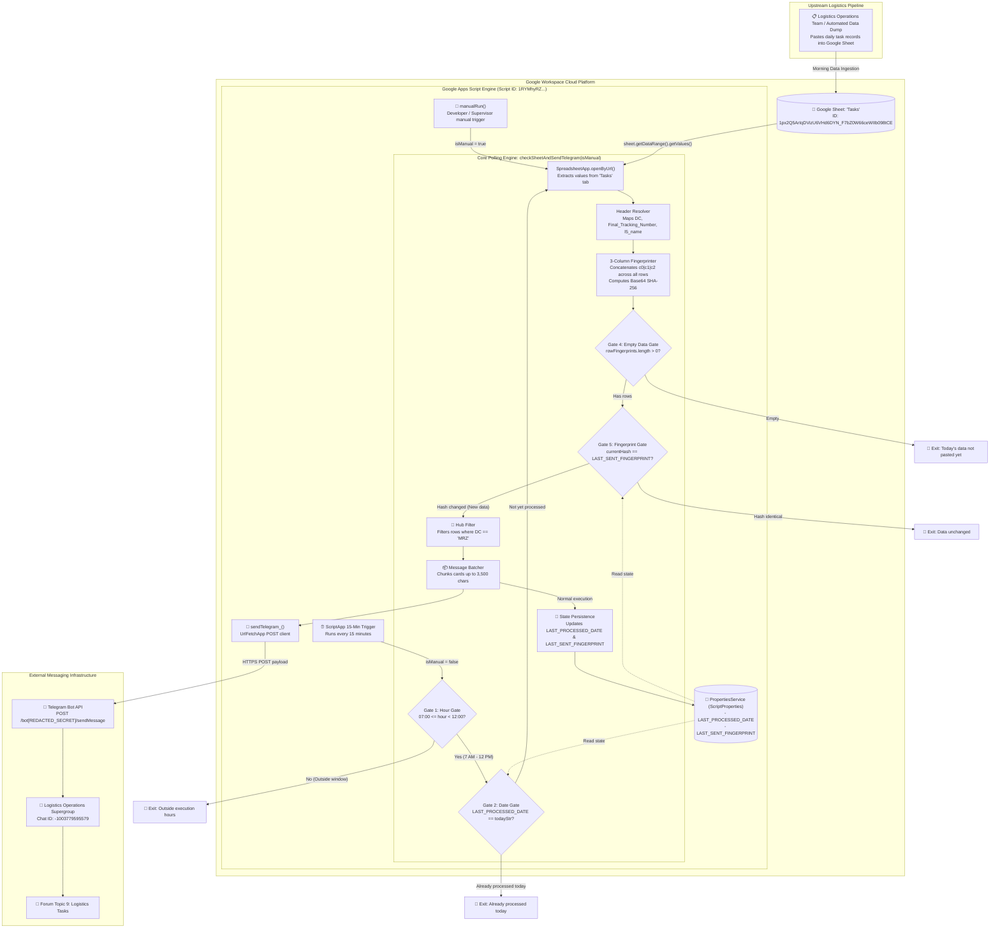
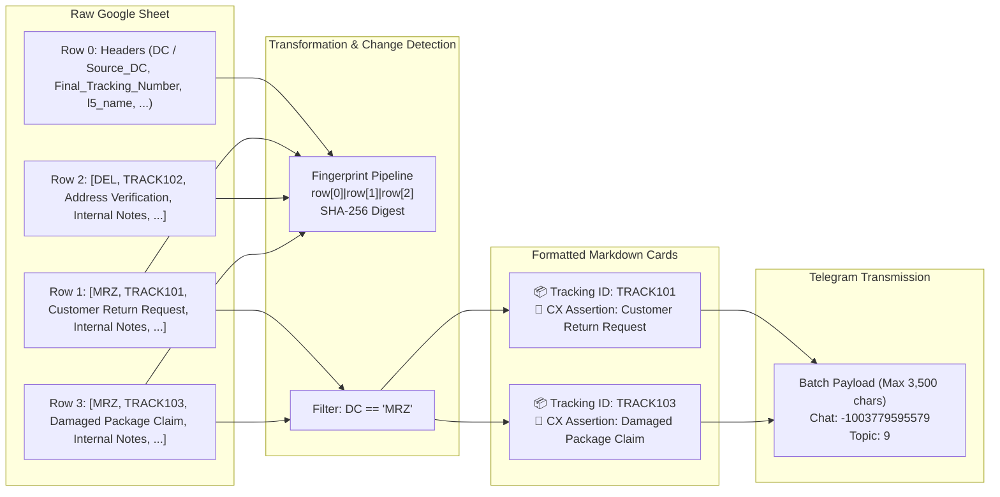
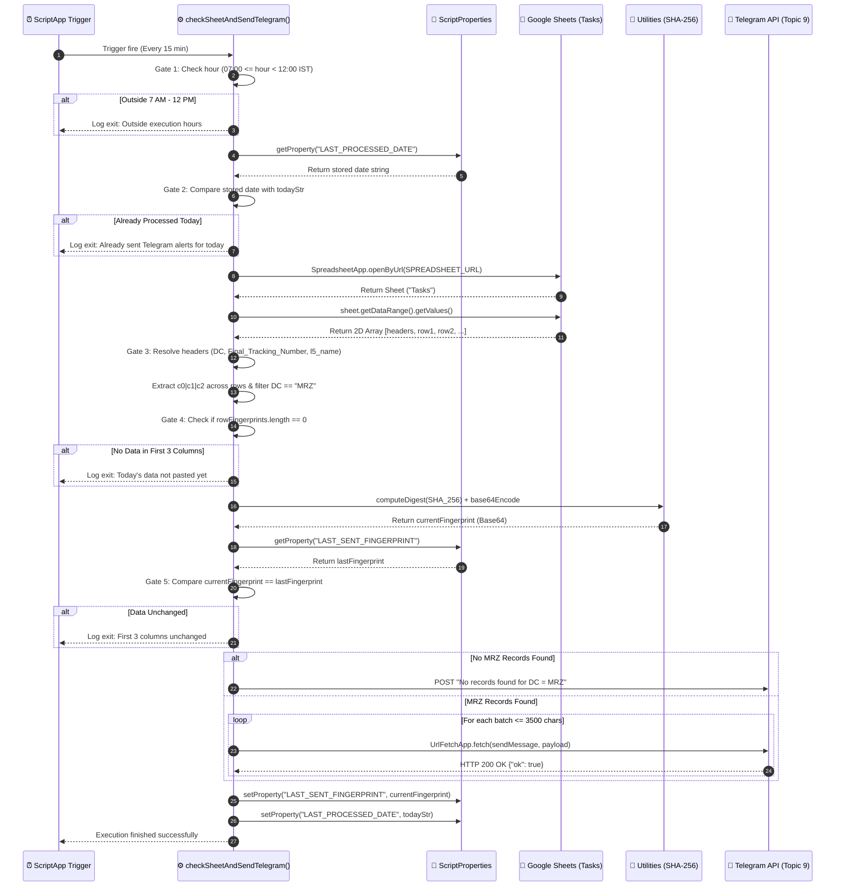
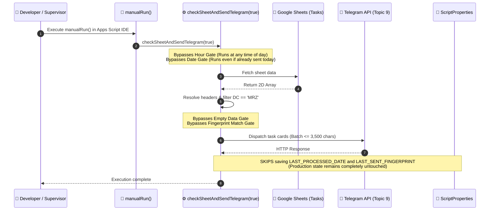

# Tasky Logistics Tasks Poller
> **Autonomous Mirzapur Hub (`MRZ`) Task Poller, 3-Column Change-Detection Engine, and Telegram Forum Topic Dispatcher** — Architecture Specification & Project Memory Note

---

## 1. Overview
`Tasky Logistics Tasks Poller` (clasp project slug: `tasky`, Google Clasp Script ID: `1RYMhyRZ2V8fRmn4IvYKBU2sxCuiLon93-jUYwyVVvK2I1GuZWMT96qbK`) is a dedicated supply chain operations monitoring daemon built on [[Google Apps Script]] (V8 runtime). It automates the intake, filtering, change detection, and team notification of daily customer assertion tasks for the Mirzapur logistics hub (`MRZ`).

### The Operational Problem
Prior to Tasky, hub supervisors and logistics field teams had to manually monitor, refresh, and scan a central operational [[Google Sheets]] spreadsheet (`Tasks` tab) throughout the morning to discover newly assigned tasks and customer experience (CX) assertions. This manual polling was tedious, caused response delays on urgent customer escalations, and was prone to alert spam or missed tasks when multiple users updated rows simultaneously.

### The Architectural Solution
Tasky eliminates manual polling by operating as an automated headless daemon scheduled to execute every 15 minutes during the critical morning operational window (07:00 AM to 12:00 PM IST), incorporating a multi-layer gating engine to ensure accurate dispatch:
1. **Operating Window Gating:** Evaluates current local time in `Asia/Kolkata` and only executes between 07:00 and 12:00.
2. **Calendar Date Gating:** Inspects `PropertiesService.getScriptProperties().getProperty("LAST_PROCESSED_DATE")` to ensure alerts are dispatched at most once per calendar date.
3. **Empty Data Gating:** Verifies that rows in the remote spreadsheet contain actual data in the first three columns.
4. **3-Column SHA-256 Fingerprint Gating:** Hashes the first three columns (`c0|c1|c2`) of all sheet rows using SHA-256 and Base64 encoding. It compares this digest against `LAST_SENT_FINGERPRINT` in `ScriptProperties` to ensure notifications are dispatched only after fresh daily data has been pasted, while remaining immune to downstream manual modifications in columns 4+.
5. **Dynamic Header Resolution & MRZ Filtering:** Resolves variable header names for the Distribution Center column (`DC`, `Source_DC`, `Source DC`), tracking number (`Final_Tracking_Number`), and customer assertion (`l5_name`), filtering exclusively for records assigned to `"MRZ"`.
6. **Chunked Telegram Broadcast:** Formats individual task cards with Markdown syntax and batches them into payloads under 3,500 characters, posting directly to Topic ID `9` of the logistics operations [[Telegram]] supergroup (`-1003779595579`).
7. **Manual Test Safety Hook:** Provides an `isManual` bypass parameter and `manualRun()` entry point that allows operators and developers to execute immediate end-to-end runs without altering production date or fingerprint state in `ScriptProperties`.

## 2. Tech Stack

| Layer | Technology | Version | Purpose & Architectural Notes |
|---|---|---|---|
| **Server Runtime** | [[Google Apps Script]] | V8 Engine *(stated in appsscript.json:6)* | Cloud serverless runtime executing ECMAScript 6+ logic within Google Workspace infrastructure. Interfaces natively with Sheets, Triggers, and Properties. |
| **Project Manifest** | `appsscript.json` | Manifest V1 *(stated in src/appsscript.json)* | Defines environment metadata: `timeZone: "Asia/Kolkata"`, `exceptionLogging: "STACKDRIVER"`, `runtimeVersion: "V8"`, and empty dependencies `{}`. |
| **CLI & Deployment** | Google Clasp (`@google/clasp`) | Clasp CLI *(stated in .clasp.json)* | Local code synchronization tool mapping local `src/` directory to remote Apps Script project `1RYMhyRZ2V8fRmn4IvYKBU2sxCuiLon93-jUYwyVVvK2I1GuZWMT96qbK`. |
| **Data Source** | [[Google Sheets]] (`SpreadsheetApp`) | Native Service *(stated in Code.js:42)* | Interfaces with remote workbook `1px2Q5ArIqDVizU6VHd6DYN_F7bZ0W66ceWIIb098tCE` (tab `Tasks`) to fetch raw tabular operational assignments. |
| **State Persistence** | `PropertiesService` (`ScriptProperties`) | Native Service *(stated in Code.js:29)* | Key-value storage storing execution markers (`LAST_PROCESSED_DATE`) and SHA-256 data digests (`LAST_SENT_FINGERPRINT`). |
| **Crypto & Encoding** | `Utilities` (Google Apps Script) | Native Service *(stated in Code.js:117-118)* | Generates SHA-256 cryptographic digests (`Utilities.DigestAlgorithm.SHA_256`) and Base64 strings (`Utilities.base64Encode`) for row fingerprinting. |
| **HTTP Transport** | `UrlFetchApp` (Google Apps Script) | Native Service *(stated in Code.js:198)* | Transmits HTTPS POST requests with JSON payloads to the Telegram Bot API `sendMessage` endpoint with `muteHttpExceptions: true`. |
| **Scheduling Engine** | `ScriptApp` | Native Service *(stated in Code.js:207-226)* | Manages installable time-driven project triggers executing `checkSheetAndSendTelegram()` every 15 minutes. |
| **Local Test Runner** | `pytest` | 9.0.3 / Python 3.14 *(stated in terminal test output)* | Executes local Python unit tests in `tests/` mocking `ScriptProperties`, hashing logic, gating rules, and verifying source code hygiene. |
| **Messaging Channel** | Telegram Bot API | Telegram Bot REST API | External notification channel. Dispatches Markdown cards to supergroup Chat ID `-1003779595579` targeted to Topic ID `9`. |

---

## 3. Architecture

### System Topology Overview
The architecture is completely serverless, decoupled, and operates between Google Workspace Cloud and Telegram:



### Sheet-to-Telegram Data Transformation Pipeline



---

## 4. Folder & File Structure

The project follows a standard Google Clasp structure with a dedicated `src/` directory pushed to Google Apps Script and a root-level Python verification harness:

```
C:\Users\User\Desktop\gas apps\tasky\
├── .clasp.json                  # Clasp configuration defining scriptId and rootDir: "src"
├── REQUIREMENTS.md              # Requirements and completion checklist for legacy trigger removal
├── STATE.md                     # Session state and progress dashboard
├── loop-debug.md                # Execution trace log for autonomous agent verification loops
├── .okf/                        # Google Open Knowledge Framework (OKF) specification graphs
│   ├── okf_manifest.json        # Machine-readable manifest connecting 10 OKF knowledge nodes
│   └── nodes/                   # Technical knowledge nodes
│       ├── api_schemas.md       # Telegram API contracts and internal GAS function signatures
│       ├── architecture.md      # Architecture, component topology, and data flow specifications
│       ├── database.md          # Google Sheets schema definitions and ScriptProperties keys
│       ├── design.md            # Telegram Markdown layout and character constraint guidelines
│       ├── domain.md            # Personas, operational context, and Mirzapur hub requirements
│       ├── memory.md            # Session memory, historical decisions, and cleanup context
│       ├── phases.md            # Phased roadmap for fingerprinting and gating mechanisms
│       ├── prd.md               # Product Requirements Document for trigger hygiene
│       ├── rules.md             # Coding guidelines, time zone rules, and banned practices
│       └── skills.md            # Operational competencies for GAS, Sheets, and Telegram
├── src/                         # Target deployment directory pushed to Google Apps Script
│   ├── Code.js                  # Primary application file (243 lines): poller, gates, fingerprinting, Telegram
│   └── appsscript.json          # Apps Script manifest: V8 runtime, Asia/Kolkata timezone, Stackdriver logging
└── tests/                       # Python unit test suite for local verification without live Google APIs
    ├── __pycache__/             # Compiled bytecode cache
    ├── test_fingerprint.py      # Unit tests for 3-col SHA-256 fingerprinting, gating logic, and code hygiene
    └── test_stub.py             # Baseline smoke test assertion
```

---

## 5. Core Modules & Responsibilities

### `src/Code.js` (243 lines)
- **Purpose:** Core server-side orchestrator containing the entire polling lifecycle, time gating, 3-column SHA-256 fingerprint change detection, Google Sheet extraction, Telegram payload chunking, and trigger lifecycle utilities.
- **Top-level Constants:**
  - `TELEGRAM_BOT_TOKEN = "[REDACTED_SECRET]"` *(Line 1)*: Authentication secret for Telegram Bot API HTTP requests.
  - `TELEGRAM_CHAT_ID = "-1003779595579"` *(Line 2)*: Target supergroup chat identifier for operations notifications.
  - `TELEGRAM_TOPIC_ID = 9` *(Line 3)*: Destination Forum Topic thread ID (`message_thread_id`) designated for logistics tasks.
  - `SPREADSHEET_URL = "https://docs.google.com/spreadsheets/d/1px2Q5ArIqDVizU6VHd6DYN_F7bZ0W66ceWIIb098tCE/edit"` *(Line 4)*: Google Sheets URL containing the operational dataset.
  - `SHEET_NAME = "Tasks"` *(Line 5)*: Specific worksheet tab queried for task entries.
- **Key Functions:**
  - `checkSheetAndSendTelegram(isManual)` *(Lines 13–177)*:
    - **Inputs:** `isManual` (`boolean`, optional) — if `true`, completely bypasses the 07:00–12:00 operating window, the calendar date gate, the empty sheet check, the fingerprint equality check, and skips saving state to `ScriptProperties`.
    - **Outputs:** None (side-effect driven: reads remote sheet, mutates `ScriptProperties`, transmits HTTPS calls to Telegram).
    - **Detailed Step Breakdown:**
      1. *Gate 1 (Hour check, Lines 21–27):* Evaluates `new Date().getHours()`. If not manual and `hour < 7 || hour >= 12`, logs diagnostic and halts.
      2. *Gate 2 (Date check, Lines 31–38):* Reads `LAST_PROCESSED_DATE` from `ScriptProperties`. If not manual and equals today's date formatted as `yyyy-MM-dd` in `Session.getScriptTimeZone()`, halts.
      3. *Sheet Fetch & Header Mapping (Lines 41–79):* Opens remote sheet via `SpreadsheetApp.openByUrl(SPREADSHEET_URL)`. Inspects row 0 for column headers. Supports alias matching for DC column: `["DC", "Source_DC", "Source DC"]`. Locates `Final_Tracking_Number` and `l5_name`. If any column is missing, logs an error and halts.
      4. *Fingerprint Extraction & MRZ Filtering (Lines 81–105):* Iterates through sheet rows (indices 1 to N). Extracts `c0`, `c1`, and `c2` from the first three columns, trims whitespace, and constructs an array of `c0|c1|c2` strings. Simultaneously checks if row `colDC` strictly equals `"MRZ"`. If true and both tracking number and `l5_name` exist, formats a Markdown card and appends to `cards`.
      5. *Gate 4 (Empty Data Check, Lines 110–113):* If not manual and `rowFingerprints.length === 0`, logs that today's data has not been pasted yet and halts.
      6. *Digest Computation (Lines 115–119):* Computes SHA-256 byte digest over `rowFingerprints.join("\n")` via `Utilities.computeDigest(Utilities.DigestAlgorithm.SHA_256, rawFingerprint, Utilities.Charset.UTF_8)` and encodes it to Base64 via `Utilities.base64Encode(digest)`.
      7. *Gate 5 (Fingerprint Comparison, Lines 121–128):* If not manual, compares computed digest against `LAST_SENT_FINGERPRINT` in `ScriptProperties`. If equal, halts.
      8. *Telegram Dispatch (Lines 132–165):* If `cards.length === 0`, dispatches an informational notification stating "Sheet searched successfully. No records found for DC = MRZ." Otherwise, constructs a header card (`📋 Today's Task ... Hub Name: MRZ ... Total Records: N`) and iterates through cards, accumulating batches up to `maxLen = 3500` characters before calling `sendTelegram_(batch)`.
      9. *Gate 7 (State Persistence, Lines 168–172):* If not manual, updates `LAST_SENT_FINGERPRINT` and `LAST_PROCESSED_DATE` in `ScriptProperties`.
  - `sendTelegram_(text)` *(Lines 183–203)*:
    - **Inputs:** `text` (`string`) — Markdown-formatted message payload.
    - **Behavior:** Prepares JSON payload with `chat_id: "-1003779595579"`, `text`, `parse_mode: "Markdown"`, and `message_thread_id: 9`. Executes POST via `UrlFetchApp.fetch("https://api.telegram.org/bot[REDACTED_SECRET]/sendMessage", options)` with `muteHttpExceptions: true`. Logs Telegram API JSON response.
  - `cleanUpTriggers_(functionName)` *(Lines 206–216)*:
    - **Inputs:** `functionName` (`string`) — target handler function name.
    - **Behavior:** Queries `ScriptApp.getProjectTriggers()`, checks `trigger.getHandlerFunction() === functionName`, and invokes `ScriptApp.deleteTrigger(trigger)`. Logs count of deleted triggers.
  - `setupSheetCheckTrigger()` *(Lines 219–227)*:
    - **Inputs:** None.
    - **Behavior:** Idempotently resets triggers by calling `cleanUpTriggers_("checkSheetAndSendTelegram")` and installs a new 15-minute time trigger targeting `checkSheetAndSendTelegram`.
  - `resetScriptState()` *(Lines 230–238)*:
    - **Inputs:** None.
    - **Behavior:** Deletes `LAST_PROCESSED_DATE` and `LAST_SENT_FINGERPRINT` from `ScriptProperties`, then deletes all active project triggers for `checkSheetAndSendTelegram`.
  - `manualRun()` *(Lines 241–243)*:
    - **Inputs:** None.
    - **Behavior:** Invokes `checkSheetAndSendTelegram(true)`, enabling manual diagnostic runs without polluting production state.
- **Notable Logic & Gotchas:**
  - *Fingerprinting Scope:* Fingerprints strictly the first 3 columns (`row[0]|row[1]|row[2]`). If operators modify or correct tracking numbers or DC values located in columns outside indices 0–2, or if upstream systems modify only column 4+, the fingerprint digest will remain identical and the script will consider data unchanged!
  - *No Markdown Escaping:* Special characters in tracking numbers or customer assertion text (`_`, `*`, `[`, `` ` ``) are injected raw into the Telegram Markdown string. If `l5_name` contains unbalanced asterisks or underscores, Telegram's Markdown parser will reject the payload with an HTTP 400 `Bad Request: can't parse entities` error (handled gracefully by `muteHttpExceptions: true`, but resulting in message loss).

---

### `tests/test_fingerprint.py` (130 lines)
- **Purpose:** Local Python verification module simulating the Google Apps Script runtime, testing fingerprint stability, gating rules, and code hygiene without requiring live Google Workspace connections.
- **Key Components:**
  - `MockScriptProperties` *(Lines 5–18)*: Mock class emulating `PropertiesService.getScriptProperties()` with `getProperty`, `setProperty`, and `deleteProperty`.
  - `compute_3col_fingerprint(data_rows)` *(Lines 20–35)*: Exact Python replication of the 3-column SHA-256 Base64 fingerprinting algorithm in `Code.js`.
  - `simulate_trigger_gating(...)` *(Lines 37–56)*: Emulates the multi-step gating sequence of `checkSheetAndSendTelegram`.
  - `test_3col_fingerprint_ignores_column_4_edits()` *(Lines 59–70)*: Asserts that altering values in columns 4 and 5 does not alter the generated hash.
  - `test_trigger_gating_prevents_sending_old_data_on_new_day()` *(Lines 73–96)*: Tests date roll-over behavior when data in sheet remains unchanged.
  - `test_manual_run_bypasses_all_gates_and_does_not_alter_state()` *(Lines 98–109)*: Verifies `isManual=True` bypasses date and hash gates without altering `ScriptProperties`.
  - `test_reset_script_state_clears_properties()` *(Lines 111–121)*: Verifies state reset logic.
  - `test_no_legacy_gmail_trigger_references_in_code()` *(Lines 123–130)*: Static code analysis assertion opening `src/Code.js` and asserting strings `checkGmailAndSchedule` and `sendMRZTasksToTelegram` are completely absent.

---

## 6. Data Flow / Key Workflows

### 1. Scheduled 15-Minute Trigger Polling Workflow (`isManual === false`)



---

### 2. Manual Diagnostics & Bypass Run (`manualRun()` -> `isManual === true`)



---

## 7. Configuration & Environment

Tasky does not utilize `.env` files. Configuration is partitioned between committed script constants in `src/Code.js`, script properties in `PropertiesService`, and manifest settings in `src/appsscript.json`:

### Script Constants (`src/Code.js`)

| Constant Name | Type | Value / Reference | Purpose & Scope |
|---|---|---|---|
| `TELEGRAM_BOT_TOKEN` | `string` | `[REDACTED_SECRET]` *(Line 1)* | Telegram Bot API authentication token. Dispatches HTTP requests. |
| `TELEGRAM_CHAT_ID` | `string` | `"-1003779595579"` *(Line 2)* | Supergroup chat identifier for operations communication. |
| `TELEGRAM_TOPIC_ID` | `number` | `9` *(Line 3)* | Forum Topic thread ID (`message_thread_id`) designated for logistics tasks. |
| `SPREADSHEET_URL` | `string` | `"https://docs.google.com/spreadsheets/d/1px2Q5ArIqDVizU6VHd6DYN_F7bZ0W66ceWIIb098tCE/edit"` *(Line 4)* | Google Sheets source document containing task allocations. |
| `SHEET_NAME` | `string` | `"Tasks"` *(Line 5)* | Name of the worksheet tab queried for task entries. |

### Persistent State (`PropertiesService.getScriptProperties()`)

| Property Key | Format | Example | Purpose & Storage Store |
|---|---|---|---|
| `LAST_PROCESSED_DATE` | Date String (`yyyy-MM-dd`) | `"2026-07-25"` | Stores calendar date of last successful alert broadcast. Prevents multiple triggers firing on the same calendar day. |
| `LAST_SENT_FINGERPRINT` | Base64 SHA-256 Digest | `"aB3+x9..."` | Hash of concatenated first three columns across all sheet rows. Prevents re-broadcasting stale data. |

### Manifest Configuration (`src/appsscript.json`)

```json
{
  "timeZone": "Asia/Kolkata",
  "dependencies": {},
  "exceptionLogging": "STACKDRIVER",
  "runtimeVersion": "V8"
}
```

- **Runtime Version:** V8 (`runtimeVersion: "V8"`), enabling modern ES6+ syntax (arrow functions, template literals, `let`/`const`, `for...of`).
- **Timezone:** `Asia/Kolkata` (IST, UTC+05:30), required for precise evaluation of the 07:00–12:00 operational gating window.
- **Exception Logging:** `STACKDRIVER`, allowing detailed exception tracking in Google Cloud Logging.
- **Dependencies:** Empty `{}` (no external Apps Script libraries attached).

### Clasp Configuration (`.clasp.json`)

```json
{
  "scriptId": "1RYMhyRZ2V8fRmn4IvYKBU2sxCuiLon93-jUYwyVVvK2I1GuZWMT96qbK",
  "rootDir": "src",
  "scriptExtensions": [".js", ".gs"],
  "htmlExtensions": [".html"],
  "jsonExtensions": [".json"],
  "filePushOrder": [],
  "skipSubdirectories": false
}
```

---

## 8. External Integrations & APIs

| Service / API | Purpose | Authentication Method | Invocation Location in Code | Known Quotas, Limits & Behaviors |
|---|---|---|---|---|
| **Google Sheets API** (`SpreadsheetApp`) | Reads remote workbook and extracts row arrays from tab `Tasks`. | Google Workspace Script Authorization (implicit OAuth) | `src/Code.js:42-50` (`SpreadsheetApp.openByUrl()`, `getSheetByName()`, `getDataRange().getValues()`) | Bounded by Apps Script total execution time (6 min) and cell read size limits. |
| **PropertiesService** (`ScriptProperties`) | Persistent key-value store for deduplication state. | Google Workspace Internal Context | `src/Code.js:29, 33, 123, 169-170, 231-233` | 500 KB total storage quota per property store; 9 KB max value size per property. |
| **Google Apps Script Utilities** | SHA-256 cryptographic digest computation and Base64 string encoding. | Google Workspace Internal Utility | `src/Code.js:18, 117-118, 132` (`computeDigest`, `base64Encode`, `formatDate`) | In-memory CPU operations; highly efficient. |
| **ScriptApp Engine** | Manages installable time triggers for recurring 15-minute polling. | Google Workspace Script Authorization | `src/Code.js:207, 211, 222-225` (`getProjectTriggers()`, `newTrigger()`) | Limit of 20 installable triggers per script project. |
| **Telegram Bot API** (`sendMessage`) | Dispatches formatted Markdown task cards to operational forum topic. | Bot Authentication Token in URL path: `/bot[REDACTED_SECRET]/sendMessage` | `src/Code.js:198` (`UrlFetchApp.fetch()`) | Telegram character limit is 4,096 chars per message. Tasky batches at 3,500 chars (`Code.js:151`). HTTP 429 rate limit if exceeding 30 msgs/sec. |

---

## 9. Testing

### Local Unit Testing
The repository contains an automated local test suite in `tests/` powered by `pytest`. Because Google Apps Script native services (`SpreadsheetApp`, `PropertiesService`, `UrlFetchApp`) cannot run natively in standard local Node.js or Python runtimes without extensive mocking, the test suite verifies business logic algorithms and script hygiene through mock harnesses.

- **Framework:** `pytest` (v9.0.3, Python 3.14)
- **Local Test Execution Command:**
  ```bash
  pytest
  ```
  *(Verified execution: 6 passed in 0.09s)*

### Verified Test Cases (`tests/test_fingerprint.py` & `tests/test_stub.py`):
1. `test_3col_fingerprint_ignores_column_4_edits`: Verifies that modifying cells in columns 4 and 5 produces identical SHA-256 digests, proving immunity to downstream manual edits.
2. `test_trigger_gating_prevents_sending_old_data_on_new_day`: Verifies that a date roll-over alone does not trigger alerts if sheet data remains unchanged from the previous day.
3. `test_manual_run_bypasses_all_gates_and_does_not_alter_state`: Confirms that setting `isManual=True` passes through all gates and leaves `LAST_PROCESSED_DATE` and `LAST_SENT_FINGERPRINT` unaltered in `ScriptProperties`.
4. `test_reset_script_state_clears_properties`: Confirms that resetting state cleanly removes persistent keys from `ScriptProperties`.
5. `test_no_legacy_gmail_trigger_references_in_code`: Static AST/text inspection confirming that deprecated trigger names `checkGmailAndSchedule` and `sendMRZTasksToTelegram` are completely removed from `src/Code.js`.
6. `test_placeholder`: Smoke assertion in `tests/test_stub.py`.

### Manual & In-Cloud Testing:
- **`manualRun()` Entry Point (`src/Code.js:241`):** Developers or operations supervisors can open the Apps Script Web Editor, select `manualRun` from the function dropdown, and click **Run**. This immediately queries the live Google Sheet and sends real Telegram alerts to Topic 9 without waiting for the 15-minute cron or respecting the 7 AM–12 PM time window, while leaving production state untouched.
- **`resetScriptState()` Entry Point (`src/Code.js:230`):** Clears all script properties and deletes installed triggers, resetting the script to a clean slate for debugging.

---

## 10. CI/CD & Deployment

### Clasp Deployment Model
The project uses `@google/clasp` (Google Command Line Apps Script Projects) for code management and deployment. There is no external automated CI/CD pipeline (e.g. GitHub Actions) configured in the repository *(stated: repo is Unknown / not documented)*.

- **Local Source Directory:** `src/`
- **Remote Script ID:** `1RYMhyRZ2V8fRmn4IvYKBU2sxCuiLon93-jUYwyVVvK2I1GuZWMT96qbK`
- **Push Command:**
  ```bash
  clasp push
  ```
- **Deployment Lifecycle:**
  1. Developer edits `src/Code.js` or `src/appsscript.json` locally.
  2. Runs local test suite (`pytest`) to confirm algorithmic correctness.
  3. Executes `clasp push` to transmit local files to Google Apps Script cloud.
  4. If trigger installation is needed, runs `setupSheetCheckTrigger()` once from the Google Apps Script IDE.

---

## 11. Setup & Local Development

### Prerequisites
- Node.js (v18+) with global clasp installed: `npm install -g @google/clasp` *(inferred)*
- Python 3.10+ with `pytest` installed
- Access to Google Account authorized on Apps Script project `1RYMhyRZ2V8fRmn4IvYKBU2sxCuiLon93-jUYwyVVvK2I1GuZWMT96qbK`

### Setup Instructions
1. **Navigate to project directory:**
   ```powershell
   cd "C:\Users\User\Desktop\gas apps\tasky"
   ```
2. **Authenticate with Clasp:**
   ```bash
   clasp login
   ```
3. **Verify Local Unit Tests:**
   ```bash
   pytest
   ```
4. **Deploy code to Apps Script:**
   ```bash
   clasp push
   ```
5. **Initialize Project Trigger:**
   - Open Apps Script editor:
     ```bash
     clasp open
     ```
   - In the Apps Script console, select `setupSheetCheckTrigger` from the function dropdown and click **Run**.
   - Grant required OAuth permissions for SpreadsheetApp, PropertiesService, and UrlFetchApp.
   - Confirm trigger is listed under the **Triggers** tab (clock icon) set to 15-minute time-driven execution.

---

## 12. Security Notes

### ⚠️ Critical Security Finding: Committed Plaintext Bot Token

> [!warning]
> **Plaintext Bot Token Committed in Source Code**
> In `src/Code.js` line 1, the production Telegram Bot Token is stored as a plaintext string literal:
> ```javascript
> var TELEGRAM_BOT_TOKEN = "[REDACTED_SECRET]";
> ```
> While the repository is currently local, storing credentials in plaintext creates serious security vulnerabilities:
> 1. Anyone with access to the source code or Apps Script editor can hijack the bot, read inbound updates, or spam channels.
> 2. Pushing this repository to any remote git hosting service (GitHub, GitLab) will immediately expose the token to scrapers.
>
> **Remediation Plan:**
> 1. **Revoke and Rotate:** Revoke the current bot token immediately via `@BotFather` and generate a new token.
> 2. **Migrate to ScriptProperties:** Remove the hardcoded string from `src/Code.js`. Store the new token in `PropertiesService.getScriptProperties()` using a one-time setup script or the Apps Script Project Settings GUI (`TELEGRAM_BOT_TOKEN`).
> 3. Update `sendTelegram_()` to dynamically resolve the token:
>    ```javascript
>    var botToken = PropertiesService.getScriptProperties().getProperty("TELEGRAM_BOT_TOKEN");
>    var url = "https://api.telegram.org/bot" + botToken + "/sendMessage";
>    ```

### OAuth Scopes & Permissions
The manifest `src/appsscript.json` does not declare explicit `oauthScopes`. As a result, Google Apps Script automatically infers scopes upon authorization based on the services called in code:
- `https://www.googleapis.com/auth/spreadsheets` (via `SpreadsheetApp.openByUrl`)
- `https://www.googleapis.com/auth/script.external_request` (via `UrlFetchApp.fetch`)
- `https://www.googleapis.com/auth/script.scriptapp` (via `ScriptApp.newTrigger`, `deleteTrigger`)
- `https://www.googleapis.com/auth/script.storage` (via `PropertiesService.getScriptProperties`)

No Web App endpoints (`doGet` or `doPost`) are declared or deployed, meaning there is zero public incoming HTTP attack surface.

---

## 13. Known Issues, Limitations & Tech Debt

- **Standing Google Apps Script Quotas:**
  - **Execution Runtime:** 6 minutes maximum execution time per trigger invocation. For very large sheets (>10,000 rows), iterating row-by-row and building fingerprints could approach execution limits.
  - **UrlFetch Daily Limit:** 20,000 calls/day for consumer Google accounts; 100,000 calls/day for Google Workspace accounts.
  - **Trigger Caps:** 20 triggers per script project.
- **Fingerprinting Blind Spot (Columns 4+):**
  - Fingerprinting is restricted strictly to the first three columns (`c0|c1|c2` in `Code.js:86-91`). If upstream processes append or update tasks where columns 0, 1, and 2 remain unchanged while columns 4+ change, or if tracking numbers are moved to column 4, Tasky will fail to detect changes and will exit early.
- **Single Hub Hardcoding (`MRZ`):**
  - The hub filter is strictly hardcoded to `"MRZ"` (`Code.js:95`). Other regional delivery hubs sharing the same `Tasks` sheet are ignored.
- **Hardcoded Operating Hours (07:00 to 12:00 IST):**
  - If operational task schedules shift to afternoon or evening cycles, the poller will silently exit on Gate 1 without reading the sheet unless triggered via `manualRun()`.
- **Markdown Entity Collision Risk:**
  - Telegram Markdown requires characters like `_`, `*`, `[`, and `` ` `` to be escaped. Tasky concatenates raw values of `tracking` and `l5_name` directly into the template string (`Code.js:101-103`). If customer assertion text contains formatting symbols, Telegram returns HTTP 400 Bad Request.
- **Single Forum Topic Target:**
  - Alerts are hardcoded to Topic ID `9`. If the operations supergroup structure changes, notifications cannot dynamically redirect to alternative topics without code modification.

---

## 14. Design Decisions & Rationale

- **Why Fingerprint Only the First 3 Columns (`c0|c1|c2`):**
  - *Context:* Operational Google Sheets in logistics hubs are often edited concurrently by multiple users. Field agents and supervisors frequently add status annotations, resolution timestamps, or notes in columns D, E, and F (columns 4+).
  - *Decision:* The fingerprinting algorithm (`Code.js:86-92`) concatenates only columns 0, 1, and 2.
  - *Rationale:* Isolates changes to identity-defining columns (e.g. DC, Date, Tracking Number) and ignores downstream annotation churn, preventing alert spam whenever an operator marks an internal note. *(inferred)*
- **Why Topic ID 9 vs Topic ID 8 in Supergroup `-1003779595579`:**
  - *Context:* Operations supergroup `-1003779595579` is a centralized logistics command center for Mirzapur Hub operations.
  - *Decision:* Tasky posts exclusively to Topic ID `9` (`Code.js:3`), whereas the companion [[Pre-Alert Logistics Automation]] daemon posts to Topic ID `8`.
  - *Rationale:* Strict topic separation prevents inbound flight/conveyance pre-alerts from intermingling with field-level customer task assertions and door-to-door delivery issues. *(stated in Code.js and pre-alert.md)*
- **Why `isManual` Parameter Bypasses All Gates and State Writing:**
  - *Context:* Debugging Apps Script in production often risks resetting triggers or advancing date markers, which would suppress scheduled morning runs for operational staff.
  - *Decision:* `checkSheetAndSendTelegram(isManual)` checks `if (isManual !== true)` before enforcing hour gates, date gates, fingerprint comparisons, and before calling `props.setProperty()`.
  - *Rationale:* Enables safe manual verification (`manualRun()`) by developers and supervisors at any time of day without leaving side-effects in production storage. *(stated in Code.js:14, 21, 32, 110, 122, 168)*
- **Why Legacy Gmail Trigger Cleanup Was Removed:**
  - *Context:* Historical iterations of Tasky attempted to clean up triggers named `checkGmailAndSchedule` and `sendMRZTasksToTelegram` in `setupSheetCheckTrigger()` and `resetScriptState()`.
  - *Decision:* Removed in July 2026 refactoring *(documented in REQUIREMENTS.md and loop-debug.md)*.
  - *Rationale:* Tasky transitioned from an email-scraping architecture to a direct Google Sheets poller. Maintaining references to non-existent handler functions cluttered trigger logs and created confusion during deployment audits. *(stated)*

---

## 15. Roadmap / TODOs

- [ ] **Secrets Externalization:** Migrate `TELEGRAM_BOT_TOKEN`, `TELEGRAM_CHAT_ID`, and `SPREADSHEET_URL` out of source code into `PropertiesService.getScriptProperties()`.
- [ ] **Markdown Escaping Utility:** Implement a regex sanitizer function (e.g., `escapeMarkdown_(text)`) to escape reserved Markdown characters (`_`, `*`, `[`, `]`, `` ` ``) in `tracking` and `l5_name` prior to Telegram transmission.
- [ ] **Configurable Hub List:** Replace hardcoded `"MRZ"` check with an array of monitored hubs stored in `ScriptProperties` to support multi-hub alerting.
- [ ] **Configurable Polling Window:** Allow operating hours (currently 07:00 to 12:00) to be configured dynamically via script properties to accommodate shift changes.
- [ ] **Telegram Interactive Webhook / Command Receiver:** Provide a Telegram bot command (e.g. `/check_tasks`) that triggers an on-demand task poll without needing to open the Google Apps Script web editor.

---

## 16. Changelog

> *No prior note supplied — changelog starts here.*

- **2026-07-25**:
  - **Legacy Trigger Deprecation:** Cleaned up obsolete references to `checkGmailAndSchedule` and `sendMRZTasksToTelegram` trigger cleanup calls from `setupSheetCheckTrigger()` and `resetScriptState()` in `src/Code.js`.
  - **Sole Trigger Handler:** Confirmed `checkSheetAndSendTelegram` as the sole, authoritative time-driven trigger handler.
  - **Unit Testing:** Updated unit test suite in `tests/test_fingerprint.py` with `test_no_legacy_gmail_trigger_references_in_code()` to assert code cleanliness.
  - **Verification:** Verified all 6 pytest test cases pass; deployed clean code via Clasp *(Script ID: `1RYMhyRZ2V8fRmn4IvYKBU2sxCuiLon93-jUYwyVVvK2I1GuZWMT96qbK`)*.
- **2026-07-24** *(inferred from test fixtures)*:
  - **3-Column Fingerprinting Engine:** Introduced SHA-256 Base64 hash computation across `c0|c1|c2` to eliminate alert spam and detect new daily sheet pastes.
  - **Gating Matrix:** Implemented date check (`LAST_PROCESSED_DATE`) and execution hour restriction (07:00 to 12:00 IST).
  - **Testing Hook:** Added `isManual` bypass parameter and `manualRun()` entry point.
- **2026-07-20** *(inferred)*:
  - **Initial Sheet-to-Telegram Transition:** Transitioned system from legacy Gmail polling to direct Google Sheets extraction on `Tasks` tab for Mirzapur Hub (`MRZ`).

---

## 17. Glossary

- **CX Assertion:** Customer Experience assertion or customer dispute categorization (e.g. missing item, customer unavailable, address dispute) captured in column `l5_name`.
- **DC:** Distribution Center / Logistics Delivery Hub (e.g. `MRZ` for Mirzapur).
- **Fingerprint:** Base64-encoded SHA-256 cryptographic digest generated over concatenated row strings (`c0|c1|c2`) to track data changes across polling intervals.
- **Gating:** A series of sequential conditional checks (operating hours, calendar date, content validity, hash comparison) designed to abort script execution early before expensive operations.
- **Google Clasp:** Command Line Apps Script Projects CLI tool developed by Google for local development and version control of Apps Script projects.
- **`isManual` Mode:** Diagnostic execution path that bypasses time constraints and state updates, preventing test runs from interfering with automated daily triggers.
- **MRZ:** Mirzapur Delivery Hub identifier (`MirzapurMYNTRAHub_MRZ`).
- **ScriptProperties:** Built-in Google Apps Script persistent key-value store scoped to the script project, accessible via `PropertiesService.getScriptProperties()`.
- **Topic ID / Message Thread ID:** Telegram forum thread identifier (`message_thread_id: 9`) within a supergroup allowing compartmentalized communication channels.

---

## 18. Related Notes

- [[Pre-Alert Logistics Automation]] — Sister inbound logistics daemon monitoring `LKO_BTS TO UP DH` pre-alerts, logging to `Daily_landing`, and dispatching to Topic ID `8` of the same Telegram supergroup (`-1003779595579`).
- [[AgentFlow-GAS-Backend]] — Upstream and peer Google Apps Script backend services operating within the same logistics workspace.
- [[Tasky Logistics Tasks Poller — Architecture Decisions]] — In-depth architectural records on fingerprint hashing trade-offs, gating logic, and security remediation.
- [[Tasky Logistics Tasks Poller — Changelog]] — Detailed ongoing log of clasp pushes, trigger modifications, and operational updates.

---

## 19. Update Instructions (meta)

To refresh or update this document in future development cycles:
1. Do not regenerate this file from scratch. Paste this existing note into the agent context alongside any updated codebase files (`src/Code.js`, `src/appsscript.json`, `.clasp.json`, `tests/test_fingerprint.py`).
2. Run a diff against the code to identify newly added functions, altered gating logic, or changed Telegram topic IDs.
3. Update **Section 5 (Core Modules & Responsibilities)**, **Section 7 (Configuration & Environment)**, and **Section 13 (Known Issues & Tech Debt)** to match the latest code state.
4. Append new dated entries to **Section 16 (Changelog)**, preserving historical entries.
5. Preserve manually added insights in **Section 14 (Design Decisions & Rationale)** and custom vault links in **Section 18 (Related Notes)**.
6. Verify that no raw secrets or tokens are ever exposed in markdown text or code blocks (`[REDACTED_SECRET]`).
