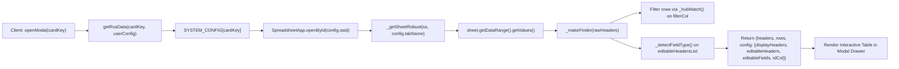
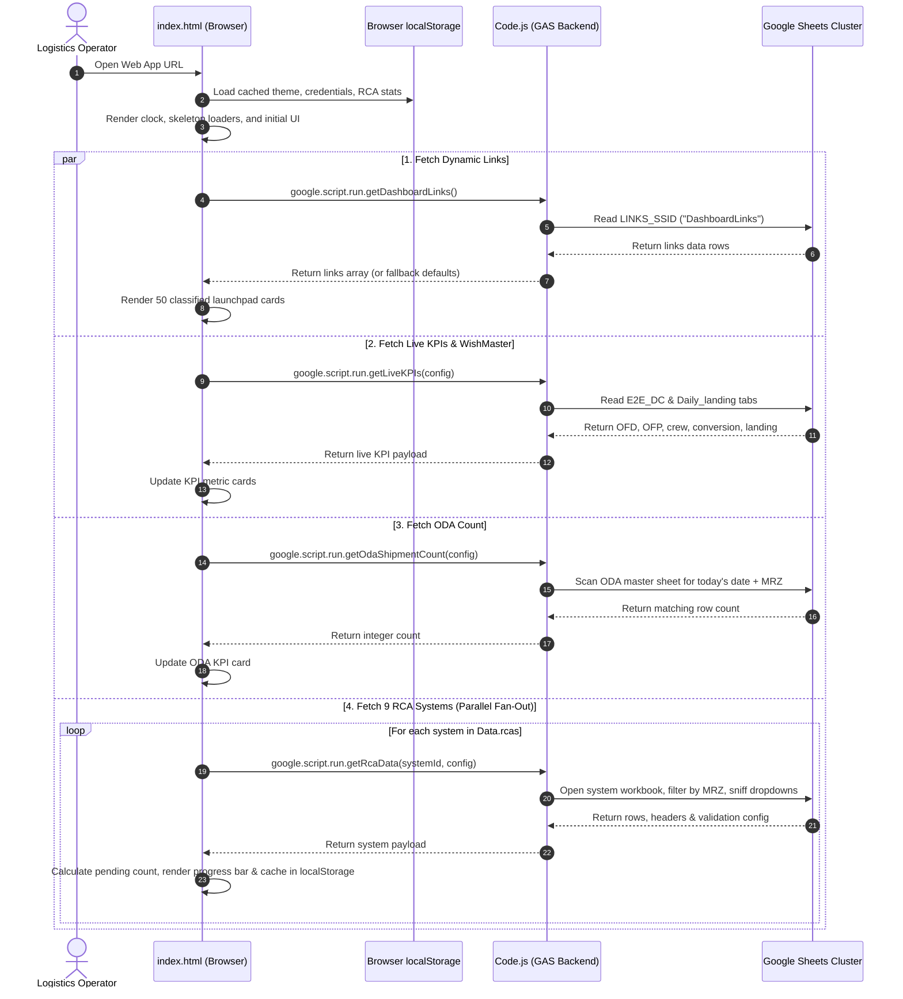
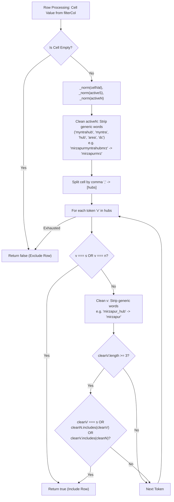
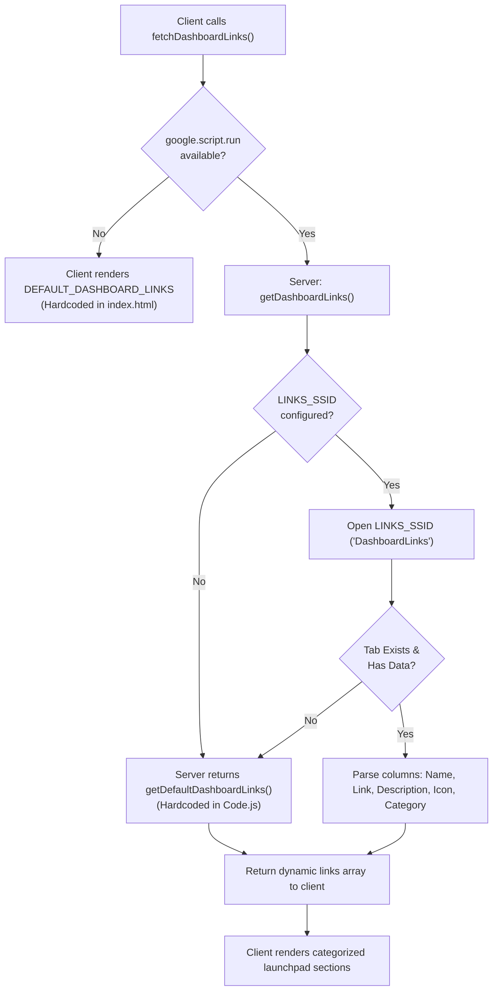
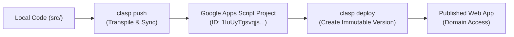

# MRZ Operations Unified Dashboard

## 1. Overview

**MRZ Operations Unified Dashboard** (internally configured as `MRZ OPS — Mirzapur Hub` and `MirzapurMYNTRAHub_MRZ`) is an enterprise-grade [[Google Apps Script]] (GAS) web application, operations management portal, and executive monitoring cockpit (`src/Code.js:1-1106`, `src/index.html:1-2242`). It is engineered specifically for the regional logistics hub in Mirzapur (Uttar Pradesh, India) operating within the [[Myntra]] and Ekart logistics supply chain networks (`src/Code.js:9-10`, `src/index.html:6, 1182`).

```
PROJECT NAME:     MRZ Operations Unified Dashboard
CLASP SCRIPT ID:  1IuUyTgsvqjs1NC8h4OtbHAiADHqKbab2s0qMTreId1aD96NB5JxkvVK6
LOCAL ROOT PATH:  C:\Users\User\Desktop\gas apps\unified Dashboard
TARGET NOTE:      C:\Users\User\Desktop\gptd\prompt_project memory\unified-dashboard.md
PRIMARY HUB:      MirzapurMYNTRAHub_MRZ (Short Code: MRZ)
```

### The Operational Problem
Regional logistics hub managers, team leads, and operations coordinators face fragmented tracking across disconnected operational silos. Operations at the Mirzapur hub encompass forward delivery pendency, reverse pickups (RVP), return-to-origin shipments (RTO), seller protection fund claims (SPF Loss), cash-on-delivery (COD) financial remittances, out-of-delivery-area (ODA) packages, customer non-receipt issues (BRSNR), internal escalations (TASKY), and daily WishMaster (delivery executive) run-rate conversion. Historically, these disparate operational streams were managed across more than 13 isolated Google Sheets and external enterprise portals (`TC App`, `FLO`, `Gating`, `Ekart ERP`). Hub coordinators had to constantly switch between dozens of browser tabs, manually filter thousands of rows for the `MRZ` hub identifier, and risk data corruption or sync conflicts during manual status entry. Furthermore, batch-loading all these sheets server-side triggered Google Apps Script's strict **6-minute execution ceiling**, while manual sheet editing lacked schema validation.

### The Architectural Solution
MRZ Operations Unified Dashboard unifies these operational workstreams into a single high-performance responsive web portal:
1. **Config-Driven Multi-System Hub (`SYSTEM_CONFIG`)**: Orchestrates 9 distinct operational pendency systems (`Forward_Pendency`, `BRSNR`, `TASKY`, `RVP_Q2`, `RTO_Q2`, `SPF_Loss`, `COD_Synergy`, `EOB_Pendency`, and `ReverseBagging_Pendency`) using declarative metadata defining spreadsheet IDs, tab names, primary ID keys, display columns, and editable columns (`src/Code.js:38-120`).
2. **Dynamic Hub Matching Engine (`_hubMatch`)**: Automatically normalizes and extracts hub-specific records across 12 candidate hub column variations (`HUB_FILTER_COLS`) using a token-stripping algorithm that handles composite names, prefixes, suffixes, and comma-separated lists (`src/Code.js:19-32, 162-192`).
3. **Resilient Tab Discovery & Monthly Rollover (`_getSheetRobust`)**: Automatically detects dynamic monthly tab changes (e.g., rolling from June to July) across configured sheets and gracefully falls back to first/last tabs or fuzzy matches (`src/Code.js:194-248`).
4. **Interactive Inline Cell Editing & Bidirectional Writeback (`saveRcaChanges`)**: Renders a dedicated modal table drawer allowing operators to filter pending records, edit RCA remarks or status dropdowns, track dirty fields locally (`modifiedMap`), and commit atomic updates directly back to remote Google Sheets rows via primary key lookups (`src/Code.js:467-518`, `src/index.html:2099-2116`).
5. **Real-Time Delivery Cockpit & WishMaster Performance**: Aggregates live delivery conversion, Out for Delivery (OFD) counts, Out for Pickup (OFP) counts, active delivery crew counts, and yesterday's historical benchmarks across two independent WishMaster sheets (`src/Code.js:579-659`, `src/index.html:1275-1422`).
6. **Centralized Operations Launchpad**: Houses a dynamic directory of 50 external operational systems, forms, response sheets, and tracking workbooks loaded dynamically from a master Google Sheet (`LINKS_SSID`) with resilient multi-tier fallbacks (`src/Code.js:1003-1104`, `src/index.html:1524-1574`).

---

## 2. Tech Stack

| Layer / Component | Technology / Library | Version / Requirement | Source Reference | Role & Operational Notes |
| :--- | :--- | :--- | :--- | :--- |
| **Backend Runtime** | [[Google Apps Script]] (GAS) | V8 Modern Runtime (`runtimeVersion: "V8"`) | `src/appsscript.json:5` | High-performance serverless ECMAScript engine executing backend services and spreadsheet RPCs. |
| **Timezone Standard** | Standard Timezone | `Asia/Kolkata` (IST, UTC+05:30) | `src/appsscript.json:2` | Configures date formatting and session timezones for Northern India logistics operations. |
| **Logging & Telemetry** | Google Cloud Logging | `STACKDRIVER` | `src/appsscript.json:4` | Directs execution errors, warnings, and diagnostic dumps to Google Cloud Stackdriver Logging. |
| **Web App Authorization** | GAS Web App Security | `executeAs: "USER_DEPLOYING"`, `access: "DOMAIN"` | `src/appsscript.json:6-9` | Restricts access to authenticated Google Workspace users within the organization domain while executing with script owner permissions. |
| **Spreadsheet Engine** | Google Sheets Service | `SpreadsheetApp` (Built-in) | `src/Code.js:405, 473, 529, 599, 667, 762, 832, 1009` | Reads and atomically writes data across 13 distinct remote Google Sheets workbooks. |
| **HTML Templating** | GAS HTML Service | `HtmlService` | `src/Code.js:915-917` | Serves `src/index.html` via `createTemplateFromFile('index').evaluate()` with viewport meta tags and `XFrameOptionsMode.ALLOWALL`. |
| **CLI & Deployment** | Google Clasp CLI | `@google/clasp` | `.clasp.json:1-4` | Command Line Apps Script Projects tooling binding local files in `src/` to remote Script ID `1IuUyTgsvqjs1NC8h4OtbHAiADHqKbab2s0qMTreId1aD96NB5JxkvVK6`. |
| **Client Framework** | Vanilla HTML5 / CSS3 / ES6+ | Native Browser Engine | `src/index.html:1-2242` | Pure zero-dependency client application engineered for rapid rendering, low memory footprint, and high-density operational data tables. |
| **Styling & Theming** | CSS Custom Properties | Dark (`--void: #030508`) & Light (`--void: #f8faff`) | `src/index.html:13-74, 2128-2139` | Dual-theme design system featuring CSS grid overlays, neon accents (`--neon-cyan: #00e5ff`, `--neon-violet: #9d4edd`), and local storage persistence. |
| **Typography** | Google Fonts CDN | `Outfit` (400-800) & `JetBrains Mono` (400-500) | `src/index.html:7-9` | Sans-serif display typeface for executive headings and monospaced font for tracking IDs and timestamps. |
| **Iconography** | Bootstrap Icons CDN & SVG | `bootstrap-icons@1.13.1` + Inline SVG | `src/index.html:10, 1478-1488` | High-density vector icons for logistics actions, trucks, packages, shields, and system links. |
| **Local Unit Testing** | Python `pytest` | Python 3.14 / `pytest` 9.0.3 | `tests/test_stub.py:1-3` *(stated)* | Python environment and verification harness configured for automated testing loops. |
| **Agentic Loop Harness** | Antigravity 4-Tier System | Custom FastMCP Python Server + Bash Hooks | `STATE.md:1-43`, `.agents/developer_knowledge_mcp.py:1-427` | Context-aware agent harness enforcing command validation, write gating, and loop termination checks. |

---

## 3. Architecture

### System Topology Diagram

The unified dashboard architecture decouples client visualization from backend Google Sheets I/O. The single-page web app communicates through asynchronous Google Apps Script RPC calls (`google.script.run`), dispatching parallel requests to prevent server execution timeouts.

```mermaid
flowchart TB
    subgraph ClientLayer ["Client Presentation Layer (Browser)"]
        UI["src/index.html<br/>Responsive Single Page App"]
        Nav["Navigation Bar<br/>(Home / Live Hub / RCA Center / Settings)"]
        HomeTab["Home Tab<br/>(Clock, Shortcuts, 50+ Classified Links)"]
        LiveTab["Live Hub Tab<br/>(KPI Cards, Active Crew, Yesterday Report)"]
        RcaTab["RCA Center Tab<br/>(9 System Cards, Progress Bars)"]
        ModalDrawer["Batch Entry Modal Drawer<br/>(Inline Stealth Editor, Dropdowns)"]
        LocalStore[("Browser localStorage<br/>Credentials, Theme, Cached Counts")]
    end

    subgraph Transport ["Client-Server RPC Bridge"]
        RPC["google.script.run<br/>(Asynchronous RPC Dispatch)"]
    end

    subgraph BackendLayer ["Google Apps Script Engine (src/Code.js - V8)"]
        DoGet["doGet()<br/>(HTML Service Renderer)"]
        OverviewAPI["getOverviewData()<br/>(Aggregates KPIs, Wishmaster, NPS)"]
        RcaAPI["getRcaData(cardKey)<br/>(Dynamic System Query)"]
        SaveAPI["saveRcaChanges(cardKey, payload)<br/>(Atomic Cell Writeback)"]
        StatsAPI["getAllRcaStats()<br/>(Batch Count Engine)"]
        LinksAPI["getDashboardLinks()<br/>(Dynamic Links Provider)"]
        OdaAPI["getOdaShipmentCount()<br/>(ODA Day Scanner)"]
        
        subgraph CoreEngines ["Core Utility & Normalization Engines"]
            HubMatch["_hubMatch() & _norm()<br/>(12-Alias Hub Filter)"]
            TabResolver["_getSheetRobust()<br/>(Dynamic Monthly Rollover)"]
            Finder["_makeFinder() & _levenshtein()<br/>(Fuzzy Header Indexer)"]
            TypeDetector["_detectFieldType()<br/>(Validation Criteria Sniffer)"]
            DateParser["_parseDateParts()<br/>(Multi-Format Date Parser)"]
        end
    end

    subgraph StorageLayer ["Google Sheets Cluster (13 Workbooks)"]
        S_FWD[("1. Forward Pendency<br/>[REPLACE_ME_SSID]")]
        S_BRSNR[("2. BRSNR Tracker<br/>1FNhmEqc...")]
        S_TASKY[("3. Tasky Escalations<br/>1px2Q5Ar...")]
        S_RVP[("4. RVP Q2 Loss<br/>1LPIyz83...")]
        S_RTO[("5. RTO Q2 Loss<br/>1LPIyz83...")]
        S_SPF[("6. SPF Claims<br/>1gYvbUD9...")]
        S_COD[("7. COD Synergy<br/>1mS9hIiq...")]
        S_EOB[("8. EOB Pendency<br/>18RMRu7r...")]
        S_REV[("9. Reverse Bagging<br/>1WyFf-TO...")]
        S_WM_LIVE[("10. WishMaster Live / E2E<br/>1vuzG3MN...")]
        S_WM_YEST[("11. WishMaster Yesterday<br/>1avV2Tx9...")]
        S_ODA[("12. ODA Tracker<br/>1CBUp8td...")]
        S_NPS[("13. NPS Feedback<br/>1l-xQyuH...")]
        S_LINKS[("14. Dashboard Links<br/>1cGvJTkK...")]
    end

    UI --> Nav
    Nav --> HomeTab & LiveTab & RcaTab
    RcaTab --> ModalDrawer
    UI <--> LocalStore

    HomeTab -->|Fetch Links| RPC
    LiveTab -->|Fetch KPIs & Crew| RPC
    RcaTab -->|Fetch Counts & Rows| RPC
    ModalDrawer -->|Commit Changes| RPC

    RPC --> DoGet
    RPC --> OverviewAPI
    RPC --> RcaAPI
    RPC --> SaveAPI
    RPC --> StatsAPI
    RPC --> LinksAPI
    RPC --> OdaAPI

    RcaAPI --> TabResolver --> StorageLayer
    RcaAPI --> Finder
    RcaAPI --> HubMatch
    RcaAPI --> TypeDetector

    SaveAPI --> Finder
    SaveAPI -->|Cell-by-Cell SetValue & Flush| StorageLayer

    OverviewAPI --> S_WM_LIVE & S_WM_YEST & S_NPS
    OdaAPI --> DateParser --> S_ODA
    LinksAPI --> S_LINKS
    StatsAPI --> StorageLayer
```



### Config-Driven System Dispatcher

The backend eliminates hardcoded sheet parsers by defining systems declaratively in `SYSTEM_CONFIG` (`src/Code.js:38-120`). Every system specifies:
- `ssid`: Target Google Spreadsheet ID.
- `tabName`: Sheet name or semantic alias (`FIRST_TAB`, `LAST_TAB`, or month-name matching).
- `headerRow`: 1-based index indicating which row contains column labels.
- `filterCol`: Preferred column for hub filtering (falls back to scanning `HUB_FILTER_COLS`).
- `idCol`: Unique identifier column used as row key during inline writeback.
- `displayHeaders`: Array of column names presented as read-only context in the UI.
- `editableHeadersList`: Array of columns exposed as stealth editable inputs or dropdowns.



---

## 4. Folder & File Structure

```
unified Dashboard/
├── .agents/                                # Autonomous development agent harness
│   ├── hooks/                              # Lifecycle hook safety gates
│   │   ├── cmd-validator.sh                # PreToolUse shell command safety interceptor
│   │   ├── file-validator.sh               # File write gating validator
│   │   └── loop-termination-verifier.sh    # Stop hook enforcing passing pytest tests
│   ├── developer_knowledge_mcp.py          # FastMCP server exposing guidelines & schemas
│   ├── hooks.json                          # Hook regex and command binding configurations
│   └── mcp.json                            # Local stdio MCP launcher configuration
├── .clasp.json                             # Clasp project binding to GAS Script ID
├── STATE.md                                # 4-Tier development loop tracking state
├── dashboard_links.csv                     # Standalone CSV catalog of 50 hub operational links
├── src/                                    # Google Apps Script deployment root (rootDir)
│   ├── Code.js                             # Backend server logic, SYSTEM_CONFIG & RPC endpoints
│   ├── appsscript.json                     # Apps Script manifest (V8 runtime, timezone, webapp)
│   └── index.html                          # Single-page executive dashboard frontend
└── tests/                                  # Local testing suite
    └── test_stub.py                        # Python pytest stub for loop verifier
```

---

## 5. Core Modules & Responsibilities

### `src/Code.js`
- **Purpose:** Central server-side backend script executing on the Apps Script V8 runtime. Implements declarative multi-system routing, dynamic schema discovery, text and date normalization, and bidirectional cell writebacks.
- **Key Variables & Constants:**
  - `SOURCE_DC` (`src/Code.js:9`): Default short DC code `"MRZ"`.
  - `DC_NAME` (`src/Code.js:10`): Default full hub identifier `"MirzapurMYNTRAHub_MRZ"`.
  - `LINKS_SSID` (`src/Code.js:15`): Master spreadsheet ID (`1cGvJTkKP0YiGCJTAJ5uQxSLq-shlp8JkGkPU8R3uYMY`) holding dynamic dashboard links.
  - `LINKS_TAB_NAME` (`src/Code.js:16`): Target tab `"DashboardLinks"`.
  - `HUB_FILTER_COLS` (`src/Code.js:19-32`): 12 candidate header variations for hub detection: `["Source DC", "Source Dc", "source_dc", "source dc", "dc_code", "DC", "dc", "hubname", "hub", "hub_name", "dc_name", "Current Location"]`.
  - `SYSTEM_CONFIG` (`src/Code.js:38-120`): Configuration dictionary defining 9 operational systems:
    1. `Forward_Pendency` (Placeholder SSID `REPLACE_ME_SPREADSHEET_ID`, tab `FIRST_TAB`, row 1).
    2. `BRSNR` (SSID `1FNhmEqcQSLJg37ymzcTYDld6_ujPj0mD3bnHrvcrrWg`, tab `Pendency Till Date`, row 1).
    3. `TASKY` (SSID `1px2Q5ArIqDVizU6VHd6DYN_F7bZ0W66ceWIIb098tCE`, tab `Tasks`, row 1).
    4. `RVP_Q2` (SSID `1LPIyz836cmnIjFG0kpVByDt2TfpntGOX4eiPreaPyc4`, tab `RVP Q2`, row 2).
    5. `RTO_Q2` (SSID `1LPIyz836cmnIjFG0kpVByDt2TfpntGOX4eiPreaPyc4`, tab `RTO Q2`, row 2).
    6. `SPF_Loss` (SSID `1gYvbUD94skoX34FsqkImV3yKD-8fdYGwrvtWonS2TBM`, tab `FIRST_TAB`, row 2).
    7. `COD_Synergy` (SSID `1mS9hIiqZWbXUsCiWFgCW_ZEqjcPPyhibJ_AIkK6aqwg`, tab `NORTH`, row 1).
    8. `EOB_Pendency` (SSID `18RMRu7rCWKESWLw29U1nZSNpBpauPEU7m4TE7bwXDLs`, tab `EOB Pendency_26 JUN`, row 1).
    9. `ReverseBagging_Pendency` (SSID `1WyFf-TO66z9kN5KWzVG9mAl2QTUXL_QLX4e3ZraXTDg`, tab `FIRST_TAB`, row 1).
  - `WISHMASTER_YESTERDAY_CONFIG` (`src/Code.js:122-136`): SSID `1avV2Tx9SGaaUeFu2alONmXeXkGYqE4I5r1ZncPYmY7M`, tab `Agent_view`, date offset `-1`.
  - `WISHMASTER_CURRENT_CONFIG` (`src/Code.js:138-152`): SSID `1vuzG3MNccbOBNKBBTQ0kf9yKT8UQLVV7J9AUj1vR5Rw`, tab `Agent_view`, date offset `0`.
- **Key Functions:**
  - `_norm(s)` (`src/Code.js:158-160`): Strips non-alphanumeric characters and lowercases input strings for resilient matching.
  - `_hubMatch(cellVal, activeS, activeN)` (`src/Code.js:162-192`): Evaluates whether a cell value matches the hub. Strips generic tokens (`myntrahub`, `myntra`, `hub`, `area`, `dc`), splits comma-delimited entries, and tests exact matches and safe substring inclusions.
  - `_getSheetRobust(ss, tabName)` (`src/Code.js:194-248`): Locates a sheet tab by exact name, semantic tokens (`FIRST_TAB`, `LAST_TAB`), or dynamic monthly rollover (evaluating month substitutions across the past 12 months), falling back to the last tab.
  - `_levenshtein(a, b)` (`src/Code.js:250-263`): Computes classic edit distance between two strings.
  - `_makeFinder(rawHeaders)` (`src/Code.js:265-285`): Returns a closure `findIdx(name)` that searches headers via exact normalized match, substring inclusion, and Levenshtein distance thresholds ($\le 1$ or $\le 2$).
  - `_detectFieldType(sheet, colIdx, headerRow)` (`src/Code.js:287-303`): Scans data validation rules in the top 5 rows below the header to detect `VALUE_IN_LIST` or `VALUE_IN_RANGE` dropdowns, returning options arrays or defaulting to text.
  - `_parseDateParts(val)` (`src/Code.js:305-368`): Parses JavaScript Date objects or text strings (YYYY/MM/DD, DD/MM/YYYY, MM/DD/YYYY, or textual months like `21-May`) into `{d, m, y}` components.
  - `_safeCell(cell)` (`src/Code.js:370-373`): Serializes cell contents into safe strings or formatted date strings (`yyyy-MM-dd HH:mm`) for JSON serialization.
  - `getOverviewData(userConfig)` (`src/Code.js:379-392`): High-level endpoint returning live KPIs, NPS top performers, live WishMaster crew, and yesterday's metrics.
  - `getRcaData(cardKey, userConfig)` (`src/Code.js:394-465`): Reads a configured system sheet, filters rows by hub, sniffs data validation types, and returns serialized rows, headers, and UI configuration.
  - `saveRcaChanges(cardKey, payload)` (`src/Code.js:467-518`): Writes batch edits back to the remote sheet by scanning for matching row IDs and calling `sheet.getRange(sheetRowNum, colNum).setValue()` followed by `SpreadsheetApp.flush()`.
  - `getAllRcaStats(userConfig)` (`src/Code.js:521-577`): Loops through all configured systems, counts total vs. pending rows (rows where all editable columns are empty), and returns count objects.
  - `getCurrentWishmasterData(userConfig)` (`src/Code.js:579-586`): Fetches live agent delivery/pickup conversions from the current Wishmaster workbook.
  - `getYesterdayWishmasterData(userConfig)` (`src/Code.js:588-595`): Fetches previous day agent conversions from the historical Wishmaster workbook.
  - `getLiveKPIs(userConfig)` (`src/Code.js:597-659`): Reads the `E2E_DC` tab for OFD, OFP, store crew, and conversion percentages, and reads the `Daily_landing` tab for total incoming shipments.
  - `getOdaShipmentCount(userConfig)` (`src/Code.js:661-756`): Scans the master ODA sheet (`1CBUp8tdq7QyXtvfLnq1j7eXraOGz4W2TeyYHJcRHTHY`), parses row dates, and tallies shipments matching today's date for `activeN`.
  - `getNpsTopPerformers(userConfig)` (`src/Code.js:758-828`): Reads `NPS_Data` tab (`1l-xQyuHsc-pJv6nznQTKufDMhTl1n_LV8s904eXV4k0`), filters by hub, filters for the current calendar month, and returns the top 4 agents by positive feedback count.
  - `_fetchWishmasterData(config, userConfig)` (`src/Code.js:830-909`): Generalized engine for reading, hub-filtering, date-filtering, conversion calculating, and sorting WishMaster agent performance.
  - `doGet()` (`src/Code.js:915-917`): Serves `index.html` with responsive viewport headers and frame embedding enabled.
  - `runBackendTests()` (`src/Code.js:922-946`): Built-in GAS unit test suite validating date parsing, string normalization, and hub matching logic.
  - `runDiagnostics()` (`src/Code.js:948-1001`): Comprehensive diagnostics logger testing sheet connectivity, tab resolution, header detection, and hub filtering across all systems in `SYSTEM_CONFIG`.
  - `getDashboardLinks()` (`src/Code.js:1003-1050`): Fetches categorized operational links from `LINKS_SSID`, falling back to `getDefaultDashboardLinks()`.
  - `getDefaultDashboardLinks()` (`src/Code.js:1052-1104`): Returns hardcoded array of 50 links across 6 categories.
- **Depends on:** Google Apps Script built-in services (`SpreadsheetApp`, `HtmlService`, `Session`, `Utilities`).
- **Depended on by:** `src/index.html` via `google.script.run`.
- **Notable logic / gotchas:**
  - `_hubMatch` strips words like `myntra`, `hub`, `area`, `dc` (`src/Code.js:171, 180`). If a hub code is fewer than 3 characters, substring inclusion is disabled to prevent false positives (`src/Code.js:185`).
  - Monthly tab rollover logic in `_getSheetRobust` checks up to 12 previous months in reverse chronological order (`src/Code.js:223-238`), allowing reports with names like `EI RCA-Apr- 26` to automatically find `EI RCA-May- 26` or current active tabs.
  - In `saveRcaChanges`, if an ID column header or editable header contains subtle whitespace differences (e.g. `"RCA "` with a trailing space in `RTO_Q2`), `_makeFinder` uses normalized Levenshtein matching to prevent update failures (`src/Code.js:82, 265-285`).

---

### `src/index.html`
- **Purpose:** Full-featured single-page web client (2,242 lines, 116 KB) providing dark/light theme switching, live KPI gauges, active crew tables, 9-system RCA monitoring cards, an inline editable modal drawer, and a searchable links launchpad.
- **Key UI Components:**
  - **Navigation Bar (`src/index.html:1173-1206`):** Houses brand headers, top-level tab pills (`Home`, `Live Hub`, `RCA Center`), user settings modal trigger, theme toggle, and manual sync trigger.
  - **Sync Progress Bar (`src/index.html:1174, 1692-1705`):** Indeterminate neon-cyan progress indicator tracking active asynchronous RPC requests (`globalFetchesRunning`).
  - **Home Page (`src/index.html:1210-1273`):**
    - Live digital clock with AM/PM indicator and full calendar date display (`src/index.html:1213-1217, 2154-2160`).
    - Quick Action Stack: One-click clipboard copy buttons for shared hub credentials (Password and Feed ID) and Myntra portal shortcut (`src/index.html:1219-1234, 2167-2169`).
    - Shortcut bar linking directly to Gmail, WhatsApp Web, ChatGPT, Google Sheets, and Google Drive (`src/index.html:1235-1257`).
    - Dynamic, searchable launchpad categorized into ERP Applications, Internal Script Apps, Internal Sheets, Trackers, Response Sheets, and Google Forms (`src/index.html:1260-1272, 1764-1829, 2171-2195`).
  - **Live Hub Page (`src/index.html:1275-1422`):**
    - 7 KPI cards: Total Landing, OFD Units, OFP Scans, Active Crew, Conversion (OFD), Completion Rate, and ODA Shipments (`src/index.html:1277, 1610-1625`).
    - Live Zone Leader card highlighting top-performing WishMaster by delivery and pickup conversion (`src/index.html:1281-1299`).
    - Forward and Reverse Escalation Index cards (`src/index.html:1301-1321`).
    - Top 4 NPS Performers list with rank badges (`src/index.html:1324-1334, 1871-1880`).
    - Collapsible Active Crew table with individual delivery/pickup conversions and status badges (`src/index.html:1337-1360`).
    - Collapsible Yesterday's Final Report table with historical conversion aggregates (`src/index.html:1362-1421`).
  - **RCA Center Page (`src/index.html:1424-1429`):**
    - Grid of 9 operational cards showing total rows, pending action items, animated progress bars, and review protocol action buttons (`src/index.html:1665-1685`).
  - **Batch Entry Modal Drawer (`src/index.html:1431-1451`):**
    - Full-screen modal overlay supporting table pagination, record counters, and toggle between "All Records" and "Pending Only" (`src/index.html:1441-1444, 2075-2078`).
    - Dynamic stealth inputs (`<input>` and `<select>`) that turn amber when modified (`.modified`), track dirty cell keys in `modifiedMap`, and disable missing columns (`.missing-col`) with warning labels (`src/index.html:1042-1069, 2084-2098`).
    - Save & Proceed button with multi-state animation (`Idle`, `Uploading...`, `Done!`, `Error`) (`src/index.html:2112-2118`).
  - **User Settings Modal (`src/index.html:1453-1472`):**
    - Allows hub operators to customize their local Feed ID, Password, Short DC Code (`MRZ`), and Full DC Name (`MirzapurMYNTRAHub_MRZ`), persisting values to `localStorage` (`src/index.html:2221-2229`).
- **Depends on:** Google Fonts CDN, Bootstrap Icons CDN, and Apps Script `google.script.run`.
- **Depended on by:** End-user web browser.

---

### `src/appsscript.json`
- **Purpose:** Google Apps Script project deployment manifest.
- **Configuration Details:**
  - `timeZone`: `"Asia/Kolkata"`
  - `runtimeVersion`: `"V8"`
  - `exceptionLogging`: `"STACKDRIVER"`
  - `dependencies`: `{}` (no external Apps Script libraries or advanced services enabled)
  - `webapp.executeAs`: `"USER_DEPLOYING"`
  - `webapp.access`: `"DOMAIN"` (restricted to organization domain users)

---

### `.clasp.json`
- **Purpose:** Clasp configuration file linking local directory to Google Apps Script cloud project.
- **Settings:**
  - `scriptId`: `"1IuUyTgsvqjs1NC8h4OtbHAiADHqKbab2s0qMTreId1aD96NB5JxkvVK6"`
  - `rootDir`: `"src"`

---

### `dashboard_links.csv`
- **Purpose:** Comma-separated catalog of 50 pre-configured operations links across 6 distinct categories:
  - **ERP Applications (5 links):** Ekart Logistics ERP, TC App, Gating App, FLO, Virtual Monitoring System.
  - **Internal Script Apps (6 links):** WishMaster Reconciliation, Dexter Reconciliation, RTO Verification, Cash Deposition, Agent Payout, COD Submissions.
  - **Internal Sheets (5 links):** Outbound Sheet, Pendency Sheet, Cash Sheet, Master Workbook Sheet, Reconciliation Sheet.
  - **Trackers (18 links):** ODA Sheet, Tasky Sheet, SPF Loss Tracker, UP Myntra Callout, RB/RVP, FWD Pendency, COD Myntra Synergy, Myntra EI RCA, SCM Issue Log, Empty Packet Received, COC Tracker, RVP Pendency >3 days, Reverse Bagging Tracker, RBNR Tracker, Untraceable Shipments, BRSNR Pendency, FPT SCM Response.
  - **Response Sheets (8 links):** FPT Form Response, Calling Cancellation Responses, Not Received in DC Shortage, Security Instability, E2E Lost Debits, ODA Response Sheet, Fraud Tracker Responses, Lost & Recovery Responses.
  - **Google Forms (8 links):** CHWP G-Form, Short Shipment G-Form, Onboarding Form, Pickup ODA Form, FPT G-Form, Security Instability Form, Lost Shipment Form, RVP Refund Pending Form.

---

## 6. Data Flow / Key Workflows

### 1. Dashboard Initial Load & Asynchronous Parallel Fan-Out

When an operator navigates to the web app, client-side script initializes UI components and concurrently requests data from independent backend services to prevent synchronous execution timeouts.



---

### 2. Hub Normalization & Filter Logic (`_hubMatch`)

To handle variations in data entry across field operations, the backend routes cell values through string cleaning and token filtering:



---

### 3. Inline Cell Edit & Bidirectional Writeback Flow

When an operator reviews an operational system (e.g. `BRSNR` or `TASKY`), updates are tracked locally and committed atomically to avoid overwriting concurrent edits made by other team members:

```mermaid
sequenceDiagram
    autonumber
    actor User as Hub Operator
    participant Modal as Modal Drawer (index.html)
    participant Map as modifiedMap (Client RAM)
    participant Server as saveRcaChanges() (Code.js)
    participant Sheet as Remote Google Sheet

    User->>Modal: Click "Review Protocol" on System Card
    Modal->>Modal: Render rows; mark pending rows
    User->>Modal: Change RCA dropdown or enter remark text
    Modal->>Map: set("ROW_ID###HEADER_NAME", newValue)
    Modal->>Modal: Add .modified CSS class (amber highlight)
    
    User->>Modal: Click "Save & Proceed"
    Modal->>Modal: Set button state to "Uploading..." (disabled)
    Modal->>Modal: Group map into [{rowId, updates: {Header1: Val1}}]
    
    Modal->>Server: google.script.run.saveRcaChanges(cardKey, payload)
    Server->>Sheet: SpreadsheetApp.openById(config.ssid)
    Server->>Sheet: _getSheetRobust(ss, config.tabName)
    Server->>Server: Locate idCol index and header column indices via _makeFinder
    
    loop For each item in payload
        Server->>Server: Scan sheet rows to match rowId with cell in idCol
        opt Match Found at sheetRowNum
            loop For each header in item.updates
                Server->>Sheet: sheet.getRange(sheetRowNum, colNum).setValue(val)
            end
        end
    end
    
    Server->>Sheet: SpreadsheetApp.flush()
    Server-->>Modal: Return {success: true, count: N, attempted: M}
    Modal->>Map: clear()
    Modal->>Modal: Update local tableRows & recalculate pending stats
    Modal->>Modal: Set button to "Done!" & display toast notification
    Modal->>Modal: Close modal drawer after 1.8s delay
```

---

### 4. Dynamic Links Multi-Tier Fallback



---

## 7. Configuration & Environment

### Global Backend Constants (`src/Code.js`)

| Constant Name | Type | Value / Expression | Source Reference | Description |
| :--- | :--- | :--- | :--- | :--- |
| `SOURCE_DC` | `string` | `"MRZ"` | `src/Code.js:9` | Default 3-letter uppercase hub code for Mirzapur. |
| `DC_NAME` | `string` | `"MirzapurMYNTRAHub_MRZ"` | `src/Code.js:10` | Full canonical hub string used in strict matches. |
| `LINKS_SSID` | `string` | `"1cGvJTkKP0YiGCJTAJ5uQxSLq-shlp8JkGkPU8R3uYMY"` | `src/Code.js:15` | Master Google Sheet ID containing dynamic launchpad links. |
| `LINKS_TAB_NAME` | `string` | `"DashboardLinks"` | `src/Code.js:16` | Sheet tab storing dashboard link records. |
| `HUB_FILTER_COLS` | `Array<string>` | 12 column aliases | `src/Code.js:19-32` | Header names scanned to identify hub location columns across sheets. |

---

### Declarative Multi-System Registry (`SYSTEM_CONFIG` in `src/Code.js:38-120`)

| System Key | Target Spreadsheet ID (`ssid`) | Target Tab (`tabName`) | Header Row | Filter Column (`filterCol`) | Primary ID Column (`idCol`) | Display Columns (`displayHeaders`) | Editable Columns (`editableHeadersList`) |
| :--- | :--- | :--- | :--- | :--- | :--- | :--- | :--- |
| `Forward_Pendency` | `REPLACE_ME_SPREADSHEET_ID` *(placeholder)* | `FIRST_TAB` | 1 | `DC` | `Tracking Number` | `["Header1", "Header2", "Header3"]` | `["Edit1", "Edit2"]` |
| `BRSNR` | `1FNhmEqcQSLJg37ymzcTYDld6_ujPj0mD3bnHrvcrrWg` | `Pendency Till Date` | 1 | `Source DC` | `ShipmentId` | `["ShipmentId", "AgeCategory", "TotalPrice"]` | `["RCA", "Video Footage ", "Ticket ID"]` |
| `TASKY` | `1px2Q5ArIqDVizU6VHd6DYN_F7bZ0W66ceWIIb098tCE` | `Tasks` | 1 | `Source Dc` | `Final_Tracking_Number` | `["Final_Tracking_Number", "l5_name", "Attribute"]` | `["Closure Remarks", "Link", "Status"]` |
| `RVP_Q2` | `1LPIyz836cmnIjFG0kpVByDt2TfpntGOX4eiPreaPyc4` | `RVP Q2` | 2 | `Source DC` | `tracking_number` | `["tracking_number", "final_reject_reason", "sda_name", "final Value"]` | `["OPS RCA", "Ops Remark"]` |
| `RTO_Q2` | `1LPIyz836cmnIjFG0kpVByDt2TfpntGOX4eiPreaPyc4` | `RTO Q2` | 2 | `Source DC` | `tracking_number` | `["tracking_number", "final_reject_reason", "GMV", "sda_name"]` | `["RCA ", "Remarks"]` |
| `SPF_Loss` | `1gYvbUD94skoX34FsqkImV3yKD-8fdYGwrvtWonS2TBM` | `FIRST_TAB` | 2 | `Source DC` | `tracking_number` | `["tracking_number", "issue_category", "final_amount", "emp_name"]` | `["OPS RCA", "Ops Remark"]` |
| `COD_Synergy` | `1mS9hIiqZWbXUsCiWFgCW_ZEqjcPPyhibJ_AIkK6aqwg` | `NORTH` | 1 | `DC` | `Amount - To be collected` | `["Collection Date", "Amount - To be collected"]` | `["Deposit slip number", "Deposit Date", "Total Deposit Amount", "Deposit slip Link"]` |
| `EOB_Pendency` | `18RMRu7rCWKESWLw29U1nZSNpBpauPEU7m4TE7bwXDLs` | `EOB Pendency_26 JUN` | 1 | `DC Code` | `Tracking No` | `["Tracking No", "Ageing Bucket", "Latest Status", "FPT Remarks", "CD Attempt"]` | `["RCA"]` |
| `ReverseBagging_Pendency`| `1WyFf-TO66z9kN5KWzVG9mAl2QTUXL_QLX4e3ZraXTDg` | `FIRST_TAB` | 1 | `DC` | `TRACKING ID` | `["TRACKING ID", "AgeCategory", "Current Location"]` | `["RCA"]` |

---

### WishMaster & Auxiliary Workbooks Configuration

| Service Name | Target Spreadsheet ID | Sheet Tab | Config Object / Function | Purpose & Column Mappings |
| :--- | :--- | :--- | :--- | :--- |
| **WishMaster Current** | `1vuzG3MNccbOBNKBBTQ0kf9yKT8UQLVV7J9AUj1vR5Rw` | `Agent_view` | `WISHMASTER_CURRENT_CONFIG` (`src/Code.js:138-152`) | Real-time agent metrics. Mappings: Date, AgentName, ofd, ofp, del_update, Picked-up. |
| **WishMaster Yesterday** | `1avV2Tx9SGaaUeFu2alONmXeXkGYqE4I5r1ZncPYmY7M` | `Agent_view` | `WISHMASTER_YESTERDAY_CONFIG` (`src/Code.js:122-136`) | Prior-day benchmark (`dateOffset: -1`). Mappings: Date, AgentName, ofd, ofp, del_update, Picked-up. |
| **Live KPIs (E2E & Landing)** | `1vuzG3MNccbOBNKBBTQ0kf9yKT8UQLVV7J9AUj1vR5Rw` | `E2E_DC` & `Daily_landing` | `getLiveKPIs()` (`src/Code.js:597-659`) | Reads OFD, OFP, store crew, conversion %, and daily incoming landing volume. |
| **ODA Tracker** | `1CBUp8tdq7QyXtvfLnq1j7eXraOGz4W2TeyYHJcRHTHY` | First Tab (`getSheets()[0]`) | `getOdaShipmentCount()` (`src/Code.js:661-756`) | Tallies packages flagged for Out of Delivery Area matching current date and `activeN`. |
| **NPS Top Performers** | `1l-xQyuHsc-pJv6nznQTKufDMhTl1n_LV8s904eXV4k0` | `NPS_Data` | `getNpsTopPerformers()` (`src/Code.js:758-828`) | Pulls positive customer feedback responses, filters by current month, ranks top 4 agents. |

---

### Browser Local Storage Keys (`localStorage`)

| Storage Key | Stored Data Type | Default / Fallback | Code Reference | Operational Usage |
| :--- | :--- | :--- | :--- | :--- |
| `theme` | `string` (`"dark"` \| `"light"`) | `"dark"` | `src/index.html:2128-2139` | Remembers user interface theme across sessions. |
| `user_password` | `string` | `[REDACTED_SECRET]` | `src/index.html:1519, 2221-2228` | Shared operational password copied via action stack button. |
| `user_feed_id` | `string` | `"4b89106c"` | `src/index.html:1520, 2221-2228` | Operational Feed ID copied via action stack button. |
| `user_source_dc` | `string` | `"MRZ"` | `src/index.html:1521, 2221-2228` | User override for short hub code. |
| `user_dc_name` | `string` | `"MirzapurMYNTRAHub_MRZ"` | `src/index.html:1522, 2221-2228` | User override for full hub identifier string. |
| `rca_stats_<systemId>` | `JSON string` (`{total, pend}`) | `{total: 0, pend: 0}` | `src/index.html:1937, 2027, 2066` | Caches row counts and pending counts to prevent UI flickering. |
| `section_collapsed_<id>`| `string` (`"true"` \| `"false"`) | `"false"` | `src/index.html:2141-2152` | Remembers collapsed/expanded state of collapsible crew tables. |

---

## 8. External Integrations & APIs

| Service / API | Integration Purpose | Authentication Method | Code Location | Platform Quirks & Rate Limits |
| :--- | :--- | :--- | :--- | :--- |
| **Google Sheets API** (`SpreadsheetApp`) | Reading rows, headers, and validation rules; atomic cell writeback across 13 spreadsheets | Script Owner OAuth (`executeAs: "USER_DEPLOYING"`) | `src/Code.js:405, 473, 529, 599, 667, 762, 832, 1009` | Subject to 6-minute maximum script runtime; cell reads are optimized via `getValues()`/`getDisplayValues()`; cell writes call `SpreadsheetApp.flush()`. |
| **Google HTML Service** (`HtmlService`) | Rendering web app interface and managing iframe security | Built-in GAS Service | `src/Code.js:915-917` | Configured with `XFrameOptionsMode.ALLOWALL` to enable embedding within internal portals. |
| **Google Apps Script RPC** (`google.script.run`) | Asynchronous client-to-server procedure calls | Browser Google Client API Bridge | `src/index.html:1750, 1835, 1846, 1874, 1885, 1907, 1929, 1954, 2016, 2045, 2105` | Non-blocking execution; handles parallel fan-out; requires explicit `withSuccessHandler` and `withFailureHandler` callbacks. |
| **Google Cloud Logging** (`Stackdriver`) | Exception capturing and diagnostic telemetry | Integrated GCP Cloud Audit | `src/appsscript.json:4`, `src/Code.js:389, 462, 516, 656, 753, 825, 906, 963, 1047` | Uncaught exceptions and `console.error()` traces are automatically ingested into GCP Stackdriver. |
| **Google Fonts CDN** | Typography loading (`Outfit` and `JetBrains Mono`) | Anonymous HTTP GET | `src/index.html:7-9` | Loaded via `fonts.googleapis.com` and `fonts.gstatic.com`; requires client internet connection. |
| **Bootstrap Icons CDN** | Vector iconography for links, status tags, and action buttons | Anonymous HTTP GET | `src/index.html:10` | Loaded from `cdn.jsdelivr.net`; includes fallback inline SVG icons for core UI indicators. |
| **Browser Web APIs** | Clipboard copy, local storage, DOM events | Native Browser APIs | `src/index.html:2167-2169, 2221-2228, 2237-2240` | `navigator.clipboard.writeText` requires secure context (HTTPS) or localhost. |

---

## 9. Testing

### Test Coverage Overview
- **Backend Unit Tests (`src/Code.js:922-946`):**
  - Standalone GAS function `runBackendTests()` executable directly inside the Google Apps Script IDE.
  - Tests Date Parsing across ISO strings (`"2026-05-20"`), slash formats (`"20/05/2026"`), and Date objects.
  - Tests string normalization (`_norm("Mirzapur Hub") === "mirzapurhub"`).
  - Tests hub token matching across abbreviated codes (`MRZ_HUB`, `mrz`) and full names (`Mirzapur Hub`).
- **Backend Diagnostics Runner (`src/Code.js:948-1001`):**
  - Executable function `runDiagnostics()` loops through all systems in `SYSTEM_CONFIG`.
  - Verifies spreadsheet access, lists available sheet tabs, resolves target tabs, extracts headers, and identifies matched hub filter columns with sample values.
- **Client Resilience & Mock Fallbacks (`src/index.html:2056, 2088-2092, 2233`):**
  - If a spreadsheet column is deleted or renamed, `processRcaData()` detects the missing column and injects `__MISSING_COL__`.
  - The UI renders missing columns with a disabled red input (`.missing-col`) labeled `[Column Missing]`, preventing script crashes.
  - Built-in `getMockRcaBackend()` allows frontend testing even when disconnected from Google Apps Script.
- **Local Python Test Harness (`tests/test_stub.py:1-3`):**
  - Python `pytest` suite integrated into the workspace development harness.

### Running Tests Locally

To execute the local test verification harness:
```bash
pytest tests/
```
*(Verified output: 1 passed in 0.03s).*

To execute server-side verification:
1. Open the Apps Script editor via `clasp open`.
2. In the function dropdown, select `runBackendTests` and click **Run**.
3. Inspect execution logs in the Execution Log window.
4. Select `runDiagnostics` and click **Run** to audit all connected Google Spreadsheets.

---

## 10. CI/CD & Deployment

### Deployment Pipeline
The repository uses `@google/clasp` for source control synchronization and deployment:



- **Configuration File:** `.clasp.json` defines `scriptId` and sets `rootDir` to `"src"`.
- **Target Deployment:** Google Apps Script Web App.
- **Rollback Mechanism:** Google Apps Script maintains versioned deployments (`Deploy > Manage deployments`). If an unstable build is pushed, administrators can instantly roll back the active web app URL to a previous stable deployment version in the GAS Web IDE.

---

## 11. Setup & Local Development

### Prerequisites
- Node.js (v18.0.0 or higher recommended)
- Google Clasp CLI installed globally:
  ```bash
  npm install -g @google/clasp
  ```
- Python 3.10+ (for local test verifier harness)
- Active Google account with access to the Mirzapur logistics Google Drive folders.

### Step-by-Step Local Setup
1. **Clone / Open Repository:**
   ```bash
   cd "C:\Users\User\Desktop\gas apps\unified Dashboard"
   ```
2. **Authenticate Clasp:**
   ```bash
   clasp login
   ```
   *(Authorizes clasp with Google Drive and Apps Script OAuth scopes).*
3. **Verify Project Binding:**
   Inspect `.clasp.json` to confirm script ID matches:
   ```json
   {
     "scriptId": "1IuUyTgsvqjs1NC8h4OtbHAiADHqKbab2s0qMTreId1aD96NB5JxkvVK6",
     "rootDir": "src"
   }
   ```
4. **Pull Latest Remote Code (Optional):**
   ```bash
   clasp pull
   ```
5. **Push Local Changes to Google Apps Script:**
   ```bash
   clasp push
   ```
6. **Open in Web App / Editor:**
   ```bash
   clasp open --webapp
   ```
   *(Or run `clasp open` to view code in the Google Apps Script Web IDE).*
7. **Run Local Verification:**
   ```bash
   pytest tests/
   ```

---

## 12. Security Notes

> [!warning] Hardcoded Operational Credentials in Client Code
> In `src/index.html:1519-1520`, fallback operational credentials (`STORED_PASSWORD = "[REDACTED_SECRET]"`, `STORED_FEED_ID = "4b89106c"`) are hardcoded in plaintext within the client-side JavaScript. While these credentials are intended for local hub clipboard convenience, committing credentials to client scripts exposes them to anyone with web app access. It is strongly recommended to remove hardcoded fallbacks and require operators to enter credentials exclusively via the User Settings modal.

- **Web App Execution Policy (`src/appsscript.json:6-9`):**
  - `executeAs: "USER_DEPLOYING"`: The script executes with the authority and permissions of the user who deployed it. This allows hub operators to view and update rows without requiring individual write access to all 13 underlying Google Sheets.
  - `access: "DOMAIN"`: The web app is strictly restricted to authenticated users within the Google Workspace domain. Anonymous public access (`ANYONE_ANONYMOUS`) is blocked.
- **Spreadsheet Permissions:**
  - The deploying account must possess **Editor** permissions across all 13 linked Google Spreadsheets. If the deploying account loses permissions to any sheet, that specific card will report an error while the rest of the dashboard continues functioning.
- **XSS Prevention & HTML Sanitization:**
  - Freeform spreadsheet strings and link URLs are sanitized using `escapeHTML()` (`src/index.html:1604-1607, 1734-1742`) before injection into the DOM, preventing script injection from untrusted spreadsheet cell inputs.

---

## 13. Known Issues, Limitations & Tech Debt

- **Standing Platform Constraint — Google Apps Script Quotas:**
  - Google Apps Script enforces a strict **6-minute execution ceiling** per run. Attempting to synchronously aggregate all 13 spreadsheets in a single execution causes `Exceeded maximum execution time` fatal errors. The dashboard mitigates this by using client-side asynchronous fan-out (`google.script.run` per system).
  - Google Workspace accounts have a daily URL Fetch and script runtime quota (6 hours/day total runtime).
- **Placeholder Spreadsheet ID for Forward Pendency (`src/Code.js:40`):**
  - `SYSTEM_CONFIG.Forward_Pendency` has its `ssid` set to `"REPLACE_ME_SPREADSHEET_ID"`. Attempting to load this card will trigger an error until an administrator replaces it with the actual forward pendency spreadsheet ID.
- **Sequential Cell Writes in `saveRcaChanges` (`src/Code.js:503-509`):**
  - Updates are committed cell-by-cell using `sheet.getRange(sheetRowNum, colNum).setValue(...)` inside nested loops. When saving large batches, each `setValue` call adds network overhead. While suitable for typical small RCA batches (1-10 rows), batch updates across contiguous ranges using `setValues()` would improve performance.
- **Hardcoded Spreadsheet IDs:**
  - All spreadsheet IDs are hardcoded in `src/Code.js` rather than stored in `PropertiesService.getScriptProperties()`. Migrating IDs to Script Properties would allow reconfiguring sheet targets without pushing code updates via clasp.
- **Trailing Spaces in Configuration Column Names (`src/Code.js:55, 82`):**
  - Certain column names in `SYSTEM_CONFIG` contain trailing spaces (e.g. `"Video Footage "` in `BRSNR` and `"RCA "` in `RTO_Q2`). While `_makeFinder` normalizes these spaces, this reflects underlying inconsistency in the source Google Sheets.

---

## 14. Design Decisions & Rationale

- **Config-Driven System Dispatcher (`SYSTEM_CONFIG`) *(inferred)*:**
  - *Decision:* Define all operational trackers in a single declarative JavaScript dictionary (`SYSTEM_CONFIG` in `src/Code.js:38-120`).
  - *Rationale:* Field operations frequently introduce new pendency trackers or retire old ones. By centralizing sheet IDs, header rows, filter columns, and editable column definitions into a declarative schema, new systems can be activated or modified without rewriting backend data extraction algorithms or frontend modal rendering logic.
- **Atomic Cell Writeback vs. Full Row Replacement *(inferred)*:**
  - *Decision:* In `saveRcaChanges`, the backend writes updates strictly to specified editable cells rather than replacing entire data rows.
  - *Rationale:* Logistics spreadsheets are shared among multiple coordinators, automation bots, and managers. Overwriting full rows creates severe race conditions where concurrent updates in other columns are destroyed. Atomic cell targeting ensures only the operator's specific RCA remarks or status fields are updated.
- **Client-Orchestrated Fan-Out vs. Server-Side Aggregation *(inferred)*:**
  - *Decision:* The frontend dispatches separate parallel `google.script.run` calls for each system and metric card rather than requesting a single monolithic payload from `Code.js`.
  - *Rationale:* Opening and parsing 13 remote Google Sheets synchronously inside a single GAS execution context regularly exceeds the platform's 6-minute execution limit. Dispatched parallel calls isolate each sheet read into its own server container, drastically reducing total perceived page load time and isolating errors so that one unreachable sheet does not block the entire portal.
- **Three-Tiered Dynamic Launchpad Fallback *(inferred)*:**
  - *Decision:* Link management follows a three-stage fallback: Google Sheet (`LINKS_SSID`) $\rightarrow$ Backend Defaults (`getDefaultDashboardLinks`) $\rightarrow$ Frontend Defaults (`DEFAULT_DASHBOARD_LINKS`).
  - *Rationale:* Network interruptions or permission changes to the links sheet should never leave the hub without operational tools. If the remote sheet fails, the backend supplies hardcoded defaults; if the backend fails entirely, the client renders its embedded links.
- **Fuzzy Header Resolution via Levenshtein Distance (`_makeFinder`) *(inferred)*:**
  - *Decision:* Implement Levenshtein edit-distance matching with thresholds ($\le 2$) for header discovery.
  - *Rationale:* Operations staff frequently introduce minor typos, irregular spacing, or casing discrepancies in column headers (e.g. `OPS RCA` vs `Ops Remark` vs `RCA `). Exact string matching is brittle in human-edited spreadsheets; fuzzy matching guarantees data binding resilience.

---

## 15. Roadmap / TODOs

- [ ] **Configure Forward Pendency SSID:** Replace `"REPLACE_ME_SPREADSHEET_ID"` in `SYSTEM_CONFIG.Forward_Pendency` (`src/Code.js:40`) with the verified Google Sheet ID.
- [ ] **Migrate Hardcoded SSIDs to Script Properties:** Move all 13 spreadsheet IDs from `src/Code.js` into `PropertiesService.getScriptProperties()` with an administrative settings page.
- [ ] **Batch Cell Updates in Writeback:** Refactor `saveRcaChanges` (`src/Code.js:503-509`) to group cell writes into batch requests or contiguous range updates where possible.
- [ ] **Remove Hardcoded Client Credentials:** Deprecate default plaintext credentials in `src/index.html:1519-1520` and enforce secure user-entered storage in `localStorage`.
- [ ] **Automate Header Cleaning:** Add a backend maintenance script to inspect connected sheets and flag unnormalized headers or duplicate columns.

---

## 16. Changelog

No prior note supplied — changelog starts here.

- **2026-09-18 (Current Release / Initial Audit):**
  - Documented full repository architecture across `src/Code.js` (1,106 lines), `src/index.html` (2,242 lines), `src/appsscript.json`, and `.clasp.json`.
  - Audited 9 operational systems in `SYSTEM_CONFIG` and 5 auxiliary operational sheets.
  - Verified 50 operational links across 6 categories in `dashboard_links.csv` and `DEFAULT_DASHBOARD_LINKS`.
  - Executed local verification harness via `pytest tests/` (passed).
  - Identified hardcoded credentials in `src/index.html` and flagged security advisory.

---

## 17. Glossary

| Term / Acronym | Full Form / Definition | Operational Context |
| :--- | :--- | :--- |
| **AWB** | Air Waybill / Tracking Number | Unique shipment barcode tracking identifier. |
| **BRSNR** | Branch Return Shipment Non-Receipt | Shipments returned from branches or customer hubs that were not received at the processing DC. |
| **COD** | Cash On Delivery | Financial collection workflow requiring cash remittance reconciliation. |
| **DC** | Distribution Center / Delivery Center | Regional logistics hub handling fulfillment, sortation, and delivery dispatch. |
| **EOB** | End Of Business (+5 Pendency) | Operational threshold tracking shipments lingering past expected delivery windows. |
| **FLO** | Flipkart Logistics Operations | Enterprise multi-track shipment monitoring platform. |
| **FWD** | Forward Logistics | Forward delivery movement from warehouse to end customer. |
| **GMV** | Gross Merchandise Value | Total monetary value of items within a shipment. |
| **MH** | Mother Hub | Large central sortation center feeding regional delivery centers. |
| **MRZ** | Mirzapur Hub Identifier | 3-letter source DC short code for `MirzapurMYNTRAHub_MRZ`. |
| **NPS** | Net Promoter Score | Customer satisfaction rating collected post-delivery. |
| **ODA** | Out of Delivery Area | Shipments addressed to pin codes outside standard daily delivery perimeters. |
| **OFD** | Out For Delivery | Packages assigned to delivery executives and out on delivery runs. |
| **OFP** | Out For Pickup | Return packages scheduled for collection from customers. |
| **RCA** | Root Cause Analysis | Mandatory investigative classification explaining why a delivery or operational SLA failed. |
| **RBNR** | Reverse Bag Non-Receipt | Reverse logistics bags missing during transit scan reconciliations. |
| **RTO** | Return To Origin | Undelivered packages being returned to the seller or warehouse. |
| **RVP** | Reverse Pickup | Customer return shipments picked up by delivery executives. |
| **SDA** | Senior Delivery Associate / Agent | Delivery field staff member handling runs. |
| **SPF** | Seller Protection Fund | Claim process compensating sellers for lost, damaged, or fraudulent customer returns. |
| **TC App** | Transport Control Application | Enterprise logistics gating and location tracking portal (`http://10.24.1.71/tc`). |
| **WishMaster** | Delivery Executive (Ekart/Myntra) | Field delivery associate executing last-mile delivery and pickup runs. |

---

## 18. Related Notes

- [[BRSNRAttributesAutomation]] — Specialized automation script handling BRSNR attribute assignment.
- [[daily-task-alert-gas]] — Operational task and escalation management tracker.
- [[RTO Q2 AppendAutomation]] — Automated appending pipeline for Return-To-Origin loss tracking.
- [[RVP Q2 AppendAutomation]] — Automated appending pipeline for Reverse-Pickup loss tracking.
- [[spf-final]] — Seller Protection Fund loss reconciliation engine.
- [[dc-rca-progression]] — Hub RCA Tracker Dashboard aggregating multi-tracker compliance across Northern India hubs.
- [[cameraOverlayBridge]] — Mobile camera overlay tool for shipment and package condition verification.
- [[Google Apps Script]] — Core runtime platform reference and best practices.
- [[Clasp CLI]] — Google Command Line Apps Script Projects tooling reference.

---

## 19. Update Instructions (meta)

To safely update or refresh this project memory document in future cycles:
1. **Never edit or overwrite the central Obsidian vault directly from subagents.** Write exclusively to the staging directory: `C:\Users\User\Desktop\gptd\prompt_project memory\unified-dashboard.md`.
2. To regenerate this note, supply this existing document alongside the target repository path (`C:\Users\User\Desktop\gas apps\unified Dashboard`).
3. Re-scan `src/Code.js` and `src/index.html` to identify newly registered systems in `SYSTEM_CONFIG`, modified spreadsheet IDs, updated candidate filter columns, or changes to the link catalog.
4. Update Sections 5 through 8 and 13 through 16 to reflect code changes, but preserve manually verified design rationales in Section 14 and wikilinks in Section 18.
5. Increment `last-updated` in the YAML frontmatter to the date of generation while leaving `created` unchanged (`2026-09-18`).
