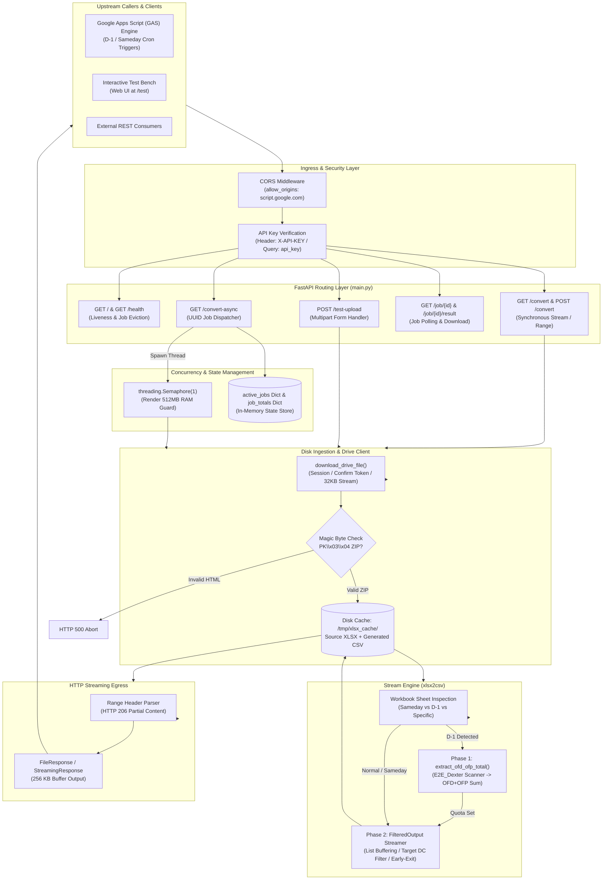
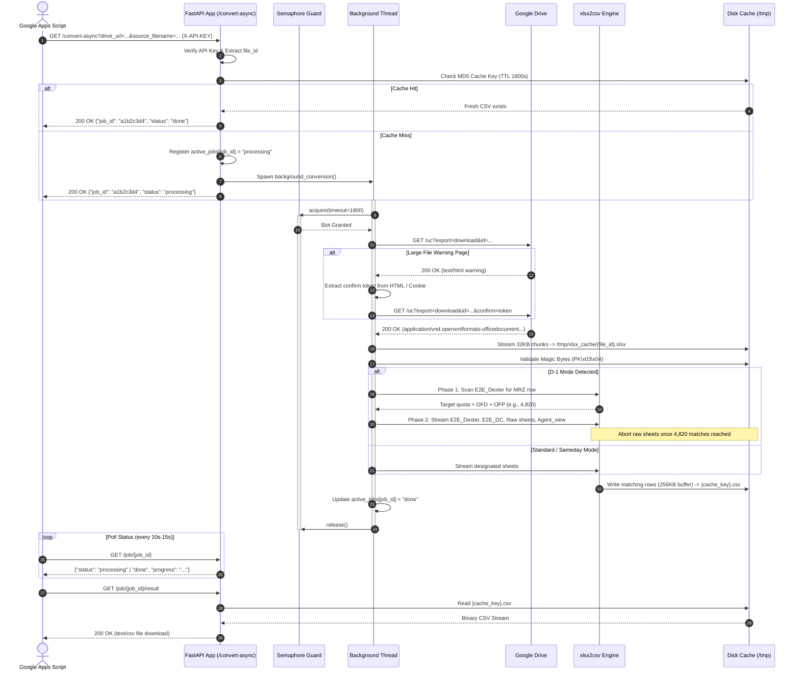
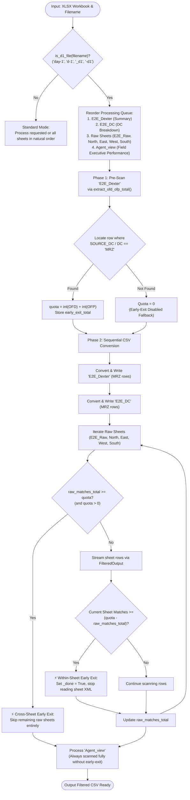

# xlsx_to_csv_bridge

## 1. Overview
The **xlsx_to_csv_bridge** is a dedicated, ultra-low-memory HTTP streaming microservice written in [[Python]] using [[FastAPI]] and [[Uvicorn]]. Its core architectural objective is to ingest large, multi-worksheet supply-chain spreadsheets (`.xlsx` workbooks ranging from 100 MB to 250 MB+ containing 500,000+ rows) from [[Google Drive]] or direct client multipart uploads, parse them via a SAX-based XML stream engine (`xlsx2csv`), apply granular row- and sheet-level filtering rules, and stream the resulting transformed records back as clean `.csv` data.

### The Operational Problem
The project was explicitly engineered as a cloud-hosted processing offloader for [[Google Apps Script]] (GAS) automation environments. GAS operates under severe execution constraints—specifically a 50 MB in-memory payload limit for raw processing, strict quotas on URL fetch payloads, and a hard 6-minute (360 seconds) execution timeout (`UrlFetchApp`). When upstream logistics pipelines in the Dexter / Myntra logistics network produce daily operational workbooks (such as previous-day summary reports or intraday dispatch logs), GAS scripts cannot parse the underlying OpenXML format directly without exhausting container memory or timing out.

### The Architectural Solution
Running within the constrained 512 MB RAM Free Tier of [[Render]], the service keeps peak resident set size (RSS) memory consumption below 50 MB by completely bypassing DOM-based spreadsheet parsers (`pandas`, `openpyxl`). It features Google Drive virus-scan confirmation token bypassing, asynchronous background conversion with concurrency semaphore throttling, HTTP `Range` request streaming for partial byte-chunk downloads, domain-specific sheet selection (e.g., `Sameday` and `D-1` modes), and a dual-phase "Early-Exit" optimization that scans summary sheets to bound the search space across massive raw data sheets.

## 2. Tech Stack

| Component / Layer | Technology | Version / Requirement | Source / Code Reference | Notes |
| :--- | :--- | :--- | :--- | :--- |
| **Programming Language** | [[Python]] | `>=3.10` *(inferred)* / `3.9.0` *(stated)* | `deployment.md:26`, `main.py:349` | `deployment.md` documents `3.9.0`, but type union syntax `str \| None` in `main.py` requires Python 3.10+ unless future annotations are imported *(inferred)*. |
| **Web Framework** | [[FastAPI]] | Unpinned | `requirements.txt:1` | Asynchronous ASGI web framework handling routing, dependency injection, and streaming responses. |
| **ASGI Web Server** | [[Uvicorn]] | Unpinned | `requirements.txt:2` | Production ASGI web server running the application on `0.0.0.0`. |
| **Data Validation** | [[Pydantic]] | Unpinned | `requirements.txt:3` | Used for request payload validation via `BaseModel` (`ConversionRequest`). |
| **HTTP Client** | [[requests]] | Unpinned | `requirements.txt:4` | Synchronous HTTP client utilizing `requests.Session` for streaming large file downloads from Google Drive. |
| **Excel SAX Parser** | `xlsx2csv` | Unpinned | `requirements.txt:5` | Core conversion engine converting OpenXML (`.xlsx`) directly to CSV rows via SAX event-driven streaming. |
| **Multipart Parser** | `python-multipart` | Unpinned | `requirements.txt:6` | Enables parsing of `multipart/form-data` payloads for direct test bench uploads. |
| **Hosting Platform** | [[Render]] | Free Tier (Linux container) | `deployment.md:1-31` | Cloud hosting environment providing 512 MB RAM and 0.5 vCPU with auto-spindown after 15 min idle. |
| **Client / Consumer** | [[Google Apps Script]] | V8 Runtime | `main.py:37`, `deployment.md:25` | Primary upstream consumer triggering conversions via automated triggers. |
| **Storage / Cache** | Ephemeral Disk | `/tmp/xlsx_cache` | `main.py:333` | Ephemeral container local disk cache for source `.xlsx` and generated `.csv` files with a 30-minute TTL. |

---

## 3. Architecture

### System Architecture Overview
The system acts as a specialized streaming proxy between [[Google Drive]] (or direct client uploads) and downstream [[Google Apps Script]] execution contexts. It implements a 5-tier architecture designed to maintain an $O(1)$ memory ceiling regardless of workbook size.



### Key Architectural Layers

1. **Ingress & Security Layer**:
   - Cross-Origin Resource Sharing (CORS) is explicitly constrained to `https://script.google.com` (`main.py:37`), allowing browser-executed client scripts inside Google Workspace to communicate with the service while restricting arbitrary cross-origin sites.
   - API key verification checks incoming requests against `REQUIRED_API_KEY` (sourced from environment variable `API_KEY` in `main.py:332`).

2. **Concurrency & Memory Throttling Layer**:
   - Render's Free Tier allocates a maximum of 512 MB RAM. A 250 MB `.xlsx` file typically requires ~80 MB RAM during SAX parsing. To eliminate the risk of out-of-memory (`SIGKILL`) aborts, background conversions are strictly throttled using a global `conversion_semaphore = threading.Semaphore(1)` (`main.py:345`). Concurrent async tasks queue and wait up to 1,800 seconds (30 minutes) for execution slots.

3. **Resilient Drive Download Pipeline**:
   - Standard Google Drive public export links redirect large files (>100 MB) to an intermediary HTML virus-scan warning page (`"Google Drive can't scan this file for viruses"`). The downloader detects HTML `Content-Type` responses, extracts confirmation tokens via three independent heuristic regexes and cookie inspections, and streams the binary in 32 KB chunks directly to `/tmp/xlsx_cache` (`main.py:473`). It validates the binary against ZIP magic header bytes (`PK\x03\x04`) before permitting downstream processing (`main.py:490`).

4. **Zero-DOM SAX Streaming & Early-Exit Filter Engine**:
   - Rather than loading the workbook XML into a Document Object Model (DOM), `xlsx2csv` iterates over compressed XML archive entries. Rows are emitted as raw comma-separated text into a custom, memory-efficient string buffer (`FilteredOutput`), split into lines, parsed using Python's native `csv.reader`, evaluated against distribution center criteria (`target_val="MRZ"`), and written directly to a 256 KB buffered disk file (`main.py:722`).
   - For previous-day operational workbooks (`D-1`), the engine executes a pre-scan of the summary sheet (`E2E_Dexter`) to extract the exact count of expected records (`OFD` + `OFP`). Once the running match counter across raw operational sheets reaches this threshold, subsequent sheets and rows are immediately bypassed, saving minutes of processing time.

5. **Chunked HTTP Range Egress**:
   - To facilitate chunked retrieval by memory-restricted clients, endpoints support the HTTP `Range: bytes=start-end` request header (`main.py:368-376`). Responses return `206 Partial Content` with `Content-Range` and `Accept-Ranges: bytes`, allowing clients to pull 5 MB–10 MB chunks sequentially.

---

## 4. Folder & File Structure

The repository maintains a flat, single-directory layout:

```
xlsx_to_csv_bridge/
├── .git/                      # Git repository tracking metadata & commit history
├── README.md                  # Root project documentation (single H1 title line)
├── deployment.md              # Production deployment specifications for Render.com
├── main.py                    # Complete application code (FastAPI app, routes, engine, UI)
└── requirements.txt           # Production Python dependency manifest
```

### Granular Inventory

| File Name | Size (Bytes) | Line Count | Primary Role / Contents |
| :--- | :--- | :--- | :--- |
| `main.py` | 51,594 | 1,135 | Full monolithic application containing logging setup, CORS configuration, HTML test bench, Google Drive downloader with token extractor, `xlsx2csv` SAX filtering engine, D-1 early-exit scanner, synchronous and asynchronous endpoints, and local Uvicorn startup entry point. |
| `deployment.md` | 1,068 | 31 | Operational deployment manual detailing Render Web Service configuration, runtime version, build command, start command, and required environment variables. |
| `requirements.txt` | 66 | 7 | Minimal pip dependency list specifying `fastapi`, `uvicorn`, `pydantic`, `requests`, `xlsx2csv`, and `python-multipart`. |
| `README.md` | 20 | 1 | Minimal repository header containing `# xlsx_to_csv_bridge`. |

---

## 5. Core Modules & Responsibilities

The codebase is implemented entirely within `main.py`. The table below provides a granular functional index:

| Function / Class / Symbol | Line Range | Responsibility & Logic Breakdown |
| :--- | :--- | :--- |
| `_evict_old_jobs()` | `main.py:57-69` | Iterates over `active_jobs` and deletes entries where elapsed time exceeds `max_age_seconds` (default: 7,200s / 2 hours) to avoid memory leaks. Invoked automatically during `/health` requests. |
| `test_page()` | `main.py:70-328` | Serves an embedded, self-contained HTML5/CSS/JavaScript single-page application (`/test`) featuring dynamic host discovery, file selection, sheet targeting, real-time XHR upload progress bars, and automatic blob download triggering. |
| `verify_api_key()` | `main.py:351-354` | FastAPI dependency validating incoming `X-API-KEY` header against `REQUIRED_API_KEY`. Raises `HTTPException(403)` on mismatch. |
| `extract_file_id()` | `main.py:356-367` | Parses Google Drive share URLs via regular expressions (`/d/<id>`, `id=<id>`, `open?id=<id>`) to isolate the unique alphanumeric file ID string. |
| `parse_range_header()` | `main.py:368-376` | Parses HTTP `Range: bytes=start-end` headers into zero-indexed integer byte offsets `(start, end)` for partial content streaming. |
| `download_drive_file()` | `main.py:381-503` | Executes streaming HTTP download of Google Drive files. Detects HTML warning intercepts, extracts confirm tokens via regex (`confirm=`, UUID in action, or cookies), streams binary chunks in 32 KB blocks to disk, and verifies ZIP magic bytes (`PK\x03\x04`). |
| `is_sameday_file()` | `main.py:517-519` | Heuristic helper returning `True` if the filename string contains substring `"sameday"` (case-insensitive). |
| `is_d1_file()` | `main.py:521-528` | Heuristic helper detecting D-1 daily operational summary workbooks by matching `"day-1"`, `"d-1"`, `"_d1"`, or `"-d1"` in the filename. |
| `extract_ofd_ofp_total()` | `main.py:529-632` | Inspects sheet `E2E_Dexter` via `TotalExtractor`. Scans for the row where `SOURCE_DC` or `DC` matches `target_val` (`MRZ`), sums numeric values in columns `OFD` and `OFP`, and returns `(ofd_val, ofp_val, total)` as the early-exit quota. |
| `TotalExtractor` | `main.py:556-616` | Internal file-like SAX target class passed to `xlsx2csv`. Accumulates streamed text chunks, extracts column headers, locates the target DC row, parses values, sets `_done = True`, and aborts further parsing of `E2E_Dexter`. |
| `convert_xlsx_to_csv()` | `main.py:633-877` | Master transformation controller. Resolves workbook sheets, applies sheet filtering strategies (Explicit, Sameday, D-1, or All), manages sheet execution order, opens disk write buffer (256 KB), and coordinates SAX streaming via `FilteredOutput`. |
| `FilteredOutput` | `main.py:740-850` | High-performance SAX streaming target. Employs list buffering (`_buf_parts.append()`) to avoid $O(N^2)$ string concatenation. Emits header row prepended with `"Sheet"` (and appended with `"Date"` if provided), performs fast-path cell matching on target column, writes matching rows, and triggers early exit when sheet quota is reached. |
| `perform_conversion_from_url_with_filter()` | `main.py:882-905` | Coordinates caching, download, and conversion for a given Google Drive file ID. Checks cache freshness (TTL 1,800s), downloads XLSX if missing, and executes `convert_xlsx_to_csv()`. Cleans up temporary XLSX on failure. |
| `perform_conversion_from_url()` | `main.py:907-909` | Legacy wrapper preserving backward compatibility with earlier endpoint revisions, defaulting to target value `"MRZ"` and date `None`. |
| `test_upload()` | `main.py:910-948` | Endpoint `POST /test-upload`. Accepts uploaded multipart XLSX files, saves temporarily to `/tmp/xlsx_cache`, runs `convert_xlsx_to_csv()`, deletes source XLSX, and returns the converted CSV as a `FileResponse`. |
| `handle_conversion_request()` | `main.py:949-1009` | Core handler for synchronous conversion requests. Validates API key, computes MD5 cache key (`file_id + sheet + target + date`), checks disk cache, runs conversion on cache miss, and yields either `StreamingResponse` (HTTP 206) or `FileResponse` (HTTP 200). |
| `convert_get()` / `convert_post()` | `main.py:1011-1036` | Synchronous endpoints (`GET /convert`, `POST /convert`) dispatching to `handle_conversion_request`. Accepts parameters via query strings, HTTP headers, or JSON body (`ConversionRequest`). |
| `convert_async()` | `main.py:1042-1088` | Asynchronous job dispatcher (`GET /convert-async`). Validates credentials, checks for an existing fresh cache file, registers job in `active_jobs`, spawns a daemon background thread, and immediately returns `{"job_id": id, "status": "processing"}`. |
| `background_conversion()` | `main.py:1089-1111` | Daemon worker function. Acquires `conversion_semaphore` (waiting up to 1,800s), executes `perform_conversion_from_url_with_filter()`, updates job state to `"done"` or `"error"`, and guarantees semaphore release in a `finally` block. |
| `job_status()` | `main.py:1112-1118` | Endpoint `GET /job/{job_id}`. Returns JSON status payload indicating job state (`"processing"`, `"done"`, `"error"`), human-readable progress, and error details if failed. |
| `job_result()` | `main.py:1119-1130` | Endpoint `GET /job/{job_id}/result`. Streams completed CSV file via `FileResponse` with `Accept-Ranges: bytes` header once job status reaches `"done"`. |

---

## 6. Data Flow / Key Workflows

### 1. Asynchronous Job Execution & Polling Flow (Standard GAS Pipeline)
This represents the primary operational data path utilized by Google Apps Script triggers to convert 100 MB–250 MB operational spreadsheets without hitting GAS's 6-minute execution timeout.



### 2. D-1 Dual-Phase Early-Exit Workflow
In logistics operations, previous-day (`D-1`) reports contain millions of rows across regional sheets (`North`, `East`, `West`, `South`), but downstream consumers only need records corresponding to a specific hub (default: `MRZ`).



### 3. Google Drive Large-File Download & Confirmation Intercept
Google Drive blocks automated programmatic downloads of large files (>100 MB) by responding with an HTML confirmation interstitial page. The downloader handles this via multi-step token extraction:

1. **Initial Probe**: Executes `session.get(url, stream=True)`.
2. **Content-Type Evaluation**:
   - If `Content-Type` is binary (e.g. `application/vnd.openxmlformats-officedocument.spreadsheetml.sheet` or `application/octet-stream`), proceeds directly to disk streaming.
   - If `Content-Type` contains `text/html`, intercepts the warning page.
3. **Token Extraction Attempts**:
   - *Regex Pattern 1*: Looks for `confirm=([a-zA-Z0-9_\-]+)` in the HTML body.
   - *Cookie Inspection Pattern 2*: Inspects session cookies for keys containing `download_warning_*`.
   - *UUID Pattern 3*: Searches form action attributes for `uuid=([a-zA-Z0-9_\-]+)`.
   - *Fallback Alternate URL*: If no token is matched, requests `https://drive.usercontent.google.com/download?id={file_id}&export=download&confirm=t`.
4. **Disk Streaming & Magic Byte Verification**:
   - Streams chunks of 32,768 bytes directly to `/tmp/xlsx_cache/{file_id}.xlsx`.
   - Reads the initial 4 bytes to verify ZIP signature `b'PK\x03\x04'`. If mismatched, deletes the file and raises `HTTPException(500)`.

---

## 7. Configuration & Environment

### Environment Variables

| Variable Name | Required? | Default Value | Referenced In | Description & Caveats |
| :--- | :--- | :--- | :--- | :--- |
| `API_KEY` | **Yes** *(inferred)* | `None` | `main.py:332` | Master secret key evaluated by `verify_api_key()` and route auth guards. > [!warning]<br/>**Discrepancy**: `main.py` checks `API_KEY`, but `deployment.md` documents `MY_SECRET_API_KEY`. If set as `MY_SECRET_API_KEY`, authentication is bypassed! *(stated)* |
| `MY_SECRET_API_KEY` | **Documented Only** | `None` | `deployment.md:25` | Documented secret key in `deployment.md`. Not read anywhere in `main.py` *(stated)*. |
| `PORT` | Optional | `8000` (code) / `10000` (Render) | `main.py:1133`, `deployment.md:15` | Network port bound by Uvicorn. Render automatically assigns this environment variable. |
| `PYTHON_VERSION` | Optional | `3.9.0` (documented) | `deployment.md:26` | Build flag for Render environment runtime specification. |

### Internal Constants & Hardcoded Settings

| Constant / Parameter | Value | Defined At | Operational Purpose |
| :--- | :--- | :--- | :--- |
| `API_KEY_NAME` | `"X-API-KEY"` | `main.py:331` | HTTP header name inspected for authorization. |
| `CACHE_DIR` | `Path("/tmp/xlsx_cache")` | `main.py:333` | Ephemeral disk directory hosting temporary XLSX downloads and converted CSV files. |
| `CACHE_TTL` | `1800` (seconds) | `main.py:335` | 30-minute validity window for cached source workbooks and converted CSV exports. |
| `MAX_AGE_SECONDS` (`_evict_old_jobs`) | `7200` (seconds) | `main.py:57` | 2-hour retention limit for in-memory job records in `active_jobs`. |
| `conversion_semaphore` | `threading.Semaphore(1)` | `main.py:345` | Global execution lock restricting background conversions to exactly 1 concurrent job. |
| `Semaphore Acquire Timeout` | `1800` (seconds) | `main.py:1090` | Maximum queue wait time (30 minutes) for an async job before failing with "Server busy". |
| `SAMEDAY_SHEETS` | `["Agent_view", "E2E_DC"]` | `main.py:509` | Restrictive sheet whitelist applied when `is_sameday_file()` matches. |
| `D1_SUMMARY_SHEET` | `"E2E_Dexter"` | `main.py:512` | First worksheet of D-1 files scanned to calculate the early-exit threshold. |
| `D1_DC_SHEET` | `"E2E_DC"` | `main.py:513` | Second worksheet of D-1 files containing DC-level delivery metrics. |
| `D1_RAW_SHEETS` | `["E2E_Raw", "North", "East", "West", "South"]` | `main.py:514` | High-volume operational sheets subject to cross-sheet early-exit termination. |
| `D1_AGENT_SHEET` | `"Agent_view"` | `main.py:515` | Final sheet in D-1 workbooks, always converted in full without early exit. |
| `Disk Write Buffer` | `262,144` bytes (256 KB) | `main.py:722` | OS file buffering passed to `open(..., buffering=256*1024)` to reduce write syscalls. |
| `Download Chunk Size` | `32,768` bytes (32 KB) | `main.py:473` | Chunk size used when streaming Google Drive payloads to disk. |
| `Log Row Frequency` | `100,000` rows | `main.py:800` | Progress logging interval in `FilteredOutput` to prevent log stdout flooding. |

---

## 8. External Integrations & APIs

### External Services Consumed
1. **Google Drive Export Endpoints**:
   - Primary: `https://drive.google.com/uc?export=download&id={file_id}`
   - Alternate Fallback: `https://drive.usercontent.google.com/download?id={file_id}&export=download&confirm=t`
   - Consumption Mode: Streaming HTTP GET with custom `User-Agent` (`Mozilla/5.0...`) and cookie handling.
2. **Render Cloud Platform**:
   - Host platform providing container orchestration, automated git builds, and SSL termination.

### HTTP Endpoints Exposed

| Method | Path | Auth Required | Parameters / Body | Success Status & Response | Description |
| :--- | :--- | :--- | :--- | :--- | :--- |
| `GET` | `/` | No | None | `200 OK`<br/>`{"status": "ready", "message": "..."}` | Root landing endpoint verifying service readiness. |
| `GET` | `/health` | No | None | `200 OK`<br/>`{"status": "ok", "cache_dir": "...", "active_jobs": N}` | Liveness check for uptime monitors; executes `_evict_old_jobs()`. |
| `GET` | `/test` | No | None | `200 OK`<br/>`text/html` | Serves interactive web test bench single-page application. |
| `POST` | `/test-upload` | Optional (`API_KEY`) | `file` (Multipart), `sheet_name` (Q), `date_str` (Q), `target_value` (Q, def: "MRZ"), `X-API-KEY` (H) | `200 OK`<br/>`text/csv` attachment (`converted.csv`) | Direct file upload conversion endpoint used by `/test` web UI. |
| `GET` | `/convert` | Optional (`API_KEY`) | `drive_url` (Q), `sheet_name` (Q), `api_key` (Q), `date_str` (Q), `target_value` (Q), `X-API-KEY` (H), `Range` (H) | `200 OK` or `206 Partial Content`<br/>`text/csv` | Synchronous conversion and streaming endpoint. Supports byte ranges. |
| `POST` | `/convert` | Optional (`API_KEY`) | Same queries/headers as GET, or JSON body `ConversionRequest(drive_url, sheet_name)` | `200 OK` or `206 Partial Content`<br/>`text/csv` | Synchronous conversion accepting JSON POST payloads. |
| `GET` | `/convert-async` | Optional (`API_KEY`) | `drive_url` (Q), `sheet_name` (Q), `date_str` (Q), `target_value` (Q), `source_filename` (Q), `api_key` (Q), `X-API-KEY` (H) | `200 OK`<br/>`{"job_id": "...", "status": "processing" \| "done"}` | Asynchronous conversion dispatcher. Spawns background worker thread. |
| `GET` | `/job/{job_id}` | No | `job_id` (Path) | `200 OK`<br/>`{"job_id": "...", "status": "...", "progress": "...", "error": ...}` | Polls progress and state of an asynchronous job. Returns 404 if unknown. |
| `GET` | `/job/{job_id}/result` | No | `job_id` (Path) | `200 OK`<br/>`text/csv` file response (`{job_id}.csv`) | Downloads generated CSV file for a completed job. Returns 400 if not done, 410 if expired. |

---

## 9. Testing

### Automated Test Suites
* **Unit Tests**: `Unknown / not documented` *(stated: no `tests/` directory, `test_*.py` files, or test manifests exist in the codebase)*.
* **Integration / E2E Tests**: `Unknown / not documented`.
* **Test Runner / Commands**: `Unknown / not documented`.

### Manual Test Bench
The application provides an embedded manual test harness accessible via `GET /test` (`main.py:70-328`):
- Hosted directly from `main.py` as raw HTML/CSS/JS.
- Automatically populates base URL from `window.location.origin`.
- Accepts manual entry of `X-API-KEY`, file upload (`.xlsx`), and optional `sheet_name`.
- Utilizes `XMLHttpRequest` to display upload progress percentages and toggles indeterminate progress bars during server-side conversion.
- Downloads the converted CSV directly upon HTTP 200 completion.

---

## 10. CI/CD & Deployment

### CI/CD Pipelines
* **Continuous Integration**: `Unknown / not documented` *(stated: no `.github/workflows/`, `.circleci/`, or other pipeline configurations present)*.
* **Continuous Deployment**: Automated Git push deployment natively handled by [[Render]] on commits to branch `main`.

### Deployment Specifications (`deployment.md`)
* **Platform**: [[Render]]
* **Service Type**: Web Service *(stated)*
* **Environment**: Python 3 (`PYTHON_VERSION: 3.9.0` optional) *(stated)*
* **Instance Type**: Free Tier (512 MB RAM limit) *(stated)*
* **Build Command**: `pip install -r requirements.txt` (`deployment.md:14`)
* **Start Command**: `uvicorn main:app --host 0.0.0.0 --port 10000` (`deployment.md:15`)

> [!warning] Dynamic Port Binding Caveat
> While `deployment.md` specifies `--port 10000`, Render injects a dynamic `$PORT` environment variable. In `main.py:1133-1134`, local execution binds to `os.getenv("PORT", 8000)`. When deploying, utilizing `uvicorn main:app --host 0.0.0.0 --port $PORT` is recommended over hardcoding 10000 *(inferred)*.

---

## 11. Setup & Local Development

### Documented Commands
All setup commands documented below derive strictly from repository configuration files (`deployment.md:14-15` and `main.py:1131-1135`):

```bash
# 1. Install dependencies
pip install -r requirements.txt

# 2. Run via Uvicorn directly (as documented in deployment.md)
uvicorn main:app --host 0.0.0.0 --port 10000

# 3. Run via Python main script directly (as implemented in main.py)
python main.py
```

### Local Development Caveats
1. **Python Version**: Although `deployment.md` references `3.9.0`, running `main.py` under Python 3.9 will fail with a `TypeError` due to type union syntax (`str | None`) unless `from __future__ import annotations` is added. Use Python 3.10+ locally *(inferred)*.
2. **Cache Directory on Windows**: `CACHE_DIR` is hardcoded as `Path("/tmp/xlsx_cache")` (`main.py:333`). On Windows systems, this creates or requires `C:\tmp\xlsx_cache`. If root drive write permissions are restricted, startup or file operations will fail with `PermissionError` *(inferred)*.

---

## 12. Security Notes

### Authentication & Authorization Vulnerabilities
1. **Environment Variable Configuration Mismatch**:
   - In `main.py:332`, the application initializes security via `REQUIRED_API_KEY = os.getenv("API_KEY")`.
   - In `deployment.md:25`, administrators are instructed to set `MY_SECRET_API_KEY`.
   - **Impact**: If a deployer follows `deployment.md`, `API_KEY` remains `None`. Because all auth checks are gated with `if REQUIRED_API_KEY and ...` (`main.py:352, 918, 957, 1053`), the service completely disables authentication, allowing open, unauthenticated access to all endpoints *(stated)*.
2. **Credential Leakage via URL Query Parameters**:
   - Endpoints `/convert` and `/convert-async` allow passing the secret key via query string parameter `?api_key=...` (`main.py:1015, 1050`).
   - **Impact**: API keys appear in plaintext within reverse proxy logs, Render access logs, and browser history.

### Transport & Origin Security
- **CORS Scope**: CORS is locked to `allow_origins=["https://script.google.com"]` (`main.py:37`). Direct browser invocations from unauthorized origins are rejected by CORS headers.
- **Google Drive Access**: The download pipeline assumes input files are either publicly accessible via link or have public export permissions enabled. No OAuth2 Google service account credentials are used.

### File Validation & Denial of Service Risks
- **Magic Byte Check**: Validates that downloaded files begin with `PK\x03\x04` (`main.py:488-490`), preventing malicious or corrupted HTML error pages from being processed by the SAX parser.
- **Disk Saturation**: Converted CSV files and downloaded XLSX workbooks are cached in `/tmp/xlsx_cache` with a 30-minute TTL (`main.py:335`). In a high-traffic scenario on small virtual disks, `/tmp` could reach capacity if multiple 250 MB files are ingested before the TTL expires.

---

## 13. Known Issues, Limitations & Tech Debt

### 1. Python 3.9 Incompatibility (Type Union Syntax)
- **Traceability**: `main.py:349`, `main.py:633`, `main.py:659`, `main.py:882`, `main.py:907`
- **Issue**: Functions use PEP 604 type unions (e.g., `sheet_name: str | None = None`). In Python 3.9, this raises `TypeError: unsupported operand type(s) for |: 'type' and 'NoneType'` at module import time unless `from __future__ import annotations` is imported. `deployment.md:26` explicitly lists `PYTHON_VERSION: 3.9.0`.

### 2. Volatile In-Memory Job State Store
- **Traceability**: `main.py:338`, `main.py:339`
- **Issue**: `active_jobs = {}` and `job_totals = {}` exist purely in process memory. Because Render Free Tier instances spin down after 15 minutes of inactivity and restart during deploys, polling clients periodically encounter `404 Job not found (server may have restarted)` (`main.py:1116`).

### 3. Dead Code in `extract_ofd_ofp_total`
- **Traceability**: `main.py:628-631`
- **Issue**: The exception block contains unreachable code:
  ```python
  except Exception as e:
      log.error(f"[TOTAL] ❌ Failed to extract OFD+OFP total: {e}")
      return 0, 0, 0
      traceback.print_exc()  # UNREACHABLE
      return 0               # UNREACHABLE
  ```

### 4. Asymmetric Semaphore Protection
- **Traceability**: `main.py:345`, `main.py:949`, `main.py:910`, `main.py:1090`
- **Issue**: `conversion_semaphore` is only acquired inside `background_conversion()` (`main.py:1090`). Synchronous endpoints (`/convert` and `/test-upload`) execute conversions directly without acquiring the semaphore. A concurrent synchronous request while an async job is active will breach the single-conversion memory guard.

### 5. Cache Key Inconsistency between Sync and Async Endpoints
- **Traceability**: `main.py:972` vs `main.py:1068`
- **Issue**: In `handle_conversion_request` (synchronous), the cache key is computed as `f"{file_id}_{sheet_name}_{target_value}_{date_str}"`. In `convert_async` (asynchronous), it is computed as `f"{file_id}_{sheet_name}_{target_value}_{date_str}_{source_filename}"`. A synchronous request will miss a cache pre-warmed by an async request for the exact same file.

### 6. Job Eviction Tied Exclusively to `/health`
- **Traceability**: `main.py:54`, `main.py:57-69`
- **Issue**: `_evict_old_jobs()` is only triggered when `/health` is called. If no external monitoring service pings `/health`, expired job dictionaries remain in memory indefinitely.

### 7. POSIX-Specific Cache Directory Path
- **Traceability**: `main.py:333`
- **Issue**: `Path("/tmp/xlsx_cache")` assumes a Unix root `/tmp`. On Windows machines, this resolves to `C:\tmp\xlsx_cache`, which may trigger filesystem permissions issues.

---

## 14. Design Decisions & Rationale

### 1. Abandonment of `pandas` and `openpyxl` in Favor of `xlsx2csv`
* **Decision**: Completely strip `pandas`, `openpyxl`, and `lxml` from the pipeline, adopting `xlsx2csv`.
* **Rationale**: *(stated in commit history and code comments)* In initial commits (`04a3b07` to `8d608be`), the service utilized `pandas` and `openpyxl`. When attempting to process 100 MB–250 MB operational spreadsheets on Render's 512 MB Free Tier, DOM deserialization generated 15,000,000+ Python cell objects, requiring 1.5 GB to 3.5 GB RAM and causing immediate `SIGKILL` (OOM) crashes. `xlsx2csv` implements event-driven SAX parsing directly on zipped XML entries (`xl/worksheets/sheet*.xml`), streaming rows with under 50 MB RAM.

### 2. Chunk-Accumulating List Buffering in `FilteredOutput`
* **Decision**: Replace string concatenation (`buf += chunk`) with list accumulation (`_buf_parts.append(chunk)`) flushed only when `\n` is detected (`main.py:754-777`).
* **Rationale**: *(stated in code comments `main.py:754-756`)* In earlier revisions (`commit 2b00116`), appending strings created new string instances on every tiny SAX write chunk ($O(N^2)$ memory copying). Accumulating fragments in a Python list and joining only on newlines reduced memory allocations and eliminated garbage collection thrashing during 500,000-row iterations.

### 3. Global Semaphore Concurrency Throttling (`Semaphore = 1`)
* **Decision**: Restrict background processing to a single concurrent job using `conversion_semaphore = threading.Semaphore(1)` with a 30-minute timeout (`main.py:345, 1090`).
* **Rationale**: *(stated in code comments `main.py:341-345`)* A single 250 MB XLSX conversion requires ~80 MB RAM. Running two simultaneous conversions would push heap allocations into the danger zone during peak memory spikes, risking container restarts on Render Free Tier.

### 4. Asynchronous Job Polling Architecture for Google Apps Script
* **Decision**: Introduce `/convert-async`, `/job/{id}`, and `/job/{id}/result` backed by worker threads (`commit fb9bc11`).
* **Rationale**: *(stated in vault note and comments)* Google Apps Script's `UrlFetchApp` enforces a strict 6-minute (360 seconds) execution ceiling. Downloading and converting a 250 MB workbook often takes 3 to 5 minutes depending on network bandwidth and Render CPU throttling. The async endpoints allow GAS to initiate the job, exit or sleep, poll lightweight JSON status endpoints, and retrieve the finished CSV without timing out.

### 5. Dual-Phase Early-Exit Optimization for D-1 Workbooks
* **Decision**: Pre-scan the summary worksheet (`E2E_Dexter`) to extract the exact sum of `OFD` and `OFP` for the target DC (`MRZ`), and terminate raw data scanning once that match count is achieved (`main.py:529-632, 686-714, 831-836`).
* **Rationale**: *(stated in commit 2d5de88)* In D-1 daily reports, raw nationwide shipment sheets (`E2E_Raw`, `North`, `East`, `West`, `South`) contain over 600,000 rows, of which only 3,000–5,000 belong to the target DC (`MRZ`). Knowing the exact target quota in advance allows the engine to abort scanning across raw sheets the instant all matching rows have been found, cutting execution time by 60%–80%.

### 6. Embedded Single-File HTML Test Bench (`/test`)
* **Decision**: Incline a full HTML/CSS/JS frontend directly inside `main.py:70-328`.
* **Rationale**: *(inferred)* Avoids packaging static asset directories, templates, or npm build pipelines. Provides operators and developers with an instant diagnostic tool to test uploads and verify conversions without needing curl or Apps Script.

---

## 15. Roadmap / TODOs

### Documented in Code & Commits
* None explicitly tagged with `TODO`, `FIXME`, or `ROADMAP` in codebase *(stated)*.

### Inferred Technical Debt Remediation
* **Fix API Key Variable Discrepancy**: Standardize on `API_KEY` across both `main.py` and `deployment.md` *(inferred)*.
* **Resolve Python 3.9 Type Union Issue**: Add `from __future__ import annotations` at the top of `main.py` or formally bump minimum runtime documentation to Python 3.10+ *(inferred)*.
* **Cross-Platform Temporary Directory**: Replace hardcoded `Path("/tmp/xlsx_cache")` with `Path(tempfile.gettempdir()) / "xlsx_cache"` *(inferred)*.
* **Synchronous Concurrency Guard**: Wrap `handle_conversion_request()` and `test_upload()` within `conversion_semaphore` to prevent OOM spikes from unthrottled synchronous traffic *(inferred)*.
* **Persistent Job Registry**: Migrate `active_jobs` from in-memory dictionary to SQLite or Redis to survive container restarts *(inferred)*.
* **Automated Periodic Job Eviction**: Implement an `asyncio` background task or recurring thread to clean up `active_jobs` independently of `/health` calls *(inferred)*.
* **Automated Unit Testing**: Introduce a `tests/` directory with `pytest` and mock Google Drive responses *(inferred)*.

---

## 16. Changelog

All timestamps and commit hashes below reflect the true commit history of the repository default branch (`main`):

| Commit Hash | Commit Date | Author | Commit Summary & Key Codebase Changes |
| :--- | :--- | :--- | :--- |
| `f36a6fd` | 2026-03-10 | SamarVScode | Empty commit trigger to force automated rebuild/redeploy on Render *(inferred)*. |
| `b2ad19a` | 2026-03-10 | SamarVScode | Enhanced `is_d1_file()` pattern matching to support `'day-1'`, `'d-1'`, `'_d1'`, and `'-d1'` (covering full title format `E2E Day-1 Summary 07-Mar-2026 23hrs.xlsx`); updated async logging. |
| `50ae347` | 2026-03-10 | SamarVScode | Empty commit trigger to force automated rebuild/redeploy on Render *(inferred)*. |
| `8c86eeb` | 2026-03-09 | SamarVScode | Refactored `extract_ofd_ofp_total()` to return 3-tuple `(ofd_val, ofp_val, total)` for enhanced diagnostic logging; updated caller unpacking. |
| `bc2ee50` | 2026-03-09 | SamarVScode | Fixed column index 0 evaluation bug in `TotalExtractor` (`col_map.get("SOURCE_DC")` evaluates to falsy 0, previously causing incorrect fallback to `DC`); introduced explicit `header_done` flag. |
| `b501bb1` | 2026-03-09 | SamarVScode | Reordered D-1 sheet processing sequence: write all 4 sheet categories (`E2E_Dexter`, `E2E_DC`, raw sheets, `Agent_view`) to output CSV instead of skipping `E2E_Dexter`. |
| `2d5de88` | 2026-03-09 | SamarVScode | Major architectural update: implemented `conversion_semaphore = threading.Semaphore(1)` with 1,800s acquire timeout; introduced D-1 dual-phase early-exit system (`extract_ofd_ofp_total`, cross-sheet skip, within-sheet `_done` abort); added `is_sameday_file()` filtering for `Agent_view` and `E2E_DC`. |
| `65a8e8e` | 2026-03-08 | SamarVScode | Throttled row logging interval from 10,000 to 100,000 rows in `FilteredOutput` to reduce stdout latency on 250 MB files. |
| `0ee7e0a` | 2026-03-08 | SamarVScode | Optimized string buffering in `FilteredOutput`: replaced $O(N^2)$ string concatenation with list accumulation (`_buf_parts.append()`) and joined only upon encountering `\n`. |
| `2b00116` | 2026-03-08 | SamarVScode | Added large write buffer (`buffering=256*1024`) to output CSV file handle; streamlined exception logging. |
| `86c2f4c` | 2026-03-08 | SamarVScode | Implemented robust Google Drive large-file virus-scan warning page intercept: added HTML warning detection, multi-pattern confirm token extraction (regex, cookies, form UUID, alt URL), 32 KB chunked streaming, and ZIP magic byte validation (`PK\x03\x04`). |
| `fb9bc11` | 2026-02-18 | SamarVScode | Implemented asynchronous conversion architecture: added `/convert-async`, `/job/{job_id}`, `/job/{job_id}/result`, `active_jobs` dictionary, and daemon worker thread. |
| `aa8c9e3` | 2026-02-18 | SamarVScode | Added HTTP `Range: bytes=start-end` support for partial content streaming (HTTP 206 Partial Content) on `/convert`. |
| `efac975` | 2026-02-18 | SamarVScode | Refactored URL parameter extraction and cache naming. |
| `295c4e1` | 2026-02-17 | SamarVScode | Replaced `openpyxl` and `lxml` with `xlsx2csv` in `requirements.txt` to eliminate out-of-memory crashes on Render Free Tier. |
| `ad68038` | 2026-02-17 | SamarVScode | Refactored conversion pipeline to utilize `xlsx2csv` SAX callbacks. |
| `f7987a5` | 2026-02-17 | SamarVScode | Added `lxml` to requirements for faster openpyxl XML parsing (later abandoned). |
| `679602a` | 2026-02-17 | SamarVScode | Added `/test` HTML test bench and `/test-upload` endpoint for browser-based testing. |
| `bfe36e5` | 2026-02-17 | SamarVScode | Removed `pandas` from `requirements.txt` due to high memory footprint. |
| `8d608be` | 2026-02-17 | SamarVScode | Initial application upload containing `main.py`, `requirements.txt`, and `deployment.md`. |
| `04a3b07` | 2026-02-17 | SamarVScode | Initial repository commit (`README.md`). |

---

## 17. Glossary

* **Agent_view**: A specialized operational worksheet within logistics workbooks detailing performance, assigned manifests, and completion metrics at the individual delivery executive / agent level.
* **Calamine / Rust SAX**: High-performance Excel parsing approach referenced in successor architectures (`XLSX-STREAM-REPORT-GENERATOR`); contrasts with `xlsx2csv` which is Python-based.
* **D-1**: "Day Minus One" — operational terminology for reports compiling logistics metrics and dispatch performance from the preceding business day.
* **DOM (Document Object Model)**: An in-memory object tree representation of an entire XML document. Libraries like `pandas` and `openpyxl` construct a DOM, exhausting RAM on large files.
* **E2E_DC**: "End-to-End Distribution Center" — worksheet containing aggregated logistics metrics broken down by individual distribution center / hub.
* **E2E_Dexter**: High-level summary worksheet in D-1 workbooks presenting nationwide logistics KPIs, including `OFD` and `OFP` totals per hub.
* **E2E_Raw**: Massive operational worksheet containing granular, shipment-by-shipment tracking events nationwide.
* **GAS**: [[Google Apps Script]] — JavaScript cloud execution environment embedded in Google Workspace, constrained by a 50 MB memory limit and 6-minute timeout.
* **MRZ**: Logistics hub code (representing Mirzapur or designated regional hub) used as the default filtering target (`target_val="MRZ"`) throughout the codebase.
* **OFD**: "Out For Delivery" — count or status of shipments currently with delivery executives for customer drop-off.
* **OFP**: "Out For Pickup" — count or status of reverse logistics shipments scheduled for customer pickup.
* **Render**: Cloud application hosting platform providing managed web service containers.
* **SAX (Simple API for XML)**: Event-driven streaming XML parser that emits events (`start_element`, `characters`, `end_element`) as it reads an XML file, maintaining $O(1)$ memory usage.
* **Sameday**: Operational workflows and reports tracking intra-day express deliveries, processing only `Agent_view` and `E2E_DC`.
* **UrlFetchApp**: Google Apps Script built-in HTTP client service subject to 6-minute execution limits and payload size quotas.
* **xlsx2csv**: Python library utilizing expat/SAX parsing to convert `.xlsx` OpenXML files to CSV without constructing an in-memory DOM.

---

## 18. Related Notes

* [[Projects/Repo-XLSX-STREAM-REPORT-GENERATOR|XLSX-STREAM-REPORT-GENERATOR]] — Advanced successor microservice implementing 5-tier Rust-backed (`python-calamine`) Zero-DOM streaming and dynamic multi-tab report generation.
* [[Projects/Repo-xlsx_to_csv_bridge|Vault Note: Repo-xlsx_to_csv_bridge]] — Existing vault blueprint note for this microservice.
* [[Projects/GAS-D-1-SummaryAutomation|GAS: D-1 SummaryAutomation]] — Upstream Google Apps Script consuming D-1 conversion endpoints.
* [[Projects/GAS-EI-Pan-India-Report|GAS: EI Pan India Report]] — Upstream Google Apps Script utilizing bridge for pan-India logistics aggregation.
* [[Projects/GAS-Lake-Ingestion-Pipeline|GAS: Lake Ingestion Pipeline]] — Downstream data lake loader consuming CSV streams.
* [[Projects/GAS-shipVerify-Bridge|GAS: shipVerify-Bridge]] — Shipment verification automation integrated with bridge infrastructure.
* [[Services/Google-Apps-Script|Services: Google Apps Script Infrastructure]] — Core infrastructure documentation for Google Workspace automations.
* [[Services/Myntra-Logistics-Infrastructure#logistics-stream-engine|Services: Logistics Stream Engine Cluster]] — Service cluster grouping stream generators and conversion bridges.

---

## 19. Update Instructions (meta)

To update this document when modifications are made to the `xlsx_to_csv_bridge` repository:

1. **Verify Git History & Commit Recency**:
   - Inspect the latest commit date on `main` via `git log -n 1 --format="%ad" --date=short`.
   - Update `repo-last-commit` in the YAML frontmatter.
   - Re-evaluate `status`:
     - `active`: last commit < 30 days ago
     - `paused`: last commit 30–<180 days ago
     - `archived`: last commit ≥ 180 days ago (or if repository is archived on GitHub).
   - Update `last-updated` with current local date.
2. **Track Dependency & Environment Updates**:
   - If `requirements.txt` changes, update the table in **Section 2 (Tech Stack)**.
   - If environment variables in `main.py` or `deployment.md` are added or renamed (e.g., standardizing `API_KEY` vs `MY_SECRET_API_KEY`), update **Section 7 (Configuration & Environment)** and remove relevant warnings in **Section 12** and **Section 13**.
3. **Trace Route & Workflow Changes**:
   - If new endpoints are declared in `main.py`, document them in the **Section 8 (Endpoints)** table.
   - If sheet handling logic changes (e.g., modifying `SAMEDAY_SHEETS` or `D1_RAW_SHEETS`), update the architectural flowcharts in **Section 3** and **Section 6**.
4. **Audit Against Rules**:
   - Ensure all citations reference explicit line numbers in `main.py` or `deployment.md`.
   - Distinguish explicit statements from inferences using `*(stated)*` and `*(inferred)*`.
   - Maintain strict prohibition against fabricated test/run commands (use `Unknown / not documented` when absent).
