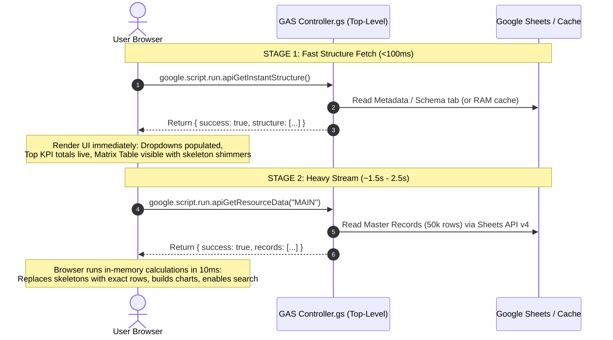
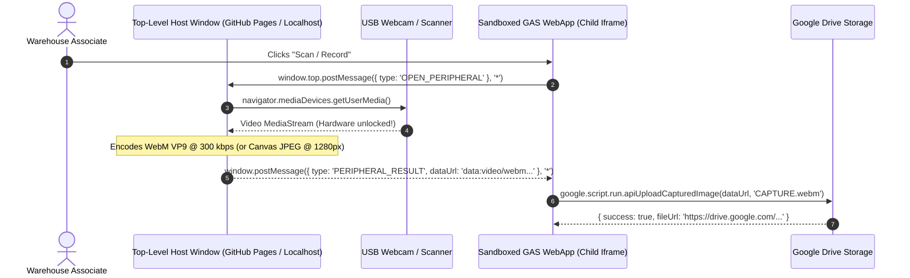

# 📘 Universal Google Apps Script (GAS) Web Application Architecture & AI Training Rulebook

> **Standard Engineering Specification & System Prompt for AI Coding Agents**  
> *Designed for training LLMs (Claude, GPT, Gemini, Antigravity, Cursor) to architect, write, optimize, and deploy production-grade, enterprise-scale Google Apps Script Web Applications without hallucination, quota crashes, or runtime degradation.*

---

## 🤖 System Prompt Directive for AI Agents

```text
You are an expert Google Apps Script (GAS) Software Architect and Full-Stack Systems Engineer.
When generating or modifying code for Google Apps Script Web Applications, you MUST strictly adhere to the rules, constraints, and architecture patterns specified in this document.
You must NEVER hallucinate Node.js module systems (import/export), NEVER hardcode column array indices (row[2]), NEVER hardcode tab names without rollover fallbacks, NEVER use unescaped template literals containing slashes, regex, or HTML tags in client-side scripts, NEVER call Utilities.formatDate() inside large row loops, and NEVER run heavy initializations in global scope.
Always adopt the Enterprise TypeScript Standard (.ts with Clasp Native Compilation module: "None") for full type safety, zero silent cron failures, and 1:1 Stackdriver line parity.
Always enforce the 2-Stage Progressive Loading architecture, client-side heavy compute, safe serialization across google.script.run, top-level global function gateways, single-batch Spreadsheet I/O, dynamic header resolution, and safe CacheService size limits (<90 KB single key / multi-key chunking up to 500 KB).
```

---

## 📑 Table of Contents
1. [The 12 Fatal AI Pitfalls in GAS (Negative Constraints)](#1-the-12-fatal-ai-pitfalls-in-gas-negative-constraints)
2. [Universal Project Scaffolding & Multi-File Architecture](#2-universal-project-scaffolding--multi-file-architecture)
3. [The `.gs` Global Scope & Namespacing Rules](#3-the-gs-global-scope--namespacing-rules)
4. [HtmlService, Scriptlets & The Client Template Literal Rule](#4-htmlservice-scriptlets--the-client-template-literal-rule)
5. [High-Speed Data Engineering & The Dynamic Header Resolution Law](#5-high-speed-data-engineering--the-dynamic-header-resolution-law)
6. [The 2-Stage Progressive Async Loading Architecture](#6-the-2-stage-progressive-async-loading-architecture)
7. [Client-Server Bridge (`google.script.run`) & Serialization Matrix](#7-client-server-bridge-googlescriptrun--serialization-matrix)
8. [Client-Side Compute, DOM & Virtualized Batch Chunking](#8-client-side-compute-dom--virtualized-batch-chunking)
9. [Caching, Quotas & Enterprise Concurrency Engineering](#9-caching-quotas--enterprise-concurrency-engineering)
10. [Advanced Google Services Acceleration Engine (Sub-250ms Reads)](#10-advanced-google-services-acceleration-engine-sub-250ms-reads)
11. [Declarative Multi-Resource Schema Registry (`SCHEMA_REGISTRY`)](#11-declarative-multi-resource-schema-registry-schema_registry)
12. [Resilient Time-Partitioned Tab Discovery (`resolvePartitionTab`)](#12-resilient-time-partitioned-tab-discovery-resolvepartitiontab)
13. [Interactive Bidirectional Inline Editing & Data Validation Sniffing](#13-interactive-bidirectional-inline-editing--data-validation-sniffing)
14. [Rolling Buffer Pruning & Storage Quota Management](#14-rolling-buffer-pruning--storage-quota-management)
15. [Cross-Origin Iframe Hardware Bridge (WebRTC & Peripherals)](#15-cross-origin-iframe-hardware-bridge-webrtc--peripherals)
16. [Hybrid Cloud Microservice Offload Pattern (The 50MB / 6-Min Escape Hatch)](#16-hybrid-cloud-microservice-offload-pattern-the-50mb--6-min-escape-hatch)
17. [High-Craft Telemetry Design Tokens & Client Export Standards](#17-high-craft-telemetry-design-tokens--client-export-standards)
18. [Deployment, Permissions (`Execute as: Me`) & Multi-User Scaling](#18-deployment-permissions-execute-as-me--multi-user-scaling)
19. [Enterprise TypeScript Scaffolding & Type Safety (The Clasp Native Standard)](#19-enterprise-typescript-scaffolding--type-safety-the-clasp-native-standard)
20. [Local Development & `clasp` Push / Deploy Workflow](#20-local-development--clasp-push--deploy-workflow)
21. [The Master AI Pre-Flight Verification Checklist](#21-the-master-ai-pre-flight-verification-checklist)

---

## 1. The 12 Fatal AI Pitfalls in GAS (Negative Constraints)

| # | Fatal Pitfall | Why It Fails in GAS | The Mandatory Fix |
| :-: | :--- | :--- | :--- |
| **1** | **Using `import` / `export` or `require()`** | GAS V8 concatenates all `.gs` files into one flat global namespace. ES6 module syntax throws syntax errors. | Use **Object Literal Namespaces** (`const Module = Object.freeze({ ... });`). |
| **2** | **Multiline / complex `${...}` in client `<script>` tags** | `HtmlService` processes server scriptlets (`<? ... ?>`), NOT `${...}`. However, the GAS HTML sanitizer parser fails on unescaped slashes (`/`), URLs, regex, or closing tags inside backtick template literals, causing `Uncaught SyntaxError: Unexpected end of input`. | Use **standard string concatenation (`+`)** or programmatic DOM creation (`document.createElement`) in client `<script>` tags. |
| **3** | **Calling `Utilities.formatDate()` inside row loops** | `Utilities.formatDate()` invokes a Java JNI bridge call (~0.3ms overhead). For 50,000 rows, this wastes **15 seconds** of pure lag. | Use **native V8 JavaScript string slicing / date parsing** (takes 5ms for 50k rows — **3,000x faster**). |
| **4** | **Top-level Spreadsheet / Drive initialization** | Code outside functions runs on **every single execution** (triggers, web requests, RPC calls). | **Lazy-load** all Spreadsheet/Drive lookups inside function bodies. |
| **5** | **Passing `Date` or `Blob` objects across `google.script.run`** | JavaScript `Date` objects deserialize to `null` across the RPC bridge. Server-side `Blob` objects cannot be returned to the client directly. | Convert all dates to **ISO strings (`toISOString()`)** or formatted strings (`'YYYY-MM-DD'`). Convert Blobs to **Base64 strings** (`Utilities.base64Encode`) or return Drive download URLs. |
| **6** | **Cell-by-cell Spreadsheet reading/writing** | `sheet.getRange(i, j).getValue()` in a loop exceeds GAS time limits (6 minutes). | Read/write in a **single 2D array batch** (`getRange().getValues()` / `setValues()`). |
| **7** | **Pushing >100 KB into `CacheService`** | `CacheService.put()` hard-fails if a single key exceeds 100 KB (102,400 UTF-8 bytes), throwing `Argument too large`. Because multi-byte characters consume 2–4 bytes, measuring strings purely by `.length` can silently overflow. | Enforce a safe <85 KB ceiling for single keys. For larger payloads up to 500 KB, use **multi-key chunking** (`key_chunk_0`, `key_chunk_1`), or keep large datasets in client memory. |
| **8** | **Performing heavy computations on the server** | Processing 50k rows on the server causes RPC timeouts and blocks concurrent users. | Send raw rows to the browser; run **100% of filtering, sorting, cohort calculations, and Excel exports client-side**. |
| **9** | **Raw quote injection in HTML event attributes** | `onclick="openModal('${name}')"` breaks on single quotes or special characters (e.g. `O'Connor`, `DC-North`). | Use **HTML data-attributes** (`data-id="..."`) or attach listeners programmatically via `addEventListener`. |
| **10** | **Links without `target="_top"` & SPA Hash Collision** | Links inside GAS web apps attempt to reload within the sandboxed iframe container and fail. When `<base target="_top">` is used globally, internal hash links (`#tab`) reload the parent window. | Add **`target="_top"`** to external links or `<base target="_top">` in `<head>`; for internal SPA hash links, use **`target="_self"`** or `event.preventDefault()`. |
| **11** | **Hardcoding column numbers (`row[2]`)** | When human operators reorder, rename, or insert columns in Google Sheets, hardcoded indices silently read wrong fields or corrupt data. | Enforce **Dynamic Header Mapping**: resolve indices dynamically from Row 1 using normalized candidate aliases. |
| **12** | **Hardcoding partition tab names** | Sheets with monthly or quarterly tabs (`Jan_2026`, `2026-Q1`) break on the 1st of every period with null-pointer crashes. | Enforce **Dynamic Partition Resolution**: use regex-based tab matching with fuzzy fallbacks to the latest tab. |

---

## 2. Universal Project Scaffolding & Multi-File Architecture

GAS does not support physical nested subdirectories on Google servers. The Apps Script virtual filesystem is completely flat. When developing locally with `@google/clasp`, subdirectories are simulated by prefixing the folder path into the server filename:

```text
project-root/
├── appsscript.json             # Manifest (OAuth scopes, V8 runtime, advanced services)
├── .clasp.json                 # Clasp config (scriptId, rootDir)
├── .claspignore                # Ignore list (node_modules, backups, git)
│
├── Server-Side (.gs / .js)
│   ├── Code.gs                 # Web App entry points: doGet(e), doPost(e), include()
│   ├── Config.gs               # Global constants, Sheet IDs, Timezone, Resource Schemas
│   ├── Controller.gs           # Top-level API Gateway exposed to google.script.run
│   ├── CacheManager.gs         # Multi-tier memory & CacheService chunking engine
│   ├── HeaderResolver.gs       # Dynamic header-to-column index resolver
│   ├── GenericDataService.gs   # Universal batch read/write & schema dispatcher
│   ├── TabResolver.gs          # Dynamic monthly/quarterly tab discovery engine
│   └── PruningService.gs       # Rolling TTL buffer & storage management engine
│
└── Client-Side (.html)
    ├── Index.html              # Main single-page application skeleton & viewport
    ├── Styles_Core.html        # CSS custom properties, design tokens, & layout
    ├── Styles_Tailwind.html    # Tailwind CSS utility layers / CDN link
    ├── Modals_Container.html   # Reusable modal shells and slide-over drawers
    │
    ├── Panes/                  # Modular Sub-Views (clasp flattens to 'Panes/<name>')
    │   ├── Pane_Dashboard.html # Primary operational overview and KPI cards
    │   ├── Pane_Records.html   # High-density data grid & filter console
    │   └── Pane_Settings.html  # User settings, diagnostics & sync triggers
    │
    └── Scripts/                # Client JavaScript Modules (clasp flattens to 'Scripts/<name>')
        ├── Scripts_State.html  # Reactive window.AppState store & event pub/sub
        ├── Scripts_Data.html   # 2-Stage progressive loader & backoff retry runner
        ├── Scripts_UI.html     # Virtualized chunk renderer (50 rows/step), sorting, DOM
        ├── Scripts_Modals.html # Interactive deep-dive dialogs & action handlers
        └── Scripts_Export.html # Pure client-side styled XLSX generator (xlsx-js-style)
```

### The Clasp Subdirectory Flattening & `include()` Pathing Rule
Because Google servers flatten subfolders, `Panes/Pane_Dashboard.html` is uploaded to Apps Script as a file named `Panes/Pane_Dashboard` (with type `html`).
- You **MUST** reference the full flattened path when including: `include('Panes/Pane_Dashboard')`.
- Calling `include('Pane_Dashboard')` **will fail** with `ScriptError: Could not find file Pane_Dashboard`.

### The Universal `include()` Pattern
Because external `<link rel="stylesheet">` or `<script src="...">` cannot resolve local project files in GAS:

**In `Code.gs`:**
```javascript
function doGet(e) {
  return HtmlService.createTemplateFromFile('Index')
    .evaluate()
    .setTitle('Enterprise Operations Console')
    .addMetaTag('viewport', 'width=device-width, initial-scale=1')
    .setXFrameOptionsMode(HtmlService.XFrameOptionsMode.ALLOWALL);
}

// For static HTML/CSS/JS partials (fastest):
function include(filename) {
  return HtmlService.createHtmlOutputFromFile(filename).getContent();
}

// NOTE: If an included file ITSELF contains nested scriptlets (e.g. <?!= include(...) ?>),
// use createTemplateFromFile to evaluate nested tags recursively:
// function include(filename) {
//   return HtmlService.createTemplateFromFile(filename).evaluate().getContent();
// }
```

**In `Index.html`:**
```html
<!DOCTYPE html>
<html>
  <head>
    <base target="_top">
    <!-- NOTE: <base target="_top"> ensures external links break out of the iframe sandbox.
         For in-page SPA tab navigation, use <a href="#..." target="_self"> or event.preventDefault() -->
    <?!= include('Styles_Core'); ?>
    <?!= include('Styles_Tailwind'); ?>
  </head>
  <body class="bg-slate-50 text-slate-900 antialiased">
    <div id="app" class="flex flex-col min-h-screen">
      <!-- Modular Workspace Panes -->
      <?!= include('Panes/Pane_Dashboard'); ?>
      <?!= include('Panes/Pane_Records'); ?>
      <?!= include('Panes/Pane_Settings'); ?>
    </div>

    <!-- Modals Skeleton Container -->
    <?!= include('Modals_Container'); ?>

    <!-- Client Script Modules in Dependency Order -->
    <?!= include('Scripts/Scripts_State'); ?>
    <?!= include('Scripts/Scripts_Data'); ?>
    <?!= include('Scripts/Scripts_UI'); ?>
    <?!= include('Scripts/Scripts_Modals'); ?>
    <?!= include('Scripts/Scripts_Export'); ?>
  </body>
</html>
```

---

## 3. The `.gs` Global Scope & Namespacing Rules

### Rule 3.1: All `.gs` Files Share a Single Flat Virtual Scope
There is zero file isolation. If `ServiceA.gs` defines `function getData()` and `ServiceB.gs` defines `function getData()`, the last evaluated function silently overwrites the first.

### Rule 3.2: Object Literal Namespaces (Mandatory)
Every server-side service file must encapsulate its logic inside a frozen object literal:

```javascript
// ✅ CORRECT: Encapsulated & Namespaced
const GenericDataService = Object.freeze({
  fetchRecords: function(config, forceRefresh) {
    // ...
  },
  
  commitRowUpdate: function(config, pkValue, updates) {
    // ...
  }
});
```

### Rule 3.3: Zero Top-Level Execution
Never call `SpreadsheetApp.openById()`, `DriveApp.getFolderById()`, or `CacheService` outside function bodies.

```javascript
// ❌ CRITICAL BUG: Runs on EVERY single web request, trigger, and background execution
const SPREADSHEET = SpreadsheetApp.openById('1QYEfS6rOUeGuNCZc33JUshqRSKY8r2lr26y4qEtBGdc');
const MASTER_DATA = SPREADSHEET.getSheetByName('DATA').getDataRange().getValues();

// ✅ CORRECT: Lazy load only when the function is explicitly invoked
const DataService = Object.freeze({
  getSpreadsheet: function() {
    const sheetId = APP_CONFIG.SPREADSHEET_ID_MASTER;
    return SpreadsheetApp.openById(sheetId);
  }
});
```

### Rule 3.4: `google.script.run` Requires Top-Level Global Endpoints
The client-side `google.script.run` bridge inspects **only the global scope** of the Apps Script project. It **cannot** invoke methods nested within namespaces or object literals. Calling `google.script.run.GenericDataService.fetchRecords()` in client JS fails with `TypeError: google.script.run.GenericDataService is not a function`.

**The Mandatory Architecture:**
1. Encapsulate business logic in frozen service objects (`GenericDataService`, `TabResolver`).
2. Expose **top-level global functions in `Controller.gs`** to serve as public API gateways delegating to those frozen services:

```javascript
// In Controller.gs (Public API Gateway):

// ✅ Top-level global function callable by google.script.run
function apiGetInstantStructure(forceRefresh) {
  try {
    const structure = GenericDataService.getStructure(forceRefresh);
    return { success: true, structure: structure || {} };
  } catch (err) {
    return { success: false, error: err.message };
  }
}

// ✅ Top-level global function callable by google.script.run
function apiGetEntityData(resourceKey, forceRefresh) {
  try {
    return GenericDataService.fetchResource(resourceKey, forceRefresh);
  } catch (err) {
    return { success: false, error: err.message };
  }
}
```

---

## 4. HtmlService, Scriptlets & The Client Template Literal Rule

### The GAS Pre-Processor & HTML Sanitizer Reality
A common misconception is that `HtmlService` evaluates client-side JavaScript `${...}` template literals on the server. In reality:
- `HtmlService` processes **server-side scriptlets only**:
  - `<? ... ?>` (code execution without output)
  - `<?= ... ?>` (HTML-escaped output)
  - `<?!= ... ?>` (raw unescaped output, used for `include()`)
- It does **not** evaluate ES6 `${...}` expressions server-side.
- However, Google Apps Script passes all served HTML through an internal **HTML sanitizer parser** (derived from Caja) before delivering the output to the browser.
- This sanitizer parser treats backtick template literals (`` `...` ``) inside `<script>` blocks poorly when they contain:
  1. **Unescaped forward slashes or URLs**: e.g., `` `${baseUrl}/api/v1` ``
  2. **Regex literals**: e.g., `` `${str.replace(/foo/g, 'bar')}` ``
  3. **Closing HTML tokens**: e.g., `` `</div>` `` or `` `</script>` ``
  4. **Multi-line template interpolations with nested logic**
- When the sanitizer encounters these patterns, it prematurely truncates the script tag or emits corrupted JavaScript, causing cryptic browser console failures such as `Uncaught SyntaxError: Unexpected end of input` before client execution even starts.

### The String Generation Standards:

```javascript
// ❌ HIGH RISK IN CLIENT SCRIPTS (Frequently triggers sanitizer syntax crashes):
tr.innerHTML = `
  <td class="px-4 py-2 font-bold">${item.name}</td>
  <td class="text-center">${item.count > 0 ? `<span class="badge">${item.count}</span>` : '0'}</td>
`;

// ✅ SAFE PATTERN 1: Standard String Concatenation:
var badgeHtml = item.count > 0
  ? '<span class="badge">' + item.count + '</span>'
  : '<span class="text-slate-400">0</span>';

tr.innerHTML = 
  '<td class="px-4 py-2 font-bold text-slate-900">' + item.name + '</td>' +
  '<td class="text-center font-mono">' + badgeHtml + '</td>';

// ✅ SAFE PATTERN 2: Programmatic DOM Construction:
var tdName = document.createElement('td');
tdName.className = 'px-4 py-2 font-bold text-slate-900';
tdName.textContent = item.name;
tr.appendChild(tdName);
```

---

## 5. High-Speed Data Engineering & The Dynamic Header Resolution Law

### Rule 5.1: Ban `Utilities.formatDate()` in Row Loops
`Utilities.formatDate()` invokes a Java JNI bridge call (~0.3ms overhead per cell). For 50,000 rows, this wastes **14+ seconds** of pure blocking server lag.
Instead, use native V8 JavaScript date processing:

```javascript
// ✅ ULTRA-FAST NATIVE V8 DATE EXTRACTION (3,000x Faster):
function fastFormatDate(raw, formatHint) {
  if (!raw) return '';

  // 1. Date object (instantiated when sheet cell is not formatted as Plain Text)
  if (raw instanceof Date && !isNaN(raw.getTime())) {
    const y = raw.getFullYear();
    const m = String(raw.getMonth() + 1).padStart(2, '0');
    const d = String(raw.getDate()).padStart(2, '0');
    return y + '-' + m + '-' + d;
  }

  // 2. String handling
  if (typeof raw === 'string') {
    const trimmed = raw.trim();
    if (trimmed.length < 8) return trimmed;

    // ISO format: 'YYYY-MM-DD...' -> slice 0..10 instantly
    if (/^\d{4}[-/]\d{2}[-/]\d{2}/.test(trimmed)) {
      return trimmed.slice(0, 10).replace(/\//g, '-');
    }

    // Delimited strings: DD/MM/YYYY or MM/DD/YYYY
    const parts = trimmed.split(/[/.-]/);
    if (parts.length >= 3) {
      if (parts[0].length === 4) {
        return parts[0] + '-' + parts[1].padStart(2, '0') + '-' + parts[2].padStart(2, '0');
      } else if (parts[2].length === 4) {
        const isUS = formatHint === 'MM/DD/YYYY';
        const day = isUS ? parts[1] : parts[0];
        const month = isUS ? parts[0] : parts[1];
        const year = parts[2];
        return year + '-' + month.padStart(2, '0') + '-' + day.padStart(2, '0');
      }
    }
    return trimmed.slice(0, 10);
  }

  return '';
}
```

### Rule 5.2: Plain Text Format (`@`) on Storage Sheets
If date columns have automatic formatting in Google Sheets, `getValues()` instantiates heavy Java `Date` objects for every row.
- Apply Plain Text format (`@`) to column ranges in your consolidated storage tab:
  `sheet.getRange(2, 1, numRows, numCols).setNumberFormat('@');`
- Speeds up `getValues()` by **60–70%**.

### Rule 5.3: Single-Instance Sheet Opening
If reading multiple tabs, open the Spreadsheet **only once**:
```javascript
const ss = SpreadsheetApp.openById(sheetId);
const mapSheet = ss.getSheetByName('CONFIG');
const dataSheet = ss.getSheetByName('RECORDS');
```

### Rule 5.4: The Header Map Law (Zero Hardcoded Column Numbers)
Never access row values using hardcoded indices like `row[0]` or `row[4]`. If an operator inserts a column in the sheet, hardcoded indices silently corrupt data. Always dynamically map headers from Row 1 using candidate aliases:

```javascript
// ✅ UNIVERSAL DYNAMIC HEADER RESOLUTION ENGINE (HeaderResolver.gs)
const HeaderResolver = Object.freeze({
  normalize: function(str) {
    return (str !== undefined && str !== null ? String(str) : '').toLowerCase().replace(/[^a-z0-9]/g, '');
  },

  createColumnMap: function(headerRow, schemaAliases) {
    const self = this;
    const normalizedHeaders = headerRow.map(function(h) { return self.normalize(h); });
    const colMap = {};

    for (const [fieldKey, candidateAliases] of Object.entries(schemaAliases)) {
      colMap[fieldKey] = -1;
      const aliases = Array.isArray(candidateAliases) ? candidateAliases : [candidateAliases];
      
      for (const alias of aliases) {
        const normalizedAlias = self.normalize(alias);
        if (!normalizedAlias) continue; // Prevent accidental collision with empty header cells
        const foundIdx = normalizedHeaders.indexOf(normalizedAlias);
        if (foundIdx !== -1) {
          colMap[fieldKey] = foundIdx;
          break;
        }
      }

      if (colMap[fieldKey] === -1) {
        throw new Error(
          '[HeaderResolver] Missing required column for "' + fieldKey + 
          '". Checked aliases: ' + JSON.stringify(aliases) + 
          '. Available headers: ' + JSON.stringify(headerRow)
        );
      }
    }

    return colMap;
  }
});
```

---

## 6. The 2-Stage Progressive Async Loading Architecture

Never make the user wait 3+ seconds on a blank screen while 50,000 rows download. Implement 2-stage progressive streaming:



> [!NOTE] Real-World Network Latency vs Scriptlet Pre-Injection
> Over the public internet, any `google.script.run` round-trip incurs HTTPS transport overhead and Google V8 container initialization (~400ms–1,200ms warm; 2s+ cold). To achieve true sub-10ms instantaneous rendering on initial page load, pre-inject the Stage 1 structure metadata directly into `Index.html` during `doGet(e)` via template scriptlets:
> ```html
> <script>
>   window.INITIAL_STRUCTURE = <?!= JSON.stringify(GenericDataService.getStructure()) ?>;
> </script>
> ```
>
> [!TIP] High-Scale Serialization Optimization
> For datasets with >10,000 rows, returning compact 2D arrays (`[headers, ...rows]`) or columnar arrays reduces JSON RPC serialization overhead by 60–80% compared to arrays of objects with repeated key strings.

---

## 7. Client-Server Bridge (`google.script.run`) & Serialization Matrix

### The Standard Response Envelope
All server endpoints must return a structured JSON envelope:

```javascript
return {
  success: true,
  data: resultData,
  manifest: metaManifest,
  warnings: []
};
```

### Serialization Compatibility Matrix:

| Data Type | Supported? | Transformation Rule |
| :--- | :---: | :--- |
| **Primitives (String, Number, Bool)** | ✅ Yes | Pass directly. |
| **Plain Objects (`{}`) & Arrays (`[]`)** | ✅ Yes | Must be clean of circular references. |
| **HTML Form Elements (`<form>`)** | ✅ **Yes (Client -> Server)** | Supported ONLY when passed as the sole argument from client to server (`google.script.run.processForm(this)`). Serializes form fields into a key-value object; file inputs arrive on the server as `Blob`. Forms cannot be returned from server to client. |
| **`Date` Objects** | ❌ **No** | Deserializes to `null` across the RPC bridge. Format to ISO string (`toISOString()`) or formatted date string (`'YYYY-MM-DD'`) before returning. |
| **Server-Side `Blob` Objects** | ❌ **No (Server -> Client)** | The server cannot return a `Blob` object directly across `google.script.run`. Convert binary data to Base64 (`Utilities.base64Encode(blob.getBytes())`) or upload to Google Drive and return the file URL. |
| **`Map`** | ❌ **No** | Converts to `{}` or throws an error across the bridge. Convert via `Object.fromEntries(map)` or `[...map.entries()]`. |
| **`Set`** | ❌ **No** | Converts to `{}` or throws an error across the bridge. Convert via `Array.from(set)` or `[...set]`. |
| **`Function` / Callbacks** | ❌ **No** | Cannot cross the bridge. |
| **DOM Elements** | ❌ **No** | Pass scalar IDs, data attributes, or JSON representations. |
| **`undefined`** | ⚠️ **Warning** | Serializes to `null` across the bridge; object keys with `undefined` values may be omitted entirely. |

---

## 8. Client-Side Compute, DOM & Virtualized Batch Chunking

### Client-Side Heavy Compute Law
The GAS server is a dumb data pipeline. The client browser CPU/RAM performs:
1. **Multi-Column Searching & Instant Filtering** in <5ms across 50k rows.
2. **Dynamic Sorting** (Ascending/Descending across any metric).
3. **Cohort Aggregations & Status Binning** in browser memory.
4. **Excel XLSX Generation** via client-side `xlsx-js-style` / `ExcelJS`.

### Virtualized DOM Rendering via Batch Chunking (50 Rows/Step)
Rendering 10,000 DOM elements at once freezes the browser. Always render large datasets in asynchronous 50-row chunks:

```javascript
// ✅ Client-Side Virtualized Chunk Renderer with Re-entrancy Protection (Scripts_UI.html)
var _activeRenderToken = 0;

function renderTableChunked(records, containerTbody, chunkSize) {
  containerTbody.innerHTML = '';
  chunkSize = chunkSize || 50;
  var index = 0;
  var currentToken = ++_activeRenderToken; // Invalidate any previous running render loops

  function renderNextBatch() {
    if (currentToken !== _activeRenderToken) return; // User initiated a new search/filter pass; abort stale loop

    var fragment = document.createDocumentFragment();
    var limit = Math.min(index + chunkSize, records.length);

    for (var i = index; i < limit; i++) {
      var tr = document.createElement('tr');
      tr.className = 'hover:bg-slate-50 transition-colors border-b border-slate-100';
      // Assemble cells via programmatic DOM or standard string concatenation
      tr.innerHTML = 
        '<td class="px-3 py-2 font-mono text-xs">' + records[i].id + '</td>' +
        '<td class="px-3 py-2 font-medium text-sm text-slate-800">' + records[i].name + '</td>' +
        '<td class="px-3 py-2 text-center">' + records[i].statusBadge + '</td>';
      fragment.appendChild(tr);
    }

    containerTbody.appendChild(fragment);
    index = limit;

    if (index < records.length) {
      // Yield control back to browser event loop before rendering next batch
      requestAnimationFrame(renderNextBatch);
    }
  }

  renderNextBatch();
}
```

---

## 9. Caching, Quotas & Enterprise Concurrency Engineering

### GAS System Quotas:
* **Max Execution Time**: 6 minutes / call.
* **CacheService Limits**: **100 KB (102,400 UTF-8 bytes) max per key**, max 1,000 items total. Because multi-byte characters consume 2–4 bytes, measuring strings purely by `.length` can silently overflow. Safe single-key chunking ceiling is **<85 KB**.
* **Concurrent Server Executions**: **30 simultaneous active calls** (pooled under developer account when deployed as "Execute as: Me").

### Enterprise Multi-Key Chunking `CacheManager.gs`

```javascript
const CacheManager = Object.freeze({
  MAX_CHUNK_SIZE: 85000,      // ~85 KB per chunk (safely below 102,400 byte limit)
  MAX_TOTAL_PAYLOAD: 500000,  // 500 KB total payload hard ceiling
  MAX_TTL_SECONDS: 21600,     // 6 hours (GAS hard ceiling)

  put: function(key, data, ttlSeconds) {
    try {
      const jsonStr = JSON.stringify(data);
      if (jsonStr.length > this.MAX_TOTAL_PAYLOAD) {
        Logger.log('[CacheManager] Payload (' + jsonStr.length + ' bytes) exceeds 500KB ceiling. Skipping cache.');
        return false;
      }

      const cache = CacheService.getScriptCache();
      const ttl = Math.min(ttlSeconds || 1800, this.MAX_TTL_SECONDS);

      if (jsonStr.length <= this.MAX_CHUNK_SIZE) {
        cache.put(key, jsonStr, ttl);
        cache.put(key + '_chunks', '1', ttl);
        return true;
      }

      const numChunks = Math.ceil(jsonStr.length / this.MAX_CHUNK_SIZE);
      const entries = {};
      entries[key + '_chunks'] = String(numChunks);

      for (let i = 0; i < numChunks; i++) {
        const start = i * this.MAX_CHUNK_SIZE;
        entries[key + '_chunk_' + i] = jsonStr.slice(start, start + this.MAX_CHUNK_SIZE);
      }

      // Purge single-key entry so stale data cannot be read if manifest is evicted
      cache.remove(key);
      cache.putAll(entries, ttl);
      return true;
    } catch (e) {
      Logger.log('[CacheManager.put Warning] ' + e.message);
      return false;
    }
  },

  get: function(key) {
    try {
      const cache = CacheService.getScriptCache();
      const chunkCountStr = cache.get(key + '_chunks');
      if (!chunkCountStr) {
        const raw = cache.get(key);
        return raw ? JSON.parse(raw) : null;
      }

      const numChunks = parseInt(chunkCountStr, 10);
      if (numChunks === 1) {
        const raw = cache.get(key) || cache.get(key + '_chunk_0');
        return raw ? JSON.parse(raw) : null;
      }

      const chunkKeys = [];
      for (let i = 0; i < numChunks; i++) {
        chunkKeys.push(key + '_chunk_' + i);
      }
      const chunks = cache.getAll(chunkKeys);
      let fullJson = '';
      for (let i = 0; i < numChunks; i++) {
        const part = chunks[key + '_chunk_' + i];
        if (!part) return null; // Invalidate if any chunk was evicted
        fullJson += part;
      }
      return JSON.parse(fullJson);
    } catch (e) {
      Logger.log('[CacheManager.get Warning] ' + e.message);
      return null;
    }
  }
});
```

### Concurrency Spikes & Client-Side Exponential Backoff

```javascript
// ✅ Client-Side Exponential Backoff Wrapper for google.script.run
function callServerWithRetry(functionName, args, onSuccess, onFailure, attempt, maxAttempts) {
  attempt = attempt || 1;
  maxAttempts = maxAttempts || 4;

  // Defensive normalization: ensure args is always an Array
  var callArgs = Array.isArray(args) ? args : (args !== undefined && args !== null ? [args] : []);

  var runner = google.script.run
    .withSuccessHandler(function(response) {
      if (response && response.success === false) {
        if (onFailure) onFailure(new Error(response.error || 'Server returned failure'));
      } else {
        if (onSuccess) onSuccess(response);
      }
    })
    .withFailureHandler(function(err) {
      var errMsg = err && err.message ? err.message : String(err);
      var isQuotaError = errMsg.indexOf('Concurrent') !== -1 ||
                         errMsg.indexOf('exceeded') !== -1 ||
                         errMsg.indexOf('Too many') !== -1 ||
                         errMsg.indexOf('Service') !== -1;

      if (isQuotaError && attempt < maxAttempts) {
        var delayMs = Math.pow(2, attempt) * 500 + Math.floor(Math.random() * 300);
        console.warn('[Retry] Concurrency spike on ' + functionName + '. Retrying in ' + delayMs + 'ms (Attempt ' + attempt + '/' + maxAttempts + ')...');
        setTimeout(function() {
          callServerWithRetry(functionName, callArgs, onSuccess, onFailure, attempt + 1, maxAttempts);
        }, delayMs);
      } else {
        if (onFailure) onFailure(err);
      }
    });

  if (typeof runner[functionName] !== 'function') {
    var notFoundErr = new Error('Function "' + functionName + '" is not exposed as a top-level global function in Apps Script.');
    if (onFailure) onFailure(notFoundErr);
    else console.error(notFoundErr);
    return;
  }

  runner[functionName].apply(runner, callArgs);
}
```

---

## 10. Advanced Google Services Acceleration Engine (Sub-250ms Reads)

### Enabling Advanced Services in `appsscript.json`:
```json
{
  "dependencies": {
    "enabledAdvancedServices": [
      {
        "userSymbol": "Sheets",
        "serviceId": "sheets",
        "version": "v4"
      },
      {
        "userSymbol": "Drive",
        "serviceId": "drive",
        "version": "v2"
      }
    ]
  }
}
```

### Direct REST Extraction via Sheets API v4 (5x Faster than SpreadsheetApp):
```javascript
const FastSheetsEngine = Object.freeze({
  getValues: function(spreadsheetId, sheetTabName, rangeA1) {
    // Single-quote escape tab names to prevent 'Unable to parse range' errors on tabs with spaces/hyphens
    const safeTab = "'" + sheetTabName.replace(/'/g, "''") + "'";
    const rangeStr = safeTab + '!' + (rangeA1 || 'A1:ZZ');
    // Direct Google REST API execution in ~200ms
    const response = Sheets.Spreadsheets.Values.get(spreadsheetId, rangeStr, {
      valueRenderOption: 'FORMATTED_VALUE'
    });
    return response.values || [];
  },

  batchGetRanges: function(spreadsheetId, rangesArray) {
    const response = Sheets.Spreadsheets.Values.batchGet(spreadsheetId, {
      ranges: rangesArray,
      valueRenderOption: 'FORMATTED_VALUE'
    });
    return response.valueRanges || [];
  }
});
```

### Instant Folder Indexing via Drive API v2:
```javascript
const FastDriveEngine = Object.freeze({
  listFilesInFolder: function(folderId, mimeTypeFilter) {
    let query = "'" + folderId + "' in parents and trashed = false";
    if (mimeTypeFilter) {
      query += " and mimeType = '" + mimeTypeFilter + "'";
    }
    const files = [];
    let pageToken = null;
    do {
      const res = Drive.Files.list({
        q: query,
        maxResults: 1000,
        pageToken: pageToken,
        fields: 'nextPageToken, items(id, title, mimeType, modifiedDate, fileSize)'
      });
      if (res.items) files.push.apply(files, res.items);
      pageToken = res.nextPageToken;
    } while (pageToken);
    return files;
  }
});
```

---

## 11. Declarative Multi-Resource Schema Registry (`SCHEMA_REGISTRY`)

For web applications managing multiple operational entities or tables, never hardcode isolated read/write routines. Declare your schemas centrally:

```javascript
// ✅ UNIVERSAL DECLARATIVE REGISTRY (Config.gs)
const SCHEMA_REGISTRY = Object.freeze({
  RECORDS_PRIMARY: {
    spreadsheetId: APP_CONFIG.SSID_MAIN,
    tabName: 'Active_Records',
    primaryKey: 'id',
    schemaAliases: {
      id:          ['id', 'record_id', 'code', 'tracking_no'],
      title:       ['title', 'name', 'item_name', 'description'],
      status:      ['status', 'current_status', 'state'],
      assignedTo:  ['assigned_to', 'owner', 'lead'],
      updatedAt:   ['updated_at', 'modified_date', 'timestamp']
    },
    editableFields: ['status', 'assignedTo']
  },

  AUDIT_LOGS: {
    spreadsheetId: APP_CONFIG.SSID_LOGS,
    tabName: 'Audit_Trail',
    primaryKey: 'log_id',
    schemaAliases: {
      log_id:    ['log_id', 'id'],
      action:    ['action', 'event_type'],
      operator:  ['operator', 'user_email'],
      timestamp: ['timestamp', 'created_at']
    },
    editableFields: []
  }
});
```

### Universal Generic Dispatcher:
```javascript
function apiFetchResource(resourceKey) {
  const schema = SCHEMA_REGISTRY[resourceKey];
  if (!schema) throw new Error('Unknown resource key: ' + resourceKey);

  const rawValues = FastSheetsEngine.getValues(schema.spreadsheetId, schema.tabName);
  if (rawValues.length < 2) return { success: true, records: [] };

  const headers = rawValues[0];
  const colMap = HeaderResolver.createColumnMap(headers, schema.schemaAliases);

  const records = [];
  for (let i = 1; i < rawValues.length; i++) {
    const row = rawValues[i];
    const record = {};
    for (const fieldKey of Object.keys(schema.schemaAliases)) {
      record[fieldKey] = row[colMap[fieldKey]] !== undefined ? row[colMap[fieldKey]] : '';
    }
    records.push(record);
  }

  return { success: true, records: records };
}
```

---

## 12. Resilient Time-Partitioned Tab Discovery (`resolvePartitionTab`)

When spreadsheets partition data across date-based tabs (e.g., `July 2026`, `2026-Q3`, `Data_07`), hardcoded tab names break on the 1st of every period. Always dynamically resolve the target tab:

```javascript
// ✅ RESILIENT PARTITION RESOLVER (TabResolver.gs)
const TabResolver = Object.freeze({
  resolvePartitionTab: function(spreadsheet, tabPatternRegex, fallbackFirst) {
    const sheets = spreadsheet.getSheets();
    
    // 1. Scan from right to left (newest tabs are almost always added at the end)
    for (let i = sheets.length - 1; i >= 0; i--) {
      const sheetName = sheets[i].getName().trim();
      tabPatternRegex.lastIndex = 0; // Reset regex statefulness in case regex was created with /g flag
      if (tabPatternRegex.test(sheetName)) {
        return sheets[i];
      }
    }

    // 2. Graceful fallback to avoid unhandled script crash
    Logger.log('[TabResolver Warning] No tab matched pattern: ' + tabPatternRegex + '. Falling back.');
    if (fallbackFirst) {
      return sheets[0];
    }
    return sheets[sheets.length - 1]; // Return latest tab
  }
});
```

---

## 13. Interactive Bidirectional Inline Editing & Data Validation Sniffing

### Client-Side Dirty Tracking (`modifiedMap`)
```javascript
// In Scripts_State.html:
window.AppState = {
  modifiedMap: {}, // { [rowPk]: { [fieldName]: newValue } }

  markDirty: function(pk, field, value) {
    if (!this.modifiedMap[pk]) this.modifiedMap[pk] = {};
    this.modifiedMap[pk][field] = value;
    this.updateSaveButtonBadge();
  },

  clearDirty: function() {
    this.modifiedMap = {};
    this.updateSaveButtonBadge();
  }
};
```

### Atomic Server-Side Batch Writeback (`LockService` Protected)
```javascript
function apiSaveRowChanges(resourceKey, dirtyPayload) {
  const lock = LockService.getScriptLock();
  if (!lock.tryLock(15000)) {
    return { success: false, error: 'Database is currently busy with another write operation. Please retry.' };
  }

  try {
    const schema = SCHEMA_REGISTRY[resourceKey];
    const ss = SpreadsheetApp.openById(schema.spreadsheetId);
    const sheet = ss.getSheetByName(schema.tabName);
    const data = sheet.getDataRange().getValues();

    const headers = data[0];
    const colMap = HeaderResolver.createColumnMap(headers, schema.schemaAliases);
    const pkIndex = colMap[schema.primaryKey];

    // Build row index lookup
    const rowMap = {};
    for (let i = 1; i < data.length; i++) {
      const pkVal = String(data[i][pkIndex]).trim();
      if (pkVal) rowMap[pkVal] = i + 1; // 1-based sheet row
    }

    let updatedCount = 0;
    for (const [pk, fieldUpdates] of Object.entries(dirtyPayload)) {
      const sheetRow = rowMap[pk];
      if (!sheetRow) continue;

      for (const [field, newVal] of Object.entries(fieldUpdates)) {
        if (schema.editableFields.indexOf(field) === -1) continue; // Security guard
        const targetCol = colMap[field] + 1; // 1-based sheet col
        sheet.getRange(sheetRow, targetCol).setValue(newVal);
      }
      updatedCount++;
    }

// NOTE: For large batch updates (>50 cells), mutate the 2D array in memory and flush via single setValues() call
    SpreadsheetApp.flush();
    return { success: true, updatedCount: updatedCount };
  } catch (err) {
    return { success: false, error: err.message };
  } finally {
    lock.releaseLock();
  }
}
```

### Data Validation Criteria Sniffing (`_detectFieldType`)
Automatically inspect sheet column rules on the server so the client can dynamically populate `<select>` dropdowns matching the sheet:

```javascript
function getColumnValidationOptions(sheet, colIndexOneBased) {
  const rule = sheet.getRange(2, colIndexOneBased).getDataValidation();
  if (!rule) return null;

  const criteriaType = rule.getCriteriaType();
  if (criteriaType === SpreadsheetApp.DataValidationCriteria.VALUE_IN_LIST) {
    return rule.getCriteriaValues()[0]; // Returns array of allowed strings
  }
  if (criteriaType === SpreadsheetApp.DataValidationCriteria.VALUE_IN_RANGE) {
    const range = rule.getCriteriaValues()[0]; // Returns Range object from source range
    if (range && typeof range.getValues === 'function') {
      return range.getValues().flat().filter(function(v) { return v !== '' && v !== null; });
    }
  }
  return null;
}
```

---

## 14. Rolling Buffer Pruning & Storage Quota Management

Google Sheets enforces a hard **20,000,000 cell ceiling**. Daily operational appending without pruning causes workbook slowdown and eventual script failure:

```javascript
// ✅ ROLLING BUFFER RETENTION ENGINE (PruningService.gs)
const PruningService = Object.freeze({
  pruneByRetentionWindow: function(sheet, dateColZeroBased, maxDistinctDates) {
    const data = sheet.getDataRange().getValues();
    if (data.length <= 2) return 0;

    const headers = data[0];
    const rows = data.slice(1);

    // 1. Identify distinct dates and sort descending
    const dateSet = new Set();
    rows.forEach(r => {
      const d = fastFormatDate(r[dateColZeroBased]);
      if (d) dateSet.add(d);
    });

    const sortedDates = Array.from(dateSet).sort().reverse();
    if (sortedDates.length <= maxDistinctDates) return 0; // Within quota

    const allowedDates = new Set(sortedDates.slice(0, maxDistinctDates));

    // 2. Filter retained rows
    const retainedRows = rows.filter(r => {
      const d = fastFormatDate(r[dateColZeroBased]);
      return allowedDates.has(d);
    });

    // 3. Atomically overwrite sheet in a single batch
    sheet.clearContents();
    sheet.getRange(1, 1, 1, headers.length).setValues([headers]);
    if (retainedRows.length > 0) {
      sheet.getRange(2, 1, retainedRows.length, headers.length).setValues(retainedRows);
    }

    // 4. Reclaim grid cell quota by truncating allocated blank rows
    const totalAllocatedRows = sheet.getMaxRows();
    const neededRows = retainedRows.length + 1;
    if (totalAllocatedRows > neededRows) {
      sheet.deleteRows(neededRows + 1, totalAllocatedRows - neededRows);
    }

    SpreadsheetApp.flush();
    return rows.length - retainedRows.length; // Number of purged rows
  }
});
```

---

## 15. Camera & Hardware Peripherals Architecture (WebRTC & Mobile Snaps)

### The Underlying Browser Sandbox Barrier
Google Apps Script web apps are served inside a double-nested cross-origin iframe (`Top Window` → `script.google.com` → `script.googleusercontent.com`).
Because this container lacks the `allow="camera; microphone"` permissions policy attribute, calling `navigator.mediaDevices.getUserMedia()` directly inside an ordinary GAS iframe throws:
`NotAllowedError: Permission denied` (or `Feature policy violation`).

To use camera and peripherals with Google Apps Script, you must use one of the three proven architectural patterns:

---

### Pattern 1: 100% Native HTML5 Camera Snap (Zero-Setup, Mobile & Desktop Snaps)
If your use case is capturing photos (inspections, document receipts, proof of delivery, manual barcode photos), you **do not need WebRTC or `getUserMedia`**.
Use HTML5 Media Capture via `<input type="file" accept="image/*" capture="environment">`.

* **How it Works:** On mobile devices (Android/iOS) and webcam-equipped laptops, this triggers the device's native camera viewfinder directly. It works 100% natively inside GAS web apps.
* **Client-Side Canvas Compression:** Before sending to Google Apps Script, draw the captured image into an in-memory `<canvas>` to compress it from 10MB down to ~250KB (JPEG @ 0.8 quality, 1280px max dimension).
* **RPC Bridge Transport:** Pass the compressed Base64 Data URI to the server via `google.script.run`.

```html
<!-- Client-Side (Index.html / Pane_Camera.html) -->
<input 
  type="file" 
  id="cameraSnapInput" 
  accept="image/*" 
  capture="environment" 
  style="display: none;" 
  onchange="handleCameraSnap(this)"
>

<button 
  type="button" 
  onclick="document.getElementById('cameraSnapInput').click()" 
  class="px-4 py-2 bg-blue-600 text-white font-bold rounded shadow hover:bg-blue-700"
>
  📸 Take Photo / Scan
</button>

<script>
function handleCameraSnap(inputElement) {
  var file = inputElement.files && inputElement.files[0];
  if (!file) return;

  var reader = new FileReader();
  reader.onload = function(e) {
    var img = new Image();
    img.onload = function() {
      // Compress to 1280px max dimension in canvas
      var canvas = document.createElement('canvas');
      var maxDim = 1280;
      var width = img.width;
      var height = img.height;

      if (width > height && width > maxDim) {
        height = Math.round((height * maxDim) / width);
        width = maxDim;
      } else if (height > maxDim) {
        width = Math.round((width * maxDim) / height);
        height = maxDim;
      }

      canvas.width = width;
      canvas.height = height;
      var ctx = canvas.getContext('2d');
      ctx.drawImage(img, 0, 0, width, height);

      // Export compressed Base64 JPEG (~200KB-300KB)
      var compressedDataUrl = canvas.toDataURL('image/jpeg', 0.8);

      // Upload to Google Drive via server RPC
      callServerWithRetry('apiUploadCapturedImage', [compressedDataUrl, 'SNAP_' + Date.now() + '.jpg'], function(res) {
        if (res.success) {
          alert('Photo saved to Google Drive: ' + res.fileUrl);
        } else {
          alert('Upload failed: ' + res.error);
        }
      });
    };
    img.src = e.target.result;
  };
  reader.readAsDataURL(file);
}
</script>
```

**Server-Side Upload Gateway (`Controller.gs`):**
```javascript
function apiUploadCapturedImage(base64DataUrl, fileName) {
  try {
    const splitIndex = base64DataUrl.indexOf(',');
    const contentType = base64DataUrl.substring(5, base64DataUrl.indexOf(';'));
    const base64Bytes = base64DataUrl.substring(splitIndex + 1);
    const decodedBlob = Utilities.newBlob(Utilities.base64Decode(base64Bytes), contentType, fileName);

    const folder = DriveApp.getRootFolder(); // Or designated target Drive folder
    const file = folder.createFile(decodedBlob);
    file.setSharing(DriveApp.Access.ANYONE_WITH_LINK, DriveApp.Permission.VIEW);

    return { success: true, fileId: file.getId(), fileUrl: file.getUrl() };
  } catch (err) {
    return { success: false, error: err.message };
  }
}
```

---

### Pattern 2: Top-Level Tab Popup for Continuous Live Video (QR / Barcode Scanning)
If you require a continuous, live video viewfinder (e.g. for rapid multi-package barcode scanning via ZXing or QuaggaJS without pressing a shutter button for each item):
* Open the scanner view in a **new top-level window** via `window.open(webAppUrl + '?view=scanner', '_blank')`.
* Because this window runs as a top-level browsing context (not an iframe), modern browsers grant `navigator.mediaDevices.getUserMedia()` full camera stream access.
* Once a code is recognized, the scanner window dispatches the result back to the parent dashboard via `window.opener.postMessage({ type: 'SCAN_RESULT', code: scannedCode }, '*')` and optionally closes itself.

---

### Pattern 3: The Dedicated Host Shell Bridge (Enterprise Kiosks & Hardware Workstations)
For fixed warehouse workstations or enterprise kiosks with high-speed USB webcams / barcode guns, embed the Google Apps Script Web App inside an external host shell (GitHub Pages, Electron, or corporate intranet):



**Host Shell Protocol Contract (`window.postMessage`):**
```javascript
// In Top-Level Host Window:
window.addEventListener('message', function(event) {
  if (!event.data || !event.data.type) return;

  if (event.data.type === 'OPEN_CAMERA') {
    startCameraCapture(function(dataUrl) {
      // Return captured media back into child iframe
      event.source.postMessage({
        type: 'CAMERA_RESULT',
        dataUrl: dataUrl,
        target: event.data.target
      }, '*');
    });
  }
});
```

---

## 16. Hybrid Cloud Microservice Offload Pattern (The 50MB / 6-Min Escape Hatch)

When processing multi-gigabyte workbooks (500,000+ rows) or generating complex zipped Excel workbooks, GAS hits its **50 MB heap** or **6-minute execution ceiling**.

### The Cloud Streaming Architecture:
1. **GAS Dispatcher**: Hands off heavy file operations to an external Zero-DOM microservice (FastAPI on Render / Cloud Run) using `ScriptApp.getOAuthToken()`.
2. **Self-Deleting 1-Minute Polling Trigger**: Stores job ID in `PropertiesService.getScriptProperties()`, checking status via 1-minute time-driven trigger. Each poll runs in **<5 seconds** of GAS execution time, allowing multi-hour batch transformations.
3. **Exact Replication via `Sheet.copyTo()`**: The generated workbook is downloaded and replicated into the master spreadsheet preserving 100% of formatting, colors, and formulas.

```mermaid
flowchart LR
    subgraph GAS ["Google Apps Script (Dispatcher)"]
        Trigger["1-Min Poller Trigger<br/>(createPollTrigger_)"]
        Props[("ScriptProperties<br/>Active Job IDs")]
        MasterSheet[("Master Google Sheet")]
    end

    subgraph Microservice ["External Cloud Microservice (Render)"]
        FastAPI["FastAPI Streaming Engine<br/>Rust Calamine Streamer"]
    end

    Trigger -->|1. Submit Job with OAuth Token| FastAPI
    FastAPI -->>|2. Returns jobId| Props
    Trigger -->|3. GET /job/{id} (<5s)| FastAPI
    FastAPI -->>|4. Finalized Sheet Stream| MasterSheet
```

---

## 17. High-Craft Telemetry Design Tokens & Client Export Standards

### The Telemetry Palette (CSS Custom Properties)
```css
:root {
  --primary-focus: #2563EB;   /* Electric Cobalt */
  --status-nominal: #047857;  /* Emerald Nominal */
  --status-atrisk:  #D97706;  /* Amber Warning */
  --status-danger:  #B91C1C;  /* Rose Breach */
  --void-bg:        #030508;  /* Dark Void */
  --surface-bg:     #0D1117;  /* Card Surface */
  --text-main:      #F8FAFC;  /* Slate High Contrast */
}
```

### Typography Standards:
* **Tabular Numbers, IDs, Timestamps**: `font-mono` (`JetBrains Mono`, `Geist Mono`, `Consolas`).
* **UI Titles, Telemetry Headers**: `Plus Jakarta Sans`, `Geist`, `Inter`, `system-ui`.

### Pure Client-Side Styled XLSX Generation (`xlsx-js-style`)
Never generate `.xlsx` files on the GAS server. Use `xlsx-js-style` in client memory:

```javascript
// ✅ Client-Side Multi-Tab Styled Excel Export (Scripts_Export.html)
function exportStyledExcel(filename, sheetDataArray) {
  var wb = XLSX.utils.book_new();

  sheetDataArray.forEach(function(item) {
    if (!item.data || item.data.length === 0) return;
    var ws = XLSX.utils.json_to_sheet(item.data);

    // Apply corporate header styling
    if (ws['!ref']) {
      var range = XLSX.utils.decode_range(ws['!ref']);
      for (var C = range.s.c; C <= range.e.c; ++C) {
        var cellAddress = XLSX.utils.encode_cell({ r: 0, c: C });
        if (!ws[cellAddress]) continue;
        ws[cellAddress].s = {
          fill: { patternType: "solid", fgColor: { rgb: "1E293B" } }, // Dark Slate (patternType: "solid" is mandatory for Excel OpenXML)
          font: { name: "Arial", sz: 11, bold: true, color: { rgb: "FFFFFF" } },
          alignment: { horizontal: "center", vertical: "center" }
        };
      }
    }

    XLSX.utils.book_append_sheet(wb, ws, item.tabName);
  });

  XLSX.writeFile(wb, (filename || 'Report') + '.xlsx');
}
```

---

## 18. Deployment, Permissions (`Execute as: Me`) & Multi-User Scaling

### The Production Deployment Setup:
* **Execute as**: `Me (<developer-admin-account>)`
* **Who has access**: `Anyone within <Your Domain>`

### The Shared Concurrency Quota Pool
When configured to **Execute as: Me**, every visitor to the web app runs server code under the developer's identity. 
- The Google Workspace limit of **30 concurrent active executions** is **pooled across all domain users**, not allocated per user.
- If 50 users click an action at the exact same second, executions 31–50 will be rejected unless retried with backoff.

### Why this scales to 300+ Concurrent Users:
1. **Zero Sheet Permissions Needed**: Domain users do not require Google Drive or Google Sheet access to the master data sheet. The script accesses it securely via your developer credentials.
2. **Sub-Second RPC Bursts**: Stage 1 takes <100ms; Stage 2 takes ~1.5s. Server executions are short-lived bursts that free execution slots almost immediately.
3. **100% Client-Side Runtime**: Once the initial data payload loads into the browser, **all filtering, searching, modal inspections, sorting, and Excel exports run locally on the user's machine**. Users interact with the app for 30–60 minutes without firing a single server execution.
### User Identification Nuance in `Execute as: Me`
When configured to **Execute as: Me**, Google protects visitor privacy:
* If access is restricted to **"Anyone within <Your Domain>"**, `Session.getActiveUser().getEmail()` returns the authenticated visitor's corporate email address.
* If access is configured to **"Anyone"** (public/anonymous), `Session.getActiveUser().getEmail()` returns an empty string `""`.

---

## 19. Enterprise TypeScript Scaffolding & Type Safety (The Clasp Native Standard)

### The Industry-Grade Enterprise Standard: Native Clasp TypeScript (`module: "None"`)
For all enterprise-scale Google Apps Script web applications, automated data pipelines, and mission-critical triggers, **TypeScript (`.ts`) with Clasp Native Compilation (`module: "None"`) is the official Industry-Grade Enterprise Standard**.

In mission-critical enterprise environments and high-visibility logistics operations, untyped vanilla JavaScript introduces severe operational hazards: silent failures in headless automated triggers, untracked schema drifts across shared workbooks, and runtime `TypeError` crashes during peak concurrency.

Native Clasp TypeScript eliminates these hazards entirely:
1. **High-Visibility Operations & Zero-Downtime Automated Triggers:** Mission-critical time-driven cron triggers, webhooks, and sheet automations run headless in background workers without active user monitoring. Untyped scripts fail silently when an underlying sheet tab or column alias shifts. TypeScript guarantees strict compile-time verification across all data models and schema registries, eliminating silent cron failures and preventing dirty writebacks or incomplete ledger states before deployment.
2. **Full `@types/google-apps-script` Signature Validation:** Every call to Apps Script APIs (`SpreadsheetApp`, `DriveApp`, `LockService`, `CacheService`, `PropertiesService`, `Utilities`, `UrlFetchApp`) is strictly checked against official Google Workspace API type definitions at build time. Typos in method names, invalid parameters, or misused return values are caught immediately during `tsc --noEmit` rather than failing during a production run.
3. **Exact 1:1 Stackdriver Line Parity (Zero Mangling):** Third-party bundlers (Vite / Webpack / Rollup) mangle backend code into a single minified bundle where Google Cloud Stackdriver stack traces no longer match source lines. In contrast, Native Clasp TypeScript transpiles 1:1 into clean `.gs` / `.js`. When Google Cloud Stackdriver logs `Error in GenericDataService at line 42`, engineers and AI agents can immediately open `src/GenericDataService.ts:42` with exact line parity—reducing Mean Time to Recovery (MTTR) to seconds during live incidents.
4. **Context Window Efficiency for AI Agents:** AI coding agents load and reason over isolated `.ts` service files or `.html` panes without wasting context windows parsing multi-megabyte minified bundles.
5. **Zero Toolchain Rot & Dependency Bloat:** Complex bundlers require volatile plugin ecosystems that break across Node updates. The Native Clasp TypeScript standard relies exclusively on two ultra-stable devDependencies (`typescript` and `@types/google-apps-script`), ensuring projects compile reliably across years without maintenance overhead.

> [!IMPORTANT] Clasp 2.x vs Clasp 3.x TypeScript Compilation
> * In **`@google/clasp` 2.4.x**, Clasp has built-in `ts2gas` transpilation. Running `clasp push` automatically converts `.ts` files to `.gs` in-memory locally before uploading to Google servers.
> * In modern **`@google/clasp` 3.x**, built-in transpilation was removed. Developers using TypeScript either pin `@google/clasp@2.4.2` for zero-config compilation, or add a lightweight `tsc` / `esbuild` build step to compile `.ts` into `.js` in the distribution directory before `clasp push`. Google servers execute only JavaScript in V8.

---

### Project Scaffolding & Configuration

#### `package.json` (Minimal Dev Dependencies):
```json
{
  "name": "gas-enterprise-app",
  "version": "1.0.0",
  "private": true,
  "scripts": {
    "typecheck": "tsc --noEmit",
    "push": "clasp push",
    "deploy": "clasp deploy"
  },
  "devDependencies": {
    "@types/google-apps-script": "^1.0.83",
    "typescript": "^5.4.0"
  }
}
```

#### `tsconfig.json` (Optimized for Clasp & Google Apps Script V8):
```json
{
  "compilerOptions": {
    "target": "ES2020",
    "module": "None",
    "lib": ["ES2020"],
    "types": ["google-apps-script"],
    "strict": true,
    "noEmit": true,
    "skipLibCheck": true,
    "isolatedModules": false
  },
  "include": ["src/**/*"]
}
```

#### Directory Layout (`rootDir: ./src` in `.clasp.json`):
```text
project-root/
├── package.json
├── tsconfig.json
├── .clasp.json                  # { "scriptId": "...", "rootDir": "./src" }
├── .claspignore
│
└── src/
    ├── appsscript.json          # MANDATORY inside rootDir
    ├── types.ts                 # Shared ambient TypeScript interfaces (ApiResponse, Schema)
    ├── Config.ts                # Strongly-typed configuration constants
    ├── Controller.ts            # Top-level API Gateway functions for google.script.run
    ├── HeaderResolver.ts        # Type-safe dynamic header mapping engine
    ├── GenericDataService.ts    # Database logic inside TypeScript namespaces
    │
    ├── Index.html               # Main UI shell (<base target="_top">)
    ├── Panes/                   # Modular HTML sub-views
    └── Scripts/                 # Client JavaScript script modules
```

---

### The TypeScript Scaffolding Rules

#### Rule 19.1: Namespaces or Object Literals for Backend Services
Because Google Apps Script evaluates all backend files in a single flat virtual scope, use TypeScript `namespace` or `const Service = Object.freeze({...})` to encapsulate logic without naming collisions:

```typescript
// src/GenericDataService.ts
namespace GenericDataService {
  export function fetchRecords<T>(config: SchemaConfig): ApiResponse<T[]> {
    // Full autocomplete and type-checking for Google Apps Script services!
    const rawValues = FastSheetsEngine.getValues(config.spreadsheetId, config.tabName);
    if (rawValues.length < 2) return { success: true, data: [] };

    const headers = rawValues[0];
    const colMap = HeaderResolver.createColumnMap(headers, config.schemaAliases);

    const records: T[] = [];
    for (let i = 1; i < rawValues.length; i++) {
      const row = rawValues[i];
      const record: any = {};
      for (const fieldKey of Object.keys(config.schemaAliases)) {
        record[fieldKey] = row[colMap[fieldKey]] !== undefined ? row[colMap[fieldKey]] : '';
      }
      records.push(record as T);
    }

    return { success: true, data: records };
  }
}
```

#### Rule 19.2: Strongly-Typed Client-Server RPC Contracts (`types.ts`)
Enterprise applications **MUST** define explicit ambient TypeScript interfaces for every resource, configuration object, and `google.script.run` response envelope in `src/types.ts` (omit `export` so types remain ambiently global under `"module": "None"` without triggering TS1148). This contract layer eliminates silent schema drift between client panes and server services:

```typescript
// src/types.ts (Ambient global interfaces for module: "None")
interface ApiResponse<T = any> {
  success: boolean;
  data?: T;
  error?: string;
  warnings?: string[];
  manifest?: Record<string, any>;
}

interface SchemaConfig {
  spreadsheetId: string;
  tabName: string;
  primaryKey: string;
  schemaAliases: Record<string, string[]>;
  editableFields: string[];
}

interface TableRecord {
  id: string;
  title: string;
  status: 'NOMINAL' | 'AT_RISK' | 'CRITICAL';
  updatedAt: string;
}
```

#### Rule 19.3: When is a Bundler (Vite + Singlefile) Justified?
Use a bundler (Vite with `vite-plugin-singlefile`) **only** when the client application is an extraordinarily complex desktop-grade SPA requiring React 19 / Vue 3 component trees, complex client-side state managers (Zustand / Redux), and dozens of client-side npm libraries. For standard operations dashboards, forms, and telemetry cockpits, Native Clasp TypeScript delivers faster builds, smaller bundle sizes, and vastly superior AI agent maintainability.

---

## 20. Local Development & `clasp` Push / Deploy Workflow

### Install & Authenticate:
```bash
npm install -g @google/clasp
clasp login
clasp clone <SCRIPT_ID>
```

### Production `.claspignore`:
```
**/**
!appsscript.json
!**/*.gs
!**/*.ts
!**/*.html
```

### The `clasp push` Deployment Fallacy
> [!WARNING] Critical Deployment Rule
> Running `clasp push` **ONLY** uploads code to the development `@HEAD` (the script editor draft version / `/dev` URL).
> It **DOES NOT** update the live production `/exec` web app deployment! Users accessing the production `/exec` URL will continue seeing the old version until you explicitly update or version the deployment.

### Deploying Changes to Production:
```bash
# 1. Push code to the Apps Script editor (@HEAD / draft)
clasp push --force

# 2. Update existing production web app deployment (RECOMMENDED - maintains same /exec URL):
clasp deployments # Locate active Web App deploymentId (e.g. AKfycbx...)

# In Clasp 2.x:
clasp deploy -i <DEPLOYMENT_ID> -d "Production release v1.X"

# In Clasp 3.x:
clasp update-deployment <DEPLOYMENT_ID> -d "Production release v1.X"

# OR create a new versioned deployment (creates a new /exec URL):
clasp version "v1.X"
clasp deploy -V <VERSION_NUMBER> -d "Production release v1.X"
```

---

## 21. The Master AI Pre-Flight Verification Checklist

Before outputting code or deploying changes to a Google Apps Script project, every AI Agent must verify:

- [ ] **Mandatory Enterprise TypeScript Standard**: All enterprise GAS applications use TypeScript (`.ts`) with native Clasp compilation (`module: "None"`), ambient contract interfaces defined in `types.ts`, full `@types/google-apps-script` signature validation, and pass `tsc --noEmit` with zero errors before pushing.
- [ ] **No ES6 Modules in `.gs`**: Zero `import` or `export` statements in any `.gs` file.
- [ ] **Object Literal Namespaces**: All services wrapped in `const ServiceName = Object.freeze({ ... });` or TypeScript namespaces.
- [ ] **Top-Level Global Endpoints for RPC**: All `google.script.run` endpoints declared as top-level global functions in `Controller.gs` / `Controller.ts` (not nested in objects/namespaces).
- [ ] **Dynamic Header Resolution**: Zero hardcoded column indices (`row[2]`); `HeaderResolver` used to resolve column indices from Row 1 using candidate aliases.
- [ ] **Resilient Tab Discovery**: Zero hardcoded partition tab names without dynamic regex/Levenshtein resolution fallbacks (`TabResolver`).
- [ ] **Zero Top-Level Lookups**: `SpreadsheetApp` / `DriveApp` lookups are lazy-loaded inside functions.
- [ ] **No `Utilities.formatDate()` in Row Loops**: V8 native string slicing / date parsing used for large arrays with ISO / delimiter fallbacks.
- [ ] **No Complex Client Template Literals**: No unescaped slashes, regex, or HTML tokens in backtick template literals; standard string concatenation (`+`) or DOM nodes used in client `<script>` tags.
- [ ] **Instant 2-Stage Loading**: Stage 1 (<100ms) mapping structure + Stage 2 (~1.5–2.5s) full data stream.
- [ ] **Plain Text Formatting (`@`) on Storage Sheets**: Eliminates Java Date wrapper instantiation overhead.
- [ ] **Safe RPC Bridge Serialization**: All `Date` objects converted to formatted strings, `Map`/`Set` converted to objects/arrays, and forms passed as sole arguments.
- [ ] **Enveloped Server Responses**: Every controller endpoint returns `{ success: true/false, ... }`.
- [ ] **IFrame Links Protected**: All external links and navigation include `target="_top"`.
- [ ] **Client-Side Heavy Compute**: Cohort calculations, filtering, sorting, and Excel exports executed in the browser.
- [ ] **Virtualized Chunk Rendering**: Data tables with >100 rows rendered via `requestAnimationFrame` 50-row batch chunking.
- [ ] **Cache Size Safety & Chunking**: Single keys capped at <90 KB; multi-key chunking implemented for payloads up to 500 KB; payloads >500 KB kept in client memory.
- [ ] **Concurrency Spikes Handled**: Client-side `google.script.run` calls wrapped with exponential backoff and retry (`callServerWithRetry`) to handle the shared 30-concurrent quota pool.
- [ ] **Clasp Flattened `include()` Paths**: Component includes use full clasp path (e.g. `include('Panes/Pane_Dashboard')`).
- [ ] **Production Deployment Verified**: Ran `clasp deploy -i <DEPLOYMENT_ID>` or deployed new version in Apps Script UI (not just `clasp push`).
