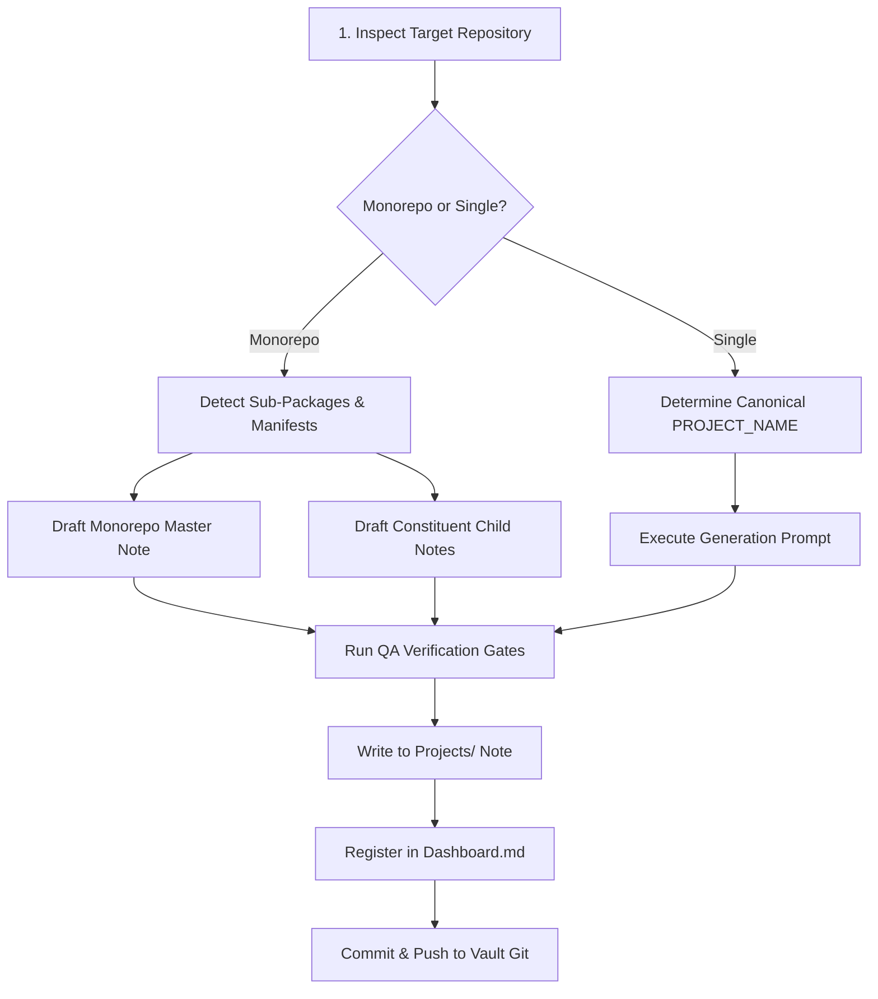

# 📘 Rule: How to Add New Codebase Memory

This rule establishes the authoritative engineering standard for analyzing, documenting, and onboarding a new software codebase or Google Apps Script satellite into the Obsidian central knowledge base.

Whenever an AI coding agent or engineer is tasked with onboarding a new repository, this procedure and prompt must be strictly adhered to.

---

## 🎯 Onboarding Workflow Overview



1. **Inspect Repository Locally / Remotely:** Review git commit logs on default branch, repository manifests (`package.json`, `pyproject.toml`, `build.gradle.kts`, `.clasp.json`, `appsscript.json`), entry points, and directory layout.
2. **Determine Canonical Name:** Follow the strict 5-level naming priority hierarchy.
3. **Monorepo Detection:** Verify whether independent sub-packages or manifests exist. If monorepo signals trigger, produce one master root note and one scoped note per constituent sub-package.
4. **Execute Memory Prompt:** Fill in the target repo URL or local path and run the generation prompt below.
5. **Quality Assurance Audit:** Verify all 19 sections are present, Section 1 has mandatory operational/architectural subheadings, commands are verified, secrets are redacted, and citations are grounded.
6. **Register & Link:** Place in `Projects/<PROJECT_NAME>.md`, add wikilink entry into `Dashboard.md` under the appropriate cluster, and commit to git.

---

## 📋 Authoritative Generation Prompt Template

Copy and execute the prompt block below. Only replace `{{REPO_URL_OR_LOCAL_PATH}}` with the target codebase URI:

```markdown
You are generating a permanent "project memory" document for my Obsidian vault, based on the codebase at:

REPO: {{REPO_URL_OR_LOCAL_PATH}}

First, determine the project's proper name yourself, in this exact order of preference, using the first one found:
1. `name` field in `package.json` (Node/React/Next, and clasp-managed GAS projects that use npm)
2. `[project] name` or `[tool.poetry] name` in `pyproject.toml`, else `name` in `setup.py`/`setup.cfg` (Python servers)
3. `rootProject.name` in `settings.gradle`/`settings.gradle.kts` (Android)
4. First H1 heading in `README.md` (covers plain Google Apps Script / Sheets-bound script projects, which usually have no manifest name field at all — `appsscript.json` doesn't carry one)
5. Repo slug from {{REPO_URL_OR_LOCAL_PATH}} (the part after the last `/`, minus `.git`)
Use this consistently as PROJECT_NAME throughout this document, including the output filename.

MONOREPO DETECTION
Check for these concrete signals, in order — if ANY are true, treat this as a monorepo and follow MONOREPO HANDLING below instead of producing a single file:
- A `workspaces` field in the root `package.json`
- A `pnpm-workspace.yaml`, `lerna.json`, `nx.json`, or `turbo.json` file at the repo root
- More than one `include ':module'` entry in `settings.gradle`/`settings.gradle.kts` pointing to genuinely separate apps (not just standard app/library split within one app)
- More than one independent manifest (`package.json`, `pyproject.toml`, `go.mod`, etc.) living in different top-level directories, each defining its own dependencies
If none of these are true, this is a single-project repo — produce exactly one file as described in OUTPUT FORMAT below.

STACK-SPECIFIC NOTES
- **Python servers**: also check `requirements.txt`/`Pipfile`/`poetry.lock` for dependency info if no `pyproject.toml` exists — don't assume Poetry/PEP 621 as the only pattern.
- **Google Apps Script / Sheets scripts**: check for `.clasp.json` (confirms it's a clasp-managed GAS project) and `appsscript.json` (the manifest — holds runtime version, OAuth scopes, and any advanced services, but no project name). If the repo is a bound script (tied to a specific Sheet/Doc/Form), note that binding and what triggers (time-based, on-edit, on-open, installable) exist — these matter more than a typical "architecture" diagram would suggest. Document key hardcoded entities (Spreadsheet IDs, Sheet Tab Names, Drive Folder IDs, Telegram Chat/Topic IDs).
- **Android**: use `build.gradle`/`build.gradle.kts` (app-level) for `applicationId`, `minSdk`/`targetSdk`, and dependencies; `AndroidManifest.xml` for permissions and components (activities, services, receivers) — permissions belong in Section 12 (Security Notes).
- **React/Next.js**: check for `next.config.js`/`next.config.ts` to confirm Next vs plain React, and note the router type (App Router vs Pages Router) in Section 2 (Tech Stack) since it changes the folder structure significantly.

MONOREPO HANDLING
If MONOREPO DETECTION above triggers, do not force this into one PROJECT_NAME or one file. Instead:
- Produce one root note covering ONLY shared/root-level concerns — shared tooling, shared config, root-level CI, repo-wide conventions — plus wikilinks out to each sub-project note. Do not duplicate any sub-project's own details (its modules, its data flow, its own config) into the root note; those live exclusively in that sub-project's own note.
- Produce one full note per sub-project (same 19 sections, scoped to that sub-project's code).
- Name each sub-project using the same PROJECT_NAME priority order above, scoped to that sub-project's own manifest. If no manifest exists for a sub-project, use its directory name instead.
- Name files `<root-name>—<sub-project-name>.md` or canonical project titles.

GOAL
Produce a granular, technically precise reference note that lets me (or any future AI agent) understand this entire project without re-reading the code. Assume the reader is technical but has zero prior context. Prioritize completeness and specificity over prose — every claim should be traceable to actual code, file names, or config, not guesses.

OUTPUT FORMAT
- Valid Obsidian markdown. One file named `<PROJECT_NAME>.md` for a single-project repo.
- YAML frontmatter at the top:
  ---
  title: <PROJECT_NAME>
  type: project
  status: <active | paused | archived>
  tags: [project, <language/stack tags>, <domain tags>]
  repo: {{REPO_URL}}
  repo-last-commit: <date of the most recent commit on the repository's default branch, not any feature/working branch>
  created: <if a previous version of this note is supplied, COPY its original `created` value unchanged — never overwrite it. Only if this is the first time this note is being generated, set it to today's date.>
  last-updated: <today's date — this is WHEN THIS GENERATION RUN happened, not a repo date>
  ---
  Status criteria (based on most recent commit date on default branch, not README claims):
  - active: last commit < 30 days ago
  - paused: last commit 30–<180 days ago
  - archived: last commit ≥180 days ago — OR archived if the repo is explicitly marked/archived on the host, regardless of commit age (host-archived status always takes precedence over the commit-age rule)
  Note: `created` and `last-updated` in the frontmatter refer to this Obsidian note's own history, never to repo dates — `repo-last-commit` is where repo recency lives.
- Use `[[wikilink]]` syntax for any concept that could plausibly be its own note.
- Use Obsidian callouts (`> [!note]`, `> [!warning]`, `> [!question]`) for caveats, risks, and open questions.
- Use Mermaid code blocks for any architecture, data-flow, or state diagrams.
- Use tables wherever comparing structured items (env vars, endpoints, modules).

REQUIRED SECTIONS (in this exact order — use these as H2 headers)

## 1. Overview
Must be structured with two mandatory H3 subheadings:
### The Operational Problem
Concise, granular description of the real-world operational, logistical, or business friction, bottleneck, or failure mode that necessitated this system.

### The Architectural Solution
Concise technical breakdown of how the software architecture, algorithms, pipelines, or integrations resolve that operational problem. No marketing fluff.

## 2. Tech Stack
Table: Layer | Technology | Version | Notes. Cover language(s), frameworks, runtime, database, hosting/deployment target, key third-party libraries.

## 3. Architecture
- High-level description of how the pieces fit together.
- A Mermaid diagram of the system (components + data flow direction).
- Note any external services/APIs it talks to and why.

## 4. Folder & File Structure
Annotated tree of the repo — not every file, but every directory and every file that matters, with a one-line purpose next to each.

## 5. Core Modules & Responsibilities
For each significant file/module/class:
### `path/to/file.ext`
- **Purpose:**
- **Key functions/classes:** name + one-line description of what each does (inputs → outputs, side effects)
- **Depends on:**
- **Depended on by:**
- **Notable logic/gotchas:** anything non-obvious, clever, fragile, or hacky

(Repeat this pattern for every module worth remembering — this is the most important section, be exhaustive here.)

## 6. Data Flow / Key Workflows
Walk through the 2–4 most important end-to-end flows in the app (e.g. "user submits form → X → Y → Z"). Use Mermaid sequence diagrams where useful. Be step-by-step and name actual functions/files at each step with specific line number references.

## 7. Configuration & Environment
- **Python/React/Next**: every environment variable / config value: name, purpose, required or optional, and an example value ONLY where one can be safely determined from `.env.example`, config defaults, or documentation — otherwise write `Unknown / not documented`. For Next.js, note which vars are prefixed `NEXT_PUBLIC_` (client-exposed) vs server-only.
- **Google Apps Script / Sheets scripts**: configuration lives in `PropertiesService` (`ScriptProperties`, `UserProperties`, or `DocumentProperties`) and script constants. List each property key and key constant (Spreadsheet IDs, Folder IDs, Telegram Chat/Topic IDs), its purpose, and which store it uses. Also document manifest fields in `appsscript.json`: `runtimeVersion`, `timeZone`, and any `enabledAdvancedServices`/`libraries`.
- **Android**: config lives in `gradle.properties`, product flavors/build variants in `build.gradle`(`.kts`), and `BuildConfig` fields — not `.env`. Note debug vs release variants and any flavor-specific values.
- Secrets management approach (without exposing actual secret values).
- Any feature flags or environment-specific behavior (dev vs prod).

## 8. External Integrations & APIs
Table: Service/API | Purpose | Auth method | Where in code it's called | Rate limits/quirks known.

## 9. Testing
- What test coverage exists (unit, integration, e2e — name the framework).
- How to run the tests locally (exact command).
- What's explicitly untested or known-fragile.
- Note: for Google Apps Script projects, `Unknown / not documented` here is common and expected.

## 10. CI/CD & Deployment
- Pipeline steps (build → test → deploy), and where they're defined (e.g. `.github/workflows/`).
- How a release actually ships — trigger, environment, manual steps if any.
- Rollback process if one exists.

## 11. Setup & Local Development
Exact steps to get this running locally from a clean machine — commands, prerequisites, common setup errors.

## 12. Security Notes
- Auth/authorization flow, where it's enforced in code.
- Any exposed endpoints or surfaces worth being careful with.
- Anything handling sensitive data (PII, tokens, payments) and how it's protected.
- **Google Apps Script**: list every scope under `oauthScopes` in `appsscript.json` — flag any overly broad scopes. Also note if `webapp.access` is set to `ANYONE` or `ANYONE_ANONYMOUS`.
- **Android**: confirm the release keystore is NOT committed in plaintext — convention is a gitignored `keystore.properties`. List permissions declared in `AndroidManifest.xml`, especially dangerous permissions (location, storage, camera).
- Use `> [!warning]` for anything genuinely risky.

## 13. Known Issues, Limitations & Tech Debt
Bullet list, each with: what's wrong, why it exists, impact, suggested fix if obvious. Use `> [!warning]` callouts for anything risky.
- **Google Apps Script projects specifically**: always include a note on the platform's hard quotas as a standing constraint (6-minute max execution time, 20 triggers/script, daily UrlFetch and trigger runtime caps).

## 14. Design Decisions & Rationale
Any decisions that are non-obvious from just reading the code — inferred from commit messages, comments, or code structure. Follow the EXPLICIT VS INFERRED rule.

## 15. Roadmap / TODOs
Pull directly from TODO comments, issues, or README roadmap sections.

## 16. Changelog
A dated log of what's changed in the project since inception or recent commits.
- **If no previous note is provided:** populate initial entries using the latest 10 meaningful commits in the repo, and add: "No prior note supplied — changelog starts here."

## 17. Glossary
Any domain-specific or project-specific terms, abbreviations, or naming conventions used in the codebase, with plain-English definitions.

## 18. Related Notes
Placeholder wikilinks for vault linking:
- [[<PROJECT_NAME> — Architecture Decisions]]
- [[<PROJECT_NAME> — Changelog]]
- Related projects in my vault (only with verified data dependencies).
- Strict Integration Verification: Never link apps based on shared infrastructure (e.g. same Telegram group or DC code). Only establish connections when a genuine upstream/downstream data flow exists.

## 19. Update Instructions (meta)
Short note-to-self on how to safely refresh this document later using [[Rules/How-to-Update-Codebase-Memory|How to Update Codebase Memory]].

RULES
- Be granular over general — if unsure whether a detail matters, include it.
- Never invent functionality that isn't in the code.
- NEVER INVENT COMMANDS: any command presented must come directly from an actual script, config, or documented instruction in the repo. If none exists, write `Unknown / not documented`.
- EXPLICIT VS INFERRED: mark clearly whenever something is inferred using *(inferred)* vs *(stated)* inline, especially in Sections 9–14.
- Keep language plain and direct, no marketing tone.
- Prioritize completeness of Sections 3, 5, and 6 above all else.
- TRACEABILITY: cite specific files and line numbers in Sections 5, 6, 13, and 14.
- SECRETS: never reproduce actual secret values. Flag committed secrets with a `> [!warning]` and recommend rotation.
- UNKNOWNS: if something cannot be determined, write exactly `Unknown / not documented`.
- Strict Integration Verification: Never link apps based on shared infrastructure (e.g. same Telegram group or DC code). Only establish connections when a genuine upstream/downstream data flow exists.
```

---

## 🛡️ Critical Quality Assurance Gates

Before committing any generated memory note into the vault, run this verification checklist:

| Check # | Verification Gate | Pass Condition |
| :---: | :--- | :--- |
| **1** | **Section 1 Standardization** | Must contain both `### The Operational Problem` and `### The Architectural Solution` subheadings. |
| **2** | **Structure Integrity** | All 19 H2 headers exist in the exact required sequence (no missing sections). |
| **3** | **Status & Date Accuracy** | `repo-last-commit` reflects the default branch; `status` correctly set based on commit recency; `created` is today's date. |
| **4** | **No Invented Commands** | All build, dev, and test commands are verified in repo manifests (`package.json`, Gradle, Makefile). Otherwise `Unknown / not documented`. |
| **5** | **Zero Secret Exposure** | Passwords, tokens, credentials, and keystore passwords replaced with `[REDACTED_SECRET]` accompanied by a warning callout. |
| **6** | **Traceability & Grounding** | Modules in Section 5 and workflows in Section 6 include real filenames and line references. |
| **7** | **Vault & Dashboard Registration** | Note saved to `Projects/<PROJECT_NAME>.md` and linked in `Dashboard.md` under its operational cluster. |
| **8** | **Strict Integration Verification** | Section 18 wikilinks strictly reflect verified upstream/downstream data flows; never link apps based on shared infrastructure (e.g. same Telegram group or DC code). |
