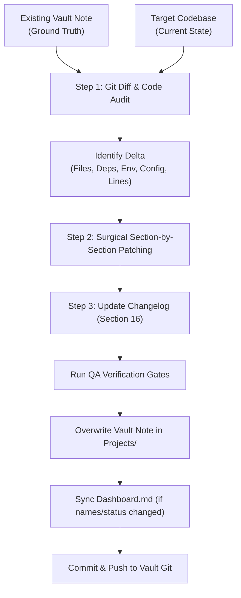

# 📘 Rule: How to Update Codebase Memory

This rule governs the incremental maintenance and patching of existing project memory documents within the Obsidian central knowledge base.

Memory documents accumulate historical context over time and are **never disposable**. When a codebase is refactored, updated with new features, or patched, agents and engineers must perform surgical, incremental updates rather than rewriting notes from scratch.

---

## 🎯 Incremental Update Workflow Overview



1. **Retrieve Current Memory Note:** Locate the note in `Projects/<PROJECT_NAME>.md` and pass its entire content as ground truth.
2. **Inspect Codebase Delta:** Run git diff/log from the note's `last-updated` timestamp to the latest default branch commit.
3. **Apply Incremental Rules:** Patch only the affected sections (Sections 1–15). Never modify untouched modules.
4. **Recalibrate Line Citations:** Update line citations where insertions or deletions shifted function locations.
5. **Append Changelog Entry:** Add a dated entry to Section 16 detailing exact files modified, added, or removed, and noting any resolved issues.
6. **Audit & Push:** Execute QA verification and push to vault repository.

---

## 📋 Authoritative Update Prompt Template

Copy and execute the prompt block below. Provide `{{REPO_URL_OR_PATH}}`, paste the current note content into `{{EXISTING_NOTE}}`, and optionally provide `{{CHANGE_SUMMARY}}`:

```markdown
You are updating an existing "project memory" document for my Obsidian vault. This is an INCREMENTAL UPDATE, not a regeneration — do not rewrite sections that haven't changed.

REPO: {{REPO_URL_OR_PATH}}

EXISTING NOTE (current state of the memory file — treat as ground truth for anything not contradicted by the current code):
{{EXISTING_NOTE}}

WHAT CHANGED (optional — if left blank, determine this yourself from commit history since the note's `last-updated` date, or by diffing the repo against what the note describes):
{{CHANGE_SUMMARY}}

GOAL
Bring the note up to date with the current state of the code, with minimum disruption to sections that are still accurate. This document accumulates over time — it is not disposable.

STEP 1 — FIGURE OUT WHAT ACTUALLY CHANGED
- Compare the existing note's content against the current repo.
- Prefer git log/diff since the note's `last-updated` date if commit history is available.
- Produce an internal list of: new files, deleted files, modified files, new dependencies, removed dependencies, new env vars, new endpoints/integrations, and anything in the old note that the current code now contradicts.
- If you cannot determine what changed with confidence, say so in the Changelog entry rather than guessing.

STEP 2 — UPDATE ONLY WHAT'S AFFECTED
Go section by section. For each, only touch it if Step 1 found something relevant to it:

- **Frontmatter**: always update `last-updated` (today) and `repo-last-commit` (from the current default branch's most recent commit). NEVER change `created` — copy it forward exactly as it appears in the existing note. Re-evaluate `status` against the same criteria as before (active: <30 days, paused: 30–<180 days, archived: ≥180 days — OR host-archived regardless of commit age, which always takes precedence). Update `tags` only if the stack changed.
- **Overview (Section 1)**: update only if the core purpose of the project fundamentally shifted. Always strictly preserve the standardized **`### The Operational Problem`** and **`### The Architectural Solution`** subheadings and format.
- **Tech Stack (Section 2)**: update only rows for dependencies that were added/removed/bumped a major version.
- **Architecture (Section 3)**: update only if the component structure or data-flow direction actually changed. Leave the diagram alone otherwise.
- **Folder & File Structure (Section 4)**: add/remove lines for files that were added/deleted. Don't reformat the whole tree.
- **Core Modules & Responsibilities (Section 5)**: add new subsections for new files, update the specific bullet points for modified files, remove subsections for deleted files. If a file was renamed or moved (not deleted — check for renamed content, not just a new file with old content gone), update its existing subsection's path in place rather than treating it as delete+add. Recalibrate line citations (e.g. `file.js:L10-25`) when line numbers shift due to code edits. Leave untouched modules exactly as they are.
- **Data Flow / Key Workflows (Section 6)**: update only the specific workflow(s) that changed. Recalibrate any shifted line references.
- **Configuration & Environment (Section 7)**: add new env vars/properties/gradle values, remove ones no longer referenced, leave the rest. For Google Apps Script projects, this means `PropertiesService` keys and hardcoded constants (Spreadsheet IDs, Sheet Tab Names, Drive Folder IDs, Telegram Chat IDs, and Topic IDs), not `.env` vars; for Android, `gradle.properties`/`BuildConfig`/flavors — match whatever convention the existing note already uses for this project's stack.
- **External Integrations & APIs (Section 8)**: add/remove/update only affected rows.
- **Testing (Section 9)**: update only if test setup or coverage changed. (For GAS: `Unknown / not documented` staying unchanged here is normal, not a sign something was missed.)
- **CI/CD & Deployment (Section 10)**: update only if the pipeline changed.
- **Setup & Local Development (Section 11)**: update only if setup steps changed.
- **Security Notes (Section 12)**: add new items if new attack surface/sensitive data handling was introduced — including newly added `oauthScopes` in `appsscript.json` for GAS projects, or a keystore/signing config change for Android; never delete an existing warning unless the code shows it's actually been fixed (and if so, move it to the Changelog as resolved, don't just delete it silently).
- **Known Issues, Limitations & Tech Debt (Section 13)**: add newly discovered issues. If an issue from before is now fixed, move it out of this section and note it as resolved in the Changelog — don't just silently delete it.
- **Design Decisions & Rationale (Section 14)**: only ADD new entries for new decisions. Never edit or remove existing entries — if I wrote reasoning here myself, it stays, even if it looks outdated to you. If the code has clearly moved past an old decision, add a note below it ("Superseded — see [new entry]") rather than deleting it.
- **Roadmap / TODOs (Section 15)**: mark completed items as done (strike-through or move to Changelog), add newly found TODOs.
- **Changelog (Section 16)**: always add a new dated entry summarizing this update — what changed, files affected, and anything resolved/superseded elsewhere in the doc. Historical entries already in the Changelog are immutable — never edit, reword, or remove a past entry, even if later context makes it look incomplete or wrong. Add a new entry to correct the record instead.
- **Glossary (Section 17)**: add new terms only.
- **Related Notes (Section 18)**: Audit all existing cross-project wikilinks against the Strict Graph Node Connection Law. If the note contains hallucinated or unverified links (e.g., linking apps due to shared Telegram groups, shared Google Sheets, shared hub codes like MRZ, or high-level logistics domains), **aggressively prune and decouple them**. Standalone satellites must link strictly to `[[Dashboard]]` and relevant `[[Rules/...]]` notes. Any decoupled edge must be recorded in Section 16 (Changelog) as an architectural clarification.
- **Update Instructions (Section 19)**: leave untouched unless the update process itself needs to change.

STEP 3 — OUTPUT
Return the FULL updated note (not just a diff), ready to overwrite the old file, named `<PROJECT_NAME>.md` — but built by patching the existing note in place per Step 2, not rewritten from zero.

RULES (same as generation prompt — still apply)
- TRACEABILITY: every changed or newly-added factual statement should remain traceable to the current codebase — reference the specific file/path, especially in Sections 5, 6, 13, and 14.
- SECRETS: never reproduce actual secret values, even ones newly committed. Flag their existence/location as a `> [!warning]` in Security Notes and recommend rotation.
- UNKNOWNS: if something can't be determined, write exactly `Unknown / not documented` rather than guessing.
- Never delete manually-reasoned content (Design Decisions, Related Notes) — supersede or append instead.
- Be granular over general in anything you do add.
- NO COSMETIC EDITS: do not reword, reformat, or restructure a section just because you'd phrase it differently — only touch content whose underlying facts have actually changed. Stability across updates matters more than tidiness.
- WIKILINKS: preserve existing `[[wikilink]]` connections to sibling vault notes; never silently strip them.
- MONOREPO SUB-PROJECT BOUNDARY: if updating a monorepo sub-project note (`<root-name>—<sub-project-name>.md`), scope changes strictly to that sub-project's directory and do not duplicate shared root concerns or sibling details.
- CROSS-SECTION PROPAGATION: if a single code change affects multiple sections (e.g. a new dependency that also changes Setup steps, or a workflow change that also touches Security), update every affected section, not just the one closest to the file that changed.
- NO STALE HISTORY IN 2–15: Sections 2 through 15 describe the CURRENT state of the project only — they should never accumulate old implementation details that no longer apply. History belongs exclusively in Section 16 (Changelog); if something changed, remove the old description from its section and let the Changelog record what it used to be.
- Strict Graph Node Connection Law:
  - Prune any cross-project wikilinks based on shared hub codes (`MRZ`), shared Telegram channels/topics, shared platforms (GAS/Sheets), or general logistics domains.
  - Retain or establish cross-project links IF AND ONLY IF there is verified programmatic coupling (direct API calls, package imports, engineered producer-consumer pipelines, or hardware bridge pairs).
  - Never allow casual inline `[[wikilinks]]` in body sections (Sections 1–17); convert any found to plaintext.
```

---

## 🕸️ The Strict Graph Node Connection Law for Incremental Audits

During every incremental update, agents must audit Section 18 and body text to ensure graph hygiene:
1. **Audit Existing Edges:** Check every `[[Project]]` link in Section 18. Does this project actually call or import code from that project? If not, DELETE the link immediately.
2. **Eliminate False Affinity:** Decouple systems that were erroneously connected due to sharing the same Telegram Supergroup, Google Sheet tab, or facility code.
3. **Enforce Plaintext for Casual Mentions:** If another application or script is mentioned in Sections 1–17, format it as `code` or plain text, NEVER as a `[[wikilink]]`.
4. **Log Pruning in Changelog:** Document any removed graph edges in Section 16 (e.g., `Decoupled spurious wikilink to [[OtherProject]] — confirmed standalone satellite with zero API/data dependency`).

---

## 🛡️ Critical Quality Assurance Gates for Updates

Before saving and committing an updated memory note, verify these strict criteria:

| Gate | Check | Failure Condition |
| :---: | :--- | :--- |
| **1** | **Section 1 Structure** | Any removal or alteration of `### The Operational Problem` or `### The Architectural Solution`. |
| **2** | **Created Date Immutability** | Frontmatter `created` timestamp was modified (must strictly match original note). |
| **3** | **No Stale History in Body** | Past implementations or retired logic retained in Sections 2–15 instead of being moved to Section 16 (Changelog). |
| **4** | **Changelog Immutability** | Historical entries in Section 16 edited or deleted; new update must be appended as a new dated entry. |
| **5** | **Line Citation Freshness** | Outdated line numbers preserved after edits shifted the source code. |
| **6** | **Google Workspace Entities** | Changes in hardcoded Spreadsheet IDs, Folder IDs, or Telegram Topic IDs ignored. |
| **7** | **Wikilink & Graph Integrity** | Stripping or breaking existing valid `[[wikilink]]` connections to verified services or sibling projects. |
| **8** | **No Cosmetic Rewrites** | Rewriting untouched modules or descriptions without underlying factual code changes. |
| **9** | **Strict Graph Node Connection Audit** | Retaining or introducing spurious cross-project links based on shared infrastructure (Telegram, Sheets, DC code) or domain affinity; failing to prune unverified links during update; allowing casual inline `[[project]]` wikilinks in Sections 1–17. |
